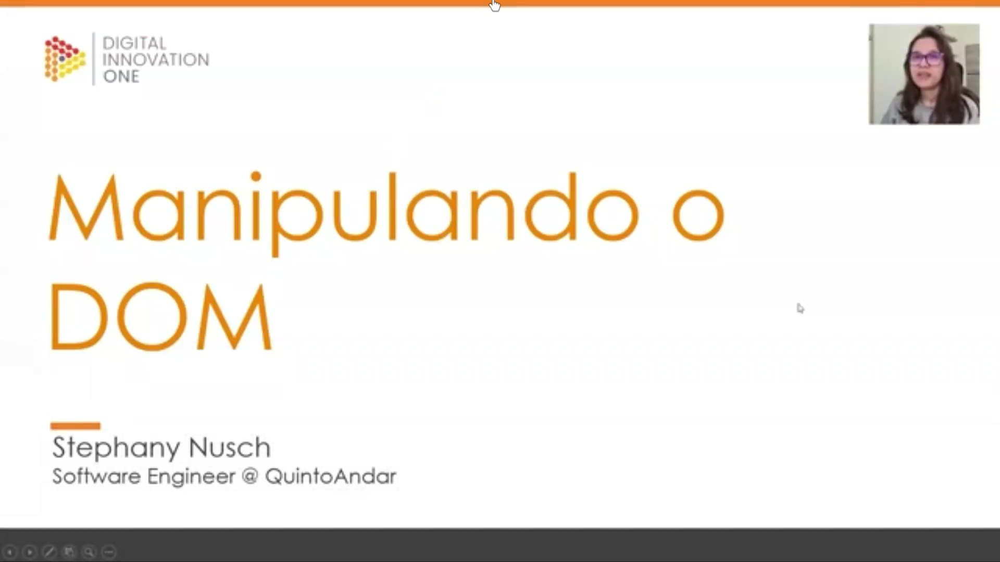
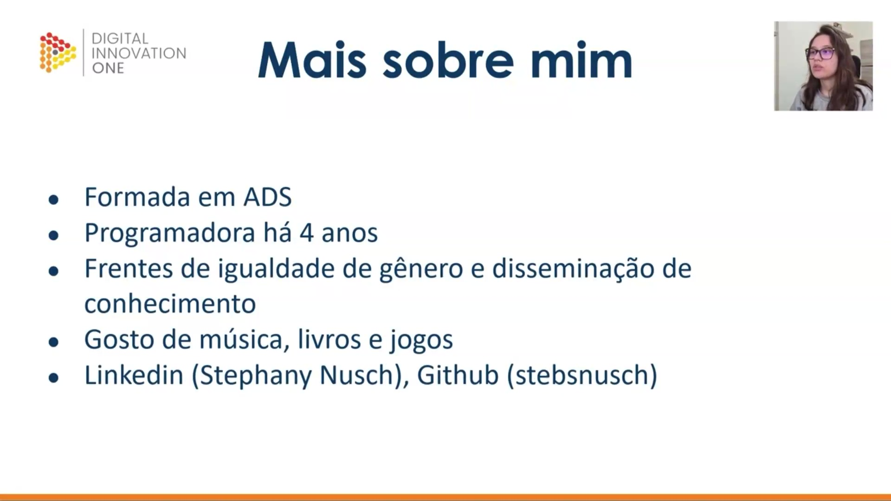
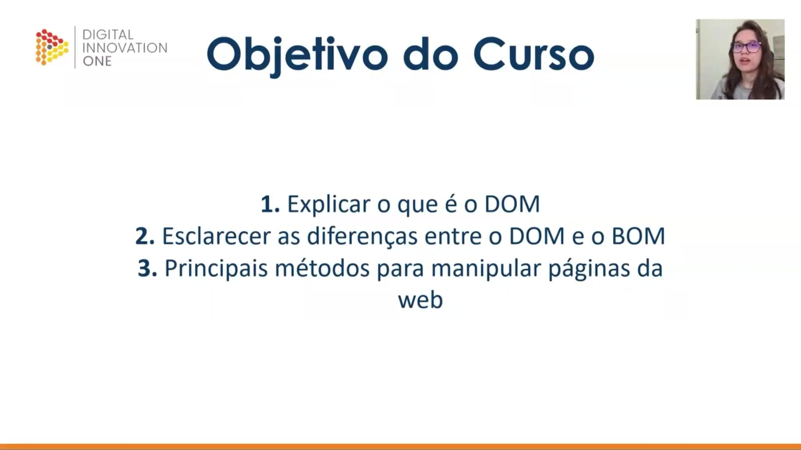
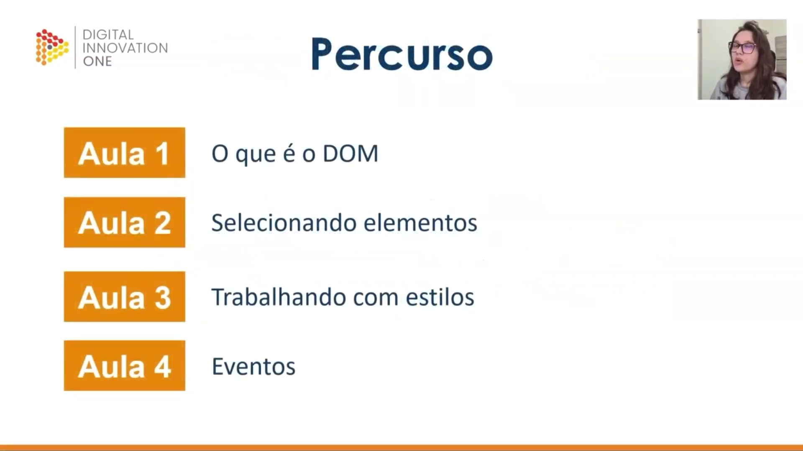
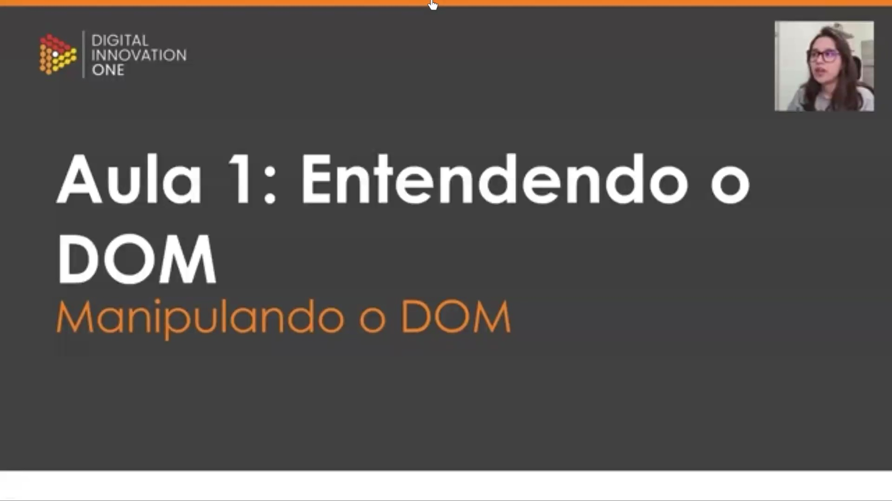
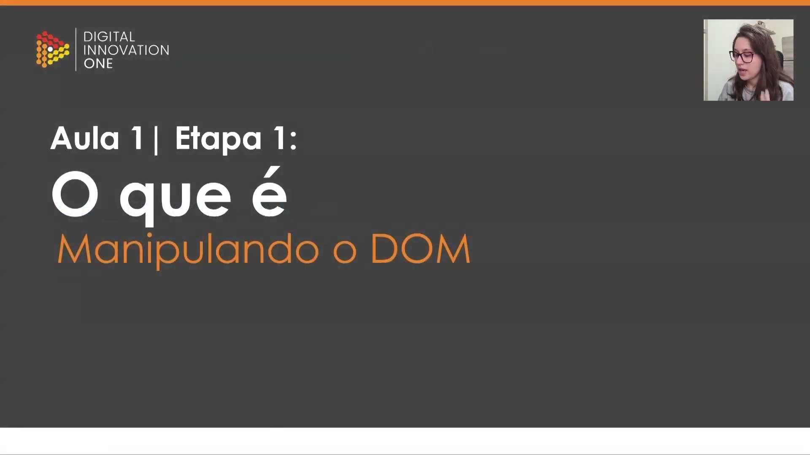
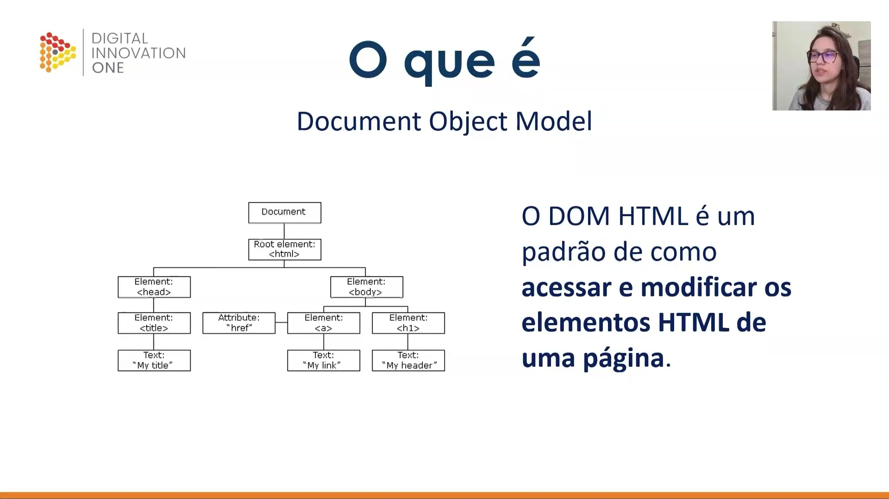
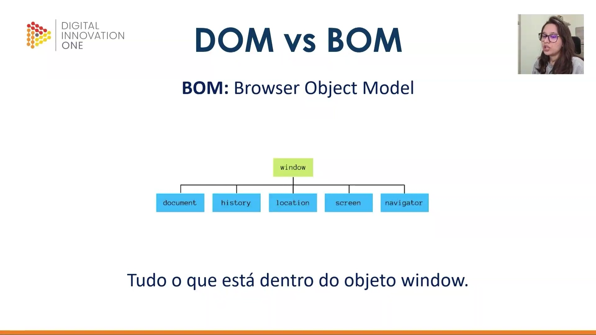

## Instrutor

- Stephany Nusch (Software Engineer at Microsoft)
- Contato Linkedin: / [stephanynusch](https://www.linkedin.com/in/stephanynusch/)
# Parte 1 - Entendendo o D.O.M.

## 🟩 Vídeo 01 - Apresentação do curso

<video width="60%" controls>
  <source src="000-Midia_e_Anexos/bootcamp_tqi_fullstack-modulo_03-Curso.10-Video_01.webm" type="video/webm">
    Seu navegador não suporta vídeo HTML5.
</video>

Link do vídeo: https://web.dio.me/track/tqi-fullstack-developer/course/manipulando-dom-com-javascript/learning/71efe9d7-2b50-42b4-b501-4503750c3701?autoplay=1 

Este vídeo introduz um curso do **Basicamp** focado na **manipulação do DOM** utilizando a linguagem **JavaScript**. A instrutora **Stephanie**, uma engenheira de software experiente, apresenta sua trajetória profissional e pessoal antes de detalhar o cronograma educacional. O treinamento está estruturado em **quatro aulas teóricas** e uma **atividade prática**, abordando desde conceitos básicos até o controle de estilos e eventos em páginas web. Os alunos aprenderão a distinguir diferentes interfaces de programação e utilizarão o **GitHub** para realizar os exercícios propostos. Além disso, a mentora incentiva a interação constante através de **fóruns e comunidades online** para solucionar eventuais dúvidas durante o aprendizado.

### Anotações

Nesta introdução ao curso de JavaScript do Basicamp, a instrutora Stephanie Nusch, engenheira de software no QuintoAndar, apresenta o tema central das aulas: a **manipulação do DOM** (Document Object Model). O objetivo é capacitar o aluno a entender como interagir e modificar elementos de uma página web de forma dinâmica.

A instrutora compartilha sua trajetória profissional e pessoal para estabelecer proximidade com os alunos:

* **Formação:** Graduada em Análise e Desenvolvimento de Sistemas (ADS).
* **Experiência:** Atua como programadora há 4 anos.
* **Engajamento:** Participa ativamente em frentes de igualdade de gênero e disseminação de conhecimento.
* **Interesses:** Música, livros e jogos.
* **Contatos:** Pode ser encontrada no LinkedIn como Stephanie N. e no GitHub pelo usuário `stebsnusch` (ou STBS NH), plataforma que será essencial para o desenvolvimento das atividades práticas do curso.

O curso está estruturado em três pilares principais de aprendizado:

1. **Definição do DOM:** Compreender o que é e como funciona o Document Object Model.
2. **Diferenciação Teórica:** Esclarecer as distinções entre o **DOM** e o **BOM** (Browser Object Model), evitando confusões comuns entre as siglas.
3. **Prática de Manipulação:** Apresentar e aplicar os métodos fundamentais para selecionar e alterar elementos em páginas web.

O percurso de aprendizado é dividido em quatro aulas teóricas seguidas de um projeto prático:

* **Aula 1:** Introdução aos conceitos do DOM.
* **Aula 2:** Técnicas para a seleção de elementos na página.
* **Aula 3:** Manipulação de estilos e aparência dos elementos.
* **Aula 4:** Entendimento e acionamento de eventos para criar interatividade.

Ao final, os alunos aplicarão todo o conhecimento em uma atividade prática consolidando os conceitos estudados.

## 🟩 Vídeo 02 - O que é D.O.M. e D.O.M vs B.O.M.

<video width="60%" controls>
  <source src="000-Midia_e_Anexos/bootcamp_tqi_fullstack-modulo_03-Curso.10-Video_02.webm" type="video/webm">
    Seu navegador não suporta vídeo HTML5.
</video>

Link do vídeo: https://web.dio.me/track/tqi-fullstack-developer/course/manipulando-dom-com-javascript/learning/49b414cb-e544-4c5b-bb9b-d0c51fe8356d?autoplay=1

Esta aula introdutória explica os conceitos fundamentais de **DOM (Document Object Model)** e **BOM (Browser Object Model)** no contexto do desenvolvimento web. O instrutor define o **DOM** como uma **hierarquia de objetos** que representa os elementos HTML de uma página, estruturados em uma **árvore de nós** para facilitar o acesso e a modificação. Em contraste, o **BOM** é apresentado como um nível superior que engloba a **janela do navegador** e suas funcionalidades, como histórico e localização. O conteúdo enfatiza que o **documento** é apenas um componente dentro do objeto global **Window**, sendo o foco principal do curso a manipulação direta do HTML. Ao diferenciar essas siglas, o material busca fornecer uma base teórica sólida antes de avançar para a prática de **programação e controle de interface**.

### Anotações

#### Entendendo o DOM

Nesta aula introdutória, o foco é compreender o conceito de **DOM** e suas aplicações práticas no desenvolvimento web. O objetivo principal é definir o que essa sigla representa e estabelecer as distinções fundamentais entre o DOM e o BOM (Browser Object Model), preparando o terreno para a manipulação de elementos em páginas web.

#### O que é Manipular o DOM

A sigla **DOM** significa **Document Object Model**. Ele funciona como um padrão essencial que define como desenvolvedores podem acessar e modificar os elementos HTML de uma página. Todos os navegadores modernos implementam esse modelo, permitindo que o conteúdo estrutural de um site seja manipulado de forma dinâmica.

#### A Estrutura de Árvore do DOM

O DOM organiza o conteúdo de uma página em uma **árvore de hierarquia** composta por **nós**. Cada elemento, atributo ou texto do HTML representa um nó nesta estrutura:

* **Documento**: O nível superior que contém todo o conteúdo.
* **Elemento Raiz (`<html>`)**: O nó pai principal de todos os outros elementos.
* **Elementos Filhos**: Tags como `<head>` e `<body>` derivam da raiz.
* **Hierarquia e Relações**: Elementos no mesmo nível, como um link (`<a>`) e um título (`<h1>`) dentro do corpo da página, são considerados **irmãos**.
* **Atributos e Textos**: Informações como o `href` de um link ou o conteúdo textual de um cabeçalho também são representados como nós específicos dentro dessa árvore.

#### DOM vs BOM

Para compreender o ecossistema do navegador, é preciso diferenciar o **DOM** (Document Object Model) do **BOM** (Browser Object Model):

* **Window (Janela)**: É o objeto "mãe" de tudo no navegador. Sempre que uma aba é aberta, o objeto `window` é criado.
* **BOM**: Representa a árvore de dependências da janela do navegador. Ele engloba funcionalidades que vão além do conteúdo da página, como o histórico de navegação (`history`), a localização da URL (`location`), as propriedades da tela (`screen`) e informações do navegador (`navigator`).
* **O DOM como Filho**: O `document` (DOM) é, na verdade, um dos filhos do objeto `window`. Enquanto o DOM foca estritamente na estrutura e manipulação do HTML, o BOM gerencia o contexto mais amplo da janela do navegador.      

# Parte 2 - Selecionando elementos

## 🟩 Vídeo 01 - xxxxxxxxxxxxxxx

Link do vídeo:  

## 🟩 Vídeo 02 - xxxxxxxxxxxxxxx

Link do vídeo: 

## 🟩 Vídeo 03 - xxxxxxxxxxxxxxx

Link do vídeo: 

## 🟩 Vídeo 04 - xxxxxxxxxxxxxxx

Link do vídeo: 

## 🟩 Vídeo 05 - xxxxxxxxxxxxxxx

Link do vídeo: 

## 🟩 Vídeo 06 - xxxxxxxxxxxxxxx

Link do vídeo: 

## 🟩 Vídeo 07 - xxxxxxxxxxxxxxx

Link do vídeo: 

## 🟩 Vídeo 08 - xxxxxxxxxxxxxxx

Link do vídeo: 

## 🟩 Vídeo 09 - xxxxxxxxxxxxxxx

Link do vídeo: 

## 🟩 Vídeo 10 - xxxxxxxxxxxxxxx

Link do vídeo: 

# Parte 3 - xxxxxxxxxxxxxxx

## 🟩 Vídeo 01 - Exxxxxxxxxxxxxxx

Link do vídeo:  

## 🟩 Vídeo 02 - xxxxxxxxxxxxxxx

Link do vídeo: 

## 🟩 Vídeo 03 - xxxxxxxxxxxxxxx

Link do vídeo: 

## 🟩 Vídeo 04 - xxxxxxxxxxxxxxx

Link do vídeo: 

## 🟩 Vídeo 05 - xxxxxxxxxxxxxxx

Link do vídeo: 

## 🟩 Vídeo 06 - xxxxxxxxxxxxxxx

Link do vídeo: 

## 🟩 Vídeo 07 - xxxxxxxxxxxxxxx

Link do vídeo: 

## 🟩 Vídeo 08 - xxxxxxxxxxxxxxx

Link do vídeo: 

## 🟩 Vídeo 09 - xxxxxxxxxxxxxxx

Link do vídeo: 

## 🟩 Vídeo 10 - xxxxxxxxxxxxxxx

Link do vídeo: 

##  Materiais de Apoio

# Certificado: 

- Link na plataforma: 
- Certificado em pdf: 
