## Instrutor

- Stephany Nusch (Software Engineer at Microsoft)
- Contato Linkedin: / [stephanynusch](https://www.linkedin.com/in/stephanynusch/)
# Parte 1 - Entendendo o D.O.M.

## 🟩 Vídeo 01 - Apresentação do curso

<video width="60%" controls>
  <source src="000-Midia_e_Anexos/bootcamp_tqi_fullstack-modulo_03-Curso.10-Video_01.webm" type="video/webm">
    Seu navegador não suporta vídeo HTML5.
</video>

Link do vídeo: https://web.dio.me/track/tqi-fullstack-developer/course/manipulando-dom-com-javascript/learning/71efe9d7-2b50-42b4-b501-4503750c3701?autoplay=1 

Este vídeo introduz um curso do **Basicamp** focado na **manipulação do DOM** utilizando a linguagem **JavaScript**. A instrutora **Stephanie**, uma engenheira de software experiente, apresenta sua trajetória profissional e pessoal antes de detalhar o cronograma educacional. O treinamento está estruturado em **quatro aulas teóricas** e uma **atividade prática**, abordando desde conceitos básicos até o controle de estilos e eventos em páginas web. Os alunos aprenderão a distinguir diferentes interfaces de programação e utilizarão o **GitHub** para realizar os exercícios propostos. Além disso, a mentora incentiva a interação constante através de **fóruns e comunidades online** para solucionar eventuais dúvidas durante o aprendizado.

### Anotações

<p align="center">

</p>

Nesta introdução ao curso de JavaScript do Basicamp, a instrutora Stephanie Nusch, engenheira de software no QuintoAndar, apresenta o tema central das aulas: a **manipulação do DOM** (Document Object Model). O objetivo é capacitar o aluno a entender como interagir e modificar elementos de uma página web de forma dinâmica.

<p align="center">

</p>

A instrutora compartilha sua trajetória profissional e pessoal para estabelecer proximidade com os alunos:

* **Formação:** Graduada em Análise e Desenvolvimento de Sistemas (ADS).
* **Experiência:** Atua como programadora há 4 anos.
* **Engajamento:** Participa ativamente em frentes de igualdade de gênero e disseminação de conhecimento.
* **Interesses:** Música, livros e jogos.
* **Contatos:** Pode ser encontrada no LinkedIn como Stephanie N. e no GitHub pelo usuário `stebsnusch` (ou STBS NH), plataforma que será essencial para o desenvolvimento das atividades práticas do curso.

<p align="center">

</p>

O curso está estruturado em três pilares principais de aprendizado:

1. **Definição do DOM:** Compreender o que é e como funciona o Document Object Model.
2. **Diferenciação Teórica:** Esclarecer as distinções entre o **DOM** e o **BOM** (Browser Object Model), evitando confusões comuns entre as siglas.
3. **Prática de Manipulação:** Apresentar e aplicar os métodos fundamentais para selecionar e alterar elementos em páginas web.

<p align="center">

</p>

O percurso de aprendizado é dividido em quatro aulas teóricas seguidas de um projeto prático:

* **Aula 1:** Introdução aos conceitos do DOM.
* **Aula 2:** Técnicas para a seleção de elementos na página.
* **Aula 3:** Manipulação de estilos e aparência dos elementos.
* **Aula 4:** Entendimento e acionamento de eventos para criar interatividade.

Ao final, os alunos aplicarão todo o conhecimento em uma atividade prática consolidando os conceitos estudados.


## 🟩 Vídeo 02 - O que é D.O.M. e D.O.M vs B.O.M.

<video width="60%" controls>
  <source src="000-Midia_e_Anexos/bootcamp_tqi_fullstack-modulo_03-Curso.10-Video_02.webm" type="video/webm">
    Seu navegador não suporta vídeo HTML5.
</video>

Link do vídeo: https://web.dio.me/track/tqi-fullstack-developer/course/manipulando-dom-com-javascript/learning/49b414cb-e544-4c5b-bb9b-d0c51fe8356d?autoplay=1

Esta aula introdutória explica os conceitos fundamentais de **DOM (Document Object Model)** e **BOM (Browser Object Model)** no contexto do desenvolvimento web. O instrutor define o **DOM** como uma **hierarquia de objetos** que representa os elementos HTML de uma página, estruturados em uma **árvore de nós** para facilitar o acesso e a modificação. Em contraste, o **BOM** é apresentado como um nível superior que engloba a **janela do navegador** e suas funcionalidades, como histórico e localização. O conteúdo enfatiza que o **documento** é apenas um componente dentro do objeto global **Window**, sendo o foco principal do curso a manipulação direta do HTML. Ao diferenciar essas siglas, o material busca fornecer uma base teórica sólida antes de avançar para a prática de **programação e controle de interface**.

### Anotações

#### Entendendo o DOM

<p align="center">

</p>

Nesta aula introdutória, o foco é compreender o conceito de **DOM** e suas aplicações práticas no desenvolvimento web. O objetivo principal é definir o que essa sigla representa e estabelecer as distinções fundamentais entre o DOM e o BOM (Browser Object Model), preparando o terreno para a manipulação de elementos em páginas web.

#### O que é Manipular o DOM

<p align="center">

</p>

A sigla **DOM** significa **Document Object Model**. Ele funciona como um padrão essencial que define como desenvolvedores podem acessar e modificar os elementos HTML de uma página. Todos os navegadores modernos implementam esse modelo, permitindo que o conteúdo estrutural de um site seja manipulado de forma dinâmica.

#### A Estrutura de Árvore do DOM

<p align="center">

</p>

O DOM organiza o conteúdo de uma página em uma **árvore de hierarquia** composta por **nós**. Cada elemento, atributo ou texto do HTML representa um nó nesta estrutura:

* **Documento**: O nível superior que contém todo o conteúdo.
* **Elemento Raiz (`<html>`)**: O nó pai principal de todos os outros elementos.
* **Elementos Filhos**: Tags como `<head>` e `<body>` derivam da raiz.
* **Hierarquia e Relações**: Elementos no mesmo nível, como um link (`<a>`) e um título (`<h1>`) dentro do corpo da página, são considerados **irmãos**.
* **Atributos e Textos**: Informações como o `href` de um link ou o conteúdo textual de um cabeçalho também são representados como nós específicos dentro dessa árvore.

#### DOM vs BOM

<p align="center">

</p>

Para compreender o ecossistema do navegador, é preciso diferenciar o **DOM** (Document Object Model) do **BOM** (Browser Object Model):

* **Window (Janela)**: É o objeto "mãe" de tudo no navegador. Sempre que uma aba é aberta, o objeto `window` é criado.
* **BOM**: Representa a árvore de dependências da janela do navegador. Ele engloba funcionalidades que vão além do conteúdo da página, como o histórico de navegação (`history`), a localização da URL (`location`), as propriedades da tela (`screen`) e informações do navegador (`navigator`).
* **O DOM como Filho**: O `document` (DOM) é, na verdade, um dos filhos do objeto `window`. Enquanto o DOM foca estritamente na estrutura e manipulação do HTML, o BOM gerencia o contexto mais amplo da janela do navegador.      


# Parte 2 - Selecionando elementos

## 🟩 Vídeo 03 - Métodos

<video width="60%" controls>
  <source src="000-Midia_e_Anexos/bootcamp_tqi_fullstack-modulo_03-Curso.10-Video_03.webm" type="video/webm">
    Seu navegador não suporta vídeo HTML5.
</video>

Link do vídeo: https://web.dio.me/track/tqi-fullstack-developer/course/manipulando-dom-com-javascript/learning/82c628cf-1551-4d21-8a63-352fd45814d9?autoplay=1

O vídeo explica como realizar a **manipulação de elementos** em uma página web utilizando **JavaScript** e a estrutura do **DOM**. O conteúdo detalha a organização básica de um arquivo **HTML**, diferenciando o uso de **IDs exclusivos** e **classes compartilhadas** para identificar componentes. São apresentados diversos métodos de busca, como a seleção por **ID, tag ou classe**, destacando que buscas múltiplas resultam em estruturas do tipo **array**. Além da localização, o texto ensina funções essenciais para **criar, remover e substituir** elementos dinamicamente na interface. Por fim, o autor incentiva a prática dessas ferramentas para a construção de **projetos interativos** e personalizados.

### Anotações

<p align="center">

</p>

Nesta aula, o foco é o aprendizado sobre a **manipulação de elementos** dentro do **Document Object Model (DOM)**. O objetivo principal é compreender a estrutura fundamental de uma página HTML e aprender a utilizar métodos específicos que permitem interagir com esses elementos de forma dinâmica.

<p align="center">

</p>

A manipulação do DOM começa pelo entendimento dos **Métodos de Seleção**. Existem diferentes formas de realizar buscas no documento HTML para encontrar o elemento que se deseja modificar, variando conforme a necessidade de precisão ou abrangência da busca.

<p align="center">
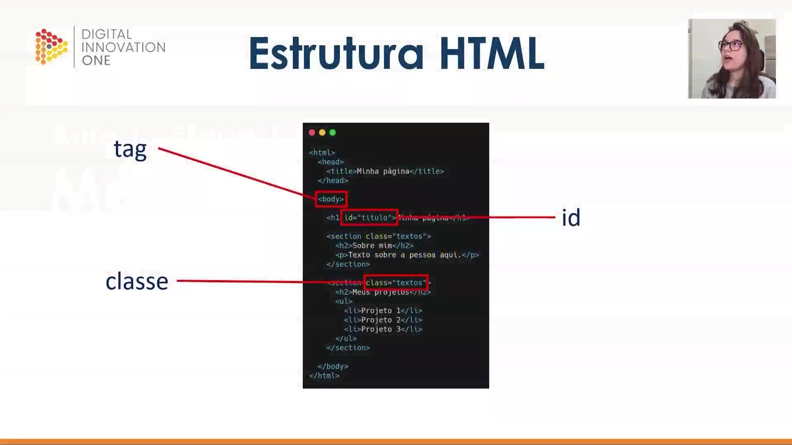
</p>

Para selecionar elementos corretamente, é preciso entender a **Estrutura HTML** básica:

* **Tags:** Representam o corpo e o tipo do elemento (ex: `<body>`, `<h1>`, `<section>`, `<p>`, `<ul>`, `<li>`).
* **ID:** É um **identificador único**. Cada elemento deve ter um ID exclusivo para evitar conflitos na manipulação.
* **Classe:** Utilizada quando se deseja agrupar vários elementos sob um mesmo identificador, permitindo aplicar o mesmo estilo ou comportamento a múltiplos itens simultaneamente.

<p align="center">
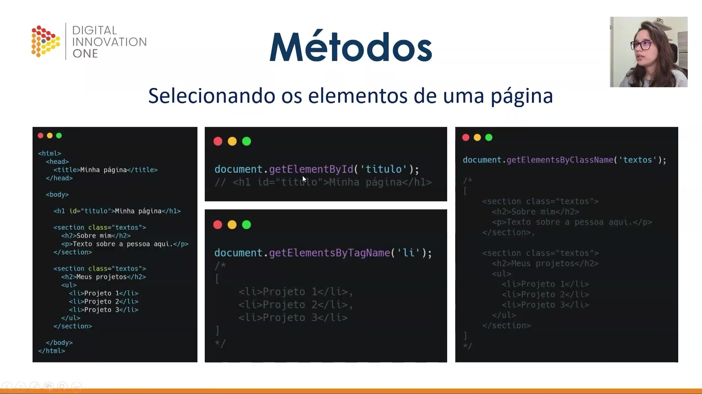
</p>

Existem métodos específicos para selecionar elementos baseados em seus atributos:

* **`document.getElementById('id')`**: Retorna um **único elemento** correspondente ao ID informado.
* **`document.getElementsByTagName('tag')`**: Retorna um **array** (HTMLCollection) com todas as ocorrências daquela tag na página. Para acessar um item específico, deve-se usar o índice (ex: `[0]`).
* **`document.getElementsByClassName('classe')`**: Retorna um **array** com todos os elementos que possuem a classe especificada.

```javascript
document.getElementById('titulo');
// Retorna: <h1 id="titulo">Minha página</h1>

document.getElementsByTagName('li');
// Retorna um array: [<li>Projeto 1</li>, <li>Projeto 2</li>, <li>Projeto 3</li>]

document.getElementsByClassName('textos');
// Retorna um array com as seções que possuem a classe 'textos'

```

<p align="center">
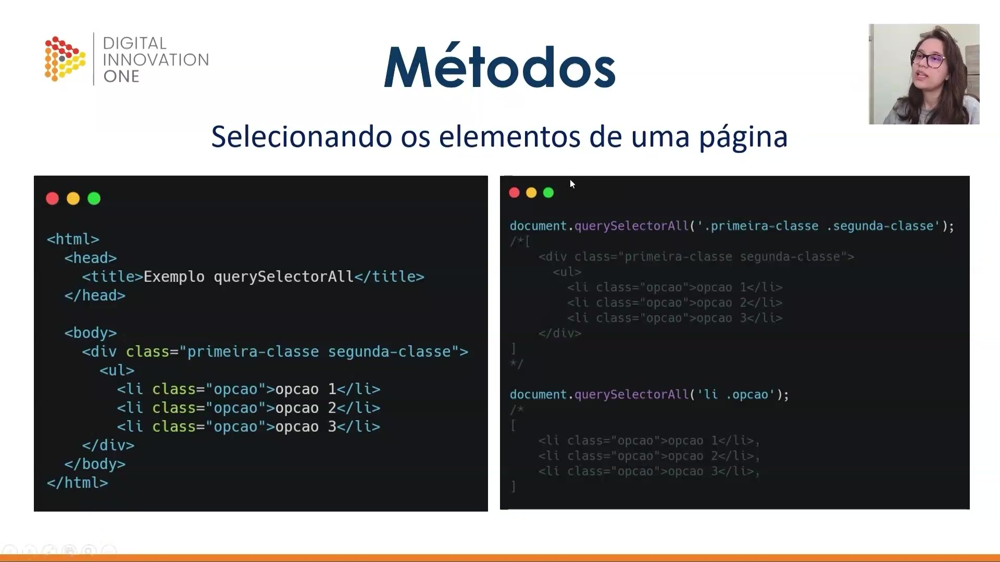
</p>

O método **`querySelectorAll`** permite realizar buscas mais personalizadas e complexas, combinando seletores de forma similar ao CSS. Ele sempre retorna um array (NodeList).

* **Classes:** Identificadas pelo ponto (`.`).
* **IDs:** Identificados pelo símbolo de cerquilha (`#`).
* **Combinações:** É possível buscar, por exemplo, um `li` que contenha uma classe específica.

```javascript
// Selecionando por múltiplas classes
document.querySelectorAll('.primeira-classe.segunda-classe');

// Selecionando combinando tag e classe
document.querySelectorAll('li.opcao');

```

<p align="center">
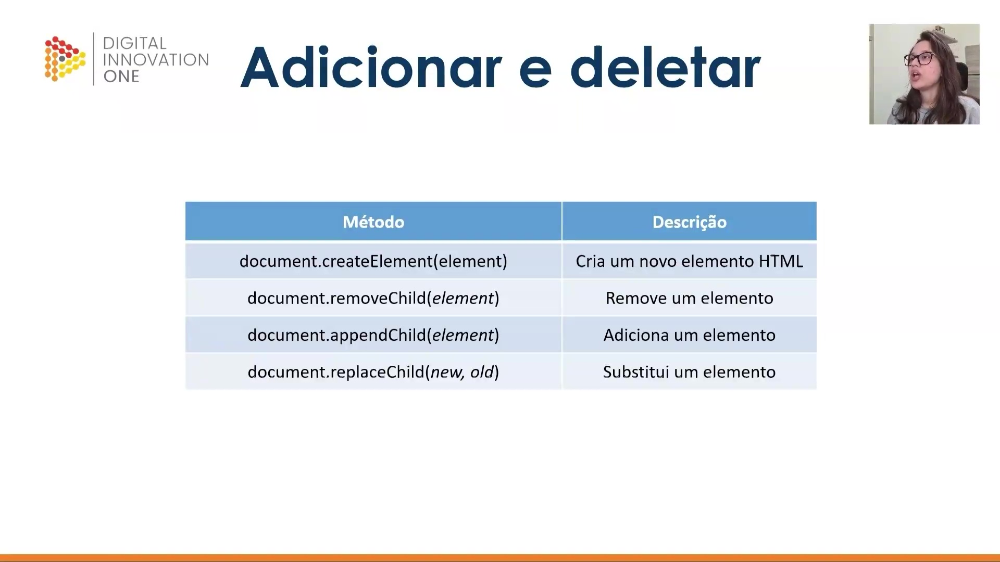
</p>

Além de selecionar, é possível gerenciar a existência dos elementos na página através dos métodos de adição, substituição e remoção:

| Método | Descrição |
| --- | --- |
| `document.createElement(element)` | Cria um novo elemento HTML (ex: 'div', 'p', 'img'). |
| `document.removeChild(element)` | Remove um elemento filho a partir de um elemento pai. |
| `document.appendChild(element)` | Adiciona um novo elemento como filho de outro. |
| `document.replaceChild(new, old)` | Substitui um elemento antigo por um novo. |

Para remover um elemento, a prática comum é acessar o elemento pai e utilizar o `removeChild` passando o elemento que deve ser deletado. Já o `replaceChild` exige a passagem do elemento novo seguida do elemento que será substituído.
      

# Parte 3 - Trabalhando com estilos

## 🟩 Vídeo 04 - Trabalhando com estilos

<video width="60%" controls>
  <source src="000-Midia_e_Anexos/bootcamp_tqi_fullstack-modulo_03-Curso.10-Video_04.webm" type="video/webm">
    Seu navegador não suporta vídeo HTML5.
</video>

Link do vídeo: https://web.dio.me/track/tqi-fullstack-developer/course/manipulando-dom-com-javascript/learning/25149635-89e3-43da-be0f-681be1c58459?autoplay=1 

Este vídeo explica como utilizar o **JavaScript** para gerenciar a aparência visual de elementos em projetos **front-end**. O conteúdo detalha o uso da propriedade **classList**, que permite **adicionar, remover ou alternar** classes CSS de forma dinâmica, funcionando como um interruptor para modificar o estado de um componente. Além disso, o texto aborda a manipulação direta através da propriedade **style**, permitindo a aplicação de configurações personalizadas como **cores e fontes** sem depender exclusivamente de arquivos externos. O objetivo central é demonstrar a flexibilidade do desenvolvedor ao interagir com o **DOM** para criar interfaces interativas. Assim, o material serve como um guia prático para controlar o **design** e o comportamento visual de uma página web via código.

### Anotações

<p align="center">

</p>

Nesta introdução à manipulação de estilos no ecossistema front-end, o foco está na interação entre **HTML, JavaScript e CSS**. O objetivo principal é compreender como o JavaScript pode ser utilizado para manipular o Document Object Model (DOM) e alterar visualmente os elementos da página. Essa integração permite que seletores como IDs e classes sirvam de ponte para que scripts apliquem regras de estilo dinamicamente.

<p align="center">
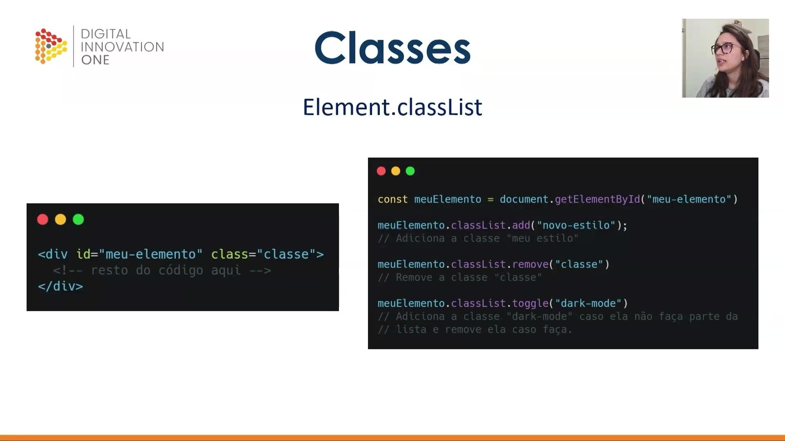
</p>

Para gerenciar as classes de um elemento, utilizamos a propriedade **`classList`**, que funciona como uma lista de todas as classes atribuídas a um elemento HTML. Através dessa propriedade, é possível selecionar um elemento pelo seu ID e aplicar métodos específicos para alterar seu estado visual.

O código abaixo exemplifica a captura de um elemento e a aplicação inicial de métodos para remover ou alternar classes:

```javascript
const meuElemento = document.getElementById("meu-elemento")

// Remove uma classe específica da lista do elemento
meuElemento.classList.remove("classe")

// Alterna a classe: adiciona se não existir, remove se já existir
meuElemento.classList.toggle("dark-mode")

```

<p align="center">
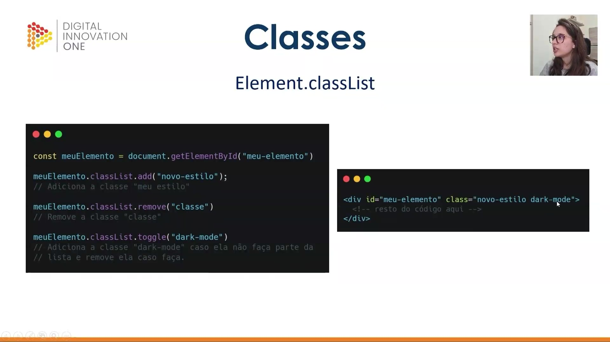
</p>

A manipulação via `classList` oferece três métodos principais para o controle de estilos baseados em classes CSS:

* **`add`**: Adiciona uma nova classe ao elemento sem remover as existentes.
* 
**`remove`**: Exclui uma classe específica da lista de classes do elemento.


* **`toggle`**: Atua como um interruptor, adicionando a classe caso ela não esteja presente ou removendo-a caso já faça parte da lista.

Como resultado dessas operações, a estrutura do HTML é atualizada dinamicamente:

```html
<div id="meu-elemento" class="novo-estilo dark-mode">
 </div>

```

<p align="center">
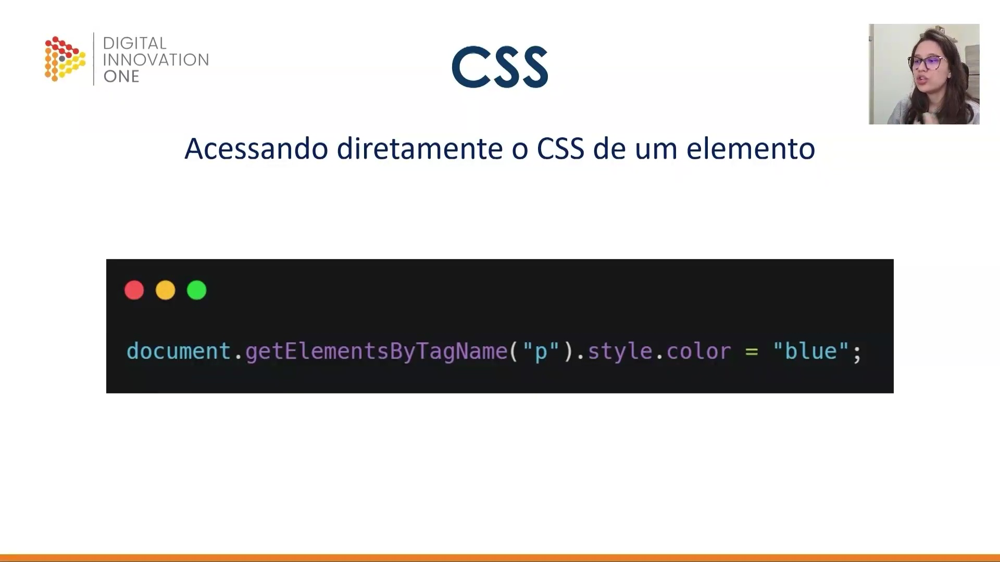
</p>

Além do uso de classes, o JavaScript permite o acesso direto às propriedades de estilo CSS de um elemento através da propriedade **`.style`**. Esta abordagem é útil quando se deseja aplicar alterações pontuais diretamente no atributo `style` do HTML, sem depender de uma classe pré-definida em um arquivo CSS externo.

É possível, por exemplo, alterar a cor de todos os parágrafos de uma vez ou modificar propriedades como `fontSize` e `border`:

```javascript
document.getElementsByTagName("p").style.color = "blue";

```

Dessa forma, o desenvolvedor possui total flexibilidade para gerenciar a aparência da aplicação, seja por meio da alternância de classes ou pela definição direta de propriedades CSS.


# Parte 4 - Eventos

## 🟩 Vídeo 05 - Tipos e Acionando eventos

<video width="60%" controls>
  <source src="000-Midia_e_Anexos/bootcamp_tqi_fullstack-modulo_03-Curso.10-Video_05.webm" type="video/webm">
    Seu navegador não suporta vídeo HTML5.
</video>

Link do vídeo: https://web.dio.me/track/tqi-fullstack-developer/course/manipulando-dom-com-javascript/learning/2a57984c-d99d-4262-bccb-f706f1d56b24?autoplay=1

Este vídeo consiste na transcrição de uma aula técnica focada em **eventos no JavaScript**, definindo-os como **ações ou interações** realizadas por usuários em elementos de uma página web. O instrutor detalha categorias comuns, como **movimentação do mouse, cliques e carregamento de páginas**, explicando como esses gatilhos ativam funções específicas. São apresentados dois métodos principais para implementar esses recursos: o uso do **AddEventListener** diretamente no código JavaScript e a aplicação de atributos **inline no HTML**, como o "onclick". O conteúdo enfatiza a transição da teoria para a **prática**, orientando o aluno sobre como "escutar" e reagir a comportamentos no navegador. Por fim, o material reforça a importância de conectar elementos visuais à **lógica de programação** para criar sites interativos.

### Anotações

<p align="center">

</p>

Esta aula inicia o estudo sobre **Eventos** dentro do contexto de manipulação do DOM (Document Object Model). O objetivo central é compreender como as interações do usuário podem disparar ações específicas em uma página web.

<p align="center">
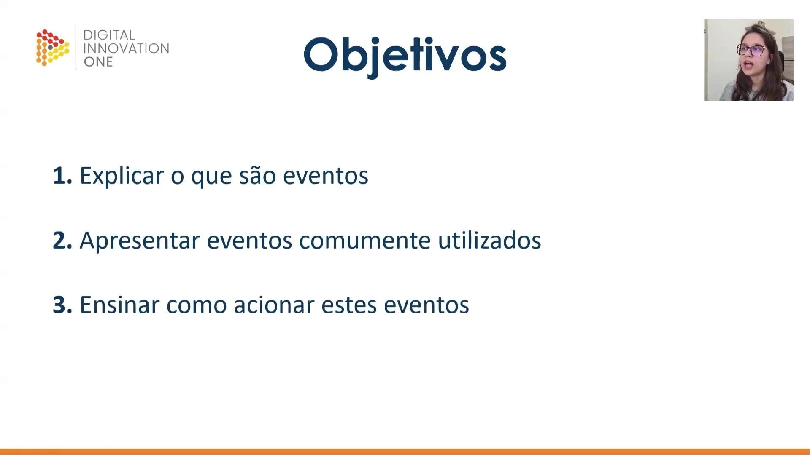
</p>

A aula está estruturada em três objetivos principais para o aprendizado de eventos:

1. **Explicar o que são eventos**: Compreender o conceito fundamental dessas interações.


2. **Apresentar eventos comumente utilizados**: Identificar os tipos mais frequentes encontrados no desenvolvimento web.


3. **Ensinar como acionar estes eventos**: Demonstrar as técnicas práticas para vincular ações ao código.


<p align="center">

</p>

A primeira etapa da aula foca na exploração dos diferentes **Tipos** de eventos que podem ser manipulados no DOM. Esta fase é essencial para categorizar as diversas formas de interação que o navegador consegue detectar.

<p align="center">
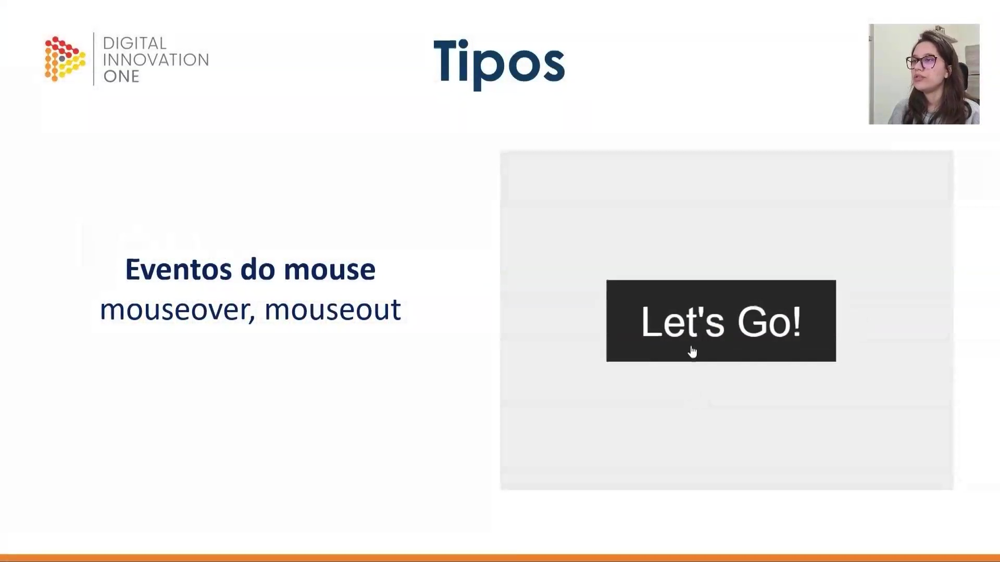
</p>

Os **Eventos do mouse** são acionados com base na movimentação ou posicionamento do cursor sobre elementos da página:

* **mouseover**: Disparado quando o cursor do mouse entra na área de um elemento.

* **mouseout**: Disparado quando o cursor do mouse deixa a área de um elemento.

<p align="center">
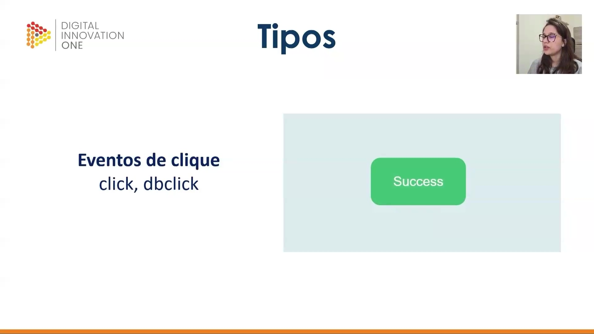
</p>

Outra categoria fundamental são os **Eventos de clique**, que registram as interações diretas de pressão dos botões do mouse:

* **click**: Ocorre quando um elemento é pressionado e solto rapidamente.

* **dbclick**: Ocorre especificamente quando há um clique duplo rápido sobre o elemento.

<p align="center">
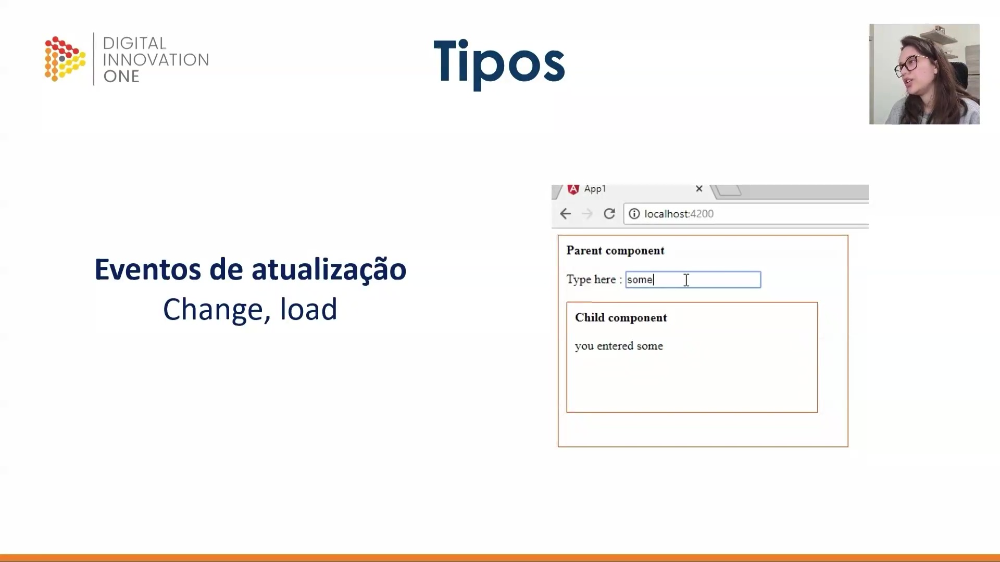
</p>

Os **Eventos de atualização** monitoram mudanças de estado ou carregamento:

* **change**: Frequentemente utilizado em campos de formulário quando o valor de um elemento é alterado e o foco é perdido.


* **load**: Acionado quando a página ou um elemento específico termina de ser carregado completamente pelo navegador.

A imagem exemplifica a captura de entrada de dados em tempo real, onde a alteração no campo de texto de um componente "Pai" reflete uma atualização imediata no componente "Filho".

<p align="center">

</p>

A segunda etapa da aula aborda como realizar o **acionamento dos eventos**. Nesta fase, o foco deixa de ser apenas a identificação dos tipos de eventos e passa a ser a implementação prática do "link" entre a ação do usuário e a execução do código JavaScript.

<p align="center">
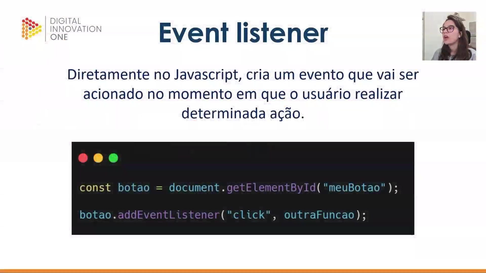
</p>

O **Event listener** (ou escutador de eventos) é uma das formas de acionamento configurada diretamente no arquivo JavaScript. Ele cria um observador que aguarda o momento exato em que o usuário realiza uma ação para disparar uma função específica.

```javascript
const botao = document.getElementById("meuBotao");
botao.addEventListener("click", outraFuncao);

```

<p align="center">

</p>

Uma alternativa ao listener é o uso de **Atributos HTML**, onde a chamada da função é especificada diretamente na tag do elemento. Ao utilizar este método direto no HTML, o nome do evento deve ser precedido pelo prefixo **"on"** (como `onclick`, `onmouseover`, etc.).

```html
<html>
<body>
<h1 onclick="mudaTexto(this)">Clique aqui!</h1>
<script>
function mudaTexto (id) {
id.innerHTML = "Mudei!";
}
</script>
</body>
</html>

```      


## 🟩 Vídeo 06 - Atividade prática


Link do vídeo: 


# Certificado: Manipulando a D.O.M. com JavaScript

- Link na plataforma: 
- Certificado em pdf: 
