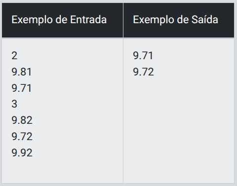
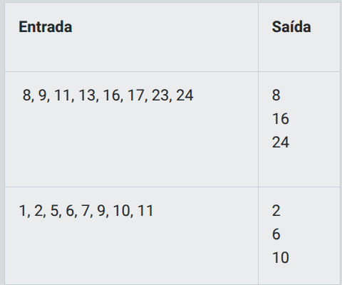

# Desafio 1 - Dragão

- Daenerys é a khaleesi dos Dothraki. Juntamente com Drogon, eles vão atrás do Tyrion, para tentar dominar Westeros. Ela possui, além do seu dragãozinho, um rastreador que mede o nível de energia de qualquer ser vivo. Todos os seres com o nível menor ou igual a 8000, ela considera como se fosse um inseto. Quando passa deste valor, que foi o caso do Drogon, ela se espanta e grita “Mais de 8000”. Baseado nisso, utilize a mesma tecnologia e analise o nível de energia dos seres vivos.

## Entrada

- A primeira linha contém um número inteiro C relativo ao número de casos de teste. Em seguida, haverá C linhas, com um número inteiro N (100 <= N <= 100000) relativo ao nível de energia de um ser vivo.

## Saída

Para cada valor lido, imprima o texto correspondente.

<p align="center">
    
</p>

## Solução

```javascript
// TODO: complete os espaços em branco com sua solução para o problema
// a função gets é implementada dentro do sistema para ler as entradas(inputs) dos dados e a função print para imprimir a saída (output) de dados e já pula uma linha ("\n")
// Abaixo segue um exemplo de código que você pode ou não utilizar

let input = gets();

let qtdEntradas = parseInt(input);
let nivelEnergia;

//Resolva o desafios nos espaços em branco
for(let i = 0; i < qtdEntradas; i++){
    input = gets();
    nivelEnergia = parseInt(input);
    
    if (nivelEnergia > 8000) {
        print ("Mais de 8000!")
    } else {
        print ("Inseto!")
    }
```

# Desafio 2 - Soma de números naturais

## Descrição

- Um número natural é um inteiro não-negativo (0, 1, 2, 3, 4, 5,...). A sua tarefa neste problema é calcular a soma dos números naturais que estão presentes em um determinado intervalo [A, B] inclusive.

- Por exemplo, a soma dos números naturais no intervalo [2, 5] é 14 = (2+3+4+5).

## Entrada

- Cada caso de teste contém dois inteiros A e B (1 ≤ A ≤ B ≤ 109), representando o limite inferior e o superior respectivamente.

## Saída

Para cada caso de teste, a saída consiste de uma linha contendo a soma dos números naturais do intervalo.

Exemplo 1

<p align="center">
    
</p>

Exemplo 2

<p align="center">
    
</p>

## Solução

```javascript
// a função gets é implementada dentro do sistema para ler as entradas(inputs) dos dados e a função print para imprimir a saída (output) de dados e já pula uma linha ("\n")
// Abaixo segue um exemplo de código que você pode ou não utilizar

const A = parseInt(gets());
const B = parseInt(gets());
const total = (B * (B + 1)) / 2 - ((A - 1) * A) / 2 ;
print(total);

//Escreva o seu código no espaço em branco
```

## Explicação Soma de Gauss

A **soma de Gauss** é uma fórmula matemática que permite calcular rapidamente a soma dos números naturais consecutivos.

### Fórmula geral
A soma dos primeiros `n` números naturais é:

S = n × (n + 1) / 2

### Intervalo [A, B]
Para somar números dentro de um intervalo específico, usamos:

S = (B × (B + 1)) / 2 − ((A − 1) × A) / 2

### Exemplo
Intervalo [2, 5]:

S = (5 × 6) / 2 − (1 × 2) / 2  
S = 15 − 1 = 14

Resultado: **14**

# Desafio 3 - Papaléguas

## Descrição

- Papaleguas é um corredor exemplar, sua especialidade é a prova dos 100 metros rasos. Diariamente, ele treina para realizar as provas no menor tempo possível e se tornar recordista mundial na categoria. Pode se perceber que, dependendo da quantidade de tentativas, o seu desempenho melhora ou piora. Diante disso, ele te desafia para calcular a tentativa mais rápida de cada treino diário.

## Entrada

- A entrada é composta por vários casos de teste. A primeira linha de cada caso de teste contém um número inteiro T (2 <= T <= 99) relativo ao número de tentativas de um dia. As T linhas seguintes contêm um número real Ti (9 <= Ti <= 11) relativo ao tempo, em segundos, da i-ésima tentativa do treino. A entrada termina com fim de arquivo.

## Saída

Para cada caso de teste de entrada do seu programa, você deve imprimir um número real contendo o tempo da tentativa mais rápida de cada treino.

<p align="center">
  
</p>

## Solução

```javascript
// a função gets é implementada dentro do sistema para ler as entradas(inputs) dos dados e a função print para imprimir a saída (output) de dados e já pula uma linha ("\n")
// Abaixo segue um exemplo de código que você pode ou não utilizar

let input = gets()

let qtdEntradas = parseInt(input)
let melhor = 999

for(let i = 0; i < qtdEntradas; i++){
    
    input = gets()
    let tempo = parseFloat(input)
    if (tempo < melhor) melhor = tempo
}

print(melhor)
```

# Desafio 4 - Arrays Pares

## Descrição

- Seu José possui uma lista de entregas das suas mercadorias e cada uma delas possui um número de identificação. As entregas mais urgentes são as que possuem o número de identificação PAR. Porém, seu José é muito atarefado e pediu sua ajuda para criar um programa que, de acordo com uma lista, mostrasse apenas as entregas urgentes (pares). Utilizando o seu conhecimento sobre Arrays, uma estrutura de dados que armazena uma coleção de dados em um bloco de memória, crie um programa que, dado a lista: {2, 3, 5, 7, 11, 13, 18, 34}, retorne como resultado apenas os números pares dessa array.

## Entrada

- A entrada consiste em um Array de números inteiros positivos. ([2, 3, 5, 7, 11, 13, 18, 34])

## Saída

- A saída do desafio equivale aos números pares do Array, como mostra o exemplo a baixo, porém com o Array do enunciado:

<p align="center">
  
</p>

## Solução

