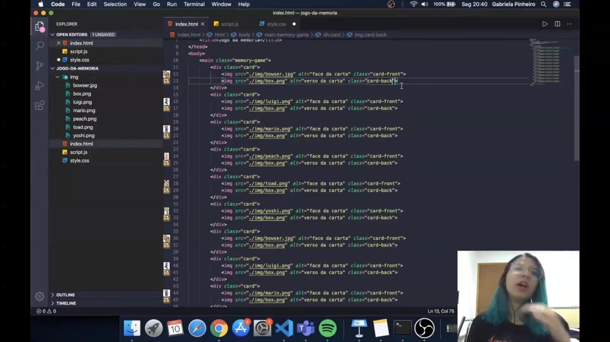
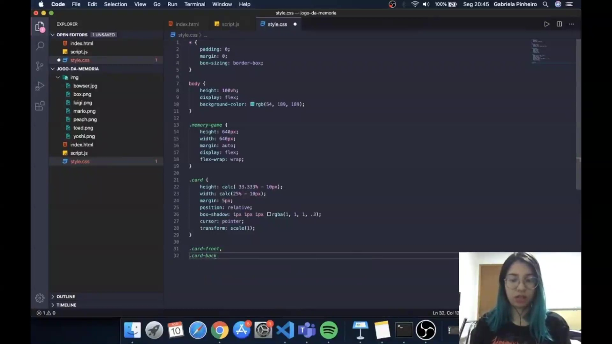
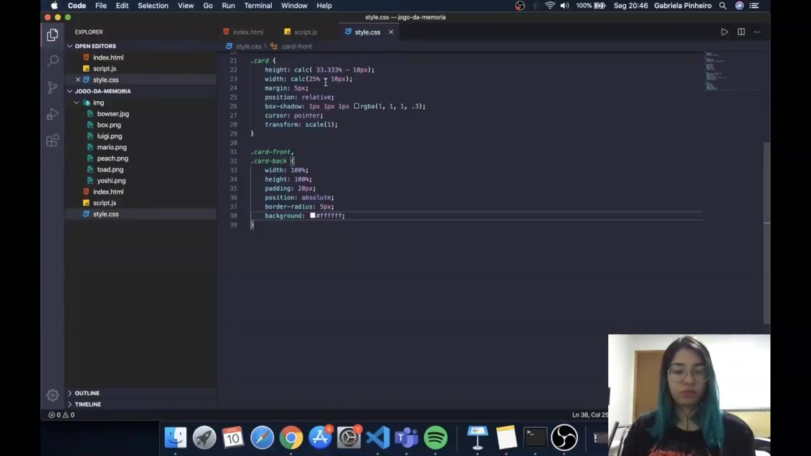
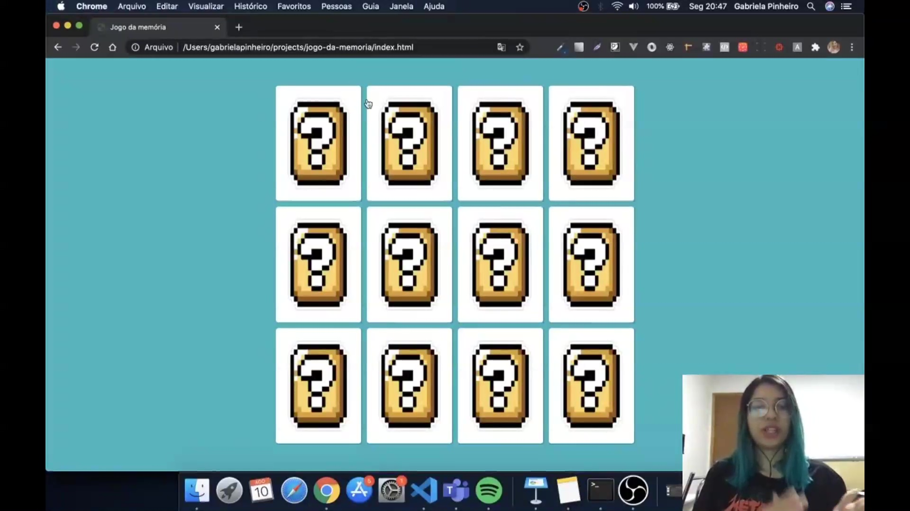

## Instrutor

- Gabriela Pinheiro (Software Engineer @ Caju | React.js | Next.js | Typescript | Flutter | ex-Uber)
- Contato Linkedin: / [gabrielapinheiro129](https://www.linkedin.com/in/gabrielapinheiro129/)

## 🟩 Vídeo 01

<video width="60%" controls>
  <source src="000-Midia_e_Anexos/bootcamp_tqi_fullstack-modulo_03-12-Projeto-Video_01.webm" type="video/webm">
    Seu navegador não suporta vídeo HTML5.
</video>

Link do vídeo: https://web.dio.me/lab/desenvolvendo-um-jogo-da-memoria/learning/f2c743aa-edc8-4185-809c-b64d5988a4a0?back=/track/tqi-fullstack-developer 

O vídeo apresenta um tutorial prático para o desenvolvimento de um **jogo da memória** utilizando as tecnologias **JavaScript, HTML e CSS**. A instrutora utiliza uma temática inspirada no universo do **Mario**, detalhando a estruturação do código e a organização das doze cartas que compõem o tabuleiro. O conteúdo explica a criação de elementos visuais como a **Mystery Box** para o verso das cartas e personagens como o **Bowser** para as faces principais. São abordadas técnicas fundamentais de design responsivo e estilização, incluindo o uso de **Flexbox** e posicionamento absoluto para sobrepor imagens. O guia foca em ensinar conceitos de **bootcamp**, preparando o ambiente para futuras animações e funcionalidades lógicas do jogo.

### Anotações

<p align="center">

</p>

A estrutura inicial do projeto define a base do jogo da memória utilizando HTML. O contêiner principal é uma `main` com a classe `memory-game`, que agrupa todas as cartas do tabuleiro. Cada carta é estruturada dentro de uma `div` com a classe `card`, contendo duas imagens: a `card-front`, que exibe o personagem (como o Bowser), e a `card-back`, que exibe o verso padrão da carta (a "mystery box"). Para compor um jogo de 12 cartas, as seis imagens dos personagens são inseridas e posteriormente duplicadas no código.

```html
<main class="memory-game">
  <div class="card">
    
    
  </div>
  </main>

```

<p align="center">

</p>

Após a estruturação do HTML, inicia-se a estilização global e do corpo da página no CSS. O primeiro passo é o "reset" dos estilos padrão, utilizando o seletor universal para zerar `padding` e `margin`, além de aplicar `box-sizing: border-box`, garantindo que bordas e preenchimentos sejam calculados dentro das dimensões definidas para os elementos. O `body` é configurado para ocupar toda a altura da tela visível (`100vh`) e utiliza `display: flex` para centralizar o conteúdo, com uma cor de fundo sólida para destacar o tabuleiro.

```css
* {
  padding: 0;
  margin: 0;
  box-sizing: border-box;
}

body {
  height: 100vh;
  display: flex;
  background-color: rgb(54, 189, 189);
}

```

<p align="center">

</p>

Nesta etapa, o contêiner `.memory-game` e as cartas individuais são estilizados para formar a grade do jogo. O contêiner possui dimensões fixas de 640px e usa `flex-wrap: wrap` para que as cartas quebrem de linha automaticamente. Para o `.card`, a altura e a largura são calculadas dinamicamente com a função `calc()`, subtraindo 10px das porcentagens (33.33% para altura e 25% para largura) para compensar a margem de 5px aplicada em cada lado. A propriedade `position: relative` é essencial para que as imagens internas (frente e verso) possam ser posicionadas de forma absoluta em relação à carta.

```css
.memory-game {
  height: 640px;
  width: 640px;
  margin: auto;
  display: flex;
  flex-wrap: wrap;
}

.card {
  height: calc(33.333% - 10px);
  width: calc(25% - 10px);
  margin: 5px;
  position: relative;
  box-shadow: 1px 1px 1px rgba(1, 1, 1, 0.3);
  cursor: pointer;
  transform: scale(1);
}

```

<p align="center">

</p>

Para finalizar a aparência das cartas, as classes `.card-front` e `.card-back` recebem estilizações comuns. Ambas ocupam 100% da largura e altura do elemento pai e utilizam `position: absolute`, o que faz com que fiquem sobrepostas uma à outra dentro da `div.card`. É adicionado um `padding` de 20px para afastar as ilustrações das bordas, além de um `border-radius` para arredondar os cantos e um fundo branco para dar o aspecto de uma carta física. O resultado visual apresenta uma grade organizada com as "mystery boxes" visíveis, ocultando os personagens até que ocorra a interação.

```css
.card-front,
.card-back {
  width: 100%;
  height: 100%;
  padding: 20px;
  position: absolute;
  border-radius: 5px;
  background: white;
}


## 🟩 Vídeo 02


Link do vídeo: https://web.dio.me/lab/desenvolvendo-um-jogo-da-memoria/learning/3964771d-5ac9-4489-9a32-403150b305d8


## 🟩 Vídeo 03


Link do vídeo: 


## 🟩 Vídeo 04


Link do vídeo: 


## 🟩 Vídeo 05


Link do vídeo: 


## 🟩 Vídeo 06


Link do vídeo: 


## 🟩 Vídeo 07


Link do vídeo: 


## ▶️ Objetivo do Projeto


Link do vídeo: 


# Certificado: 

- Link na plataforma: 
- Certificado em pdf: 
