## Instrutor

- Gabriela Pinheiro (Software Engineer @ Caju | React.js | Next.js | Typescript | Flutter | ex-Uber)
- Contato Linkedin: / [gabrielapinheiro129](https://www.linkedin.com/in/gabrielapinheiro129/)

## 🟩 Vídeo 01

<video width="60%" controls>
  <source src="000-Midia_e_Anexos/bootcamp_tqi_fullstack-modulo_03-12-Projeto-Video_01.webm" type="video/webm">
    Seu navegador não suporta vídeo HTML5.
</video>

Link do vídeo: https://web.dio.me/lab/desenvolvendo-um-jogo-da-memoria/learning/f2c743aa-edc8-4185-809c-b64d5988a4a0?back=/track/tqi-fullstack-developer 

O vídeo apresenta um tutorial prático para o desenvolvimento de um **jogo da memória** utilizando as tecnologias **JavaScript, HTML e CSS**. A instrutora utiliza uma temática inspirada no universo do **Mario**, detalhando a estruturação do código e a organização das doze cartas que compõem o tabuleiro. O conteúdo explica a criação de elementos visuais como a **Mystery Box** para o verso das cartas e personagens como o **Bowser** para as faces principais. São abordadas técnicas fundamentais de design responsivo e estilização, incluindo o uso de **Flexbox** e posicionamento absoluto para sobrepor imagens. O guia foca em ensinar conceitos de **bootcamp**, preparando o ambiente para futuras animações e funcionalidades lógicas do jogo.

### Anotações

<p align="center">

</p>

A estrutura inicial do projeto define a base do jogo da memória utilizando HTML. O contêiner principal é uma `main` com a classe `memory-game`, que agrupa todas as cartas do tabuleiro. Cada carta é estruturada dentro de uma `div` com a classe `card`, contendo duas imagens: a `card-front`, que exibe o personagem (como o Bowser), e a `card-back`, que exibe o verso padrão da carta (a "mystery box"). Para compor um jogo de 12 cartas, as seis imagens dos personagens são inseridas e posteriormente duplicadas no código.

```html
<main class="memory-game">
  <div class="card">
    
    
  </div>
  </main>

```

<p align="center">

</p>

Após a estruturação do HTML, inicia-se a estilização global e do corpo da página no CSS. O primeiro passo é o "reset" dos estilos padrão, utilizando o seletor universal para zerar `padding` e `margin`, além de aplicar `box-sizing: border-box`, garantindo que bordas e preenchimentos sejam calculados dentro das dimensões definidas para os elementos. O `body` é configurado para ocupar toda a altura da tela visível (`100vh`) e utiliza `display: flex` para centralizar o conteúdo, com uma cor de fundo sólida para destacar o tabuleiro.

```css
* {
  padding: 0;
  margin: 0;
  box-sizing: border-box;
}

body {
  height: 100vh;
  display: flex;
  background-color: rgb(54, 189, 189);
}

```

<p align="center">

</p>

Nesta etapa, o contêiner `.memory-game` e as cartas individuais são estilizados para formar a grade do jogo. O contêiner possui dimensões fixas de 640px e usa `flex-wrap: wrap` para que as cartas quebrem de linha automaticamente. Para o `.card`, a altura e a largura são calculadas dinamicamente com a função `calc()`, subtraindo 10px das porcentagens (33.33% para altura e 25% para largura) para compensar a margem de 5px aplicada em cada lado. A propriedade `position: relative` é essencial para que as imagens internas (frente e verso) possam ser posicionadas de forma absoluta em relação à carta.

```css
.memory-game {
  height: 640px;
  width: 640px;
  margin: auto;
  display: flex;
  flex-wrap: wrap;
}

.card {
  height: calc(33.333% - 10px);
  width: calc(25% - 10px);
  margin: 5px;
  position: relative;
  box-shadow: 1px 1px 1px rgba(1, 1, 1, 0.3);
  cursor: pointer;
  transform: scale(1);
}

```

<p align="center">

</p>

Para finalizar a aparência das cartas, as classes `.card-front` e `.card-back` recebem estilizações comuns. Ambas ocupam 100% da largura e altura do elemento pai e utilizam `position: absolute`, o que faz com que fiquem sobrepostas uma à outra dentro da `div.card`. É adicionado um `padding` de 20px para afastar as ilustrações das bordas, além de um `border-radius` para arredondar os cantos e um fundo branco para dar o aspecto de uma carta física. O resultado visual apresenta uma grade organizada com as "mystery boxes" visíveis, ocultando os personagens até que ocorra a interação.

```css
.card-front,
.card-back {
  width: 100%;
  height: 100%;
  padding: 20px;
  position: absolute;
  border-radius: 5px;
  background: white;
}
```

## 🟩 Vídeo 02

<video width="60%" controls>
  <source src="000-Midia_e_Anexos/bootcamp_tqi_fullstack-modulo_03-12-Projeto-Video_02.webm" type="video/webm">
    Seu navegador não suporta vídeo HTML5.
</video>

Link do vídeo: https://web.dio.me/lab/desenvolvendo-um-jogo-da-memoria/learning/3964771d-5ac9-4489-9a32-403150b305d8

O tutorial ensina como criar uma **interação visual dinâmica** em cartas virtuais utilizando propriedades de **CSS** e lógica de **JavaScript**. Inicialmente, o instrutor aplica um efeito de **escala reduzida** e transições suaves para simular um clique físico no elemento. Em seguida, o foco muda para a programação funcional, onde é criada uma lista de componentes para receberem um **ouvinte de eventos**. O código utiliza o método **toggle** para alternar uma classe específica, permitindo que cada carta mude de estado individualmente ao ser acionada pelo usuário. Por fim, o uso do contexto **this** garante que a animação de virar a carta seja aplicada exclusivamente ao item selecionado no momento da interação.

### Anotações

<p align="center">
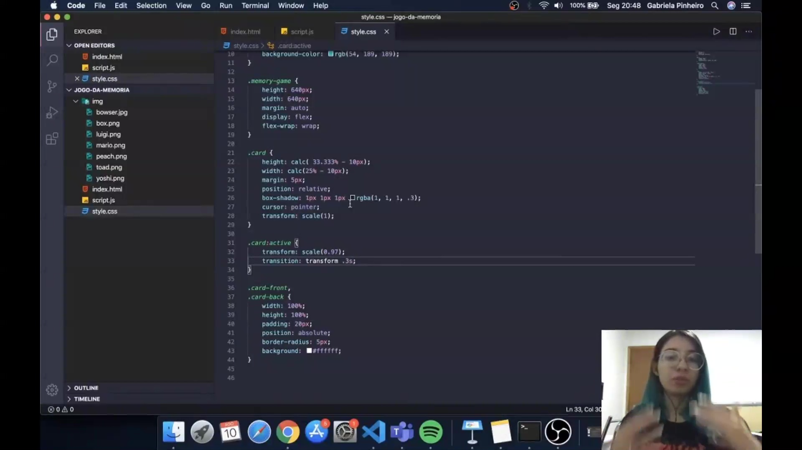
</p>

Nesta etapa, o foco é a implementação do efeito visual de interação nos cards do jogo. Para criar uma sensação de profundidade e feedback tátil ao usuário, é utilizado o seletor `:active` no CSS. Ao clicar na carta, a propriedade `transform: scale(0.97)` diminui levemente o tamanho do elemento, simulando o pressionar de um botão. Para que essa transição ocorra de forma suave, aplica-se a propriedade `transition` com uma duração de 0.3 segundos.

```css
.card:active {
  transform: scale(0.97);
  transition: transform .3s;
}

```

<p align="center">
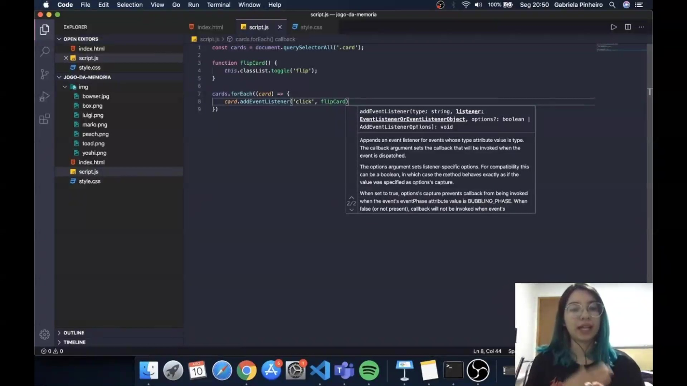
</p>

Para gerenciar a lógica de virar as cartas, iniciamos a programação em JavaScript selecionando todos os elementos que possuem a classe `.card` através do `document.querySelectorAll`. Em seguida, define-se a função `flipCard()`, que utiliza o método `classList.toggle('flip')`. O uso do `this` dentro da função refere-se ao contexto do elemento que disparou o evento, permitindo que a classe `flip` seja adicionada ou removida especificamente da carta clicada.

```javascript
const cards = document.querySelectorAll('.card');

function flipCard() {
  this.classList.toggle('flip');
}

```

<p align="center">
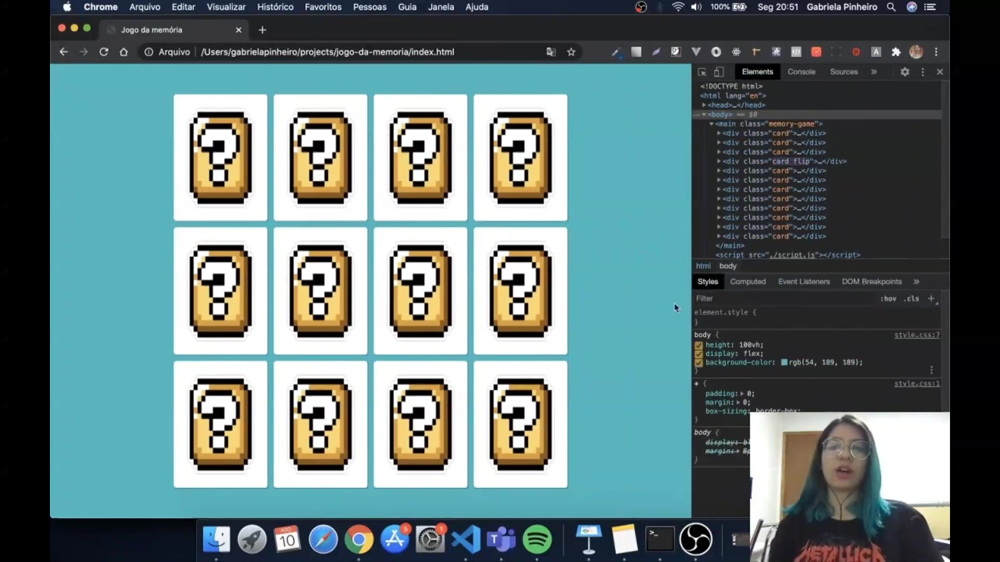
</p>

Com a lista de cartas armazenada e a função de virar definida, é necessário aplicar o comportamento a cada item individualmente. Utiliza-se o método `forEach` para percorrer a lista de elementos. Para cada `card`, adicionamos um "escutador de eventos" (`addEventListener`) que monitora o clique do usuário. Quando uma carta é clicada, a função `flipCard` é executada, o que pode ser verificado em tempo real através do inspetor de elementos do navegador, observando a classe `flip` sendo alternada na estrutura do DOM.

```javascript
cards.forEach(card => card.addEventListener('click', flipCard));

```      

## 🟩 Vídeo 03

<video width="60%" controls>
  <source src="000-Midia_e_Anexos/bootcamp_tqi_fullstack-modulo_03-12-Projeto-Video_03.webm" type="video/webm">
    Seu navegador não suporta vídeo HTML5.
</video>

Link do vídeo: https://web.dio.me/lab/desenvolvendo-um-jogo-da-memoria/learning/94a38ce9-a391-4e8a-949e-22f4f93e8b59

O vídeo explica como criar uma **animação 3D de rotação de cartas** para um jogo de memória utilizando **CSS**. A instrutora detalha a importância de definir uma **perspectiva no tabuleiro** e utilizar a propriedade **preserve-3d** para evitar que os elementos fiquem achatados durante o movimento. Ela demonstra como configurar o **tempo da transição** e aplicar a lógica de **rotação no eixo Y** quando uma classe específica é ativada via JavaScript. Um ponto crucial abordado é o uso do **backface-visibility**, técnica necessária para esconder o verso espelhado da carta e garantir um efeito visual fluido. Ao ajustar o posicionamento das faces frontal e traseira, o tutorial ensina como fazer com que a imagem correta apareça ao **clicar no elemento**.  

### Anotações

<p align="center">
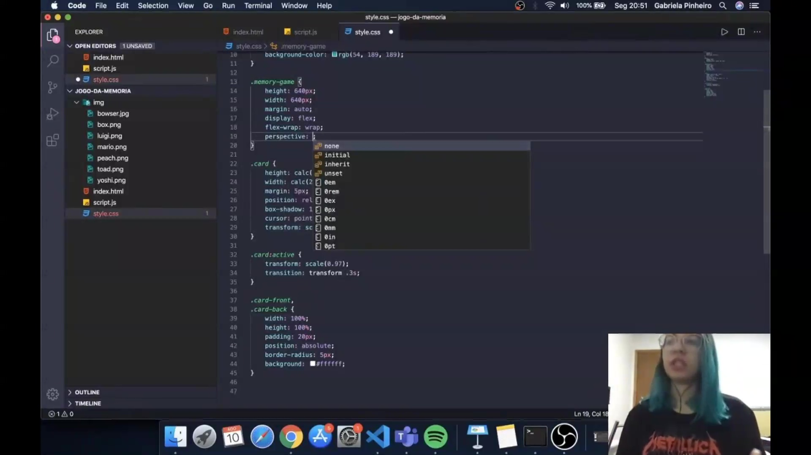
</p>

Para iniciar o tratamento das animações das cartas e criar o efeito de virada, é necessário configurar o ambiente tridimensional do jogo. O primeiro passo é adicionar uma perspectiva ao container principal do tabuleiro (`memory-game`). A propriedade `perspective` define a distância entre o plano  e o usuário, determinando a intensidade do efeito 3D; quanto maior o valor, mais suave é a distorção visual. 

```css
.memory-game {
  height: 640px;
  width: 640px;
  margin: auto;
  display: flex;
  flex-wrap: wrap;
  perspective: 1000px;
}

```

<p align="center">
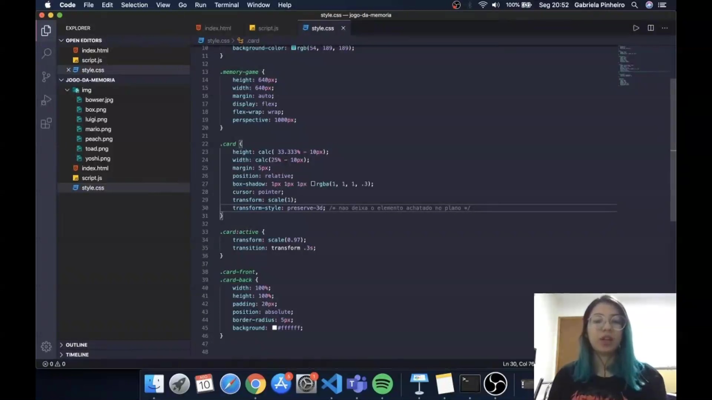
</p>

Para que as cartas não sejam renderizadas de forma achatada no plano 2D, utiliza-se a propriedade `transform-style: preserve-3d`. Isso garante que os elementos filhos (as faces da carta) mantenham sua posição no espaço tridimensional. Além disso, adicionamos uma `transition` para suavizar a animação de transformação, definindo um tempo de 0.9 segundos para que o movimento não seja excessivamente rápido. 

```css
.card {
  height: calc(33.333% - 10px);
  width: calc(25% - 10px);
  margin: 5px;
  position: relative;
  box-shadow: 1px 1px 1px rgba(1, 1, 1, 3);
  cursor: pointer;
  transform: scale(1);
  transform-style: preserve-3d;
  transition: transform .9s;
}

```

<p align="center">
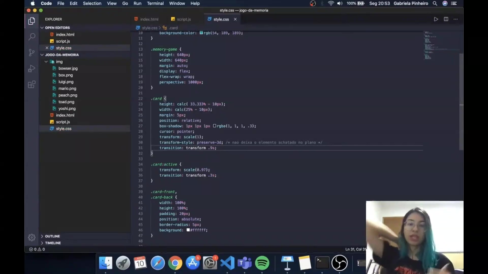
</p>

Nesta etapa, preparamos a estilização da classe que será alternada via JavaScript. A face frontal da carta (`.card-front`) deve ser rotacionada em 180 graus no eixo Y inicialmente. Isso é necessário para que, ao executarmos a animação de flip no container da carta, a imagem correta fique virada para o usuário. 

```css
.card-front,
.card-back {
  width: 100%;
  height: 100%;
  padding: 20px;
  position: absolute;
  border-radius: 5px;
  background: #fff;
}

.card-front {
  transform: rotateY(180deg);
}

```

<p align="center">
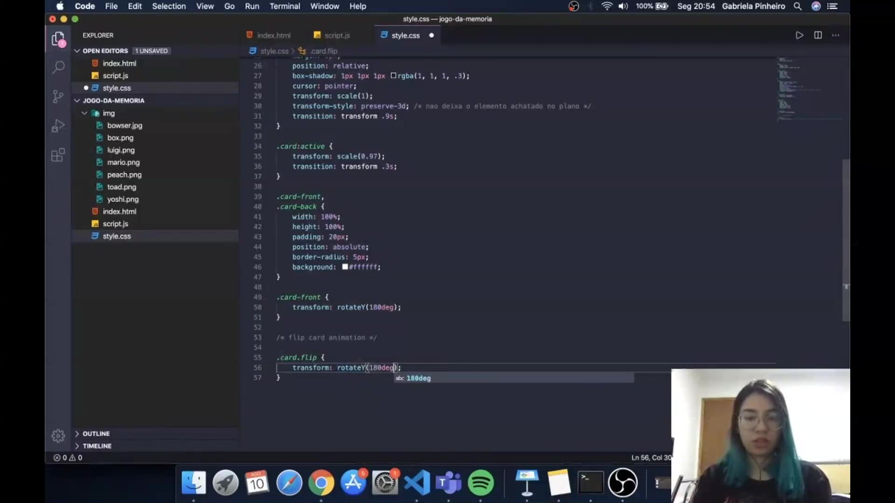
</p>

A animação principal é disparada pela classe `.flip`. Quando esta classe é adicionada ao elemento `.card`, ele sofre uma rotação de 180 graus no eixo Y (`rotateY(180deg)`). Como configuramos a transição anteriormente, essa mudança de estado resultará no efeito visual da carta girando. 

```css
/* flip card animation */

.card.flip {
  transform: rotateY(180deg);
}

```

<p align="center">
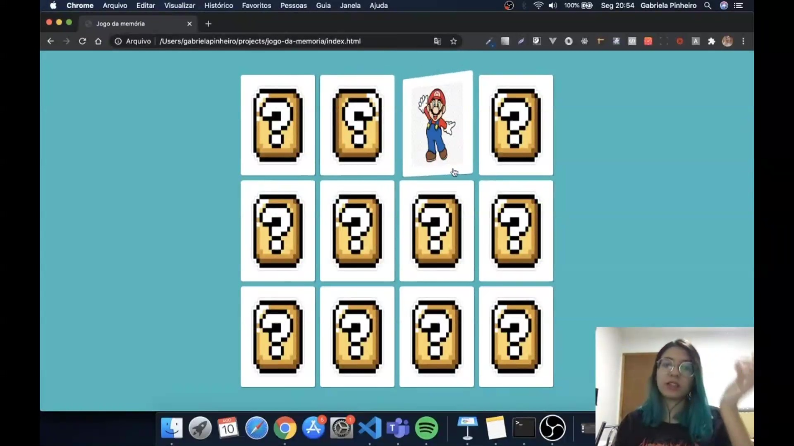
</p>

Ao testar a animação, nota-se um problema visual: as cartas aparecem espelhadas ou transparentes durante a virada. Isso ocorre porque, por padrão, o navegador exibe o verso dos elementos de forma espelhada. A interface do jogo mostra as cartas com o ícone de interrogação (back face) e, ao clicar, a transição começa a revelar a face do personagem (Mario), mas o comportamento ainda não está polido. 

<p align="center">

</p>

Para corrigir o artefato visual da carta espelhada, aplicamos a propriedade `backface-visibility: hidden`. Esta regra retira a visibilidade do verso da div quando ela está voltada para trás em relação ao usuário, garantindo que apenas a face que deve estar visível apareça, criando um efeito de virada muito mais limpo e realista. 

```css
.card-front,
.card-back {
  width: 100%;
  height: 100%;
  padding: 20px;
  position: absolute;
  border-radius: 5px;
  background: #fff;
  backface-visibility: hidden;
}

```

<p align="center">
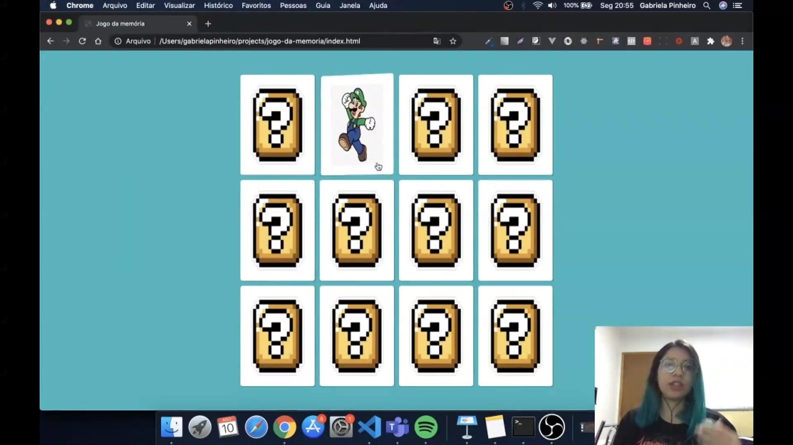
</p>

Com a propriedade `backface-visibility` aplicada, o teste no navegador demonstra que a carta do Luigi agora vira corretamente. O verso (caixa com interrogação) desaparece no momento em que a rotação ultrapassa os 90 graus, revelando a face frontal sem transparências indesejadas ou o efeito de espelhamento. 

<p align="center">
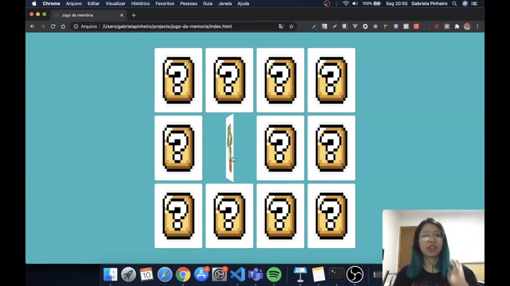
</p>

A imagem demonstra o estado intermediário da animação. Graças ao `preserve-3d` e à `perspective` definidos no container pai, a carta mantém sua integridade estrutural durante o movimento de rotação no eixo Y, criando a ilusão de profundidade necessária para um jogo de memória digital. 

<p align="center">
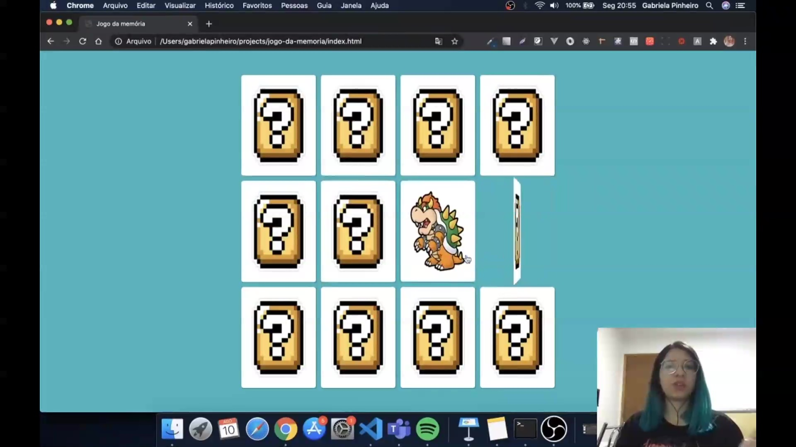
</p>

O resultado final da estilização CSS permite que cada carta (como a do Bowser ilustrada) funcione de forma independente. O clique aciona a classe `.flip`, e a combinação de `rotateY(180deg)` na face frontal com o `hidden` na visibilidade do verso completa a lógica visual da mecânica do jogo. 

<p align="center">
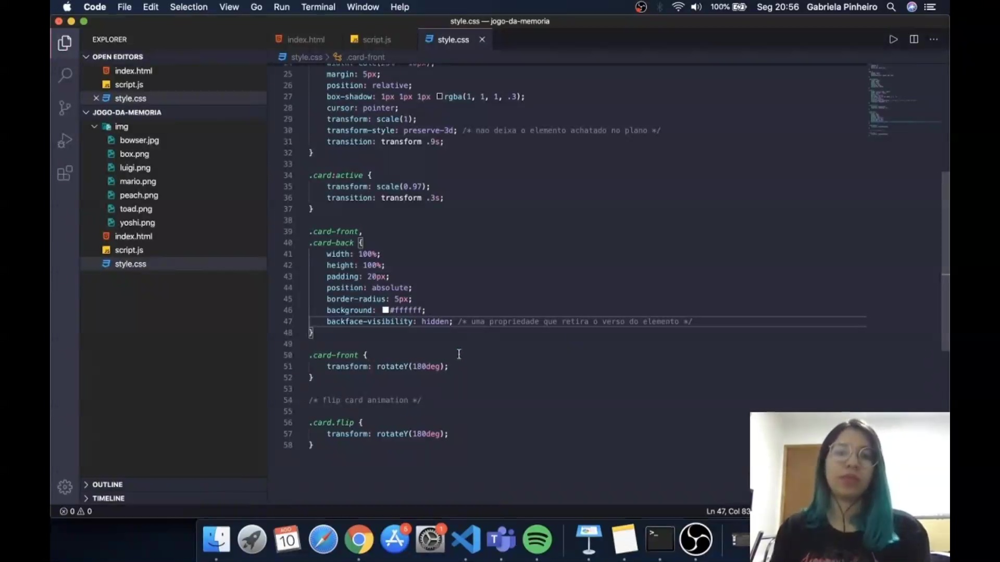
</p>

Revisão final do código CSS consolidado. A estrutura utiliza `position: absolute` nas faces para sobrepô-las dentro do container `.card` que possui `position: relative`. A lógica de rotação inversa na face frontal (`.card-front`) é o que permite que, ao girar o card todo em 180 graus, ela finalmente fique de frente para o usuário. 

```css
.card-front,
.card-back {
  width: 100%;
  height: 100%;
  padding: 20px;
  position: absolute;
  border-radius: 5px;
  background: #fff;
  backface-visibility: hidden;
}

.card-front {
  transform: rotateY(180deg);
}

/* flip card animation */
.card.flip {
  transform: rotateY(180deg);
}

```

## 🟩 Vídeo 04

<video width="60%" controls>
  <source src="000-Midia_e_Anexos/bootcamp_tqi_fullstack-modulo_03-12-Projeto-Video_04.webm" type="video/webm">
    Seu navegador não suporta vídeo HTML5.
</video>

Link do vídeo: https://web.dio.me/lab/desenvolvendo-um-jogo-da-memoria/learning/ea8ee30d-9ef2-4bb5-87c2-7cd37602e562


## 🟩 Vídeo 05

<video width="60%" controls>
  <source src="000-Midia_e_Anexos/bootcamp_tqi_fullstack-modulo_03-12-Projeto-Video_05.webm" type="video/webm">
    Seu navegador não suporta vídeo HTML5.
</video>

Link do vídeo: 


## 🟩 Vídeo 06

<video width="60%" controls>
  <source src="000-Midia_e_Anexos/bootcamp_tqi_fullstack-modulo_03-12-Projeto-Video_06.webm" type="video/webm">
    Seu navegador não suporta vídeo HTML5.
</video>

Link do vídeo: 


## 🟩 Vídeo 07

<video width="60%" controls>
  <source src="000-Midia_e_Anexos/bootcamp_tqi_fullstack-modulo_03-12-Projeto-Video_07.webm" type="video/webm">
    Seu navegador não suporta vídeo HTML5.
</video>

Link do vídeo: 


## ▶️ Objetivo do Projeto


Link do vídeo: 


# Certificado: 

- Link na plataforma: 
- Certificado em pdf: 
