## Instrutor

- Gabriela Pinheiro (Software Engineer @ Caju | React.js | Next.js | Typescript | Flutter | ex-Uber)
- Contato Linkedin: / [gabrielapinheiro129](https://www.linkedin.com/in/gabrielapinheiro129/)

## 🟩 Vídeo 01

<video width="60%" controls>
  <source src="000-Midia_e_Anexos/bootcamp_tqi_fullstack-modulo_03-12-Projeto-Video_01.webm" type="video/webm">
    Seu navegador não suporta vídeo HTML5.
</video>

Link do vídeo: https://web.dio.me/lab/desenvolvendo-um-jogo-da-memoria/learning/f2c743aa-edc8-4185-809c-b64d5988a4a0?back=/track/tqi-fullstack-developer 

O vídeo apresenta um tutorial prático para o desenvolvimento de um **jogo da memória** utilizando as tecnologias **JavaScript, HTML e CSS**. A instrutora utiliza uma temática inspirada no universo do **Mario**, detalhando a estruturação do código e a organização das doze cartas que compõem o tabuleiro. O conteúdo explica a criação de elementos visuais como a **Mystery Box** para o verso das cartas e personagens como o **Bowser** para as faces principais. São abordadas técnicas fundamentais de design responsivo e estilização, incluindo o uso de **Flexbox** e posicionamento absoluto para sobrepor imagens. O guia foca em ensinar conceitos de **bootcamp**, preparando o ambiente para futuras animações e funcionalidades lógicas do jogo.

### Anotações

<p align="center">
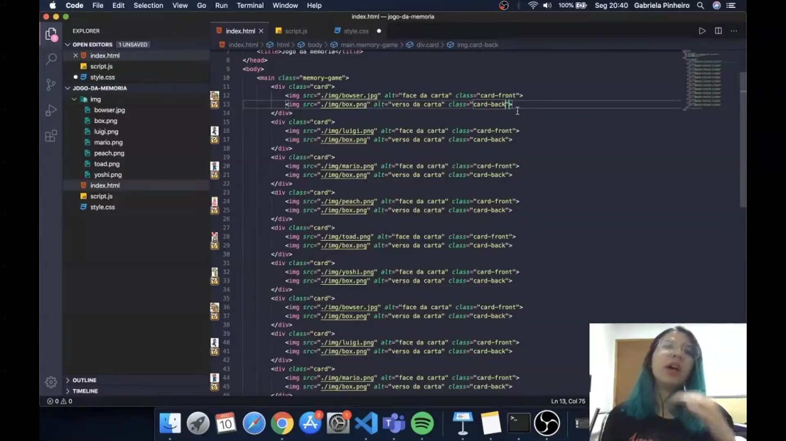
</p>

A estrutura inicial do projeto define a base do jogo da memória utilizando HTML. O contêiner principal é uma `main` com a classe `memory-game`, que agrupa todas as cartas do tabuleiro. Cada carta é estruturada dentro de uma `div` com a classe `card`, contendo duas imagens: a `card-front`, que exibe o personagem (como o Bowser), e a `card-back`, que exibe o verso padrão da carta (a "mystery box"). Para compor um jogo de 12 cartas, as seis imagens dos personagens são inseridas e posteriormente duplicadas no código.

```html
<main class="memory-game">
  <div class="card">
    
    
  </div>
  </main>

```

<p align="center">
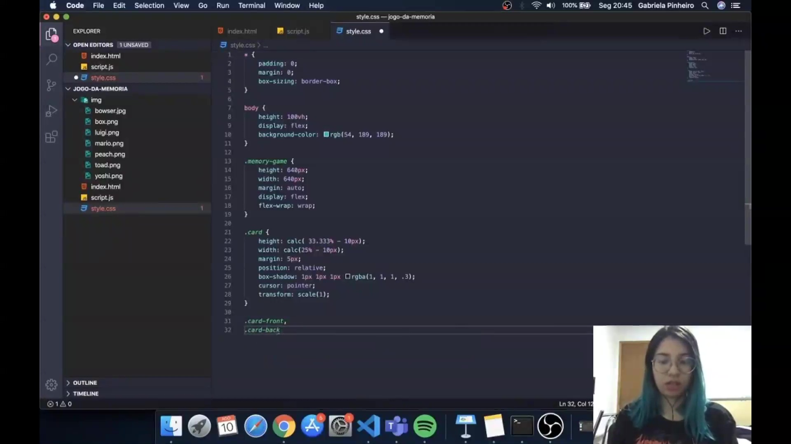
</p>

Após a estruturação do HTML, inicia-se a estilização global e do corpo da página no CSS. O primeiro passo é o "reset" dos estilos padrão, utilizando o seletor universal para zerar `padding` e `margin`, além de aplicar `box-sizing: border-box`, garantindo que bordas e preenchimentos sejam calculados dentro das dimensões definidas para os elementos. O `body` é configurado para ocupar toda a altura da tela visível (`100vh`) e utiliza `display: flex` para centralizar o conteúdo, com uma cor de fundo sólida para destacar o tabuleiro.

```css
* {
  padding: 0;
  margin: 0;
  box-sizing: border-box;
}

body {
  height: 100vh;
  display: flex;
  background-color: rgb(54, 189, 189);
}

```

<p align="center">
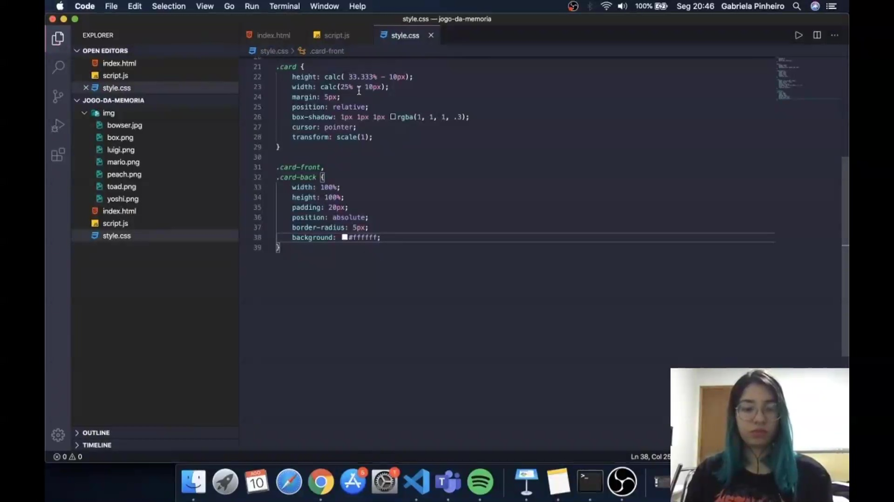
</p>

Nesta etapa, o contêiner `.memory-game` e as cartas individuais são estilizados para formar a grade do jogo. O contêiner possui dimensões fixas de 640px e usa `flex-wrap: wrap` para que as cartas quebrem de linha automaticamente. Para o `.card`, a altura e a largura são calculadas dinamicamente com a função `calc()`, subtraindo 10px das porcentagens (33.33% para altura e 25% para largura) para compensar a margem de 5px aplicada em cada lado. A propriedade `position: relative` é essencial para que as imagens internas (frente e verso) possam ser posicionadas de forma absoluta em relação à carta.

```css
.memory-game {
  height: 640px;
  width: 640px;
  margin: auto;
  display: flex;
  flex-wrap: wrap;
}

.card {
  height: calc(33.333% - 10px);
  width: calc(25% - 10px);
  margin: 5px;
  position: relative;
  box-shadow: 1px 1px 1px rgba(1, 1, 1, 0.3);
  cursor: pointer;
  transform: scale(1);
}

```

<p align="center">
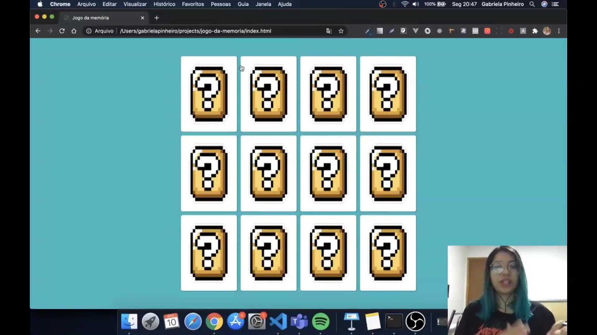
</p>

Para finalizar a aparência das cartas, as classes `.card-front` e `.card-back` recebem estilizações comuns. Ambas ocupam 100% da largura e altura do elemento pai e utilizam `position: absolute`, o que faz com que fiquem sobrepostas uma à outra dentro da `div.card`. É adicionado um `padding` de 20px para afastar as ilustrações das bordas, além de um `border-radius` para arredondar os cantos e um fundo branco para dar o aspecto de uma carta física. O resultado visual apresenta uma grade organizada com as "mystery boxes" visíveis, ocultando os personagens até que ocorra a interação.

```css
.card-front,
.card-back {
  width: 100%;
  height: 100%;
  padding: 20px;
  position: absolute;
  border-radius: 5px;
  background: white;
}
```

## 🟩 Vídeo 02

<video width="60%" controls>
  <source src="000-Midia_e_Anexos/bootcamp_tqi_fullstack-modulo_03-12-Projeto-Video_02.webm" type="video/webm">
    Seu navegador não suporta vídeo HTML5.
</video>

Link do vídeo: https://web.dio.me/lab/desenvolvendo-um-jogo-da-memoria/learning/3964771d-5ac9-4489-9a32-403150b305d8

O tutorial ensina como criar uma **interação visual dinâmica** em cartas virtuais utilizando propriedades de **CSS** e lógica de **JavaScript**. Inicialmente, o instrutor aplica um efeito de **escala reduzida** e transições suaves para simular um clique físico no elemento. Em seguida, o foco muda para a programação funcional, onde é criada uma lista de componentes para receberem um **ouvinte de eventos**. O código utiliza o método **toggle** para alternar uma classe específica, permitindo que cada carta mude de estado individualmente ao ser acionada pelo usuário. Por fim, o uso do contexto **this** garante que a animação de virar a carta seja aplicada exclusivamente ao item selecionado no momento da interação.

### Anotações

<p align="center">
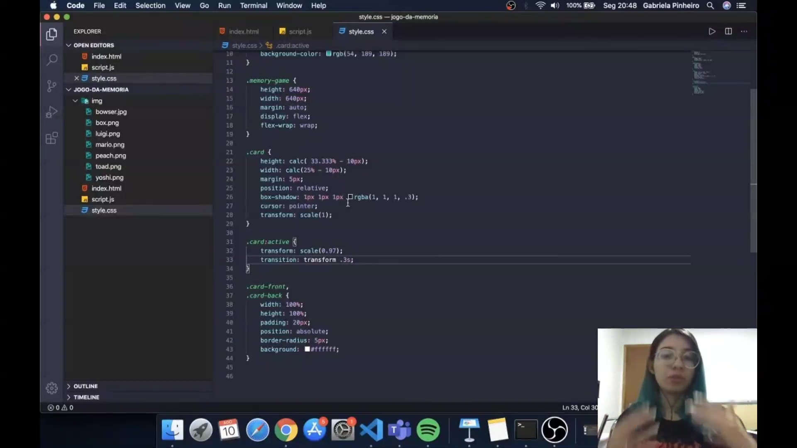
</p>

Nesta etapa, o foco é a implementação do efeito visual de interação nos cards do jogo. Para criar uma sensação de profundidade e feedback tátil ao usuário, é utilizado o seletor `:active` no CSS. Ao clicar na carta, a propriedade `transform: scale(0.97)` diminui levemente o tamanho do elemento, simulando o pressionar de um botão. Para que essa transição ocorra de forma suave, aplica-se a propriedade `transition` com uma duração de 0.3 segundos.

```css
.card:active {
  transform: scale(0.97);
  transition: transform .3s;
}

```

<p align="center">
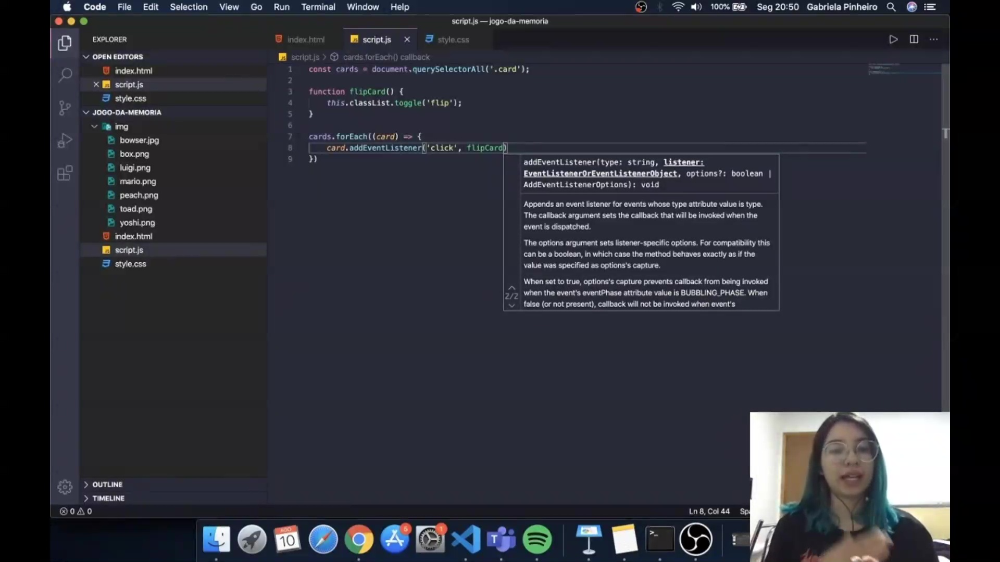
</p>

Para gerenciar a lógica de virar as cartas, iniciamos a programação em JavaScript selecionando todos os elementos que possuem a classe `.card` através do `document.querySelectorAll`. Em seguida, define-se a função `flipCard()`, que utiliza o método `classList.toggle('flip')`. O uso do `this` dentro da função refere-se ao contexto do elemento que disparou o evento, permitindo que a classe `flip` seja adicionada ou removida especificamente da carta clicada.

```javascript
const cards = document.querySelectorAll('.card');

function flipCard() {
  this.classList.toggle('flip');
}

```

<p align="center">
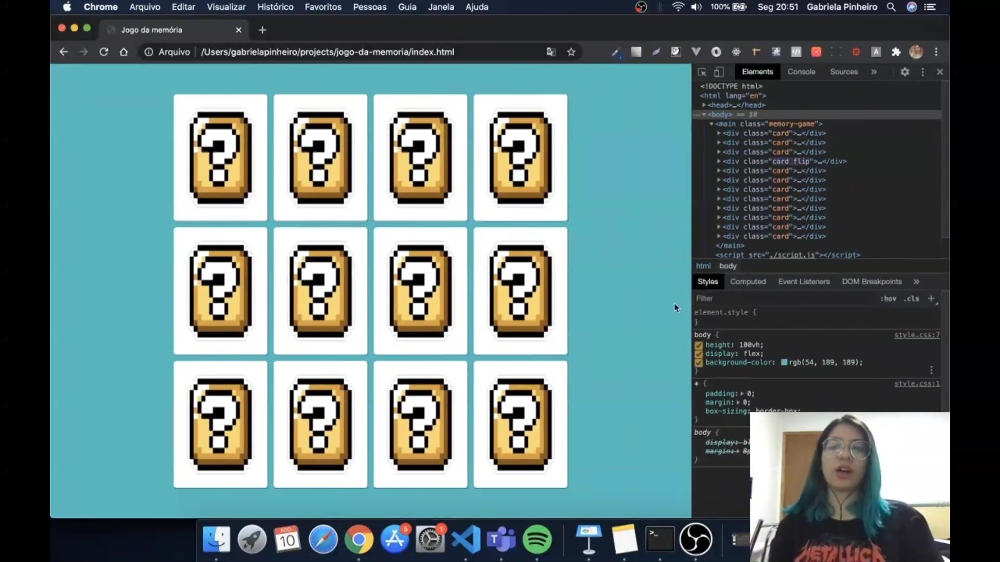
</p>

Com a lista de cartas armazenada e a função de virar definida, é necessário aplicar o comportamento a cada item individualmente. Utiliza-se o método `forEach` para percorrer a lista de elementos. Para cada `card`, adicionamos um "escutador de eventos" (`addEventListener`) que monitora o clique do usuário. Quando uma carta é clicada, a função `flipCard` é executada, o que pode ser verificado em tempo real através do inspetor de elementos do navegador, observando a classe `flip` sendo alternada na estrutura do DOM.

```javascript
cards.forEach(card => card.addEventListener('click', flipCard));

```      

## 🟩 Vídeo 03

<video width="60%" controls>
  <source src="000-Midia_e_Anexos/bootcamp_tqi_fullstack-modulo_03-12-Projeto-Video_03.webm" type="video/webm">
    Seu navegador não suporta vídeo HTML5.
</video>

Link do vídeo: https://web.dio.me/lab/desenvolvendo-um-jogo-da-memoria/learning/94a38ce9-a391-4e8a-949e-22f4f93e8b59

O vídeo explica como criar uma **animação 3D de rotação de cartas** para um jogo de memória utilizando **CSS**. A instrutora detalha a importância de definir uma **perspectiva no tabuleiro** e utilizar a propriedade **preserve-3d** para evitar que os elementos fiquem achatados durante o movimento. Ela demonstra como configurar o **tempo da transição** e aplicar a lógica de **rotação no eixo Y** quando uma classe específica é ativada via JavaScript. Um ponto crucial abordado é o uso do **backface-visibility**, técnica necessária para esconder o verso espelhado da carta e garantir um efeito visual fluido. Ao ajustar o posicionamento das faces frontal e traseira, o tutorial ensina como fazer com que a imagem correta apareça ao **clicar no elemento**.  

### Anotações

<p align="center">
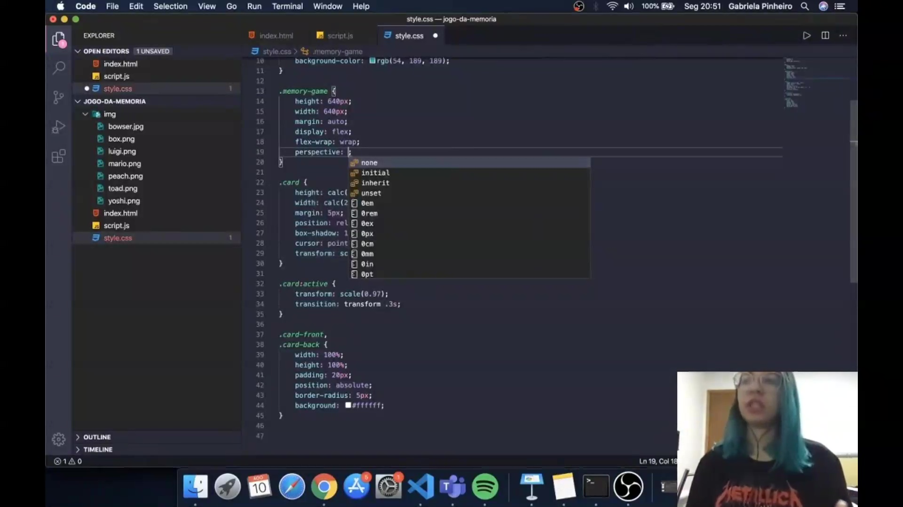
</p>

Para iniciar o tratamento das animações das cartas e criar o efeito de virada, é necessário configurar o ambiente tridimensional do jogo. O primeiro passo é adicionar uma perspectiva ao container principal do tabuleiro (`memory-game`). A propriedade `perspective` define a distância entre o plano  e o usuário, determinando a intensidade do efeito 3D; quanto maior o valor, mais suave é a distorção visual. 

```css
.memory-game {
  height: 640px;
  width: 640px;
  margin: auto;
  display: flex;
  flex-wrap: wrap;
  perspective: 1000px;
}

```

<p align="center">
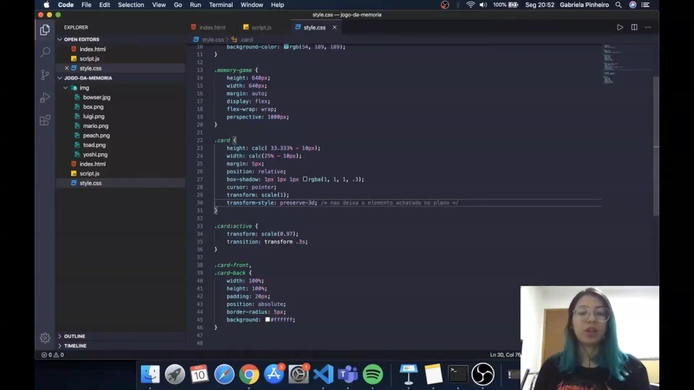
</p>

Para que as cartas não sejam renderizadas de forma achatada no plano 2D, utiliza-se a propriedade `transform-style: preserve-3d`. Isso garante que os elementos filhos (as faces da carta) mantenham sua posição no espaço tridimensional. Além disso, adicionamos uma `transition` para suavizar a animação de transformação, definindo um tempo de 0.9 segundos para que o movimento não seja excessivamente rápido. 

```css
.card {
  height: calc(33.333% - 10px);
  width: calc(25% - 10px);
  margin: 5px;
  position: relative;
  box-shadow: 1px 1px 1px rgba(1, 1, 1, 3);
  cursor: pointer;
  transform: scale(1);
  transform-style: preserve-3d;
  transition: transform .9s;
}

```

<p align="center">
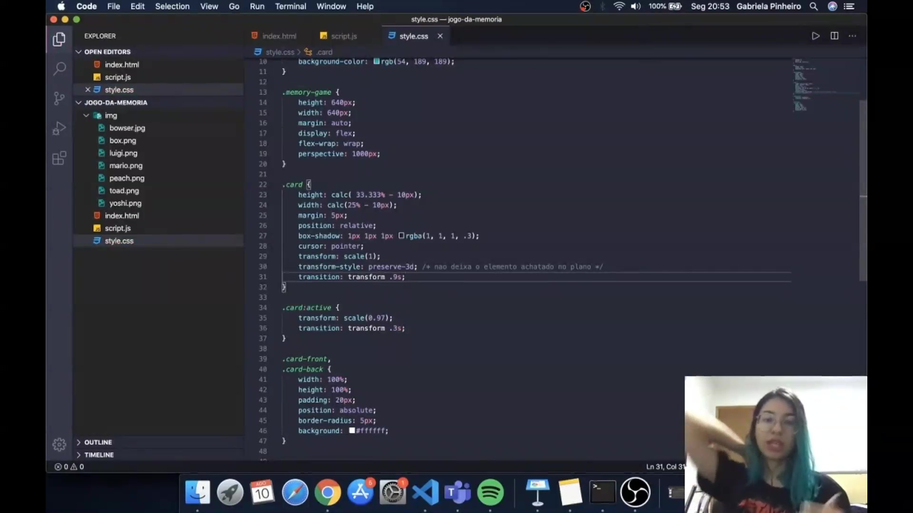
</p>

Nesta etapa, preparamos a estilização da classe que será alternada via JavaScript. A face frontal da carta (`.card-front`) deve ser rotacionada em 180 graus no eixo Y inicialmente. Isso é necessário para que, ao executarmos a animação de flip no container da carta, a imagem correta fique virada para o usuário. 

```css
.card-front,
.card-back {
  width: 100%;
  height: 100%;
  padding: 20px;
  position: absolute;
  border-radius: 5px;
  background: #fff;
}

.card-front {
  transform: rotateY(180deg);
}

```

<p align="center">
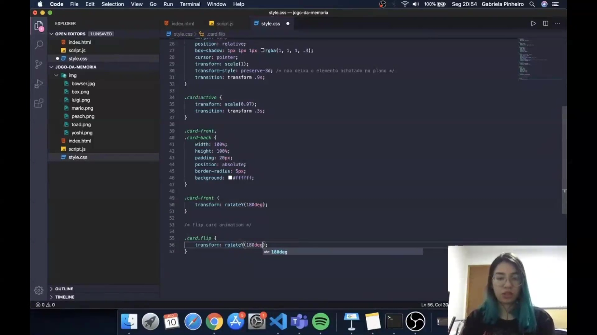
</p>

A animação principal é disparada pela classe `.flip`. Quando esta classe é adicionada ao elemento `.card`, ele sofre uma rotação de 180 graus no eixo Y (`rotateY(180deg)`). Como configuramos a transição anteriormente, essa mudança de estado resultará no efeito visual da carta girando. 

```css
/* flip card animation */

.card.flip {
  transform: rotateY(180deg);
}

```

<p align="center">
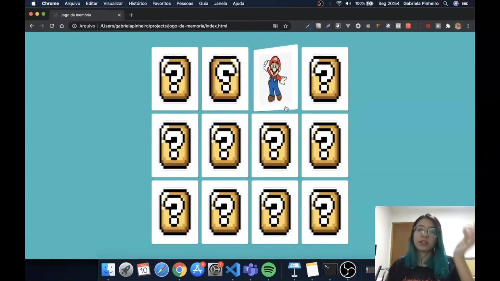
</p>

Ao testar a animação, nota-se um problema visual: as cartas aparecem espelhadas ou transparentes durante a virada. Isso ocorre porque, por padrão, o navegador exibe o verso dos elementos de forma espelhada. A interface do jogo mostra as cartas com o ícone de interrogação (back face) e, ao clicar, a transição começa a revelar a face do personagem (Mario), mas o comportamento ainda não está polido. 

<p align="center">
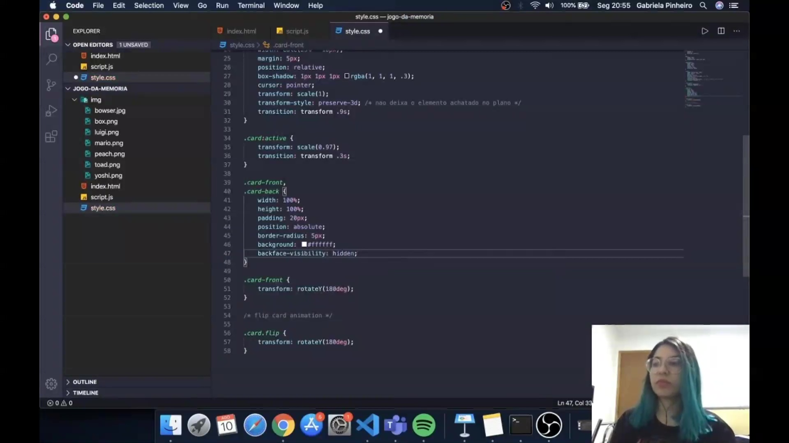
</p>

Para corrigir o artefato visual da carta espelhada, aplicamos a propriedade `backface-visibility: hidden`. Esta regra retira a visibilidade do verso da div quando ela está voltada para trás em relação ao usuário, garantindo que apenas a face que deve estar visível apareça, criando um efeito de virada muito mais limpo e realista. 

```css
.card-front,
.card-back {
  width: 100%;
  height: 100%;
  padding: 20px;
  position: absolute;
  border-radius: 5px;
  background: #fff;
  backface-visibility: hidden;
}

```

<p align="center">
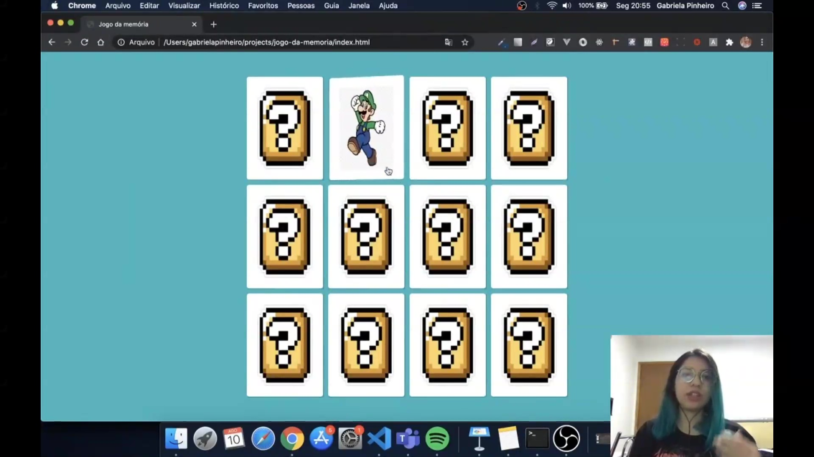
</p>

Com a propriedade `backface-visibility` aplicada, o teste no navegador demonstra que a carta do Luigi agora vira corretamente. O verso (caixa com interrogação) desaparece no momento em que a rotação ultrapassa os 90 graus, revelando a face frontal sem transparências indesejadas ou o efeito de espelhamento. 

<p align="center">
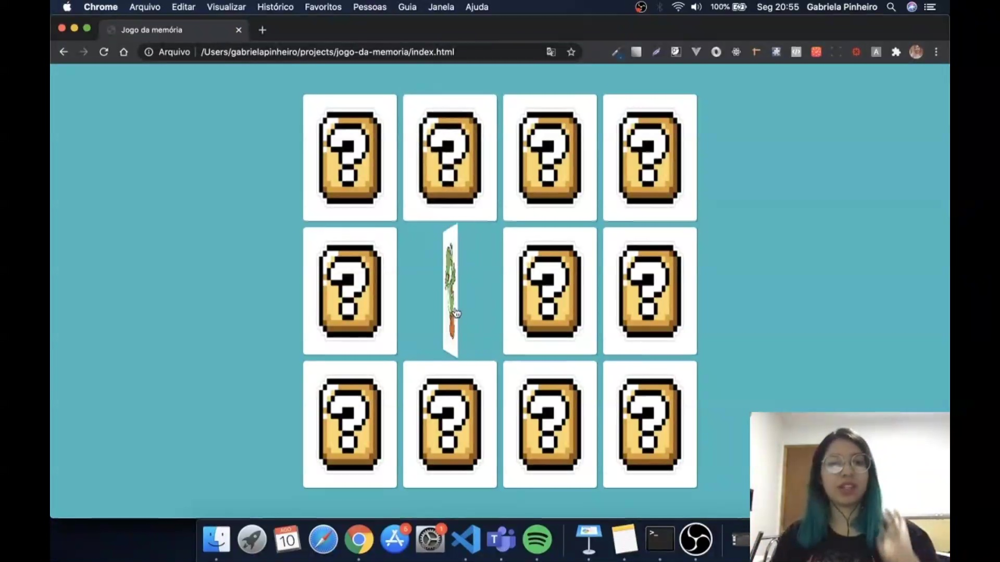
</p>

A imagem demonstra o estado intermediário da animação. Graças ao `preserve-3d` e à `perspective` definidos no container pai, a carta mantém sua integridade estrutural durante o movimento de rotação no eixo Y, criando a ilusão de profundidade necessária para um jogo de memória digital. 

<p align="center">
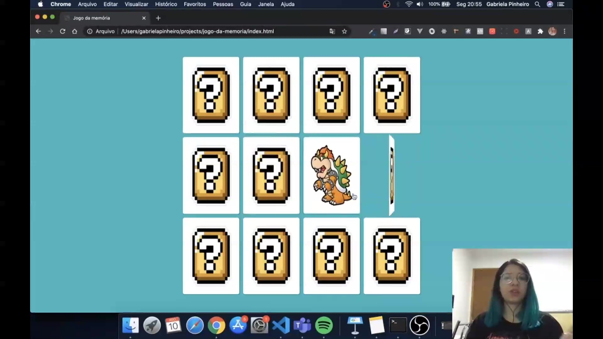
</p>

O resultado final da estilização CSS permite que cada carta (como a do Bowser ilustrada) funcione de forma independente. O clique aciona a classe `.flip`, e a combinação de `rotateY(180deg)` na face frontal com o `hidden` na visibilidade do verso completa a lógica visual da mecânica do jogo. 

<p align="center">
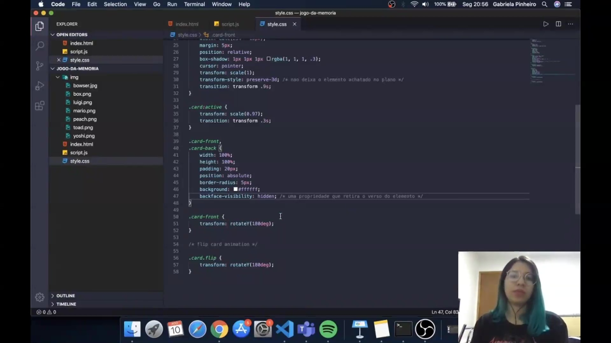
</p>

Revisão final do código CSS consolidado. A estrutura utiliza `position: absolute` nas faces para sobrepô-las dentro do container `.card` que possui `position: relative`. A lógica de rotação inversa na face frontal (`.card-front`) é o que permite que, ao girar o card todo em 180 graus, ela finalmente fique de frente para o usuário. 

```css
.card-front,
.card-back {
  width: 100%;
  height: 100%;
  padding: 20px;
  position: absolute;
  border-radius: 5px;
  background: #fff;
  backface-visibility: hidden;
}

.card-front {
  transform: rotateY(180deg);
}

/* flip card animation */
.card.flip {
  transform: rotateY(180deg);
}

```

## 🟩 Vídeo 04

<video width="60%" controls>
  <source src="000-Midia_e_Anexos/bootcamp_tqi_fullstack-modulo_03-12-Projeto-Video_04.webm" type="video/webm">
    Seu navegador não suporta vídeo HTML5.
</video>

Link do vídeo: https://web.dio.me/lab/desenvolvendo-um-jogo-da-memoria/learning/ea8ee30d-9ef2-4bb5-87c2-7cd37602e562

O vídeo detalha a **implementação da lógica de programação** para um **jogo da memória** utilizando JavaScript. O instrutor explica a importância de usar o método **add** em vez de toggle para garantir que o usuário não reverta a seleção da carta com cliques repetidos. Para gerenciar as jogadas, o código utiliza **variáveis de controle** que armazenam o estado do clique e identificam especificamente a primeira e a segunda cartas escolhidas. A validação de igualdade é realizada por meio de **atributos data no HTML**, que permitem ao sistema comparar se os pares selecionados são idênticos. Caso haja um acerto, uma função é disparada para **desabilitar as cartas**, enquanto um erro aciona o retorno delas ao estado original. Por fim, o autor enfatiza a necessidade de **resetar o estado do jogo** após cada tentativa para permitir novas rodadas de comparação.

### Anotações

<p align="center">
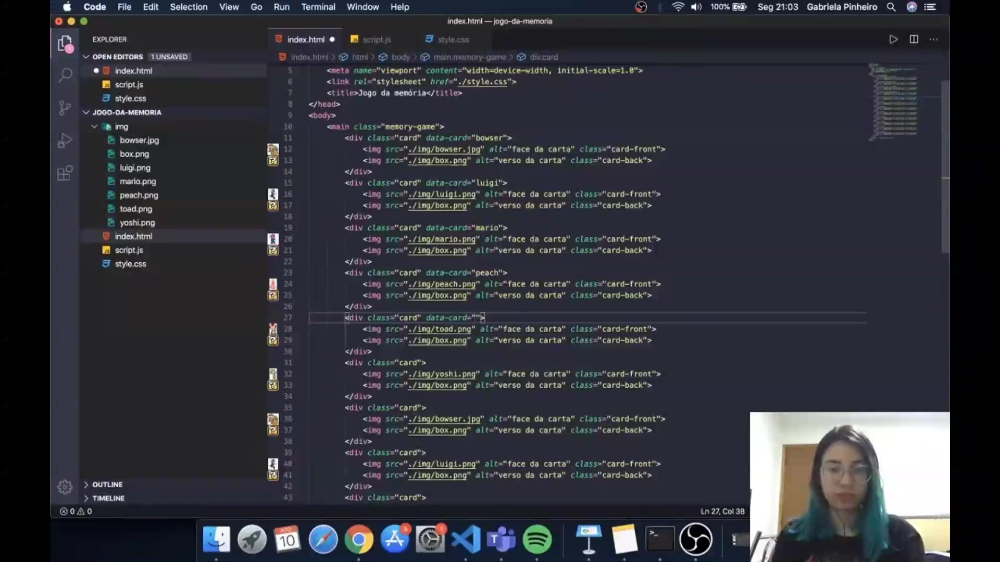
</p>

Nesta etapa, o foco é a organização do arquivo HTML para permitir a identificação lógica de cada carta durante o jogo. Para que o JavaScript consiga comparar se duas cartas são iguais, é utilizado o atributo customizado `data-card` em cada elemento `div` que representa uma carta.

Cada carta recebe um valor específico correspondente ao personagem que ela representa, como "bowser", "luigi", "mario" ou "peach". Essa marcação é essencial para a lógica de comparação que será desenvolvida posteriormente, permitindo que o código identifique o conteúdo da carta sem depender apenas da estrutura das imagens internas.

```html
<div class="card" data-card="bowser">
  
  
</div>
<div class="card" data-card="luigi">
  
  
</div>
<div class="card" data-card="mario">
  
  
</div>
<div class="card" data-card="peach">
  
  
</div>

```

<p align="center">
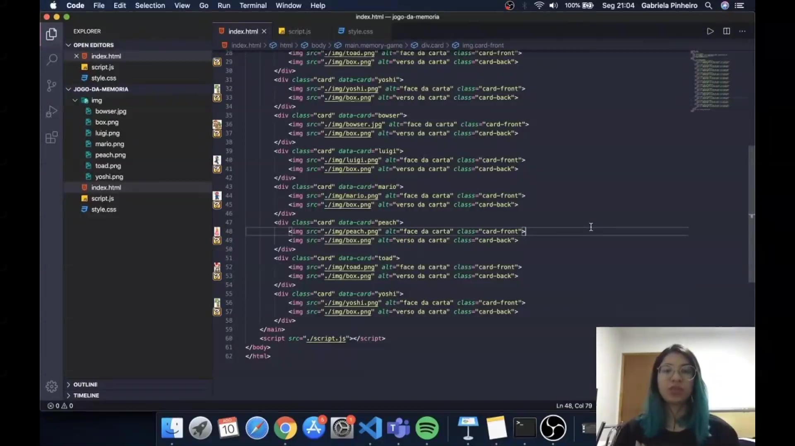
</p>

A finalização do mapeamento dos personagens no HTML completa a estrutura necessária para o funcionamento do tabuleiro. Todos os elementos `div` com a classe `card` agora possuem seus respectivos atributos `data-card`, incluindo novos personagens como "toad" e "yoshi".

Note que, como se trata de um jogo da memória, os pares são criados repetindo as estruturas com o mesmo valor de `data-card`. Ao final do arquivo, o script JavaScript é referenciado através da tag `<script src="./script.js"></script>`, garantindo que a lógica de interação seja carregada após a renderização dos elementos.

```html
<div class="card" data-card="toad">
  
  
</div>
<div class="card" data-card="yoshi">
  
  
</div>
<div class="card" data-card="bowser">
  
  
</div>

```

<p align="center">
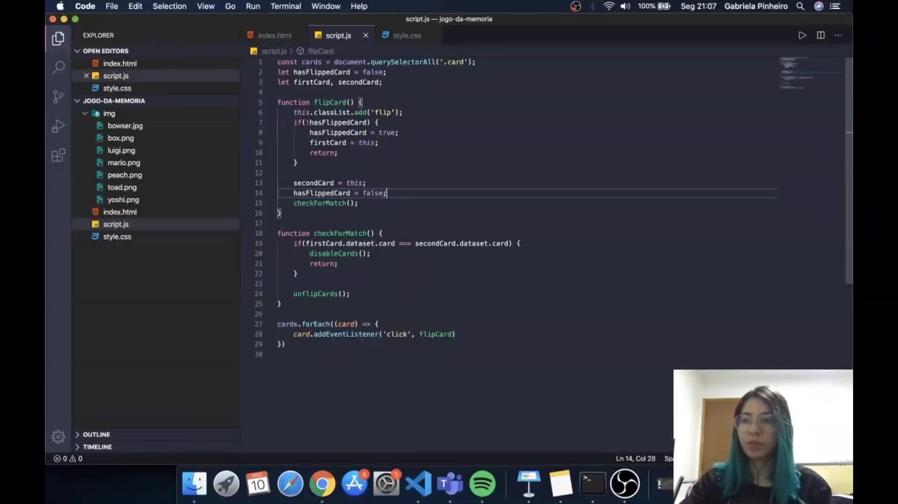
</p>

A lógica do jogo é controlada por variáveis de estado e funções de verificação. A variável `hasFlippedCard` controla se o jogador está no primeiro ou no segundo clique da rodada. Quando uma carta é clicada, a função `flipCard` adiciona a classe `'flip'` para animar a carta e armazena a referência do elemento em `firstCard` ou `secondCard`.

A função `checkForMatch` é responsável por comparar os atributos `dataset.card` das duas cartas selecionadas. Se os valores forem idênticos, a função `disableCards` é acionada para manter as cartas viradas e remover sua interatividade. Caso contrário, a função `unflipCards` será chamada para desvirar as cartas e permitir uma nova tentativa.

```javascript
const cards = document.querySelectorAll('.card');
let hasFlippedCard = false;
let firstCard, secondCard;

function flipCard() {
  this.classList.add('flip');

  if (!hasFlippedCard) {
    hasFlippedCard = true;
    firstCard = this;
    return;
  }

  secondCard = this;
  hasFlippedCard = false;
  checkForMatch();
}

function checkForMatch() {
  if (firstCard.dataset.card === secondCard.dataset.card) {
    disableCards();
    return;
  }

  unflipCards();
}

cards.forEach((card) => {
  card.addEventListener('click', flipCard);
});

```      

## 🟩 Vídeo 05

<video width="60%" controls>
  <source src="000-Midia_e_Anexos/bootcamp_tqi_fullstack-modulo_03-12-Projeto-Video_05.webm" type="video/webm">
    Seu navegador não suporta vídeo HTML5.
</video>

Link do vídeo: https://web.dio.me/lab/desenvolvendo-um-jogo-da-memoria/learning/99a27f13-1ee1-4f01-aecb-29f8b47fc28f?back=/track/tqi-fullstack-developer 

A autora detalha a criação da função **disableCards**, que remove a capacidade de clique das cartas quando um par é formado, e a função **unflipCards**, que utiliza o método **setTimeout** para desvirar cartas que não coincidem. Além disso, é introduzida a variável **lockBoard**, um mecanismo essencial para **bloquear o tabuleiro** e evitar que o usuário clique em múltiplas cartas simultaneamente, o que causaria erros na comparação. A explicação demonstra como gerenciar a **interatividade do DOM** para garantir que o fluxo do jogo seja fluido e livre de falhas técnicas. O objetivo final é criar uma experiência dinâmica onde a **lógica condicional** dite as regras de funcionamento de cada jogada.

### Anotações

<p align="center">
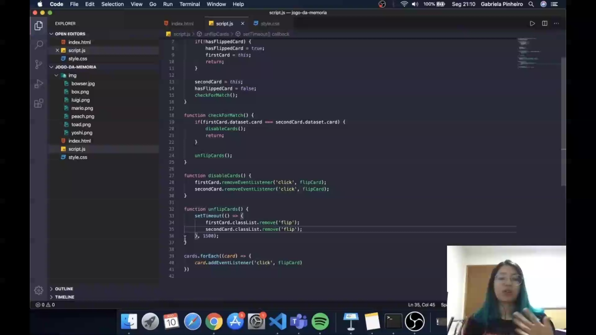
</p>

Para gerenciar o estado das cartas que formam um par, é necessária a criação da função `disableCards`. Esta função é responsável por retirar o receptor de eventos (*event listener*) de clique dos elementos que foram identificados como iguais. Ao remover o callback `flipCard`, garantimos que o usuário não consiga mais interagir ou desvirar essas cartas especificamente, consolidando o acerto no jogo.

```javascript
function disableCards() {
  firstCard.removeEventListener('click', flipCard);
  secondCard.removeEventListener('click', flipCard);
}

```

<p align="center">
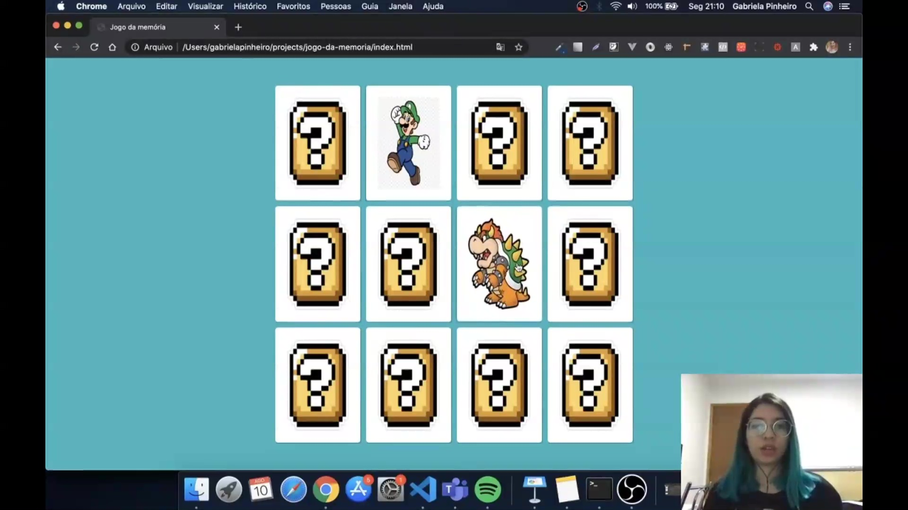
</p>

Quando as cartas selecionadas não são iguais, elas precisam retornar ao estado original (viradas para baixo). Para isso, utiliza-se a função `unflipCards`, que implementa o método `setTimeout`. Este método nativo do JavaScript permite que a remoção da classe CSS `'flip'` ocorra após um intervalo determinado, dando tempo para que o jogador visualize as cartas antes que elas virem de volta.

```javascript
function unflipCards() {
  setTimeout(() => {
    firstCard.classList.remove('flip');
    secondCard.classList.remove('flip');
  }, 1500);
}

```

<p align="center">
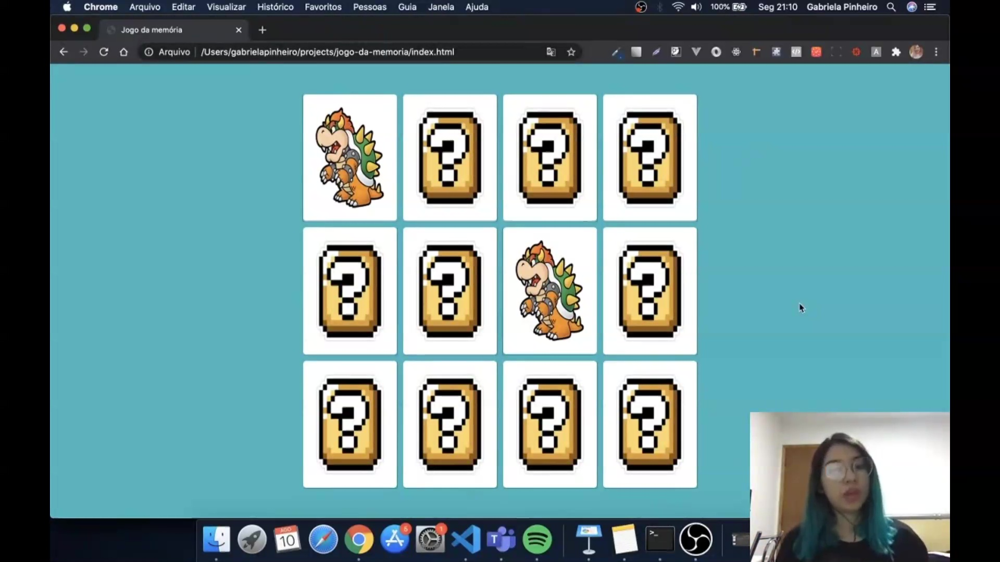
</p>

Neste estágio, a lógica principal de comparação está operacional no navegador. O jogo verifica se as cartas são iguais: caso a condicional resulte em verdadeiro, as cartas permanecem viradas (conforme o comportamento da função de desabilitação); caso contrário, o atributo de estilização que as mantém viradas é removido, permitindo que o fluxo do jogo continue até que todos os pares sejam encontrados.

<p align="center">
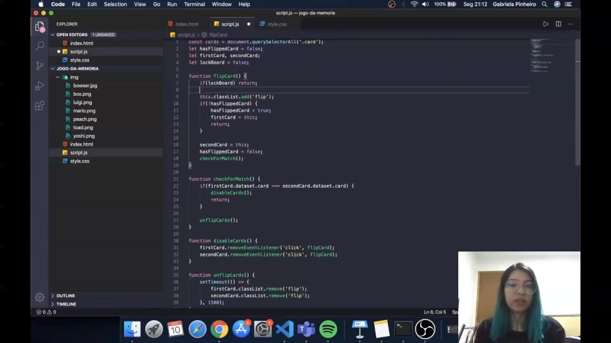
</p>

Para evitar bugs e comportamentos inesperados, como tentar virar múltiplas cartas simultaneamente enquanto uma animação ainda ocorre, implementa-se o **bloqueio do tabuleiro**. Através de uma variável de controle chamada `lockBoard`, o código verifica se o tabuleiro está "trancado". Se `lockBoard` for verdadeiro, a função `flipCard` interrompe sua execução imediatamente com um `return`, impedindo que novas interações processem lógica de comparação indevida.

```javascript
let lockBoard = false;

function flipCard() {
  if (lockBoard) return;
  this.classList.add('flip');
  // ... resto da lógica
}

```

## 🟩 Vídeo 06

<video width="60%" controls>
  <source src="000-Midia_e_Anexos/bootcamp_tqi_fullstack-modulo_03-12-Projeto-Video_06.webm" type="video/webm">
    Seu navegador não suporta vídeo HTML5.
</video>

Link do vídeo: https://web.dio.me/lab/desenvolvendo-um-jogo-da-memoria/learning/6fd7bf3e-ba1f-4f49-83d3-fd9c844f3aa2?back=/track/tqi-fullstack-developer

A instrutora detalha como utilizar uma **trava no tabuleiro** para impedir que o usuário clique em várias cartas simultaneamente enquanto as animações ocorrem. Além disso, é explicada a correção de um erro comum onde o sistema valida o **clique duplo** na mesma carta como um par idêntico. Para manter a organização do código, a autora introduz uma função de **reset do sistema**, utilizando a técnica de **desestruturação de arrays** para limpar variáveis de estado. Por fim, o tutorial demonstra como garantir que as cartas selecionadas retornem ao **estado nulo** após cada rodada, permitindo que a partida flua sem interrupções técnicas.

### Anotações

<p align="center">
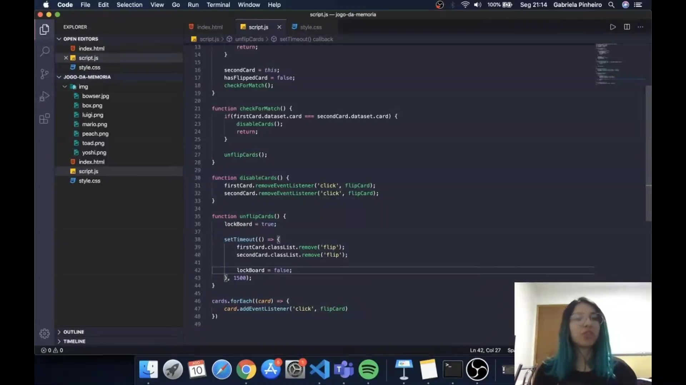
</p>

Nesta etapa, a lógica de desvirar as cartas (**unflipCards**) é refinada para garantir a integridade do jogo. Quando as cartas escolhidas não formam um par, a variável `lockBoard` é definida como `true`. Isso impede que o jogador clique em outras cartas enquanto o `setTimeout` está em execução. Após o intervalo de 1500ms, as cartas são desviradas removendo a classe `flip` e o tabuleiro é liberado novamente ao definir `lockBoard` como `false`.

```javascript
function unflipCards() {
  lockBoard = true;

  setTimeout(() => {
    firstCard.classList.remove('flip');
    secondCard.classList.remove('flip');

    lockBoard = false;
  }, 1500);
}

```

<p align="center">
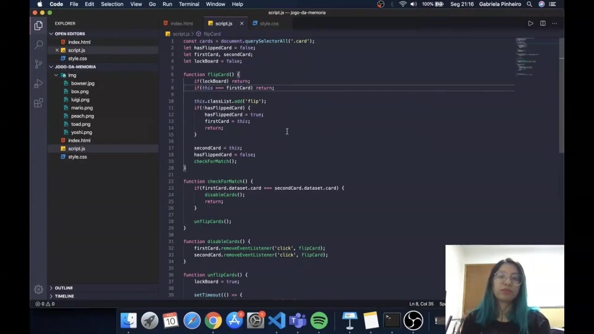
</p>

Para evitar erros na lógica de comparação, foi implementada uma verificação de "duplo clique" na mesma carta. Se o elemento clicado (`this`) for exatamente igual ao `firstCard` já armazenado, a função retorna imediatamente. Isso impede que o sistema compare uma carta consigo mesma, o que resultaria em uma combinação positiva indevida baseada no `dataset`.

```javascript
function flipCard() {
  if (lockBoard) return;
  if (this === firstCard) return;

  this.classList.add('flip');

  if (!hasFlippedCard) {
    hasFlippedCard = true;
    firstCard = this;
    return;
  }

  secondCard = this;
  hasFlippedCard = false;
  checkForMatch();
}

```

<p align="center">

</p>

Para manter o código limpo e funcional, foi criada a função `resetBoard`. Utilizando a técnica de desestruturação de arrays, as variáveis de controle (`hasFlippedCard`, `lockBoard`) e as referências das cartas (`firstCard`, `secondCard`) são resetadas para seus estados iniciais após cada rodada de comparação, seja em caso de acerto (dentro de `disableCards`) ou erro (dentro de `unflipCards`).

```javascript
function disableCards() {
  firstCard.removeEventListener('click', flipCard);
  secondCard.removeEventListener('click', flipCard);

  resetBoard();
}

function unflipCards() {
  lockBoard = true;

  setTimeout(() => {
    firstCard.classList.remove('flip');
    secondCard.classList.remove('flip');

    resetBoard();
  }, 1500);
}

function resetBoard() {
  [hasFlippedCard, lockBoard] = [false, false];
  [firstCard, secondCard] = [null, null];
}

```


## 🟩 Vídeo 07

<video width="60%" controls>
  <source src="000-Midia_e_Anexos/bootcamp_tqi_fullstack-modulo_03-12-Projeto-Video_07.webm" type="video/webm">
    Seu navegador não suporta vídeo HTML5.
</video>

Link do vídeo: https://web.dio.me/lab/desenvolvendo-um-jogo-da-memoria/learning/a1da3822-47bc-45ba-80b6-5bed33492380

A instrutora detalha a criação de uma função de **embaralhamento** das cartas, explicando como manipular a propriedade **order** do Flexbox para alterar a disposição visual dos elementos. Para garantir a aleatoriedade, utiliza-se o objeto **Math** para gerar números inteiros que definem novas posições para cada carta. O código é estruturado dentro de uma **IIFE** (Expressão de Função Invocada Imediatamente), permitindo que o jogo seja reiniciado com um novo layout automaticamente. O tutorial encerra demonstrando o funcionamento prático da lógica aplicada no navegador.

### Anotações

<p align="center">

</p>

Nesta etapa, o foco é a criação da lógica para embaralhar as cartas do jogo, garantindo que a disposição dos elementos mude a cada nova partida. Para isso, utiliza-se a propriedade CSS **order** dentro de um flex container. Como as cartas estão organizadas em grupos (divs com imagens dentro), a alteração do valor numérico desta propriedade redefine a sequência visual em que os elementos aparecem na tela, independentemente da ordem em que foram escritos no HTML.

Para implementar essa funcionalidade, define-se a função `shuffle`. Através de uma iteração no array de cartas (`cards.forEach`), é gerada uma posição aleatória para cada item.

```javascript
function shuffle() {
  cards.forEach((card) => {
    let randomPosition = Math.floor(Math.random() * 12);
    card.style.order = randomPosition;
  });
}

```

<p align="center">
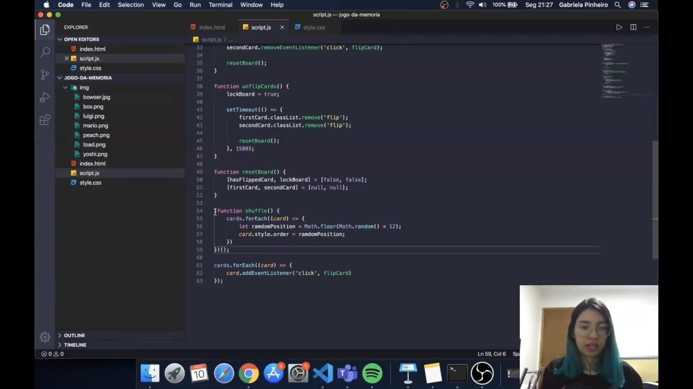
</p>

Para que o embaralhamento ocorra automaticamente no momento em que a página é carregada, a função `shuffle` é transformada em uma **Immediately Invoked Function Expression (IIFE)**. Isso significa que a função será executada assim que for definida. Para transformá-la, basta encapsular a declaração da função entre parênteses e adicionar um par de parênteses extra ao final para invocá-la.

```javascript
(function shuffle() {
  cards.forEach((card) => {
    let randomPosition = Math.floor(Math.random() * 12);
    card.style.order = randomPosition;
  });
})();

```

<p align="center">
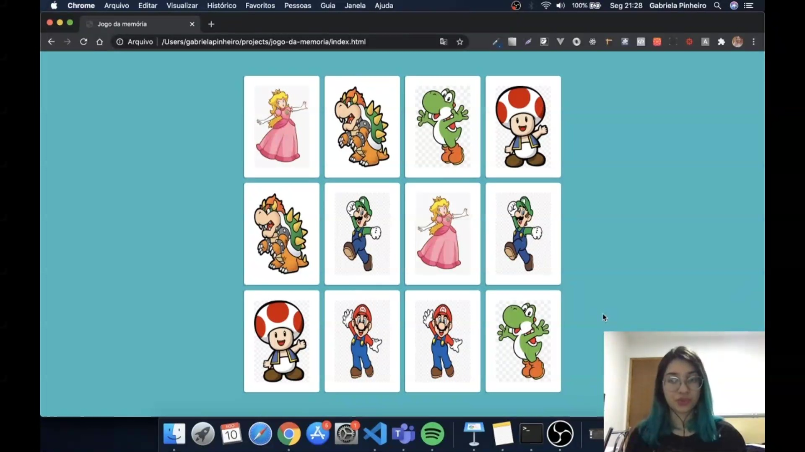
</p>

Com a lógica de embaralhamento aplicada, o resultado final é um tabuleiro onde os pares de personagens (como Mario, Luigi, Peach, Yoshi e Toad) aparecem em posições aleatórias a cada execução. O uso do `Math.floor(Math.random() * 12)` garante que cada carta receba um valor de `order` entre 0 e 11, distribuindo-as de forma variada pelo grid do jogo da memória e concluindo a estruturação funcional do projeto.      


## ▶️ Objetivo do Projeto

Link: 

### Entendendo o Desafio

Agora é a sua hora de brilhar e construir um perfil de destaque na DIO! 

Explore todos os conceitos explorados até aqui e replique (ou melhor, porque não?) este projeto prático. 

Para isso, crie seu próprio repositório e aumente ainda mais seu portfólio de projetos no GitHub, o qual pode fazer toda diferença em suas entrevistas técnicas 😎

Neste repositório, insira todos os links e arquivos necessários para seu projeto,  
seja um arquivo de banco de dados ou um link para o template no Figma.

**Dica:** Se o expert forneceu um repositório Github, você pode dar um "fork" no repositório dele para organizar suas alterações e evoluções mantendo uma referência direta ao código-fonte original.

### Repositório Git

O Git é um conceito essencial no mercado de trabalho atualmente,  
por isso sempre reforçamos sua importância em nossa metodologia educacional.  
Por isso, todo código-fonte desenvolvido durante este conteúdo foi versionado no seguinte endereço para que você possa consultá-lo a qualquer momento:

[github.com/SpruceGabriela/jogo-da-memoria-dio](https://github.com/SpruceGabriela/jogo-da-memoria-dio)

**Bons estudos 😉**

# Certificado: Desenvolvendo um Jogo da Memória

- Link na plataforma: https://hermes.dio.me/certificates/D28W57FJ.pdf
- Certificado em pdf: [Certificado-Desenvolvendo um Jogo da Memória.pdf](<000-Midia_e_Anexos/Certificado-Desenvolvendo um Jogo da Memória.pdf>)
