## Instrutor

- Bruno Carneiro (Planning & Business Performance Director na Magazine Luiza)
- Contato Linkedin: / [brunohvcarneiro](https://www.linkedin.com/in/brunohvcarneiro/)

# Parte 1 - Introdução ao ReactJS

## 🟩 Vídeo 01 - Conheça a tecnologia ReactJS

<video width="60%" controls>
  <source src="000-Midia_e_Anexos/bootcamp_tqi_fullstack-modulo_04-Video_01.webm" type="video/webm">
    Seu navegador não suporta vídeo HTML5.
</video>

Link do vídeo: https://web.dio.me/track/tqi-fullstack-developer/course/introducao-ao-reactjs/learning/01818f0a-18b2-4023-a555-57ebefba56af?autoplay=1 

O vídeo apresenta uma introdução abrangente ao **React JS**, conduzida pelo especialista Bruno Carneiro, que define a ferramenta como uma **biblioteca JavaScript** focada na criação de interfaces de usuário. O autor detalha a **trajetória histórica** da tecnologia, desde sua criação no Facebook para resolver problemas de escalabilidade até sua expansão para plataformas **mobile e desktop**. São destacados requisitos técnicos essenciais, como o domínio de **JavaScript e NPM**, além de explicar a natureza **declarativa e modular** da biblioteca através da componentização. A fonte enfatiza a **flexibilidade do React**, diferenciando-o de frameworks rígidos e ilustrando sua relevância no mercado por meio do uso em grandes empresas como **Netflix e Instagram**. Por fim, o conteúdo reforça as vantagens de um ecossistema vasto que permite o desenvolvimento de aplicações **modernas e multiplataforma**.

### Anotações

<p align="center">

</p>

Esta é a abertura do curso de **Introdução ao ReactJS**, ministrado por Bruno Carneiro, Líder Técnico no Luiza Labs. O curso foca nos fundamentos da biblioteca ReactJS para o desenvolvimento de interfaces modernas.

<p align="center">

</p>

Os primeiros objetivos da aula incluem uma introdução à **História e Conceitos** fundamentais do React, seguida pelas etapas de **Configuração** do ambiente de desenvolvimento. Também será abordado o **JSX**, que é a extensão de sintaxe para JavaScript utilizada no React.

<p align="center">

</p>

Dando continuidade ao cronograma, o curso explorará o processo de **Renderização** de elementos na tela e a criação de **Componentes e Props**, que permitem a construção de interfaces modulares. Outro ponto central será o entendimento do **Estado e Ciclo de Vida** dos componentes, essenciais para gerenciar dados dinâmicos.

<p align="center">

</p>

O último tópico listado nos objetivos da aula é o **Ecossistema** do React. Compreender o ecossistema é fundamental para entender como o React interage com outras ferramentas e bibliotecas para criar aplicações completas e escaláveis.

<p align="center">

</p>

Para acompanhar o curso, são necessários alguns pré-requisitos técnicos: conhecimentos básicos em **JavaScript, CSS e HTML**. Além disso, é necessário ter um **Editor de Texto** instalado e o **NPM** (Node Package Manager) para gerenciar as dependências do projeto.

<p align="center">

</p>

Conceitualmente, o React é definido como "uma biblioteca JavaScript para criar interfaces de usuário". No momento da gravação, a versão de referência utilizada era a **16.8.6**.

<p align="center">

</p>

O React foi criado em **2011 por Jordan Walke**, um engenheiro do **Facebook**. Sua origem é baseada no **XHP**, que era um framework utilizado para a criação de HTML dentro do ecossistema PHP da empresa. Inicialmente, o React foi implementado para gerenciar o **mural de notícias** (news feed) do Facebook.

<p align="center">

</p>

A linha do tempo do React mostra marcos importantes: em **2012**, passou a ser utilizado no **Instagram**; em **2013**, foi anunciado como projeto **OpenSource** durante a JSConf US; e em **2015**, expandiu-se com o lançamento do **React Native** e o suporte para **UWP** (Universal Windows Platform).

<p align="center">

</p>

É fundamental distinguir que o React é uma **biblioteca** e não um framework. Enquanto frameworks costumam ditar a estrutura completa da aplicação, o React foca especificamente em sua principal função: a **criação da interface para o usuário**.

<p align="center">

</p>

De acordo com o relatório do **Stack Overflow de 2019**, o React.js já se posicionava como a segunda tecnologia de interface mais utilizada (31.3%), aproximando-se do jQuery (48.7%) entre os desenvolvedores profissionais. Esse crescimento reflete a popularidade do JavaScript e a eficiência do React em diversos contextos, como dispositivos móveis e front-end.      


## 🟩 Vídeo 02 - Aprenda a configurar o ReactJS

<video width="60%" controls>
  <source src="000-Midia_e_Anexos/bootcamp_tqi_fullstack-modulo_04-Video_02.webm" type="video/webm">
    Seu navegador não suporta vídeo HTML5.
</video>

Link do vídeo: https://web.dio.me/track/tqi-fullstack-developer/course/introducao-ao-reactjs/learning/7b2d1a93-9235-412e-9749-44fb27e0ef93?autoplay=1

O vídeo apresenta um guia prático sobre a **configuração inicial e os fundamentos do React**, destacando o uso do **React Scripts** para automatizar a criação de servidores e ferramentas de build. O autor detalha a estrutura de um projeto, explicando a função do arquivo **package.json** e do gerenciador de pacotes **NPM** no ecossistema JavaScript. Uma parte significativa da explicação é dedicada ao **JSX**, descrevendo-o como uma extensão que permite integrar **lógica JavaScript diretamente em estruturas HTML** de forma declarativa. O conteúdo também aborda o conceito de **Single Page Application (SPA)** e demonstra como renderizar componentes dentro de um elemento raiz no navegador. Por fim, são fornecidos exemplos de **interpolação de funções** e a aplicação de estilos através do atributo **className**, ressaltando a facilidade do desenvolvimento com o recurso de **hot reload**.

### Anotações

<p align="center">

</p>

Para iniciar o desenvolvimento com React, o requisito fundamental é ter o **NPM (Node Package Manager)** instalado no sistema. A ferramenta padrão recomendada pelo Facebook para criar novos projetos é o **Create React App**, uma biblioteca que automatiza a configuração inicial do ambiente frontend, entregando uma estrutura base pronta para uso.

<p align="center">

</p>

O **Create React App** utiliza internamente o **React Scripts**, que gerencia ferramentas essenciais como o **Webpack** (para empacotamento) e o **Jest** (para testes). Embora existam alternativas como configurar manualmente via Parcel ou Rollup, ou até utilizar CDNs, o uso do React Scripts simplifica o processo ao montar automaticamente um servidor de desenvolvimento.

<p align="center">

</p>

O processo de criação de um projeto começa com a inicialização do Node.js no diretório escolhido. Ao executar o comando de inicialização, o sistema cria o arquivo de configuração essencial para o ecossistema JavaScript.

```bash
npm init

```

<p align="center">

</p>

Após a inicialização, é necessário instalar as dependências principais. O comando abaixo instala a biblioteca do React em uma versão específica e o pacote de scripts que automatiza as tarefas de build e execução.

```bash
npm install react@16.8.6 react-dom@16.8.6 react-scripts

```

<p align="center">

</p>

O arquivo **package.json** funciona como o cérebro do projeto, centralizando todas as informações, versões de dependências e os scripts que serão utilizados para rodar a aplicação. Inicialmente, as abas de scripts e dependências refletem o que foi instalado via terminal.

<p align="center">

</p>

Para que o React Scripts funcione corretamente, é necessário criar uma pasta chamada **public**. Este diretório é identificado pela ferramenta como o ponto de entrada estático da aplicação.

```bash
mkdir public

```

<p align="center">

</p>

Dentro da pasta public, cria-se um arquivo HTML básico. O elemento mais importante deste arquivo é uma **div** com o atributo `id="root"`. É neste local específico que o React "pendurará" toda a interface da aplicação durante a renderização.

```html
<!DOCTYPE html>
<html lang="en">
<head>
    <meta charset="UTF-8">
    <title>React App</title>
</head>
<body>
    <div id="root"></div>
</body>
</html>

```

<p align="center">

</p>

Além da pasta pública, deve-se criar uma pasta **src** (source), que conterá o código-fonte lógico da aplicação, incluindo os arquivos JavaScript e CSS.

```bash
mkdir src

```

<p align="center">

</p>

Um arquivo CSS inicial é geralmente criado para resetar estilos globais, como remover as margens e paddings padrão do navegador, garantindo um layout consistente.

```css
* {
    margin: 0;
    padding: 0;
}

```

<p align="center">

</p>

No arquivo principal dentro de `src`, realizamos a importação do **React** e do **ReactDOM**. O código utiliza a função de renderização para localizar o elemento `root` no HTML e injetar o conteúdo desejado.

```javascript
import React from 'react';
import ReactDOM from 'react-dom';

const App = () => (
  <div>
    <h1>Olá React</h1>
  </div>
);

ReactDOM.render(<App />, document.getElementById('root'));

```

<p align="center">

</p>

O React opera como uma **Single Page Application (SPA)**. Isso significa que, independentemente da complexidade ou das rotas da aplicação, tudo é renderizado dentro de uma única página HTML, o que melhora a performance e evita recarregamentos desnecessários do navegador.

<p align="center">

</p>

O **JSX** é a extensão de sintaxe utilizada para descrever a interface. Ele permite escrever estruturas similares ao HTML diretamente no JavaScript. No entanto, como os navegadores não entendem JSX nativamente, o **Babel** atua como transpilador, convertendo esse código para chamadas `React.createElement`.

<p align="center">

</p>

Para executar a aplicação e abrir o servidor de desenvolvimento (geralmente no `localhost:3000`), utiliza-se o gerenciador de pacotes.

```bash
npm start

```

<p align="center">

</p>

Uma das funcionalidades mais poderosas do JSX é a interpolação. Para executar qualquer código JavaScript (como variáveis ou operações matemáticas) dentro da marcação HTML, utilizam-se as **chaves `{}**`.

<p align="center">

</p>

Exemplo prático de interpolação no JSX, onde uma operação lógica ou variável é inserida diretamente entre elementos HTML:

```javascript
const element = <h1>Resultado: {1 + 1}</h1>;

```

<p align="center">

</p>

O ambiente de desenvolvimento configurado pelo React Scripts inclui o **hot reload**. Isso permite que qualquer alteração salva no código seja refletida instantaneamente no navegador, agilizando o ciclo de feedback durante a criação da interface.

<p align="center">

</p>

O React segue um modelo **declarativo** e foca em **programação funcional**. Em vez de manipular o DOM manualmente, você declara como a interface deve ser baseada no estado atual, e o React se encarrega de atualizar os elementos necessários.

<p align="center">

</p>

Embora o React suporte a criação de componentes via classes, a tendência e recomendação moderna é o uso de **funções**, que são suficientes para a maioria das necessidades de desenvolvimento e tornam o código mais conciso.

<p align="center">

</p>

No JSX, devido ao fato de estarmos escrevendo JavaScript, existem algumas diferenças de nomenclatura em relação ao HTML tradicional. Por exemplo, o atributo para definir classes CSS deve ser escrito como `className`, uma vez que `class` é uma palavra reservada da linguagem JavaScript.

<p align="center">

</p>

O CSS é importado diretamente para o arquivo do componente, integrando o estilo ao contexto daquela parte da interface.

```javascript
import './index.css';

```

<p align="center">

</p>

A essência do React reside na **componentização**. Diferente de outras ferramentas que tentam separar rigorosamente as tecnologias (HTML, CSS, JS), o React aproxima esses conceitos para criar blocos independentes e reutilizáveis chamados componentes.

<p align="center">

</p>

Essa estrutura fortalece a construção da aplicação, permitindo que cada parte da interface seja tratada como uma unidade lógica que contém sua própria estrutura e comportamento, facilitando a escalabilidade do projeto.      

### ▶️ INICIALIZAÇÃO DE PROJETO REACT (PROCEDIMENTO ATUALIZADO COM VITE)

#### Nota: 

- O curso original utiliza um roteiro de instalação mais antigo (baseado em create-react-app).
- Para acompanhar o conteúdo utilizando as práticas atuais do ecossistema React, este projeto foi inicializado com Vite + React, abordagem moderna (jan/2026) recomendada pela comunidade.

#### PRÉ-REQUISITOS
- Node.js (versão LTS, recomendado >= 18)
- npm (instalado junto com o Node.js)
- Terminal e editor de código (ex: VS Code)

#### PASSO A PASSO

1. Criar o projeto React com Vite
No terminal, navegue até o diretório desejado e execute:

```bash
npm create vite@latest my-react-app -- --template react
```

(Substitua "my-react-app" pelo nome do projeto desejado)

2. Acessar o diretório do projeto

```bash
cd my-react-app
```

3. Instalar as dependências

```bash
npm install
```


4. Iniciar o servidor de desenvolvimento

```bash
npm run dev
```

Após a execução, a aplicação estará disponível em:
http://localhost:5173

#### ESTRUTURA INICIAL DO PROJETO

```bash
my-react-app/
├── index.html
├── package.json
├── vite.config.js
├── public
│   └── vite.svg
├── src
│   ├── 🟢 App.css
│   ├── 🔴 App.jsx
│   ├── index.css
│   ├── main.jsx
│   └── assets/
└── README.md

```

#### 🔴 App.jsx:

```javascript
import { useState } from 'react'
import reactLogo from './assets/react.svg'
import viteLogo from '/vite.svg'
import './App.css'

function sum(a, b) {
  return a + b
}

const App = () => {
  return (
    <div className="teste">
      Bruno Carneiro · Introdução ao ReactJS
      <h1>Soma: {sum(10, 20)}</h1>
    </div>
    
  )
}

export default App
```

#### 🟢 App.css 

```css
...

.teste {
  color: green;
}

...
```


#### OBSERVAÇÃO SOBRE COMPATIBILIDADE COM O CURSO

- A lógica do React ensinada no curso permanece a mesma (componentes, JSX, props, state).
- A principal diferença está apenas na ferramenta de build e na estrutura inicial.
- O uso do Vite oferece inicialização mais rápida, build mais leve e melhor experiência de desenvolvimento.

#### RESUMO DOS COMANDOS

```bash
npm create vite@latest my-react-app -- --template react
cd my-react-app
npm install
npm run dev
```

## 🟩 Vídeo 03 - Renderizando elementos

<video width="60%" controls>
  <source src="000-Midia_e_Anexos/bootcamp_tqi_fullstack-modulo_04-Video_03.webm" type="video/webm">
    Seu navegador não suporta vídeo HTML5.
</video>

Link do vídeo: https://web.dio.me/track/tqi-fullstack-developer/course/introducao-ao-reactjs/learning/e6388147-f925-4241-964d-eba43b4c531c?autoplay=1

O vídeo explica os fundamentos do **React**, focando na eficiência da renderização por meio do **Virtual DOM**, que atualiza apenas as partes alteradas da interface para otimizar a performance. O autor diferencia **elementos** de **componentes**, descrevendo os componentes como peças modulares e reutilizáveis que facilitam a organização de projetos robustos. A explicação detalha como as **props** são utilizadas para transmitir dados e funções entre esses componentes, permitindo uma comunicação fluida na aplicação. Além disso, aborda a importância do **JSX** e do uso de funções para criar componentes puros, evitando regras de negócio complexas em elementos visuais. Por fim, demonstra a composição de interfaces através da propriedade **children**, que permite aninhar estruturas de forma hierárquica e escalável.

### Anotações

<p align="center">
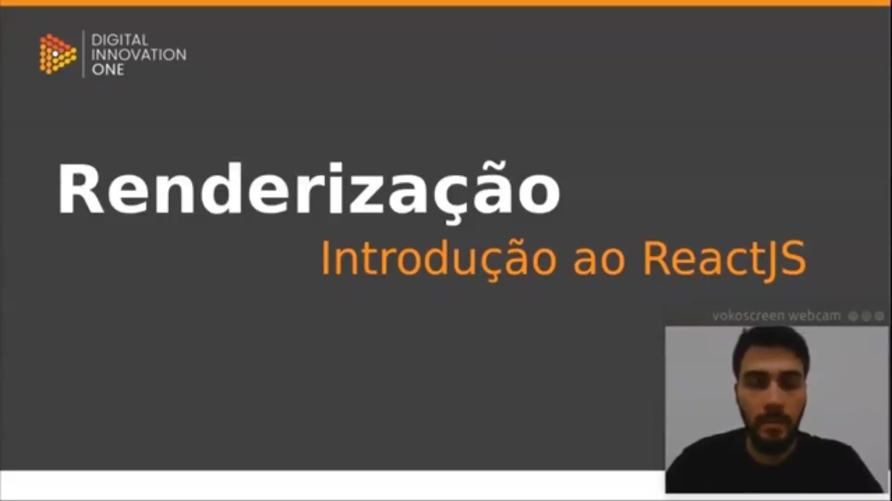
</p>

### Introdução à Renderização no ReactJS

A renderização é o processo fundamental onde o React transforma os elementos definidos em código em componentes visíveis na interface do usuário. No React, essa renderização é baseada em **nós raiz**, tratando cada retorno de elemento como um nó dentro de uma estrutura organizada. Os elementos representam a menor unidade de construção em uma aplicação React, servindo como a base para a criação de interfaces web complexas.

<p align="center">
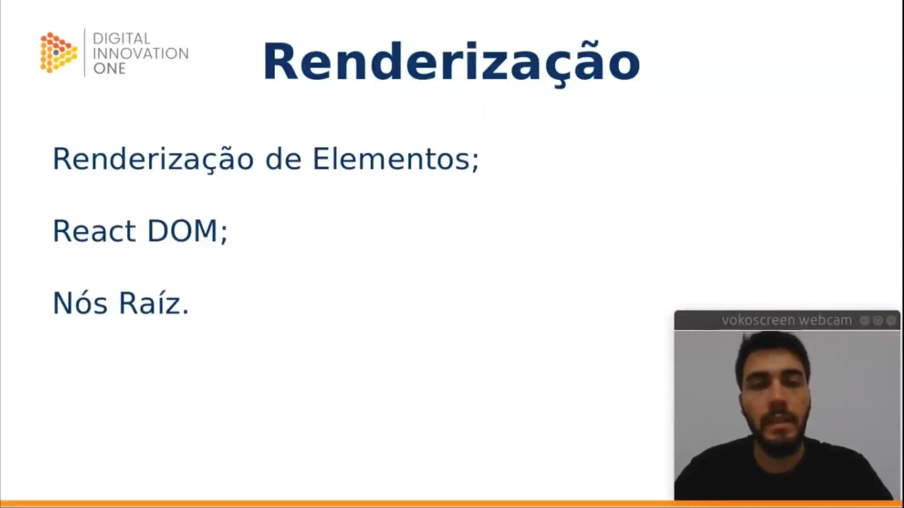
</p>

### Gerenciamento via React DOM

O **React DOM** atua como a ponte entre o React e o navegador. Diferente de bibliotecas mais antigas que manipulavam o DOM (Document Object Model) do browser diretamente, o React utiliza uma camada intermediária. Os conceitos-chave para entender este fluxo incluem:

* **Renderização de Elementos:** O processo de atualizar a UI.
* **React DOM:** A biblioteca que renderiza os componentes no contexto do navegador.
* **Nós Raiz:** O ponto de entrada no HTML onde toda a aplicação React será "montada".

<p align="center">
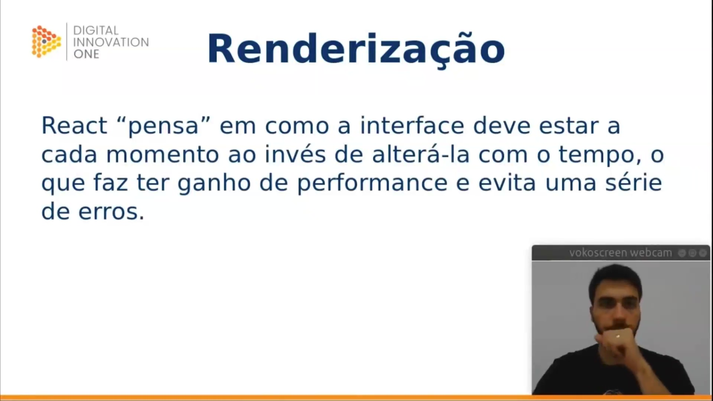
</p>

### Performance e o Virtual DOM

Uma das maiores vantagens do React é o uso do **Virtual DOM**. Ao invés de atualizar toda a árvore HTML sempre que ocorre uma mudança, o React compara a versão anterior com a nova e identifica **apenas o pedaço que foi alterado**.

Essa abordagem de "pensar em como a interface deve estar a cada momento" em vez de alterá-la manualmente ao longo do tempo garante um ganho significativo de performance e reduz drasticamente a ocorrência de erros de sincronização entre o estado da aplicação e o que é exibido na tela.

<p align="center">
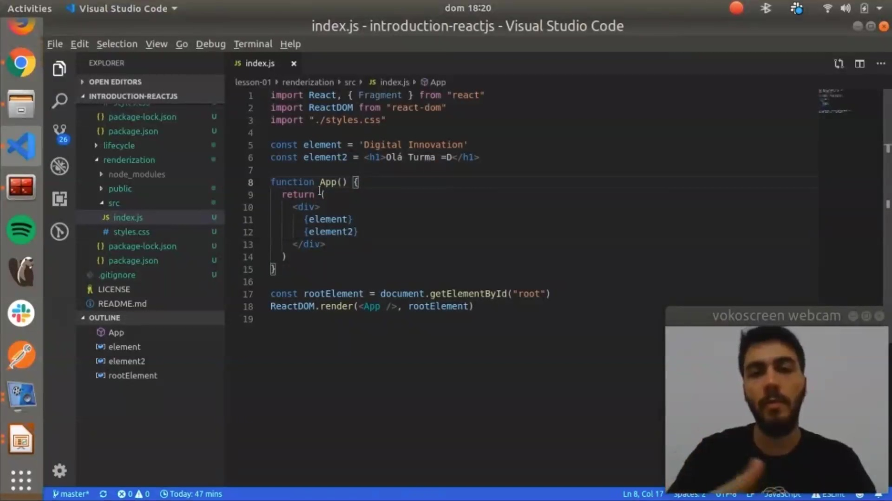
</p>

### Implementação Básica de Renderização

Para renderizar múltiplos elementos, é necessário encapsulá-los dentro de um único nó pai (como uma `div`), pois o React exige um único ponto de retorno por componente. No código abaixo, vemos a definição de elementos simples e a função `App` que os agrupa.

```javascript
import React, { Fragment } from 'react'
import ReactDOM from 'react-dom'
import "./styles.css"

const element = 'Digital Innovation'
const element2 = <h1>Olá Turma D</h1>

function App() {
  return (
    <div>
      {element}
      {element2}
    </div>
  )
}

const rootElement = document.getElementById("root")
ReactDOM.render(<App />, rootElement)

```

<p align="center">
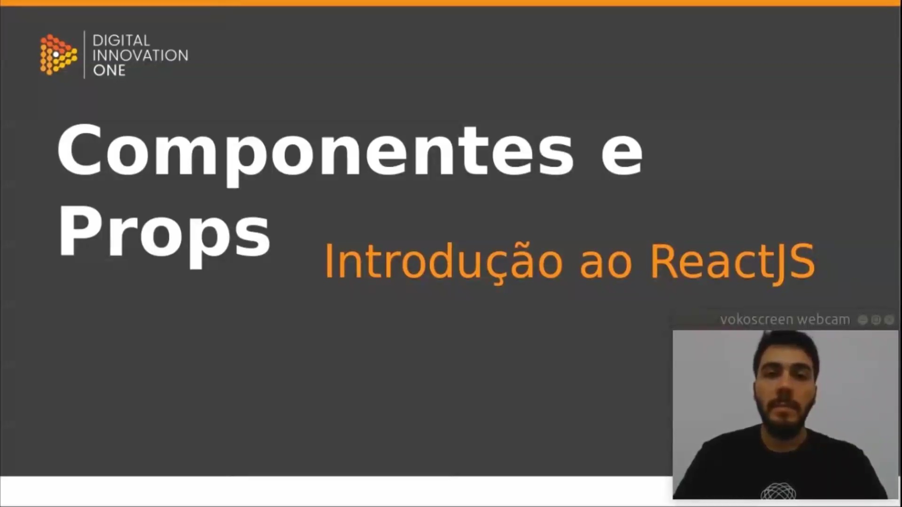
</p>

### Introdução a Components e Props

Os componentes são a essência da modularidade no React. Eles permitem dividir a interface em partes independentes e reutilizáveis, facilitando a manutenção e a escalabilidade do projeto. Já as **Props** (propriedades) são o mecanismo utilizado para passar informações e parâmetros de um componente pai para um componente filho.

<p align="center">
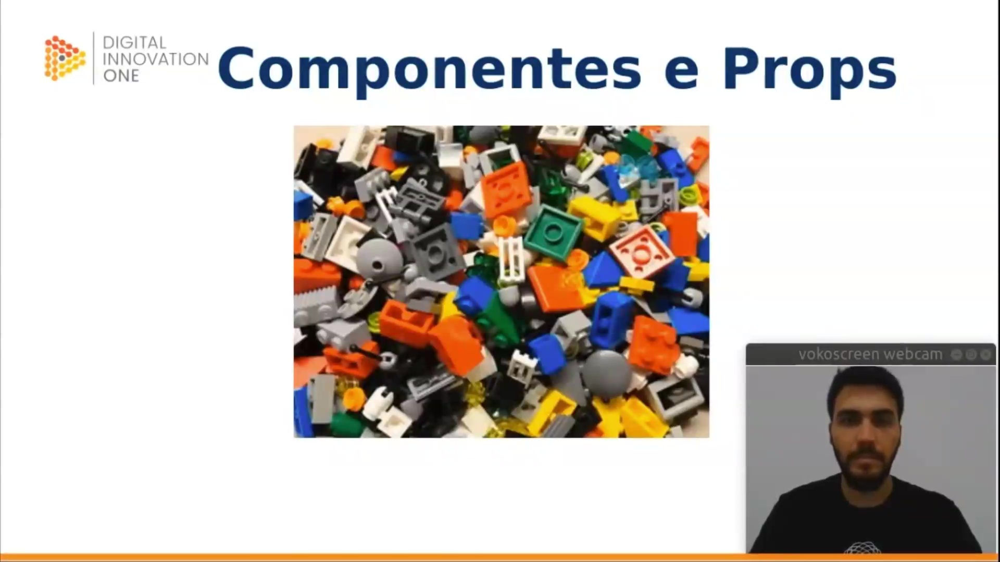
</p>

### Analogia dos Blocos de Construção

A componentização pode ser comparada a **peças de Lego**. Criar componentes básicos únicos (como botões e menus) permite que diferentes desenvolvedores utilizem o mesmo padrão visual e funcional em toda a aplicação, evitando duplicação de esforço e inconsistências no design. O que parece ser um excesso de arquivos inicialmente é, na verdade, uma organização que favorece o reaproveitamento de código.

<p align="center">
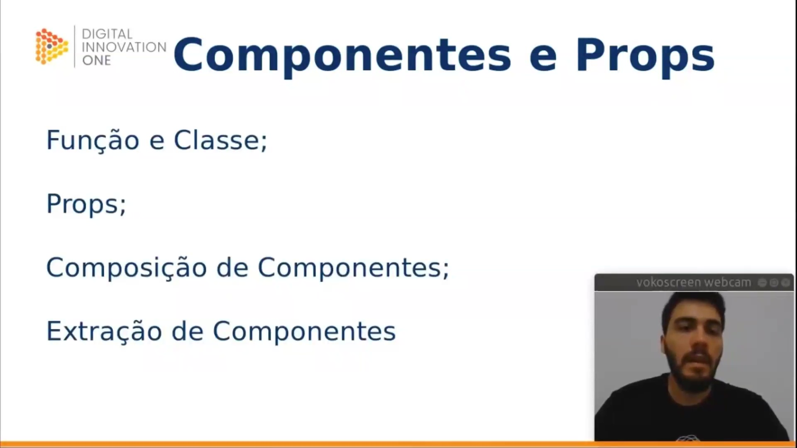
</p>

### Estrutura de Componentes

Ao trabalhar com componentes e props, existem tópicos fundamentais para dominar a arquitetura React:

* **Função e Classe:** As duas formas de definir componentes (atualmente priorizando funções).
* **Props:** Parâmetros de entrada.
* **Composição de Componentes:** A habilidade de combinar componentes menores para formar interfaces complexas.
* **Extração de Componentes:** O processo de transformar partes de um componente grande em componentes menores e mais puros.

<p align="center">
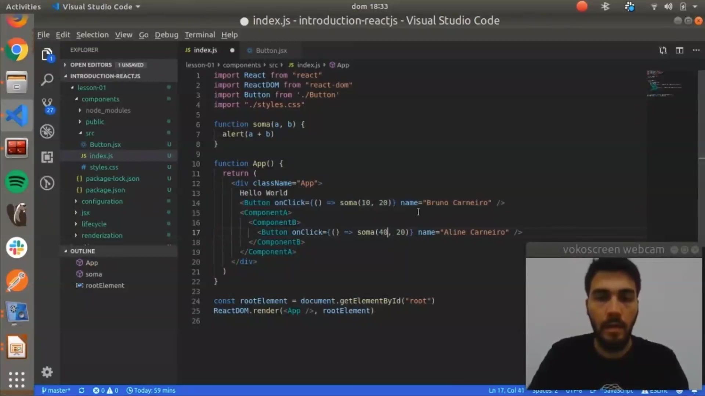
</p>

### Composição e Uso de Children

Abaixo, um exemplo de aplicação real onde componentes são aninhados. Note o uso da propriedade `children`, que permite que um componente receba e renderize outros componentes inseridos dentro de suas tags de abertura e fechamento.

```javascript
import React from "react"
import ReactDOM from "react-dom"
import Button from './Button'
import "./styles.css"

function soma(a, b) {
  alert(a + b)
}

function App() {
  return (
    <div className="App">
      Hello World
      <Button onClick={() => soma(10, 20)} name="Bruno Carneiro" />
      <ComponentA>
        <ComponentB>
          <Button onClick={() => soma(40, 20)} name="Aline Carneiro" />
        </ComponentB>
      </ComponentA>
    </div>
  )
}

const rootElement = document.getElementById("root")
ReactDOM.render(<App />, rootElement)

```      

## 🟩 Vídeo 04 - Conheça os ecossistemas do ReactJS

<video width="60%" controls>
  <source src="000-Midia_e_Anexos/bootcamp_tqi_fullstack-modulo_04-Video_04.webm" type="video/webm">
    Seu navegador não suporta vídeo HTML5.
</video>

Link do vídeo: https://web.dio.me/track/tqi-fullstack-developer/course/introducao-ao-reactjs/learning/838c3b03-88fc-4dca-8904-21f43bd57291?autoplay=1 

O vídeo apresenta uma introdução técnica ao **React**, enfatizando que a compreensão do **ciclo de vida dos componentes** é fundamental para dominar a ferramenta. O autor detalha as fases de **inicialização, montagem, atualização e desmontagem**, alertando que falhas no entendimento desses processos podem causar gargalos de performance. Através de exemplos práticos com **classes e estados locais**, a explicação demonstra como o **Virtual DOM** reage a mudanças de propriedades e dados. Além disso, reforça-se a importância de ter uma base sólida em **JavaScript** antes de avançar para conceitos complexos. Por fim, o conteúdo explora o vasto **ecossistema de bibliotecas** complementares que tornam o React uma solução flexível e escalável para o desenvolvimento de aplicações modernas.

### Anotações

<p align="center">
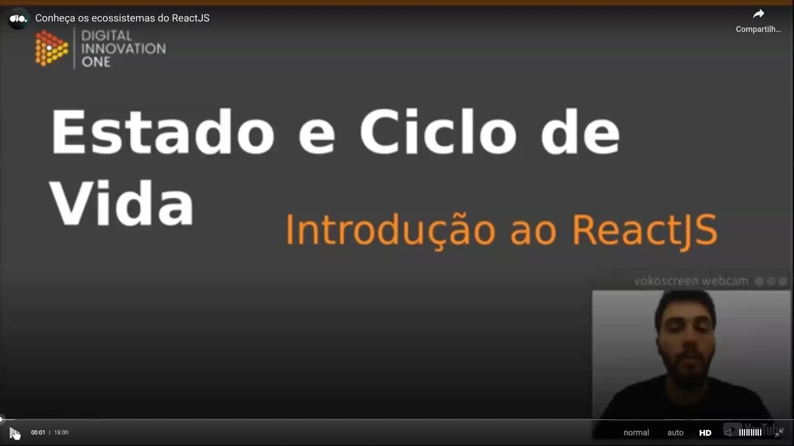
</p>

Esta aula introduz os conceitos fundamentais de **Estado e Ciclo de Vida** no ReactJS. Compreender esses mecanismos é essencial para dominar a ferramenta, pois eles definem como os componentes reagem a mudanças e como se comportam desde a sua criação até a sua remoção da interface. A base para esse aprendizado avançado reside no domínio sólido do JavaScript básico.

<p align="center">

</p>

O ciclo de vida de um componente React é o conjunto de fases que ele percorre durante sua existência na aplicação. Entender esse fluxo permite ao desenvolvedor executar ações em momentos específicos, garantindo que a lógica de negócio e a interface do usuário estejam sempre sincronizadas de forma eficiente.

<p align="center">

</p>

O funcionamento do React é estruturado em quatro estados ou fases principais:

* **Inicialização:** Onde as propriedades e estados iniciais são definidos.
* **Montagem:** O momento em que o componente é inserido no DOM.
* **Atualização:** Quando ocorrem mudanças em props ou no estado, gerando novas renderizações.
* **Desmontagem:** A fase final, quando o componente é removido da página.

<p align="center">

</p>

O ciclo de vida dita uma ordem de execução técnica rigorosa através de métodos específicos:

* **Montagem:** Inicia com `componentWillMount` (depreciado em versões recentes por questões de segurança), seguido pelo `render` para montar a página, e finaliza com o `componentDidMount`.
* **Atualização:** Toda vez que uma propriedade (**prop**) ou um **state** é alterado, o React inicia um ciclo de atualização que envolve métodos como `shouldComponentUpdate` e `componentDidUpdate`, renderizando o bloco correspondente no DOM virtual.
* **Desmontagem:** Utiliza o método `componentWillUnmount` para realizar limpezas antes do componente deixar de existir.

<p align="center">

</p>

Um conceito fundamental é o isolamento dos componentes. No React, o **estado é local ao componente**, o que significa que componentes pais ou filhos não precisam ter conhecimento sobre a existência de estados internos uns dos outros. Caso seja necessário compartilhar informações entre eles, a comunicação deve ser estabelecida preferencialmente através do uso de **props**.

<p align="center">
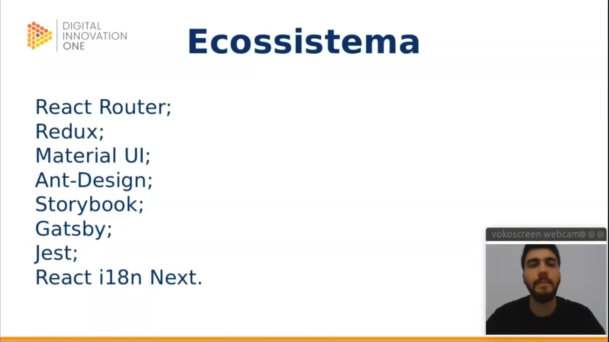
</p>

Como o React é uma biblioteca focada na interface, a construção de aplicações robustas e escaláveis depende da integração com seu vasto **ecossistema**. Algumas das ferramentas essenciais que complementam o desenvolvimento incluem:

* **React Router:** Para o gerenciamento de rotas e navegação.
* **Redux:** Para o controle de estados complexos e globais.
* **Material UI / Ant Design:** Bibliotecas de componentes de interface prontos e estilizados.
* **Storybook:** Para o desenvolvimento visual e documentação de componentes de forma isolada.
* **Gatsby:** Focado na criação de sites estáticos otimizados.
* **Jest:** Utilizado para a realização de testes na aplicação.
* **React i18n Next:** Para suporte a internacionalização de projetos.


# Parte 2 - Integrando webpack ao desenvolvimento com ReactJS

## 🟩 Vídeo 05 - O que é webpack?

<video width="60%" controls>
  <source src="000-Midia_e_Anexos/bootcamp_tqi_fullstack-modulo_04-Video_05.webm" type="video/webm">
    Seu navegador não suporta vídeo HTML5.
</video>

Link do vídeo: https://web.dio.me/track/tqi-fullstack-developer/course/introducao-ao-reactjs/learning/6c8cc254-0dbf-4ad8-a087-3e6fa5a59af8?autoplay=1

Nesta aula ministrada por Bruno Carneiro, o foco principal é a **integração do Webpack** no desenvolvimento de aplicações com **React JS**. O instrutor define o Webpack como um **empacotador de módulos** que organiza diversos arquivos e dependências em um único feixe otimizado para navegadores. Durante a apresentação, são detalhados os **pré-requisitos técnicos**, como a necessidade do Node.js e do NPM, além de mencionar o uso do VS Code. O conteúdo destaca que, embora ferramentas automáticas como o React Scripts facilitem o início, a **configuração manual** oferece maior controle e poder de otimização para projetos de grande escala. Além de scripts, o Webpack é capaz de processar **CSS, imagens e fontes** através de plugins, permitindo uma arquitetura de software mais flexível e robusta.

### Anotações

<p align="center">

</p>

Nesta aula introdutória ministrada por Bruno Carneiro, Líder Técnico na Luiza Labs, o foco central é a integração do **Webpack** ao desenvolvimento com **React JS**. O objetivo é compreender como essa ferramenta atua no ecossistema moderno de desenvolvimento front-end, permitindo a criação de aplicações robustas e otimizadas.

<p align="center">
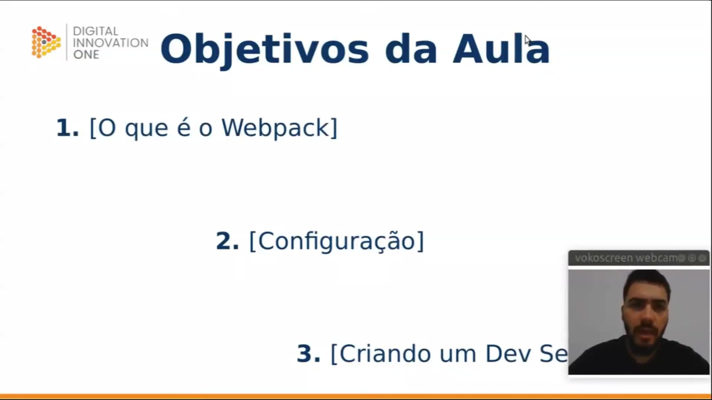
</p>

Os objetivos principais desta unidade de aprendizado estão divididos em quatro pilares fundamentais:

1. **O que é o Webpack**: Definição e papel do empacotador.
2. **Configuração**: Como estruturar o ambiente de forma manual.
3. **Criando um Dev Server**: Estabelecimento de um ambiente de desenvolvimento ágil.

<p align="center">
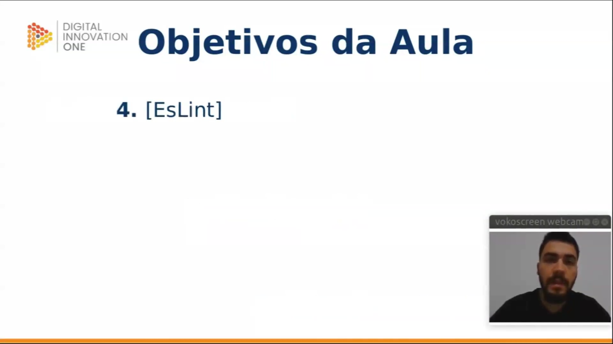
</p>

Além da configuração estrutural do Webpack, a aula abordará a implementação do **ESLint**, ferramenta essencial para garantir a qualidade do código e a padronização entre diferentes desenvolvedores no projeto.

<p align="center">
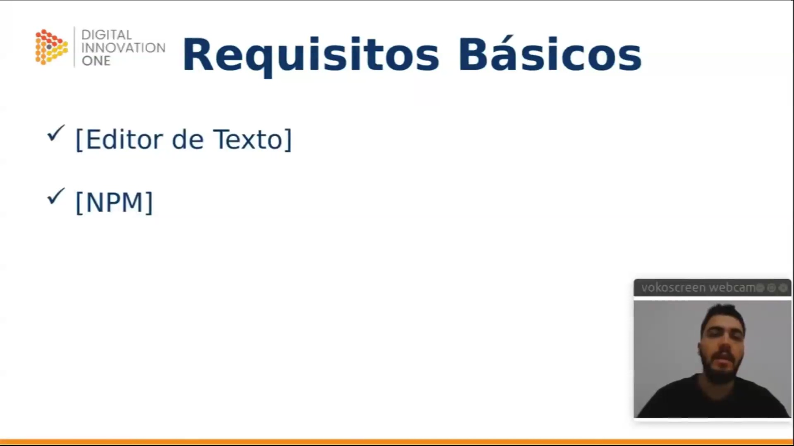
</p>

Para acompanhar o desenvolvimento prático, são necessários alguns requisitos básicos instalados na máquina:

* **Node.js**: Recomenda-se a versão 10.16 ou superior.
* **NPM**: Gerenciador de pacotes que acompanha a instalação do Node.
* **Editor de Texto**: Preferencialmente o VS Code, embora qualquer editor de preferência possa ser utilizado.

<p align="center">
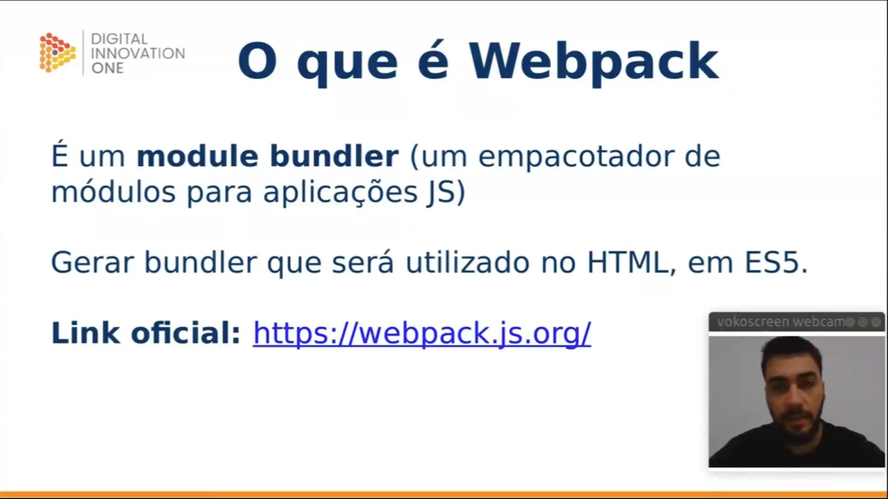
</p>

O **Webpack** é definido como um *module bundler* (empacotador de módulos) para aplicações JavaScript. Sua função principal é processar os diversos módulos da aplicação e gerar um **bundle** (arquivo final) em **ES5**, garantindo que o navegador consiga interpretar o código corretamente, independentemente da complexidade da árvore de dependências (grafo) do projeto.

Para mais detalhes, a documentação oficial pode ser consultada em: `https://webpack.js.org/`

<p align="center">
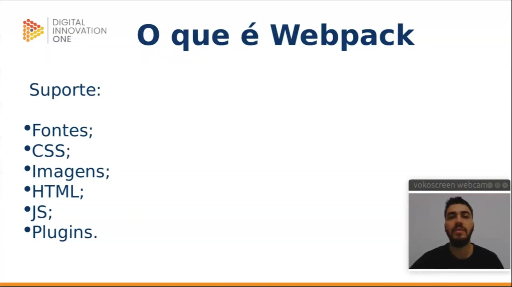
</p>

Embora seja um empacotador focado em JavaScript, o Webpack possui um ecossistema vasto que oferece suporte para diversos tipos de recursos através de *loaders* e extensões:

* **Fontes** e **Imagens**
* **CSS** e **HTML**
* **JavaScript (JS)**
* **Plugins** variados para otimização e automação.

Diferente de ferramentas como o Parcel (mais simples) ou Rollup (focado em bibliotecas), o Webpack é a escolha ideal para grandes aplicações devido ao seu alto poder de customização.      


## 🟩 Vídeo 06 - Aprenda a configurar o webpack

<video width="60%" controls>
  <source src="000-Midia_e_Anexos/bootcamp_tqi_fullstack-modulo_04-Video_06.webm" type="video/webm">
    Seu navegador não suporta vídeo HTML5.
</video>

Link do vídeo: https://web.dio.me/track/tqi-fullstack-developer/course/introducao-ao-reactjs/learning/f698389b-6687-4bed-b654-b9b7d1f5d887?autoplay=1

O vídeo consiste em uma transcrição técnica detalhada sobre a **configuração inicial do Webpack 4** voltada para o desenvolvimento com **React**. O autor explica conceitos fundamentais como **entry points**, **output**, **loaders** e **plugins**, demonstrando na prática como transformar código moderno em pacotes otimizados para navegadores. A fonte aborda a instalação de dependências essenciais, incluindo o **Babel** para transpilação de sintaxe e o **Webpack Dev Server** para agilizar o fluxo de trabalho com **hot reloading**. Além de orientar sobre a criação de arquivos de configuração, o material diferencia os modos de **produção e desenvolvimento**, focando em performance e depuração. O objetivo central é capacitar o desenvolvedor a estruturar um ambiente completo de **Single Page Application** do zero. Por fim, o conteúdo ressalta a importância de gerar arquivos finais leves para melhorar a experiência do usuário final.

### Anotações

<p align="center">

</p>

Esta imagem marca o início da aula sobre a configuração do Webpack para o ambiente de desenvolvimento com ReactJS. O objetivo central é compreender como o Webpack gerencia as dependências e módulos de uma aplicação moderna, permitindo que funcionalidades avançadas do JavaScript sejam interpretadas corretamente pelos navegadores.

<p align="center">
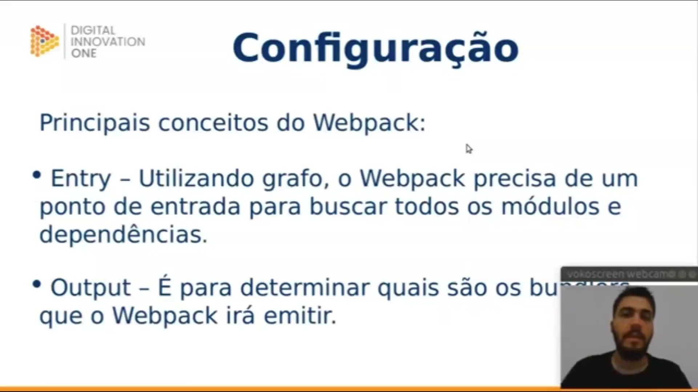
</p>

Neste estágio, são apresentados os dois primeiros pilares fundamentais do funcionamento do Webpack:

* **Entry (Entrada):** O Webpack utiliza uma estrutura de grafo para mapear o projeto. O *entry point* é o arquivo inicial onde a ferramenta começa a buscar todos os módulos e dependências necessários para construir a aplicação.
* **Output (Saída):** Define o destino final dos arquivos processados. É através do *output* que determinamos em qual diretório e com qual nome os bundles (pacotes de arquivos emitidos) serão gerados.

<p align="center">
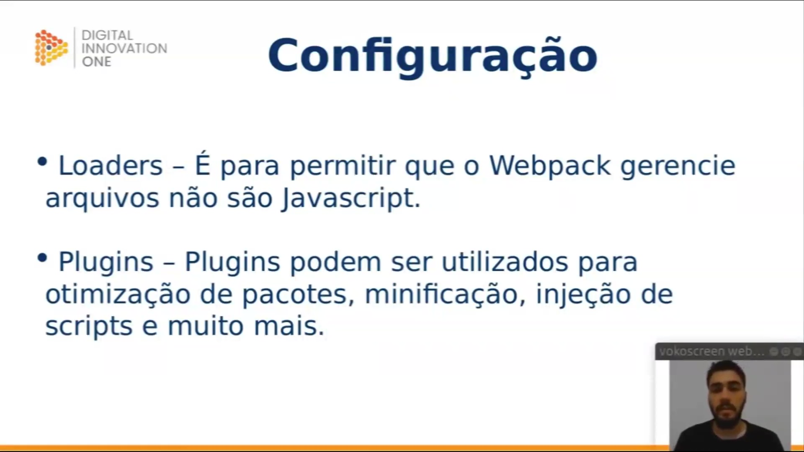
</p>

Dando continuidade aos conceitos principais, exploramos os Loaders e Plugins:

* **Loaders:** Essenciais para expandir a capacidade do Webpack. Por padrão, ele entende apenas JavaScript, mas os *loaders* permitem que ele gerencie e processe outros tipos de arquivos, como CSS, imagens, HTML e fontes.
* **Plugins:** Enquanto os loaders agem na transformação de arquivos, os plugins atuam em uma gama mais ampla de tarefas, como a otimização de pacotes, minificação do código final e a injeção automática de scripts nos arquivos HTML.

<p align="center">
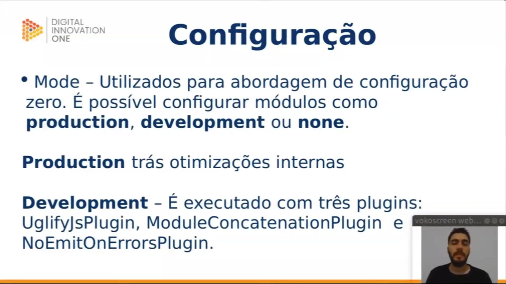
</p>

O conceito de **Mode** (Modo) é introduzido para facilitar a configuração baseada no ambiente de execução. Com a abordagem de "zero configuration" da versão 4, é possível alternar entre:

* **Production:** Focado no usuário final, trazendo otimizações internas e minificação para reduzir o tamanho dos arquivos.
* **Development:** Focado na experiência do desenvolvedor (debug), executando plugins como o *NoEmitOnErrorsPlugin* para auxiliar na identificação de falhas durante a codificação.
* **None:** Nenhuma configuração pré-definida é aplicada.

<p align="center">
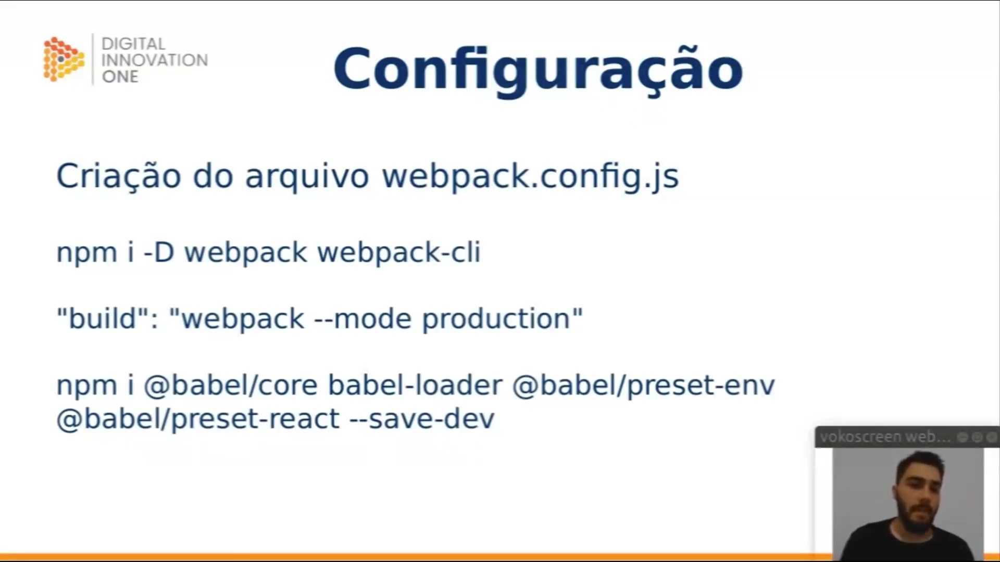
</p>

Para colocar os conceitos em prática, é necessária a criação do arquivo `webpack.config.js` e a instalação das dependências via terminal. O processo envolve preparar o ambiente para suportar React e a transpilação do código moderno através do Babel.

Abaixo, os comandos de instalação e a configuração de script para o processo de build:

```bash
# Instalação do Webpack e sua interface de linha de comando como dependência de desenvolvimento
npm i -D webpack webpack-cli

# Instalação do core do Babel, loader para Webpack e presets para JavaScript moderno e React
npm i @babel/core babel-loader @babel/preset-env @babel/preset-react --save-dev

```

No arquivo `package.json`, o script de build deve ser configurado da seguinte forma para gerar a versão otimizada:

```json
"build": "webpack --mode production"

```

---


## 🟩 Vídeo 07 - xxxxxxxxxxxxxxx

<video width="60%" controls>
  <source src="000-Midia_e_Anexos/bootcamp_tqi_fullstack-modulo_04-Video_07.webm" type="video/webm">
    Seu navegador não suporta vídeo HTML5.
</video>

Link do vídeo: https://web.dio.me/track/tqi-fullstack-developer/course/introducao-ao-reactjs/learning/74a29d1d-06eb-47b9-8a2d-ef8ad5c7c031?autoplay=1


## 🟩 Vídeo 04 - xxxxxxxxxxxxxxx


Link do vídeo: 


## 🟩 Vídeo 05 - xxxxxxxxxxxxxxx


Link do vídeo: 


## 🟩 Vídeo 06 - xxxxxxxxxxxxxxx


Link do vídeo: 


## 🟩 Vídeo 07 - xxxxxxxxxxxxxxx


Link do vídeo: 


## 🟩 Vídeo 08 - xxxxxxxxxxxxxxx


Link do vídeo: 


## 🟩 Vídeo 09 - xxxxxxxxxxxxxxx


Link do vídeo: 


## 🟩 Vídeo 10 - xxxxxxxxxxxxxxx


Link do vídeo: 


# Parte 3 - xxxxxxxxxxxxxxx

## 🟩 Vídeo 01 - Exxxxxxxxxxxxxxx


Link do vídeo:  


## 🟩 Vídeo 02 - xxxxxxxxxxxxxxx


Link do vídeo: 


## 🟩 Vídeo 03 - xxxxxxxxxxxxxxx


Link do vídeo: 


## 🟩 Vídeo 04 - xxxxxxxxxxxxxxx


Link do vídeo: 


## 🟩 Vídeo 05 - xxxxxxxxxxxxxxx


Link do vídeo: 


## 🟩 Vídeo 06 - xxxxxxxxxxxxxxx


Link do vídeo: 


## 🟩 Vídeo 07 - xxxxxxxxxxxxxxx


Link do vídeo: 


## 🟩 Vídeo 08 - xxxxxxxxxxxxxxx


Link do vídeo: 


## 🟩 Vídeo 09 - xxxxxxxxxxxxxxx


Link do vídeo: 


## 🟩 Vídeo 10 - xxxxxxxxxxxxxxx


Link do vídeo: 


##  Materiais de Apoio


# Certificado: 

- Link na plataforma: 
- Certificado em pdf: 
