## Instrutor

- Bruno Carneiro (Planning & Business Performance Director na Magazine Luiza)
- Contato Linkedin: / [brunohvcarneiro](https://www.linkedin.com/in/brunohvcarneiro/)

# Parte 1 - Introdução ao ReactJS

## 🟩 Vídeo 01 - Conheça a tecnologia ReactJS

<video width="60%" controls>
  <source src="000-Midia_e_Anexos/bootcamp_tqi_fullstack-modulo_04-Video_01.webm" type="video/webm">
    Seu navegador não suporta vídeo HTML5.
</video>

Link do vídeo: https://web.dio.me/track/tqi-fullstack-developer/course/introducao-ao-reactjs/learning/01818f0a-18b2-4023-a555-57ebefba56af?autoplay=1 

O vídeo apresenta uma introdução abrangente ao **React JS**, conduzida pelo especialista Bruno Carneiro, que define a ferramenta como uma **biblioteca JavaScript** focada na criação de interfaces de usuário. O autor detalha a **trajetória histórica** da tecnologia, desde sua criação no Facebook para resolver problemas de escalabilidade até sua expansão para plataformas **mobile e desktop**. São destacados requisitos técnicos essenciais, como o domínio de **JavaScript e NPM**, além de explicar a natureza **declarativa e modular** da biblioteca através da componentização. A fonte enfatiza a **flexibilidade do React**, diferenciando-o de frameworks rígidos e ilustrando sua relevância no mercado por meio do uso em grandes empresas como **Netflix e Instagram**. Por fim, o conteúdo reforça as vantagens de um ecossistema vasto que permite o desenvolvimento de aplicações **modernas e multiplataforma**.

### Anotações

<p align="center">
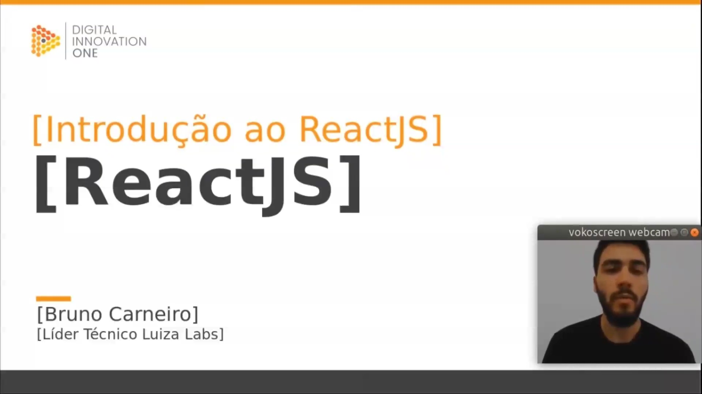
</p>

Esta é a abertura do curso de **Introdução ao ReactJS**, ministrado por Bruno Carneiro, Líder Técnico no Luiza Labs. O curso foca nos fundamentos da biblioteca ReactJS para o desenvolvimento de interfaces modernas.

<p align="center">

</p>

Os primeiros objetivos da aula incluem uma introdução à **História e Conceitos** fundamentais do React, seguida pelas etapas de **Configuração** do ambiente de desenvolvimento. Também será abordado o **JSX**, que é a extensão de sintaxe para JavaScript utilizada no React.

<p align="center">

</p>

Dando continuidade ao cronograma, o curso explorará o processo de **Renderização** de elementos na tela e a criação de **Componentes e Props**, que permitem a construção de interfaces modulares. Outro ponto central será o entendimento do **Estado e Ciclo de Vida** dos componentes, essenciais para gerenciar dados dinâmicos.

<p align="center">

</p>

O último tópico listado nos objetivos da aula é o **Ecossistema** do React. Compreender o ecossistema é fundamental para entender como o React interage com outras ferramentas e bibliotecas para criar aplicações completas e escaláveis.

<p align="center">
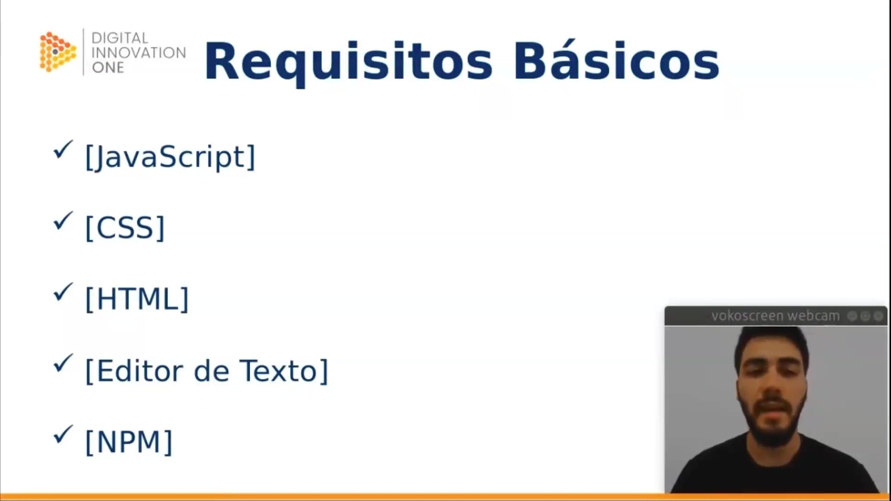
</p>

Para acompanhar o curso, são necessários alguns pré-requisitos técnicos: conhecimentos básicos em **JavaScript, CSS e HTML**. Além disso, é necessário ter um **Editor de Texto** instalado e o **NPM** (Node Package Manager) para gerenciar as dependências do projeto.

<p align="center">
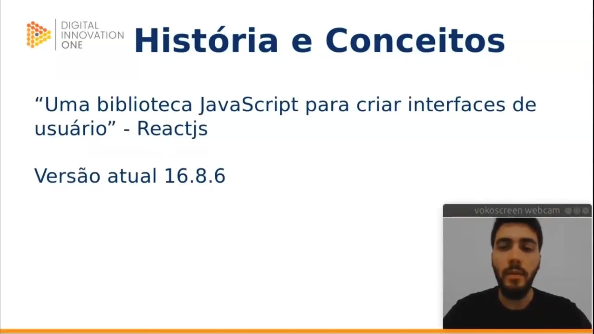
</p>

Conceitualmente, o React é definido como "uma biblioteca JavaScript para criar interfaces de usuário". No momento da gravação, a versão de referência utilizada era a **16.8.6**.

<p align="center">

</p>

O React foi criado em **2011 por Jordan Walke**, um engenheiro do **Facebook**. Sua origem é baseada no **XHP**, que era um framework utilizado para a criação de HTML dentro do ecossistema PHP da empresa. Inicialmente, o React foi implementado para gerenciar o **mural de notícias** (news feed) do Facebook.

<p align="center">
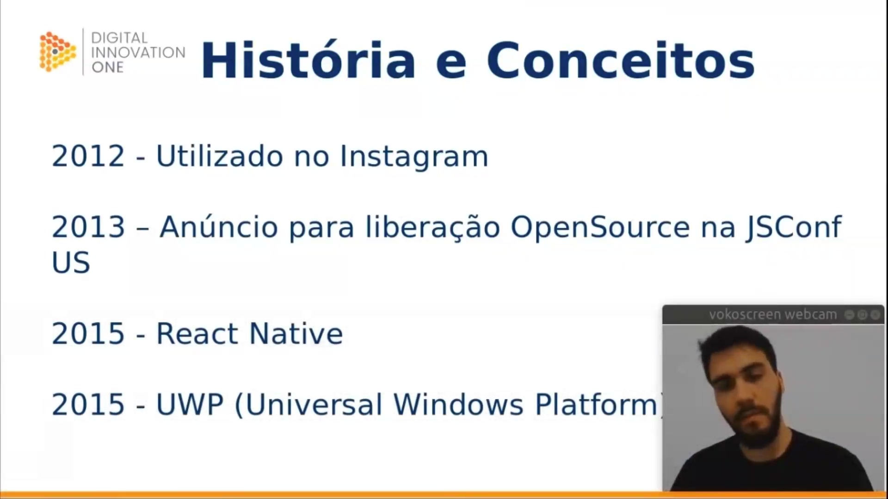
</p>

A linha do tempo do React mostra marcos importantes: em **2012**, passou a ser utilizado no **Instagram**; em **2013**, foi anunciado como projeto **OpenSource** durante a JSConf US; e em **2015**, expandiu-se com o lançamento do **React Native** e o suporte para **UWP** (Universal Windows Platform).

<p align="center">

</p>

É fundamental distinguir que o React é uma **biblioteca** e não um framework. Enquanto frameworks costumam ditar a estrutura completa da aplicação, o React foca especificamente em sua principal função: a **criação da interface para o usuário**.

<p align="center">

</p>

De acordo com o relatório do **Stack Overflow de 2019**, o React.js já se posicionava como a segunda tecnologia de interface mais utilizada (31.3%), aproximando-se do jQuery (48.7%) entre os desenvolvedores profissionais. Esse crescimento reflete a popularidade do JavaScript e a eficiência do React em diversos contextos, como dispositivos móveis e front-end.      


## 🟩 Vídeo 02 - Aprenda a configurar o ReactJS

<video width="60%" controls>
  <source src="000-Midia_e_Anexos/bootcamp_tqi_fullstack-modulo_04-Video_02.webm" type="video/webm">
    Seu navegador não suporta vídeo HTML5.
</video>

Link do vídeo: https://web.dio.me/track/tqi-fullstack-developer/course/introducao-ao-reactjs/learning/7b2d1a93-9235-412e-9749-44fb27e0ef93?autoplay=1

O vídeo apresenta um guia prático sobre a **configuração inicial e os fundamentos do React**, destacando o uso do **React Scripts** para automatizar a criação de servidores e ferramentas de build. O autor detalha a estrutura de um projeto, explicando a função do arquivo **package.json** e do gerenciador de pacotes **NPM** no ecossistema JavaScript. Uma parte significativa da explicação é dedicada ao **JSX**, descrevendo-o como uma extensão que permite integrar **lógica JavaScript diretamente em estruturas HTML** de forma declarativa. O conteúdo também aborda o conceito de **Single Page Application (SPA)** e demonstra como renderizar componentes dentro de um elemento raiz no navegador. Por fim, são fornecidos exemplos de **interpolação de funções** e a aplicação de estilos através do atributo **className**, ressaltando a facilidade do desenvolvimento com o recurso de **hot reload**.

### Anotações

<p align="center">

</p>

Para iniciar o desenvolvimento com React, o requisito fundamental é ter o **NPM (Node Package Manager)** instalado no sistema. A ferramenta padrão recomendada pelo Facebook para criar novos projetos é o **Create React App**, uma biblioteca que automatiza a configuração inicial do ambiente frontend, entregando uma estrutura base pronta para uso.

<p align="center">
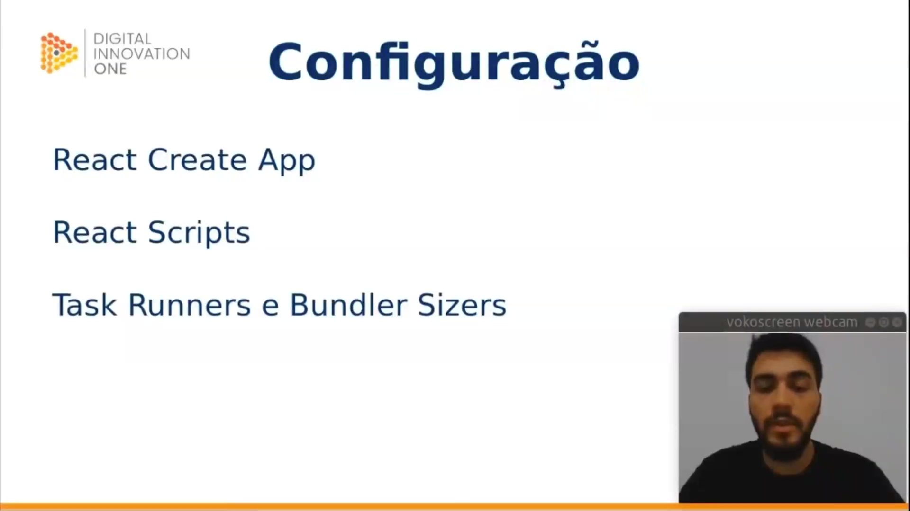
</p>

O **Create React App** utiliza internamente o **React Scripts**, que gerencia ferramentas essenciais como o **Webpack** (para empacotamento) e o **Jest** (para testes). Embora existam alternativas como configurar manualmente via Parcel ou Rollup, ou até utilizar CDNs, o uso do React Scripts simplifica o processo ao montar automaticamente um servidor de desenvolvimento.

<p align="center">
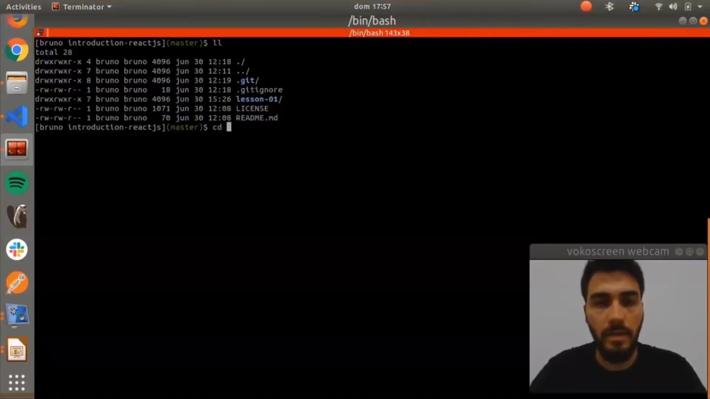
</p>

O processo de criação de um projeto começa com a inicialização do Node.js no diretório escolhido. Ao executar o comando de inicialização, o sistema cria o arquivo de configuração essencial para o ecossistema JavaScript.

```bash
npm init

```

<p align="center">
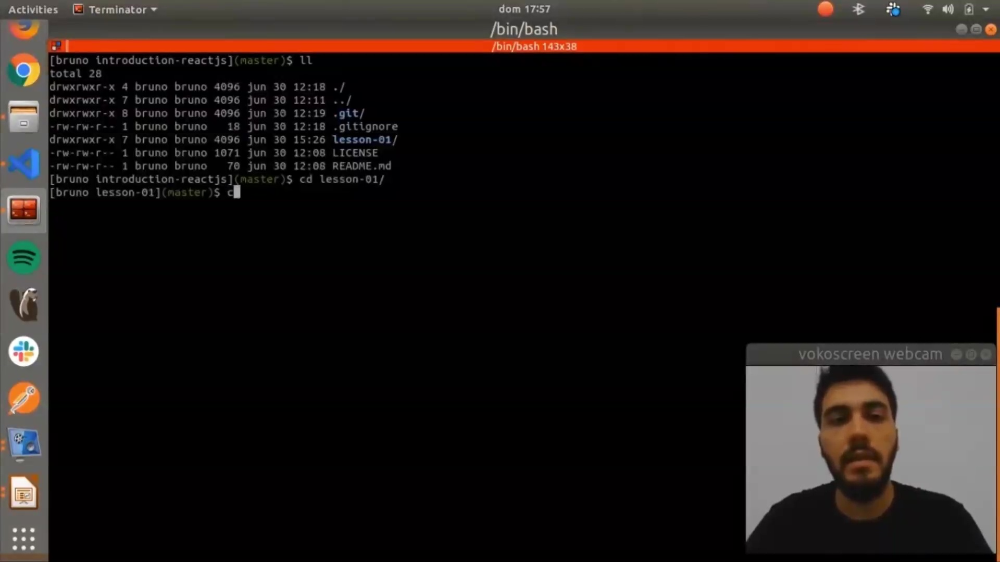
</p>

Após a inicialização, é necessário instalar as dependências principais. O comando abaixo instala a biblioteca do React em uma versão específica e o pacote de scripts que automatiza as tarefas de build e execução.

```bash
npm install react@16.8.6 react-dom@16.8.6 react-scripts

```

<p align="center">

</p>

O arquivo **package.json** funciona como o cérebro do projeto, centralizando todas as informações, versões de dependências e os scripts que serão utilizados para rodar a aplicação. Inicialmente, as abas de scripts e dependências refletem o que foi instalado via terminal.

<p align="center">
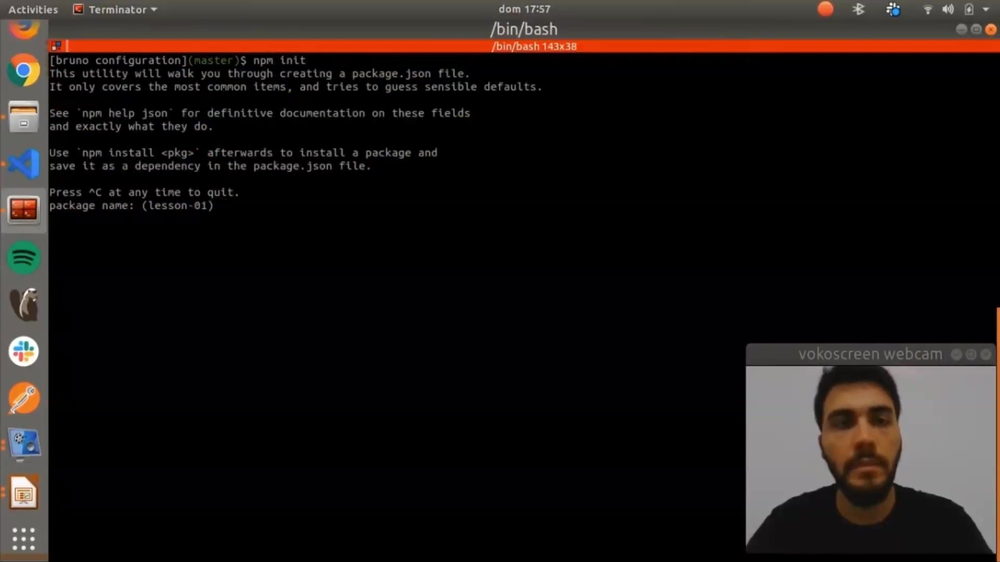
</p>

Para que o React Scripts funcione corretamente, é necessário criar uma pasta chamada **public**. Este diretório é identificado pela ferramenta como o ponto de entrada estático da aplicação.

```bash
mkdir public

```

<p align="center">
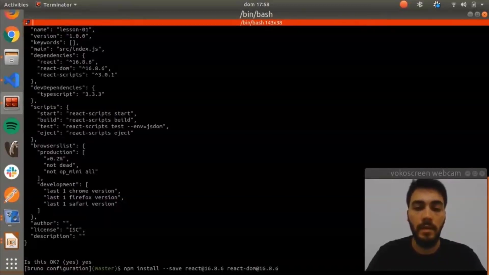
</p>

Dentro da pasta public, cria-se um arquivo HTML básico. O elemento mais importante deste arquivo é uma **div** com o atributo `id="root"`. É neste local específico que o React "pendurará" toda a interface da aplicação durante a renderização.

```html
<!DOCTYPE html>
<html lang="en">
<head>
    <meta charset="UTF-8">
    <title>React App</title>
</head>
<body>
    <div id="root"></div>
</body>
</html>

```

<p align="center">
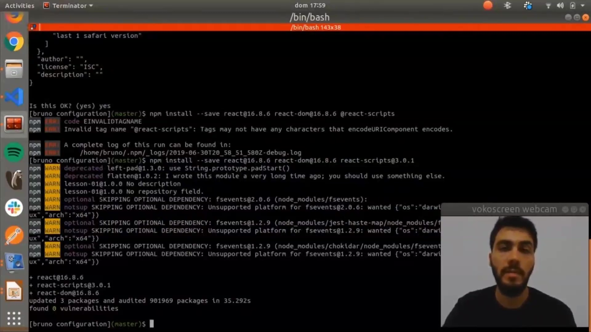
</p>

Além da pasta pública, deve-se criar uma pasta **src** (source), que conterá o código-fonte lógico da aplicação, incluindo os arquivos JavaScript e CSS.

```bash
mkdir src

```

<p align="center">
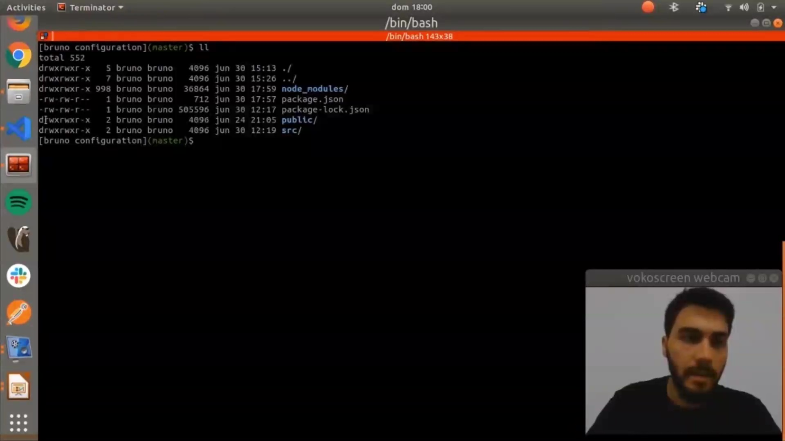
</p>

Um arquivo CSS inicial é geralmente criado para resetar estilos globais, como remover as margens e paddings padrão do navegador, garantindo um layout consistente.

```css
* {
    margin: 0;
    padding: 0;
}

```

<p align="center">

</p>

No arquivo principal dentro de `src`, realizamos a importação do **React** e do **ReactDOM**. O código utiliza a função de renderização para localizar o elemento `root` no HTML e injetar o conteúdo desejado.

```javascript
import React from 'react';
import ReactDOM from 'react-dom';

const App = () => (
  <div>
    <h1>Olá React</h1>
  </div>
);

ReactDOM.render(<App />, document.getElementById('root'));

```

<p align="center">
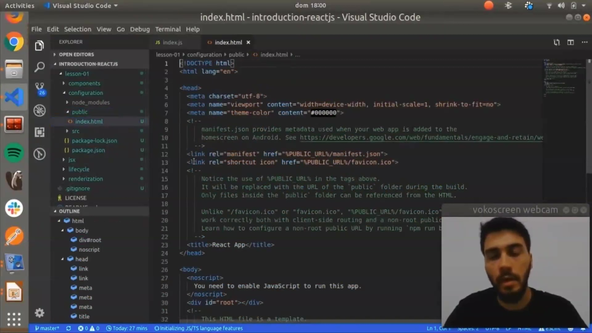
</p>

O React opera como uma **Single Page Application (SPA)**. Isso significa que, independentemente da complexidade ou das rotas da aplicação, tudo é renderizado dentro de uma única página HTML, o que melhora a performance e evita recarregamentos desnecessários do navegador.

<p align="center">
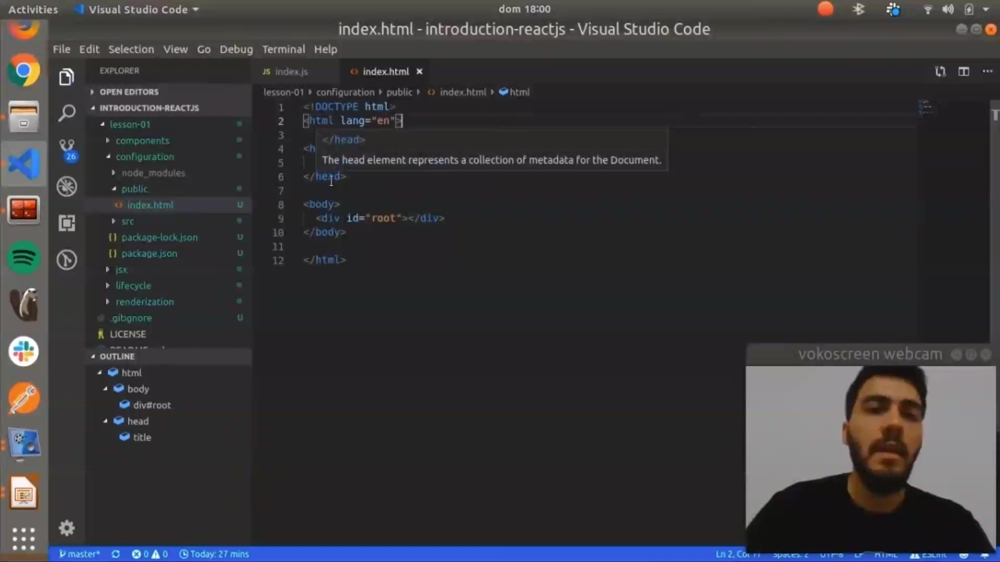
</p>

O **JSX** é a extensão de sintaxe utilizada para descrever a interface. Ele permite escrever estruturas similares ao HTML diretamente no JavaScript. No entanto, como os navegadores não entendem JSX nativamente, o **Babel** atua como transpilador, convertendo esse código para chamadas `React.createElement`.

<p align="center">
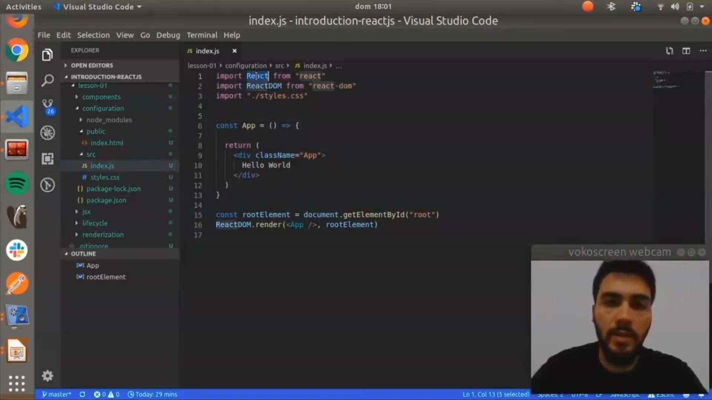
</p>

Para executar a aplicação e abrir o servidor de desenvolvimento (geralmente no `localhost:3000`), utiliza-se o gerenciador de pacotes.

```bash
npm start

```

<p align="center">

</p>

Uma das funcionalidades mais poderosas do JSX é a interpolação. Para executar qualquer código JavaScript (como variáveis ou operações matemáticas) dentro da marcação HTML, utilizam-se as **chaves `{}**`.

<p align="center">
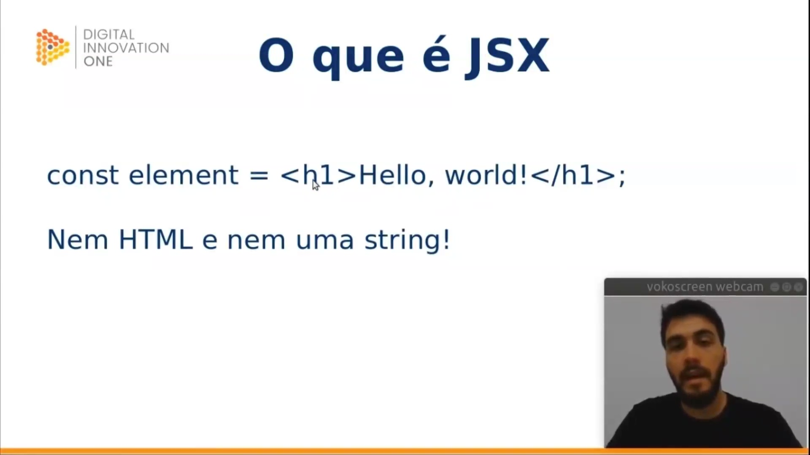
</p>

Exemplo prático de interpolação no JSX, onde uma operação lógica ou variável é inserida diretamente entre elementos HTML:

```javascript
const element = <h1>Resultado: {1 + 1}</h1>;

```

<p align="center">
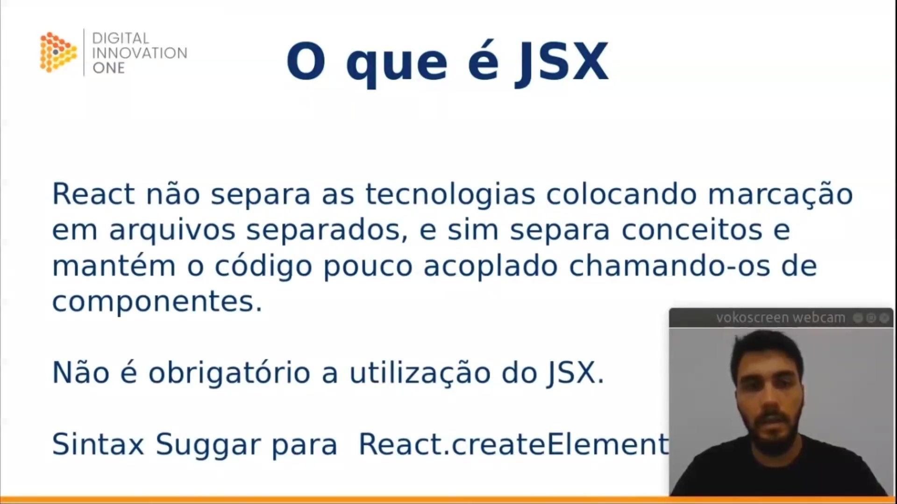
</p>

O ambiente de desenvolvimento configurado pelo React Scripts inclui o **hot reload**. Isso permite que qualquer alteração salva no código seja refletida instantaneamente no navegador, agilizando o ciclo de feedback durante a criação da interface.

<p align="center">
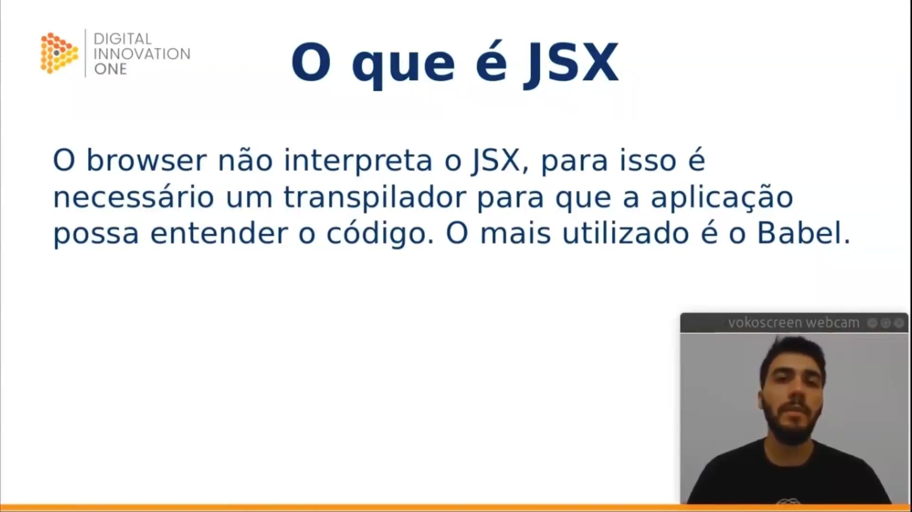
</p>

O React segue um modelo **declarativo** e foca em **programação funcional**. Em vez de manipular o DOM manualmente, você declara como a interface deve ser baseada no estado atual, e o React se encarrega de atualizar os elementos necessários.

<p align="center">
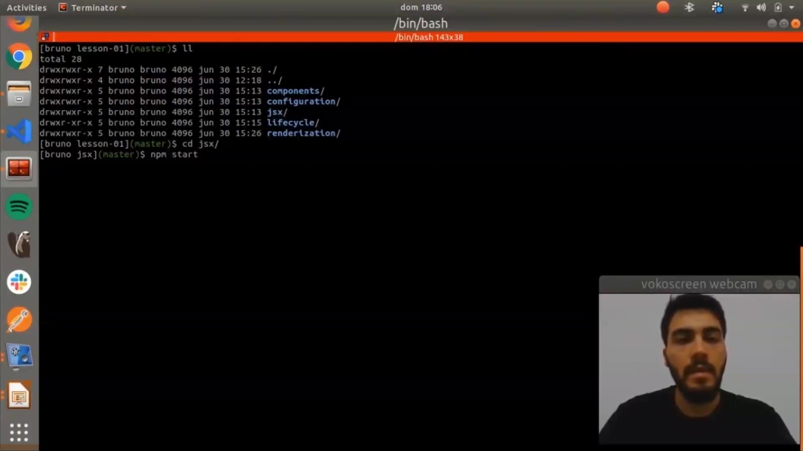
</p>

Embora o React suporte a criação de componentes via classes, a tendência e recomendação moderna é o uso de **funções**, que são suficientes para a maioria das necessidades de desenvolvimento e tornam o código mais conciso.

<p align="center">
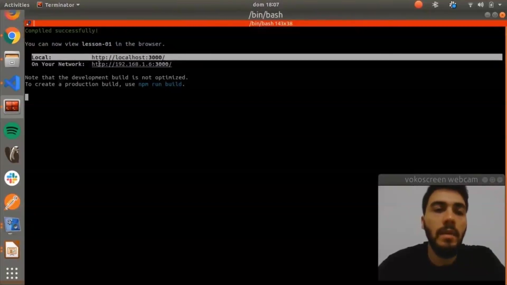
</p>

No JSX, devido ao fato de estarmos escrevendo JavaScript, existem algumas diferenças de nomenclatura em relação ao HTML tradicional. Por exemplo, o atributo para definir classes CSS deve ser escrito como `className`, uma vez que `class` é uma palavra reservada da linguagem JavaScript.

<p align="center">
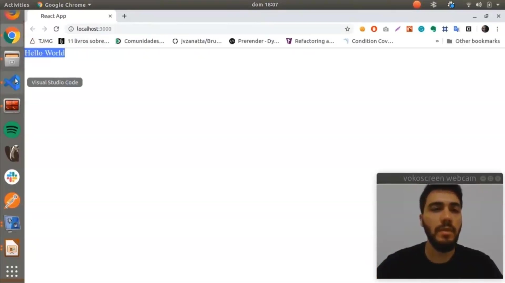
</p>

O CSS é importado diretamente para o arquivo do componente, integrando o estilo ao contexto daquela parte da interface.

```javascript
import './index.css';

```

<p align="center">
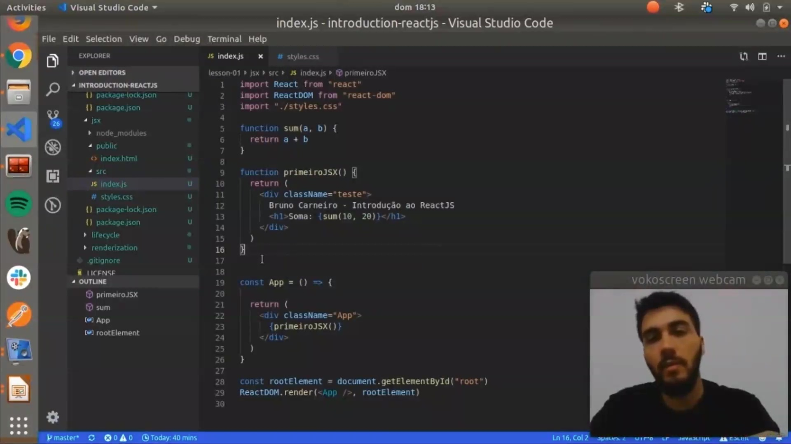
</p>

A essência do React reside na **componentização**. Diferente de outras ferramentas que tentam separar rigorosamente as tecnologias (HTML, CSS, JS), o React aproxima esses conceitos para criar blocos independentes e reutilizáveis chamados componentes.

<p align="center">
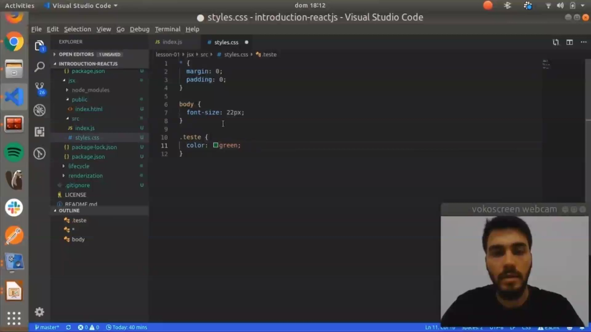
</p>

Essa estrutura fortalece a construção da aplicação, permitindo que cada parte da interface seja tratada como uma unidade lógica que contém sua própria estrutura e comportamento, facilitando a escalabilidade do projeto.      

### ▶️ INICIALIZAÇÃO DE PROJETO REACT (PROCEDIMENTO ATUALIZADO COM VITE)

#### Nota: 

- O curso original utiliza um roteiro de instalação mais antigo (baseado em create-react-app).
- Para acompanhar o conteúdo utilizando as práticas atuais do ecossistema React, este projeto
foi inicializado com Vite + React, abordagem moderna recomendada pela comunidade.

#### PRÉ-REQUISITOS
- Node.js (versão LTS, recomendado >= 18)
- npm (instalado junto com o Node.js)
- Terminal e editor de código (ex: VS Code)

#### PASSO A PASSO

1. Criar o projeto React com Vite
No terminal, navegue até o diretório desejado e execute:

```bash
npm create vite@latest my-react-app -- --template react
```

(Substitua "my-react-app" pelo nome do projeto desejado)

2. Acessar o diretório do projeto

```bash
cd my-react-app
```

3. Instalar as dependências

```bash
npm install
```


4. Iniciar o servidor de desenvolvimento

```bash
npm run dev
```

Após a execução, a aplicação estará disponível em:
http://localhost:5173

#### ESTRUTURA INICIAL DO PROJETO

```bash
my-react-app/
├── index.html
├── package.json
├── vite.config.js
├── public
│   └── vite.svg
├── src
│   ├── App.css
│   ├── App.jsx
│   ├── index.css
│   ├── main.jsx
│   └── assets/
└── README.md

```

#### OBSERVAÇÃO SOBRE COMPATIBILIDADE COM O CURSO

- A lógica do React ensinada no curso permanece a mesma (componentes, JSX, props, state).
- A principal diferença está apenas na ferramenta de build e na estrutura inicial.
- O uso do Vite oferece inicialização mais rápida, build mais leve e melhor experiência de desenvolvimento.

#### RESUMO DOS COMANDOS

```bash
npm create vite@latest my-react-app -- --template react
cd my-react-app
npm install
npm run dev
```

## 🟩 Vídeo 03 - Renderizando elementos


Link do vídeo: 


## 🟩 Vídeo 04 - Conheça os ecossistemas do ReactJS


Link do vídeo: 


# Parte 2 - xxxxxxxxxxxxxxx

## 🟩 Vídeo 01 - xxxxxxxxxxxxxxx


Link do vídeo:  


## 🟩 Vídeo 02 - xxxxxxxxxxxxxxx


Link do vídeo: 


## 🟩 Vídeo 03 - xxxxxxxxxxxxxxx


Link do vídeo: 


## 🟩 Vídeo 04 - xxxxxxxxxxxxxxx


Link do vídeo: 


## 🟩 Vídeo 05 - xxxxxxxxxxxxxxx


Link do vídeo: 


## 🟩 Vídeo 06 - xxxxxxxxxxxxxxx


Link do vídeo: 


## 🟩 Vídeo 07 - xxxxxxxxxxxxxxx


Link do vídeo: 


## 🟩 Vídeo 08 - xxxxxxxxxxxxxxx


Link do vídeo: 


## 🟩 Vídeo 09 - xxxxxxxxxxxxxxx


Link do vídeo: 


## 🟩 Vídeo 10 - xxxxxxxxxxxxxxx


Link do vídeo: 


# Parte 3 - xxxxxxxxxxxxxxx

## 🟩 Vídeo 01 - Exxxxxxxxxxxxxxx


Link do vídeo:  


## 🟩 Vídeo 02 - xxxxxxxxxxxxxxx


Link do vídeo: 


## 🟩 Vídeo 03 - xxxxxxxxxxxxxxx


Link do vídeo: 


## 🟩 Vídeo 04 - xxxxxxxxxxxxxxx


Link do vídeo: 


## 🟩 Vídeo 05 - xxxxxxxxxxxxxxx


Link do vídeo: 


## 🟩 Vídeo 06 - xxxxxxxxxxxxxxx


Link do vídeo: 


## 🟩 Vídeo 07 - xxxxxxxxxxxxxxx


Link do vídeo: 


## 🟩 Vídeo 08 - xxxxxxxxxxxxxxx


Link do vídeo: 


## 🟩 Vídeo 09 - xxxxxxxxxxxxxxx


Link do vídeo: 


## 🟩 Vídeo 10 - xxxxxxxxxxxxxxx


Link do vídeo: 


##  Materiais de Apoio


# Certificado: 

- Link na plataforma: 
- Certificado em pdf: 
