## Instrutor

- Celso Henrique (Engineering Manager @ Stone)
- Contato Linkedin: / [devfrontend](https://www.linkedin.com/in/devfrontend/)

# Parte 1 - Introdução

## 🟩 Vídeo 01 - Apresentação do projeto

<video width="60%" controls>
  <source src="000-Midia_e_Anexos/bootcamp_tqi_fullstack-modulo_04-Curso.02-Video_01.webm" type="video/webm">
    Seu navegador não suporta vídeo HTML5.
</video>

Link do vídeo: https://web.dio.me/track/tqi-fullstack-developer/course/introducao-aos-react-hooks/learning/5cd612fb-c2bc-405f-bd15-c0a568ebcc1e?autoplay=1

Nesta apresentação, o engenheiro de software **Celso Henrique** introduz um workshop técnico voltado ao desenvolvimento **frontend** utilizando **React**. O instrutor demonstra a criação de um **gerador de frases** temático do Naruto, integrando uma **API simplificada** para exercitar conceitos de **programação assíncrona**. Além da interface visual, o projeto prioriza o ensino de **testes automatizados** e a estilização de componentes através de **CSS-in-JS**. Os participantes têm acesso a um repositório estruturado em etapas para facilitar o acompanhamento da lógica de programação e das **ferramentas modernas** de mercado. O objetivo central é capacitar desenvolvedores em práticas essenciais do cotidiano corporativo, unindo **teoria e aplicação prática**.

### Anotações

<p align="center">
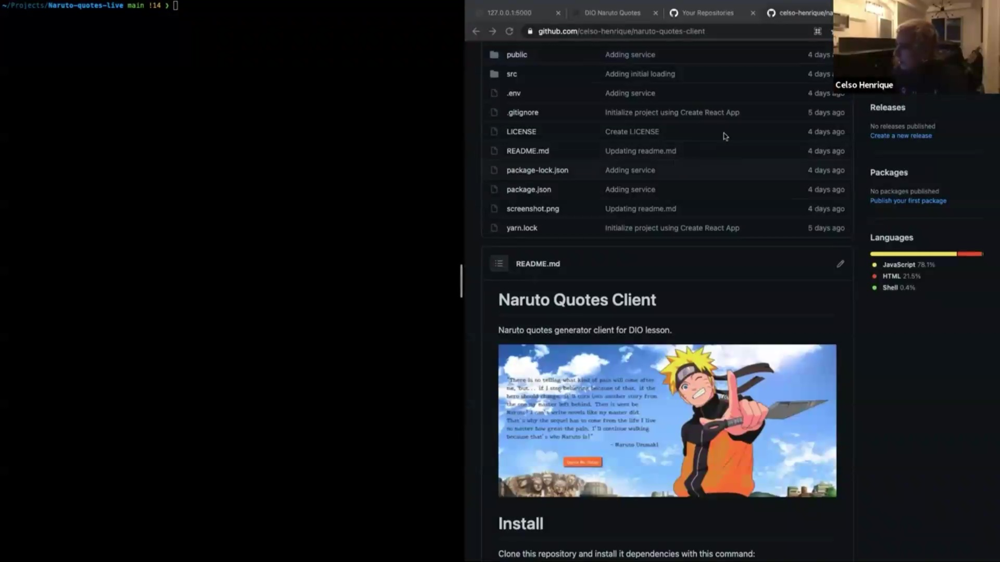
</p>

O instrutor Celso Henrique apresenta o repositório central do projeto no GitHub, intitulado **naruto-quotes-client**. Este repositório contém a estrutura de um projeto inicializado com `Create React App`, utilizando **JavaScript** e **HTML** como linguagens principais. O objetivo da aula é desenvolver um gerador de frases do Naruto, explorando o consumo de uma API externa para praticar conceitos de **programação assíncrona** e manipulação de estado no React.

No repositório, observam-se arquivos fundamentais como o `package.json` para gerenciamento de dependências e o `README.md` com as instruções iniciais de instalação e clonagem do projeto.

<p align="center">
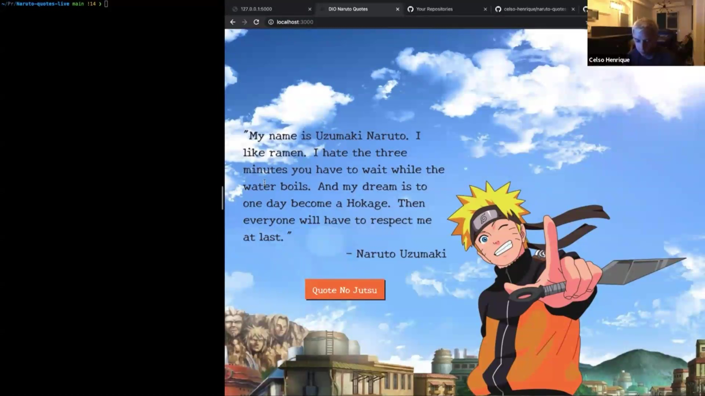
</p>

A imagem demonstra a versão final da aplicação em execução no ambiente local (`localhost:3000`). A interface apresenta uma estética temática com uma imagem do personagem Naruto Uzumaki, uma área de exibição de texto e o botão **Quote No Jutsu**.

O funcionamento básico consiste em:

* **Exibição de Frases:** Uma citação aleatória trazida da API (ex: "My name is Uzumaki Naruto...").
* **Interatividade:** Ao clicar no botão, a aplicação realiza uma nova requisição assíncrona ao servidor para atualizar a frase e o autor exibidos na tela.
* **Tecnologias Aplicadas:** Além do React Hooks para controle de estado, o projeto utiliza **CSS-in-JS** para estilização dos componentes e uma estrutura preparada para a implementação de **testes unitários**.


## 🟩 Vídeo 02 - Criando seu projeto

<video width="60%" controls>
  <source src="000-Midia_e_Anexos/bootcamp_tqi_fullstack-modulo_04-Curso.02-Video_02.webm" type="video/webm">
    Seu navegador não suporta vídeo HTML5.
</video>

Link do vídeo: https://web.dio.me/track/tqi-fullstack-developer/course/introducao-aos-react-hooks/learning/0bcd9fde-8c6e-4a50-b728-a1f679440225?autoplay=1

O instrutor explica a organização do **diretório de arquivos**, destacando a inclusão prévia de recursos como imagens, sons e bibliotecas para otimizar o tempo de aula. É dada ênfase ao uso do **Styled Components** para a criação de um estilo global e ao funcionamento do servidor de frases que utiliza Python. O tutorial orienta sobre a estrutura de **pastas e módulos JavaScript**, demonstrando como os componentes são exportados e importados no ecossistema do frontend. Por fim, o autor inicia a construção da **interface do usuário**, planejando a disposição visual entre textos e elementos gráficos na tela principal.

### Anotações

<p align="center">
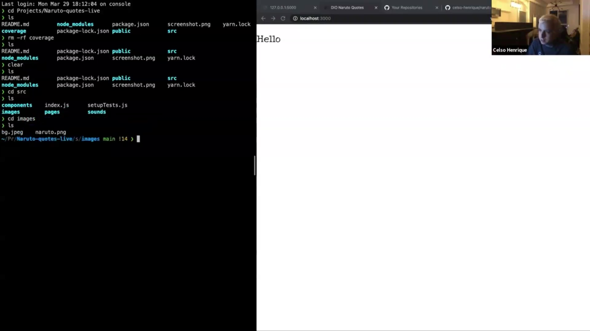
</p>

O instrutor inicia a exploração da estrutura de pastas do projeto através do terminal. Dentro do diretório principal `Naruto-quotes-live`, destaca-se a pasta **src**, que contém o código-fonte da aplicação. Além dos arquivos de configuração padrão como `package.json` e `yarn.lock`, o ambiente já conta com recursos pré-configurados, incluindo diretórios para imagens e sons que serão utilizados para personalizar a experiência do usuário com a temática de Naruto.

```bash
> cd src
ls
components
images
> cd images
bg.jpeg
naruto.png
sounds
pages

```

<p align="center">
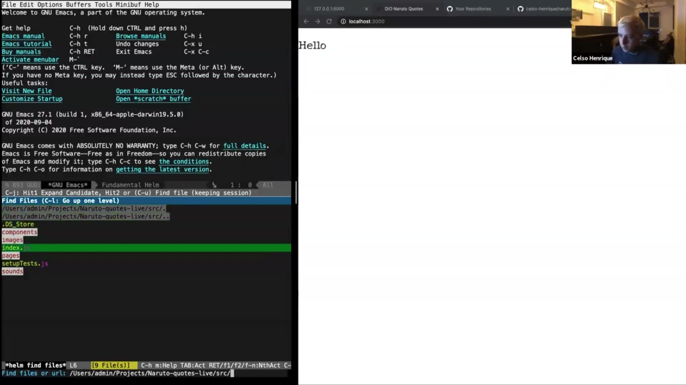
</p>

Para a edição do código, é utilizado o **Emacs**, um editor de texto baseado em terminal. O instrutor demonstra a navegação pelos arquivos do projeto, focando na organização da pasta `src`, que centraliza os componentes, páginas e estilos globais da aplicação.

<p align="center">
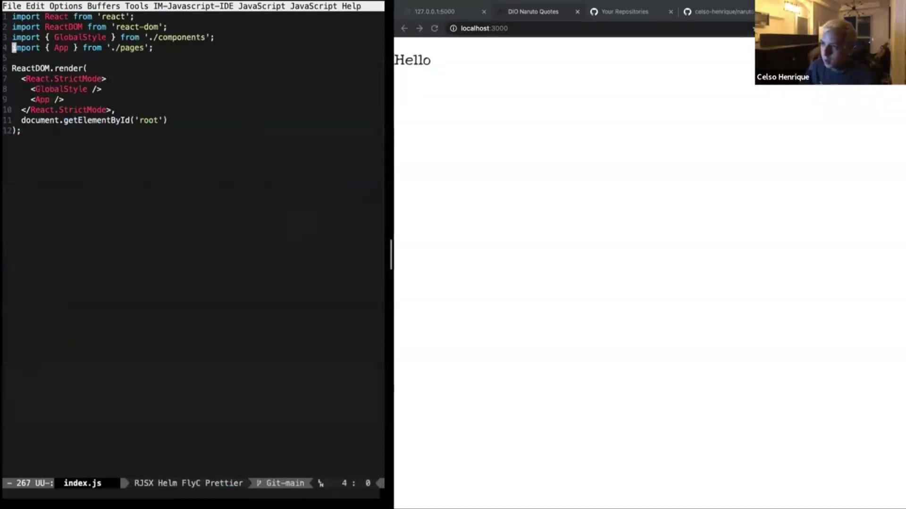
</p>

Ao abrir o arquivo `index.js`, observa-se a estrutura inicial do React. A principal customização inserida é a importação do **GlobalStyle** a partir da pasta de componentes e o componente **App** da pasta de páginas. O `ReactDOM.render` é configurado para envolver a aplicação com os estilos globais, garantindo que as definições de CSS se apliquem a todos os elementos renderizados.

```javascript
import React from 'react';
import ReactDOM from 'react-dom';
import { GlobalStyle } from './components';
import { App } from './pages';

ReactDOM.render(
  <React.StrictMode>
    <GlobalStyle />
    <App />
  </React.StrictMode>,
  document.getElementById('root')
);

```

<p align="center">
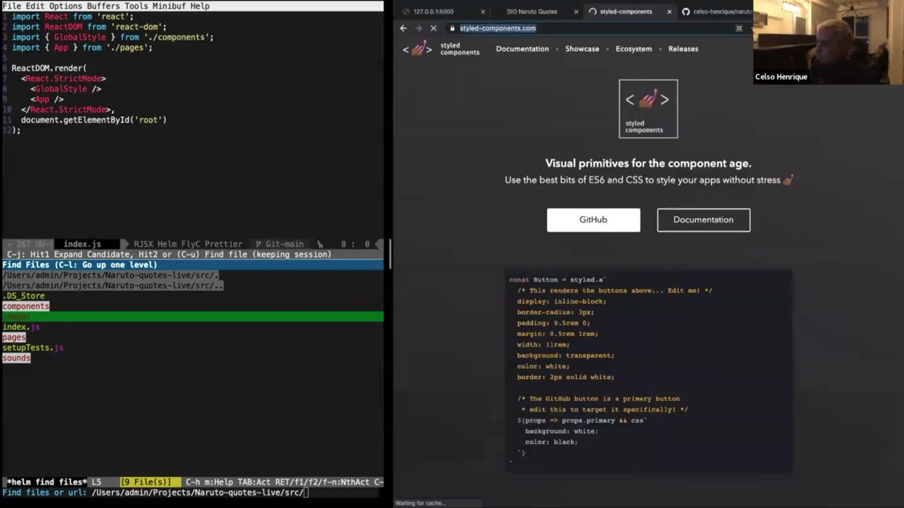
</p>

A estilização da aplicação é fundamentada na biblioteca **styled-components**, que permite a criação de "visual primitives" utilizando a sintaxe do ES6 e CSS diretamente no JavaScript. O instrutor acessa a documentação oficial para contextualizar como os estilos são aplicados de forma modular e eficiente no projeto.

<p align="center">
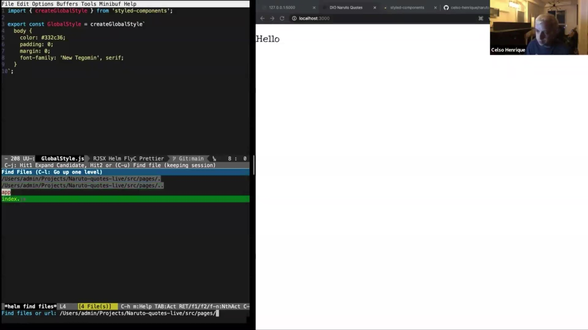
</p>

No arquivo `GlobalStyle.js`, define-se a identidade visual da aplicação. Através da função `createGlobalStyle`, são estabelecidas as configurações do `body`, incluindo o reset de margens e preenchimento, a cor do texto e a importação da fonte **'New Tegomin'**, escolhida especificamente para remeter à estética de animes.

```javascript
import { createGlobalStyle } from 'styled-components';

export const GlobalStyle = createGlobalStyle`
  body {
    color: #332c36;
    padding: 0;
    margin: 0;
    font-family: 'New Tegomin', serif;
  }
`;

```

<p align="center">
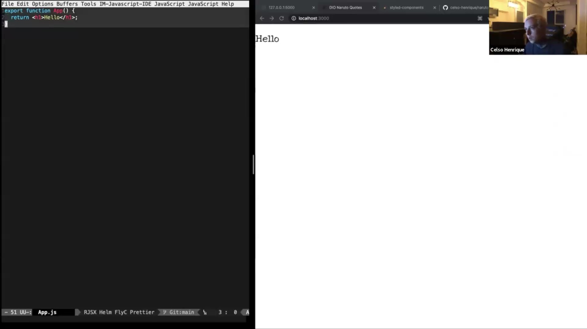
</p>

O componente principal da aplicação, localizado em `App.js`, inicia com uma estrutura simplificada. Trata-se de uma função funcional que retorna um elemento de cabeçalho básico. Este arquivo servirá como o ponto central para a construção da interface, que futuramente dividirá o espaço entre as frases geradas pelo servidor e a imagem do personagem.

```javascript
export function App() {
  return <h1>Hello</h1>;
}

```      


## 🟩 Vídeo 03 - Criando sua primeira página e seus respectivos testes

<video width="60%" controls>
  <source src="000-Midia_e_Anexos/bootcamp_tqi_fullstack-modulo_04-Curso.02-Video_03.webm" type="video/webm">
    Seu navegador não suporta vídeo HTML5.
</video>

Link do vídeo: https://web.dio.me/track/tqi-fullstack-developer/course/introducao-aos-react-hooks/learning/564a2de4-1e02-4322-a065-cd35761ac225?autoplay=1

O material apresenta uma introdução prática à metodologia **Test-Driven Development (TDD)** utilizando **React** e a biblioteca **Testing Library**. O instrutor demonstra como redigir testes unitários que simulam a **perspectiva do usuário** antes mesmo de desenvolver as funcionalidades do software. O processo foca em criar um teste que inicialmente falha ao procurar elementos como **botões e imagens**, forçando o desenvolvedor a implementar o código necessário para que a aplicação funcione. Através da função **render** e de seletores de tela, o conteúdo ensina a validar a existência de componentes essenciais na interface. Por fim, o tutorial destaca a importância da **acessibilidade** e da organização de arquivos, como a importação correta de ativos visuais.

### Anotações

<p align="center">
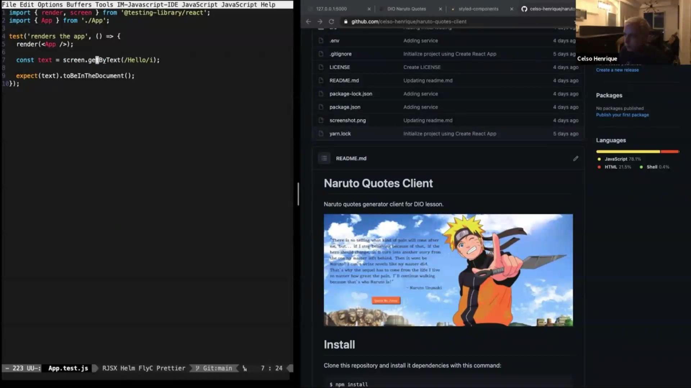
</p>

Nesta etapa, iniciamos a implementação seguindo a metodologia **TDD (Test Driven Development)**, onde o teste é escrito antes da funcionalidade real. O arquivo `App.test.js` apresenta um teste inicial que utiliza a **Testing Library** para verificar a renderização de um texto específico na tela. A biblioteca fornece utilitários como `render` e `screen` para simular o comportamento do usuário e validar se os elementos esperados estão presentes no DOM.

```javascript
import { render, screen } from '@testing-library/react';
import { App } from './App';

test('renders the app', () => {
  render(<App />);
  const text = screen.getByText(/Hello/i);
  expect(text).toBeInTheDocument();
});

```

<p align="center">
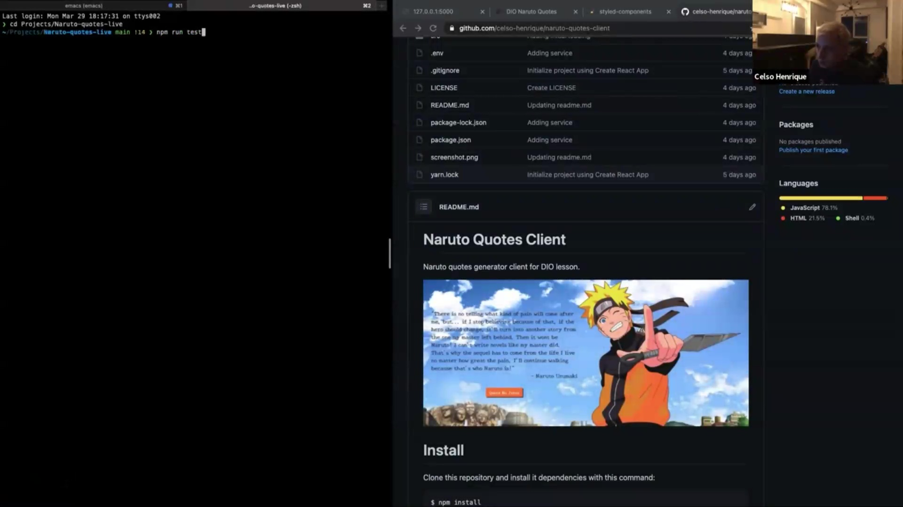
</p>

Para validar o estado atual do projeto, executamos o comando de testes no terminal. Este comando aciona o *test runner* (Jest) que analisa os arquivos com extensão `.test.js`. Como o projeto foi recém-criado com o Create React App, o ambiente já está configurado com as dependências necessárias para rodar as verificações iniciais.

```bash
npm run test

```

<p align="center">
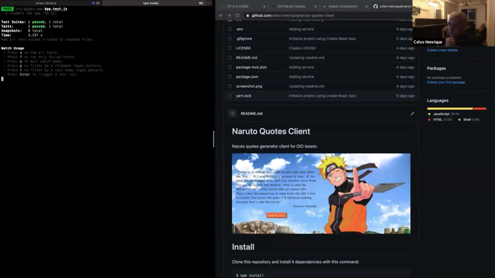
</p>

O resultado da execução mostra que a suíte de testes passou com sucesso (`PASS`). O sistema indica o tempo de execução e confirma que um teste unitário foi concluído. Este é o ponto de partida ideal para a refatoração, garantindo que o ambiente está estável antes de começarmos a definir os novos requisitos da interface baseada em Naruto.

```bash
PASS src/App.test.js
  ✓ renders the app (10 ms)

Test Suites: 1 passed, 1 total
Tests:       1 passed, 1 total
Snapshots:   0 total
Time:        3.237 s

```

<p align="center">
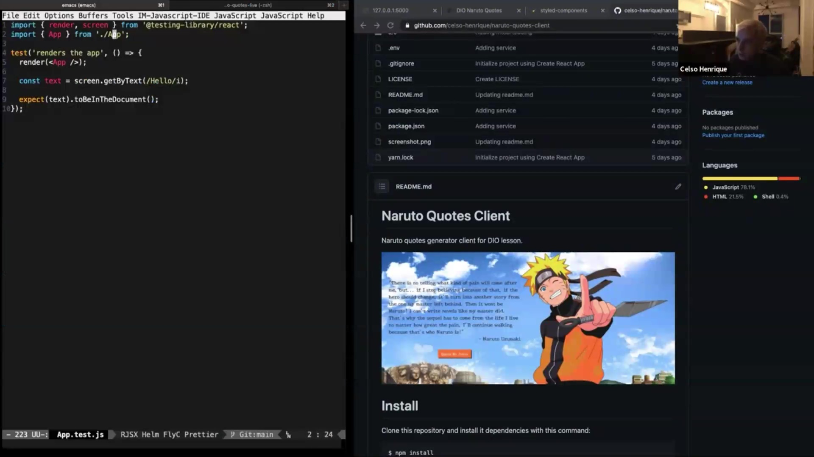
</p>

Agora, refatoramos o teste para refletir os elementos que realmente desejamos na aplicação: um botão, uma imagem e um texto de citação. O objetivo do TDD neste momento é fazer o teste falhar, pois esses elementos ainda não existem no componente `App`. Utilizamos o método `getByRole` para buscar os elementos por sua função semântica (botão, imagem, etc.), simulando como um usuário ou tecnologia assistiva identificaria a interface.

```javascript
import { render, screen } from '@testing-library/react';
import { App } from './App';

test('renders the app with a button, a quote and a button', () => {
  render(<App />);
  
  const buttonEl = screen.getByRole('button');
  const imageEl = screen.getByRole('img');
  const textEl = screen.getByRole('p');

  expect(buttonEl).toBeInTheDocument();
  expect(imageEl).toBeInTheDocument();
  expect(textEl).toBeInTheDocument();
});

```

<p align="center">
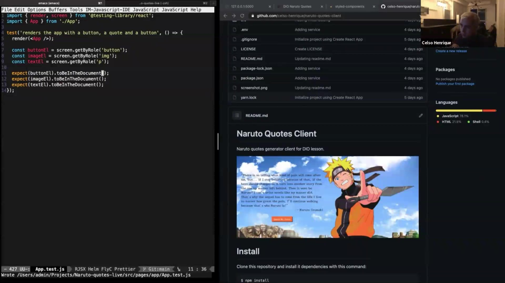
</p>

Após a falha planejada do teste, iniciamos a implementação no arquivo `App.js` para satisfazer os requisitos. Definimos a estrutura básica com uma `div` contendo um parágrafo para a citação, um botão com o texto "Quote No Jutsu" e um elemento de imagem. Para a imagem, realizamos a importação de um arquivo local e definimos um `alt` descritivo, o que é fundamental para acessibilidade e SEO.

```javascript
import narutoImg from '../../images/naruto.png';

export function App() {
  return (
    <div>
      <p>quote xpto Speaker</p>
      <button>Quote No Jutsu</button>
      
    </div>
  );
}

```

<p align="center">
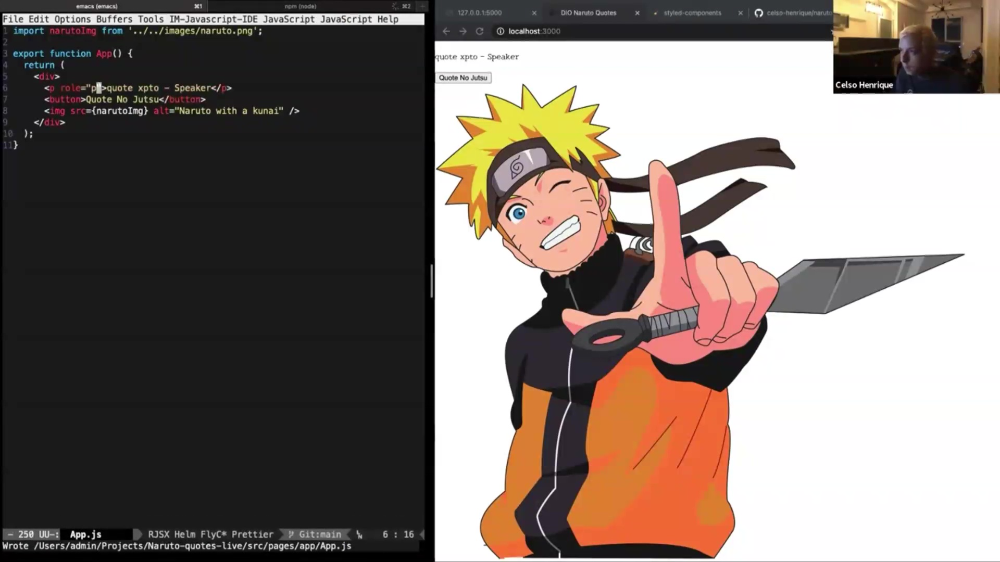
</p>

Com a estrutura básica implementada, visualizamos o resultado no navegador. Embora o visual ainda não possua o estilo final desejado, os elementos fundamentais já estão presentes no DOM: o texto da citação, o botão de ação e a imagem do Naruto com sua kunai. Esta visualização confirma que o componente está renderizando as tags HTML corretamente no endereço local da aplicação.

<p align="center">
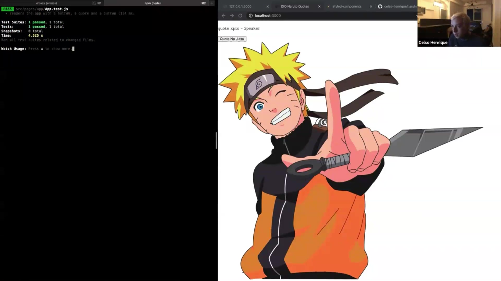
</p>

Ao final do ciclo, rodamos novamente os testes para confirmar se a implementação satisfez as asserções. O terminal indica que a suíte de testes passou, validando que o botão, a imagem e os textos estão presentes no documento conforme o esperado. Este sucesso marca a conclusão da primeira iteração do ciclo TDD, permitindo avançar para a estilização e funcionalidades dinâmicas.

```bash
PASS src/pages/app/App.test.js
  ✓ renders the app with a button (42 ms)

Test Suites: 1 passed, 1 total
Tests:       1 passed, 1 total
Snapshots:   0 total
Time:        4.525 s

```

## 🟩 Vídeo 04 - Conhecendo o React Styled Components e criando um componente

<video width="60%" controls>
  <source src="000-Midia_e_Anexos/bootcamp_tqi_fullstack-modulo_04-Curso.02-Video_04.webm" type="video/webm">
    Seu navegador não suporta vídeo HTML5.
</video>

Link do vídeo: https://web.dio.me/track/tqi-fullstack-developer/course/introducao-aos-react-hooks/learning/798759df-077a-4e49-8c10-f6d9969c0333?autoplay=1

O video apresenta um tutorial prático sobre o desenvolvimento de interfaces utilizando **React** e a biblioteca **Styled Components**. O autor demonstra como criar **componentes estilizados** diretamente no JavaScript, destacando a facilidade de organizar layouts com **Flexbox** e o uso de medidas responsivas. Além da parte visual, o conteúdo aborda a importância da **refatoração de código**, sugerindo a separação de elementos em novos arquivos para facilitar a **manutenção e reutilização**. Por fim, discute-se a estratégia de **testes unitários**, priorizando a validação de comportamentos e regras de negócio em vez de focar apenas em aspectos visuais. O guia utiliza um exemplo prático com imagens e textos para ilustrar a montagem da estrutura e a preparação de um **ambiente de testes**.

### Anotações

<p align="center">
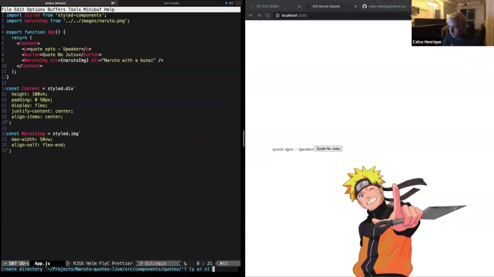
</p>

Nesta etapa, inicia-se a construção da interface do componente principal utilizando `styled-components`. A abordagem foca em criar um container estrutural chamado `Content` para organizar os elementos que foram definidos previamente no teste unitário: um parágrafo para o texto, um botão de ação e a imagem do personagem.

O código estabelece a estrutura básica do componente `App`, importando a imagem do Naruto e definindo a estilização inicial para centralizar o conteúdo na tela.

```javascript
import styled from 'styled-components';
import narutoImg from '../../images/naruto.png';

export function App() {
  return (
    <Content>
      <p>quote xpto</p>
      <span>Speaker</span>
      <button>Quote No Jutsu</button>
      
    </Content>
  );
}

const Content = styled.div`
  height: 100vh;
  padding: 0 50px;
  display: flex;
  justify-content: center;
  align-items: center;
`;

const NarutoImg = styled.img`
  max-width: 50vw;
  align-self: flex-end;
`;

```

<p align="center">

</p>

Para melhorar a organização do projeto, a lógica de exibição das frases é isolada em um componente específico chamado `Quotes`. Esta refatoração permite que o componente `App` gerencie o layout global enquanto o `Quotes` cuida especificamente da renderização do texto da frase, do autor (speaker) e do botão de interação.

```javascript
export const Quotes = () => {
  return (
    <div>
      <p>quote xpto</p>
      <span>Speaker</span>
      <button>Quote No Jutsu</button>
    </div>
  );
};

```

<p align="center">
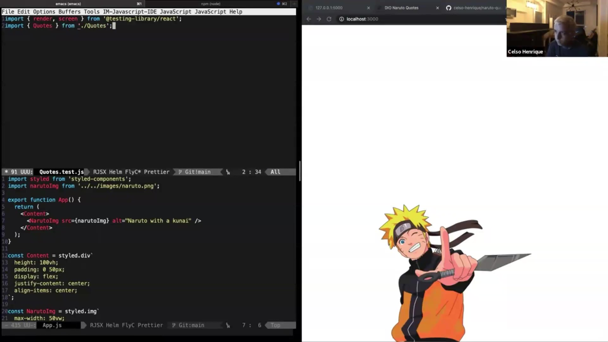
</p>

Após a criação do componente `Quotes`, é necessário atualizar os testes unitários para garantir que a aplicação continue funcionando conforme esperado. Utilizando a **Testing Library**, o teste é configurado para renderizar o componente e verificar a presença dos elementos fundamentais. A busca pelos elementos é refinada para imitar o comportamento do usuário, utilizando métodos como `screen.getByText` ou expressões regulares para localizar o "speaker" e a citação na tela.

```javascript
import { render, screen } from '@testing-library/react';
import { Quotes } from './Quotes';

test('renders quotes with a button and text', () => {
  render(<Quotes />);
  
  const buttonEl = screen.getByRole('button');
  const textEl = screen.getByText(/quote xpto/i);
  const speakerEl = screen.getByText(/speaker/i);

  expect(buttonEl).toBeInTheDocument();
  expect(textEl).toBeInTheDocument();
  expect(speakerEl).toBeInTheDocument();
});

```

## 🟩 Vídeo 05 - Evoluindo e testando nosso componente

<video width="60%" controls>
  <source src="000-Midia_e_Anexos/bootcamp_tqi_fullstack-modulo_04-Curso.02-Video_05.webm" type="video/webm">
    Seu navegador não suporta vídeo HTML5.
</video>

Link do vídeo: https://web.dio.me/track/tqi-fullstack-developer/course/introducao-aos-react-hooks/learning/1996357a-d196-4665-900d-49ab75cfe66f?autoplay=1

O vídeo descreve o processo de desenvolvimento de um **componente React** utilizando a metodologia de **testes unitários** primeiro. O autor detalha a criação de um componente de frases que deve **renderizar propriedades** específicas, como o texto de uma citação, o autor e um botão de ação. Durante a explicação, é enfatizada a importância de escrever o **teste antes da funcionalidade**, garantindo que o código cumpra o contrato estabelecido. O relato aborda a resolução de falhas nos testes através da **desestruturação de propriedades** e da refatoração da estrutura de diretórios do projeto. Por fim, o desenvolvedor demonstra como a **integração entre componentes** e a exportação correta de arquivos resultam em um sistema funcional e validado.

### Anotações

 <p align="center">
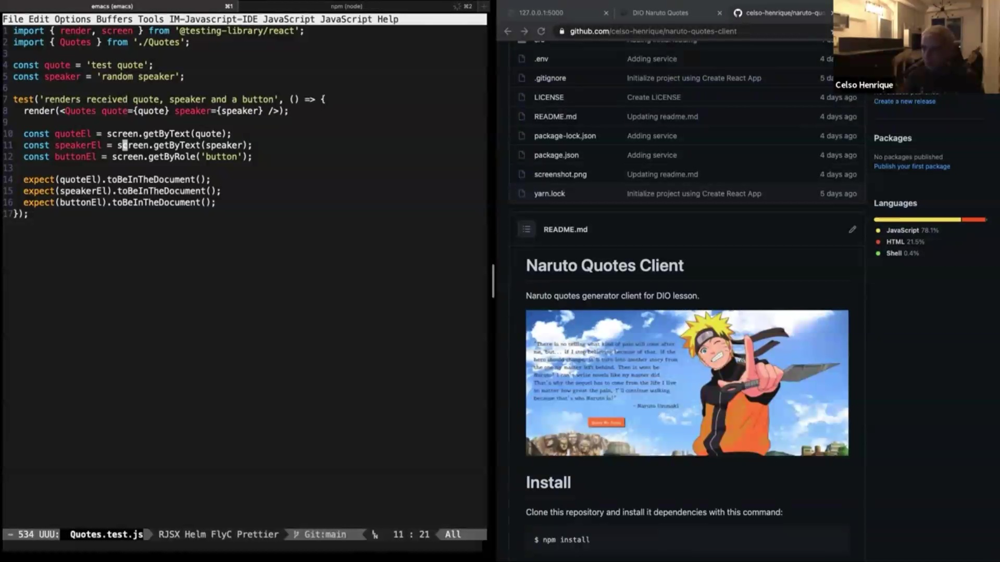
</p>

Para garantir que o componente de frases se comporte conforme o esperado, iniciamos o desenvolvimento aplicando a **mentalidade de testes unitários**, escrevendo o teste antes mesmo da funcionalidade existir. O objetivo é criar um contrato onde o componente deve receber uma frase (`quote`) e um autor (`speaker`) via propriedades e renderizá-los na tela juntamente com um botão.

No código abaixo, utilizamos a biblioteca de testes para simular a renderização do componente `Quotes` e verificar se os textos passados e o elemento de botão estão presentes no documento:

```javascript
import { render, screen } from '@testing-library/react';
import { Quotes } from './Quotes';

const quote = 'test quote';
const speaker = 'random speaker';

test('renders received quote, speaker and a button', () => {
  render(<Quotes quote={quote} speaker={speaker} />);

  const quoteEl = screen.getByText(quote);
  const speakerEl = screen.getByText(speaker);
  const buttonEl = screen.getByRole('button');

  expect(quoteEl).toBeInTheDocument();
  expect(speakerEl).toBeInTheDocument();
  expect(buttonEl).toBeInTheDocument();
});

```

<p align="center">
  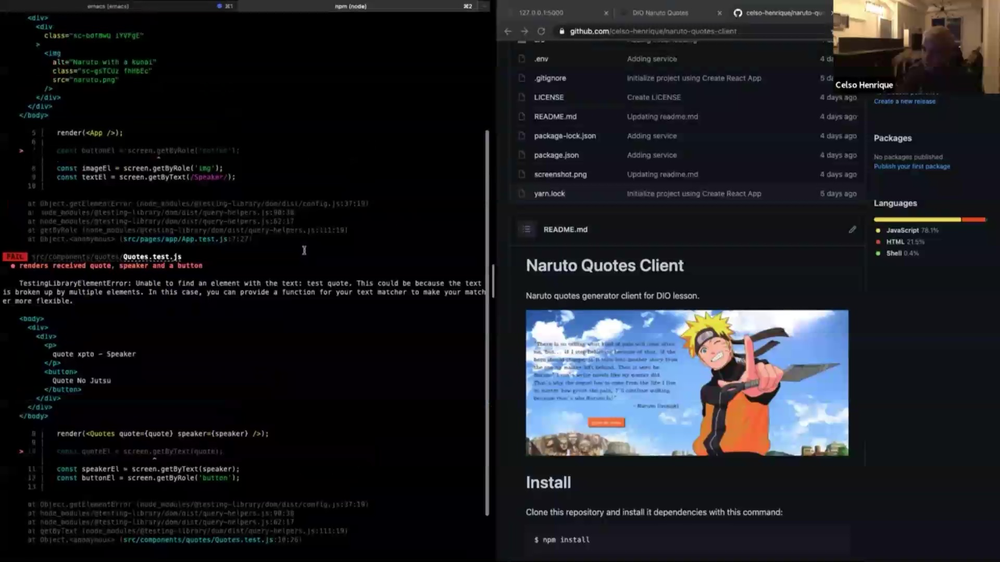
</p>

Ao executar os testes pela primeira vez, encontramos falhas esperadas. O erro indicado pelo terminal mostra que o sistema de testes não conseguiu localizar o texto "test quote" no componente. Isso ocorre porque o componente `Quotes` ainda possui conteúdo estático e não está tratando as propriedades recebidas, resultando em uma falha de asserção durante a busca pelo texto na árvore do DOM.

<p align="center">
  
</p>

Para corrigir a falha e fazer o teste passar, alteramos a implementação do componente para aceitar propriedades. Utilizamos a técnica de **destructuring** para extrair `quote` e `speaker` dos argumentos da função. Agora, o componente deixa de exibir um texto fixo e passa a renderizar dinamicamente o que recebe, incluindo o botão com o texto "Quote No Jutsu".

```javascript
export const Quotes = ({ quote, speaker }) => {
  return (
    <div>
      <p>{quote}</p>
      <p>- {speaker}</p>
      <button>Quote No Jutsu</button>
    </div>
  );
};

```

<p align="center">
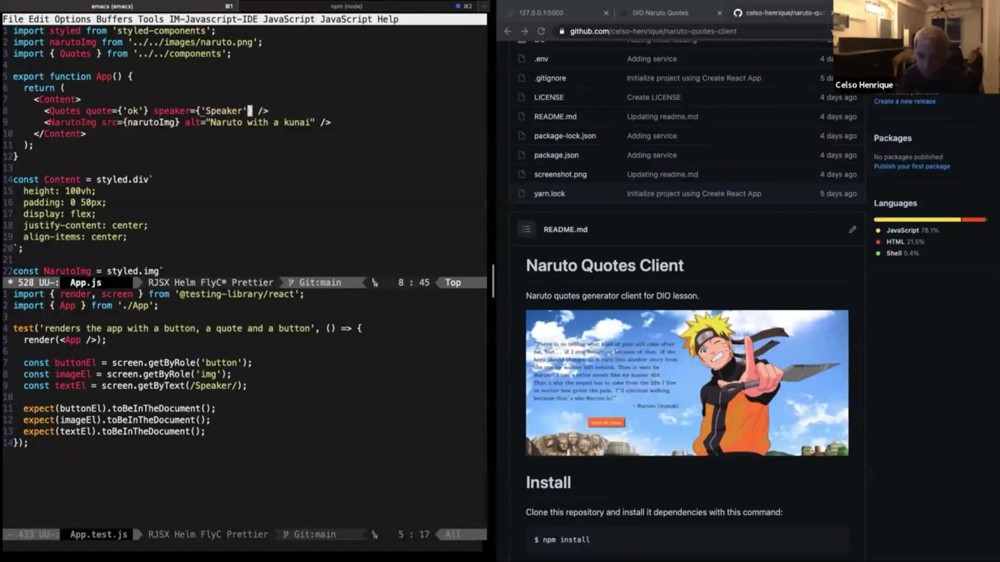
</p>

Com o componente individual funcionando, é necessário integrá-lo ao arquivo principal da aplicação (`App.js`). Realizamos a importação do componente `Quotes` e o organizamos dentro de uma estrutura estilizada utilizando `styled-components`. O componente principal agora delega a responsabilidade de exibição da frase para o novo componente, passando as propriedades necessárias, enquanto lida com o layout global e a imagem lateral do personagem.

```javascript
import styled from 'styled-components';
import narutoImg from '../../images/naruto.png';
import { Quotes } from '../../components';

export function App() {
  return (
    <Content>
      <Quotes quote={'ok'} speaker={'Speaker'} />
      <NarutoImg src={narutoImg} alt="Naruto with a kunai" />
    </Content>
  );
}

const Content = styled.div`
  height: 100vh;
  padding: 0 50px;
  display: flex;
  justify-content: center;
  align-items: center;
`;

const NarutoImg = styled.img`
  /* Estilização da imagem */
`;

```

<p align="center">
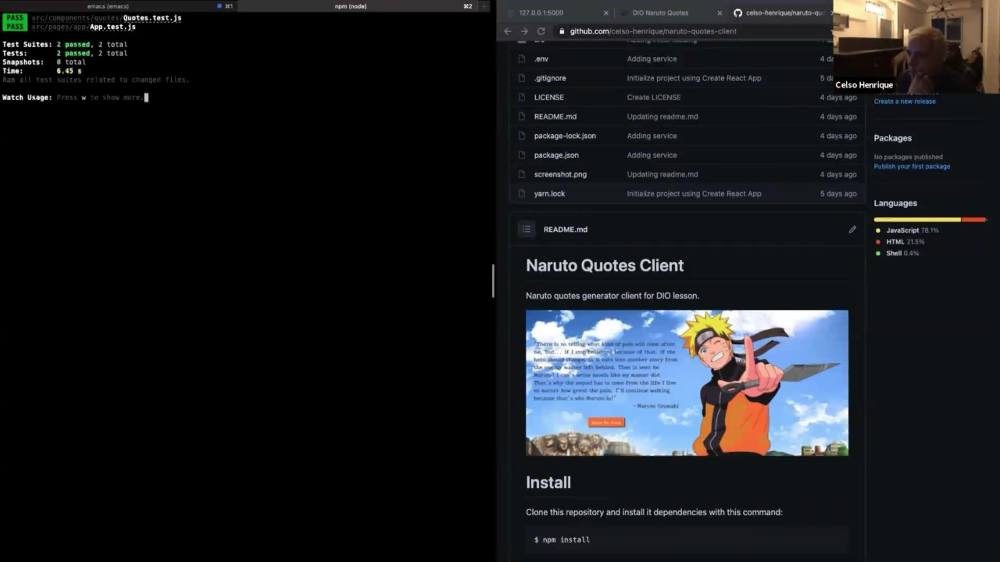
</p>

Após a refatoração e a correta importação dos componentes, executamos a suíte de testes novamente. O resultado no terminal confirma que tanto o teste unitário do componente `Quotes` quanto o teste de integração do `App` foram bem-sucedidos. Ver a sinalização "PASS" em todos os arquivos de teste indica que a lógica de renderização por propriedades e a estrutura de componentes estão operando corretamente.


## 🟩 Vídeo 06 - xxxxxxxxxxxxxxx


Link do vídeo: 


## 🟩 Vídeo 07 - xxxxxxxxxxxxxxx


Link do vídeo: 


## 🟩 Vídeo 08 - xxxxxxxxxxxxxxx


Link do vídeo: 


## 🟩 Vídeo 09 - xxxxxxxxxxxxxxx


Link do vídeo: 


## 🟩 Vídeo 10 - xxxxxxxxxxxxxxx


Link do vídeo: 


# Parte 2 - xxxxxxxxxxxxxxx

## 🟩 Vídeo 01 - xxxxxxxxxxxxxxx


Link do vídeo:  


## 🟩 Vídeo 02 - xxxxxxxxxxxxxxx


Link do vídeo: 


## 🟩 Vídeo 03 - xxxxxxxxxxxxxxx


Link do vídeo: 


## 🟩 Vídeo 04 - xxxxxxxxxxxxxxx


Link do vídeo: 


## 🟩 Vídeo 05 - xxxxxxxxxxxxxxx


Link do vídeo: 


## 🟩 Vídeo 06 - xxxxxxxxxxxxxxx


Link do vídeo: 


## 🟩 Vídeo 07 - xxxxxxxxxxxxxxx


Link do vídeo: 


## 🟩 Vídeo 08 - xxxxxxxxxxxxxxx


Link do vídeo: 


## 🟩 Vídeo 09 - xxxxxxxxxxxxxxx


Link do vídeo: 


## 🟩 Vídeo 10 - xxxxxxxxxxxxxxx


Link do vídeo: 


# Parte 3 - xxxxxxxxxxxxxxx

## 🟩 Vídeo 01 - Exxxxxxxxxxxxxxx


Link do vídeo:  


## 🟩 Vídeo 02 - xxxxxxxxxxxxxxx


Link do vídeo: 


## 🟩 Vídeo 03 - xxxxxxxxxxxxxxx


Link do vídeo: 


## 🟩 Vídeo 04 - xxxxxxxxxxxxxxx


Link do vídeo: 


## 🟩 Vídeo 05 - xxxxxxxxxxxxxxx


Link do vídeo: 


## 🟩 Vídeo 06 - xxxxxxxxxxxxxxx


Link do vídeo: 


## 🟩 Vídeo 07 - xxxxxxxxxxxxxxx


Link do vídeo: 


## 🟩 Vídeo 08 - xxxxxxxxxxxxxxx


Link do vídeo: 


## 🟩 Vídeo 09 - xxxxxxxxxxxxxxx


Link do vídeo: 


## 🟩 Vídeo 10 - xxxxxxxxxxxxxxx


Link do vídeo: 


##  Materiais de Apoio


# Certificado: 

- Link na plataforma: 
- Certificado em pdf: 
