## Instrutor

- Celso Henrique (Engineering Manager @ Stone)
- Contato Linkedin: / [devfrontend](https://www.linkedin.com/in/devfrontend/)

# Parte 1 - Introdução

## 🟩 Vídeo 01 - Apresentação do projeto

<video width="60%" controls>
  <source src="000-Midia_e_Anexos/bootcamp_tqi_fullstack-modulo_04-Curso.02-Video_01.webm" type="video/webm">
    Seu navegador não suporta vídeo HTML5.
</video>

Link do vídeo: https://web.dio.me/track/tqi-fullstack-developer/course/introducao-aos-react-hooks/learning/5cd612fb-c2bc-405f-bd15-c0a568ebcc1e?autoplay=1

Nesta apresentação, o engenheiro de software **Celso Henrique** introduz um workshop técnico voltado ao desenvolvimento **frontend** utilizando **React**. O instrutor demonstra a criação de um **gerador de frases** temático do Naruto, integrando uma **API simplificada** para exercitar conceitos de **programação assíncrona**. Além da interface visual, o projeto prioriza o ensino de **testes automatizados** e a estilização de componentes através de **CSS-in-JS**. Os participantes têm acesso a um repositório estruturado em etapas para facilitar o acompanhamento da lógica de programação e das **ferramentas modernas** de mercado. O objetivo central é capacitar desenvolvedores em práticas essenciais do cotidiano corporativo, unindo **teoria e aplicação prática**.

### Anotações

<p align="center">

</p>

O instrutor Celso Henrique apresenta o repositório central do projeto no GitHub, intitulado **naruto-quotes-client**. Este repositório contém a estrutura de um projeto inicializado com `Create React App`, utilizando **JavaScript** e **HTML** como linguagens principais. O objetivo da aula é desenvolver um gerador de frases do Naruto, explorando o consumo de uma API externa para praticar conceitos de **programação assíncrona** e manipulação de estado no React.

No repositório, observam-se arquivos fundamentais como o `package.json` para gerenciamento de dependências e o `README.md` com as instruções iniciais de instalação e clonagem do projeto.

<p align="center">

</p>

A imagem demonstra a versão final da aplicação em execução no ambiente local (`localhost:3000`). A interface apresenta uma estética temática com uma imagem do personagem Naruto Uzumaki, uma área de exibição de texto e o botão **Quote No Jutsu**.

O funcionamento básico consiste em:

* **Exibição de Frases:** Uma citação aleatória trazida da API (ex: "My name is Uzumaki Naruto...").
* **Interatividade:** Ao clicar no botão, a aplicação realiza uma nova requisição assíncrona ao servidor para atualizar a frase e o autor exibidos na tela.
* **Tecnologias Aplicadas:** Além do React Hooks para controle de estado, o projeto utiliza **CSS-in-JS** para estilização dos componentes e uma estrutura preparada para a implementação de **testes unitários**.


## 🟩 Vídeo 02 - Criando seu projeto

<video width="60%" controls>
  <source src="000-Midia_e_Anexos/bootcamp_tqi_fullstack-modulo_04-Curso.02-Video_02.webm" type="video/webm">
    Seu navegador não suporta vídeo HTML5.
</video>

Link do vídeo: https://web.dio.me/track/tqi-fullstack-developer/course/introducao-aos-react-hooks/learning/0bcd9fde-8c6e-4a50-b728-a1f679440225?autoplay=1

O instrutor explica a organização do **diretório de arquivos**, destacando a inclusão prévia de recursos como imagens, sons e bibliotecas para otimizar o tempo de aula. É dada ênfase ao uso do **Styled Components** para a criação de um estilo global e ao funcionamento do servidor de frases que utiliza Python. O tutorial orienta sobre a estrutura de **pastas e módulos JavaScript**, demonstrando como os componentes são exportados e importados no ecossistema do frontend. Por fim, o autor inicia a construção da **interface do usuário**, planejando a disposição visual entre textos e elementos gráficos na tela principal.

### Anotações

<p align="center">

</p>

O instrutor inicia a exploração da estrutura de pastas do projeto através do terminal. Dentro do diretório principal `Naruto-quotes-live`, destaca-se a pasta **src**, que contém o código-fonte da aplicação. Além dos arquivos de configuração padrão como `package.json` e `yarn.lock`, o ambiente já conta com recursos pré-configurados, incluindo diretórios para imagens e sons que serão utilizados para personalizar a experiência do usuário com a temática de Naruto.

```bash
> cd src
ls
components
images
> cd images
bg.jpeg
naruto.png
sounds
pages

```

<p align="center">

</p>

Para a edição do código, é utilizado o **Emacs**, um editor de texto baseado em terminal. O instrutor demonstra a navegação pelos arquivos do projeto, focando na organização da pasta `src`, que centraliza os componentes, páginas e estilos globais da aplicação.

<p align="center">

</p>

Ao abrir o arquivo `index.js`, observa-se a estrutura inicial do React. A principal customização inserida é a importação do **GlobalStyle** a partir da pasta de componentes e o componente **App** da pasta de páginas. O `ReactDOM.render` é configurado para envolver a aplicação com os estilos globais, garantindo que as definições de CSS se apliquem a todos os elementos renderizados.

```javascript
import React from 'react';
import ReactDOM from 'react-dom';
import { GlobalStyle } from './components';
import { App } from './pages';

ReactDOM.render(
  <React.StrictMode>
    <GlobalStyle />
    <App />
  </React.StrictMode>,
  document.getElementById('root')
);

```

<p align="center">

</p>

A estilização da aplicação é fundamentada na biblioteca **styled-components**, que permite a criação de "visual primitives" utilizando a sintaxe do ES6 e CSS diretamente no JavaScript. O instrutor acessa a documentação oficial para contextualizar como os estilos são aplicados de forma modular e eficiente no projeto.

<p align="center">

</p>

No arquivo `GlobalStyle.js`, define-se a identidade visual da aplicação. Através da função `createGlobalStyle`, são estabelecidas as configurações do `body`, incluindo o reset de margens e preenchimento, a cor do texto e a importação da fonte **'New Tegomin'**, escolhida especificamente para remeter à estética de animes.

```javascript
import { createGlobalStyle } from 'styled-components';

export const GlobalStyle = createGlobalStyle`
  body {
    color: #332c36;
    padding: 0;
    margin: 0;
    font-family: 'New Tegomin', serif;
  }
`;

```

<p align="center">

</p>

O componente principal da aplicação, localizado em `App.js`, inicia com uma estrutura simplificada. Trata-se de uma função funcional que retorna um elemento de cabeçalho básico. Este arquivo servirá como o ponto central para a construção da interface, que futuramente dividirá o espaço entre as frases geradas pelo servidor e a imagem do personagem.

```javascript
export function App() {
  return <h1>Hello</h1>;
}

```      


## 🟩 Vídeo 03 - Criando sua primeira página e seus respectivos testes

<video width="60%" controls>
  <source src="000-Midia_e_Anexos/bootcamp_tqi_fullstack-modulo_04-Curso.02-Video_03.webm" type="video/webm">
    Seu navegador não suporta vídeo HTML5.
</video>

Link do vídeo: https://web.dio.me/track/tqi-fullstack-developer/course/introducao-aos-react-hooks/learning/564a2de4-1e02-4322-a065-cd35761ac225?autoplay=1

O material apresenta uma introdução prática à metodologia **Test-Driven Development (TDD)** utilizando **React** e a biblioteca **Testing Library**. O instrutor demonstra como redigir testes unitários que simulam a **perspectiva do usuário** antes mesmo de desenvolver as funcionalidades do software. O processo foca em criar um teste que inicialmente falha ao procurar elementos como **botões e imagens**, forçando o desenvolvedor a implementar o código necessário para que a aplicação funcione. Através da função **render** e de seletores de tela, o conteúdo ensina a validar a existência de componentes essenciais na interface. Por fim, o tutorial destaca a importância da **acessibilidade** e da organização de arquivos, como a importação correta de ativos visuais.

### Anotações

<p align="center">

</p>

Nesta etapa, iniciamos a implementação seguindo a metodologia **TDD (Test Driven Development)**, onde o teste é escrito antes da funcionalidade real. O arquivo `App.test.js` apresenta um teste inicial que utiliza a **Testing Library** para verificar a renderização de um texto específico na tela. A biblioteca fornece utilitários como `render` e `screen` para simular o comportamento do usuário e validar se os elementos esperados estão presentes no DOM.

```javascript
import { render, screen } from '@testing-library/react';
import { App } from './App';

test('renders the app', () => {
  render(<App />);
  const text = screen.getByText(/Hello/i);
  expect(text).toBeInTheDocument();
});

```

<p align="center">

</p>

Para validar o estado atual do projeto, executamos o comando de testes no terminal. Este comando aciona o *test runner* (Jest) que analisa os arquivos com extensão `.test.js`. Como o projeto foi recém-criado com o Create React App, o ambiente já está configurado com as dependências necessárias para rodar as verificações iniciais.

```bash
npm run test

```

<p align="center">

</p>

O resultado da execução mostra que a suíte de testes passou com sucesso (`PASS`). O sistema indica o tempo de execução e confirma que um teste unitário foi concluído. Este é o ponto de partida ideal para a refatoração, garantindo que o ambiente está estável antes de começarmos a definir os novos requisitos da interface baseada em Naruto.

```bash
PASS src/App.test.js
  ✓ renders the app (10 ms)

Test Suites: 1 passed, 1 total
Tests:       1 passed, 1 total
Snapshots:   0 total
Time:        3.237 s

```

<p align="center">

</p>

Agora, refatoramos o teste para refletir os elementos que realmente desejamos na aplicação: um botão, uma imagem e um texto de citação. O objetivo do TDD neste momento é fazer o teste falhar, pois esses elementos ainda não existem no componente `App`. Utilizamos o método `getByRole` para buscar os elementos por sua função semântica (botão, imagem, etc.), simulando como um usuário ou tecnologia assistiva identificaria a interface.

```javascript
import { render, screen } from '@testing-library/react';
import { App } from './App';

test('renders the app with a button, a quote and a button', () => {
  render(<App />);
  
  const buttonEl = screen.getByRole('button');
  const imageEl = screen.getByRole('img');
  const textEl = screen.getByRole('p');

  expect(buttonEl).toBeInTheDocument();
  expect(imageEl).toBeInTheDocument();
  expect(textEl).toBeInTheDocument();
});

```

<p align="center">

</p>

Após a falha planejada do teste, iniciamos a implementação no arquivo `App.js` para satisfazer os requisitos. Definimos a estrutura básica com uma `div` contendo um parágrafo para a citação, um botão com o texto "Quote No Jutsu" e um elemento de imagem. Para a imagem, realizamos a importação de um arquivo local e definimos um `alt` descritivo, o que é fundamental para acessibilidade e SEO.

```javascript
import narutoImg from '../../images/naruto.png';

export function App() {
  return (
    <div>
      <p>quote xpto Speaker</p>
      <button>Quote No Jutsu</button>
      
    </div>
  );
}

```

<p align="center">

</p>

Com a estrutura básica implementada, visualizamos o resultado no navegador. Embora o visual ainda não possua o estilo final desejado, os elementos fundamentais já estão presentes no DOM: o texto da citação, o botão de ação e a imagem do Naruto com sua kunai. Esta visualização confirma que o componente está renderizando as tags HTML corretamente no endereço local da aplicação.

<p align="center">

</p>

Ao final do ciclo, rodamos novamente os testes para confirmar se a implementação satisfez as asserções. O terminal indica que a suíte de testes passou, validando que o botão, a imagem e os textos estão presentes no documento conforme o esperado. Este sucesso marca a conclusão da primeira iteração do ciclo TDD, permitindo avançar para a estilização e funcionalidades dinâmicas.

```bash
PASS src/pages/app/App.test.js
  ✓ renders the app with a button (42 ms)

Test Suites: 1 passed, 1 total
Tests:       1 passed, 1 total
Snapshots:   0 total
Time:        4.525 s

```

## 🟩 Vídeo 04 - Conhecendo o React Styled Components e criando um componente

<video width="60%" controls>
  <source src="000-Midia_e_Anexos/bootcamp_tqi_fullstack-modulo_04-Curso.02-Video_04.webm" type="video/webm">
    Seu navegador não suporta vídeo HTML5.
</video>

Link do vídeo: https://web.dio.me/track/tqi-fullstack-developer/course/introducao-aos-react-hooks/learning/798759df-077a-4e49-8c10-f6d9969c0333?autoplay=1

O video apresenta um tutorial prático sobre o desenvolvimento de interfaces utilizando **React** e a biblioteca **Styled Components**. O autor demonstra como criar **componentes estilizados** diretamente no JavaScript, destacando a facilidade de organizar layouts com **Flexbox** e o uso de medidas responsivas. Além da parte visual, o conteúdo aborda a importância da **refatoração de código**, sugerindo a separação de elementos em novos arquivos para facilitar a **manutenção e reutilização**. Por fim, discute-se a estratégia de **testes unitários**, priorizando a validação de comportamentos e regras de negócio em vez de focar apenas em aspectos visuais. O guia utiliza um exemplo prático com imagens e textos para ilustrar a montagem da estrutura e a preparação de um **ambiente de testes**.

### Anotações

<p align="center">

</p>

Nesta etapa, inicia-se a construção da interface do componente principal utilizando `styled-components`. A abordagem foca em criar um container estrutural chamado `Content` para organizar os elementos que foram definidos previamente no teste unitário: um parágrafo para o texto, um botão de ação e a imagem do personagem.

O código estabelece a estrutura básica do componente `App`, importando a imagem do Naruto e definindo a estilização inicial para centralizar o conteúdo na tela.

```javascript
import styled from 'styled-components';
import narutoImg from '../../images/naruto.png';

export function App() {
  return (
    <Content>
      <p>quote xpto</p>
      <span>Speaker</span>
      <button>Quote No Jutsu</button>
      
    </Content>
  );
}

const Content = styled.div`
  height: 100vh;
  padding: 0 50px;
  display: flex;
  justify-content: center;
  align-items: center;
`;

const NarutoImg = styled.img`
  max-width: 50vw;
  align-self: flex-end;
`;

```

<p align="center">

</p>

Para melhorar a organização do projeto, a lógica de exibição das frases é isolada em um componente específico chamado `Quotes`. Esta refatoração permite que o componente `App` gerencie o layout global enquanto o `Quotes` cuida especificamente da renderização do texto da frase, do autor (speaker) e do botão de interação.

```javascript
export const Quotes = () => {
  return (
    <div>
      <p>quote xpto</p>
      <span>Speaker</span>
      <button>Quote No Jutsu</button>
    </div>
  );
};

```

<p align="center">

</p>

Após a criação do componente `Quotes`, é necessário atualizar os testes unitários para garantir que a aplicação continue funcionando conforme esperado. Utilizando a **Testing Library**, o teste é configurado para renderizar o componente e verificar a presença dos elementos fundamentais. A busca pelos elementos é refinada para imitar o comportamento do usuário, utilizando métodos como `screen.getByText` ou expressões regulares para localizar o "speaker" e a citação na tela.

```javascript
import { render, screen } from '@testing-library/react';
import { Quotes } from './Quotes';

test('renders quotes with a button and text', () => {
  render(<Quotes />);
  
  const buttonEl = screen.getByRole('button');
  const textEl = screen.getByText(/quote xpto/i);
  const speakerEl = screen.getByText(/speaker/i);

  expect(buttonEl).toBeInTheDocument();
  expect(textEl).toBeInTheDocument();
  expect(speakerEl).toBeInTheDocument();
});

```

## 🟩 Vídeo 05 - Evoluindo e testando nosso componente

<video width="60%" controls>
  <source src="000-Midia_e_Anexos/bootcamp_tqi_fullstack-modulo_04-Curso.02-Video_05.webm" type="video/webm">
    Seu navegador não suporta vídeo HTML5.
</video>

Link do vídeo: https://web.dio.me/track/tqi-fullstack-developer/course/introducao-aos-react-hooks/learning/1996357a-d196-4665-900d-49ab75cfe66f?autoplay=1

O vídeo descreve o processo de desenvolvimento de um **componente React** utilizando a metodologia de **testes unitários** primeiro. O autor detalha a criação de um componente de frases que deve **renderizar propriedades** específicas, como o texto de uma citação, o autor e um botão de ação. Durante a explicação, é enfatizada a importância de escrever o **teste antes da funcionalidade**, garantindo que o código cumpra o contrato estabelecido. O relato aborda a resolução de falhas nos testes através da **desestruturação de propriedades** e da refatoração da estrutura de diretórios do projeto. Por fim, o desenvolvedor demonstra como a **integração entre componentes** e a exportação correta de arquivos resultam em um sistema funcional e validado.

### Anotações

 <p align="center">

</p>

Para garantir que o componente de frases se comporte conforme o esperado, iniciamos o desenvolvimento aplicando a **mentalidade de testes unitários**, escrevendo o teste antes mesmo da funcionalidade existir. O objetivo é criar um contrato onde o componente deve receber uma frase (`quote`) e um autor (`speaker`) via propriedades e renderizá-los na tela juntamente com um botão.

No código abaixo, utilizamos a biblioteca de testes para simular a renderização do componente `Quotes` e verificar se os textos passados e o elemento de botão estão presentes no documento:

```javascript
import { render, screen } from '@testing-library/react';
import { Quotes } from './Quotes';

const quote = 'test quote';
const speaker = 'random speaker';

test('renders received quote, speaker and a button', () => {
  render(<Quotes quote={quote} speaker={speaker} />);

  const quoteEl = screen.getByText(quote);
  const speakerEl = screen.getByText(speaker);
  const buttonEl = screen.getByRole('button');

  expect(quoteEl).toBeInTheDocument();
  expect(speakerEl).toBeInTheDocument();
  expect(buttonEl).toBeInTheDocument();
});

```

<p align="center">
  
</p>

Ao executar os testes pela primeira vez, encontramos falhas esperadas. O erro indicado pelo terminal mostra que o sistema de testes não conseguiu localizar o texto "test quote" no componente. Isso ocorre porque o componente `Quotes` ainda possui conteúdo estático e não está tratando as propriedades recebidas, resultando em uma falha de asserção durante a busca pelo texto na árvore do DOM.

<p align="center">
  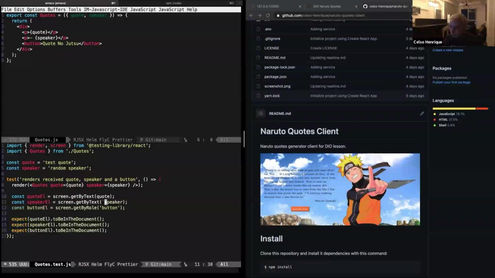
</p>

Para corrigir a falha e fazer o teste passar, alteramos a implementação do componente para aceitar propriedades. Utilizamos a técnica de **destructuring** para extrair `quote` e `speaker` dos argumentos da função. Agora, o componente deixa de exibir um texto fixo e passa a renderizar dinamicamente o que recebe, incluindo o botão com o texto "Quote No Jutsu".

```javascript
export const Quotes = ({ quote, speaker }) => {
  return (
    <div>
      <p>{quote}</p>
      <p>- {speaker}</p>
      <button>Quote No Jutsu</button>
    </div>
  );
};

```

<p align="center">

</p>

Com o componente individual funcionando, é necessário integrá-lo ao arquivo principal da aplicação (`App.js`). Realizamos a importação do componente `Quotes` e o organizamos dentro de uma estrutura estilizada utilizando `styled-components`. O componente principal agora delega a responsabilidade de exibição da frase para o novo componente, passando as propriedades necessárias, enquanto lida com o layout global e a imagem lateral do personagem.

```javascript
import styled from 'styled-components';
import narutoImg from '../../images/naruto.png';
import { Quotes } from '../../components';

export function App() {
  return (
    <Content>
      <Quotes quote={'ok'} speaker={'Speaker'} />
      <NarutoImg src={narutoImg} alt="Naruto with a kunai" />
    </Content>
  );
}

const Content = styled.div`
  height: 100vh;
  padding: 0 50px;
  display: flex;
  justify-content: center;
  align-items: center;
`;

const NarutoImg = styled.img`
  /* Estilização da imagem */
`;

```

<p align="center">

</p>

Após a refatoração e a correta importação dos componentes, executamos a suíte de testes novamente. O resultado no terminal confirma que tanto o teste unitário do componente `Quotes` quanto o teste de integração do `App` foram bem-sucedidos. Ver a sinalização "PASS" em todos os arquivos de teste indica que a lógica de renderização por propriedades e a estrutura de componentes estão operando corretamente.


# Parte 2 - Ajustes estéticos

## 🟩 Vídeo 06 - Explorando o React Styled Components um pouco mais

<video width="60%" controls>
  <source src="000-Midia_e_Anexos/bootcamp_tqi_fullstack-modulo_04-Curso.02-Video_06.webm" type="video/webm">
    Seu navegador não suporta vídeo HTML5.
</video>

Link do vídeo: https://web.dio.me/track/tqi-fullstack-developer/course/introducao-aos-react-hooks/learning/100f4b25-07fb-4e23-8e43-6410a3045989?autoplay=1 

O vídeo detalha o processo de **desenvolvimento de interface** utilizando a biblioteca **Styled Components** no ecossistema React. O instrutor demonstra como configurar uma **imagem de fundo global** e criar componentes customizados para exibir citações e autores com **unidades de medida relativas**, visando garantir a **acessibilidade**. Além da estilização visual, o conteúdo enfatiza a importância da **organização do código**, sugerindo a separação do botão em um componente distinto devido ao seu alto potencial de reuso. Por fim, o tutorial aborda a validação de dados com **Prop Types**, técnica essencial para **identificar erros de tipagem** precocemente e elevar a qualidade técnica do projeto.

### Anotações

<p align="center">
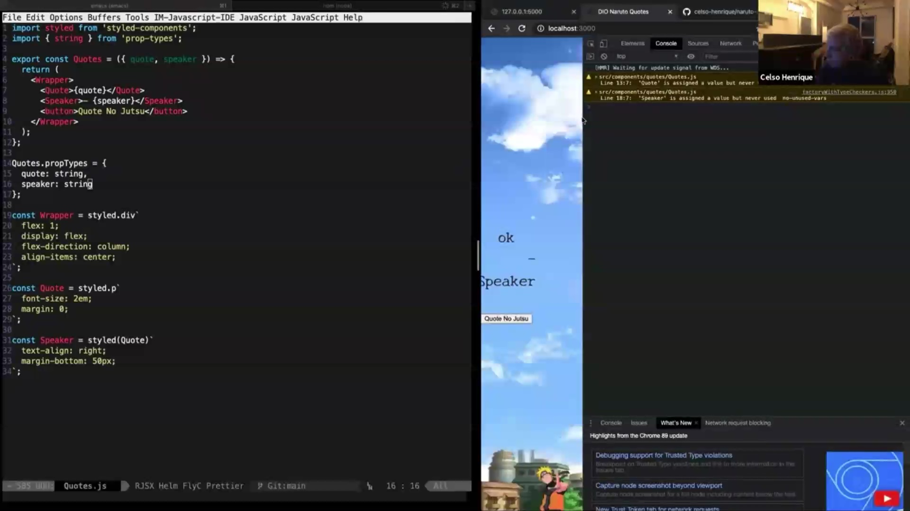
</p>

Nesta etapa, a estrutura base do componente de citações (`Quotes`) é estabelecida utilizando a biblioteca **styled-components**. O foco inicial está na organização visual do conteúdo, criando um componente chamado `Wrapper` que utiliza **Flexbox** para gerenciar o layout.

Ao definir `display: flex` e `flex-direction: column`, garantimos que a frase, o autor e o botão sejam empilhados verticalmente. A propriedade `flex: 1` é aplicada para que o componente ocupe o espaço disponível e interaja corretamente com outros elementos da tela, como a imagem do personagem que compõe o cenário da aplicação.

```javascript
import styled from 'styled-components';
import { string } from 'prop-types';

export const Quotes = ({ quote, speaker }) => {
  return (
    <Wrapper>
      <Quote>{quote}</Quote>
      <Speaker>- {speaker}</Speaker>
      <button>Quote No Jutsu</button>
    </Wrapper>
  );
};

const Wrapper = styled.div`
  flex: 1;
  display: flex;
  flex-direction: column;
  align-items: center;
`;

const Quote = styled.p`
  font-size: 2em;
  margin: 0;
`;

const Speaker = styled(Quote)`
  text-align: right;
  margin-bottom: 50px;
`;

```

<p align="center">
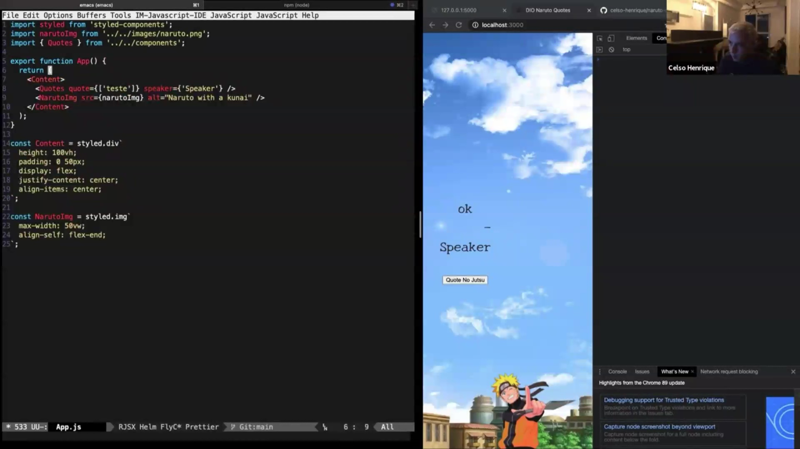
</p>

Após a estilização, é introduzida uma boa prática fundamental para o desenvolvimento com React: a **tipagem de propriedades** (PropTypes). O uso do `prop-types` permite validar se os dados recebidos pelo componente correspondem ao esperado, como strings para o texto da citação e o nome do autor.

Essa técnica funciona como uma documentação viva e uma ferramenta de depuração. Caso o componente receba um tipo de dado inesperado (por exemplo, um número ou array onde se esperava um texto), o React emitirá um alerta no console do navegador, facilitando a identificação de bugs antes que eles causem falhas críticas na renderização da interface.

```javascript
import { string } from 'prop-types';

// ... (restante do componente)

Quotes.propTypes = {
  quote: string,
  speaker: string
};

```

<p align="center">
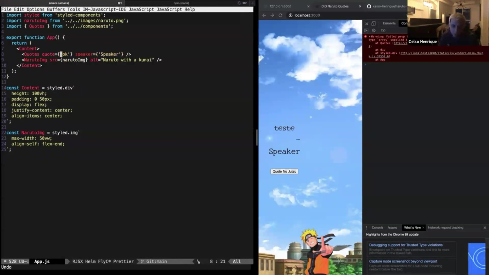
</p>

Para demonstrar a utilidade das **PropTypes**, é realizado um teste prático enviando um dado incorreto (um array) para a propriedade `quote` no arquivo principal (`App.js`). Embora o navegador consiga converter e exibir o conteúdo de forma rudimentar, o console de desenvolvedor do Chrome exibe imediatamente um aviso detalhado.

O erro indica explicitamente que a propriedade `quote` recebeu um valor do tipo `array`, mas o componente esperava uma `string`. Esse mecanismo de alerta é essencial em projetos reais para manter a integridade dos dados e garantir que a comunicação entre diferentes partes da aplicação ocorra de forma previsível.

```javascript
// Exemplo do teste de erro no App.js
<Quotes quote={['teste']} speaker={'Speaker'} />

```      

## 🟩 Vídeo 07 - Abstraindo melhor nossos componentes

<video width="60%" controls>
  <source src="000-Midia_e_Anexos/bootcamp_tqi_fullstack-modulo_04-Curso.02-Video_07.webm" type="video/webm">
    Seu navegador não suporta vídeo HTML5.
</video>

Link do vídeo: https://web.dio.me/track/tqi-fullstack-developer/course/introducao-aos-react-hooks/learning/c62c7b54-7c38-4141-902a-56fe2bb51b71?autoplay=1

O conteúdo detalha a **criação de um componente de botão** no React utilizando a metodologia de **Desenvolvimento Orientado a Testes (TDD)**. O autor demonstra como estruturar arquivos, realizar a **estilização com Styled Components** e garantir a qualidade do código através de **testes unitários** com as bibliotecas Jest e Testing Library. A explicação enfatiza a importância de validar se os elementos são renderizados corretamente e se as **funções de callback** são acionadas em eventos de clique. Além disso, o material aborda conceitos de **acessibilidade e tipagem de propriedades** com Prop Types para aumentar a segurança do projeto. O objetivo central é ilustrar como construir componentes **reutilizáveis e robustos** dentro de um fluxo de trabalho profissional.

### Anotações

<p align="center">
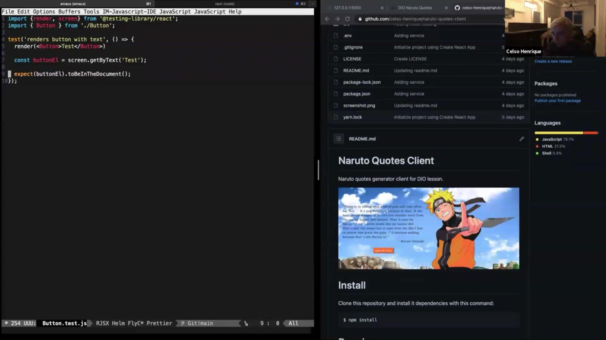
</p>

A implementação do componente de botão começa com a metodologia **TDD (Test Driven Development)**. O objetivo inicial é criar um teste unitário que garanta a renderização correta do componente e a exibição do texto esperado. Para isso, são utilizadas as funções `render` e `screen` da biblioteca `testing-library`. O teste verifica se, ao renderizar o `<Button>`, o texto "Test" está presente no documento, garantindo uma base sólida antes mesmo da estilização visual.

```javascript
import { render, screen } from '@testing-library/react';
import { Button } from './Button';

test('renders button with text', () => {
  render(<Button>Test</Button>);
  const buttonEl = screen.getByText('Test');
  expect(buttonEl).toBeInTheDocument();
});

```

<p align="center">
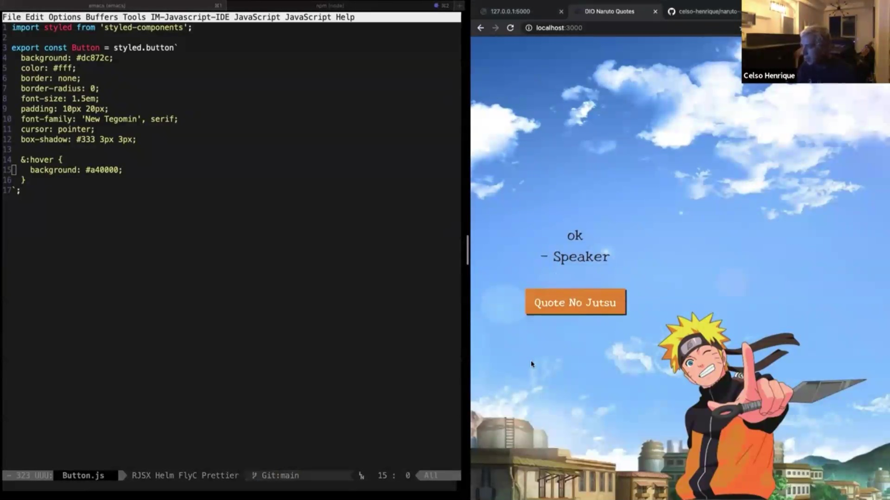
</p>

Após garantir o funcionamento lógico via testes, o componente é estilizado utilizando **styled-components**. A definição visual foca na identidade do projeto, aplicando uma cor de fundo laranja (hexadecimal `#dc872c`) e removendo bordas padrão. Além da estética, define-se a tipografia "New Tegomin" e o comportamento do cursor. Um ponto importante de acessibilidade e feedback visual é a inclusão da pseudo-classe `&:hover`, que altera a cor do botão para um tom avermelhado quando o usuário passa o mouse sobre o elemento.

```javascript
import styled from 'styled-components';

export const Button = styled.button`
  background: #dc872c;
  color: #fff;
  border: none;
  border-radius: 0;
  font-size: 1.5em;
  padding: 10px 20px;
  font-family: 'New Tegomin', serif;
  cursor: pointer;
  box-shadow: #333 3px 3px;

  &:hover {
    background: #a40000;
  }
`;

```

<p align="center">
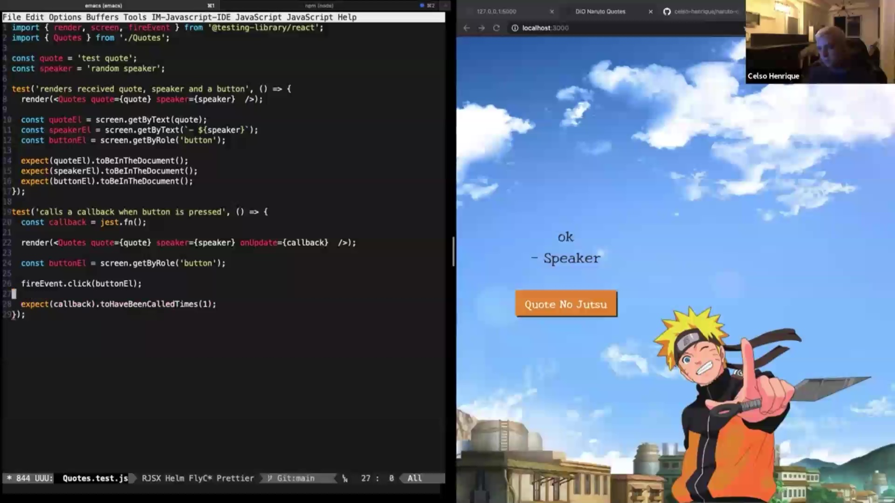
</p>

A evolução dos testes passa a cobrir a interação do usuário com o componente `Quotes`. Para verificar se o botão cumpre seu papel funcional, utiliza-se um **"spy" (espião)** através do `jest.fn()`. Este recurso permite monitorar se uma função de callback é devidamente invocada. O teste simula um evento de clique utilizando o `fireEvent.click` e valida se a função passada para a propriedade `onUpdate` foi chamada exatamente uma vez.

```javascript
import { render, screen, fireEvent } from '@testing-library/react';
import { Quotes } from './Quotes';

const quote = 'test quote';
const speaker = 'random speaker';

test('renders received quote, speaker and a button', () => {
  render(<Quotes quote={quote} speaker={speaker} />);
  const quoteEl = screen.getByText(quote);
  const speakerEl = screen.getByText(`- ${speaker}`);
  const buttonEl = screen.getByRole('button');

  expect(quoteEl).toBeInTheDocument();
  expect(speakerEl).toBeInTheDocument();
  expect(buttonEl).toBeInTheDocument();
});

test('calls a callback when button is pressed', () => {
  const callback = jest.fn();
  render(<Quotes quote={quote} speaker={speaker} onUpdate={callback} />);
  const buttonEl = screen.getByRole('button');

  fireEvent.click(buttonEl);
  expect(callback).toHaveBeenCalledTimes(1);
});

```

<p align="center">
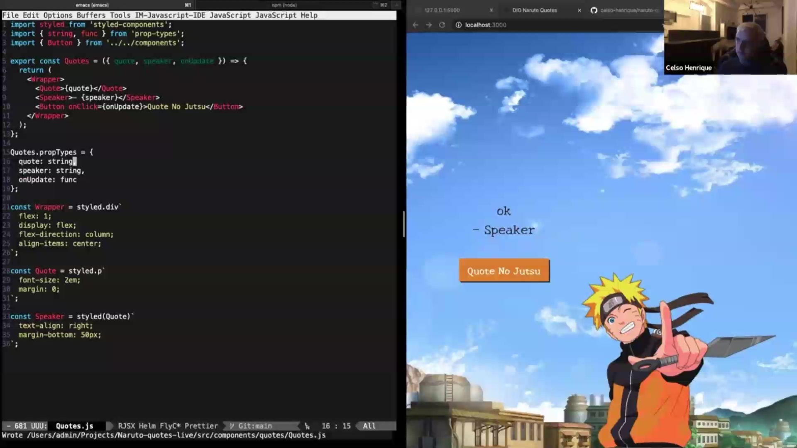
</p>

Com os testes aprovados, a estrutura do componente `Quotes` é consolidada. Ele organiza a exibição da frase (quote) e do autor (speaker), integrando o botão de atualização. O componente utiliza `PropTypes` para validação técnica, garantindo que `quote` e `speaker` sejam strings, e que `onUpdate` seja uma função (`func`). A estilização via `styled-components` define o layout interno como um container flexível centralizado em coluna, posicionando o texto e o botão de forma harmônica.

```javascript
import styled from 'styled-components';
import { string, func } from 'prop-types';
import { Button } from '../../components';

export const Quotes = ({ quote, speaker, onUpdate }) => {
  return (
    <Wrapper>
      <Quote>{quote}</Quote>
      <Speaker>- {speaker}</Speaker>
      <Button onClick={onUpdate}>Quote No Jutsu</Button>
    </Wrapper>
  );
};

Quotes.propTypes = {
  quote: string,
  speaker: string,
  onUpdate: func
};

const Wrapper = styled.div`
  flex: 1;
  display: flex;
  flex-direction: column;
  align-items: center;
`;

const Quote = styled.p`
  font-size: 2em;
  margin: 0;
`;

const Speaker = styled(Quote)`
  text-align: right;
  margin-bottom: 50px;
`;

```

<p align="center">
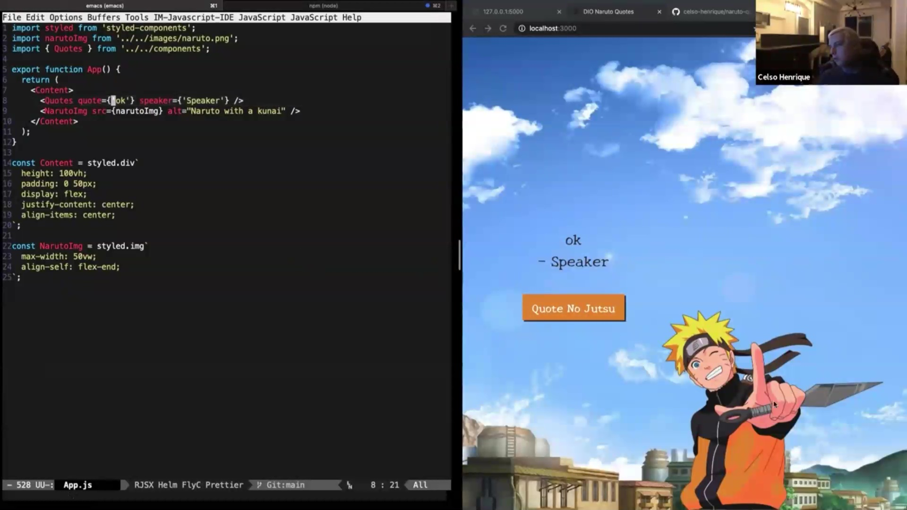
</p>

Na integração final dentro do arquivo `App.js`, os componentes são reunidos para compor a interface principal. O container `Content` é configurado para ocupar toda a altura da tela (`100vh`) e centralizar o conteúdo. Além do componente `Quotes`, é inserida a imagem temática do personagem Naruto, importada como `narutoImg`. A imagem é estilizada para se alinhar ao final do container flexível (`align-self: flex-end`) e ter sua largura limitada a `50vw`, garantindo que o visual seja responsivo e equilibrado com a área de texto.

```javascript
import styled from 'styled-components';
import narutoImg from '../../images/naruto.png';
import { Quotes } from '../../components';

export function App() {
  return (
    <Content>
      <Quotes quote={'ok'} speaker={'Speaker'} />
      <NarutoImg src={narutoImg} alt="Naruto with a kunai" />
    </Content>
  );
}

const Content = styled.div`
  height: 100vh;
  padding: 0 50px;
  display: flex;
  justify-content: center;
  align-items: center;
`;

const NarutoImg = styled.img`
  max-width: 50vw;
  align-self: flex-end;
`;

```

## 🟩 Vídeo 08 - Mockando uma API REST em seus testes com msw

<video width="60%" controls>
  <source src="000-Midia_e_Anexos/bootcamp_tqi_fullstack-modulo_04-Curso.02-Video_08.webm" type="video/webm">
    Seu navegador não suporta vídeo HTML5.
</video>

Link do vídeo: https://web.dio.me/track/tqi-fullstack-developer/course/introducao-aos-react-hooks/learning/c320bd61-1228-4f2e-8d83-694b487c0c5f?autoplay=1

O vídeo apresenta um guia técnico sobre o desenvolvimento de um **serviço em React** voltado para o consumo de frases via **API**. O autor enfatiza a importância de **segregar responsabilidades** ao criar pastas específicas para serviços, facilitando a organização e a manutenção do código. A explicação foca na prática de **testes unitários**, demonstrando como utilizar a biblioteca **MSW** para simular respostas de um servidor fictício e garantir a autonomia do código. Além disso, o conteúdo aborda o uso de **funções assíncronas** com `async/await` para gerenciar requisições de forma eficiente. Por fim, o autor destaca as boas práticas no uso de **variáveis de ambiente**, que permitem configurar URLs distintas para diferentes contextos de desenvolvimento e produção.

### Anotações

<p align="center">
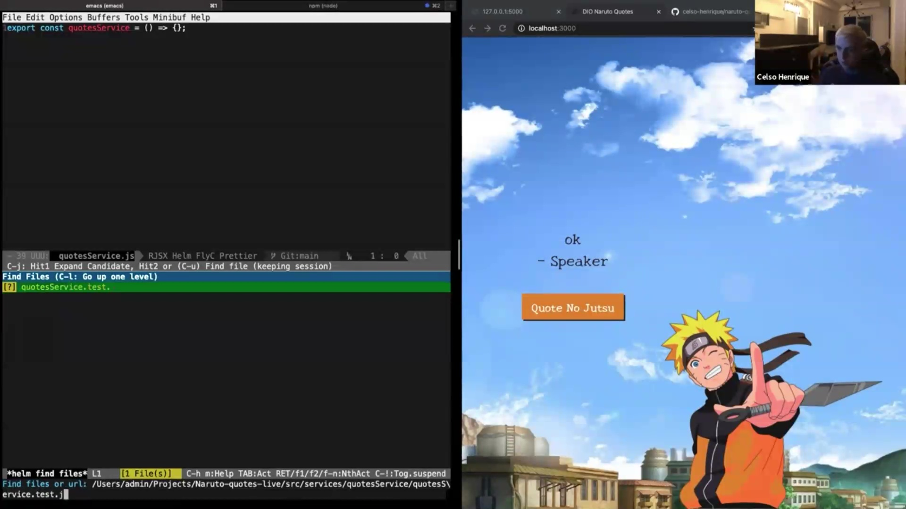
</p>

Para manter o projeto organizado e facilitar a manutenção, aplica-se o conceito de **segregação de responsabilidades**. No diretório `src`, é criada uma pasta `services` para concentrar as funções responsáveis pela comunicação com APIs externas. O arquivo inicial define a estrutura base do serviço que buscará as frases (quotes).

```javascript
export const quotesService = () => {};

```

<p align="center">
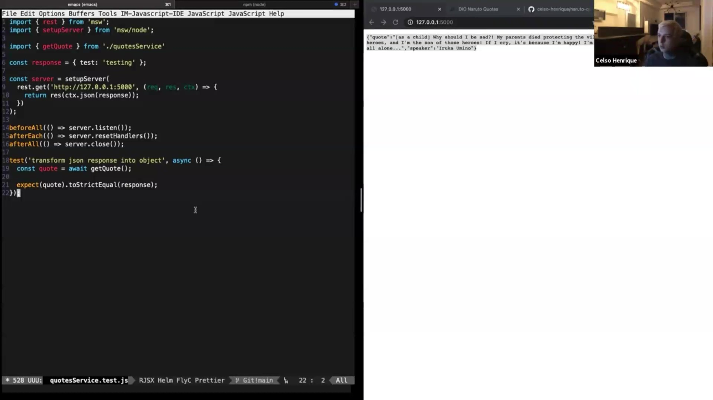
</p>

Para testar as requisições sem depender de um servidor real, utiliza-se a biblioteca **MSW (Mock Service Worker)**. Ela intercepta as chamadas de rede no nível do navegador ou do Node.js utilizando Service Workers. O setup inicial do teste envolve importar o `setupServer` do MSW e a função que será testada.

```javascript
import { rest } from 'msw';
import { setupServer } from 'msw/node';
import { getQuote } from './quotesService';

const response = { test: 'testing' };
const server = setupServer(
  rest.get('http://127.0.0.1:5000', (req, res, ctx) => {
    return res(ctx.json(response));
  })
);

```

<p align="center">
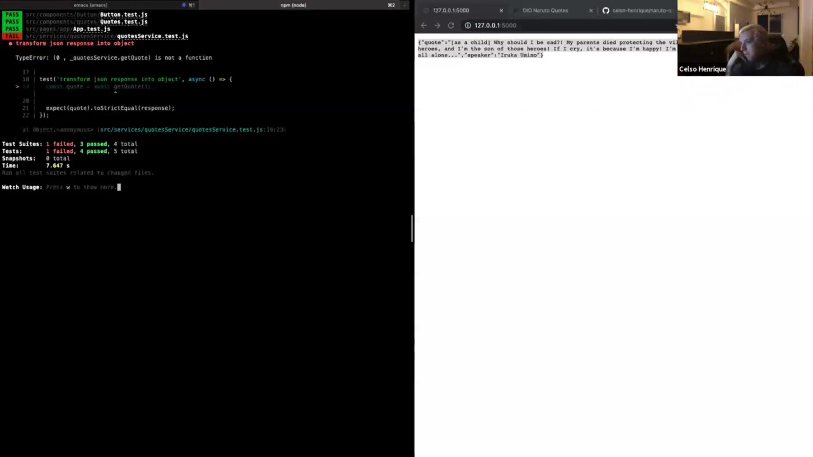
</p>

Ao executar o teste pela primeira vez após definir a estrutura, o sistema apresenta um erro de tipo (`TypeError`). Isso ocorre porque, embora o teste espere a função `getQuote`, ela ainda não foi propriamente exportada ou definida no arquivo de serviço, resultando em uma falha controlada típica do fluxo de **Desenvolvimento Orientado a Testes (TDD)**.

<p align="center">

</p>

Para corrigir o erro e fazer o teste passar, implementa-se a função `getQuote` utilizando a **Fetch API**. A função realiza a chamada para o endpoint local e utiliza o método `.json()` para converter a resposta do servidor em um objeto JavaScript utilizável.

```javascript
export const getQuote = () => 
  fetch('http://127.0.0.1:5000').then(response => response.json());

```

<p align="center">
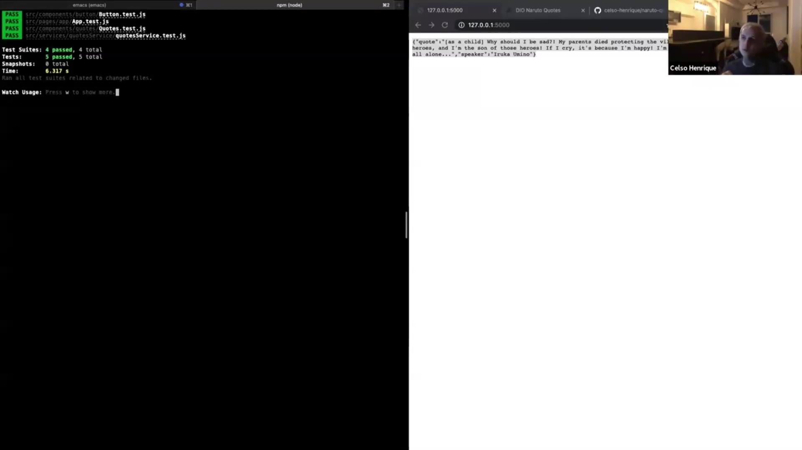
</p>

Após a implementação da lógica de fetch, o executor de testes (Jest) confirma que todos os ambientes estão operando corretamente. O teste de serviço, junto aos testes de componentes de interface, agora apresenta o status **PASS**, validando que a integração entre a chamada de rede e o tratamento do JSON está funcional.

<p align="center">

</p>

Para demonstrar a eficácia do **mock**, o teste é configurado para gerenciar o ciclo de vida do servidor fictício. Através dos comandos `beforeAll`, `afterEach` e `afterAll`, garante-se que o servidor de mock inicie, limpe seus estados entre os testes para evitar poluição de dados e feche ao final da execução.

```javascript
beforeAll(() => server.listen());
afterEach(() => server.resetHandlers());
afterAll(() => server.close());

test('transform json response into object', async () => {
  const quote = await getQuote();
  expect(quote).toStrictEqual(response);
});

```

<p align="center">
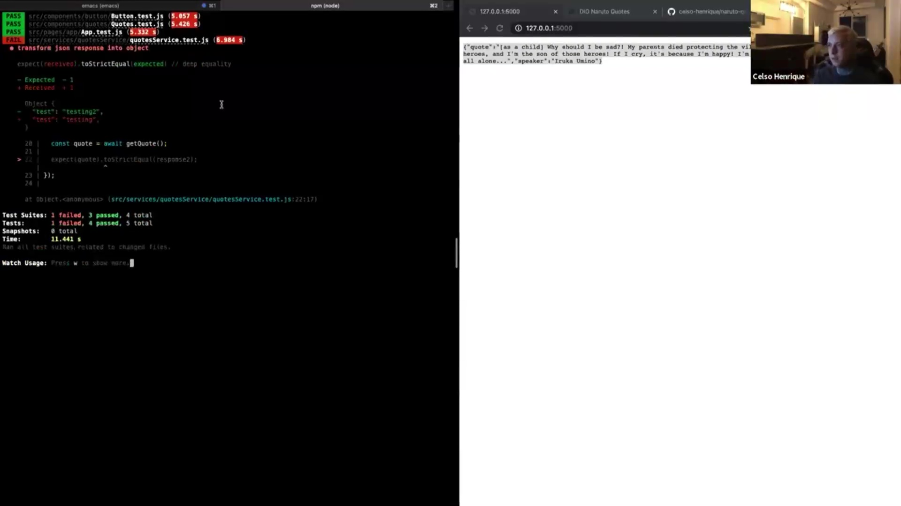
</p>

Ao alterar propositalmente o valor esperado no teste para `response2` (contendo "testing2") enquanto o mock continua retornando `response` ("testing"), o teste falha. Isso prova que o teste é robusto e está realmente validando a igualdade estrita dos dados, garantindo que não estamos recebendo respostas aleatórias do servidor real durante a unidade de teste.

<p align="center">
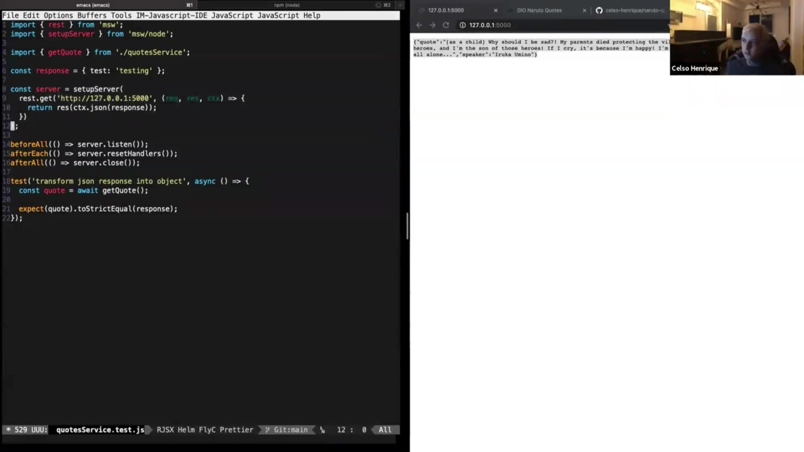
</p>

A estrutura final do teste unitário consolidada utiliza o MSW para interceptar a URL específica. O uso de `toStrictEqual` é fundamental para garantir que a estrutura do objeto retornado pela Service coincida exatamente com o que foi definido no contexto do mock.

```javascript
const response = { test: 'testing' };
// ... setup do server ...
test('transform json response into object', async () => {
  const quote = await getQuote();
  expect(quote).toStrictEqual(response);
});

```

<p align="center">

</p>

Introduz-se o uso de **variáveis de ambiente** através de um arquivo `.env` na raiz do projeto. Isso permite centralizar a URL da API (ex: `REACT_APP_API`), facilitando a troca entre endereços de desenvolvimento local e produção sem a necessidade de alterar o código-fonte em múltiplos locais.

```bash
REACT_APP_API=http://127.0.0.1:5000/

```

<p align="center">
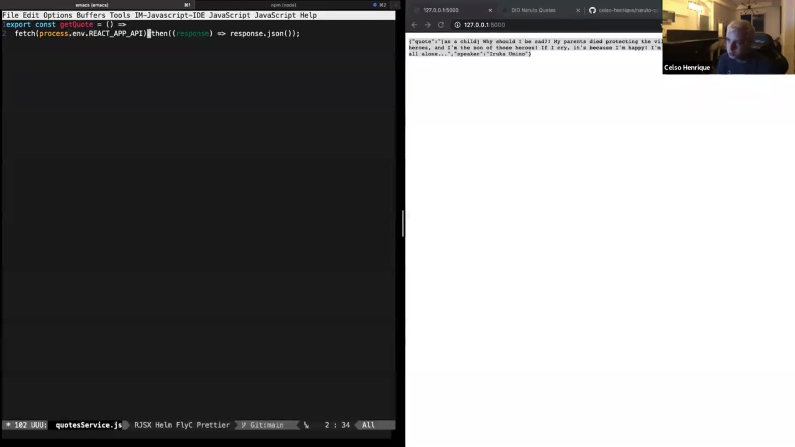
</p>

Com a variável de ambiente configurada, o serviço é refatorado para utilizar `process.env`. O Webpack, durante o processo de build ou execução, substituirá essa referência pelo valor real definido no arquivo `.env`.

```javascript
export const getQuote = () =>
  fetch(process.env.REACT_APP_API).then(response => response.json());

```

<p align="center">

</p>

O arquivo de teste também é atualizado para ser consistente com o uso das variáveis de ambiente. Em vez de declarar a URL manualmente no `rest.get`, utiliza-se a mesma variável `process.env.REACT_APP_API`, garantindo que o mock intercepte exatamente a rota configurada para a aplicação.

```javascript
const server = setupServer(
  rest.get(process.env.REACT_APP_API, (req, res, ctx) => {
    return res(ctx.json(response));
  })
);

```

<p align="center">
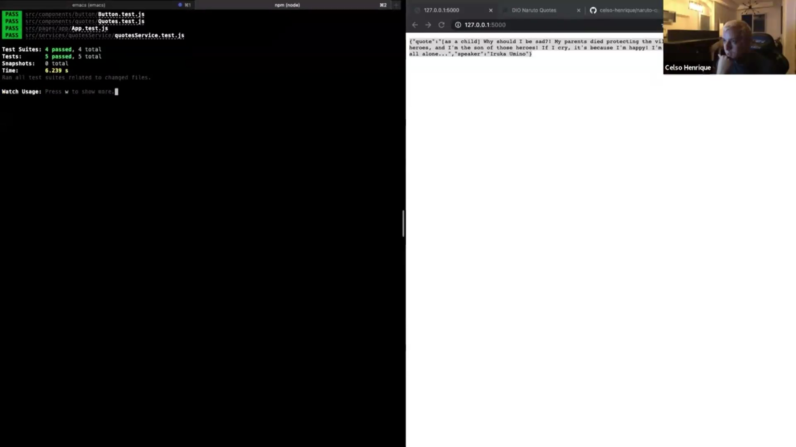
</p>

A execução final dos testes demonstra sucesso absoluto. Todas as suítes de teste (Button, App, Quotes e QuotesService) passaram, confirmando que a refatoração para o uso de variáveis de ambiente e a implementação do serviço de busca de frases estão operando em harmonia dentro da arquitetura proposta.    


## 🟩 Vídeo 09 - Evoluindo nosso projeto através do controle de estado

<video width="60%" controls>
  <source src="000-Midia_e_Anexos/bootcamp_tqi_fullstack-modulo_04-Curso.02-Video_09.webm" type="video/webm">
    Seu navegador não suporta vídeo HTML5.
</video>

Link do vídeo: https://web.dio.me/track/tqi-fullstack-developer/course/introducao-aos-react-hooks/learning/d8fe3c1d-d3b8-4399-97f1-d3ebcee00c14?autoplay=1

O vídeo descreve um processo de **desenvolvimento orientado a testes (TDD)** em uma aplicação React, utilizando a biblioteca **MSW** para simular respostas de uma API. O autor demonstra como **automatizar a verificação** de cliques em botões e a atualização assíncrona de textos na interface. Durante a explicação, destaca-se a implementação do **hook useState** para gerenciar o estado dos componentes e o uso de **funções assíncronas** para lidar com requisições. A técnica de **mockar o servidor** é apresentada como uma forma de garantir a confiabilidade dos testes, permitindo que a aplicação seja validada mesmo sem uma conexão real. Por fim, o conteúdo enfatiza como essa metodologia traz **segurança para o código**, facilitando manutenções futuras e o trabalho colaborativo entre desenvolvedores.

### Anotações

<p align="center">
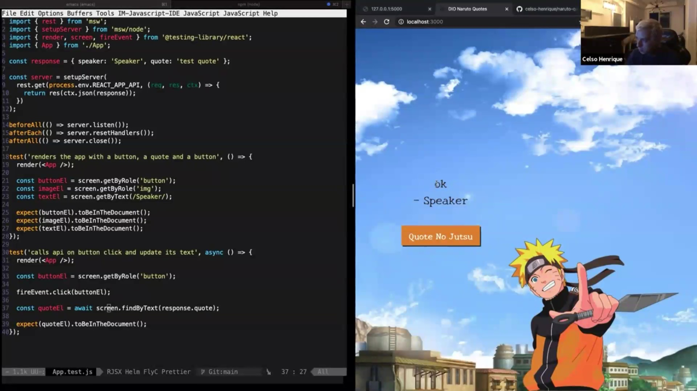
</p>

Nesta etapa, é iniciada a configuração do ambiente de testes utilizando a biblioteca **MSW (Mock Service Worker)** para simular as requisições do servidor. O objetivo é garantir que a aplicação se comporte corretamente ao buscar dados da API sem depender de um servidor real ativo, tratando o teste como uma forma de documentação do comportamento esperado do componente `App`.

```javascript
import { rest } from 'msw';
import { setupServer } from 'msw/node';
import { render, screen, fireEvent } from '@testing-library/react';
import { App } from './App';

const response = { speaker: 'Speaker', quote: 'test quote' };

const server = setupServer(
  rest.get(process.env.REACT_APP_API, (req, res, ctx) => {
    return res(ctx.json(response));
  })
);

beforeAll(() => server.listen());
afterEach(() => server.resetHandlers());
afterAll(() => server.close());

```

<p align="center">
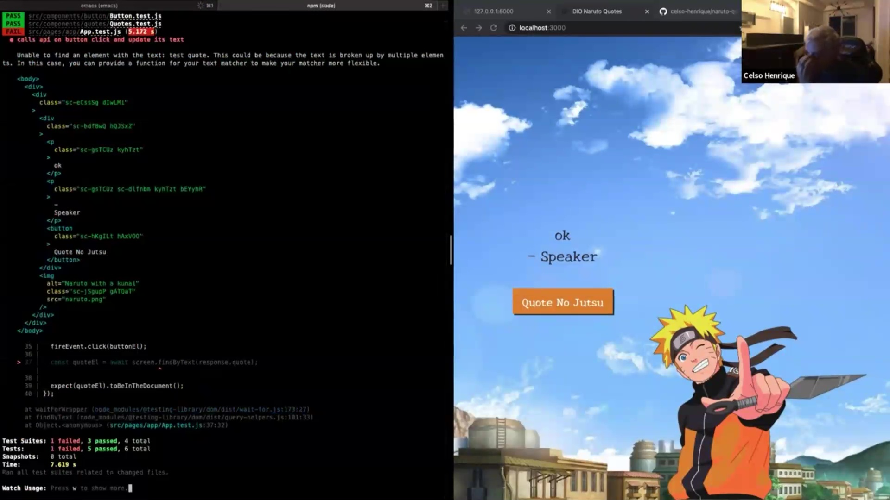
</p>

Após a configuração do servidor de mock, é executado um teste para verificar se a aplicação atualiza o texto da frase após o clique no botão. O teste falha inicialmente porque a lógica de busca de dados e atualização de estado ainda não foi implementada no componente, seguindo a metodologia de desenvolvimento orientado a testes (TDD).

```javascript
test('calls api on button click and update its text', async () => {
  render(<App />);

  const buttonEl = screen.getByRole('button');
  fireEvent.click(buttonEl);

  const quoteEl = await screen.findByText(response.quote);

  expect(quoteEl).toBeInTheDocument();
});

```

<p align="center">
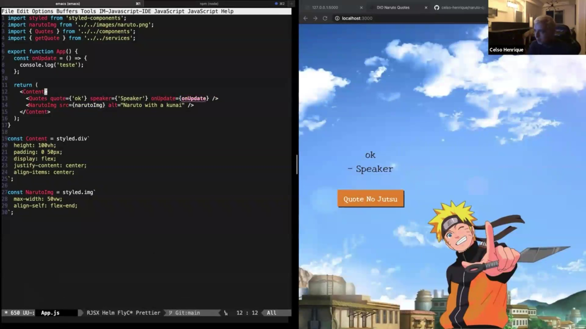
</p>

Para fazer o teste passar, inicia-se a alteração no componente `App.js`. Primeiramente, é criada uma função de callback chamada `onUpdate`, que por enquanto apenas registra uma mensagem no console. Esta função será vinculada ao evento de clique do componente de frases.

```javascript
export function App() {
  const onUpdate = () => {
    console.log('teste');
  };

  return (
    <Content>
      <Quotes quote={'ok'} speaker={'Speaker'} onUpdate={onUpdate} />
      <NarutoImg src={narutoImg} alt="Naruto with a kunai" />
    </Content>
  );
}

```

<p align="center">
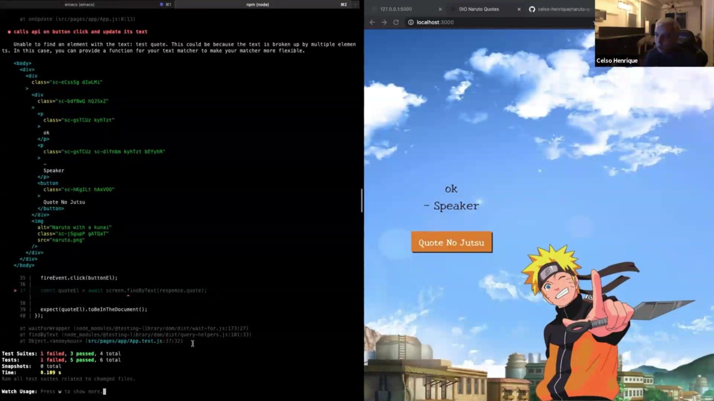
</p>

A falha do teste é confirmada no console, indicando que o elemento com o texto "test quote" não foi encontrado. Isso ocorre porque, apesar de o botão disparar a função `onUpdate`, o estado do componente permanece estático com o valor inicial "ok".

<p align="center">
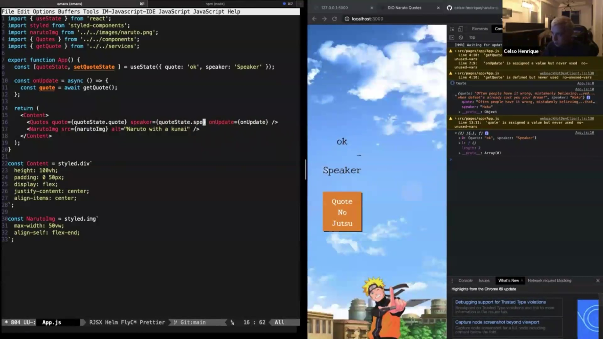
</p>

A implementação evolui com a introdução do Hook `useState` do React para gerenciar o estado das frases de forma dinâmica. O estado inicial é definido com um objeto contendo uma frase e um autor padrão, e a função `onUpdate` é tornada assíncrona para preparar a chamada ao serviço de API.

```javascript
import { useState } from 'react';
// ... outros imports

export function App() {
  const [quoteState, setQuoteState] = useState({ 
    quote: 'ok', 
    speaker: 'Speaker' 
  });

  const onUpdate = async () => {
    const quote = await getQuote();
    // lógica de atualização virá a seguir
  };
}

```

<p align="center">
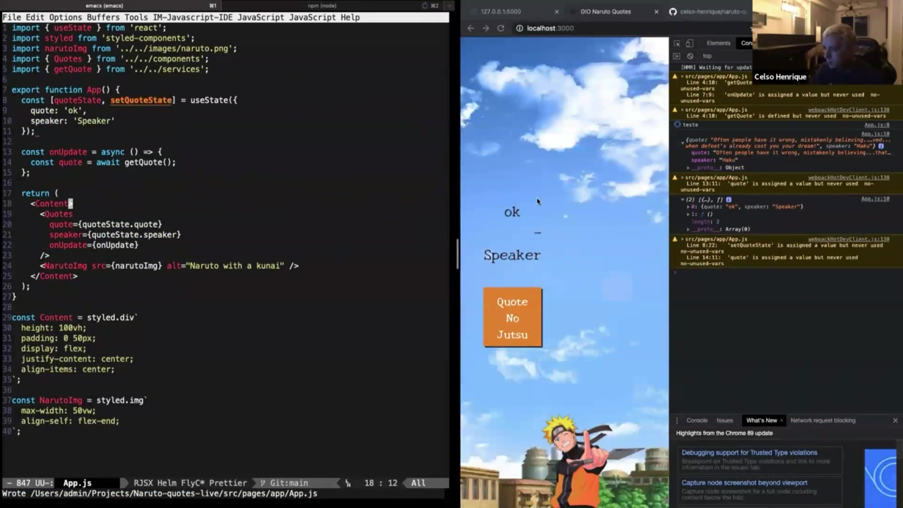
</p>

O código é ajustado para que o componente `Quotes` receba os dados diretamente do `quoteState`. Ao clicar no botão, a função `onUpdate` chama o serviço `getQuote()`, que retorna os dados simulados pelo MSW no ambiente de teste ou os dados reais do servidor em produção.

```javascript
<Quotes 
  quote={quoteState.quote} 
  speaker={quoteState.speaker} 
  onUpdate={onUpdate} 
/>

```

<p align="center">

</p>

Mesmo com a chamada ao serviço implementada, os testes ainda falham. O console mostra que o estado não está sendo atualizado corretamente com o retorno da API, resultando na permanência do texto "ok" na tela em vez da frase esperada ("test quote").

<p align="center">
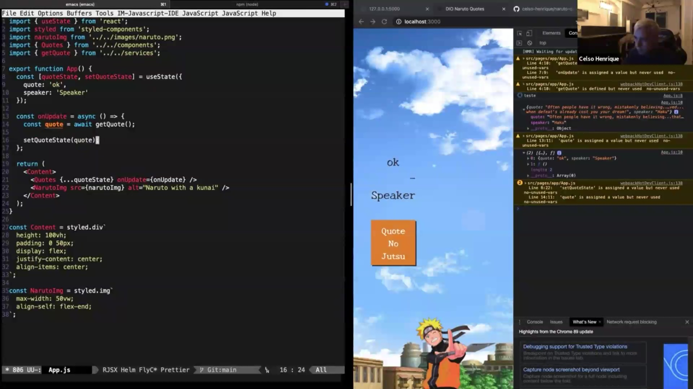
</p>

Para otimizar o código e torná-lo mais legível, é aplicado o **operador spread** (`...`). Como o objeto `quoteState` possui exatamente as mesmas propriedades que o componente `Quotes` espera (`quote` e `speaker`), o spread permite "espalhar" essas propriedades de forma simplificada, funcionando como um atalho (*short hand*).

```javascript
<Quotes {...quoteState} onUpdate={onUpdate} />

```

<p align="center">
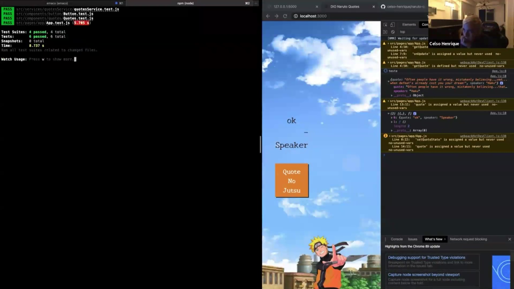
</p>

Finalmente, a lógica de atualização do estado é concluída dentro da função `onUpdate`. Ao chamar `setQuoteState(quote)`, o React identifica a mudança, renderiza novamente o componente e exibe a nova frase recebida do servidor (ou do mock).

```javascript
const onUpdate = async () => {
  const quote = await getQuote();
  setQuoteState(quote);
};

```

<p align="center">
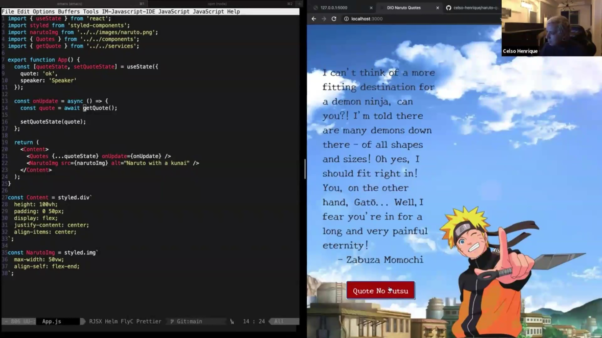
</p>

Com a implementação da função de atualização de estado, todos os testes unitários e de integração passam a apresentar o status **PASS**. Isso confirma que a integração entre o clique do botão, a chamada assíncrona ao serviço e a atualização da interface via Hook está funcionando conforme o esperado.

<p align="center">
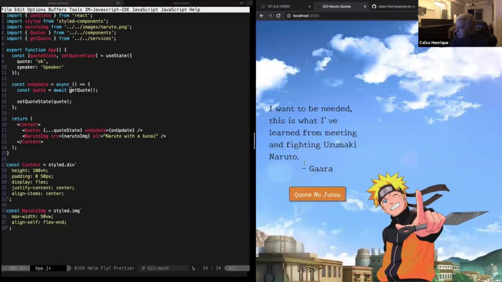
</p>

A validação final ocorre no navegador, onde é possível observar a aplicação funcionando na prática. Ao clicar no botão "Quote No Jutsu", o sistema busca e exibe frases de personagens como Zabuza e Gaara, demonstrando que o estado está sendo atualizado corretamente com os dados reais vindos da API.

```javascript
// Exemplo de resultado final no navegador exibindo a frase de Zabuza Momochi

```      

# Parte 3 - Finalizando o projeto

## 🟩 Vídeo 10 - Trabalhando com testes de qualidade

<video width="60%" controls>
  <source src="000-Midia_e_Anexos/bootcamp_tqi_fullstack-modulo_04-Curso.02-Video_10.webm" type="video/webm">
    Seu navegador não suporta vídeo HTML5.
</video>

Link do vídeo: https://web.dio.me/track/tqi-fullstack-developer/course/introducao-aos-react-hooks/learning/371f6f63-e3ff-4264-b9b1-c78272a48eb3?autoplay=1

O autor demonstra o desenvolvimento de um componente **React**, focando na integração de **efeitos sonoros** e na busca automática de dados. Ele explica como utilizar o hook **useEffect** com uma lista de dependências vazia para garantir que uma função seja executada apenas uma vez durante o **carregamento inicial**. Durante a implementação, surge um erro comum em **testes unitários** relacionado à tentativa de atualizar o **estado** de um componente que já foi desmontado. Para solucionar esse problema, o desenvolvedor propõe verificar se o componente ainda está **ativo na tela** antes de processar a resposta da API. O conteúdo enfatiza boas práticas para evitar vazamentos de memória e garantir que a aplicação se comporte de forma robusta em **produção**.

### Anotações

<p align="center">
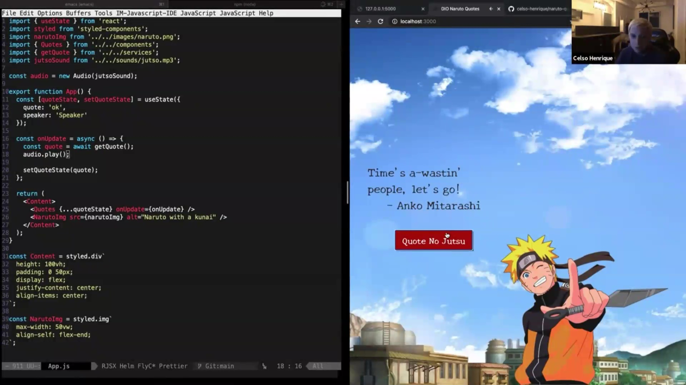
</p>

Nesta etapa, é realizada a implementação de um efeito sonoro para a aplicação. Para isso, o arquivo de áudio `jutso.mp3` é importado da pasta de recursos e instanciado utilizando o construtor nativo `Audio`. A função `onUpdate` é atualizada para disparar a execução desse áudio sempre que uma nova frase for buscada, adicionando uma camada de feedback sonoro à interação do usuário.

```javascript
import { useState } from 'react';
import styled from 'styled-components';
import narutoImg from '../../images/naruto.png';
import { Quotes } from '../../components';
import { getQuote } from '../../services';
import jutsoSound from '../../sounds/jutso.mp3';

const audio = new Audio(jutsoSound);

export function App() {
  const [quoteState, setQuoteState] = useState({
    quote: 'ok',
    speaker: 'Speaker'
  });

  const onUpdate = async () => {
    const quote = await getQuote();
    
    audio.play();
    setQuoteState(quote);
  };

  return (
    <Content>
      <Quotes {...quoteState} onUpdate={onUpdate} />
      <NarutoImg src={narutoImg} alt="Naruto with a kunai" />
    </Content>
  );
}

```

<p align="center">

</p>

Para garantir que a aplicação apresente dados logo no carregamento inicial, sem depender do clique no botão, é criado um novo teste automatizado. O objetivo deste teste é verificar se a chamada à API ocorre durante a inicialização (startup) e se o componente renderiza corretamente a resposta mockada pelo servidor de testes (MSW).

```javascript
test('calls api on startup and renders it response', async () => {
  render(<App />);

  const quoteEl = await screen.findByText(response.quote);

  expect(quoteEl).toBeInTheDocument();
});

```

<p align="center">
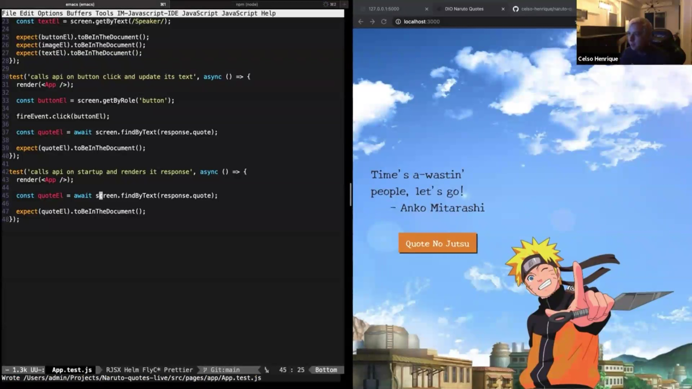
</p>

Para implementar a funcionalidade de carregamento automático demandada pelo teste anterior, introduzimos o hook `useEffect`. Enquanto o `useState` gerencia o estado e a re-renderização, o `useEffect` permite reagir a mudanças ou executar códigos em momentos específicos do ciclo de vida do componente. No exemplo, ele é utilizado para monitorar alterações no `quoteState`.

```javascript
import { useState, useEffect } from 'react';
// ... outros imports

export function App() {
  const [quoteState, setQuoteState] = useState({
    quote: 'ok',
    speaker: 'Speaker'
  });

  useEffect(() => {
    console.log('quoteState foi alterado');
  }, [quoteState]);
  
  // ... resto do componente
}

```

<p align="center">
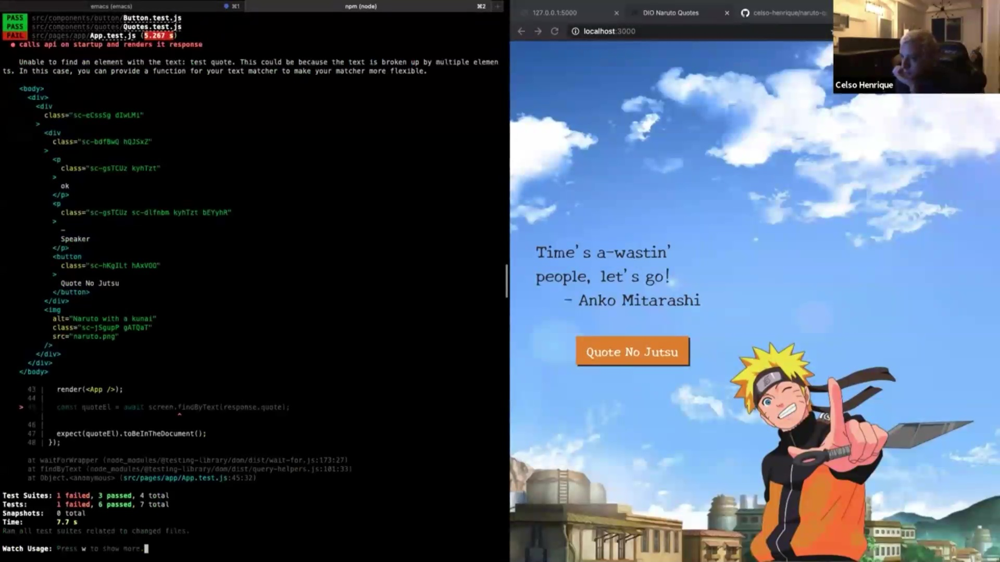
</p>

Ao configurar o `useEffect` com um array de dependências vazio `[]`, a função interna é executada apenas uma vez, exatamente quando o componente é montado. Isso é ideal para disparar a função `onUpdate` na inicialização, garantindo que uma frase seja buscada na API assim que a aplicação carregar.

```javascript
useEffect(() => {
  onUpdate();
}, []);

```

<p align="center">
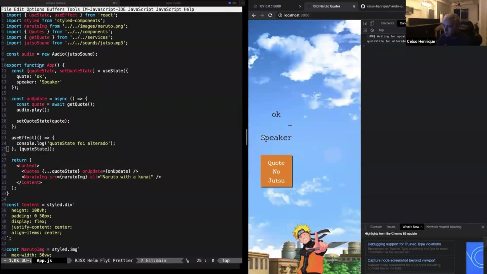
</p>

Ao executar os testes, surge um erro de "Unable to find an element". Embora o teste tenha passado tecnicamente em alguns cenários, o console exibe um aviso crítico: não é possível atualizar o estado de um componente que já foi desmontado. Isso ocorre porque o teste unitário pode finalizar e desmontar o componente antes que a promessa da API ou a execução do áudio sejam concluídas, gerando uma tentativa de atualização em um componente inexistente.

<p align="center">
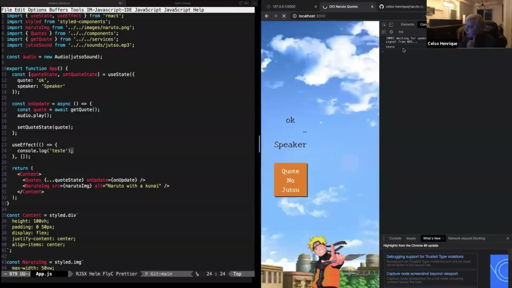
</p>

O erro identificado é um risco de **memory leak** (vazamento de memória). Se um usuário navegar para outra tela antes de uma resposta assíncrona terminar, o código tentará atualizar o estado de um componente que não está mais na tela. Para solucionar isso, será necessário utilizar um novo hook que verifique se o componente ainda está montado antes de realizar qualquer atualização de estado ou disparo de áudio.


## 🟩 Vídeo 11 - Conclusão do projeto

<video width="60%" controls>
  <source src="000-Midia_e_Anexos/bootcamp_tqi_fullstack-modulo_04-Curso.02-Video_11.webm" type="video/webm">
    Seu navegador não suporta vídeo HTML5.
</video>

Link do vídeo: https://web.dio.me/track/tqi-fullstack-developer/course/introducao-aos-react-hooks/learning/701fe57a-ceeb-434e-a121-7bc982c723ba?autoplay=1

O conteúdo aborda o desenvolvimento de aplicações **React** focando no uso estratégico do hook **useRef** para gerenciar o estado de montagem de componentes. O autor demonstra como essa ferramenta evita tentativas inválidas de atualizar o estado em componentes já desmontados, garantindo a **estabilidade do código**. Além da parte técnica de hooks, o material explora a metodologia **TDD**, enfatizando a importância de escrever testes antes da implementação para assegurar a **confiabilidade do software**. O processo inclui a manipulação de chamadas de API, uso de **Styled Components** e análise de **cobertura de testes**, que atingiu níveis elevados de segurança. Por fim, o texto reforça que adotar **boas práticas** e uma estrutura profissional facilita a evolução do projeto e a colaboração entre desenvolvedores.

### Anotações

<p align="center">
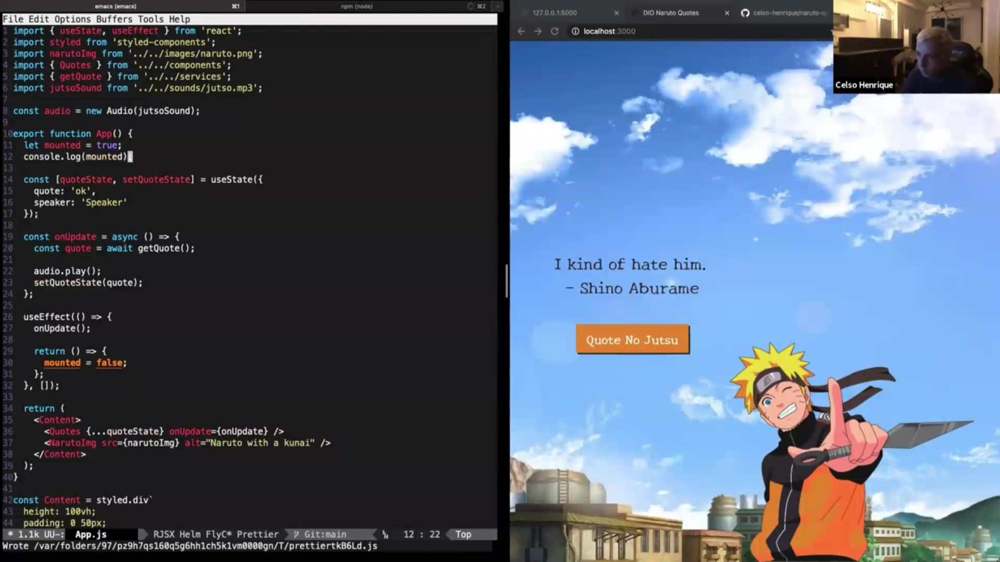
</p>

Nesta etapa inicial, é apresentada a tentativa de controlar o estado de montagem do componente utilizando uma variável local simples (`let mounted = true`). A ideia é sinalizar quando o componente está ativo para evitar atualizações de estado em componentes já desmontados. No entanto, como demonstrado no código, definir uma variável comum dentro do corpo da função do componente React faz com que seu valor seja reiniciado a cada nova renderização.

```javascript
export function App() {
  let mounted = true;
  console.log(mounted);

  const [quoteState, setQuoteState] = useState({
    quote: 'ok',
    speaker: 'Speaker'
  });
  
  // ... resto do componente
}

```

<p align="center">
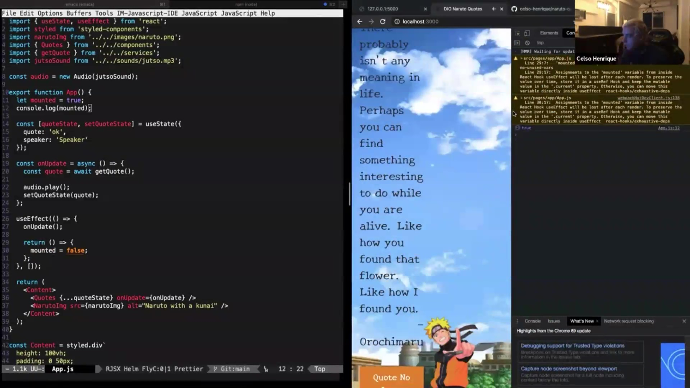
</p>

Ao observar o console e os alertas do linter, percebe-se o problema da abordagem anterior: o React avisa que atribuições à variável `mounted` dentro do `useEffect` serão perdidas a cada renderização. O objetivo de definir `mounted = false` na função de limpeza (cleanup) do `useEffect` é evitar que processos assíncronos tentem atualizar o estado de um componente que não existe mais na tela, mas variáveis locais não persistem entre os ciclos de renderização do React.

```javascript
  useEffect(() => {
    onUpdate();
    return () => {
      mounted = false;
    };
  }, []);

```

<p align="center">
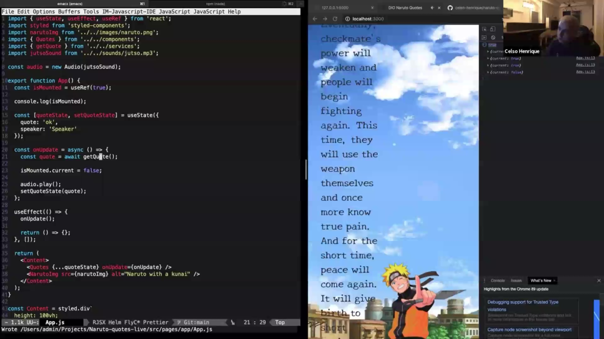
</p>

Para resolver o problema da persistência de valor sem disparar novas renderizações desnecessárias, introduzimos o hook `useRef`. Diferente de uma variável comum, o `useRef` mantém seu objeto `.current` persistente durante todo o ciclo de vida do componente. Aqui, iniciamos `isMounted` com o valor `true`.

```javascript
import { useState, useEffect, useRef } from 'react';

export function App() {
  const isMounted = useRef(true);
  console.log(isMounted);
  
  const [quoteState, setQuoteState] = useState({
    quote: 'ok',
    speaker: 'Speaker'
  });
  // ...
}

```

<p align="center">
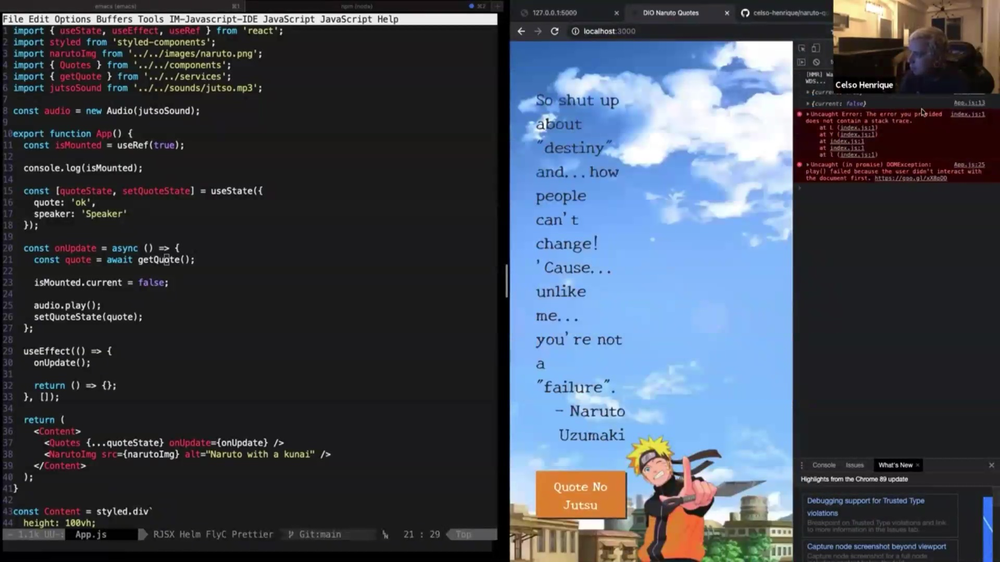
</p>

Com o `useRef` configurado, podemos alterar o valor de `isMounted.current` com segurança. No exemplo visualizado, o código mostra que, mesmo após atualizações e re-renderizações, o valor armazenado na referência pode ser manipulado e consultado para verificar o estado real do componente, mantendo a consistência que a variável simples não permitia.

```javascript
  const onUpdate = async () => {
    const quote = await getQuote();
    
    isMounted.current = false; // Exemplo de alteração de valor na referência
    audio.play();
    setQuoteState(quote);
  };

```

<p align="center">

</p>

Agora aplicamos a lógica final de proteção. Dentro da função `onUpdate`, inserimos uma condicional que verifica se `isMounted.current` é verdadeiro antes de executar o `setQuoteState`. Isso garante que, se a requisição ao servidor terminar após o usuário ter saído da tela (desmontado o componente), a aplicação não tentará atualizar um estado inexistente. No `useEffect`, a função de retorno define a referência como `false`.

```javascript
  const onUpdate = async () => {
    const quote = await getQuote();

    if (isMounted.current) {
      audio.play();
      setQuoteState(quote);
    }
  };

  useEffect(() => {
    onUpdate();
    return () => {
      isMounted.current = false;
    };
  }, []);

```

<p align="center">
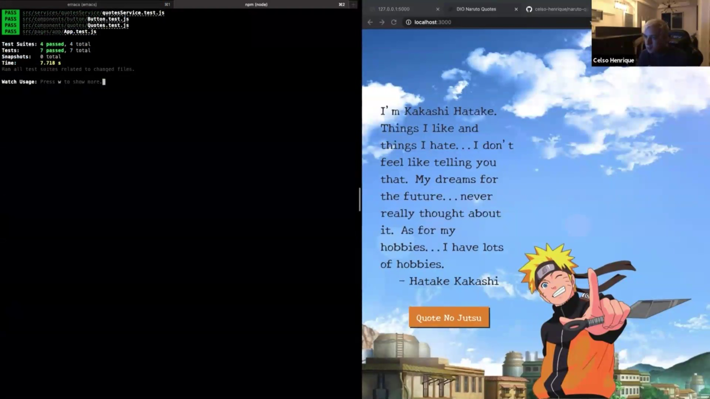
</p>

Após a implementação da proteção com `useRef`, os testes unitários são executados para validar a estabilidade da aplicação. O resultado mostra que todas as suítes de testes passaram com sucesso, incluindo os testes de serviço, componentes e o teste principal da página `App.test.js`.

```bash
PASS  src/services/quotesService/quotesService.test.js
PASS  src/components/button/Button.test.js
PASS  src/components/quotes/Quotes.test.js
PASS  src/pages/app/App.test.js

Test Suites: 4 passed, 4 total
Tests:       7 passed, 7 total

```

<p align="center">
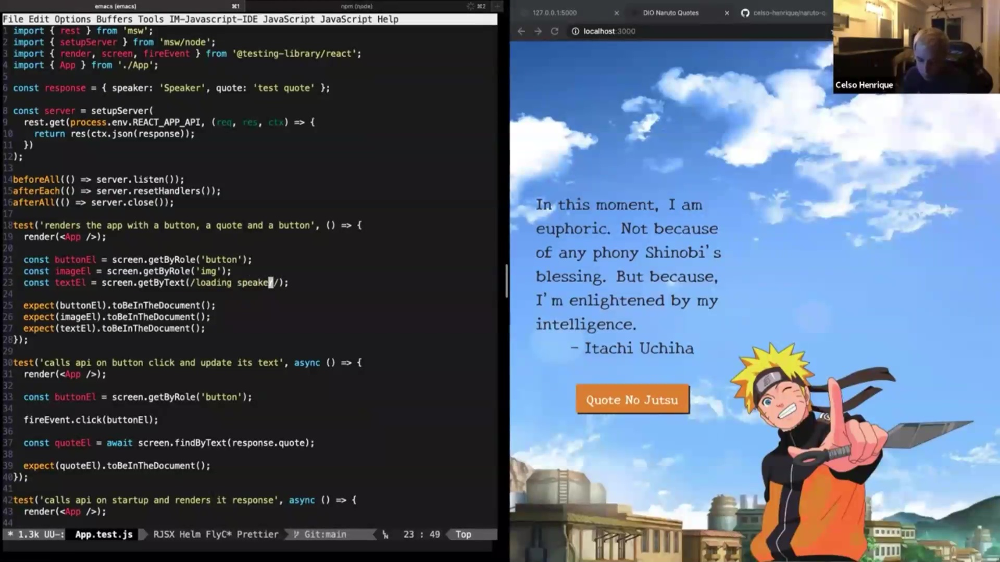
</p>

Nesta fase, ajustamos os testes unitários para refletir as mudanças visuais do componente. O teste utiliza o `screen.getByText` para verificar a presença do texto de carregamento inicial ("loading speaker"). É destacado o uso da biblioteca `@testing-library/react` para simular o comportamento do usuário e validar o ciclo de vida da requisição API dentro do teste.

```javascript
test('renders the app with a button, a quote and a button', () => {
  render(<App />);

  const buttonEl = screen.getByRole('button');
  const imageEl = screen.getByRole('img');
  const textEl = screen.getByText(/loading speaker/i);

  expect(buttonEl).toBeInTheDocument();
  expect(imageEl).toBeInTheDocument();
  expect(textEl).toBeInTheDocument();
});

```

<p align="center">
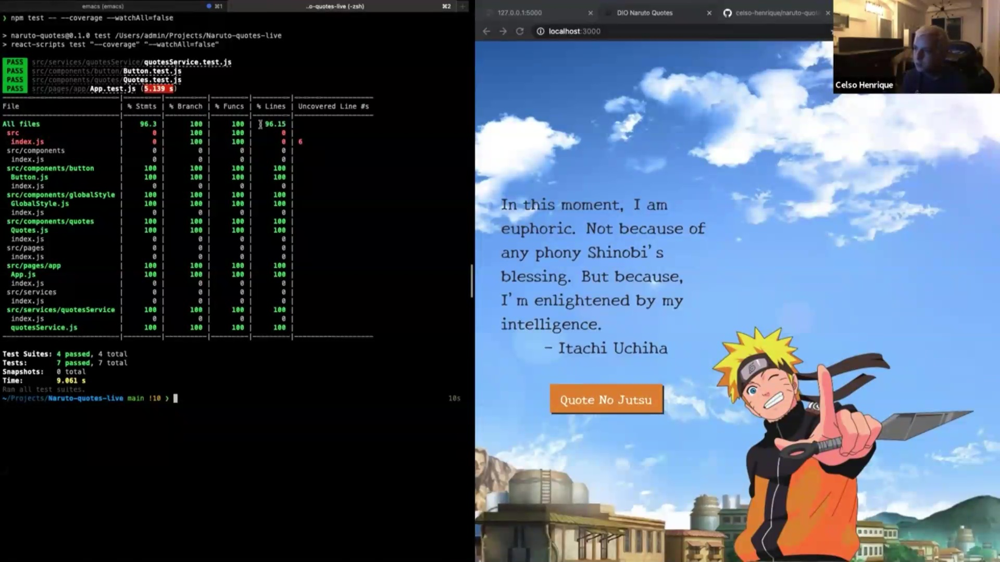
</p>

O relatório final de cobertura de testes (coverage report) demonstra a eficácia do desenvolvimento orientado a testes (TDD). A aplicação atingiu níveis altíssimos de cobertura, com quase 100% em declarações (statements), funções e linhas em quase todos os arquivos críticos do projeto, garantindo que as funcionalidades principais e ramificações de código estejam protegidas contra regressões.

## 🟩 Vídeo 12 - Dúvidas

<video width="60%" controls>
  <source src="000-Midia_e_Anexos/bootcamp_tqi_fullstack-modulo_04-Curso.02-Video_12.webm" type="video/webm">
    Seu navegador não suporta vídeo HTML5.
</video>

Link do vídeo: 


## 🟩 Vídeo 13 - GitHub

<video width="60%" controls>
  <source src="000-Midia_e_Anexos/bootcamp_tqi_fullstack-modulo_04-Curso.02-Video_13.webm" type="video/webm">
    Seu navegador não suporta vídeo HTML5.
</video>

Link do vídeo: 


# Certificado: Introdução aos React Hooks

- Link na plataforma: 
- Certificado em pdf: 
