## Instrutor

- Felipe Aguiar (DIO - Tech Educator)
- Contato Linkedin: / [felipeaguiar-exe](https://www.linkedin.com/in/felipeaguiar-exe/)

# Parte 1 - Trabalhando com States & Effects no ReactJs

## 🟩 Vídeo 01 - Visão geral do curso

<video width="60%" controls>
  <source src="000-Midia_e_Anexos/bootcamp_tqi_fullstack-modulo_04-curso.03-Video_01.webm" type="video/webm">
    Seu navegador não suporta vídeo HTML5.
</video>

Link do vídeo: https://web.dio.me/track/tqi-fullstack-developer/course/trabalhando-com-states-effects-no-reactjs/learning/97ef28ff-37d4-4618-b970-a0380e11de4a?autoplay=1 

Nesta introdução de curso, o instrutor Felipe Aguiar apresenta um guia focado no **comportamento lógico de componentes React**, priorizando a funcionalidade em vez da estética visual. O conteúdo central gira em torno dos **React Hooks**, especificamente no gerenciamento de **estados e efeitos** para criar interfaces inteligentes e reativas. Para acompanhar as aulas, o aluno deve possuir o ambiente de desenvolvimento configurado com **Node.js e VS Code**, além de dominar conceitos de **JavaScript moderno**, como desestruturação e funções. O autor enfatiza que compreender o que é um **componente funcional** é indispensável para progredir no aprendizado das ferramentas apresentadas. Ao longo das lições, os estudantes aprenderão a estruturar projetos e a aplicar o **lado funcional da biblioteca** para desenvolver aplicações robustas. O objetivo final é capacitar o desenvolvedor a manipular a **reatividade do framework** de forma profissional e eficiente.

### Anotações

<p align="center">
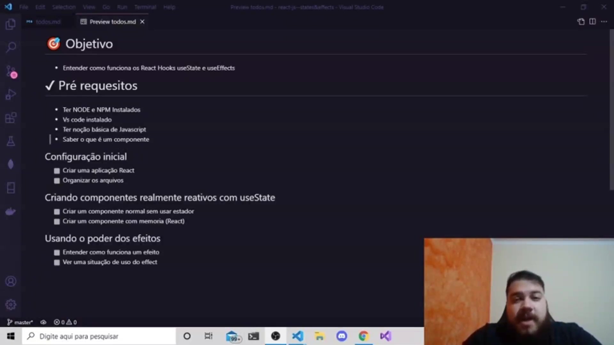
</p>

Felipe Aguiar apresenta a introdução ao curso focado em **React Hooks**, destacando que o aprendizado será centrado em **componentes funcionais** e na lógica comportamental da aplicação. O objetivo principal é capacitar o desenvolvedor a criar componentes inteligentes através do gerenciamento de estados e efeitos, deixando a estilização visual (CSS) em segundo plano para priorizar a funcionalidade.

Para acompanhar o conteúdo, são estabelecidos os seguintes pré-requisitos técnicos e conceituais:

* **Ambiente:** Instalação do Node.js, npm e um editor de código (como VS Code).
* **Base de JavaScript:** Domínio de funções, desestruturação, sistemas de import/export e funções com retorno.
* **Conceito de Componente:** Compreensão de que um componente é uma função ou classe JavaScript capaz de retornar HTML.

O cronograma do curso abrange desde a organização inicial do projeto e arquivos até o uso avançado do **useState** para reatividade e do **useEffect** para o controle de efeitos colaterais na aplicação.

## 🟩 Vídeo 02 - O que são hooks

<video width="60%" controls>
  <source src="000-Midia_e_Anexos/bootcamp_tqi_fullstack-modulo_04-curso.03-Video_02.webm" type="video/webm">
    Seu navegador não suporta vídeo HTML5.
</video>

Link do vídeo: https://web.dio.me/track/tqi-fullstack-developer/course/trabalhando-com-states-effects-no-reactjs/learning/42e8f074-bb7f-4066-b940-d96ba1273d19?autoplay=1 

O vídeo apresenta o conceito fundamental de **Hooks no React**, definindo-os como **funções que se conectam aos componentes** para gerenciar estados e efeitos. O autor utiliza a metáfora de um **anzol de pesca** para ilustrar como essas ferramentas permanecem "enganchadas", garantindo que ações específicas sejam executadas sempre que o componente for atualizado. Além de citar exemplos práticos como o **useState e o useEffect**, o texto ressalta a importância de consultar a **documentação oficial** para compreender essa funcionalidade introduzida na versão 16.8 da biblioteca. A explicação destaca que o objetivo inicial é ensinar a **reatividade de forma correta**, comparando o uso de estados com métodos menos eficazes. Assim, os ganchos são estabelecidos como peças essenciais para que o desenvolvedor consiga **vincular comportamentos lógicos** ao ciclo de vida das interfaces.

### Anotações

<p align="center">
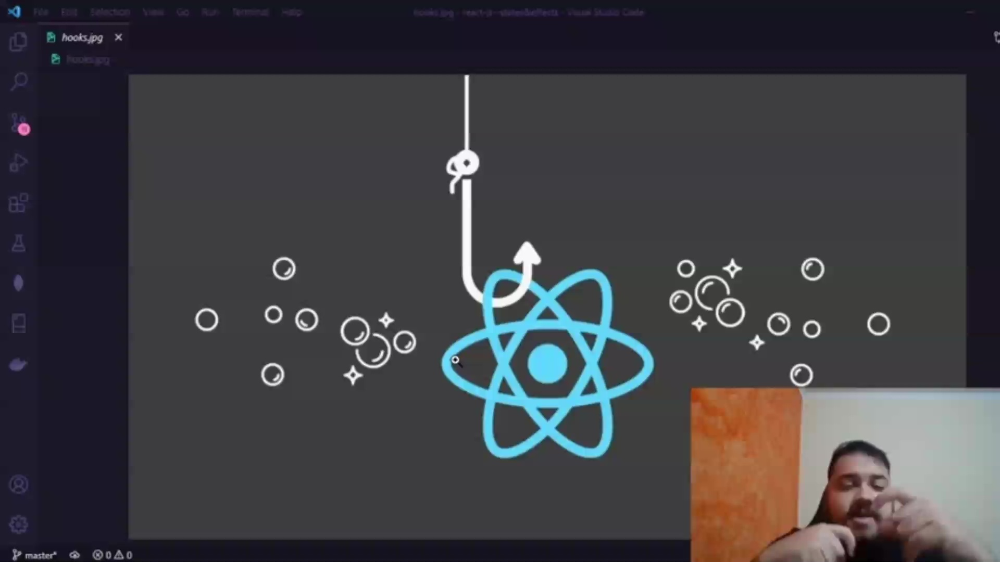
</p>

Os **Hooks** (termo que significa "gancho" em inglês) são funções fundamentais que permitem "enganchar" funcionalidades aos componentes do React. A analogia visual do anzol ilustra perfeitamente esse conceito: assim como um peixe preso ao anzol reage quando a vara é puxada, o componente reage e executa ações sempre que sofre um clique ou uma atualização, justamente por estar conectado a um Hook. Essa estrutura permite o uso de estados e outros recursos de forma simplificada.

<p align="center">
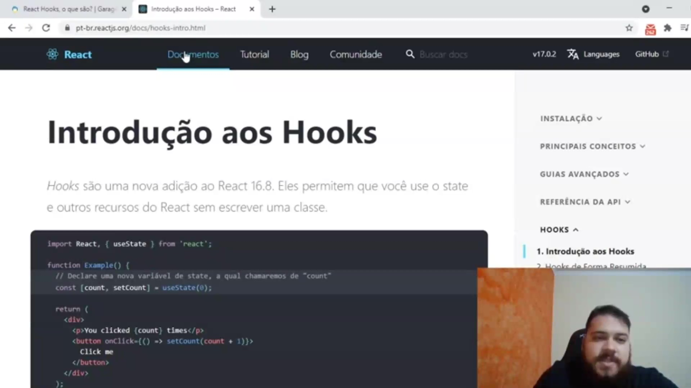
</p>

Introduzidos na versão 16.8 do React, os Hooks permitem gerenciar estados e outros recursos sem a necessidade de escrever classes. O exemplo de código abaixo demonstra a utilização do `useState`, o Hook de estado, para criar um contador simples onde a interface reage ao clique do usuário:

```javascript
import React, { useState } from 'react';

function Example() {
  // Declare uma nova variável de state, a qual chamaremos de "count"
  const [count, setCount] = useState(0);

  return (
    <div>
      <p>You clicked {count} times</p>
      <button onClick={() => setCount(count + 1)}>
        Click me
      </button>
    </div>
  );
}

```

Antes de avançarmos para as implementações complexas, é essencial compreender que o estado (`state`) é o que garante a reatividade correta dos componentes, permitindo que eles se atualizem visualmente sempre que houver uma alteração nos dados.      


## 🟩 Vídeo 03 - Criando seu projeto

<video width="60%" controls>
  <source src="000-Midia_e_Anexos/bootcamp_tqi_fullstack-modulo_04-curso.03-Video_03.webm" type="video/webm">
    Seu navegador não suporta vídeo HTML5.
</video>

Link do vídeo: https://web.dio.me/track/tqi-fullstack-developer/course/trabalhando-com-states-effects-no-reactjs/learning/74812597-ead3-4e7c-a360-edc01ab95b30?autoplay=1

O autor explica o conceito de **Hooks no React**, definindo-os como funções que se conectam aos componentes para simplificar o desenvolvimento e a atualização de interfaces. Para demonstrar a aplicação prática, o texto orienta a criação de um novo projeto utilizando a ferramenta **Create React App** via linha de comando. Durante o processo de instalação das dependências, são detalhadas as funcionalidades de arquivos essenciais, como o **package.json** e as folhas de estilo. O guia também destaca a importância de possuir uma base sólida em **JavaScript** para facilitar o aprendizado da biblioteca. Por fim, o conteúdo antecipa que a estrutura gerada será organizada seguindo as **boas práticas** do mercado para otimizar o fluxo de trabalho.

### Anotações

<p align="center">
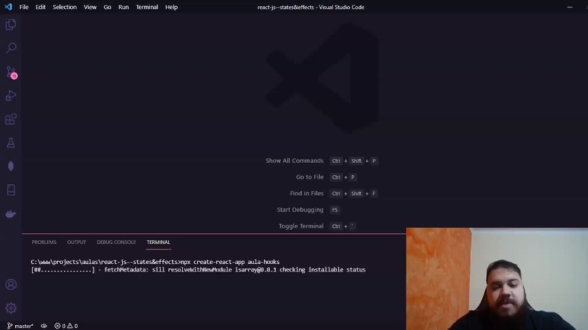
</p>

Para iniciar o desenvolvimento com Hooks, o primeiro passo é a criação do ambiente de trabalho. Utiliza-se o **Create React App**, uma ferramenta de *scaffolding* que agiliza o processo ao baixar automaticamente todas as dependências e templates fundamentais para um projeto inicial.

A criação é feita via terminal através do comando `npx`, garantindo que você utilize a versão mais recente do utilitário sem a necessidade de instalação global. É importante que o nome do projeto seja escrito inteiramente em letras minúsculas e, caso precise separar palavras, deve-se utilizar o hífen.

```bash
npx create-react-app aula-hooks

```

<p align="center">
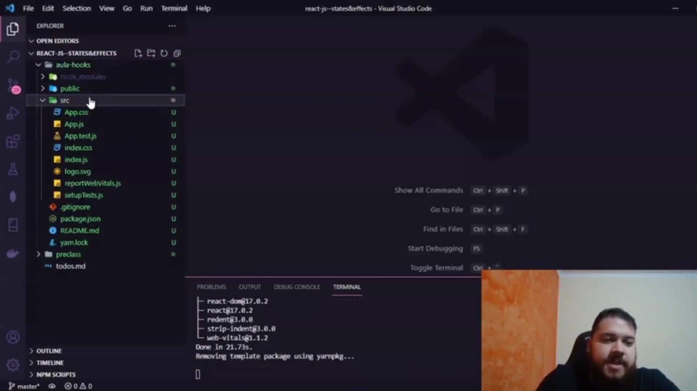
</p>

Após a conclusão do processo de instalação, o React gera uma estrutura de pastas padronizada. Os principais arquivos e diretórios incluem:

* **public/**: Contém os arquivos estáticos acessíveis publicamente.
* **src/**: Onde reside o código-fonte da aplicação, incluindo o `App.js` (componente principal) e o `index.js` (ponto de entrada).
* **App.css / index.css**: Arquivos destinados à estilização dos componentes.
* **App.test.js / setupTests.js**: Estrutura configurada para a criação de testes automatizados utilizando Jest.
* **package.json**: Arquivo central de configuração que lista as dependências do projeto e define scripts de execução, como o comando `start`.
* **reportWebVitals.js**: Arquivo responsável por métricas de performance e saúde da aplicação web.

Essa organização segue os padrões convencionais do desenvolvimento *frontend*, onde cada arquivo JavaScript atua como um componente capaz de retornar blocos de HTML e CSS.


## 🟩 Vídeo 04 - Organizando o seu projeto

<video width="60%" controls>
  <source src="000-Midia_e_Anexos/bootcamp_tqi_fullstack-modulo_04-curso.03-Video_04.webm" type="video/webm">
    Seu navegador não suporta vídeo HTML5.
</video>

Link do vídeo: https://web.dio.me/track/tqi-fullstack-developer/course/trabalhando-com-states-effects-no-reactjs/learning/87678a53-4135-42ab-b728-7249a14e70d6?autoplay=1

O vídeo apresenta um guia prático sobre como **organizar e otimizar a estrutura inicial de um projeto React**. O autor demonstra como **executar a aplicação via terminal** e explica o funcionamento do **hot reload**, que atualiza o navegador automaticamente após mudanças no código. O conteúdo foca na **limpeza de arquivos desnecessários** gerados pelo comando padrão e na criação de uma arquitetura baseada em **pastas de componentes**. É detalhada a importância do arquivo **index.js** como o ponto de entrada que injeta os elementos na **div root** do HTML. Por fim, o material define o que é um **componente funcional** e prepara o terreno para o ensino de **Hooks**.

### Anotações

<p align="center">
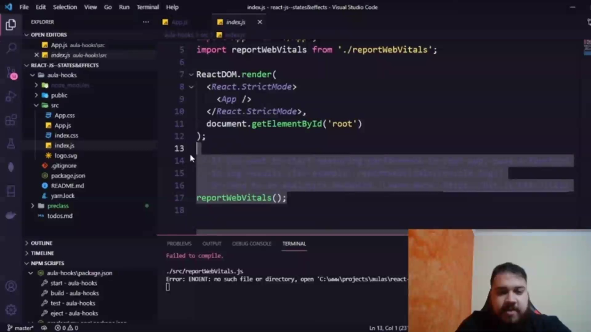
</p>

Para iniciar a organização do projeto React, o primeiro passo é garantir que a aplicação está rodando corretamente. Após a criação do projeto via terminal, é necessário navegar até a pasta raiz do projeto utilizando o comando `cd aula-hooks`. Uma vez dentro do diretório, utiliza-se o comando `npm start` para executar o script que inicia o servidor de desenvolvimento.

```bash
npm start

```

<p align="center">
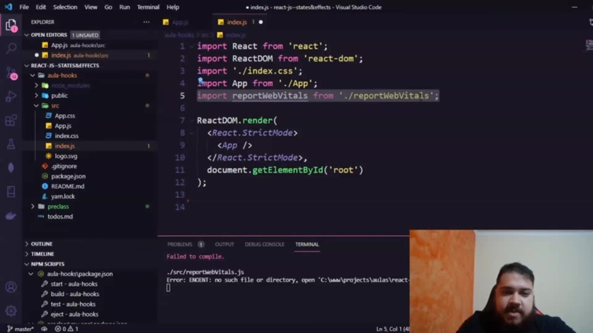
</p>

O comando de inicialização cria uma instância do projeto no navegador, geralmente na porta 3000. O React utiliza o conceito de **Hot Reload**, o que significa que qualquer alteração salva nos arquivos do código-fonte (como no `App.js`) será refletida automaticamente no navegador sem a necessidade de atualizar a página manualmente. Isso demonstra a natureza dinâmica de uma **SPA (Single Page Application)**.

<p align="center">
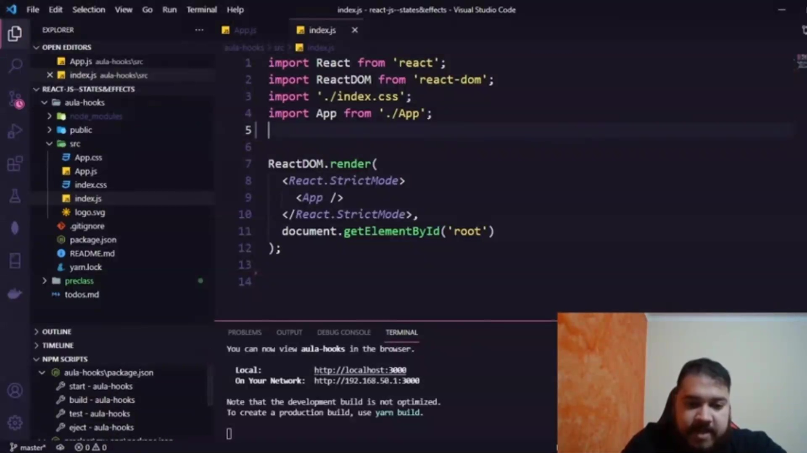
</p>

Ao analisar a estrutura de pastas gerada pelo **Create React App**, identificamos o arquivo `public/index.html`. Este arquivo contém uma `<div id="root">`, que funciona como o "coração" da aplicação. Todos os componentes JavaScript e elementos HTML que construirmos serão injetados dinamicamente dentro desta div específica. Geralmente, não manipulamos este arquivo HTML diretamente, pois o React cuida dessa renderização.

<p align="center">
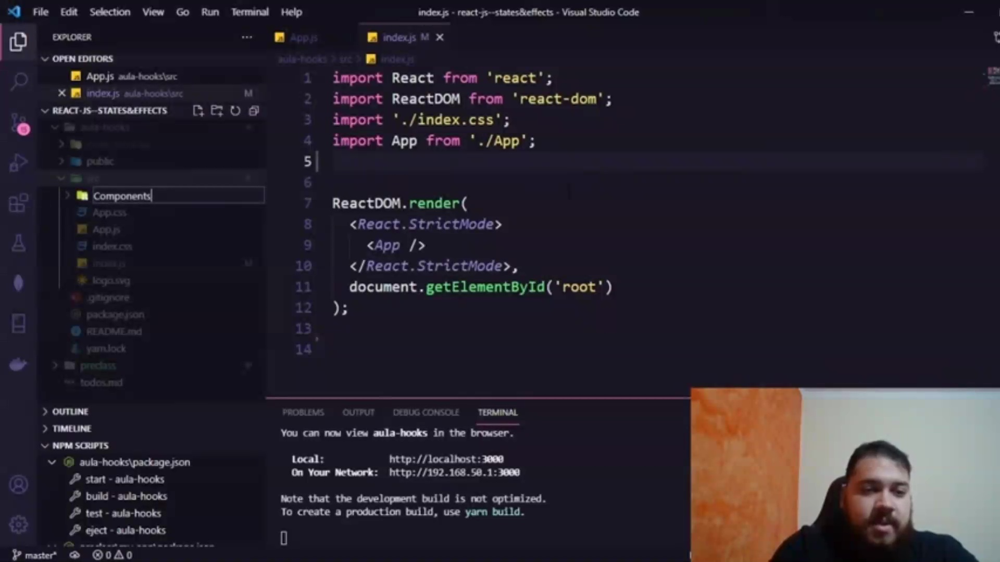
</p>

Para manter o projeto limpo e focado no desenvolvimento com Hooks, removemos arquivos desnecessários gerados pelo template padrão. Foram deletados os arquivos de testes (`App.test.js` e `setupTests.js`) e o `reportWebVitals.js`. Após a exclusão, é necessário limpar as referências a esses arquivos no `index.js` para evitar erros de compilação, como demonstrado no terminal do editor.

```javascript
import React from 'react';
import ReactDOM from 'react-dom';
import './index.css';
import App from './App';

ReactDOM.render(
  <React.StrictMode>
    <App />
  </React.StrictMode>,
  document.getElementById('root')
);

```

<p align="center">
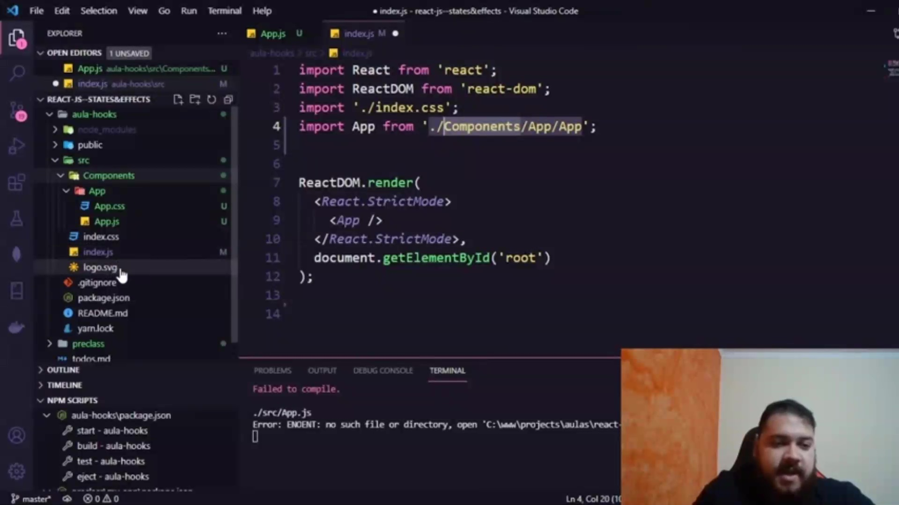
</p>

Uma boa prática de organização consiste em criar uma pasta chamada `components` dentro do diretório `src`. O objetivo é isolar cada componente em sua própria pasta. Neste exemplo, movemos os arquivos relacionados ao componente principal (`App.js`, `App.css` e o logo) para a subpasta `src/components/app/`. Ao mover os arquivos, o editor pode auxiliar na atualização automática dos caminhos de importação.

<p align="center">
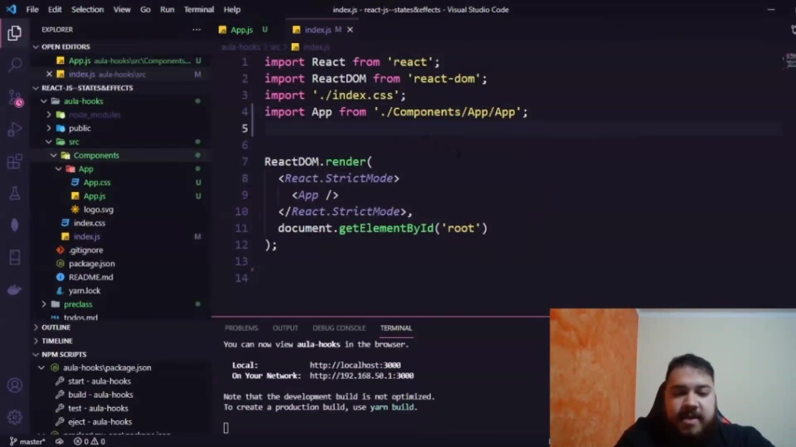
</p>

Após a reestruturação das pastas, o arquivo `index.js` (o ponto de entrada principal) passa a importar o componente `App` do novo local. O `index.js` permanece na raiz da pasta `src`, servindo como a ponte entre o componente principal e o arquivo HTML físico.

```javascript
import React from 'react';
import ReactDOM from 'react-dom';
import './index.css';
import App from './Components/App/App';

ReactDOM.render(
  <React.StrictMode>
    <App />
  </React.StrictMode>,
  document.getElementById('root')
);

```

<p align="center">
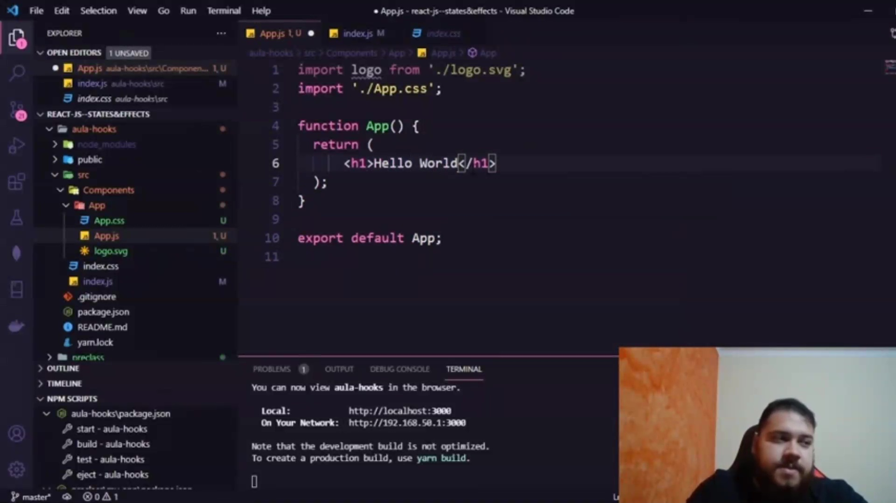
</p>

Para finalizar a limpeza, simplificamos o componente `App.js`. Removemos o conteúdo padrão e o logo, deixando apenas um elemento `<h1>`. Um componente React, em sua forma mais pura, é uma função JavaScript que retorna elementos HTML (JSX). Esta estrutura limpa servirá de base para a criação dos nossos primeiros componentes e para o estudo das vantagens dos Hooks.

```javascript
import './App.css';

function App() {
  return (
    <div className="App">
      <h1>Hello World</h1>
    </div>
  );
}

export default App;

```      


## 🟩 Vídeo 05 - Como criar um componente sem utilizar estados

<video width="60%" controls>
  <source src="000-Midia_e_Anexos/bootcamp_tqi_fullstack-modulo_04-curso.03-Video_05.webm" type="video/webm">
    Seu navegador não suporta vídeo HTML5.
</video>

Link do vídeo: https://web.dio.me/track/tqi-fullstack-developer/course/trabalhando-com-states-effects-no-reactjs/learning/a65bdeb8-eaf0-4006-96f9-86dc93dda6dc?autoplay=1


## 🟩 Vídeo 06 - Como criar um componente utilizando estados


Link do vídeo: 


## 🟩 Vídeo 07 - Criando um componente prático com estado


Link do vídeo: 


## 🟩 Vídeo 08 - Trabalhando com efeitos colaterais (useEffect)


Link do vídeo: 


## 🟩 Vídeo 09 - Conclusão do curso


Link do vídeo: 


## 🟩 Vídeo 10 - Trabalhando com States & Effects no ReactJs


Link do vídeo: 


# Certificado: Trabalhando com States & Effects no ReactJs

- Link na plataforma: 
- Certificado em pdf: 
