## Instrutor

- Eduardo Gonçalves (Senior Software Engineer @Gupy | JavaScript Specialist | React | Node.js | Design System | AWS | SQL)
- Contato Linkedin: / [geceduardo](https://www.linkedin.com/in/geceduardo/)
- Github: https://github.com/eduardogc
- Repositório (fork): https://github.com/ahaerdy/fork-digital-one-react-intermediario-eduardogc


# Parte 1 - Trabalhando com estilos em elementos e componentes

## 🟩 Vídeo 01 - Introdução e objetivos da aula

<video width="60%" controls>
  <source src="000-Midia_e_Anexos/bootcamp_tqi_fullstack-modulo_04-curso.04-Video_01.webm" type="video/webm">
    Seu navegador não suporta vídeo HTML5.
</video>


Link do vídeo: https://web.dio.me/track/tqi-fullstack-developer/course/desenvolvimento-de-aplicacoes-para-internet-com-reactjs/learning/c6a6c9e3-c419-4443-9191-b3bf851d1ce4?autoplay=1  

Nesta introdução, o desenvolvedor Eduardo apresenta as diretrizes de um curso focado na criação de **aplicações web utilizando React JS**. O conteúdo programático da primeira aula abrange técnicas de **estilização com CSS**, a distinção entre **componentes funcionais e de estado**, além da manipulação de **formulários** na biblioteca. Para acompanhar o aprendizado, os alunos devem possuir conhecimentos prévios em **programação web** e ter ferramentas como o **Node.js** devidamente configuradas. O instrutor também ressalta a importância de saber utilizar o **GitHub** para acessar os materiais práticos disponibilizados. O objetivo final é capacitar os estudantes por meio de uma abordagem técnica estruturada e voltada para o **desenvolvimento frontend**.

### Anotações

<p align="center">

</p>

Esta aula marca o início do curso de **Desenvolvimento de aplicações para internet com ReactJS**, ministrado por Eduardo Gonçalves Costa, desenvolvedor Front End na Tracksale. O foco inicial desta trilha de aprendizado será a exploração de como trabalhar com estilos, focando especificamente na aplicação de CSS em elementos e componentes dentro do ecossistema React.

<p align="center">
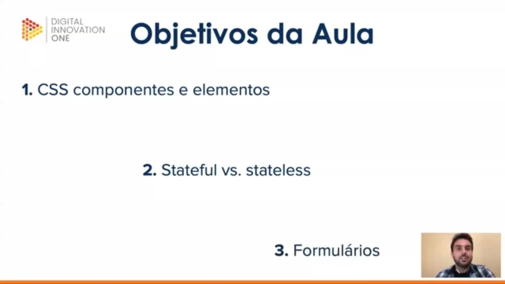
</p>

A aula está estruturada em três objetivos principais:

1. **CSS componentes e elementos**: Onde serão abordadas três abordagens distintas para a estilização.
2. **Stateful vs. stateless**: Uma análise sobre a diferença entre esses tipos de componentes e o entendimento dos ciclos de vida no React.
3. **Formulários**: O aprendizado prático de como construir formulários utilizando a biblioteca.

<p align="center">

</p>

Para acompanhar o conteúdo de forma eficiente, são necessários os seguintes requisitos básicos:

* Ter concluído os cursos de **Introdução ao ReactJS** e **Programação para internet com HTML5 e CSS3**.
* Possuir um **Editor de Texto** de sua preferência.
* Ter o **Node.js** e o **React** corretamente instalados no ambiente de desenvolvimento.
* Conhecimentos básicos em Git para clonar repositórios do GitHub e acessar os exemplos práticos.


## 🟩 Vídeo 02 - Aprenda sobre estilização de componentes e elementos CSS

<video width="60%" controls>
  <source src="000-Midia_e_Anexos/bootcamp_tqi_fullstack-modulo_04-curso.04-Video_02.webm" type="video/webm">
    Seu navegador não suporta vídeo HTML5.
</video>

Link do vídeo: https://web.dio.me/track/tqi-fullstack-developer/course/desenvolvimento-de-aplicacoes-para-internet-com-reactjs/learning/6f3d2411-f080-4160-9461-649e01ddd3ce?autoplay=1

O vídeo detalha as **três principais estratégias** para aplicar estilos em componentes **React**, começando pela abordagem **inline**. O autor destaca que, embora o estilo direto via atributos seja prático para testes rápidos, ele apresenta **dificuldades de manutenção** em projetos de grande escala. A segunda técnica envolve o uso de **classes CSS**, que oferece uma estrutura mais modular, porém exige atenção à nomenclatura **className** para evitar conflitos e manter a compatibilidade com o ecossistema. Por fim, o texto introduz o **CSS-in-JS**, exemplificado pela biblioteca **Styled Components**, como a solução mais flexível e moderna. Essa última modalidade é elogiada por permitir a **criação de estilos dinâmicos** através de propriedades e por otimizar a performance ao injetar automaticamente prefixos específicos para diferentes navegadores.

### Anotações

<p align="center">

</p>

Esta aula inicia a abordagem sobre a estilização de componentes e elementos no desenvolvimento de aplicações para internet utilizando ReactJS. O foco principal é entender como gerenciar o CSS dentro do ecossistema de componentes do React.

<p align="center">

</p>

Existem três maneiras principais de realizar a estilização em React que serão exploradas:

1. **Inline**: Estilos aplicados diretamente nos elementos via atributos.
2. **Classes**: Uso de classes CSS tradicionais importadas para o componente.
3. 
**CSS in JS**: Bibliotecas que permitem escrever CSS diretamente dentro do arquivo JavaScript.

<p align="center">
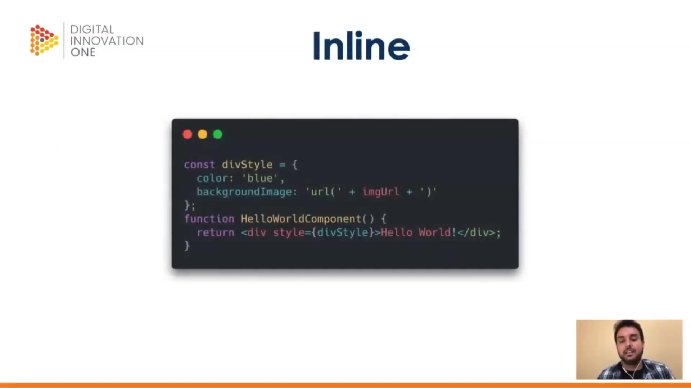
</p>

A estilização **Inline** no React é feita passando um objeto JavaScript para o atributo `style` do elemento. Diferente do HTML convencional, as propriedades do CSS que possuem hífen (como `background-image`) devem ser escritas em *camelCase* (como `backgroundImage`).

```javascript
const divStyle = {
  color: 'blue',
  backgroundImage: 'url(' + imgUrl + ')'
};

function HelloWorldComponent() {
  return <div style={divStyle}>Hello World!</div>;
}

```

<p align="center">

</p>

Também é possível passar estilos inline diretamente como propriedades (*props*) para outros componentes. Isso permite uma personalização rápida de instâncias específicas de um componente.

```javascript
function App() {
  return (
    <HelloWorld style={{ marginTop: '10px' }} />
  )
}

```

<p align="center">

</p>

A utilização de estilos inline possui vantagens e desvantagens:

* **Prós**: É a maneira mais prática e direta de aplicar estilos, ideal para ajustes rápidos e testes de design.
* **Contras**: Apresenta grande dificuldade de manutenção à medida que a aplicação cresce, pois os estilos ficam espalhados pelo código.

<p align="center">
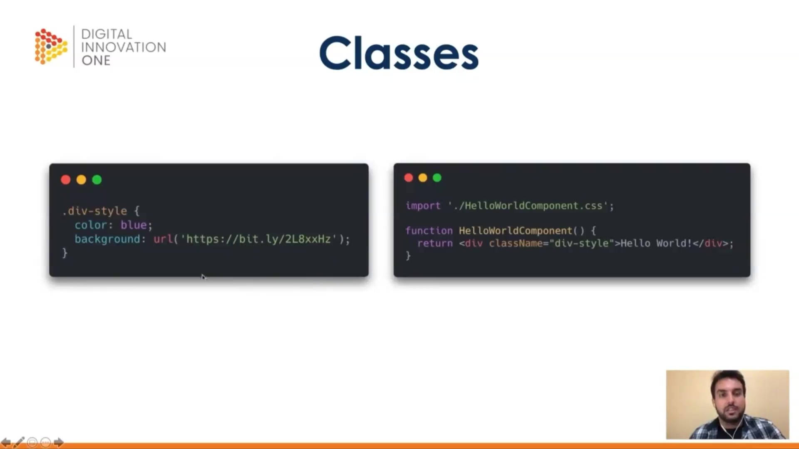
</p>

A estilização por **Classes** utiliza arquivos CSS externos que são importados para o componente JavaScript. No JSX, como `class` é uma palavra reservada do JavaScript, utiliza-se o atributo `className` para definir as classes CSS nos elementos.

```css
/* HelloWorldComponent.css */
.div-style {
  color: blue;
  background: url('https://bit.ly/2L8xxHz');
}

```

```javascript
import './HelloWorldComponent.css';

function HelloWorldComponent() {
  return <div className="div-style">Hello World!</div>;
}

```

<p align="center">

</p>

O uso de classes é uma maneira prática e direta, mas também possui pontos negativos relevantes:

* **Contras**: Além da difícil manutenção em larga escala, oferece pouca flexibilidade e pode gerar conflitos de nomes de classes entre diferentes componentes da aplicação.

<p align="center">
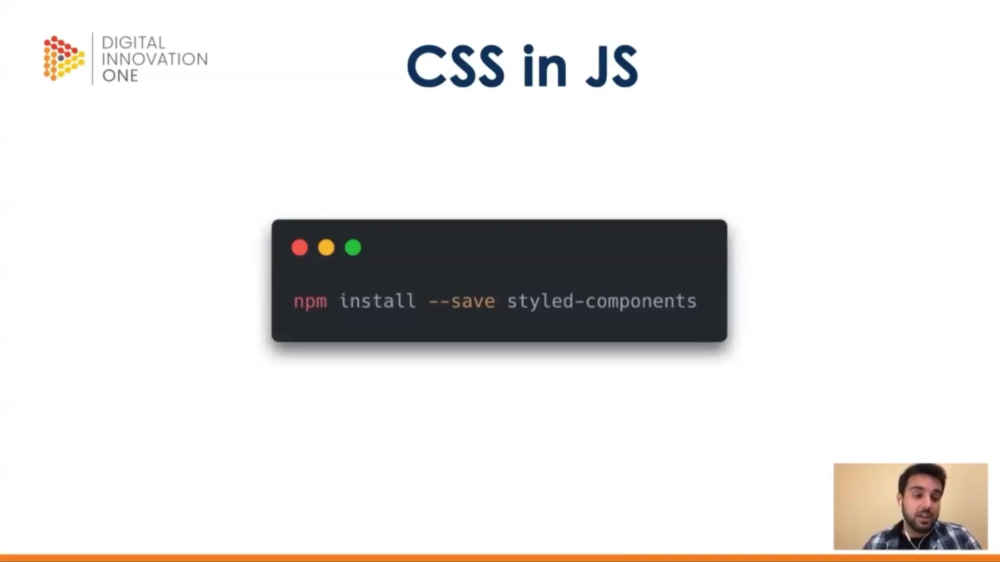
</p>

O **CSS in JS** surge como uma alternativa para resolver os problemas das abordagens anteriores. Uma das bibliotecas mais populares para isso é o `styled-components`. Para utilizá-la, é necessário realizar a instalação via npm:

```bash
npm install --save styled-components

```

<p align="center">
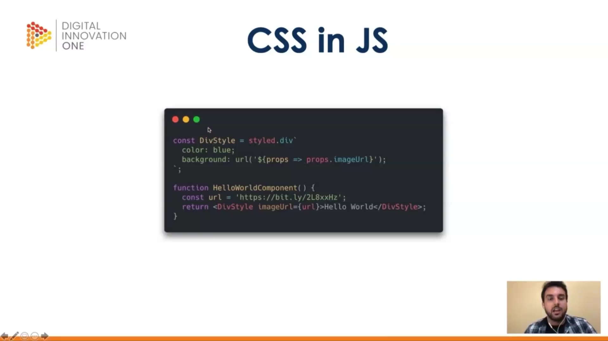
</p>

Com o `styled-components`, criamos componentes que já possuem estilização atrelada a eles através de *Tagged Templates*. Isso permite, por exemplo, passar propriedades (*props*) para o CSS, tornando o estilo dinâmico e dependente do estado ou das propriedades do componente.

```javascript
import styled from 'styled-components';

const DivStyle = styled.div`
  color: blue;
  background: url('${props => props.imageUrl}');
`;

function HelloWorldComponent() {
  const url = 'https://bit.ly/2L8xxHz';
  return <DivStyle imageUrl={url}>Hello World</DivStyle>;
}

```

<p align="center">

</p>

As principais vantagens do **CSS in JS** incluem:

* **Manutenção**: Facilidade para remover CSS não utilizado e criação de estilos dinâmicos baseados em props.
* **Performance**: Injeção automática de *vendor prefixes* (como `-webkit-`), o que garante compatibilidade entre navegadores sem esforço manual, além de eliminar a necessidade de pré-processadores externos.      


## 🟩 Vídeo 03 - Stateful vs Stateless

<video width="60%" controls>
  <source src="000-Midia_e_Anexos/bootcamp_tqi_fullstack-modulo_04-curso.04-Video_03.webm" type="video/webm">
    Seu navegador não suporta vídeo HTML5.
</video>

Link do vídeo: https://web.dio.me/track/tqi-fullstack-developer/course/desenvolvimento-de-aplicacoes-para-internet-com-reactjs/learning/42654499-4869-47ff-bb4c-8b0dfe5cfd18?autoplay=1

O vídeo explica a diferença fundamental entre componentes **stateful** e **stateless** no ecossistema **React**, focando em como cada um lida com o gerenciamento de dados. O autor descreve que, tradicionalmente, componentes baseados em **classes** gerenciam estados e ciclos de vida complexos, enquanto componentes **funcionais** eram usados apenas para exibição simples. Através de um exemplo de lista de compras, o texto demonstra a evolução para o uso de **Hooks**, que permite que funções também controlem estados de forma mais compacta. Com essa mudança tecnológica, a nomenclatura evoluiu para priorizar os termos **componentes de classe** e **componentes funcionais**. O conteúdo ressalta ainda que os estados são **imutáveis**, exigindo a criação de novas cópias a cada atualização para garantir a performance. Dessa forma, o material serve como um guia didático sobre a modernização das práticas de desenvolvimento de interfaces.

### Anotações

<p align="center">
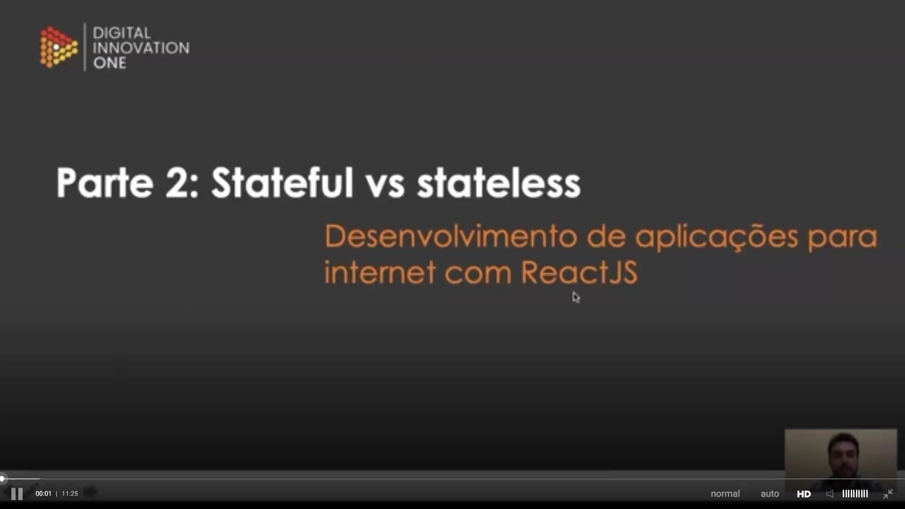
</p>

Nesta segunda parte da aula, o foco é a diferenciação entre **Stateful** e **Stateless** components no ecossistema React. A distinção fundamental entre ambos reside na forma como lidam com os dados internos e a lógica de estado da aplicação. Com a introdução dos **Hooks**, essa nomenclatura passou por adaptações necessárias para refletir as novas possibilidades de desenvolvimento.

<p align="center">
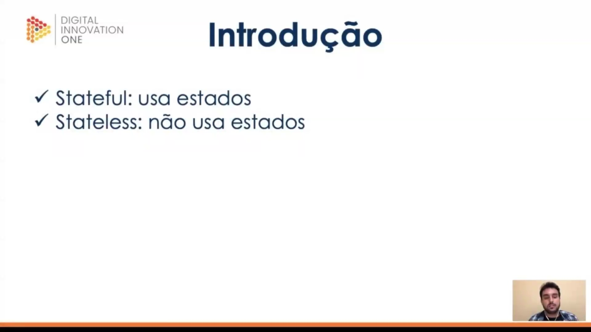
</p>

As definições básicas para iniciar o estudo deste capítulo são:

* **Stateful:** Indica que o componente utiliza e gerencia estados internamente.
* **Stateless:** Indica que o componente não faz uso de estados, funcionando apenas para renderização.

<p align="center">

</p>

Um componente **Stateful** caracteriza-se por possuir o gerenciamento de estado interno. Tradicionalmente, na arquitetura do React, esses componentes são construídos utilizando **classes** de JavaScript, permitindo o controle de dados dinâmicos que afetam o comportamento e a interface do componente ao longo do tempo.

<p align="center">
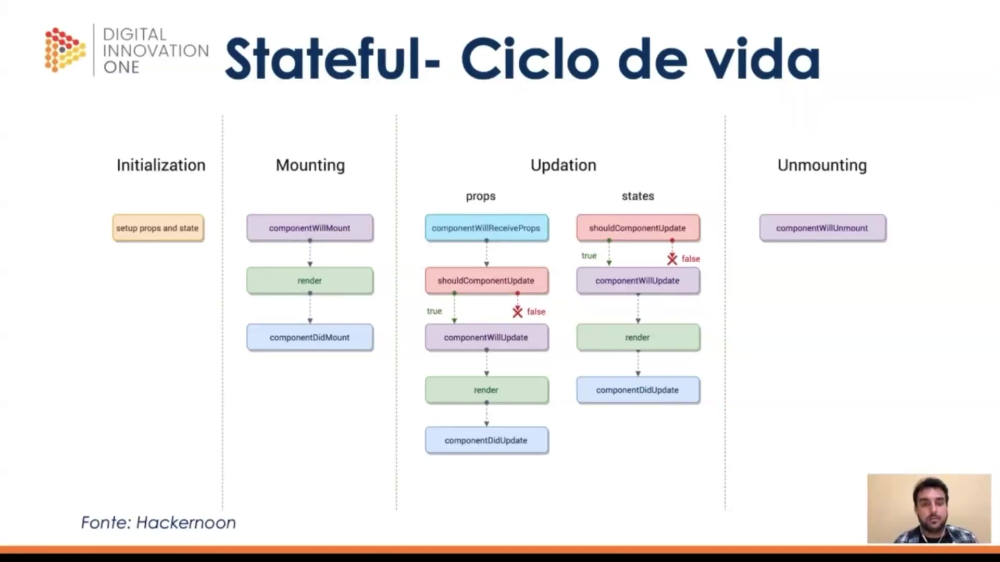
</p>

O React oferece diversos métodos de **ciclo de vida** para controlar um componente Stateful desde sua criação até sua destruição. O fluxo divide-se em fases principais:

* **Inicialização (Initialization):** Configuração inicial de `props` (propriedades recebidas) e `states` (estados iniciais).
* **Montagem (Mounting):** Envolve o `componentWillMount` (antes da renderização), a fase de `render` e o `componentDidMount` (executado após a renderização inicial).
* **Atualização (Updation):** Controla as mudanças via props (`componentWillReceiveProps`, `shouldComponentUpdate`) ou via states, permitindo decidir se o componente deve ou não atualizar a interface.
* **Desmontagem (Unmounting):** Fase de destruição onde o `componentWillUnmount` é utilizado para limpezas de memória ou encerramento de processos persistidos.

<p align="center">

</p>

Para ilustrar a aplicação prática de um componente Stateful, utiliza-se o exemplo de uma **lista de supermercado**. A interface apresenta uma lista de itens (como Tomate, Alface e Melancia) e controles interativos, como botões para adicionar novos produtos (ex: Abóbora) ou remover itens existentes. Esta interação exige que o componente armazene e atualize a lista dinamicamente através do estado.

<p align="center">

</p>

A implementação da lista de supermercado utilizando classes envolve a inicialização do estado no construtor. É fundamental notar que os estados no React são **imutáveis**; para atualizar a lista, o estado anterior é destruído e uma nova cópia com os dados atualizados é criada para garantir a performance e a consistência da renderização.

```javascript
import React, { Component } from 'react';

class TodoListStatefull extends Component {
  constructor(props) {
    super(props);
    this.state = {
      items: [
        'Tomate',
        'Alface',
        'Melancia'
      ]
    }
  }
}

```

<p align="center">
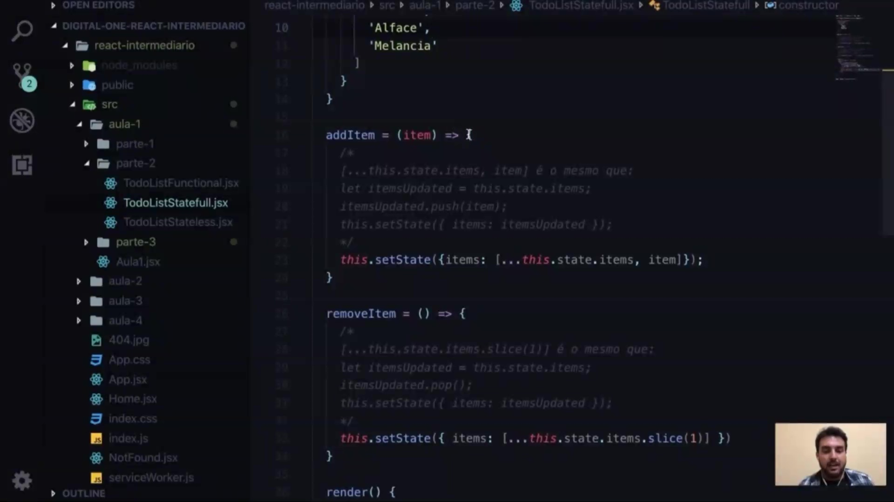
</p>

Para manipular os itens da lista, são definidas funções como `addItem`. No exemplo abaixo, utiliza-se o operador *spread* para garantir a imutabilidade, criando um novo array que contém os itens atuais mais o novo item inserido.

```javascript
addItem = (item) => {
  /* ...this.state.items, item é o mesmo que:
     let itemsUpdated = this.state.items;
     itemsUpdated.push(item);
     this.setState({ items: itemsUpdated }); 
  */
  this.setState({items: [...this.state.items, item]});
}

removeItem = () => {
  /* this.state.items.slice(1) é o mesmo que:
     let itemsUpdated = this.state.items;
     itemsUpdated.pop();
     this.setState({ items: itemsUpdated });
  */
  this.setState({ items: [...this.state.items.slice(1)] })
}

```

<p align="center">
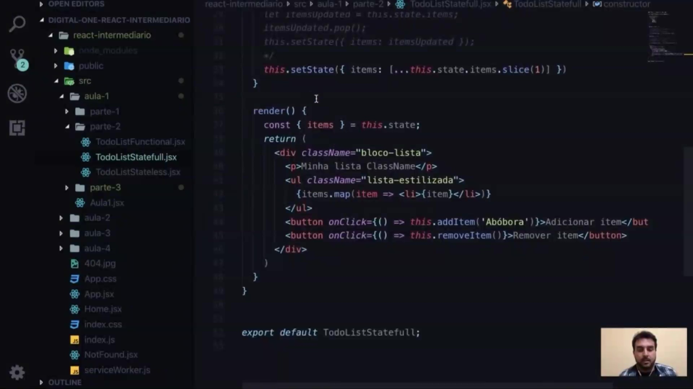
</p>

O método `render` do componente Stateful extrai os itens do estado e mapeia cada elemento para um item de lista (`<li>`). Os botões de interface disparam as funções de adição e remoção definidas anteriormente através de eventos de clique.

```javascript
render() {
  const { items } = this.state;
  return (
    <div className="bloco-lista">
      <p>Minha lista ClassName</p>
      <ul className="lista-estilizada">
        {items.map(item => <li>{item}</li>)}
      </ul>
      <button onClick={() => this.addItem('Abóbora')}>Adicionar item</button>
      <button onClick={() => this.removeItem()}>Remover item</button>
    </div>
  )
}

export default TodoListStatefull;

```

<p align="center">
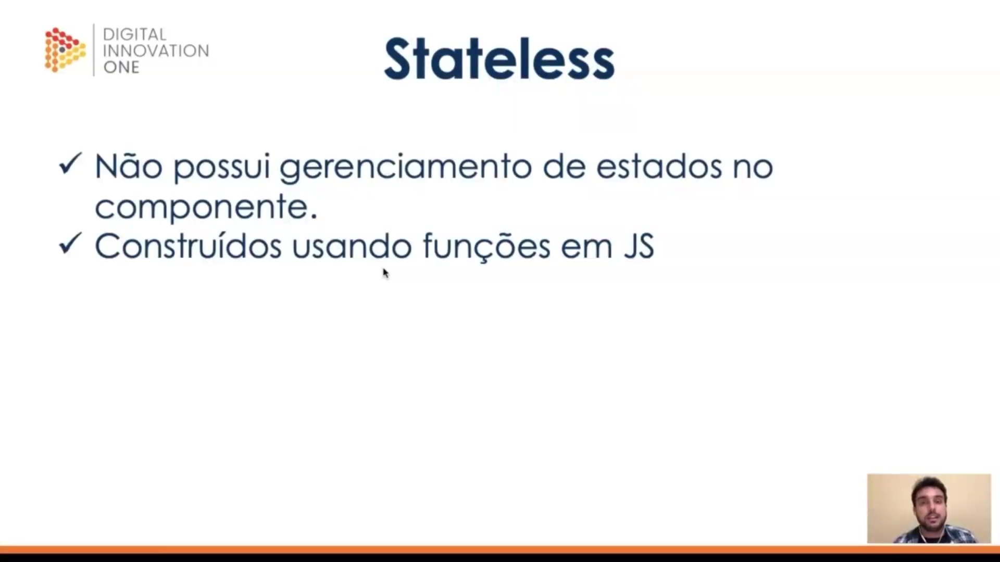
</p>

Em contraste, o componente **Stateless** não possui gerenciamento de estados internos. Ele é construído utilizando **funções** simples em JavaScript (Functional Components). Este tipo de componente é ideal para renderizações puras, como ícones ou módulos de exibição que dependem apenas das `props` recebidas para mostrar informações, resultando em um código mais conciso.

<p align="center">
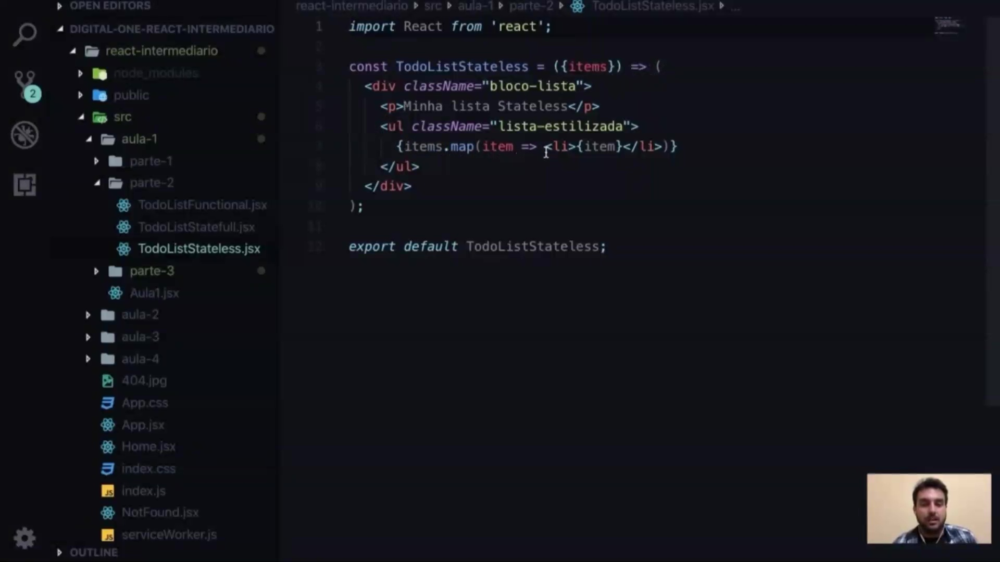
</p>

A versão Stateless da lista de tarefas é significativamente mais curta. Ela recebe os `items` via desestruturação das propriedades e apenas renderiza a estrutura HTML. Não há lógica de alteração de estado (como `addItem` ou `removeItem`) dentro deste componente específico, pois ele atua apenas como uma camada de visualização.

```javascript
import React from 'react';

const TodoListStateless = ({items}) => (
  <div className="bloco-lista">
    <p>Minha lista Stateless</p>
    <ul className="lista-estilizada">
      {items.map(item => <li>{item}</li>)}
    </ul>
  </div>
);

export default TodoListStateless;

```

<p align="center">
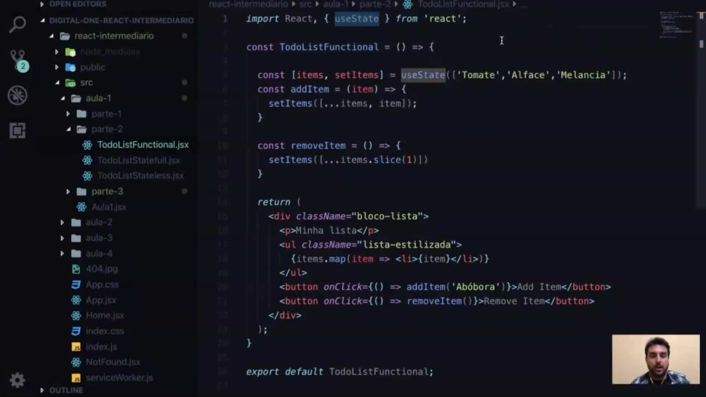
</p>

Com a chegada do **Hooks**, tornou-se possível gerenciar estados dentro de componentes funcionais utilizando o `useState`. Esta abordagem combina a simplicidade das funções com o poder de gerenciamento de dados que antes era exclusivo das classes. O hook define um par contendo o estado atual e uma função para modificá-lo.

```javascript
import React, { useState } from 'react';

const TodoListFunctional = () => {
  const [items, setItems] = useState(['Tomate', 'Alface', 'Melancia']);

  const addItem = (item) => {
    setItems([...items, item]);
  }

  const removeItem = () => {
    setItems([...items.slice(1)]);
  }

  return (
    <div className="bloco-lista">
      <p>Minha Lista</p>
      <ul className="lista-estilizada">
        {items.map(item => <li>{item}</li>)}
      </ul>
      <button onClick={() => addItem('Abóbora')}>Add Item</button>
      <button onClick={() => removeItem()}>Remove Item</button>
    </div>
  );
}

export default TodoListFunctional;

```

<p align="center">
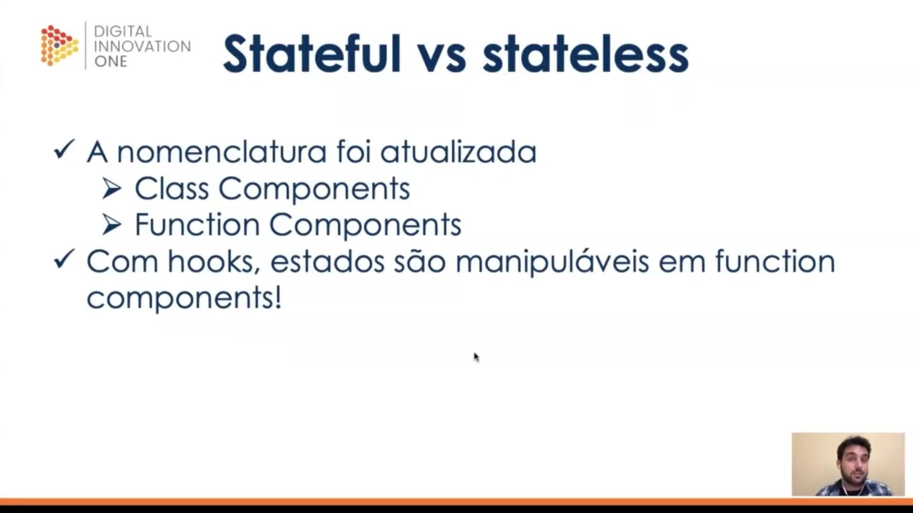
</p>

Devido à evolução tecnológica, a nomenclatura foi atualizada. Atualmente, a distinção mais precisa é entre **Class Components** e **Function Components**. Como os componentes funcionais agora podem manipular estados através de Hooks, eles deixaram de ser exclusivamente "stateless". Hoje, chamamos de Stateless apenas o componente funcional que não utiliza gerenciamento de estados.


## 🟩 Vídeo 04 - Introdução em Formulários no ReactJS

<video width="60%" controls>
  <source src="000-Midia_e_Anexos/bootcamp_tqi_fullstack-modulo_04-curso.04-Video_04.webm" type="video/webm">
    Seu navegador não suporta vídeo HTML5.
</video>

Link do vídeo: https://web.dio.me/track/tqi-fullstack-developer/course/desenvolvimento-de-aplicacoes-para-internet-com-reactjs/learning/5a44ad8b-f289-4c5f-887e-d4531a186852?autoplay=1

O vídeo consiste em uma aula técnica sobre a manipulação de **formulários em React**, detalhando como gerenciar o estado entre o **DOM** e a biblioteca. O conteúdo explora a diferença entre **componentes controlados**, onde o React é a única fonte de verdade, e **componentes não controlados**, que utilizam referências para acessar valores. São apresentados exemplos práticos envolvendo diversos elementos de entrada, como **inputs, selects e checkboxes**, além de estratégias para simplificar o código. O instrutor também aborda exceções, como campos de **upload de arquivos**, que exigem abordagens específicas por serem somente leitura. Por fim, o texto sugere o uso de bibliotecas externas como **Formic** para lidar com estruturas de dados mais complexas e robustas.

### Anotações

<p align="center">

</p>

### Introdução aos Formulários no React

Os formulários são fundamentais para a interatividade em aplicações web. No ecossistema React, lidamos com uma particularidade: enquanto os elementos do DOM no HTML5 (como `<input>`, `<textarea>` e `<select>`) já mantêm naturalmente um estado interno, o React também busca controlar o estado da aplicação. Para harmonizar essas duas frentes, existem estratégias específicas para garantir que os dados inseridos pelo usuário sejam processados corretamente pela biblioteca.

<p align="center">
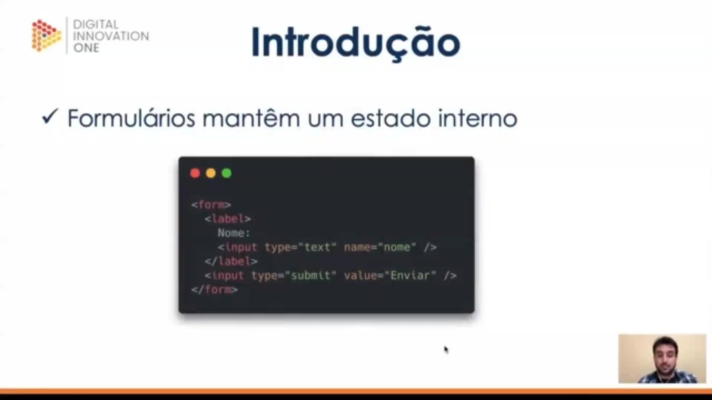
</p>

### Componentes Controlados vs. Não Controlados

Existem duas formas principais de trabalhar com formulários no React:

1. **Componentes Controlados:** O React é a "fonte única da verdade" (*single source of truth*). O estado do componente controla o valor do input através do atributo `value` e as atualizações são feitas via eventos como o `onChange`.
2. **Componentes Não Controlados:** O estado é mantido pelo próprio DOM. O React acessa esses valores geralmente por meio de referências (`refs`) quando necessário, como no momento da submissão.

<p align="center">
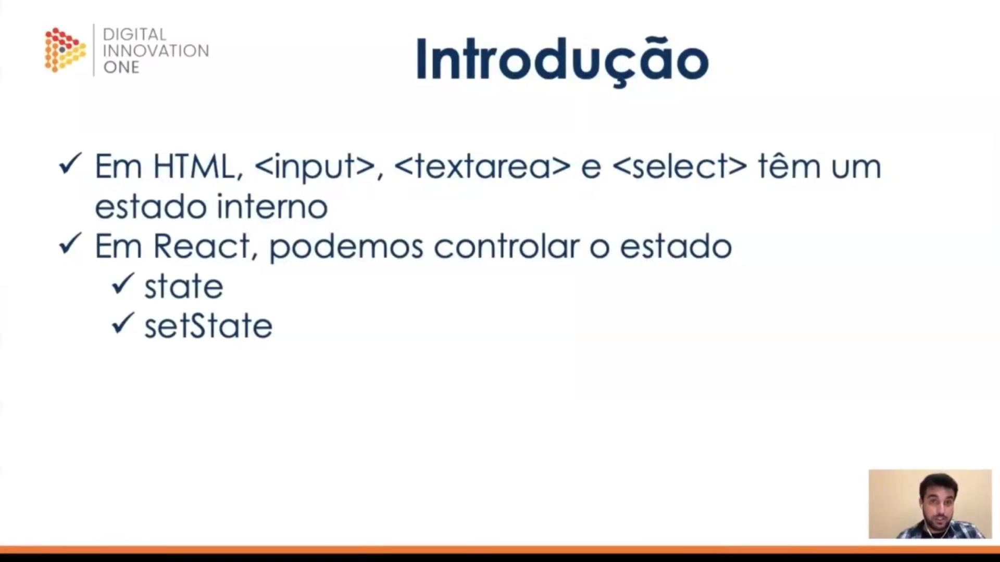
</p>

### Implementação de um Componente Controlado

Neste exemplo, transformamos um formulário simples em um *stateful component*. O valor do campo de texto é atrelado ao estado `value`, e qualquer alteração dispara a função `handleChange`, que atualiza o estado do React com os dados vindos do DOM (`event.target.value`).

```javascript
class NameForm extends React.Component {
  constructor(props) {
    super(props);
    this.state = {value: ''};

    this.handleChange = this.handleChange.bind(this);
    this.handleSubmit = this.handleSubmit.bind(this);
  }

  handleChange(event) {
    this.setState({value: event.target.value});
  }

  handleSubmit(event) {
    alert('Um nome foi enviado: ' + this.state.value);
    event.preventDefault();
  }

  render() {
    return (
      <form onSubmit={this.handleSubmit}>
        <label>
          Nome:
          <input type="text" value={this.state.value} onChange={this.handleChange} />
        </label>
        <input type="submit" value="Enviar" />
      </form>
    );
  }
}

```

<p align="center">

</p>

### Manipulando Múltiplos Elementos

Diferentes elementos de formulário seguem o mesmo princípio de componentes controlados, mas com atributos levemente distintos:

* **Input e Textarea:** Utilizam o atributo `value`.
* **Select:** No React, o `value` é definido na tag `<select>` principal para determinar qual `<option>` está selecionada, simplificando o uso em relação ao HTML puro.
* **Checkbox e Radio Button:** Utilizam o atributo `checked` em vez de `value` para definir seu estado ativado/desativado.

<p align="center">

</p>

### Exemplo: Formulário de Pedidos (Sorveteria)

Para gerenciar formulários mais complexos, como um pedido de sorvete com múltiplas opções, definimos estados iniciais para cada campo (sabor, casquinha, guardanapos).

```javascript
this.state = {
  sabor: 'uva',
  casquinha: true,
  guardanapos: 'sim'
};

```

<p align="center">
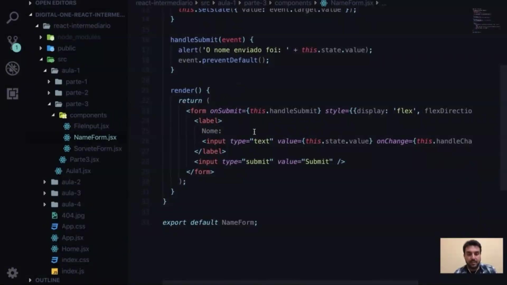
</p>

### Estrutura do Form com Select e Checkbox

O código abaixo demonstra a renderização do formulário de pedidos. Note que o `select` utiliza o `value` vindo do estado, e o `checkbox` utiliza a propriedade `checked`. Ambos compartilham uma função de manipulação chamada `handleInputChange`.

```javascript
<form onSubmit={this.handleSubmit} style={{display: 'flex', flexDirection: 'column'}}>
  <label>
    Escolha o sabor:
    <select name="sabor" value={this.state.sabor} onChange={this.handleInputChange}>
      <option value="uva">Uva</option>
      <option value="limao">Limão</option>
      <option value="coco">Coco</option>
      <option value="chocolate">Chocolate</option>
      <option value="morango">Morango</option>
    </select>
  </label>
  <label>
    <input
      name="casquinha"
      type="checkbox"
      checked={this.state.casquinha}
      onChange={this.handleInputChange} />
    Colocar na casquinha?
  </label>
</form>

```

<p align="center">
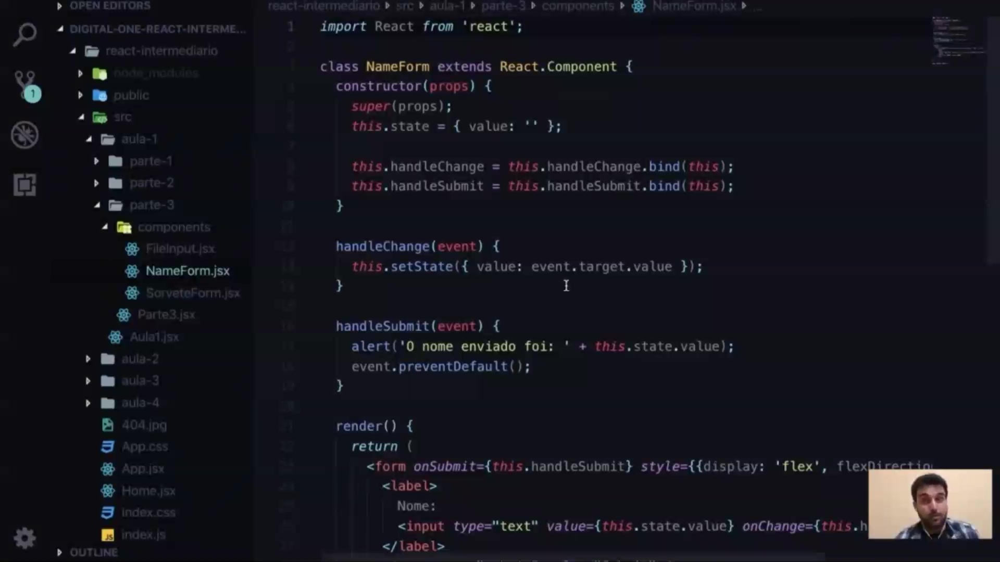
</p>

### Radio Buttons e Submissão

No caso dos Radio Buttons, é necessário definir tanto o `value` (valor fixo do campo) quanto o `checked` (comparação lógica com o estado atual) para que o React saiba qual opção exibir como selecionada.

```javascript
<label>
  <input
    type="radio"
    name="guardanapos"
    value="sim"
    checked={this.state.guardanapos === 'sim'}
    onChange={this.handleInputChange} />
  Sim
</label>
<label>
  <input
    type="radio"
    name="guardanapos"
    value="nao"
    checked={this.state.guardanapos === 'nao'}
    onChange={this.handleInputChange} />
  Não
</label>
<button type="submit">Enviar</button>

```

<p align="center">
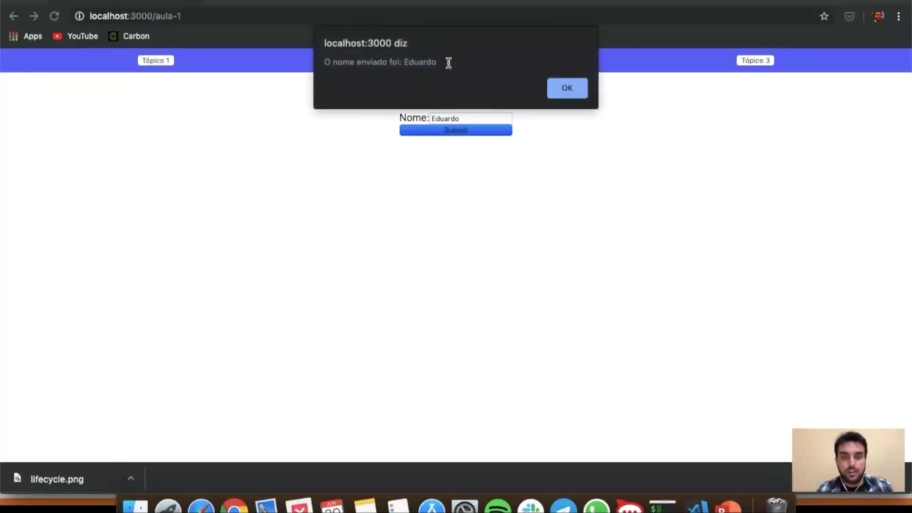
</p>

### Processando o Envio dos Dados

A função `handleSubmit` é responsável por interceptar o evento de submissão do formulário. O `event.preventDefault()` evita que a página recarregue (comportamento padrão do HTML), permitindo que o React exiba os dados processados, como um alerta com as escolhas do usuário.

```javascript
handleSubmit(event) {
  const {sabor, casquinha, guardanapos} = this.state;
  alert(`Seu sabor escolhido foi ${sabor}, guardanapos ${guardanapos} e casquinha ${casquinha}`);
  event.preventDefault();
}

```

<p align="center">
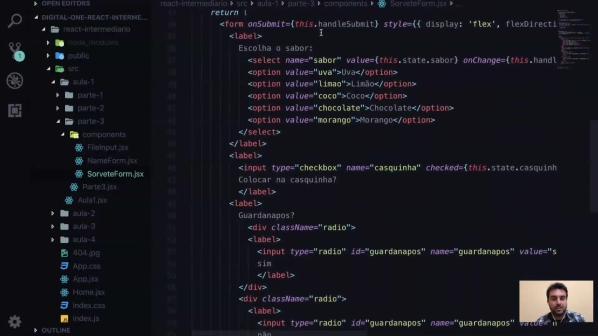
</p>

### Estratégia Universal: Handle Input Change

Para evitar a criação de uma função de alteração para cada campo, utilizamos uma abordagem genérica. Extraímos o `name`, o `type` e o valor (ou `checked` para checkboxes) do `event.target`. Usamos o atributo `name` do elemento HTML para atualizar dinamicamente a chave correspondente no estado.

```javascript
handleInputChange(event) {
  const target = event.target;
  const value = target.type === 'checkbox' ? target.checked : target.value;
  const name = target.name;

  this.setState({
    [name]: value
  });
}

```

<p align="center">

</p>

### Componentes Não Controlados e Referências

Em situações onde não queremos (ou não podemos) controlar cada batida de tecla no estado do React, utilizamos componentes não controlados. Neles, os dados do formulário são gerenciados pelo próprio DOM. Para acessar esses valores, utilizamos o atributo `ref`.

<p align="center">
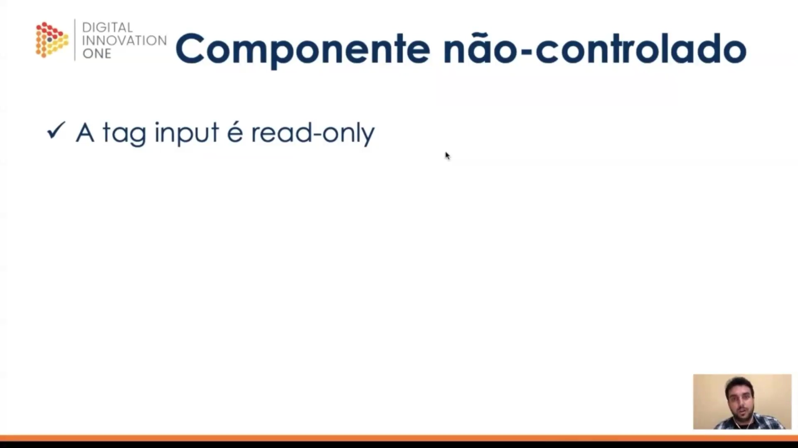
</p>

### A Exceção: Input de Arquivo

Um caso obrigatório de uso de componente não controlado é o `<input type="file">`. No HTML5, este campo é estritamente de leitura (*read-only*). O React não consegue definir seu valor programaticamente por razões de segurança, portanto, devemos sempre usar referências para capturar o arquivo selecionado no momento da submissão.

<p align="center">
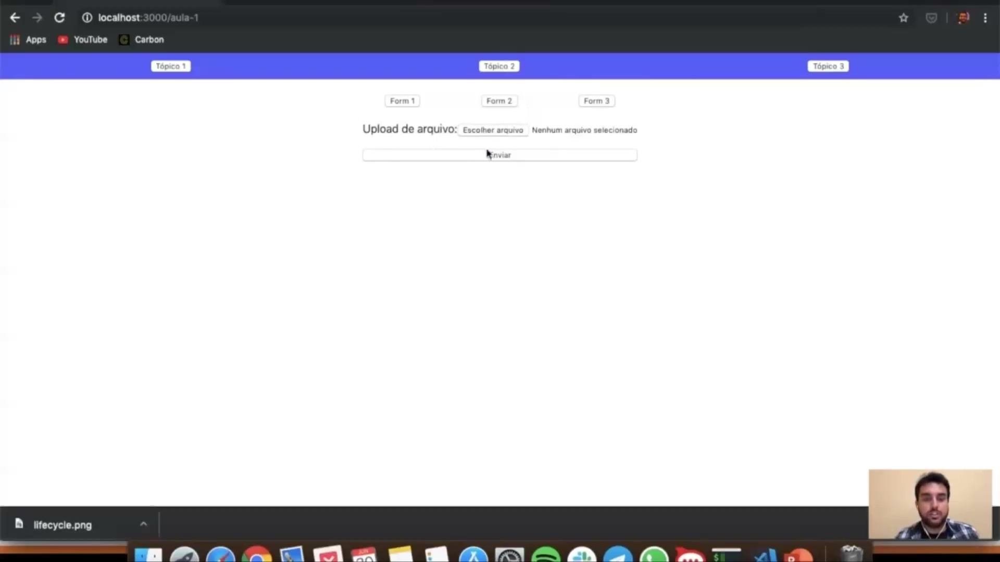
</p>

### Implementação de Referência (createRef)

Para trabalhar com o input de arquivo, criamos uma referência no construtor da classe usando `React.createRef()`. No método `render`, atrelamos essa referência ao elemento através do atributo `ref`.

```javascript
class FileInput extends React.Component {
  constructor(props) {
    super(props);
    this.handleSubmit = this.handleSubmit.bind(this);
    this.fileInput = React.createRef();
  }

  handleSubmit(event) {
    event.preventDefault();
    alert(
      `Arquivo selecionado - ${this.fileInput.current.files[0].name}`
    );
  }

  render() {
    return (
      <form onSubmit={this.handleSubmit}>
        <label>
          Upload de arquivo:
          <input type="file" ref={this.fileInput} />
        </label>
        <br />
        <button type="submit">Enviar</button>
      </form>
    );
  }
}

```

<p align="center">
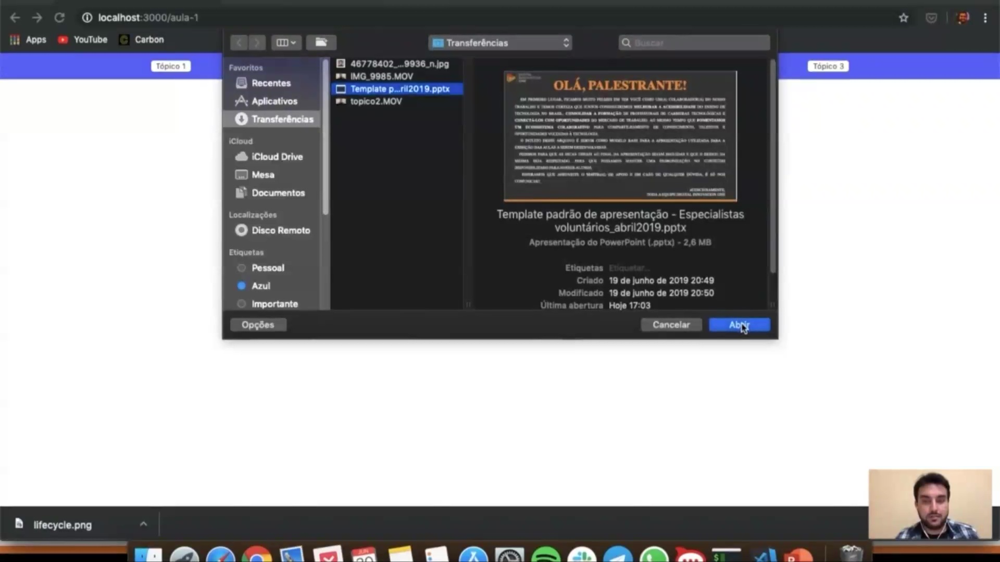
</p>

### Comparativo: Controlados vs. Não Controlados

Embora o React recomende o uso de componentes controlados para a maioria dos casos, a escolha depende da necessidade de validação em tempo real ou da complexidade do formulário. Componentes controlados oferecem mais poder (validação instantânea, desativação condicional de botões), enquanto os não controlados podem ser mais simples para casos básicos ou integrações com bibliotecas externas de terceiros.

<p align="center">
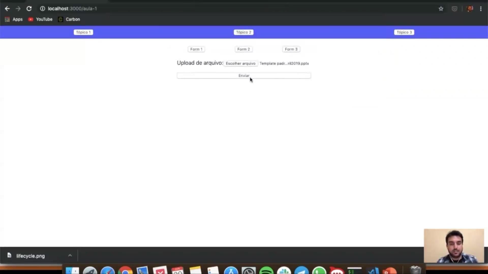
</p>

### Desafios e Verbosidade

Um ponto comum de discussão na comunidade é que lidar com formulários no React "puro" pode se tornar muito verboso. Escrever funções de manipulação, gerenciar cada estado e tratar submissões exige uma quantidade considerável de código repetitivo (*boilerplate*).

<p align="center">
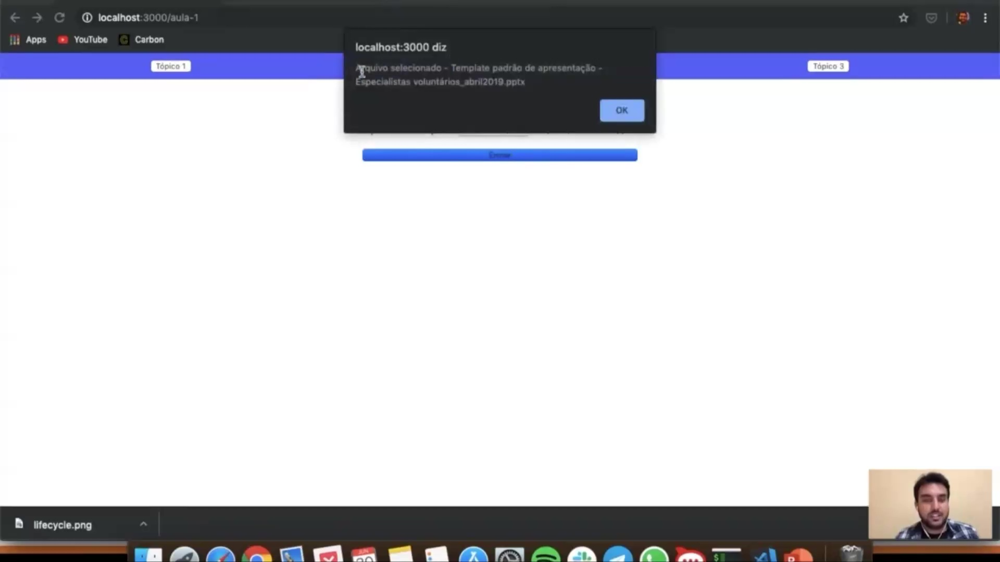
</p>

### Bibliotecas de Terceiros

Para facilitar a gestão de formulários complexos e robustos, a comunidade desenvolveu bibliotecas especializadas. Duas das mais populares e recomendadas são:

* **Formik:** Atualmente a mais utilizada e recomendada pela própria documentação do React.
* **Redux Form:** Muito comum em projetos que utilizam Redux para gerenciamento de estado global.

<p align="center">
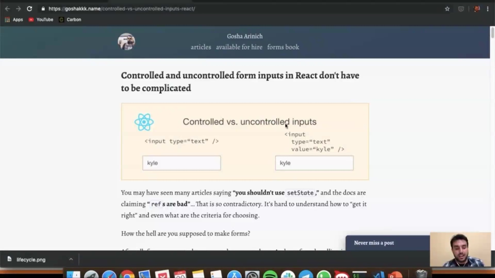
</p>

### Bibliotecas Populares: Formik e Redux Form

A imagem destaca os logotipos e nomes das bibliotecas citadas: **Formik**, que foca em simplicidade e escalabilidade, e **Redux Form**, que integra o estado do formulário diretamente à store do Redux.

<p align="center">
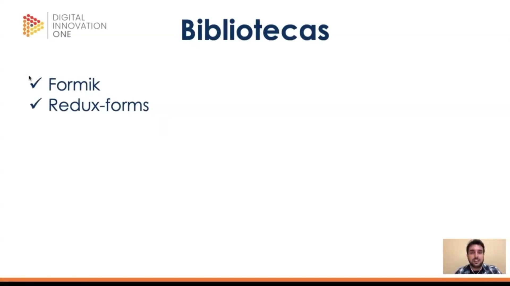
</p>

### Formik: A Recomendação Atual

O Formik destaca-se por resolver problemas de validação, tratamento de erros e submissão sem a necessidade de acoplar o estado do formulário ao Redux, tornando-o mais performático e fácil de implementar em componentes isolados.

<p align="center">

</p>

### Conclusão e Recursos

Para encerrar a aula, é disponibilizado um repositório no GitHub contendo todos os exemplos práticos discutidos, incluindo implementações com componentes controlados, não controlados e um exemplo utilizando a biblioteca Formik. Os alunos são incentivados a explorar o código e praticar as diferentes abordagens.

# Parte 2 - Introdução ao Redux e fluxos da arquitetura com ReactJS

## 🟩 Vídeo 05 - Introdução aos conceitos da aula

<video width="60%" controls>
  <source src="000-Midia_e_Anexos/bootcamp_tqi_fullstack-modulo_04-curso.04-Video_05.webm" type="video/webm">
    Seu navegador não suporta vídeo HTML5.
</video>

Link do vídeo: https://web.dio.me/track/tqi-fullstack-developer/course/desenvolvimento-de-aplicacoes-para-internet-com-reactjs/learning/10b90206-d27b-4ab0-809e-8ce0abd295df?autoplay=1

Esse vídeo consiste na transcrição de um áudio educativo focado na **integração do Redux com a biblioteca React**. O conteúdo está estruturado em três etapas principais que abrangem desde a **teoria da arquitetura Flux** até a **aplicação prática** de ferramentas de gerenciamento de estado. Para acompanhar a lição, os estudantes precisam possuir conhecimentos prévios e ter um **ambiente de desenvolvimento configurado** com Node.js e um editor de código. O instrutor também destaca a importância de instalar uma **extensão de depuração no navegador** para monitorar o comportamento da aplicação. No decorrer da explicação, é prometido um guia detalhado sobre como realizar essas **configurações técnicas** essenciais. Dessa forma, o material serve como um **roteiro de aprendizado** para desenvolvedores que desejam dominar fluxos de dados complexos no ecossistema JavaScript.

### Anotações

<p align="center">

</p>

Esta aula marca o início dos estudos sobre a **introdução ao Redux e os fluxos da arquitetura com ReactJS**. O conteúdo faz parte do módulo de desenvolvimento de aplicações para internet, focado em gerenciar o estado e o fluxo de dados dentro do ecossistema React.

<p align="center">
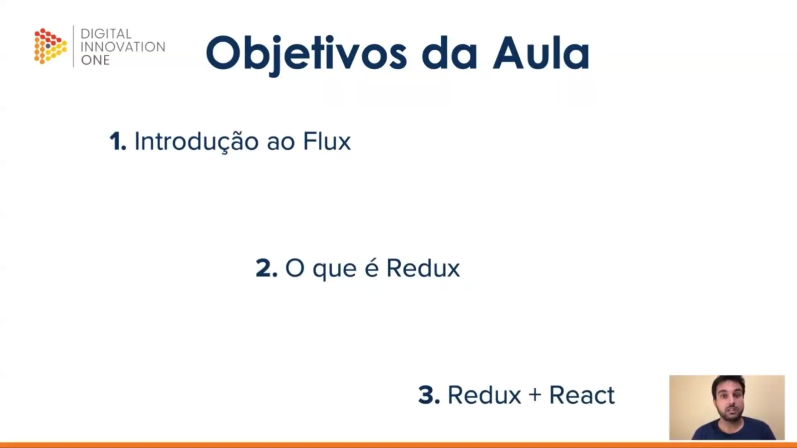
</p>

Os objetivos principais desta aula estão divididos em três etapas fundamentais:

1. **Introdução ao Flux**: Compreensão do padrão de arquitetura que deu origem aos conceitos utilizados.
2. **O que é Redux**: Explicação detalhada sobre a biblioteca de gerenciamento de estado.
3. **Redux + React**: Demonstração de um exemplo prático integrando as duas tecnologias.

<p align="center">

</p>

Para o prosseguimento dos estudos, é necessário atender aos seguintes requisitos técnicos e de conhecimento:

* Ter concluído a **Aula 1** do curso.
* Possuir um **editor de texto** configurado.
* Garantir que o **Node.js** e o **React** estejam corretamente instalados na máquina.
* Realizar a instalação da extensão **Redux Dev Tools** no navegador Chrome, que será utilizada para monitorar os estados da aplicação durante a parte prática do conteúdo.      


## 🟩 Vídeo 06 - O que é Flux?

<video width="60%" controls>
  <source src="000-Midia_e_Anexos/bootcamp_tqi_fullstack-modulo_04-curso.04-Video_06.webm" type="video/webm">
    Seu navegador não suporta vídeo HTML5.
</video>

Link do vídeo: https://web.dio.me/track/tqi-fullstack-developer/course/desenvolvimento-de-aplicacoes-para-internet-com-reactjs/learning/d62cb913-ba7e-4f03-a0aa-ddf71022ab09?autoplay=1

O vídeo explica a **arquitetura Flux**, um padrão criado pelo **Facebook** para resolver problemas de **sincronização de dados** em interfaces complexas. O texto detalha como o fluxo de informações ocorre de maneira **unidirecional**, utilizando componentes específicos como **Action, Dispatcher, Store e View**. O autor utiliza analogias do cotidiano, como telégrafos e gerentes controladores, para ilustrar as funções de cada parte dessa estrutura técnica. Além da teoria, o conteúdo menciona **implementações populares** do mercado, com destaque para o **Redux**, que centraliza estados compartilhados entre componentes. Por fim, recomenda-se cautela no uso dessas ferramentas, sugerindo sua aplicação apenas quando houver necessidade real de **comunicação global** no sistema.

### Anotações

<p align="center">

</p>

Introdução ao estudo do **Flux**, uma arquitetura desenvolvida pelo Facebook para otimizar a comunicação entre componentes em aplicações ReactJS. Esta etapa da aula aborda a motivação histórica e os pilares fundamentais dessa estrutura de dados.

<p align="center">

</p>

O Facebook identificou a necessidade de uma nova arquitetura devido a problemas crônicos de interface em sua área de notificações. O sistema apresentava falhas de sincronia que impactavam diretamente a experiência do usuário na plataforma.

<p align="center">

</p>

A falha manifestava-se visualmente quando o ícone de notificações indicava a existência de novas mensagens que, ao serem acessadas, não estavam presentes. Essa discrepância entre o contador visual e o estado real dos dados gerava confusão e um alto volume de chamados de suporte.

<p align="center">

</p>

As tentativas de correção pontual resultavam em um ciclo frustrante onde o erro parecia resolvido, mas retornava logo em seguida. Isso evidenciou que a falha de sincronização era estrutural e não apenas um bug isolado.

<p align="center">
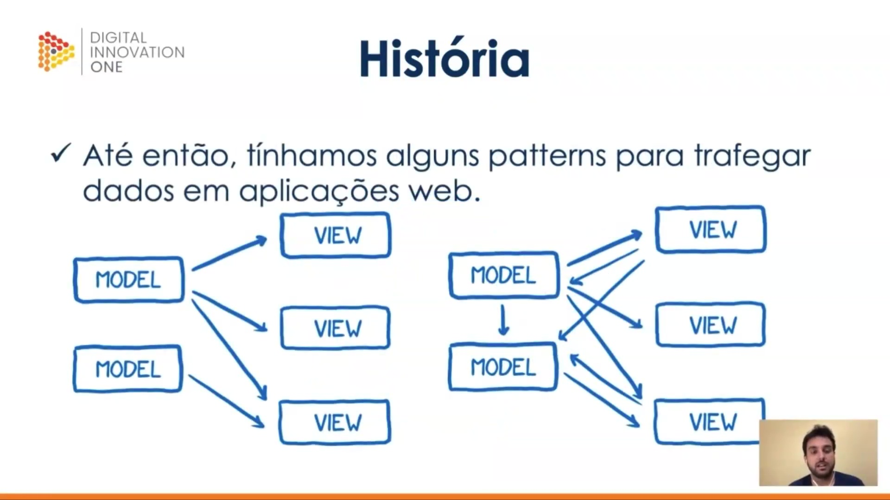
</p>

Até então, o tráfego de dados era gerenciado por padrões como **MVVM** e **MVC**. Nesses modelos, a relação entre Models e Views podia criar fluxos complexos e bidirecionais, o que dificultava a manutenção da consistência dos dados em aplicações de grande porte.

<p align="center">
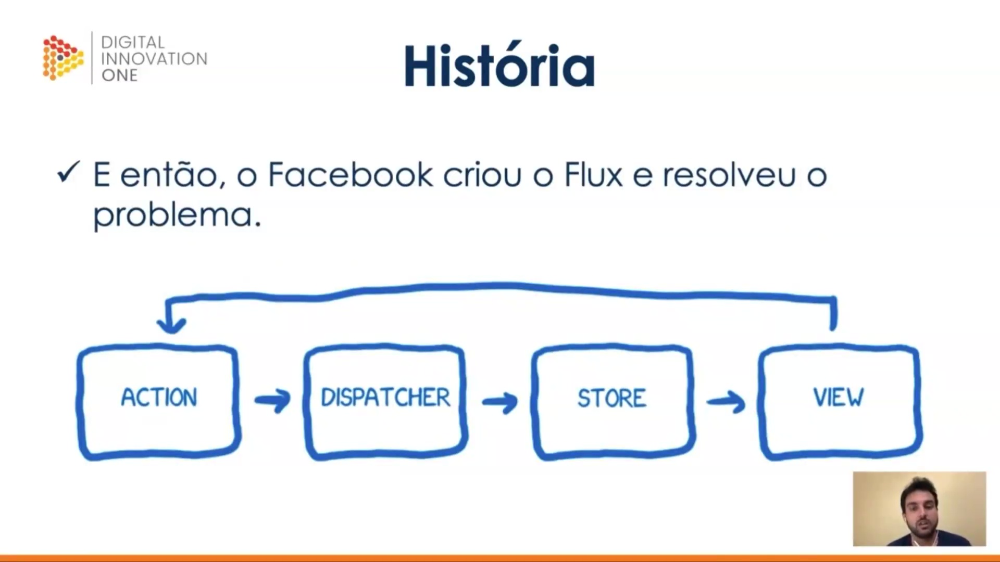
</p>

Como solução, o Facebook criou o **Flux**, estabelecendo um sistema composto por quatro partes principais: **Action**, **Dispatcher**, **Store** e **View**. Essa organização visa garantir que a informação flua de maneira previsível e controlada.

<p align="center">
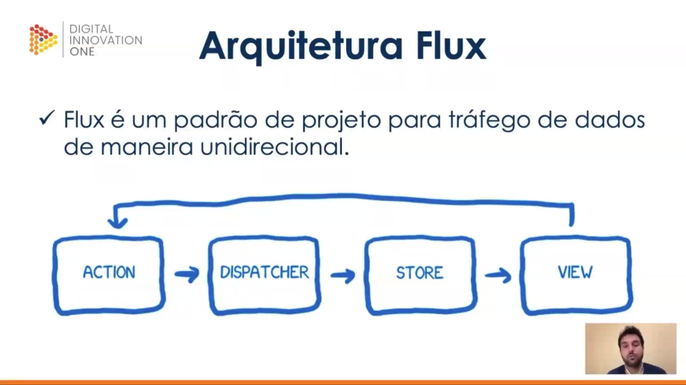
</p>

A **Arquitetura Flux** define um padrão de projeto onde o tráfego de dados ocorre de maneira estritamente **unidirecional**. Esse fluxo de via única impede atualizações de estado desordenadas e resolve os problemas de dessincronização entre os componentes da interface.

<p align="center">

</p>

A **Action** é comparada a um **telégrafo**, pois sua função é formatar a mensagem que descreve uma intenção de alteração no sistema. Ela é o ponto de partida para qualquer mudança de estado, empacotando os dados necessários para o envio.

<p align="center">

</p>

O **Dispatcher** atua como um **telefonista** ou centralizador. Ele detém o conhecimento de todos os callbacks para as diferentes Stores da aplicação e redireciona a mensagem vinda da Action para o local correto.

<p align="center">

</p>

A **Store** funciona como um **gerente super controlador**, sendo a única entidade responsável por guardar a informação e processar alterações. Devido ao fluxo unidirecional, os dados não podem ser alterados diretamente por outros componentes; toda mudança deve ser executada exclusivamente pela própria Store.

<p align="center">

</p>

A **View** exerce o papel de um **gerente intermediário** entre a Store e a tela. Ela observa as atualizações ocorridas na Store e solicita ao React que realize a renderização necessária no **Virtual DOM** para refletir o novo estado para o usuário.

<p align="center">

</p>

Existem diversas implementações do padrão Flux disponíveis no mercado, cada uma com características específicas para diferentes necessidades e frameworks:

* **Redux**: A implementação mais popular e amplamente utilizada.
* **Reflux**: Focada em ser uma alternativa mais simples ao Flux original.
* **MobX**: Baseada no uso de *observables* para gerenciar o estado.
* **Vuex**: Implementação baseada em Redux voltada para o framework Vue.
* **NGRX Store**: Versão comum em Angular, também baseada nos princípios do Redux.

<p align="center">

</p>

A adoção de bibliotecas Flux deve ser estratégica. Como define o criador do Redux, essas ferramentas são como **óculos**: o desenvolvedor saberá exatamente o momento em que precisará usá-las, ou seja, quando houver necessidade de gerenciar dados globais ou compartilhados entre múltiplos componentes.      


## 🟩 Vídeo 07 - Conheça o Redux e como trabalhar com ele

<video width="60%" controls>
  <source src="000-Midia_e_Anexos/bootcamp_tqi_fullstack-modulo_04-curso.04-Video_07.webm" type="video/webm">
    Seu navegador não suporta vídeo HTML5.
</video>

Link do vídeo: https://web.dio.me/track/tqi-fullstack-developer/course/desenvolvimento-de-aplicacoes-para-internet-com-reactjs/learning/9f055508-a7e0-4ed2-8ea5-c18e36853766?autoplay=1

O vídeo apresenta uma **introdução teórica ao Redux**, detalhando sua origem como uma evolução simplificada da arquitetura Flux criada em 2015. O conteúdo destaca que o Redux centraliza as informações em uma **única fonte de verdade**, mantendo o estado da aplicação como um objeto **imutável e de leitura exclusiva**. Diferente do modelo anterior, a figura do **dispatcher é removida**, introduzindo os **reducers** para gerenciar as transformações lógicas de dados de forma organizada. No contexto do React, o texto explica ferramentas essenciais como o **Provider**, que envolve a aplicação, e o **Connect**, que vincula componentes aos dados. Por fim, o autor esclarece a função dos **selectors** para filtrar estados específicos, preparando o estudante para uma futura abordagem prática sobre o tema.

### Anotações

<p align="center">

</p>

Esta etapa da aula introduz o conceito de Redux dentro do contexto de desenvolvimento de aplicações para internet utilizando a biblioteca ReactJS. O objetivo é estabelecer uma base teórica sólida antes de avançar para a implementação prática.

<p align="center">

</p>

O Redux foi criado por Dan Abramov e Andrew Clark no ano de 2015. Ele é tecnicamente uma implementação da arquitetura Flux , embora apresente diferenças significativas em relação ao modelo original devido a decisões específicas de projeto.

<p align="center">
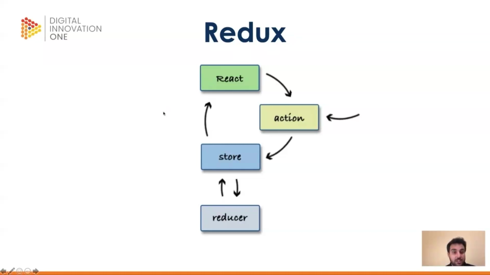
</p>

O fluxo de funcionamento do Redux  apresenta algumas mudanças estruturais importantes:

* A camada de View é representada pelo **React**.
* O sistema utiliza **Actions** que interagem com a **Store**.
* Um novo elemento central, o **Reducer**, é introduzido para gerenciar as mudanças de estado.
* Diferente do Flux tradicional, este esquema não utiliza um dispatcher.

<p align="center">

</p>

A arquitetura do Redux é fundamentada em três princípios básicos:

1. *Single source of truth**: Toda a aplicação possui uma única Store.
2. *State é read-only**: A árvore de estados é de apenas leitura.
3. *Mudanças são feitas com pure functions**: As alterações no estado devem ser realizadas através de funções puras, garantindo a imutabilidade.

<p align="center">
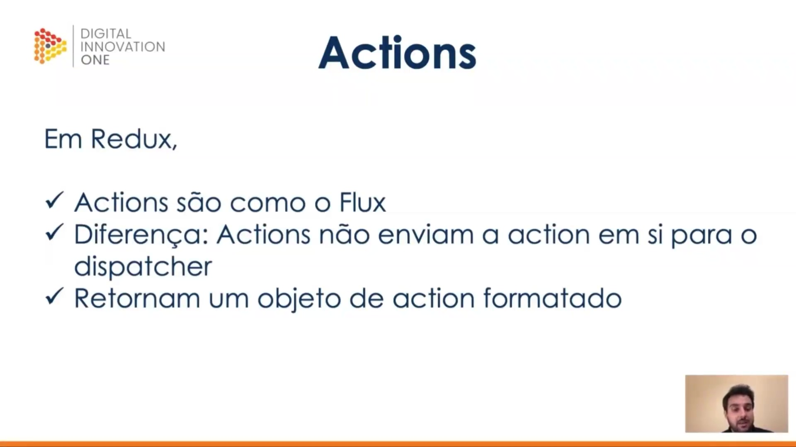
</p>

As **Actions** no Redux operam de forma similar ao Flux , mas possuem uma diferença crucial: elas não enviam a ação diretamente para um dispatcher. Em vez disso, a responsabilidade de uma Action é apenas retornar um objeto devidamente formatado que descreve a mudança pretendida.

<p align="center">
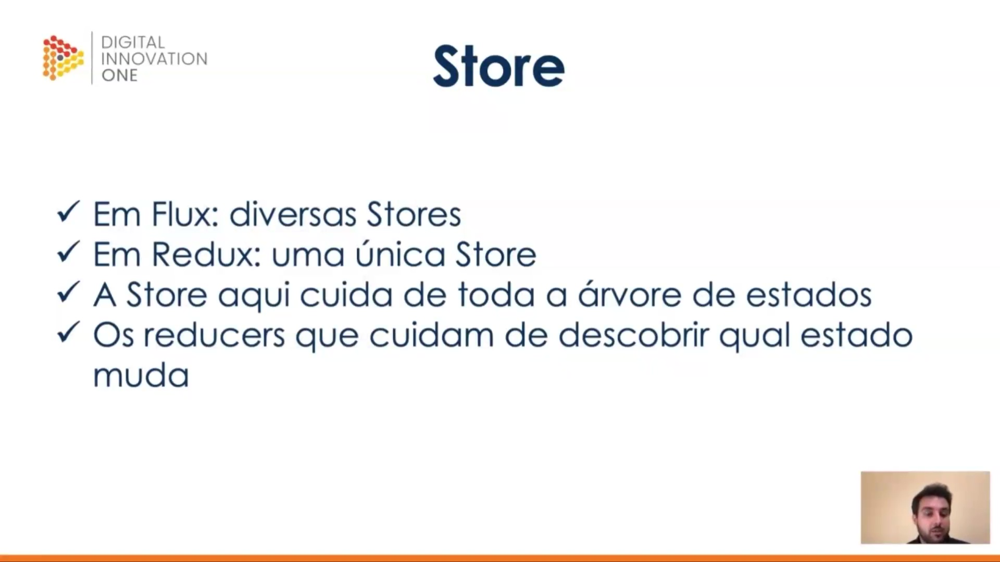
</p>

Diferente do Flux, onde podem existir diversas Stores , o Redux centraliza tudo em uma **única Store**. Esta Store é responsável por cuidar de toda a árvore de estados da aplicação, enquanto a lógica para identificar quais estados mudam é delegada aos reducers.

<p align="center">
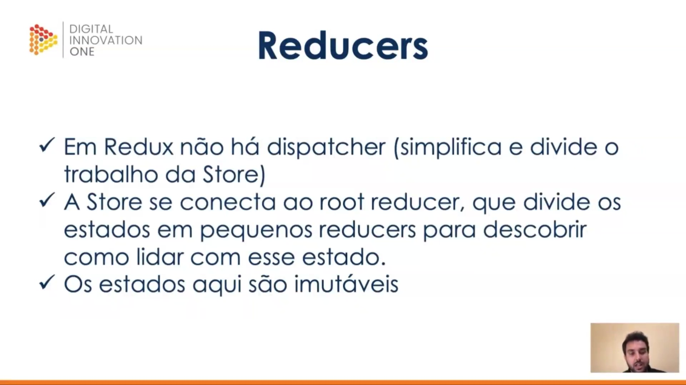
</p>

Os **Reducers** simplificam o fluxo ao eliminar a necessidade de um dispatcher. A Store conecta-se a um **root reducer**, que por sua vez divide a árvore de estados em reducers menores para lidar com partes específicas do estado. É fundamental notar que, neste processo, os estados permanecem imutáveis.

<p align="center">

</p>

Para integrar o React à Store do Redux na camada de View , utilizam-se três conceitos principais:

* **Provider**: Atua como um *wrapper* para facilitar a conexão dos componentes filhos com a store.
* **connect()**: Função que envolve um componente para que ele receba atualizações do estado.
* **selector**: Função utilizada para definir quais estados específicos do Redux devem ser passados como propriedades (props) para o componente.


## 🟩 Vídeo 08 - Aprenda a prática de como desenvolver código com React e Redux


<video width="60%" controls>
  <source src="000-Midia_e_Anexos/bootcamp_tqi_fullstack-modulo_04-curso.04-Video_08.webm" type="video/webm">
    Seu navegador não suporta vídeo HTML5.
</video>

Link do vídeo: https://web.dio.me/track/tqi-fullstack-developer/course/desenvolvimento-de-aplicacoes-para-internet-com-reactjs/learning/e33a3e3e-021f-4cc9-9b53-d7978165e10b?autoplay=1

O vídeo consiste em uma aula prática focada na integração das bibliotecas **Redux e React** para o gerenciamento de estado em aplicações web. O instrutor detalha a instalação de pacotes essenciais e o uso da extensão **Redux DevTools** para monitorar as alterações de dados em tempo real. Através de um exemplo de **contador**, explica-se o fluxo de funcionamento entre **actions**, que enviam mensagens de mudança, e **reducers**, que processam essas solicitações sem alterar o estado diretamente. O conteúdo aborda a configuração do **Store** no componente raiz e a utilização da função **connect** para vincular a lógica global à interface do usuário. Por fim, o material reforça a importância de disparar eventos via **dispatch** para manter a integridade das informações durante o ciclo de vida do software.

### Anotações

<p align="center">
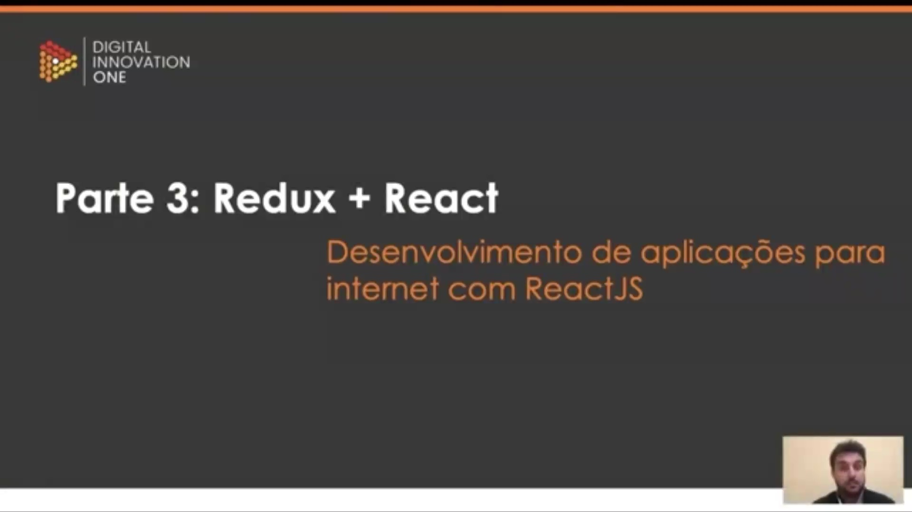
</p>

Esta etapa da aula foca na abordagem prática do desenvolvimento de aplicações para internet utilizando a integração entre **ReactJS e Redux**.

<p align="center">
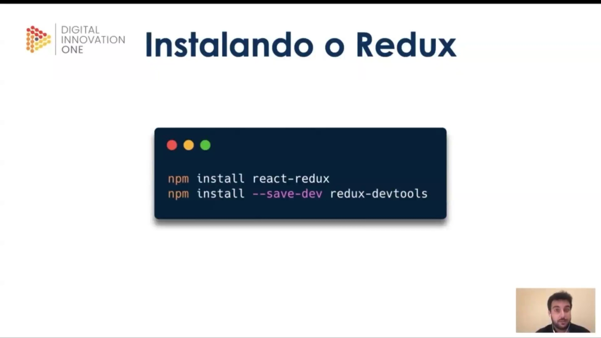
</p>

Para o funcionamento do Redux em uma aplicação React, é necessária a instalação de dois pacotes fundamentais: o **React Redux**, que é a implementação específica para o ecossistema React, e o **Redux DevTools**, utilizado para conectar a aplicação à extensão de monitoramento do navegador.

```bash
npm install react-redux
npm install --save-dev redux-devtools

```

<p align="center">
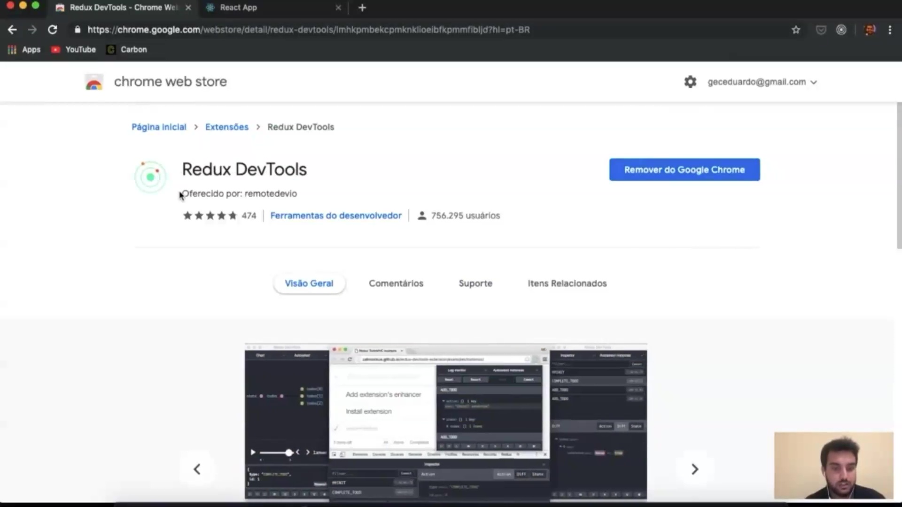
</p>

O **Redux DevTools** é uma extensão disponível na Chrome Web Store que atua como um monitor para a aplicação. Ele permite acompanhar em tempo real todas as alterações de estado que ocorrem na **store**.

<p align="center">
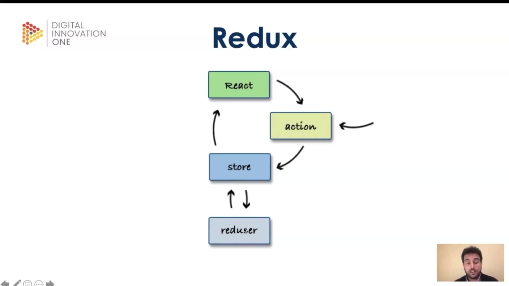
</p>

O fluxo de dados segue um ciclo definido: a view (React) dispara uma **action**, que leva uma mensagem para a **store**. A store utiliza **reducers** para processar a mudança e atualizar o estado, que é então refletido de volta na interface.

<p align="center">
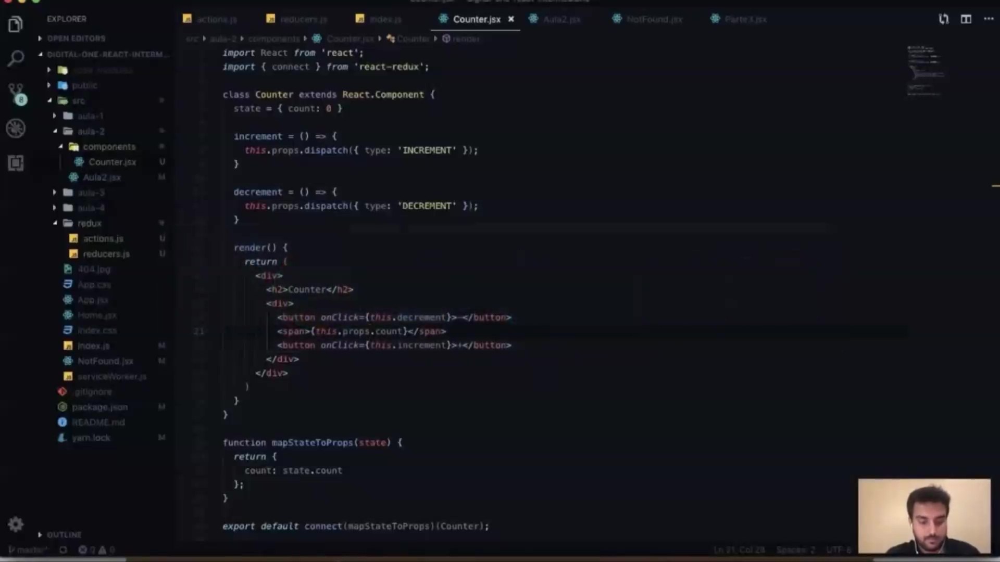
</p>

No componente de contador, a conexão com o Redux é feita através do método `connect`. As funções de incremento e decremento não alteram o estado local diretamente, mas utilizam o `dispatch` para enviar uma action para a store. A função `mapStateToProps` é responsável por mapear o estado global da store para as propriedades (props) do componente.

```javascript
import React from 'react';
import { connect } from 'react-redux';

class Counter extends React.Component {
  increment = () => {
    this.props.dispatch({ type: 'INCREMENT' });
  }

  decrement = () => {
    this.props.dispatch({ type: 'DECREMENT' });
  }

  render() {
    return (
      <div>
        <h2>Counter</h2>
        <div>
          <button onClick={this.decrement}>-</button>
          <span>{this.props.count}</span>
          <button onClick={this.increment}>+</button>
        </div>
      </div>
    );
  }
}

function mapStateToProps(state) {
  return {
    count: state.count
  };
}

export default connect(mapStateToProps)(Counter);

```

<p align="center">
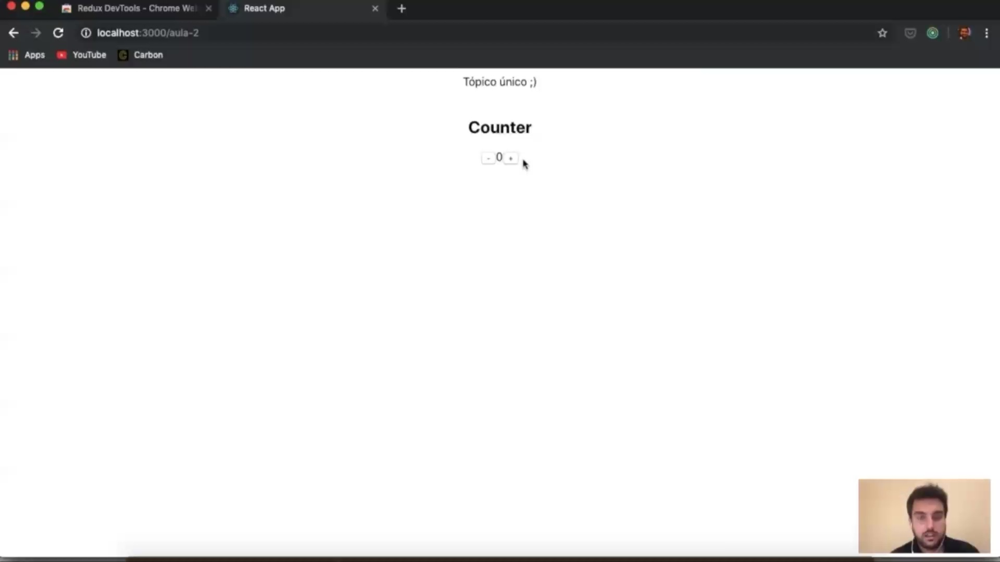
</p>

A interface da aplicação apresenta um contador simples onde o valor exibido é gerenciado pelo Redux. Cada clique nos botões de "+" ou "-" gera um evento que será processado pela store.

<p align="center">
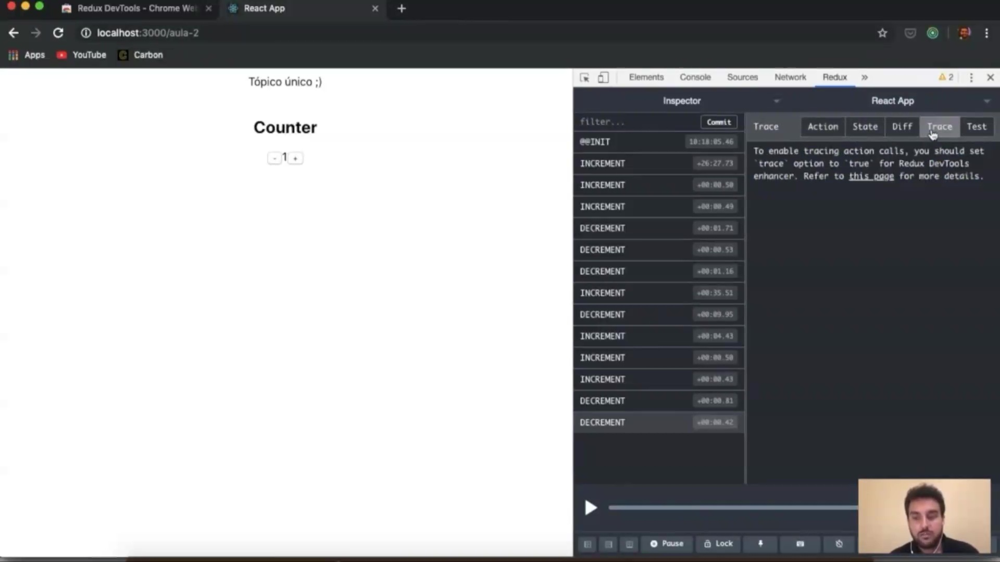
</p>

Através do inspetor do navegador, o Redux DevTools exibe o histórico de ações disparadas, como `INCREMENT` e `DECREMENT`. É possível visualizar o "Action", o "State" e o "Diff", que mostra exatamente o que mudou entre o estado anterior e o atual da aplicação.

<p align="center">

</p>

As **actions** são as mensagens enviadas para a aplicação. Neste arquivo, definimos constantes do tipo string para representar as ações de incrementar e decrementar, garantindo que a comunicação entre componentes e reducers seja padronizada.

```javascript
export const INCREMENT = 'INCREMENT';
export const DECREMENT = 'DECREMENT';

```

<p align="center">
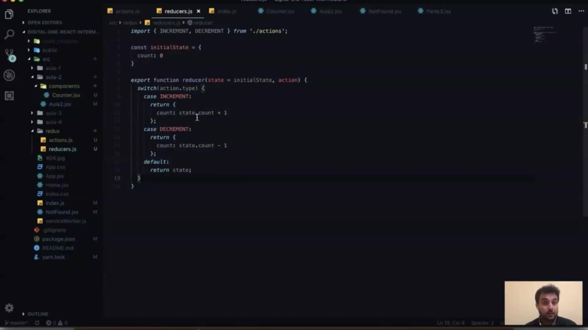
</p>

O **reducer** determina como o estado deve ser alterado com base na action recebida. Ele define um `initialState` (neste caso, começando em zero) e utiliza uma estrutura `switch` para retornar um novo estado incrementado ou decrementado. O reducer nunca altera o estado diretamente, ele sempre retorna um novo valor.

```javascript
import { INCREMENT, DECREMENT } from './actions';

const initialState = {
  count: 0
};

export function reducer(state = initialState, action) {
  switch (action.type) {
    case INCREMENT:
      return {
        count: state.count + 1
      };
    case DECREMENT:
      return {
        count: state.count - 1
      };
    default:
      return state;
  }
}

```

<p align="center">
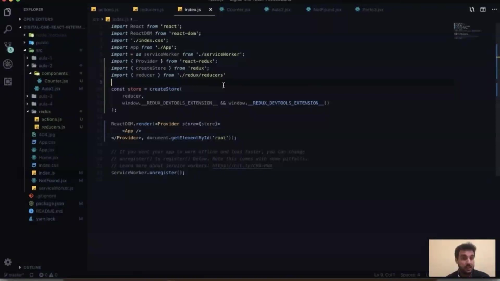
</p>

No arquivo `index.js`, que é o componente raiz, configuramos a criação da store através do `createStore`. Aqui também é feita a conexão com a extensão Redux DevTools. O componente `Provider` envolve a aplicação, disponibilizando a store única para todos os componentes.

```javascript
import React from 'react';
import ReactDOM from 'react-dom';
import './index.css';
import App from './App';
import * as serviceWorker from './serviceWorker';
import { Provider } from 'react-redux';
import { createStore } from 'redux';
import { reducer } from './redux/reducers';

const store = createStore(
  reducer,
  window.__REDUX_DEVTOOLS_EXTENSION__ && window.__REDUX_DEVTOOLS_EXTENSION__()
);

ReactDOM.render(
  <Provider store={store}>
    <App />
  </Provider>,
  document.getElementById('root')
);

serviceWorker.unregister();

```      

# Parte 3 - Comunicação avançada entre aplicações

## 🟩 Vídeo 09 - Introdução da aula

<video width="60%" controls>
  <source src="000-Midia_e_Anexos/bootcamp_tqi_fullstack-modulo_04-curso.04-Video_09.webm" type="video/webm">
    Seu navegador não suporta vídeo HTML5.
</video>

Link do vídeo: https://web.dio.me/track/tqi-fullstack-developer/course/desenvolvimento-de-aplicacoes-para-internet-com-reactjs/learning/e606a7eb-aadf-4c59-9b47-81b02f0f0100?autoplay=1

Esta terceira aula de **React intermediário** foca no desenvolvimento de competências de **comunicação avançada** entre aplicações e servidores. O conteúdo explora a integração de **APIs REST** utilizando as bibliotecas mais relevantes do ecossistema atual. Os alunos aprenderão conceitos fundamentais de **imutabilidade** e como aplicá-los na gestão de estado global através do **Redux**. Além disso, o instrutor aborda o uso de **middlewares** para otimizar fluxos de dados complexos entre a interface e o backend. Para acompanhar o progresso, é indispensável possuir o ambiente de desenvolvimento configurado e ter concluído os módulos anteriores do curso.

### Anotações

<p align="center">

</p>

Esta aula aborda o desenvolvimento de aplicações para internet com **ReactJS**, focando especificamente em **comunicação avançada entre aplicações**. O conteúdo explora tanto a integração da aplicação com servidores externos quanto a intercomunicação eficiente entre componentes utilizando **Redux**.

<p align="center">
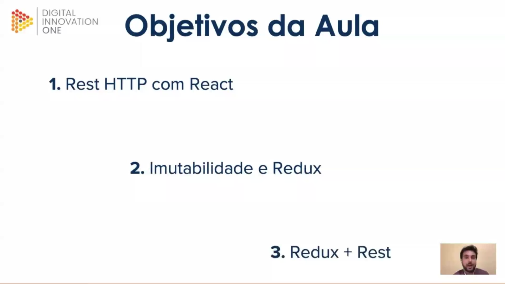
</p>

Os objetivos estabelecidos para esta etapa do aprendizado são:

* **Rest HTTP com React**: Estudo das principais bibliotecas utilizadas para comunicação com APIs.
* **Imutabilidade e Redux**: Compreensão dos conceitos de imutabilidade e sua importância fundamental dentro do ecossistema Redux.
* **Redux + Rest**: Integração de chamadas assíncronas com o estado global, abordando o uso de **Redux middlewares**.

<p align="center">
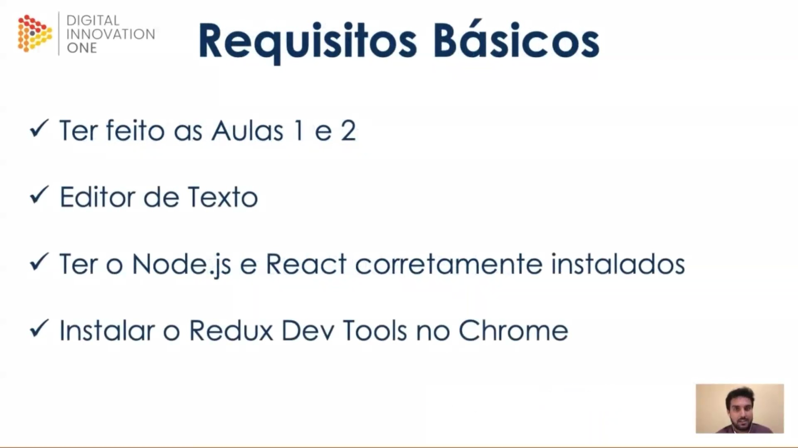
</p>

Para o acompanhamento prático da aula, são necessários os seguintes requisitos:

* Conclusão prévia das aulas 1 e 2 do curso de React intermediário.
* Ambiente de desenvolvimento configurado com um editor de texto, **Node.js** e **React** instalados.
* Instalação da extensão **Redux DevTools** no navegador Google Chrome para depuração do estado da aplicação.      

## 🟩 Vídeo 10 - Rest HTTP com React

<video width="60%" controls>
  <source src="000-Midia_e_Anexos/bootcamp_tqi_fullstack-modulo_04-curso.04-Video_10.webm" type="video/webm">
    Seu navegador não suporta vídeo HTML5.
</video>

Link do vídeo: https://web.dio.me/track/tqi-fullstack-developer/course/desenvolvimento-de-aplicacoes-para-internet-com-reactjs/learning/a94f6436-850b-4a4f-9e4b-2ba7d77fcb39?autoplay=1 

O vídeo consiste em uma aula técnica sobre a integração de **APIs HTTP** em aplicações **React**, detalhando os fundamentos da arquitetura **REST**. O instrutor explica os principais métodos de comunicação, como **GET**, **POST**, **DELETE** e **PUT**, utilizando exemplos práticos com uma API de cientistas brasileiras. São comparadas duas abordagens principais: a nativa **Fetch API**, que exige o tratamento manual de promessas e conversão de dados, e a biblioteca **Axios**, destacada por sua sintaxe compacta e suporte a navegadores antigos. O conteúdo também aborda a implementação prática dentro do ciclo de vida de **componentes React**, recomendando o uso de **Hooks** ou do método `componentDidMount`. Por fim, o material ensina como monitorar essas requisições através das ferramentas de desenvolvedor do navegador para validar o sucesso das operações.

### Anotações

<p align="center">

</p>

Nesta aula, exploraremos os fundamentos de **Rest HTTP com React**, focando no desenvolvimento de aplicações para internet utilizando o ecossistema ReactJS para realizar comunicações eficientes com servidores.

<p align="center">
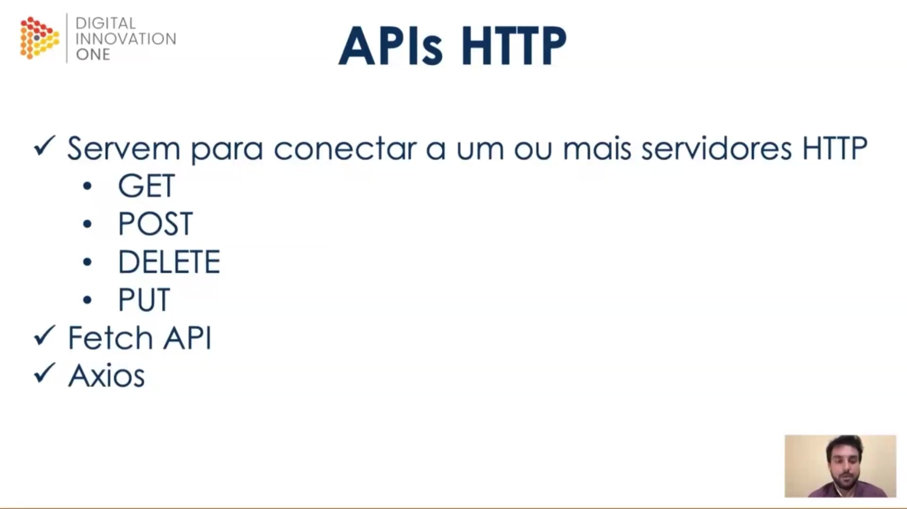
</p>

As **APIs HTTP** atuam como a ponte de conexão entre uma aplicação frontend e um ou mais servidores. Para manipular dados através dessas APIs, utilizamos os métodos fundamentais do protocolo HTTP:

* **GET**: Utilizado para a listagem e recuperação de dados.
* **POST**: Destinado à criação de novos registros.
* **DELETE**: Responsável pela remoção de dados.
* **PUT**: Empregado para a alteração ou atualização de informações existentes.

Abordaremos duas formas principais de implementar essas requisições: a **Fetch API**, que é nativa, e a biblioteca **Axios**.

<p align="center">
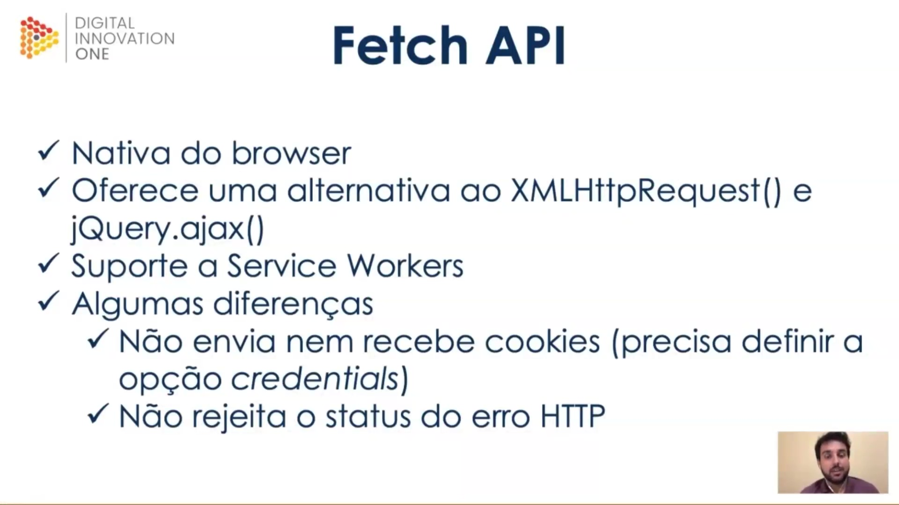
</p>

A **Fetch API** é uma interface nativa moderna dos navegadores para manipulação de requisições HTTP, servindo como uma alternativa atual ao antigo `XMLHttpRequest()` e ao `jQuery.ajax()`. Entre suas características principais, destaca-se o suporte a **Service Workers**.

Contudo, ela possui comportamentos específicos que o desenvolvedor deve observar:

* **Cookies**: Por padrão, ela não envia nem recebe cookies, sendo necessário configurar manualmente a opção `credentials`.
* **Tratamento de Erros**: A Fetch API não rejeita a Promise automaticamente em caso de erros de status HTTP (como 404 ou 500); a rejeição só ocorre em falhas de rede ou interrupções de conexão.

<p align="center">
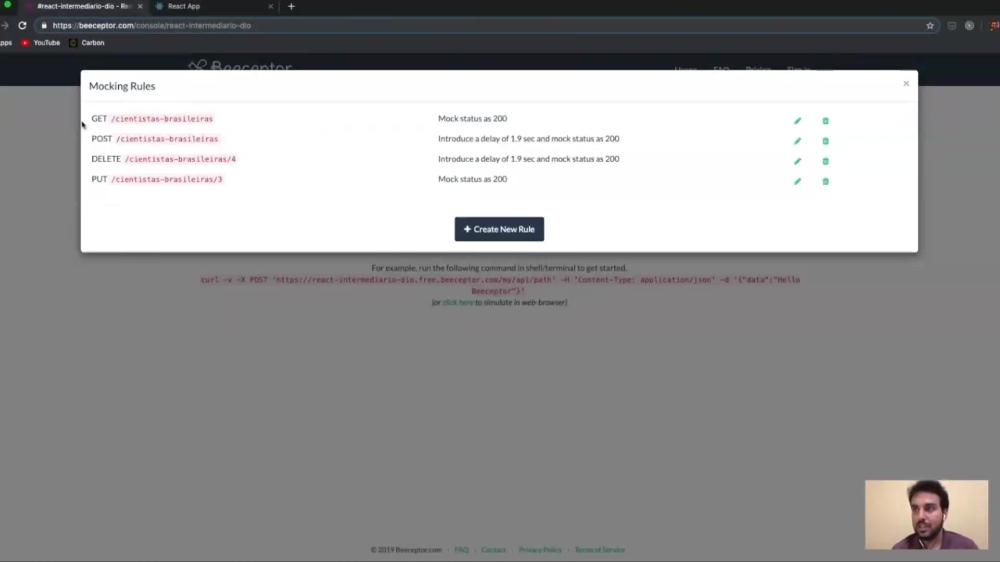
</p>

Para exemplificar o uso dessas ferramentas, utilizaremos o **Beeceptor**, um serviço que permite a criação de APIs de mocks. Configuramos endpoints específicos para simular uma base de dados de **cientistas brasileiras**, permitindo testar operações de GET, POST, DELETE e PUT de forma prática.

<p align="center">
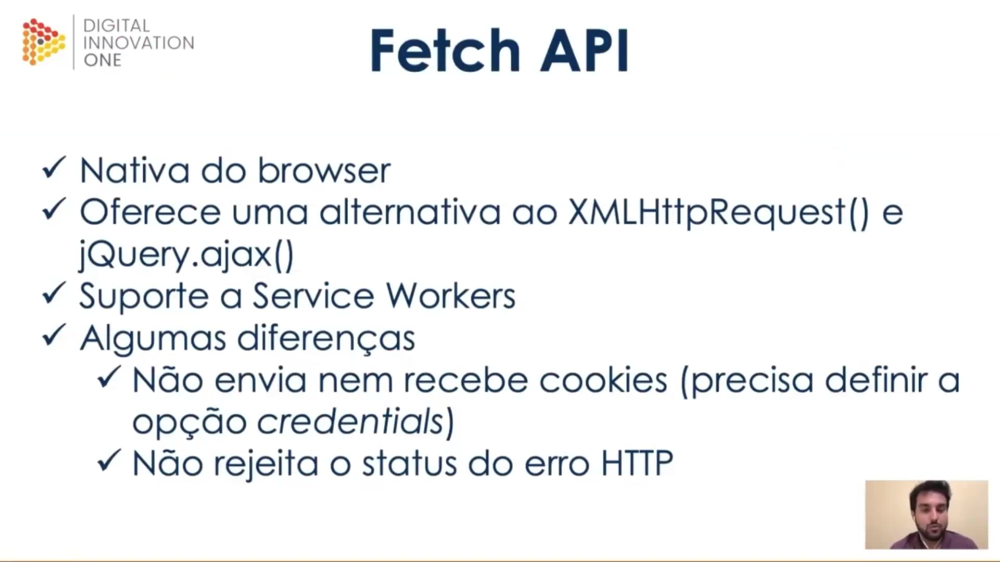
</p>

Reforçando as características da Fetch API, é importante lembrar que, embora seja uma especificação robusta e nativa, sua compatibilidade em navegadores muito antigos pode exigir o uso de bibliotecas auxiliares, como o **Node Fetch**, para garantir que o suporte a Service Workers e a nova estrutura de requisições funcionem corretamente em diversos ambientes.

<p align="center">
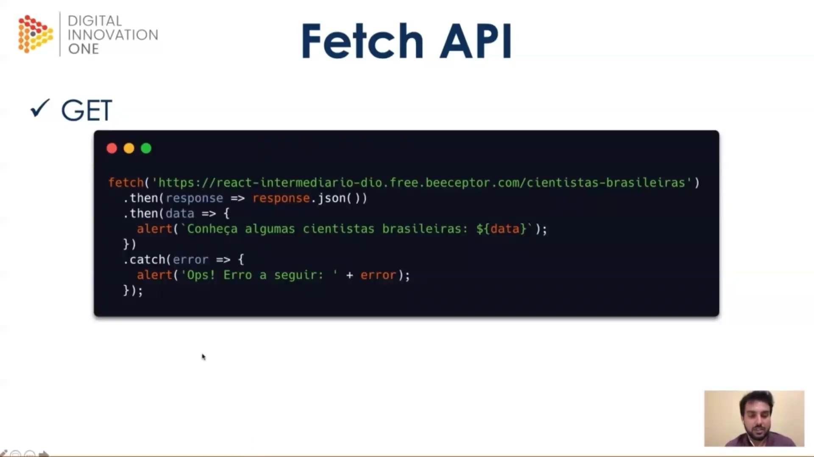
</p>

Para realizar uma operação de **GET** com Fetch API, passamos a URL do endpoint. Como o retorno inicial é uma Promise pendente, precisamos utilizar o primeiro `.then()` para converter a resposta bruta em **JSON** antes de acessar os dados.

```javascript
fetch('https://react-intermediario-dio.free.beeceptor.com/cientistas-brasileiras')
  .then(response => response.json())
  .then(data => {
    alert(`Conheça algumas cientistas brasileiras: ${data}`);
  })
  .catch(error => {
    alert('Ops! Erro a seguir: ' + error);
  });

```

<p align="center">
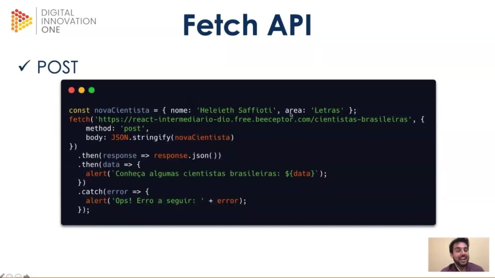
</p>

Ao realizar um **POST** para cadastrar um novo registro, devemos passar um objeto de configuração como segundo argumento do `fetch`. Neste objeto, definimos o `method` como 'post' e o `body`, que deve conter o dado convertido em string via `JSON.stringify()`.

```javascript
const novaCientista = { nome: 'Heleieth Saffioti', area: 'Letras' };

fetch('https://react-intermediario-dio.free.beeceptor.com/cientistas-brasileiras', {
  method: 'post',
  body: JSON.stringify(novaCientista)
})
.then(response => response.json())
.then(data => {
  alert(`Conheça algumas cientistas brasileiras: ${data}`);
})
.catch(error => {
  alert('Ops! Erro a seguir: ' + error);
});

```

<p align="center">
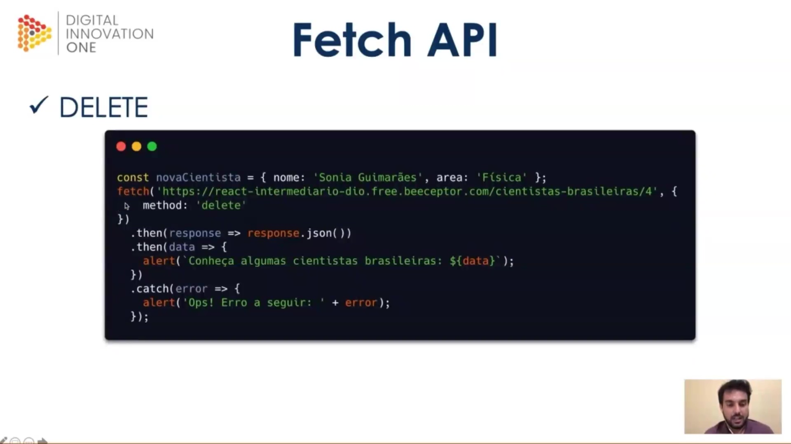
</p>

Para a operação de **DELETE**, a boa prática recomenda passar o identificador (ID ou índice) do recurso diretamente na URL. O método deve ser explicitamente definido como 'delete' no objeto de configuração.

```javascript
fetch('https://react-intermediario-dio.free.beeceptor.com/cientistas-brasileiras/4', {
  method: 'delete'
})
.then(response => response.json())
.then(data => {
  alert(`Conheça algumas cientistas brasileiras: ${data}`);
})
.catch(error => {
  alert('Ops! Erro a seguir: ' + error);
});

```

<p align="center">
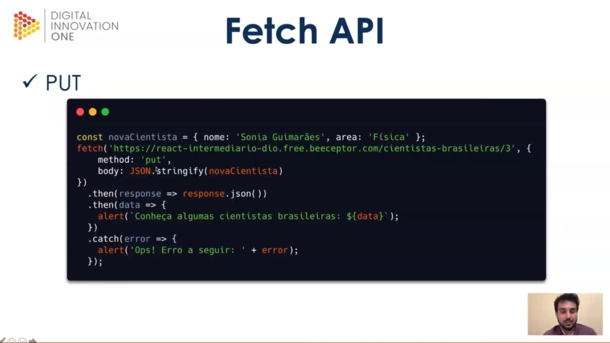
</p>

A atualização de dados via **PUT** combina a identificação do registro na URL com o envio do novo estado do objeto no corpo da requisição, seguindo a mesma lógica de conversão para string JSON utilizada no POST.

```javascript
const novaCientista = { nome: 'Sonia Guimarães', area: 'Física' };

fetch('https://react-intermediario-dio.free.beeceptor.com/cientistas-brasileiras/3', {
  method: 'put',
  body: JSON.stringify(novaCientista)
})
.then(response => response.json())
.then(data => {
  alert(`Conheça algumas cientistas brasileiras: ${data}`);
})
.catch(error => {
  alert('Ops! Erro a seguir: ' + error);
});

```

<p align="center">
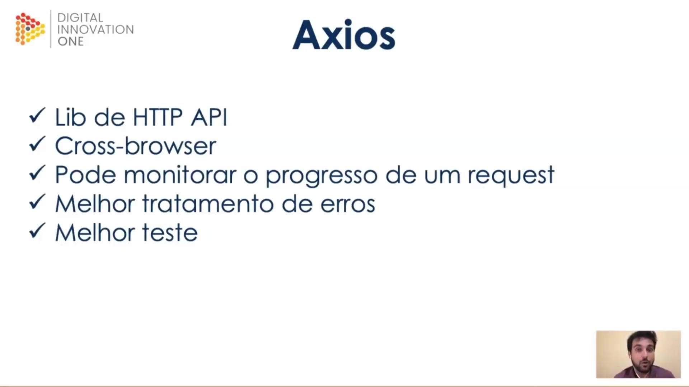
</p>

O **Axios** é uma biblioteca de requisições HTTP amplamente recomendada para projetos React. Baseada em `XMLHttpRequest`, ela oferece vantagens como:

* Funcionamento **Cross-browser**.
* Capacidade de monitorar o progresso de requisições.
* Tratamento de erros mais intuitivo e simplificado.
* Facilidade para a escrita de testes automatizados.

<p align="center">

</p>

Diferente da Fetch API, o Axios não é nativo do navegador e precisa ser instalado no projeto através de um gerenciador de pacotes.

```bash
yarn add axios

```

<p align="center">
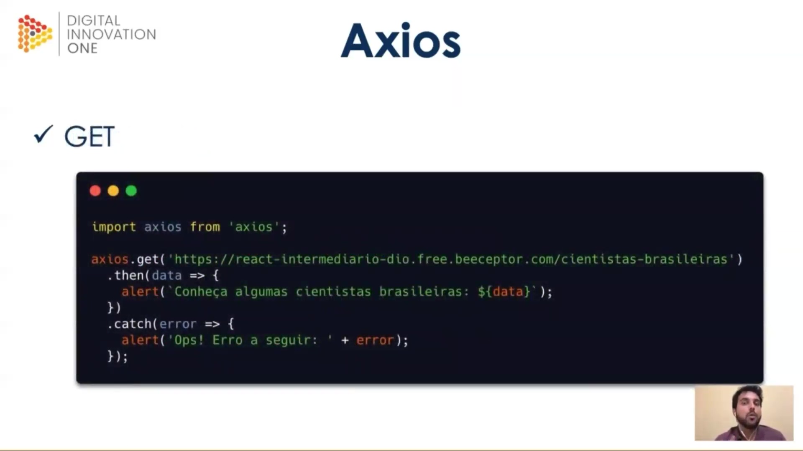
</p>

O uso do Axios simplifica o código, pois ele já entrega o dado processado no objeto de resposta, eliminando a etapa manual de conversão para JSON (o `.json()`) necessária no Fetch.

```javascript
import axios from 'axios';

axios.get('https://react-intermediario-dio.free.beeceptor.com/cientistas-brasileiras')
  .then(response => {
    alert(`Conheça algumas cientistas brasileiras: ${response.data}`);
  })
  .catch(error => {
    alert('Ops! Erro a seguir: ' + error);
  });

```

<p align="center">
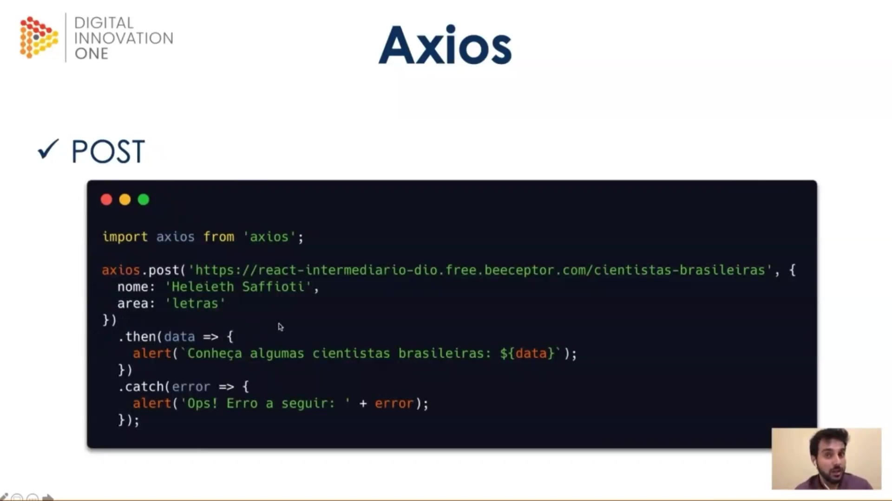
</p>

No **POST** com Axios, o código torna-se mais compacto. Passamos os dados diretamente como o segundo argumento da função, sem a necessidade de chamar `JSON.stringify`, pois a biblioteca gerencia essa conversão internamente.

```javascript
import axios from 'axios';

axios.post('https://react-intermediario-dio.free.beeceptor.com/cientistas-brasileiras', {
  nome: 'Heleieth Saffioti',
  area: 'Letras'
})
.then(response => {
  alert(`Conheça algumas cientistas brasileiras: ${response.data}`);
})
.catch(error => {
  alert('Ops! Erro a seguir: ' + error);
});

```

<p align="center">
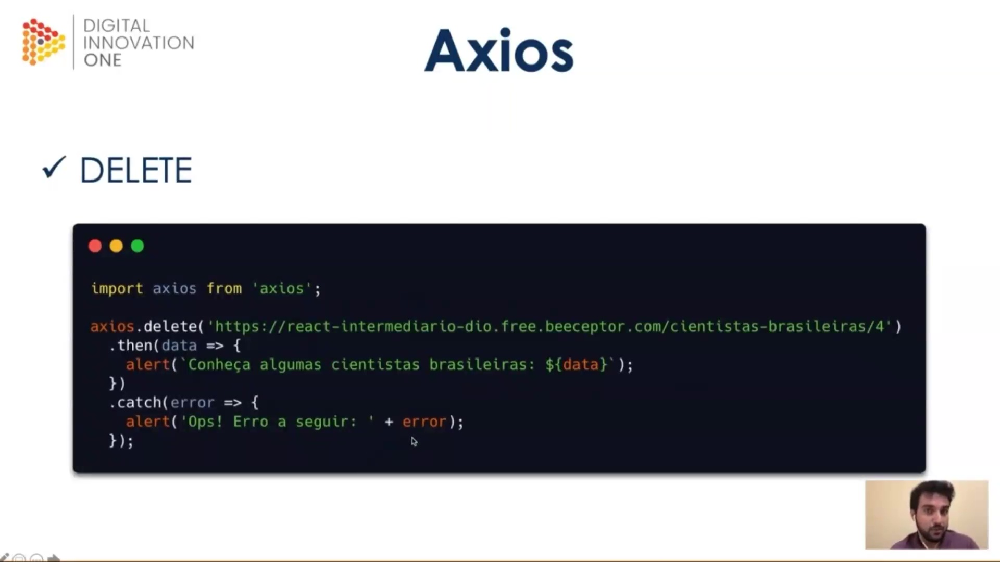
</p>

A operação de **DELETE** segue a mesma simplicidade, bastando invocar o método correspondente passando a URL com o identificador do recurso que se deseja remover.

```javascript
import axios from 'axios';

axios.delete('https://react-intermediario-dio.free.beeceptor.com/cientistas-brasileiras/4')
  .then(response => {
    alert(`Conheça algumas cientistas brasileiras: ${response.data}`);
  })
  .catch(error => {
    alert('Ops! Erro a seguir: ' + error);
  });

```

<p align="center">
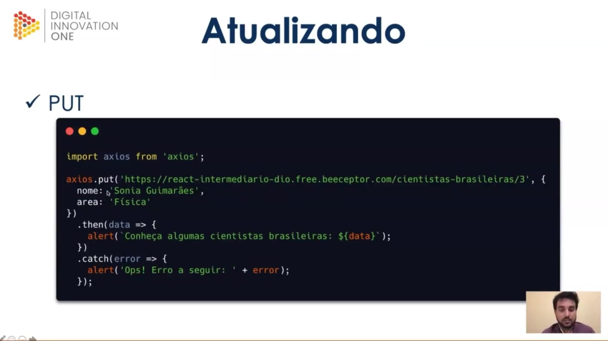
</p>

Para o **PUT**, o Axios recebe a URL (com o ID) e o objeto com as novas informações, tratando o sucesso ou erro da atualização de forma direta.

```javascript
import axios from 'axios';

axios.put('https://react-intermediario-dio.free.beeceptor.com/cientistas-brasileiras/3', {
  nome: 'Sonia Guimarães',
  area: 'Física'
})
.then(response => {
  alert(`Conheça algumas cientistas brasileiras: ${response.data}`);
})
.catch(error => {
  alert('Ops! Erro a seguir: ' + error);
});

```

<p align="center">
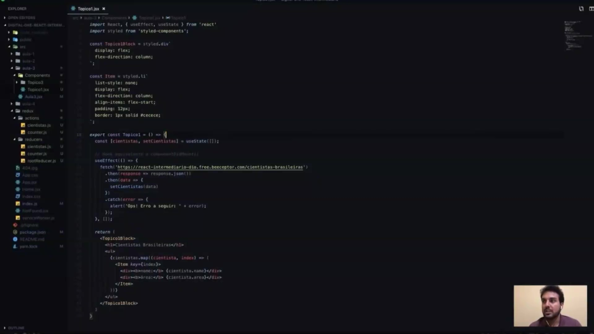
</p>

A integração com o React ocorre através de **Hooks**. Utilizamos o `useState` para gerenciar a lista de cientistas e o `useEffect` para disparar a requisição assim que o componente é montado. Em componentes de classe, essa lógica ficaria no `componentDidMount`; é importante evitar o `componentWillMount`, pois ele foi descontinuado e pode causar inconsistências.

<p align="center">
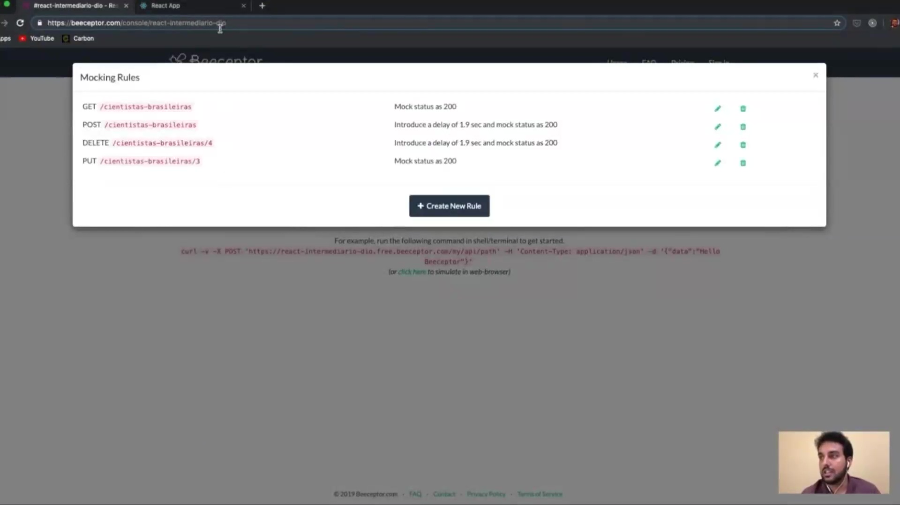
</p>

No painel do Beeceptor, podemos visualizar as regras de mock configuradas. Cada endpoint (GET, POST, DELETE, PUT) está associado a uma resposta simulada e, em alguns casos, a atrasos (delays) específicos para testar o comportamento da interface durante o carregamento.

<p align="center">
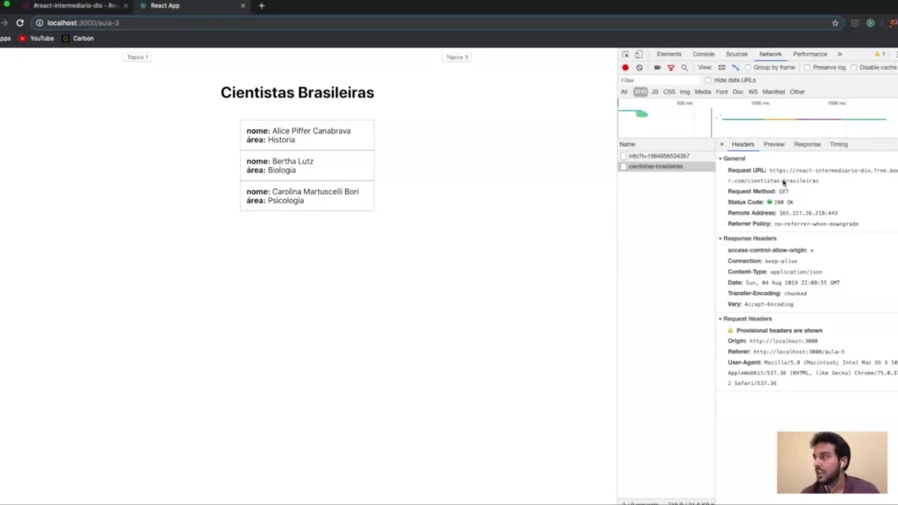
</p>

Ao testar a aplicação no navegador, a aba **Network** das ferramentas do desenvolvedor permite confirmar o sucesso da operação. Um status **200 OK** indica que a requisição foi concluída, e na aba **Preview**, podemos inspecionar a estrutura do JSON retornado pela API, garantindo que os dados estão prontos para serem mapeados e exibidos no frontend.      


## 🟩 Vídeo 11 - Imutabilidade e Redux

<video width="60%" controls>
  <source src="000-Midia_e_Anexos/bootcamp_tqi_fullstack-modulo_04-curso.04-Video_11.webm" type="video/webm">
    Seu navegador não suporta vídeo HTML5.
</video>

Link do vídeo: https://web.dio.me/track/tqi-fullstack-developer/course/desenvolvimento-de-aplicacoes-para-internet-com-reactjs/learning/fd62eb8e-a109-4f7c-9f48-30c56d0c899f?autoplay=1

O vídeo aborda a importância da **imutabilidade** no desenvolvimento com **React** e **Redux**, destacando como essa prática otimiza a **performance** e facilita o **debugging**. O texto explica que, ao tratar coleções como unidades inalteráveis, o sistema utiliza **comparações rasas** (shallow comparisons) para detectar mudanças de estado de forma mais rápida e eficiente. São apresentados métodos práticos para garantir a imutabilidade, como o uso de **spread operators**, **Pure Components** e bibliotecas especializadas como a **Immutable.js**. Além disso, o conteúdo detalha como o Redux depende estritamente desses conceitos em seus **reducers** e na conexão com a **store** para disparar renderizações precisas. Por fim, o autor alerta sobre erros comuns ao tentar mutar dados diretamente, o que impede a atualização correta da interface.

### Anotações

<p align="center">

</p>

Esta segunda parte da aula foca na relação entre imutabilidade e Redux, explorando como esses conceitos são aplicados no desenvolvimento com ReactJS para garantir consistência de dados e performance.

<p align="center">

</p>

A imutabilidade é regida por três princípios fundamentais:

1. Uma coleção, uma vez criada, não pode ser alterada.
2. Novas coleções são geradas a partir de estados anteriores mediante mutações controladas (setters).
3. Novas estruturas reaproveitam o máximo possível da estrutura original (persistência), o que reduz a necessidade de cópias completas e otimiza o desempenho.

<p align="center">

</p>

Adotar a imutabilidade traz benefícios claros para o ciclo de desenvolvimento:

* **Performance**: Evita o processamento excessivo de mutações diretas.
* **Programação Simples**: Trabalhar com estados fixos torna o fluxo de dados previsível.
* **Debugging**: Facilita a detecção de mudanças através de "shallow comparisons" (comparações rasas), onde verifica-se apenas a referência da memória em vez de percorrer todo o objeto.

<p align="center">

</p>

No ecossistema React, a performance está intrinsecamente ligada ao uso de dados imutáveis. O desenvolvedor pode controlar o ciclo de renderização utilizando métodos como `shouldComponentUpdate` ou a classe `React.PureComponent` para evitar atualizações desnecessárias na interface.

<p align="center">
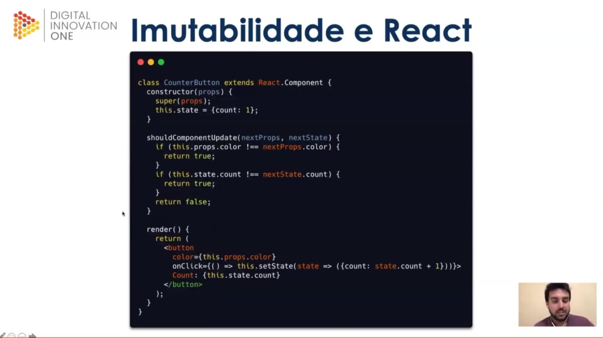
</p>

O código abaixo ilustra o uso manual do `shouldComponentUpdate`. O componente `CounterButton` só executará o processo de renderização se houver uma alteração efetiva na cor (via props) ou no contador (via state). Caso contrário, ele retorna `false`, economizando recursos de processamento.

```javascript
class CounterButton extends React.Component {
  constructor(props) {
    super(props);
    this.state = {count: 1};
  }

  shouldComponentUpdate(nextProps, nextState) {
    if (this.props.color !== nextProps.color) {
      return true;
    }
    if (this.state.count !== nextState.count) {
      return true;
    }
    return false;
  }

  render() {
    return (
      <button
        color={this.props.color}
        onClick={() => this.setState(state => ({count: state.count + 1}))}>
        Count: {this.state.count}
      </button>
    );
  }
}

```

<p align="center">
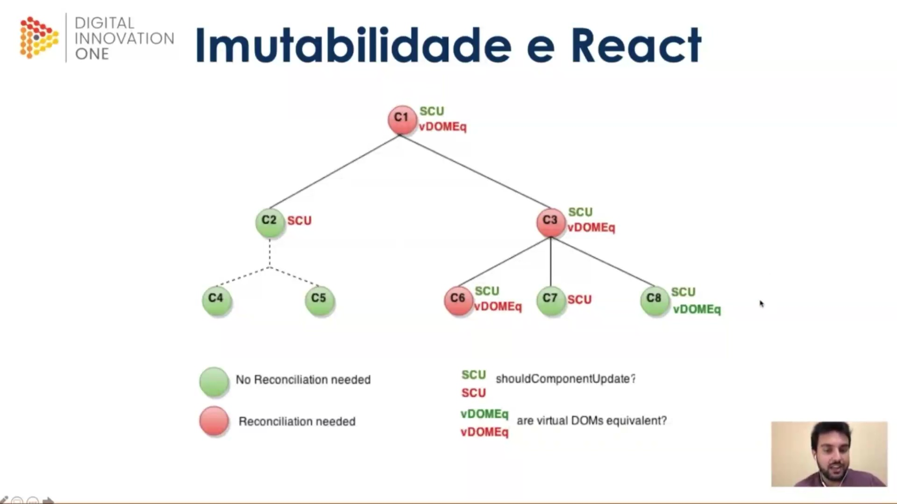
</p>

Este diagrama demonstra como o React decide o que renderizar. Através do `shouldComponentUpdate` (SCU) e da verificação do Virtual DOM (VDOM), o framework identifica componentes cujos dados não mudaram (em verde) e evita processá-los, focando apenas naqueles que realmente precisam de atualização (em vermelho).

<p align="center">
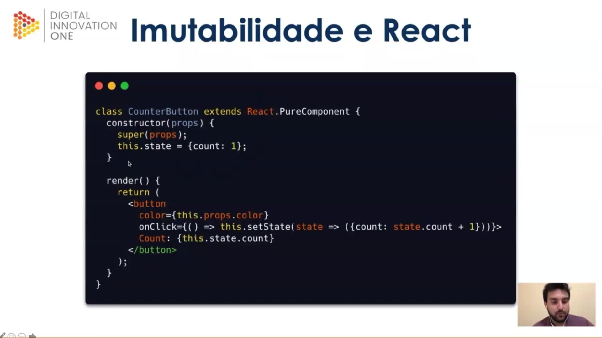
</p>

O `React.PureComponent` simplifica a lógica de performance ao implementar automaticamente uma comparação rasa (shallow comparison) tanto em `props` quanto em `state`. Isso elimina a necessidade de escrever manualmente o método `shouldComponentUpdate` para casos simples, mantendo o componente eficiente.

```javascript
class CounterButton extends React.PureComponent {
  constructor(props) {
    super(props);
    this.state = {count: 1};
  }

  render() {
    return (
      <button
        color={this.props.color}
        onClick={() => this.setState(state => ({count: state.count + 1}))}>
        Count: {this.state.count}
      </button>
    );
  }
}

```

<p align="center">
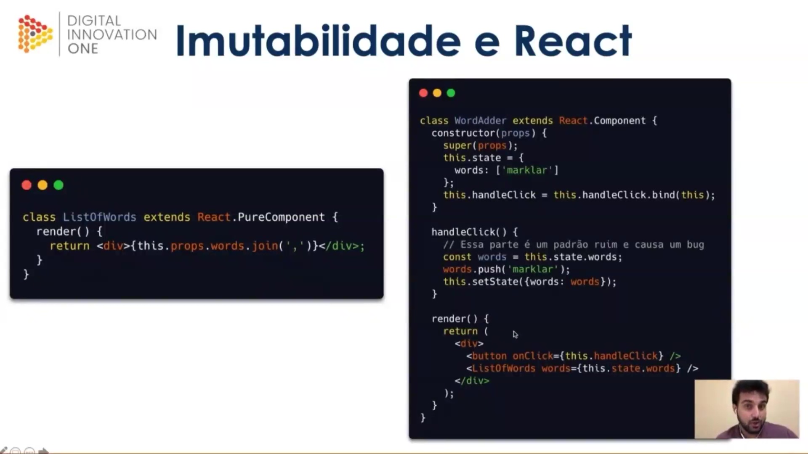
</p>

É fundamental entender que o `PureComponent` pode não funcionar se os dados forem mutados diretamente. No exemplo abaixo, o método `handleClick` usa `.push()` no array original. Como a referência de memória de `words` permanece a mesma, o React entende que não houve mudança, impedindo a atualização da interface — um erro comum de desenvolvimento.

```javascript
class ListOfWords extends React.PureComponent {
  render() {
    return <div>{this.props.words.join(',')}</div>;
  }
}

class WordAdder extends React.Component {
  constructor(props) {
    super(props);
    this.state = {
      words: ['marklar']
    };
    this.handleClick = this.handleClick.bind(this);
  }

  handleClick() {
    // Essa parte é um padrão ruim e causa um bug
    const words = this.state.words;
    words.push('marklar');
    this.setState({words: words});
  }

  render() {
    return (
      <div>
        <button onClick={this.handleClick} />
        <ListOfWords words={this.state.words} />
      </div>
    );
  }
}

```

<p align="center">

</p>

O problema central na mutação de dados com `PureComponent` é que ele compara apenas as referências. Se você altera o conteúdo de um objeto mas mantém a mesma referência, a comparação indicará que os valores são "iguais", resultando em falhas na renderização.

<p align="center">
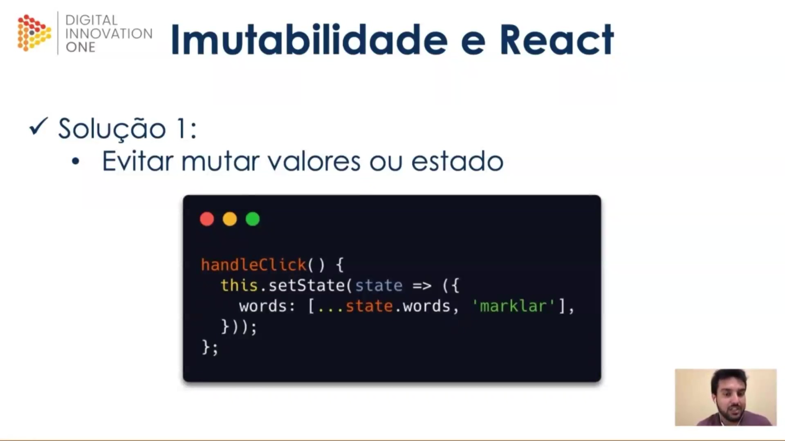
</p>

Para corrigir o bug de renderização, deve-se utilizar uma abordagem imutável. No código a seguir, o operador *spread* (`...`) cria uma nova instância do array contendo os dados anteriores mais o novo elemento. Como a referência agora é nova, o React detecta a mudança e atualiza o componente corretamente.

```javascript
handleClick() {
  this.setState(state => ({
    words: [...state.words, 'marklar'],
  }));
};

```

<p align="center">
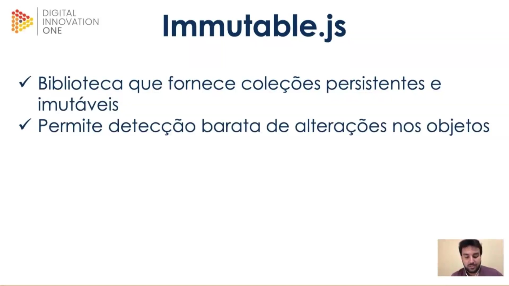
</p>

Este exemplo simples em JavaScript puro demonstra o perigo da mutação por referência. Ao atribuir `x` a `y`, ambos apontam para o mesmo local na memória. Modificar `y.foo` altera automaticamente `x.foo`, o que pode causar efeitos colaterais imprevisíveis em aplicações que dependem de estados estáveis.

```javascript
const x = { foo: 'bar' };
const y = x;
y.foo = 'baz';
console.log(x === y); // true

```

<p align="center">
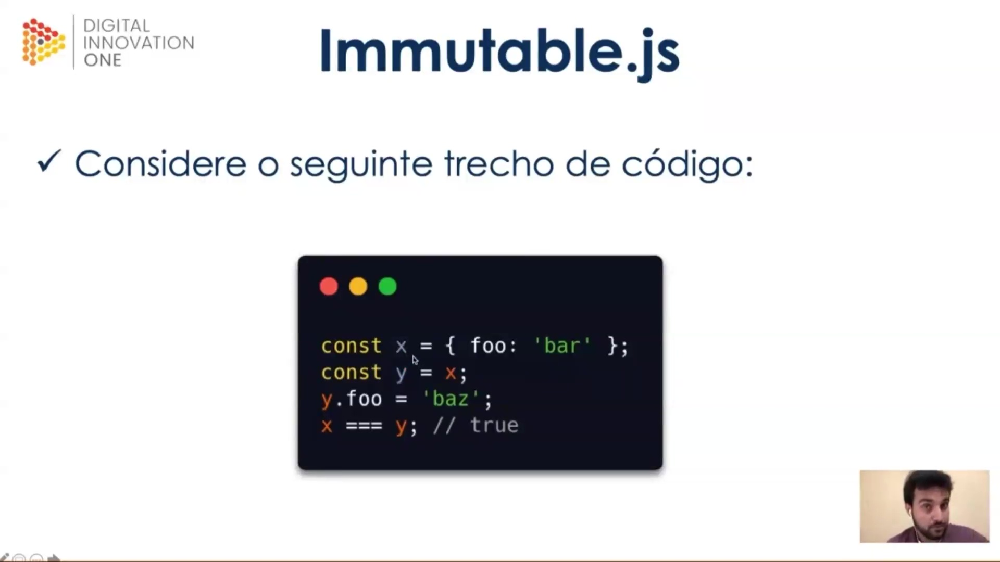
</p>

Para gerenciar dados de forma estritamente imutável, recomenda-se o uso de bibliotecas como **Immutable.js**. Ela provê estruturas de dados que não podem ser modificadas após a criação, garantindo que qualquer alteração resulte em uma nova referência de forma performática.

<p align="center">
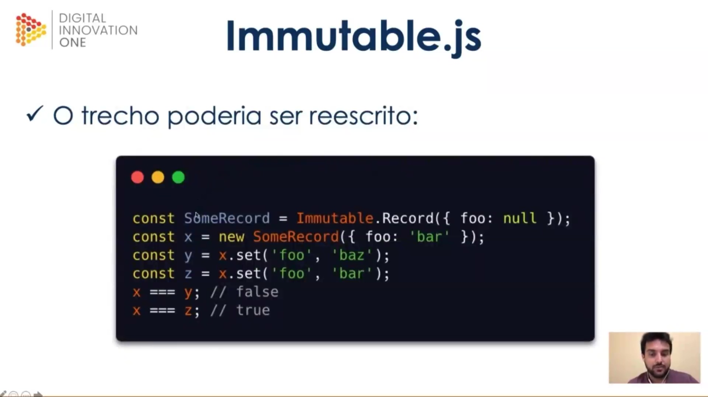
</p>

Utilizando o `Record` do Immutable.js, vemos que a operação de `set` gera uma nova cópia. No código abaixo, `x === y` é falso porque as referências são distintas após a mudança de valor, enquanto `x === z` é verdadeiro, pois o Immutable.js reconhece que o estado final é idêntico ao original e mantém a eficiência.

```javascript
const { Record } = require('immutable');
const sumRecord = Record({ foo: null });
const x = new sumRecord({ foo: 'bar' });
const y = x.set('foo', 'BHZ');
const z = x.set('foo', 'bar');

console.log(x === y); // false
console.log(x === z); // true

```

<p align="center">
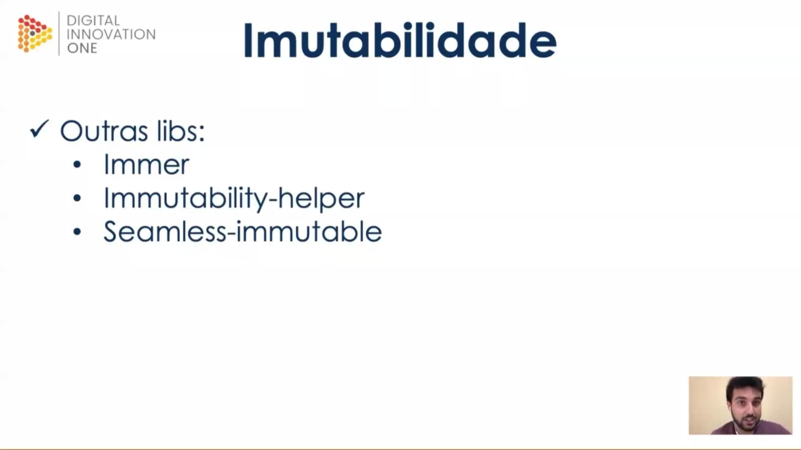
</p>

Além do Immutable.js, existem outras bibliotecas populares indicadas pela comunidade React para lidar com imutabilidade, tais como **Immer**, **Immutability-helper** e **Seamless-immutable**. Cada uma oferece diferentes formas de simplificar a criação de cópias profundas e estados persistentes.

<p align="center">

</p>

A imutabilidade é um requisito obrigatório no Redux. Como o fluxo de dados depende de comparações rasas na Store para disparar atualizações, o uso de dados imutáveis garante que o Redux DevTools funcione corretamente, permitindo recursos avançados como o *Time Travel Debugger*.

<p align="center">

</p>

O Redux opera através de dois mecanismos principais:

1. **Reducers**: O `combineReducers` verifica mudanças via comparação rasa. Se um reducer retorna uma nova referência, o Redux compõe um novo objeto de estado global.
2. **Connect**: Cria componentes que monitoram o estado. Através do `mapStateToProps`, se a comparação rasa detectar uma mudança na fatia do estado correspondente, o componente é re-renderizado.

<p align="center">
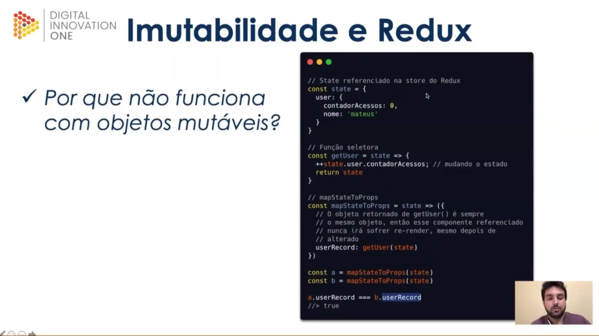
</p>

Um erro clássico é realizar mutações diretas dentro de seletores ou no `mapStateToProps`. No exemplo abaixo, ao incrementar o contador diretamente no objeto `state.user`, a referência da memória não muda. Consequentemente, o Redux assume que não houve alteração e o componente nunca será atualizado na tela.

```javascript
const getUser = (state) => {
  const user = state.user; 
  user.contadorDeAcesso++; // ERRO: Mutação direta do estado
  return user;
}

const mapStateToProps = (state) => ({
  user: getUser(state) // Retornará sempre a mesma referência, impedindo o rerender
});

```      

## 🟩 Vídeo 12 - Redux + Rest

<video width="60%" controls>
  <source src="000-Midia_e_Anexos/bootcamp_tqi_fullstack-modulo_04-curso.04-Video_12.webm" type="video/webm">
    Seu navegador não suporta vídeo HTML5.
</video>

Link do vídeo: https://web.dio.me/track/tqi-fullstack-developer/course/desenvolvimento-de-aplicacoes-para-internet-com-reactjs/learning/4c1d8601-b28a-4ed5-97a6-4b63dcc7d68c?autoplay=1

O vídeo consiste em uma aula técnica que detalha a integração do **Redux** com requisições **REST** utilizando a camada de **Middlewares**. O instrutor explica como essas ferramentas funcionam como intermediárias entre o disparo de uma ação e o redutor, permitindo gerenciar efeitos colaterais como **logs de sistema** e **chamadas de API**. Através de uma evolução didática, o conteúdo demonstra desde soluções manuais e improvisadas até a implementação profissional com a biblioteca **Redux Thunk**. A explicação abrange a criação de **actions assíncronas** para monitorar estados de carregamento, sucesso ou erro durante a busca de dados. Por fim, o material ensina a organizar a aplicação de forma escalável usando o **combineReducers** e a conectar os componentes React ao estado global para exibir informações dinâmicas.

### Anotações

<p align="center">

</p>

Esta etapa marca o início da terceira parte do curso, focada na integração entre o Redux e o consumo de APIs REST. O objetivo é aprofundar o desenvolvimento de aplicações para internet utilizando ReactJS, abordando como gerenciar estados complexos que dependem de dados externos.

<p align="center">

</p>

A sincronização de dados é um desafio comum em sistemas que possuem funcionalidades transversais, como notificações ou logs. Para garantir que a informação permaneça consistente independentemente da tela em que o usuário esteja, uma solução eficaz é centralizar o armazenamento desses dados de serviço no Redux, permitindo um fluxo de dados único e previsível.

<p align="center">

</p>

Os Redux Middlewares funcionam como uma camada de interceptação posicionada entre o disparo de uma ação (`dispatch`) e o momento em que ela é processada pelo `reducer`. Eles são ferramentas versáteis, sendo amplamente utilizados para realizar chamadas de APIs, manipulação de logs e tratamento de efeitos colaterais.

<p align="center">

</p>

Para entender o funcionamento de um middleware, imagine um sistema de log básico. Toda vez que uma `action` é disparada, o sistema imprime no console os detalhes dessa ação e, em seguida, mostra o estado resultante da aplicação (`next state`). Isso permite rastrear exatamente como cada interação afeta a lógica global.

<p align="center">
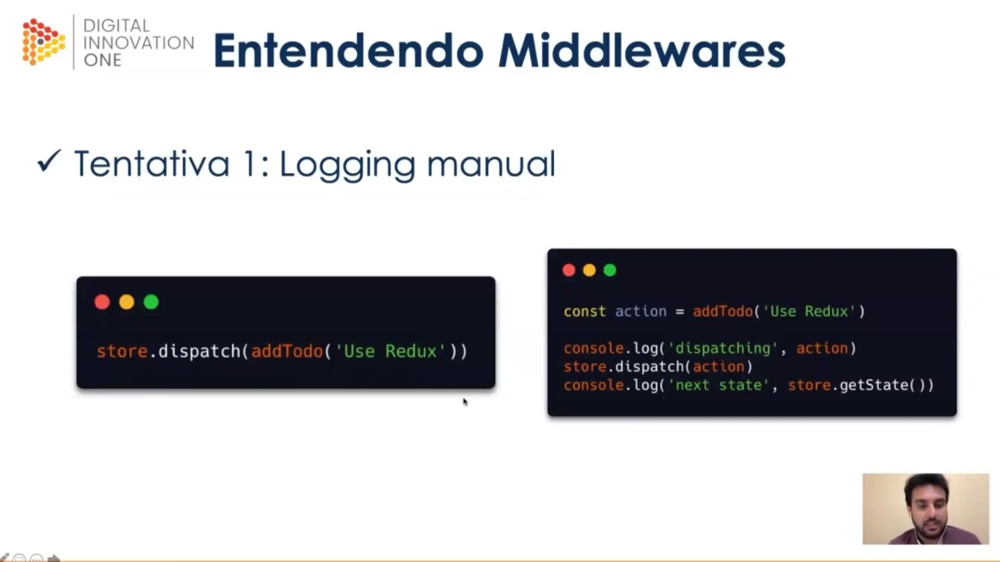
</p>

A primeira tentativa de implementar um sistema de log é através do registro manual. Nesse modelo, inserimos instruções de console antes e depois do disparo da ação diretamente no código onde o evento ocorre.

```javascript
const action = addTodo('Use Redux')
console.log('dispatching', action)
store.dispatch(action)
console.log('next state', store.getState())

```

<p align="center">
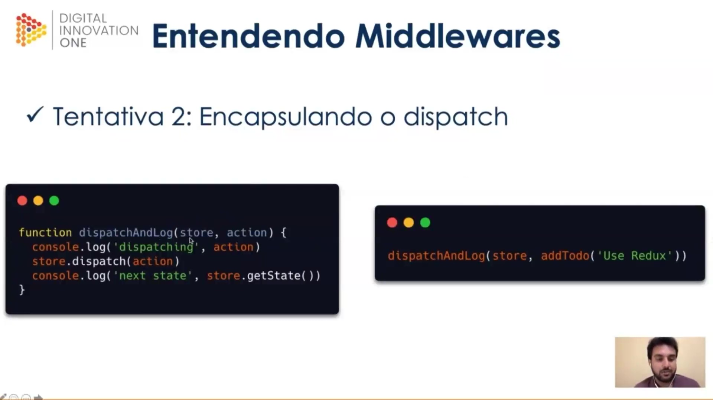
</p>

Na segunda tentativa, buscamos organizar melhor o código encapsulando o processo de log em uma função auxiliar chamada `dispatchAndLog`. Embora ajude a centralizar a lógica, essa abordagem ainda requer que o desenvolvedor lembre-se de chamar essa função específica em vez do método nativo da `store`.

```javascript
function dispatchAndLog(store, action) {
  console.log('dispatching', action)
  store.dispatch(action)
  console.log('next state', store.getState())
}

dispatchAndLog(store, addTodo('Use Redux'))

```

<p align="center">
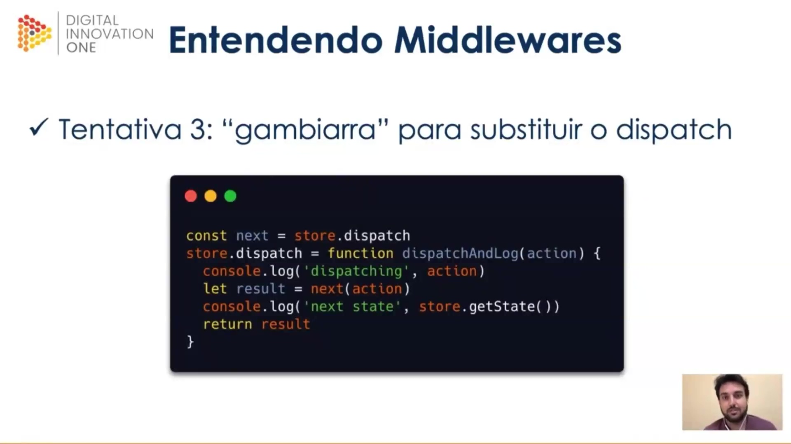
</p>

A terceira tentativa utiliza uma técnica conhecida como *monkeypatching* para substituir o método `dispatch` original da `store`. Armazenamos a função original em uma variável (`next`) e redefinimos `store.dispatch` para incluir o comportamento de log desejado antes de repassar a execução para a função original.

```javascript
const next = store.dispatch
store.dispatch = function dispatchAndLog(action) {
  console.log('dispatching', action)
  let result = next(action)
  console.log('next state', store.getState())
  return result
}

```

<p align="center">

</p>

O uso de substituição direta do `dispatch` via *monkeypatching* apresenta um problema de escalabilidade. Se precisarmos adicionar outras funcionalidades independentes, como um relatório de erros (*crash report*), a estrutura começa a se tornar complexa e difícil de manter, pois cada nova função precisaria gerenciar manualmente a referência ao `dispatch` anterior.

<p align="center">
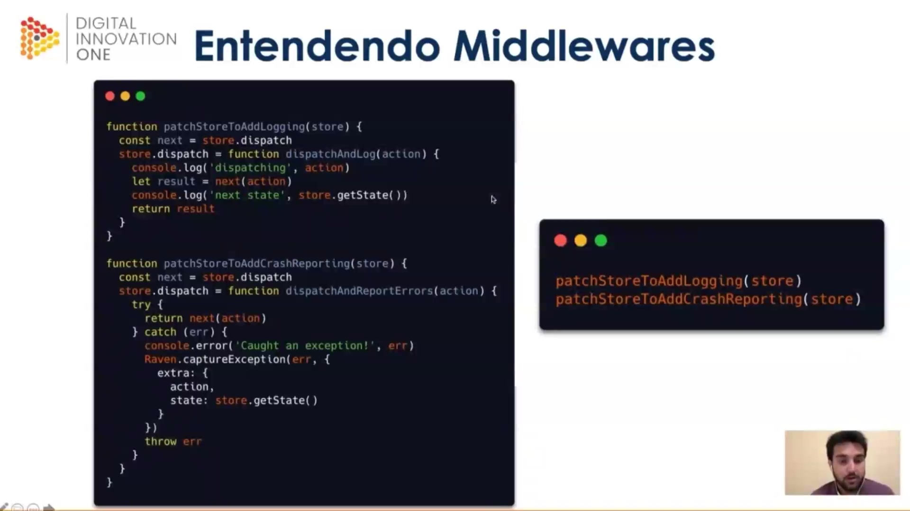
</p>

Para resolver o problema de múltiplas responsabilidades, podemos criar funções de "patch" separadas. Cada uma dessas funções intercepta a execução para adicionar sua lógica específica (logging ou tratamento de erros) e mantém a cadeia de execução funcionando ao chamar a versão anterior do `dispatch`.

```javascript
function patchStoreToAddLogging(store) {
  const next = store.dispatch
  store.dispatch = function dispatchAndLog(action) {
    console.log('dispatching', action)
    let result = next(action)
    console.log('next state', store.getState())
    return result
  }
}

function patchStoreToAddCrashReporting(store) {
  const next = store.dispatch
  store.dispatch = function dispatchAndReportErrors(action) {
    try {
      return next(action)
    } catch (err) {
      console.error('Caught an exception!', err)
      Raven.captureException(err, {
        extra: {
          action,
          state: store.getState()
        }
      })
      throw err
    }
  }
}

patchStoreToAddLogging(store)
patchStoreToAddCrashReporting(store)

```

<p align="center">
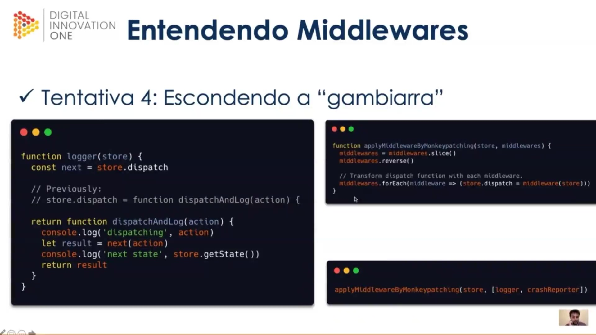
</p>

A quarta tentativa refina o conceito ao automatizar a aplicação desses patches. Em vez de chamar cada função manualmente, define-se um método `applyMiddlewareByMonkeypatching` que recebe uma lista de middlewares. Ele inverte a ordem e aplica cada um à `store`, transformando a função `dispatch` de forma sistemática.

```javascript
function logger(store) {
  const next = store.dispatch
  
  return function dispatchAndLog(action) {
    console.log('dispatching', action)
    let result = next(action)
    console.log('next state', store.getState())
    return result
  }
}

function applyMiddlewareByMonkeypatching(store, middlewares) {
  middlewares = middlewares.slice()
  middlewares.reverse()

  // Transforma a função dispatch com cada middleware.
  middlewares.forEach(middleware => (store.dispatch = middleware(store)))
}

applyMiddlewareByMonkeypatching(store, [logger, crashReporter])

```

<p align="center">
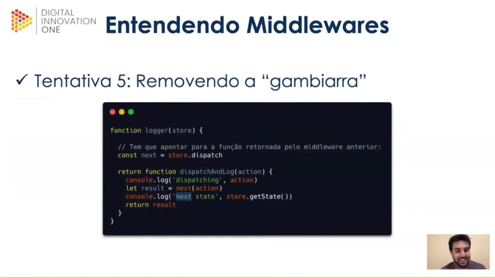
</p>

Ao trabalhar com APIs reais, utilizamos middlewares como o Redux Thunk para gerenciar ações assíncronas. No exemplo abaixo, a função `fetchCientistas` inicia um estado de pendência, realiza a requisição via `fetch` e, dependendo do retorno, dispara uma ação de sucesso com os dados ou uma ação de erro.

```javascript
const fetchCientistas = () => (dispatch) => {
  dispatch(fetchCientistasPending())
  return fetch('http://localhost:3000/cientistas')
    .then(res => res.json())
    .then(res => {
      if(res.error) {
        throw(res.error)
      }
      dispatch(fetchCientistasSuccess(res))
      return res
    })
    .catch(error => {
      dispatch(fetchCientistasError(error))
    })
}

```

<p align="center">
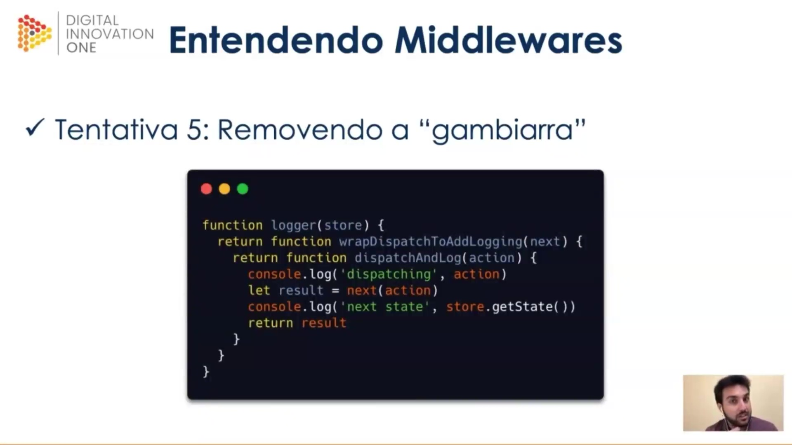
</p>

Por fim, conectamos a lógica ao componente React. Através das funções `mapStateToProps` e `mapDispatchToProps` e do Higher Order Component `connect`, mapeamos os estados de carregamento, erro e os dados dos cientistas para as propriedades do componente, além de disponibilizar o disparador `fetchCientistas`.

```javascript
const mapStateToProps = state => ({
  cientistas: state.cientistas.data,
  pending: state.cientistas.pending,
  error: state.cientistas.error
})

const mapDispatchToProps = dispatch => ({
  fetchCientistas: () => dispatch(fetchCientistas())
})

export default connect(
  mapStateToProps,
  mapDispatchToProps
)(Cientistas)

```      
# Parte 4 -Conceitos aplicados a qualidade de código e automação de testes em React

## Vĩdeo 13 -

<video width="60%" controls>
  <source src="000-Midia_e_Anexos/bootcamp_tqi_fullstack-modulo_04-curso.04-Video_13.webm" type="video/webm">
    Seu navegador não suporta vídeo HTML5.
</video>

Link do vídeo:

## Vĩdeo 14-

<video width="60%" controls>
  <source src="000-Midia_e_Anexos/bootcamp_tqi_fullstack-modulo_04-curso.04-Video_14.webm" type="video/webm">
    Seu navegador não suporta vídeo HTML5.
</video>

Link do vídeo:

## Vĩdeo 15 -

<video width="60%" controls>
  <source src="000-Midia_e_Anexos/bootcamp_tqi_fullstack-modulo_04-curso.04-Video_15.webm" type="video/webm">
    Seu navegador não suporta vídeo HTML5.
</video>

Link do vídeo:

## Vĩdeo 16 -

<video width="60%" controls>
  <source src="000-Midia_e_Anexos/bootcamp_tqi_fullstack-modulo_04-curso.04-Video_16.webm" type="video/webm">
    Seu navegador não suporta vídeo HTML5.
</video>

Link do vídeo:


##  Materiais de Apoio


# Certificado: 

- Link na plataforma: 
- Certificado em pdf: 
