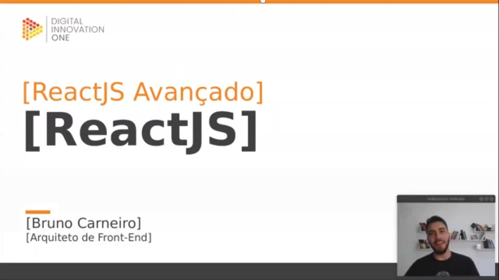
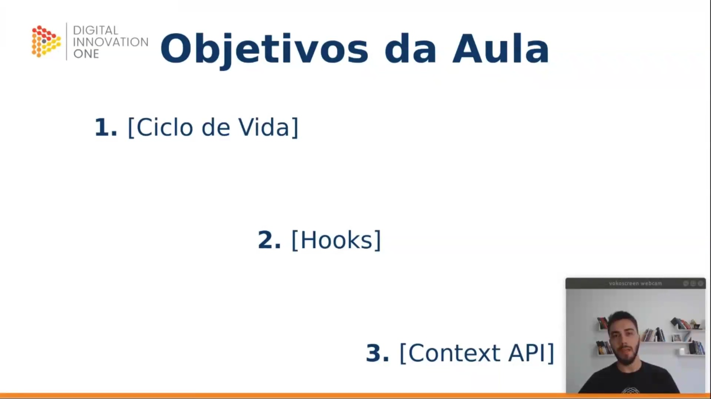
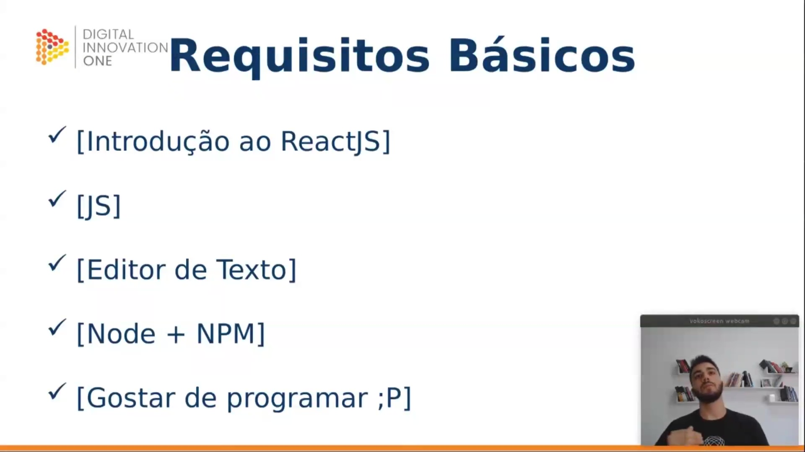
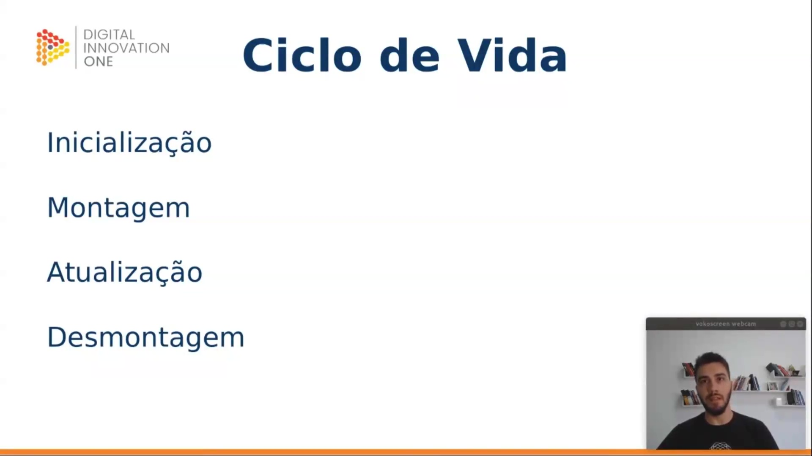
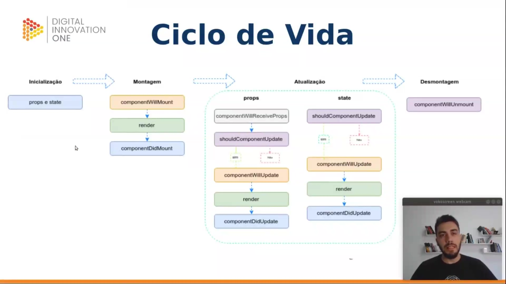
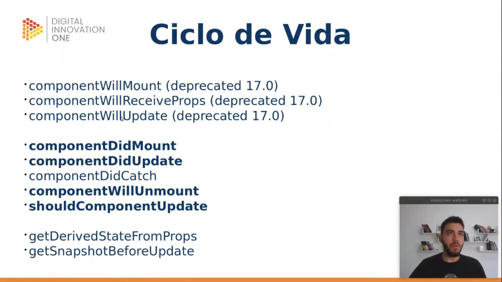
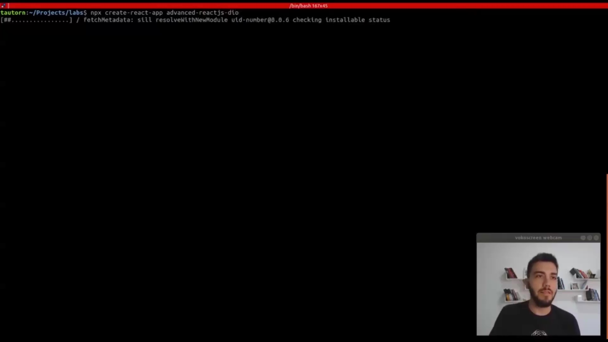
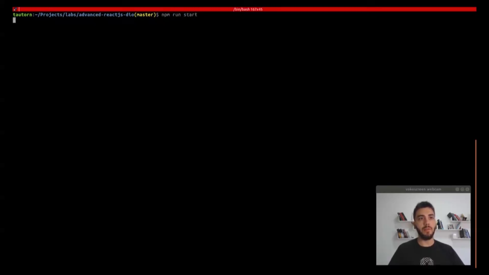

## Instrutor

- Bruno Carneiro (Planning & Business Performance Director na Magazine Luiza)
- Contato Linkedin: / [brunohvcarneiro](https://www.linkedin.com/in/brunohvcarneiro/)

## Parte 1 - Aprofundando sobre o Ciclo de Vida do React

### 🟩 Vídeo 01 - Ciclo de Vida e suas fases

link do vídeo: https://web.dio.me/track/tqi-fullstack-developer/course/praticas-avancadas-em-projetos-com-reactjs/learning/8f7be828-9ebd-473c-a215-bf6f04ffea3d?autoplay=1

<p align="center">

</p>

Nesta aula de React JS Avançado, ministrada por Bruno Carneiro, o foco inicial recai sobre o entendimento profundo do ciclo de vida dos componentes, o uso de Hooks e a Context API. O domínio desses conceitos é fundamental para a transição do modelo de classes para o modelo funcional e para o uso eficiente dos novos recursos da biblioteca.

<p align="center">

</p>

Para acompanhar este conteúdo avançado, são necessários os seguintes pré-requisitos:

* Conhecimentos obtidos nos cursos de Introdução e Intermediário de React JS.
* Domínio básico de JavaScript (mínimo ECMAScript 6).
* Ambiente de desenvolvimento configurado com Node.js (versão 12 recomendada) e NPM.
* Versão do React utilizada: 16.12.

<p align="center">

</p>

O ciclo de vida do React é dividido em quatro fases principais:

1. **Inicialização:** O componente recebe suas propriedades (`props`) e define seu estado inicial (`state`).
2. **Montagem:** O componente é inserido no DOM.
3. **Atualização:** Ocorre quando propriedades ou estados são alterados, provocando uma nova renderização.
4. **Desmontagem:** Quando o componente é removido da árvore do DOM.

<p align="center">

</p>

É importante destacar que, a partir da versão 17 do React, alguns métodos do ciclo de vida serão depreciados e removidos. São eles:

* `componentWillMount`
* `componentWillReceiveProps`
* `componentWillUpdate`

O uso desses métodos não é recomendado em novos projetos, devendo ser substituídos por alternativas mais modernas como `componentDidMount` ou hooks equivalentes.

<p align="center">

</p>

Os métodos do ciclo de vida que permanecem essenciais para o desenvolvimento com classes incluem:

* **`componentDidMount`**: Executado após o componente estar pronto no DOM.
* **`componentDidUpdate`**: Executado após atualizações na árvore.
* **`componentWillUnmount`**: Utilizado para limpeza antes da destruição do componente.
* **`componentDidCatch`**: Para tratamento de erros e exceções.
* **`shouldComponentUpdate`**: Permite controlar se o componente deve ou não renderizar novamente por razões de performance.

<p align="center">

</p>

Para demonstrar o ciclo de vida na prática, utilizamos uma estrutura de classe. No exemplo abaixo, o método `componentDidMount` é utilizado para disparar ações logo após a montagem do componente, enquanto o `render` define a estrutura visual:

```javascript
import React, { Component } from 'react';

class Twitter extends Component {
  componentDidMount() {
    console.log('componentDidMount');
  }

  render() {
    return (
      <div>
        Teste
      </div>
    );
  }
}

export default Twitter;

```

<p align="center">

</p>

O método `shouldComponentUpdate` é uma ferramenta poderosa para otimização. Ele recebe as próximas propriedades (`nextProps`) e o próximo estado (`nextState`), retornando um booleano que define se a renderização deve prosseguir:

```javascript
shouldComponentUpdate(nextProps, nextState) {
  return this.state.tweet !== nextState.tweet;
}

```

Além disso, o `componentWillUnmount` é fundamental para evitar vazamentos de memória (memory leaks), como limpar timers criados com `setInterval`:

```javascript
componentWillUnmount() {
  console.log('componentWillUnmount: componente removido');
}

```

<p align="center">

</p>

Para iniciar o ambiente de desenvolvimento e visualizar as mensagens de log do ciclo de vida no console do navegador, utiliza-se o comando:

```bash
npm run start

```

<p align="center">

</p>

Caso seja necessário criar um novo projeto do zero com toda a configuração de Webpack e Babel automatizada, o comando recomendado é o `create-react-app` via NPX:

```bash
npx create-react-app advanced-reactjs-dio

```

### 🟩 Vídeo 02 - O que são Hooks e como ele pode otimizar o código

link do vídeo: https://web.dio.me/track/tqi-fullstack-developer/course/praticas-avancadas-em-projetos-com-reactjs/learning/a8522b88-3b01-4044-9138-ed0b49193b1e?autoplay=1

O vídeo consiste em uma **aula técnica** focada na transição do **React para o modelo de programação funcional** através do uso de **Hooks**. O instrutor explica como substituir a estrutura tradicional de **classes** por **funções**, destacando que essa abordagem torna o código mais legível, simples e elimina a necessidade do escopo **"this"**. Durante a explicação, são demonstradas as implementações práticas de hooks essenciais como **useState** para gerenciamento de estado e **useEffect** para controlar o **ciclo de vida** do componente. O conteúdo detalha como replicar comportamentos de montagem, atualização e desmontagem de componentes de forma modular e eficiente. Além disso, o autor aborda a otimização de performance com o uso de **memo** para evitar renderizações desnecessárias. Por fim, são reforçadas as **boas práticas**, recomendando que hooks sejam utilizados exclusivamente dentro de componentes React para garantir a ordem de execução correta.

### 🟩 Vídeo 03 - Context API

link do vídeo: https://web.dio.me/track/tqi-fullstack-developer/course/praticas-avancadas-em-projetos-com-reactjs/learning/ee284557-ca75-4902-9797-d9f483288cb1?autoplay=1

O vídeo apresenta um guia técnico sobre a implementação da **Context API** do React utilizando **Hooks**, destacando como essa ferramenta facilita o compartilhamento de estados globais. O autor demonstra a criação de um **Provider** na camada superior da aplicação para distribuir dados, como temas e tokens de autenticação, sem a necessidade de passar propriedades manualmente por componentes intermediários. Através de exemplos práticos com **useContext**, o conteúdo explica como os componentes filhos podem consumir valores e reagir a atualizações de estado de forma eficiente. Além de abordar o ciclo de vida e a renderização, o material compara essa abordagem com bibliotecas externas como **Redux** ou **MobX**. Por fim, o autor reforça que o uso de contextos globais deve ser feito com cautela para manter a **manutenibilidade do código** e evitar renderizações desnecessárias.

## Parte 2 - Técnicas com components e DOM

### 🟩 Vídeo 05 - Por que trabalhar com Fragments

link do vídeo: https://web.dio.me/track/tqi-fullstack-developer/course/praticas-avancadas-em-projetos-com-reactjs/learning/0f5903a8-0af9-4fc6-b665-f94c5d99520c?autoplay=1

O vídeo é uma aula de **React avançado** foca no uso estratégico de **Fragments** para otimizar a estrutura do código e do **DOM**. O instrutor explica que o React exige que componentes retornem um **único elemento pai**, o que frequentemente leva à criação de **divs desnecessárias** que poluem o HTML final. Para resolver isso, os **Fragments** permitem agrupar múltiplos filhos sem adicionar nós extras, mantendo a árvore de renderização mais limpa e eficiente. O conteúdo demonstra diferentes formas de sintaxe, incluindo o **syntax sugar** e a necessidade de usar a nomenclatura completa ao lidar com **propriedades de chave (keys)** em listas. Por fim, o autor reforça que essa técnica é essencial para evitar problemas de estilização e para garantir um **desempenho melhor** em aplicações complexas.

### 🟩 Vídeo 06 - Error Boundaries

link do vídeo: https://web.dio.me/track/tqi-fullstack-developer/course/praticas-avancadas-em-projetos-com-reactjs/learning/8007118e-7c1b-49c9-8e9a-b504d547697c?autoplay=1


### 🟩 Vídeo 07 - Render Props

link do vídeo:

### 🟩 Vídeo 08 - Typechecking com PropTypes

link do vídeo:

### 🟩 Vídeo 09 - Refs e DOM

link do vídeo:


## Parte 3 - Organizando o seu projeto

### 🟩 Vídeo 10 - O que é um Dumb Components

link do vídeo:

### 🟩 Vídeo 11 - Como trabalhar com Dumb Components

link do vídeo:

### 🟩 Vídeo 12 - E Smart Components?

link do vídeo:

### 🟩 Vídeo 13 - Finalizando o projeto

link do vídeo:


# Certificado: 

- Link na plataforma: 
- Certificado em pdf: 
