## Instrutor

- Matheus De Amorim Benites (AI-Driven Full Stack Engineer | Co-Founder @Tamy )
- Contato Linkedin: / [omatheusbenites](https://www.linkedin.com/in/omatheusbenites/)


### 🟩 Vídeo 01 - Como usar os desafios de projeto para criar seu portfolio

<video width="60%" controls>
  <source src="000-Midia_e_Anexos/tqi_fullstack-modulo.04-curso.06-video_01.webm" type="video/webm">
    Seu navegador não suporta vídeo HTML5.
</video>

link do vídeo: https://web.dio.me/project/criando-um-front-end-totalmente-componentizado-na-pratica-com-reactjs/learning/00fbaa4a-f81c-4a9d-9005-8fbab6db02e2

O conteúdo aborda a importância e o funcionamento dos projetos práticos na plataforma DIO, destacando-os como ferramentas essenciais para o desenvolvimento de portfólios, exercício da criatividade e aceleração do aprendizado. Através de orientações de especialistas do mercado, os alunos são incentivados a ir além da simples reprodução de códigos, personalizando suas entregas para demonstrar competências reais e se destacar no mercado de desenvolvimento de software.


### 🟩 Vídeo 02 - Introdução

<video width="60%" controls>
  <source src="000-Midia_e_Anexos/tqi_fullstack-modulo.04-curso.06-video_02.webm" type="video/webm">
    Seu navegador não suporta vídeo HTML5.
</video>

link do vídeo: https://web.dio.me/lab/criando-um-front-end-totalmente-componentizado-na-pratica-com-reactjs/learning/4700bb96-97ad-492a-9876-df9902aff174

Neste conteúdo, o engenheiro de software Mateus Benites apresenta uma abordagem prática para o desenvolvimento de aplicações React totalmente componentizadas. O foco central é o processo de tomada de decisão para a divisão de componentes, utilizando a analogia de "peças de Lego" para decompor e reconstruir interfaces complexas, visando uma estrutura de código mais organizada e eficiente.

### Anotações

<p align="center">

</p>

Esta aula foca na criação prática de uma aplicação React totalmente componentizada. O objetivo principal é demonstrar o processo de tomada de decisão para a divisão de componentes e o fluxo de trabalho no desenvolvimento front-end. Para dar suporte ao aprendizado, o conteúdo é acompanhado por uma playlist no YouTube (bit.ly/papodedev), onde todo o desenvolvimento do projeto utilizado como exemplo é demonstrado passo a passo.

<p align="center">

</p>

Apresentação do instrutor Matheus Benites, Software Engineer Front-end na Rock Content. Com um perfil voltado à resolução de problemas e movido por desafios técnicos, o instrutor compartilha sua trajetória pessoal e profissional, destacando sua motivação em participar de projetos de impacto global.

<p align="center">

</p>

Canais de comunicação e redes sociais do instrutor para acompanhamento de conteúdos complementares:

* **Blog:** papode.dev
* **YouTube:** bit.ly/papodedev
* **LinkedIn:** [linkedin.com/in/benites-amorim/](https://www.google.com/search?q=https://linkedin.com/in/benites-amorim/)

<p align="center">
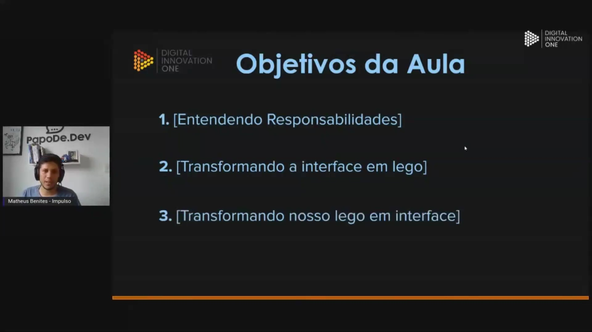
</p>

A aula está estruturada em três objetivos fundamentais para o domínio da componentização:

1. **Entendendo responsabilidades:** Identificar o papel de cada parte da aplicação.
2. **Transformando a interface em pequenas peças de Lego:** Decompor uma interface complexa em componentes menores e independentes.
3. **Remontando o nosso Lego em interface:** Unificar os componentes pequenos para reconstruir a interface completa e funcional.

<p align="center">
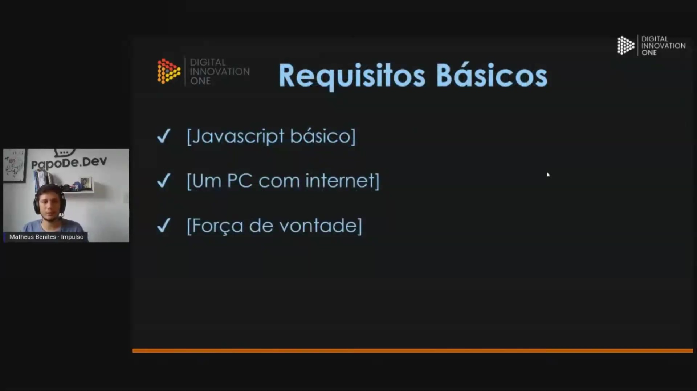
</p>

Para o acompanhamento eficaz desta aula, são necessários os seguintes requisitos básicos:

* Conhecimentos fundamentais de **JavaScript**.
* Acesso a um **computador com internet**.
* **Força de vontade** para enfrentar as etapas do processo de desenvolvimento.      


### 🟩 Vídeo 03 - Entendendo Responsabilidade

<video width="60%" controls>
  <source src="000-Midia_e_Anexos/tqi_fullstack-modulo.04-curso.06-video_03.webm" type="video/webm">
    Seu navegador não suporta vídeo HTML5.
</video>

link do vídeo: https://web.dio.me/lab/criando-um-front-end-totalmente-componentizado-na-pratica-com-reactjs/learning/726b151f-5bd3-4370-a116-3c2138b31613

O vídeo aborda a importância da componentização no desenvolvimento front-end, com foco especial em React. O palestrante defende que, embora não existam regras rígidas, o consenso na comunidade é que componentes devem ter responsabilidades únicas e mínimas. Essa prática facilita a manutenção, a escalabilidade e a legibilidade do código, permitindo que a aplicação cresça de forma organizada, assemelhando-se à construção com "peças de Lego".

### Anotações

<p align="center">
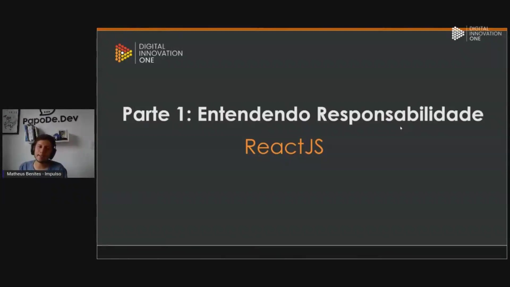
</p>

No desenvolvimento com ReactJS, o conceito de responsabilidade é fundamental para a criação de sistemas escaláveis. Embora não exista uma regra rígida para a quebra de componentes, o consenso na comunidade de desenvolvimento é que quanto menor a responsabilidade de um componente, melhor será a manutenção, a legibilidade e a capacidade de expansão do código. O objetivo principal é alcançar o ideal de componentes com responsabilidades únicas.

<p align="center">
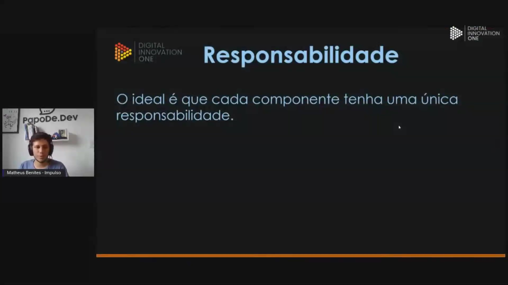
</p>

Para ilustrar o conceito de responsabilidade única, o slide apresenta o componente `Profile`. Neste cenário, o componente possui uma única missão: renderizar os dados do perfil do usuário. Essa abordagem permite que o componente seja facilmente reutilizável em diferentes partes da aplicação, bastando fornecer os dados necessários para a renderização.

```javascript
const Profile = () => {
  const { githubState } = useGithub();

  return (
    <S.Wrapper>
      <S.WrapperImage src={githubState.user.avatar} alt="Avatar of user" />
      <S.WrapperInfoUser>
        <div>
          <h1>{githubState.user.name}</h1>
          <S.WrapperUserGeneric>
            <h3>Username:</h3>
            <a 
              href={githubState.user.html_url} 
              target="_blank" 
              rel="noreferrer"
            >
              {githubState.user.login}
            </a>
          </S.WrapperUserGeneric>
        </div>
      </S.WrapperInfoUser>
    </S.Wrapper>
  );
};

export default Profile;

```

<p align="center">
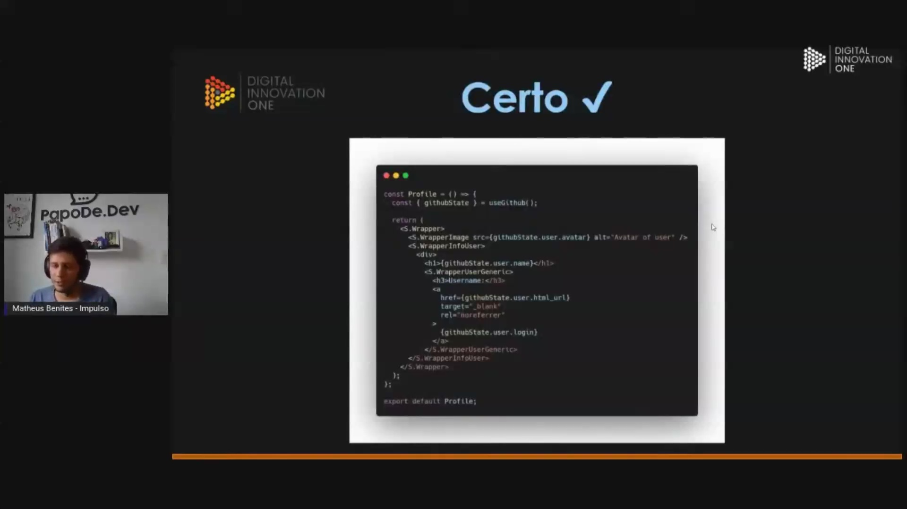
</p>

Neste exemplo, observa-se uma prática considerada inadequada para a componentização. O componente `Profile`, além de exibir os dados do usuário, também assume a responsabilidade de renderizar uma lista de repositórios. Ao acumular múltiplas funções, o componente torna-se mais complexo e difícil de manter, especialmente à medida que a equipe e o projeto crescem.

```javascript
const Profile = () => {
  const { githubState } = useGithub();

  return (
    <S.Wrapper>
      <S.WrapperImage src={githubState.user.avatar} alt="Avatar of user" />
      <S.WrapperInfoUser>
        <div>
          <h1>{githubState.user.name}</h1>
          <S.WrapperUserGeneric>
            <h3>Username: </h3>
            <a
              href={githubState.user.html_url}
              target="_blank"
              rel="noreferrer"
            >
              {githubState.user.login}
            </a>
          </S.WrapperUserGeneric>
        </div>
      </S.WrapperInfoUser>
      <Repositories>
        Lista de Repositórios aqui
      </Repositories>
    </S.Wrapper>
  );
};

export default Profile;

```

<p align="center">
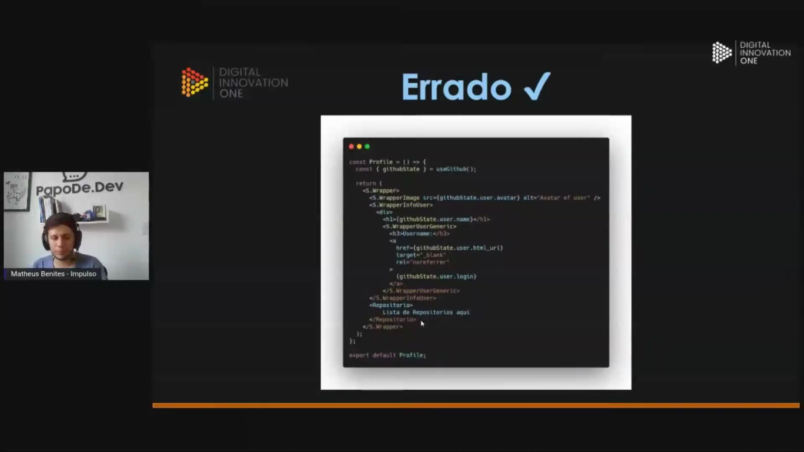
</p>

*Conteúdo não identificado com segurança a partir do material disponível.*

<p align="center">
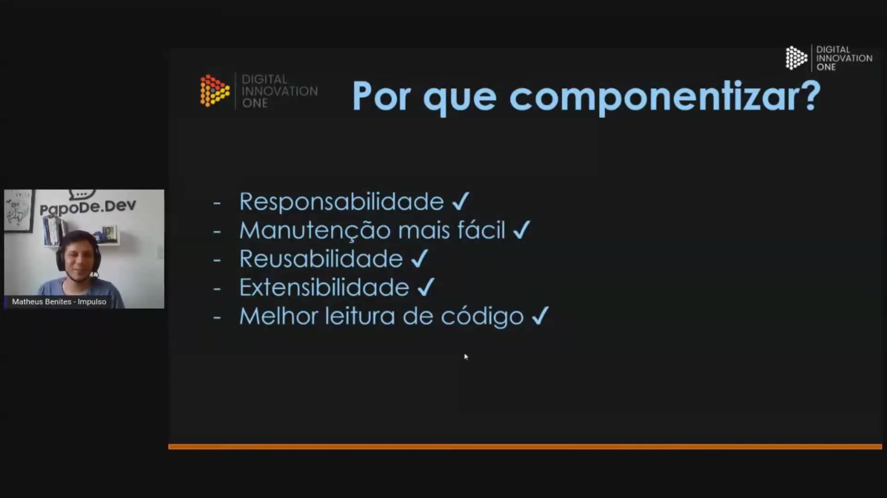
</p>

A decisão de componentizar uma aplicação front-end traz diversas vantagens estratégicas para o projeto:

* **Responsabilidade e Manutenção:** Permite dividir e desacoplar responsabilidades, facilitando correções e atualizações.
* **Reusabilidade:** Cria componentes que podem ser utilizados em diferentes contextos.
* **Extensibilidade:** Possibilita que componentes herdarem propriedades ou sejam estendidos.
* **Leitura de Código:** Resulta em um código mais limpo e legível, essencial para o trabalho em equipe e para a manutenção a longo prazo.

<p align="center">
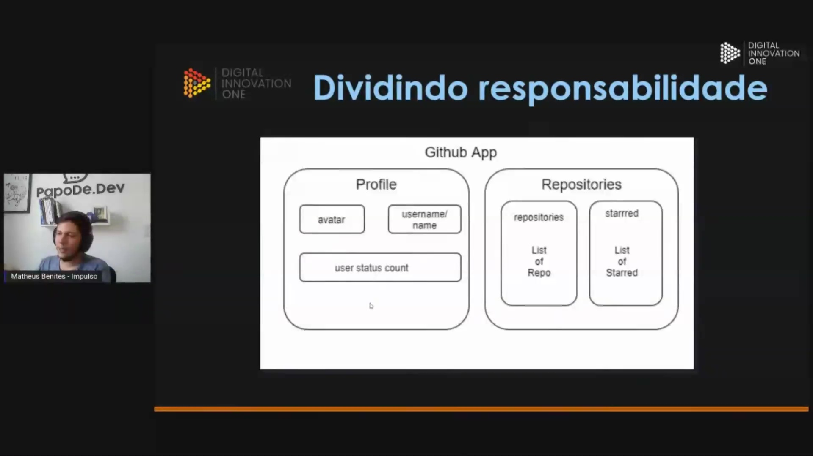
</p>

A imagem demonstra a arquitetura de divisão de responsabilidades da aplicação GitHub App. O sistema é organizado em blocos lógicos:

* **Profile:** Responsável por exibir dados do usuário, como o avatar, nome/username e contadores de status (seguidores, seguindo).
* **Repositories:** Focado na exibição de listas, dividindo-se entre a lista de repositórios gerais e a lista de repositórios favoritados (starred).

Essa estrutura permite que cada "peça de Lego" do front-end lide com seu próprio contexto sem gerar conflitos.

<p align="center">
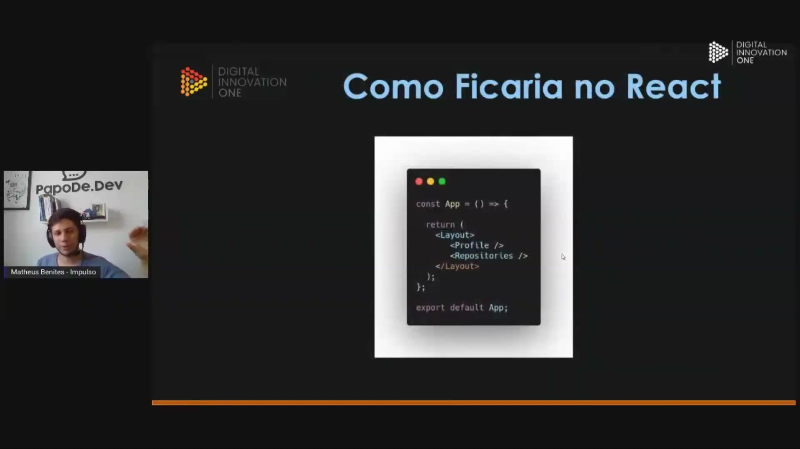
</p>

Na prática, a estrutura do React reflete a organização conceitual discutida. O componente principal `App` (ou Layout) atua como o container externo que envolve os componentes especializados `Profile` e `Repositories`.

```javascript
const App = () => {
  return (
    <Layout>
      <Profile />
      <Repositories />
    </Layout>
  );
};

export default App;

```      

### 🟩 Vídeo 04 - Transformando a interface em Lego

<video width="60%" controls>
  <source src="000-Midia_e_Anexos/tqi_fullstack-modulo.04-curso.06-video_04.webm" type="video/webm">
    Seu navegador não suporta vídeo HTML5.
</video>

link do vídeo: https://web.dio.me/lab/criando-um-front-end-totalmente-componentizado-na-pratica-com-reactjs/learning/7fb0feb4-c982-4e67-a722-c3496ff7351a

O conteúdo aborda a importância estratégica de dividir interfaces em React em componentes menores e modulares, utilizando a analogia de peças de Lego. O foco central é a criação de códigos reutilizáveis e eficientes, evitando a duplicação e facilitando a manutenção, especialmente em projetos de grande escala e em ambientes de trabalho colaborativo.

### Anotações

<p align="center">

</p>

A abordagem de desenvolvimento no React baseia-se na decomposição da interface em pequenos pedaços, comparáveis a peças de um brinquedo de montar (Lego). O objetivo é transformar a interface em componentes menores, onde cada um possui sua própria responsabilidade bem definida, permitindo que sejam remontados posteriormente para formar a aplicação completa.

<p align="center">

</p>

O ponto central da componentização é a criação de códigos **reutilizáveis**. Ao evitar a duplicação de código, é possível desenvolver uma lógica que atenda a diversos cenários de maneira eficiente, garantindo que o esforço de desenvolvimento seja otimizado e o sistema se torne mais sustentável.

<p align="center">

</p>

Em uma estrutura sem componentização, um componente principal como o `GitHub App` acumularia toda a lógica de renderização, incluindo o `Profile` e o `Repos`, em um único bloco. Em projetos de grande escala, com milhares de linhas e múltiplos desenvolvedores, essa falta de organização resultaria em arquivos gigantescos e frequentes conflitos de merge no Git, dificultando a manutenção e a escalabilidade do software.

<p align="center">

</p>

Para organizar o código de forma efetiva, a estrutura recomendada isola as responsabilidades. O componente principal `GitHub App` contém um `Layout`, que por sua vez organiza os componentes core: `Profile` e `Repos`. Esta arquitetura garante que, se for necessário reutilizar o perfil em outra parte do sistema, o desenvolvedor tenha a certeza de que aquele componente possui uma única responsabilidade: renderizar os dados do usuário.

<p align="center">
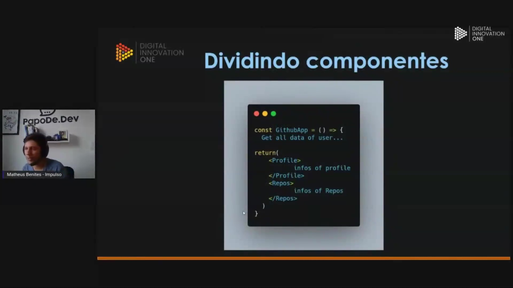
</p>

Nesta etapa, observamos a implementação do componente de layout, que serve como um container estrutural para os demais elementos da aplicação.

```javascript
import React from 'react';

const Layout = ({ children }) => {
  return (
    <header>
      {children}
    </header>
  );
};

export default Layout;

```

<p align="center">
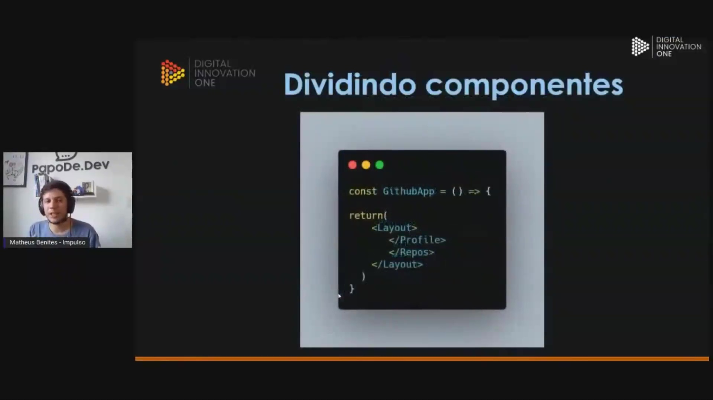
</p>

A organização prossegue com a definição dos componentes específicos para o perfil e para os repositórios, mantendo a lógica de cada um isolada em seu próprio escopo.

```javascript
import React from "react";

const Profile = () => {
  return <div>Profile</div>;
};

export default Profile;

```

<p align="center">
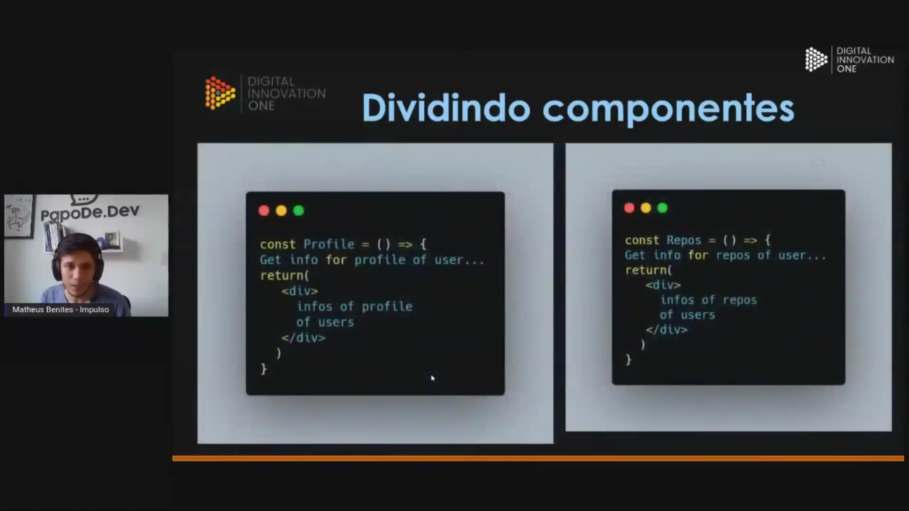
</p>

Abaixo, a estrutura básica para a listagem de repositórios, completando a separação de interesses dentro da interface do GitHub App.

```javascript
import React from "react";

const Repositories = () => {
  return <div>Repositories</div>;
};

export default Repositories;

```      


### 🟩 Vídeo 05 - Transformando nosso lego em interface

<video width="60%" controls>
  <source src="000-Midia_e_Anexos/tqi_fullstack-modulo.04-curso.06-video_05.webm" type="video/webm">
    Seu navegador não suporta vídeo HTML5.
</video>

link do vídeo: https://web.dio.me/lab/criando-um-front-end-totalmente-componentizado-na-pratica-com-reactjs/learning/2dcd3be2-fff0-4fe7-b38f-9cb8e20b9c19

### Anotações

<p align="center">

</p>

O processo de transformar o design em uma interface funcional envolve a remontagem de componentes previamente decompostos. A analogia do "Lego" ilustra a necessidade de planejar cuidadosamente onde quebrar o código e qual a responsabilidade de cada peça, garantindo que, ao reconstruir a "Estrela da Morte" (a aplicação final), o sistema seja eficiente e compreensível.

<p align="center">

</p>

Para o usuário final, a interface parece ser um bloco único e contínuo. Entretanto, sob a perspectiva do desenvolvedor, ela é um quebra-cabeça de responsabilidades desacopladas. A estrutura apresentada demonstra como diferentes seções da tela são tratadas como unidades independentes que se integram para formar a experiência completa.

<p align="center">

</p>

A arquitetura da interface é dividida em componentes específicos:

* **Layout:** A estrutura externa que permanece constante (como o campo de busca), alterando-se apenas o conteúdo interno.
* **Profile:** Responsável por exibir os dados do perfil do usuário.
* **Repos:** Um container que agrupa as listas de repositórios.
* **Repositories e Starred:** Subcomponentes dentro de Repos, focados respectivamente em listar os projetos do usuário e os itens favoritados por ele.

<p align="center">
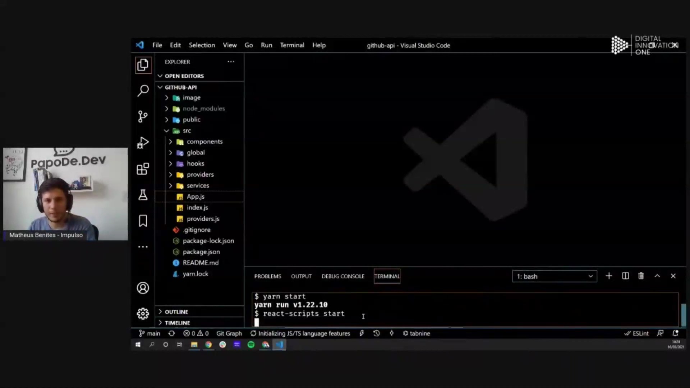
</p>

Para iniciar o desenvolvimento do projeto, utiliza-se o comando `create-react-app`. Este utilitário automatiza a criação do ambiente de trabalho, gerando um boilerplate com as pastas e configurações de bundle necessárias para que o desenvolvedor possa focar exclusivamente na lógica de negócio.

```bash
npx create-react-app github-api

```

<p align="center">
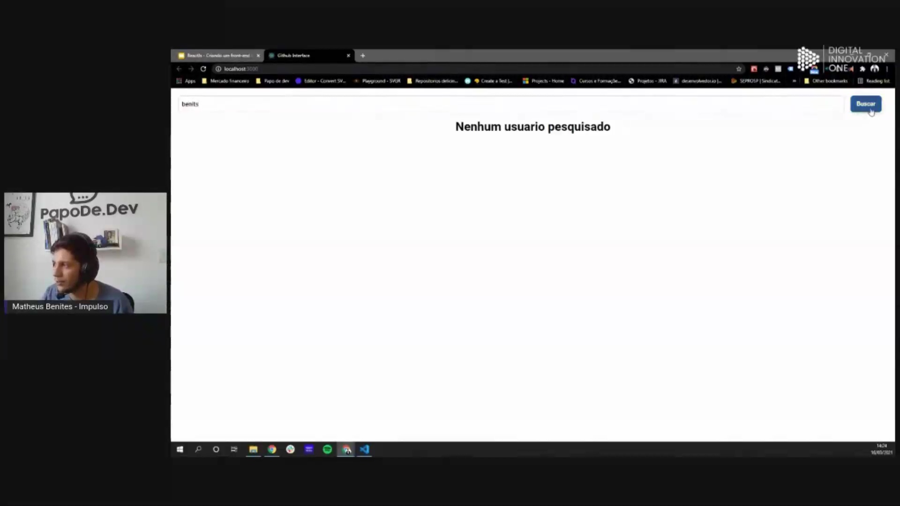
</p>

A aplicação em execução demonstra a integração dos componentes. Ao realizar uma busca por um username, a interface renderiza dinamicamente as informações capturadas, incluindo nome, links para blog e perfil, além de alternar entre as abas de repositórios próprios e favoritados (Starred).

<p align="center">

</p>

O gerenciamento de dependências do projeto é mantido de forma enxuta. As bibliotecas principais utilizadas para estender as funcionalidades do React são:

* **Axios:** Para requisições HTTP à API do GitHub.
* **React Tabs:** Para a navegação entre as listas de repositórios.
* **Styled Components:** Para a estilização e criação de estilos globais.

<p align="center">

</p>

A distribuição de dados pela aplicação é feita através da Context API do React. No arquivo principal, o `GitHubProvider` envolve os componentes, permitindo que as informações do usuário pesquisado sejam acessíveis em diferentes níveis da hierarquia sem a necessidade de passar propriedades manualmente por todos os níveis.

```javascript
import React from "react";
import App from "./App";
import { ResetCSS } from "./global/resetCSS";
import GithubProvider from "./providers/github-provider";

const Root = () => {
  return (
    <main>
      <GithubProvider>
        <ResetCSS />
        <App />
      </GithubProvider>
    </main>
  );
};

export default Root;

```

<p align="center">
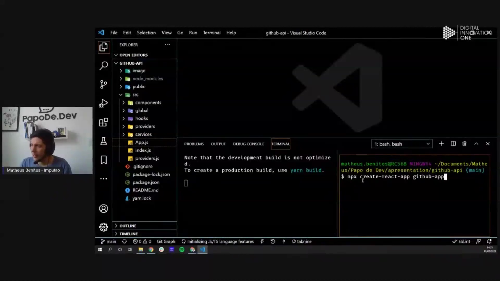
</p>

O componente principal `App.js` demonstra os benefícios da componentização. Em vez de concentrar centenas ou milhares de linhas de código em um único arquivo, o `App` apenas orquestra os componentes maiores como `Layout`, `Profile` e `Repositories`, mantendo o código limpo e de fácil manutenção.

```javascript
import React from "react";
import Layout from "./components/layout";
import NoSearch from "./components/no-search";
import Profile from "./components/profile";
import Repositories from "./components/repositories";
import useGithub from "./hooks/github-hooks";

const App = () => {
  const { githubState } = useGithub();
  return (
    <Layout>
      {githubState.hasUser ? (
        <>
          {githubState.loading ? (
            <p>Loading</p>
          ) : (
            <>
              <Profile />
              <Repositories />
            </>
          )}
        </>
      ) : (
        <NoSearch />
      )}
    </Layout>
  );
};

export default App;

```

<p align="center">
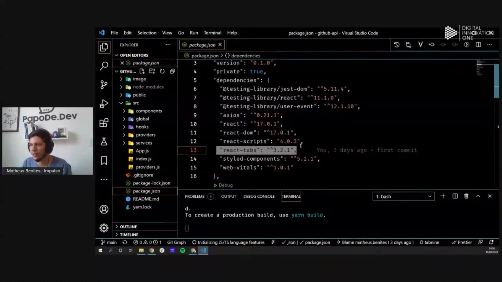
</p>

O componente `Profile` utiliza o hook personalizado `useGitHub` para extrair os dados necessários do contexto. Através da desestruturação do `githubState`, o componente acessa as informações do usuário de forma reativa, permitindo que a interface se atualize assim que os dados são carregados no provedor.

```javascript
import React from "react";
import useGithub from "../../hooks/github-hooks";
import * as S from "./styled";

const Profile = () => {
  const { githubState } = useGithub();

  return (
    <S.Wrapper>
      <S.WrapperImage src={githubState.user.avatar} alt="Avatar of user" />
      <S.WrapperInfoUser>
        <div>
          <h1>{githubState.user.name}</h1>
          <S.WrapperUserGeneric>
            <h3>Username:</h3>
            <a
              href={githubState.user.html_url}
              target="_blank"
              rel="noreferrer"
            >
              {githubState.user.login}
            </a>
          </S.WrapperUserGeneric>
          {/* ... outros campos de informação ... */}
        </div>
      </S.WrapperInfoUser>
    </S.Wrapper>
  );
};

export default Profile;

```

<p align="center">
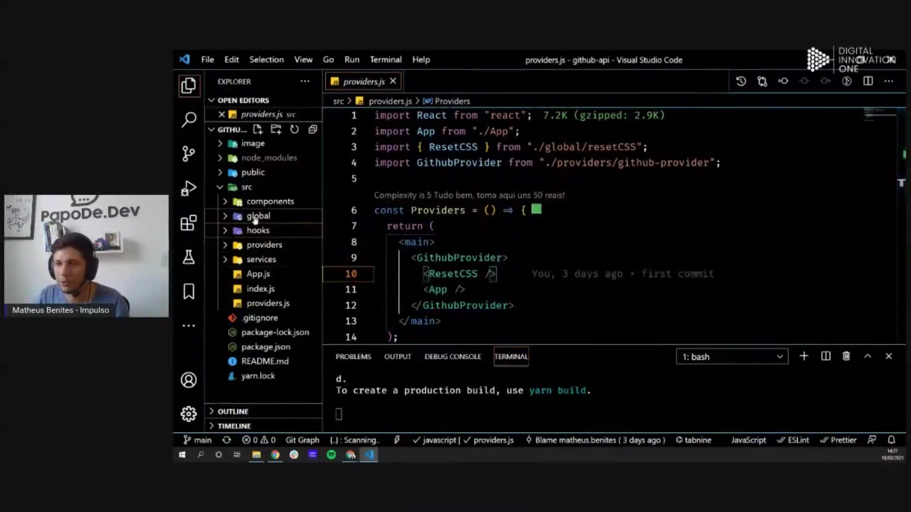
</p>

O `github-provider.js` estabelece a estrutura inicial do estado da aplicação. Utilizando `createContext`, define-se um objeto padrão que inclui carregamento (`loading`), dados do usuário (`user`), e listas para repositórios e itens favoritados, servindo como a "fonte da verdade" para toda a interface.

```javascript
import React, { createContext, useCallback, useState } from "react";
import api from "../services/api";

export const GithubContext = createContext({
  loading: false,
  user: {},
  repositories: [],
  starred: [],
});

const GithubProvider = ({ children }) => {
  const [githubState, setGithubState] = useState({
    hasUser: false,
    loading: false,
    user: {
      id: undefined,
      avatar: undefined,
      login: undefined,
      name: undefined,
      html_url: undefined,
      blog: undefined,
      company: undefined,
      location: undefined,
      followers: 0,
      following: 0,
      public_gists: 0,
      public_repos: 0,
    },
    repositories: [],
    starred: [],
  });
  // ... lógica adicional ...
};

```

<p align="center">
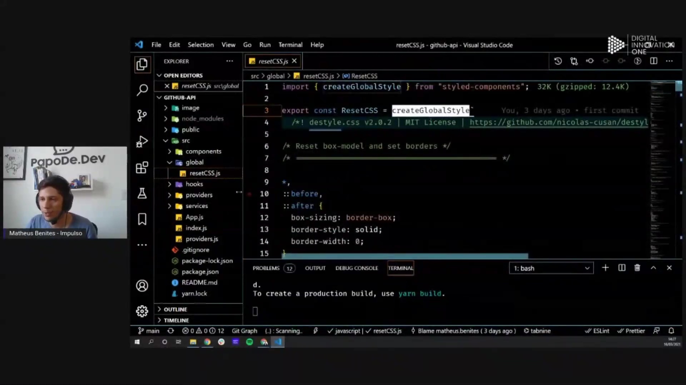
</p>

Dentro do estado do `GithubProvider`, os arrays `repositories` e `starred` são cruciais para a renderização das listas. A propriedade `user` centraliza dados específicos do perfil, como o login (username), o nome completo e URLs externas, organizando as informações que a API do GitHub retornará.

```javascript
// Continuação da estrutura do GithubProvider mostrando o estado detalhado
    user: {
      id: undefined,
      avatar: undefined,
      login: undefined,
      name: undefined,
      html_url: undefined,
      blog: undefined,
      company: undefined,
      location: undefined,
      followers: 0,
      following: 0,
      public_gists: 0,
      public_repos: 0,
    },
    repositories: [],
    starred: [],

```

<p align="center">
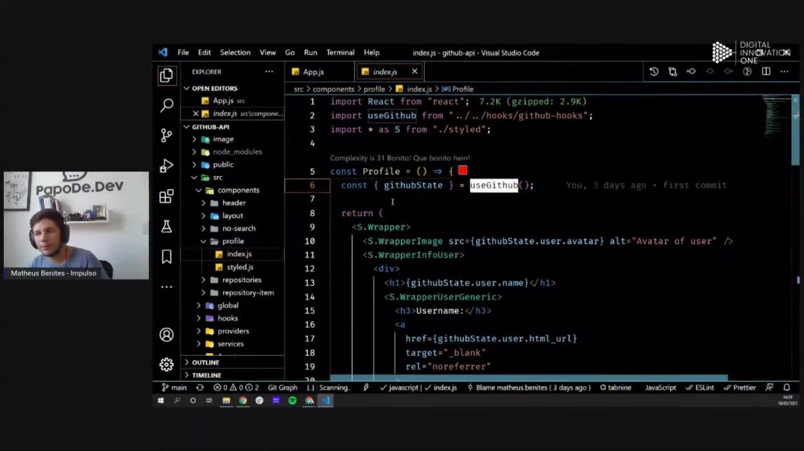
</p>

A função `getUser` é responsável por realizar a chamada assíncrona à API do GitHub. Ela altera o estado de `loading` para verdadeiro, busca os dados do usuário através do Axios e, em seguida, atualiza o `githubState` com as informações recebidas, como o avatar, nome e estatísticas de seguidores.

```javascript
  const getUser = (username) => {
    setGithubState((prevState) => ({
      ...prevState,
      loading: !prevState.loading,
    }));

    api
      .get(`users/${username}`)
      .then(({ data }) => {
        setGithubState((prevState) => ({
          ...prevState,
          hasUser: true,
          user: {
            id: data.id,
            avatar: data.avatar_url,
            login: data.login,
            name: data.name,
            html_url: data.html_url,
            blog: data.blog,
            company: data.company,
            location: data.location,
            followers: data.followers,
            following: data.following,
            public_gists: data.public_gists,
            public_repos: data.public_repos,
          },
        }));
      })
      .finally(() => {
        setGithubState((prevState) => ({
          ...prevState,
          loading: !prevState.loading,
        }));
      });
  };

```

<p align="center">
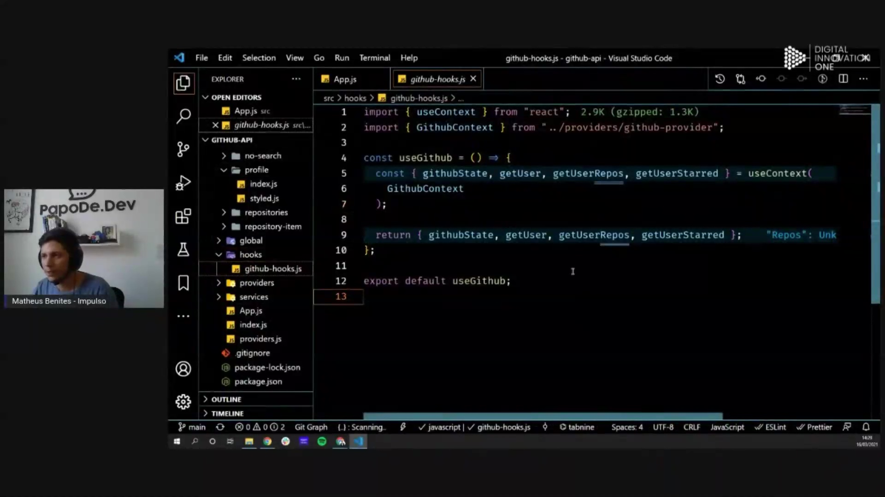
</p>

Para obter as listas de projetos, a aplicação implementa a função `getUserRepos`. Ela utiliza o endpoint `/repos` da API do GitHub, filtrando o retorno para armazenar apenas as informações relevantes no array `repositories` dentro do estado global.

```javascript
  const getUserRepos = (username) => {
    api.get(`users/${username}/repos`).then(({ data }) => {
      console.log("data: " + JSON.stringify(data));
      setGithubState((prevState) => ({
        ...prevState,
        repositories: data,
      }));
    });
  };

```

<p align="center">
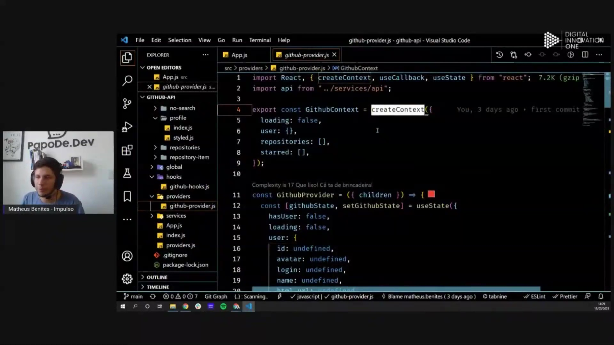
</p>

De maneira similar aos repositórios, a função `getUserStarred` consulta o endpoint `/starred`. Os dados retornados são salvos no estado `starred`, garantindo que a interface possa exibir separadamente os repositórios que o usuário marcou com estrela no GitHub.

```javascript
  const getUserStarred = (username) => {
    api.get(`users/${username}/starred`).then(({ data }) => {
      console.log("data: " + JSON.stringify(data));
      setGithubState((prevState) => ({
        ...prevState,
        starred: data,
      }));
    });
  };

```

<p align="center">
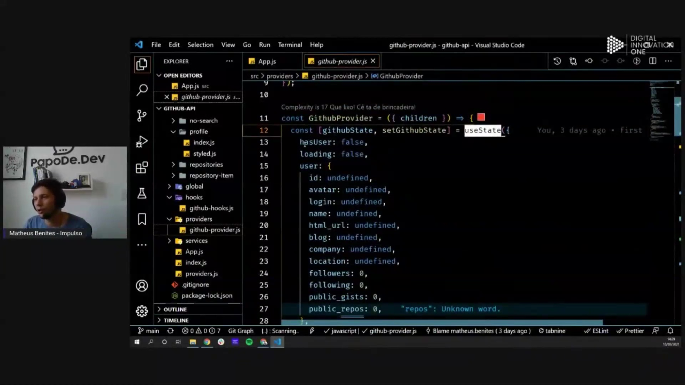
</p>

O `GithubProvider` expõe um objeto de contexto (`contextValue`) contendo tanto o estado atual quanto as funções de busca (`getUser`, `getUserRepos`, `getUserStarred`). Isso permite que qualquer componente filho dispare novas pesquisas ou consuma os dados existentes.

```javascript
  const contextValue = {
    githubState,
    getUser: useCallback((username) => getUser(username), []),
    getUserRepos: useCallback((username) => getUserRepos(username), []),
    getUserStarred: useCallback((username) => getUserStarred(username), []),
  };

  return (
    <GithubContext.Provider value={contextValue}>
      {children}
    </GithubContext.Provider>
  );

```

<p align="center">
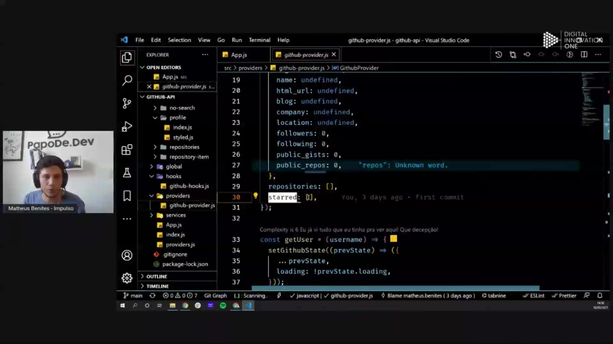
</p>

O hook customizado `github-hooks.js` simplifica o acesso ao contexto. Em vez de importar o `GithubContext` e o `useContext` em cada componente, o desenvolvedor utiliza apenas o `useGithub`, tornando o código mais conciso e legível.

```javascript
import { useContext } from "react";
import { GithubContext } from "../providers/github-provider";

const useGithub = () => {
  const { githubState, getUser, getUserRepos, getUserStarred } =
    useContext(GithubContext);

  return { githubState, getUser, getUserRepos, getUserStarred };
};

export default useGithub;

```

<p align="center">
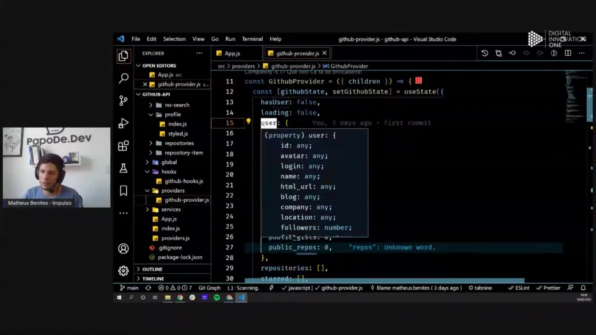
</p>

A configuração do Axios é centralizada em um serviço de API. Definir a `baseURL` como a URL oficial da API do GitHub facilita as chamadas subsequentes, permitindo o uso de caminhos relativos como `users/{username}` em outras partes da aplicação.

```javascript
import axios from "axios";

const api = axios.create({
  baseURL: "https://api.github.com/",
});

export default api;

```

<p align="center">
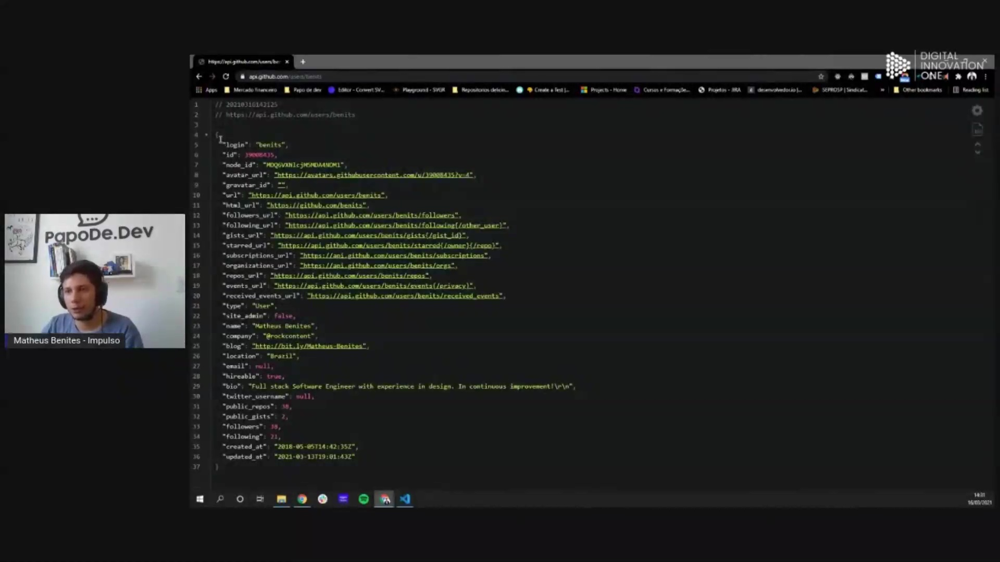
</p>

Para validar a estrutura dos dados retornados, pode-se realizar uma consulta direta à API do GitHub via navegador ou ferramentas de teste. Ao acessar o endpoint de um usuário específico, a API retorna um JSON detalhado com todos os campos necessários para popular o estado global da aplicação.


### 🟩 Vídeo 06 - Criando componentes e explorando o React Hooks

<video width="60%" controls>
  <source src="000-Midia_e_Anexos/tqi_fullstack-modulo.04-curso.06-video_06.webm" type="video/webm">
    Seu navegador não suporta vídeo HTML5.
</video>

link do vídeo: https://web.dio.me/lab/criando-um-front-end-totalmente-componentizado-na-pratica-com-reactjs/learning/14bddee1-5c6e-4f61-b8b6-43962d5d165f

O vídeo apresenta um tutorial técnico sobre o desenvolvimento de uma aplicação React que consome a API do GitHub. O foco central é a organização do código através do uso de Providers (Context API) e Hooks, enfatizando a separação de responsabilidades e a criação de componentes reutilizáveis e desacoplados. O palestrante demonstra como centralizar a lógica de busca de dados e como refatorar a interface para facilitar a manutenção e a escalabilidade do projeto.

### Anotações

<p align="center">
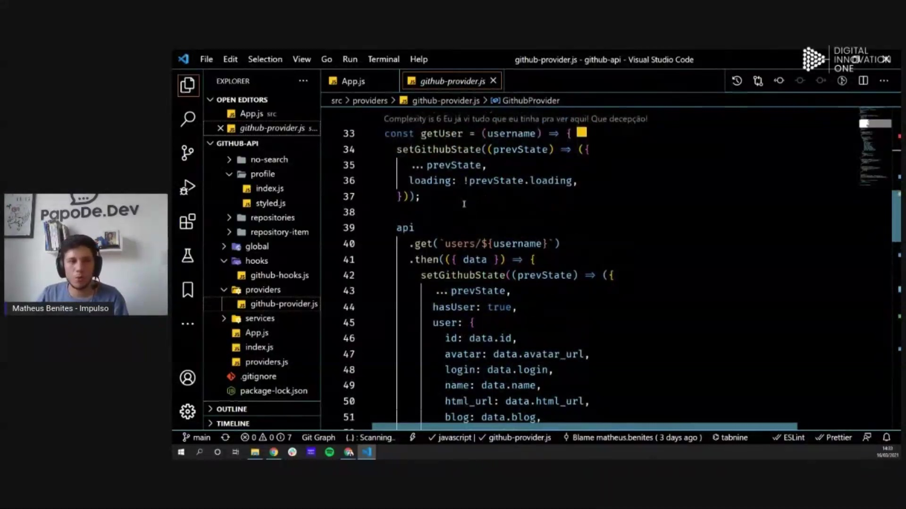
</p>

O instrutor apresenta a estrutura do `GithubProvider`, que atua como a central de dados da aplicação. Este componente é responsável por guardar e buscar as informações, garantindo que o projeto tenha uma única "fonte da verdade". A função `getUser` é destacada como o gatilho que, ao ser acionado pelo botão de busca, recebe um *username* e atualiza o estado do provider com os dados retornados pela API.

```javascript
const getUser = (username) => {
  setGithubState((prevState) => ({
    ...prevState,
    loading: !prevState.loading,
  }));

  api.get(`users/${username}`).then(({ data }) => {
    setGithubState((prevState) => ({
      ...prevState,
      hasUser: true,
      user: {
        id: data.id,
        avatar: data.avatar_url,
        login: data.login,
        name: data.name,
        html_url: data.html_url,
        blog: data.blog,
      },
    }));
  });
};

```

<p align="center">
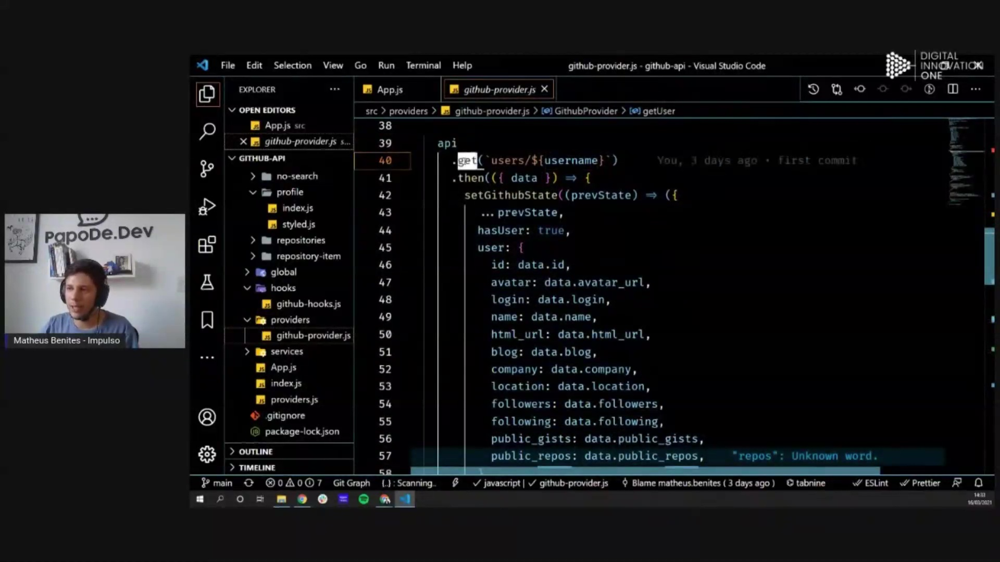
</p>

Para realizar as requisições HTTP, é utilizada a biblioteca Axios. Através do método `axios.create`, define-se uma `baseURL` apontando para a API do GitHub. Esta configuração simplifica as chamadas subsequentes dentro do provider, permitindo que as funções de busca utilizem apenas os caminhos relativos (como `/repos` ou `/starred`) em vez da URL completa.

```javascript
import axios from "axios";

const api = axios.create({
  baseURL: "https://api.github.com/",
});

export default api;

```

<p align="center">
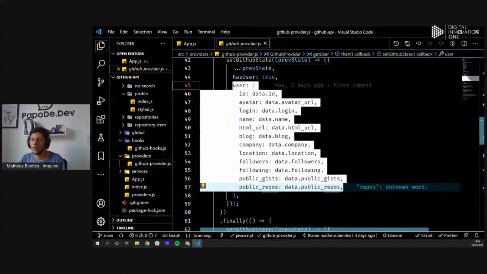
</p>

A organização do `GithubProvider` segue o princípio de responsabilidade única. Além do `getUser`, são implementadas funções específicas como `getUserRepos` e `getUserStarred`. Cada uma foca exclusivamente em retornar sua respectiva lista de dados (repositórios ou favoritos), mantendo o código organizado e fácil de manter.

```javascript
const getUserRepos = (username) => {
  api.get(`users/${username}/repos`).then(({ data }) => {
    setGithubState((prevState) => ({
      ...prevState,
      repositories: data,
    }));
  });
};

const getUserStarred = (username) => {
  api.get(`users/${username}/starred`).then(({ data }) => {
    setGithubState((prevState) => ({
      ...prevState,
      starred: data,
    }));
  });
};

```

<p align="center">
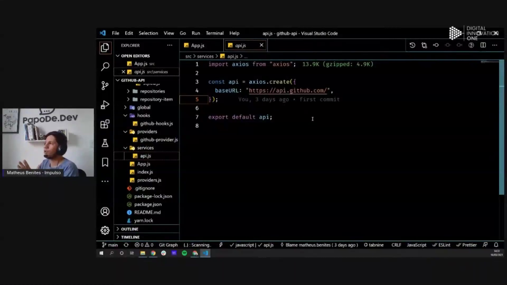
</p>

Para disponibilizar os dados e funções aos componentes filhos, é criada a variável `contextValue`. Ela encapsula o estado e as funções de busca em um único objeto que é passado para o `GithubContext.Provider`. Isso permite que qualquer componente dentro da árvore de renderização acesse as informações de forma reativa.

```javascript
const contextValue = {
  githubState,
  getUser: useCallback((username) => getUser(username), []),
  getUserRepos: useCallback((username) => getUserRepos(username), []),
  getUserStarred: useCallback((username) => getUserStarred(username), []),
};

return (
  <GithubContext.Provider value={contextValue}>
    {children}
  </GithubContext.Provider>
);

```

<p align="center">
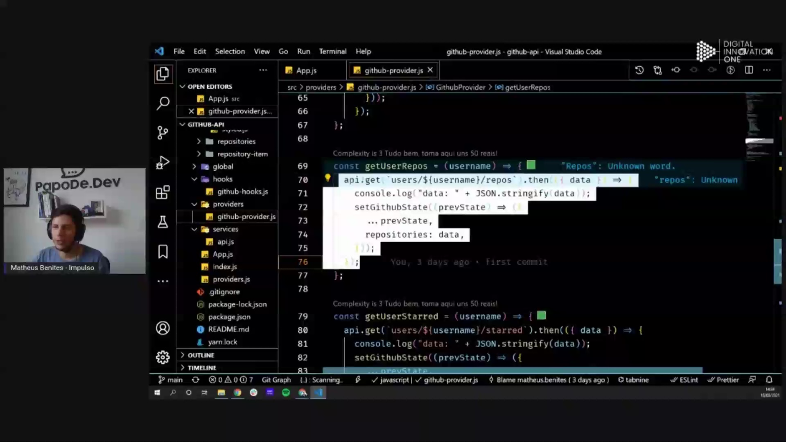
</p>

O instrutor demonstra a técnica de refatoração para melhorar a modularidade. O componente `Profile`, que continha a lógica de exibição do contador de status, é simplificado. O trecho de código referente ao `StatusCount` é extraído para um novo componente independente, facilitando a reutilização e o isolamento de responsabilidades.

<p align="center">
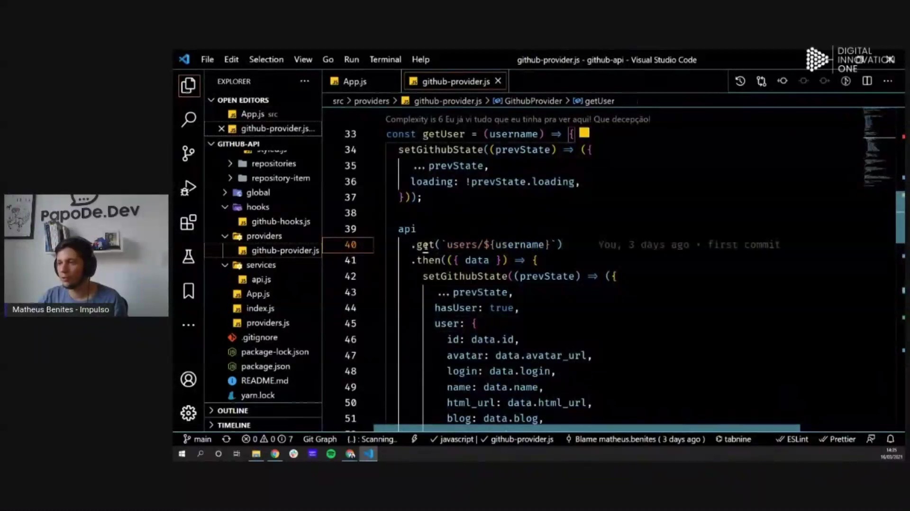
</p>

Após a extração, o novo componente `StatusCount` é configurado. Ele utiliza o hook `useGithub` para acessar os dados necessários diretamente do provider. A lógica foca unicamente em exibir os seguidores, seguindo e a quantidade de repositórios, utilizando componentes estilizados para manter a identidade visual através do `styled-components`.

```javascript
import React from "react";
import useGithub from "../../hooks/github-hooks";
import * as S from "./styled";

const StatusCount = () => {
  const { githubState } = useGithub();

  return (
    <S.WrapperStatusCount>
      <div>
        <h4>Followers</h4>
        <span>{githubState.user.followers}</span>
      </div>
      <div>
        <h4>Followings</h4>
        <span>{githubState.user.following}</span>
      </div>
      <div>
        <h4>Gists</h4>
        <span>{githubState.user.public_gists}</span>
      </div>
      <div>
        <h4>Repos</h4>
        <span>{githubState.user.public_repos}</span>
      </div>
    </S.WrapperStatusCount>
  );
};

export default StatusCount;

```

<p align="center">
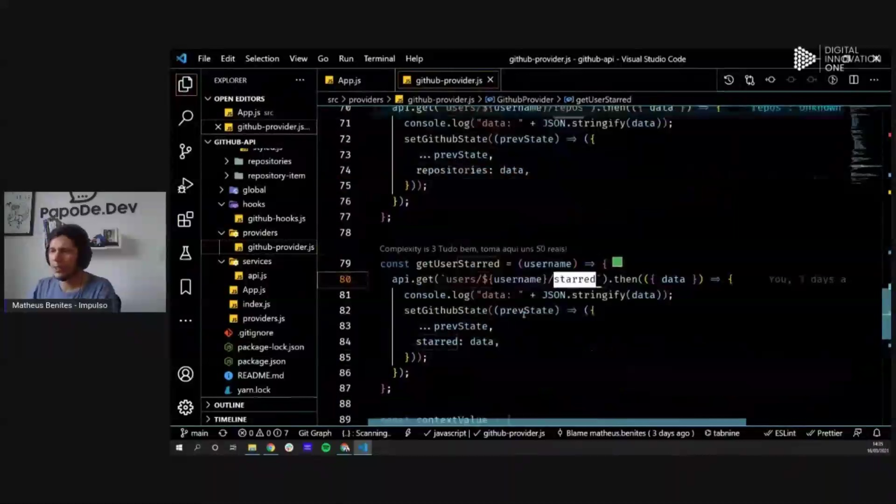
</p>

O processo de desacoplamento é concluído ao importar e inserir o componente `StatusCount` de volta no `Profile`. O instrutor destaca que, embora visualmente o resultado seja o mesmo para o usuário final, a estrutura interna agora é muito mais limpa e permite que o `StatusCount` seja movido ou replicado em qualquer outra parte da interface com facilidade.

<p align="center">
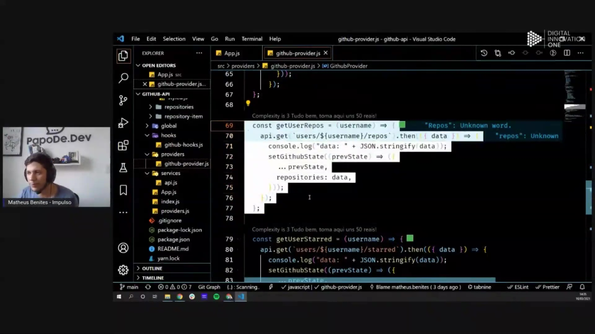
</p>

A eficácia da refatoração é comprovada ao realizar uma nova busca na aplicação (utilizando o perfil de Felipe Deschamps). Os dados são carregados corretamente e o componente `StatusCount`, agora independente, renderiza as informações de seguidores e repositórios sem conflitos, demonstrando o poder do desenvolvimento orientado a componentes reutilizáveis.

<p align="center">
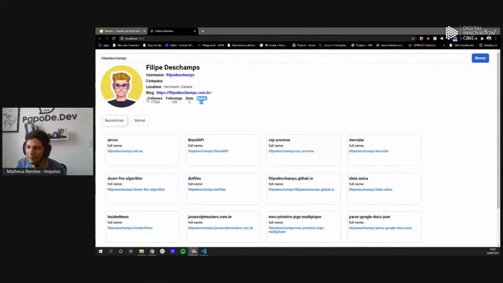
</p>

Por fim, é exemplificada a facilidade de reutilização. O instrutor mostra que o `StatusCount` poderia ser inserido dentro do componente de repositórios ou em qualquer outra lista. Como o componente é autossuficiente e busca seus próprios dados do contexto, ele funciona instantaneamente onde quer que seja colocado, reforçando o conceito de código desacoplado.   


### 🟩 Vídeo 07 - Refinando ainda mais nossos componentes

<video width="60%" controls>
  <source src="000-Midia_e_Anexos/tqi_fullstack-modulo.04-curso.06-video_07.webm" type="video/webm">
    Seu navegador não suporta vídeo HTML5.
</video>

link do vídeo: https://web.dio.me/lab/criando-um-front-end-totalmente-componentizado-na-pratica-com-reactjs/learning/d5a81f2c-6140-4c59-9995-0d05a6805e61

O conteúdo aborda a importância da componentização e da refatoração no desenvolvimento de software, destacando o Princípio da Responsabilidade Única. O orador enfatiza que a criação de códigos limpos, legíveis e reutilizáveis é um processo contínuo que exige paciência, atenção aos detalhes e a capacidade de aprender com os erros, sugerindo que a maturidade técnica para decidir quando e como dividir componentes é uma habilidade desenvolvida com a prática e o tempo.

### Anotações

<p align="center">
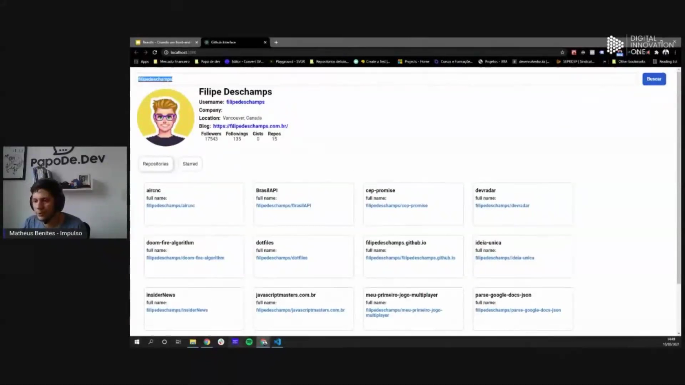
</p>

Nesta etapa, é apresentada a interface final da aplicação que consome a API do GitHub. O componente visual exibe as informações de um perfil de usuário, como o avatar, nome (Filipe Deschamps), localização e estatísticas de seguidores, seguindo e repositórios. O instrutor destaca que, embora o componente de perfil pareça uma unidade, ele foi refatorado para que elementos como o contador de status (`statusCount`) fossem extraídos em componentes menores, garantindo que cada parte do código tenha uma única responsabilidade e seja mais fácil de manter.

<p align="center">
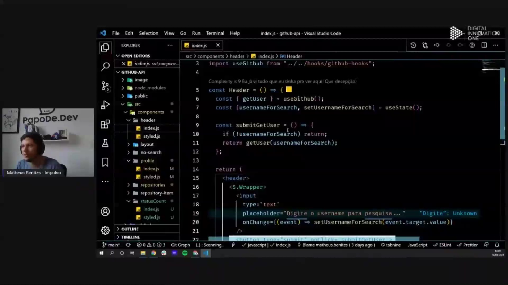
</p>

O código visualizado foca na implementação do componente `Header`, responsável pela funcionalidade de busca da aplicação. Ele utiliza um hook customizado chamado `useGithub` para obter a função `getUser` e gerencia o estado local do nome de usuário digitado através do `useState`. A lógica de submissão verifica se existe um valor no campo de busca antes de disparar a requisição, garantindo que a aplicação não tente buscar usuários com campos vazios.

```javascript
import useGithub from "../../hooks/github-hooks";
// ... (outros imports)

const Header = () => {
  const { getUser } = useGithub();
  const [usernameForSearch, setUsernameForSearch] = useState();

  const submitGetUser = () => {
    if (!usernameForSearch) return;
    return getUser(usernameForSearch);
  };

  return (
    <header>
      <S.Wrapper>
        <input 
          type="text" 
          placeholder="Digite o username para pesquisa..." 
          onChange={(event) => setUsernameForSearch(event.target.value)} 
        />
        {/* ... botão de busca */}
      </S.Wrapper>
    </header>
  );
};

```

<p align="center">
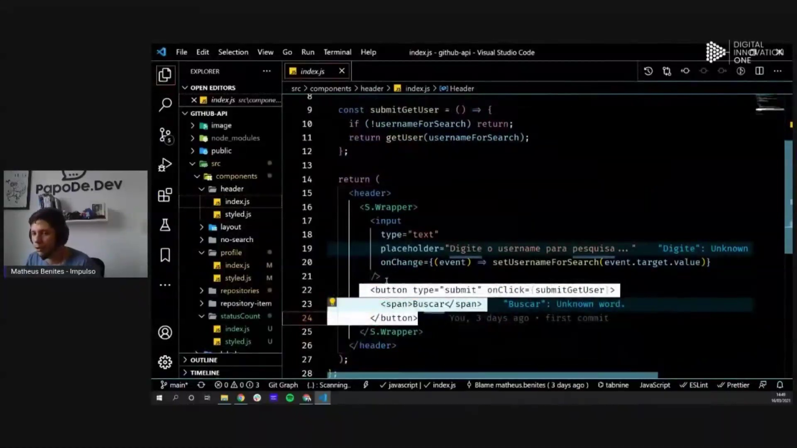
</p>

Abaixo, vemos o fechamento da estrutura JSX do componente `Header`. O botão de busca está vinculado à função `submitGetUser` através do evento `onClick`. O instrutor reforça que esta parte da interface tem a responsabilidade única de capturar a entrada do usuário e acionar a busca, mantendo-se isolada da lógica de exibição dos resultados, que fica a cargo do `layout` e dos componentes de `profile`.

```javascript
        <button type="submit" onClick={submitGetUser}>
          <span>Buscar</span>
        </button>
      </S.Wrapper>
    </header>
  );
};

```

<p align="center">
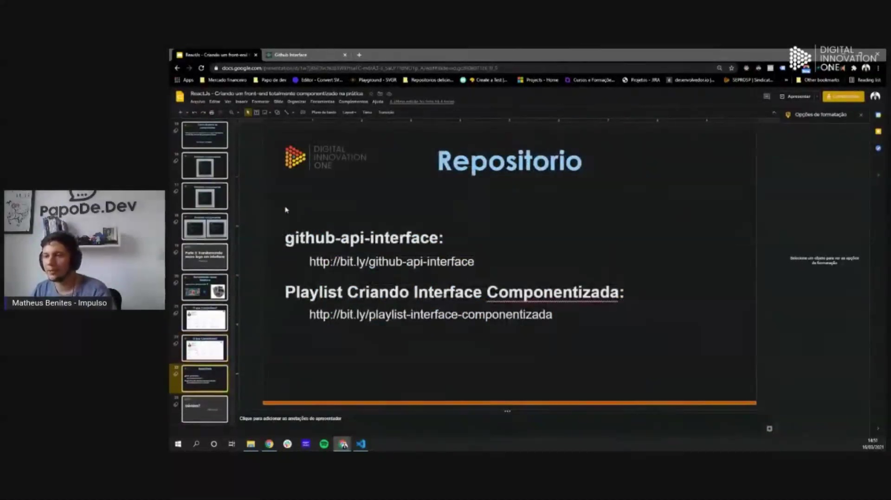
</p>

Ao final da explicação, são disponibilizados os recursos externos para aprofundamento no projeto. Isso inclui o link para o repositório contendo o código-fonte da interface da API do GitHub e o acesso à playlist detalhada, onde o processo de componentização e limpeza de código é demonstrado passo a passo ao longo de aproximadamente três horas de conteúdo técnico.

* **Repositório:** [http://bit.ly/github-api-interface](http://bit.ly/github-api-interface)
* **Playlist:** [http://bit.ly/playlist-interface-componentizada](http://bit.ly/playlist-interface-componentizada)


### 🟩 Vídeo 08 - Dúvidas Parte 1

<video width="60%" controls>
  <source src="000-Midia_e_Anexos/tqi_fullstack-modulo.04-curso.06-video_08.webm" type="video/webm">
    Seu navegador não suporta vídeo HTML5.
</video>

link do vídeo: https://web.dio.me/lab/criando-um-front-end-totalmente-componentizado-na-pratica-com-reactjs/learning/79f2e096-98ed-4191-8a2e-cb2d3e72c013

### 🟩 Vídeo 09 - Dúvidas Parte 2

<video width="60%" controls>
  <source src="000-Midia_e_Anexos/tqi_fullstack-modulo.04-curso.06-video_09.webm" type="video/webm">
    Seu navegador não suporta vídeo HTML5.
</video>

link do vídeo:

### 🟩 Vídeo 10 - Conselhos para quem está começando com ReactJS

<video width="60%" controls>
  <source src="000-Midia_e_Anexos/tqi_fullstack-modulo.04-curso.06-video_10.webm" type="video/webm">
    Seu navegador não suporta vídeo HTML5.
</video>

link do vídeo:

### 🟩 Vídeo 11 - Entendendo o Desafio

<video width="60%" controls>
  <source src="000-Midia_e_Anexos/tqi_fullstack-modulo.04-curso.06-video_11.webm" type="video/webm">
    Seu navegador não suporta vídeo HTML5.
</video>

link do vídeo:


##  Materiais de Apoio

# Certificado: 

- Link na plataforma: 
- Certificado em pdf: 
