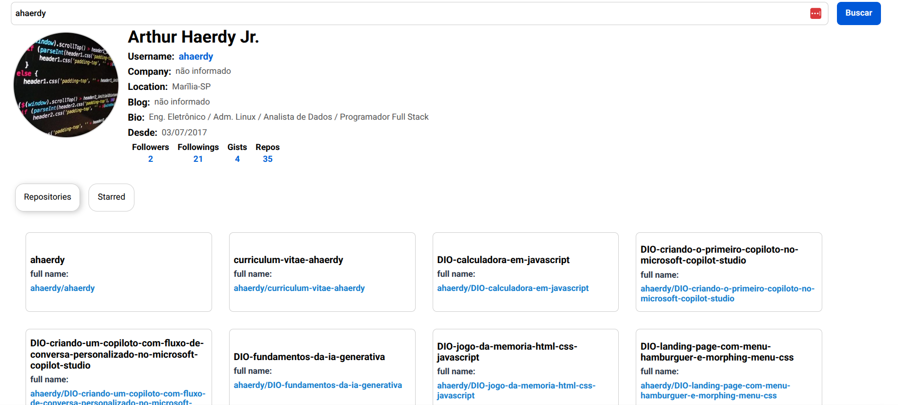

# GitHub Profile Viewer

Aplicação React que consome a API do GitHub para exibir informações de perfil, repositórios e favoritos de qualquer usuário.

<p align="center">
  
</p>

## Funcionalidades
- Busca de usuário do GitHub.
- Exibição de dados de perfil (nome, login, avatar, bio, etc).
- Listagem de repositórios e favoritos (starred).
- Navegação entre abas usando `react-tabs`.
- Estado global gerenciado com Context API + custom hook `useGithub`.

## Tecnologias utilizadas
- React
- Context API
- Styled-components
- React-tabs
- GitHub REST API

## Como executar
1. Clone este repositório:
   ```bash
   git clone https://github.com/seu-usuario/seu-repo.git
   ```
2. Instale as dependências:
   ```bash
   npm install
   ```
3. Execute o projeto:
   ```bash
   npm start
   ```

## 📂 Estrutura principal
- `App.js` → Componente raiz, controla fluxo de renderização.
- `Profile/` → Exibe dados do usuário.
- `Repositories/` → Lista repositórios e favoritos em abas.
- `hooks/github-hooks.js` → Hook para acessar estado global.
- `providers/github-provider.js` → Provider que gerencia estado e chamadas à API.

## 📖 Documentação técnica
O estudo detalhado do projeto, com análise de cada componente e do estado global, está disponível em:

👉 [Etapas para entender o projeto tecnicamente](project_study_log/README.md)

## ✅ Conclusão
Este projeto cumpre seu objetivo de forma simples e clara: consumir a API do GitHub e apresentar informações básicas de perfil e repositórios. A arquitetura está organizada e pronta para evoluir com novas funcionalidades caso seja necessário.


