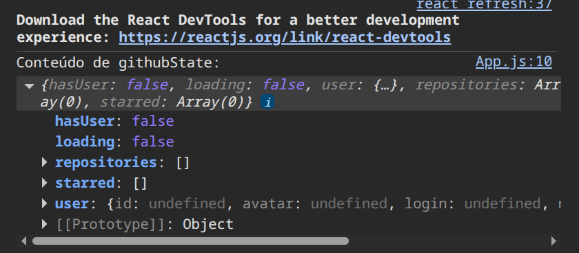
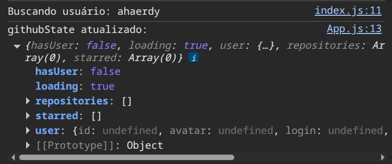
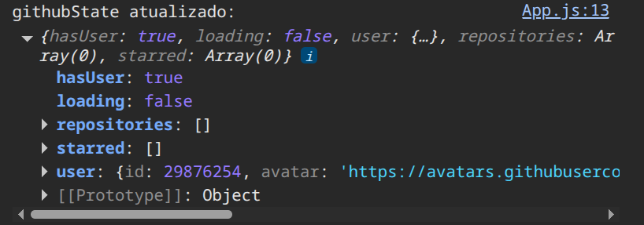
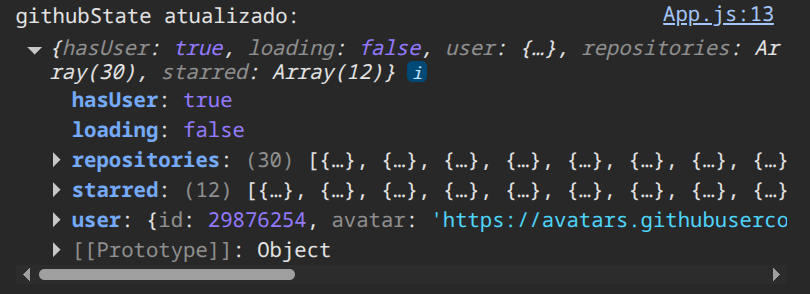

# 🗺️ Etapas para entender o projeto tecnicamente

## 1. **Começando pelo `App.js`**
- É o **componente raiz** da aplicação.
- Mostra como os dados são consumidos e como os componentes principais se organizam.
- Neste caso, ele usa o hook `useGithub()` para acessar o estado global e renderizar condicionalmente:
  - `NoSearch` (se não há usuário)
  - `Profile` e `Repositories` (se há usuário e não está carregando)

🔴 Código: /src/App.js

```javascript
import React from "react";
import Layout from "./components/layout";
import NoSearch from "./components/no-search";
import Profile from "./components/profile";
import Repositories from "./components/repositories";
import useGithub from "./hooks/github-hooks";

const App = () => {
  const { githubState } = useGithub();
  return (
    <Layout>
      {githubState.hasUser ? (
        <>
          {githubState.loading ? (
            <p>Loading</p>
          ) : (
            <>
              <Profile />
              <Repositories />
            </>
          )}
        </>
      ) : (
        <NoSearch />
      )}
    </Layout>
  );
};

export default App;
```

### Verificar posteriormente:
- [doc_github-hooks_js](doc_github-hooks_js.md)
- [doc_github-provider_js](doc_github-provider_js.md)

### Destrinchando a **chamada ao hook** `useGithub()` dentro do contexto do `App.js`:

```js
const { githubState } = useGithub();
```

#### 🔎 O que acontece aqui
1. **Chamada ao hook personalizado**  
   - `useGithub()` é o **custom hook** definido em `github-hooks.js`.  
   - Esse hook usa `useContext(GithubContext)` para acessar o **estado global** e as funções fornecidas pelo `GithubProvider`.

2. **Desestruturação**  
   - O hook retorna um objeto com várias propriedades:  
     ```js
     { githubState, getUser, getUserRepos, getUserStarred }
     ```
   - Aqui pegamos apenas `githubState`, ignorando as funções.

3. **O que é `githubState`**  
   - Estado global com:  
     - `hasUser` → se já foi buscado um usuário.  
     - `loading` → se está carregando dados.  
     - `user` → objeto com dados do usuário.  
     - `repositories` → lista de repositórios.  
     - `starred` → lista de favoritos.

4. **Uso dentro do App.js**  
   - Decide o que renderizar:  
     - `NoSearch` se não há usuário.  
     - `"Loading"` se está carregando.  
     - `Profile` e `Repositories` se já carregou.

---

### 🟥 Analisando o objeto `githubState` em suas etapas

#### 🟥🟥 Estado inicial
```js
{
  hasUser: false,
  loading: false,
  user: { id: undefined, avatar: undefined, login: undefined, ... },
  repositories: [],
  starred: []
}
```



**Comentário:**  
Este é o estado inicial da aplicação. Nenhum usuário foi buscado ainda, não há carregamento em andamento e todos os dados estão vazios. É o ponto de partida antes da interação do usuário.

---

#### 🟥🟥 Estado intermediário (busca iniciada)
```js
Buscando usuário: ahaerdy
{
  hasUser: false,
  loading: true,
  user: { id: undefined, avatar: undefined, login: undefined },
  repositories: [],
  starred: []
}
```



**Comentário:**  
Aqui vemos que a busca foi iniciada. O estado indica `loading: true`, ou seja, a aplicação está aguardando resposta da API. O usuário ainda não foi carregado (`hasUser: false`) e os dados continuam vazios.

---

#### 🟥🟥 Usuário encontrado (dados básicos)
```js
{
  hasUser: true,
  loading: false,
  repositories: [],
  starred: [],
  user: {
    id: 29876254,
    avatar: "https://avatars.githubusercontent.com/u/29876254?v=4",
    login: "ahaerdy"
  }
}
```



**Comentário:**  
Neste ponto, a API já respondeu com sucesso. O usuário foi encontrado (`hasUser: true`) e o carregamento terminou (`loading: false`). O objeto `user` já contém dados reais, mas os repositórios e favoritos ainda não foram carregados.

---

#### 🟥🟥 Estado final completo
```js
{
  hasUser: true,
  loading: false,
  user: {
    id: 29876254,
    avatar: "https://avatars.githubusercontent.com/u/29876254?v=4"
  },
  repositories: [30 itens],
  starred: [12 itens]
}
```



**Comentário:**  
Este é o estado final após todas as requisições. O usuário está carregado, os repositórios foram preenchidos (30 itens) e os favoritos também (12 itens). A aplicação está pronta para renderizar todas as informações na interface.

---

## 2. **Análise do componente `Profile`**
- O `Profile` é responsável por **exibir os dados do usuário** carregados no estado global.
- Ele acessa `githubState` via `useGithub()` e renderiza:
  - `user.name` → Nome completo.  
  - `user.login` → Username do GitHub.  
  - `user.avatar` → Foto de perfil.  
  - `user.html_url` → Link para o perfil.  
  - `user.company`, `user.location`, `user.blog`, `user.bio`, `user.created_at` → informações adicionais.  
  - Contadores (`followers`, `following`, `public_gists`, `public_repos`) → exibidos com links clicáveis.

### 🎯 Objetivos da análise
1. **Confirmar como o `Profile` recebe os dados**  

  - Verificar se está usando `useGithub()` corretamente. ✅ 
  - Garantir que acessa `githubState.user`. ✅

2. **Checar a renderização dos campos**  

  - Validar se `name`, `login`, `avatar`, `html_url`, `company`, `location`, `blog`, `bio` e `created_at` aparecem corretamente. ✅ 
  - Tratar casos em que algum campo pode ser `null` (exibir “não informado”). ✅
  - Implementado no códifo ✅

3. **Validar integração com o estado global**  
  - Confirmar que o `Profile` reage às mudanças do `githubState`.  
  - Evitar erros de acesso a propriedades indefinidas.

4. **Melhorias aplicadas**  
  - Fallbacks (“não informado”). ✅
  - Links clicáveis apenas quando há valor válido. ✅
  - Acessibilidade (atributo `alt` na imagem). ✅ 
  - Responsividade no CSS para mobile.  

<p align="center">
  
</p>

  - Inclusão de bio e data de criação da conta. ✅

