## Instrutor

- Instrutor:  Nathally Souza (Software Engineer | Startup Founder | Javascript, Typescript, Cloud, Frontend, Backend)
- Contato Linkedin: / [nathsouza](https://www.linkedin.com/in/nathsouza/)

## Parte 1 - Primeiros passos na criação de suas tabelas

### 🟩 Vídeo 01 - Introdução ao curso e conceitos iniciais sobre modelo relacional

<video width="60%" controls>
  <source src="000-Midia_e_Anexos/bootcamp_tqi_fullstack-modulo.05-curso.01-video_01.webm" type="video/webm">
    Seu navegador não suporta vídeo HTML5.
</video>

link do vídeo: https://web.dio.me/track/tqi-fullstack-developer/course/mysql-trabalhando-com-as-suas-primeiras-tabelas/learning/daf3ef01-4a38-47d6-9f71-6d6e54b7efe6?autoplay=1

Este vídeo marca o início do curso de MySQL com PHPMyAdmin, ministrado por Natalie, especialista em Customer Experience na fintech Z1. O conteúdo introduz os fundamentos dos bancos de dados relacionais, explorando desde a origem histórica do modelo na década de 60 até conceitos práticos de estruturação de tabelas. O foco principal é demonstrar como a organização estruturada e a atomicidade dos dados são essenciais para a eficiência e escalabilidade das aplicações modernas.

### Anotações

<p align="center">

</p>

Esta aula marca o início do curso de **MySQL com phpMyAdmin**. Ministrada por Nathally Souza, que atua na área de Customer Experience na fintech Z1 , a introdução apresenta os fundamentos necessários para trabalhar com bancos de dados. O foco inicial é estabelecer uma base sólida sobre como as informações são armazenadas e gerenciadas nessas ferramentas.

<p align="center">

</p>

Os **objetivos da aula** são divididos em três pilares fundamentais para o aprendizado prático e teórico:

1. **Compreender o conceito de banco de dados relacional**, que é a base da estrutura que será utilizada.
2. **Conhecer as ferramentas MySQL e phpMyAdmin**, entendendo como elas interagem.
3. **Criar a primeira tabela**, aplicando os conhecimentos na prática.

<p align="center">

</p>

Para acompanhar o curso, os **requisitos básicos** são simples:

* **Navegador de internet**: Ferramenta indispensável para acessar a interface do phpMyAdmin.
* **VS Code**: O uso do editor de código é opcional, porém recomendado para digitar e organizar as queries (consultas) que serão executadas, facilitando o compartilhamento posterior em plataformas como o GitHub.

<p align="center">

</p>

O **objetivo central do curso** é capacitar o aluno a criar tabelas e manipular dados utilizando comandos MySQL dentro do ambiente phpMyAdmin. O aprendizado será estruturado em torno de quatro operações essenciais:

* **Criação** de tabelas.
* **Inserção** de novos dados no sistema.
* **Consulta** às informações armazenadas.
* **Exclusão** (deletar) de dados quando necessário.

<p align="center">

</p>

O **modelo relacional** é um conceito fundamental proposto por Edgar Codd na década de 60, enquanto trabalhava na IBM. Sua estrutura baseia-se em três elementos principais:

* **Entidades**: Que correspondem às tabelas propriamente ditas (ex: uma tabela "Pessoas").
* **Atributos**: Que são os campos ou colunas da tabela (ex: nome e altura).
* **Chaves**: Elementos fundamentais que permitem estabelecer o relacionamento entre os dados de diferentes tabelas.

<p align="center">

</p>

A utilização de tabelas é justificada por três fatores críticos para a gestão de informações:

* **Dados estruturados**: Mantém as informações organizadas, evitando que fiquem dispersas e exijam processamento excessivo para serem localizadas.
* **Atomicidade**: Garante que o dado seja único e indivisível em seu campo. Em vez de agrupar várias informações em uma coluna de "características", divide-se em colunas específicas como "cor do cabelo" ou "altura", tornando cada dado atômico.
* **Simplificação**: Facilita a consulta e a manipulação de grandes volumes de dados de forma eficiente.

### 🟩 Vídeo 02 - Ferramentas e configuração do ambiente

<video width="60%" controls>
  <source src="000-Midia_e_Anexos/bootcamp_tqi_fullstack-modulo.05-curso.01-video_02.webm" type="video/webm">
    Seu navegador não suporta vídeo HTML5.
</video>

link do vídeo: https://web.dio.me/track/tqi-fullstack-developer/course/mysql-trabalhando-com-as-suas-primeiras-tabelas/learning/85acd077-edce-468e-977c-5b6f328e7c55?autoplay=1

Este conteúdo apresenta uma introdução prática ao ecossistema de bancos de dados, focando no MySQL e no PHPMyAdmin. O instrutor destaca a relevância dessas ferramentas no mercado de trabalho, explica a lógica de abstração de dados do cotidiano para o formato de tabelas e fornece um guia técnico para a configuração do ambiente de desenvolvimento utilizando o pacote XAMPP em diferentes sistemas operacionais (Windows, macOS e Linux).

### Anotações

<p align="center">
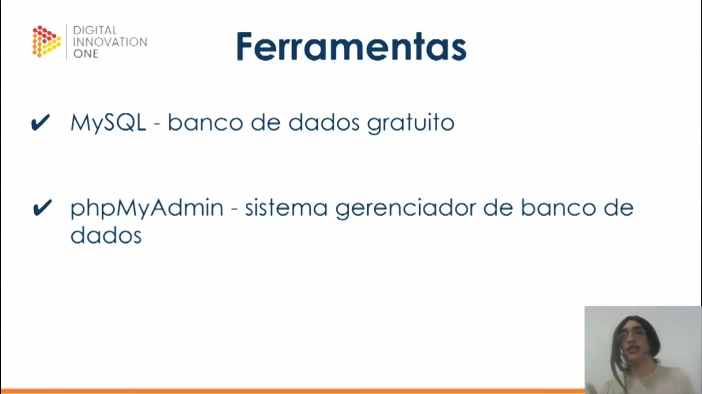
</p>

Nesta introdução, apresentamos as ferramentas fundamentais que serão exploradas ao longo do curso. O foco principal é o **MySQL**, um banco de dados gratuito e amplamente adotado no mercado de trabalho. Compreender o funcionamento do MySQL fornece uma base sólida, pois a lógica de comandos e queries é muito semelhante em outros sistemas de banco de dados disponíveis. Complementarmente, utilizaremos o **phpMyAdmin**, um sistema gerenciador de banco de dados prático e acessível, capaz de rodar via localhost na maioria dos computadores corporativos.

<p align="center">

</p>

Para consolidar os conceitos iniciais, propomos um exercício de abstração focado em transformar situações cotidianas em estruturas de dados. O objetivo é identificar **entidades** e **atributos**. Um exemplo prático é a conversão de uma lista de compras em uma tabela:

* **Item:** Tomate, arroz, feijão (respeitando a atomicidade dos dados).
* **Quantidade:** Volume necessário de cada item.
* **Preço:** Valor unitário e total.

Essa prática ajuda a compreender como a organização em tabelas facilita o controle e a consulta de informações complexas.

<p align="center">
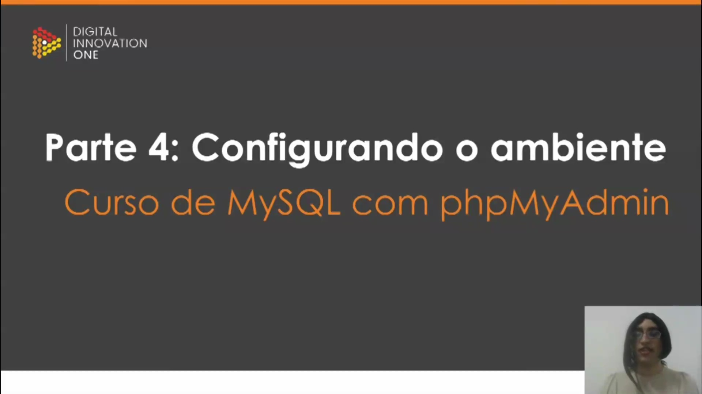
</p>

Iniciamos agora a quarta parte do curso, dedicada exclusivamente à **configuração do ambiente**. Após compreendermos a teoria e a importância da abstração de dados, o próximo passo é preparar as ferramentas técnicas para que possamos criar nossas próprias tabelas e executar comandos MySQL no ambiente real de desenvolvimento.

<p align="center">
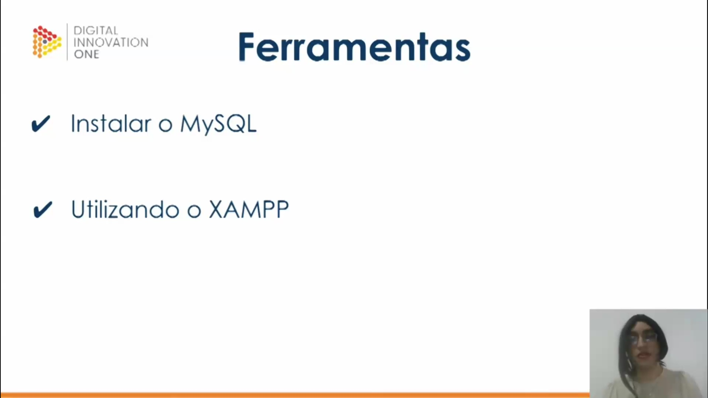
</p>

Para montar o ambiente de trabalho, focaremos na instalação do **MySQL** através do **XAMPP**. O XAMPP funciona como uma "pilha" (stack) de aplicações que integra em um único instalador o servidor Apache, o banco de dados MySQL, a linguagem PHP e o gerenciador phpMyAdmin. Embora a instalação em Windows e macOS seja um processo simplificado de "avançar e aceitar", abordaremos as particularidades necessárias para que o ambiente funcione corretamente em diferentes sistemas operacionais.

<p align="center">
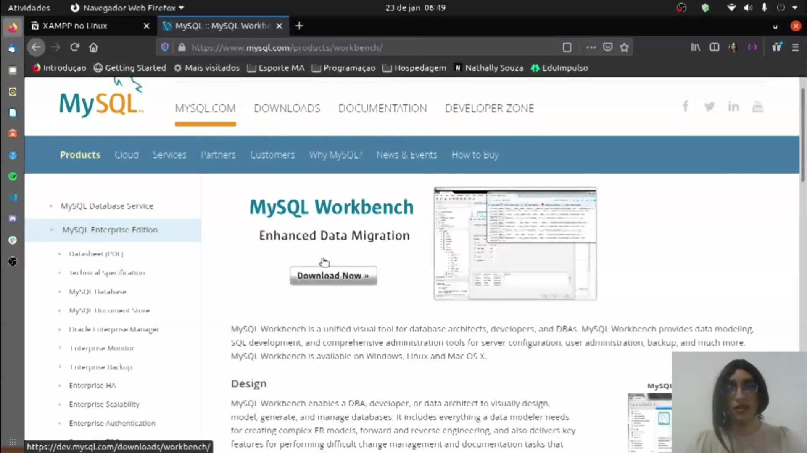
</p>

Como alternativa visual para o gerenciamento de bancos de dados, exploramos o **MySQL Workbench**. Trata-se de uma ferramenta unificada para arquitetos de dados e desenvolvedores que permite modelagem SQL e administração de servidores. Embora o XAMPP já forneça o phpMyAdmin, o Workbench é apresentado como uma opção robusta e muito comum no dia a dia profissional, disponível para Windows, Linux e macOS.

<p align="center">
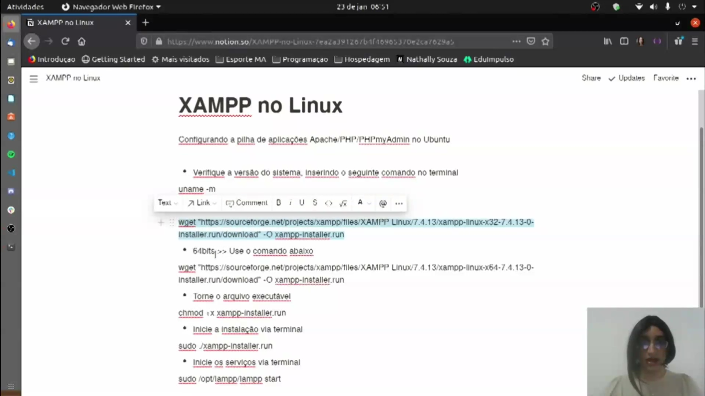
</p>

A configuração do ambiente no Linux (Ubuntu) exige o uso do terminal para garantir que as permissões e versões estejam corretas. Abaixo, detalhamos o passo a passo dos comandos necessários para baixar, preparar e iniciar a pilha de aplicações:

```bash
# 1. Verifique a versão do seu sistema (32 ou 64 bits)
uname -m

# 2. Download do instalador (Exemplo para 64 bits versão 7.4.13)
wget "https://sourceforge.net/projects/xampp/files/XAMPP%20Linux/7.4.13/xampp-linux-x64-7.4.13-0-Installer.run/download" -O xampp-installer.run

# 3. Torne o arquivo baixado um executável
chmod +x xampp-installer.run

# 4. Inicie a instalação (requer privilégios de superusuário)
sudo ./xampp-installer.run

# 5. Após a instalação, inicie os serviços do XAMPP
sudo /opt/lampp/lampp start

```

Após a execução do comando de `start`, os serviços Apache e MySQL estarão ativos, permitindo o acesso ao gerenciador através do endereço `localhost/phpmyadmin` no navegador.      


### 🟩 Vídeo 03 - Criando tabelas

<video width="60%" controls>
  <source src="000-Midia_e_Anexos/bootcamp_tqi_fullstack-modulo.05-curso.01-video_03.webm" type="video/webm">
    Seu navegador não suporta vídeo HTML5.
</video>

link do vídeo: https://web.dio.me/track/tqi-fullstack-developer/course/mysql-trabalhando-com-as-suas-primeiras-tabelas/learning/a6c57d77-1cc1-4583-a905-d0069ddac255?autoplay=1

O vídeo apresenta um tutorial prático sobre a criação de tabelas em bancos de dados MySQL, utilizando tanto comandos SQL manuais quanto a interface do PHPMyAdmin. O instrutor enfatiza a importância de seguir boas práticas de sintaxe, como o uso de letras maiúsculas para comandos e indentação, e destaca a necessidade crucial de definir uma Chave Primária (Primary Key) e o Auto Incremento para que as tabelas sejam funcionais e permitam a manipulação de dados de forma eficiente.

### Anotações

<p align="center">
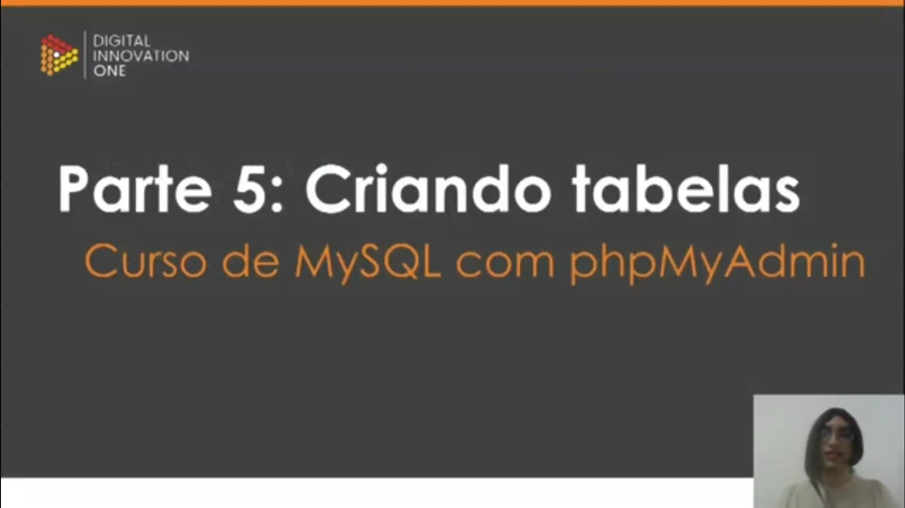
</p>

Esta aula introduz a criação de tabelas em bancos de dados utilizando o MySQL. O comando fundamental para esta tarefa é o `CREATE TABLE`, que mantém uma sintaxe padronizada independentemente da ferramenta de gerenciamento utilizada, seja o phpMyAdmin, PostgreSQL ou o MySQL Workbench. O objetivo inicial é demonstrar como estruturar uma tabela do tipo "pessoa" definindo seus atributos básicos.

<p align="center">
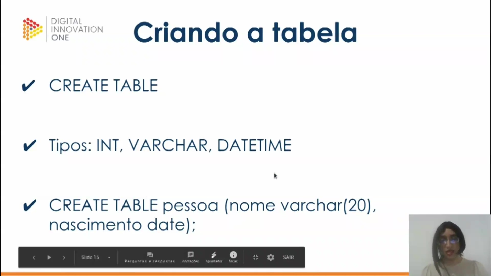
</p>

A definição de atributos em uma tabela requer a especificação do nome da coluna e do tipo de dado que ela irá armazenar. No exemplo apresentado, a tabela "pessoa" possui o atributo "nome", configurado como `VARCHAR(20)` para aceitar textos de até 20 caracteres, e o atributo "nascimento", configurado como `DATE` para armazenar datas.

```sql
CREATE TABLE pessoa (nome varchar(20), nascimento date);

```

<p align="center">
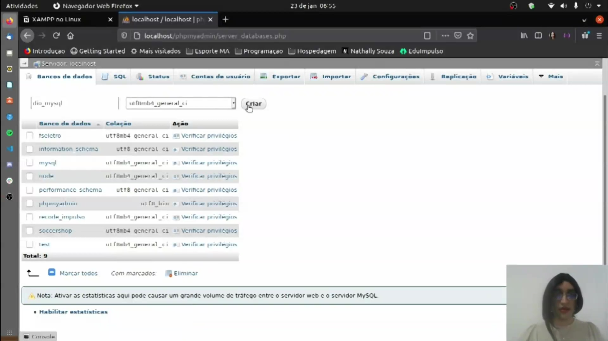
</p>

Antes de proceder com a criação de tabelas, é necessário estabelecer o ambiente dentro do phpMyAdmin. O processo começa pela aba "Bancos de dados", onde um novo esquema chamado `dio_mysql` é criado para organizar as tabelas que serão desenvolvidas ao longo da prática.

<p align="center">
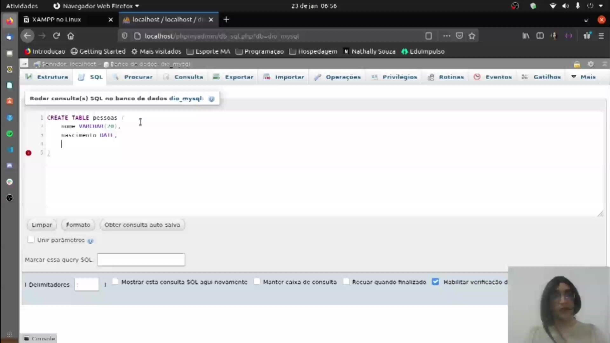
</p>

Utilizando a aba "SQL" do phpMyAdmin, é possível inserir os comandos manualmente. Como boa prática de programação em SQL, recomenda-se escrever as palavras-chave do comando em letras maiúsculas (como `CREATE TABLE`) e utilizar a indentação para separar os atributos, o que facilita a leitura e a compreensão da estrutura da tabela por outros desenvolvedores.

```sql
CREATE TABLE pessoas (
    nome VARCHAR(20),
    nascimento DATE
);

```

<p align="center">
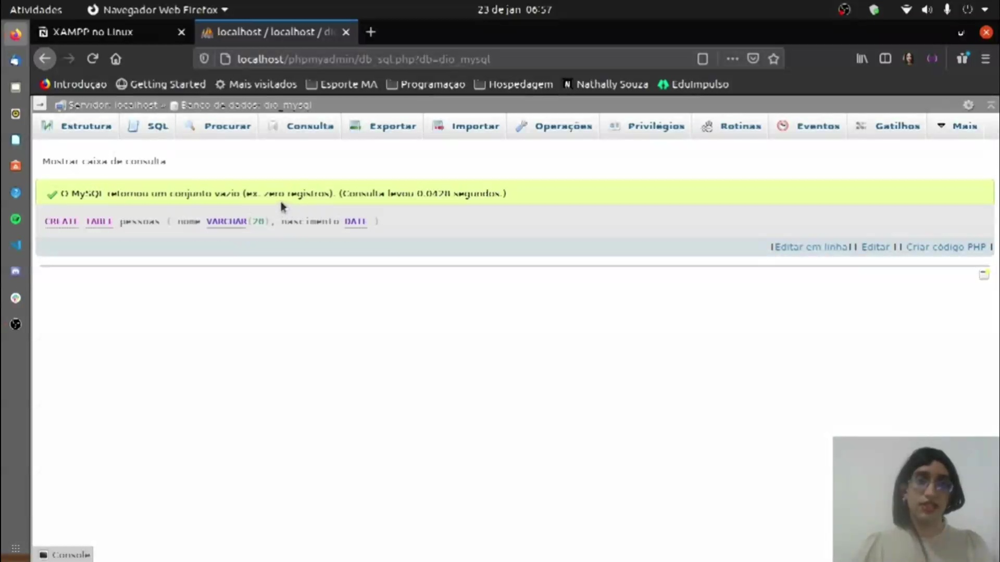
</p>

Após a execução do comando SQL, o sistema retorna uma mensagem confirmando que o MySQL processou a solicitação com sucesso, resultando em um conjunto vazio. Isso indica que a tabela foi devidamente criada na estrutura do banco de dados, embora ainda não contenha nenhum dado inserido.

<p align="center">
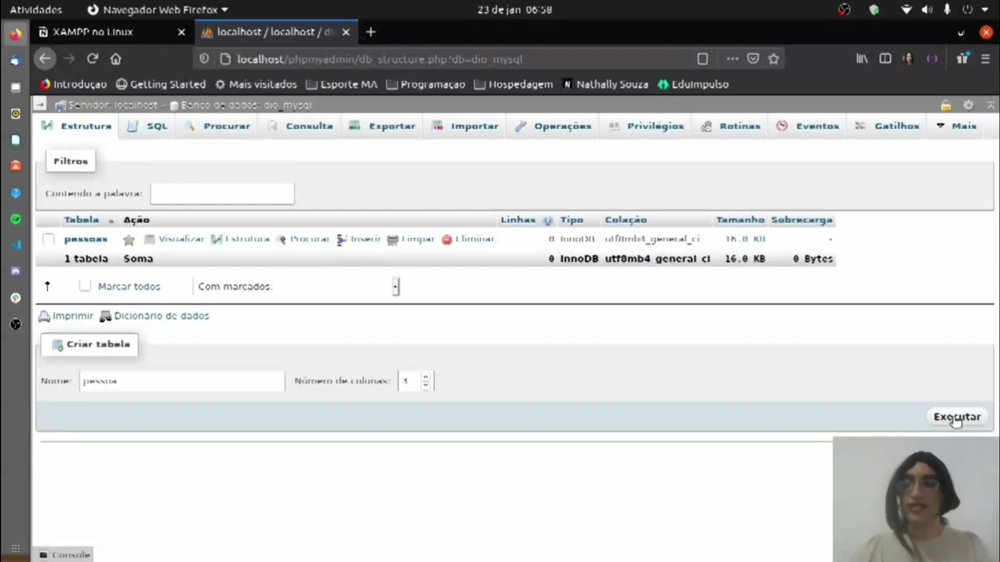
</p>

Ao visualizar a aba "Estrutura" da tabela recém-criada, é possível confirmar as colunas "nome" e "nascimento". Entretanto, nota-se que sem a definição de chaves ou índices específicos, a interface de gerenciamento pode limitar certas operações de manipulação, evidenciando a necessidade de elementos estruturais mais avançados para tornar a tabela plenamente funcional.

<p align="center">
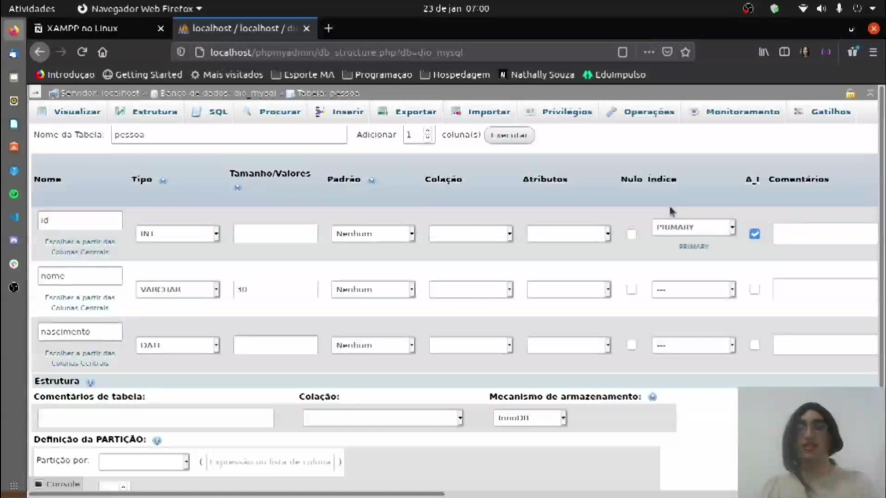
</p>

Para otimizar a criação, o phpMyAdmin oferece uma interface visual onde se define o campo "id" como um número inteiro (`INT`). Nesta etapa, ativa-se a opção "A_I" (Auto Increment), que garante que cada novo registro inserido receba automaticamente um identificador único e sequencial, facilitando a organização dos dados.

<p align="center">
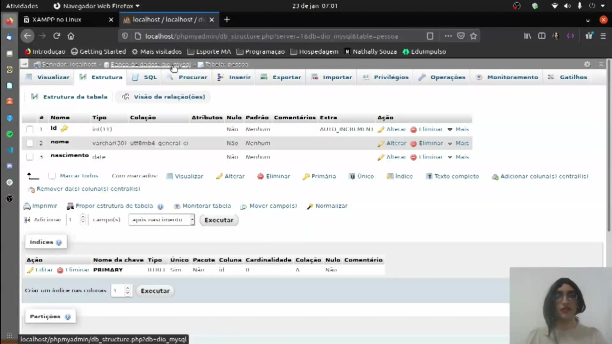
</p>

A configuração final da tabela exige a definição de uma Primary Key (Chave Primária). Este elemento é obrigatório e crucial para o funcionamento do banco de dados, pois permite que o sistema identifique, localize, altere ou delete registros específicos de forma eficiente. Uma tabela sem chave primária compromete a integridade e a utilidade das consultas e operações futuras.      


### 🟩 Vídeo 04 - Inserindo dados na tabela

<video width="60%" controls>
  <source src="000-Midia_e_Anexos/bootcamp_tqi_fullstack-modulo.05-curso.01-video_04.webm" type="video/webm">
    Seu navegador não suporta vídeo HTML5.
</video>

link do vídeo: https://web.dio.me/track/tqi-fullstack-developer/course/mysql-trabalhando-com-as-suas-primeiras-tabelas/learning/affaa006-7cdb-46d7-bf28-8843e38a0a13?autoplay=1

O vídeo consiste em um tutorial prático sobre a inserção de dados em bancos de dados MySQL utilizando o comando INSERT INTO. O instrutor demonstra como cadastrar informações (nome e data de nascimento) através do phpMyAdmin, enfatizando a importância da estrutura das tabelas, a formatação correta de dados (especialmente datas no padrão americano) e o papel fundamental da Chave Primária (Primary Key) com auto-incremento para a integridade e manipulação eficiente dos registros.

### Anotações

<p align="center">
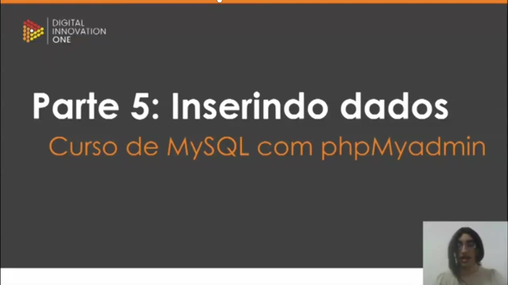
</p>

Nesta etapa, inicia-se o processo de **inserção de dados** em tabelas MySQL, uma funcionalidade essencial para realizar cadastros e criar registros de informações. O comando fundamental para realizar essa operação é o `INSERT INTO`, que permite persistir dados desde que estes respeitem os critérios e tipos definidos previamente na estrutura da tabela.

<p align="center">
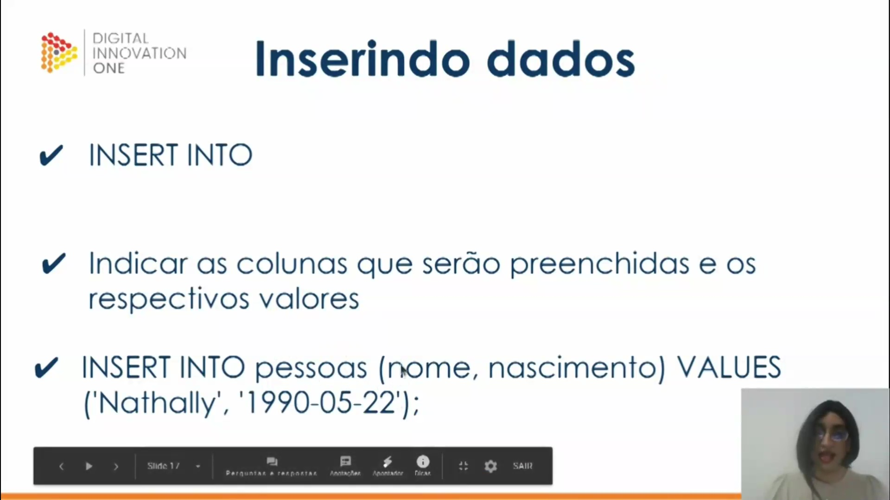
</p>

Para utilizar o comando `INSERT INTO`, é necessário indicar o nome da tabela alvo, as colunas que serão preenchidas e os respectivos valores. Um ponto de atenção importante é o formato de data utilizado pelo MySQL, que segue o padrão americano (`AAAA-MM-DD`).

```sql
INSERT INTO pessoas (nome, nascimento) VALUES ('Nathally', '1990-05-22');

```

<p align="center">
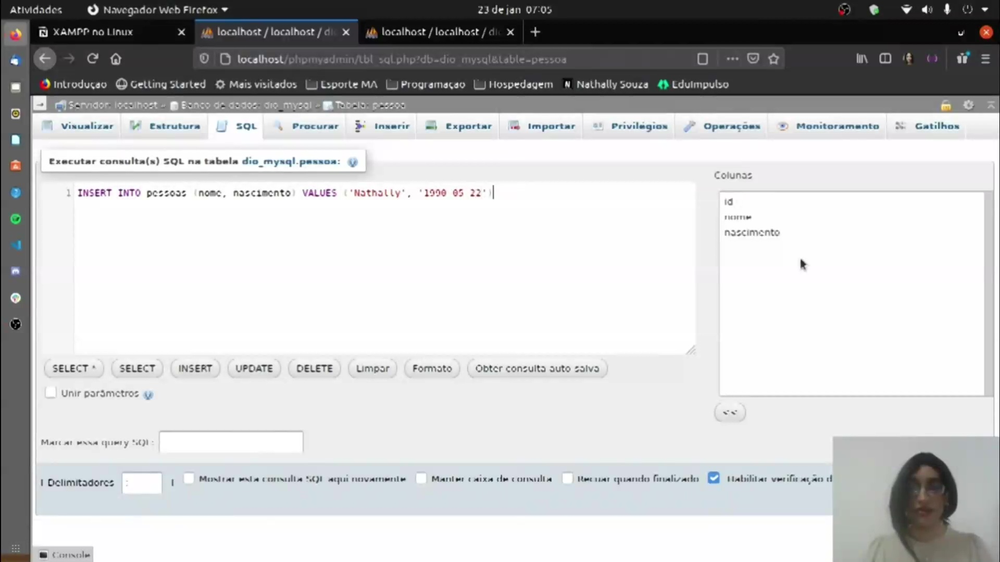
</p>

Na prática, dentro da interface do **phpMyAdmin**, o comando é executado na aba SQL. No exemplo abaixo, a inserção é realizada na tabela `pessoas` (no plural), informando apenas os campos de nome e nascimento. Como os valores são strings e datas, eles devem ser passados entre aspas simples.

```sql
INSERT INTO pessoas (nome, nascimento) VALUES ('Nathally', '1990-05-22');

```

<p align="center">
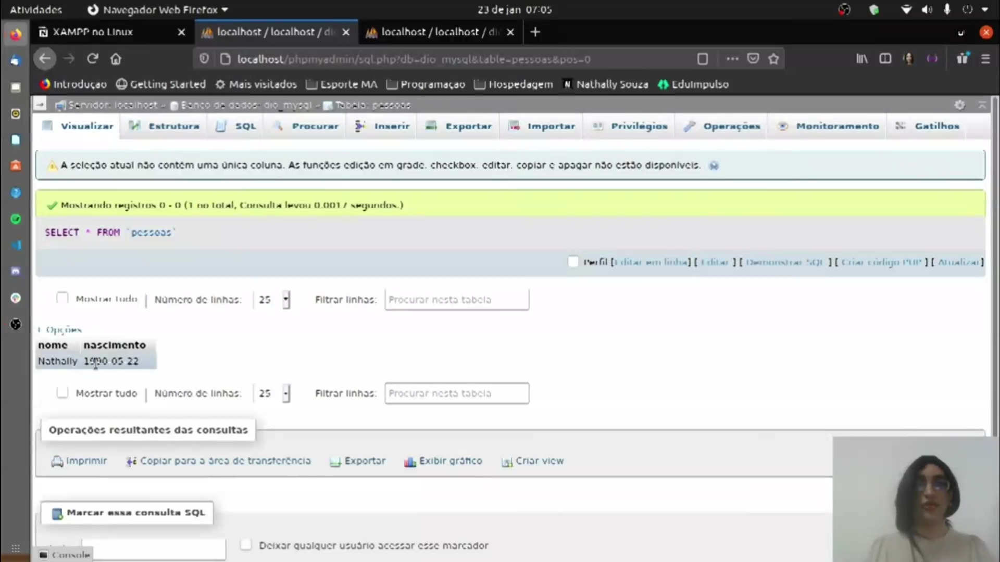
</p>

Ao visualizar os dados inseridos na tabela `pessoas`, observa-se que o registro foi criado com sucesso. No entanto, nota-se uma limitação importante: como esta tabela específica não possui uma **Primary Key** (Chave Primária), a interface do phpMyAdmin não oferece opções diretas para editar ou excluir a linha individualmente em modo de grade. Isso ocorre porque o sistema não possui um identificador único e garantido para diferenciar esse registro de outros que possam ter dados idênticos.

<p align="center">
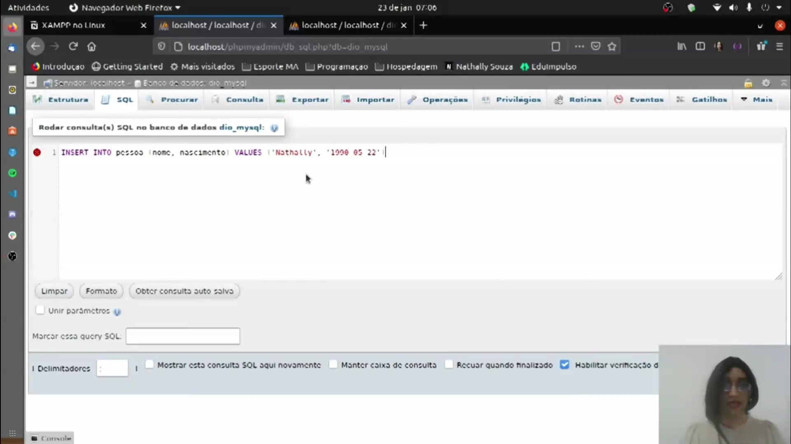
</p>

Agora, o mesmo procedimento de inserção é realizado na tabela `pessoa` (no singular), que foi estruturada para incluir uma coluna de ID. Note que, embora a tabela possua três colunas (id, nome e nascimento), apenas as colunas de nome e data de nascimento são referenciadas no comando SQL.

```sql
INSERT INTO pessoa (nome, nascimento) VALUES ('Nathally', '1990-05-22');

```

<p align="center">
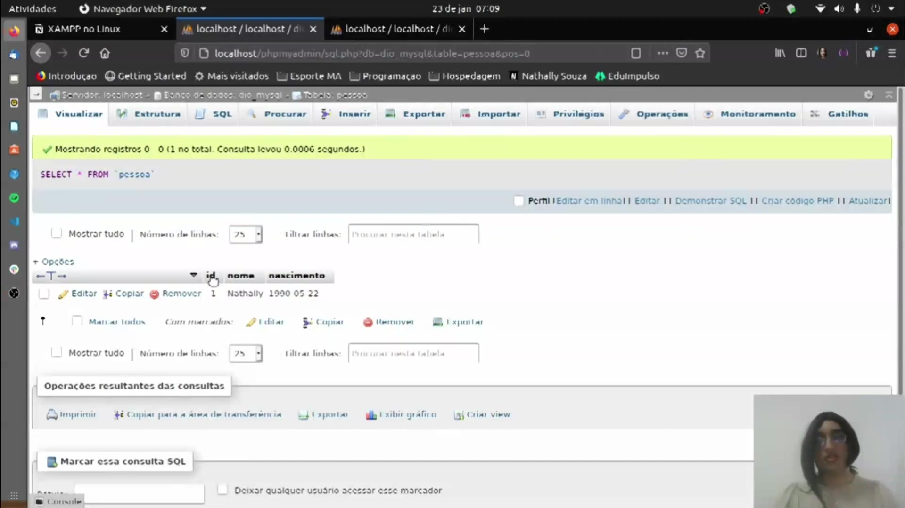
</p>

Ao conferir o resultado na tabela `pessoa`, percebe-se que o campo **ID** foi preenchido automaticamente com o valor "1". Isso acontece devido à propriedade de **auto-incremento** configurada na criação da tabela. A presença desta Primary Key é fundamental, pois ela funciona como a "certidão de nascimento" do dado, permitindo que o MySQL diferencie registros de forma única e habilite funções de manipulação, como as opções de "Editar", "Copiar" e "Remover" visíveis na interface.


### 🟩 Vídeo 05 - Dicas e dúvidas

<video width="60%" controls>
  <source src="000-Midia_e_Anexos/bootcamp_tqi_fullstack-modulo.05-curso.01-video_05.webm" type="video/webm">
    Seu navegador não suporta vídeo HTML5.
</video>

link do vídeo: https://web.dio.me/track/tqi-fullstack-developer/course/mysql-trabalhando-com-as-suas-primeiras-tabelas/learning/ecad526b-8ae8-4cb2-96d8-3528fa4711a8?autoplay=1


Este vídeo marca a conclusão do primeiro módulo de um curso de MySQL e Workbench, focando na transição da teoria para a prática de desenvolvimento. O instrutor demonstra como organizar e salvar scripts SQL utilizando o VS Code, reforça a importância do versionamento de código via GitHub e exemplifica a criação de tabelas e inserção de dados, destacando que aplicações reais dependem de comandos programáticos em vez de interfaces gráficas.

### Anotações

<p align="center">
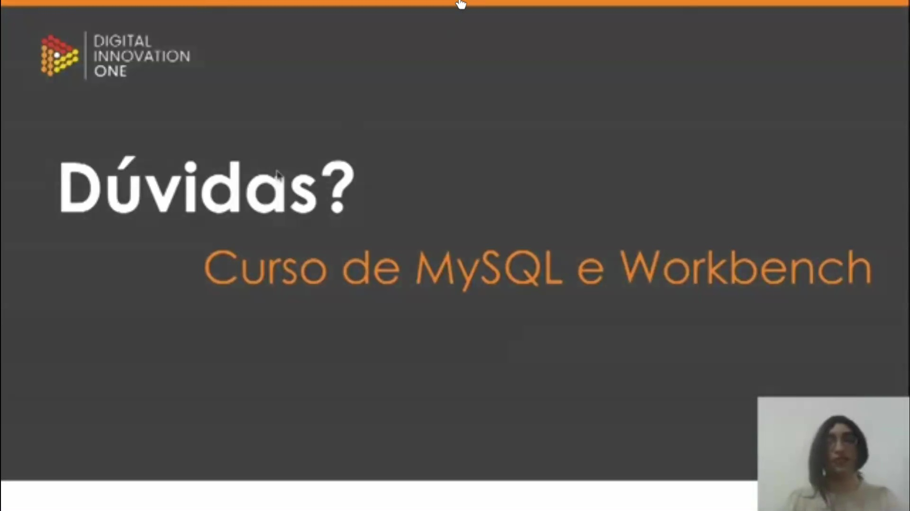
</p>

O curso de MySQL e Workbench foca na fundamentação prática de bancos de dados relacionais. Ao concluir o módulo de inserção de dados, é essencial consolidar o que foi aprendido, organizando os comandos SQL para facilitar o compartilhamento do conhecimento e a manutenção do código em plataformas de colaboração.

<p align="center">
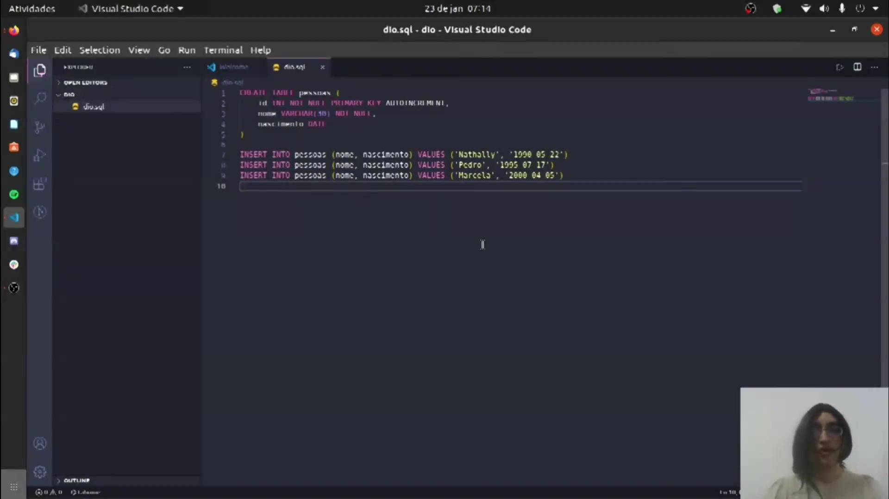
</p>

Para gerenciar os scripts SQL, utiliza-se o Visual Studio Code para criar arquivos com a extensão `.sql`. Isso permite estruturar a criação de tabelas e a inserção de registros de forma organizada. No exemplo, a tabela "pessoas" é definida com um campo `id` de incremento automático, garantindo a unicidade de cada registro sem intervenção manual.

```sql
CREATE TABLE pessoas (
    id INT NOT NULL PRIMARY KEY AUTO_INCREMENT,
    nome VARCHAR(30) NOT NULL,
    nascimento DATE
);

INSERT INTO pessoas (nome, nascimento) VALUES ('Nathally', '1990-05-22');
INSERT INTO pessoas (nome, nascimento) VALUES ('Pedro', '1995-07-17');
INSERT INTO pessoas (nome, nascimento) VALUES ('Marcela', '2000-04-05');

```

<p align="center">
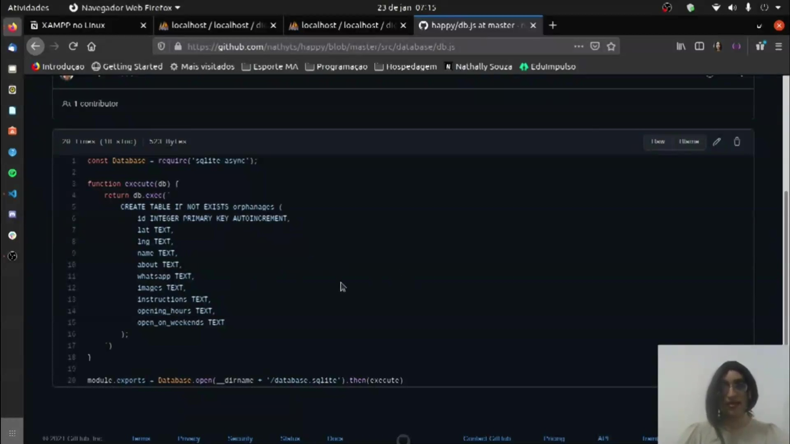
</p>

Em ambientes de desenvolvimento real, os comandos SQL são integrados diretamente na lógica da aplicação. Através de arquivos de configuração de banco de dados (como um arquivo `.js` em projetos Node.js), a aplicação executa instruções como `CREATE TABLE IF NOT EXISTS` para garantir que a infraestrutura de dados necessária esteja presente no momento em que o sistema é iniciado, automatizando o processo que antes era feito manualmente via interface gráfica.

```javascript
const Database = require('sqlite-async');

function execute(db) {
    return db.exec(`
        CREATE TABLE IF NOT EXISTS orphanages (
            id INTEGER PRIMARY KEY AUTO_INCREMENT,
            lat TEXT,
            lng TEXT,
            name TEXT,
            about TEXT,
            whatsapp TEXT,
            images TEXT,
            instructions TEXT,
            opening_hours TEXT,
            open_on_weekends TEXT
        );
    `);
}

module.exports = Database.open(__dirname + '/database.sqlite').then(execute);

```      


## Parte 2 - Realizando manutenção de suas tabelas

### 🟩 Vídeo 06 - Selecionando e alterando dados

<video width="60%" controls>
  <source src="000-Midia_e_Anexos/bootcamp_tqi_fullstack-modulo.05-curso.01-video_06.webm" type="video/webm">
    Seu navegador não suporta vídeo HTML5.
</video>

link do vídeo:

### 🟩 Vídeo 07 - Deletando e ordenando dados

<video width="60%" controls>
  <source src="000-Midia_e_Anexos/bootcamp_tqi_fullstack-modulo.05-curso.01-video_07.webm" type="video/webm">
    Seu navegador não suporta vídeo HTML5.
</video>

link do vídeo:

### 🟩 Vídeo 08 - Agrupando dados

<video width="60%" controls>
  <source src="000-Midia_e_Anexos/bootcamp_tqi_fullstack-modulo.05-curso.01-video_08.webm" type="video/webm">
    Seu navegador não suporta vídeo HTML5.
</video>

link do vídeo:

## Certificado - MySQL - Trabalhando com suas Primeiras Tabelas

Link do certificado: 