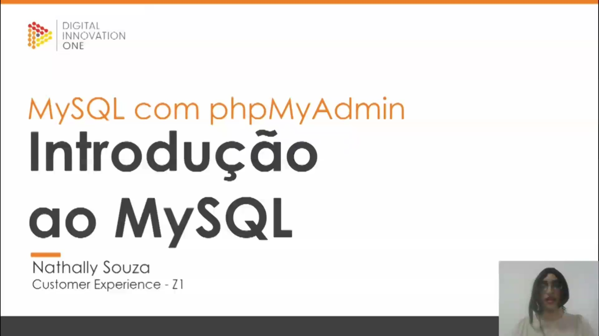
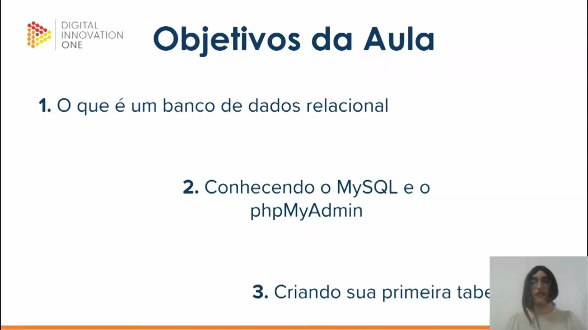
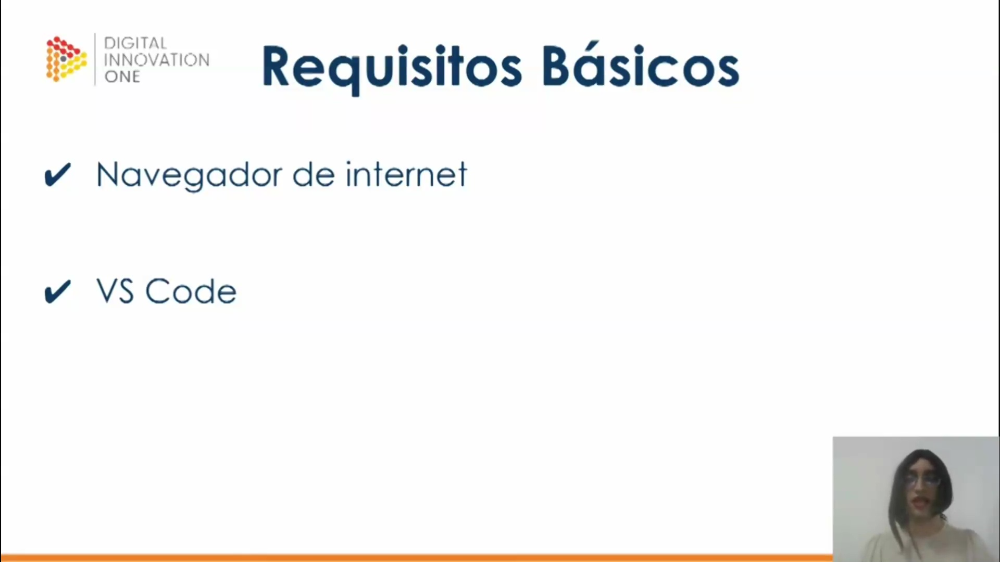
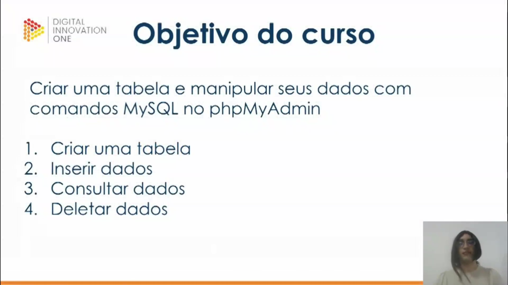
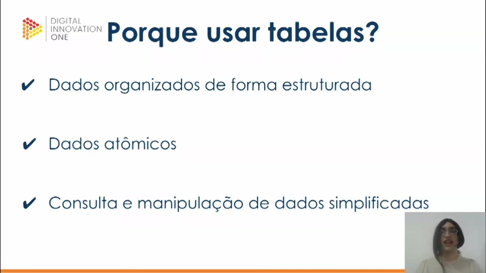

## Instrutor

- Instrutor:  Nathally Souza (Software Engineer | Startup Founder | Javascript, Typescript, Cloud, Frontend, Backend)
- Contato Linkedin: / [nathsouza](https://www.linkedin.com/in/nathsouza/)

## Parte 1 - Primeiros passos na criação de suas tabelas

### 🟩 Vídeo 01 - Introdução ao curso e conceitos iniciais sobre modelo relacional

<video width="60%" controls>
  <source src="000-Midia_e_Anexos/xxxxxxxxxxxxxxxxxxxxxx" type="video/webm">
    Seu navegador não suporta vídeo HTML5.
</video>

link do vídeo: https://web.dio.me/track/tqi-fullstack-developer/course/mysql-trabalhando-com-as-suas-primeiras-tabelas/learning/daf3ef01-4a38-47d6-9f71-6d6e54b7efe6?autoplay=1

Este vídeo marca o início do curso de MySQL com PHPMyAdmin, ministrado por Natalie, especialista em Customer Experience na fintech Z1. O conteúdo introduz os fundamentos dos bancos de dados relacionais, explorando desde a origem histórica do modelo na década de 60 até conceitos práticos de estruturação de tabelas. O foco principal é demonstrar como a organização estruturada e a atomicidade dos dados são essenciais para a eficiência e escalabilidade das aplicações modernas.

### Anotações

Esta aula marca o início do curso de **MySQL com phpMyAdmin**. Ministrada por Nathally Souza, que atua na área de Customer Experience na fintech Z1 , a introdução apresenta os fundamentos necessários para trabalhar com bancos de dados. O foco inicial é estabelecer uma base sólida sobre como as informações são armazenadas e gerenciadas nessas ferramentas.

Os **objetivos da aula** são divididos em três pilares fundamentais para o aprendizado prático e teórico:

1. **Compreender o conceito de banco de dados relacional**, que é a base da estrutura que será utilizada.

2. **Conhecer as ferramentas MySQL e phpMyAdmin**, entendendo como elas interagem.

3. **Criar a primeira tabela**, aplicando os conhecimentos na prática.

Para acompanhar o curso, os **requisitos básicos** são simples:

* **Navegador de internet**: Ferramenta indispensável para acessar a interface do phpMyAdmin.
* **VS Code**: O uso do editor de código é opcional, porém recomendado para digitar e organizar as queries (consultas) que serão executadas, facilitando o compartilhamento posterior em plataformas como o GitHub.

O **objetivo central do curso** é capacitar o aluno a criar tabelas e manipular dados utilizando comandos MySQL dentro do ambiente phpMyAdmin. O aprendizado será estruturado em torno de quatro operações essenciais:

* **Criação** de tabelas.
* **Inserção** de novos dados no sistema.
* **Consulta** às informações armazenadas.
* **Exclusão** (deletar) de dados quando necessário.

O **modelo relacional** é um conceito fundamental proposto por Edgar Codd na década de 60, enquanto trabalhava na IBM. Sua estrutura baseia-se em três elementos principais:

* **Entidades**: Que correspondem às tabelas propriamente ditas (ex: uma tabela "Pessoas").
* **Atributos**: Que são os campos ou colunas da tabela (ex: nome e altura).
* **Chaves**: Elementos fundamentais que permitem estabelecer o relacionamento entre os dados de diferentes tabelas.

A utilização de tabelas é justificada por três fatores críticos para a gestão de informações:

* **Dados estruturados**: Mantém as informações organizadas, evitando que fiquem dispersas e exijam processamento excessivo para serem localizadas.
* **Atomicidade**: Garante que o dado seja único e indivisível em seu campo. Em vez de agrupar várias informações em uma coluna de "características", divide-se em colunas específicas como "cor do cabelo" ou "altura", tornando cada dado atômico.
* **Simplificação**: Facilita a consulta e a manipulação de grandes volumes de dados de forma eficiente.

### 🟩 Vídeo 02 - Ferramentas e configuração do ambiente

link do vídeo: https://web.dio.me/track/tqi-fullstack-developer/course/mysql-trabalhando-com-as-suas-primeiras-tabelas/learning/85acd077-edce-468e-977c-5b6f328e7c55?autoplay=1

### 🟩 Vídeo 03 - Criando tabelas

link do vídeo:

### 🟩 Vídeo 04 - Inserindo dados na tabela

link do vídeo:

### 🟩 Vídeo 05 - Dicas e dúvidas

link do vídeo:

## Parte 2 - Realizando manutenção de suas tabelas

### 🟩 Vídeo 06 - Selecionando e alterando dados

link do vídeo:

### 🟩 Vídeo 07 - Deletando e ordenando dados

link do vídeo:

### 🟩 Vídeo 08 - Agrupando dados

link do vídeo: