## Instrutor

- Instrutor:  Nathally Souza (Software Engineer | Startup Founder | Javascript, Typescript, Cloud, Frontend, Backend)
- Contato Linkedin: / [nathsouza](https://www.linkedin.com/in/nathsouza/)

## Parte 1 - O Passo a passo para realizar consultas com JOIN

### 🟩 Vídeo 01 - Introdução ao curso

<video width="60%" controls>
  <source src="000-Midia_e_Anexos/bootcamp_tqi_fullstack-modulo.05-curso.02-video_01.webm" type="video/webm">
    Seu navegador não suporta vídeo HTML5.
</video>

link do vídeo: https://web.dio.me/track/tqi-fullstack-developer/course/mysql-consultas-com-join/learning/07d34bca-ef76-4866-8be6-2376c13e64bb?autoplay=1

O vídeo apresenta uma aula introdutória sobre MySQL, conduzida por Natanael Souza, da fintech Z1. O conteúdo foca no ensino das cláusulas JOIN e UNION, fundamentais para a manipulação de dados em múltiplas tabelas. Através de um modelo prático baseado na estrutura do YouTube, o instrutor explica como relacionar informações de canais e vídeos, destacando as diferenças técnicas entre as formas de junção e união de consultas.

### Anotações

<p align="center">

</p>

Neste módulo do curso de **Introdução ao MySQL**, daremos continuidade ao aprendizado explorando técnicas de manipulação de dados. O foco principal será o entendimento de como relacionar informações distribuídas em diferentes partes do banco de dados para gerar resultados consolidados.

<p align="center">

</p>

O tópico central desta etapa é a **cláusula JOIN**. Esta funcionalidade é essencial para o trabalho com bancos de dados relacionais, pois permite realizar consultas que envolvem mais de uma tabela simultaneamente, conectando dados que possuem pontos de relação entre si.

<p align="center">

</p>

Os objetivos específicos deste estudo sobre a cláusula JOIN incluem:

* **Realizar consultas com várias tabelas**: Aprender a extrair dados combinados.
* **Entender o INNER JOIN e OUTER JOIN**: Compreender as diferenças fundamentais entre a junção interna (apenas dados correspondentes) e a junção externa.
* **Entender as cláusulas LEFT e RIGHT**: Dominar o direcionamento da prioridade dos dados durante a junção, definindo qual tabela deve ter seus registros preservados mesmo sem correspondência na outra.

<p align="center">

</p>

Além das junções, exploraremos o **Modelo UNION**. Diferente da cláusula JOIN, que combina colunas de diferentes tabelas lateralmente, a cláusula **UNION** serve para unir o resultado de duas ou mais consultas distintas em uma única lista de registros, empilhando os resultados verticalmente.

<p align="center">

</p>

Para aplicar esses conceitos, utilizaremos um modelo de banco de dados baseado em uma plataforma de vídeos. A estrutura no **phpMyAdmin** é composta por três tabelas principais:

* **canais**: Armazena os dados dos canais que receberão o conteúdo.
* **videos**: Contém as informações dos vídeos cadastrados.
* **videos_canais**: Atua como uma tabela de relacionamento, permitindo identificar quais vídeos pertencem a quais canais, viabilizando a visualização cruzada dos dados através das chaves estrangeiras.      


### 🟩 Vídeo 02 - Apresentação da estrutura inicial do banco de dados

<video width="60%" controls>
  <source src="000-Midia_e_Anexos/bootcamp_tqi_fullstack-modulo.05-curso.02-video_02.webm" type="video/webm">
    Seu navegador não suporta vídeo HTML5.
</video>

link do vídeo: https://web.dio.me/track/tqi-fullstack-developer/course/mysql-consultas-com-join/learning/cd2277d9-a439-4e9c-87ef-e80393a77b1d?autoplay=1

O vídeo consiste em uma aula técnica sobre manipulação de bancos de dados SQL, focando especificamente na implementação e consulta de relacionamentos "Muitos para Muitos" (N:N). O instrutor demonstra como estruturar tabelas de "Canais" e "Vídeos", utilizando uma terceira tabela associativa (tabela de junção) e a cláusula JOIN para consolidar informações que, isoladamente, apresentam apenas identificadores numéricos.

### Anotações

<p align="center">

</p>

A interface do phpMyAdmin apresenta a estrutura da base de dados `dio_mysql`. Esta base é composta por três tabelas principais: `canais`, `videos` e `videos_canais`.

* **canais**: Contém 3 registros e utiliza o motor InnoDB.
* **videos**: Possui 5 registros cadastrados.
* **videos_canais**: Contém 4 registros, servindo como uma tabela de ligação.

Essa configuração inicial confirma que as tabelas já foram devidamente povoadas para a execução das consultas da aula.

<p align="center">

</p>

Nesta visualização, observa-se o conteúdo da tabela `videos`, que inclui as colunas `id_video`, `nome_video` e `autor_video`. Entre os registros listados estão títulos como "Login com React", "Componentes com React", "Listas com PHP", "Funções com PHP" e "Páginas com HTML".

Conforme explicado, o campo `autor_video` nesta tabela armazena informações textuais que não possuem um relacionamento direto com a tabela de canais neste momento. Para visualizar esses dados, utiliza-se o seguinte comando:

```sql
SELECT * FROM videos

```

<p align="center">

</p>

A tabela `videos_canais` é utilizada para gerenciar o relacionamento de muitos para muitos entre vídeos e canais. Diferente das tabelas de dados descritivos, esta contém apenas referências numéricas por meio de chaves estrangeiras (Foreign Keys).

As colunas visíveis são `id_canais_video`, `fk_canal` e `fk_video`. Esses dados vinculam os IDs de cada conteúdo para determinar quais vídeos pertencem a quais canais. A consulta para listar esses vínculos é:

```sql
SELECT * FROM videos_canais

```      

### 🟩 Vídeo 03 - Realizando consultas com comandos JOIN e AS

<video width="60%" controls>
  <source src="000-Midia_e_Anexos/bootcamp_tqi_fullstack-modulo.05-curso.02-video_03.webm" type="video/webm">
    Seu navegador não suporta vídeo HTML5.
</video>

link do vídeo: https://web.dio.me/track/tqi-fullstack-developer/course/mysql-consultas-com-join/learning/6b814223-fb76-4c63-b955-0a39a5cb7d72?autoplay=1


O vídeo consiste em uma aula técnica sobre manipulação de bancos de dados SQL, focada na junção de tabelas e otimização de consultas. O instrutor demonstra como realizar um JOIN entre as tabelas videos_canais e videos, destacando a importância da cláusula ON para garantir a integridade dos dados e o uso de apelidos (aliases) via cláusula AS para aumentar a produtividade e legibilidade do código em ambientes complexos.

### Anotações

<p align="center">

</p>

Para realizar a união entre diferentes tabelas no banco de dados, utiliza-se a cláusula **JOIN**. Neste cenário, a tabela `videos_canais` é utilizada como o ponto central para conectar as informações, funcionando como um "meio de campo" para relacionar os dados com a tabela `videos`.

```sql
SELECT * FROM videos_canais JOIN videos ON videos_canais.fk_canal = videos.id_video

```

<p align="center">

</p>

Ao executar um relacionamento sem a devida filtragem ou quando a estrutura ainda não está clara, o resultado pode apresentar dados duplicados ou desorganizados. No exemplo, os registros aparecem repetidos, dificultando a identificação de qual vídeo está relacionado a qual canal ou coluna específica.

<p align="center">

</p>

Para tornar a consulta mais eficiente e legível, utiliza-se a cláusula **AS** para criar apelidos (aliases) para as tabelas. Em vez de repetir nomes extensos como `videos_canais`, podemos abreviá-los para termos mais simples como `vc`. Isso reduz o esforço de digitação e melhora a produtividade ao referenciar colunas específicas no relacionamento através do comando **ON**.

```sql
SELECT * FROM videos_canais AS vc JOIN videos AS v ON vc.fk_canal = v.id_video

```

<p align="center">

</p>

Após a aplicação do relacionamento correto e do uso de apelidos, o resultado final exibe apenas os registros que possuem correspondência entre as tabelas. A visualização combina as colunas da tabela `videos_canais` com as informações da tabela `videos`, consolidando os nomes e autores dos vídeos de forma organizada.      

### 🟩 Vídeo 04 - Implementando múltiplos comandos JOIN

<video width="60%" controls>
  <source src="000-Midia_e_Anexos/bootcamp_tqi_fullstack-modulo.05-curso.02-video_04.webm" type="video/webm">
    Seu navegador não suporta vídeo HTML5.
</video>

link do vídeo: https://web.dio.me/track/tqi-fullstack-developer/course/mysql-consultas-com-join/learning/6b2e7d54-ea0e-4c75-be54-7644b6567b8a?autoplay=1

O vídeo apresenta uma aula prática sobre a manipulação de bancos de dados utilizando SQL, focando especificamente na junção de múltiplas tabelas através da cláusula JOIN. O instrutor demonstra como conectar as tabelas de "vídeos" e "canais" por meio de uma tabela intermediária, enfatizando a importância de selecionar apenas as colunas necessárias para o usuário final. Além da técnica de codificação, o conteúdo aborda boas práticas de performance e usabilidade em ambientes de produção.

### Anotações

<p align="center">

</p>

Para expandir a consulta e relacionar não apenas vídeos, mas também os canais correspondentes, utiliza-se uma nova cláusula `JOIN`. Nesta etapa, a tabela `videos_canais` (apelidada de `vc`) é conectada à tabela `canais` (apelidada de `c`). A junção é estabelecida através da comparação entre a chave estrangeira `fk_canal` da tabela associativa e a chave primária `id_canal` da tabela de canais. Além disso, é realizada uma correção na lógica anterior para garantir que as chaves estrangeiras de vídeos e canais estejam devidamente pareadas com seus respectivos identificadores, corrigindo um erro de autocompletar que trocou as referências iniciais.

```sql
SELECT * FROM videos_canais AS vc 
JOIN videos AS v ON vc.fk_video = v.id_video
JOIN canais AS c ON vc.fk_canal = c.id_canal

```

<p align="center">
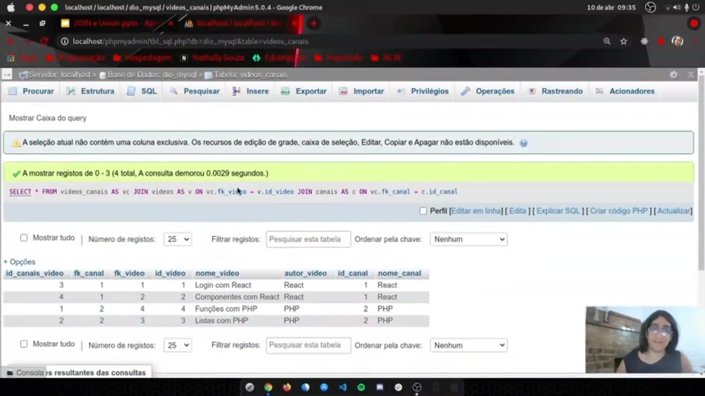
</p>

Após a execução da consulta com múltiplos `JOIN`, o banco de dados retorna uma tabela resultante que combina as colunas de todas as tabelas envolvidas. O sistema identifica as linhas onde os valores das chaves coincidem, unindo os dados de `videos_canais`, `videos` e `canais`. Como o comando utilizou o asterisco (`SELECT *`), o resultado apresenta todas as colunas disponíveis, incluindo IDs e chaves estrangeiras, demonstrando que a junção ocorre estritamente nos registros onde os identificadores numéricos são iguais.

<p align="center">
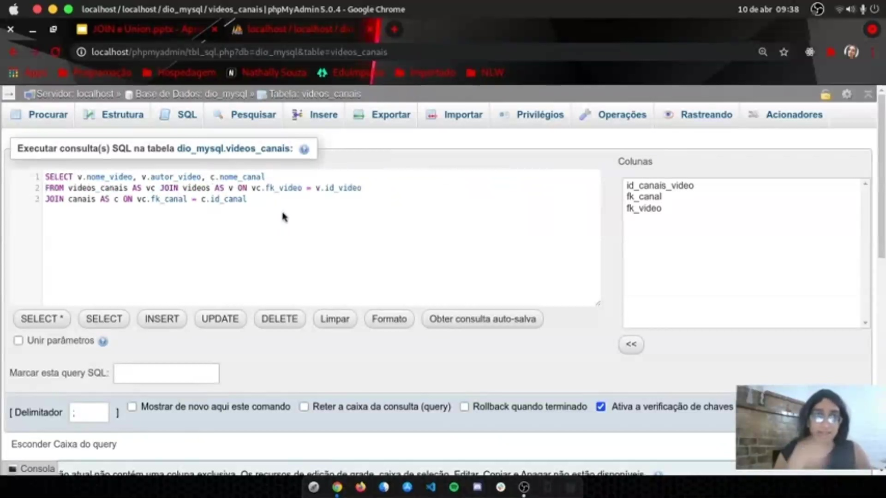
</p>

Para tornar a consulta mais eficiente e o resultado mais limpo para o usuário final, substitui-se o asterisco pela especificação direta das colunas desejadas. Utilizando os apelidos definidos (`v` para vídeos e `c` para canais), selecionamos apenas os campos de interesse: o nome e o autor do vídeo, além do nome do canal. Essa prática evita o tráfego de dados desnecessários, como chaves estrangeiras e identificadores, focando apenas na informação semântica que será exibida na interface.

```sql
SELECT v.nome_video, v.autor_video, c.nome_canal
FROM videos_canais AS vc 
JOIN videos AS v ON vc.fk_video = v.id_video
JOIN canais AS c ON vc.fk_canal = c.id_canal

```

<p align="center">
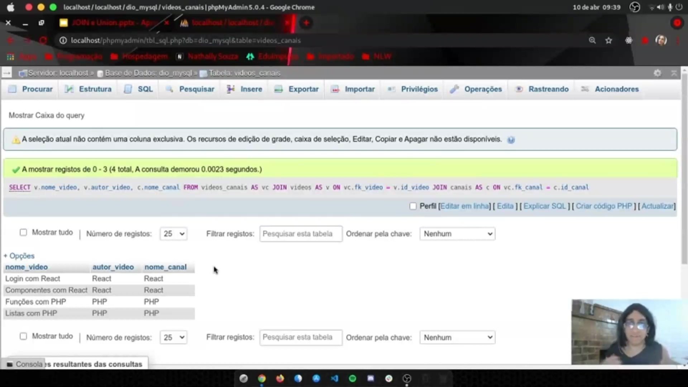
</p>

O resultado final da consulta filtrada apresenta uma visualização organizada, contendo apenas as colunas `nome_video`, `autor_video` e `nome_canal`. Esta abordagem é fundamental em cenários reais de mercado, onde bancos de dados podem conter volumes massivos de dados e centenas de colunas. Ao delimitar as colunas no `SELECT`, reduz-se a sobrecarga no banco de dados e agiliza-se o processamento do algoritmo, entregando ao usuário apenas o que é essencial para as regras de negócio.


### 🟩 Vídeo 05 - Conceito inicial sobre RIGHT e LEFT JOIN

<video width="60%" controls>
  <source src="000-Midia_e_Anexos/bootcamp_tqi_fullstack-modulo.05-curso.02-video_05.webm" type="video/webm">
    Seu navegador não suporta vídeo HTML5.
</video>

link do vídeo: https://web.dio.me/track/tqi-fullstack-developer/course/mysql-consultas-com-join/learning/6b2e7d54-ea0e-4c75-be54-7644b6567b8a?autoplay=1

O vídeo apresenta uma aula técnica sobre manipulação de bancos de dados SQL, focando na transição do uso de INNER JOIN para OUTER JOIN. O instrutor demonstra, através de exemplos práticos com tabelas de vídeos e canais, como consultas padrão omitem registros que não possuem relacionamentos correspondentes. A explicação detalha a necessidade de especificar a direcionalidade (LEFT ou RIGHT) ao utilizar o OUTER JOIN para garantir que todos os dados, inclusive os que resultam em valores nulos, sejam exibidos no resultado final.

### Anotações

<p align="center">
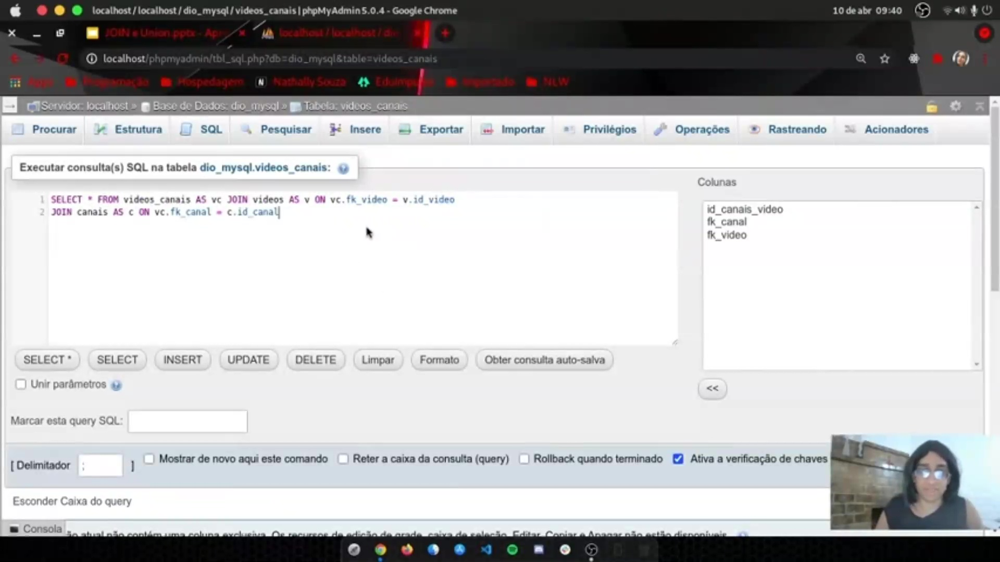
</p>

Nesta etapa, inicia-se a análise de como a cláusula `JOIN` funciona na prática para relacionar diferentes tabelas. O objetivo é realizar uma consulta que una a tabela de relacionamento `videos_canais` com as tabelas de entidades `videos` e `canais` para visualizar os dados de forma integrada.

```sql
SELECT * FROM videos_canais AS vc 
JOIN videos AS v ON vc.fk_video = v.id_video 
JOIN canais AS c ON vc.fk_canal = c.id_canal

```

<p align="center">
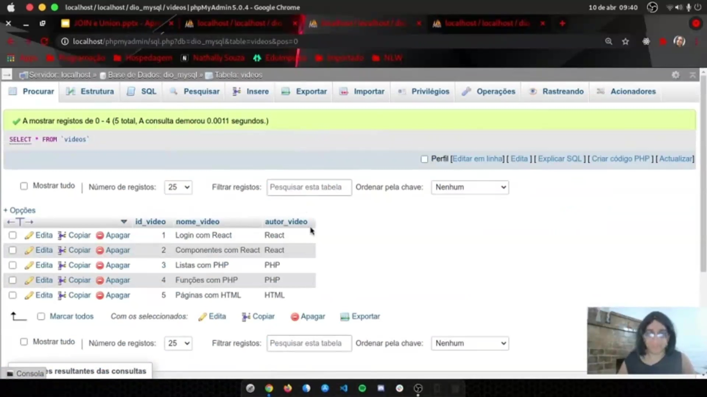
</p>

Ao observar a tabela `videos` isoladamente, nota-se que existem cinco registros cadastrados, incluindo um vídeo sobre "HTML" (ID 5). Entretanto, na consulta anterior utilizando o `JOIN` padrão, esse vídeo específico não aparece nos resultados, evidenciando que a junção simples está filtrando apenas registros que possuem correspondência mútua.

<p align="center">
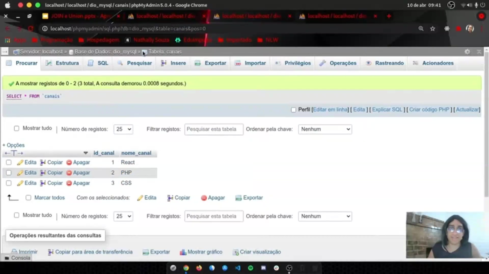
</p>

Da mesma forma, a tabela `canais` possui três registros: React, PHP e CSS. Contudo, o canal "CSS" (ID 3) também não é exibido no resultado da junção realizada anteriormente. Isso ocorre porque o `INNER JOIN` (ou apenas `JOIN`) retorna apenas os valores que possuem um relacionamento direto e presente em ambas as tabelas da consulta.

<p align="center">

</p>

A explicação para a ausência desses dados está na tabela intermediária `videos_canais`. O vídeo de HTML e o canal de CSS ainda não foram relacionados nessa tabela. Como o `INNER JOIN` descarta qualquer registro que resulte em valores nulos ou que não possua vínculo, essas informações são omitidas do resultado final da consulta.

<p align="center">

</p>

Para contornar essa limitação e exibir todos os registros — inclusive aqueles sem relacionamento — é necessário utilizar a cláusula `OUTER JOIN`. É importante destacar que usar apenas `JOIN` é tecnicamente o mesmo que usar `INNER JOIN`, o qual foca estritamente na interseção dos dados e ignora campos que retornariam nulo.

<p align="center">
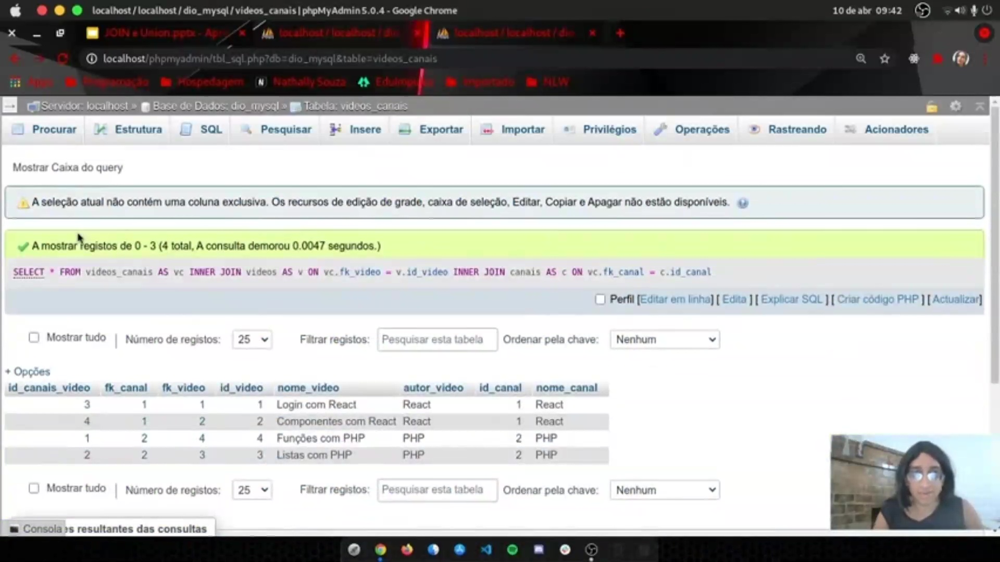
</p>

Nesta visualização, reforça-se que o `INNER JOIN` mantém o foco apenas nos dados que se cruzam perfeitamente entre as tabelas `videos`, `canais` e a tabela de ligação `videos_canais`. O objetivo agora é evoluir a query para permitir que o vídeo de HTML e o canal de CSS apareçam, mesmo sem um vínculo direto registrado na tabela central.

<p align="center">
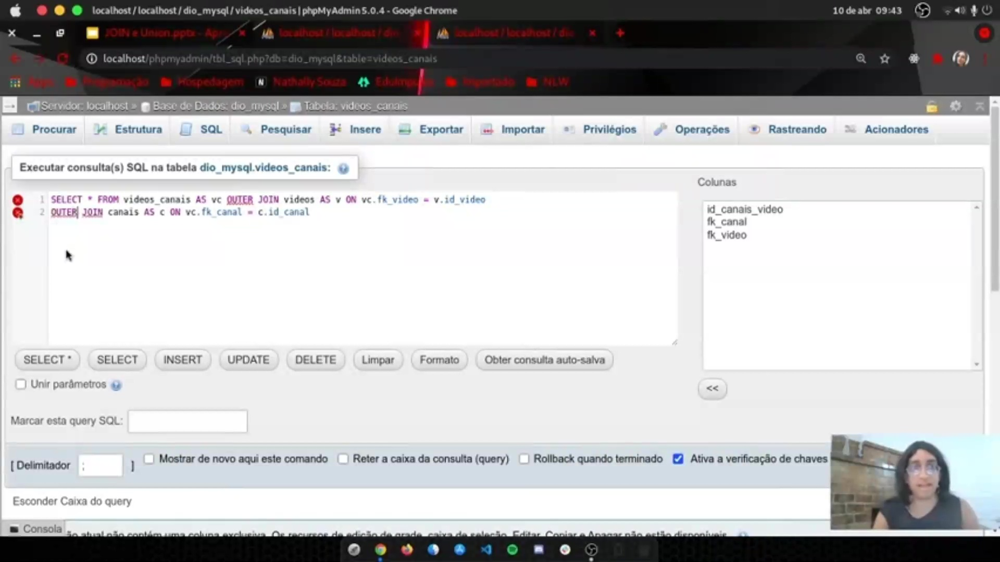
</p>

Ao tentar aplicar o comando `OUTER JOIN` diretamente, o sistema exige uma especificação mais clara. No SQL, não basta dizer que a junção é externa; é preciso identificar qual lado da consulta (tabela da esquerda ou da direita) contém as informações que não possuem relacionamento, mas que ainda assim devem ser exibidas.

```sql
SELECT * FROM videos_canais AS vc 
OUTER JOIN videos AS v ON vc.fk_video = v.id_video 
OUTER JOIN canais AS c ON vc.fk_canal = c.id_canal

```

<p align="center">
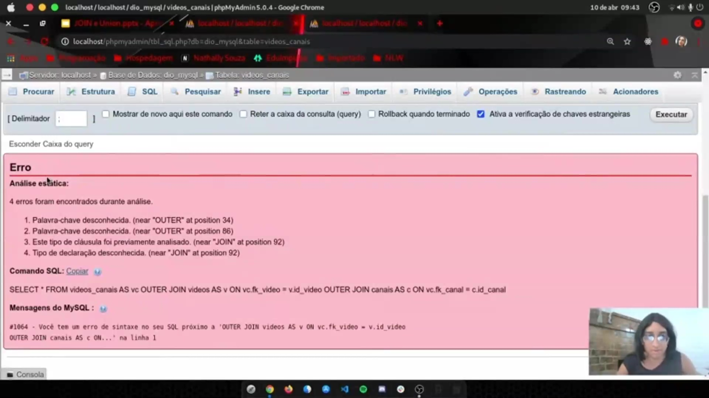
</p>

A tentativa de executar a consulta acima gera um erro de sintaxe (#1064) no MySQL. O erro ocorre porque "OUTER" é uma palavra-chave que não pode ser usada isoladamente; ela deve vir acompanhada de `LEFT` ou `RIGHT` para definir a direção da consulta e quais dados preservar.

<p align="center">
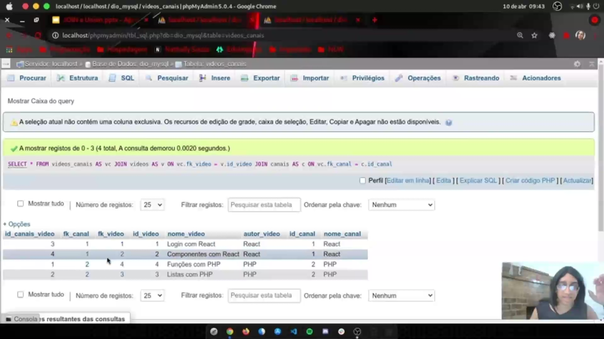
</p>

Para corrigir a consulta, deve-se entender a posição das tabelas: a query começa com `videos_canais` à esquerda, unindo-se com `videos` à sua direita, e depois com `canais` também à direita. Compreender essa hierarquia visual e lógica é fundamental para aplicar corretamente o `LEFT JOIN` ou `RIGHT JOIN` e finalmente exibir todos os dados desejados.      


### 🟩 Vídeo 06 - Praticando consultas com RIGHT e LEFT JOIN

<video width="60%" controls>
  <source src="000-Midia_e_Anexos/bootcamp_tqi_fullstack-modulo.05-curso.02-video_06.webm" type="video/webm">
    Seu navegador não suporta vídeo HTML5.
</video>

link do vídeo: https://web.dio.me/track/tqi-fullstack-developer/course/mysql-consultas-com-join/learning/873f7d1b-a8c3-4df0-95bf-afdb2a8516c3?autoplay=1

O vídeo descreve uma aula prática sobre manipulação de bancos de dados SQL, focada especificamente no uso de cláusulas de junção e união. O instrutor demonstra as diferenças técnicas entre LEFT OUTER JOIN e RIGHT OUTER JOIN, explicando como a ordem das tabelas na consulta define a hierarquia dos dados. Além disso, aborda a cláusula UNION como uma solução para combinar resultados de diferentes consultas, destacando a importância da consistência no número de colunas para o sucesso da operação.

### Anotações

<p align="center">
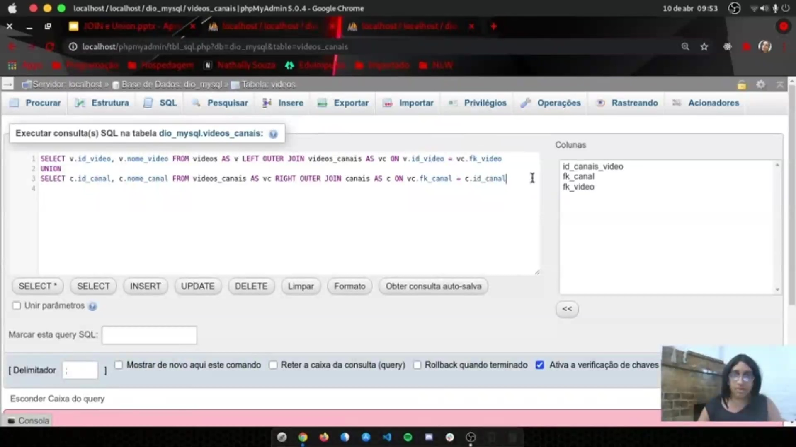
</p>

Para lidar com situações onde uma consulta precisa retornar registros de ambas as tabelas, mesmo quando não há um relacionamento correspondente (como um vídeo sem canal ou um canal sem vídeos), utiliza-se a cláusula `UNION`. Esta cláusula permite unir o resultado de duas consultas distintas em um único conjunto de dados. No entanto, para que a união funcione corretamente, ambas as consultas devem possuir o mesmo número de colunas e tipos de dados compatíveis.

No exemplo prático, a consulta busca o ID e o nome tanto da tabela de vídeos quanto da tabela de canais, aplicando `LEFT OUTER JOIN` e `RIGHT OUTER JOIN` para garantir que as informações de ambos os lados sejam capturadas antes da unificação.

```sql
SELECT v.id_video, v.nome_video FROM videos AS v LEFT OUTER JOIN videos_canais AS vc ON v.id_video = vc.fk_video
UNION
SELECT c.id_canal, c.nome_canal FROM videos_canais AS vc RIGHT OUTER JOIN canais AS c ON vc.fk_canal = c.id_canal

```

<p align="center">
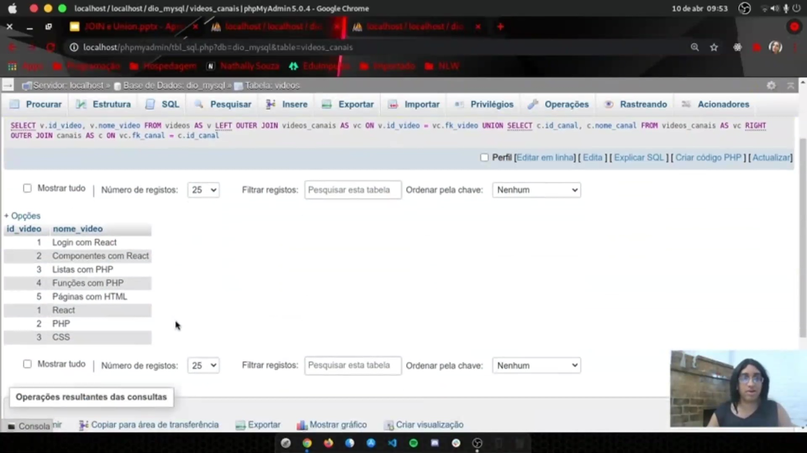
</p>

A execução da query com `UNION` resulta em uma lista consolidada que exibe todos os registros integrados. Como demonstrado na interface do phpMyAdmin, o resultado apresenta tanto os vídeos que possuem canais (como "Login com React" e "Componentes com React") quanto aqueles que poderiam estar isolados, além de incluir canais que não possuem vídeos vinculados, como o canal de "CSS".

Esta técnica é essencial para obter uma visão completa do banco de dados quando os relacionamentos são parciais, permitindo que o desenvolvedor identifique lacunas de dados ou simplesmente apresente um relatório geral de todas as entidades cadastradas nas tabelas relacionadas.

```sql
SELECT v.id_video, v.nome_video FROM videos AS v LEFT OUTER JOIN videos_canais AS vc ON v.id_video = vc.fk_video 
UNION 
SELECT c.id_canal, c.nome_canal FROM videos_canais AS vc RIGHT OUTER JOIN canais AS c ON vc.fk_canal = c.id_canal

```      


### 🟩 Vídeo 07 - Inserindo novos dados com tabelas relacionadas

<video width="60%" controls>
  <source src="000-Midia_e_Anexos/bootcamp_tqi_fullstack-modulo.05-curso.02-video_07.webm" type="video/webm">
    Seu navegador não suporta vídeo HTML5.
</video>

link do vídeo: https://web.dio.me/track/tqi-fullstack-developer/course/mysql-consultas-com-join/learning/ca67a7e1-fbc0-4544-bcc9-40f9012e2a69?autoplay=1

### 🟩 Vídeo 08 - Realizando consultas com comando WHERE e conclusão da aula

<video width="60%" controls>
  <source src="000-Midia_e_Anexos/bootcamp_tqi_fullstack-modulo.05-curso.02-video_08.webm" type="video/webm">
    Seu navegador não suporta vídeo HTML5.
</video>

link do vídeo:


##  Materiais de Apoio

# Certificado: 

- Link na plataforma: 
- Certificado em pdf: 
