## Instrutor

- Instrutor:  Nathally Souza (Software Engineer | Startup Founder | Javascript, Typescript, Cloud, Frontend, Backend)
- Contato Linkedin: / [nathsouza](https://www.linkedin.com/in/nathsouza/)

## Parte 1 - O Passo a passo para realizar consultas com JOIN

### 🟩 Vídeo 01 - Introdução ao curso

<video width="60%" controls>
  <source src="000-Midia_e_Anexos/bootcamp_tqi_fullstack-modulo.05-curso.02-video_01.webm" type="video/webm">
    Seu navegador não suporta vídeo HTML5.
</video>

link do vídeo: https://web.dio.me/track/tqi-fullstack-developer/course/mysql-consultas-com-join/learning/07d34bca-ef76-4866-8be6-2376c13e64bb?autoplay=1

O vídeo apresenta uma aula introdutória sobre MySQL, conduzida por Natanael Souza, da fintech Z1. O conteúdo foca no ensino das cláusulas JOIN e UNION, fundamentais para a manipulação de dados em múltiplas tabelas. Através de um modelo prático baseado na estrutura do YouTube, o instrutor explica como relacionar informações de canais e vídeos, destacando as diferenças técnicas entre as formas de junção e união de consultas.

### Anotações

<p align="center">

</p>

Neste módulo do curso de **Introdução ao MySQL**, daremos continuidade ao aprendizado explorando técnicas de manipulação de dados. O foco principal será o entendimento de como relacionar informações distribuídas em diferentes partes do banco de dados para gerar resultados consolidados.

<p align="center">
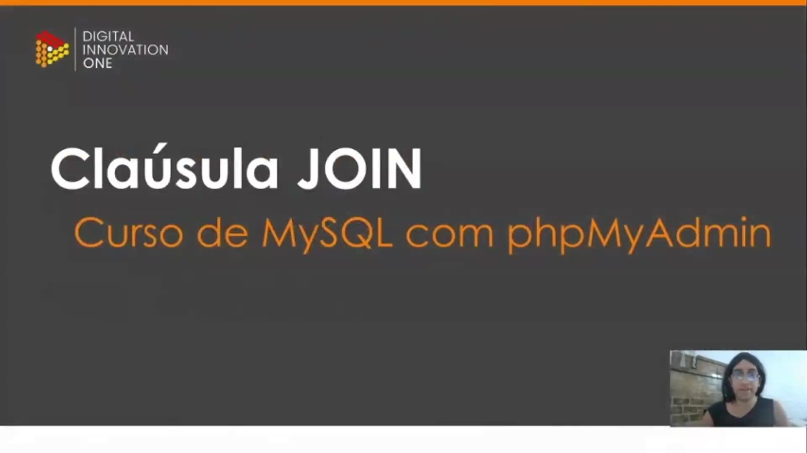
</p>

O tópico central desta etapa é a **cláusula JOIN**. Esta funcionalidade é essencial para o trabalho com bancos de dados relacionais, pois permite realizar consultas que envolvem mais de uma tabela simultaneamente, conectando dados que possuem pontos de relação entre si.

<p align="center">
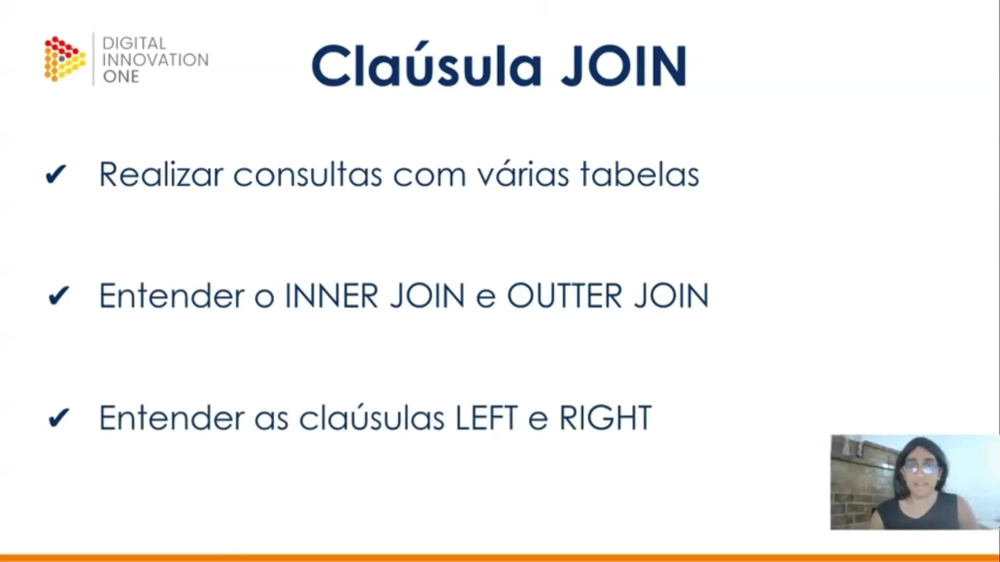
</p>

Os objetivos específicos deste estudo sobre a cláusula JOIN incluem:

* **Realizar consultas com várias tabelas**: Aprender a extrair dados combinados.
* **Entender o INNER JOIN e OUTER JOIN**: Compreender as diferenças fundamentais entre a junção interna (apenas dados correspondentes) e a junção externa.
* **Entender as cláusulas LEFT e RIGHT**: Dominar o direcionamento da prioridade dos dados durante a junção, definindo qual tabela deve ter seus registros preservados mesmo sem correspondência na outra.

<p align="center">
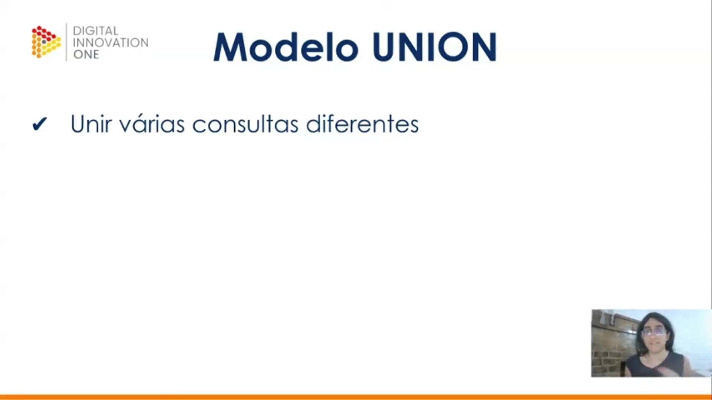
</p>

Além das junções, exploraremos o **Modelo UNION**. Diferente da cláusula JOIN, que combina colunas de diferentes tabelas lateralmente, a cláusula **UNION** serve para unir o resultado de duas ou mais consultas distintas em uma única lista de registros, empilhando os resultados verticalmente.

<p align="center">
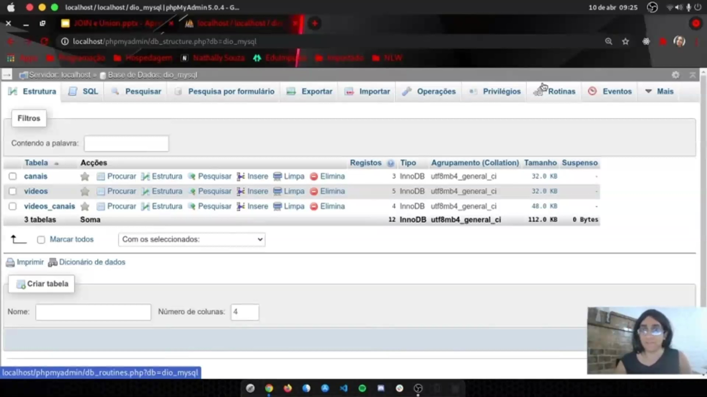
</p>

Para aplicar esses conceitos, utilizaremos um modelo de banco de dados baseado em uma plataforma de vídeos. A estrutura no **phpMyAdmin** é composta por três tabelas principais:

* **canais**: Armazena os dados dos canais que receberão o conteúdo.
* **videos**: Contém as informações dos vídeos cadastrados.
* **videos_canais**: Atua como uma tabela de relacionamento, permitindo identificar quais vídeos pertencem a quais canais, viabilizando a visualização cruzada dos dados através das chaves estrangeiras.      


### 🟩 Vídeo 02 - Apresentação da estrutura inicial do banco de dados

<video width="60%" controls>
  <source src="000-Midia_e_Anexos/bootcamp_tqi_fullstack-modulo.05-curso.02-video_02.webm" type="video/webm">
    Seu navegador não suporta vídeo HTML5.
</video>

link do vídeo: https://web.dio.me/track/tqi-fullstack-developer/course/mysql-consultas-com-join/learning/cd2277d9-a439-4e9c-87ef-e80393a77b1d?autoplay=1

O vídeo consiste em uma aula técnica sobre manipulação de bancos de dados SQL, focando especificamente na implementação e consulta de relacionamentos "Muitos para Muitos" (N:N). O instrutor demonstra como estruturar tabelas de "Canais" e "Vídeos", utilizando uma terceira tabela associativa (tabela de junção) e a cláusula JOIN para consolidar informações que, isoladamente, apresentam apenas identificadores numéricos.

### Anotações

<p align="center">
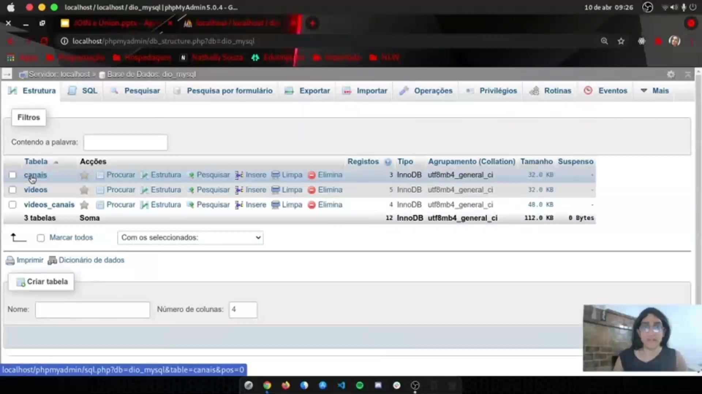
</p>

A interface do phpMyAdmin apresenta a estrutura da base de dados `dio_mysql`. Esta base é composta por três tabelas principais: `canais`, `videos` e `videos_canais`.

* **canais**: Contém 3 registros e utiliza o motor InnoDB.
* **videos**: Possui 5 registros cadastrados.
* **videos_canais**: Contém 4 registros, servindo como uma tabela de ligação.

Essa configuração inicial confirma que as tabelas já foram devidamente povoadas para a execução das consultas da aula.

<p align="center">
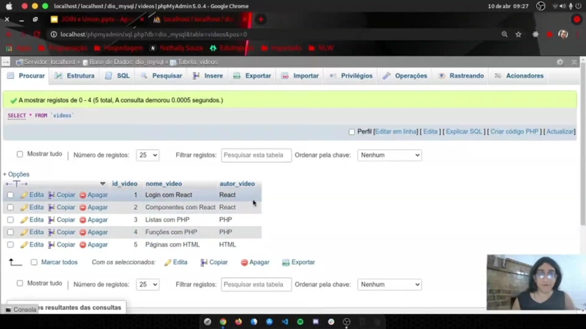
</p>

Nesta visualização, observa-se o conteúdo da tabela `videos`, que inclui as colunas `id_video`, `nome_video` e `autor_video`. Entre os registros listados estão títulos como "Login com React", "Componentes com React", "Listas com PHP", "Funções com PHP" e "Páginas com HTML".

Conforme explicado, o campo `autor_video` nesta tabela armazena informações textuais que não possuem um relacionamento direto com a tabela de canais neste momento. Para visualizar esses dados, utiliza-se o seguinte comando:

```sql
SELECT * FROM videos

```

<p align="center">
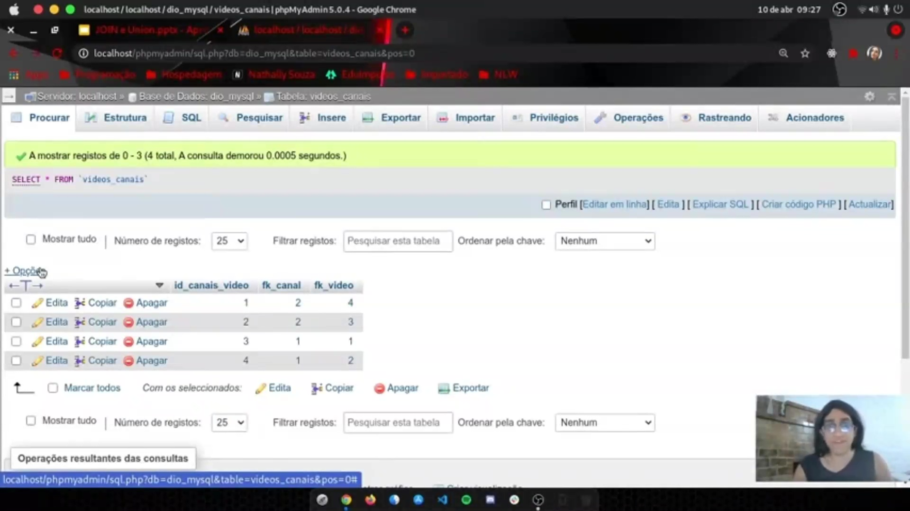
</p>

A tabela `videos_canais` é utilizada para gerenciar o relacionamento de muitos para muitos entre vídeos e canais. Diferente das tabelas de dados descritivos, esta contém apenas referências numéricas por meio de chaves estrangeiras (Foreign Keys).

As colunas visíveis são `id_canais_video`, `fk_canal` e `fk_video`. Esses dados vinculam os IDs de cada conteúdo para determinar quais vídeos pertencem a quais canais. A consulta para listar esses vínculos é:

```sql
SELECT * FROM videos_canais

```      

### 🟩 Vídeo 03 - Realizando consultas com comandos JOIN e AS

<video width="60%" controls>
  <source src="000-Midia_e_Anexos/bootcamp_tqi_fullstack-modulo.05-curso.02-video_03.webm" type="video/webm">
    Seu navegador não suporta vídeo HTML5.
</video>

link do vídeo: https://web.dio.me/track/tqi-fullstack-developer/course/mysql-consultas-com-join/learning/6b814223-fb76-4c63-b955-0a39a5cb7d72?autoplay=1


O vídeo consiste em uma aula técnica sobre manipulação de bancos de dados SQL, focada na junção de tabelas e otimização de consultas. O instrutor demonstra como realizar um JOIN entre as tabelas videos_canais e videos, destacando a importância da cláusula ON para garantir a integridade dos dados e o uso de apelidos (aliases) via cláusula AS para aumentar a produtividade e legibilidade do código em ambientes complexos.

### Anotações

<p align="center">
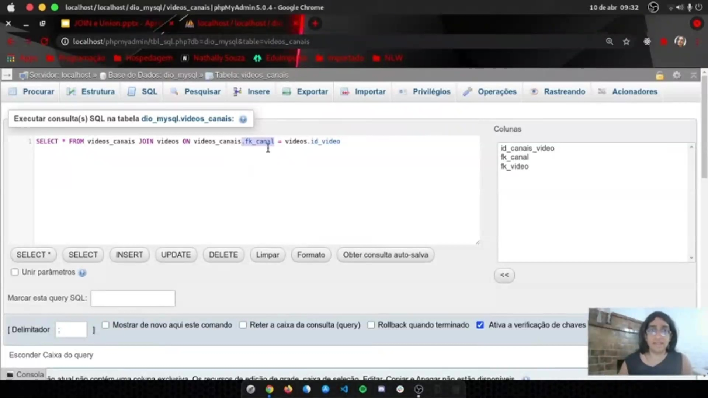
</p>

Para realizar a união entre diferentes tabelas no banco de dados, utiliza-se a cláusula **JOIN**. Neste cenário, a tabela `videos_canais` é utilizada como o ponto central para conectar as informações, funcionando como um "meio de campo" para relacionar os dados com a tabela `videos`.

```sql
SELECT * FROM videos_canais JOIN videos ON videos_canais.fk_canal = videos.id_video

```

<p align="center">
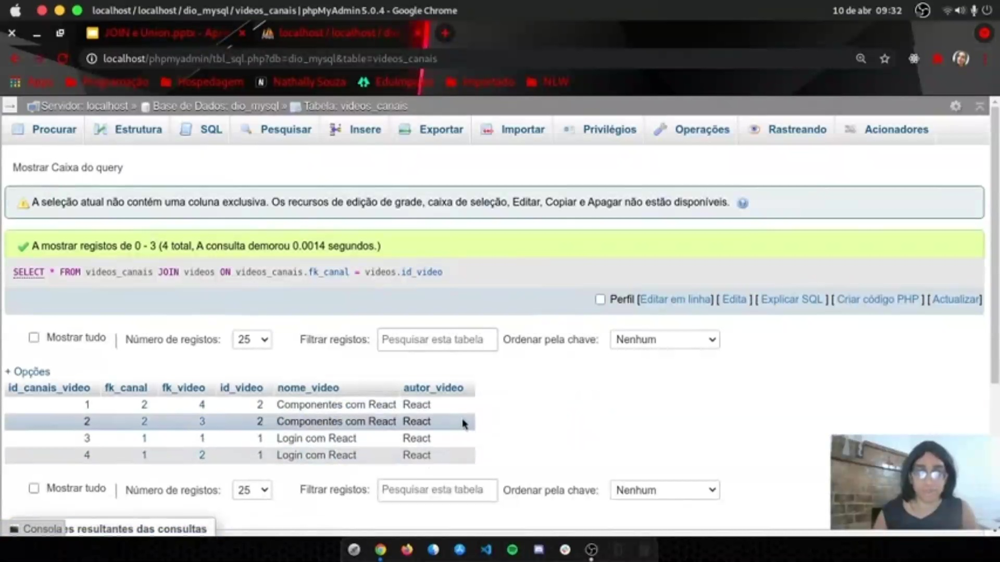
</p>

Ao executar um relacionamento sem a devida filtragem ou quando a estrutura ainda não está clara, o resultado pode apresentar dados duplicados ou desorganizados. No exemplo, os registros aparecem repetidos, dificultando a identificação de qual vídeo está relacionado a qual canal ou coluna específica.

<p align="center">
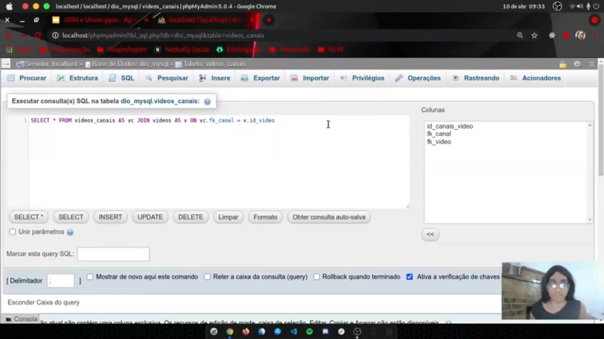
</p>

Para tornar a consulta mais eficiente e legível, utiliza-se a cláusula **AS** para criar apelidos (aliases) para as tabelas. Em vez de repetir nomes extensos como `videos_canais`, podemos abreviá-los para termos mais simples como `vc`. Isso reduz o esforço de digitação e melhora a produtividade ao referenciar colunas específicas no relacionamento através do comando **ON**.

```sql
SELECT * FROM videos_canais AS vc JOIN videos AS v ON vc.fk_canal = v.id_video

```

<p align="center">
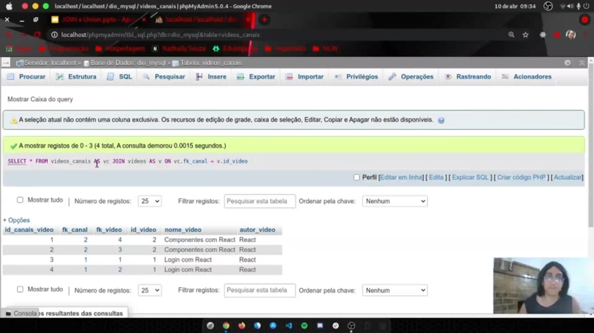
</p>

Após a aplicação do relacionamento correto e do uso de apelidos, o resultado final exibe apenas os registros que possuem correspondência entre as tabelas. A visualização combina as colunas da tabela `videos_canais` com as informações da tabela `videos`, consolidando os nomes e autores dos vídeos de forma organizada.      


### 🟩 Vídeo 04 - Implementando múltiplos comandos JOIN

<video width="60%" controls>
  <source src="000-Midia_e_Anexos/bootcamp_tqi_fullstack-modulo.05-curso.02-video_04.webm" type="video/webm">
    Seu navegador não suporta vídeo HTML5.
</video>

link do vídeo:

### 🟩 Vídeo 05 - Conceito inicial sobre RIGHT e LEFT JOIN

<video width="60%" controls>
  <source src="000-Midia_e_Anexos/bootcamp_tqi_fullstack-modulo.05-curso.02-video_05.webm" type="video/webm">
    Seu navegador não suporta vídeo HTML5.
</video>

link do vídeo:

### 🟩 Vídeo 06 - Praticando consultas com RIGHT e LEFT JOIN

<video width="60%" controls>
  <source src="000-Midia_e_Anexos/bootcamp_tqi_fullstack-modulo.05-curso.02-video_06.webm" type="video/webm">
    Seu navegador não suporta vídeo HTML5.
</video>

link do vídeo:

### 🟩 Vídeo 07 - Inserindo novos dados com tabelas relacionadas

<video width="60%" controls>
  <source src="000-Midia_e_Anexos/bootcamp_tqi_fullstack-modulo.05-curso.02-video_07.webm" type="video/webm">
    Seu navegador não suporta vídeo HTML5.
</video>

link do vídeo:

### 🟩 Vídeo 08 - Realizando consultas com comando WHERE e conclusão da aula

<video width="60%" controls>
  <source src="000-Midia_e_Anexos/bootcamp_tqi_fullstack-modulo.05-curso.02-video_08.webm" type="video/webm">
    Seu navegador não suporta vídeo HTML5.
</video>

link do vídeo:


##  Materiais de Apoio

# Certificado: 

- Link na plataforma: 
- Certificado em pdf: 
