## Instrutor

- Camila Cavalcante (Software Developer @ Reclame AQUI | Full Stack | Java | Kotlin | Go | TypeScript | PHP)
- Contato Linkedin: / [cami-la](https://www.linkedin.com/in/cami-la/)

## Parte 1 - Visão Geral da Linguagem de Programação Java e da sua Plataforma

### 🟩 Vídeo 01 - Apresentação do curso

<video width="60%" controls>
  <source src="000-Midia_e_Anexos/bootcamp_tqi_fullstack-modulo.06-curso.01-video_01.webm" type="video/webm">
    Seu navegador não suporta vídeo HTML5.
</video>

link do vídeo: https://web.dio.me/track/tqi-fullstack-developer/course/dominando-ides-java/learning/b0f1ae39-6af7-4a2c-8fc2-c73ae8463c84?autoplay=1

O curso "Dominando IDEs Java", ministrado por Camila Cavalcante, é um guia prático focado na configuração e exploração das principais ferramentas de desenvolvimento para a linguagem Java. O conteúdo abrange desde a preparação do ambiente nos sistemas operacionais Windows e Linux até o domínio das funcionalidades essenciais das IDEs Eclipse e IntelliJ, oferecendo uma base sólida para desenvolvedores iniciantes e intermediários.

### Anotações

<p align="center">

</p>

Esta aula introduz o curso **Dominando IDEs Java**. A apresentação é conduzida por **Camila Cavalcante** , graduanda em Ciência da Computação, que guiará o aprendizado sobre as ferramentas essenciais para o desenvolvimento com a linguagem Java. O foco inicial é estabelecer uma base sólida sobre os ambientes de desenvolvimento integrados mais utilizados no mercado.

<p align="center">

</p>

O **objetivo do curso** é capacitar o desenvolvedor a configurar o ambiente de desenvolvimento Java tanto em sistemas **Linux** quanto **Windows**. Ao concluir as aulas, o aluno terá familiaridade com as principais funcionalidades das IDEs **Eclipse** e **IntelliJ IDEA**, preparando-se para atuar com as ferramentas padrão da indústria.

<p align="center">

</p>

O **percurso**  de aprendizado está estruturado em quatro etapas principais:

* **Aula 1**: Focada na configuração do ambiente de desenvolvimento Java.
* **Aula 2**: Dedicada à instalação e configuração da IDE Eclipse.
* **Aula 3**: Destinada à instalação e configuração da IDE IntelliJ IDEA.
* **Aula 4**: Apresentação de outras opções de ferramentas disponíveis no mercado.

<p align="center">

</p>

Nesta seção, a instrutora compartilha detalhes sobre sua trajetória e competências:

* **Formação**: Estudante de Ciência da Computação.
* **Início na Programação**: Teve seu primeiro contato com a lógica de programação através do Excel.
* **Especialização**: Atua com tecnologias como Spring Boot e Angular.
* **Perfil**: Entusiasta de novos desafios e aspirante a YouTuber.
* **Conexões**: Disponibiliza seus perfis profissionais para interação com a comunidade:
    * **LinkedIn**: [https://www.linkedin.com/in/cami-la/](https://www.linkedin.com/in/cami-la/) 
    * **GitHub**: [https://github.com/cami-la](https://github.com/cami-la)


### 🟩 Vídeo 02 - Visão Geral da Linguagem de Programação Java e da sua Plataforma

<video width="60%" controls>
  <source src="000-Midia_e_Anexos/bootcamp_tqi_fullstack-modulo.06-curso.01-video_02.webm" type="video/webm">
    Seu navegador não suporta vídeo HTML5.
</video>

link do vídeo: https://web.dio.me/track/tqi-fullstack-developer/course/dominando-ides-java/learning/d5c408f0-b772-4cb7-a522-9dafec72f29c?autoplay=1

Esta aula introdutória apresenta os fundamentos do ecossistema Java, abrangendo desde sua origem histórica na Sun Microsystems até sua arquitetura técnica atual sob a gestão da Oracle. O conteúdo destaca a natureza da linguagem como puramente orientada a objetos e explica o funcionamento do processo de compilação e interpretação via Bytecode e Máquina Virtual Java (JVM). Além de diferenciar as edições da plataforma (SE, EE, ME), o áudio orienta sobre a escolha de versões LTS (Long Term Support) e o uso de Ambientes de Desenvolvimento Integrado (IDEs), preparando o estudante para as etapas práticas de instalação e codificação.

### Anotações

<p align="center">

</p>

Nesta aula introdutória, o foco central é fornecer uma visão geral sobre o ecossistema Java. Os tópicos abordados incluem uma retrospectiva histórica da linguagem, a distinção fundamental entre a plataforma e a linguagem Java, o acompanhamento das diversas versões lançadas ao longo dos anos e a definição de IDE (Ambiente de Desenvolvimento Integrado), ferramentas essenciais para a produtividade do desenvolvedor.

<p align="center">

</p>

Para acompanhar o conteúdo, o único pré-requisito estabelecido para esta aula teórica é a disposição e vontade de aprender os conceitos básicos que sustentam a tecnologia Java.

<p align="center">

</p>

A história do Java remonta à década de 90, quando foi criada pela Sun Microsystems como uma linguagem de programação orientada a objetos. Em 2008, a empresa foi adquirida pela Oracle. Desde o seu lançamento oficial em maio de 1995, a plataforma experimentou uma adoção sem precedentes na história da computação, tornando-se onipresente na internet, navegadores, softwares desktop, dispositivos móveis e até calculadoras.

<p align="center">

</p>

O Java se diferencia de linguagens puramente compiladas (como C e C++) por seu ciclo de execução híbrido. Enquanto em C/C++ o código é compilado diretamente para código de máquina específico do sistema operacional (OS), o código Java é compilado para um formato intermediário chamado **bytecode**. Este bytecode não é lido diretamente pelo hardware, mas sim interpretado por uma Máquina Virtual Java (JVM), o que garante a portabilidade do programa entre diferentes plataformas.

```c
#include <stdio.h>
 int main () {
 char( nome = "Manuel da Silva
 float salario = 800.0;
 char[] sql = "insert into usuario";
 }

```

```java
public class CadastroFrame (
 public static void main (String() ) {
 User u new User();
 usave();

```

<p align="center">

</p>

É importante distinguir a **Linguagem Java** da **Plataforma Java**. Embora o Java seja a linguagem padrão, a plataforma é capaz de suportar outras linguagens que também geram bytecodes compatíveis com a JVM. A grande vantagem reside na independência de hardware e sistema operacional, permitindo que os programas rodem em qualquer lugar onde a máquina virtual possa ser emulada. A plataforma se divide em três edições principais:

* **Java SE (Standard Edition):** Núcleo da plataforma, usado para aplicações desktop e servidores.
* **Java EE (Enterprise Edition):** Voltado para aplicações corporativas e de grande escala.
* **Java ME (Micro Edition):** Destinado a dispositivos com recursos limitados, como sistemas embarcados.

<p align="center">

</p>

O processo de execução de um programa Java segue três etapas fundamentais:

1. **Escrita:** Criação do código-fonte em um arquivo com extensão `.java`.
2. **Compilação:** Utilização do Java Compiler (presente no JDK) para transformar o código-fonte em um arquivo de bytecode com extensão `.class`.
3. **Execução:** A JVM lê o arquivo `.class` e, juntamente com as bibliotecas do JRE, interpreta e executa as instruções no sistema operacional.

<p align="center">

</p>

Para trabalhar com Java, é essencial entender a relação entre os componentes do kit de ferramentas:

* **JDK (Java Development Kit):** O conjunto completo para desenvolvedores, contendo o compilador (`javac`) e ferramentas de empacotamento (`jar`). Ele é responsável por transformar `.java` em `.class`.
* **JRE (Java Runtime Environment):** O ambiente necessário para rodar aplicações Java. Ele fornece as bibliotecas padrões (Java API) e a JVM.
* **JVM (Java Virtual Machine):** A peça que efetivamente executa o bytecode, atuando como uma camada entre a aplicação e o sistema operacional, contando com recursos como o Garbage Collector para gerenciamento de memória.

<p align="center">

</p>

Existem duas distribuições principais do Java: o **OpenJDK** e o **JDK Oracle**. A diferença fundamental reside no licenciamento: o OpenJDK é totalmente de código aberto (GPL), enquanto o JDK Oracle possui termos comerciais específicos para uso corporativo. Versões com suporte de longo prazo (LTS) do OpenJDK são lançadas aproximadamente a cada quatro anos, garantindo estabilidade para grandes projetos.

<p align="center">

</p>

A imagem apresenta um cronograma detalhado das versões do Java, desde o seu lançamento inicial em 1995. O gráfico destaca a evolução das versões LTS (como Java 8, 11 e 17) e o período de suporte gratuito e estendido oferecido por diferentes fornecedores (Oracle, AdoptOpenJDK, Zulu, Amazon Corretto), evidenciando a maturidade e a continuidade do ecossistema.

<p align="center">

</p>

Uma IDE (Ambiente de Desenvolvimento Integrado) é um software que consolida diversas ferramentas (editor de texto, compilador, depurador) em uma interface gráfica única para facilitar a criação de aplicações. No ecossistema Java, as IDEs utilizam o JDK instalado no sistema para funcionar. Exemplos populares incluem IntelliJ IDEA, Eclipse e NetBeans. Embora as ferramentas facilitem muito o trabalho, é recomendado que o desenvolvedor não se prenda a uma única opção, mas entenda a lógica de funcionamento comum a todas elas.      

<p align="center"> 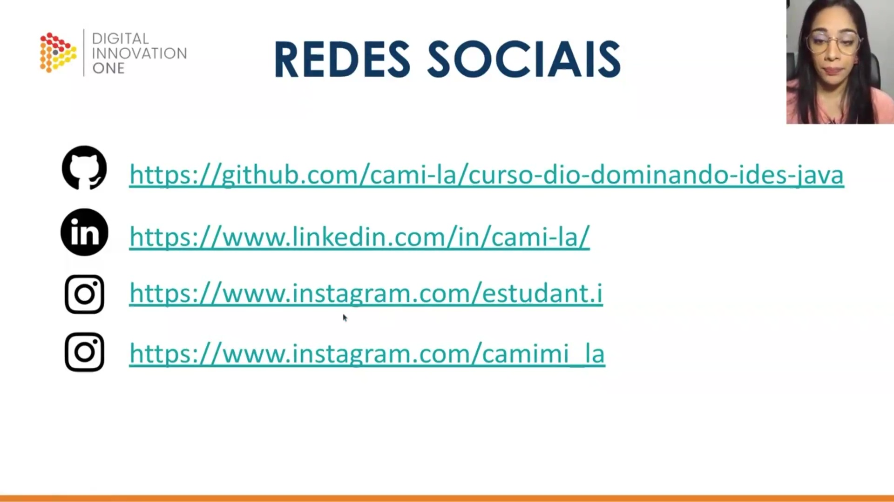 </p>

Para encerrar esta introdução ao ecossistema Java, são disponibilizados os canais de comunicação e redes sociais para acompanhamento de materiais complementares. O código-fonte e informações técnicas do treinamento podem ser encontrados no GitHub. Além disso, é possível manter contato e tirar dúvidas através do LinkedIn e perfis no Instagram, onde são compartilhadas dicas e conteúdos gratuitos sobre a linguagem. Caso surjam dúvidas específicas durante o curso, os alunos devem utilizar o fórum da plataforma DIO ou o servidor no Discord

* **GitHub:** [https://github.com/cami-la/curso-dio-dominando-ides-java](https://github.com/cami-la/curso-dio-dominando-ides-java)  
* **LinkedIn:** [https://www.linkedin.com/in/cami-la/](https://www.linkedin.com/in/cami-la/)  
* **Instagram:** [https://www.instagram.com/estudant.i](https://www.instagram.com/estudant.i)  
* **Instagram:** [https://www.instagram.com/camimi_la](https://www.instagram.com/camimi_la)


## Parte 2 - Ambiente de desenvolvimento Ubuntu

### 🟩 Vídeo 03 - Instalação JDK e Git no Ubuntu

<video width="60%" controls>
  <source src="000-Midia_e_Anexos/bootcamp_tqi_fullstack-modulo.06-curso.01-video_03.webm" type="video/webm">
    Seu navegador não suporta vídeo HTML5.
</video>

link do vídeo: https://web.dio.me/track/tqi-fullstack-developer/course/dominando-ides-java/learning/d080c83d-2302-4136-842d-0b4713652617?autoplay=1

Este guia prático detalha o processo de configuração de um ambiente de desenvolvimento Java no sistema operacional Ubuntu Linux. O conteúdo abrange desde a instalação do OpenJDK 11 e a configuração manual das variáveis de ambiente (`JAVA_HOME`), até a preparação do sistema de controle de versão Git, garantindo que o desenvolvedor possua as ferramentas fundamentais prontas para o uso de IDEs e a sincronização de projetos com o GitHub.

Fork do repositório (com o tutorial): https://github.com/ahaerdy/fork-curso-dio-dominando-ides-java

### 🟩 Vídeo 04 - Instalação IntelliJ e Eclipse no Ubuntu

<video width="60%" controls>
  <source src="000-Midia_e_Anexos/bootcamp_tqi_fullstack-modulo.06-curso.01-video_04.webm" type="video/webm">
    Seu navegador não suporta vídeo HTML5.
</video>

link do vídeo: https://web.dio.me/track/tqi-fullstack-developer/course/dominando-ides-java/learning/4f443027-b82b-4793-b452-73f67b00c1c7?autoplay=1

O vídeo é uma aula prática focada na configuração de um ambiente de desenvolvimento Java em sistemas Linux. O instrutor demonstra, passo a passo, como baixar, instalar e configurar as duas principais IDEs do mercado — IntelliJ IDEA (versão Community) e Eclipse (versão Enterprise) — utilizando uma máquina virtual para garantir uma instalação limpa. O conteúdo enfatiza a execução de scripts via terminal, a gestão de dependências como o JDK 11 e a criação de atalhos no sistema para otimizar a produtividade do desenvolvedor.

Fork do repositório (com o tutorial): https://github.com/ahaerdy/fork-curso-dio-dominando-ides-java


## Parte 3 - Ambiente de desenvolvimento Windows

### 🟩 Vídeo 05 - Instalação JDK e Git no Windows

<video width="60%" controls>
  <source src="000-Midia_e_Anexos/bootcamp_tqi_fullstack-modulo.06-curso.01-video_05.webm" type="video/webm">
    Seu navegador não suporta vídeo HTML5.
</video>

link do vídeo: https://web.dio.me/track/tqi-fullstack-developer/course/dominando-ides-java/learning/0c9c5a4b-b1e8-4fbd-8e24-cf8f8275dece?autoplay=1

Este guia tutorial ensina como **configurar o ambiente de desenvolvimento Java** no Windows, focando na instalação do **OpenJDK Zulu 11** e do **Git**. A instrutora demonstra o passo a passo da **extração dos arquivos**, a configuração essencial das **variáveis de ambiente** (Java Home e Path) e a validação via terminal. Além da instalação, o conteúdo aborda a **configuração inicial do Git**, incluindo a definição de nome de usuário e e-mail para versionamento. Para ilustrar o funcionamento do **JDK**, o material apresenta a criação manual de um programa simples no Bloco de Notas, utilizando os comandos **javac** para compilação e **java** para execução. O objetivo central é familiarizar o estudante com o ciclo de desenvolvimento básico antes da introdução de ferramentas mais complexas como o Eclipse ou IntelliJ.

Fork do repositório (com o tutorial): https://github.com/ahaerdy/fork-curso-dio-dominando-ides-java

### 🟩 Vídeo 06 - Instalação IntelliJ e Eclipse no Windows

<video width="60%" controls>
  <source src="000-Midia_e_Anexos/bootcamp_tqi_fullstack-modulo.06-curso.01-video_06.webm" type="video/webm">
    Seu navegador não suporta vídeo HTML5.
</video>

link do vídeo: https://web.dio.me/track/tqi-fullstack-developer/course/dominando-ides-java/learning/01c97ffd-17a5-4b46-a052-625b841609df?autoplay=1

O conteúdo consiste em um guia prático para a instalação e configuração inicial das duas principais IDEs (Ambientes de Desenvolvimento Integrado) utilizadas no ecossistema Java: Eclipse e IntelliJ IDEA. A instrutora enfatiza a importância de seguir um roteiro estruturado (arquivo README) para garantir que todas as dependências, como o JDK e o Git, estejam corretamente configuradas, facilitando o processo de preparação do ambiente de desenvolvimento para novos programadores.

Fork do repositório (com o tutorial): https://github.com/ahaerdy/fork-curso-dio-dominando-ides-java

## Parte 4 - Eclipse

### 🟩 Vídeo 07 - Criando seu primeiro projeto com Eclipse

<video width="60%" controls>
  <source src="000-Midia_e_Anexos/bootcamp_tqi_fullstack-modulo.06-curso.01-video_07.webm" type="video/webm">
    Seu navegador não suporta vídeo HTML5.
</video>

link do vídeo: https://web.dio.me/track/tqi-fullstack-developer/course/dominando-ides-java/learning/9b9d5b2f-bb33-4661-bfc2-71e9f92c244b?autoplay=1

Este conteúdo é um guia prático introdutório sobre o uso da IDE Eclipse para o desenvolvimento em Java. O foco principal não é o ensino da linguagem em si, mas a familiarização com a interface, a configuração de áreas de trabalho (workspaces), a manipulação de "Perspectivas" e, especialmente, o uso de atalhos de teclado para aumentar a produtividade. O tutorial demonstra desde a criação de um projeto simples até a execução de um código "Hello World", destacando como a IDE facilita a escrita de códigos tradicionalmente verbosos do Java.

### Anotações

<p align="center">
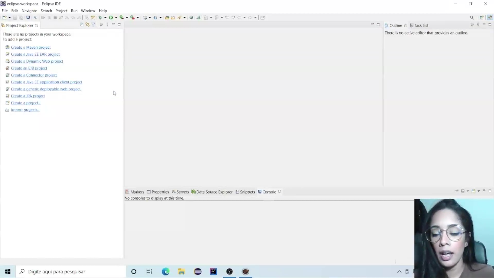
</p>

A interface inicial do Eclipse IDE apresenta o ambiente de desenvolvimento padrão, com o *Project Explorer* (explorador de projetos) localizado à esquerda. Neste momento, o workspace está vazio, indicando que nenhum projeto foi criado ou importado ainda, estando pronto para o início de uma nova aplicação Java.

<p align="center">
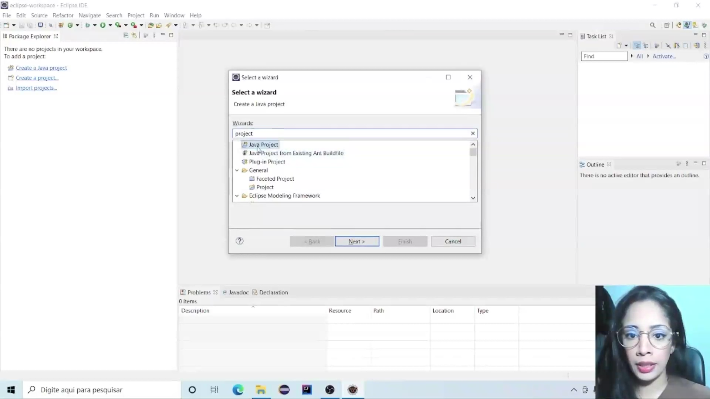
</p>

Para iniciar a criação de uma nova aplicação, acessamos o assistente de criação de projetos através do menu. Na janela "Select a wizard", deve-se selecionar a opção **Java Project** dentro da categoria Java, que fornecerá a estrutura base necessária para o desenvolvimento de programas na linguagem.

<p align="center">
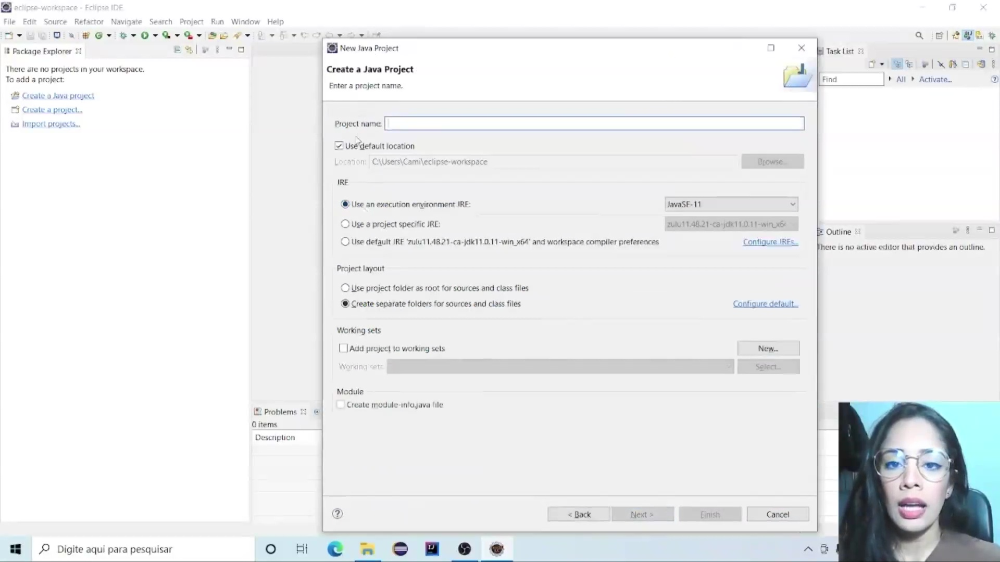
</p>

Na janela de configuração do novo projeto Java, definimos o "Project name". Seguindo as boas práticas, utiliza-se o nome `primeiro-programa-java`, preferencialmente em letras minúsculas e separadas por hifens. Esta etapa também permite configurar o JRE (Java Runtime Environment) que será utilizado para compilar e rodar o projeto.

<p align="center">
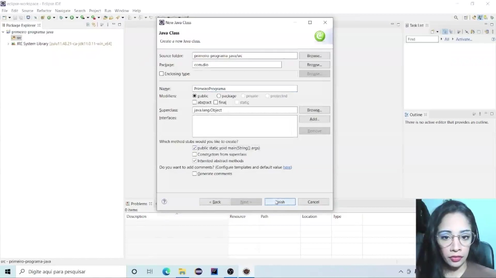
</p>

Dentro do projeto criado, procedemos com a criação de uma nova classe Java. O pacote (*Package*) é definido como `com.dio` e o nome da classe como `PrimeiroPrograma`, utilizando o padrão *CamelCase* (iniciais maiúsculas). Para agilizar o desenvolvimento, selecionamos a opção `public static void main(String[] args)`, que instrui a IDE a gerar automaticamente o ponto de entrada principal do programa.

<p align="center">
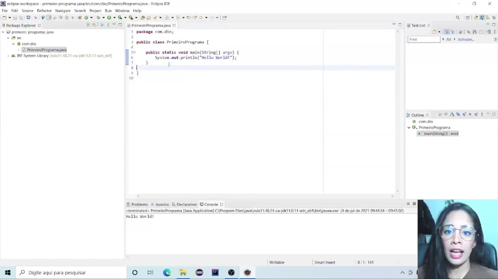
</p>

O código inicial apresenta a estrutura básica da classe com o método `main`. Ao utilizar o comando `System.out.println`, a aplicação imprime a mensagem "Hello World!" no Console da IDE, confirmando que o ambiente está configurado corretamente e o código foi compilado com sucesso.

```java
package com.dio;

public class PrimeiroPrograma {

	public static void main(String[] args) {
		System.out.println("Hello World!");
	}

}

```

<p align="center">
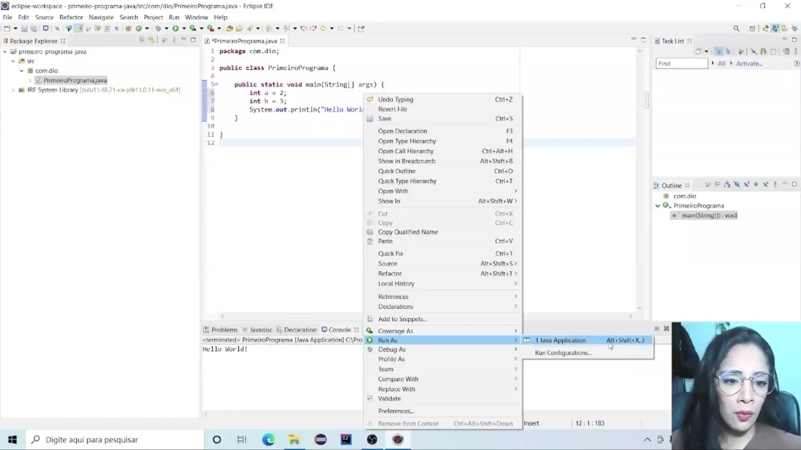
</p>

A IDE facilita o processo de execução do programa. Ao clicar com o botão direito sobre o código-fonte, é possível acessar o menu **Run As > Java Application**. Esse fluxo permite que o Eclipse salve automaticamente as alterações pendentes, compile o novo código e execute a aplicação de forma integrada.

<p align="center">
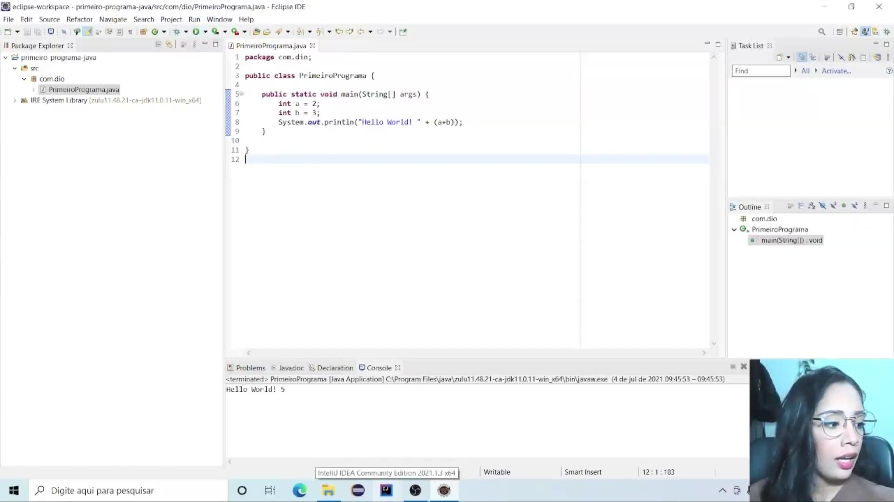
</p>

Nesta etapa final, o programa é incrementado com o uso de variáveis do tipo inteiro (`int`). O código realiza a soma de duas variáveis e concatena o resultado com o texto original dentro do `System.out.println`. O console exibe o resultado da operação aritmética junto à mensagem.

```java
package com.dio;

public class PrimeiroPrograma {

	public static void main(String[] args) {
		int a = 2;
		int b = 3;
		System.out.println("Hello World! " + (a + b));
	}

}
```      


### 🟩 Vídeo 08 - Atalhos

<video width="60%" controls>
  <source src="000-Midia_e_Anexos/bootcamp_tqi_fullstack-modulo.06-curso.01-video_08.webm" type="video/webm">
    Seu navegador não suporta vídeo HTML5.
</video>

link do vídeo: https://web.dio.me/track/tqi-fullstack-developer/course/dominando-ides-java/learning/33a71135-d694-4a38-9459-48ed80e7b196?autoplay=1

O foco principal deste bloco é a otimização do fluxo de trabalho através da personalização da interface (temas e fontes), organização de pacotes e, crucialmente, o uso de atalhos de produtividade para a geração automática de código repetitivo (boilerplate), como construtores, getters/setters e métodos utilitários.

### Anotações

<p align="center">
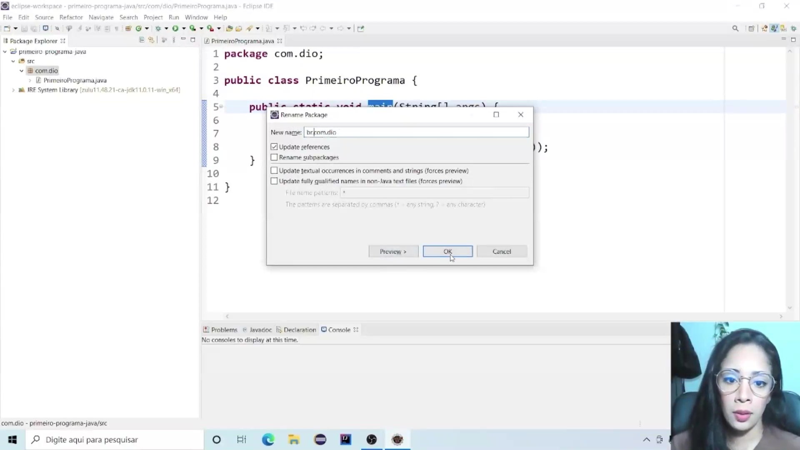
</p>

Para renomear um pacote no Eclipse, o processo pode ser iniciado pressionando `F2` sobre o nome do pacote ou através do menu de refatoração. Nesta etapa, o pacote original `com.dio` está sendo alterado para `br.com.dio`. A IDE oferece opções para atualizar automaticamente as referências a este pacote em outros arquivos do projeto, garantindo a integridade do código.

<p align="center">
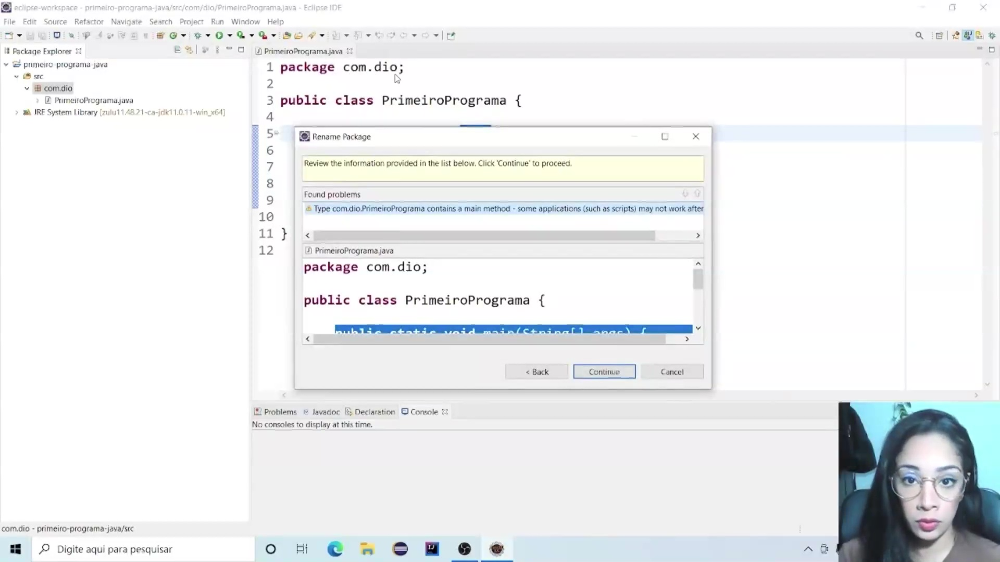
</p>

Ao realizar a alteração de nome em um pacote que contém uma classe com método `main`, o Eclipse exibe uma janela de confirmação alertando sobre possíveis impactos na execução de scripts ou configurações de lançamento. Para prosseguir com a refatoração e aplicar as mudanças, deve-se confirmar a operação clicando no botão "Continue".

<p align="center">
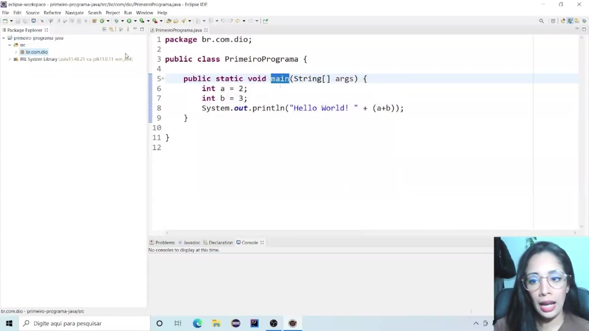
</p>

Após a conclusão da refatoração, a declaração de pacote dentro da classe Java é atualizada automaticamente para refletir a nova estrutura de diretórios. O código fonte agora exibe o pacote renomeado, mantendo a classe `PrimeiroPrograma` dentro da nova hierarquia definida.

```java
package br.com.dio;

public class PrimeiroPrograma {
    public static void main(String[] args) {
        int a = 2;
        int b = 3;
        System.out.println("Hello World! " + (a+b));
    }
}

```

<p align="center">
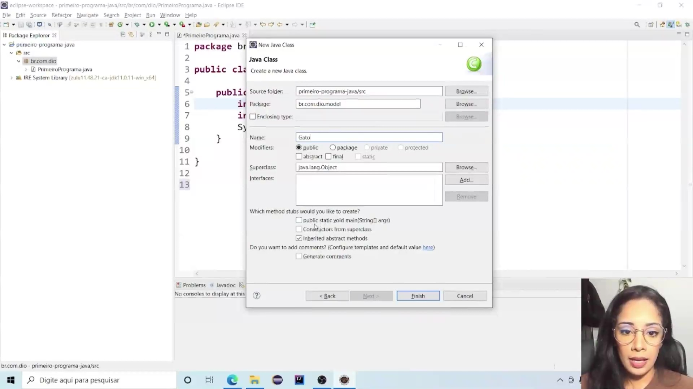
</p>

Na criação de uma nova classe Java, é possível definir subpacotes diretamente no campo "Package". Ao digitar `br.com.dio.model`, a IDE entende que a nova classe, denominada `Gato`, deve ser criada dentro de uma pasta `model`, que será aninhada na estrutura de pacotes existente. O uso de pontos no nome do pacote determina a hierarquia de pastas do projeto.

<p align="center">
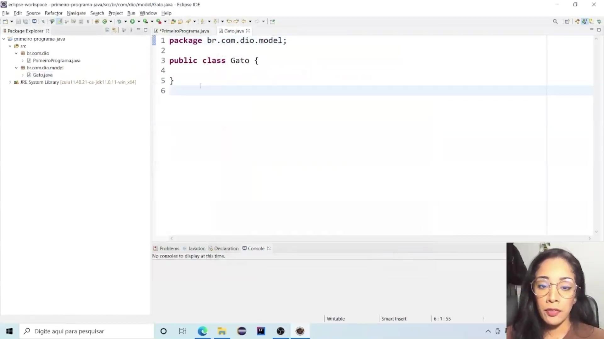
</p>

A classe `Gato` foi criada com sucesso dentro do pacote `br.com.dio.model`, conforme indicado na declaração `package` na primeira linha do arquivo. Neste momento, a classe está vazia, contendo apenas a estrutura básica pronta para receber a definição de atributos e métodos.

```java
package br.com.dio.model;

public class Gato {

}

```

<p align="center">
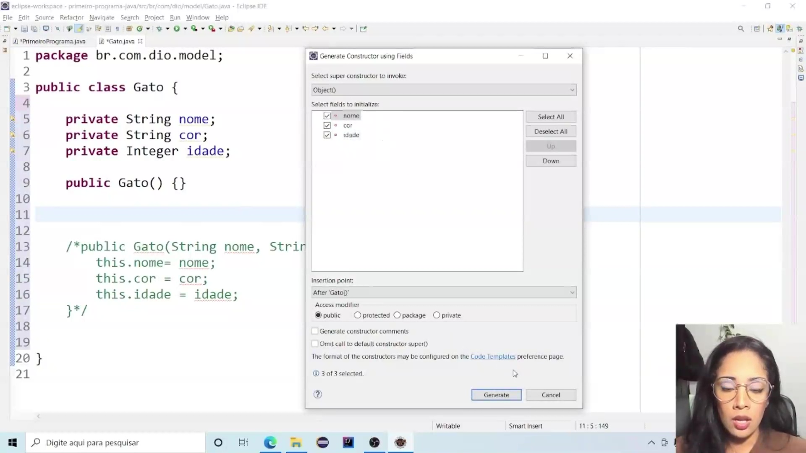
</p>

Após definir os atributos privados da classe (`nome`, `cor`, `idade`), utiliza-se o recurso de geração automática de código da IDE. Através do comando `Ctrl + 3`, acessa-se a funcionalidade "Generate Constructor using Fields". Nesta etapa, é possível selecionar quais atributos farão parte do construtor ou optar por criar um construtor vazio desmarcando os campos.

```java
private String nome;
private String cor;
private Integer idade;

```

<p align="center">
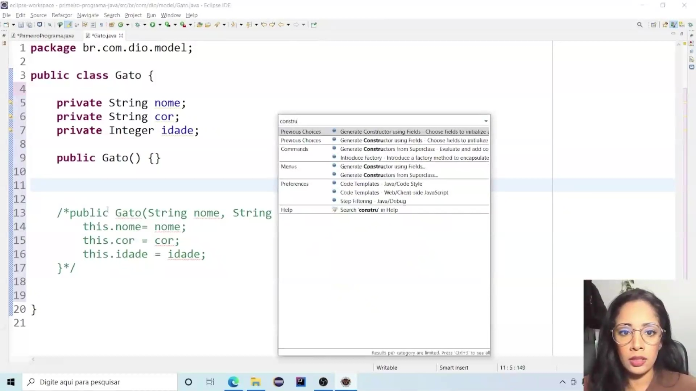
</p>

Um construtor padrão (sem argumentos) foi gerado no código: `public Gato() {}`. Logo abaixo, há um bloco de código comentado que exemplifica como seria a implementação manual de um construtor com argumentos. A ferramenta de busca de comandos (`Ctrl + 3`) está ativa novamente, permitindo buscar rapidamente a função para gerar novos construtores ou outros métodos.

<p align="center">

</p>

Para criar um construtor que inicialize todos os dados do objeto, selecionam-se todos os campos disponíveis (`nome`, `cor`, `idade`) na janela "Generate Constructor using Fields". A opção de omitir a chamada ao construtor da superclasse (`super()`) também pode ser configurada nesta interface.

<p align="center">
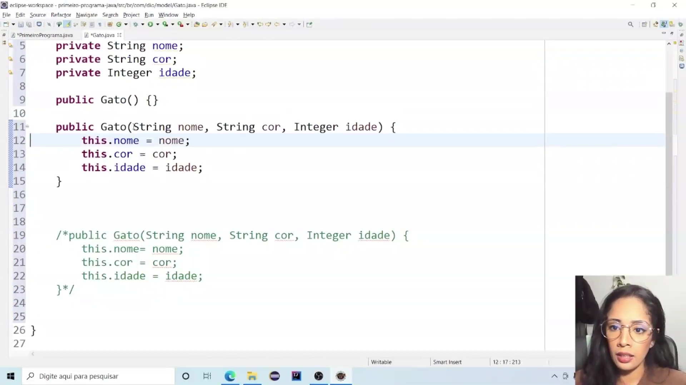
</p>

O código agora apresenta dois construtores: o construtor vazio (`public Gato() {}`) e o construtor completo que recebe os parâmetros `nome`, `cor` e `idade` para inicializar os atributos da instância. O uso do `this` é empregado para diferenciar os atributos da classe dos parâmetros recebidos pelo método.

```java
public Gato(String nome, String cor, Integer idade) {
    this.nome = nome;
    this.cor = cor;
    this.idade = idade;
}

```

<p align="center">
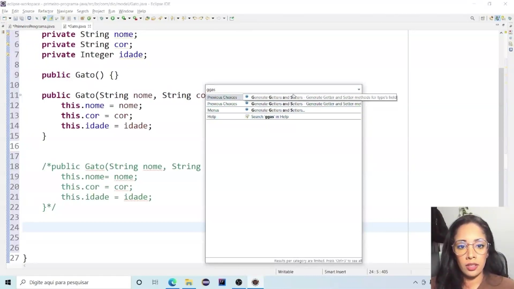
</p>

Para encapsular os dados da classe, utiliza-se novamente a busca de comandos do Eclipse (atalho `Ctrl + 3`), digitando parte do nome da funcionalidade desejada. A opção "Generate Getters and Setters" é localizada no menu, permitindo a criação automática dos métodos de acesso e modificação para os atributos privados.

<p align="center">
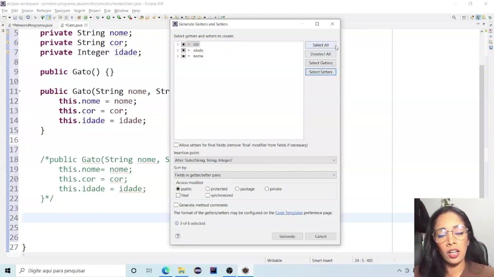
</p>

Na janela de geração de Getters e Setters, é possível escolher para quais atributos os métodos serão criados. A árvore de seleção permite marcar campos individuais ou todos de uma vez (`Select All`) para gerar os pares de métodos `get` e `set` correspondentes a `nome`, `cor` e `idade`.

<p align="center">
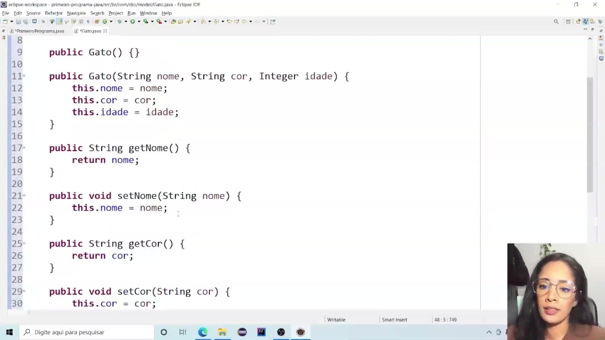
</p>

Os métodos de acesso foram inseridos na classe. O código mostra a implementação padrão gerada pela IDE, como `getNome()` que retorna a String correspondente, e `setNome(String nome)` que atualiza o valor do atributo. Essa automação acelera o desenvolvimento de classes de modelo (JavaBeans).

```java
public String getNome() {
    return nome;
}

public void setNome(String nome) {
    this.nome = nome;
}

```

<p align="center">
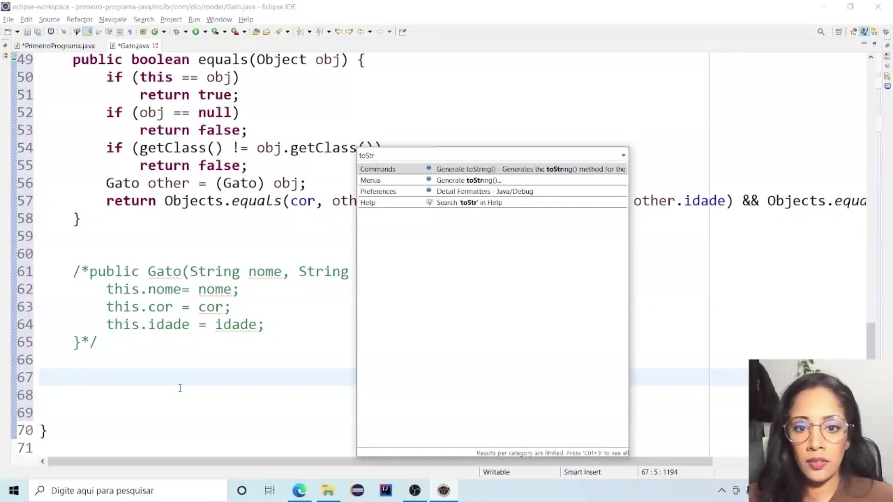
</p>

A implementação dos métodos `hashCode()` e `equals()` é essencial para a comparação correta de objetos. A IDE oferece uma ferramenta dedicada para gerar esses métodos ("Generate hashCode() and equals()"), baseando-se nos atributos selecionados para determinar a unicidade e igualdade das instâncias da classe.

<p align="center">
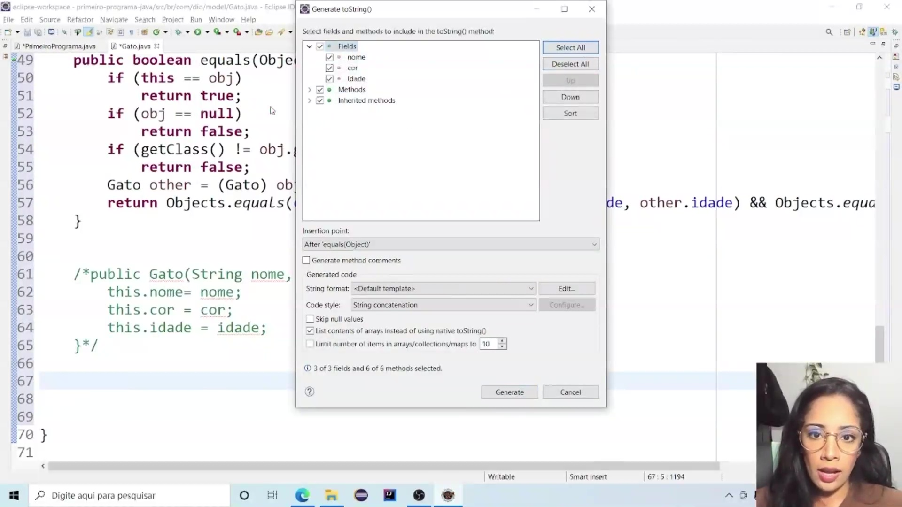
</p>

Para permitir uma representação textual legível do objeto, utiliza-se a função de geração do método `toString()`. Na janela de configuração, selecionam-se os campos que devem aparecer na String de retorno, facilitando a depuração e visualização dos dados do objeto em logs ou no console.

<p align="center">
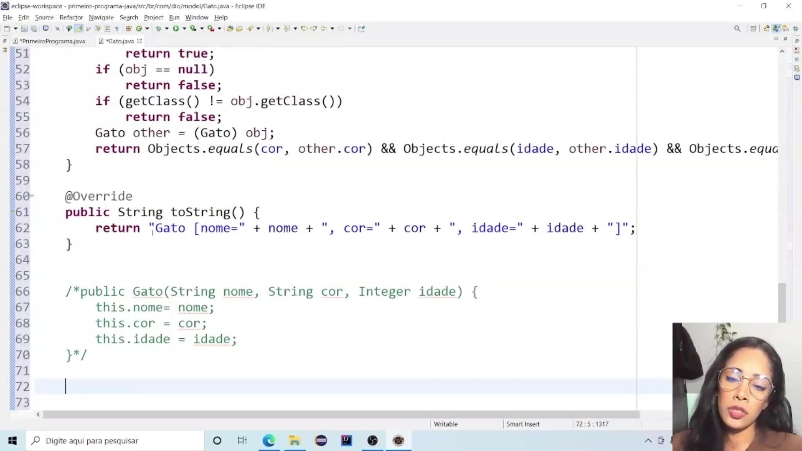
</p>

O método `toString()` gerado sobrescreve a implementação padrão da classe `Object` (`@Override`), retornando uma concatenação dos nomes dos campos e seus respectivos valores. Isso permite que, ao imprimir o objeto, sejam exibidos os dados internos em vez do endereço de memória.

```java
@Override
public String toString() {
    return "Gato [nome=" + nome + ", cor=" + cor + ", idade=" + idade + "]";
}

```

<p align="center">
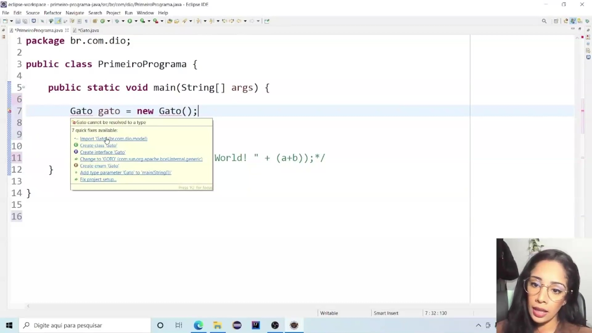
</p>

Ao instanciar a classe `Gato` dentro da classe principal `PrimeiroPrograma`, a IDE identifica que `Gato` está em um pacote diferente (`br.com.dio.model`). O Eclipse sublinha o código em vermelho e sugere a importação automática da classe necessária (`br.com.dio.model.Gato`) através de um pop-up de correção rápida.

<p align="center">
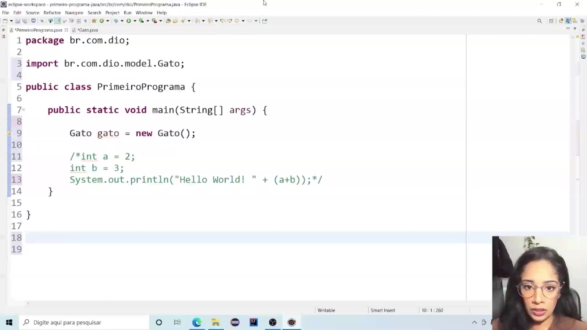
</p>

Com a importação resolvida (`import br.com.dio.model.Gato;`), o objeto é instanciado corretamente usando `Gato gato = new Gato();`. O código anterior que apenas imprimia "Hello World" foi comentado para dar lugar à utilização da nova classe de modelo criada.

```java
package br.com.dio;

import br.com.dio.model.Gato;

public class PrimeiroPrograma {
    public static void main(String[] args) {
        Gato gato = new Gato();
        // ...
    }
}

```

<p align="center">
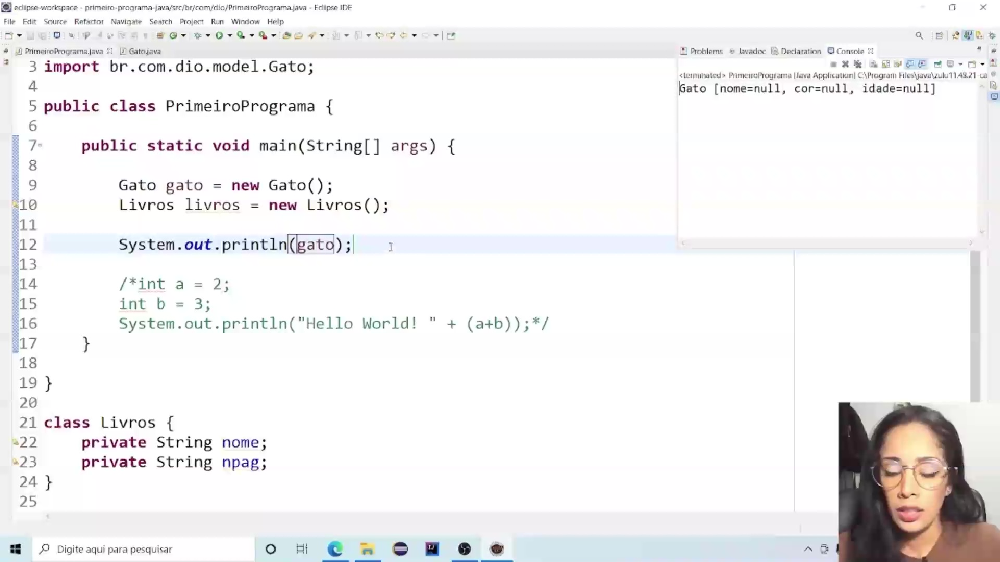
</p>

O exemplo final demonstra a diferença entre usar uma classe importada e uma classe definida no mesmo arquivo. Uma classe `Livros` é criada localmente (sem modificador `public`) e instanciada no método `main`. Ao imprimir o objeto `gato`, o método `toString()` exibe os dados formatados, enquanto a impressão do objeto `livros` (sem `toString`) exibiria o endereço de memória padrão.

```java
public static void main(String[] args) {
    Gato gato = new Gato();
    Livros livros = new Livros();
    
    System.out.println(gato);
    // ...
}

class Livros {
    private String nome;
    private String npag;
}

```      


### 🟩 Vídeo 09 - Git e GitHub

<video width="60%" controls>
  <source src="000-Midia_e_Anexos/bootcamp_tqi_fullstack-modulo.06-curso.01-video_09.webm" type="video/webm">
    Seu navegador não suporta vídeo HTML5.
</video>

link do vídeo: https://web.dio.me/track/tqi-fullstack-developer/course/dominando-ides-java/learning/76dc0314-0fea-43eb-981b-feacf129e960?autoplay=1

Este conteúdo tutorial aborda a integração prática entre o Git e o GitHub utilizando a linguagem Java, demonstrando dois fluxos de trabalho principais: o versionamento através de uma IDE (Eclipse) e via linha de comando (CLI). O instrutor detalha desde a organização de diretórios do projeto (distinguindo código-fonte de arquivos compilados) até a criação de repositórios remotos, realização de commits e o processo de autenticação necessário para realizar o push do código para a nuvem.


### 🟩 Vídeo 10 - Debug

<video width="60%" controls>
  <source src="000-Midia_e_Anexos/bootcamp_tqi_fullstack-modulo.06-curso.01-video_10.webm" type="video/webm">
    Seu navegador não suporta vídeo HTML5.
</video>

link do vídeo: https://web.dio.me/track/tqi-fullstack-developer/course/dominando-ides-java/learning/b7b0fb08-dfef-4610-8664-6c11ba9cebd5?autoplay=1

Este conteúdo apresenta um guia prático sobre depuração (debugging) em Java utilizando a IDE Eclipse. Através da construção de uma calculadora simples, o instrutor demonstra como identificar erros de lógica — exemplificados por uma divisão de inteiros com resultado inesperado — e como utilizar ferramentas essenciais da IDE, como breakpoints, inspeção de variáveis e comandos de navegação de fluxo, além de dicas de produtividade e integração com Git.

### Anotações

<p align="center">
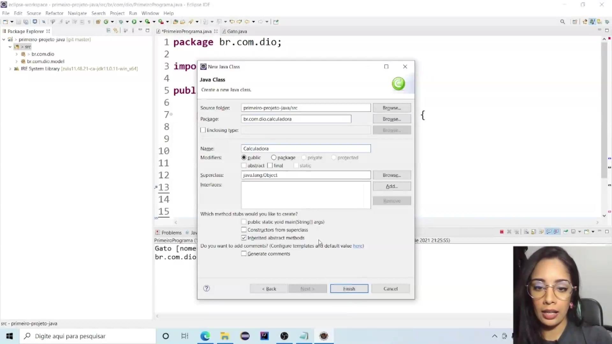
</p>

Para iniciar o desenvolvimento do sistema de calculadora, cria-se uma nova classe Java no Eclipse IDE. Nesta etapa, definimos o pacote como `br.com.dio.calculadora` e nomeamos a classe como `Calculadora`. Além disso, selecionamos a opção para gerar automaticamente o método `public static void main(String[] args)`, que servirá como ponto de entrada para a execução do programa.

<p align="center">
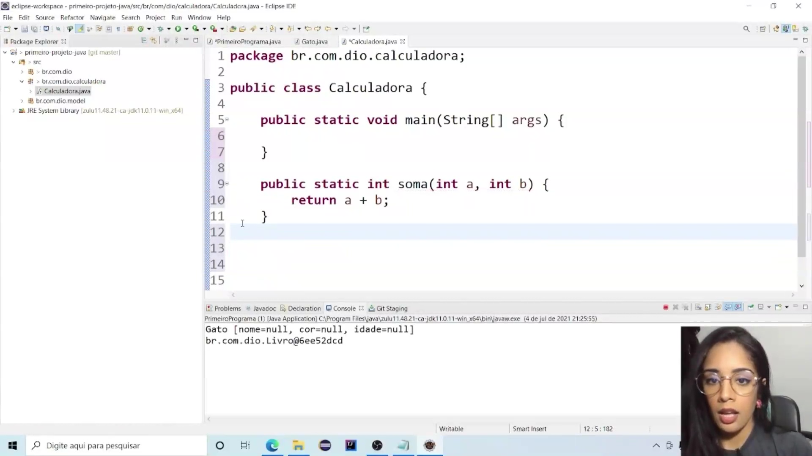
</p>

Com a classe estruturada, implementamos o primeiro método de operação matemática fora do bloco `main`. O método `soma` é definido como estático (`public static int`), recebendo dois números inteiros (`int a, int b`) como parâmetros e retornando a soma aritmética entre eles. O uso de métodos estáticos neste contexto facilita a chamada direta dentro da mesma classe.

```java
public static int soma(int a, int b) {
    return a + b;
}

```

<p align="center">
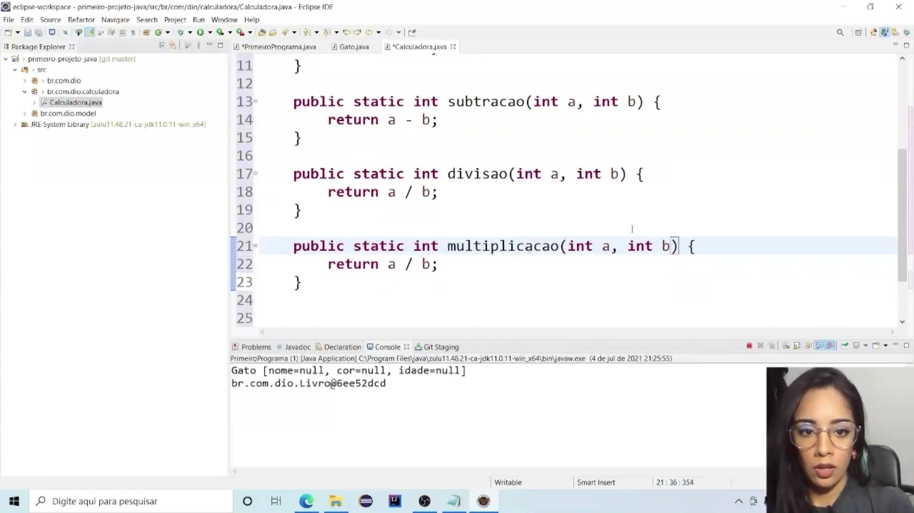
</p>

Seguindo a mesma lógica, implementamos as demais operações básicas: subtração, divisão e multiplicação. Para otimizar a escrita, é possível utilizar o atalho `Ctrl + Alt + Seta para baixo` para duplicar as linhas de código. Note que, nesta implementação inicial, todos os métodos trabalham exclusivamente com o tipo primitivo `int`.

```java
public static int subtracao(int a, int b) {
    return a - b;
}

public static int divisao(int a, int b) {
    return a / b;
}

public static int multiplicacao(int a, int b) {
    return a * b;
}

```

<p align="center">
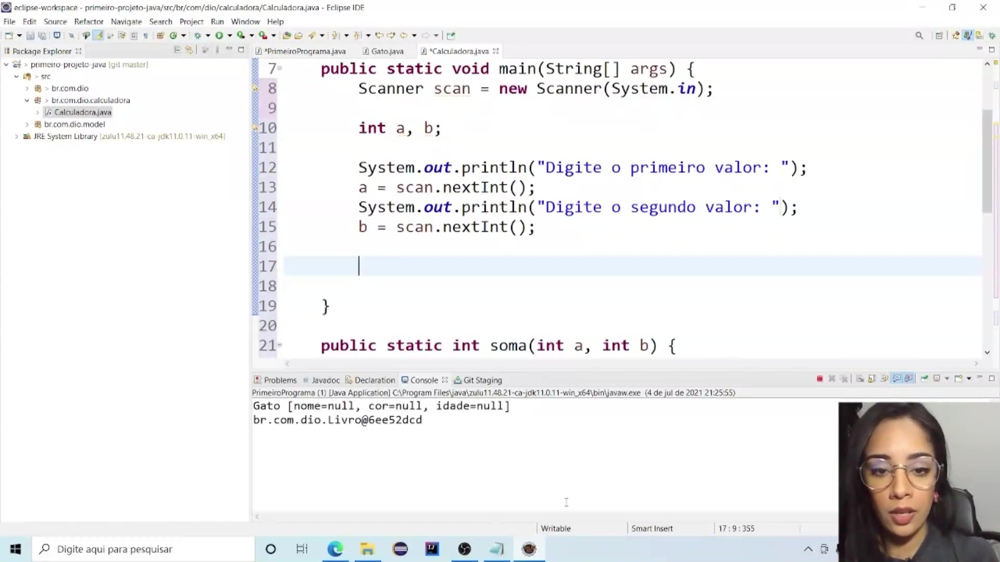
</p>

Dentro do método `main`, configuramos a interação com o usuário. Utilizamos a classe `Scanner` (do pacote `java.util`) para capturar dados via teclado (`System.in`). O programa solicita o primeiro e o segundo valor, armazenando as entradas nas variáveis inteiras `a` e `b` através do método `scan.nextInt()`.

```java
public static void main(String[] args) {
    Scanner scan = new Scanner(System.in);
    
    int a, b;
    
    System.out.println("Digite o primeiro valor: ");
    a = scan.nextInt();
    
    System.out.println("Digite o segundo valor: ");
    b = scan.nextInt();
}

```

<p align="center">
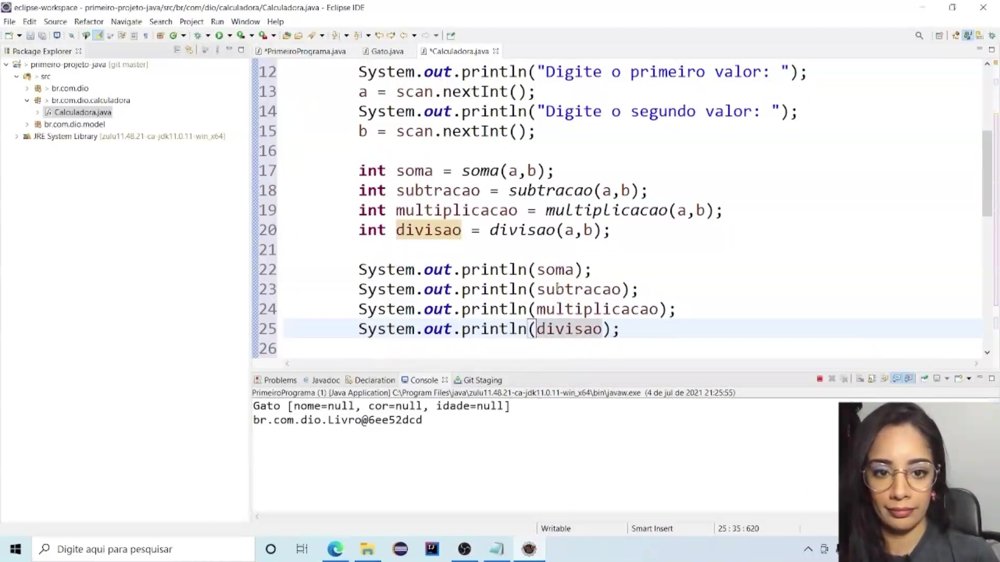
</p>

Nesta fase, realizamos as chamadas aos métodos criados anteriormente e atribuímos seus retornos a novas variáveis locais. Uma funcionalidade útil da IDE demonstrada é o atalho `Ctrl + 1` ou `Ctrl + 2 + L`, que permite criar automaticamente a variável local com o tipo correto com base no retorno do método chamado.

```java
int soma = soma(a, b);
int subtracao = subtracao(a, b);
int multiplicacao = multiplicacao(a, b);
int divisao = divisao(a, b);

System.out.println(soma);
System.out.println(subtracao);
System.out.println(multiplicacao);
System.out.println(divisao);

```

<p align="center">
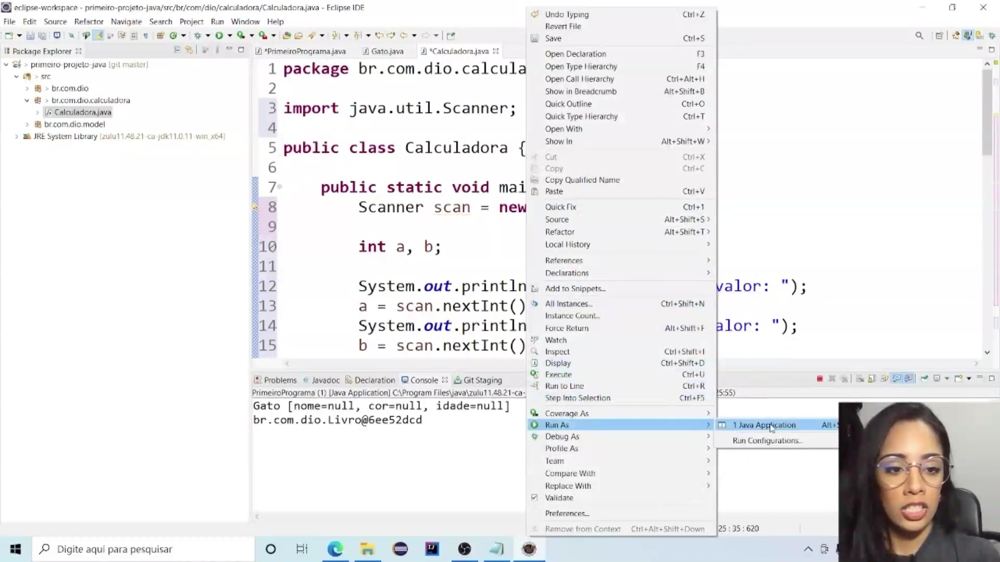
</p>

Para validar o código, realizamos o primeiro teste de execução. No Eclipse, clicamos com o botão direito sobre o arquivo ou dentro do editor e selecionamos **Run As > Java Application**. Isso compila e inicia o programa, abrindo o console para interação.

<p align="center">
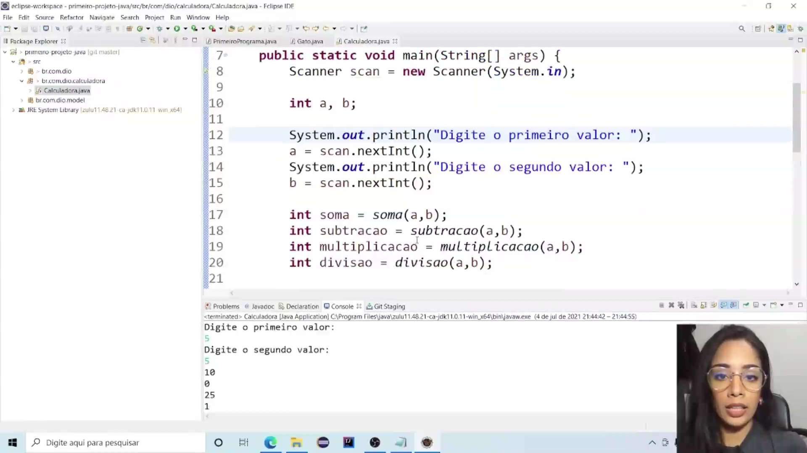
</p>

O console exibe o resultado do teste com os valores `5` e `5`. O programa processa e imprime corretamente: a soma (10), a subtração (0), a multiplicação (25) e a divisão (1). Esta etapa confirma que o fluxo básico de entrada, processamento e saída está operante.

<p align="center">
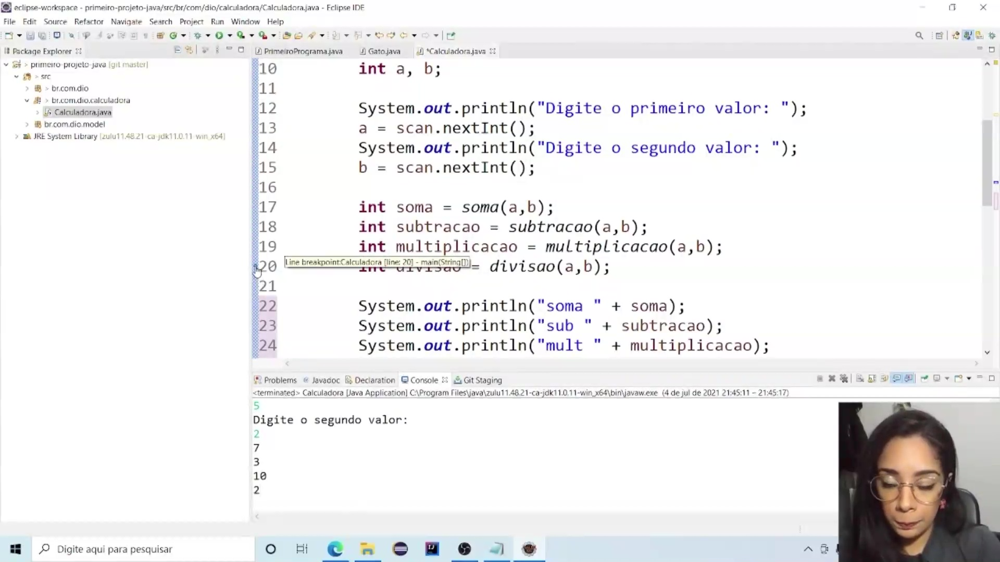
</p>

Ao realizar um teste com os valores `5` e `2`, observa-se que o resultado da divisão é apresentado como `2`, quando o esperado matematicamente seria `2.5`. Para investigar esse comportamento (erro de lógica devido ao tipo de dado), inserimos um **breakpoint** na linha 20 (operação de divisão), clicando na margem esquerda do editor.

<p align="center">
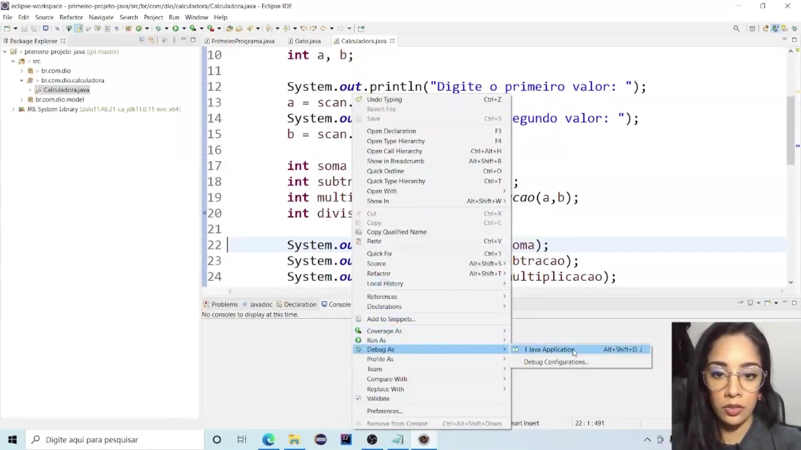
</p>

Iniciamos agora o processo de depuração através de **Debug As > Java Application**. Ao contrário da execução comum, o modo debug permite que o desenvolvedor pause o programa em pontos específicos para analisar o estado das variáveis e o comportamento interno do código.

<p align="center">
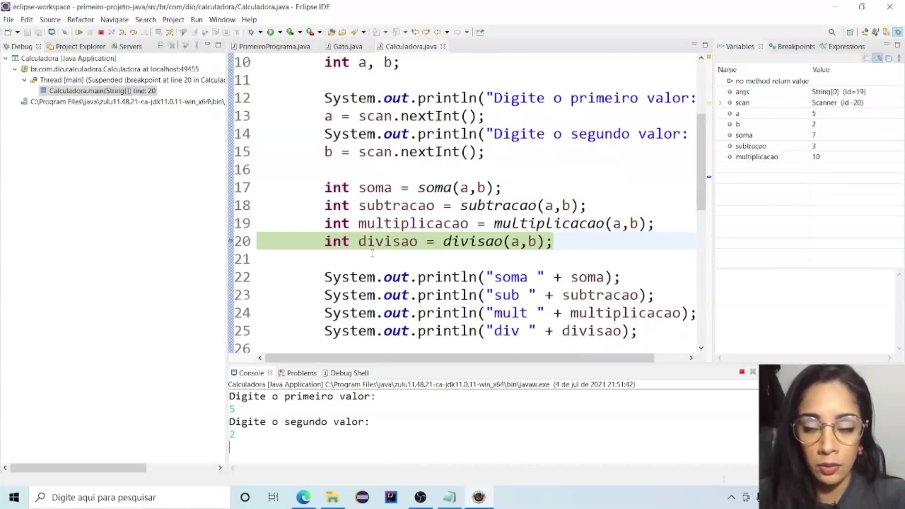
</p>

A IDE entra na perspectiva de Debug e pausa a execução na linha marcada. Na aba **Variables**, podemos inspecionar em tempo real que `a` vale `5` e `b` vale `2`. Note que as operações de soma, subtração e multiplicação já foram concluídas, e seus resultados estão armazenados na memória, visíveis no painel superior direito.

<p align="center">
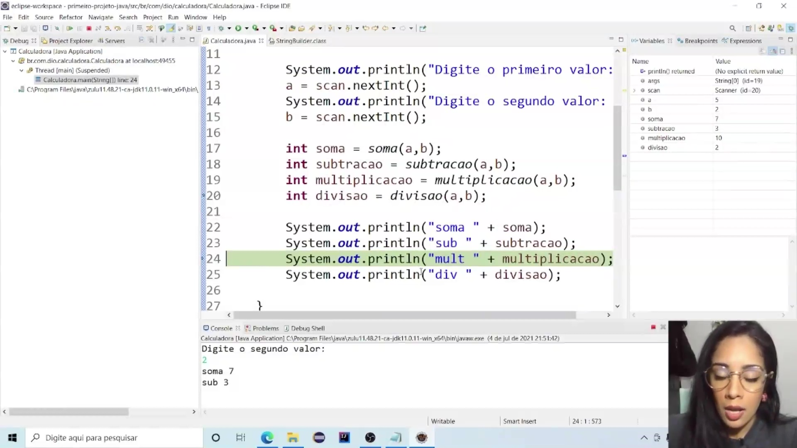
</p>

Utilizando as teclas de controle de depuração, como o **F6 (Step Over)**, avançamos a execução linha por linha. A linha em destaque verde indica o próximo passo a ser executado. No console, vemos as impressões ocorrendo uma a uma conforme avançamos o fluxo manualmente.

<p align="center">
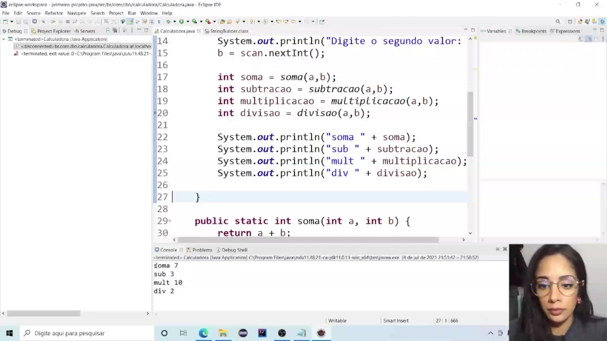
</p>

A visão final do código mostra a estrutura completa da classe `Calculadora` após a análise. O debug permitiu concluir que, para obter resultados decimais na divisão (como 2.5), seria necessário alterar o tipo de retorno do método e das variáveis envolvidas de `int` para `double` ou `float`.      


### 🟩 Vídeo 11 - Últimas observações sobre Eclipse

<video width="60%" controls>
  <source src="000-Midia_e_Anexos/bootcamp_tqi_fullstack-modulo.06-curso.01-video_11.webm" type="video/webm">
    Seu navegador não suporta vídeo HTML5.
</video>

link do vídeo: https://web.dio.me/track/tqi-fullstack-developer/course/dominando-ides-java/learning/1bdfc2be-f6d4-4f9c-ae45-85167bd6be28?autoplay=1

O vídeo apresenta um guia prático sobre funcionalidades essenciais do Eclipse IDE, focando na importação de projetos Java existentes, configuração do ambiente de desenvolvimento e integração com o Git. A instrutora detalha procedimentos de organização de pastas, ajustes no Build Path para diferentes versões do JDK e explora as ferramentas de controle de versão nativas da IDE, preparando o terreno para a transição para o IntelliJ.

## Parte 4 - IntelliJ

### 🟩 Vídeo 12 - Criando seu primeiro projeto com IntelliJ

<video width="60%" controls>
  <source src="000-Midia_e_Anexos/bootcamp_tqi_fullstack-modulo.06-curso.01-video_12.webm" type="video/webm">
    Seu navegador não suporta vídeo HTML5.
</video>

link do vídeo: https://web.dio.me/track/tqi-fullstack-developer/course/dominando-ides-java/learning/907e1507-001d-4187-bfed-bac33e689bb1?autoplay=1

### Anotações

<p align="center">
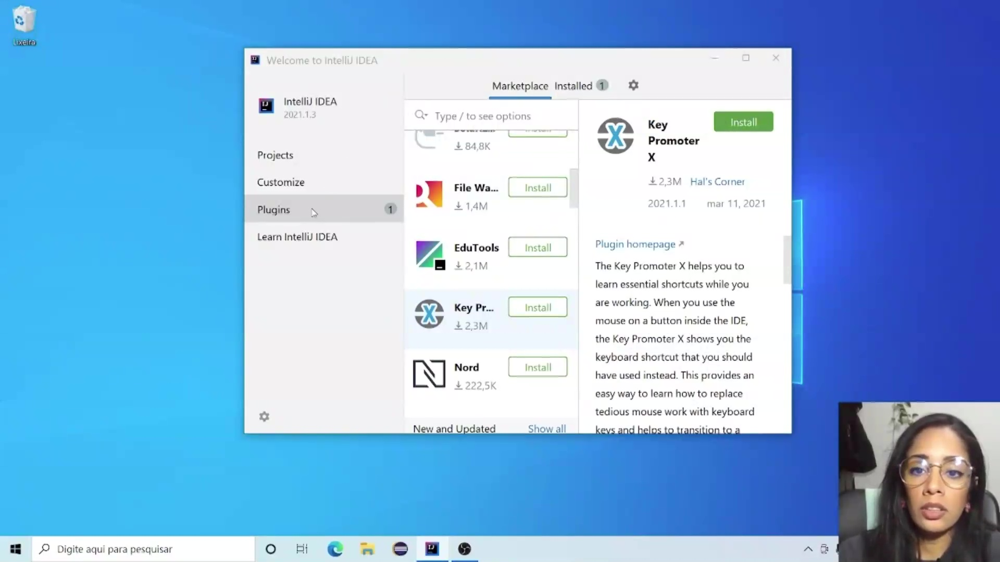
</p>

Na tela inicial do IntelliJ IDEA, a seção **Plugins** permite a personalização da IDE com ferramentas adicionais. É possível navegar pelo **Marketplace** para encontrar extensões úteis, como o **Key Promoter X**, que auxilia no aprendizado de atalhos de teclado, exibindo notificações sempre que uma ação é realizada com o mouse quando existe um atalho correspondente disponível.

<p align="center">
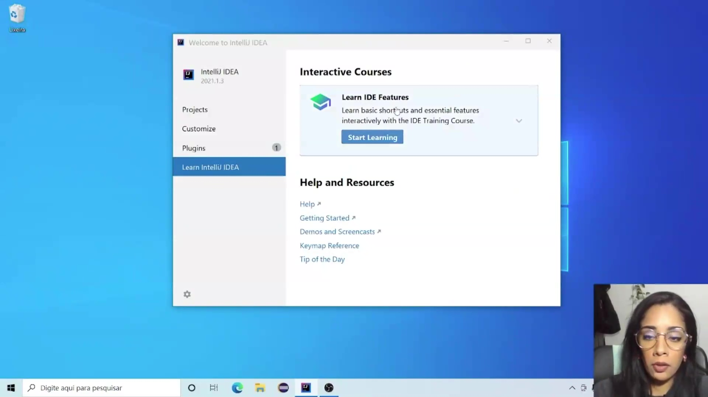
</p>

A aba **Learn IntelliJ IDEA** oferece recursos educacionais integrados para usuários que desejam se familiarizar com a ferramenta. Através do **IDE Training Course**, o desenvolvedor pode aprender atalhos básicos e funcionalidades essenciais de forma interativa, além de acessar links diretos para a documentação de suporte e referências de mapas de teclas.

<p align="center">
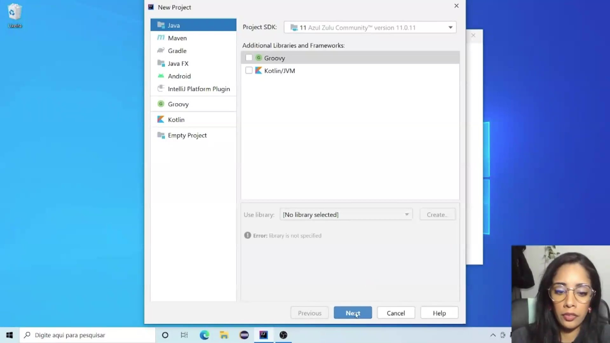
</p>

Ao iniciar a criação de um novo projeto, a janela **New Project** permite selecionar a tecnologia base, como Java, Maven ou Gradle. Neste estágio, deve-se definir o **Project SDK**, que neste caso utiliza o **Java 11 Azul Zulu Community**, garantindo que o ambiente de desenvolvimento esteja alinhado à versão do Java desejada para a aplicação.

<p align="center">
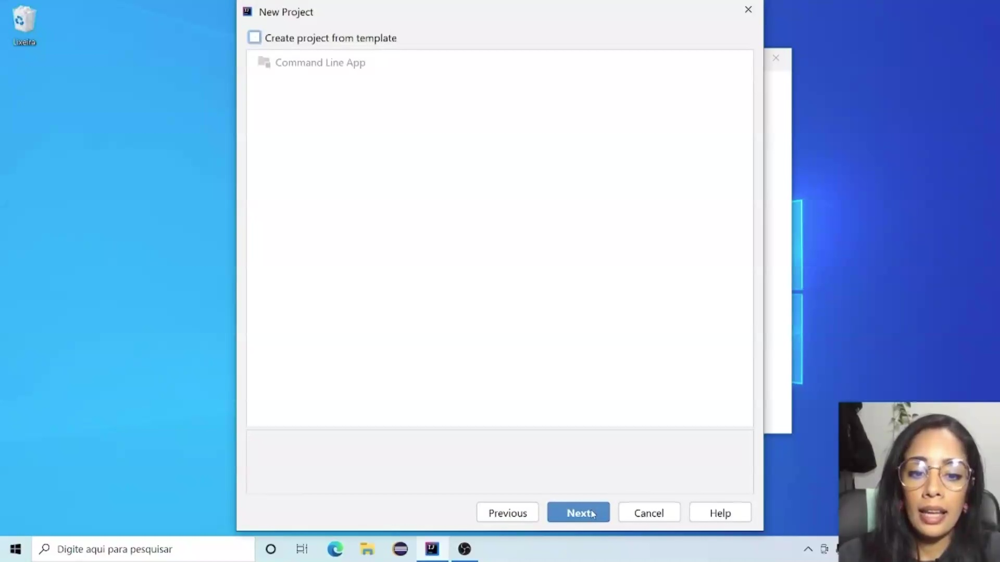
</p>

A opção **Create project from template** permite que o IntelliJ gere automaticamente uma estrutura de aplicação básica, como uma **Command Line App**, incluindo o método `main`. No entanto, para fins educacionais, é possível prosseguir sem selecionar templates para construir os arquivos manualmente a partir do zero.

<p align="center">
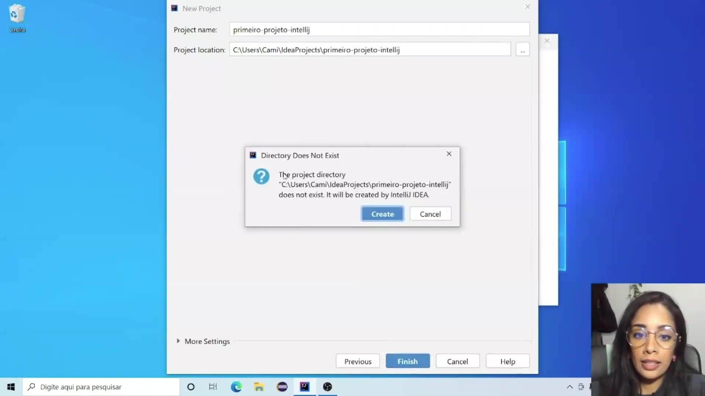
</p>

Na etapa final de configuração, define-se o **Project name** e o **Project location** no disco rígido. Caso a pasta de destino ainda não exista, a IDE emitirá um aviso informando que o diretório será criado automaticamente pelo sistema ao clicar em **Create** ou **Finish**.

<p align="center">
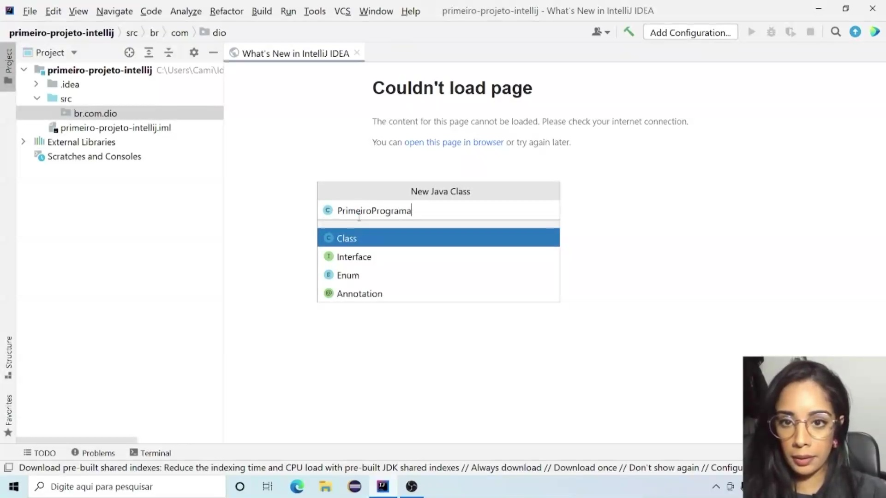
</p>

Dentro da estrutura do projeto, após criar um pacote, utiliza-se a janela **New Java Class** para gerar novos arquivos de código-fonte. O usuário pode escolher entre diferentes tipos de estruturas, como **Class**, **Interface**, **Enum** ou **Annotation**, definindo o nome da classe principal do programa.

<p align="center">
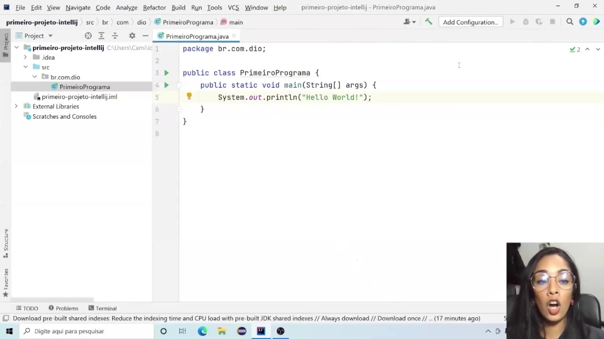
</p>

Com a classe criada, o código-fonte é escrito no editor central. O exemplo abaixo demonstra a estrutura de um programa simples que utiliza o método `main` para imprimir uma mensagem no console:

```java
package br.com.dio;

public class PrimeiroPrograma {
    public static void main(String[] args) {
        System.out.println("Hello World!");
    }
}

```

<p align="center">
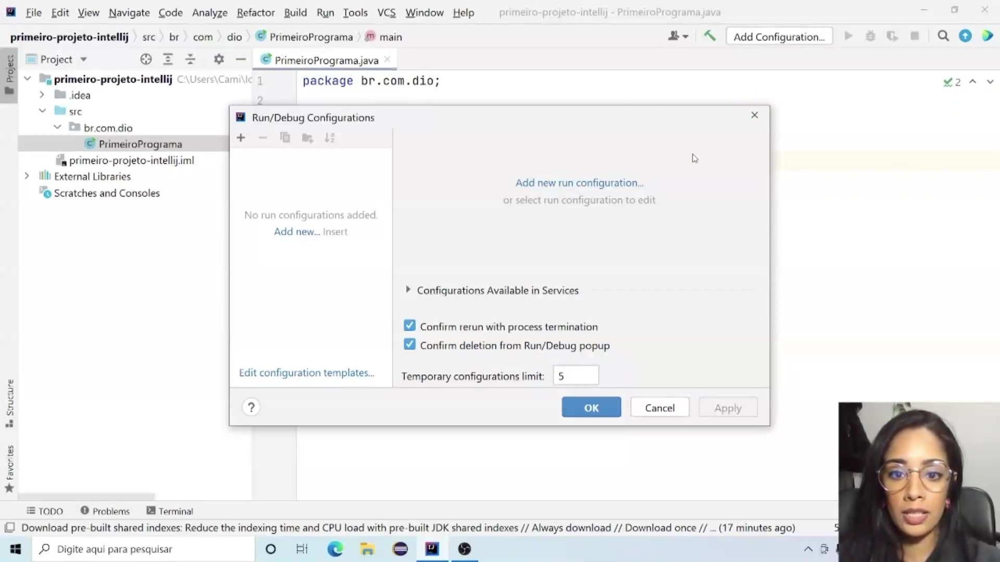
</p>

Antes da primeira execução, a IDE permite configurar os parâmetros de rodagem através do menu **Run/Debug Configurations**. Caso não existam configurações prévias, o IntelliJ identifica automaticamente as classes que possuem um método `main` executável para facilitar o processo.

<p align="center">
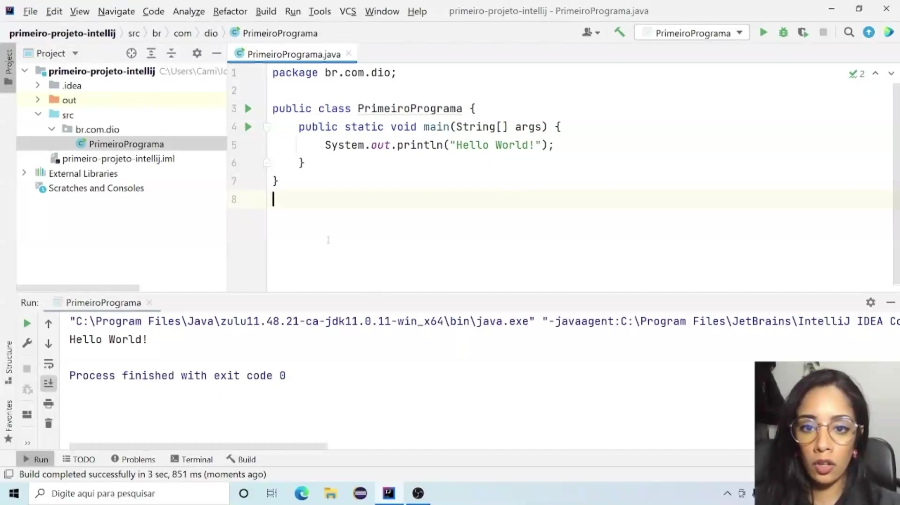
</p>

Ao executar o programa, o painel **Run** é aberto na parte inferior da interface, exibindo o comando utilizado para chamar a JVM e a saída do programa. O resultado "Hello World!" confirma que o ambiente está configurado corretamente e que o código foi compilado e executado com sucesso, finalizando com o código de saída 0.

### 🟩 Vídeo 13 - Mais atalhos e versionamento

<video width="60%" controls>
  <source src="000-Midia_e_Anexos/bootcamp_tqi_fullstack-modulo.06-curso.01-video_13.webm" type="video/webm">
    Seu navegador não suporta vídeo HTML5.
</video>

link do vídeo: https://web.dio.me/track/tqi-fullstack-developer/course/dominando-ides-java/learning/ee645041-ddd4-4130-86e5-5aebe3f75efa?autoplay=1

Este vídeo tutorial explora as funcionalidades de produtividade do IntelliJ IDEA, focando em atalhos essenciais para refatoração, formatação e manipulação de código Java. O material também demonstra o fluxo completo de integração com o GitHub, desde a criação do repositório até o versionamento de classes, destacando a superioridade da experiência de uso do IntelliJ em comparação ao Eclipse para desenvolvedores iniciantes e experientes.

### Anotações

<p align="center">
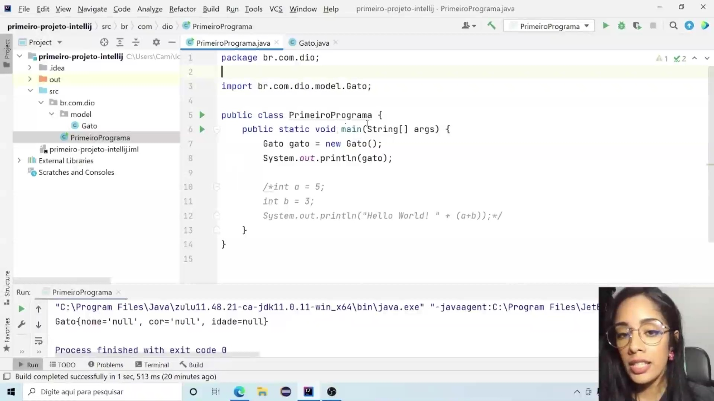
</p>

Nesta etapa inicial, observa-se a interface do IntelliJ IDEA com um projeto Java estruturado. O código apresenta a classe `PrimeiroPrograma` executando a criação de uma instância da classe `Gato`. Um ponto fundamental de produtividade é a organização automática do código através do atalho **Ctrl + Alt + L**, que ajusta a indentação e o posicionamento dos elementos. Além da organização, o ambiente permite a execução rápida do código, exibindo no console inferior o resultado do método `System.out.println(gato)`, que retorna os atributos do objeto e confirma que o processo foi finalizado com sucesso.

```java
package br.com.dio;

import br.com.dio.model.Gato;

public class PrimeiroPrograma {
    public static void main(String[] args) {
        Gato gato = new Gato();
        System.out.println(gato);

        /*int a = 5;
        int b = 3;
        System.out.println("Hello World! " + (a + b));*/
    }
}

```

<p align="center">
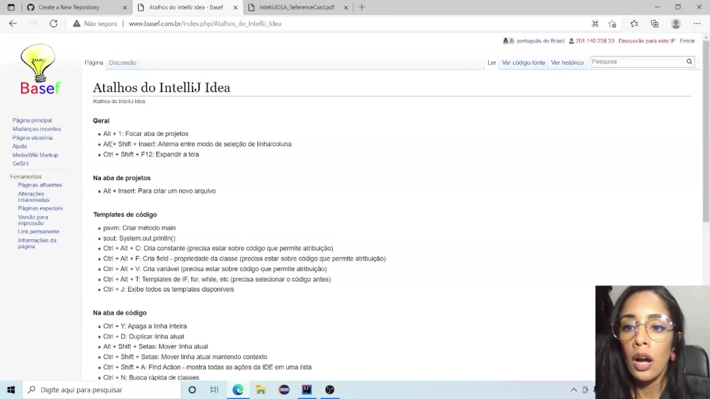
</p>

Para otimizar o fluxo de trabalho no IntelliJ IDEA, existem diversos atalhos de teclado e templates de código (Live Templates) que agilizam tarefas repetitivas. Diferente de outros ambientes, o IntelliJ utiliza combinações específicas para manipulação de linhas e navegação:

Atalhos Gerais e de Edição:

* **Alt + 1**: Foca na aba de projetos lateral.
* **Ctrl + Shift + F12**: Expande a área do editor de texto, ocultando abas auxiliares.
* **Ctrl + D**: Duplica a linha atual.
* **Ctrl + Y**: Apaga a linha inteira de forma rápida.
* **Ctrl + Shift + Setas (Cima/Baixo)**: Move a linha atual para cima ou para baixo no código mantendo o contexto.

Templates de Código:

* **psvm**: Cria o método main.
* **sout**: Atalho para o comando de impressão `System.out.println()`.

<p align="center">
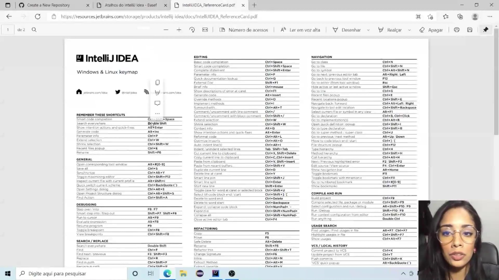
</p>

A JetBrains disponibiliza um guia de referência oficial (Reference Card) que compila os atalhos disponíveis para Windows e Linux. O documento é categorizado por funcionalidades para facilitar a consulta:

* **Editing (Edição)**: Comandos para completude de código inteligente, geração de código (**Alt + Insert**) e comentários rápidos (**Ctrl + /**).
* **Navigation (Navegação)**: Busca por classes (**Ctrl + N**), arquivos ou símbolos, além de navegação entre erros e métodos.
* **Refactoring (Refatoração)**: Atalhos como o **Shift + F6** para renomear elementos e **Ctrl + Alt + M** para extrair métodos.
* **Compile and Run**: Comandos para o build do projeto (**Ctrl + F9**) e execução da configuração selecionada (**Shift + F10**).
* **VCS/Local History**: Atalhos para integração com controle de versão, como o commit (**Ctrl + K**) e o push (**Ctrl + Shift + K**).      


### 🟩 Vídeo 14 - Debug

<video width="60%" controls>
  <source src="000-Midia_e_Anexos/bootcamp_tqi_fullstack-modulo.06-curso.01-video_14.webm" type="video/webm">
    Seu navegador não suporta vídeo HTML5.
</video>

link do vídeo: https://web.dio.me/track/tqi-fullstack-developer/course/dominando-ides-java/learning/da94d26c-d002-4390-b7f3-a1a035ba5c45?autoplay=1

Esta aula técnica aborda o processo de depuração (debug) no ambiente de desenvolvimento IntelliJ IDEA, utilizando como exemplo prático a criação de uma calculadora em Java. O conteúdo foca na transição de usuários do Eclipse para o IntelliJ, destacando as diferenças de atalhos, a identificação de erros de lógica em operações aritméticas e a configuração da estrutura do projeto (SDK/JDK).

### Anotações

<p align="center">

</p>

Ao criar uma nova classe, como a `Calculadora.java`, o IntelliJ IDEA sugere a inclusão do arquivo no sistema de controle de versão Git através de uma janela de diálogo. Essa funcionalidade permite que o desenvolvedor rastreie as alterações no novo arquivo desde o momento de sua criação.

<p align="center">

</p>

Nesta etapa, o ambiente de desenvolvimento sinaliza um erro de compilação na classe `Calculadora`. O IntelliJ identifica que o método `subtrair(int, int)` está duplicado, o que é proibido em Java, impedindo a execução do programa até que a redundância seja corrigida.

```java
package br.com.dio.calculadora;

public class Calculadora {
    public static void main(String[] args) {
        
    }

    public static int somar(int a, int b) {
        return a+b;
    }

    public static int subtrair(int a, int b) {
        return a-b;
    }

    public static int subtrair(int a, int b) {
        return a-b;
    }
}

```

<p align="center">

</p>

A classe `Calculadora` agora conta com os métodos para as quatro operações aritméticas básicas: soma, subtração, multiplicação e divisão. Note que a IDE exibe um aviso visual no método `dividir`, indicando que ele ainda não foi utilizado em nenhuma parte do código.

```java
public static int somar(int a, int b) {
    return a+b;
}

public static int subtrair(int a, int b) {
    return a-b;
}

public static int multiplicar(int a, int b) {
    return a*b;
}

public static int dividir(int a, int b) {
    return a/b;
}

```

<p align="center">

</p>

Para permitir a interação com o usuário, é importada a classe `Scanner` do pacote `java.util`. No método `main`, uma nova instância do `Scanner` é criada, vinculada à entrada padrão do sistema (`System.in`), preparando o programa para receber dados via teclado.

```java
import java.util.Scanner;

public class Calculadora {
    public static void main(String[] args) {
        Scanner scan = new Scanner(System.in);
    }
}

```

<p align="center">

</p>

O programa solicita ao usuário o primeiro valor através de uma mensagem no console. A variável `a`, declarada como um inteiro, recebe o valor digitado por meio do método `scan.nextInt()`.

```java
public static void main(String[] args) {
    Scanner scan = new Scanner(System.in);
    int a, b;

    System.out.println("Digite o primeiro valor: ");
    a = scan.nextInt();
}

```

<p align="center">

</p>

Dando continuidade ao fluxo de entrada, o sistema solicita o segundo valor numérico. Este valor é capturado e armazenado na variável `b`, finalizando a coleta dos operandos necessários para realizar os cálculos da calculadora.

```java
System.out.println("Digite o segundo valor: ");
b = scan.nextInt();

```

<p align="center">

</p>

Com os valores de `a` e `b` disponíveis, o programa chama os métodos estáticos da classe para processar as operações. Os resultados de cada operação são armazenados em variáveis específicas e impressos no console logo em seguida, acompanhados de uma etiqueta identificadora.

```java
int somar = somar(a, b);
int subtrair = subtrair(a, b);
int multiplicar = multiplicar(a, b);
int dividir = dividir(a, b);

System.out.println("somar: " + somar);
System.out.println("subt: " + subtrair);
System.out.println("mult: " + multiplicar);
System.out.println("div: " + dividir);

```

<p align="center">

</p>

A imagem ilustra a execução final da `Calculadora` no terminal integrado do IntelliJ. Após o processamento das entradas, o console exibe os resultados das operações, como a multiplicação resultando em 10 e a divisão resultando em 2, indicando que o programa funcionou conforme o esperado.

<p align="center">

</p>

O IntelliJ IDEA oferece diversas ferramentas de produtividade, como o menu de ações de contexto acessado pelo atalho `Alt+Enter`. Esse recurso permite visualizar sugestões de refatoração, correções rápidas de erros e melhorias estruturais diretamente no ponto do código onde o cursor está posicionado.      


### 🟩 Vídeo 15 - Plugins

<video width="60%" controls>
  <source src="000-Midia_e_Anexos/bootcamp_tqi_fullstack-modulo.06-curso.01-video_15.webm" type="video/webm">
    Seu navegador não suporta vídeo HTML5.
</video>

link do vídeo: https://web.dio.me/track/tqi-fullstack-developer/course/dominando-ides-java/learning/b51d42fd-06c8-4bf5-95a4-05c1685c04c0?autoplay=1

### 🟩 Vídeo 16 - Outra opção de IDE: Visual Studio Code

<video width="60%" controls>
  <source src="000-Midia_e_Anexos/bootcamp_tqi_fullstack-modulo.06-curso.01-video_16.webm" type="video/webm">
    Seu navegador não suporta vídeo HTML5.
</video>

link do vídeo:

##  Materiais de Apoio

# Certificado: 

- Link na plataforma: 
- Certificado em pdf: 
