## Instrutor

- Camila Cavalcante (Software Developer @ Reclame AQUI | Full Stack | Java | Kotlin | Go | TypeScript | PHP)
- Contato Linkedin: / [cami-la](https://www.linkedin.com/in/cami-la/)

## Parte 1 - Visão Geral da Linguagem de Programação Java e da sua Plataforma

### 🟩 Vídeo 01 - Apresentação do curso

<video width="60%" controls>
  <source src="000-Midia_e_Anexos/bootcamp_tqi_fullstack-modulo.06-curso.01-video_01.webm" type="video/webm">
    Seu navegador não suporta vídeo HTML5.
</video>

link do vídeo: https://web.dio.me/track/tqi-fullstack-developer/course/dominando-ides-java/learning/b0f1ae39-6af7-4a2c-8fc2-c73ae8463c84?autoplay=1

O curso "Dominando IDEs Java", ministrado por Camila Cavalcante, é um guia prático focado na configuração e exploração das principais ferramentas de desenvolvimento para a linguagem Java. O conteúdo abrange desde a preparação do ambiente nos sistemas operacionais Windows e Linux até o domínio das funcionalidades essenciais das IDEs Eclipse e IntelliJ, oferecendo uma base sólida para desenvolvedores iniciantes e intermediários.

### Anotações

<p align="center">
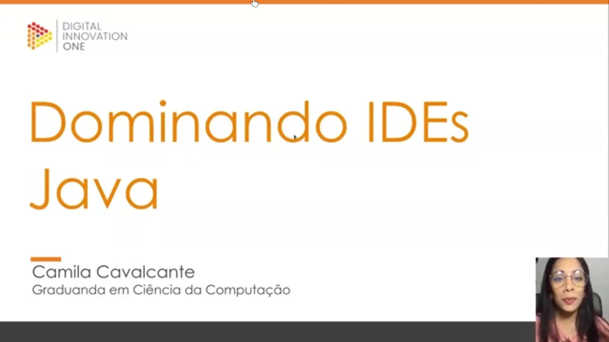
</p>

Esta aula introduz o curso **Dominando IDEs Java**. A apresentação é conduzida por **Camila Cavalcante** , graduanda em Ciência da Computação, que guiará o aprendizado sobre as ferramentas essenciais para o desenvolvimento com a linguagem Java. O foco inicial é estabelecer uma base sólida sobre os ambientes de desenvolvimento integrados mais utilizados no mercado.

<p align="center">

</p>

O **objetivo do curso** é capacitar o desenvolvedor a configurar o ambiente de desenvolvimento Java tanto em sistemas **Linux** quanto **Windows**. Ao concluir as aulas, o aluno terá familiaridade com as principais funcionalidades das IDEs **Eclipse** e **IntelliJ IDEA**, preparando-se para atuar com as ferramentas padrão da indústria.

<p align="center">
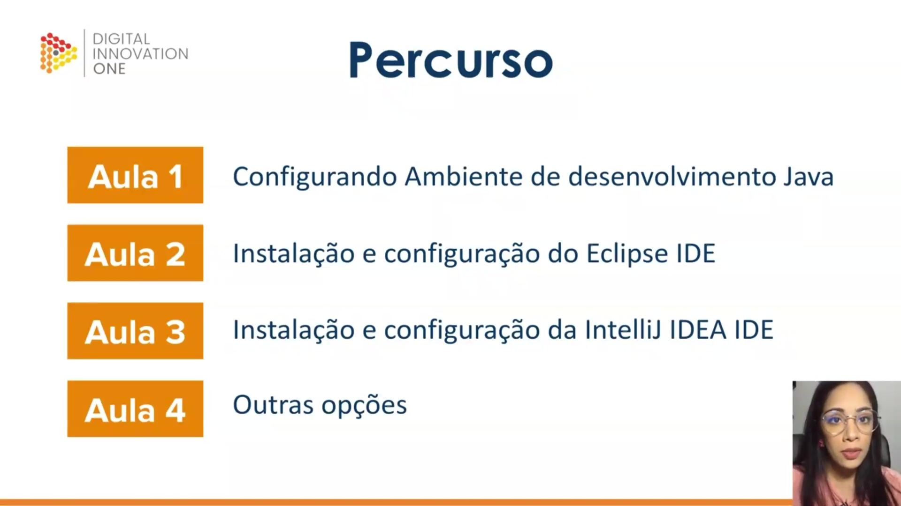
</p>

O **percurso**  de aprendizado está estruturado em quatro etapas principais:

* **Aula 1**: Focada na configuração do ambiente de desenvolvimento Java.
* **Aula 2**: Dedicada à instalação e configuração da IDE Eclipse.
* **Aula 3**: Destinada à instalação e configuração da IDE IntelliJ IDEA.
* **Aula 4**: Apresentação de outras opções de ferramentas disponíveis no mercado.

<p align="center">
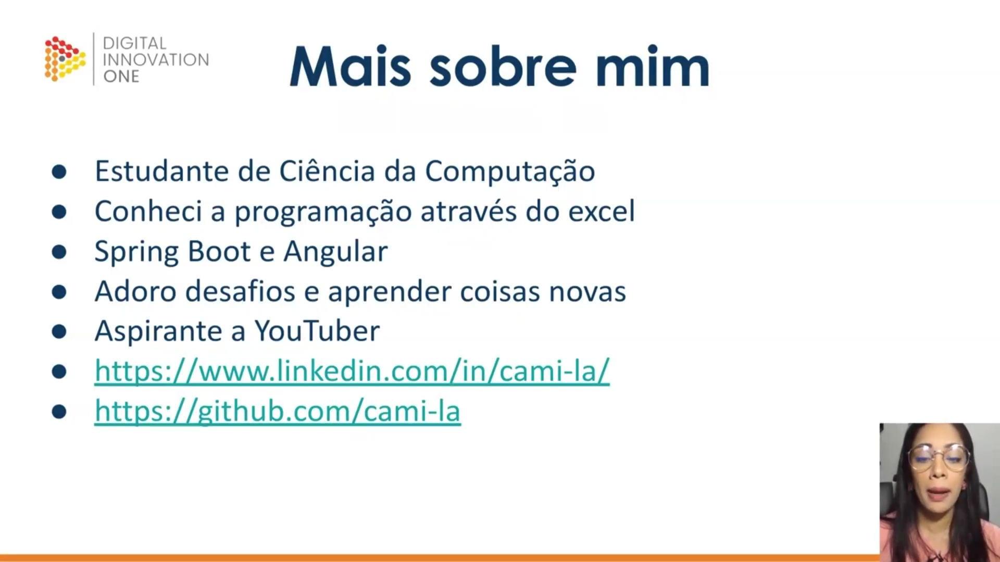
</p>

Nesta seção, a instrutora compartilha detalhes sobre sua trajetória e competências:

* **Formação**: Estudante de Ciência da Computação.
* **Início na Programação**: Teve seu primeiro contato com a lógica de programação através do Excel.
* **Especialização**: Atua com tecnologias como Spring Boot e Angular.
* **Perfil**: Entusiasta de novos desafios e aspirante a YouTuber.
* **Conexões**: Disponibiliza seus perfis profissionais para interação com a comunidade:
    * **LinkedIn**: [https://www.linkedin.com/in/cami-la/](https://www.linkedin.com/in/cami-la/) 
    * **GitHub**: [https://github.com/cami-la](https://github.com/cami-la)


### 🟩 Vídeo 02 - Visão Geral da Linguagem de Programação Java e da sua Plataforma

<video width="60%" controls>
  <source src="000-Midia_e_Anexos/bootcamp_tqi_fullstack-modulo.06-curso.01-video_02.webm" type="video/webm">
    Seu navegador não suporta vídeo HTML5.
</video>

link do vídeo: https://web.dio.me/track/tqi-fullstack-developer/course/dominando-ides-java/learning/d5c408f0-b772-4cb7-a522-9dafec72f29c?autoplay=1

Esta aula introdutória apresenta os fundamentos do ecossistema Java, abrangendo desde sua origem histórica na Sun Microsystems até sua arquitetura técnica atual sob a gestão da Oracle. O conteúdo destaca a natureza da linguagem como puramente orientada a objetos e explica o funcionamento do processo de compilação e interpretação via Bytecode e Máquina Virtual Java (JVM). Além de diferenciar as edições da plataforma (SE, EE, ME), o áudio orienta sobre a escolha de versões LTS (Long Term Support) e o uso de Ambientes de Desenvolvimento Integrado (IDEs), preparando o estudante para as etapas práticas de instalação e codificação.

### Anotações

<p align="center">
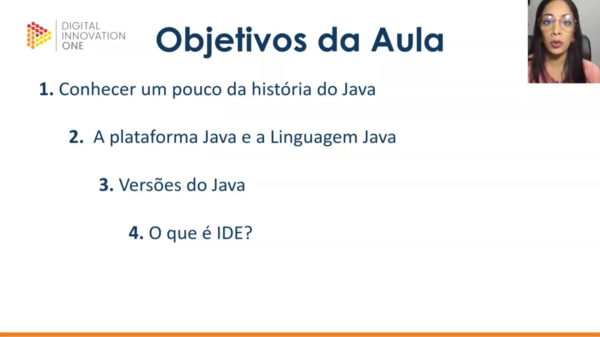
</p>

Nesta aula introdutória, o foco central é fornecer uma visão geral sobre o ecossistema Java. Os tópicos abordados incluem uma retrospectiva histórica da linguagem, a distinção fundamental entre a plataforma e a linguagem Java, o acompanhamento das diversas versões lançadas ao longo dos anos e a definição de IDE (Ambiente de Desenvolvimento Integrado), ferramentas essenciais para a produtividade do desenvolvedor.

<p align="center">
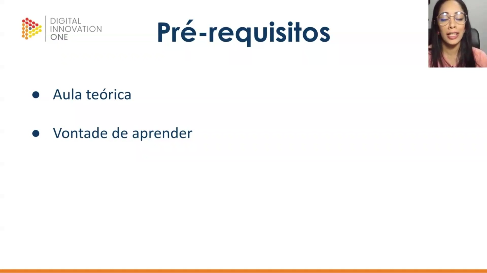
</p>

Para acompanhar o conteúdo, o único pré-requisito estabelecido para esta aula teórica é a disposição e vontade de aprender os conceitos básicos que sustentam a tecnologia Java.

<p align="center">
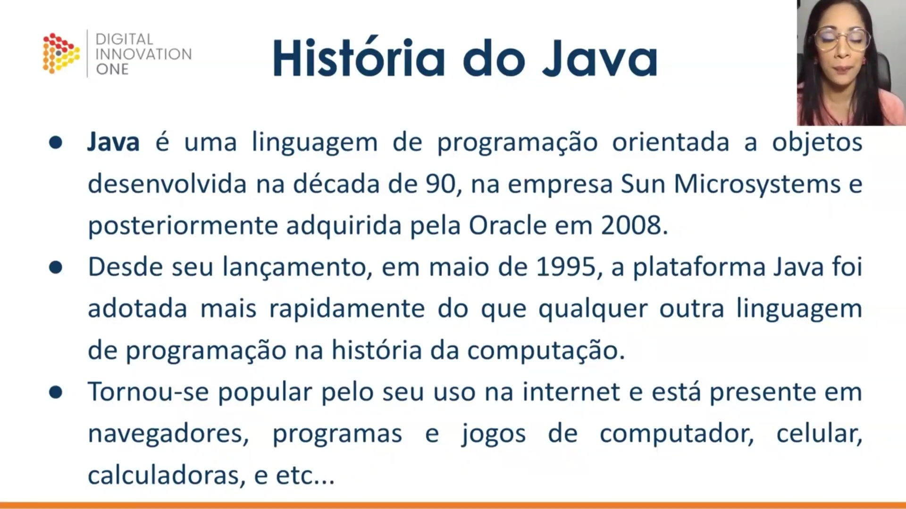
</p>

A história do Java remonta à década de 90, quando foi criada pela Sun Microsystems como uma linguagem de programação orientada a objetos. Em 2008, a empresa foi adquirida pela Oracle. Desde o seu lançamento oficial em maio de 1995, a plataforma experimentou uma adoção sem precedentes na história da computação, tornando-se onipresente na internet, navegadores, softwares desktop, dispositivos móveis e até calculadoras.

<p align="center">
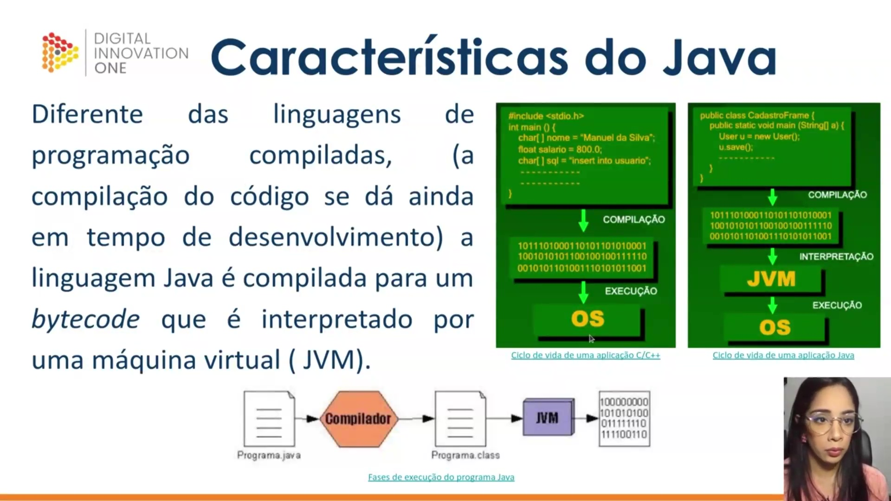
</p>

O Java se diferencia de linguagens puramente compiladas (como C e C++) por seu ciclo de execução híbrido. Enquanto em C/C++ o código é compilado diretamente para código de máquina específico do sistema operacional (OS), o código Java é compilado para um formato intermediário chamado **bytecode**. Este bytecode não é lido diretamente pelo hardware, mas sim interpretado por uma Máquina Virtual Java (JVM), o que garante a portabilidade do programa entre diferentes plataformas.

```c
#include <stdio.h>
 int main () {
 char( nome = "Manuel da Silva
 float salario = 800.0;
 char[] sql = "insert into usuario";
 }

```

```java
public class CadastroFrame (
 public static void main (String() ) {
 User u new User();
 usave();

```

<p align="center">
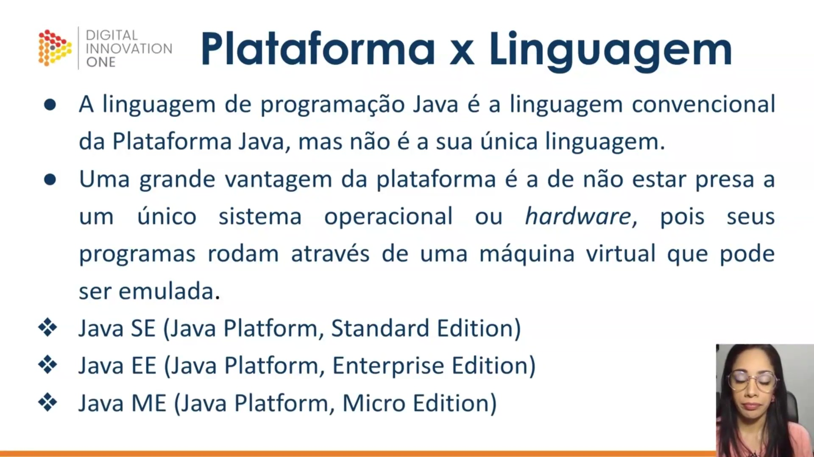
</p>

É importante distinguir a **Linguagem Java** da **Plataforma Java**. Embora o Java seja a linguagem padrão, a plataforma é capaz de suportar outras linguagens que também geram bytecodes compatíveis com a JVM. A grande vantagem reside na independência de hardware e sistema operacional, permitindo que os programas rodem em qualquer lugar onde a máquina virtual possa ser emulada. A plataforma se divide em três edições principais:

* **Java SE (Standard Edition):** Núcleo da plataforma, usado para aplicações desktop e servidores.
* **Java EE (Enterprise Edition):** Voltado para aplicações corporativas e de grande escala.
* **Java ME (Micro Edition):** Destinado a dispositivos com recursos limitados, como sistemas embarcados.

<p align="center">

</p>

O processo de execução de um programa Java segue três etapas fundamentais:

1. **Escrita:** Criação do código-fonte em um arquivo com extensão `.java`.
2. **Compilação:** Utilização do Java Compiler (presente no JDK) para transformar o código-fonte em um arquivo de bytecode com extensão `.class`.
3. **Execução:** A JVM lê o arquivo `.class` e, juntamente com as bibliotecas do JRE, interpreta e executa as instruções no sistema operacional.

<p align="center">
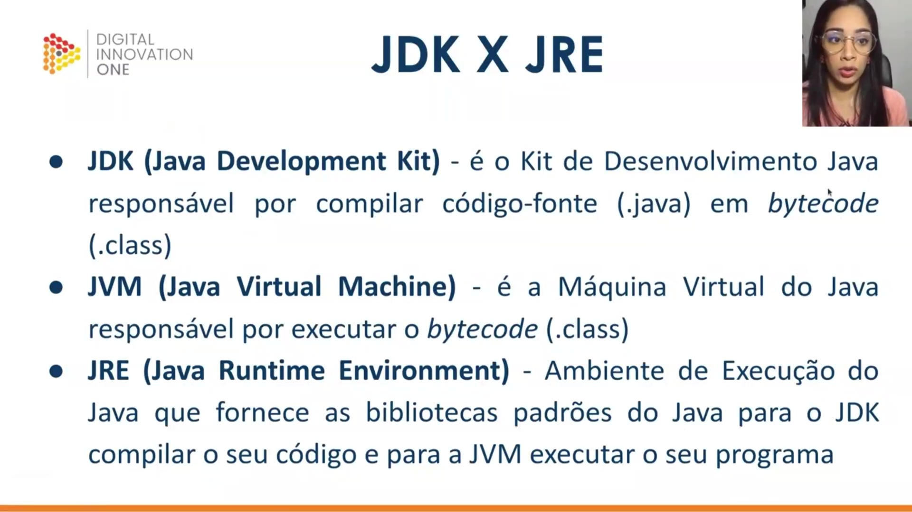
</p>

Para trabalhar com Java, é essencial entender a relação entre os componentes do kit de ferramentas:

* **JDK (Java Development Kit):** O conjunto completo para desenvolvedores, contendo o compilador (`javac`) e ferramentas de empacotamento (`jar`). Ele é responsável por transformar `.java` em `.class`.
* **JRE (Java Runtime Environment):** O ambiente necessário para rodar aplicações Java. Ele fornece as bibliotecas padrões (Java API) e a JVM.
* **JVM (Java Virtual Machine):** A peça que efetivamente executa o bytecode, atuando como uma camada entre a aplicação e o sistema operacional, contando com recursos como o Garbage Collector para gerenciamento de memória.

<p align="center">
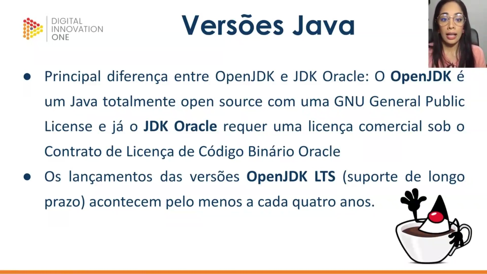
</p>

Existem duas distribuições principais do Java: o **OpenJDK** e o **JDK Oracle**. A diferença fundamental reside no licenciamento: o OpenJDK é totalmente de código aberto (GPL), enquanto o JDK Oracle possui termos comerciais específicos para uso corporativo. Versões com suporte de longo prazo (LTS) do OpenJDK são lançadas aproximadamente a cada quatro anos, garantindo estabilidade para grandes projetos.

<p align="center">
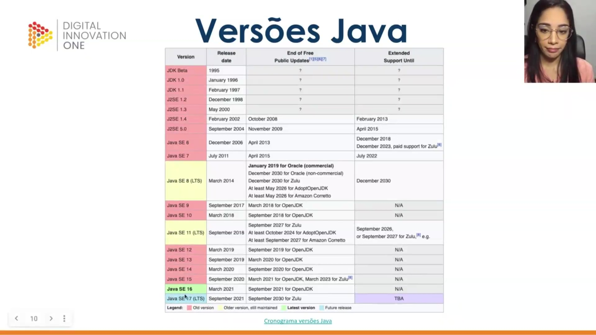
</p>

A imagem apresenta um cronograma detalhado das versões do Java, desde o seu lançamento inicial em 1995. O gráfico destaca a evolução das versões LTS (como Java 8, 11 e 17) e o período de suporte gratuito e estendido oferecido por diferentes fornecedores (Oracle, AdoptOpenJDK, Zulu, Amazon Corretto), evidenciando a maturidade e a continuidade do ecossistema.

<p align="center">
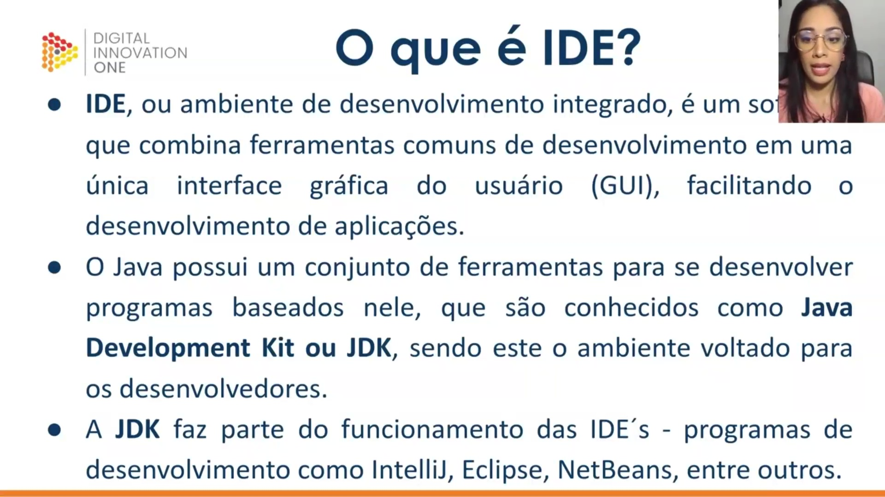
</p>

Uma IDE (Ambiente de Desenvolvimento Integrado) é um software que consolida diversas ferramentas (editor de texto, compilador, depurador) em uma interface gráfica única para facilitar a criação de aplicações. No ecossistema Java, as IDEs utilizam o JDK instalado no sistema para funcionar. Exemplos populares incluem IntelliJ IDEA, Eclipse e NetBeans. Embora as ferramentas facilitem muito o trabalho, é recomendado que o desenvolvedor não se prenda a uma única opção, mas entenda a lógica de funcionamento comum a todas elas.      

<p align="center"> 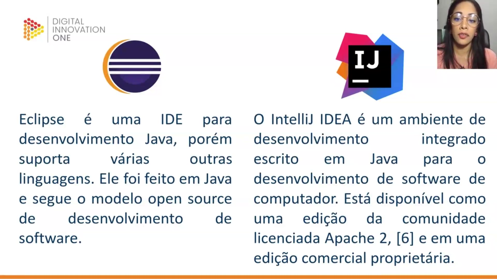 </p>

Para encerrar esta introdução ao ecossistema Java, são disponibilizados os canais de comunicação e redes sociais para acompanhamento de materiais complementares. O código-fonte e informações técnicas do treinamento podem ser encontrados no GitHub. Além disso, é possível manter contato e tirar dúvidas através do LinkedIn e perfis no Instagram, onde são compartilhadas dicas e conteúdos gratuitos sobre a linguagem. Caso surjam dúvidas específicas durante o curso, os alunos devem utilizar o fórum da plataforma DIO ou o servidor no Discord.

## Parte 2 - Ambiente de desenvolvimento Ubuntu

### 🟩 Vídeo 03 - Instalação JDK e Git no Ubuntu

<video width="60%" controls>
  <source src="000-Midia_e_Anexos/bootcamp_tqi_fullstack-modulo.06-curso.01-video_03.webm" type="video/webm">
    Seu navegador não suporta vídeo HTML5.
</video>

link do vídeo:

### 🟩 Vídeo 04 - Instalação IntelliJ e Eclipse no Ubuntu

<video width="60%" controls>
  <source src="000-Midia_e_Anexos/bootcamp_tqi_fullstack-modulo.06-curso.01-video_04.webm" type="video/webm">
    Seu navegador não suporta vídeo HTML5.
</video>

link do vídeo:


## Parte 3 - Ambiente de desenvolvimento Windows

### 🟩 Vídeo 05 - Instalação JDK e Git no Windows

<video width="60%" controls>
  <source src="000-Midia_e_Anexos/bootcamp_tqi_fullstack-modulo.06-curso.01-video_05.webm" type="video/webm">
    Seu navegador não suporta vídeo HTML5.
</video>

link do vídeo:

### 🟩 Vídeo 06 - Instalação IntelliJ e Eclipse no Windows

<video width="60%" controls>
  <source src="000-Midia_e_Anexos/bootcamp_tqi_fullstack-modulo.06-curso.01-video_06.webm" type="video/webm">
    Seu navegador não suporta vídeo HTML5.
</video>

link do vídeo:


## Parte 4 - Eclipse

### 🟩 Vídeo 07 - Criando seu primeiro projeto com Eclipse

<video width="60%" controls>
  <source src="000-Midia_e_Anexos/bootcamp_tqi_fullstack-modulo.06-curso.01-video_07.webm" type="video/webm">
    Seu navegador não suporta vídeo HTML5.
</video>

link do vídeo:

### 🟩 Vídeo 08 - Atalhos

<video width="60%" controls>
  <source src="000-Midia_e_Anexos/bootcamp_tqi_fullstack-modulo.06-curso.01-video_08.webm" type="video/webm">
    Seu navegador não suporta vídeo HTML5.
</video>

link do vídeo:

### 🟩 Vídeo 09 - Git e GitHub

<video width="60%" controls>
  <source src="000-Midia_e_Anexos/bootcamp_tqi_fullstack-modulo.06-curso.01-video_09.webm" type="video/webm">
    Seu navegador não suporta vídeo HTML5.
</video>

link do vídeo:

### 🟩 Vídeo 10 - Debug

<video width="60%" controls>
  <source src="000-Midia_e_Anexos/bootcamp_tqi_fullstack-modulo.06-curso.01-video_10.webm" type="video/webm">
    Seu navegador não suporta vídeo HTML5.
</video>

link do vídeo:

### 🟩 Vídeo 11 - Últimas observações sobre Eclipse

<video width="60%" controls>
  <source src="000-Midia_e_Anexos/bootcamp_tqi_fullstack-modulo.06-curso.01-video_11.webm" type="video/webm">
    Seu navegador não suporta vídeo HTML5.
</video>

link do vídeo:


##  Materiais de Apoio

# Certificado: 

- Link na plataforma: 
- Certificado em pdf: 
