## Instrutor

- Thiago Leite e Carvalho (Senior Java Developer and Software Engineer | Java Tech Lead | University Professor | Writer | Speaker | Instructor)
- Contato Linkedin: / [thiago-leite-e-carvalho-1b337b127](https://www.linkedin.com/in/thiago-leite-e-carvalho-1b337b127/)

## Parte 1 - Conceituação e criação

### 🟩 Vídeo 01 - Introdução

<video width="60%" controls>
  <source src="000-Midia_e_Anexos/bootcamp_tqi_fullstack-modulo.06-curso.02-video_01.webm" type="video/webm">
    Seu navegador não suporta vídeo HTML5.
</video>

link do vídeo: https://web.dio.me/track/tqi-fullstack-developer/course/variaveis-tipos-de-dados-e-operadores-matematicos-em-java/learning/d687771f-76cd-4379-9e1f-1c529c44e15b?autoplay=1

Este vídeo apresenta a introdução ao curso de Variáveis, Tipos de Dados e Operadores Aritméticos em Java, ministrado por Thiago Leite. O instrutor compartilha sua trajetória de 17 anos como desenvolvedor backend e ex-professor universitário, detalhando a estrutura do curso, os pré-requisitos técnicos necessários e os canais de suporte disponíveis para os alunos na plataforma DIO.

### Anotações

<p align="center">

</p>

Bem-vindos ao curso focado em **Variáveis, Tipos de Dados e Operadores Aritméticos**. O instrutor Thiago Leite apresenta os fundamentos essenciais para o desenvolvimento de software, utilizando a linguagem **Java** como base para todos os exemplos e conceitos que serão explorados ao longo das aulas.

<p align="center">
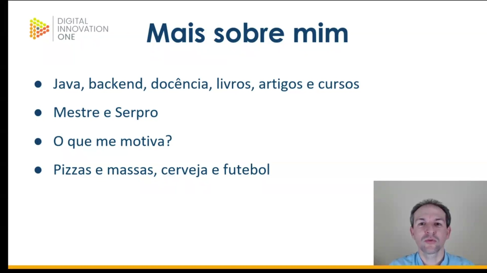
</p>

O instrutor Thiago Leite possui 17 anos de experiência em desenvolvimento de software, com foco em Java Backend, atuando em camadas de persistência, modelos de dados e criação de APIs. Além de sua atuação no **Serpro** (empresa de tecnologia do Governo Federal), ele possui mestrado em Engenharia de Software e experiência como professor universitário. Fora do ambiente profissional, seus interesses incluem a culinária (massas e pizzas), o estudo de cervejas artesanais e a paixão pelo futebol.

<p align="center">
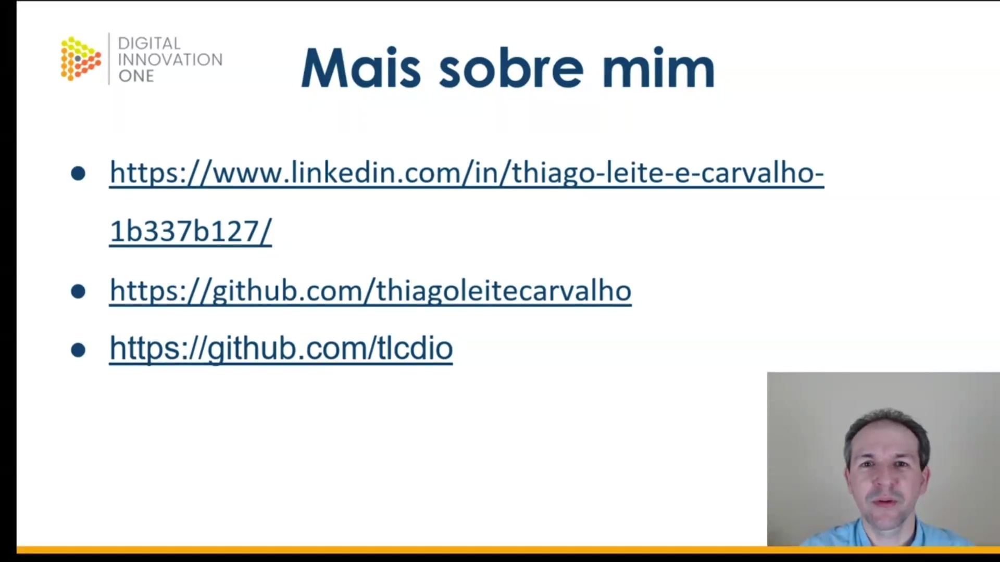
</p>

Para acompanhar o trabalho do instrutor e acessar materiais complementares, você pode utilizar os seguintes canais:

* **LinkedIn:** Perfil profissional onde são publicados artigos, livros e conteúdos sobre desenvolvimento de software.
* **GitHub Pessoal:** Espaço para projetos autorais e componentes disponibilizados para a comunidade.
* **GitHub DIO:** Perfil específico para o armazenamento dos repositórios e projetos de exemplo práticos deste curso.

Links:

- [https://www.linkedin.com/in/thiago-leite-e-carvalho-1b337b127/](https://www.linkedin.com/in/thiago-leite-e-carvalho-1b337b127/)
- [https://github.com/thiagoleitecarvalho](https://github.com/thiagoleitecarvalho)
- [https://github.com/tlcdio](https://github.com/tlcdio)


<p align="center">
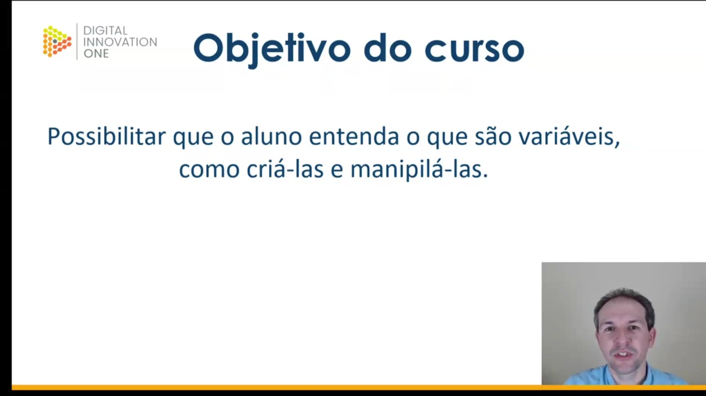
</p>

O objetivo principal deste treinamento é capacitar o aluno a entender profundamente o conceito de **variáveis**. Isso engloba desde o entendimento teórico do que elas representam na memória até a prática de como criá-las e manipulá-las corretamente dentro de um fluxo de programação.

<p align="center">
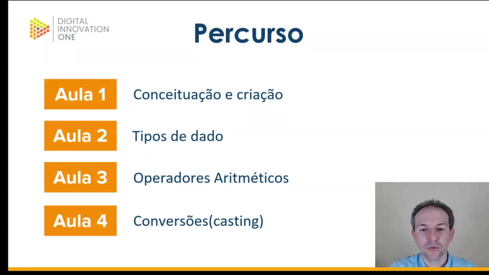
</p>

O conteúdo do curso está organizado em um percurso didático de quatro etapas fundamentais:

1. **Aula 1:** Conceituação e criação de variáveis.
2. **Aula 2:** Estudo dos Tipos de Dados.
3. **Aula 3:** Operadores Aritméticos para manipulação de valores.
4. **Aula 4:** Conversões e Casting (transformação entre tipos).

<p align="center">

</p>

Para obter o melhor aproveitamento das aulas, são necessários os seguintes requisitos técnicos:

* Conhecimento prévio em **Lógica de Programação**.
* Noções básicas da linguagem **Java** (utilizaremos a versão 11).
* Ambiente de desenvolvimento configurado com a IDE **IntelliJ**, que será a ferramenta utilizada para a resolução dos exercícios práticos.


### 🟩 Vídeo 02 - Conceituação e criação

<video width="60%" controls>
  <source src="000-Midia_e_Anexos/bootcamp_tqi_fullstack-modulo.06-curso.02-video_02.webm" type="video/webm">
    Seu navegador não suporta vídeo HTML5.
</video>

link do vídeo: https://web.dio.me/track/tqi-fullstack-developer/course/variaveis-tipos-de-dados-e-operadores-matematicos-em-java/learning/08601add-19fb-4776-be4c-d61a57c59500?autoplay=1

Esta aula introdutória de Java foca no conceito e na criação de variáveis, definindo-as como espaços reservados na memória do computador para o armazenamento de dados. O conteúdo explora a sintaxe rigorosa da linguagem, que é fortemente tipada, detalhando as regras obrigatórias de nomenclatura e as convenções de boas práticas (como o uso de CamelCase). O objetivo principal é capacitar o aluno a declarar variáveis de forma correta e legível, preparando a base para o desenvolvimento de códigos profissionais e colaborativos.

### Anotações

<p align="center">
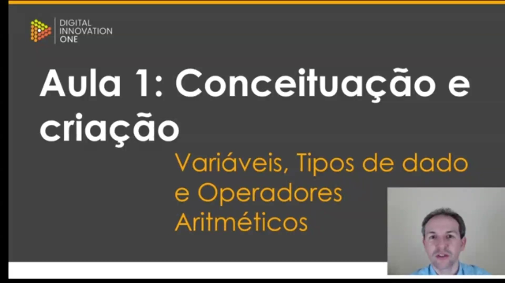
</p>

Esta é a abertura da **Aula 1**, focada em **Conceituação e criação**. O conteúdo programático desta etapa introdutória abrange três pilares fundamentais para o início na programação: **Variáveis, Tipos de dado e Operadores Aritméticos**. A aula utilizará a linguagem Java para explorar estes conceitos básicos.

<p align="center">
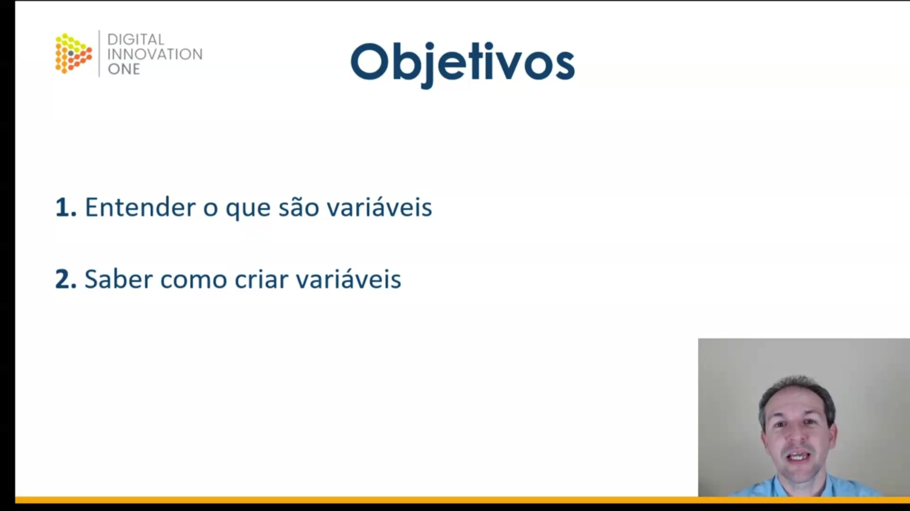
</p>

Os objetivos centrais desta primeira aula são claros e diretos. Espera-se que o aluno seja capaz de:

1. **Entender o que são variáveis**;
2. **Saber como criar variáveis**.

O foco é compreender o mecanismo de funcionamento e a sintaxe de declaração na linguagem Java.

<p align="center">
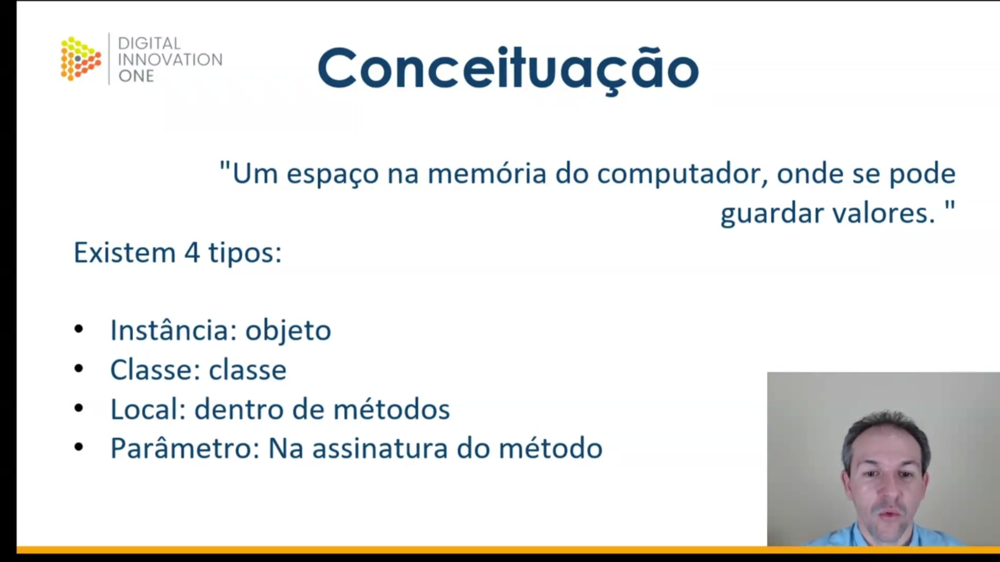
</p>

Para a **conceituação**, define-se variável formalmente como **"Um espaço na memória do computador, onde se pode guardar valores"**.

Na linguagem Java, as variáveis são categorizadas em quatro tipos distintos:

* **Instância:** Pertence ao objeto;
* **Classe:** Pertence à classe;
* **Local:** Declarada dentro de métodos;
* **Parâmetro:** Presente na assinatura do método.

Nesta fase introdutória, o foco recairá sobre as variáveis locais (como aquelas criadas dentro do método `main`), uma vez que os tipos de instância e classe estão atrelados ao paradigma de Orientação a Objetos.

<p align="center">
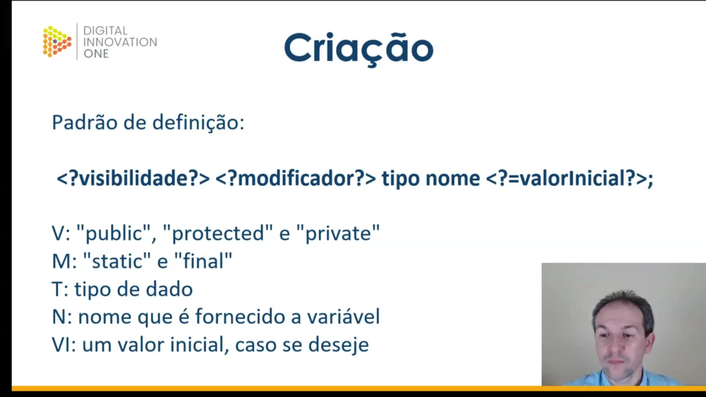
</p>

A **criação** de variáveis em Java segue um padrão de definição específico, composto por elementos obrigatórios e opcionais. A estrutura geral é:

```java
<?visibilidade?> <?modificador?> tipo nome <?=valorInicial?>;

```

A legenda para interpretar esta estrutura é a seguinte:

* **V (Visibilidade):** Define o acesso, podendo ser "public", "protected" ou "private";
* **M (Modificador):** Define comportamentos especiais, como "static" ou "final" (constante);
* **T (Tipo):** Especifica o tipo de dado (obrigatório em Java);
* **N (Nome):** O identificador fornecido à variável;
* **VI (Valor Inicial):** Um valor atribuído na declaração, caso se deseje.

Os itens entre interrogações (`?`) são opcionais. O modificador `final` é utilizado para declarar constantes, ou seja, variáveis cujo valor não pode ser alterado após a inicialização.

<p align="center">
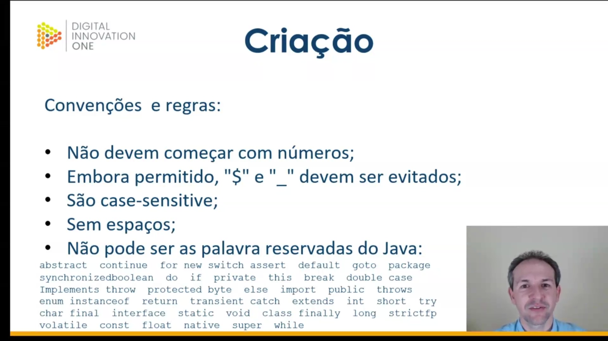
</p>

Existem **convenções e regras** rígidas para a nomenclatura de variáveis em Java. O desrespeito a algumas destas regras pode impedir a compilação do código:

* **Não devem começar com números**;
* O uso de cifrão (`$`) e *underscore* (`_`) é permitido, mas **deve ser evitado** como boa prática;
* As variáveis são **case-sensitive**, ou seja, diferenciam maiúsculas de minúsculas;
* **Sem espaços** no nome da variável;
* **Não pode ser uma das palavras reservadas do Java**.

A lista de palavras reservadas inclui termos de comando da própria linguagem, como `abstract`, `boolean`, `class`, `if`, `void`, `while`, entre outros listados na imagem, que não podem ser usados como identificadores.

<p align="center">
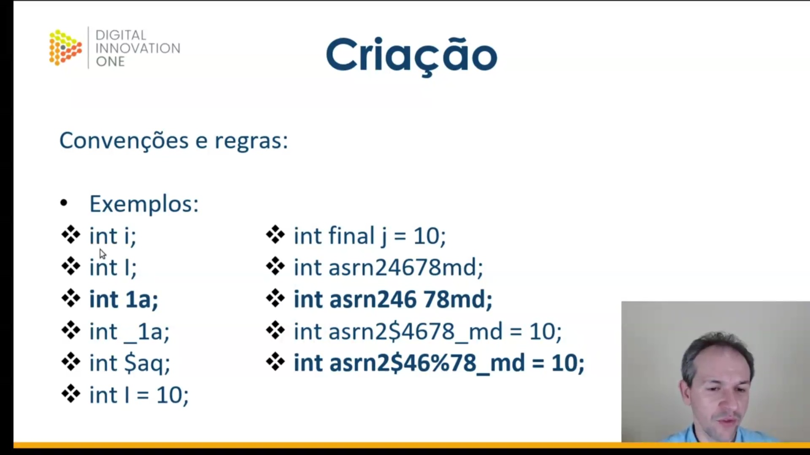
</p>

Abaixo estão **exemplos** práticos de declarações de variáveis, ilustrando casos válidos, inválidos e particularidades da sintaxe:

```java
int i;
int final j = 10;
int I;
int 1a;
int asrn24678md;
int asrn246 78md;
int asrn2$4678_md = 10;
int_1a;
int $aq;
int asrn2$46%78_md = 10;
int I = 10;

```

Alguns pontos de atenção nestes exemplos:

* `int i;` e `int I;` são variáveis diferentes (case-sensitive).
* `int final j = 10;` declara uma constante.
* `int 1a;` é inválido pois começa com número.
* `int asrn246 78md;` é inválido devido ao espaço.
* `int asrn2$46%78_md = 10;` é inválido pelo uso do caractere especial `%`.

<p align="center">
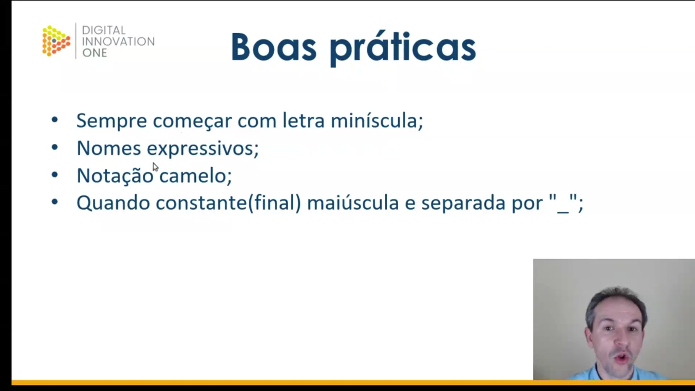
</p>

Além das regras obrigatórias, existem **boas práticas** que visam a legibilidade e manutenção do código. Recomenda-se:

* **Sempre começar com letra minúscula**;
* Utilizar **nomes expressivos** que indiquem o propósito da variável;
* Adotar a **Notação Camelo** (*CamelCase*), onde a primeira letra é minúscula e as palavras subsequentes iniciam com maiúscula;
* Quando for uma constante (`final`), o nome deve ser escrito em **letra maiúscula e separada por "_"** (*underscore*).

<p align="center">

</p>

Para ilustrar as boas práticas, a imagem apresenta exemplos comparativos:

```java
int quantidadeProduto;
int QuantidadeProduto;
int final NUMERO_TENTATIVAS = 5;
int final numeroTentativas = 5;
int NUMERO_TENTATIVAS = 5;
int qtdProd;
int i;

```

Análise dos exemplos:

* `int quantidadeProduto`: Segue corretamente o CamelCase e inicia com minúscula.
* `int QuantidadeProduto`: Evitar, pois inicia com maiúscula.
* `int final NUMERO_TENTATIVAS = 5`: Correto para constantes (tudo maiúsculo com underscore).
* `int qtdProd`: Nome pouco expressivo, dificultando o entendimento.
* `int i`: Aceitável em contextos específicos como contadores de laços (`for`), embora simples.

<p align="center">
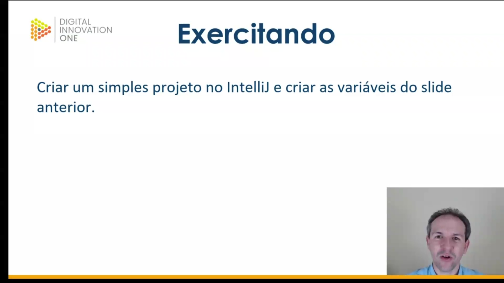
</p>

Como etapa final da aula, propõe-se um momento de **Exercitando**. A tarefa consiste em:

* **Criar um simples projeto no IntelliJ e criar as variáveis do slide anterior**.

O objetivo é replicar o código apresentado, observando na prática o comportamento da IDE diante dos erros de compilação (regras violadas) e a estruturação correta das variáveis válidas.      


### 🟩 Vídeo 03 - Exercitando

<video width="60%" controls>
  <source src="000-Midia_e_Anexos/bootcamp_tqi_fullstack-modulo.06-curso.02-video_03.webm" type="video/webm">
    Seu navegador não suporta vídeo HTML5.
</video>

link do vídeo: https://web.dio.me/track/tqi-fullstack-developer/course/variaveis-tipos-de-dados-e-operadores-matematicos-em-java/learning/372c2a91-6f32-48ec-bfd3-27c4a063ad0d?autoplay=1

Este conteúdo apresenta uma aula prática sobre a definição e manipulação de variáveis locais em Java, utilizando o método main como cenário. O instrutor demonstra, através de exemplos de código, as regras de nomenclatura, a sensibilidade a maiúsculas e minúsculas (case sensitivity), o uso de modificadores como final para constantes e a importância de seguir boas práticas de programação para garantir a legibilidade e a correção do código.

### Anotações

<p align="center">
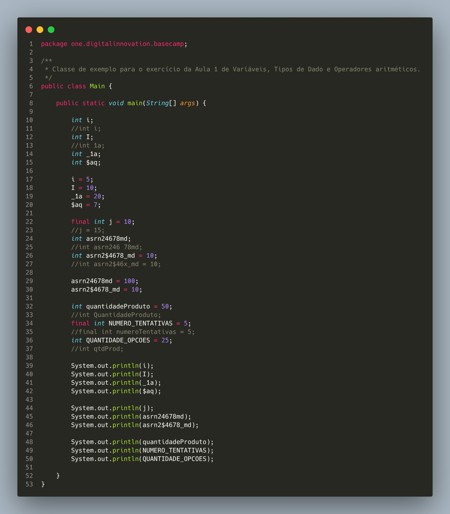
</p>

A imagem exibe o código-fonte de uma classe Java chamada `Main` dentro do ambiente de desenvolvimento IntelliJ IDEA. O foco central é o método `main`, onde diversas variáveis locais são declaradas, inicializadas e preparadas para exibição.

O código ilustra conceitos fundamentais de sintaxe e boas práticas discutidos na aula:

* **Case Sensitivity:** A definição de `int i;` e `int I;` demonstra que a linguagem diferencia letras maiúsculas de minúsculas.
* **Nomes de Variáveis:** São apresentados exemplos de nomes válidos, porém não recomendados, iniciados com caracteres especiais como `_` e `$` (`int _1a;`, `int $aq;`).
* **Constantes:** O uso da palavra-chave `final` é exemplificado em `final int j = 10;`, indicando um valor imutável.
* **Convenções:** O código mostra a aplicação de *CamelCase* para variáveis comuns (`quantidadeProduto`) e a convenção de letras maiúsculas separadas por underline para constantes (`NUMERO_TENTATIVAS`).
* **Inicialização e Impressão:** Todas as variáveis recebem valores e são passadas para o comando `System.out.println` para exibição no console .


```java
public class Main {
    public static void main(String[] args) {

        int i;
        //int i;
        int I;
        //int 1a;
        int _1a;
        int $aq;

        i = 5;
        I = 10;
        _1a = 20;
        $aq = 7;

        final int j = 10;
        //j = 15;
        int asrn24678md;
        //int asrn246 78md;
        int asrn2$4678_md = 10;
        //int asrn2$46%_md = 10;

        asrn24678md = 100;
        asrn2$4678_md = 10;

        int quantidadeProduto = 50;
        //int QuantidadeProduto;
        final int NUMERO_TENTATIVAS = 5;
        //final int numeroTentativas = 5;
        int QUANTIDADE_OPCOES = 25;
        //int qtdProd;

        System.out.println(i);
        System.out.println(I);
        System.out.println(_1a);
        System.out.println($aq);

        System.out.println(j);
        System.out.println(asrn24678md);
        System.out.println(asrn2$4678_md);

        System.out.println(quantidadeProduto);
        System.out.println(NUMERO_TENTATIVAS);
        System.out.println(QUANTIDADE_OPCOES);
    }
}

```

<p align="center">
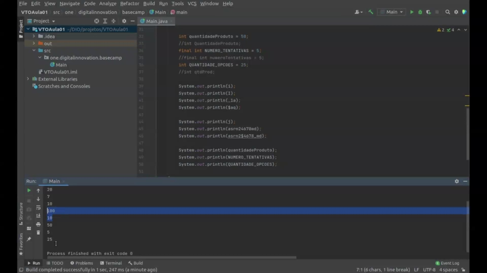
</p>

Esta imagem apresenta o console de execução ("Run") da IDE, exibindo o resultado do processamento do código da aula. A saída confirma que o programa foi concluído com sucesso ("Process finished with exit code 0") e imprimiu os valores armazenados em cada variável.

Os valores listados no console correspondem diretamente às atribuições feitas no código:

* 
**Primeiro Grupo:** `20` e `7` (referentes a `_1a` e `$aq`).


* 
**Segundo Grupo:** `10`, `100` e `10` (referentes à constante `j` e às variáveis `asrn24678md` e `asrn2$4678_md`).


* 
**Terceiro Grupo:** `50`, `5` e `25` (referentes a `quantidadeProduto`, `NUMERO_TENTATIVAS` e `QUANTIDADE_OPCOES`).


Abaixo da área de saída, a IDE ainda exibe parte das instruções de impressão (`System.out.println`) utilizadas para gerar esses resultados .

```text
20
7
10
100
10
50
5
25

```      


### 🟩 Vídeo 04 - Aula 1: Conceituação e criação

<video width="60%" controls>
  <source src="000-Midia_e_Anexos/bootcamp_tqi_fullstack-modulo.06-curso.02-video_04.webm" type="video/webm">
    Seu navegador não suporta vídeo HTML5.
</video>

link do vídeo:

## Parte 2 - Tipos de dado

### 🟩 Vídeo 05 - Tipos de dado

<video width="60%" controls>
  <source src="000-Midia_e_Anexos/bootcamp_tqi_fullstack-modulo.06-curso.02-video_05.webm" type="video/webm">
    Seu navegador não suporta vídeo HTML5.
</video>

link do vídeo:

### 🟩 Vídeo 06 - Exercitando

<video width="60%" controls>
  <source src="000-Midia_e_Anexos/bootcamp_tqi_fullstack-modulo.06-curso.02-video_06.webm" type="video/webm">
    Seu navegador não suporta vídeo HTML5.
</video>

link do vídeo:

### 🟩 Vídeo 07 - Aula 2: Tipos de dado

<video width="60%" controls>
  <source src="000-Midia_e_Anexos/bootcamp_tqi_fullstack-modulo.06-curso.02-video_07.webm" type="video/webm">
    Seu navegador não suporta vídeo HTML5.
</video>

link do vídeo:

## Parte 3 - Operadores Aritméticos

### 🟩 Vídeo 08 - Operadores aritméticos

<video width="60%" controls>
  <source src="000-Midia_e_Anexos/bootcamp_tqi_fullstack-modulo.06-curso.02-video_08.webm" type="video/webm">
    Seu navegador não suporta vídeo HTML5.
</video>

link do vídeo:

### 🟩 Vídeo 09 - Exercitando

<video width="60%" controls>
  <source src="000-Midia_e_Anexos/bootcamp_tqi_fullstack-modulo.06-curso.02-video_09.webm" type="video/webm">
    Seu navegador não suporta vídeo HTML5.
</video>

link do vídeo:

### 🟩 Vídeo 10 - Aula 3: Operadores aritméticos

<video width="60%" controls>
  <source src="000-Midia_e_Anexos/bootcamp_tqi_fullstack-modulo.06-curso.02-video_10.webm" type="video/webm">
    Seu navegador não suporta vídeo HTML5.
</video>

link do vídeo:


##  Materiais de Apoio

# Certificado: 

- Link na plataforma: 
- Certificado em pdf: 
