## Instrutor

- Thiago Leite e Carvalho (Senior Java Developer and Software Engineer | Java Tech Lead | University Professor | Writer | Speaker | Instructor)
- Contato Linkedin: / [thiago-leite-e-carvalho-1b337b127](https://www.linkedin.com/in/thiago-leite-e-carvalho-1b337b127/)
- Códigos de exemplo da aula neste link: https://github.com/tlcdio

## Parte 1 - Conceituação e criação

### 🟩 Vídeo 01 - Introdução

<video width="60%" controls>
  <source src="000-Midia_e_Anexos/bootcamp_tqi_fullstack-modulo.06-curso.02-video_01.webm" type="video/webm">
    Seu navegador não suporta vídeo HTML5.
</video>

link do vídeo: https://web.dio.me/track/tqi-fullstack-developer/course/variaveis-tipos-de-dados-e-operadores-matematicos-em-java/learning/d687771f-76cd-4379-9e1f-1c529c44e15b?autoplay=1

Este vídeo apresenta a introdução ao curso de Variáveis, Tipos de Dados e Operadores Aritméticos em Java, ministrado por Thiago Leite. O instrutor compartilha sua trajetória de 17 anos como desenvolvedor backend e ex-professor universitário, detalhando a estrutura do curso, os pré-requisitos técnicos necessários e os canais de suporte disponíveis para os alunos na plataforma DIO.

### Anotações

<p align="center">

</p>

Bem-vindos ao curso focado em **Variáveis, Tipos de Dados e Operadores Aritméticos**. O instrutor Thiago Leite apresenta os fundamentos essenciais para o desenvolvimento de software, utilizando a linguagem **Java** como base para todos os exemplos e conceitos que serão explorados ao longo das aulas.

<p align="center">
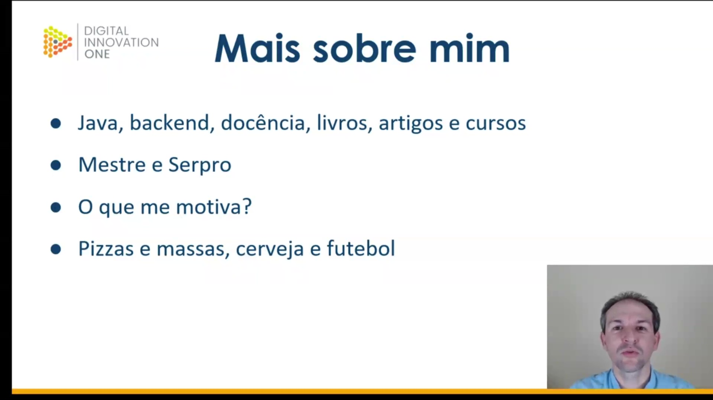
</p>

O instrutor Thiago Leite possui 17 anos de experiência em desenvolvimento de software, com foco em Java Backend, atuando em camadas de persistência, modelos de dados e criação de APIs. Além de sua atuação no **Serpro** (empresa de tecnologia do Governo Federal), ele possui mestrado em Engenharia de Software e experiência como professor universitário. Fora do ambiente profissional, seus interesses incluem a culinária (massas e pizzas), o estudo de cervejas artesanais e a paixão pelo futebol.

<p align="center">

</p>

Para acompanhar o trabalho do instrutor e acessar materiais complementares, você pode utilizar os seguintes canais:

* **LinkedIn:** Perfil profissional onde são publicados artigos, livros e conteúdos sobre desenvolvimento de software.
* **GitHub Pessoal:** Espaço para projetos autorais e componentes disponibilizados para a comunidade.
* **GitHub DIO:** Perfil específico para o armazenamento dos repositórios e projetos de exemplo práticos deste curso.

Links:

- [https://www.linkedin.com/in/thiago-leite-e-carvalho-1b337b127/](https://www.linkedin.com/in/thiago-leite-e-carvalho-1b337b127/)
- [https://github.com/thiagoleitecarvalho](https://github.com/thiagoleitecarvalho)
- [https://github.com/tlcdio](https://github.com/tlcdio)


<p align="center">

</p>

O objetivo principal deste treinamento é capacitar o aluno a entender profundamente o conceito de **variáveis**. Isso engloba desde o entendimento teórico do que elas representam na memória até a prática de como criá-las e manipulá-las corretamente dentro de um fluxo de programação.

<p align="center">
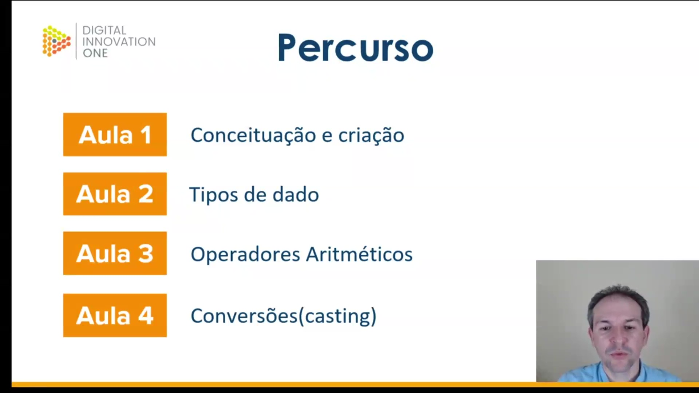
</p>

O conteúdo do curso está organizado em um percurso didático de quatro etapas fundamentais:

1. **Aula 1:** Conceituação e criação de variáveis.
2. **Aula 2:** Estudo dos Tipos de Dados.
3. **Aula 3:** Operadores Aritméticos para manipulação de valores.
4. **Aula 4:** Conversões e Casting (transformação entre tipos).

<p align="center">
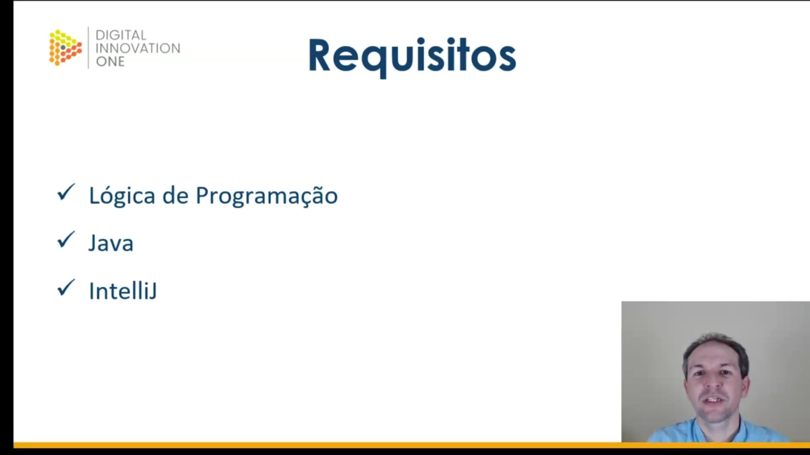
</p>

Para obter o melhor aproveitamento das aulas, são necessários os seguintes requisitos técnicos:

* Conhecimento prévio em **Lógica de Programação**.
* Noções básicas da linguagem **Java** (utilizaremos a versão 11).
* Ambiente de desenvolvimento configurado com a IDE **IntelliJ**, que será a ferramenta utilizada para a resolução dos exercícios práticos.


### 🟩 Vídeo 02 - Conceituação e criação

<video width="60%" controls>
  <source src="000-Midia_e_Anexos/bootcamp_tqi_fullstack-modulo.06-curso.02-video_02.webm" type="video/webm">
    Seu navegador não suporta vídeo HTML5.
</video>

link do vídeo: https://web.dio.me/track/tqi-fullstack-developer/course/variaveis-tipos-de-dados-e-operadores-matematicos-em-java/learning/08601add-19fb-4776-be4c-d61a57c59500?autoplay=1

Esta aula introdutória de Java foca no conceito e na criação de variáveis, definindo-as como espaços reservados na memória do computador para o armazenamento de dados. O conteúdo explora a sintaxe rigorosa da linguagem, que é fortemente tipada, detalhando as regras obrigatórias de nomenclatura e as convenções de boas práticas (como o uso de CamelCase). O objetivo principal é capacitar o aluno a declarar variáveis de forma correta e legível, preparando a base para o desenvolvimento de códigos profissionais e colaborativos.

### Anotações

<p align="center">
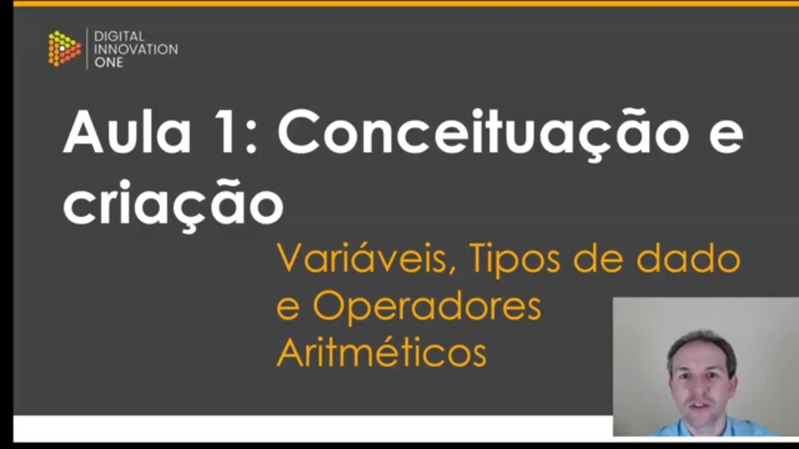
</p>

Esta é a abertura da **Aula 1**, focada em **Conceituação e criação**. O conteúdo programático desta etapa introdutória abrange três pilares fundamentais para o início na programação: **Variáveis, Tipos de dado e Operadores Aritméticos**. A aula utilizará a linguagem Java para explorar estes conceitos básicos.

<p align="center">
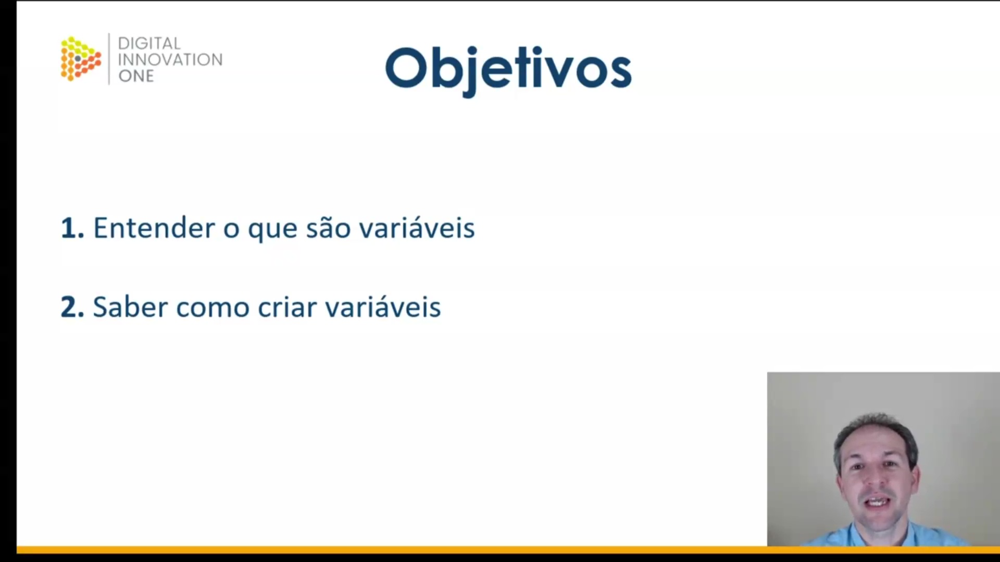
</p>

Os objetivos centrais desta primeira aula são claros e diretos. Espera-se que o aluno seja capaz de:

1. **Entender o que são variáveis**;
2. **Saber como criar variáveis**.

O foco é compreender o mecanismo de funcionamento e a sintaxe de declaração na linguagem Java.

<p align="center">
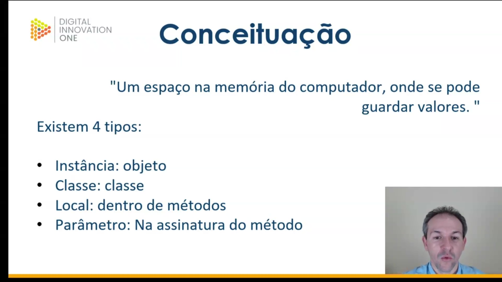
</p>

Para a **conceituação**, define-se variável formalmente como **"Um espaço na memória do computador, onde se pode guardar valores"**.

Na linguagem Java, as variáveis são categorizadas em quatro tipos distintos:

* **Instância:** Pertence ao objeto;
* **Classe:** Pertence à classe;
* **Local:** Declarada dentro de métodos;
* **Parâmetro:** Presente na assinatura do método.

Nesta fase introdutória, o foco recairá sobre as variáveis locais (como aquelas criadas dentro do método `main`), uma vez que os tipos de instância e classe estão atrelados ao paradigma de Orientação a Objetos.

<p align="center">
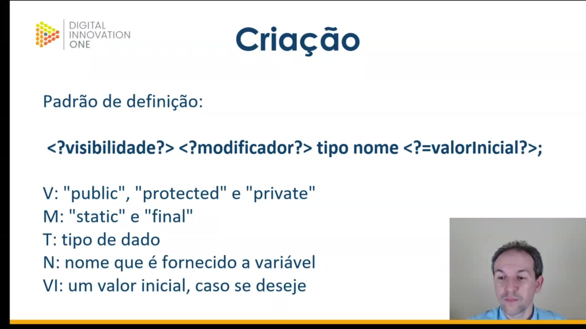
</p>

A **criação** de variáveis em Java segue um padrão de definição específico, composto por elementos obrigatórios e opcionais. A estrutura geral é:

```java
<?visibilidade?> <?modificador?> tipo nome <?=valorInicial?>;

```

A legenda para interpretar esta estrutura é a seguinte:

* **V (Visibilidade):** Define o acesso, podendo ser "public", "protected" ou "private";
* **M (Modificador):** Define comportamentos especiais, como "static" ou "final" (constante);
* **T (Tipo):** Especifica o tipo de dado (obrigatório em Java);
* **N (Nome):** O identificador fornecido à variável;
* **VI (Valor Inicial):** Um valor atribuído na declaração, caso se deseje.

Os itens entre interrogações (`?`) são opcionais. O modificador `final` é utilizado para declarar constantes, ou seja, variáveis cujo valor não pode ser alterado após a inicialização.

<p align="center">
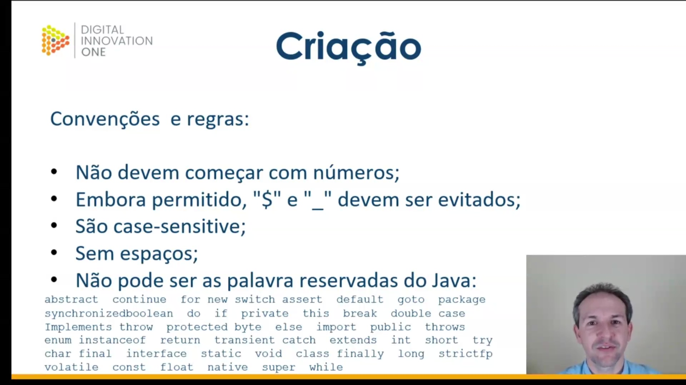
</p>

Existem **convenções e regras** rígidas para a nomenclatura de variáveis em Java. O desrespeito a algumas destas regras pode impedir a compilação do código:

* **Não devem começar com números**;
* O uso de cifrão (`$`) e *underscore* (`_`) é permitido, mas **deve ser evitado** como boa prática;
* As variáveis são **case-sensitive**, ou seja, diferenciam maiúsculas de minúsculas;
* **Sem espaços** no nome da variável;
* **Não pode ser uma das palavras reservadas do Java**.

A lista de palavras reservadas inclui termos de comando da própria linguagem, como `abstract`, `boolean`, `class`, `if`, `void`, `while`, entre outros listados na imagem, que não podem ser usados como identificadores.

<p align="center">
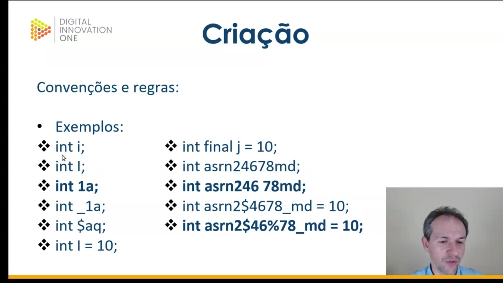
</p>

Abaixo estão **exemplos** práticos de declarações de variáveis, ilustrando casos válidos, inválidos e particularidades da sintaxe:

```java
int i;
int final j = 10;
int I;
int 1a;
int asrn24678md;
int asrn246 78md;
int asrn2$4678_md = 10;
int_1a;
int $aq;
int asrn2$46%78_md = 10;
int I = 10;

```

Alguns pontos de atenção nestes exemplos:

* `int i;` e `int I;` são variáveis diferentes (case-sensitive).
* `int final j = 10;` declara uma constante.
* `int 1a;` é inválido pois começa com número.
* `int asrn246 78md;` é inválido devido ao espaço.
* `int asrn2$46%78_md = 10;` é inválido pelo uso do caractere especial `%`.

<p align="center">
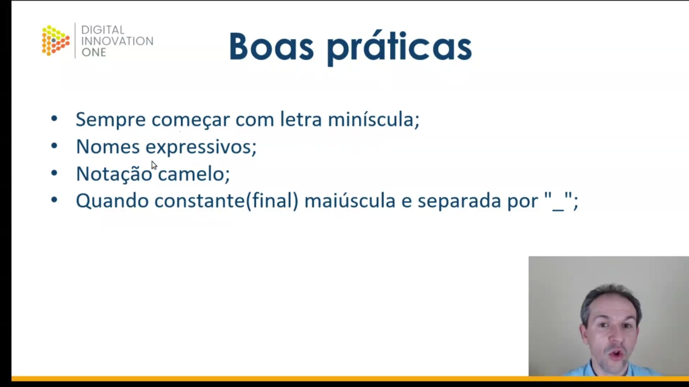
</p>

Além das regras obrigatórias, existem **boas práticas** que visam a legibilidade e manutenção do código. Recomenda-se:

* **Sempre começar com letra minúscula**;
* Utilizar **nomes expressivos** que indiquem o propósito da variável;
* Adotar a **Notação Camelo** (*CamelCase*), onde a primeira letra é minúscula e as palavras subsequentes iniciam com maiúscula;
* Quando for uma constante (`final`), o nome deve ser escrito em **letra maiúscula e separada por "_"** (*underscore*).

<p align="center">
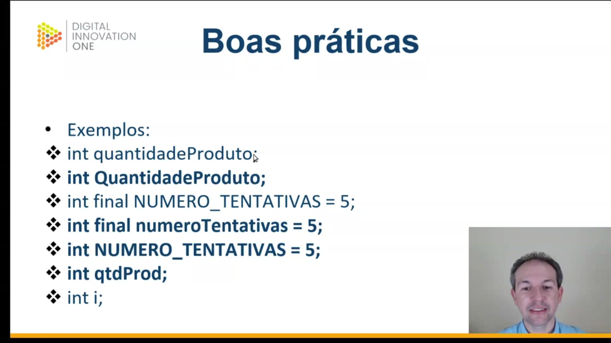
</p>

Para ilustrar as boas práticas, a imagem apresenta exemplos comparativos:

```java
int quantidadeProduto;
int QuantidadeProduto;
int final NUMERO_TENTATIVAS = 5;
int final numeroTentativas = 5;
int NUMERO_TENTATIVAS = 5;
int qtdProd;
int i;

```

Análise dos exemplos:

* `int quantidadeProduto`: Segue corretamente o CamelCase e inicia com minúscula.
* `int QuantidadeProduto`: Evitar, pois inicia com maiúscula.
* `int final NUMERO_TENTATIVAS = 5`: Correto para constantes (tudo maiúsculo com underscore).
* `int qtdProd`: Nome pouco expressivo, dificultando o entendimento.
* `int i`: Aceitável em contextos específicos como contadores de laços (`for`), embora simples.

<p align="center">
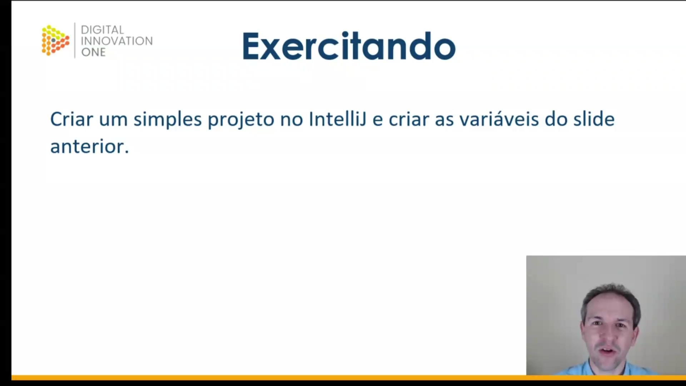
</p>

Como etapa final da aula, propõe-se um momento de **Exercitando**. A tarefa consiste em:

* **Criar um simples projeto no IntelliJ e criar as variáveis do slide anterior**.

O objetivo é replicar o código apresentado, observando na prática o comportamento da IDE diante dos erros de compilação (regras violadas) e a estruturação correta das variáveis válidas.      


### 🟩 Vídeo 03 - Exercitando

<video width="60%" controls>
  <source src="000-Midia_e_Anexos/bootcamp_tqi_fullstack-modulo.06-curso.02-video_03.webm" type="video/webm">
    Seu navegador não suporta vídeo HTML5.
</video>

link do vídeo: https://web.dio.me/track/tqi-fullstack-developer/course/variaveis-tipos-de-dados-e-operadores-matematicos-em-java/learning/372c2a91-6f32-48ec-bfd3-27c4a063ad0d?autoplay=1

Este conteúdo apresenta uma aula prática sobre a definição e manipulação de variáveis locais em Java, utilizando o método main como cenário. O instrutor demonstra, através de exemplos de código, as regras de nomenclatura, a sensibilidade a maiúsculas e minúsculas (case sensitivity), o uso de modificadores como final para constantes e a importância de seguir boas práticas de programação para garantir a legibilidade e a correção do código.

### Anotações

<p align="center">
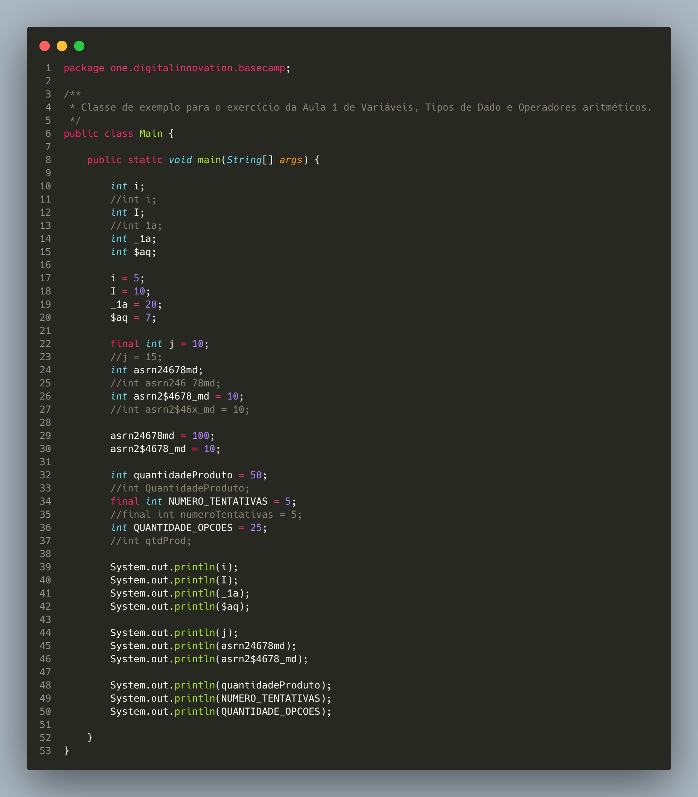
</p>

A imagem exibe o código-fonte de uma classe Java chamada `Main` dentro do ambiente de desenvolvimento IntelliJ IDEA. O foco central é o método `main`, onde diversas variáveis locais são declaradas, inicializadas e preparadas para exibição.

O código ilustra conceitos fundamentais de sintaxe e boas práticas discutidos na aula:

* **Case Sensitivity:** A definição de `int i;` e `int I;` demonstra que a linguagem diferencia letras maiúsculas de minúsculas.
* **Nomes de Variáveis:** São apresentados exemplos de nomes válidos, porém não recomendados, iniciados com caracteres especiais como `_` e `$` (`int _1a;`, `int $aq;`).
* **Constantes:** O uso da palavra-chave `final` é exemplificado em `final int j = 10;`, indicando um valor imutável.
* **Convenções:** O código mostra a aplicação de *CamelCase* para variáveis comuns (`quantidadeProduto`) e a convenção de letras maiúsculas separadas por underline para constantes (`NUMERO_TENTATIVAS`).
* **Inicialização e Impressão:** Todas as variáveis recebem valores e são passadas para o comando `System.out.println` para exibição no console .

Com base nas explicações fornecidas pelo professor durante a aula, aqui está o código Java comentado linha a linha:

```java
public class Main { // Definição da classe Main, que serve como a estrutura base do exercício.
    public static void main(String[] args) { // Método main: o ponto de entrada obrigatório para a execução do programa Java.

        int i; // Declaração de uma variável inteira simples.
        //int i; // Comentado pois o Java não permite duas variáveis com o exato mesmo nome no mesmo escopo.
        int I; // Válido: demonstra que o Java é "case-sensitive" (diferencia maiúsculas de minúsculas).
        //int 1a; // Inválido: nomes de variáveis não podem começar com algarismos numéricos.
        int _1a; // Válido, mas o professor alerta que iniciar com underline não é uma boa prática.
        int $aq; // Válido, mas o uso do cifrão no início também deve ser evitado por convenção.

        i = 5; // Atribuição de valor inicial à variável 'i'.
        I = 10; // Atribuição de valor à variável 'I' (distinta de 'i').
        _1a = 20; // Atribuição de valor à variável '_1a'.
        $aq = 7; // Atribuição de valor à variável '$aq'.

        final int j = 10; // Declaração de uma constante (final); o valor 10 torna-se imutável.
        //j = 15; // Erro: não é possível alterar o valor de uma variável definida como 'final'.
        int asrn24678md; // Nome válido (letras e números), embora não seja nada expressivo.
        //int asrn246 78md; // Erro: não é permitido utilizar espaços em branco no nome de variáveis.
        int asrn2$4678_md = 10; // Válido, mas reforça o uso de caracteres que não seguem as melhores práticas.
        //int asrn2$46%_md = 10; // Erro: o uso de caracteres especiais como '%' é proibido em nomes de variáveis.

        asrn24678md = 100; // Atribuição de valor à variável 'asrn24678md'.
        asrn2$4678_md = 10; // Atribuição de valor à variável 'asrn2$4678_md'.

        int quantidadeProduto = 50; // Exemplo ideal: usa CamelCase, começa com minúscula e é expressivo.
        //int QuantidadeProduto; // Má prática: variáveis comuns não devem começar com letra maiúscula.
        final int NUMERO_TENTATIVAS = 5; // Padrão correto para constantes: letras maiúsculas separadas por underline.
        //final int numeroTentativas = 5; // Má prática: constantes 'final' não devem usar CamelCase minúsculo.
        int QUANTIDADE_OPCOES = 25; // Má prática: usar o padrão de constantes em uma variável que não é 'final'.
        //int qtdProd; // Má prática: o nome é pouco expressivo (abreviado demais), dificultando a leitura.

        // Instruções para exibir os valores finais no console da IDE:
        System.out.println(i); // Imprime o valor de i (5).
        System.out.println(I); // Imprime o valor de I (10).
        System.out.println(_1a); // Imprime o valor de _1a (20).
        System.out.println($aq); // Imprime o valor de $aq (7).

        System.out.println(j); // Imprime a constante j (10).
        System.out.println(asrn24678md); // Imprime o valor de asrn24678md (100).
        System.out.println(asrn2$4678_md); // Imprime o valor de asrn2$4678_md (10).

        System.out.println(quantidadeProduto); // Imprime o valor de quantidadeProduto (50).
        System.out.println(NUMERO_TENTATIVAS); // Imprime a constante NUMERO_TENTATIVAS (5).
        System.out.println(QUANTIDADE_OPCOES); // Imprime o valor de QUANTIDADE_OPCOES (25).
    }
}
```

<p align="center">
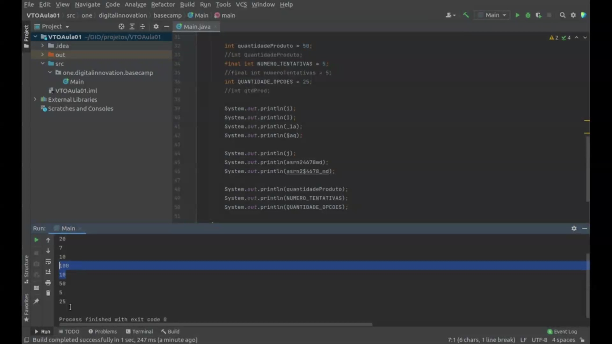
</p>

Esta imagem apresenta o console de execução ("Run") da IDE, exibindo o resultado do processamento do código da aula. A saída confirma que o programa foi concluído com sucesso ("Process finished with exit code 0") e imprimiu os valores armazenados em cada variável.

Os valores listados no console correspondem diretamente às atribuições feitas no código:

* **Primeiro Grupo:** `20` e `7` (referentes a `_1a` e `$aq`).
* **Segundo Grupo:** `10`, `100` e `10` (referentes à constante `j` e às variáveis `asrn24678md` e `asrn2$4678_md`).
* **Terceiro Grupo:** `50`, `5` e `25` (referentes a `quantidadeProduto`, `NUMERO_TENTATIVAS` e `QUANTIDADE_OPCOES`).

Abaixo da área de saída, a IDE ainda exibe parte das instruções de impressão (`System.out.println`) utilizadas para gerar esses resultados .

```text
20
7
10
100
10
50
5
25

```      

## Parte 2 - Tipos de dado

### 🟩 Vídeo 04 - Tipos de dado

<video width="60%" controls>
  <source src="000-Midia_e_Anexos/bootcamp_tqi_fullstack-modulo.06-curso.02-video_04.webm" type="video/webm">
    Seu navegador não suporta vídeo HTML5.
</video>

link do vídeo: https://web.dio.me/track/tqi-fullstack-developer/course/variaveis-tipos-de-dados-e-operadores-matematicos-em-java/learning/953faabc-94d8-45df-a8f1-e40db3d16201?autoplay=1

Esta aula aborda os fundamentos dos tipos de dados na programação, definindo-os como o conjunto de valores e operações que uma variável pode assumir e sofrer. O conteúdo explora as classificações de tipagem (estática/forte vs. dinâmica/fraca), a distinção entre tipos primitivos e compostos, e detalha as categorias numéricas, textuais e lógicas, enfatizando a importância da escolha correta do tipo para a eficiência e integridade do software.

### Anotações

<p align="center">
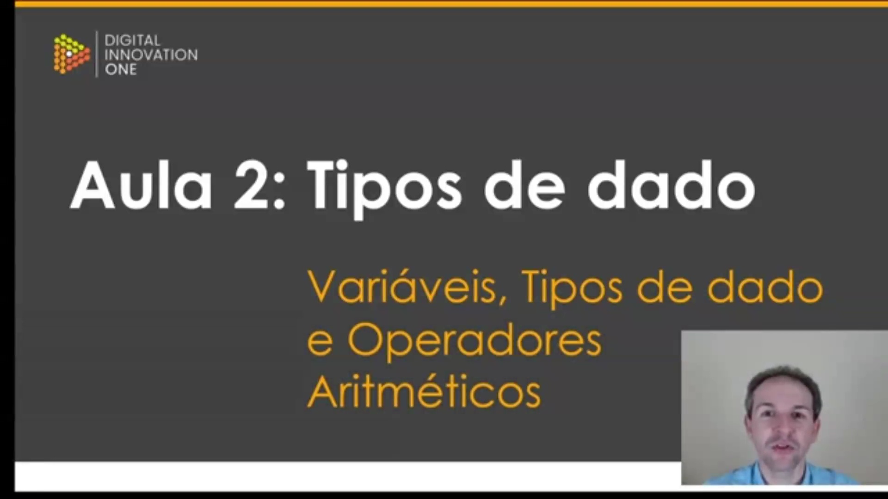
</p>

Esta aula marca o início do estudo sobre **Tipos de Dado**, dentro do contexto de Variáveis e Operadores Aritméticos. O objetivo principal é definir o que são esses tipos e compreender os critérios para a escolha adequada de cada um durante o desenvolvimento de um software.

<p align="center">
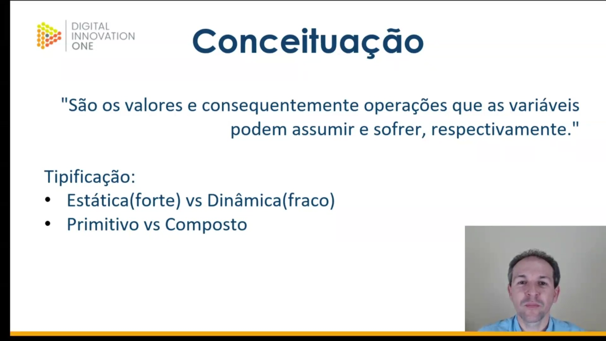
</p>

Nesta etapa, define-se **Tipo de Dado** como o conjunto de valores que uma variável pode assumir, juntamente com as operações que podem ser realizadas sobre esses valores. A tipificação é explicada sob dois prismas:

* **Estática (Forte) vs. Dinâmica (Fraca):** Na tipificação estática, o tipo é definido na criação da variável (comum em linguagens compiladas). Na dinâmica, o tipo é inferido pelo valor atribuído durante a execução (comum em linguagens interpretadas).
* **Primitivo vs. Composto:** Tipos primitivos são os dados básicos e atômicos (numéricos, textuais simples). Tipos compostos (como objetos ou *structs*) são heterogêneos, podendo agrupar diferentes tipos primitivos ou até outros tipos compostos.

<p align="center">
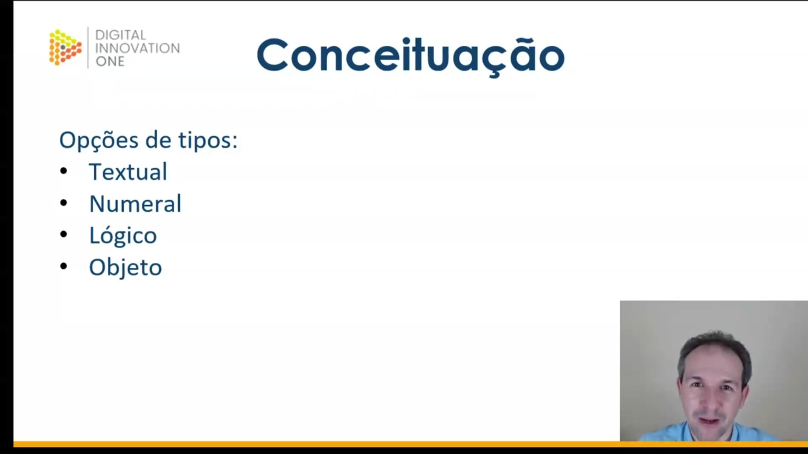
</p>

As linguagens de programação oferecem quatro categorias principais de tipos de dados:

1. **Textual:** Utilizado para armazenar caracteres, palavras ou blocos de texto.
2. **Numeral:** Destinado a números inteiros ou reais (fracionários). A capacidade de armazenamento depende da quantidade de bits do tipo escolhido.
3. **Lógico:** Armazena estados booleanos (verdadeiro ou falso).
4. **Objeto:** Relacionado à orientação a objetos (não aprofundado neste módulo básico).

<p align="center">
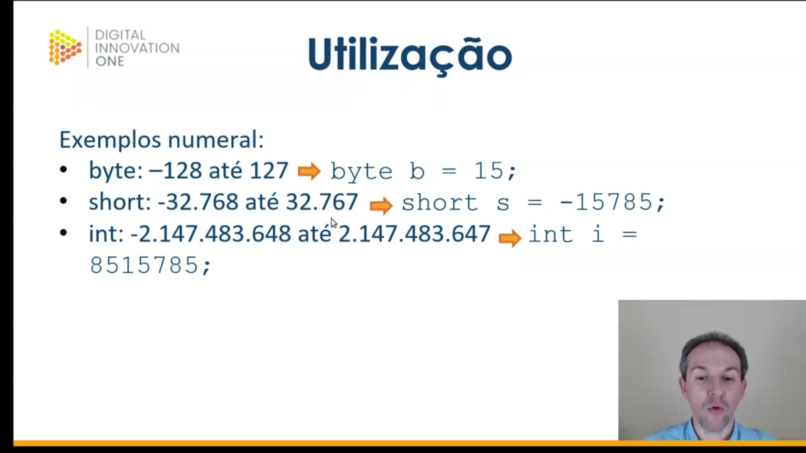
</p>

Abaixo, observamos exemplos práticos de **tipos numerais inteiros** em Java. Cada tipo possui uma capacidade de armazenamento distinta:

* **byte:** De -128 até 127.
* **short:** De -32.768 até 32.767.
* **int:** O tipo padrão para inteiros, com uma faixa muito mais ampla de valores.

```java
byte b = 15;
short s = -15785;
int i = 8515785;

```

<p align="center">
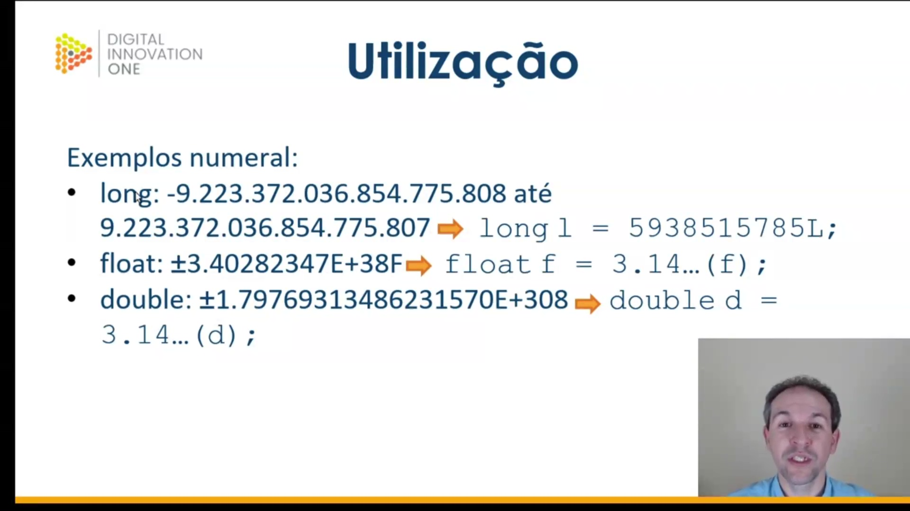
</p>

Para números inteiros de altíssima magnitude ou números com casas decimais (reais), utilizam-se os seguintes tipos:

* **long:** Inteiro de 64 bits. Exige o sufixo "L".
* **float:** Real de 32 bits. Exige obrigatoriamente o sufixo "F".
* **double:** Real de 64 bits. Oferece maior precisão e o sufixo "D" é opcional.

```java
long L = 5938515785L;
float f = 3.14F;
double d = 3.14;

```

<p align="center">
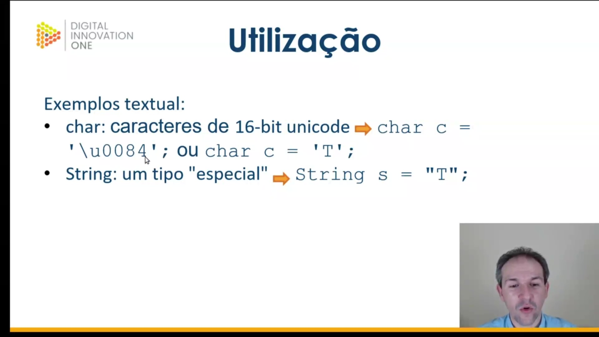
</p>

A manipulação de **texto** em Java diferencia caracteres individuais de cadeias de texto:

* **char:** Representa um único caractere Unicode (16 bits). Deve ser declarado entre **aspas simples**.
* **String:** Embora seja um tipo composto (objeto), é fundamental para o uso cotidiano. Deve ser declarada entre **aspas duplas**.

```java
char c = '\u0054'; // Representação Unicode para a letra 'T'
char c2 = 'T';
String s = "T";

```

<p align="center">
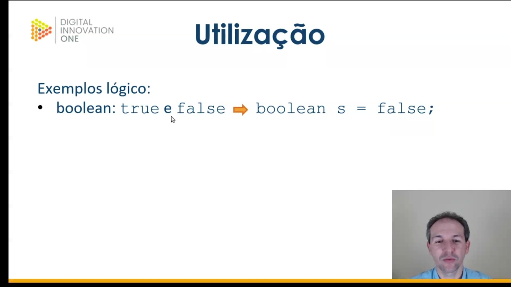
</p>

O **tipo lógico** é representado pelo `boolean`. Ele não permite operações matemáticas e comporta apenas dois valores: `true` (verdadeiro) ou `false` (falso).

```java
boolean s = false;

```

<p align="center">
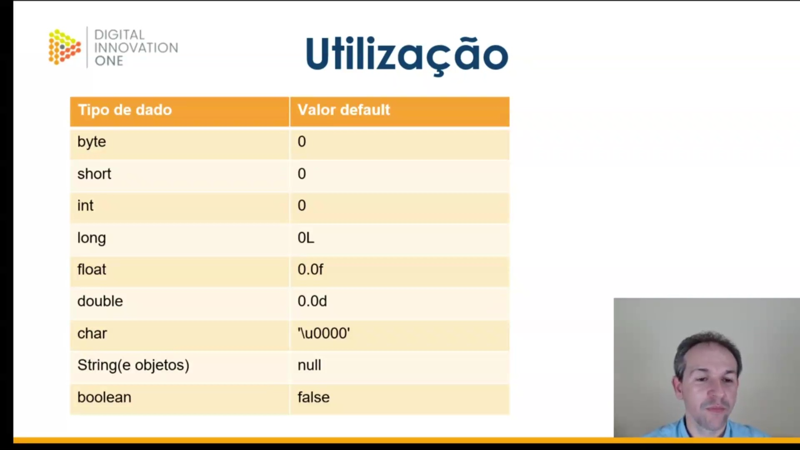
</p>

Linguagens modernas atribuem **valores default** (padrão) a variáveis que não foram explicitamente inicializadas. Isso previne erros de leitura de "sujeira" da memória RAM.


### 🟩 Vídeo 05 - Exercitando

<video width="60%" controls>
  <source src="000-Midia_e_Anexos/bootcamp_tqi_fullstack-modulo.06-curso.02-video_05.webm" type="video/webm">
    Seu navegador não suporta vídeo HTML5.
</video>

link do vídeo: https://web.dio.me/track/tqi-fullstack-developer/course/variaveis-tipos-de-dados-e-operadores-matematicos-em-java/learning/9b32d383-6989-445f-b593-0f902af189c7?autoplay=1

Nesta aula o instrutor demonstra a criação de variáveis para armazenar **valores inteiros, números decimais, caracteres e textos**, destacando as diferenças de capacidade entre tipos como **short, int, long, float e double**. Durante a explicação, são exibidos **erros comuns de compilação** que ocorrem quando os limites de armazenamento são ultrapassados ou quando a sintaxe, como o uso de sufixos e aspas, está incorreta. O material também aborda o uso de **boas práticas**, diferenciando o tipo primitivo **char** da classe **String**, além de mencionar a importância de escolher tipos específicos para dados lógicos e datas. Por fim, o tutorial reforça a aplicação de **códigos Unicode** e a relevância didática de simplificar nomes de variáveis para facilitar o aprendizado inicial.


### Anotações

Segue o código completo em Java, apresentado pelo instrutor, comentado linha a linha, com base nas explicações e observações técnicas fornecidas durante a aula.

```java
package one.digitalinnovation.basecamp; // Define o pacote para organizar as classes do projeto

public class Main { // Declaração da classe principal
    public static void main(String[] args) { // Ponto de entrada do programa (método main)

        // --- TIPOS INTEIROS ---
        byte b1 = 10; // Tipo byte: menor capacidade, valor 10 está dentro do limite
        byte b2 = 20; // Tipo byte: valor 20 também está correto e sem erros

        short s1 = 20000; // Tipo short: suporta valores maiores que byte; 20.000 é válido
        // short s2 = 40000; // ERRO: 40.000 ultrapassa o limite máximo suportado pelo tipo short

        // int i1 = -10000000000000; // ERRO: Este valor negativo ultrapassa o limite inferior do tipo int
        int i2 = 28500; // Tipo int: valor padrão para inteiros, 28.500 é perfeitamente válido

        // Tipo long: maior capacidade para inteiros. Exige a letra 'L' ao final do número
        long l1 = 1000000000000000000L; // O 'L' informa ao Java que este número grande deve ser tratado como long
        long l2 = 2004005000500055000L; // Sem o 'L', o Java tentaria ler como int e acusaria erro de tamanho

        // --- TIPOS REAIS (PONTO FLUTUANTE) ---
        // float f1 = 4.5; // ERRO: Números decimais sem sufixo são interpretados como double por padrão
        float f2 = 10.68F; // Para definir como float, deve-se usar 'F' ou 'f' para caber na variável

        double d1 = 85.69; // Double: tipo padrão para números fracionários, aceita o valor diretamente
        double d2 = 99.04D; // Pode-se usar o sufixo 'D' ou 'd' para ser explícito, embora seja opcional

        // --- TIPOS TEXTUAIS ---
        char c1 = 'W'; // Char: armazena apenas UM caractere e utiliza aspas SIMPLES
        // char c2 = 'TW'; // ERRO: O tipo char não aceita mais de um caractere simultaneamente
        char c3 = '\u0057'; // Char via código Unicode: representa o caractere 'W' de forma implícita

        String st1 = "Fulano"; // String: classe que armazena sequências de texto usando aspas DUPLAS
        String st2 = "Cicrano"; // Exemplo de nome simples guardado em uma String
        String st3 = "ag dgb se se et t KNBJBJBB &**&%& 75894389"; // String aceita símbolos, espaços e números

        // String dt1 = "09/02/1981"; // OBS: Evite usar String para datas; existem tipos específicos para cálculos cronológicos

        // --- TIPO LÓGICO ---
        boolean bo1 = true; // Booleano: aceita apenas o valor lógico verdadeiro (true)
        boolean bo2 = false; // Booleano: aceita apenas o valor lógico falso (false)

        // --- SAÍDAS NO CONSOLE ---
        System.out.println(b1); // Exibe o valor do byte b1
        System.out.println(b2); // Exibe o valor do byte b2
        System.out.println(s1); // Exibe o valor do short s1
        System.out.println(i2); // Exibe o valor do int i2
        System.out.println(l1); // Exibe o valor do long l1
        System.out.println(l2); // Exibe o valor do long l2
        System.out.println(f2); // Exibe o valor do float f2
        System.out.println(d1); // Exibe o valor do double d1
        System.out.println(d2); // Exibe o valor do double d2
        System.out.println(c1); // Exibe o caractere 'W'
        System.out.println(c3); // Exibe o caractere 'W' (convertido do Unicode)
        System.out.println(st1); // Exibe o texto "Fulano"
        System.out.println(st2); // Exibe o texto "Cicrano"
        System.out.println(st3); // Exibe a string longa com caracteres especiais
        System.out.println(bo1); // Exibe o valor lógico true
        System.out.println(bo2); // Exibe o valor lógico false
    }
}
```

## Parte 3 - Operadores Aritméticos

### 🟩 Vídeo 06 - Operadores aritméticos

<video width="60%" controls>
  <source src="000-Midia_e_Anexos/bootcamp_tqi_fullstack-modulo.06-curso.02-video_06.webm" type="video/webm">
    Seu navegador não suporta vídeo HTML5.
</video>

link do vídeo: https://web.dio.me/track/tqi-fullstack-developer/course/variaveis-tipos-de-dados-e-operadores-matematicos-em-java/learning/be926bdf-afbf-469c-b743-9f2d9827c9bd?autoplay=1

Esta aula apresenta uma introdução técnica sobre **operadores aritméticos** no contexto da linguagem **Java**, destacando que esses símbolos realizam ações em operandos para gerar resultados. O conteúdo detalha diferentes categorias, como os operadores **pós-fixados e pré-fixados**, as operações matemáticas básicas e as **atribuições compostas** que servem como atalhos de sintaxe. Um ponto central da aula é a explicação sobre a **precedência de execução**, estabelecendo a ordem hierárquica necessária para garantir cálculos precisos em expressões complexas. Por fim, o autor enfatiza a importância de dominar essas regras para escrever códigos mais eficientes e evitar erros lógicos. O material conclui propondo um **exercício prático** no ambiente IntelliJ para fixar o aprendizado sobre como essas prioridades influenciam os resultados finais.

### Anotações

<p align="center">
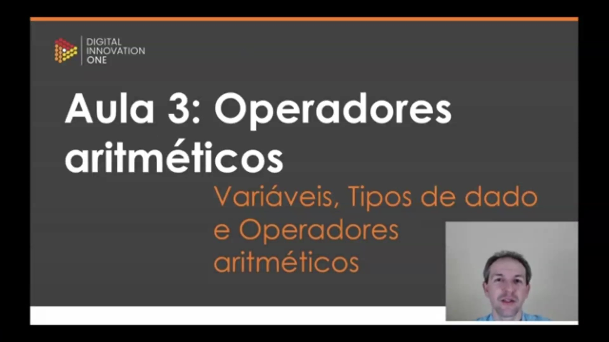
</p>

Esta é a aula inicial sobre **operadores aritméticos**, inserida no contexto de estudo de Variáveis e Tipos de Dados. O objetivo central é abordar como as operações matemáticas fundamentais e manipulações de valores são realizadas dentro da programação, utilizando a linguagem Java como base prática.

<p align="center">
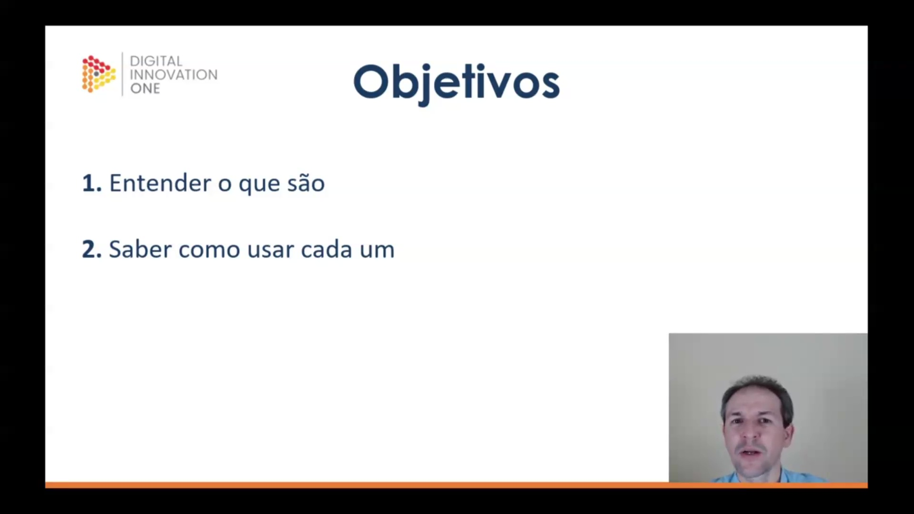
</p>

Para esta etapa do aprendizado, foram estabelecidos dois objetivos principais:

1. **Entender o que são:** Compreender a definição teórica e o papel dos operadores no processamento de dados.
2. **Saber como usar cada um:** Aprender a sintaxe correta e a aplicação prática de cada operador disponível.

<p align="center">
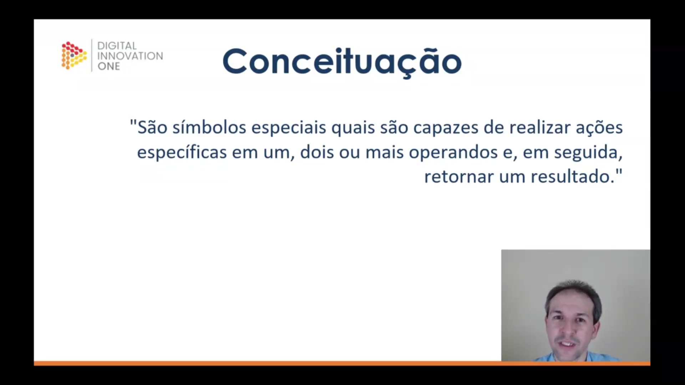
</p>

Os operadores são definidos como **símbolos especiais** capazes de realizar ações específicas em um, dois ou mais operandos. Após realizar a operação pretendida, eles retornam um resultado para o sistema. Embora o conceito de operadores seja amplo na programação, o foco aqui reside especificamente nos de natureza aritmética.

<p align="center">
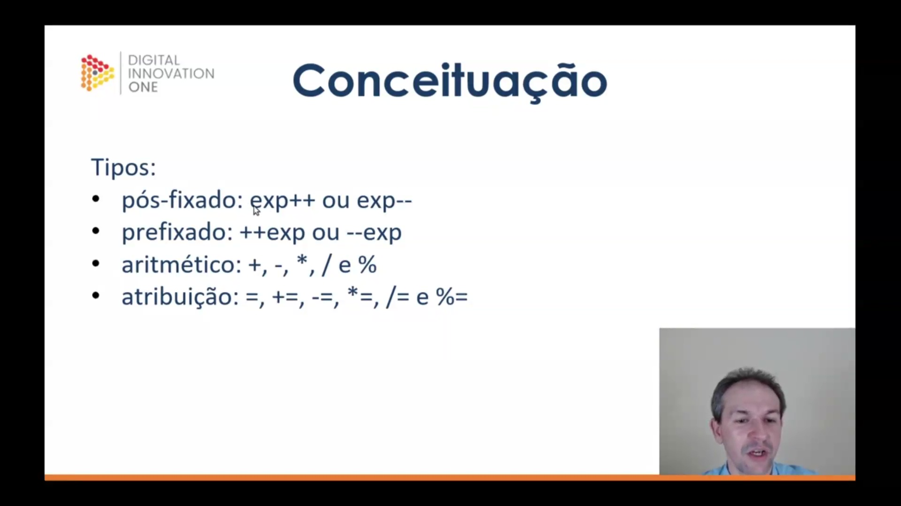
</p>

Os operadores são classificados em quatro grupos principais de acordo com sua função e posicionamento:

* **Pós-fixado:** Expressões onde o operador vem após o operando (`exp++` ou `exp--`).
* **Prefixado:** Expressões onde o operador antecede o operando (`++exp` ou `--exp`).
* **Aritmético:** Operações matemáticas padrão como soma (`+`), subtração (`-`), multiplicação (`*`), divisão (`/`) e o resto da divisão (`%`).
* **Atribuição:** Utilizados para definir ou modificar valores, incluindo a atribuição simples (`=`) e as compostas (`+=`, `-=`, `*=`, `/=`, `%=`).

<p align="center">
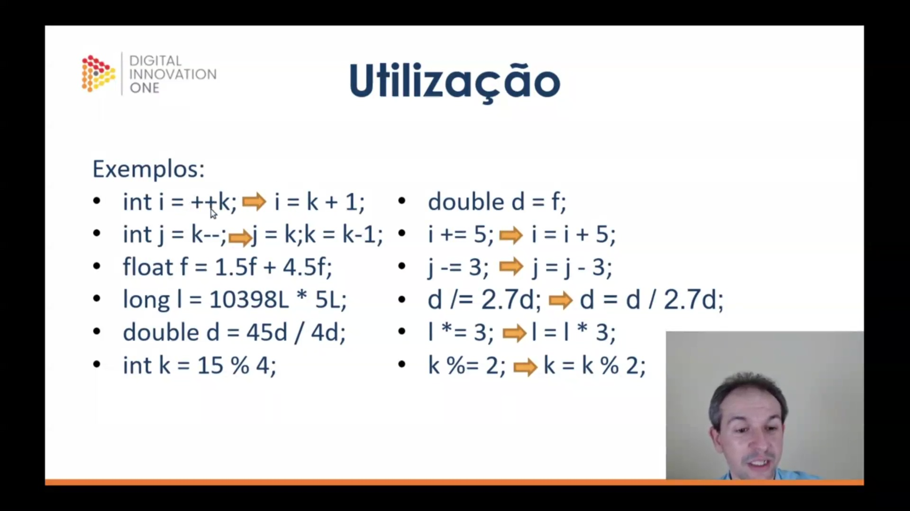
</p>

A aplicação prática dos operadores demonstra como diferentes tipos de dados (int, float, long, double) interagem. Os operadores de incremento e decremento (prefixados e pós-fixados) alteram o valor da variável em uma unidade, enquanto os operadores de atribuição composta funcionam como atalhos para realizar uma operação aritmética e atribuir o resultado à própria variável simultaneamente.

```java
// Exemplos de Incremento/Decremento e Aritmética
int i = ++k;      // Equivalente a: k = k + 1; i = k;
int j = k--;      // Equivalente a: j = k; k = k - 1;

float f = 1.5f + 4.5f;
long l = 10398L * 5L;
double d = 45d / 4d;
int k = 15 % 4;   // Resto da divisão

// Exemplos de Atribuição e Atalhos
double d = f;
i += 5;           // i = i + 5;
j -= 3;           // j = j - 3;
i *= 3;           // i = i * 3;
k %= 2;           // k = k % 2;
d /= 2.7d;        // d = d / 2.7d;

```

<p align="center">
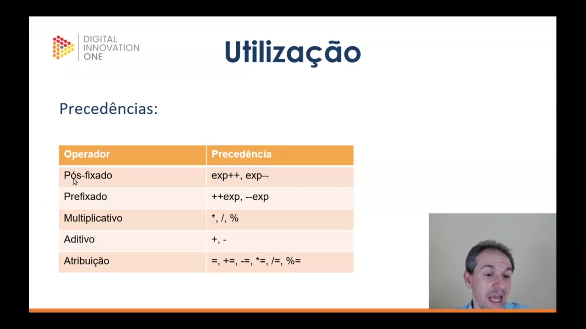
</p>

A **precedência de operadores** determina a ordem em que as expressões são avaliadas pelo computador. Compreender essa hierarquia é fundamental para garantir que os cálculos resultem no valor esperado. A ordem de execução segue a tabela abaixo:

| Operador | Precedência |
| --- | --- |
| **Pós-fixado** | `exp++`, `exp--` |
| **Prefixado** | `++exp`, `--exp` |
| **Multiplicativo** | `*`, `/`, `%` |
| **Aditivo** | `+`, `-` |
| **Atribuição** | `=`, `+=`, `-=`, `*=`, `/=`, `%=` |

Dessa forma, em uma expressão complexa, os operadores pós-fixados serão processados primeiro, enquanto os de atribuição serão os últimos.
     

### 🟩 Vídeo 07 - Exercitando

<video width="60%" controls>
  <source src="000-Midia_e_Anexos/bootcamp_tqi_fullstack-modulo.06-curso.02-video_07.webm" type="video/webm">
    Seu navegador não suporta vídeo HTML5.
</video>

link do vídeo: https://web.dio.me/track/tqi-fullstack-developer/course/variaveis-tipos-de-dados-e-operadores-matematicos-em-java/learning/a87cd5e1-0ca1-493a-8700-56108cf21d2b?autoplay=1

Aula prática sobre **programação em Java**, focada especificamente no uso de **operadores aritméticos e de atribuição**. O instrutor demonstra como utilizar incrementos **pré e pós-fixados**, explicando como a ordem de execução altera o valor final das variáveis. Além das operações matemáticas básicas, o texto aborda **atribuições compostas** e a importância das **regras de precedência** em expressões complexas. O conteúdo enfatiza a diferença entre a teoria acadêmica e as **boas práticas de mercado**, sugerindo quais métodos são mais comuns no dia a dia profissional. Por fim, o material serve como um guia de fixação para entender como o computador processa cálculos e organiza o armazenamento de dados na memória.

### Anotações

Conforme observado em aula, este exercício prioriza a fixação de conceitos sobre boas práticas rigorosas, utilizando métodos auxiliares para organizar os diferentes tipos de operadores.

```java
package one.digitalinnovation.basecamp; [cite_start]// Define o pacote de organização das classes do projeto[cite: 1].

[cite_start]public class Main { // Declara a classe principal para o exercício sobre variáveis e operadores[cite: 1, 2].

    [cite_start]public static void main(String[] args) { // Método de entrada que gerencia a ordem de execução dos exemplos[cite: 1].
        System.out.println("PrePos"); [cite_start]// Imprime o cabeçalho da seção de incrementos e decrementos[cite: 1].
        prePos(); [cite_start]// Chama o método para demonstrar operadores pré e pós-fixados[cite: 1, 2].
        
        System.out.println("Aritmético"); [cite_start]// Imprime o cabeçalho da seção de operações matemáticas básicas[cite: 1].
        aritmetico(); [cite_start]// Executa o método focado em soma, subtração, multiplicação, divisão e módulo[cite: 1, 2].
        
        System.out.println("Atribuição"); [cite_start]// Imprime o cabeçalho da seção de tipos de atribuição[cite: 1].
        atribuicao(); [cite_start]// Chama o método que explora atribuições simples e compostas[cite: 1, 2].
        
        System.out.println("Precedencia"); [cite_start]// Imprime o cabeçalho da seção de ordem de execução[cite: 1].
        precedencia(); [cite_start]// Executa o método que demonstra a hierarquia de execução das expressões[cite: 1, 2].
    [cite_start]} // Encerramento do método main[cite: 1].

    [cite_start]private static void prePos() { // Início do método que explica o comportamento de ++ e --[cite: 1, 2].
        int k = 10; [cite_start]// Inicializa a variável k com o valor 10[cite: 1, 2].
        int i = ++k; [cite_start]// Pré-fixado: incrementa k para 11 e depois atribui esse valor a i[cite: 2].
        int j = k--; [cite_start]// Pós-fixado: atribui o valor atual de k (11) a j, e só então decrementa k para 10[cite: 2].
        int x = k; [cite_start]// Atribui o valor final de k (que agora é 10) à variável x para conferência[cite: 2].

        System.out.println("i:" + i); [cite_start]// Exibe o valor de i (11)[cite: 2].
        System.out.println("j:" + j); [cite_start]// Exibe o valor de j (11)[cite: 2].
        System.out.println("x:" + x); [cite_start]// Exibe o valor de x (10)[cite: 2].
    [cite_start]} // Fim do método de demonstração de pré e pós-incremento[cite: 1].

    [cite_start]private static void aritmetico() { // Método focado em cálculos matemáticos fundamentais[cite: 1, 2].
        int a = 10; [cite_start]// Define a variável a como 10[cite: 1, 2].
        int b = 20; [cite_start]// Define a variável b como 20[cite: 1, 2].
        int c = 30; [cite_start]// Define a variável c como 30[cite: 1, 2].
        int d = 40; [cite_start]// Define a variável d como 40[cite: 1, 2].
        int e = 50; [cite_start]// Define a variável e como 50[cite: 1, 2].

        int r1 = a + b; [cite_start]// Realiza a soma de a e b, resultando em 30[cite: 2].
        int r2 = c - a; [cite_start]// Realiza a subtração de c por a, resultando em 20[cite: 2].
        int r3 = d * b; [cite_start]// Realiza a multiplicação de d por b, resultando em 800[cite: 2].
        int r4 = e / a; [cite_start]// Realiza a divisão inteira de e por a, resultando em 5[cite: 2].
        int r5 = c % b; [cite_start]// Operador mod: calcula o resto da divisão de 30 por 20, resultando em 10[cite: 2].

        System.out.println("a+b=" + r1); [cite_start]// Exibe o resultado da soma[cite: 2].
        System.out.println("c-a=" + r2); [cite_start]// Exibe o resultado da subtração[cite: 2].
        System.out.println("d*b=" + r3); [cite_start]// Exibe o resultado da multiplicação[cite: 2].
        System.out.println("e/a=" + r4); [cite_start]// Exibe o resultado da divisão[cite: 2].
        System.out.println("c%b=" + r5); [cite_start]// Exibe o resto da divisão[cite: 2].
    [cite_start]} // Encerramento do método de operadores aritméticos[cite: 1].

    [cite_start]private static void atribuicao() { // Método sobre como armazenar valores em variáveis[cite: 1, 2].
        int i = 1500; [cite_start]// Atribuição simples de valor inteiro[cite: 2].
        short j = 15; [cite_start]// Atribuição simples de valor curto[cite: 2].
        long l = 500L; [cite_start]// Atribuição de long, utilizando 'L' para especificar o tipo[cite: 2].
        int k = 35; [cite_start]// Atribuição simples do valor 35[cite: 2].
        float f = 3.5f; [cite_start]// Atribuição de float, usando 'f' para indicar que o valor é fracionário[cite: 2].
        double d = f; [cite_start]// Atribuição simples: a variável double d recebe o valor contido em f[cite: 2].

        i += 5; [cite_start]// Atribuição composta: i recebe o valor de i somado a 5 (1505)[cite: 2].
        j -= 3; [cite_start]// Atribuição composta: j recebe seu valor menos 3 (12)[cite: 2].
        d /= 2.7d; [cite_start]// Atribuição composta: d recebe seu valor dividido por 2.7[cite: 2].
        l *= 3; [cite_start]// Atribuição composta: l recebe seu valor multiplicado por 3 (1500)[cite: 2].
        k %= 2; [cite_start]// Atribuição composta: k recebe o resto da divisão de seu valor por 2 (1)[cite: 2].

        i = k = j; [cite_start]// Atribuições encadeadas: executadas da direita para a esquerda (k recebe j, e i recebe k)[cite: 2].
        
        System.out.println("k:" + k); [cite_start]// Exibe o valor final de k (12)[cite: 2].
        System.out.println("i:" + i); [cite_start]// Exibe o valor final de i (12)[cite: 2].
    [cite_start]} // Fim do método de demonstração de atribuições[cite: 1].

    [cite_start]private static void precedencia() { // Método para explicar a hierarquia de execução das operações[cite: 1, 2].
        int i = 10; [cite_start]// Inicializa i com 10[cite: 2].
        int j = 20; [cite_start]// Inicializa j com 20[cite: 2].
        int k = 30; [cite_start]// Inicializa k com 30[cite: 2].

        // Primeiro avalia i++ (usa 10), depois --j (muda para 19). [cite_start]Multiplica 19*30 e soma 10 (580)[cite: 2].
        int a = i++ + --j * k; 
        System.out.println("a:" + a); [cite_start]// Exibe o resultado 580[cite: 2].
        System.out.println("i:" + i); [cite_start]// Exibe que i agora vale 11 após a expressão anterior terminar[cite: 2].

        // Primeiro --i (volta para 10). [cite_start]Executa 30/10=3, depois 3%3=0, e soma 1 (resultado 1)[cite: 2].
        int b = k / --i % 3 + 1; 
        System.out.println("b:" + b); [cite_start]// Exibe o valor 1[cite: 2].

        int c = 2; [cite_start]// Inicializa c com 2[cite: 2].
        [cite_start]// Atribuições compostas ocorrem da direita para a esquerda: i += 5 (15), depois c *= 15 (30)[cite: 2].
        c *= i += 5; 
        System.out.println("c:" + c); [cite_start]// Exibe o resultado final 30[cite: 2].
    [cite_start]} // Encerramento do método de precedência[cite: 1].
[cite_start]} // Fim da classe Main[cite: 1].

```

### Observações Importantes do Professor:

* **Pós-fixado vs. Pré-fixado**: O incremento pós-fixado (`i++`) só altera o valor da variável **depois** que toda a expressão onde ela está inserida é avaliada.
* **Encadeamento**: Em atribuições compostas como `c *= i += 5`, a execução ocorre da direita para a esquerda.
* **Uso Prático**: O professor ressalta que, embora atribuições complexas e encadeadas sejam possíveis, na vida real o mais comum e recomendado é o uso de **atribuições simples** para facilitar a leitura do código.


## Parte 4 - Conversões(casting)

### 🟩 Vídeo 08 - Conversões (casting)

<video width="60%" controls>
  <source src="000-Midia_e_Anexos/bootcamp_tqi_fullstack-modulo.06-curso.02-video_08.webm" type="video/webm">
    Seu navegador não suporta vídeo HTML5.
</video>

link do vídeo: https://web.dio.me/track/tqi-fullstack-developer/course/variaveis-tipos-de-dados-e-operadores-matematicos-em-java/learning/8612fba9-75b7-4226-8869-895f2a405088?autoplay=1

O vídeo consiste em uma aula final sobre o conceito de **casting**, que se refere à **conversão de tipos de dados** na linguagem de programação Java. O material explica que a **promoção de uma variável** para uma capacidade maior é chamada de **upcast** e ocorre de forma automática e **implícita**. Em contrapartida, reduzir um dado para um tipo menos específico é denominado **downcast**, um processo que exige uma declaração **explícita** e apresenta riscos de **perda de informações**. O autor detalha como essa prática funciona em **tipos primitivos**, alertando para os perigos de **truncar valores decimais** em contextos sensíveis, como transações financeiras. Por fim, o texto propõe a realização de **exercícios práticos** em um ambiente de desenvolvimento para observar o comportamento dessas transformações na prática.

### Anotações

<p align="center">
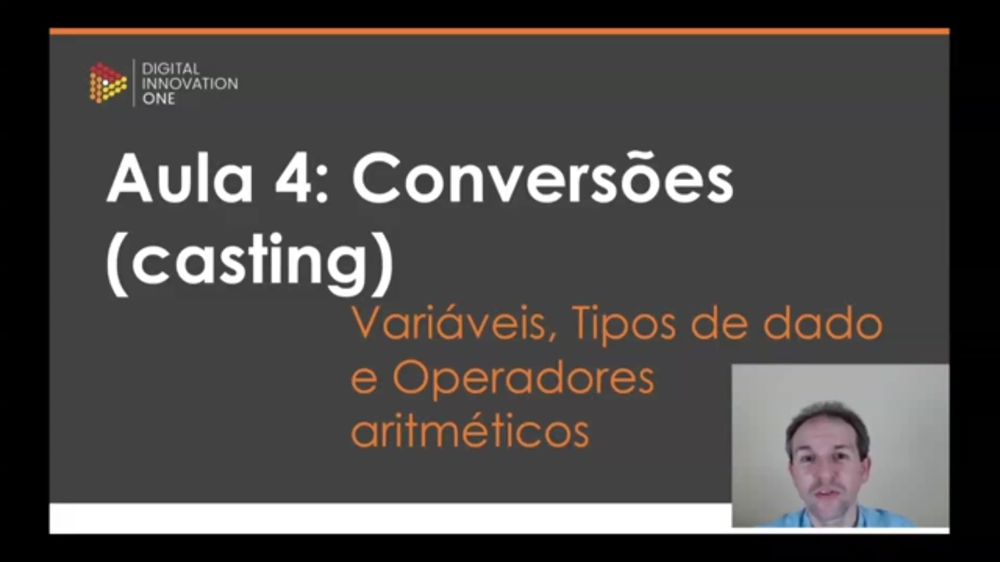
</p>

Esta aula introduz o conceito de **conversões**, amplamente conhecido no desenvolvimento de software como **casting**. O objetivo principal é compreender como transformar variáveis entre diferentes tipos de dados, explorando as capacidades de promoção e rebaixamento oferecidas pela linguagem Java.

Os objetivos específicos desta unidade são:

* **Entender o que é casting:** Compreender a fundamentação teórica da conversão de tipos.
* **Conhecer os tipos:** Identificar as modalidades de casting disponíveis na linguagem.
* **Saber como e quando usar:** Desenvolver o critério técnico para aplicar a castuação de forma segura e eficaz.


<p align="center">
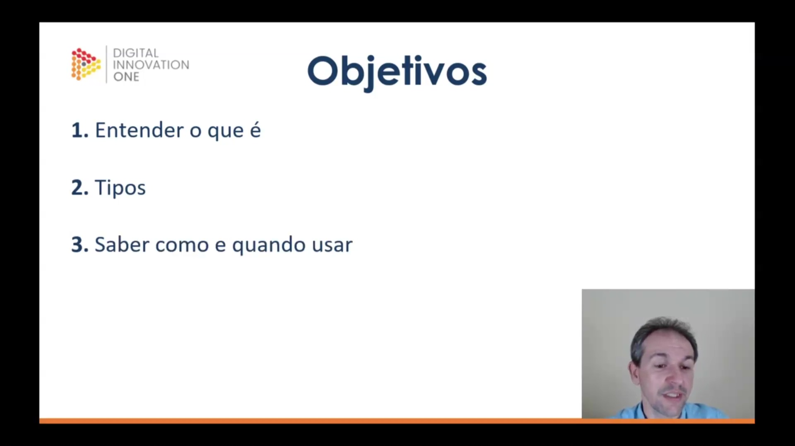
</p>

A conceituação formal de casting define o processo como a **transformação de uma determinada variável de um tipo menos específico para um tipo mais específico, ou vice-versa**. Na prática, isso significa que é possível tanto elevar a capacidade de representação de um dado (promover) quanto reduzi-la (rebaixar).

<p align="center">
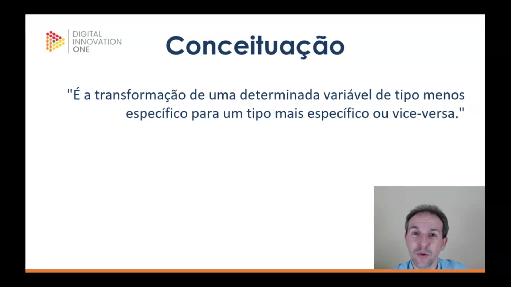
</p>

Existem duas categorias fundamentais de casting baseadas na direção da conversão:

* **Upcast (implícito):** Ocorre quando se promove um tipo de dado de menor capacidade para um de maior capacidade de armazenamento. Por não haver risco de perda de dados, a linguagem realiza a transição automaticamente (de forma implícita).
* **Downcast (explícito):** Ocorre ao rebaixar uma variável de maior capacidade para uma de menor capacidade. Como há risco de perda de precisão ou de informação, o desenvolvedor deve declarar a conversão de forma explícita no código.

<p align="center">
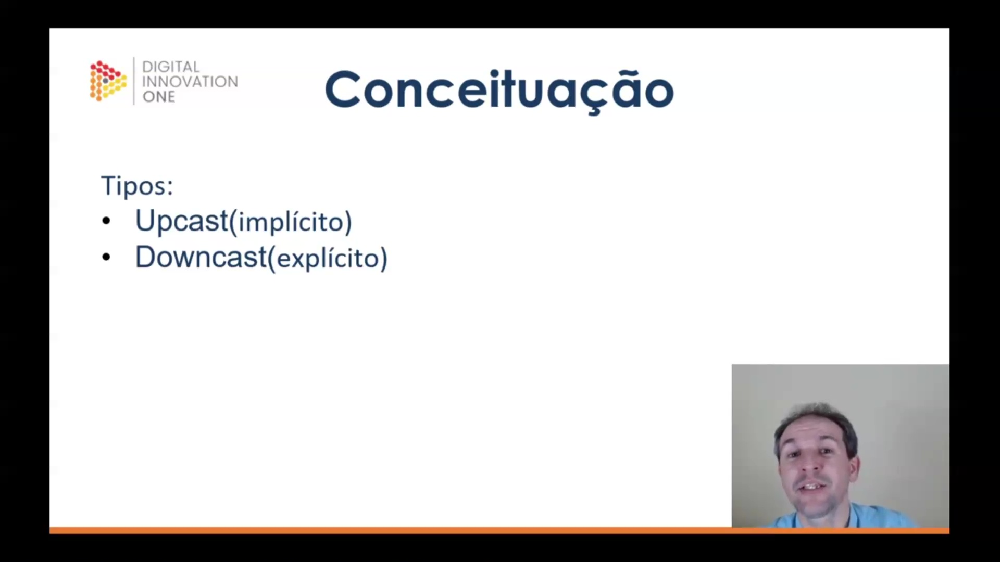
</p>

A tabela de utilização detalha como os tipos primitivos interagem entre si durante as conversões:

* **U-I (Upcast Implícito):** Indicado quando o destino tem maior capacidade que a origem (ex: de `int` para `long` ou `float`).
* **D-E (Downcast Explícito):** Necessário quando o destino tem menor capacidade que a origem (ex: de `long` para `int`), exigindo a intervenção do programador.


<p align="center">
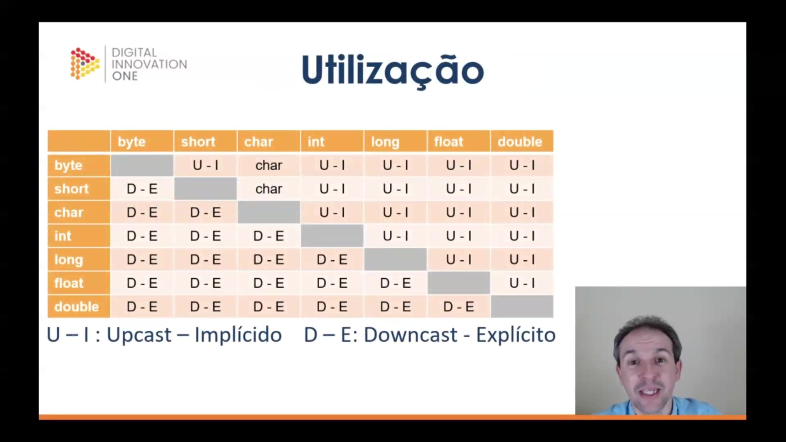
</p>

A aplicação prática do casting demonstra a diferença sintática entre as promoções e os rebaixamentos:

* No **Upcast**, a atribuição é direta, pois o valor cabe com folga no novo tipo.
* No **Downcast**, utiliza-se parênteses com o tipo de destino antes da variável para instruir a linguagem sobre a transformação.


```java
// Exemplos de Upcast e Downcast
long l; 
int i = 10; 
l = i; // Upcast implícito

int i2; 
long l2 = 100; 
i2 = (int) l2; // Downcast explícito

double d; 
float f = 10.5f; 
d = f; // Upcast implícito

float f2; 
double d2 = 10.5d; 
f2 = (float) d2; // Downcast explícito

```

<p align="center">
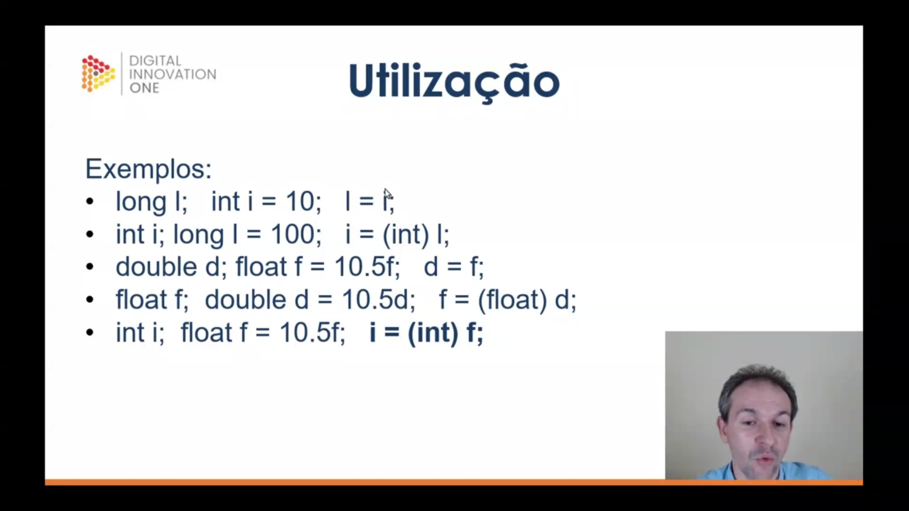
</p>

Um dos casos mais críticos de casting envolve a conversão de números reais para inteiros. Ao realizar um downcast de um `float` para um `int`, ocorre o **truncamento**: a parte decimal é simplesmente descartada, restando apenas o valor inteiro.

```java
// Exemplo de perda de informação por truncamento
int i; 
float f = 10.5f; 
i = (int) f; // O valor resultante em 'i' será 10

```

Essa operação exige cautela, especialmente em transações financeiras, onde o descarte sistemático de centavos pode gerar prejuízos significativos ao longo de muitas operações.


### 🟩 Vídeo 09 - Exercitando

<video width="60%" controls>
  <source src="000-Midia_e_Anexos/bootcamp_tqi_fullstack-modulo.06-curso.02-video_09.webm" type="video/webm">
    Seu navegador não suporta vídeo HTML5.
</video>

link do vídeo: https://web.dio.me/track/tqi-fullstack-developer/course/variaveis-tipos-de-dados-e-operadores-matematicos-em-java/learning/27c0145b-7930-4993-a345-3b5dab49fa64?autoplay=1

O vídeo detalha **conversão de tipos de dados**, processo também conhecido como **casting** na programação Java. O autor diferencia o **upcast**, que ocorre de forma automática e segura quando um valor é promovido para um espaço maior, do **downcast**, que exige declaração explícita e oferece riscos. É enfatizado que reduzir a capacidade de representação pode resultar em **perda de informação**, arredondamentos indesejados ou no **truncamento** de valores fracionários ao convertê-los para inteiros. O texto demonstra que, embora conversões sejam possíveis entre quase todos os tipos, o desenvolvedor deve ser cauteloso com os **efeitos colaterais** de reduzir o tamanho de um dado. Por fim, o conteúdo serve como um guia prático para entender como a memória do computador lida com diferentes **capacidades de armazenamento** numérico.

### Anotações

Esta aula foca na resolução do exercício sobre **casting** (conversões de tipos), explorando como o Java lida com a transferência de dados entre variáveis de capacidades distintas. O exemplo demonstra que o **upcast** (promoção) é um processo seguro e implícito, enquanto o **downcast** (rebaixamento) exige declaração explícita e oferece riscos à integridade dos dados.

### Conceitos Fundamentais de Casting

* **Downcast e Perda de Informação**: Quando um valor de maior capacidade é forçado em um tipo menor, pode ocorrer perda de informação se o valor exceder o limite do destino.
* **Upcast Implícito**: A promoção de um tipo menor para um maior é automática, pois sempre haverá espaço suficiente para a representação, não gerando efeitos colaterais.
* **Truncamento**: Converter valores de ponto flutuante para inteiros resulta na perda da parte fracionária, mantendo apenas a parte inteira do número.
* **Flexibilidade entre Tipos**: O Java permite conversões entre quase todos os tipos numéricos, desde que o casting seja feito de forma explícita nos casos de redução de capacidade.

```java
package one.digitalinnovation.basecamp;

/**
 * Classe de exemplo para o exercício da Aula 4 de Variáveis, Tipos de Dado e Operadores aritméticos.
 */
public class Main {
    public static void main(String[] args) {

        byte b1;
        short s1 = 1000;
        b1 = (byte) s1; // Downcast: Redução de capacidade; ocasionou perda de informação (1000 virou -24)

        long l1;
        int i1 = 10;
        l1 = i1; // Upcast: Promoção automática (implícita); não há perda de informação

        int i2;
        long l2 = 1000000000000000000L; 
        i2 = (int) l2; // Downcast: Valor muito grande para o int; resultou em perda de informação

        int i3;
        long l3 = 10000L;
        i3 = (int) l3; // Downcast: Embora explícito, não houve perda pois 10.000 cabe no limite do int

        double d1;
        float f1 = 10.5f;
        d1 = f1; // Upcast: Valor real promovido para double; sobra espaço de representação

        float f2;
        double d2 = 1000.58d;
        f2 = (float) d2; // Downcast: Sem perda perceptível pois as casas decimais são poucas

        float f3;
        double d3 = 10000.588888888888888888888888888888888888888d;
        f3 = (float) d3; // Downcast: Muitas casas decimais geraram perda de precisão (arredondamento)

        int i4;
        float f4 = 11.5697f;
        i4 = (int) f4; // Truncar: A parte fracionária é ignorada, mantendo apenas o valor inteiro 11

        b1 = (byte) d3; // Downcast extremo: De double (maior) para byte (menor); resultou em apenas 16

        // Impressão dos resultados para conferência dos efeitos colaterais do casting
        System.out.println("b1:" + b1);
        System.out.println("l1:" + l1);
        System.out.println("i2:" + i2);
        System.out.println("i3:" + i3);
        System.out.println("d1:" + d1);
        System.out.println("f2:" + f2);
        System.out.println("f3:" + f3);
        System.out.println("i4:" + i4);
        System.out.println("b1:" + b1);
    }
}

```


### 🟩 Vídeo 10 - Encerramento

<video width="60%" controls>
  <source src="000-Midia_e_Anexos/bootcamp_tqi_fullstack-modulo.06-curso.02-video_10.webm" type="video/webm">
    Seu navegador não suporta vídeo HTML5.
</video>

link do vídeo: https://web.dio.me/track/tqi-fullstack-developer/course/variaveis-tipos-de-dados-e-operadores-matematicos-em-java/learning/8cbf4e9a-ecda-409e-b9bb-e0acfb591f0a?autoplay=1

O autor encerra o treinamento enfatizando que **sentir incertezas** após a conclusão das aulas é um processo **esperado e positivo**. Para solucionar questionamentos, ele recomenda o uso do **fórum interno**, onde instrutores e outros estudantes colaboram diretamente. Caso a demanda seja mais abrangente, os alunos são incentivados a buscar suporte na **comunidade do Discord**, que oferece uma rede de contatos mais ampla. Além disso, o material disponibiliza **referências externas** baseadas na documentação oficial da Oracle para quem deseja aprofundar seus estudos técnicos. Esse suporte contínuo visa garantir que o aprendizado se estenda para além do conteúdo em vídeo. Por fim, o instrutor agradece a participação de todos e sinaliza a continuidade da jornada em **cursos futuros**.

### Anotações

<p align="center">
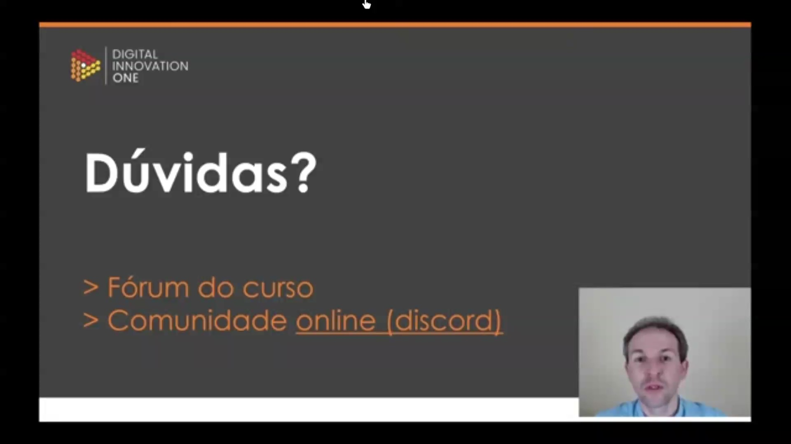
</p>

Ao concluir o curso, é natural que surjam dúvidas sobre o conteúdo estudado. Para solucionar essas questões, estão disponíveis dois canais principais de suporte: o **fórum do curso**, onde ocorre a interação entre alunos e instrutores, e a **comunidade online no Discord**, voltada para discussões mais amplas que transcendem o escopo específico das aulas.

<p align="center">
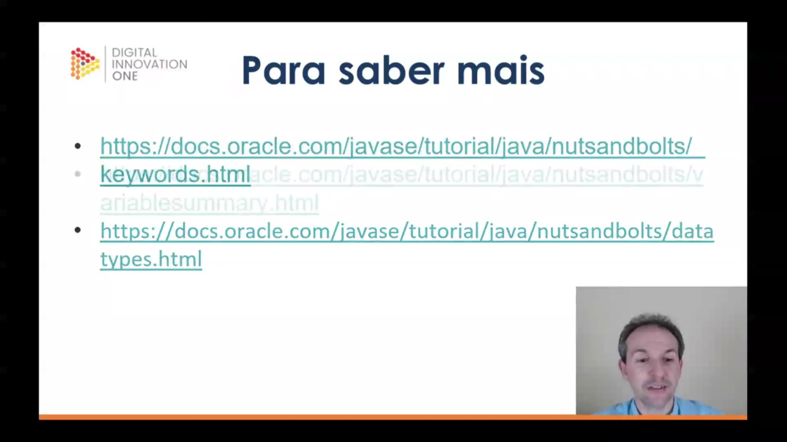
</p>

Para o aprofundamento nos temas abordados, a documentação oficial da Oracle oferece recursos detalhados sobre a estrutura fundamental da linguagem Java. Os materiais de referência incluem guias sobre palavras-chave, conceitos de variáveis e tipos de dados, servindo como base técnica para o conteúdo apresentado:

* **Palavras-chave**: [https://docs.oracle.com/javase/tutorial/java/nutsandbolts/keywords.html](https://docs.oracle.com/javase/tutorial/java/nutsandbolts/keywords.html) 
* **Tipos de Dados**: [https://docs.oracle.com/javase/tutorial/java/nutsandbolts/datatypes.html](https://docs.oracle.com/javase/tutorial/java/nutsandbolts/datatypes.html) 

<p align="center">
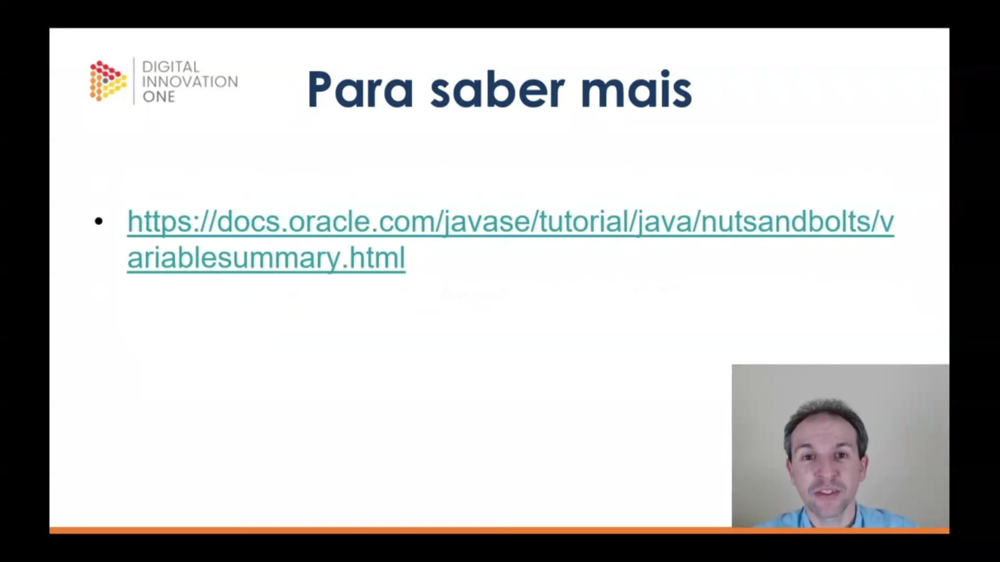
</p>

A seção "Para saber mais" disponibiliza links diretos da documentação oficial da Oracle, especificamente focados no resumo de variáveis. Esses recursos adicionais permitem que o estudante explore a fundamentação teórica utilizada na confecção do material didático:

* **Resumo de Variáveis**: [https://docs.oracle.com/javase/tutorial/java/nutsandbolts/variablesummary.html](https://docs.oracle.com/javase/tutorial/java/nutsandbolts/variablesummary.html)      


# Certificado: Variáveis, Tipos de Dados e Operadores Matemáticos em Java

- Link na plataforma: https://hermes.dio.me/certificates/FDOXFRHH.pdf
- Certificado em pdf: [Certificado-Variaveis,_Tipos_de_Dados_e_Operadores_Matematicos_em_Java.pdf](000-Midia_e_Anexos/Certificado-Variaveis,_Tipos_de_Dados_e_Operadores_Matematicos_em_Java.pdf)
