## Instrutor

- Thiago Leite e Carvalho (Senior Java Developer and Software Engineer | Java Tech Lead | University Professor | Writer | Speaker | Instructor)
- Contato Linkedin: / [thiago-leite-e-carvalho-1b337b127](https://www.linkedin.com/in/thiago-leite-e-carvalho-1b337b127/)
- Códigos de exemplo da aula neste link: https://github.com/tlcdio

## Parte 1 - Criação

### 🟩 Vídeo 01 - Introdução ao Curso

<video width="60%" controls>
  <source src="000-Midia_e_Anexos/bootcamp_tqi_fullstack-modulo.06-curso.03-video_01.webm" type="video/webm">
    Seu navegador não suporta vídeo HTML5.
</video>

link do vídeo: https://web.dio.me/track/tqi-fullstack-developer/course/entendendo-metodos-java/learning/1d32857c-8137-4b87-8a1c-474300f71648?autoplay=1

Esta fonte consiste na transcrição de uma aula introdutória de um curso focado em métodos na linguagem Java, ministrada por Thiago Leite Carvalho, um desenvolvedor Back-end com 17 anos de experiência e mestre em Engenharia de Software que atua no SERPRO. O instrutor estabelece que o objetivo principal do curso é capacitar o aluno a compreender, criar e utilizar métodos, estruturando o conteúdo em três aulas principais sobre criação, sobrecarga e retornos, ao mesmo tempo em que define a lógica de programação, o Java 11 e a IDE IntelliJ como pré-requisitos essenciais. Além de apresentar sua trajetória acadêmica e profissional, Thiago compartilha seus canais de contato, como LinkedIn e GitHub para acesso a projetos e materiais, e orienta sobre o uso do fórum do curso e da comunidade no Discord para a resolução de dúvidas durante o aprendizado.

### Anotações

<p align="center">
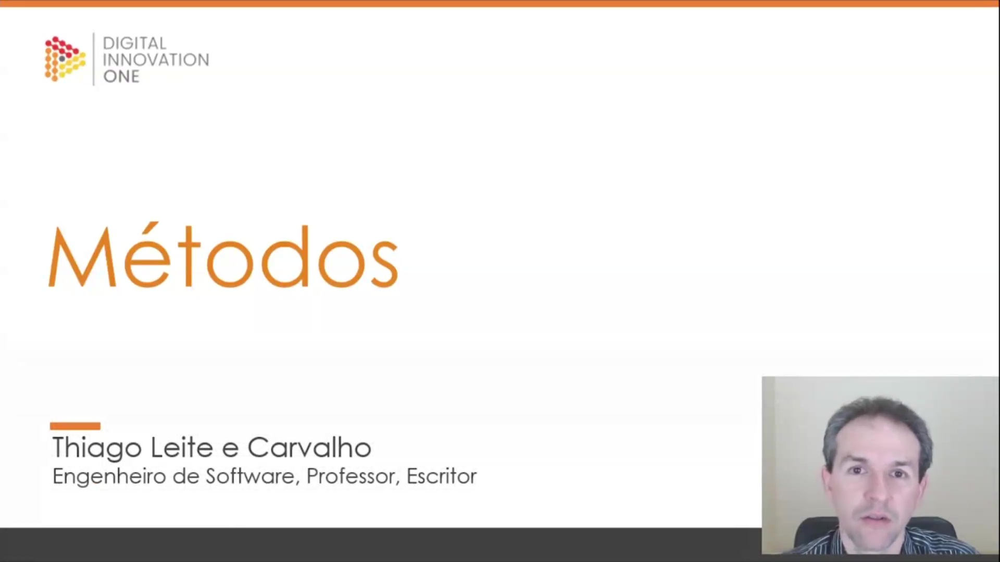
</p>

O instrutor Thiago Leite e Carvalho, engenheiro de software com 17 anos de experiência, inicia o curso focado no estudo de **Métodos**. Como especialista em Java Backend, ele introduz sua trajetória profissional, destacando sua atuação em camadas de persistência, modelagem de dados e criação de APIs, além de sua experiência na docência universitária e produção de conteúdo técnico.

<p align="center">
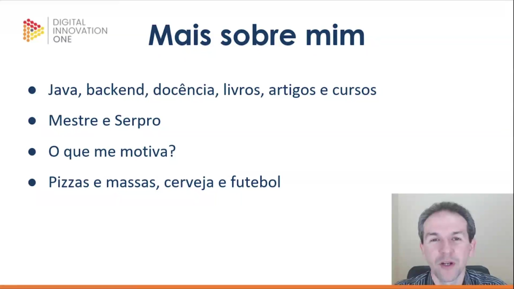
</p>

Além da atuação técnica como mestre em engenharia de software e desenvolvedor no SERPRO (empresa de tecnologia do Governo Federal), o instrutor compartilha seus interesses pessoais. Ele destaca que sua motivação profissional vem da ausência de rotina e dos novos desafios de negócio, enquanto pessoalmente dedica seu tempo a hobbies como gastronomia (massas e pizzas), cervejas artesanais e futebol.

<p align="center">
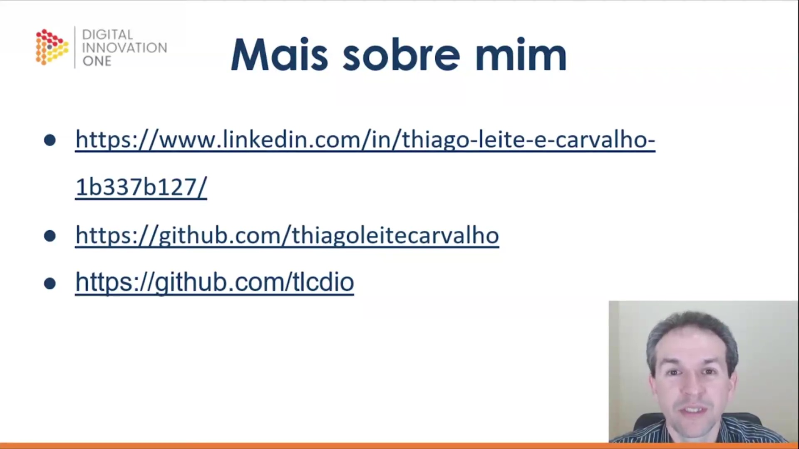
</p>

Para manter o contato e acompanhar as publicações técnicas e materiais de apoio, são disponibilizados os perfis profissionais:

* **LinkedIn:** Canal para artigos, livros e conteúdos sobre o cotidiano do desenvolvedor.
* **GitHub Pessoal:** Repositório de projetos particulares e exemplos de artigos.
* **GitHub DIO:** Perfil exclusivo para os projetos, exercícios e soluções desenvolvidos especificamente para este curso.

<p align="center">
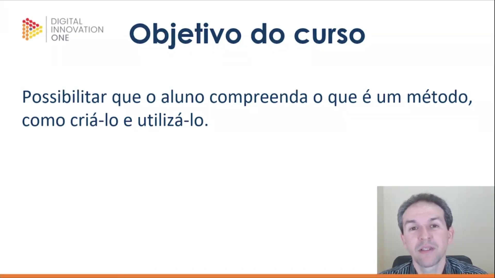
</p>

O objetivo central do curso é capacitar o aluno a compreender a natureza de um método, além de dominar sua criação e utilização prática. O método é apresentado como a unidade fundamental onde a execução do software se concentra, sendo o mecanismo que faz as operações funcionarem dentro de uma aplicação.

<p align="center">
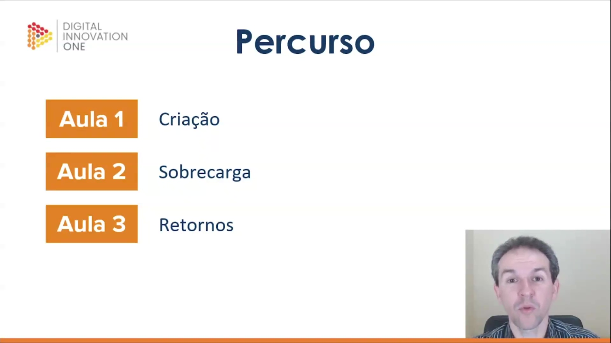
</p>

O percurso de aprendizado está estruturado em três aulas principais:

1. **Criação:** Fundamentos de como construir um método.
2. **Sobrecarga:** Entendimento deste conceito e como ele se aplica aos métodos.
3. **Retornos:** Estudo sobre como os métodos processam operações e retornam (ou não) valores e resultados.

<p align="center">
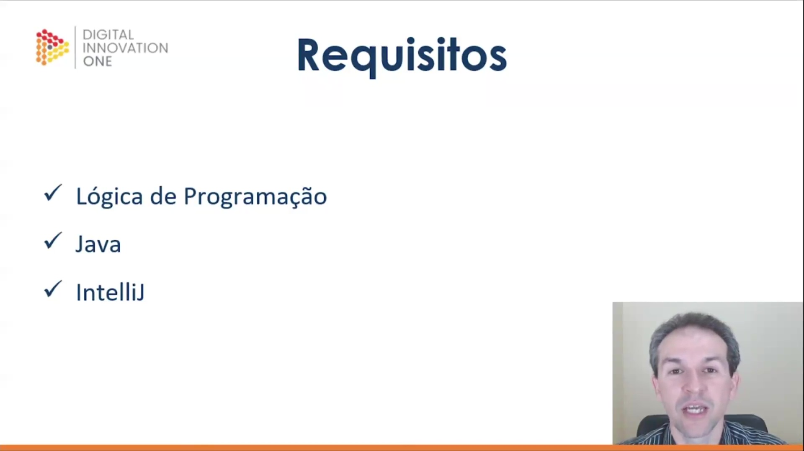
</p>

Para um melhor aproveitamento do conteúdo, são necessários os seguintes requisitos:

* **Lógica de Programação:** Conhecimento essencial prévio para evitar dificuldades no acompanhamento.
* **Java:** O curso utiliza especificamente a versão 11 da linguagem.
* **IntelliJ:** IDE (ambiente de desenvolvimento) que será utilizada para a execução dos exercícios práticos.      


### 🟩 Vídeo 02 - Conceituação de métodos

<video width="60%" controls>
  <source src="000-Midia_e_Anexos/bootcamp_tqi_fullstack-modulo.06-curso.03-video_02.webm" type="video/webm">
    Seu navegador não suporta vídeo HTML5.
</video>

link do vídeo: https://web.dio.me/track/tqi-fullstack-developer/course/entendendo-metodos-java/learning/c3449aae-b555-4dea-ade4-f0e4837c150e?autoplay=1

Esta aula introduz o conceito de métodos como sub-rotinas essenciais que definem o comportamento de um software, operando obrigatoriamente dentro de uma classe. O conteúdo foca em três objetivos fundamentais: a compreensão do que constitui um método, o aprendizado das regras para sua definição e utilização, e a aplicação de boas práticas para garantir que o código seja legível e facilite manutenções corretivas ou evolutivas. Por fim, ressalta-se que um método não funciona de forma isolada, exigindo uma requisição ou chamada para executar as operações que fazem a aplicação funcionar na prática.

### Anotações

<p align="center">
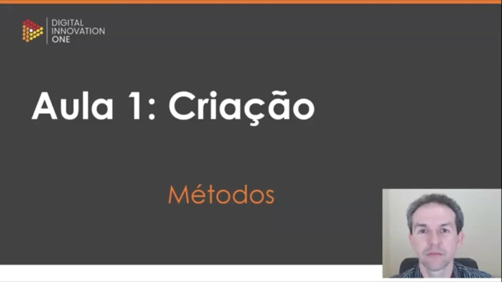
</p>

Esta etapa inicial da aula foca no processo de criação de métodos e na compreensão de como essas estruturas devem ser desenvolvidas. O objetivo é estabelecer uma base sólida sobre como organizar o código para que ele funcione corretamente dentro de uma aplicação.

<p align="center">
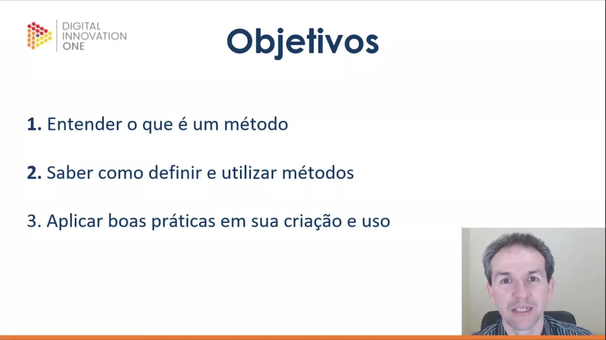
</p>

O aprendizado é estruturado em torno de três metas principais:

* **Entender a definição**: Compreender fundamentalmente o que constitui um método.
* **Definição e utilização**: Aprender as regras específicas para criar um método e como realizar a chamada (requisição) para que ele seja executado.
* **Aplicação de boas práticas**: Utilizar padrões que garantam a qualidade do código, facilitando futuras manutenções corretivas ou evolutivas e permitindo que outros desenvolvedores compreendam a lógica aplicada.

<p align="center">
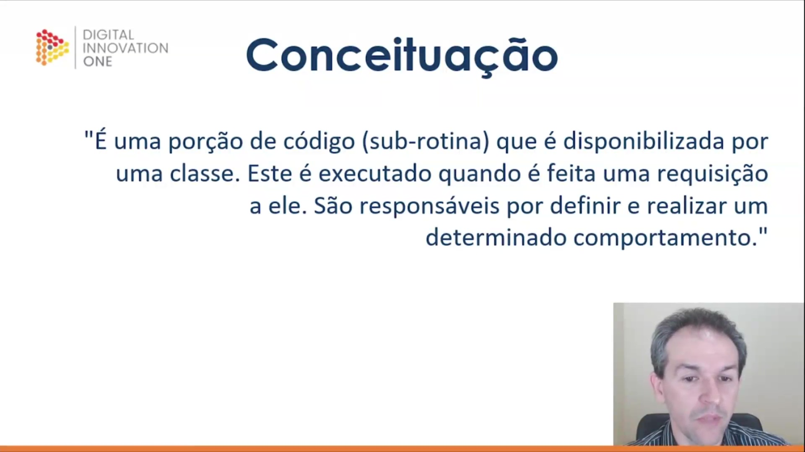
</p>

Um método é definido como uma sub-rotina ou porção de código disponibilizada obrigatoriamente por uma classe. Ele possui características fundamentais para o funcionamento do software:

* **Vínculo com Classes**: Não existe método sem uma classe; ele deve estar sempre contido dentro de uma para existir.
* **Execução sob Demanda**: O código interno do método permanece inativo até que seja feita uma requisição específica para sua execução.
* **Definição de Comportamento**: Os métodos são os responsáveis diretos por realizar as ações e operações que fazem o software funcionar de fato, definindo como a aplicação deve se comportar diante de cada tarefa.

### 🟩 Vídeo 03 - Definição

<video width="60%" controls>
  <source src="000-Midia_e_Anexos/bootcamp_tqi_fullstack-modulo.06-curso.03-video_03.webm" type="video/webm">
    Seu navegador não suporta vídeo HTML5.
</video>

link do vídeo: https://web.dio.me/track/tqi-fullstack-developer/course/entendendo-metodos-java/learning/648b17de-d6e5-47e3-84c1-097e701ab296?autoplay=1


Esta aula detalha a estrutura de criação e aplicação de métodos em Java, diferenciando os elementos obrigatórios — como nome, tipo de retorno, parênteses e corpo — dos componentes opcionais vinculados à Orientação a Objetos, como modificadores de visibilidade e exceções. O conteúdo enfatiza que o retorno pode ser um tipo primitivo, um objeto complexo ou void quando não há saída de dados, seguindo regras de nomenclatura idênticas às das variáveis. Além da definição técnica, explica-se que a execução de um método exige uma chamada ativa via classe ou objeto através da notação de ponto, priorizando, para fins didáticos, o padrão public static para garantir a organização e a reutilização do código.

### Anotações

<p align="center">
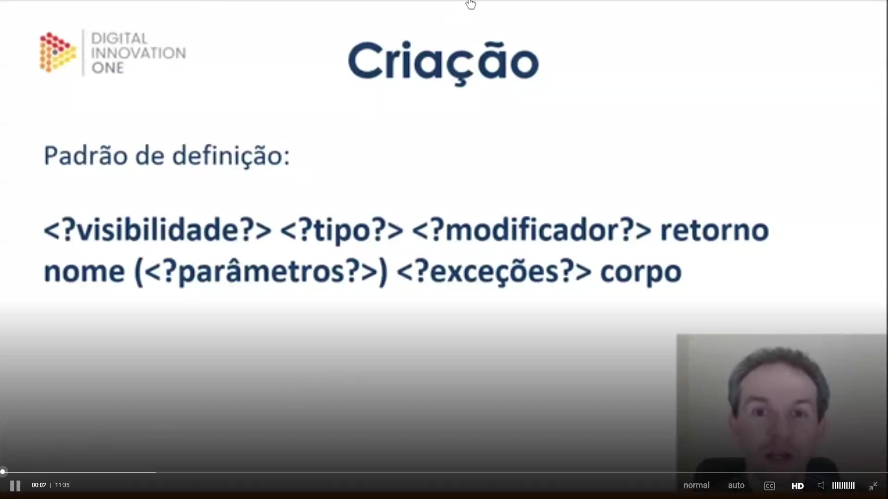
</p>

A criação de um método em Java segue um padrão de definição específico que determina como ele será estruturado e acessado. Este padrão é composto por elementos obrigatórios e opcionais:

* **Obrigatórios:** Retorno, nome, parênteses `()` e o corpo do método.
* **Opcionais:** Visibilidade, tipo, modificador e exceções.

O modelo sintático base é:

```java
<?visibilidade?> <?tipo?> <?modificador?> retorno nome (<?parâmetros?>) <?exceções?> corpo

```

Os itens marcados entre `<?>` indicam que sua presença depende da necessidade específica da implementação, enquanto os demais são os requisitos mínimos para definir um método válido.

<p align="center">
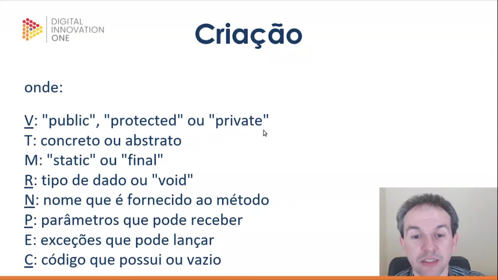
</p>

Para compreender a definição de um método, é necessário detalhar cada um dos componentes que podem compor sua assinatura:

* **V (Visibilidade):** Define quem pode acessar o método, podendo ser `public`, `protected` ou `private`.
* **T (Tipo):** Indica se o método é `concreto` (possui implementação) ou `abstrato` (apenas a assinatura).
* **M (Modificador):** Pode ser `static` (pertence à classe) ou `final` (não pode ser sobrescrito).
* **R (Retorno):** O tipo de dado que o método devolve após a execução (tipos primitivos ou objetos) ou `void` quando não há retorno.
* **N (Nome):** Identificador fornecido ao método, seguindo as mesmas regras de nomenclatura de variáveis em Java.
* **P (Parâmetros):** Lista de entradas que o método pode receber para processar.
* **E (Exceções):** Erros que o método pode disparar caso algo inesperado ocorra.
* **C (Corpo):** O bloco de código entre chaves `{}` que contém a lógica do método.

<p align="center">
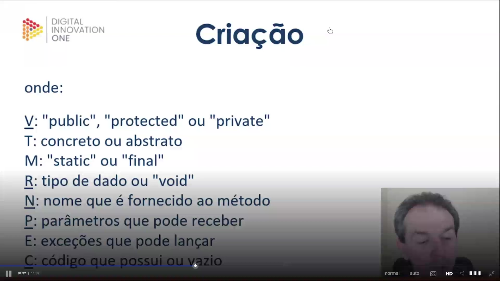
</p>

Dentre os elementos de definição, destacam-se o retorno e os parâmetros pela sua frequência de uso. O **retorno** pode ser qualquer tipo de dado conhecido (inteiro, float, objetos) ou o termo reservado `void`. O `void` indica que o método executa sua lógica interna, mas não devolve nenhum valor ao final para quem o chamou.

Os **parâmetros** residem obrigatoriamente dentro dos parênteses. Mesmo que um método não precise de parâmetros, o par de parênteses vazio `()` deve estar presente. Quando necessários, os parâmetros funcionam como variáveis de entrada para a lógica que reside no **corpo** do método, que pode conter o código a ser executado ou até mesmo estar vazio em contextos específicos de orientação a objetos.

<p align="center">
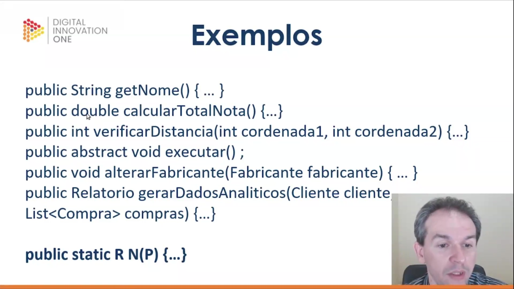
</p>

Abaixo constam diversos exemplos de métodos válidos, demonstrando variações em retornos (primitivos e complexos) e listas de parâmetros:

```java
public String getNome() { ... }
public double calcularTotalNota() {...}
public int verificarDistancia (int cordenada1, int cordenada2) {...}
public abstract void executar();
public void alterarFabricante (Fabricante fabricante) { ... }
public Relatorio gerarDadosAnaliticos(Cliente cliente, List<Compra> compras) {...}

// Padrão muito utilizado em contextos iniciais e exercícios:
public static R N(P){...}

```

Observe que os métodos podem receber desde tipos simples como `int` até objetos complexos como `Fabricante` ou listas. O método `executar()` exemplifica um método abstrato, onde o corpo é substituído por um ponto e vírgula `;`.

<p align="center">
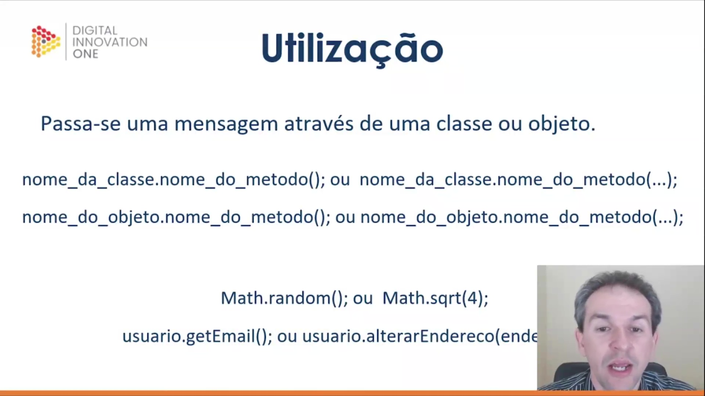
</p>

Um método não executa sozinho; ele precisa ser chamado (invocado) através de uma mensagem enviada a uma classe ou a um objeto. Em Java, por convenção, classes iniciam com letra maiúscula e objetos com letra minúscula.

Abaixo, os formatos de utilização:

```java
// Através de uma Classe (Métodos Estáticos)
nome_da_classe.nome_do_metodo();
nome_da_classe.nome_do_metodo(...);

// Exemplos Práticos (Classe Math)
Math.random(); // Sem parâmetros
Math.sqrt(4);  // Com parâmetro

// Através de um Objeto (Instância)
nome_do_objeto.nome_do_metodo();
nome_do_objeto.nome_do_metodo(...);

// Exemplos Práticos (Objeto usuário)
usuario.getEmail();
usuario.alterarEndereco(endereco);

```

A chamada consiste em referenciar a entidade (classe ou objeto), utilizar o operador ponto `.` seguido do nome do método e passar os argumentos necessários dentro dos parênteses.


### 🟩 Vídeo 04 - Conceitos Inerentes aos métodos e boas práticas na sua criação

<video width="60%" controls>
  <source src="000-Midia_e_Anexos/bootcamp_tqi_fullstack-modulo.06-curso.03-video_04.webm" type="video/webm">
    Seu navegador não suporta vídeo HTML5.
</video>

link do vídeo: https://web.dio.me/track/tqi-fullstack-developer/course/entendendo-metodos-java/learning/bc9c60c8-8a5f-4a70-84e1-9b9d2f824f02?autoplay=1

Este resumo apresenta os conceitos fundamentais sobre a estrutura, o funcionamento e as boas práticas no desenvolvimento de métodos em programação. A aula explora a definição de assinatura de um método — composta por seu nome e parâmetros — e introduz tipos especiais como construtores e destruidores, além do conceito de mensagem como o ato de solicitar a execução de um código. É dada ênfase à passagem de parâmetros por valor, onde uma cópia dos dados é utilizada, garantindo que alterações internas não afetem a variável original externa. Para assegurar a legibilidade e a manutenção do software, o conteúdo recomenda o uso da notação Camelo (camelCase), nomes descritivos com verbos e substantivos, e a limitação da extensão dos métodos a um intervalo de 80 a 120 linhas, incentivando a criação de métodos auxiliares e a aplicação de visibilidades adequadas para reduzir o acoplamento.

### Anotações

<p align="center">
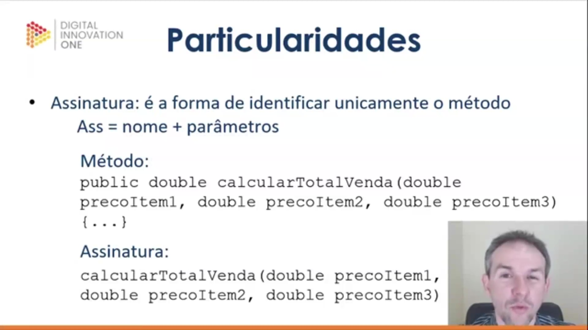
</p>

A **assinatura de um método** é o mecanismo utilizado para identificar unicamente um método dentro de um sistema. Ela é composta estritamente pelo **nome do método** somado aos seus **parâmetros** (tipo e ordem).

No exemplo apresentado, o método possui modificadores de acesso e tipo de retorno, mas sua assinatura foca apenas na identificação da chamada:

```java
// Método completo
public double calcularTotalVenda (double precoItem1, double precoItem2, double precoItem3) {...}

// Assinatura do método
calcularTotalVenda (double precoItem1, double precoItem2, double precoItem3)

```

Mesmo que um método não possua parâmetros, a assinatura é considerada existente, representada pelo nome seguido de parênteses vazios. Compreender este conceito é fundamental para o estudo de sobrecarga de métodos.

<p align="center">
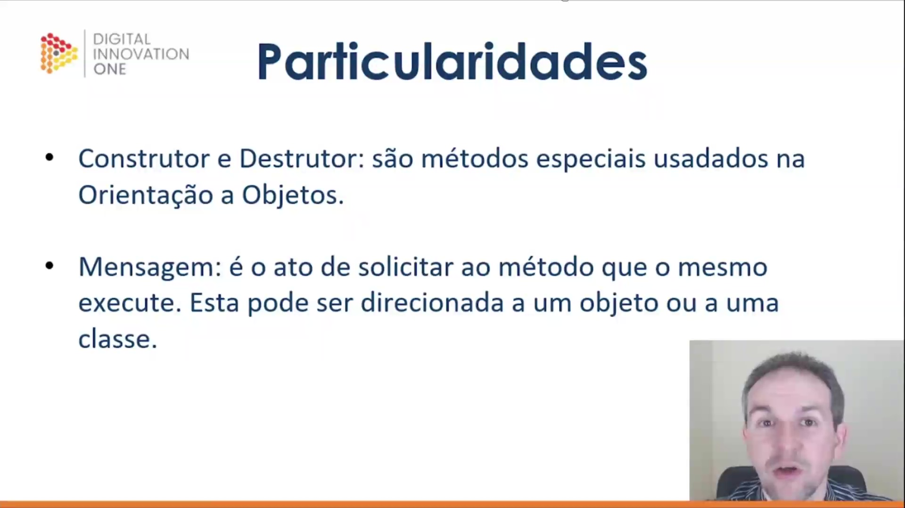
</p>

Existem tipos especiais de métodos e formas de interação que são pilares da Orientação a Objetos:

* **Construtor e Destrutor:** São métodos especiais. De forma simplista, o construtor é responsável pela criação de objetos, enquanto o destrutor auxilia na destruição dos mesmos.
* **Mensagem:** É o termo técnico utilizado para o ato de solicitar que um método execute seu código interno. Essa solicitação (ou chamada) pode ser direcionada especificamente a um **objeto** ou a uma **classe**.

<p align="center">
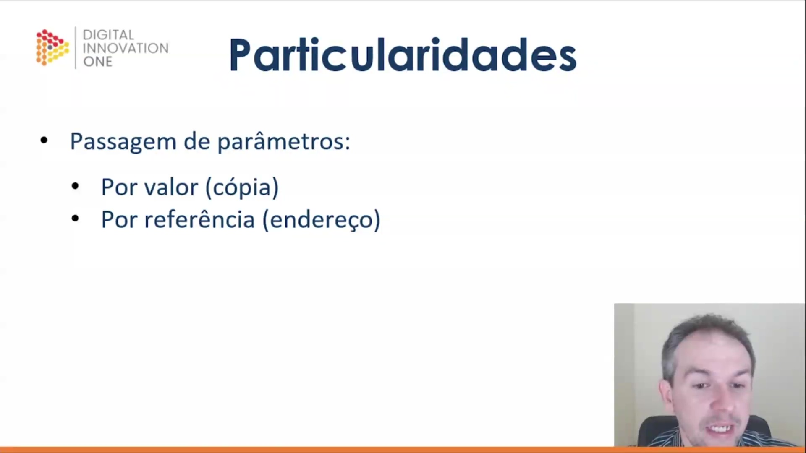
</p>

A **passagem de parâmetros** define como os dados são enviados para dentro de um método durante a sua chamada. Existem duas formas principais de realizar esse processo:

* **Por valor (cópia):** O método recebe uma cópia do dado original. Alterações feitas dentro do método não afetam a variável externa.
* **Por referência (endereço):** O método recebe o endereço de memória do dado, permitindo que alterações internas reflitam diretamente no valor original.

<p align="center">
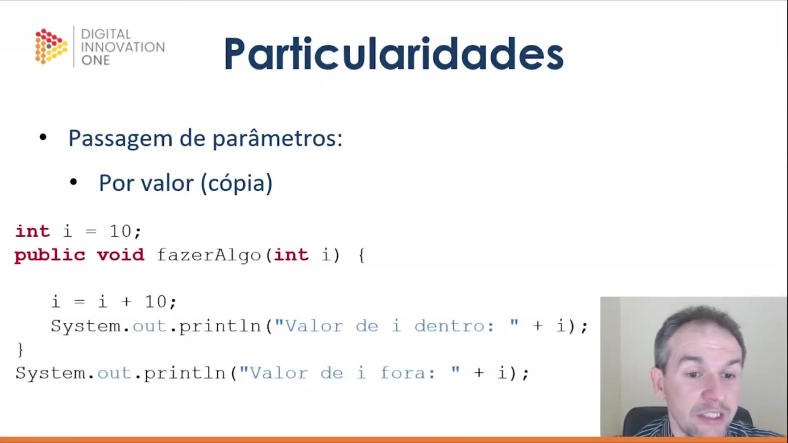
</p>

Na **passagem por valor**, também conhecida como passagem por cópia, o sistema cria um novo espaço em memória para o parâmetro dentro do escopo do método.

No exemplo abaixo, embora a variável `i` seja incrementada dentro do método `fazerAlgo`, a variável original definida fora do método permanece inalterada:

```java
int i = 10;

public void fazerAlgo (int i) {
    i = i + 10;
    System.out.println("Valor de i dentro: " + i); // Exibirá 20
}

System.out.println("Valor de i fora: " + i); // Exibirá 10

```

Isso ocorre porque o método operou apenas sobre a **cópia** do valor, sem afetar o endereço de memória da variável externa.

<p align="center">
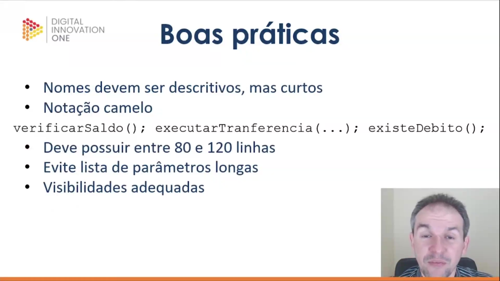
</p>

Para garantir a qualidade e a manutenção do código, devem-se seguir algumas **boas práticas** na criação de métodos:

* **Nomes descritivos e curtos:** Use verbos e substantivos que expressem a finalidade do método, evitando artigos e preposições.
* **Notação Camelo (camelCase):** A primeira letra da primeira palavra é minúscula, e as primeiras letras das palavras subsequentes são maiúsculas (ex: `verificarSaldo()`).
* **Tamanho ideal:** Recomenda-se que métodos possuam entre **80 e 120 linhas**. Caso fiquem muito extensos, devem ser divididos em métodos auxiliares.
* **Lista de parâmetros curta:** Evite métodos com muitos parâmetros para reduzir o acoplamento.
* **Visibilidades adequadas:** Utilize modificadores de acesso (como público ou privado) conforme a real necessidade de exposição do método.      


### 🟩 Vídeo 05 - Apresentação do exercício

<video width="60%" controls>
  <source src="000-Midia_e_Anexos/bootcamp_tqi_fullstack-modulo.06-curso.03-video_05.webm" type="video/webm">
    Seu navegador não suporta vídeo HTML5.
</video>

link do vídeo: https://web.dio.me/track/tqi-fullstack-developer/course/entendendo-metodos-java/learning/ee23f1ff-2afa-4f7f-8a3b-0939125c0052?autoplay=1

Esta aula propõe uma atividade prática focada no desenvolvimento e na organização de métodos para fortalecer a lógica de programação e a reutilização de código. O desafio consiste em criar uma aplicação que execute quatro operações matemáticas básicas com dois valores, emita saudações personalizadas (bom dia, boa tarde ou boa noite) com base no horário informado e realize o cálculo do valor final de um empréstimo, permitindo a definição arbitrária de taxas e parcelas. O vídeo enfatiza a importância de decompor problemas complexos em pequenos métodos que podem trabalhar de forma independente ou em conjunto — inclusive sendo passados como parâmetros uns para os outros — com o objetivo de evitar códigos extensos, facilitar a manutenção e promover o reaproveitamento de funções.

### Anotações

<p align="center">
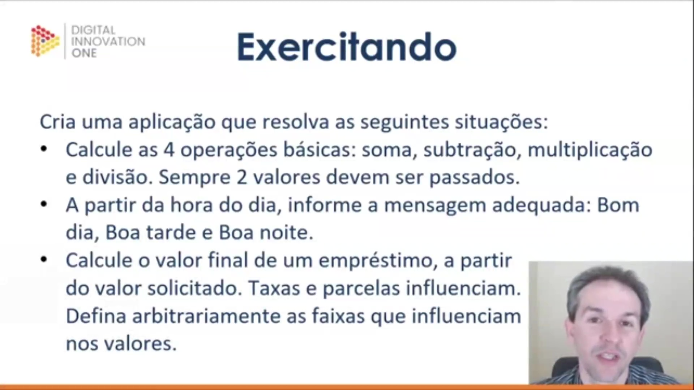
</p>

Nesta etapa prática, o desafio consiste em desenvolver uma aplicação que gerencie três cenários comuns de lógica de programação:

* **Operações Matemáticas**: Implementação de um calculador para as quatro operações básicas (soma, subtração, multiplicação e divisão). É obrigatória a passagem de dois valores como parâmetros para essas operações.
* **Mensagens de Saudação**: Criação de uma lógica que identifique o período do dia (manhã, tarde ou noite) com base na hora informada, retornando a saudação "Bom dia", "Boa tarde" ou "Boa noite".
* **Simulação de Empréstimo**: Desenvolvimento de um sistema para calcular o valor final de um empréstimo a partir do montante solicitado. O cálculo deve ser influenciado por taxas e pela quantidade de parcelas , com a liberdade de definir arbitrariamente as faixas que determinam esses valores.

<p align="center">
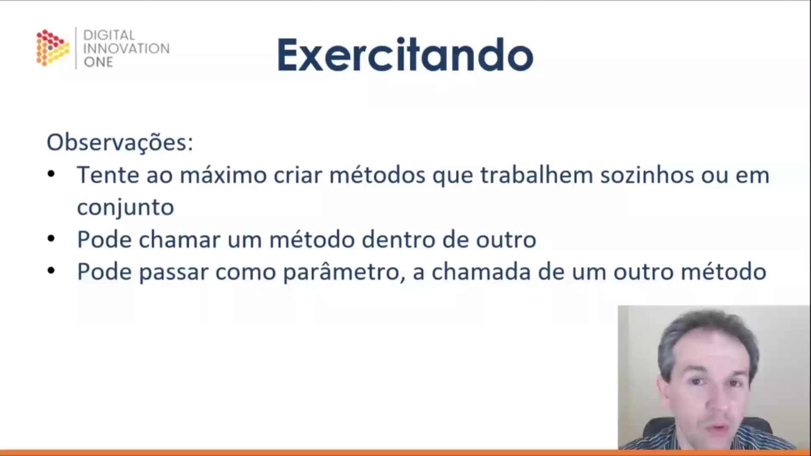
</p>

Para a resolução dos exercícios, é fundamental aplicar boas práticas de modularização e reutilização de código:

* **Modularização**: Deve-se buscar ao máximo a criação de métodos que executem tarefas de forma independente ou em conjunto.
* **Composição de Métodos**: É permitido e recomendável chamar um método dentro de outro para organizar a lógica do programa.
* **Parâmetros Dinâmicos**: É possível passar a chamada de um método como parâmetro para outro método, facilitando o fluxo de dados e o reaproveitamento de funções.


### 🟩 Vídeo 06 - Exercício prático

<video width="60%" controls>
  <source src="000-Midia_e_Anexos/bootcamp_tqi_fullstack-modulo.06-curso.03-video_06.webm" type="video/webm">
    Seu navegador não suporta vídeo HTML5.
</video>

link do vídeo: https://web.dio.me/track/tqi-fullstack-developer/course/entendendo-metodos-java/learning/c93b0388-6923-4bb1-986d-274f2cf990aa?autoplay=1

Este conteúdo apresenta a resolução comentada de três exercícios práticos sobre a criação e aplicação de métodos na linguagem Java. Através de exemplos de uma calculadora, um sistema de saudações horárias e um simulador de empréstimos, o instrutor demonstra conceitos fundamentais como modificadores estáticos, passagem de parâmetros, tipos de retorno e a composição de métodos (um método chamando outro ou sendo passado como argumento).

### Anotações

Nesta etapa, é apresentada a implementação da classe `Calculadora`, cujo objetivo é exercitar a criação de métodos simples sem retorno (`void`). A classe define as quatro operações aritméticas básicas, onde cada método recebe dois parâmetros do tipo `double`, realiza o cálculo, armazena o resultado em uma variável temporária e o exibe no console.

O código foca na estrutura fundamental de um método: visibilidade (`public`), modificador (`static`), tipo de retorno (`void`), nome do método e parâmetros.

```java
package one.digitalinnovation.basecamp;

public class Calculadora {

    public static void soma(double numero1, double numero2) {
        double resultado = numero1 + numero2;
        System.out.println("A soma de " + numero1 + " mais " + numero2 + " é " + resultado);
    }

    public static void subtracao(double numero1, double numero2) {
        double resultado = numero1 - numero2;
        System.out.println("A subtracao de " + numero1 + " menos " + numero2 + " é " + resultado);
    }

    public static void multiplicacao(double numero1, double numero2) {
        double resultado = numero1 * numero2;
        System.out.println("A multiplicação de " + numero1 + " vezes " + numero2 + " é " + resultado);
    }

    public static void divisao(double numero1, double numero2) {
        double resultado = numero1 / numero2;
        System.out.println("A divisão de " + numero1 + " por " + numero2 + " é " + resultado);
    }
}

```

A classe `Mensagem` demonstra a possibilidade de métodos trabalharem em conjunto, onde um método principal chama outros métodos auxiliares. O método `obterMensagem` utiliza uma estrutura de controle `switch` para avaliar a hora informada e decidir qual saudação disparar.

Em vez de imprimir o texto diretamente no `switch`, o código delega essa função para os métodos específicos `mensagemBomDia()`, `mensagemBoaTarde()` e `mensagemBoaNoite()`, exemplificando a modularização e a chamada de métodos internos.

```java
package one.digitalinnovation.basecamp;

public class Mensagem {

    public static void obterMensagem(int hora) {
        switch (hora) {
            case 5:
            case 6:
            case 7:
            case 8:
            case 9:
            case 10:
            case 11:
            case 12:
                mensagemBomDia();
                break;
            case 13:
            case 14:
            case 15:
            case 16:
            case 17:
                mensagemBoaTarde();
                break;
            case 18:
            case 19:
            case 20:
            case 21:
            case 22:
            case 23:
            case 0:
            case 1:
            case 2:
            case 3:
            case 4:
                mensagemBoaNoite();
                break;
            default:
                System.out.println("Hora inválida.");
                break;
        }
    }

    public static void mensagemBomDia() {
        System.out.println("Bom dia!");
    }

    public static void mensagemBoaTarde() {
        System.out.println("Bom tarde!");
    }

    public static void mensagemBoaNoite() {
        System.out.println("Bom noite!");
    }
}

```

A classe `Emprestimo` aprofunda o conceito de interação entre métodos, introduzindo o uso de retornos. O método `calcular` recebe o valor solicitado e a quantidade de parcelas, utilizando métodos auxiliares como `getTaxaDuasParcelas()` para obter os valores necessários para o cálculo final.

O exemplo destaca que métodos podem retornar tipos de dados diferentes, como `int` para o número de parcelas e `double` para as taxas, e que esses retornos podem ser consumidos diretamente pela lógica de outros métodos.

```java
package one.digitalinnovation.basecamp;

public class Emprestimo {

    public static int getDuasParcelas() {
        return 2;
    }

    public static int getTresParcelas() {
        return 3;
    }

    public static double getTaxaDuasParcelas() {
        return 0.3;
    }

    public static double getTaxaTresParcelas() {
        return 0.45;
    }

    public static void calcular(double valor, int parcelas) {
        if (parcelas == 2) {
            double valorFinal = valor + (valor * getTaxaDuasParcelas());
            System.out.println("Valor final do empréstimo para 2 parcelas: R$ " + valorFinal);
        } else if (parcelas == 3) {
            double valorFinal = valor + (valor * getTaxaTresParcelas());
            System.out.println("Valor final do empréstimo para 3 parcelas: R$ " + valorFinal);
        } else {
            System.out.println("Quantidade de parcelas não aceita.");
        }
    }
}

```

A classe `Main` atua como o ponto de entrada da aplicação, onde todos os métodos criados anteriormente são executados. Aqui é demonstrada a invocação de métodos estáticos diretamente a partir do nome da classe (ex: `Calculadora.soma(3, 6)`), o que é possível graças ao modificador `static`.

Também é ilustrada uma prática comum: passar a execução de um método como parâmetro para outro, como visto em `Emprestimo.calcular(1000, Emprestimo.getDuasParcelas())`. Neste caso, o valor retornado pelo método de parcelas é injetado diretamente como argumento no método de cálculo.

```java
package one.digitalinnovation.basecamp;

public class Main {
    public static void main(String[] args) {
        
        // Calculadora
        System.out.println("Exercício calculadora");
        Calculadora.soma(3, 6);
        Calculadora.subtracao(9, 1.8);
        Calculadora.multiplicacao(7, 8);
        Calculadora.divisao(5, 2.5);

        // Mensagem
        System.out.println("Exercício mensagem");
        Mensagem.obterMensagem(9);
        Mensagem.obterMensagem(14);
        Mensagem.obterMensagem(1);

        // Empréstimo
        System.out.println("Exercício empréstimo");
        Emprestimo.calcular(1000, Emprestimo.getDuasParcelas());
        Emprestimo.calcular(1000, Emprestimo.getTresParcelas());
        Emprestimo.calcular(1000, 5);
    }
}

```      

## Parte 2 - Sobrecarga

### 🟩 Vídeo 07 - Como criar sobrecargas, usá-las e exercício prático

<video width="60%" controls>
  <source src="000-Midia_e_Anexos/bootcamp_tqi_fullstack-modulo.06-curso.03-video_07.webm" type="video/webm">
    Seu navegador não suporta vídeo HTML5.
</video>

link do vídeo:

### 🟩 Vídeo 08 - Resolução do exercício prático

<video width="60%" controls>
  <source src="000-Midia_e_Anexos/bootcamp_tqi_fullstack-modulo.06-curso.03-video_08.webm" type="video/webm">
    Seu navegador não suporta vídeo HTML5.
</video>

link do vídeo:

## Parte 3 - Retornos

### 🟩 Vídeo 09 - Funcionamento, considerações, uso de retornos e apresentação do exercício

<video width="60%" controls>
  <source src="000-Midia_e_Anexos/bootcamp_tqi_fullstack-modulo.06-curso.03-video_09.webm" type="video/webm">
    Seu navegador não suporta vídeo HTML5.
</video>

link do vídeo:

### 🟩 Vídeo 10 - Resolução do exercício

<video width="60%" controls>
  <source src="000-Midia_e_Anexos/bootcamp_tqi_fullstack-modulo.06-curso.03-video_10.webm" type="video/webm">
    Seu navegador não suporta vídeo HTML5.
</video>

link do vídeo:

### 🟩 Vídeo 11 - Encerramento do curso

<video width="60%" controls>
  <source src="000-Midia_e_Anexos/bootcamp_tqi_fullstack-modulo.06-curso.03-video_11.webm" type="video/webm">
    Seu navegador não suporta vídeo HTML5.
</video>

link do vídeo:

##  Materiais de Apoio

# Certificado: 

- Link na plataforma: 
- Certificado em pdf: 
