## Instrutor

- Thiago Leite e Carvalho (Senior Java Developer and Software Engineer | Java Tech Lead | University Professor | Writer | Speaker | Instructor)
- Contato Linkedin: / [thiago-leite-e-carvalho-1b337b127](https://www.linkedin.com/in/thiago-leite-e-carvalho-1b337b127/)
- Códigos de exemplo da aula neste link: https://github.com/tlcdio

## Parte 1 - Criação

### 🟩 Vídeo 01 - Introdução ao Curso

<video width="60%" controls>
  <source src="000-Midia_e_Anexos/bootcamp_tqi_fullstack-modulo.06-curso.03-video_01.webm" type="video/webm">
    Seu navegador não suporta vídeo HTML5.
</video>

link do vídeo: https://web.dio.me/track/tqi-fullstack-developer/course/entendendo-metodos-java/learning/1d32857c-8137-4b87-8a1c-474300f71648?autoplay=1

O instrutor estabelece que o objetivo principal do curso é capacitar o aluno a compreender, criar e utilizar métodos, estruturando o conteúdo em três aulas principais sobre criação, sobrecarga e retornos, ao mesmo tempo em que define a lógica de programação, o Java 11 e a IDE IntelliJ como pré-requisitos essenciais. 

### Anotações

<p align="center">
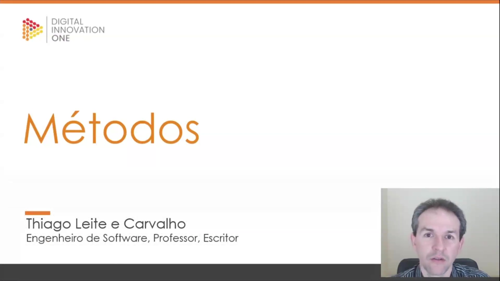
</p>

O instrutor Thiago Leite e Carvalho, engenheiro de software com 17 anos de experiência, inicia o curso focado no estudo de **Métodos**. Como especialista em Java Backend, ele introduz sua trajetória profissional, destacando sua atuação em camadas de persistência, modelagem de dados e criação de APIs, além de sua experiência na docência universitária e produção de conteúdo técnico.

<p align="center">
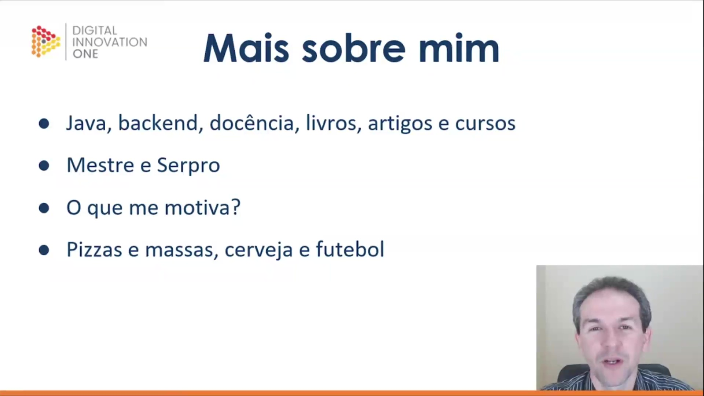
</p>

Além da atuação técnica como mestre em engenharia de software e desenvolvedor no SERPRO (empresa de tecnologia do Governo Federal), o instrutor compartilha seus interesses pessoais. Ele destaca que sua motivação profissional vem da ausência de rotina e dos novos desafios de negócio, enquanto pessoalmente dedica seu tempo a hobbies como gastronomia (massas e pizzas), cervejas artesanais e futebol.

<p align="center">
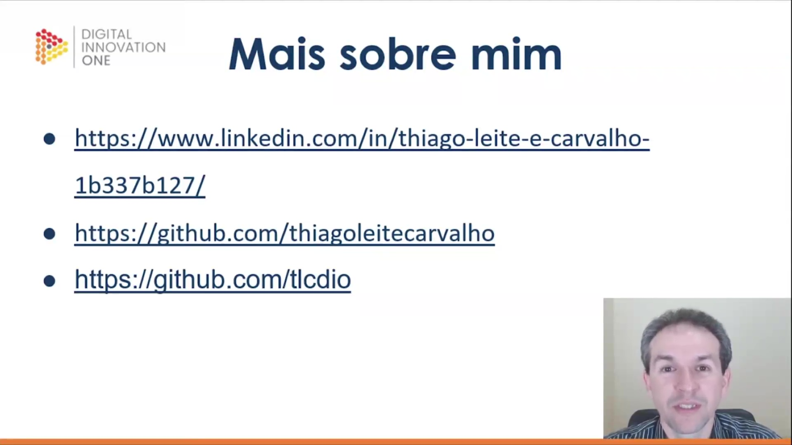
</p>

Para manter o contato e acompanhar as publicações técnicas e materiais de apoio, são disponibilizados os perfis profissionais:

* **LinkedIn:** Canal para artigos, livros e conteúdos sobre o cotidiano do desenvolvedor.
* **GitHub Pessoal:** Repositório de projetos particulares e exemplos de artigos.
* **GitHub DIO:** Perfil exclusivo para os projetos, exercícios e soluções desenvolvidos especificamente para este curso.

<p align="center">
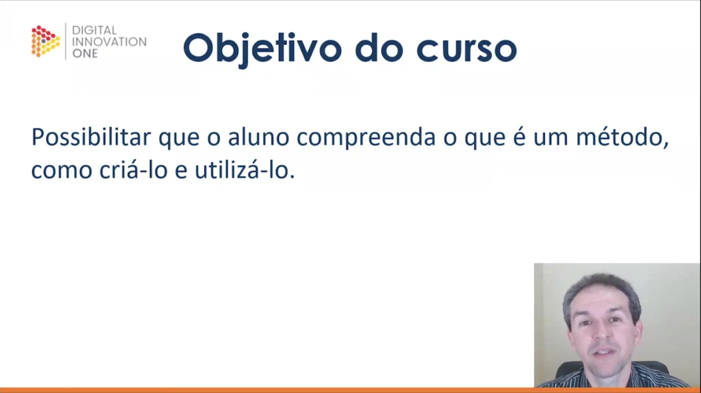
</p>

O objetivo central do curso é capacitar o aluno a compreender a natureza de um método, além de dominar sua criação e utilização prática. O método é apresentado como a unidade fundamental onde a execução do software se concentra, sendo o mecanismo que faz as operações funcionarem dentro de uma aplicação.

<p align="center">
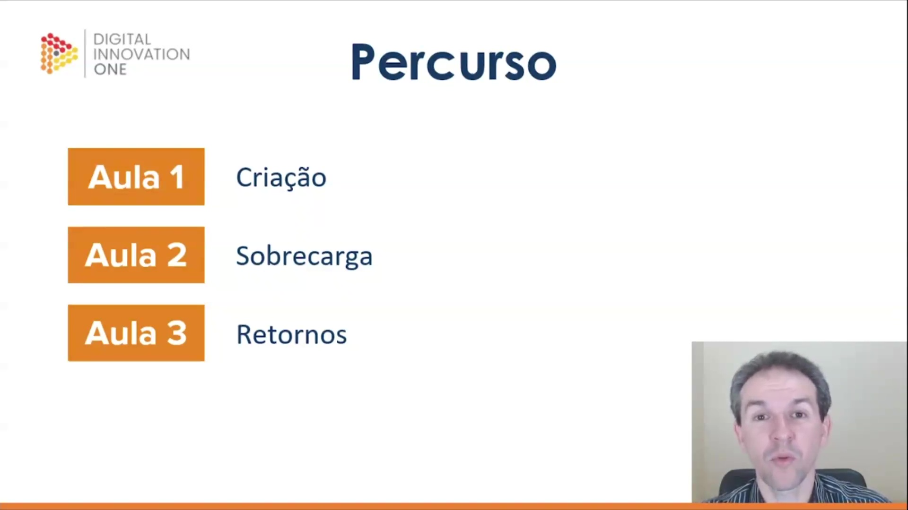
</p>

O percurso de aprendizado está estruturado em três aulas principais:

1. **Criação:** Fundamentos de como construir um método.
2. **Sobrecarga:** Entendimento deste conceito e como ele se aplica aos métodos.
3. **Retornos:** Estudo sobre como os métodos processam operações e retornam (ou não) valores e resultados.

<p align="center">
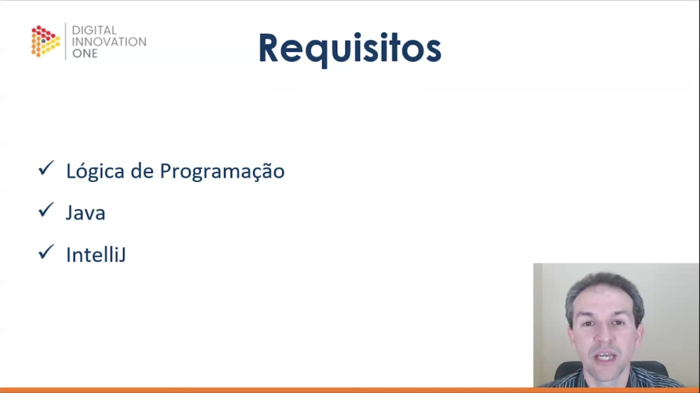
</p>

Para um melhor aproveitamento do conteúdo, são necessários os seguintes requisitos:

* **Lógica de Programação:** Conhecimento essencial prévio para evitar dificuldades no acompanhamento.
* **Java:** O curso utiliza especificamente a versão 11 da linguagem.
* **IntelliJ:** IDE (ambiente de desenvolvimento) que será utilizada para a execução dos exercícios práticos.      


### 🟩 Vídeo 02 - Conceituação de métodos

<video width="60%" controls>
  <source src="000-Midia_e_Anexos/bootcamp_tqi_fullstack-modulo.06-curso.03-video_02.webm" type="video/webm">
    Seu navegador não suporta vídeo HTML5.
</video>

link do vídeo: https://web.dio.me/track/tqi-fullstack-developer/course/entendendo-metodos-java/learning/c3449aae-b555-4dea-ade4-f0e4837c150e?autoplay=1

Esta aula introduz o conceito de métodos como sub-rotinas essenciais que definem o comportamento de um software, operando obrigatoriamente dentro de uma classe. O conteúdo foca em três objetivos fundamentais: a compreensão do que constitui um método, o aprendizado das regras para sua definição e utilização, e a aplicação de boas práticas para garantir que o código seja legível e facilite manutenções corretivas ou evolutivas. Por fim, ressalta-se que um método não funciona de forma isolada, exigindo uma requisição ou chamada para executar as operações que fazem a aplicação funcionar na prática.

### Anotações

<p align="center">
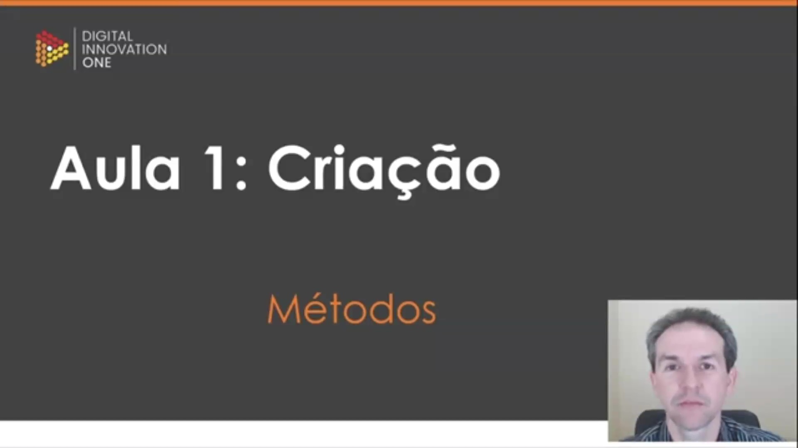
</p>

Esta etapa inicial da aula foca no processo de criação de métodos e na compreensão de como essas estruturas devem ser desenvolvidas. O objetivo é estabelecer uma base sólida sobre como organizar o código para que ele funcione corretamente dentro de uma aplicação.

<p align="center">
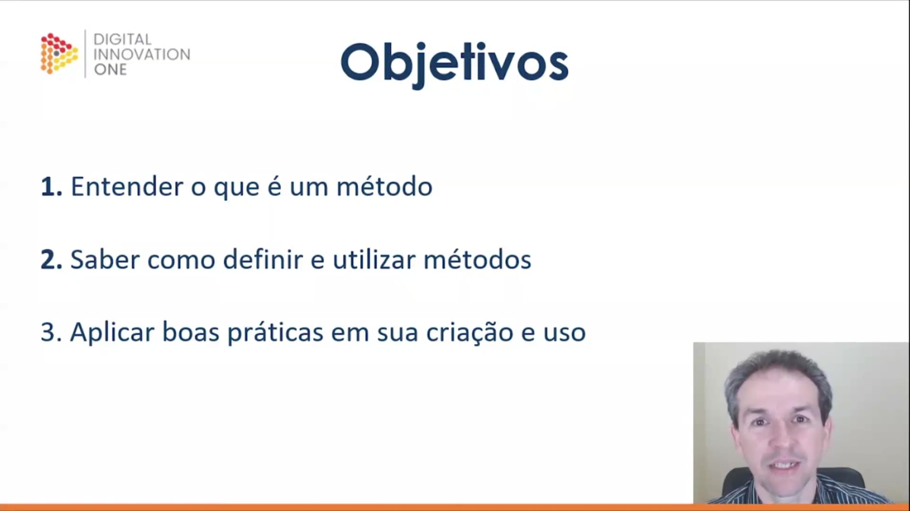
</p>

O aprendizado é estruturado em torno de três metas principais:

* **Entender a definição**: Compreender fundamentalmente o que constitui um método.
* **Definição e utilização**: Aprender as regras específicas para criar um método e como realizar a chamada (requisição) para que ele seja executado.
* **Aplicação de boas práticas**: Utilizar padrões que garantam a qualidade do código, facilitando futuras manutenções corretivas ou evolutivas e permitindo que outros desenvolvedores compreendam a lógica aplicada.

<p align="center">
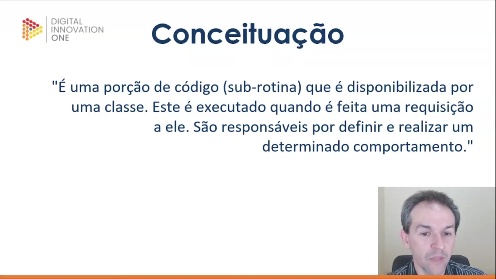
</p>

Um método é definido como uma sub-rotina ou porção de código disponibilizada obrigatoriamente por uma classe. Ele possui características fundamentais para o funcionamento do software:

* **Vínculo com Classes**: Não existe método sem uma classe; ele deve estar sempre contido dentro de uma para existir.
* **Execução sob Demanda**: O código interno do método permanece inativo até que seja feita uma requisição específica para sua execução.
* **Definição de Comportamento**: Os métodos são os responsáveis diretos por realizar as ações e operações que fazem o software funcionar de fato, definindo como a aplicação deve se comportar diante de cada tarefa.

### 🟩 Vídeo 03 - Definição

<video width="60%" controls>
  <source src="000-Midia_e_Anexos/bootcamp_tqi_fullstack-modulo.06-curso.03-video_03.webm" type="video/webm">
    Seu navegador não suporta vídeo HTML5.
</video>

link do vídeo: https://web.dio.me/track/tqi-fullstack-developer/course/entendendo-metodos-java/learning/648b17de-d6e5-47e3-84c1-097e701ab296?autoplay=1


Esta aula detalha a estrutura de criação e aplicação de métodos em Java, diferenciando os elementos obrigatórios — como nome, tipo de retorno, parênteses e corpo — dos componentes opcionais vinculados à Orientação a Objetos, como modificadores de visibilidade e exceções. O conteúdo enfatiza que o retorno pode ser um tipo primitivo, um objeto complexo ou void quando não há saída de dados, seguindo regras de nomenclatura idênticas às das variáveis. Além da definição técnica, explica-se que a execução de um método exige uma chamada ativa via classe ou objeto através da notação de ponto, priorizando, para fins didáticos, o padrão public static para garantir a organização e a reutilização do código.

### Anotações

<p align="center">
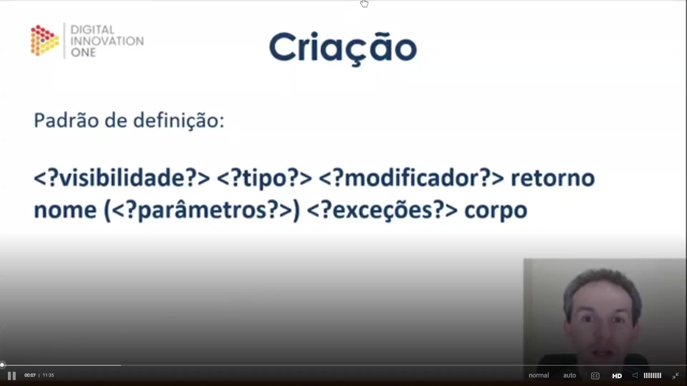
</p>

A criação de um método em Java segue um padrão de definição específico que determina como ele será estruturado e acessado. Este padrão é composto por elementos obrigatórios e opcionais:

* **Obrigatórios:** Retorno, nome, parênteses `()` e o corpo do método.
* **Opcionais:** Visibilidade, tipo, modificador e exceções.

O modelo sintático base é:

```java
<?visibilidade?> <?tipo?> <?modificador?> retorno nome (<?parâmetros?>) <?exceções?> corpo

```

Os itens marcados entre `<?>` indicam que sua presença depende da necessidade específica da implementação, enquanto os demais são os requisitos mínimos para definir um método válido.

<p align="center">
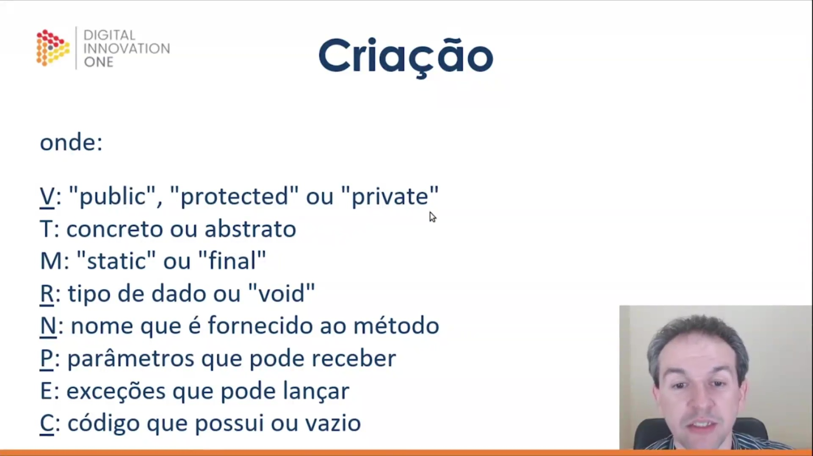
</p>

Para compreender a definição de um método, é necessário detalhar cada um dos componentes que podem compor sua assinatura:

* **V (Visibilidade):** Define quem pode acessar o método, podendo ser `public`, `protected` ou `private`.
* **T (Tipo):** Indica se o método é `concreto` (possui implementação) ou `abstrato` (apenas a assinatura).
* **M (Modificador):** Pode ser `static` (pertence à classe) ou `final` (não pode ser sobrescrito).
* **R (Retorno):** O tipo de dado que o método devolve após a execução (tipos primitivos ou objetos) ou `void` quando não há retorno.
* **N (Nome):** Identificador fornecido ao método, seguindo as mesmas regras de nomenclatura de variáveis em Java.
* **P (Parâmetros):** Lista de entradas que o método pode receber para processar.
* **E (Exceções):** Erros que o método pode disparar caso algo inesperado ocorra.
* **C (Corpo):** O bloco de código entre chaves `{}` que contém a lógica do método.

<p align="center">
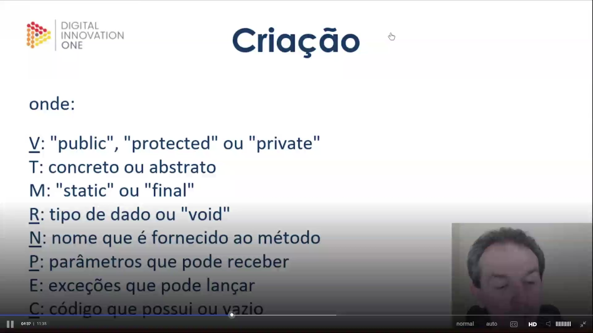
</p>

Dentre os elementos de definição, destacam-se o retorno e os parâmetros pela sua frequência de uso. O **retorno** pode ser qualquer tipo de dado conhecido (inteiro, float, objetos) ou o termo reservado `void`. O `void` indica que o método executa sua lógica interna, mas não devolve nenhum valor ao final para quem o chamou.

Os **parâmetros** residem obrigatoriamente dentro dos parênteses. Mesmo que um método não precise de parâmetros, o par de parênteses vazio `()` deve estar presente. Quando necessários, os parâmetros funcionam como variáveis de entrada para a lógica que reside no **corpo** do método, que pode conter o código a ser executado ou até mesmo estar vazio em contextos específicos de orientação a objetos.

<p align="center">
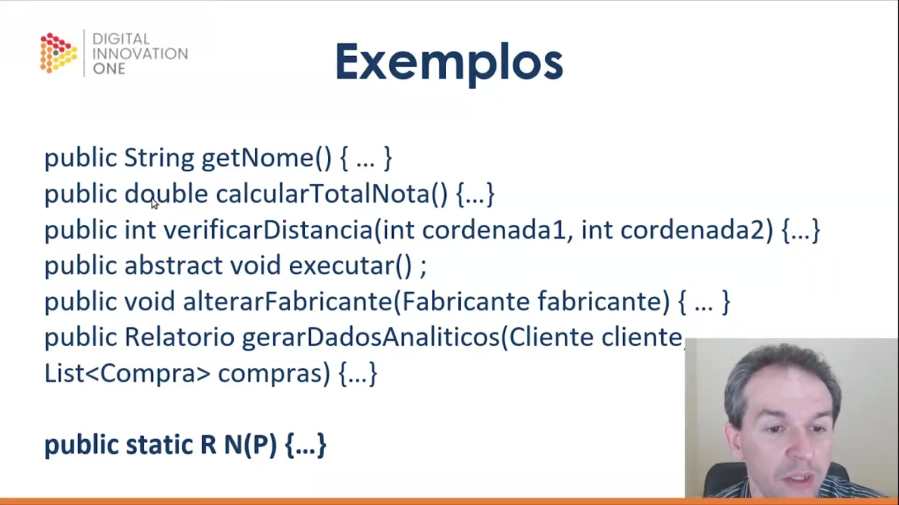
</p>

Abaixo constam diversos exemplos de métodos válidos, demonstrando variações em retornos (primitivos e complexos) e listas de parâmetros:

```java
public String getNome() { ... }
public double calcularTotalNota() {...}
public int verificarDistancia (int cordenada1, int cordenada2) {...}
public abstract void executar();
public void alterarFabricante (Fabricante fabricante) { ... }
public Relatorio gerarDadosAnaliticos(Cliente cliente, List<Compra> compras) {...}

// Padrão muito utilizado em contextos iniciais e exercícios:
public static R N(P){...}

```

Observe que os métodos podem receber desde tipos simples como `int` até objetos complexos como `Fabricante` ou listas. O método `executar()` exemplifica um método abstrato, onde o corpo é substituído por um ponto e vírgula `;`.

<p align="center">
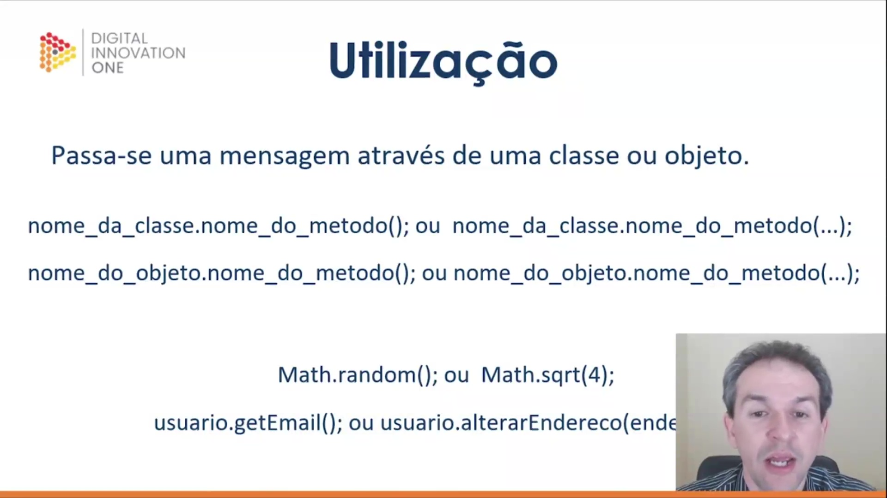
</p>

Um método não executa sozinho; ele precisa ser chamado (invocado) através de uma mensagem enviada a uma classe ou a um objeto. Em Java, por convenção, classes iniciam com letra maiúscula e objetos com letra minúscula.

Abaixo, os formatos de utilização:

```java
// Através de uma Classe (Métodos Estáticos)
nome_da_classe.nome_do_metodo();
nome_da_classe.nome_do_metodo(...);

// Exemplos Práticos (Classe Math)
Math.random(); // Sem parâmetros
Math.sqrt(4);  // Com parâmetro

// Através de um Objeto (Instância)
nome_do_objeto.nome_do_metodo();
nome_do_objeto.nome_do_metodo(...);

// Exemplos Práticos (Objeto usuário)
usuario.getEmail();
usuario.alterarEndereco(endereco);

```

A chamada consiste em referenciar a entidade (classe ou objeto), utilizar o operador ponto `.` seguido do nome do método e passar os argumentos necessários dentro dos parênteses.


### 🟩 Vídeo 04 - Conceitos Inerentes aos métodos e boas práticas na sua criação

<video width="60%" controls>
  <source src="000-Midia_e_Anexos/bootcamp_tqi_fullstack-modulo.06-curso.03-video_04.webm" type="video/webm">
    Seu navegador não suporta vídeo HTML5.
</video>

link do vídeo: https://web.dio.me/track/tqi-fullstack-developer/course/entendendo-metodos-java/learning/bc9c60c8-8a5f-4a70-84e1-9b9d2f824f02?autoplay=1

O vídeo apresenta os conceitos fundamentais sobre a estrutura, o funcionamento e as boas práticas no desenvolvimento de métodos em programação. A aula explora a definição de assinatura de um método — composta por seu nome e parâmetros — e introduz tipos especiais como construtores e destruidores, além do conceito de mensagem como o ato de solicitar a execução de um código. É dada ênfase à passagem de parâmetros por valor, onde uma cópia dos dados é utilizada, garantindo que alterações internas não afetem a variável original externa. Para assegurar a legibilidade e a manutenção do software, o conteúdo recomenda o uso da notação Camelo (camelCase), nomes descritivos com verbos e substantivos, e a limitação da extensão dos métodos a um intervalo de 80 a 120 linhas, incentivando a criação de métodos auxiliares e a aplicação de visibilidades adequadas para reduzir o acoplamento.

### Anotações

<p align="center">
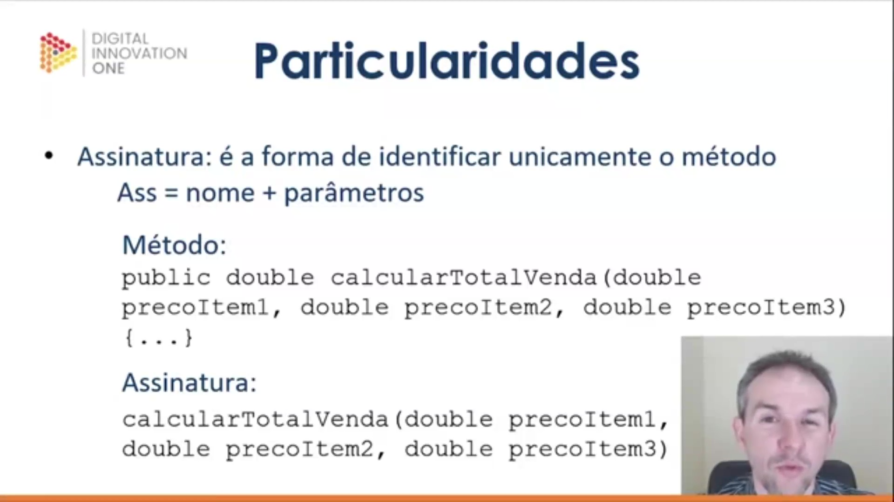
</p>

A **assinatura de um método** é o mecanismo utilizado para identificar unicamente um método dentro de um sistema. Ela é composta estritamente pelo **nome do método** somado aos seus **parâmetros** (tipo e ordem).

No exemplo apresentado, o método possui modificadores de acesso e tipo de retorno, mas sua assinatura foca apenas na identificação da chamada:

```java
// Método completo
public double calcularTotalVenda (double precoItem1, double precoItem2, double precoItem3) {...}

// Assinatura do método
calcularTotalVenda (double precoItem1, double precoItem2, double precoItem3)

```

Mesmo que um método não possua parâmetros, a assinatura é considerada existente, representada pelo nome seguido de parênteses vazios. Compreender este conceito é fundamental para o estudo de sobrecarga de métodos.

<p align="center">
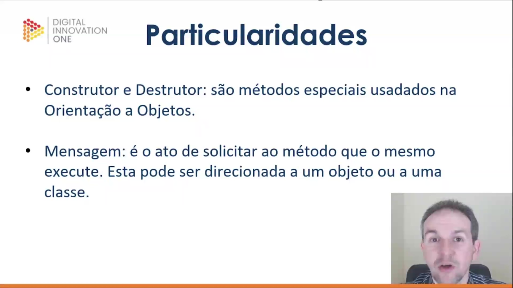
</p>

Existem tipos especiais de métodos e formas de interação que são pilares da Orientação a Objetos:

* **Construtor e Destrutor:** São métodos especiais. De forma simplista, o construtor é responsável pela criação de objetos, enquanto o destrutor auxilia na destruição dos mesmos.
* **Mensagem:** É o termo técnico utilizado para o ato de solicitar que um método execute seu código interno. Essa solicitação (ou chamada) pode ser direcionada especificamente a um **objeto** ou a uma **classe**.

<p align="center">
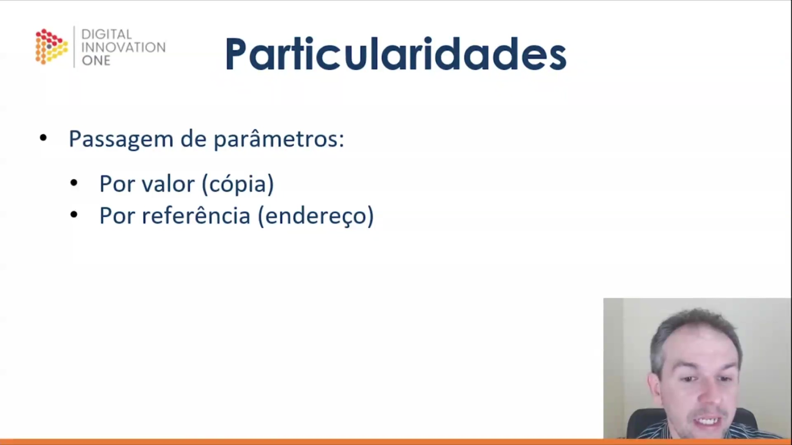
</p>

A **passagem de parâmetros** define como os dados são enviados para dentro de um método durante a sua chamada. Existem duas formas principais de realizar esse processo:

* **Por valor (cópia):** O método recebe uma cópia do dado original. Alterações feitas dentro do método não afetam a variável externa.
* **Por referência (endereço):** O método recebe o endereço de memória do dado, permitindo que alterações internas reflitam diretamente no valor original.

<p align="center">
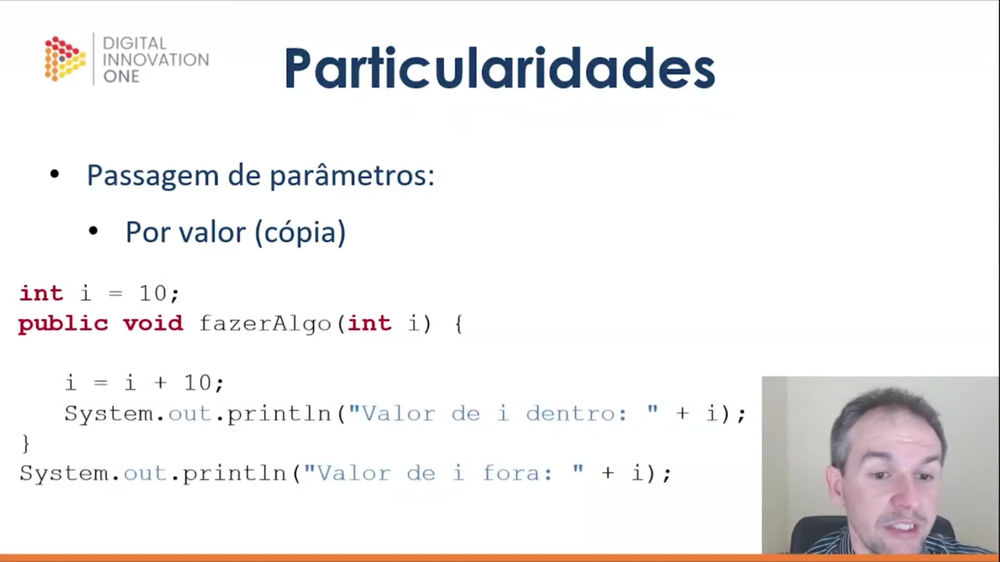
</p>

Na **passagem por valor**, também conhecida como passagem por cópia, o sistema cria um novo espaço em memória para o parâmetro dentro do escopo do método.

No exemplo abaixo, embora a variável `i` seja incrementada dentro do método `fazerAlgo`, a variável original definida fora do método permanece inalterada:

```java
int i = 10;

public void fazerAlgo (int i) {
    i = i + 10;
    System.out.println("Valor de i dentro: " + i); // Exibirá 20
}

System.out.println("Valor de i fora: " + i); // Exibirá 10

```

Isso ocorre porque o método operou apenas sobre a **cópia** do valor, sem afetar o endereço de memória da variável externa.

<p align="center">
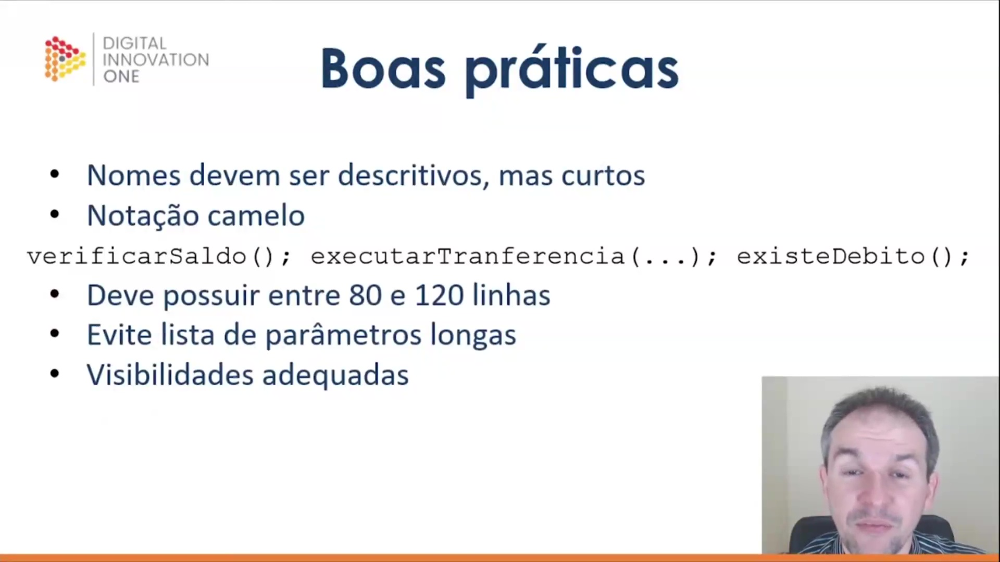
</p>

Para garantir a qualidade e a manutenção do código, devem-se seguir algumas **boas práticas** na criação de métodos:

* **Nomes descritivos e curtos:** Use verbos e substantivos que expressem a finalidade do método, evitando artigos e preposições.
* **Notação Camelo (camelCase):** A primeira letra da primeira palavra é minúscula, e as primeiras letras das palavras subsequentes são maiúsculas (ex: `verificarSaldo()`).
* **Tamanho ideal:** Recomenda-se que métodos possuam entre **80 e 120 linhas**. Caso fiquem muito extensos, devem ser divididos em métodos auxiliares.
* **Lista de parâmetros curta:** Evite métodos com muitos parâmetros para reduzir o acoplamento.
* **Visibilidades adequadas:** Utilize modificadores de acesso (como público ou privado) conforme a real necessidade de exposição do método.      


### 🟩 Vídeo 05 - Apresentação do exercício

<video width="60%" controls>
  <source src="000-Midia_e_Anexos/bootcamp_tqi_fullstack-modulo.06-curso.03-video_05.webm" type="video/webm">
    Seu navegador não suporta vídeo HTML5.
</video>

link do vídeo: https://web.dio.me/track/tqi-fullstack-developer/course/entendendo-metodos-java/learning/ee23f1ff-2afa-4f7f-8a3b-0939125c0052?autoplay=1

Esta aula propõe uma atividade prática focada no desenvolvimento e na organização de métodos para fortalecer a lógica de programação e a reutilização de código. O desafio consiste em criar uma aplicação que execute quatro operações matemáticas básicas com dois valores, emita saudações personalizadas (bom dia, boa tarde ou boa noite) com base no horário informado e realize o cálculo do valor final de um empréstimo, permitindo a definição arbitrária de taxas e parcelas. O vídeo enfatiza a importância de decompor problemas complexos em pequenos métodos que podem trabalhar de forma independente ou em conjunto — inclusive sendo passados como parâmetros uns para os outros — com o objetivo de evitar códigos extensos, facilitar a manutenção e promover o reaproveitamento de funções.

### Anotações

<p align="center">
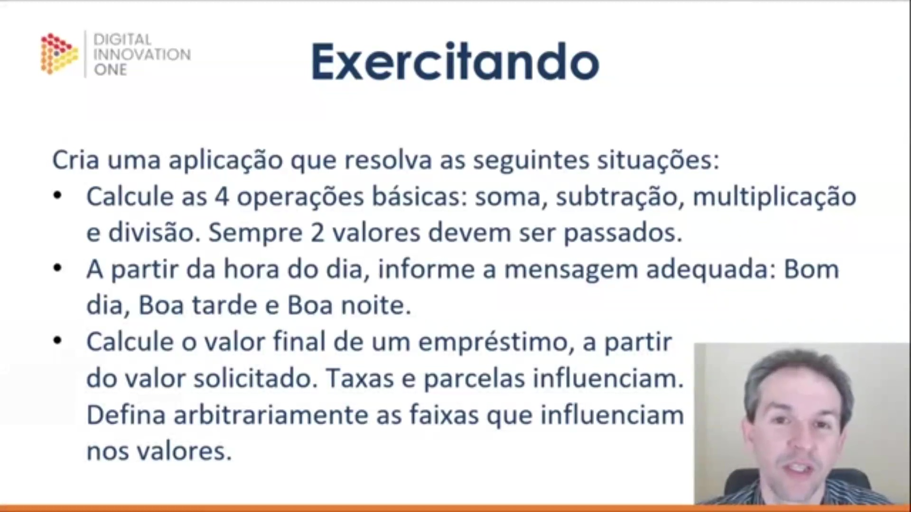
</p>

Nesta etapa prática, o desafio consiste em desenvolver uma aplicação que gerencie três cenários comuns de lógica de programação:

* **Operações Matemáticas**: Implementação de um calculador para as quatro operações básicas (soma, subtração, multiplicação e divisão). É obrigatória a passagem de dois valores como parâmetros para essas operações.
* **Mensagens de Saudação**: Criação de uma lógica que identifique o período do dia (manhã, tarde ou noite) com base na hora informada, retornando a saudação "Bom dia", "Boa tarde" ou "Boa noite".
* **Simulação de Empréstimo**: Desenvolvimento de um sistema para calcular o valor final de um empréstimo a partir do montante solicitado. O cálculo deve ser influenciado por taxas e pela quantidade de parcelas , com a liberdade de definir arbitrariamente as faixas que determinam esses valores.

<p align="center">
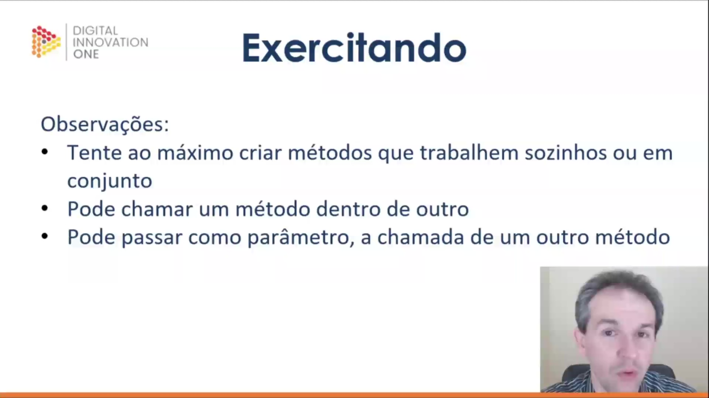
</p>

Para a resolução dos exercícios, é fundamental aplicar boas práticas de modularização e reutilização de código:

* **Modularização**: Deve-se buscar ao máximo a criação de métodos que executem tarefas de forma independente ou em conjunto.
* **Composição de Métodos**: É permitido e recomendável chamar um método dentro de outro para organizar a lógica do programa.
* **Parâmetros Dinâmicos**: É possível passar a chamada de um método como parâmetro para outro método, facilitando o fluxo de dados e o reaproveitamento de funções.


### 🟩 Vídeo 06 - Exercício prático

<video width="60%" controls>
  <source src="000-Midia_e_Anexos/bootcamp_tqi_fullstack-modulo.06-curso.03-video_06.webm" type="video/webm">
    Seu navegador não suporta vídeo HTML5.
</video>

link do vídeo: https://web.dio.me/track/tqi-fullstack-developer/course/entendendo-metodos-java/learning/c93b0388-6923-4bb1-986d-274f2cf990aa?autoplay=1

Este vídeo apresenta a resolução comentada de três exercícios práticos sobre a criação e aplicação de métodos na linguagem Java. Através de exemplos de uma calculadora, um sistema de saudações horárias e um simulador de empréstimos, o instrutor demonstra conceitos fundamentais como modificadores estáticos, passagem de parâmetros, tipos de retorno e a composição de métodos (um método chamando outro ou sendo passado como argumento).

### Anotações

Nesta etapa, é apresentada a implementação da classe `Calculadora`, cujo objetivo é exercitar a criação de métodos simples sem retorno (`void`). A classe define as quatro operações aritméticas básicas, onde cada método recebe dois parâmetros do tipo `double`, realiza o cálculo, armazena o resultado em uma variável temporária e o exibe no console.

O código foca na estrutura fundamental de um método: visibilidade (`public`), modificador (`static`), tipo de retorno (`void`), nome do método e parâmetros.

```java
package one.digitalinnovation.basecamp;

/**
 * Classe de exemplo para o exercício da Aula 1 de Métodos.
 */
public class Calculadora {

    // O professor define a visibilidade (public), o modificador (static) e o retorno (void - sem retorno)
    public static void soma(double numero1, double numero2) {
        // Recebe dois números como parâmetro, soma-os e armazena em uma variável temporária
        double resultado = numero1 + numero2;
        // Utiliza o System.out.println para mostrar o valor resultante da soma
        System.out.println("A soma de " + numero1 + " mais " + numero2 + " é " + resultado);
    }

    // Segue a mesma ideia: recebe dois parâmetros e executa a operação de subtração
    public static void subtracao(double numero1, double numero2) {
        double resultado = numero1 - numero2;
        // Armazena na variável temporária e exibe o resultado no console
        System.out.println("A subtracao de " + numero1 + " menos " + numero2 + " é " + resultado);
    }

    // Método definido para realizar a multiplicação entre os dois parâmetros recebidos
    public static void multiplicacao(double numero1, double numero2) {
        double resultado = numero1 * numero2;
        // Exibe o resultado da operação de multiplicação
        System.out.println("A multiplicação de " + numero1 + " vezes " + numero2 + " é " + resultado);
    }

    // Método chamado 'divisao', também public, static e void (sem retorno)
    public static void divisao(double numero1, double numero2) {
        double resultado = numero1 / numero2;
        // Divide os dois números passados e mostra o resultado de forma clara
        System.out.println("A divisão de " + numero1 + " por " + numero2 + " é " + resultado);
    }
}
```

A classe `Mensagem` demonstra a possibilidade de métodos trabalharem em conjunto, onde um método principal chama outros métodos auxiliares. O método `obterMensagem` utiliza uma estrutura de controle `switch` para avaliar a hora informada e decidir qual saudação disparar.

Em vez de imprimir o texto diretamente no `switch`, o código delega essa função para os métodos específicos `mensagemBomDia()`, `mensagemBoaTarde()` e `mensagemBoaNoite()`, exemplificando a modularização e a chamada de métodos internos.

```java
package one.digitalinnovation.basecamp;

// Definição da classe que gerencia mensagens de saudação baseadas no horário [cite: 139]
public class Mensagem {

    // Método principal da classe, novamente definido como public, static e void [cite: 146]
    public static void obterMensagem(int hora) {
        // Estrutura de controle para decidir qual saudação exibir baseada no parâmetro recebido [cite: 142]
        switch (hora) {
            case 5:
            case 6:
            case 7:
            case 8:
            case 9:
            case 10:
            case 11:
            case 12:
                // Demonstração de um método sendo chamado dentro de outro [cite: 153]
                mensagemBomDia();
                // Interrompe a execução do switch após encontrar o caso válido [cite: 142]
                break;
            case 13:
            case 14:
            case 15:
            case 16:
            case 17:
                // Chamada do método específico para o período da tarde [cite: 154]
                mensagemBoaTarde();
                break;
            case 18:
            case 19:
            case 20:
            case 21:
            case 22:
            case 23:
            case 0:
            case 1:
            case 2:
            case 3:
            case 4:
                // Chamada do método específico para o período da noite [cite: 154]
                mensagemBoaNoite();
                break;
            default:
                // Caso a hora passada não esteja nos intervalos acima, exibe mensagem de erro [cite: 158, 159]
                System.out.println("Hora inválida.");
                break;
        }
    }

    // Método simples com a finalidade única de exibir a saudação matinal [cite: 161]
    public static void mensagemBomDia() {
        System.out.println("Bom dia!");
    }

    // Método criado para exibir a saudação vespertina [cite: 161]
    public static void mensagemBoaTarde() {
        System.out.println("Bom tarde!");
    }

    // Método criado para exibir a saudação noturna [cite: 161]
    public static void mensagemBoaNoite() {
        System.out.println("Bom noite!");
    }
}
```

A classe `Emprestimo` aprofunda o conceito de interação entre métodos, introduzindo o uso de retornos. O método `calcular` recebe o valor solicitado e a quantidade de parcelas, utilizando métodos auxiliares como `getTaxaDuasParcelas()` para obter os valores necessários para o cálculo final.

O exemplo destaca que métodos podem retornar tipos de dados diferentes, como `int` para o número de parcelas e `double` para as taxas, e que esses retornos podem ser consumidos diretamente pela lógica de outros métodos.

```java
package one.digitalinnovation.basecamp;

// Classe criada para exemplificar cálculos de empréstimo com taxas e parcelas
public class Emprestimo {

    // Método que retorna um valor inteiro representando a opção de duas parcelas
    public static int getDuasParcelas() {
        // O comando return devolve o valor 2 para quem invocar este método
        return 2;
    }

    // Método que retorna a quantidade de três parcelas
    public static int getTresParcelas() {
        // Retorna o valor fixo 3
        return 3;
    }

    // Método que retorna um valor double representando a taxa de juros (30%)
    public static double getTaxaDuasParcelas() {
        // O retorno de dados será explorado com mais profundidade em aulas futuras
        return 0.3;
    }

    // Método que retorna a taxa de juros para o parcelamento em três vezes (45%)
    public static double getTaxaTresParcelas() {
        // Retorna o valor decimal correspondente à taxa
        return 0.45;
    }

    // Método principal de cálculo que recebe dois parâmetros de tipos diferentes
    public static void calcular(double valor, int parcelas) {
        // Verificação lógica: se a quantidade de parcelas informada for igual a 2
        if (parcelas == 2) {
            // Calcula o valor final somando o valor inicial ao juro obtido via método de taxa
            double valorFinal = valor + (valor * getTaxaDuasParcelas());
            // Exibe o resultado formatado para 2 parcelas no console
            System.out.println("Valor final do empréstimo para 2 parcelas: R$ " + valorFinal);
        // Verificação lógica: se a quantidade de parcelas informada for igual a 3
        } else if (parcelas == 3) {
            // Realiza o cálculo utilizando o retorno do método de taxa para 3 parcelas
            double valorFinal = valor + (valor * getTaxaTresParcelas());
            // Exibe o resultado formatado para 3 parcelas no console
            System.out.println("Valor final do empréstimo para 3 parcelas: R$ " + valorFinal);
        // Caso o usuário informe um número de parcelas diferente de 2 ou 3
        } else {
            // Exibe uma mensagem informando que a opção não é aceita pelo sistema
            System.out.println("Quantidade de parcelas não aceita.");
        }
    }
}
```

A classe `Main` atua como o ponto de entrada da aplicação, onde todos os métodos criados anteriormente são executados. Aqui é demonstrada a invocação de métodos estáticos diretamente a partir do nome da classe (ex: `Calculadora.soma(3, 6)`), o que é possível graças ao modificador `static`.

Também é ilustrada uma prática comum: passar a execução de um método como parâmetro para outro, como visto em `Emprestimo.calcular(1000, Emprestimo.getDuasParcelas())`. Neste caso, o valor retornado pelo método de parcelas é injetado diretamente como argumento no método de cálculo.

```java
package one.digitalinnovation.basecamp;

/**
 * Classe principal que executa e testa todos os métodos criados nos exercícios anteriores.
 */
public class Main {
    public static void main(String[] args) {
        
        // Início dos testes da classe Calculadora
        System.out.println("Exercício calculadora");
        // Chamada direta do método estático soma, passando dois valores double
        Calculadora.soma(3, 6);
        // Chamada do método de subtração; note que o ponto é usado para decimais em Java
        Calculadora.subtracao(9, 1.8);
        // Execução do método de multiplicação
        Calculadora.multiplicacao(7, 8);
        // Execução do método de divisão
        Calculadora.divisao(5, 2.5);

        // Início dos testes da classe Mensagem
        System.out.println("Exercício mensagem");
        // Passa o valor 9, que o switch da classe Mensagem identificará como 'Bom dia'
        Mensagem.obterMensagem(9);
        // Passa o valor 14, resultando na chamada do método mensagemBoaTarde()
        Mensagem.obterMensagem(14);
        // Passa o valor 1, resultando na chamada do método mensagemBoaNoite()
        Mensagem.obterMensagem(1);

        // Início dos testes da classe Empréstimo
        System.out.println("Exercício empréstimo");
        // Exemplo avançado: o resultado do método getDuasParcelas (valor 2) é passado como parâmetro
        Emprestimo.calcular(1000, Emprestimo.getDuasParcelas());
        // Aqui, o retorno do método getTresParcelas (valor 3) é usado para o cálculo
        Emprestimo.calcular(1000, Emprestimo.getTresParcelas());
        // Demonstração de que também é possível passar o valor fixo (5) diretamente
        Emprestimo.calcular(1000, 5);
    }
}
```      

## Parte 2 - Sobrecarga

### 🟩 Vídeo 07 - Como criar sobrecargas, usá-las e exercício prático

<video width="60%" controls>
  <source src="000-Midia_e_Anexos/bootcamp_tqi_fullstack-modulo.06-curso.03-video_07.webm" type="video/webm">
    Seu navegador não suporta vídeo HTML5.
</video>

link do vídeo: https://web.dio.me/track/tqi-fullstack-developer/course/entendendo-metodos-java/learning/af32c883-6ada-4fc8-bd49-480b007196a9?autoplay=1

A sobrecarga de métodos é um conceito fundamental que permite definir múltiplas versões de um mesmo método, preservando seu nome, mas alterando sua assinatura por meio da mudança na lista de parâmetros. Essa técnica possibilita que um método se comporte de forma diferente conforme o contexto, seja pela alteração dos tipos de dados, da quantidade ou até da ordem dos parâmetros recebidos. Exemplos práticos desse recurso são amplamente encontrados na API do Java, como nos métodos println e valueOf, que aceitam diversos tipos de entrada sob o mesmo comando. É importante distinguir a sobrecarga da sobrescrita, pois, enquanto a primeira foca na variação de parâmetros dentro da mesma estrutura, a segunda está vinculada ao conceito de herança na orientação a objetos. A aula demonstra que a sobrecarga é essencial para criar aplicações mais flexíveis e organizadas, como exemplificado no desenvolvimento de funções para o cálculo de áreas de diferentes quadriláteros.

### Anotações

<p align="center">
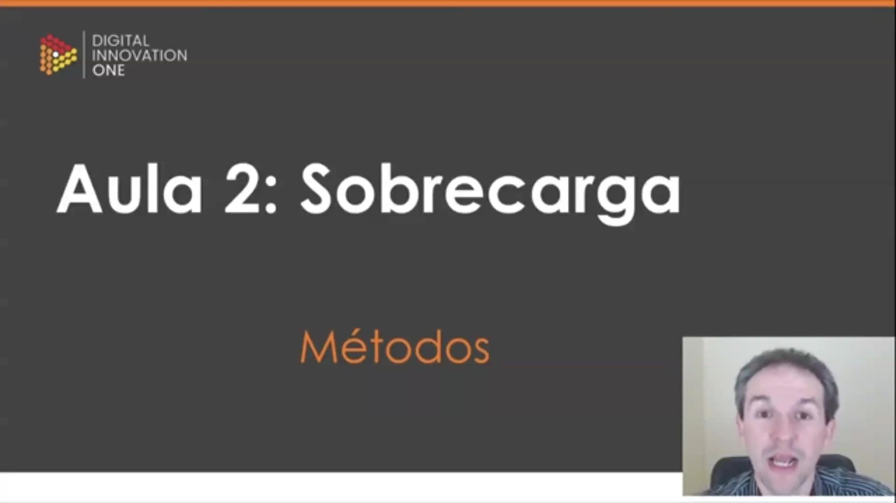
</p>

Esta aula introduz o conceito de **Sobrecarga**, focando em explicar o que é essa técnica aplicada a métodos e como ela funciona dentro do desenvolvimento de software.

<p align="center">
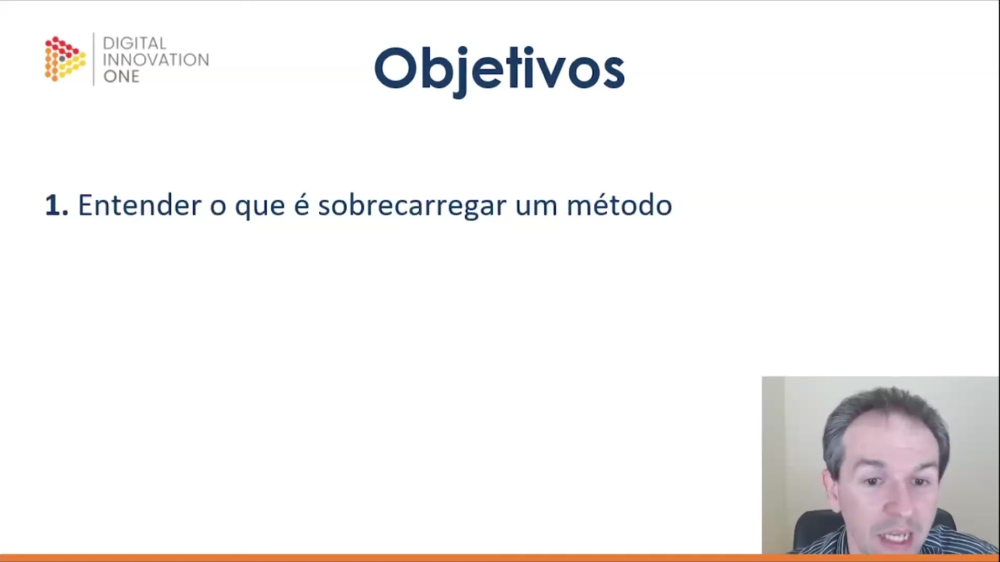
</p>

Os objetivos centrais desta unidade são:

1. **Entender** o que caracteriza a sobrecarga de um método.
2. **Saber criar** sobrecargas na prática durante a programação.

<p align="center">

</p>

A **Sobrecarga** é definida como a capacidade de definir métodos para diferentes contextos, mantendo o mesmo nome original. Isso permite que um método se comporte de maneiras distintas conforme a necessidade, contanto que sua lista de parâmetros seja alterada.

<p align="center">
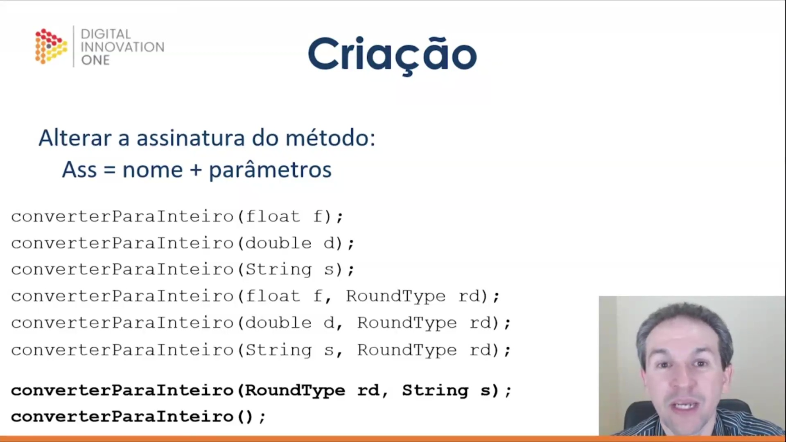
</p>

Para criar uma sobrecarga, é necessário alterar a **assinatura do método**, que é composta pelo **nome + parâmetros**. No exemplo abaixo, o método `converterParaInteiro` é sobrecarregado diversas vezes mudando o tipo, a quantidade ou a ordem dos parâmetros:

```java
// Assinatura = nome + parâmetros
converterParaInteiro (float f);
converterParaInteiro (double d);
converterParaInteiro (String s);
converterParaInteiro (float f, RoundType rd);
converterParaInteiro (double d, RoundType rd);
converterParaInteiro (String s, RoundType rd);
converterParaInteiro (RoundType rd, String s);
converterParaInteiro();

```

<p align="center">
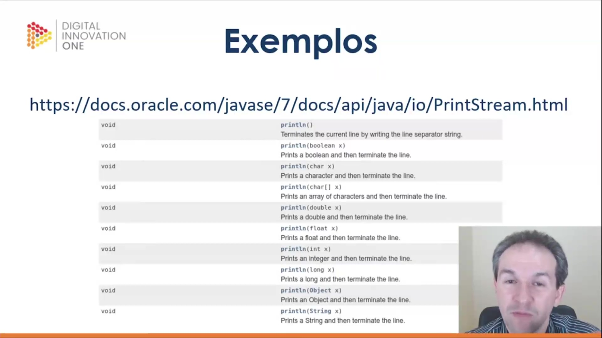
</p>

Um exemplo prático e comum de sobrecarga na API do Java é o método `println` da classe `PrintStream`. Ele permite imprimir diferentes tipos de dados usando o mesmo nome de método:

```java
void println()
void println(boolean x)
void println(char x)
void println(char[] x)
void println(double x)
void println(float x)
void println(int x)
void println(long x)
void println(Object x)
void println(String x)

```

<p align="center">
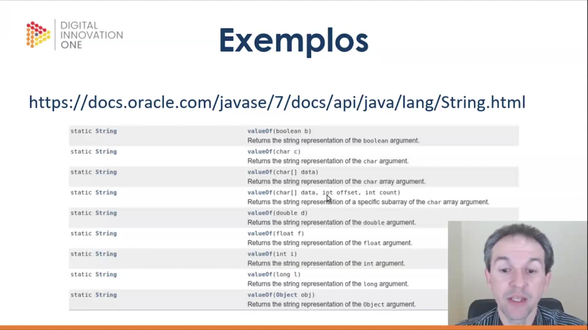
</p>

Outro exemplo fundamental é o método estático `valueOf` da classe `String`. Ele é utilizado para retornar a representação em texto de diversos tipos primitivos e objetos:

```java
static String valueOf(boolean b)
static String valueOf(char c)
static String valueOf(char[] data)
static String valueOf(char[] data, int offset, int count)
static String valueOf(double d)
static String valueOf(float f)
static String valueOf(int i)
static String valueOf(long l)
static String valueOf(Object obj)

```

<p align="center">
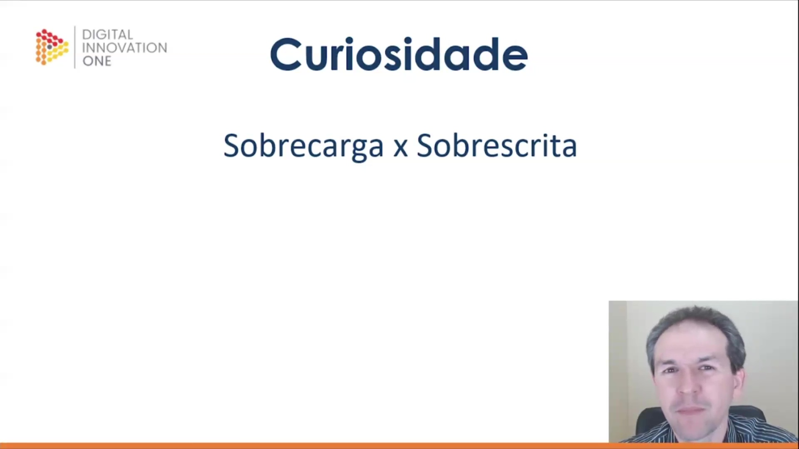
</p>

É importante distinguir **Sobrecarga** de **Sobrescrita**. Enquanto a sobrecarga foca em manter o nome e mudar os parâmetros no mesmo contexto, a sobrescrita é um conceito de Orientação a Objetos estritamente ligado à **herança**, que será explorado em cursos futuros.

<p align="center">
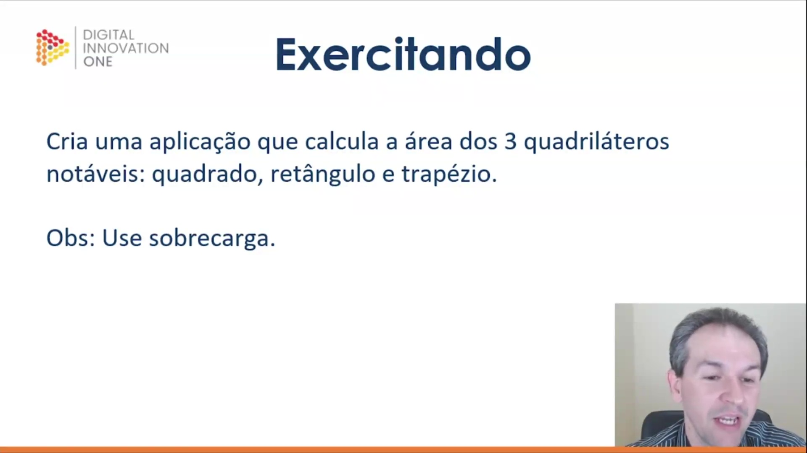
</p>

Para fixar o conteúdo, propõe-se o seguinte exercício:

* **Tarefa:** Criar uma aplicação que calcule a área de três quadriláteros notáveis: quadrado, retângulo e trapézio.
* **Observação:** É obrigatório o uso de **sobrecarga** para implementar os cálculos.      


### 🟩 Vídeo 08 - Resolução do exercício prático

<video width="60%" controls>
  <source src="000-Midia_e_Anexos/bootcamp_tqi_fullstack-modulo.06-curso.03-video_08.webm" type="video/webm">
    Seu navegador não suporta vídeo HTML5.
</video>

link do vídeo: https://web.dio.me/track/tqi-fullstack-developer/course/entendendo-metodos-java/learning/c080dbf5-b31b-4bf6-90e3-275fafa4a6af?autoplay=1

Esta aula aborda o conceito de sobrecarga de métodos em Java, utilizando como exemplo prático o cálculo da área de quadriláteros (quadrado, retângulo, trapézio e losango). O conteúdo demonstra que a sobrecarga permite que um único método, com o mesmo nome, execute diferentes comportamentos com base na sua assinatura, que é definida pela quantidade e pelos tipos de dados dos parâmetros fornecidos. O vídeo enfatiza que apenas alterar o nome das variáveis de entrada não é suficiente para caracterizar a sobrecarga; é necessário que haja uma variação real na lista de parâmetros para que a linguagem consiga identificar qual implementação deve ser executada, garantindo assim maior flexibilidade e organização ao código.

### Anotações

Nesta etapa, é apresentada a criação da classe `Quadrilatero`, focada no conceito de **sobrecarga de métodos**. A sobrecarga permite que um método mantenha o mesmo nome, desde que sua assinatura (nome + lista de parâmetros) seja alterada. No exemplo, o método `area` é definido com diferentes listas de parâmetros para calcular a área de figuras distintas:

* **Quadrado:** Recebe um único parâmetro (`double lado`).
* **Retângulo:** Recebe dois parâmetros (`double lado1, double lado2`).
* **Trapézio:** Recebe três parâmetros (`double baseMaior, double baseMenor, double altura`).
* **Losango:** Recebe dois parâmetros do tipo `float` (`float diagonal1, float diagonal2`).

A distinção entre a área do retângulo e do losango demonstra que a sobrecarga não depende apenas da quantidade, mas também dos **tipos de dados** dos parâmetros, permitindo que a linguagem Java identifique qual método executar com base nos argumentos fornecidos.

```java
// Define o pacote onde a classe está localizada [cite: 2]
package one.digitalinnovation.basecamp;

// Declaração da classe Quadrilatero 
public class Quadrilatero {

    // Método para calcular a área do quadrado: usa apenas um parâmetro (lado) [cite: 17]
    public static void area(double lado) {
        // Exibe o resultado da multiplicação do lado por ele mesmo [cite: 19]
        System.out.println("Área do quadrado:" + lado * lado);
    }

    // Sobrecarga do método area para retângulo: recebe dois parâmetros do tipo double 
    public static void area(double lado1, double lado2) {
        // Exibe o resultado da base vezes a altura (lado1 * lado2) [cite: 23]
        System.out.println("Área do retângulo:" + lado1 * lado2);
    }

    // Sobrecarga do método area para trapézio: recebe três parâmetros do tipo double [cite: 28]
    public static void area(double baseMaior, double baseMenor, double altura) {
        // Aplica a fórmula: ((Base Maior + Base Menor) * Altura) / 2 [cite: 31]
        System.out.println("Área do trapézio:" + ((baseMaior + baseMenor) * altura) / 2);
    }

    // Sobrecarga do método area para losango: usa dois parâmetros do tipo float para diferenciar do retângulo 
    public static void area(float diagonal1, float diagonal2) {
        // Exibe o resultado da multiplicação das diagonais dividido por dois [cite: 39]
        System.out.println("Área do losango:" + (diagonal1 * diagonal2) / 2);
    }
}
```

A classe `Main` demonstra a execução prática das sobrecargas definidas anteriormente. Ao chamar o método `Quadrilatero.area()`, o Java determina automaticamente qual implementação utilizar baseando-se nos valores passados:

* `area(3)`: Identifica o método para **quadrado** (um inteiro/double).
* `area(5d, 5d)`: Identifica o método para **retângulo** (dois doubles).
* `area(7, 8, 9)`: Identifica o método para **trapézio** (três parâmetros).
* `area(5f, 5f)`: Identifica o método para **losango**, pois os sufixos `f` especificam que os argumentos são do tipo `float`, diferenciando esta chamada da do retângulo.

```java
// Define o pacote ao qual esta classe pertence 
package one.digitalinnovation.basecamp;

// Declaração da classe principal para execução do programa 
public class Main {

    // Método principal (ponto de entrada) do sistema 
    public static void main(String[] args) {
        
        // Comentário indicando o início do bloco de exercícios sobre Quadriláteros 
        // Quadrilátero
        
        // Exibe uma mensagem de cabeçalho no console 
        System.out.println("Exercício quadrilátero");
        
        // Chama a área do Quadrado: identifica pelo único parâmetro (3) 
        Quadrilatero.area(3);
        
        // Chama a área do Retângulo: utiliza '5d' para especificar o tipo Double explicitamente 
        Quadrilatero.area(5d, 5d);
        
        // Chama a área do Trapézio: identifica pelos três argumentos fornecidos 
        Quadrilatero.area(7, 8, 9);
        
        // Chama a área do Losango: utiliza '5f' para garantir que os parâmetros sejam lidos como Float 
        Quadrilatero.area(5f, 5f);
    }
}
```      

## Parte 3 - Retornos

### 🟩 Vídeo 09 - Funcionamento, considerações, uso de retornos e apresentação do exercício

<video width="60%" controls>
  <source src="000-Midia_e_Anexos/bootcamp_tqi_fullstack-modulo.06-curso.03-video_09.webm" type="video/webm">
    Seu navegador não suporta vídeo HTML5.
</video>

link do vídeo: https://web.dio.me/track/tqi-fullstack-developer/course/entendendo-metodos-java/learning/3fe282bb-81e7-4275-a963-389e1b09ad53?autoplay=1

A aula aborda o funcionamento da instrução return em métodos, caracterizando-a como uma estrutura de interrupção capaz de finalizar a execução de um bloco de código de forma abrupta ou ao término das instruções. O conteúdo destaca que o retorno deve ser estritamente compatível com o tipo de dado definido na assinatura do método — seja ele um tipo primitivo ou um objeto — e explica que, em métodos do tipo void, o uso do return é opcional e serve apenas para encerrar o fluxo precocemente, sem retornar valores. Por fim, a aula propõe um exercício prático de refatoração, evoluindo uma aplicação de cálculo de áreas de quadriláteros para que os métodos deixem de apenas exibir resultados no console e passem a retornar valores processados.

### Anotações

<p align="center">
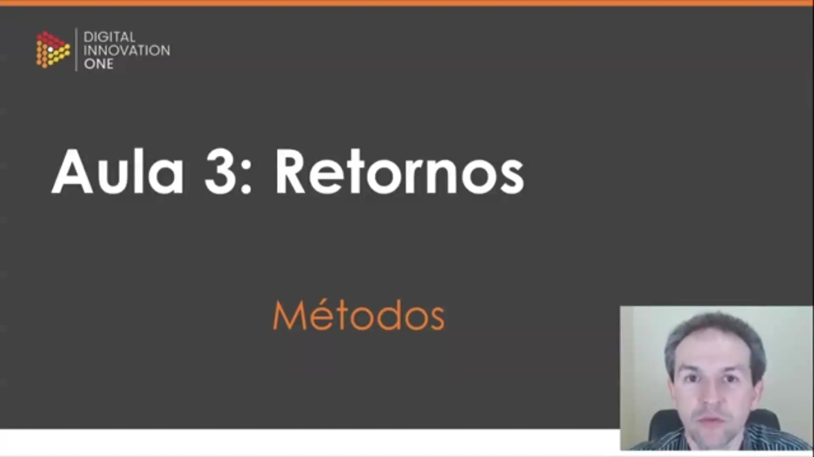
</p>

Esta aula aborda o conceito de **retornos** dentro do contexto de métodos em Java. O objetivo principal é compreender como o mecanismo de retorno funciona para finalizar a execução de um método e devolver, ou não, um valor ao chamador.

<p align="center">
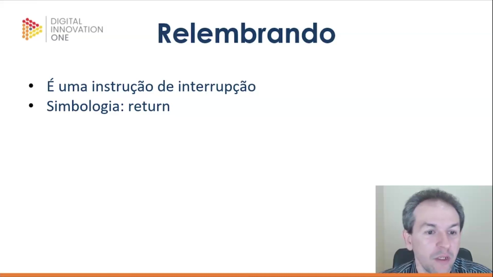
</p>

### Relembrando: Instrução de Interrupção

O retorno é classificado como uma **instrução de interrupção**, assim como o `break` e o `continue`. No entanto, enquanto os outros dois são comumente aplicados a estruturas de repetição (laços), o `return` é estritamente atrelado à execução de métodos. A simbologia utilizada na linguagem é a palavra reservada `return`.

<p align="center">
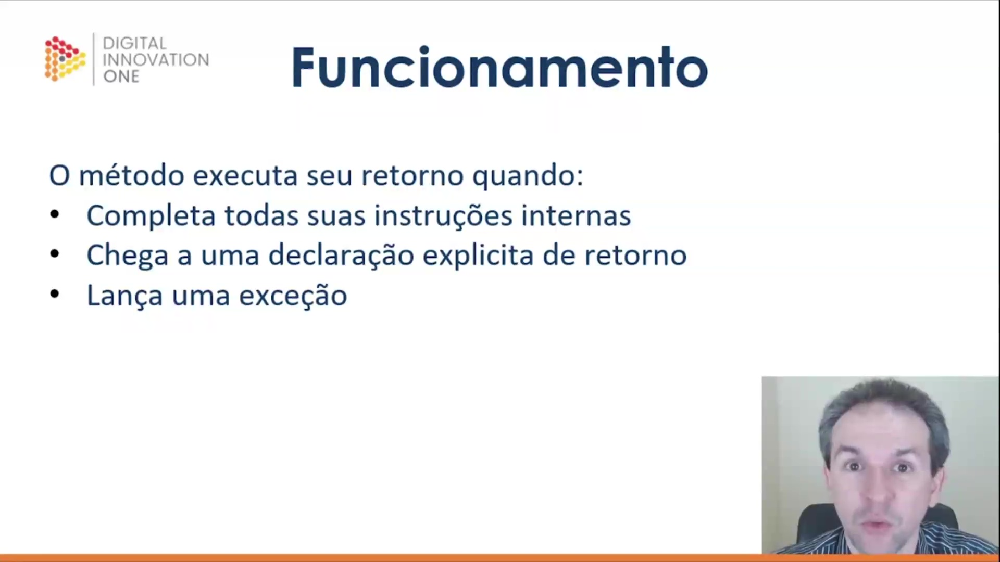
</p>

### Funcionamento

Um método executa seu retorno e finaliza sua operação quando ocorre uma das três situações abaixo:

* **Completa todas as suas instruções internas:** O fluxo de execução chega ao fim do bloco de código do método.
* **Chega a uma declaração explícita de retorno:** O interpretador encontra a palavra-chave `return`, interrompendo o método imediatamente.
* **Lança uma exceção:** Ocorre um erro durante a execução que força a interrupção do método.

<p align="center">
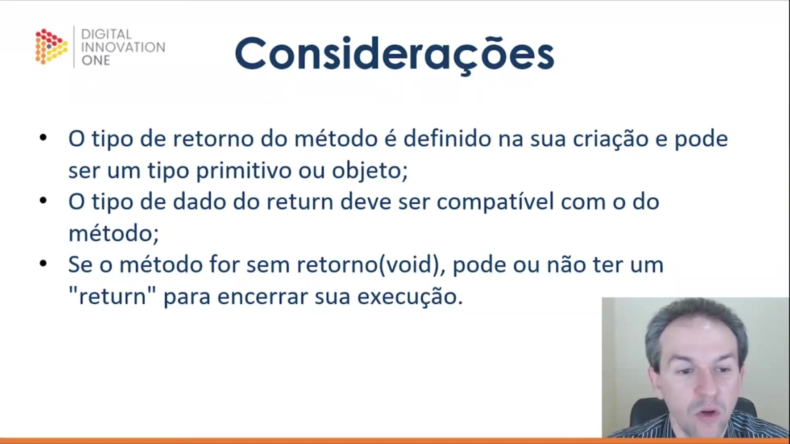
</p>

### Considerações Importantes

Ao trabalhar com retornos, deve-se observar as seguintes regras:

* **Definição do Tipo:** O tipo de retorno é definido na assinatura do método durante sua criação, podendo ser um tipo primitivo (como `int` ou `double`) ou um objeto.
* **Compatibilidade:** O valor retornado pela instrução `return` deve ser obrigatoriamente compatível com o tipo de dado declarado na assinatura do método.
* **Métodos Void:** Se um método é declarado como `void` (sem retorno), o uso da instrução `return` é opcional e serve apenas para encerrar a execução prematuramente, não devendo vir acompanhado de nenhum valor.

<p align="center">
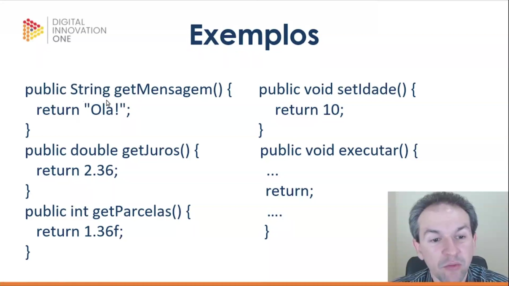
</p>

### Exemplos de Uso e Erros Comuns

Abaixo estão exemplos que demonstram retornos corretos e casos que geram erros de compilação devido à incompatibilidade de tipos:

```java
// Exemplo Correto: Retorno de String compatível
public String getMensagem() {
    return "Ola!";
}

// Exemplo Correto: Retorno de Double compatível
public double getJuros() {
    return 2.36;
}

// Exemplo de ERRO: O método espera int, mas retorna float (1.36f)
public int getParcelas() {
    return 1.36f; // Erro de compilação
}

// Exemplo de ERRO: O método é void (sem retorno), mas tenta retornar o valor 10
public void setIdade() {
    return 10; // Erro de compilação
}

// Exemplo Correto: Uso de return vazio em método void para interrupção
public void executar() {
    // ... instruções ...
    return; 
}

```

<p align="center">
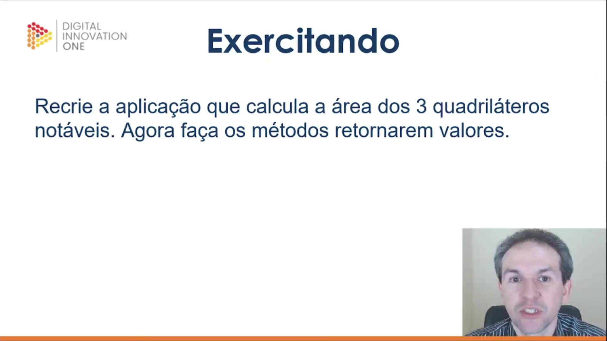
</p>

### Exercitando

Como proposta prática, deve-se evoluir a aplicação de cálculo de área dos três quadriláteros notáveis (quadrado, retângulo e trapézio). O objetivo é refatorar os métodos para que, em vez de apenas exibirem o resultado no console, eles **retornem** os valores calculados em tipos compatíveis com os parâmetros recebidos.      

### 🟩 Vídeo 10 - Resolução do exercício

<video width="60%" controls>
  <source src="000-Midia_e_Anexos/bootcamp_tqi_fullstack-modulo.06-curso.03-video_10.webm" type="video/webm">
    Seu navegador não suporta vídeo HTML5.
</video>

link do vídeo: https://web.dio.me/track/tqi-fullstack-developer/course/entendendo-metodos-java/learning/7304b268-50f9-45de-8cfb-6084ebd028fd?autoplay=1

Esta aula aborda a transição do uso de métodos void para métodos com retorno em Java, utilizando como exemplo prático o cálculo de áreas de quadriláteros. O conteúdo demonstra como a instrução return permite que os valores calculados sejam devolvidos ao chamador e armazenados em variáveis para uso posterior, separando a lógica de processamento da exibição de resultados. Além da implementação técnica de métodos com retorno do tipo double, a aula reforça conceitos fundamentais como a obrigatoriedade da compatibilidade entre o tipo de dado retornado e o definido na assinatura do método, e a possibilidade de utilizar o return em métodos void como uma instrução de interrupção de fluxo.

### Anotações

Nesta etapa, analisamos a implementação da classe `Quadrilatero`, que exemplifica a aplicação de retornos em métodos sobrecarregados. Diferente de versões anteriores onde os métodos eram `void` e exibiam os resultados diretamente no console, aqui eles são definidos para retornar um valor do tipo `double`.

O uso da palavra reservada `return` atua como uma instrução de interrupção que finaliza a execução do método e envia o valor calculado (seja a área do quadrado, retângulo ou trapézio) de volta para quem o chamou. Além disso, o exemplo demonstra que:

* **Métodos `void` e `return**`: É possível utilizar o `return` em métodos `void` (como no método `xpto`) para interromper a execução prematuramente, embora sem retornar um valor.
* **Compatibilidade de Tipos**: O valor retornado deve ser estritamente compatível com o tipo definido na assinatura do método. No método `abc`, por exemplo, há um erro proposital onde se tenta retornar um `double` (1.6) em um método declarado como `long`, o que causaria erro de compilação.


```java
package one.digitalinnovation.basecamp;

/**
 * Classe de exemplo para o exercício da Aula 3 de Métodos.
 * O objetivo é demonstrar como substituir métodos 'void' por métodos com retorno.
 */
public class Quadrilatero {

    // Método que calcula a área do quadrado.
    // O tipo 'double' indica que o método deve devolver um valor numérico ao final da execução.
    public static double area(double lado) {
        return lado * lado; // A instrução 'return' interrompe o método e retorna o resultado.
    }

    // Sobrecarga para cálculo da área do retângulo.
    public static double area(double lado1, double lado2) {
        return lado1 * lado2;
    }

    // Sobrecarga para cálculo da área do trapézio.
    public static double area(double baseMaior, double baseMenor, double altura) {
        return ((baseMaior + baseMenor) * altura) / 2;
    }

    /**
     * Exemplo de uso do 'return' em método 'void'.
     * Embora não retorne valor, o 'return' aqui serve como uma instrução de interrupção.
     */
    public static void xpto() {
        System.out.println("Antes");
        return; // O que estivesse abaixo deste comando não seria executado.
    }

    /**
     * Exemplo de compatibilidade de tipos.
     * O valor retornado (1.6) deve ser compatível com o tipo declarado na assinatura (double).
     */
    public static double abc() {
        // Se este método fosse declarado como 'long', o retorno de '1.6' (double) causaria erro.
        return 1.6;
    }
}
```

A classe `Main` demonstra como utilizar os métodos que possuem retorno. A principal mudança em relação aos exercícios de sobrecarga anteriores é a capacidade de armazenar os resultados das operações em variáveis locais (como `areaQuadrado`, `areaRetangulo` e `areaTrapezio`) antes de exibi-los.

Dessa forma, a responsabilidade de exibir a mensagem de saída é transferida dos métodos de cálculo para a classe de teste. Isso permite que os valores calculados sejam reutilizados em outros pontos do programa, aumentando a flexibilidade do código.

```java
package one.digitalinnovation.basecamp;

public class Main {
    public static void main(String[] args) {

        // Retornos
        System.out.println("Exercício retornos");

        double areaQuadrado = Quadrilatero.area(3);
        System.out.println("Área do quadrado:" + areaQuadrado);

        double areaRetangulo = Quadrilatero.area(5, 5);
        System.out.println("Área do retângulo:" + areaRetangulo);

        double areaTrapezio = Quadrilatero.area(7, 8, 9);
        System.out.println("Área do trapézio:" + areaTrapezio);
    }
}

```      

### 🟩 Vídeo 11 - Encerramento do curso

<video width="60%" controls>
  <source src="000-Midia_e_Anexos/bootcamp_tqi_fullstack-modulo.06-curso.03-video_11.webm" type="video/webm">
    Seu navegador não suporta vídeo HTML5.
</video>

link do vídeo: https://web.dio.me/track/tqi-fullstack-developer/course/entendendo-metodos-java/learning/456a3eac-f35b-48a8-a750-4d32004e9a56?autoplay=1

Este curso sobre métodos e programação orientada a objetos oferece uma base sólida fundamentada em documentações oficiais da Oracle e na literatura especializada do autor, abordando desde conceitos essenciais, como argumentos e retornos, até a aplicação prática no desenvolvimento de software. Para aprofundar o aprendizado, os alunos contam com o suporte de uma comunidade ativa via Discord para discussões amplas, além de um fórum específico para a resolução de dúvidas pontuais com o instrutor e outros estudantes. O encerramento das aulas incentiva a exploração de materiais complementares, como o livro do instrutor sobre orientação a objetos, garantindo que o conhecimento adquirido possa ser expandido para todo o universo da programação.

### Anotações

<p align="center">
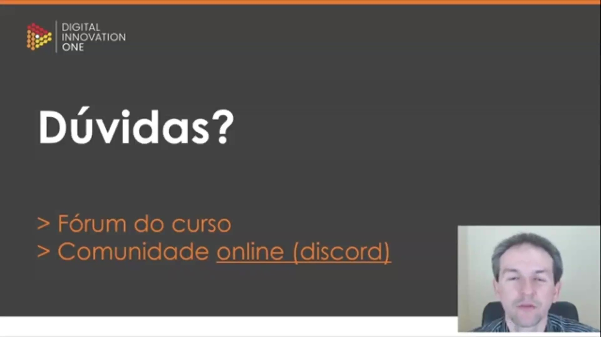
</p>

Ao concluir o estudo sobre métodos, é fundamental saber onde buscar suporte para sanar dúvidas remanescentes. Existem canais oficiais destinados à interação e resolução de problemas técnicos específicos:

* **Fórum do curso:** Espaço dedicado exclusivamente ao curso de métodos, onde o instrutor e a comunidade de alunos (atuais e ex-alunos) colaboram para resolver questões pontuais.
* **Comunidade Online (Discord):** Ambiente voltado para dúvidas mais amplas e discussões gerais, permitindo o contato com um número maior de pessoas para auxílio.

<p align="center">
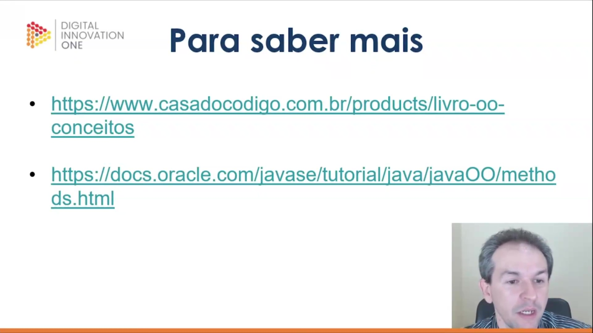
</p>

Para aprofundar os conhecimentos que serviram de base para a elaboração deste curso, recomenda-se a consulta às fontes de referência e documentação oficial:

* **Livro sobre Orientação a Objetos:** Obra do autor publicada pela Casa do Código, que detalha conceitos de métodos e todo o universo da programação orientada a objetos.
* **Documentação Oracle (Java Tutorials):** Links oficiais que serviram de base para o conteúdo, abordando o que é um método, o funcionamento de retornos e o uso de argumentos/parâmetros.      

Links:

- https://www.casadocodigo.com.br/products/livro-oo-conceitos
- https://docs.oracle.com/javase/tutorial/java/javaOO/methods.html

# Certificado: Entendendo Métodos Java

- Link na plataforma: https://hermes.dio.me/certificates/N9ZC4NGD.pdf
- Certificado em pdf: [Certificado-Entendendo_Metodos_Java.pdf](000-Midia_e_Anexos/Certificado-Entendendo_Metodos_Java.pdf)
