## Instrutor

- Thiago Leite e Carvalho (Senior Java Developer and Software Engineer | Java Tech Lead | University Professor | Writer | Speaker | Instructor)
- Contato Linkedin: / [thiago-leite-e-carvalho-1b337b127](https://www.linkedin.com/in/thiago-leite-e-carvalho-1b337b127/)
- Códigos de exemplo da aula neste link: https://github.com/tlcdio

## Parte 1 - Operadores Relacionais

### 🟩 Vídeo 01 - Apresentação do curso

<video width="60%" controls>
  <source src="000-Midia_e_Anexos/bootcamp_tqi_fullstack-modulo.06-curso.04-video_01.webm" type="video/webm">
    Seu navegador não suporta vídeo HTML5.
</video>

link do vídeo: https://web.dio.me/track/tqi-fullstack-developer/course/logica-condicional-e-controle-de-fluxos-em-java/learning/b5616a08-8f2f-4da0-bf9c-0fe384be2b42?autoplay=1 

Nesta aula introdutória, o instrutor Tiago Leite, desenvolvedor back-end com 17 anos de experiência e mestre em engenharia de software, apresenta o curso focado em operadores lógicos e relacionais, controle de fluxo e blocos utilizando a linguagem Java 11. O treinamento está estruturado em quatro módulos principais projetados para capacitar o aluno no domínio da lógica de execução e organização de código, utilizando a IDE IntelliJ como ferramenta base para os exemplos práticos. Além de compartilhar sua trajetória profissional no SERPRO e sua experiência acadêmica, o instrutor estabelece como pré-requisitos o conhecimento prévio em lógica de programação e familiaridade básica com Java, orientando os estudantes sobre o uso de canais de suporte como o fórum da plataforma e a comunidade no Discord para otimizar o aprendizado técnico.

### Anotações

<p align="center">
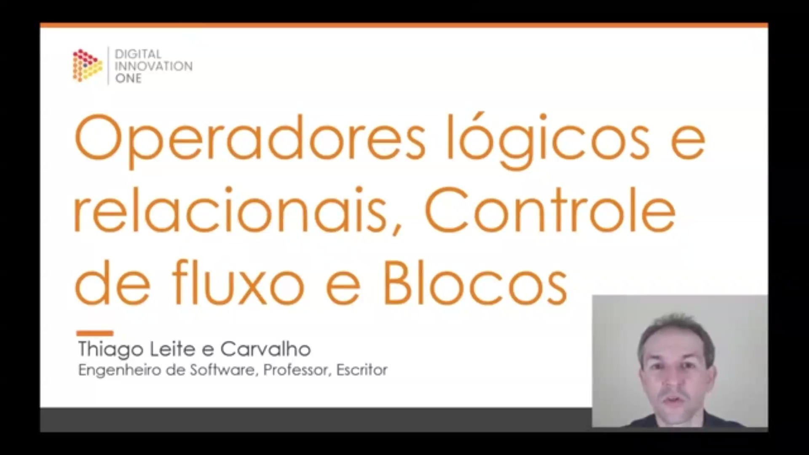
</p>

Bem-vindo ao curso de **Operadores Lógicos e Relacionais, Controle de Fluxo e Blocos**. O foco deste treinamento é explorar esses conceitos fundamentais da programação utilizando a linguagem **Java**.

O curso é ministrado por **Thiago Leite e Carvalho**, Engenheiro de Software, professor e escritor, que guiará o aprendizado através dos conceitos essenciais para o desenvolvimento backend e a estruturação lógica de algoritmos.

<p align="center">
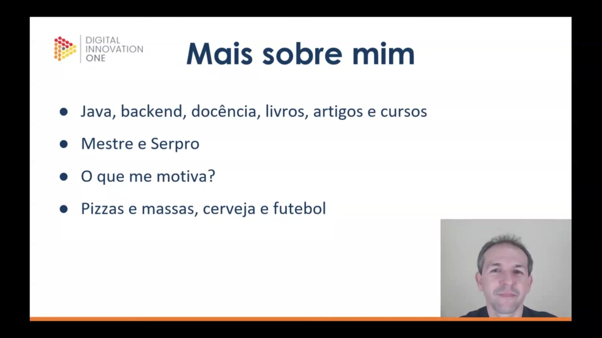
</p>

Para contextualizar a experiência do instrutor, Thiago atua como **Java Backend Developer** há 17 anos, sendo responsável por camadas de persistência, regras de negócio, modelagem de objetos e criação de APIs. Além da experiência técnica, possui um histórico acadêmico robusto:

* **Experiência Docente:** Ministrou aulas por 9 anos em disciplinas como Estrutura de Dados e Engenharia de Software.
* **Produção de Conteúdo:** Atualmente dedica-se à escrita de livros, artigos e criação de cursos.
* **Formação e Atuação:** Possui mestrado em Engenharia de Software e atua no **Serpro** (empresa de tecnologia do governo federal), desenvolvendo soluções para interação entre cidadãos e governo.
* **Interesses Pessoais:** Fora do ambiente profissional, o instrutor destaca seus hobbies como culinária (especialmente massas e pizzas), degustação e produção de cervejas artesanais, e futebol.

<p align="center">
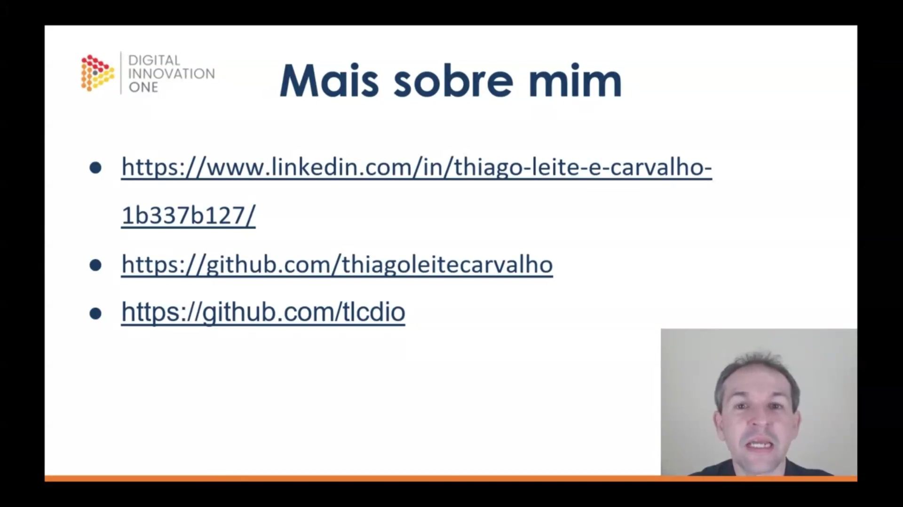
</p>

Durante o curso, diversos materiais e exemplos serão utilizados. Para acompanhar o trabalho do instrutor, acessar atualizações de conteúdo, artigos técnicos e os repositórios de código dos projetos, você pode utilizar os seguintes canais apresentados:

* **LinkedIn:** Para acompanhar a trajetória profissional, publicações sobre livros e artigos, além de conteúdo descontraído sobre a rotina de desenvolvimento.
* **GitHub (Pessoal e Educacional):** Onde encontram-se componentes open source, projetos de artigos e, especificamente para este curso, os exemplos práticos que serão desenvolvidos.

**Links de referência:**

* `https://www.linkedin.com/in/thiago-leite-e-carvalho-1b337b127/`
* `https://github.com/thiagoleitecarvalho`
* `https://github.com/tlcdio` (Perfil dedicado aos cursos da DIO)

<p align="center">
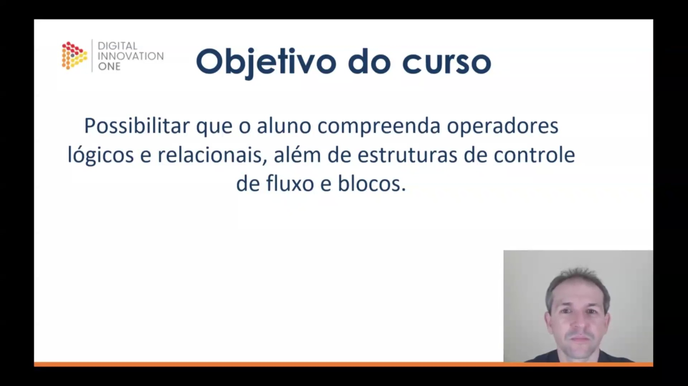
</p>

O objetivo central deste treinamento é capacitar o aluno a entender e aplicar corretamente os seguintes fundamentos na linguagem Java:

1. **Operadores Lógicos e Relacionais:** Ferramentas essenciais para a tomada de decisões e comparações dentro do código.
2. **Estruturas de Controle de Fluxo:** Mecanismos que definem a ordem de execução das instruções no programa.
3. **Blocos:** Compreensão do escopo e agrupamento de códigos.

A meta é apresentar novos tipos de operadores e ensinar como controlar a execução do programa de forma eficiente.

<p align="center">
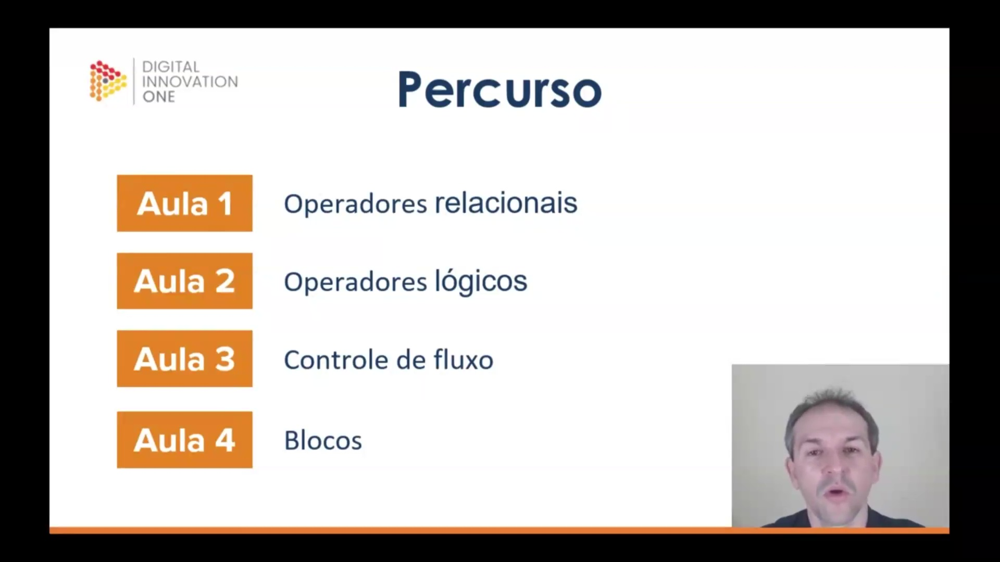
</p>

Para cobrir o conteúdo proposto, o curso foi estruturado em um percurso didático dividido em quatro aulas principais. Ao final desta trilha, espera-se que o aluno tenha domínio sobre os conceitos apresentados:

* **Aula 1:** Operadores relacionais
* **Aula 2:** Operadores lógicos
* **Aula 3:** Controle de fluxo
* **Aula 4:** Blocos

<p align="center">
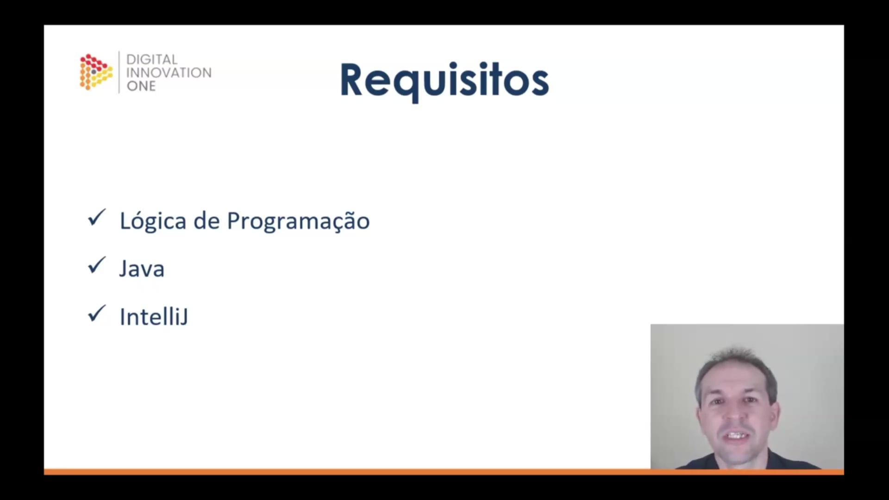
</p>

Para garantir um bom aproveitamento e absorver o conteúdo com excelência, é necessário que o aluno atenda a alguns pré-requisitos técnicos antes de iniciar as aulas práticas:

* **Lógica de Programação:** Conhecimento prévio fundamental, seja adquirido através de cursos anteriores, livros ou estudos independentes.
* **Java:** Familiaridade com a linguagem, especificamente utilizando a versão 11.
* **IntelliJ:** O ambiente de desenvolvimento (IDE) que será utilizado para a construção dos projetos de exemplo.

Caso surjam dúvidas durante o percurso, o aluno é incentivado a usar o fórum do curso para questões específicas ou a comunidade no Discord para discussões mais amplas sobre tecnologia.      


### 🟩 Vídeo 02 - O que são Operadores Relacionais

<video width="60%" controls>
  <source src="000-Midia_e_Anexos/bootcamp_tqi_fullstack-modulo.06-curso.04-video_02.webm" type="video/webm">
    Seu navegador não suporta vídeo HTML5.
</video>

link do vídeo: https://web.dio.me/track/tqi-fullstack-developer/course/logica-condicional-e-controle-de-fluxos-em-java/learning/1b4108ec-ccd1-4a2d-905d-b78a83711f6c?autoplay=1

Esta aula apresenta os operadores relacionais como símbolos específicos voltados para a comparação entre operandos e a geração de um resultado correspondente. O vídeo detalha que esses operadores se dividem em duas categorias principais: os de similaridade, que tratam de igualdade e diferença, e os de tamanho, responsáveis por determinar grandezas como maior, menor ou suas variações. Além de estabelecer que tais operações exigem obrigatoriamente a presença de pelo menos dois operandos, o conteúdo enfatiza a existência de regras rigorosas para o uso desses símbolos, observando que nem todos os tipos de dados são compatíveis para certas comparações, como no caso de variáveis booleanas.

### Anotações

<p align="center">
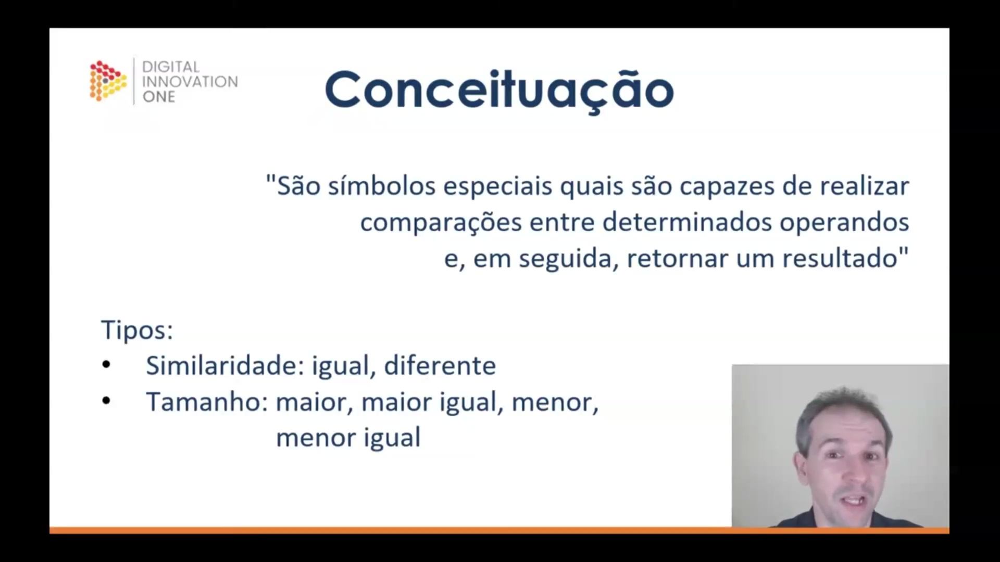
</p>

### Introdução aos Operadores Relacionais

Operadores relacionais são definidos como símbolos especiais capazes de realizar comparações entre determinados operandos e, consequentemente, retornar um resultado. Eles são fundamentais para estabelecer a lógica de decisão em algoritmos.

Tipos de Operadores 

Estes símbolos são classificados em duas categorias principais de acordo com a natureza da comparação:

* **Similaridade**: Utilizados para verificar se dois valores são iguais ou diferentes entre si.
* **Tamanho**: Utilizados para determinar a grandeza entre operandos, abrangendo as operações de maior, maior ou igual, menor e menor ou igual.

#### Regras de Aplicação e Contexto Didático

Para utilizar esses operadores corretamente, é necessário seguir diretrizes que garantam a validade lógica da operação:

* **Compatibilidade de Dados**: A comparação deve ocorrer entre operandos que possuam lógica relacional. Por exemplo, não se aplica operadores de grandeza (como "maior que") a tipos booleanos, pois não há hierarquia de tamanho entre verdadeiro e falso.
* **Comparação entre Tipos**: Embora o sistema permita comparar tipos de dados distintos em certas linguagens, existem regras rígidas sobre quais tipos são compatíveis para evitar erros de execução.
* **Número de Operandos**: Ao contrário dos operadores aritméticos, que podem ser unários em casos específicos, os operadores relacionais exigem sempre a presença de pelo menos dois operandos para estabelecer o vínculo de comparação.


### 🟩 Vídeo 03 - Utilizando Operadores Relacionais

<video width="60%" controls>
  <source src="000-Midia_e_Anexos/bootcamp_tqi_fullstack-modulo.06-curso.04-video_03.webm" type="video/webm">
    Seu navegador não suporta vídeo HTML5.
</video>

link do vídeo: https://web.dio.me/track/tqi-fullstack-developer/course/logica-condicional-e-controle-de-fluxos-em-java/learning/25395ff3-5975-478d-9ebc-9dbf4956f431?autoplay=1

Esta aula detalha o funcionamento dos operadores relacionais em Java, dividindo-os em categorias de similaridade e de grandeza. No âmbito da similaridade, o vídeo diferencia o operador de igualdade (==) do de diferença (!=), alertando para o erro comum de utilizar um único símbolo de igual, que em Java representa atribuição e não comparação. Em relação às grandezas, são apresentados os operadores de maior (>), maior ou igual (>=), menor (<) e menor ou igual (<=), explicando suas aplicações práticas para verificar a relação de valor entre dois operandos.

### Anotações

<p align="center">
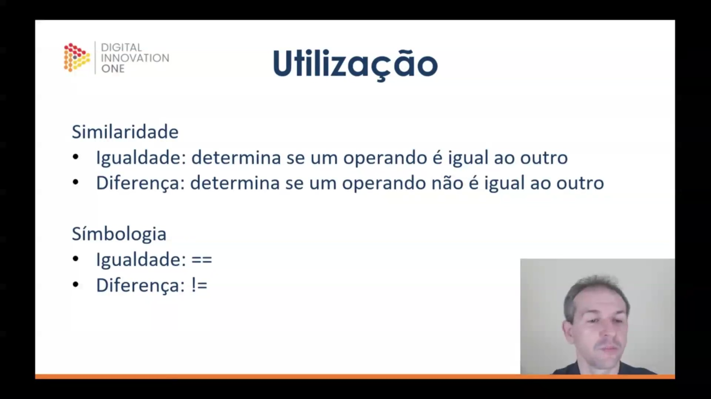
</p>

Os operadores relacionais de similaridade são utilizados para comparar dois operandos entre si, dividindo-se em dois tipos principais:

* **Igualdade:** Determina se um operando é exatamente igual ao outro. Em Java, a simbologia utilizada é o duplo sinal de igual `==`. É fundamental não confundir este operador com o sinal de igual único `=`, que é destinado à atribuição de valores; o uso incorreto de apenas um símbolo pode causar erros de execução.
* **Diferença:** Determina se um operando não é igual ao outro. A simbologia correspondente é representada pelo ponto de exclamação seguido do sinal de igual `!=`.

<p align="center">

</p>

No contexto de grandezas e tamanhos, os operadores relacionais permitem verificar a superioridade ou equivalência entre valores:

* **Maior:** Verifica se o operando posicionado à esquerda é maior do que o da direita, utilizando o símbolo `>`. Visualmente, a abertura do símbolo fica voltada para o operando maior.
* **Maior Igual:** Determina se o operando da esquerda é maior ou possui o mesmo valor que o operando da direita. A simbologia para esta operação em Java é `>=`.

<p align="center">
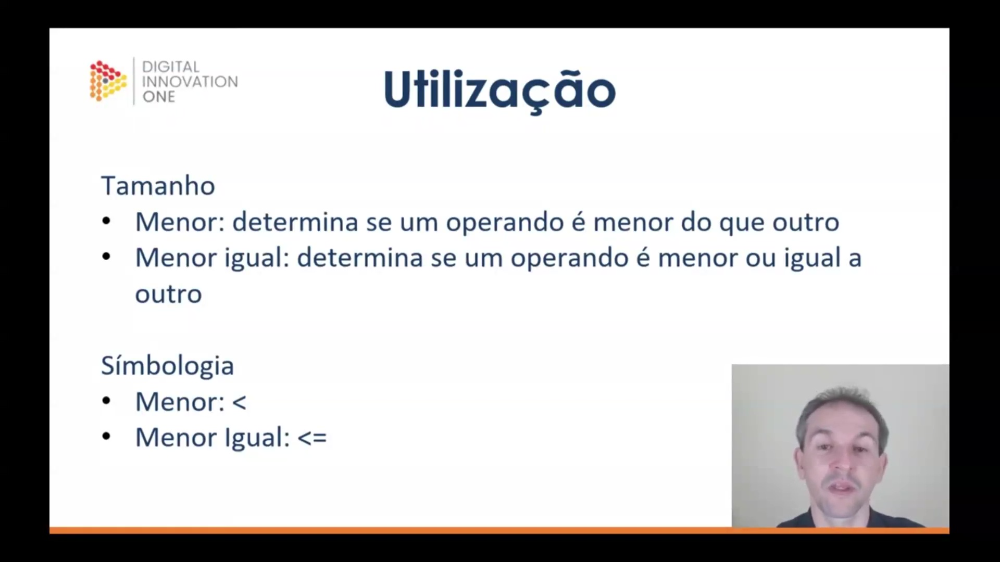
</p>

Complementando os operadores de tamanho, temos as funções para verificar valores inferiores:

* **Menor:** Utilizado para determinar se o operando da esquerda é menor do que o da direita, representado pelo símbolo `<`. Neste caso, a parte "fechada" do símbolo aponta para o operando da esquerda.
* **Menor Igual:** Verifica se o operando da esquerda é menor ou igual ao da direita. A simbologia aplicada é `<=`.      


### 🟩 Vídeo 04 - Exercício de exemplo

<video width="60%" controls>
  <source src="000-Midia_e_Anexos/bootcamp_tqi_fullstack-modulo.06-curso.04-video_04.webm" type="video/webm">
    Seu navegador não suporta vídeo HTML5.
</video>

link do vídeo: https://web.dio.me/track/tqi-fullstack-developer/course/logica-condicional-e-controle-de-fluxos-em-java/learning/b67ed1b2-4bcd-4323-8032-8ad477ac1832?autoplay=1

Esta aula aborda a aplicação de operadores relacionais de similaridade (igualdade e diferença) e tamanho (maior, menor ou igual) em diferentes tipos de dados, como inteiros, floats, caracteres, strings e booleanos. O conteúdo destaca que nem todos os operadores são compatíveis com todos os tipos de informação, demonstrando erros de compilação ao tentar realizar comparações de magnitude entre booleanos ou strings, bem como entre tipos incompatíveis como booleanos e inteiros. Em contrapartida, valida-se a possibilidade de comparar tipos numéricos distintos, como inteiros e floats. O vídeo propõe um exercício prático no ambiente IntelliJ para codificar essas variáveis, testar as limitações dos operadores e explorar novos cenários de comparação para consolidar o entendimento sobre as regras de tipagem e lógica de programação.

### Anotações

<p align="center">
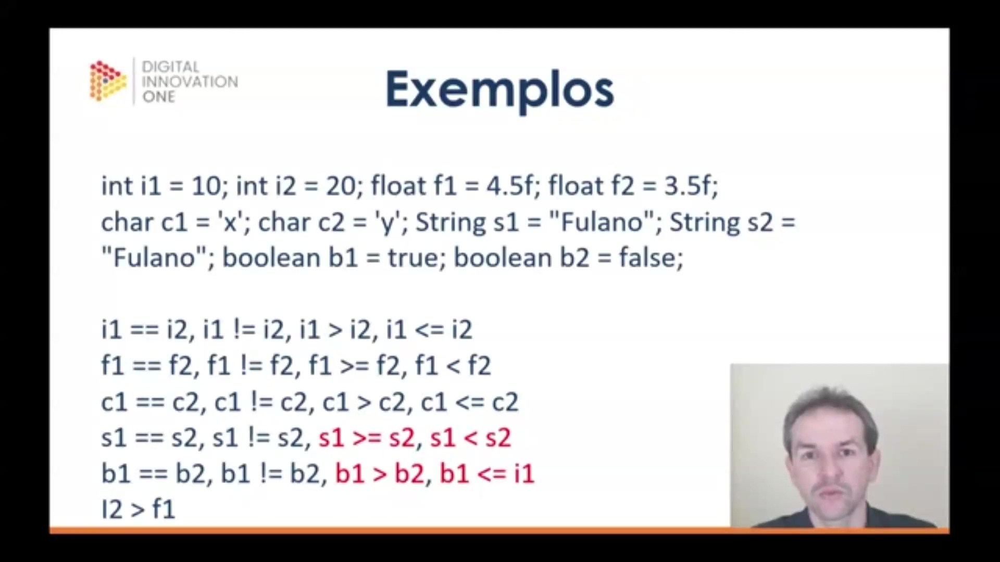
</p>

Nesta etapa, são apresentados exemplos práticos da aplicação de operadores relacionais de similaridade e tamanho em diferentes tipos de dados. Para realizar os testes, foram definidas variáveis dos tipos `int`, `float`, `char`, `String` e `boolean`.

As operações demonstram como os operadores de igualdade (), diferença (), maior que (), menor que () e suas variações se comportam dependendo do tipo de dado envolvido. É importante notar que nem todo operador relacional pode ser aplicado a qualquer tipo de dado. Por exemplo, tentar verificar se um valor booleano é maior que outro ou comparar um booleano com um número inteiro resultará em erros de compilação, pois essas operações não possuem lógica fundamental na linguagem. Da mesma forma, operadores de tamanho não são aplicáveis entre Strings. Por outro lado, a comparação entre tipos numéricos distintos, como um `int` e um `float`, é permitida e funcional.

```java
int i1 = 10; int i2 = 20;
float f1 = 4.5f; float f2 = 3.5f;
char c1 = 'x'; char c2 = 'y';
String s1 = "Fulano"; String s2 = "Fulano";
boolean b1 = true; boolean b2 = false;

i1 == i2; i1 != i2; i1 > i2; i1 <= i2;
f1 == f2; f1 != f2; f1 >= f2; f1 < f2;
c1 == c2; c1 != c2; c1 > c2; c1 <= c2;
s1 == s2; s1 != s2; s1 >= s2; s1 < s2;
b1 == b2; b1 != b2; b1 > b2; b1 <= i1;
12 > f1;

```

<p align="center">

</p>

A proposta de exercício foca na fixação dos conceitos de operadores e tipos de dados através da prática no ambiente de desenvolvimento IntelliJ. O objetivo é reproduzir as comparações discutidas para observar diretamente quais geram erros de compilação e quais são executadas com sucesso.

Além de codificar os exemplos já vistos, deve-se expandir o projeto criando novas variáveis com tipos de dados que ainda não foram apresentados. Essa exploração permite testar diversas combinações de operadores e tipos, consolidando o entendimento sobre as restrições e possibilidades das comparações em Java.

Seria útil se eu gerasse uma lista de outros tipos de dados primitivos em Java para você incluir no seu exercício?      


### 🟩 Vídeo 05 - Resolução do exercício

<video width="60%" controls>
  <source src="000-Midia_e_Anexos/bootcamp_tqi_fullstack-modulo.06-curso.04-video_05.webm" type="video/webm">
    Seu navegador não suporta vídeo HTML5.
</video>

link do vídeo: https://web.dio.me/track/tqi-fullstack-developer/course/logica-condicional-e-controle-de-fluxos-em-java/learning/682f9e6c-593f-4878-b45a-e3b41a04a935?autoplay=1

Este vídeo apresenta a resolução do primeiro exercício prático sobre operadores relacionais, explorando a aplicação de comparadores de similaridade (igual e diferente) e de tamanho (maior, menor ou igual) em diversos tipos de dados, como inteiros, floats, chars, strings e booleanos. A aula destaca as restrições técnicas da linguagem, demonstrando que operadores de tamanho não podem ser aplicados a strings ou booleanos, e que tipos incompatíveis, como strings e números, geram erros de compilação. Por outro lado, o vídeo esclarece que é possível realizar comparações entre diferentes tipos numéricos (como long, short e double) e entre caracteres, dado que estes últimos são processados como códigos numéricos em baixo nível. Por fim, o instrutor faz uma ressalva importante sobre o uso de operadores de igualdade em objetos e classes, como no caso das strings, antecipando que cuidados adicionais serão abordados futuramente em tópicos de orientação a objetos.

### Anotações

Esta aula foca na resolução de exercícios práticos sobre **operadores relacionais** em Java. Para expandir as possibilidades de comparação além dos slides teóricos, foram instanciadas variáveis de diversos tipos primitivos e de referência, como `int`, `float`, `double`, `char`, `String`, `boolean`, `long`, `byte` e `short`.

O primeiro bloco de execução foca em comparações de similaridade (igual e diferente) e de tamanho (maior, menor ou igual) utilizando variáveis inteiras. Por exemplo, ao comparar `i1` (10) e `i2` (20), o operador de igualdade (`==`) retorna `false`, enquanto o de diferença (`!=`) retorna `true`.

Um ponto crítico abordado é que nem todos os operadores podem ser aplicados a todos os tipos de dados. Enquanto operadores de similaridade funcionam com `String`, operadores de tamanho (como `> ` ou `<=`) resultam em erro de compilação quando aplicados a textos. Da mesma forma, tipos booleanos não suportam comparações de grandeza, pois não existe lógica em definir se `true` é maior que `false`.

A imagem também demonstra que é possível comparar tipos numéricos diferentes entre si, como um `double` e um `short`, ou um `long` e um `int`, pois ambos compartilham a natureza numérica. Por fim, destaca-se a necessidade de cautela ao usar o operador de igualdade com objetos e classes (como `String`), um conceito que é aprofundado na orientação a objetos.

```java
package one.digitalinnovation.basecamp;

/**
 * Classe de exemplo para o exercício da Aula 1 de Operadores lógicos e relacionais, Controle de fluxo e Blocos.
 */
public class Main {

    public static void main(String[] args) {

        // Declaração de variáveis de diversos tipos para testar a abrangência dos operadores
        int i1 = 10;
        int i2 = 20;
        float f1 = 4.5f;
        float f2 = 3.5f;
        double d1 = 59.6d;
        char c1 = 'x';
        char c2 = 'y';
        String s1 = "Fulano";
        String s2 = "Fulano";
        String s3 = "Cicrano";
        boolean b1 = true;
        boolean b2 = false;

        long l1 = 1597L;
        long l2 = 8997L;
        byte y1 = 1;
        short h1 = 25;

        // Comparações com tipos Inteiros: Uso de similaridade e tamanho
        System.out.println("i1 == i2 " + (i1 == i2)); // 10 é igual a 20? Falso.
        System.out.println("i1 != i2 " + (i1 != i2)); // 10 é diferente de 20? Verdadeiro (True).
        System.out.println("i1 > i2 " + (i1 > i2));   // 10 é maior que 20? Falso.
        System.out.println("i1 <= i2 " + (i1 <= i2)); // 10 é menor ou igual a 20? Verdadeiro.

        // Comparações com tipos Float
        System.out.println("f1 == f2 " + (f1 == f2)); // 4.5 é igual a 3.5? Falso.
        System.out.println("f1 != f2 " + (f1 != f2)); // Verdadeiro.
        System.out.println("f1 >= f2 " + (f1 >= f2)); // 4.5 é maior ou igual a 3.5? Verdadeiro.
        System.out.println("f1 < f2 " + (f1 < f2));   // Falso.

        // Comparações com Char: Funcionam pois, em baixo nível, char é um código numérico
        System.out.println("c1 == c2 " + (c1 == c2)); // 'x' é igual a 'y'? Falso.
        System.out.println("c1 != c2 " + (c1 != c2)); // Verdadeiro.
        System.out.println("c1 > c2 " + (c1 > c2));   // Compara os códigos numéricos das letras.
        System.out.println("c1 <= c2 " + (c1 <= c2)); // Também permitido para tipos char.

        // Comparações com String
        System.out.println("s1 == s2 " + (s1 == s2)); // "Fulano" == "Fulano"? Verdadeiro. (Nota: Cuidado ao comparar objetos)
        System.out.println("s1 == s3 " + (s1 == s3)); // "Fulano" == "Cicrano"? Falso.
        System.out.println("s1 != s2 " + (s1 != s2)); // Falso.
        // ERRO: Não se pode comparar tamanho (grandeza) entre Strings
        // System.out.println(s1 >= s2); 
        // System.out.println(s1 < s2);

        // Comparações com Boolean
        System.out.println("b1 == b2 " + (b1 == b2)); // true == false? Falso.
        System.out.println("b1 != b2 " + (b1 != b2)); // Verdadeiro.
        // ERRO: Não existe lógica para perguntar se true é maior ou menor que false
        // System.out.println(b1 > b2);
        // System.out.println(b1 <= b1);

        // Comparações entre tipos numéricos diferentes: Permitido pela semelhança aritmética
        System.out.println("i2 > f1 " + (i2 > f1));   // int 20 é maior que float 4.5? Verdadeiro.
        System.out.println("d1 == h1 " + (d1 == h1)); // double 59.6 é igual a short 25? Falso.
        
        // ERRO: Tipos excessivamente diferentes (String vs Char ou String vs Número) não podem ser comparados
        // System.out.println(s2 != c1);
        // System.out.println(s3 != i1);

        // Outros exemplos de tipos mistos, porém compatíveis (todos numéricos)
        System.out.println("l1 == i2 " + (l1 == i2)); // long vs int.
        System.out.println("l2 >= i1 " + (l2 >= i1)); // long vs int.
        System.out.println("y1 != h1 " + (y1 != h1)); // byte vs short.

    }
}
```

## Parte 2 - Operadores Lógicos

### 🟩 Vídeo 06 - O que são Operadores Lógicos

<video width="60%" controls>
  <source src="000-Midia_e_Anexos/bootcamp_tqi_fullstack-modulo.06-curso.04-video_06.webm" type="video/webm">
    Seu navegador não suporta vídeo HTML5.
</video>

link do vídeo: https://web.dio.me/track/tqi-fullstack-developer/course/logica-condicional-e-controle-de-fluxos-em-java/learning/32902316-d0cc-48ef-b8b6-5a30c65c7d5b?autoplay=1

Esta aula introduz o conceito de operadores lógicos na programação, definindo-os como símbolos que realizam comparações entre operandos ou expressões lógicas para retornar um resultado booleano. O conteúdo destaca a distinção entre comparações lógicas e relacionais, enfatizando que operadores lógicos são restritivos e operam especificamente sobre valores verdadeiro ou falso (True/False).

### Anotações

<p align="center">
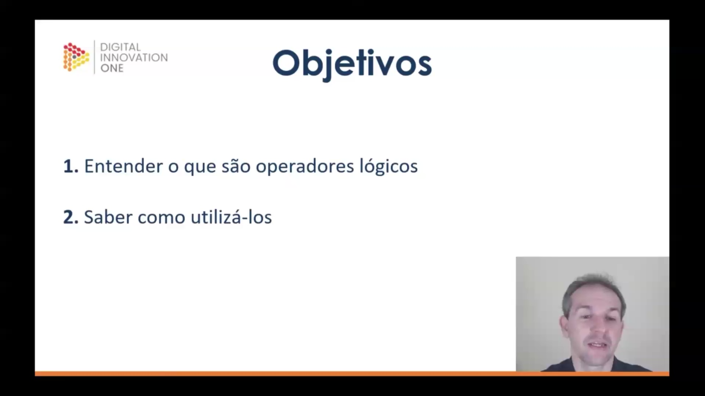
</p>

Esta aula foca no estudo dos operadores lógicos, estabelecendo duas metas principais para o aprendizado:

* **Entender a definição**: Compreender o que são operadores lógicos.
* **Saber como utilizá-los**: Desenvolver a capacidade de aplicação prática desses operadores.

<p align="center">
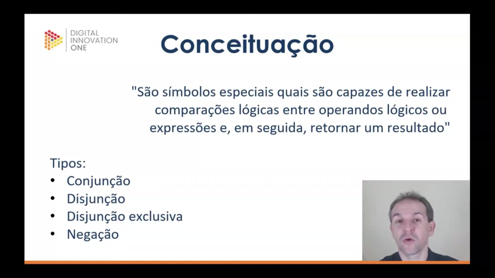
</p>

Os operadores lógicos são definidos como símbolos especiais capazes de realizar comparações lógicas entre operandos ou expressões, retornando posteriormente um resultado.

Diferente de comparações puramente numéricas, esses operadores aplicam-se a valores lógicos (como `true` ou `false`) ou expressões que resultem em dados do tipo booleano. Eles são fundamentais para estruturar o fluxo de decisão em algoritmos.

Os tipos fundamentais de operadores lógicos apresentados são:

* **Conjunção** 
* **Disjunção** 
* **Disjunção exclusiva** 
* **Negação** 


### 🟩 Vídeo 07 - Como utilizar Operadores Lógicos

<video width="60%" controls>
  <source src="000-Midia_e_Anexos/bootcamp_tqi_fullstack-modulo.06-curso.04-video_07.webm" type="video/webm">
    Seu navegador não suporta vídeo HTML5.
</video>

link do vídeo: 

### 🟩 Vídeo 08 - Exemplos, Boas práticas e Exercitando

<video width="60%" controls>
  <source src="000-Midia_e_Anexos/bootcamp_tqi_fullstack-modulo.06-curso.04-video_08.webm" type="video/webm">
    Seu navegador não suporta vídeo HTML5.
</video>

link do vídeo:

### 🟩 Vídeo 09 - Operadores Lógicos

<video width="60%" controls>
  <source src="000-Midia_e_Anexos/bootcamp_tqi_fullstack-modulo.06-curso.04-video_09.webm" type="video/webm">
    Seu navegador não suporta vídeo HTML5.
</video>

link do vídeo:

### 🟩 Vídeo 10 - Resolução do exercício

<video width="60%" controls>
  <source src="000-Midia_e_Anexos/bootcamp_tqi_fullstack-modulo.06-curso.04-video_10.webm" type="video/webm">
    Seu navegador não suporta vídeo HTML5.
</video>

link do vídeo:

## Parte 3 - Controle de Fluxo

### 🟩 Vídeo 11 - O que é Controle de Fluxo

<video width="60%" controls>
  <source src="000-Midia_e_Anexos/bootcamp_tqi_fullstack-modulo.06-curso.04-video_11.webm" type="video/webm">
    Seu navegador não suporta vídeo HTML5.
</video>

link do vídeo:

### 🟩 Vídeo 12 - Criando estruturas de Controle de Fluxo

<video width="60%" controls>
  <source src="000-Midia_e_Anexos/bootcamp_tqi_fullstack-modulo.06-curso.04-video_12.webm" type="video/webm">
    Seu navegador não suporta vídeo HTML5.
</video>

link do vídeo:

### 🟩 Vídeo 13 - Boas práticas

<video width="60%" controls>
  <source src="000-Midia_e_Anexos/bootcamp_tqi_fullstack-modulo.06-curso.04-video_13.webm" type="video/webm">
    Seu navegador não suporta vídeo HTML5.
</video>

link do vídeo:

### 🟩 Vídeo 14 - Exercício de Controle de Fluxo

<video width="60%" controls>
  <source src="000-Midia_e_Anexos/bootcamp_tqi_fullstack-modulo.06-curso.04-video_14.webm" type="video/webm">
    Seu navegador não suporta vídeo HTML5.
</video>

link do vídeo:

## Parte 4 - Blocos

### 🟩 Vídeo 15 - Blocos, tipos e uso

<video width="60%" controls>
  <source src="000-Midia_e_Anexos/bootcamp_tqi_fullstack-modulo.06-curso.04-video_15.webm" type="video/webm">
    Seu navegador não suporta vídeo HTML5.
</video>

link do vídeo:

### 🟩 Vídeo 16 - Encerramento do curso

<video width="60%" controls>
  <source src="000-Midia_e_Anexos/bootcamp_tqi_fullstack-modulo.06-curso.04-video_16.webm" type="video/webm">
    Seu navegador não suporta vídeo HTML5.
</video>

link do vídeo:


##  Materiais de Apoio

# Certificado: 

- Link na plataforma: 
- Certificado em pdf: 
