## Instrutor

- Camila Cavalcante (Software Developer @ Reclame AQUI | Full Stack | Java | Kotlin | Go | TypeScript | PHP)
- Contato Linkedin: / [cami-la](https://www.linkedin.com/in/cami-la/)

## Parte 1 - Apresentação e Visão Geral

### 🟩 Vídeo 01 - Apresentação

<video width="60%" controls>
  <source src="000-Midia_e_Anexos/bootcamp_tqi_fullstack-modulo.06-curso.05-video_01.webm" type="video/webm">
    Seu navegador não suporta vídeo HTML5.
</video>

link do vídeo: https://web.dio.me/track/tqi-fullstack-developer/course/estruturas-de-repeticao-e-arrays-em-java/learning/febaaad5-ea57-4389-a960-2907fa40041c?autoplay=1    

Este vídeo serve como introdução ao curso "Estruturas de Repetição e Arrays em Java", ministrado por Camila Cavalcante na plataforma Digital Innovation One (DIO). A instrutora apresenta os objetivos do curso, que abrangem desde comandos básicos de repetição até a manipulação de arrays, além de compartilhar sua trajetória profissional e as melhores práticas para suporte e interação durante as aulas.

### Anotações

<p align="center">
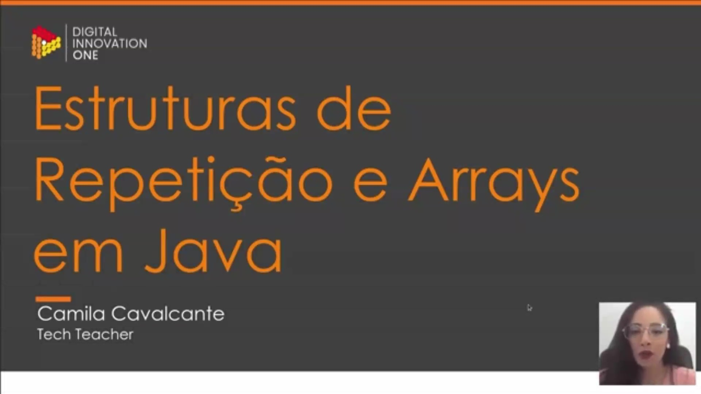
</p>

Esta é a tela de abertura do curso "Estruturas de Repetição e Arrays em Java". A aula é apresentada por Camila Cavalcante , que atua como Tech Teacher. O foco inicial está na apresentação visual do título da disciplina e na identificação da instrutora responsável pelo conteúdo.

<p align="center">
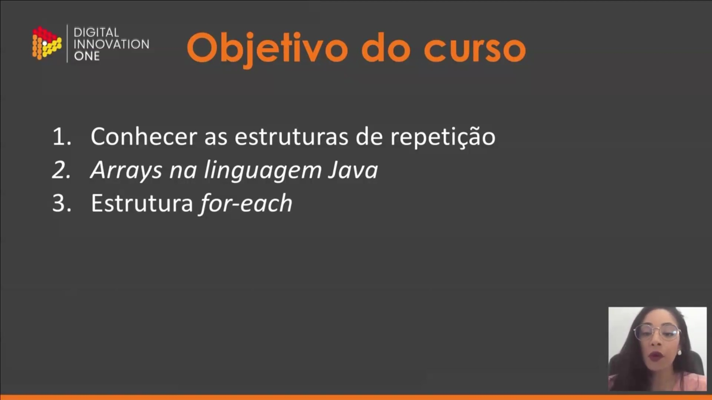
</p>

O slide apresenta os três objetivos principais deste curso:

* **Conhecer as estruturas de repetição**: Fundamentos sobre como automatizar tarefas repetitivas no código.
* **Arrays na linguagem Java**: Estudo sobre o armazenamento de coleções de dados.
* **Estrutura for-each**: Uma forma específica e otimizada de percorrer elementos dentro de coleções e arrays.

<p align="center">
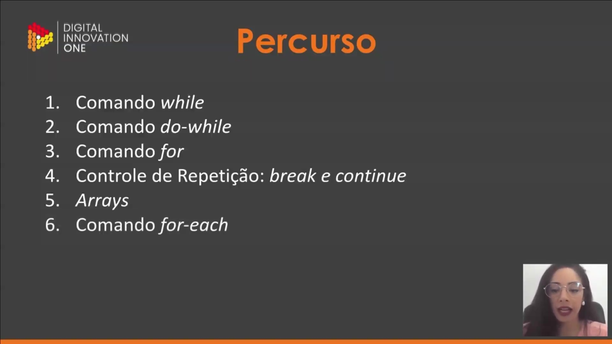
</p>

O percurso detalhado do curso define a ordem de aprendizado das ferramentas de controle de fluxo e estruturas de dados:

1. **Comandos de repetição**: Início com o comando `while` , seguido pelo `do-while` e pelo comando `for`.
2. **Controle de Repetição**: Uso das palavras reservadas `break` e `continue` para gerenciar a execução dos laços.
3. **Arrays e for-each**: Aplicação prática de arrays e a utilização do comando `for-each` para iteração.

<p align="center">
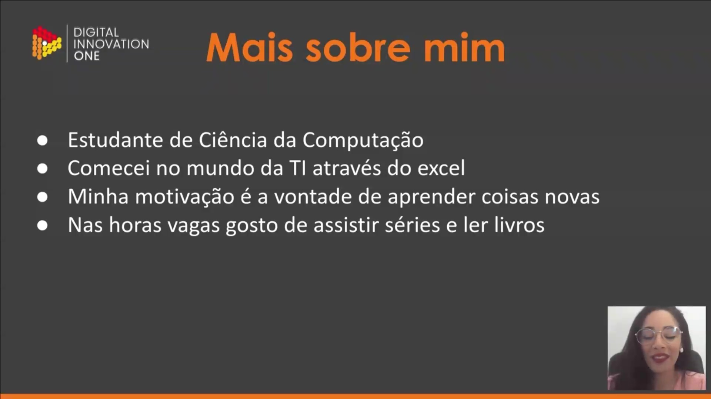
</p>

A instrutora apresenta informações sobre seu perfil pessoal e profissional:

* É estudante de **Ciência da Computação**.
* Iniciou sua trajetória na tecnologia por meio do **Excel**.
* Sua motivação central é a **vontade constante de aprender** coisas novas.
* Em seus momentos de lazer, dedica-se à leitura de livros e ao consumo de séries.

<p align="center">
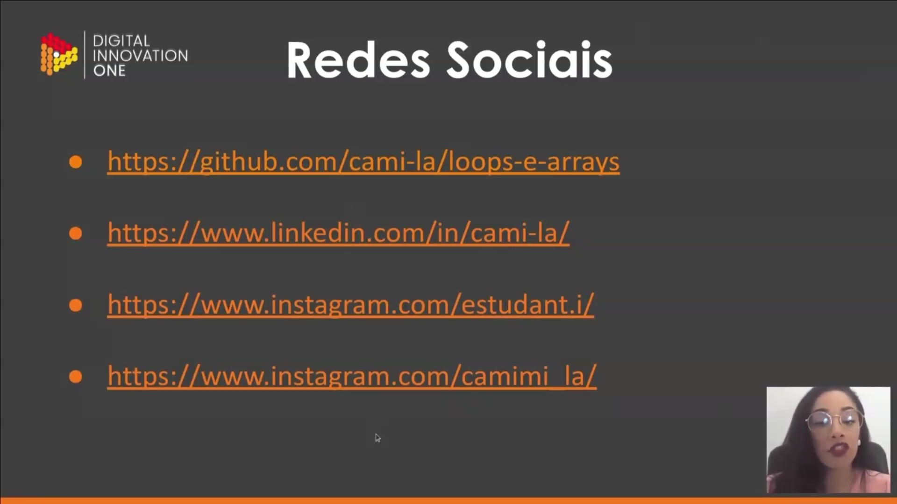
</p>

Para acompanhamento do conteúdo e interação, são disponibilizados os seguintes canais:

* **GitHub**: Repositório `loops-e-arrays` sob o usuário `cami-la`, onde está hospedado o código-fonte do curso.
* **LinkedIn**: Perfil para conexões profissionais em `cami-la`.
* **Instagram**: Perfis `estudante.it` para compartilhamento de estudos e `camimi la` para interações pessoais.      

### 🟩 Vídeo 02 - Visão Geral

<video width="60%" controls>
  <source src="000-Midia_e_Anexos/bootcamp_tqi_fullstack-modulo.06-curso.05-video_02.webm" type="video/webm">
    Seu navegador não suporta vídeo HTML5.
</video>

link do vídeo: https://web.dio.me/track/tqi-fullstack-developer/course/estruturas-de-repeticao-e-arrays-em-java/learning/c8f1bd80-21dc-4aa9-b967-a7da11000851?autoplay=1

Esta aula conceitual aborda estruturas de repetição (laços), operadores de incremento/decremento, operadores de atribuição aritmética e arrays em programação. O foco principal é explicar como os computadores repetem operações através de while, do-while e for, a funcionalidade dos comandos break e continue dentro desses laços, e a utilização de operadores para simplificar operações matemáticas. Por fim, detalha o conceito de arrays como estruturas para armazenar sequencialmente dados do mesmo tipo, incluindo arrays unidimensionais e multidimensionais, e suas características essenciais como tamanho fixo e indexação baseada em zero.

### Anotações

<p align="center">
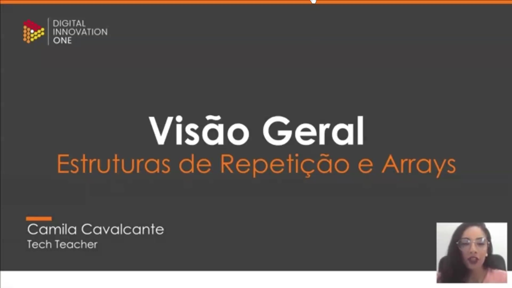
</p>

Esta aula introduz os conceitos fundamentais de **estruturas de repetição** e **arrays**. O conteúdo é focado na parte teórica e conceitual, servindo como base essencial para a resolução de exercícios práticos posteriores. A compreensão desses mecanismos é vital para o desenvolvimento de lógica na programação estruturada.

<p align="center">
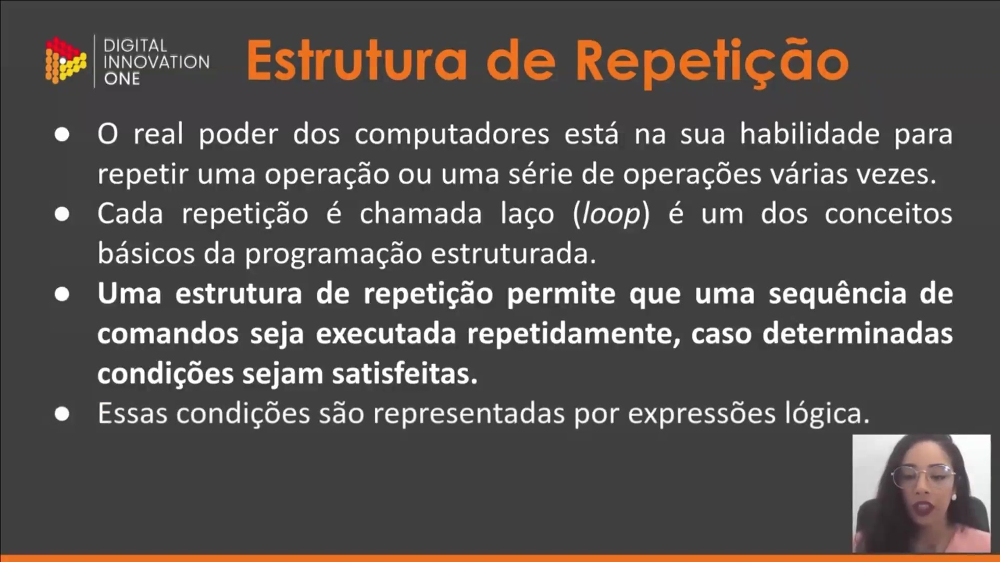
</p>

As estruturas de repetição, também conhecidas como **laços** ou **loops**, representam a capacidade dos computadores de executar uma sequência de comandos diversas vezes. O funcionamento básico consiste em:

* **Condição:** A execução depende de expressões lógicas que retornam um valor booleano (`true` ou `false`).
* **Repetição:** Enquanto a condição for satisfeita (`true`), o bloco de comandos é executado e o fluxo retorna para testar a condição novamente.
* **Interrupção:** O loop é encerrado assim que a condição retorna `false`.

<p align="center">
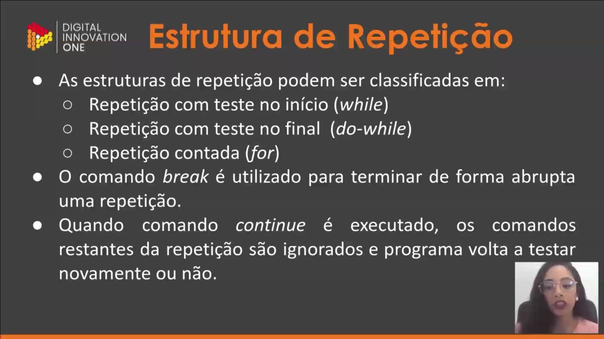
</p>

As estruturas de repetição são classificadas de acordo com o momento em que o teste lógico é realizado:

1. **Repetição com teste no início (`while`):** A condição é verificada antes de qualquer execução da sentença.
2. **Repetição com teste no final (`do-while`):** A sentença é executada ao menos uma vez antes do primeiro teste.
3. **Repetição contada (`for`):** Utilizada quando se sabe previamente o número de repetições ou quando há uma variável de controle clara.

Além disso, existem comandos de controle de fluxo:

* **`break`:** Interrompe a repetição de forma abrupta, saindo do laço.
* **`continue`:** Ignora os comandos restantes da iteração atual e volta para o próximo teste lógico do laço. Diferente do `break`, o `continue` só pode ser utilizado dentro de estruturas de repetição.

<p align="center">
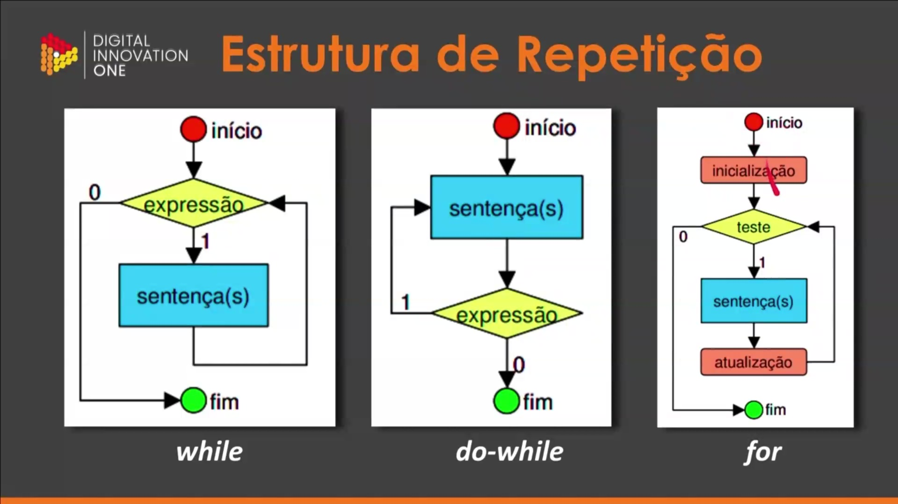
</p>

Os fluxogramas detalham visualmente o comportamento lógico de cada estrutura:

* **`while`:** O fluxo chega na expressão; se for `true` (1), executa a sentença e retorna à expressão. Se for `false` (0), segue para o fim.
* **`do-while`:** O fluxo entra diretamente na sentença. Após a execução, avalia a expressão; se `true` (1), repete a sentença. Se `false` (0), encerra.
* **`for`:** Estrutura mais complexa que envolve quatro etapas: inicialização, teste da condição, execução da sentença e atualização da variável de controle. O ciclo entre teste, sentença e atualização permanece até que o teste retorne `false` (0).

<p align="center">
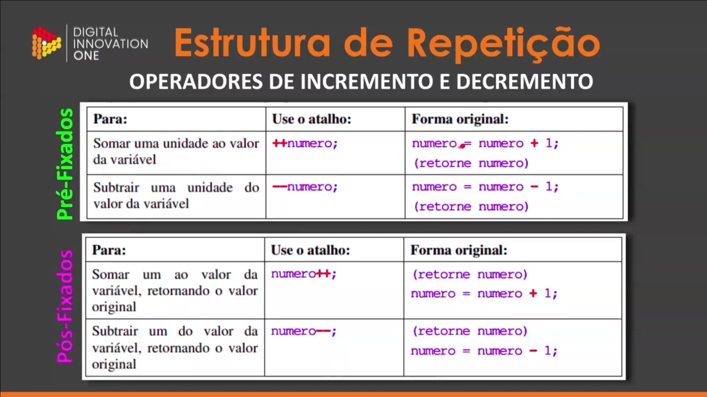
</p>

Operadores de incremento e decremento são atalhos para modificar o valor de uma variável em uma unidade. Eles se dividem em dois tipos:

**Pré-fixados:** A operação é feita antes de retornar o valor.

```java
++numero; // Soma 1 e retorna o novo valor
--numero; // Subtrai 1 e retorna o novo valor

```

**Pós-fixados:** A operação é feita após retornar o valor original.

```java
numero++; // Retorna o valor atual e depois soma 1
numero--; // Retorna o valor atual e depois subtrai 1

```

A forma original equivalente seria `numero = numero + 1;` ou `numero = numero - 1;`.

<p align="center">
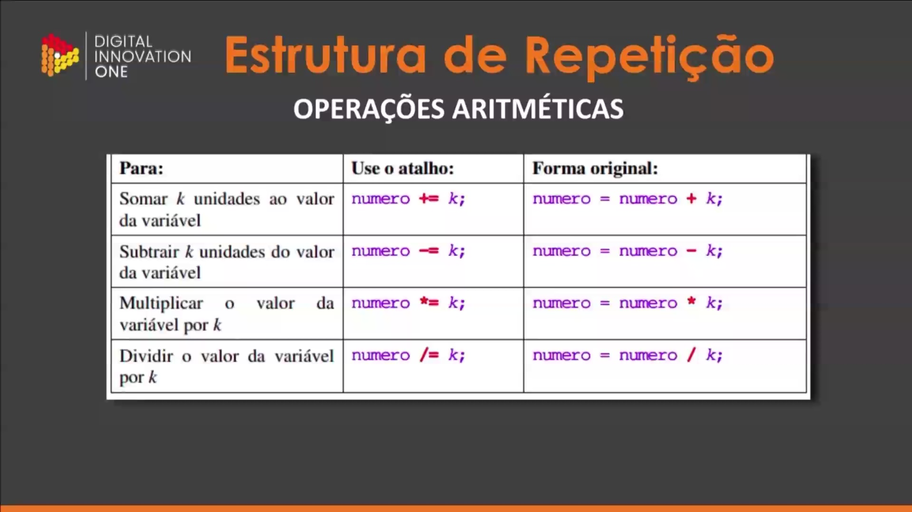
</p>

Para operações aritméticas que envolvem um valor fixo `k`, existem atalhos que simplificam a escrita do código:

| Objetivo | Atalho | Forma Original |
| --- | --- | --- |
| Somar k unidades | `numero += k;` | `numero = numero + k;` |
| Subtrair k unidades | `numero -= k;` | `numero = numero - k;` |
| Multiplicar por k | `numero *= k;` | `numero = numero * k;` |
| Dividir por k | `numero /= k;` | `numero = numero / k;` |

Esses operadores facilitam a leitura do código e são amplamente utilizados em atualizações de variáveis dentro de loops.

<p align="center">
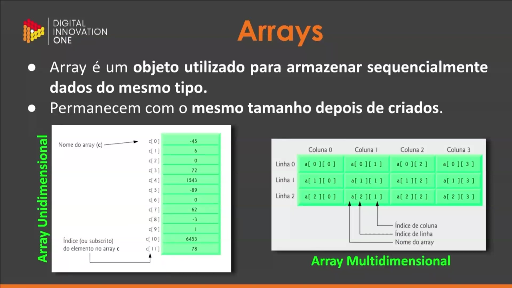
</p>

Um **Array** é um objeto que armazena sequencialmente dados do mesmo tipo. Suas principais características são:

* **Tipo Único:** Todos os elementos dentro de um array devem ser do mesmo tipo (ex: apenas `int`, apenas `String`).
* **Tamanho Fixo:** Uma vez criado em Java, o tamanho do array não pode ser alterado.
* **Unidimensional:** Organizado por um único índice (ou subscrito), começando sempre em `0`. Exemplo: `c[0]`, `c[1]`.
* **Multidimensional:** Organizado em linhas e colunas, como uma matriz. Para acessar um elemento, utilizam-se dois índices, como `a[linha][coluna]`.

O uso de arrays permite agrupar dados relacionados em uma única variável, facilitando o processamento em massa através de estruturas de repetição.

### 🟩 Vídeo 03 - Conhecendo o Repositório

<video width="60%" controls>
  <source src="000-Midia_e_Anexos/bootcamp_tqi_fullstack-modulo.06-curso.05-video_03.webm" type="video/webm">
    Seu navegador não suporta vídeo HTML5.
</video>

link do vídeo: https://web.dio.me/track/tqi-fullstack-developer/course/estruturas-de-repeticao-e-arrays-em-java/learning/0efdfb4c-0d73-410a-99e8-78e003485ccd?autoplay=1

O vídeo apresenta uma visão detalhada de um repositório educacional voltado ao ensino de Java, com foco específico em estruturas de repetição (loops) e arrays. A instrutora orienta sobre os pré-requisitos técnicos, a organização dos materiais (que incluem exercícios práticos e resoluções comentadas passo a passo) e fornece estratégias de estudo, incentivando a prática constante e a interação via GitHub para a resolução de dúvidas.

### Anotações

<p align="center">
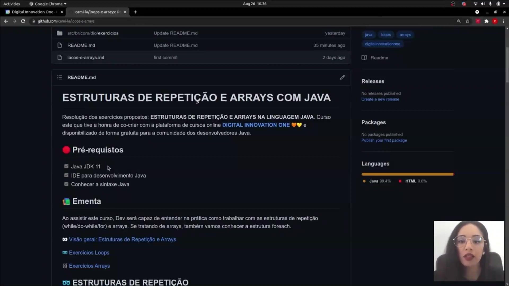
</p>

O repositório principal do curso, intitulado **Loops e Arrays**, serve como base para todo o conteúdo prático. No arquivo `README.md`, estão listados os pré-requisitos fundamentais para acompanhar as aulas:

* **Java JDK 11**: Versão necessária para compilação e execução dos exemplos.
* **IDE para desenvolvimento Java**: Recomendação do uso do IntelliJ, embora outras ferramentas como Eclipse ou VS Code também sejam compatíveis.
* **Conhecimento em sintaxe Java**: Base necessária para a compreensão da lógica que será implementada.

<p align="center">
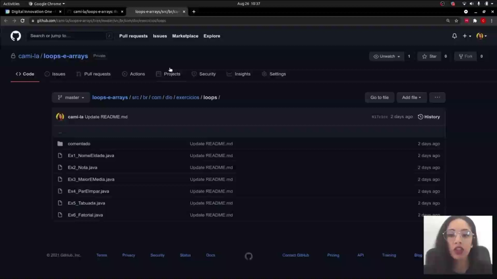
</p>

A estrutura de arquivos do projeto está organizada para facilitar o aprendizado. Dentro do pacote de exercícios de loops, encontramos uma série de classes Java destinadas à resolução de problemas específicos, como cálculo de médias, notas e tabuadas. Além disso, existe uma pasta denominada **Comentado**, onde cada linha de código possui explicações detalhadas para auxiliar o estudante em caso de dúvidas sobre a implementação.

<p align="center">
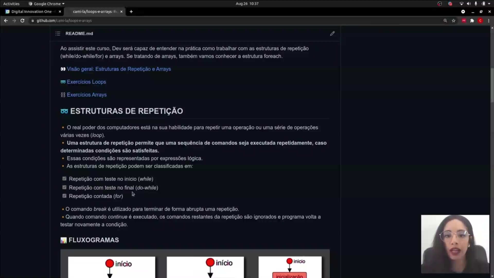
</p>

Neste repositório estão localizadas todas as orientações do curso de Loops e Arrays em Java.

<p align="center">
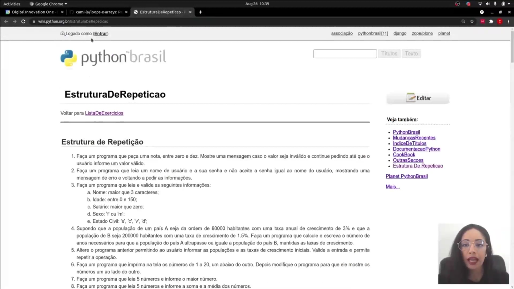
</p>

Os exercícios práticos de repetição foram baseados em listas consagradas, como a do portal **Python Brasil**, adaptando a lógica para a linguagem Java. Entre os desafios propostos, encontram-se:

* Validação de entrada (notas entre zero e dez).
* Comparação entre nomes de usuário e senhas.
* Cálculos de crescimento populacional.
* Identificação de maiores valores e médias em conjuntos numéricos.

<p align="center">
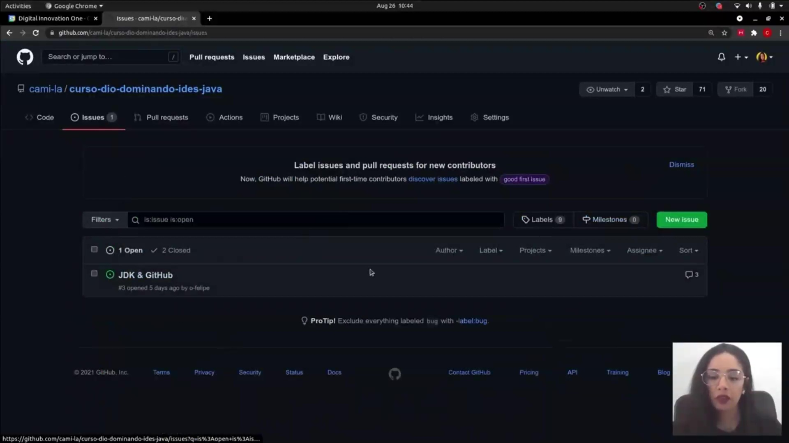
</p>

A interação com o projeto e a resolução de dúvidas ocorrem através da aba **Issues** no GitHub. Este espaço permite que o estudante relate problemas, sugira melhorias ou tire dúvidas técnicas enviando prints de tela e blocos de código. Centralizar as dúvidas nesta plataforma ajuda outros colegas que possam enfrentar dificuldades semelhantes.

<p align="center">
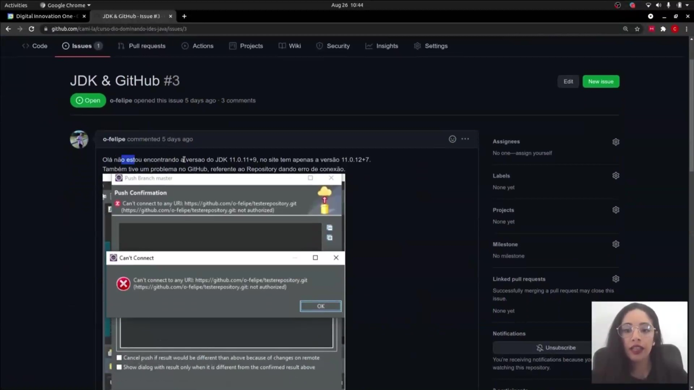
</p>

Um exemplo prático do uso de Issues envolve a resolução de problemas de ambiente e conexão. No caso ilustrado, um usuário relatou dificuldades em encontrar uma versão específica do JDK e erros de autorização ao tentar realizar o "push" de um repositório para o GitHub. Essas discussões são fundamentais para o suporte técnico entre a comunidade de desenvolvedores e o instrutor.      


## Parte 2 - Exercícios Resolvidos: Estruturas de Repetição

### 🟩 Vídeo 04 - Nome e Idade

<video width="60%" controls>
  <source src="000-Midia_e_Anexos/bootcamp_tqi_fullstack-modulo.06-curso.05-video_04.webm" type="video/webm">
    Seu navegador não suporta vídeo HTML5.
</video>

link do vídeo: https://web.dio.me/track/tqi-fullstack-developer/course/estruturas-de-repeticao-e-arrays-em-java/learning/153842a5-4928-4e7e-b803-2345feac599b?autoplay=1

Este conteúdo consiste em uma aula prática de programação em Java focada na resolução de exercícios sobre estruturas de repetição (loops). O instrutor demonstra passo a passo como criar um programa que solicita continuamente o nome e a idade de alunos, utilizando a classe Scanner para entrada de dados e um laço while com uma condição de parada específica: o programa deve ser encerrado assim que o usuário digitar o valor "0" no campo destinado ao nome.

### Anotações

Nesta aula, o objetivo é desenvolver um programa em Java que realize a leitura de conjuntos de dois valores: o nome de um aluno e a sua idade. A estrutura do código é fundamentada nos seguintes pontos:

* **Entrada de Dados**: Utiliza-se a classe `Scanner` vinculada ao `System.in` para permitir que o usuário insira informações via teclado.
* **Laço de Repetição**: É implementado um loop `while(true)` para que a solicitação de dados ocorra repetidamente.
* **Condição de Parada**: O programa deve ser interrompido imediatamente se o usuário digitar o valor "0" no campo destinado ao nome. Para isso, utiliza-se a instrução `break` dentro de um bloco condicional `if (nome.equals("0"))`.
* **Captura de Tipos**: O método `scan.next()` é usado para capturar a `String` (nome) e `scan.nextInt()` para capturar o valor inteiro (idade).


#### Implementação do Exercício

```java
package br.com.dio.exercicios.loops;

import java.util.Scanner;

public class Ex1_NomeEIdade {

    public static void main(String[] args) {
        Scanner scan = new Scanner(System.in);

        String nome;
        int idade;

        while(true) {
            System.out.println("Nome: ");
            nome = scan.next();
            
            // Condição para interromper o laço
            if (nome.equals("0")) break;

            System.out.println("Idade: ");
            idade = scan.nextInt();
        }

        System.out.println("Continua aqui...");
    }
}

```

O uso do `break` garante que, ao identificar o valor de sentinela (zero no nome), o fluxo de execução saia do laço `while` e execute as linhas de código que aparecem logo após o bloco de repetição.


### 🟩 Vídeo 05 - Nota

<video width="60%" controls>
  <source src="000-Midia_e_Anexos/bootcamp_tqi_fullstack-modulo.06-curso.05-video_05.webm" type="video/webm">
    Seu navegador não suporta vídeo HTML5.
</video>

link do vídeo: https://web.dio.me/track/tqi-fullstack-developer/course/estruturas-de-repeticao-e-arrays-em-java/learning/36b670ef-4df2-48ed-802c-dd4ddf10e1bc?autoplay=1

O vídeo detalha a criação de um programa em Java que solicita ao usuário uma nota, validando se o valor inserido está entre 0 e 10. O programa utiliza um laço de repetição (while) para garantir que, caso a nota seja inválida, uma mensagem de erro seja exibida e o usuário seja solicitado a digitar a nota novamente até que um valor válido seja fornecido.

### Anotações

Nesta etapa, o objetivo é criar um programa que valide a entrada de dados do usuário, garantindo que uma nota informada esteja obrigatoriamente entre 0 e 10. Caso o usuário digite um valor fora desse intervalo, o sistema deve exibir uma mensagem de erro e repetir a solicitação até que um valor válido seja inserido.

A implementação utiliza a classe `Scanner` para a leitura dos dados via teclado. A estrutura lógica funciona da seguinte forma:

* **Entrada Inicial**: O programa solicita a nota e armazena o valor na variável inteira `nota`.
* **Estrutura de Repetição**: É utilizado um laço `while` que testa a condição de invalidade: se a nota for menor que 0 **ou** maior que 10.
* **Bloco de Validação**: Enquanto a condição for verdadeira (nota inválida), o programa entra no laço, imprime a mensagem "Nota Inválida! Digite novamente" e realiza uma nova leitura.
* **Encerramento**: O laço só é interrompido quando o usuário fornece um valor que satisfaça o intervalo de 0 a 10, momento em que a condição do `while` se torna falsa e o programa segue para a finalização.

```java
package br.com.dio.exercicios.loops;

import java.util.Scanner;

/*
Faça um programa que peça uma nota, entre zero e dez.
Mostre uma mensagem caso o valor seja inválido
e continue pedindo
até que o usuário informe um valor válido.
*/

public class Ex2_Nota {
    public static void main(String[] args) {
        Scanner scan = new Scanner(System.in);
        int nota;

        System.out.println("Nota: ");
        nota = scan.nextInt();

        while(nota < 0 | nota > 10) {
            System.out.println("Nota Inválida! Digite novamente: ");
            nota = scan.nextInt();
        }
    }
}

```    


### 🟩 Vídeo 06 - Maior e Média

<video width="60%" controls>
  <source src="000-Midia_e_Anexos/bootcamp_tqi_fullstack-modulo.06-curso.05-video_06.webm" type="video/webm">
    Seu navegador não suporta vídeo HTML5.
</video>

link do vídeo: https://web.dio.me/track/tqi-fullstack-developer/course/estruturas-de-repeticao-e-arrays-em-java/learning/13d02199-ec76-4553-a1d0-5705eb912f70?autoplay=1

O vídeo detalha a criação de um programa em Java que utiliza um laço do-while para ler cinco números inteiros fornecidos pelo usuário. O objetivo principal do programa é identificar e exibir o maior valor entre os números digitados, além de calcular e apresentar a média aritmética desses mesmos números. A explicação aborda a implementação de um contador para controlar as repetições do loop, a lógica para encontrar o maior número através de comparações condicionais e o acúmulo da soma para o cálculo da média, com ênfase na importância da inicialização de variáveis e testes incrementais.

### Anotações

Neste exercício, exploramos a estrutura de repetição **do-while** para criar um programa que solicita cinco números ao usuário, identifica o maior valor informado e calcula a média aritmética entre eles.

### Estrutura e Lógica do Programa

O fluxo do código é dividido em três etapas principais:

1. **Inicialização de Variáveis**: São definidas variáveis para capturar o input (`numero`), armazenar o maior valor encontrado (`maior`), acumular a soma dos valores (`soma`) e controlar a quantidade de repetições (`count`).

2. **O Laço do-while**: Diferente do laço `while` convencional, o `do-while` garante que o bloco de código seja executado **pelo menos uma vez** antes de testar a condição de parada.

* A cada iteração, o programa lê um número e o adiciona à variável `soma`.
* Uma estrutura condicional `if` verifica se o número digitado é superior ao valor atualmente armazenado em `maior`. Se for, a variável é atualizada.
* O contador `count` é incrementado em uma unidade até atingir o limite de 5 repetições.


3. **Saída de Dados**: Após o encerramento do laço, os resultados são exibidos no console. A média é obtida dividindo o total acumulado na `soma` por 5.

#### Código Transcrito

```java
package br.com.dio.exercicios.loops;

import java.util.Scanner;

public class Ex3_MaiorEMedia {
    public static void main(String[] args) {
        Scanner scan = new Scanner(System.in);

        int numero;
        int maior = 0;
        int soma = 0;
        int count = 0;

        do {
            System.out.println("Número: ");
            numero = scan.nextInt();

            soma = soma + numero;

            if (numero > maior) maior = numero;

            count = count + 1;
        } while(count < 5);

        System.out.println("Maior: " + maior);
        System.out.println("Média: " + (soma / 5));
    }
}

```      

### 🟩 Vídeo 07 - Par e Impar

<video width="60%" controls>
  <source src="000-Midia_e_Anexos/bootcamp_tqi_fullstack-modulo.06-curso.05-video_07.webm" type="video/webm">
    Seu navegador não suporta vídeo HTML5.
</video>

link do vídeo: https://web.dio.me/track/tqi-fullstack-developer/course/estruturas-de-repeticao-e-arrays-em-java/learning/e9f076ec-5c51-42af-bd9d-7b3caa06e761?autoplay=1

### 🟩 Vídeo 08 - Tabuada

<video width="60%" controls>
  <source src="000-Midia_e_Anexos/bootcamp_tqi_fullstack-modulo.06-curso.05-video_08.webm" type="video/webm">
    Seu navegador não suporta vídeo HTML5.
</video>

link do vídeo: 

### 🟩 Vídeo 09 - Fatorial

<video width="60%" controls>
  <source src="000-Midia_e_Anexos/bootcamp_tqi_fullstack-modulo.06-curso.05-video_09.webm" type="video/webm">
    Seu navegador não suporta vídeo HTML5.
</video>

link do vídeo:

## Parte 3 - Exercícios Resolvidos: Arrays

### 🟩 Vídeo 10 - Ordem Inversa

<video width="60%" controls>
  <source src="000-Midia_e_Anexos/bootcamp_tqi_fullstack-modulo.06-curso.05-video_10.webm" type="video/webm">
    Seu navegador não suporta vídeo HTML5.
</video>

link do vídeo:

### 🟩 Vídeo 11 - Consoantes

<video width="60%" controls>
  <source src="000-Midia_e_Anexos/bootcamp_tqi_fullstack-modulo.06-curso.05-video_11.webm" type="video/webm">
    Seu navegador não suporta vídeo HTML5.
</video>

link do vídeo:

### 🟩 Vídeo 12 - Números Aleatórios

<video width="60%" controls>
  <source src="000-Midia_e_Anexos/bootcamp_tqi_fullstack-modulo.06-curso.05-video_12.webm" type="video/webm">
    Seu navegador não suporta vídeo HTML5.
</video>

link do vídeo:

### 🟩 Vídeo 13 - Array Multidimensional

<video width="60%" controls>
  <source src="000-Midia_e_Anexos/bootcamp_tqi_fullstack-modulo.06-curso.05-video_13.webm" type="video/webm">
    Seu navegador não suporta vídeo HTML5.
</video>

link do vídeo:


##  Materiais de Apoio

# Certificado: 

- Link na plataforma: 
- Certificado em pdf: 
