## Instrutor

- Camila Cavalcante (Software Developer @ Reclame AQUI | Full Stack | Java | Kotlin | Go | TypeScript | PHP)
- Contato Linkedin: / [cami-la](https://www.linkedin.com/in/cami-la/)
- Repositório dos exercícios usados neste curso: https://github.com/ahaerdy/fork-DIO-curso-dio-intro-collections 

## Parte 1 - Introdução do Curso

### 🟩 Vídeo 01 - Apresentação do Curso

<video width="60%" controls>
  <source src="000-Midia_e_Anexos/bootcamp_tqi_fullstack-modulo.06-curso.06-video_01.webm" type="video/webm">
    Seu navegador não suporta vídeo HTML5.
</video>

link do vídeo: https://web.dio.me/track/tqi-fullstack-developer/course/trabalhando-com-collections-java/learning/a34f3db6-de2b-44fa-a059-6ae7785695cc?autoplay=1

Este vídeo serve como uma introdução a um curso sobre o Collections Framework em Java, ministrado por Camila Cavalcante. O curso tem como objetivo capacitar os alunos a entender e aplicar as principais interfaces de Collections (List, Set, Map) e a Stream API, auxiliando na manipulação de coleções. A instrutora também compartilha um breve histórico pessoal sobre sua jornada na programação, destacando sua paixão por desafios e aprendizado contínuo.

### Anotações

<p align="center">

</p>

Bem-vindos ao curso introdutório sobre **Collections**. Esta jornada de aprendizado é guiada por Camila Cavalcante, graduanda em Ciência da Computação, e tem como foco explorar as estruturas de dados fundamentais para o desenvolvimento Java moderno.

<p align="center">
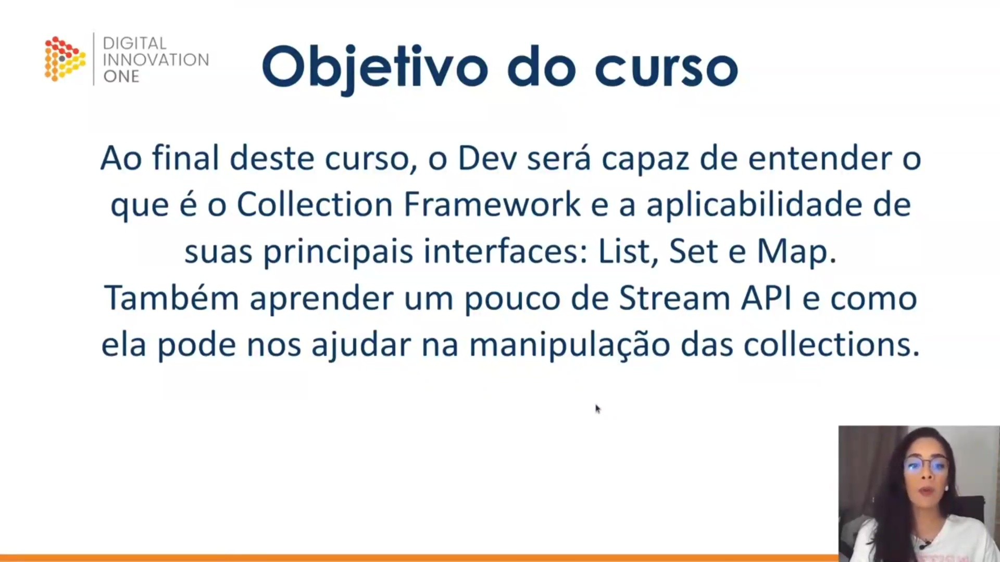
</p>

### Objetivo do curso

O foco principal é capacitar o desenvolvedor a compreender o **Collections Framework**. Ao final das aulas, você será capaz de entender a aplicabilidade das principais interfaces do ecossistema:

* **List**: Para coleções que permitem iterações ordenadas.
* **Set**: Para coleções que focam na singularidade dos elementos.
* **Map**: Para coleções estruturadas em pares.

Além disso, o curso abordará a **Stream API** e como ela auxilia na manipulação dessas coleções.

<p align="center">
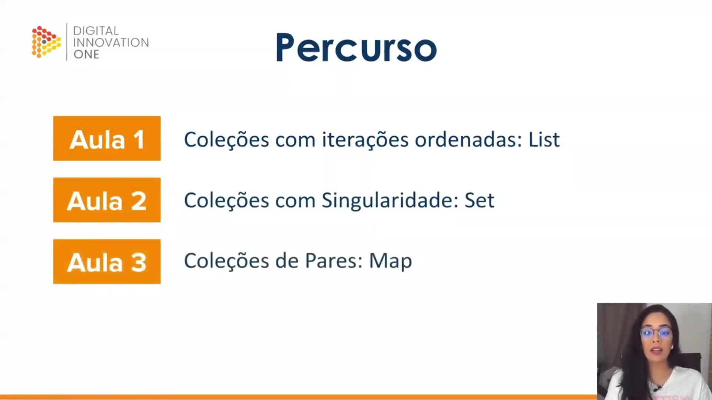
</p>

### Percurso

O conteúdo está organizado em uma trilha lógica para facilitar o aprendizado progressivo:

* **Aula 1**: Coleções com iterações ordenadas: List.
* **Aula 2**: Coleções com Singularidade: Set.
* **Aula 3**: Coleções de Pares: Map.

<p align="center">

</p>

### Mais sobre mim

Camila Cavalcante compartilha detalhes sobre sua trajetória e interesses na área tecnológica:

* **Formação**: Estudante de Ciência da Computação.
* **Início**: Conheceu a programação através do Excel.
* **Tecnologias**: Atua com os frameworks Spring e Angular.
* **Perfil**: Gosta de enfrentar desafios e aprender coisas novas.
* **Projetos**: Aspirante a YouTuber.

Para conectar-se ou explorar seus projetos, você pode acessar seu **LinkedIn** ou seu perfil no **GitHub**.


### 🟩 Vídeo 02 - Visão geral: Collections Framework

<video width="60%" controls>
  <source src="000-Midia_e_Anexos/bootcamp_tqi_fullstack-modulo.06-curso.06-video_02.webm" type="video/webm">
    Seu navegador não suporta vídeo HTML5.
</video>

link do vídeo: https://web.dio.me/track/tqi-fullstack-developer/course/trabalhando-com-collections-java/learning/10d0027e-1655-464b-b968-748a7fe654a5?autoplay=1

Esta aula introduz o Java Collections Framework, explorando sua importância na manipulação eficiente de conjuntos de dados. O conteúdo aborda desde a definição fundamental de uma Collection como um objeto que agrupa múltiplos elementos, até a evolução histórica da linguagem Java (pós JDK 1.2) que permitiu superar as limitações técnicas dos arrays convencionais. A estrutura do framework é detalhada através de seus pilares: interfaces, implementações e algoritmos, preparando o estudante para a aplicação prática em desenvolvimento de software.

### Anotações

<p align="center">

</p>

Esta é a tela de abertura da segunda parte do curso introdutório sobre **Collections**. A aula é apresentada por Camila Cavalcante, graduanda em Ciência da Computação, marcando o início da exploração prática e teórica sobre o framework no ecossistema Java.

<p align="center">
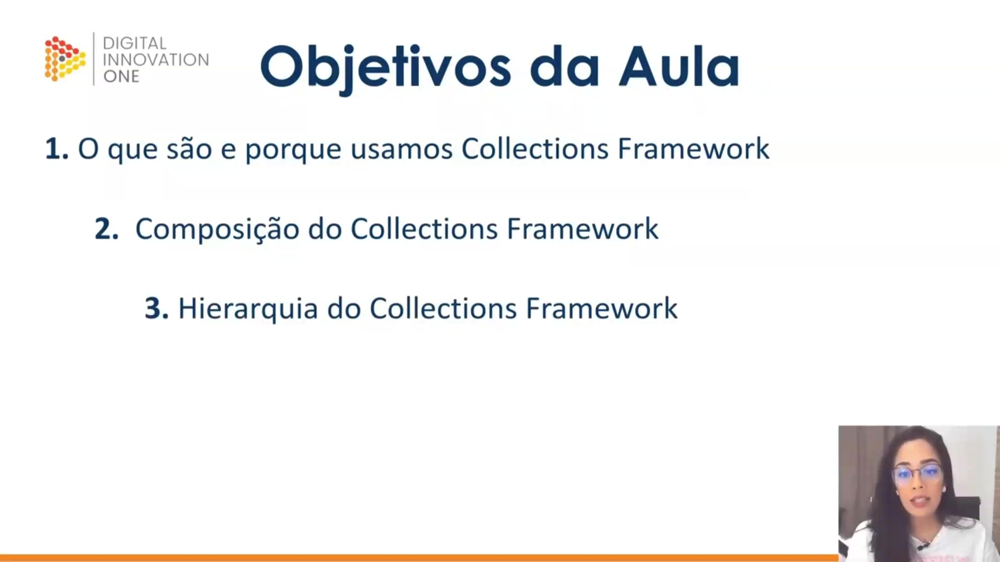
</p>

Os objetivos principais desta sessão de aprendizado estão divididos em três pilares fundamentais:

1. **Definição e Utilidade:** Entender o conceito de Collections Framework e os motivos de sua utilização.
2. **Composição:** Conhecer os elementos que formam a estrutura do framework.
3. **Hierarquia:** Visualizar como as interfaces e classes se organizam e se relacionam entre si.

<p align="center">
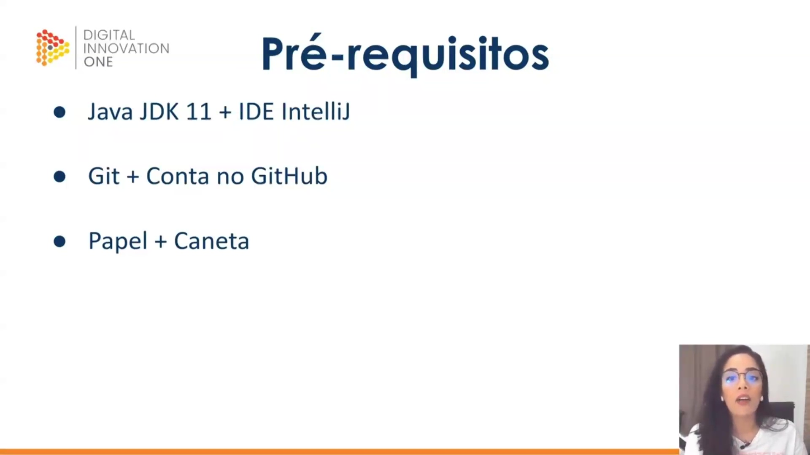
</p>

Para acompanhar o curso de forma fluida, são necessários os seguintes pré-requisitos técnicos e materiais:

* **Ambiente de Desenvolvimento:** Instalação do Java JDK 11 e da IDE IntelliJ.
* **Versionamento:** Ter o Git instalado e possuir uma conta ativa no GitHub para gerenciar o código-fonte.
* **Apoio Didático:** Papel e caneta para anotar conceitos novos ou termos que exijam pesquisa posterior, auxiliando na fixação do conteúdo.

<p align="center">
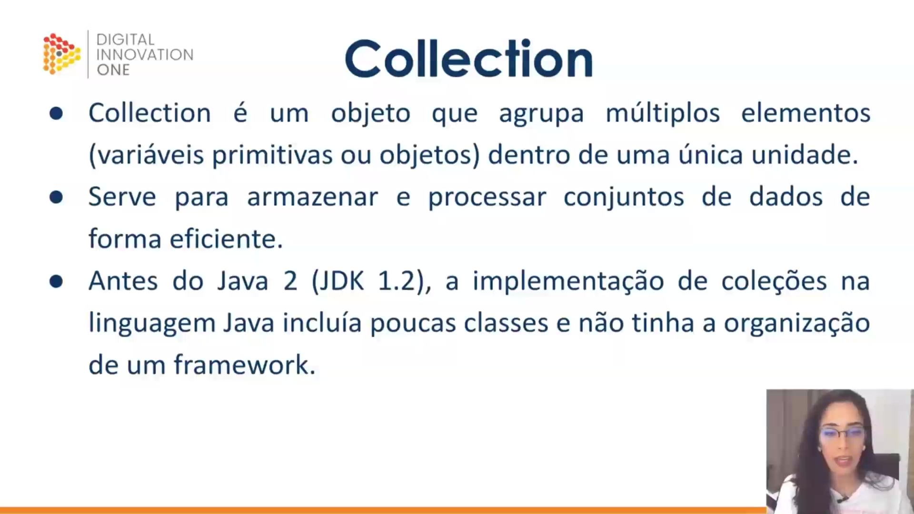
</p>

Uma **Collection** é um objeto projetado para agrupar múltiplos elementos (sejam variáveis primitivas ou objetos) em uma única unidade. Sua função primordial é permitir o armazenamento e o processamento de conjuntos de dados com alta eficiência. Historicamente, antes do JDK 1.2 (Java 2), a linguagem possuía poucas classes para coleções e carecia da organização estruturada de um framework, dependendo de estruturas mais rígidas como os Arrays.

<p align="center">
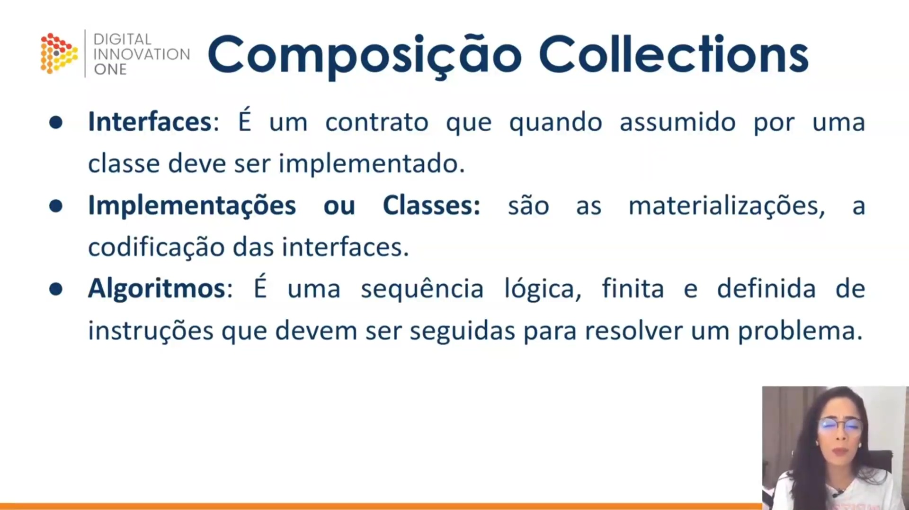
</p>

A estrutura do Collections Framework é composta por três elementos fundamentais:

* **Interfaces:** Definem o "contrato" que as classes devem seguir. Ao implementar uma interface, a classe se obriga a fornecer o código para os métodos definidos.
* **Implementações (Classes):** São as materializações reais das interfaces, contendo a codificação específica para o armazenamento dos dados.
* **Algoritmos:** Referem-se à lógica e às instruções (métodos) utilizadas para resolver problemas e manipular os dados, como operações de busca, ordenação, adição e remoção.

<p align="center">
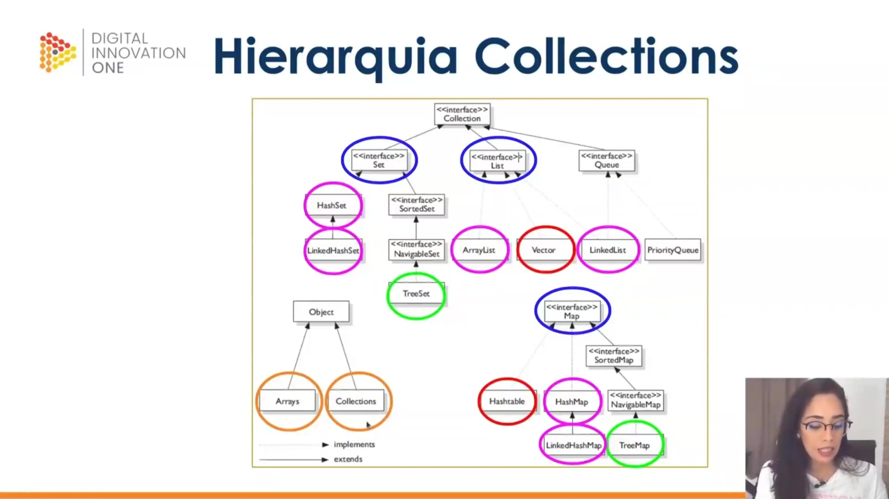
</p>

O Collections Framework possui uma hierarquia bem definida de interfaces e classes.

Os principais grupos incluem:

* **Interface List:** Com implementações como `ArrayList`, `LinkedList` e `Vector`.
* **Interface Set:** Focada em elementos únicos, incluindo `HashSet`, `LinkedHashSet` e `TreeSet` (que por sua vez implementa `NavigableSet`).
* **Interface Queue:** Representada por `PriorityQueue` e `LinkedList`.
* **Interface Map:** Embora pertença ao framework, não estende a interface `Collection` diretamente. Inclui `HashMap`, `LinkedHashMap`, `Hashtable` e `TreeMap`.

Além disso, o framework disponibiliza classes utilitárias como `Arrays` e `Collections` para manipulação dessas estruturas.

<p align="center">
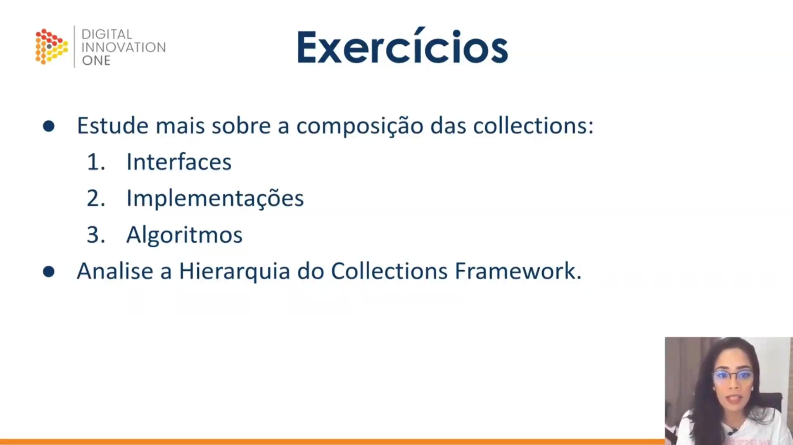
</p>

Para fixação do conteúdo teórico apresentado, sugere-se os seguintes exercícios:

1. Aprofundar o estudo sobre a tríade de composição: **Interfaces, Implementações e Algoritmos**.
2. Analisar detidamente a **Hierarquia do Collections Framework**, observando as relações de herança e implementação entre os componentes.

<p align="center">

</p>

Para otimizar o desenvolvimento no IntelliJ IDEA, recomenda-se explorar atalhos de teclado e plugins que aumentam a produtividade:

* **Atalhos:** Podem ser consultados em guias de referência para agilizar a codificação.
* **Plugins Recomendados:** `Git tool box` para integração com controle de versão, `Key promoter` para aprender atalhos, `Rainbow Brackets` para visualização de código, além de temas visuais como `Atom` e `One dark theme`.

Estes recursos preparam o ambiente para as próximas aulas práticas, onde será abordada a interface `List`.

## Parte 2 - Lists

### 🟩 Vídeo 03 - Coleções com iterações ordenadas: Listas

<video width="60%" controls>
  <source src="000-Midia_e_Anexos/bootcamp_tqi_fullstack-modulo.06-curso.06-video_03.webm" type="video/webm">
    Seu navegador não suporta vídeo HTML5.
</video>

link do vídeo: https://web.dio.me/track/tqi-fullstack-developer/course/trabalhando-com-collections-java/learning/8cab6dc3-3fec-43ed-96fa-0da97eca687a?autoplay=1

Esta aula introdutória sobre coleções em Java foca na interface List, detalhando suas características principais, como permitir elementos duplicados e garantir a ordem de inserção. O conteúdo explora as implementações Vector, ArrayList e LinkedList, destacando suas diferenças fundamentais e os cenários ideais de uso para cada uma, com ênfase na escolha entre ArrayList (para buscas) e LinkedList (para inserções e exclusões).

### Anotações

<p align="center">

</p>

Nesta etapa inicial da aula, introduzimos o conceito de **Coleções com iterações ordenadas**, focando especificamente em **Listas** (`List`). Este conteúdo faz parte do estudo introdutório sobre o ecossistema de *Collections* em Java, abordando estruturas que mantêm a sequência de inserção dos elementos.

<p align="center">
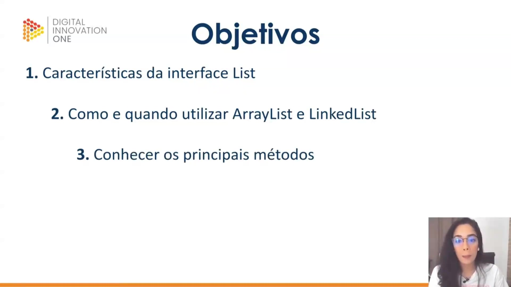
</p>

Os objetivos principais desta unidade didática estão divididos em três pilares fundamentais:

1. **Características da interface List**: Compreender as propriedades básicas da interface.
2. **Uso de ArrayList e LinkedList**: Entender como e quando utilizar cada uma dessas implementações.
3. **Principais métodos**: Conhecer as funcionalidades essenciais para manipulação dessas coleções.

<p align="center">
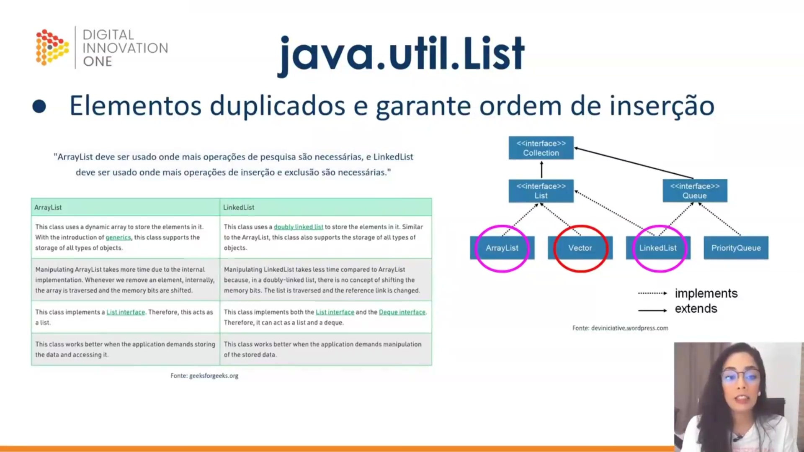
</p>

A interface `java.util.List` define uma estrutura que permite **elementos duplicados** e garante a **ordem de inserção**. Isso significa que os elementos serão exibidos na mesma sequência em que foram adicionados. Dentro da hierarquia do Java, a interface `List` estende `Collection`.

As implementações mais comuns possuem características distintas de performance e comportamento:

* **Vector**: Uma implementação pensada para contextos que envolvem *threads*, sendo considerada *thread-safe*.
* **ArrayList**: Utiliza um **array dinâmico** internamente. É a escolha preferencial para aplicações que demandam mais **operações de pesquisa e acesso** aos dados. No entanto, a remoção de elementos é mais demorada, pois exige o deslocamento de bits na memória.
* **LinkedList**: Utiliza uma estrutura de **lista duplamente ligada**. É mais eficiente para **operações de inserção e exclusão**, pois apenas altera os links de referência entre os elementos, sem necessidade de deslocamento interno. Além disso, implementa as interfaces `List` e `Deque`/`Queue`.


### 🟩 Vídeo 04 - Conhecendo os métodos List - parte 1

<video width="60%" controls>
  <source src="000-Midia_e_Anexos/bootcamp_tqi_fullstack-modulo.06-curso.06-video_04.webm" type="video/webm">
    Seu navegador não suporta vídeo HTML5.
</video>

link do vídeo: https://web.dio.me/track/tqi-fullstack-developer/course/trabalhando-com-collections-java/learning/5d2b4933-e791-4f57-b39e-cb044f774b75?autoplay=1

O vídeo apresenta um tutorial prático sobre a manipulação de listas em Java, demonstrando a criação, adição, remoção, substituição e verificação de elementos em uma lista de números do tipo double. São exploradas diferentes formas de inicialização de listas, incluindo o uso de ArrayList e a importância de programar voltado para interfaces, além de abordar conceitos como Generics e o Diamond Operator.

### Anotações

Nesta aula prática, exploramos a interface `List` do Java através da classe `ExemploList`. O objetivo é resolver uma série de exercícios práticos que demonstram a manipulação de coleções de dados, especificamente utilizando uma lista de notas de um aluno.

#### 🟡 Código Completo

```java
package br.com.dio.collection.list;


import java.util.*;

class ExemploList {
    public static void main(String[] args) {
// Dada uma lista com 7 notas de um aluno [7, 8.5, 9.3, 5, 7, 0, 3.6], faça:

//      List notas = new ArrayList(); //antes do java 5
//      ArrayList<Double> notas = new ArrayList<>();
//      List<Double> notas = new ArrayList<>(Arrays.asList(7d, 8.5, 9.3, 5d, 7d, 0d, 3.6));
        /*List<Double> notas = Arrays.asList(7d, 8.5, 9.3, 5d, 7d, 0d, 3.6);
        notas.add(10d);
        System.out.println(notas);*/
        /*List<Double> notas = List.of(7d, 8.5, 9.3, 5d, 7d, 0d, 3.6);
        notas.add(1d);
        notas.remove(5d);
        System.out.println(notas);*/

        System.out.println("Crie uma lista e adicione as sete notas: ");

        List<Double> notas = new ArrayList<Double>(); //Generics(jdk 5) - Diamond Operator(jdk 7)
        notas.add(7.0);
        notas.add(8.5);
        notas.add(9.3);
        notas.add(5.0);
        notas.add(7.0);
        notas.add(0.0);
        notas.add(3.6);
        System.out.println(notas.toString());

        System.out.println("Exiba a posição da nota 5.0: " + notas.indexOf(5d));

        System.out.println("Adicione na lista a nota 8.0 na posição 4: ");
        notas.add(4, 8d);
        System.out.println(notas);

        System.out.println("Substitua a nota 5.0 pela nota 6.0: ");
        notas.set(notas.indexOf(5d), 6.0);
        System.out.println(notas);

        System.out.println("Confira se a nota 5.0 está na lista: " + notas.contains(5d));

        /*System.out.println("Exiba todas as notas na ordem em que foram informados: ");
        for (Double nota : notas) System.out.println(nota);*/

        System.out.println("Exiba a terceira nota adicionada: " + notas.get(2));
        System.out.println(notas.toString());

        System.out.println("Exiba a menor nota: " + Collections.min(notas));

        System.out.println("Exiba a maior nota: " + Collections.max(notas));

        Iterator<Double> iterator = notas.iterator();
        Double soma = 0d;
        while(iterator.hasNext()){
            Double next = iterator.next();
            soma += next;
        }
        System.out.println("Exiba a soma dos valores: " + soma);

        System.out.println("Exiba a média das notas: " + (soma/notas.size()));

        System.out.println("Remova a nota 0: ");
        notas.remove(0d);
        System.out.println(notas);

        System.out.println("Remova a nota da posição 0");
        notas.remove(0);
        System.out.println(notas);

        System.out.println("Remova as notas menores que 7 e exiba a lista: ");
        Iterator<Double> iterator1 = notas.iterator();
        while(iterator1.hasNext()) {
            Double next = iterator1.next();
            if(next < 7) iterator1.remove();
        }
        System.out.println(notas);

        /*System.out.println("Apague toda a lista");
        notas.clear();
        System.out.println(notas);
        */
        System.out.println("Confira se a lista está vazia: " + notas.isEmpty());

/*
Para você: Resolva esses exercícios utilizando os métodos da implementação LinkedList:

        System.out.println("Crie uma lista chamada notas2 " +
                "e coloque todos os elementos da list Arraylist nessa nova lista: ");

        System.out.println("Mostre a primeira nota da nova lista sem removê-lo: ");

        System.out.println("Mostre a primeira nota da nova lista removendo-o: ");
*/

    }
}
```

#### Formas de Inicialização de Listas

A imagem apresenta diversas maneiras de instanciar e inicializar uma lista em Java, destacando a evolução da linguagem e as boas práticas de programação:

* **Antes do Java 5:** Utilizava-se a declaração bruta sem Generics.
* **Generics e Diamond Operator:** Introduzidos para garantir a segurança de tipos. O Diamond Operator (`<>`), disponível a partir do Java 7, simplifica a escrita ao não exigir a repetição do tipo no lado direito da atribuição.
* **Programação voltada à Interface:** É recomendado declarar a variável usando a interface `List` e instanciá-la com uma implementação específica, como `ArrayList`, para manter o código flexível.
* **Métodos Utilitários:** O uso de `Arrays.asList` permite criar listas de forma rápida, porém, dependendo da implementação, a lista resultante pode ter tamanho fixo ou ser imutável, impedindo operações de adição ou remoção de elementos.

#### Operações Práticas com ArrayList

Após a inicialização da lista `notas`, realizamos as seguintes operações:

1. **Adição de Elementos:** Utilizamos o método `add(Double)` para inserir as sete notas individualmente.
2. **Exibição da Posição:** O método `indexOf(5d)` é utilizado para localizar o índice da primeira ocorrência da nota 5.0.
3. **Inserção em Posição Específica:** O método `add(int index, Double element)` insere um valor em uma posição determinada, deslocando os elementos subsequentes.
4. **Substituição:** O método `set(int index, Double element)` substitui o valor existente em uma posição específica. No exemplo, a nota 5.0 foi substituída por 6.0.
5. **Verificação de Conteúdo:** O método `contains(Object)` retorna um valor booleano indicando se o elemento está presente na lista.

```java
package br.com.dio.collection.list;

import java.util.*;

class ExemploList {
    public static void main(String[] args) {
        // Dada uma lista com 7 notas de um aluno (7, 8.5, 9.3, 5, 7, 0, 3.6), faça:

        System.out.println("Crie uma lista e adicione as sete notas: ");
        List<Double> notas = new ArrayList<Double>(); 
        notas.add(7.0);
        notas.add(8.5);
        notas.add(9.3);
        notas.add(5.0);
        notas.add(7.0);
        notas.add(0.0);
        notas.add(3.6);
        System.out.println(notas.toString());

        System.out.println("Exiba a posição da nota 5.0: " + notas.indexOf(5d));

        System.out.println("Adicione na lista a nota 8.0 na posição 4: ");
        notas.add(4, 8d);
        System.out.println(notas);

        System.out.println("Substitua a nota 5.0 pela nota 6.0: ");
        notas.set(notas.indexOf(5d), 6.0);
        System.out.println(notas);

        System.out.println("Confira se a nota 5.0 está na lista: " + notas.contains(5d));

        System.out.println("Exiba todas as notas na ordem em que foram informados: ");
        for (Double nota : notas) System.out.println(nota);

        System.out.println("Exiba a terceira nota adicionada: " + notas.get(2));
        System.out.println(notas.toString());
    }
}
```

### 🟩 Vídeo 05 - Conhecendo os métodos List - parte 2

<video width="60%" controls>
  <source src="000-Midia_e_Anexos/bootcamp_tqi_fullstack-modulo.06-curso.06-video_05.webm" type="video/webm">
    Seu navegador não suporta vídeo HTML5.
</video>

link do vídeo: https://web.dio.me/track/tqi-fullstack-developer/course/trabalhando-com-collections-java/learning/e383c216-1786-4505-80a6-f3f87db7238d?autoplay=1

Esta aula técnica detalha a manipulação de coleções em Java, focando em operações essenciais da interface List e o uso de métodos utilitários da classe Collections. O conteúdo abrange desde a recuperação de elementos por índice com o método get() e a identificação de valores extremos (mínimo e máximo) através da interface Comparable, até a implementação de lógicas customizadas de soma e remoção condicional utilizando o Iterator para percorrer a lista de forma segura. Adicionalmente, são explorados métodos de gerenciamento de estado da coleção, como size() para medição de tamanho, clear() para esvaziamento e isEmpty() para verificação de conteúdo, culminando em um desafio prático que incentiva a exploração de implementações específicas como o LinkedList e suas interfaces complementares.

### Anotações

Esta etapa da aula foca na manipulação de dados em uma `List` utilizando a linguagem Java. O exemplo demonstra como acessar elementos por índice, encontrar valores extremos (mínimo e máximo) e realizar operações de soma e média.

Para recuperar a terceira nota adicionada, utiliza-se o método `get(int index)`. Como as listas em Java possuem indexação baseada em zero, o índice `2` corresponde ao terceiro elemento. No exemplo visualizado, o retorno para esta operação é a nota `9.3`.

Para identificar a menor e a maior nota, recorre-se à classe utilitária `Collections`. Os métodos `Collections.min(notas)` e `Collections.max(notas)` funcionam porque o tipo `Double` implementa a interface `Comparable`, que define a ordem natural dos elementos.

A soma dos valores é realizada através de um `Iterator`. O fluxo consiste em percorrer a lista com um laço `while`, verificando a existência de um próximo elemento com `hasNext()` e recuperando-o com `next()` para acumulá-lo em uma variável de controle. A média é obtida dividindo-se o total acumulado pelo tamanho da lista, retornado pelo método `size()`.

```java
// Exemplo de operações demonstradas
System.out.println("Exiba a terceira nota adicionada: " + notas.get(2));
System.out.println("Exiba a menor nota: " + Collections.min(notas));
System.out.println("Exiba a maior nota: " + Collections.max(notas));

Iterator<Double> iterator = notas.iterator();
Double soma = 0d;
while(iterator.hasNext()){
    Double next = iterator.next();
    soma += next;
}
System.out.println("Exiba a soma dos valores: " + soma);
System.out.println("Exiba a média das notas: " + (soma/notas.size()));

```

Além disso, a aula aborda a remoção de elementos. É importante notar a diferença entre `remove(int index)` e `remove(Object o)`. Ao lidar com `Double`, deve-se especificar o sufixo `d` (ex: `0d`) para garantir que o compilador entenda que se trata do objeto valor, e não do índice da posição. Para remoções condicionais (como notas menores que 7), utiliza-se o `iterator.remove()` para evitar erros de concorrência durante a iteração. Por fim, os métodos `clear()` e `isEmpty()` são apresentados para esvaziar a lista e verificar seu estado, respectivamente.

### 🟩 Vídeo 06 - Ordenação de elementos em uma coleção List - parte 1

<video width="60%" controls>
  <source src="000-Midia_e_Anexos/bootcamp_tqi_fullstack-modulo.06-curso.06-video_06.webm" type="video/webm">
    Seu navegador não suporta vídeo HTML5.
</video>

link do vídeo: https://web.dio.me/track/tqi-fullstack-developer/course/trabalhando-com-collections-java/learning/72c54080-cbe0-4a60-85b4-d15fb46fb512?autoplay=1

O vídeo demonstra a criação e manipulação de listas em Java, focando na organização de objetos do tipo "Gato" com atributos de nome, idade e cor. São apresentados métodos para adicionar elementos a uma lista, exibir a lista em sua ordem de inserção e embaralhar a ordem dos elementos utilizando a classe Collections.

### Anotações

Nesta aula, exploramos o processo de ordenação de elementos em uma `List` utilizando a linguagem Java. O exemplo prático consiste em organizar uma lista de objetos do tipo `Gato` com base em atributos como nome, idade e cor.

#### 🔴 Código completo

```java
package br.com.dio.collection.list;

/* Dadas as seguintes informações sobre meus gatos, crie uma lista 
   e ordene esta lista exibindo: (nome - idade - cor); 

   Gato 1 = nome: Jon, idade: 18, cor: preto 
   Gato 2 = nome: Simba, idade: 6, cor: tigrado 
   Gato 3 = nome: Jon, idade: 12, cor: amarelo 
*/

import java.util.ArrayList;
import java.util.Collections;
import java.util.Comparator;
import java.util.List;

public class ExemploOrdenacaoList {
    public static void main(String[] args) {

        // Criação da lista de gatos utilizando uma sintaxe de inicialização com chaves duplas 
        List<Gato> meusGatos = new ArrayList<>(){{
            add(new Gato("Jon", 12, "preto")); // Adiciona o primeiro objeto Gato 
            add(new Gato("Simba", 6, "tigrado")); // Adiciona o segundo objeto Gato 
            add(new Gato("Jon", 18, "amarelo")); // Adiciona o terceiro objeto Gato 
        }};

        // Exibição na ordem de inserção: a List mantém os elementos conforme foram adicionados 
        System.out.println("--\tOrdem de Inserção\t---");
        System.out.println(meusGatos); // Imprime a lista (usa o método toString da classe Gato) 

        // Ordem aleatória: utiliza o método shuffle da classe Collections para "bagunçar" a lista 
        System.out.println("--\tOrdem aleatória\t---");
        Collections.shuffle(meusGatos); 
        System.out.println(meusGatos);

        // Ordem Natural: utiliza o Comparable implementado na classe Gato (ordenação por Nome) 
        System.out.println("--\tOrdem Natural (Nome)\t---");
        Collections.sort(meusGatos); // O método sort precisa que a classe implemente Comparable 
        System.out.println(meusGatos);

        // Ordem por Idade: utiliza a interface Comparator externa para definir um critério diferente 
        System.out.println("--\tOrdem Idade\t---");
        // meusGatos.sort(new ComparatorIdade()); // Forma alternativa de chamar o sort diretamente na lista 
        Collections.sort(meusGatos, new ComparatorIdade()); 
        System.out.println(meusGatos);

        // Ordem por Cor: utiliza outro Comparator customizado para comparar strings de cores 
        System.out.println("--\tOrdem cor\t---");
        meusGatos.sort(new ComparatorCor()); 
        System.out.println(meusGatos);

        // Ordem Nome/Cor/Idade: ordenação composta. Se nomes forem iguais, olha cor; se cores forem iguais, olha idade 
        System.out.println("--\tOrdem Nome/Cor/Idade\t---");
        meusGatos.sort(new ComparatorNomeCorIdade()); 
        System.out.println(meusGatos);
    }
}

// Classe Gato implementando Comparable para definir a ordem natural de comparação 
class Gato implements Comparable<Gato>{
    private String nome;
    private Integer idade;
    private String cor;

    // Construtor para inicializar os atributos do gato 
    public Gato(String nome, Integer idade, String cor) {
        this.nome = nome;
        this.idade = idade;
        this.cor = cor;
    }

    // Métodos Getter para acessar atributos privados 
    public String getNome() { return nome; }
    public Integer getIdade() { return idade; }
    public String getCor() { return cor; }

    // Sobrescrita do toString para exibir os dados do objeto em vez do endereço de memória 
    @Override
    public String toString() {
        return "{" +
                "nome='" + nome + '\'' +
                ", idade=" + idade +
                ", cor='" + cor + '\'' +
                '}';
    }

    // Implementação do compareTo (obrigatório pelo Comparable) para comparar nomes ignorando maiúsculas 
    @Override
    public int compareTo(Gato gato) {
        return this.getNome().compareToIgnoreCase(gato.getNome()); // Retorna 0 (iguais), 1 (maior) ou -1 (menor) 
    }
}

// Classe Comparator para ordenar especificamente por idade 
class ComparatorIdade implements Comparator<Gato> {
    @Override
    public int compare(Gato g1, Gato g2) {
        return Integer.compare(g1.getIdade(), g2.getIdade()); // Usa o método de comparação da classe Integer 
    }
}

// Classe Comparator para ordenar especificamente por cor 
class ComparatorCor implements Comparator<Gato> {
    @Override
    public int compare(Gato g1, Gato g2) {
        return g1.getCor().compareToIgnoreCase(g2.getCor()); // Compara strings alfabeticamente 
    }
}

// Classe Comparator para múltiplos critérios de desempate 
class ComparatorNomeCorIdade implements Comparator<Gato> {
    @Override
    public int compare(Gato g1, Gato g2) {
        // Primeiro critério: Nome 
        int nome = g1.getNome().compareToIgnoreCase(g2.getNome());
        if (nome != 0) return nome; // Se os nomes forem diferentes, já define a ordem aqui 

        // Segundo critério (desempate): Cor 
        int cor = g1.getCor().compareToIgnoreCase(g2.getCor());
        if(cor !=0) return cor; // Se as cores forem diferentes, define a ordem aqui 

        // Terceiro critério (desempate final): Idade 
        return Integer.compare(g1.getIdade(), g2.getIdade());
    }
}
```

#### Definição do Modelo e Estrutura Inicial

Para iniciar, é definida a classe `Gato`, que implementa a interface `Comparable` para estabelecer uma **ordem natural** de comparação. A classe possui os atributos `nome`, `idade` e `cor`, acompanhados de seus respectivos métodos construtores e getters.

#### Instanciação e Ordem de Inserção

Os gatos são adicionados a uma `ArrayList` utilizando o método `add`. Por padrão, a `List` mantém os elementos na **ordem de inserção**. Para visualizar os dados corretamente em vez do endereço de memória, o método `toString()` é sobrescrevido na classe.

#### Métodos de Ordenação

A aula demonstra diferentes formas de manipular a ordem da lista:

* **Ordem Aleatória**: Utiliza-se `Collections.shuffle(meusGatos)` para embaralhar os elementos.
* **Ordem Natural**: Implementada através do método `compareTo` na classe `Gato`, comparando os nomes ignorando maiúsculas e minúsculas (`compareToIgnoreCase`). A ordenação é executada com `Collections.sort(meusGatos)`.
* **Ordenação por Atributos Específicos (Customizada)**: Para critérios que fogem à ordem natural, criam-se classes que implementam a interface `Comparator`.

#### Implementação de Comparators

Foram criadas classes específicas para lidar com diferentes lógicas de comparação:

* **ComparatorIdade**: Compara os gatos pela idade de forma numérica.
* **ComparatorCor**: Compara as cores das Strings.
* **ComparatorNomeCorIdade**: Uma ordenação composta que verifica primeiro o nome; se forem iguais, verifica a cor; e por fim, a idade, garantindo um critério de desempate preciso.


### 🟩 Vídeo 07 - Ordenação de elementos em uma coleção List - parte 2

<video width="60%" controls>
  <source src="000-Midia_e_Anexos/bootcamp_tqi_fullstack-modulo.06-curso.06-video_07.webm" type="video/webm">
    Seu navegador não suporta vídeo HTML5.
</video>

link do vídeo: https://web.dio.me/track/tqi-fullstack-developer/course/trabalhando-com-collections-java/learning/5bdd9534-1fc4-4612-9309-383812ec570e?autoplay=1

Esta aula detalha o uso da interface Comparator em Java para a ordenação personalizada de listas de objetos, complementando a interface Comparable. Através da implementação do método compare, demonstra-se como criar classes específicas para ordenar atributos como idade (utilizando Integer.compare) e cor (utilizando compareToIgnoreCase para Strings). O vídeo explora ainda a criação de ordenações compostas, onde múltiplos critérios — nome, cor e idade — são encadeados como níveis de desempate, e apresenta a flexibilidade de aplicar esses ordenadores tanto via Collections.sort quanto pelo método sort da própria lista.

### Anotações

Nesta aula, exploramos a ordenação de listas em Java utilizando a interface `Comparator`. Diferente da interface `Comparable` (que define uma ordem natural única para a classe), o `Comparator` permite criar múltiplas estratégias de ordenação externas à classe principal.

Abaixo, detalhamos as implementações para ordenar uma lista de objetos do tipo `Gato` por diferentes atributos: idade, cor e uma composição de múltiplos critérios.

#### 1. Ordenação por Idade

Para ordenar por idade, implementamos a classe `ComparatorIdade`. Como o atributo `idade` é um `Integer`, utilizamos o método estático `Integer.compare()`, que facilita a comparação entre dois valores inteiros, retornando um valor negativo se o primeiro for menor, zero se forem iguais, ou positivo se for maior.

```java
class ComparatorIdade implements Comparator<Gato> {
    @Override
    public int compare(Gato g1, Gato g2) {
        return Integer.compare(g1.getIdade(), g2.getIdade());
    }
}

```

#### 2. Ordenação por Cor

Para a ordenação por cor, a classe `ComparatorCor` utiliza o método `compareToIgnoreCase` da classe `String`. Isso garante que a comparação alfabética ignore a diferença entre letras maiúsculas e minúsculas.

```java
class ComparatorCor implements Comparator<Gato> {
    @Override
    public int compare(Gato g1, Gato g2) {
        return g1.getCor().compareToIgnoreCase(g2.getCor());
    }
}

```

#### 3. Ordenação Composta (Nome/Cor/Idade)

Quando precisamos de múltiplos critérios de desempate, implementamos uma lógica encadeada na classe `ComparatorNomeCorIdade`. O sistema primeiro compara os nomes; se forem diferentes, define a ordem por eles. Se os nomes forem iguais (retorno 0), o código passa a comparar as cores. Se as cores também forem idênticas, o critério final de desempate é a idade.

```java
class ComparatorNomeCorIdade implements Comparator<Gato> {
    @Override
    public int compare(Gato g1, Gato g2) {
        int nome = g1.getNome().compareToIgnoreCase(g2.getNome());
        if (nome != 0) return nome;

        int cor = g1.getCor().compareToIgnoreCase(g2.getCor());
        if (cor != 0) return cor;

        return Integer.compare(g1.getIdade(), g2.getIdade());
    }
}

```

#### Execução da Ordenação

Para aplicar essas ordenações à lista `meusGatos`, podemos utilizar tanto o método `Collections.sort(lista, comparator)` quanto o método `.sort(comparator)` disponível diretamente na interface `List` a partir do Java 8.


### 🟩 Vídeo 08 - Exercícios Propostos - List

<video width="60%" controls>
  <source src="000-Midia_e_Anexos/bootcamp_tqi_fullstack-modulo.06-curso.06-video_08.webm" type="video/webm">
    Seu navegador não suporta vídeo HTML5.
</video>

link do vídeo: https://web.dio.me/track/tqi-fullstack-developer/course/trabalhando-com-collections-java/learning/b58befe2-06fb-43fa-9817-5e897cfd9797?autoplay=1

Esta aula encerra o módulo sobre a interface List com a proposição de dois exercícios práticos focados em lógica de programação e manipulação de coleções. O primeiro desafio requer o armazenamento de temperaturas médias semestrais para o cálculo de uma média geral e a identificação dos meses com valores acima desse índice, apresentados por extenso. O segundo exercício utiliza listas para classificar a participação em um crime com base em cinco perguntas interrogativas, categorizando o usuário como inocente, suspeito, cúmplice ou assassino conforme o volume de respostas positivas. O vídeo conclui incentivando a resolução autônoma antes da consulta ao repositório de soluções e antecipa que o domínio de List facilitará significativamente o aprendizado da próxima interface, Set.

### Anotações

<p align="center">
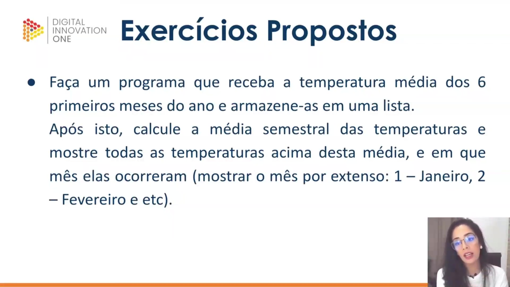
</p>

Esta imagem apresenta o primeiro exercício proposto para fixação do conteúdo sobre listas. O objetivo é exercitar a lógica de programação através da manipulação de coleções e cálculos simples. O desafio consiste em desenvolver um programa que:

1. **Entrada de Dados**: Receba a temperatura média dos seis primeiros meses do ano.
2. **Armazenamento**: Guarde esses valores em uma lista.
3. **Processamento**: Calcule a média aritmética semestral dessas temperaturas.
4. **Saída**: Exiba quais temperaturas ficaram acima da média calculada e identifique o mês correspondente por extenso (ex: 1 - Janeiro, 2 - Fevereiro).

Para a resolução, será necessário percorrer a lista para realizar a soma e o cálculo da média, e posteriormente filtrar os dados para a exibição dos resultados condicionais.

<p align="center">
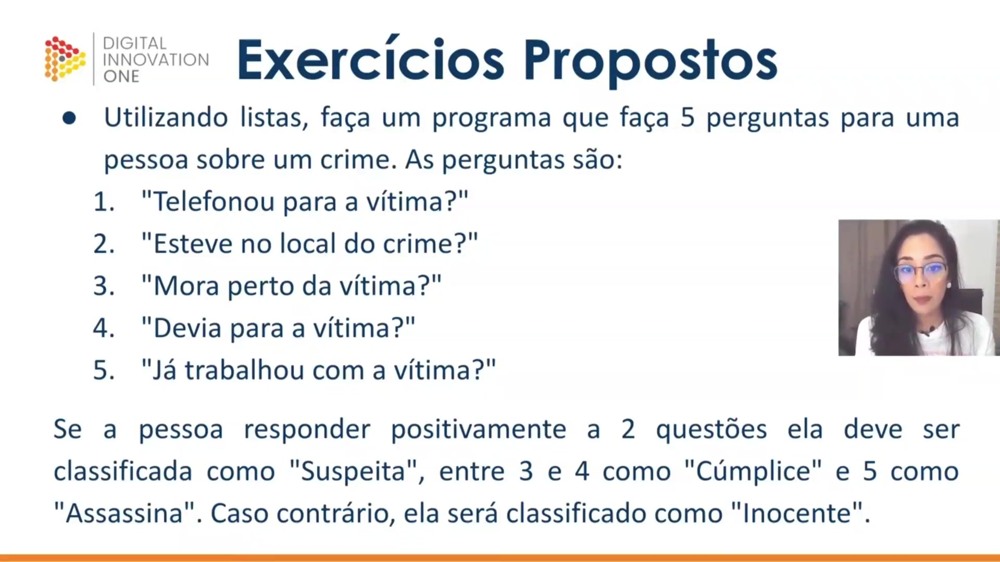
</p>

O segundo exercício proposto foca na utilização de listas para classificação baseada em múltiplas entradas. O programa deve simular um interrogatório sobre um crime, realizando cinco perguntas específicas:

* "Telefonou para a vítima?"
* "Esteve no local do crime?"
* "Mora perto da vítima?"
* "Devia para a vítima?"
* "Já trabalhou com a vítima?"

As respostas (positivas ou negativas) devem ser armazenadas em uma lista. A classificação final do indivíduo dependerá da quantidade de respostas positivas coletadas:

* **2 respostas**: Suspeita
* **3 a 4 respostas**: Cúmplice
* **5 respostas**: Assassina
* **Menos de 2**: Inocente

Este exercício visa praticar a filtragem de elementos dentro de uma lista e a aplicação de estruturas condicionais encadeadas.

<p align="center">

</p>

Nesta imagem, são apresentados os canais de referência para consulta das resoluções dos exercícios e contato com a instrutora. É reforçado que não existe uma única solução correta em programação, incentivando o aluno a tentar resolver os desafios de forma autônoma antes de comparar com o código de referência disponível no GitHub.

**Redes Sociais e Repositório:**

* **GitHub**: [https://github.com/cami-la/curso-dio-intro-collections](https://github.com/cami-la/curso-dio-intro-collections)
* **LinkedIn**: [https://www.linkedin.com/in/cami-la/](https://www.linkedin.com/in/cami-la/)
* **Instagram**: @camimi_la

Além do repositório, o suporte para dúvidas e discussões pode ser realizado através do fórum da plataforma DIO ou pela comunidade no Discord. Com a conclusão deste módulo de `List`, o próximo tópico abordado será a interface `Set`.      

## Parte 3 - Set

### 🟩 Vídeo 09 - Coleções com singularidade: Set

<video width="60%" controls>
  <source src="000-Midia_e_Anexos/bootcamp_tqi_fullstack-modulo.06-curso.06-video_09.webm" type="video/webm">
    Seu navegador não suporta vídeo HTML5.
</video>

link do vídeo: https://web.dio.me/track/tqi-fullstack-developer/course/trabalhando-com-collections-java/learning/f9fb3d0e-8999-4a2a-8735-24144ae40d8e?autoplay=1

Este vídeo apresenta uma introdução detalhada à interface Set do framework de Collections do Java, destacando suas características fundamentais, como a proibição de elementos duplicados e a ausência de índices. O conteúdo explora as três principais implementações — HashSet, LinkedHashSet e TreeSet — comparando seus comportamentos em termos de ordenação, performance e permissão de valores nulos, servindo como um guia prático para desenvolvedores escolherem a estrutura de dados mais adequada às suas necessidades.

 ### Anotações

<p align="center">
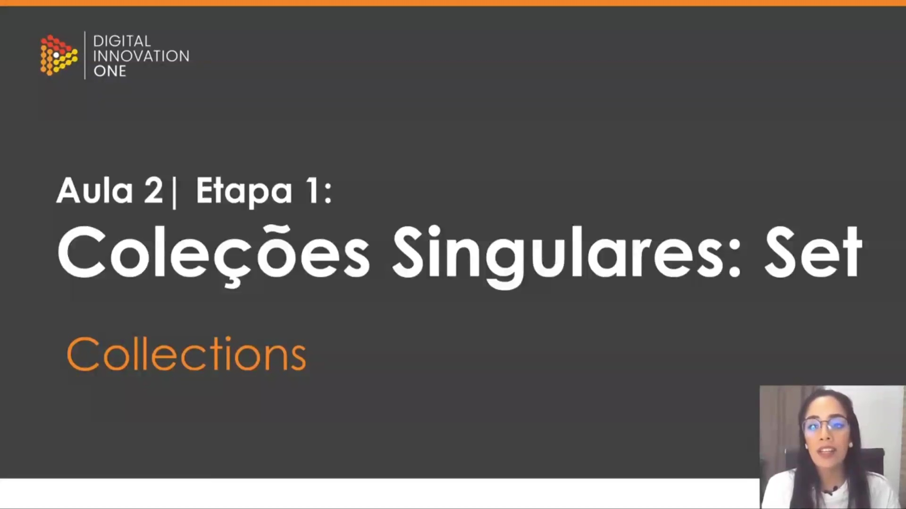
</p>

Nesta introdução à segunda aula do curso de Collections, iniciamos a etapa focada em **Coleções Singulares: Set**. O objetivo central é explorar como essa interface se comporta dentro do ecossistema Java e quais são as suas particularidades em relação a outras estruturas de dados.

<p align="center">
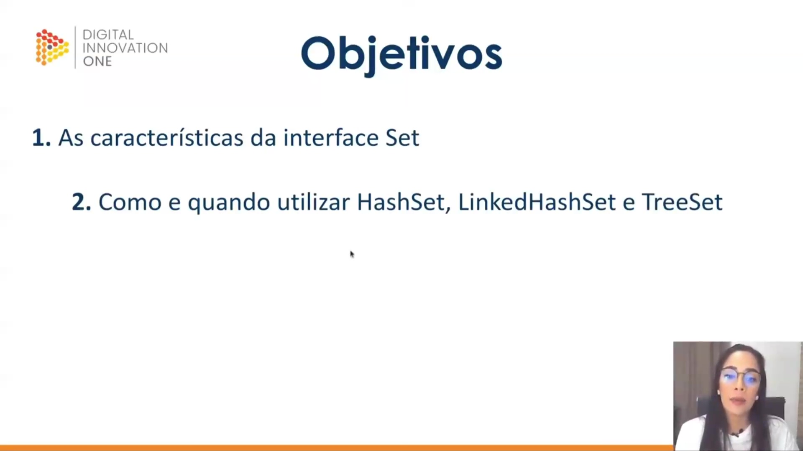
</p>

Os objetivos desta aula estão divididos em dois pontos principais:

1. **Características da interface Set:** Compreender as regras fundamentais que regem todas as coleções do tipo Set.
2. **Implementações específicas:** Entender o funcionamento, as diferenças e o momento ideal para utilizar **HashSet**, **LinkedHashSet** e **TreeSet**, além de conhecer seus métodos essenciais.

<p align="center">
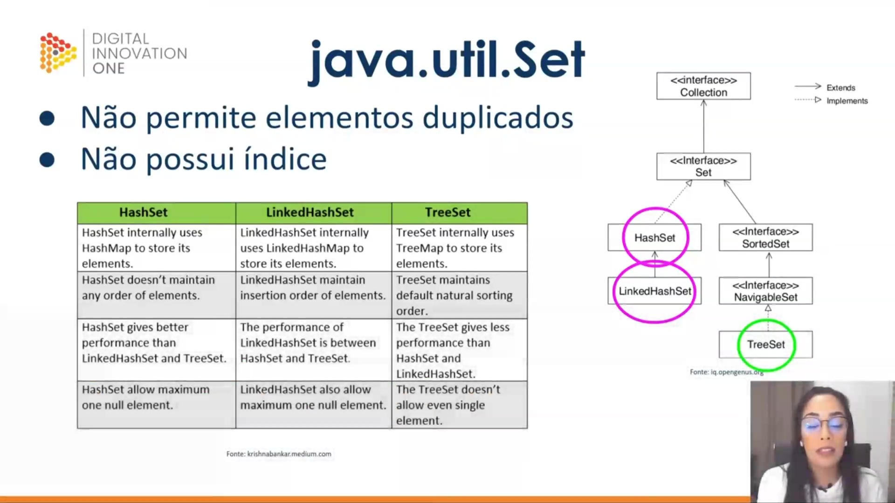
</p>

A interface `java.util.Set` possui características marcantes que a definem: **não permite elementos duplicados** e **não possui índice**. A ausência de índice significa que não é possível recuperar elementos por uma posição numérica (como o método `get(int index)` da interface List) ou realizar substituições baseadas em posição.

A hierarquia de classes e interfaces define o comportamento de cada implementação:

* **HashSet:** Implementa a interface `Set` diretamente. Internamente, utiliza uma `HashMap` para armazenar elementos. Não garante nenhuma ordem (a disposição é aleatória), oferece a melhor performance e permite um elemento nulo.
* **LinkedHashSet:** Estende `HashSet` e mantém a **ordem de inserção** dos elementos, utilizando internamente uma `LinkedHashMap`. Sua performance é intermediária e também permite um elemento nulo.
* **TreeSet:** Implementa `NavigableSet` (que estende `SortedSet`). Utiliza uma `TreeMap` para manter os elementos em sua **ordem natural** (alfabética ou numérica) ou através de um `Comparator`. É a implementação com performance mais lenta e **não permite elementos nulos**.


### 🟩 Vídeo 10 - Conhecendo os métodos Set

<video width="60%" controls>
  <source src="000-Midia_e_Anexos/bootcamp_tqi_fullstack-modulo.06-curso.06-video_10.webm" type="video/webm">
    Seu navegador não suporta vídeo HTML5.
</video>

link do vídeo: https://web.dio.me/track/tqi-fullstack-developer/course/trabalhando-com-collections-java/learning/e28b9311-8659-4fe4-a4e1-f4ce47a9210d?autoplay=1

O vídeo apresenta uma comparação prática entre as interfaces List e Set. Embora ambas herdem de Collection, o Set possui características únicas: não permite elementos duplicados e, em sua implementação padrão (HashSet), não garante a ordem dos elementos. A aula demonstra como realizar operações comuns (soma, média, busca, remoção) e como escolher a implementação correta de acordo com a necessidade de ordenação.

### Anotações

Nesta aula, exploramos a implementação da interface `Set` em Java, utilizando como base um exercício prático com notas de alunos. O objetivo principal é destacar as diferenças fundamentais entre `List` e `Set`, observando como os conjuntos lidam com a ordenação e a duplicidade de elementos. 

```java
package br.com.dio.collection.set;


import java.util.*;

public class ExemploSet {
    public static void main(String[] args) {
// Dada uma lista com 7 notas de um aluno [7, 8.5, 9.3, 5, 7, 0, 3.6], faça:

//      Set notas = new HashSet(); //antes do java 5
//      HashSet<Double> notas = new HashSet<>();
//      Set<Double> notas = new HashSet<>(); //Generics(jdk 5) - Diamont Operator(jdk 7)
/*      Set<Double> notas = Set.of(7d, 8.5, 9.3, 5d, 7d, 0d, 3.6);
        notas.add(1d);
        notas.remove(5d);
        System.out.println(notas);
*/

        System.out.println("Crie um conjunto e adicione as notas: ");
        Set<Double> notas = new HashSet<>(Arrays.asList(7d, 8.5, 9.3, 5d, 7d, 0d, 3.6));
        System.out.println(notas.toString());

//        System.out.println("Exiba a posição da nota 5.0: ");

//        System.out.println("Adicione na lista a nota 8.0 na posição 4: ");

//        System.out.println("Substitua a nota 5.0 pela nota 6.0: ");

        System.out.println("Confira se a nota 5.0 está no conjunto: " + notas.contains(5d));

//        System.out.println("Exiba a terceira nota adicionada: ");

        System.out.println("Exiba a menor nota: " + Collections.min(notas));

        System.out.println("Exiba a maior nota: " + Collections.max(notas));

        Iterator<Double> iterator = notas.iterator();
        Double soma = 0.0;
        while(iterator.hasNext()) {
            Double next = iterator.next();
            soma += next;
        }
        System.out.println("Exiba a soma dos valores: " + soma);

        System.out.println("Exiba a média das notas: " + (soma/ notas.size()));

        System.out.println("Remova a nota 0: ");
        notas.remove(0d);
        System.out.println(notas);

//        System.out.println("Remova a nota da posição 0");

        System.out.println("Remova as notas menores que 7 e exiba a lista: ");
        Iterator<Double> iterator1 = notas.iterator();
        while(iterator1.hasNext()){
            Double next = iterator1.next();
            if (next < 7) iterator1.remove();
        }
        System.out.println(notas);

        System.out.println("Exiba todas as notas na ordem em que foram informados: ");
        Set<Double> notas2 = new LinkedHashSet<>();
        notas2.add(7d);
        notas2.add(8.5);
        notas2.add(9.3);
        notas2.add(5d);
        notas2.add(7d);
        notas2.add(0d);
        notas2.add(3.6);
        System.out.println(notas2);

        System.out.println("Exiba todas as notas na ordem crescente: ");
        Set<Double> notas3 = new TreeSet<>(notas2);
        System.out.println(notas3);

        System.out.println("Apague todo o conjunto");
        notas.clear();

        System.out.println("Confira se o conjunto está vazio: " + notas.isEmpty());
        System.out.println("Confira se o conjunto 2 está vazio: " + notas2.isEmpty());
        System.out.println("Confira se o conjunto 3 está vazio: " + notas3.isEmpty());

    }
}
```

#### Inicialização e Características do HashSet

A imagem demonstra diferentes formas de inicializar um `Set`, desde sintaxes anteriores ao Java 5 até o uso de **Generics** e do **Diamond Operator**. Na prática principal, utilizamos a implementação `HashSet`. 

Ao adicionar os elementos `[7, 8.5, 9.3, 5, 7, 0, 3.6]` ao `HashSet`, observamos comportamentos específicos: 

* **Não ordenação:** Os elementos são exibidos em ordem aleatória, pois o `HashSet` não garante a ordem de inserção.
* **Unicidade:** O valor `7` (repetido na lista original) é inserido apenas uma vez no conjunto. [00:01:00, cite: 17, 116]

#### Limitações de Acesso por Índice

Diferente das listas, a interface `Set` (especialmente no `HashSet`) não permite buscas ou manipulações baseadas em posição ou índice.

* Não existe o método `get(index)`, impossibilitando exibir a "terceira nota adicionada" ou a "nota na posição 4".
* Não é possível substituir um valor em uma posição específica via método `set`.

#### Operações com Collections e Iterator

Apesar das restrições de índice, podemos realizar operações comuns a todas as `Collection`:

* **Busca:** O método `contains(5d)` retorna `true` se o elemento estiver presente. [00:02:30, cite: 42, 43]
* **Análise:** Métodos como `Collections.min(notas)` e `Collections.max(notas)` funcionam normalmente para encontrar os valores extremos. [00:02:30, 00:03:00, cite: 50, 54]
* **Soma e Média:** Utilizamos um `Iterator` para percorrer o conjunto e acumular os valores na variável `soma`, dividindo posteriormente pelo `size()` para obter a média. [00:03:30, 00:04:30, cite: 57, 58, 81, 82]
* **Remoção Condicional:** Também via `Iterator`, é possível remover elementos que atendam a um critério (ex: notas menores que 7). [00:05:30, cite: 87, 96]

#### Preservando a Ordem e Ordenação Natural

Para contornar a natureza aleatória do `HashSet`, utilizamos outras implementações:

* **LinkedHashSet:** Mantém a ordem em que os elementos foram informados. [00:06:00, cite: 106]
* **TreeSet:** Armazena os elementos seguindo sua ordem natural (crescente). 


### 🟩 Vídeo 11 - Ordenação de elementos em uma coleção Set

<video width="60%" controls>
  <source src="000-Midia_e_Anexos/bootcamp_tqi_fullstack-modulo.06-curso.06-video_11.webm" type="video/webm">
    Seu navegador não suporta vídeo HTML5.
</video>

link do vídeo: https://web.dio.me/track/tqi-fullstack-developer/course/trabalhando-com-collections-java/learning/2b0fd52a-7424-4bf7-89be-376483007b3d?autoplay=1

Este guia resume a aula prática sobre como criar, manipular e ordenar coleções do tipo Set em Java, utilizando como exemplo um conjunto de séries de TV. O foco principal é entender as diferenças entre HashSet, LinkedHashSet e TreeSet, além da implementação das interfaces Comparable e Comparator.

### Anotações

Nesta aula, exploramos a ordenação de conjuntos (`Set`) em Java utilizando diferentes implementações e critérios. O objetivo inicial é criar um conjunto de séries favoritas contendo nome, gênero e tempo de episódio, para então exibir esses dados em ordens variadas: aleatória, de inserção e natural. 

```java
package br.com.dio.collection.set;

/*Dadas as seguintes informações sobre minhas séries favoritas,
crie um conjunto e ordene este conjunto exibindo:
(nome - genero - tempo de episódio);

Série 1 = Nome: got, genero: fantasia, tempoEpisodio: 60
Série 2 = nome: dark, genero: drama, tempoEpisodio: 60
Série 3 = nome: that '70s show, genero: comédia, tempoEpisodio: 25
*/

import java.util.*;

public class ExemploOrdenacaoSet {
    public static void main(String[] args) {

        System.out.println("--\tOrdem aleatória\t--");
        Set<Serie> minhasSeries = new HashSet<>(){{
            add(new Serie("got", "fantasia", 60));
            add(new Serie("dark", "drama", 60));
            add(new Serie("that '70s show", "comédia", 25));
        }};
        for (Serie serie: minhasSeries) System.out.println(serie.getNome() + " - "
                + serie.getGenero() + " - " + serie.getTempoEpisodio());

        System.out.println("--\tOrdem inserção\t--");
        Set<Serie> minhasSeries1 = new LinkedHashSet<>() {{
            add(new Serie("got", "fantasia", 60));
            add(new Serie("dark", "drama", 60));
            add(new Serie("that '70s show", "comédia", 25));
        }};
        for (Serie serie: minhasSeries1) System.out.println(serie.getNome() + " - "
                + serie.getGenero() + " - " + serie.getTempoEpisodio());

        System.out.println("--\tOrdem natural (TempoEpisodio)\t--");
        Set<Serie> minhasSeries2 = new TreeSet<>(minhasSeries1);
        for (Serie serie: minhasSeries2) System.out.println(serie.getNome() + " - "
                + serie.getGenero() + " - " + serie.getTempoEpisodio());

        System.out.println("--\tOrdem Nome/Gênero/TempoEpisodio\t--");
        Set<Serie> minhasSeries3 = new TreeSet<>(new ComparatorNomeGeneroTempoEpisodio());
        minhasSeries3.addAll(minhasSeries);
        for (Serie serie: minhasSeries3) System.out.println(serie.getNome() + " - "
                + serie.getGenero() + " - " + serie.getTempoEpisodio());

//Pra você
/*        System.out.println("--\tOrdem gênero\t--");

          System.out.println("--\tOrdem Tempo Episódio\t--");
 */

    }
}

class Serie implements Comparable<Serie>{
    private String nome;
    private String genero;
    private Integer tempoEpisodio;

    public Serie(String nome, String genero, Integer tempoEpisodio) {
        this.nome = nome;
        this.genero = genero;
        this.tempoEpisodio = tempoEpisodio;
    }

    public String getNome() {
        return nome;
    }

    public String getGenero() {
        return genero;
    }

    public Integer getTempoEpisodio() {
        return tempoEpisodio;
    }

    @Override
    public String toString() {
        return "{" +
                "nome='" + nome + '\'' +
                ", genero='" + genero + '\'' +
                ", tempoEpisodio=" + tempoEpisodio +
                '}';
    }

    @Override
    public boolean equals(Object o) {
        if (this == o) return true;
        if (o == null || getClass() != o.getClass()) return false;
        Serie serie = (Serie) o;
        return nome.equals(serie.nome) && genero.equals(serie.genero) && tempoEpisodio.equals(serie.tempoEpisodio);
    }

    @Override
    public int hashCode() {
        return Objects.hash(nome, genero, tempoEpisodio);
    }

    @Override
    public int compareTo(Serie serie) {
        int tempoEpisodio = Integer.compare(this.getTempoEpisodio(), serie.getTempoEpisodio());
        if (tempoEpisodio != 0) return tempoEpisodio;

        return this.getGenero().compareTo(serie.getGenero());
    }
}

class ComparatorNomeGeneroTempoEpisodio implements Comparator<Serie>{

    @Override
    public int compare(Serie s1, Serie s2) {
        int nome = s1.getNome().compareTo(s2.getNome());
        if (nome != 0) return nome;

        int genero = s1.getGenero().compareTo(s2.getGenero());
        if (genero != 0) return genero;

        return Integer.compare(s1.getTempoEpisodio(), s2.getTempoEpisodio());
    }
}
```

#### Definição da Classe Base e Ordem Aleatória

Para manipular os dados, criamos a classe `Serie` com os atributos `nome`, `genero` e `tempoEpisodio`. É fundamental sobrescrever os métodos `equals` e `hashCode`, garantindo que o conjunto identifique corretamente objetos únicos, especialmente ao utilizar implementações "hash". 

Utilizamos o `HashSet` para a primeira exibição. Esta implementação não garante nenhuma ordem específica, resultando em uma disposição aleatória dos elementos ao imprimir o conjunto. 

```java
public class ExemploOrdenacaoSet {
    public static void main(String[] args) {
        System.out.println("--\tordem aleatória\t--");
        Set<Serie> minhasSeries = new HashSet<>(){{
            add(new Serie("got", "fantasia", 68));
            add(new Serie("dark", "drama", 60));
            add(new Serie("that '70s show", "comédia", 25));
        }};
        for (Serie serie : minhasSeries) System.out.println(serie.getNome() + " - " 
            + serie.getGenero() + " - " + serie.getTempoEpisodio());
    }
}

```

#### Ordem de Inserção e Ordem Natural

Para manter os elementos na ordem em que foram adicionados, utilizamos o `LinkedHashSet`. Já para a **ordem natural**, empregamos o `TreeSet`. Para que o `TreeSet` funcione, a classe `Serie` deve implementar a interface `Comparable`, definindo o critério de comparação (neste caso, o `tempoEpisodio`). 

Um detalhe importante no `TreeSet` é que, se dois objetos possuem o mesmo valor no critério de comparação (como séries com o mesmo tempo de episódio), o `Set` descartará um deles por considerá-los iguais. Para evitar isso, adicionamos um critério de desempate, como o gênero. 

```java
// Implementação do Comparable na classe Serie
public int compareTo(Serie serie) {
    int tempoEpisodio = Integer.compare(this.getTempoEpisodio(), serie.getTempoEpisodio());
    if (tempoEpisodio != 0) return tempoEpisodio;
    return this.getGenero().compareTo(serie.getGenero());
}

```

#### Ordenação Personalizada com Comparator

Quando precisamos de uma ordenação que foge à regra natural, criamos uma classe que implementa `Comparator`. No exemplo `ComparatorNomeGeneroTempoEpisodio`, definimos uma hierarquia de comparação: primeiro pelo nome, depois pelo gênero e, por fim, pelo tempo de episódio. 

```java
class ComparatorNomeGeneroTempoEpisodio implements Comparator<Serie> {
    @Override
    public int compare(Serie s1, Serie s2) {
        int nome = s1.getNome().compareTo(s2.getNome());
        if (nome != 0) return nome;

        int genero = s1.getGenero().compareTo(s2.getGenero());
        if (genero != 0) return genero;

        return Integer.compare(s1.getTempoEpisodio(), s2.getTempoEpisodio());
    }
}

```

Para aplicar essa lógica, passamos uma instância do comparador no construtor do `TreeSet` e utilizamos o método `addAll` para povoar o novo conjunto organizado. 


### 🟩 Vídeo 12 - Exercícios Propostos Set

<video width="60%" controls>
  <source src="000-Midia_e_Anexos/bootcamp_tqi_fullstack-modulo.06-curso.06-video_12.webm" type="video/webm">
    Seu navegador não suporta vídeo HTML5.
</video>

link do vídeo: https://web.dio.me/track/tqi-fullstack-developer/course/trabalhando-com-collections-java/learning/fcf392c8-9c8a-45dd-8146-b64d0e342ff0?autoplay=1

Este módulo foca na aplicação prática dos conceitos de conjuntos (Set) na linguagem Java. O instrutor propõe dois desafios principais que visam consolidar o conhecimento sobre manipulação, ordenação e filtragem de dados que não permitem duplicidade.

### Anotações

<p align="center">
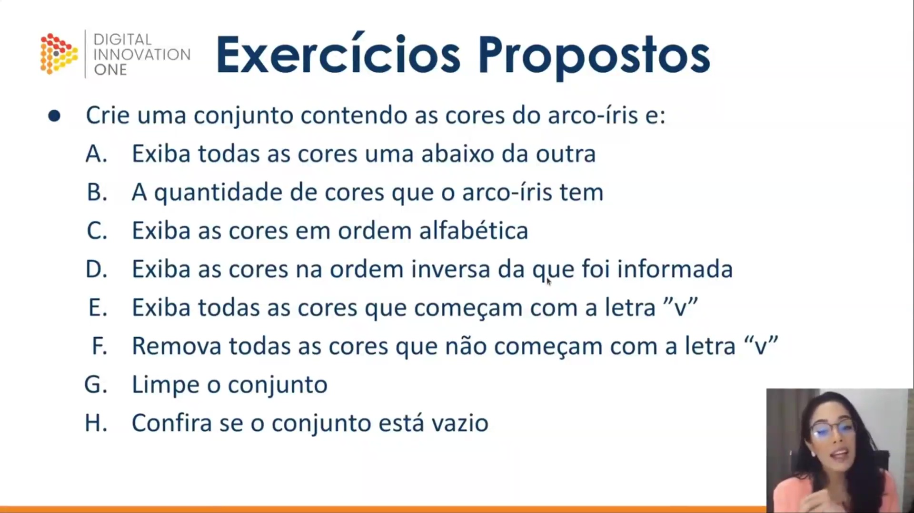
</p>

Esta imagem apresenta uma série de exercícios propostos para consolidar o conhecimento sobre a interface `Set` em Java. O desafio principal consiste em criar um conjunto para armazenar as cores do arco-íris e realizar diversas operações de manipulação e exibição.

Os objetivos práticos incluem:

* **Exibição e Contagem:** Listar todas as cores, uma abaixo da outra, e verificar a quantidade total de elementos que o conjunto possui.
* **Ordenação:** Exibir os dados em ordem alfabética e na ordem inversa à da que foi informada.
* **Filtragem:** Selecionar e exibir apenas as cores que começam com a letra "v", além de remover do conjunto todas as cores que não atendem a esse critério.
* **Gerenciamento de Estado:** Limpar completamente o conjunto e conferir se a estrutura ficou vazia.

<p align="center">
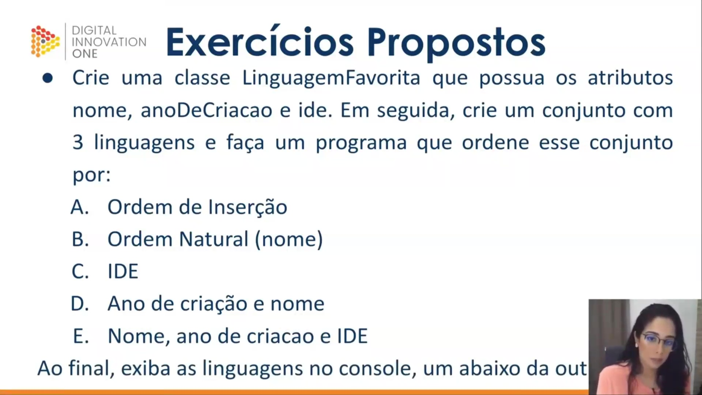
</p>

Esta imagem detalha um exercício focado na ordenação de objetos personalizados dentro de coleções. O objetivo é criar uma classe chamada `LinguagemFavorita` contendo os atributos `nome`, `anoDeCriacao` e `ide`.

Após criar um conjunto com três linguagens, o programa deve ordenar essa coleção seguindo diferentes critérios:

* **Ordem de Inserção:** Mantendo a sequência em que os elementos foram adicionados ao conjunto.
* **Ordem Natural:** Realizando a ordenação baseada no atributo `nome`.
* **IDE:** Ordenando os elementos pelo nome da IDE utilizada.
* **Critérios Compostos:** Ordenações combinadas por `Ano de criação e nome`, ou por `Nome, ano de criação e IDE`.

Ao final, o programa deve exibir as linguagens no console, uma abaixo da outra, para validar os resultados das ordenações aplicadas.


## Parte 4 - Map

### 🟩 Vídeo 13 - Coleções de pares: Map

<video width="60%" controls>
  <source src="000-Midia_e_Anexos/bootcamp_tqi_fullstack-modulo.06-curso.06-video_13.webm" type="video/webm">
    Seu navegador não suporta vídeo HTML5.
</video>

link do vídeo: https://web.dio.me/track/tqi-fullstack-developer/course/trabalhando-com-collections-java/learning/67376a55-e735-4b35-8b33-323cf5e0e74e?autoplay=1

Este vídeo aborda a interface Map em Java, suas características, implementações comuns (HashMap, LinkedHashMap, TreeMap) e um comparativo entre elas.

### Anotações

<p align="center">
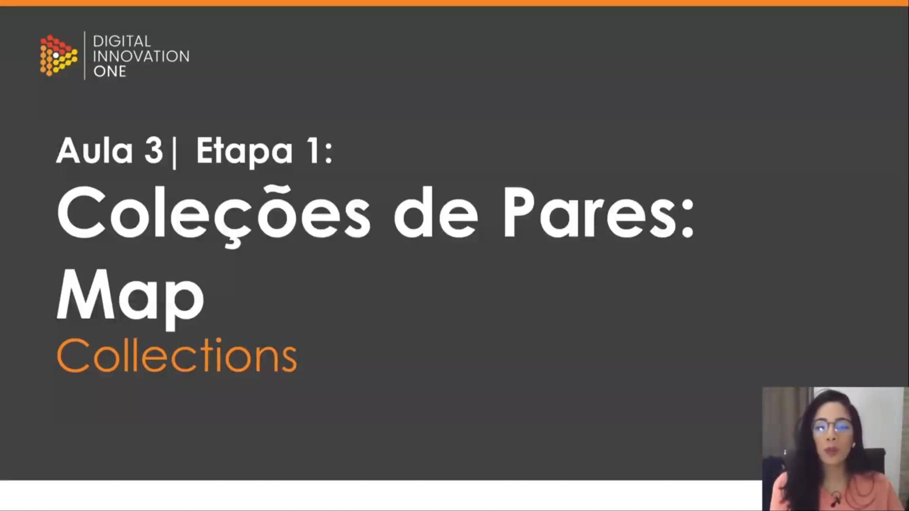
</p>

### Introdução à Interface Map e sua Hierarquia

A interface **Map**, pertencente ao pacote `java.util`, representa uma estrutura de dados distinta das interfaces `List` e `Set`. Diferente delas, o **Map não estende a interface Collection**, embora faça parte do framework de coleções do Java. Sua principal característica é o armazenamento de elementos no formato de **Pares (Chave e Valor)**.

Nesta estrutura:

* **Chaves (Key):** Devem ser únicas e não permitem duplicidade.
* **Valores (Value):** Podem ser repetidos e estão associados a uma chave específica.

A hierarquia apresentada destaca as principais implementações e subinterfaces:

* **Hashtable:** Uma implementação antiga e *thread-safe*.
* **HashMap e LinkedHashMap:** Onde a `LinkedHashMap` estende a funcionalidade da `HashMap`.
* **TreeMap:** Uma implementação que garante a ordenação, estendendo `NavigableMap` e `SortedMap`.

<p align="center">
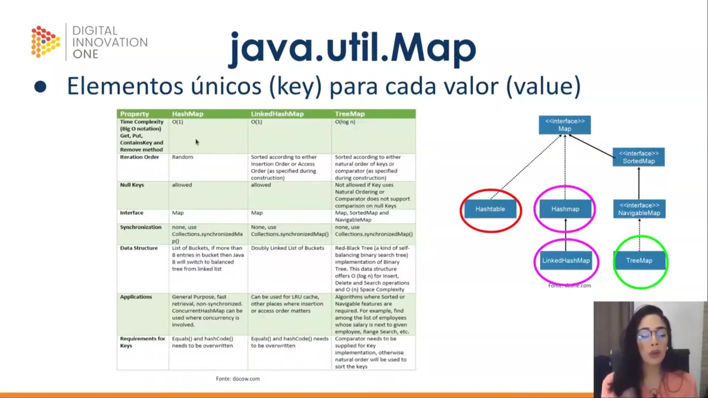
</p>

### Comparativo Técnico entre Implementações Map

Para escolher a implementação ideal, é necessário analisar critérios de performance, ordenação e estrutura de dados. Abaixo, os dados comparativos detalhados entre **HashMap**, **LinkedHashMap** e **TreeMap**:

| Propriedade | HashMap | LinkedHashMap | TreeMap |
| --- | --- | --- | --- |
| **Complexidade (Big O)** |  |  |  |
| **Ordem de Iteração** | Aleatória | Ordem de Inserção ou Acesso | Ordem Natural ou Comparator |
| **Chaves Nulas** | Permitido | Permitido | Não permitido (para ordem natural) |
| **Interface** | Map | Map | Map, SortedMap e NavigableMap |
| **Sincronização** | Nenhuma (Manual via Collections) | Nenhuma (Manual via Collections) | Nenhuma (Manual via Collections) |
| **Estrutura de Dados** | Tabela Hash (List of Buckets) | Lista Duplamente Encadeada | Árvore Rubro-Negra (Red-Black Tree) |

**Considerações Importantes:**

* **Performance:** `HashMap` e `LinkedHashMap` oferecem alta performance para operações básicas como `get`, `put` e `remove`. O `TreeMap` é ligeiramente mais lento devido ao esforço de manter a árvore balanceada e ordenada.
* **Casos de Uso:** Use `TreeMap` quando precisar de busca por intervalos ou ordenação constante. O `LinkedHashMap` é ideal para caches (como o LRU) onde a ordem de acesso importa.
* **Requisitos de Chave:** Para as implementações baseadas em Hash, é obrigatório sobrescrever os métodos `equals()` e `hashCode()` para garantir o funcionamento correto da coleção. No caso do `TreeMap`, a chave deve implementar `Comparable` ou um `Comparator` deve ser fornecido.

O próximo passo é colocar esse conhecimento em prática através dos principais métodos de manipulação dessas coleções.      


### 🟩 Vídeo 14 - Conhecendo os métodos Map - parte 1

<video width="60%" controls>
  <source src="000-Midia_e_Anexos/bootcamp_tqi_fullstack-modulo.06-curso.06-video_14.webm" type="video/webm">
    Seu navegador não suporta vídeo HTML5.
</video>

link do vídeo: https://web.dio.me/track/tqi-fullstack-developer/course/trabalhando-com-collections-java/learning/961c9cdc-fd2d-459f-b4dd-95892ad88552?autoplay=1

Este vídeo aborda a implementação técnica e os conceitos fundamentais da interface Map no Java, utilizando um exemplo prático de consumo de combustível de diferentes modelos de carros.

### Anotações

Nesta aula prática, exploramos a interface **Map** do Java, focando em como gerenciar coleções de pares chave-valor. O exercício proposto consiste em criar um dicionário para relacionar modelos de carros aos seus respectivos consumos de combustível na estrada.

```java
package br.com.dio.collection.map;

import java.util.*;

public class ExemploMap {
    public static void main(String[] args) {
/*
 Dada os modelos dos carros e seus respectivos consumos na estrada, faça:
 modelo = gol - consumo = 14,4km/l
 modelo = uno - consumo = 15,6 km/l
 modelo = mobi - consumo = 16,1 km/l
 modelo = hb20 - consumo = 14,5 km/l
 modelo = kwid - consumo = 15,6 km/l
 */

//        Map carrosPopulares2020 = new HashMap(); //antes do java 5
//        Map<String, Double> carrosPopulares = new HashMap<>(); //Generics(jdk 5) - Diamont Operator(jdk 7)
//        HashMap<String, Double> carrosPopulares = new HashMap<>();
//        Map<String, Double> carrosPopulares2020 = Map.of("gol", 14.4, "uno", 15.6, "mobi", 16.1, "hb20", 14.5, "kwid", 15.6)

        System.out.println("Crie um dicionário que relacione os modelos e seus respectivos consumos: ");
        Map<String, Double> carrosPopulares = new HashMap<>() {{
            put("gol", 14.4);
            put("uno", 15.6);
            put("mobi", 16.1);
            put("hb20", 14.5);
            put("kwid", 15.6);
        }};
        System.out.println(carrosPopulares.toString());

        System.out.println("Substitua o consumo do gol por 15,2 km/l: ");
        carrosPopulares.put("gol", 15.2);
        System.out.println(carrosPopulares);

        System.out.println("Confira se o modelo tucson está no dicionário: " + carrosPopulares.containsKey("tucson"));

        System.out.println("Exiba o consumo do uno: " + carrosPopulares.get("uno"));

//        System.out.println("Exiba o terceiro modelo adicionado: ");

        System.out.println("Exiba os modelos: ");
        Set<String> modelos = carrosPopulares.keySet();
        System.out.println(modelos);

        System.out.println("Exiba os consumos dos carros: ");
        Collection<Double> consumos = carrosPopulares.values();
        System.out.println(consumos);

        System.out.println("Exiba o modelo mais econômico e seu consumo: ");

        Double consumoMaisEficiente = Collections.max(carrosPopulares.values());
        Set<Map.Entry<String, Double>> entries = carrosPopulares.entrySet();
        String modeloMaisEficiente = "";

        for (Map.Entry<String, Double> entry : entries) {
            if (entry.getValue().equals(consumoMaisEficiente)) {
                modeloMaisEficiente = entry.getKey();
                System.out.println("Modelo mais eficiente: " + modeloMaisEficiente + " - " + consumoMaisEficiente);
            }
        }

        System.out.println("Exiba o modelo menos econômico e seu consumo: " );

        Double consumoMenosEficiente = Collections.min(carrosPopulares.values());
        String modeloMenosEficiente = "";
        for (Map.Entry<String, Double> entry: carrosPopulares.entrySet()) {
            if(entry.getValue().equals(consumoMenosEficiente)) {
                modeloMenosEficiente = entry.getKey();
                System.out.println("Modelo menos eficiente: " + modeloMenosEficiente + " - " + consumoMenosEficiente);
            }
        }

        Iterator<Double> iterator = carrosPopulares.values().iterator();
        Double soma = 0d;
        while(iterator.hasNext()){
            soma += iterator.next();
        }
        System.out.println("Exiba a soma dos consumos: " + soma);

        System.out.println("Exiba a média dos consumos deste dicionário de carros: " + (soma/carrosPopulares.size()));

        System.out.println(carrosPopulares);
        System.out.println("Remova os modelos com o consumo igual a 15,6 km/l: ");
        Iterator<Double> iterator1 = carrosPopulares.values().iterator();
        while(iterator1.hasNext()){
            if(iterator1.next().equals(15.6)) iterator1.remove();
        }
        System.out.println(carrosPopulares);

        System.out.println("Exiba todos os carros na ordem em que foram informados: ");
        Map<String, Double> carrosPopulares1 = new LinkedHashMap<>() {{
            put("gol", 14.4);
            put("uno", 15.6);
            put("mobi", 16.1);
            put("hb20", 14.5);
            put("kwid", 15.6);
        }};
        System.out.println(carrosPopulares1.toString());

        System.out.println("Exiba o dicionário ordenado pelo modelo: ");
        Map<String, Double> carrosPopulares2 = new TreeMap<>(carrosPopulares1);
        System.out.println(carrosPopulares2.toString());

        System.out.println("Apague o dicionario de carros: ");
        carrosPopulares.clear();

        System.out.println("Confira se o dicionário está vazio: " + carrosPopulares.isEmpty());
    }
}
```

Diferente das listas (List) ou conjuntos (Set), o Map não utiliza o método `add`. Para inserir dados, utilizamos o método `put(K key, V value)`, onde definimos o tipo da chave (neste caso, `String` para o modelo) e o tipo do valor (`Double` para o consumo). Uma característica fundamental do Map é que as **chaves são únicas**; se tentarmos inserir uma chave já existente, o valor será sobrescrito pelo novo, funcionando como uma operação de substituição.

No exemplo visualizado, utilizamos a implementação `HashMap`. É importante notar que o `HashMap` não garante a ordem de inserção dos elementos. Para conferir o conteúdo, podemos imprimir o dicionário diretamente ou verificar a existência de chaves específicas através do método `containsKey()`.

Além das operações básicas, o código demonstra como encontrar valores extremos em uma coleção usando `Collections.max()` e `Collections.min()` sobre os valores do mapa. Para identificar qual chave pertence a um determinado valor (como descobrir o carro mais eficiente), utilizamos o `entrySet()`, que permite iterar sobre os pares de entrada e acessar métodos como `getKey()` e `getValue()`.     
 

### 🟩 Vídeo 15- Conhecendo os métodos Map - parte 2

<video width="60%" controls>
  <source src="000-Midia_e_Anexos/bootcamp_tqi_fullstack-modulo.06-curso.06-video_15.webm" type="video/webm">
    Seu navegador não suporta vídeo HTML5.
</video>

link do vídeo: https://web.dio.me/track/tqi-fullstack-developer/course/trabalhando-com-collections-java/learning/961c9cdc-fd2d-459f-b4dd-95892ad88552?autoplay=1

Este vídeo demonstra diversas operações e métodos úteis para manipular estruturas de dados do tipo Map em Java, focando em como extrair, processar e organizar informações de um dicionário de carros (modelo e consumo)

### Anotações

Nesta etapa da aula, exploramos operações avançadas com a interface `Map` em Java, focando em como manipular coleções de dados de forma mais granular. O exemplo utiliza um dicionário de carros populares e seus respectivos consumos de combustível para demonstrar métodos de busca, iteração e ordenação. 

### Identificando Extremos e Manipulando Entradas

Para encontrar o modelo menos econômico, utilizamos a classe `Collections.min()` aplicada aos valores do Map (`carrosPopulares.values()`). No entanto, como o método `values()` retorna apenas os números, é necessário utilizar o método `entrySet()` para obter um conjunto de entradas (`Map.Entry`) que vinculam a chave (modelo) ao valor (consumo).

Ao iterar sobre esse conjunto, comparamos o valor de cada entrada com o valor mínimo encontrado. Quando há uma correspondência, extraímos a chave associada através do método `getKey()`.

### Cálculos Agregados e Iteração

Para somar os consumos e calcular a média, utilizamos um `Iterator`. O iterador percorre a `Collection` de valores, acumulando a soma em uma variável. A média é obtida dividindo-se o total acumulado pelo tamanho do dicionário (`size()`).

### Remoção e Ordenação

A remoção de itens com base em um critério específico (neste caso, consumo igual a 15,6 km/l) também é realizada via `Iterator`, garantindo que a estrutura do Map não sofra erros de concorrência durante a exclusão.

Para organizar a exibição dos dados:

* **LinkedHashMap**: Utilizado para exibir os elementos na ordem exata em que foram inseridos.
* **TreeMap**: Utilizado para ordenar o dicionário automaticamente de acordo com a ordem natural das chaves (ordem alfabética dos modelos).

Por fim, o método `clear()` é demonstrado para esvaziar o dicionário, seguido de `isEmpty()` para validar que a estrutura não contém mais elementos.

```java
// Exemplo de manipulação de Map com Java
Map<String, Double> carrosPopulares = new HashMap<>() {{
    put("gol", 14.4);
    put("uno", 15.6);
    put("mobi", 16.1);
    put("hb20", 14.5);
    put("kwid", 15.6);
}};

// Encontrando o modelo menos eficiente
Double consumoMenosEficiente = Collections.min(carrosPopulares.values());
String modeloMenosEficiente = "";
for (Map.Entry<String, Double> entry : carrosPopulares.entrySet()) {
    if (entry.getValue().equals(consumoMenosEficiente)) {
        modeloMenosEficiente = entry.getKey();
        System.out.println("Modelo menos eficiente: " + modeloMenosEficiente + " - " + consumoMenosEficiente);
    }
}

// Removendo modelos com consumo específico
Iterator<Double> iterator1 = carrosPopulares.values().iterator();
while(iterator1.hasNext()){
    if(iterator1.next().equals(15.6)) iterator1.remove();
}

// Ordenação com TreeMap
Map<String, Double> carrosPopulares2 = new TreeMap<>(carrosPopulares);
System.out.println(carrosPopulares2.toString());

```

### 🟩 Vídeo 16 - Ordenação - Map

<video width="60%" controls>
  <source src="000-Midia_e_Anexos/bootcamp_tqi_fullstack-modulo.06-curso.06-video_16.webm" type="video/webm">
    Seu navegador não suporta vídeo HTML5.
</video>

link do vídeo: https://web.dio.me/track/tqi-fullstack-developer/course/trabalhando-com-collections-java/learning/9b8bf5b4-b3df-4ed8-8dd9-5f65cef933be?autoplay=1

Este vídeo demonstra como ordenar elementos dentro de diferentes tipos de Map em Java, explorando a ordenação aleatória, por inserção, alfabética pela chave e alfabética pelo valor, utilizando HashMap, LinkedHashMap, TreeMap e TreeSet com um Comparator personalizado.

### Anotações

Nesta aula, o objetivo é demonstrar como manipular e ordenar coleções do tipo `Map` em Java, utilizando diferentes implementações da interface para alcançar critérios específicos de organização (aleatória, inserção e alfabética).

```java
package br.com.dio.collection.map;

/*Dadas as seguintes informações sobre meus livros favoritos e seus autores,
crie um dicionário e ordene este dicionário:
exibindo (Nome Autor - Nome Livro);

Autor = Hawking, Stephen  - Livro = nome: Uma Breve História do Tempo. páginas: 256
Autor = Duhigg, Charles - Livro = nome: O Poder do Hábito, paginas: 408
Autor = Harari, Yuval Noah  - Livro = 21 Lições Para o Século 21, páginas: 432
*/

import java.util.*;

public class ExemploOrdenacaoMap {
    public static void main(String[] args) {

        System.out.println("--\tOrdem aleatória\t--");
        Map<String, Livro> meusLivros = new HashMap<>() {{
            put(" Hawking, Stephen", new Livro("Uma Breve História do Tempo", 256));
            put(" Duhigg, Charles", new Livro("O Poder do Hábito", 408));
            put(" Harari, Yuval Noah", new Livro("21 Lições Para o Século 21", 432));
        }};
        for (Map.Entry<String, Livro> livro : meusLivros.entrySet())
            System.out.println(livro.getKey() + " - " + livro.getValue().getNome());

        System.out.println("--\tOrdem Inserção\t--");
        Map<String, Livro> meusLivros1 = new LinkedHashMap<>() {{
            put(" Hawking, Stephen", new Livro("Uma Breve História do Tempo", 256));
            put(" Duhigg, Charles", new Livro("O Poder do Hábito", 408));
            put(" Harari, Yuval Noah", new Livro("21 Lições Para o Século 21", 432));
        }};
        for (Map.Entry<String, Livro> livro : meusLivros1.entrySet())
            System.out.println(livro.getKey() + " - " + livro.getValue().getNome());

        System.out.println("--\tOrdem alfabética autores\t--");
        Map<String, Livro> meusLivros2 = new TreeMap<>(meusLivros1);
        for (Map.Entry<String, Livro> livro : meusLivros2.entrySet())
            System.out.println(livro.getKey() + " - " + livro.getValue().getNome());

        System.out.println("--\tOrdem alfabética nomes dos livros\t--");

        Set<Map.Entry<String, Livro>> meusLivros3 = new TreeSet<>(new ComparatorNome());
        meusLivros3.addAll(meusLivros.entrySet());
        for (Map.Entry<String, Livro> livro : meusLivros3)
            System.out.println(livro.getKey() + " - " + livro.getValue().getNome());

//        System.out.println("--\tOrdem número de página\t--"); //Pra você

    }
}

class Livro {
    private String nome;
    private Integer paginas;

    public Livro(String nome, Integer paginas) {
        this.nome = nome;
        this.paginas = paginas;
    }

    public String getNome() {
        return nome;
    }

    public Integer getPaginas() {
        return paginas;
    }

    @Override
    public boolean equals(Object o) {
        if (this == o) return true;
        if (o == null || getClass() != o.getClass()) return false;
        Livro livro = (Livro) o;
        return nome.equals(livro.nome) && paginas.equals(livro.paginas);
    }

    @Override
    public int hashCode() {
        return Objects.hash(nome, paginas);
    }

    @Override
    public String toString() {
        return "Livro{" +
                "nome='" + nome + '\'' +
                ", paginas=" + paginas +
                '}';
    }
}

class ComparatorNome implements Comparator<Map.Entry<String, Livro>>{

    @Override
    public int compare(Map.Entry<String, Livro> l1, Map.Entry<String, Livro> l2) {
        return l1.getValue().getNome().compareToIgnoreCase(l2.getValue().getNome());
    }
}
```

Para exemplificar, é criado um dicionário de livros favoritos onde a **Chave (Key)** é o nome do autor (String) e o **Valor (Value)** é um objeto da classe `Livro`, que contém os atributos `nome` e `paginas`.

### Implementação da Classe Base

Para garantir o funcionamento correto das coleções, especialmente ao utilizar `HashMap` e `TreeMap`, a classe `Livro` deve ser implementada com o construtor, métodos acessores (getters) e a sobrescrita dos métodos essenciais:

* **`equals` e `hashCode**`: Necessários para que o Map consiga identificar e comparar os objetos corretamente.
* **`toString`**: Sobrescrito para que, ao imprimir os valores, o Java exiba os dados do livro em vez do endereço de memória.

### Formas de Ordenação Apresentadas

1. **Ordem Aleatória (`HashMap`)**: Os elementos são exibidos sem uma ordem garantida, variando conforme o hashing interno.
2. **Ordem de Inserção (`LinkedHashMap`)**: Mantém a sequência exata em que os autores e livros foram adicionados ao dicionário.
3. **Ordem Alfabética por Chave (`TreeMap`)**: Ordena automaticamente o dicionário com base no nome dos autores.
4. **Ordem Alfabética por Valor**: Para ordenar pelo nome do livro (que está no objeto `Livro`), utiliza-se um `TreeSet` recebendo um `Comparator` personalizado que acessa `getValue().getNome()`.

O desafio final proposto consiste em realizar a ordenação pelo número de páginas, seguindo a mesma lógica de criação de um `Comparator` específico para o campo `paginas`.


### 🟩 Vídeo 17 - Exercícios propostos - Map

<video width="60%" controls>
  <source src="000-Midia_e_Anexos/bootcamp_tqi_fullstack-modulo.06-curso.06-video_17.webm" type="video/webm">
    Seu navegador não suporta vídeo HTML5.
</video>

link do vídeo: https://web.dio.me/track/tqi-fullstack-developer/course/trabalhando-com-collections-java/learning/93d1881d-5c1b-41d4-92df-fa970c91742b?autoplay=1

Este vídeo marca o final de uma aula, introduzindo uma série de exercícios práticos e um desafio adicional, focados principalmente na manipulação de dicionários em Python e na simulação de eventos aleatórios.

### Anotações

<p align="center">
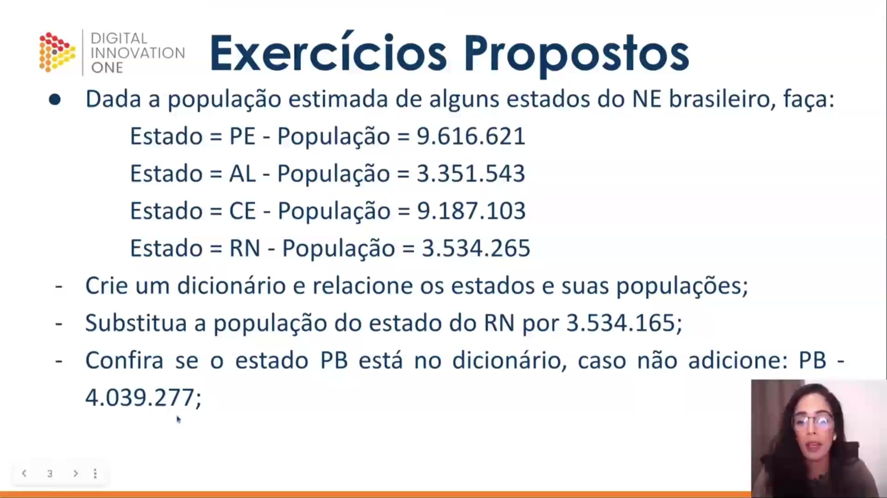
</p>

Nesta etapa da aula, iniciamos os exercícios propostos focados na manipulação de coleções. O objetivo é praticar a estrutura de dicionários utilizando dados demográficos reais de estados do Nordeste brasileiro.

As tarefas iniciais consistem em:

1. **Criação do dicionário**: Relacionar os estados (chaves) às suas respectivas populações (valores).
2. **Atualização de dados**: Corrigir a população do Rio Grande do Norte (RN).
3. **Verificação e inserção**: Checar a existência do estado da Paraíba (PB) no dicionário e adicioná-lo caso não esteja presente.

**Dados para o exercício:**

* PE: 9.616.621 
* AL: 3.351.543 
* CE: 9.187.103 
* RN: 3.534.265 

<p align="center">
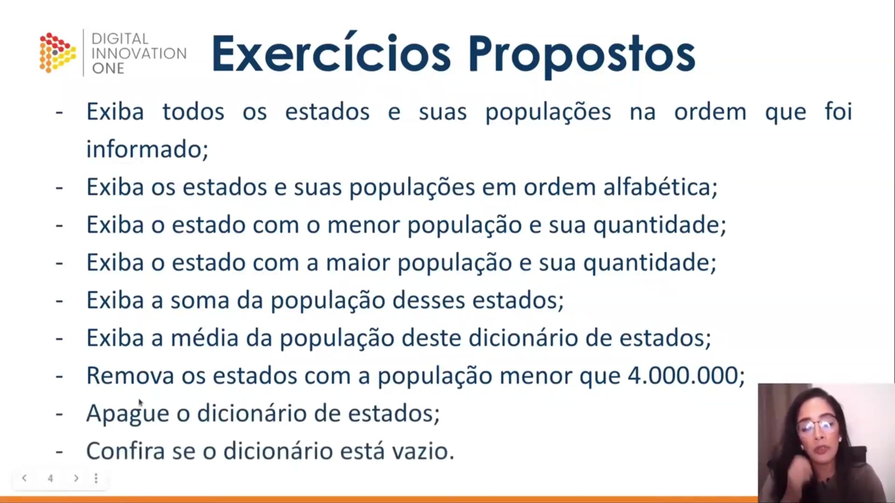
</p>

Dando continuidade aos exercícios de fixação, são propostas operações avançadas de visualização, cálculo e filtragem sobre o dicionário de estados criado anteriormente:

* **Ordenação**: Exibir os dados na ordem de inserção e também em ordem alfabética. 
* **Análise de Extremos**: Identificar e exibir os estados com a menor e a maior população. 
* **Operações Matemáticas**: Calcular a soma total e a média da população de todos os estados listados. 
* **Limpeza de Dados**: Remover entradas com população inferior a 4.000.000 e, por fim, esvaziar o dicionário completamente para validar se ele ficou vazio. 

<p align="center">
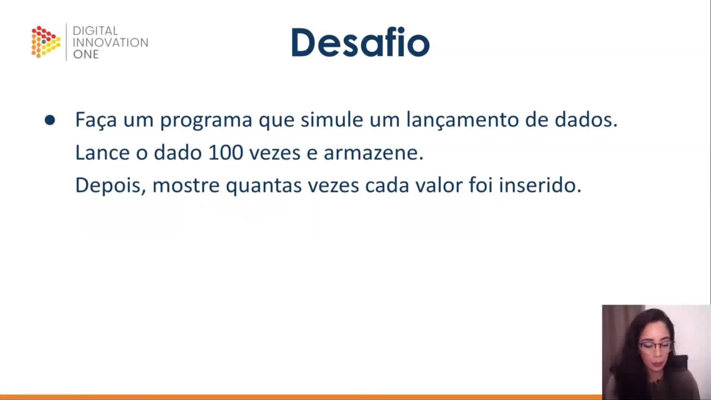
</p>

Além dos exercícios estruturados, é apresentado um desafio de lógica de programação para simular o lançamento de dados. O objetivo é trabalhar com geração de números aleatórios e contagem de frequência:

* **Simulação**: Lançar um dado de 6 faces 100 vezes. 
* **Armazenamento**: Guardar todos os resultados obtidos. 
* **Análise**: Contabilizar e mostrar quantas vezes cada face (valor) do dado apareceu durante as 100 iterações. 

<p align="center">
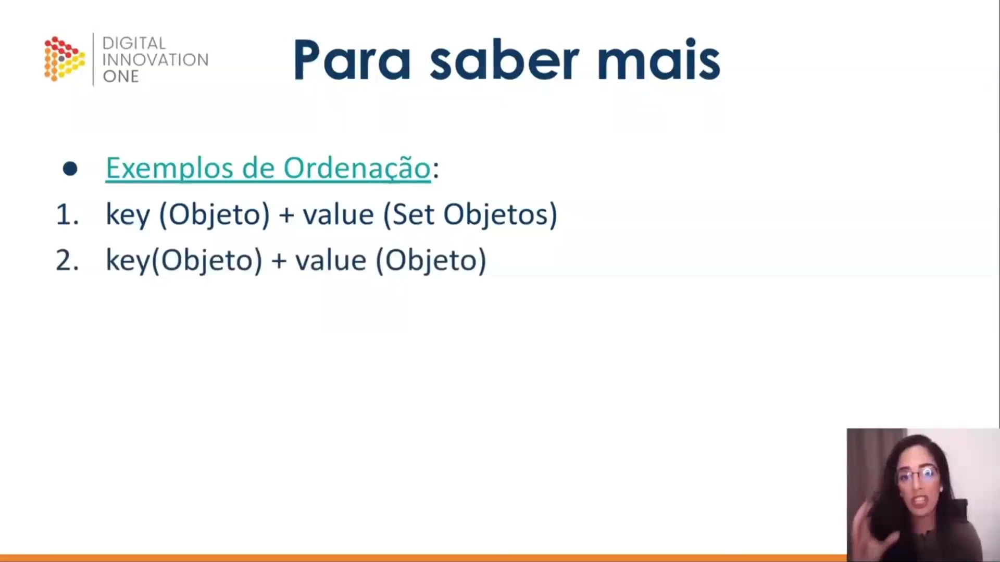
</p>

Para aprofundar o conhecimento em ordenação de coleções complexas, são sugeridos cenários onde a chave ou o valor não são tipos primitivos simples (como String ou Integer), mas sim objetos:

1. **Chave (Objeto) + valor (Set de Objetos)**: Útil para estruturas de dados onde uma entidade principal mapeia para um conjunto de sub-entidades. 
2. **Chave (Objeto) + valor (Objeto)**: Quando a relação de mapeamento ocorre diretamente entre dois objetos complexos. 

Estes exemplos visam preparar o desenvolvedor para situações reais de mercado onde a estrutura de dados exige maior complexidade técnica do que o uso de tipos básicos.


## Parte 5 - Stream

### 🟩 Vídeo 18 - Visão geral: Stream API - parte 1

<video width="60%" controls>
  <source src="000-Midia_e_Anexos/bootcamp_tqi_fullstack-modulo.06-curso.06-video_18.webm" type="video/webm">
    Seu navegador não suporta vídeo HTML5.
</video>

link do vídeo: https://web.dio.me/track/tqi-fullstack-developer/course/trabalhando-com-collections-java/learning/b592a952-7c4d-4650-abaa-74b93573b441?autoplay=1

Esta aula aborda a transição conceitual e prática entre interfaces funcionais, classes anônimas e expressões Lambda no contexto da Stream API em Java. O conteúdo define uma interface funcional como aquela que possui um único método abstrato (SAM - Single Abstract Method), exemplificando-a com as interfaces Function, Comparator e Action Listener. A aula demonstra como simplificar a implementação de classes anônimas verbosas através da sintaxe Lambda, caracterizando-a como uma função sem declaração composta por argumento, flecha e corpo. Por fim, destaca-se que o uso de Lambdas visa a legibilidade e a simplificação do código ao reduzir a estrutura necessária para implementar comportamentos, como a comparação de objetos em uma lista por atributos específicos.

### Anotações

<p align="center">
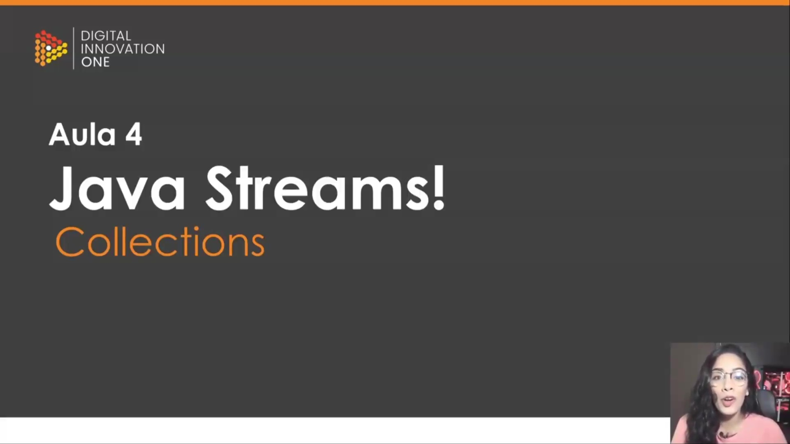
</p>

Esta é a introdução da **Aula 4** do curso de Java, voltada especificamente para o ecossistema de **Collections** e a introdução ao **Java Streams**. O objetivo desta seção é apresentar as ferramentas modernas de manipulação de dados que preparam o desenvolvedor para o uso da Stream API.

<p align="center">
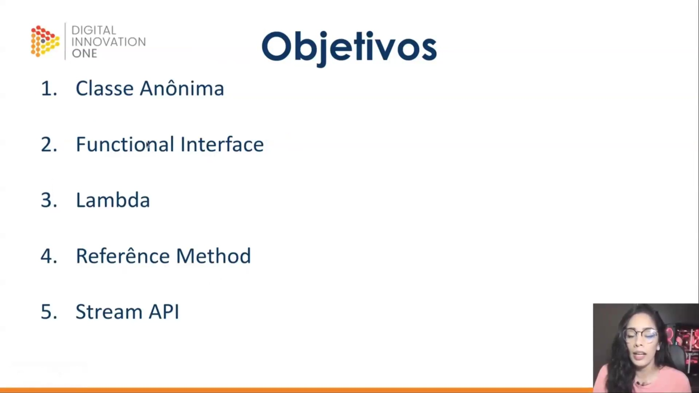
</p>

Nesta aula, serão abordados cinco tópicos fundamentais para o domínio da programação funcional e processamento de dados em Java:

1. **Classe Anônima**: Implementações rápidas de classes sem nome.
2. **Functional Interface**: A base teórica (SAM) que permite o uso de lambdas.
3. **Lambda**: A sintaxe enxuta para expressar funções.
4. **Reference Method**: Uma forma ainda mais simplificada de referenciar métodos existentes.
5. **Stream API**: O ponto culminante, onde todos os conceitos anteriores são aplicados para manipular coleções de forma declarativa.

<p align="center">
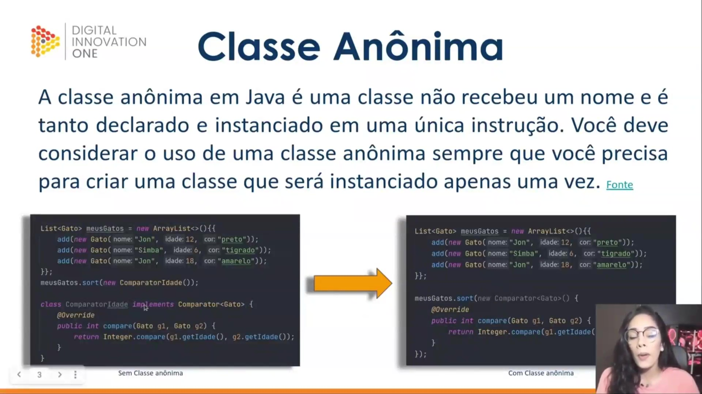
</p>

A **Classe Anônima** é um recurso que permite declarar e instanciar uma classe simultaneamente em uma única instrução. Ela é ideal para situações onde você precisa criar uma implementação específica que será utilizada apenas uma vez no código, como em comparadores.

No exemplo apresentado, observa-se a transição de um comparador tradicional para uma classe anônima:

```java
// Implementação tradicional (Exige criação de classe externa)
class ComparatorIdade implements Comparator<Gato> {
    @Override
    public int compare(Gato g1, Gato g2) {
        return Integer.compare(g1.getIdade(), g2.getIdade());
    }
}
meusGatos.sort(new ComparatorIdade());

// Implementação com Classe Anônima (Instanciada no local de uso)
meusGatos.sort(new Comparator<Gato>() {
    @Override
    public int compare(Gato g1, Gato g2) {
        return Integer.compare(g1.getIdade(), g2.getIdade());
    }
});

```

<p align="center">
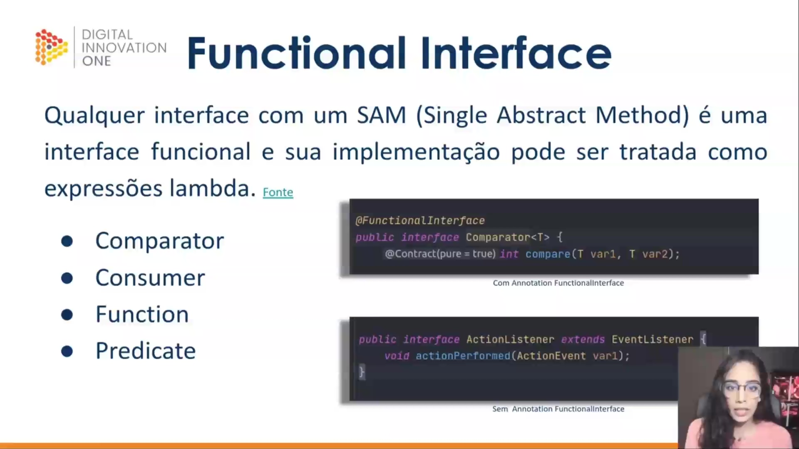
</p>

Uma **Functional Interface** (Interface Funcional) é caracterizada por possuir exatamente um **SAM (Single Abstract Method)**, ou seja, apenas um método abstrato. Esta regra é o que permite ao Java converter expressões Lambda no tipo da interface correspondente.

Embora o uso da anotação `@FunctionalInterface` seja uma boa prática para evitar a adição acidental de novos métodos, qualquer interface que siga a regra do método único (como o exemplo do `ActionListener`) é considerada funcional.

```java
// Interface Funcional com anotação explícita
@FunctionalInterface
public interface Comparator<T> {
    int compare(T var1, T var2);
}

// Interface Funcional sem anotação (Baseada no SAM)
public interface ActionListener extends EventListener {
    void actionPerformed(ActionEvent var1);
}

```

<p align="center">
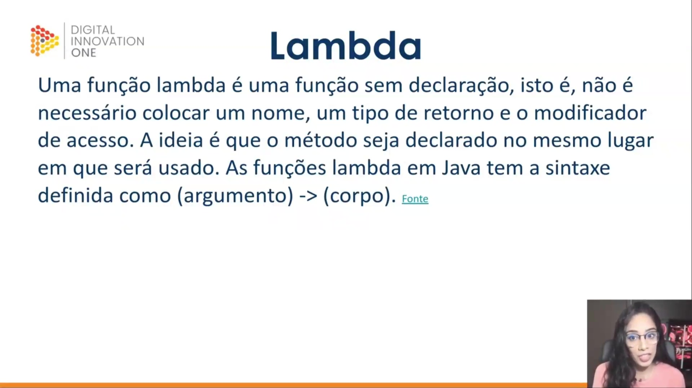
</p>

A **Expressão Lambda** é definida como uma função sem declaração formal. Isso significa que não é necessário explicitar um nome para a função, o tipo de retorno ou modificadores de acesso. A sintaxe básica é composta por:
`(argumento) -> (corpo)`

A ideia central é que o comportamento seja declarado exatamente no ponto onde será executado, aumentando a clareza do código.

<p align="center">
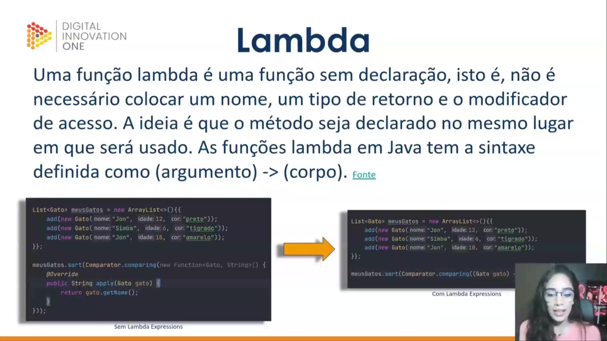
</p>

Neste ponto, é demonstrado como o **Lambda** simplifica drasticamente a escrita em comparação com as **Classes Anônimas**. No exemplo de ordenação de uma lista de gatos pelo nome, a estrutura burocrática da classe anônima é substituída por uma única linha:

```java
// Utilizando Classe Anônima (Verboso)
meusGatos.sort(Comparator.comparing(new Function<Gato, String>() {
    @Override
    public String apply(Gato gato) {
        return gato.getNome();
    }
}));

// Utilizando Lambda (Simplificado)
meusGatos.sort(Comparator.comparing((Gato gato) -> gato.getNome()));

```

A expressão lambda cumpre a mesma função da interface `Function`, recebendo um objeto do tipo `Gato` e retornando seu nome para o comparador, porém de forma muito mais legível.      


### 🟩 Vídeo 19 - Visão geral: Stream API - parte 2

<video width="60%" controls>
  <source src="000-Midia_e_Anexos/bootcamp_tqi_fullstack-modulo.06-curso.06-video_19.webm" type="video/webm">
    Seu navegador não suporta vídeo HTML5.
</video>

link do vídeo: https://web.dio.me/track/tqi-fullstack-developer/course/trabalhando-com-collections-java/learning/1af2e285-8b76-4ff2-b763-dd79b99e08ec?autoplay=1

Esta aula aborda a simplificação do código Java moderno através do uso de Method References e da Stream API, recursos introduzidos no Java 8 para promover a programação funcional. O Method Reference, identificado pelo operador ::, é apresentado como uma sintaxe ainda mais concisa que as expressões lambda para referenciar métodos ou construtores de forma direta. O conteúdo detalha como essas ferramentas se conectam: as Streams facilitam a manipulação de coleções por meio de uma estrutura composta por fonte (Source), operações intermediárias (Pipeline) e operações terminais, frequentemente utilizando interfaces funcionais (padrão SAM) e lambdas em seus argumentos. Em suma, o vídeo demonstra que a adoção dessas práticas resulta em um código mais legível, de fácil manutenção e preparado para paralelização, reduzindo a complexidade de implementações que anteriormente exigiriam classes anônimas extensas.

### Anotações

<p align="center">
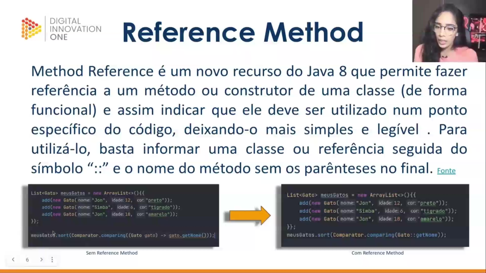
</p>

O **Method Reference** (ou Reference Method) é um recurso introduzido no Java 8 que funciona como uma forma de simplificar expressões lambda. Ele permite referenciar um método ou construtor de uma classe de forma funcional, indicando que ele deve ser utilizado em um ponto específico do código para torná-lo mais legível. A sintaxe utiliza o símbolo `::` entre a classe (ou referência) e o nome do método, sem os parênteses. 

No exemplo prático de ordenação de uma lista de objetos, podemos comparar a abordagem tradicional com a simplificação oferecida por este recurso:

**Sem Reference Method (Utilizando Lambda):**
Neste caso, a interface funcional `Function` é implementada através de um lambda, onde definimos explicitamente o argumento (`gato`) e a lógica no corpo (`gato.getNome()`). 

```java
List<Gato> meusGatos = new ArrayList<>(){{
    add(new Gato("Jon", 12, "preto"));
    add(new Gato("Simba", 6, "tigrado"));
    add(new Gato("Jon", 18, "amarelo"));
}};

meusGatos.sort(Comparator.comparing((Gato gato) -> gato.getNome()));

```

**Com Reference Method:**
A sintaxe é reduzida drasticamente. Como o Java consegue inferir o tipo de dado da lista, substituímos a expressão lambda pelo nome da classe seguido de `::` e o método de acesso. 

```java
List<Gato> meusGatos = new ArrayList<>(){{
    add(new Gato("Jon", 12, "preto"));
    add(new Gato("Simba", 6, "tigrado"));
    add(new Gato("Jon", 18, "amarelo"));
}};

meusGatos.sort(Comparator.comparing(Gato::getNome));

```

<p align="center">
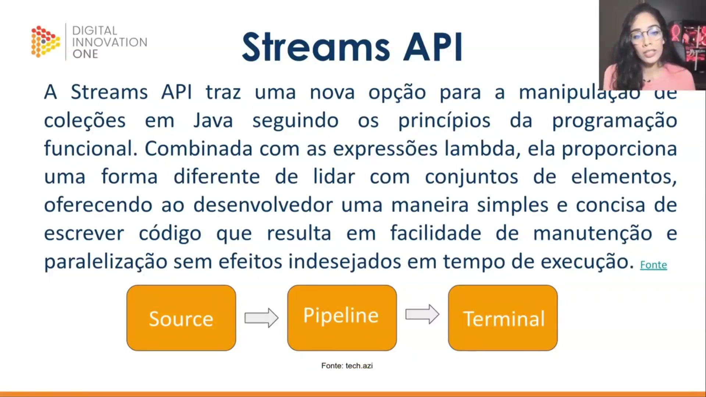
</p>

A **Streams API** traz uma nova opção para a manipulação de coleções em Java seguindo os princípios da programação funcional. Quando combinada com expressões lambda, ela oferece uma maneira simples e concisa de lidar com conjuntos de elementos, facilitando a manutenção do código e permitindo a paralelização sem efeitos colaterais indesejados. 

A estrutura fundamental de uma Stream é composta por três partes principais: 

* **Source (Fonte):** É a origem dos dados, geralmente uma `Collection` (como uma lista ou conjunto). 
* **Pipeline (Operações Intermediárias):** Sequência de operações que transformam ou filtram os dados da fonte. 
* **Terminal (Operação Terminal):** A operação final que encerra a Stream e produz um resultado ou um efeito colateral (como uma nova lista, um valor único ou uma impressão em tela). 

Essa arquitetura permite que o desenvolvedor foque no "o que" deve ser feito com os dados, em vez de "como" iterar manualmente sobre eles.


### 🟩 Vídeo 20 - Principais operações Stream API - parte 1

<video width="60%" controls>
  <source src="000-Midia_e_Anexos/bootcamp_tqi_fullstack-modulo.06-curso.06-video_20.webm" type="video/webm">
    Seu navegador não suporta vídeo HTML5.
</video>

link do vídeo: https://web.dio.me/track/tqi-fullstack-developer/course/trabalhando-com-collections-java/learning/cca159e8-b88c-42c5-9d95-0cd615a5d6bf?autoplay=1

Esta aula aborda a refatoração de código Java voltada para a ordenação de coleções do tipo Map, evoluindo de implementações tradicionais para sintaxes modernas da linguagem. A instrução demonstra a transição do uso de classes Comparator externas para o emprego de classes anônimas e, posteriormente, a simplificação através do método estático `Comparator.comparing` associado à interface funcional `Function`. O ápice do conteúdo foca na implementação de expressões Lambda, detalhando o processo prático de redução da verbosidade do código para alcançar uma escrita mais fluida e eficiente. Além de apresentar a lógica de ordenação por atributos específicos de um objeto, a aula incentiva o domínio das ferramentas da IDE para auxiliar na construção dessa sintaxe e propõe exercícios práticos de fixação antes de introduzir conceitos de Stream API e Method Reference.

### Anotações

Nesta aula, o foco é a refatoração de um código Java voltado para a ordenação de dicionários (`Map`). O cenário base utiliza uma agenda de contatos onde cada entrada possui um ID (chave) e um objeto `Contato` (valor), contendo os atributos `nome` e `numero`.

```java
package br.com.dio.collection.streamAPI;

import br.com.dio.collection.map.exercicioProposto03.Contato;

import java.util.*;
import java.util.function.Consumer;
import java.util.function.Function;

/*Dadas as seguintes informações  de id e contato, crie um dicionário e
ordene este dicionário exibindo (Nome id - Nome contato);

id = 1 - Contato = nome: Simba, numero: 2222;
id = 4 - Contato = nome: Cami, numero: 5555;
id = 3 - Contato = nome: Jon, numero: 1111;
*/
public class RefatoracaoOrdenacaoMap {

    public static void main(String[] args) {
        System.out.println("--\tOrdem aleatória\t--");
        Map<Integer, Contato> agenda = new HashMap<>() {{
           put(1, new Contato("Simba", 5555));
           put(4, new Contato("Cami", 1111));
           put(3, new Contato("Jon", 2222));
        }};
        System.out.println(agenda);
        for (Map.Entry<Integer, Contato> entry: agenda.entrySet()) {
            System.out.println(entry.getKey() + " - " + entry.getValue().getNome());
        }

        System.out.println("--\tOrdem Inserção\t--");
        Map<Integer, Contato> agenda1 = new LinkedHashMap<>() {{
            put(1, new Contato("Simba", 5555));
            put(4, new Contato("Cami", 1111));
            put(3, new Contato("Jon", 2222));
        }};
        System.out.println(agenda1);
        for (Map.Entry<Integer, Contato> entry: agenda1.entrySet()) {
            System.out.println(entry.getKey() + " - " + entry.getValue().getNome());
        }

        System.out.println("--\tOrdem id\t--");
        Map<Integer, Contato> agenda2 = new TreeMap<>(agenda);
        System.out.println(agenda2);
        for (Map.Entry<Integer, Contato> entry: agenda2.entrySet()) {
            System.out.println(entry.getKey() + " - " + entry.getValue().getNome());
        }

        System.out.println("--\tOrdem número telefone\t--");
        //precisamos organizar os valores. Logo:
        /*Set<Map.Entry<Integer, Contato>> set = new TreeSet<>(new Comparator<Map.Entry<Integer, Contato>>() {
            @Override
            public int compare(Map.Entry<Integer, Contato> cont1, Map.Entry<Integer, Contato> cont2) {
                return Integer.compare(cont1.getValue().getNumero(), cont2.getValue().getNumero());
            }
        });*/

        /*Set<Map.Entry<Integer, Contato>> set = new TreeSet<>(Comparator.comparing(
                new Function<Map.Entry<Integer, Contato>, Integer>() {
                    @Override
                    public Integer apply(Map.Entry<Integer, Contato> cont) {
                        return cont.getValue().getNumero();
                    }
                }));*/

        Set<Map.Entry<Integer, Contato>> set = new TreeSet<>(Comparator.comparing(
                cont -> cont.getValue().getNumero()));
        set.addAll(agenda.entrySet());
        for (Map.Entry<Integer, Contato> entry: set) {
            System.out.println(entry.getKey() + " - " + entry.getValue().getNumero() +
                    ": " +entry.getValue().getNome());
        }

        System.out.println("--\tOrdem nome contato\t--");
        //precisamos organizar os valores. Logo:
        Set<Map.Entry<Integer, Contato>> set1 = new TreeSet<>(Comparator.comparing(
                cont -> cont.getValue().getNome()));
        set1.addAll(agenda.entrySet());
        //imprimindo usando forEach
        set1.forEach(entry -> System.out.println(entry.getKey() + " - " + entry.getValue().getNome()));
    }
}

/*class ComparatorOrdemNumerica implements Comparator<Map.Entry<Integer, Contato>> {
    @Override
    public int compare(Map.Entry<Integer, Contato> cont1, Map.Entry<Integer, Contato> cont2) {
        return Integer.compare(cont1.getValue().getNumero(), cont2.getValue().getNumero());
    }
}*/

/*class ComparatorOrdemNomeContato implements Comparator<Map.Entry<Integer, Contato>> {
    @Override
    public int compare(Map.Entry<Integer, Contato> cont1, Map.Entry<Integer, Contato> cont2) {
        return cont1.getValue().getNome().compareToIgnoreCase(cont2.getValue().getNome());
    }
}*/
```

A estrutura inicial demonstra diferentes formas de organização:

* **Ordem Aleatória**: Implementada através de um `HashMap`. 
* **Ordem de Inserção**: Utilizando um `LinkedHashMap`. 
* **Ordem de ID (Chave)**: Realizada automaticamente pelo `TreeMap`. 

O ponto central da aula é a evolução da ordenação por **número de telefone** (um atributo do valor do Map). A professora demonstra o processo de simplificação do código, partindo de implementações verbosas para abordagens mais modernas e concisas: 

1.**Classe Anônima com Comparator**: Em vez de criar uma classe externa, utiliza-se `new Comparator<Map.Entry<Integer, Contato>>()` diretamente na instância do `TreeSet`, sobrescrevendo o método `compare`. 
2. **Interface Funcional Function**: Evolui para o uso do método estático `Comparator.comparing`, que recebe uma `Function` para extrair a chave de comparação (neste caso, o número do contato). 
3. **Expressões Lambda**: A simplificação máxima ocorre com a remoção de toda a sintaxe de classes anônimas, reduzindo a lógica a uma instrução direta: `cont -> cont.getValue().getNumero()`. 

```java
// Exemplo de refatoração para ordenação por número de telefone usando Lambda
Set<Map.Entry<Integer, Contato>> set = new TreeSet<>(Comparator.comparing(
    cont -> cont.getValue().getNumero()));
set.addAll(agenda.entrySet());

// Exemplo de ordenação por nome do contato
Set<Map.Entry<Integer, Contato>> set1 = new TreeSet<>(Comparator.comparing(
    cont -> cont.getValue().getNome()));
set1.addAll(agenda.entrySet());

```

A aula conclui incentivando a prática da refatoração para que o desenvolvedor se sinta confortável em identificar onde remover redundâncias e como utilizar as ferramentas da IDE para auxiliar na criação de expressões Lambda e métodos de comparação.     


### 🟩 Vídeo 21 - Principais operações Stream API - parte 2

<video width="60%" controls>
  <source src="000-Midia_e_Anexos/bootcamp_tqi_fullstack-modulo.06-curso.06-video_21.webm" type="video/webm">
    Seu navegador não suporta vídeo HTML5.
</video>

link do vídeo: https://web.dio.me/track/tqi-fullstack-developer/course/trabalhando-com-collections-java/learning/97eabea3-277e-454d-9eaf-5380a05e5f62?autoplay=1

Esta aula técnica detalha o funcionamento da Stream API no Java, distinguindo operações intermediárias, que permitem encadeamento e retornam novas streams, de operações terminais, que encerram o fluxo retornando valores ou objetos específicos. Através de exemplos práticos com uma lista de strings numéricas, a aula demonstra a aplicação de métodos essenciais como forEach para iteração simplificada via method reference, limit para seleção de subconjuntos de dados, e collect para conversão de resultados em estruturas como Set. O conteúdo enfatiza ainda a importância da operação map para a transformação de tipos de dados — exemplificando a conversão de strings para inteiros via interfaces funcionais — e fornece recursos complementares para o aprofundamento nos detalhes sintáticos e funcionais de cada operação.

### Anotações

Esta explicação detalha o uso da **Stream API** em Java para manipular coleções de forma funcional, baseando-se no código e na aula fornecidos.

#### 1. Visão Geral das Operações de Stream

As streams em Java são compostas por dois tipos principais de operações:

* **Operações Intermediárias:** Retornam uma nova stream, permitindo o encadeamento de várias operações (ex: `filter`, `map`, `limit`).
* **Operações Terminais:** Encerram o fluxo e retornam um objeto ou um valor (ex: `forEach`, `collect`, `count`).

#### 2. Exemplos Práticos de Manipulação

##### Impressão de Elementos

Para imprimir elementos, utiliza-se a operação terminal `forEach`. O código evolui de um `Consumer` anônimo para o uso de **Method Reference**:

```java
// Forma simplificada com Method Reference
numerosAleatorios.forEach(System.out::println); [cite: 54]

```

##### Filtragem e Coleta (Limit e Set)

O código demonstra como extrair os 5 primeiros elementos e armazená-los em um `Set`. Note que o `Set` remove duplicatas automaticamente.

* **`.limit(5)`**: Pega os primeiros 5 elementos.
* **`.collect(Collectors.toSet())`**: Converte o resultado para um conjunto.

##### Transformação de Tipos (Map)

A operação `map` é essencial para transformar o tipo dos dados dentro da stream, como converter uma `List<String>` para `List<Integer>`.

* **`.map(Integer::parseInt)`**: Transforma cada String em um número inteiro.

##### Filtros Condicionais

Para selecionar elementos específicos, utiliza-se o `filter` com um predicado (Lambda):

```java
// Exemplo: Números pares e maiores que 2
numerosAleatorios.stream()
    .map(Integer::parseInt)
    .filter(i -> i % 2 == 0 && i > 2) [cite: 73, 75, 76, 78]
    .collect(Collectors.toList()); [cite: 77]

```

#### 3. Operações Numéricas e Agrupamento

O código também aborda cálculos estatísticos e organização de dados:

* **Média:** Utiliza `mapToInt` seguido de `average()`.
* **Soma de Pares:** Filtra os pares e utiliza `.sum()`.
* **Agrupamento:** O método `Collectors.groupingBy` é usado para categorizar elementos, como múltiplos de 3 e 5.


| Operação | Tipo | Descrição |
| --- | --- | --- |
| `distinct()` | Intermediária | Remove elementos duplicados da stream.|
| `sorted()` | Intermediária | Ordena a lista (ex: ordem natural).|
| `count()` | Terminal | Retorna a quantidade de elementos.|
| `min()` / `max()` | Terminal | Encontra o menor ou maior valor. |


### 🟩 Vídeo 22 - Principais operações Stream API - parte 3

<video width="60%" controls>
  <source src="000-Midia_e_Anexos/bootcamp_tqi_fullstack-modulo.06-curso.06-video_22.webm" type="video/webm">
    Seu navegador não suporta vídeo HTML5.
</video>

link do vídeo: https://web.dio.me/track/tqi-fullstack-developer/course/trabalhando-com-collections-java/learning/7beb8c44-242b-460e-9edd-d6a2faaf4a20?autoplay=1

Esta aula aborda a aplicação prática da Stream API e do Optional no Java 8 para a manipulação eficiente de coleções, focando em operações de filtragem, transformação e agregação. A instrutora demonstra como converter listas de strings em inteiros utilizando `map` e `method reference`, filtrar elementos com base em múltiplos critérios através do método `filter` e coletar resultados em novas listas. O conteúdo também explora o uso de `mapToInt` e `average` para cálculos estatísticos, introduzindo o `Optional` como mecanismo de segurança para retornos nulos, e diferencia operações de Stream (que não alteram a fonte) de métodos de lista como `removeIf`, que modificam a coleção original. Ao final, ressalta-se a expressividade e o poder do encadeamento de operações para simplificar códigos complexos, incentivando a prática autônoma em exercícios complementares de ordenação e agrupamento.

### Anotações

Nesta etapa da aula, o foco é a manipulação de coleções utilizando a **Stream API** do Java para realizar filtragens e transformações de dados de forma encadeada. A instrutora demonstra como selecionar elementos específicos de uma lista com base em múltiplas condições lógicas.

Para o exercício proposto — selecionar números pares e maiores que dois — é necessário realizar as seguintes etapas:

1. **Transformação (Map):** Como a lista original `numerosAleatorios` contém strings, utiliza-se o método `.map(Integer::parseInt)` para converter cada elemento em um número inteiro.
2. **Filtragem (Filter):** Aplica-se a operação `filter` que recebe um `Predicate`. No exemplo didático, a instrutora utiliza uma implementação anônima (ou posteriormente simplificada para Lambda) que verifica se o número é par (`i % 2 == 0`) e se é maior que dois (`i > 2`).
3. **Coleta (Collect):** Os elementos que satisfazem os critérios do filtro são agrupados em uma nova lista através do `collect(Collectors.toList())`.

O uso de Streams permite que essas operações sejam escritas de forma declarativa, reduzindo a verbosidade em comparação aos métodos tradicionais de iteração.

```java
// Trecho correspondente à filtragem de números pares maiores que 2
List<Integer> listParesMaioresQue2 = numerosAleatorios.stream()
        .map(Integer::parseInt)
        .filter(i -> (i % 2 == 0 && i > 2))
        .collect(Collectors.toList());

System.out.println(listParesMaioresQue2);

```

Além disso, a aula introduz o cálculo de médias utilizando `mapToInt`, que transforma a Stream em uma `IntStream`. Isso possibilita o acesso ao método `average()`, que retorna um `OptionalDouble`. Para lidar com esse resultado de forma segura, utiliza-se o método `ifPresent`, garantindo que a impressão no console só ocorra se um valor válido tiver sido calculado.

```java
// Cálculo da média dos números
numerosAleatorios.stream()
        .mapToInt(Integer::parseInt)
        .average()
        .ifPresent(System.out::println);

```

### 🟩 Vídeo 23 - Conclusão do curso

<video width="60%" controls>
  <source src="000-Midia_e_Anexos/bootcamp_tqi_fullstack-modulo.06-curso.06-video_23.webm" type="video/webm">
    Seu navegador não suporta vídeo HTML5.
</video>

link do vídeo: https://web.dio.me/track/tqi-fullstack-developer/course/trabalhando-com-collections-java/learning/428a796a-2957-4091-8729-487e512c4f1a?autoplay=1

Nesta aula de encerramento, o instrutor celebra a conclusão do curso introdutório de Java Collections e recomenda três trilhas de aprendizado gratuitas na plataforma DIO para aprofundamento técnico. As sugestões incluem o curso de "Implementando Collections e Streams com Java", focado em métodos avançados como Optional e interfaces de Queue; a formação em "Desenvolvimento Avançado em Java", que detalha o uso de interfaces funcionais e o paradigma de programação funcional; e o curso de "Estrutura de Dados", que aborda conceitos fundamentais como árvores e listas de forma didática. O vídeo finaliza incentivando o compartilhamento de certificados no LinkedIn, a participação na comunidade do Discord e a consulta ao código-fonte disponível no GitHub para consolidar o domínio sobre Streams, Lambdas e coleções.

### Anotações

<p align="center">
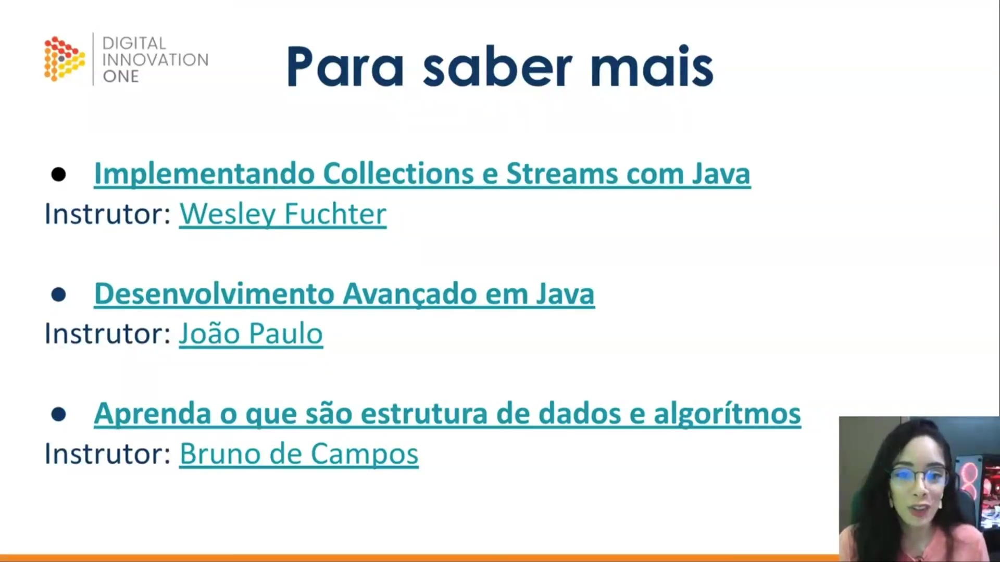
</p>

Nesta etapa de encerramento do curso introdutório de Collections, são apresentadas recomendações de estudos avançados disponíveis na plataforma DIO para aprofundar o domínio da linguagem Java e fundamentos de computação. As sugestões focam em três pilares essenciais:

#### 1. Implementando Collections e Streams com Java

Ministrado pelo instrutor Wesley Fuchter, este curso é o próximo passo ideal para dominar recursos que não foram explorados a fundo no módulo introdutório, tais como:

* **Interface Queue:** Compreensão de filas e suas implementações.
* **Optional:** Manipulação segura de valores que podem ser nulos, evitando o `NullPointerException`.
* **Métodos Avançados:** Exploração detalhada de métodos específicos das estruturas `TreeSet` e `TreeMap`.

#### 2. Desenvolvimento Avançado em Java

Com o instrutor João Paulo, este conteúdo foca na modernização da linguagem e no paradigma funcional. Os tópicos principais incluem:

* **Interfaces Funcionais:** Entendimento profundo de como o Java utiliza funções como cidadãos de primeira classe.
* **Streams e Lambdas:** Detalhamento do porquê dessas implementações e como elas otimizam a manipulação de dados em coleções.
* **Orientação a Objetos vs. Funcional:** Uma análise técnica sobre a coexistência desses paradigmas no ecossistema Java atual.

#### 3. Estrutura de Dados e Algoritmos

O curso do instrutor Bruno de Campos é fundamental para entender a "mágica" por trás das Collections. Diferente dos anteriores, este curso foca na lógica pura e em conceitos teóricos aplicados, utilizando ferramentas como o **VisualG** para ilustrar:

* **Listas:** Diferenças entre listas simples e listas duplamente ligadas.
* **Pilhas e Filas:** O funcionamento lógico de inserção e remoção de dados.
* **Árvores:** Conceitos de estruturas hierárquicas de dados.

O domínio desses tópicos, somado ao conteúdo de introdução a Collections, prepara o desenvolvedor para resolver problemas complexos de engenharia de software e otimização de performance.

# Certificado: Trabalhando com Collections Java

- Link na plataforma: https://hermes.dio.me/certificates/ZQ1FHJ76.pdf
- Certificado em pdf: [Certificado-Trabalhando_com_Collections_Java.pdf](000-Midia_e_Anexos/Certificado-Trabalhando_com_Collections_Java.pdf)