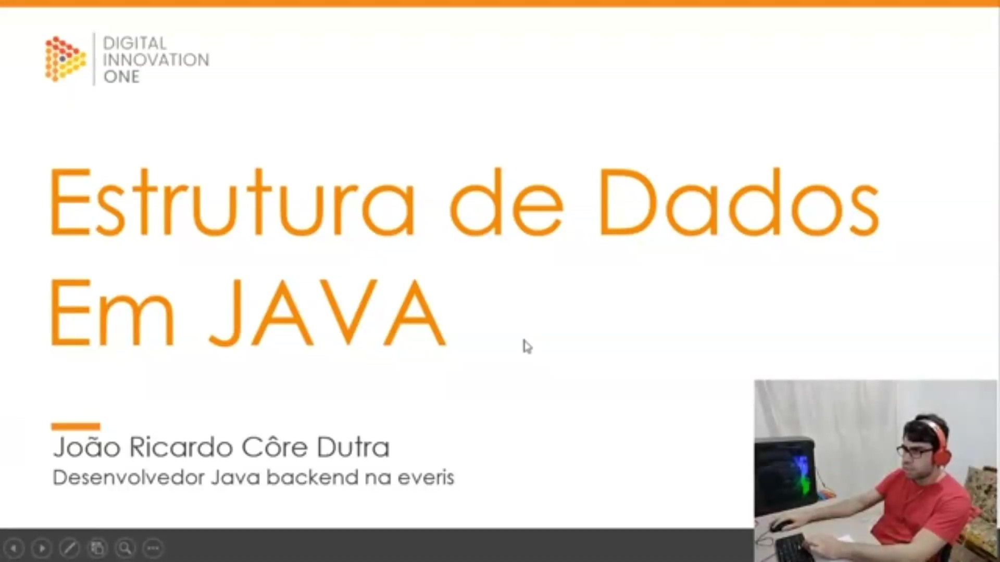
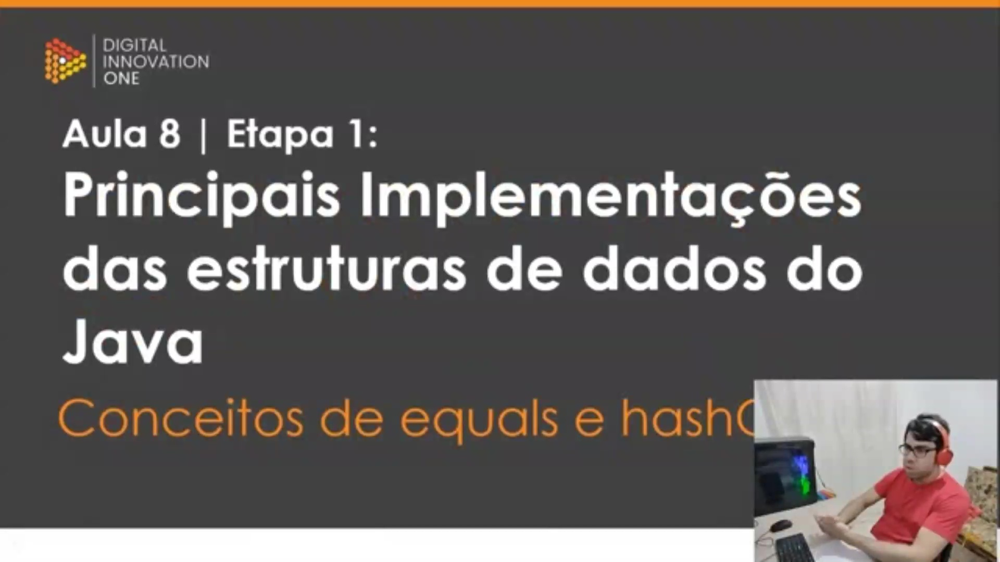
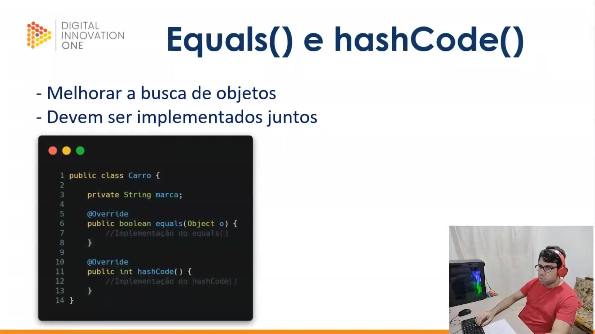
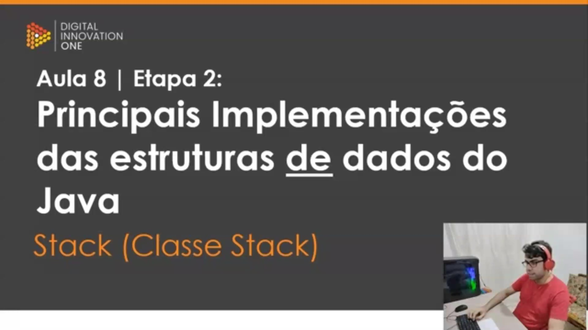
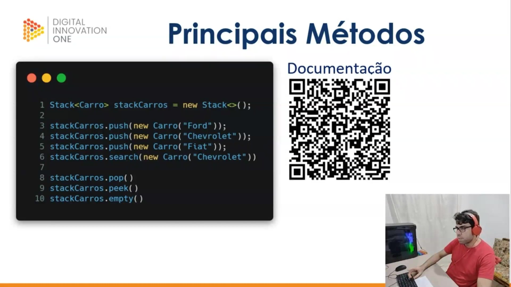
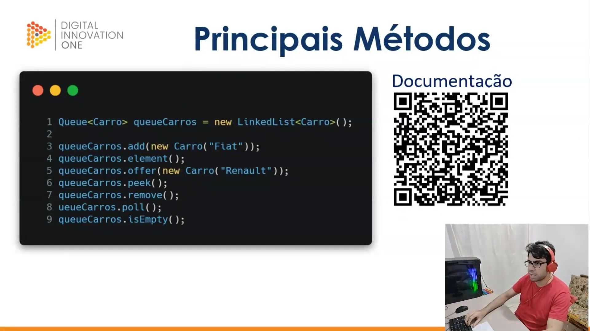
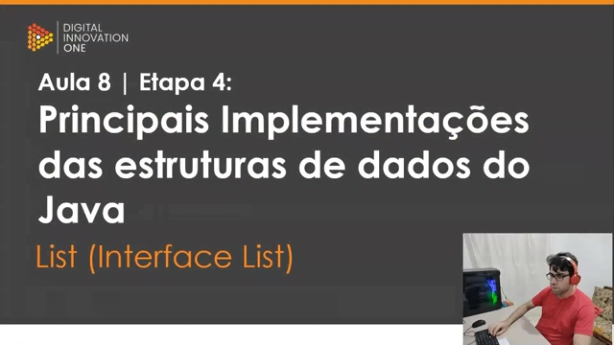
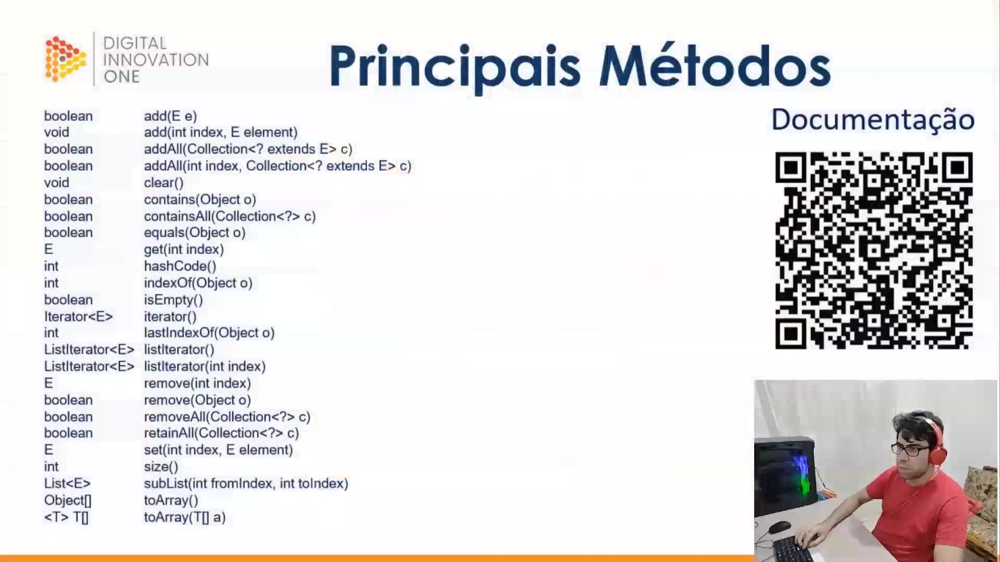
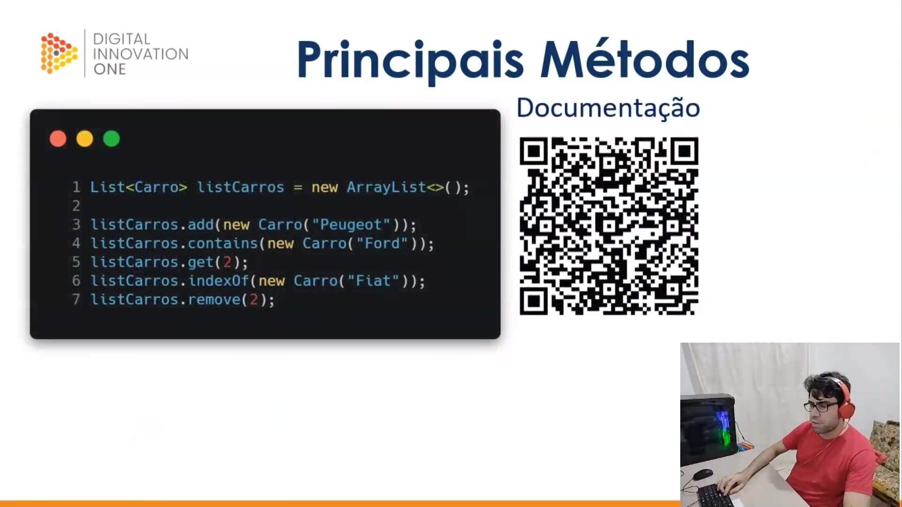

## Instrutor

- João Dutra (Analista de Sistemas no Bradesco)
- Contato Linkedin: / [joao-ricardo-dutra](https://www.linkedin.com/in/joao-ricardo-dutra/)
- repositório do curso: https://github.com/jrdutra/estruturaDeDadosJavaDio

## Parte 1 - Principais Implementações das estruturas de dados do Java

### 🟩 Vídeo 01 - Conceitos de equals e hashCode

<video width="60%" controls>
  <source src="000-Midia_e_Anexos/bootcamp_tqi_fullstack-modulo.06-curso.07-video_01.webm" type="video/webm">
    Seu navegador não suporta vídeo HTML5.
</video>

link do vídeo: https://web.dio.me/track/tqi-fullstack-developer/course/estrutura-de-dados-em-java-principais-implementacoes/learning/40ce1b96-358f-48c8-a420-271b1741dcfd?autoplay=1

#### Estrutura de Dados em Java: Equals e HashCode

<p align="center">

</p>

Nesta aula, iniciamos a Etapa 1 do módulo de principais implementações das estruturas de dados em Java. O foco inicial é compreender os conceitos de **equals** e **hashCode**, elementos fundamentais para a organização e comparação de objetos dentro das coleções da linguagem.

#### Principais Implementações

<p align="center">

</p>

Os métodos `equals()` e `hashCode()` são utilizados para otimizar a busca e a organização de objetos em estruturas de dados. Enquanto o **hashCode** gera um número inteiro (hash) que facilita o posicionamento e a recuperação rápida do objeto, o **equals** define a lógica de comparação para determinar se dois objetos são efetivamente iguais, baseando-se em regras de negócio específicas (como comparar carros apenas pela marca). É uma boa prática que ambos sejam implementados juntos, pois seus conceitos estão interligados no funcionamento interno das coleções Java.

#### Implementação Inicial da Classe Carro

<p align="center">

</p>

Para ilustrar esses conceitos, iniciamos a criação de uma classe chamada `Carro`. Esta classe possui um atributo `marca` e as assinaturas básicas para a sobrescrita dos métodos `equals()` e `hashCode()`.

```java
public class Carro {
    private String marca;

    @Override
    public boolean equals(Object o) {
        //Implementação do equals()
    }

    @Override
    public int hashCode() {
        //Implementação do hashCode()
    }
}

```

#### Detalhamento da Lógica de Comparação

A implementação robusta do método `equals` envolve várias etapas: primeiro, verifica-se se a referência de memória é a mesma; depois, se o objeto passado é nulo ou pertence a uma classe diferente. Por fim, é realizado um *casting* para comparar o atributo `marca`. O `hashCode` é gerado a partir do mesmo atributo utilizando a classe `Objects`.

```java
// Declaração do pacote para organizar a classe dentro da estrutura do projeto[cite: 46, 102].
package one.digitalinnovation;

// Importação da classe utilitária Objects, necessária para implementar equals e hashCode de forma segura[cite: 48].
import java.util.Objects;

// Definição da classe Carro, que servirá de modelo para os nossos objetos[cite: 27, 51].
public class Carro {

    // Atributo privado que define a característica "marca" do carro[cite: 28, 54].
    private String marca;

    // Construtor da classe que permite instanciar um Carro já definindo sua marca[cite: 57].
    public Carro (String marca) {
        // Atribui o valor recebido por parâmetro ao atributo de instância da classe[cite: 59].
        this.marca = marca;
    }

    // Método Getter para acessar o valor do atributo privado 'marca'[cite: 64].
    public String getMarca() {
        return marca;
    }

    // Método Setter para modificar o valor do atributo 'marca'[cite: 71].
    public void setMarca (String marca) {
        this.marca = marca;
    }

    // Indica que estamos sobrescrevendo o método equals da classe superior (Object)[cite: 29, 83].
    @Override
    public boolean equals(Object o) {
        // Testa se a referência de memória de ambos os objetos é a mesma; se sim, são iguais[cite: 85].
        if (this == o) return true;
        
        // Verifica se o objeto comparado é uma instância de Carro; se não for, não podem ser iguais[cite: 86].
        if (!(o instanceof Carro)) return false;
        
        // Faz o casting do objeto genérico 'o' para o tipo específico 'Carro'[cite: 87].
        Carro carro = (Carro) o;
        
        // Retorna a comparação final baseada no conteúdo do atributo marca[cite: 88].
        // O professor explica que, nesta regra de negócio, carros são iguais se as marcas forem iguais [00:01:00, 00:03:00].
        return Objects.equals(getMarca(), carro.getMarca());
    }

    // Indica a sobrescrita do método hashCode para gerar o código identificador do objeto[cite: 37, 94].
    @Override
    public int hashCode() {
        // Gera um número inteiro (hash) a partir do atributo marca[cite: 98].
        // Esse número facilita a organização e busca rápida em estruturas de dados [00:04:00].
        return Objects.hash(getMarca());
    }
}
```

#### Teste Prático com Listas e Objetos

No método `main`, validamos o comportamento da classe. Ao adicionar instâncias de `Carro` em uma `ArrayList`, o método `contains` utiliza a implementação de `equals` para verificar a existência de um item. Além disso, observamos que dois objetos diferentes com a mesma marca ("Ford") geram o mesmo `hashCode`, garantindo que a estrutura de dados os reconheça como logicamente equivalentes para fins de busca e organização.

```java
// Define o pacote onde a classe de execução está localizada.
package one.digitalinnovation;

// Importa a implementação de lista dinâmica ArrayList da biblioteca padrão do Java.
import java.util.ArrayList;
// Importa a interface List, que define o contrato para coleções ordenadas.
import java.util.List;

// Declaração da classe principal que contém o ponto de entrada do programa.
public class Main {
    // Método de entrada (main) onde a execução do código começa.
    public static void main(String[] args){

        // Instancia uma nova lista de objetos do tipo Carro usando ArrayList.
        List<Carro> listaCarros = new ArrayList<>();

        // Adiciona um novo objeto Carro com a marca "Ford" à lista.
        listaCarros.add(new Carro("Ford"));
        // Adiciona um novo objeto Carro com a marca "Chevrolet" à lista.
        listaCarros.add(new Carro("Chevrolet"));
        // Adiciona um novo objeto Carro com a marca "Volkswagen" à lista.
        listaCarros.add(new Carro("Volkswagen"));

        // O método 'contains' usa internamente o equals() para verificar se um carro "Ford" existe na lista.
        // Como implementamos equals() baseado na marca, isso retornará 'true', mesmo sendo uma nova instância.
        System.out.println(listaCarros.contains(new Carro("Ford")));

        // Imprime o código hash (hashCode) de uma nova instância de Carro com a marca "Ford".
        System.out.println(new Carro("Ford").hashCode());
        
        // Imprime o hashCode de outra instância "Ford". O valor será idêntico ao anterior.
        // O professor explica que instâncias diferentes com atributos iguais geram o mesmo hash.
        System.out.println(new Carro("Ford").hashCode());
    }
}
```

### 🟩 Vídeo 02 - Stack (Pilha)

<video width="60%" controls>
  <source src="000-Midia_e_Anexos/bootcamp_tqi_fullstack-modulo.06-curso.07-video_02.webm" type="video/webm">
    Seu navegador não suporta vídeo HTML5.
</video>

link do vídeo: https://web.dio.me/track/tqi-fullstack-developer/course/estrutura-de-dados-em-java-principais-implementacoes/learning/c9e01c6c-8d88-4b0a-88f2-3a3093ca9e5f?autoplay=1

Este guia resume a aula prática sobre a classe Stack da biblioteca java.util. O foco é entender como gerenciar uma pilha de objetos, utilizando o exemplo de uma lista de carros, e as implicações de performance ao lidar com grandes volumes de dados.

### Anotações

#### Introdução à Implementação de Stack em Java

<p align="center">

</p>

Esta etapa aborda as principais implementações das estruturas de dados na linguagem Java, focando especificamente na classe **Stack** (Pilha). O objetivo é demonstrar como utilizar as ferramentas nativas da linguagem para manipular coleções de dados que seguem o princípio LIFO (*Last In, First Out*), onde o último elemento a entrar é o primeiro a sair.

#### Principais Métodos e Documentação

<p align="center">

</p>

Para trabalhar com pilhas em Java, a classe `Stack` oferece métodos fundamentais que permitem gerenciar os elementos de forma eficiente. Um QR Code é disponibilizado para acesso direto à documentação oficial da Oracle. Os métodos destacados incluem:

* **push()**: Adiciona um item ao topo da pilha.
* **pop()**: Remove e retorna o objeto no topo da pilha.
* **peek()**: Retorna o objeto no topo da pilha sem removê-lo.
* **empty()**: Verifica se a pilha está vazia.
* **search()**: Busca por um objeto na pilha e retorna sua posição baseada em 1.

```java
1 Stack<Carro> stackCarros = new Stack  <>();
2
3 stackCarros.push(new Carro("Ford"));
4 stackCarros.push(new Carro("Chevrolet"));
5 stackCarros.push(new Carro("Fiat"));
6 stackCarros.search(new Carro("Chevrolet"))
7
8 stackCarros.pop()
9 stackCarros.peek()
10 stackCarros.empty()

```

#### A Classe de Modelo: Carro

Para exemplificar o uso da pilha, utiliza-se a classe `Carro`. Além dos atributos, *getters* e *setters* básicos, é essencial a implementação dos métodos `equals()` e `hashCode()` para permitir a comparação correta entre objetos, e o método `toString()` para facilitar a visualização dos dados no console durante a execução dos testes.

```java
import java.util.Objects; // Importação necessária para utilizar métodos utilitários de comparação e hash[cite: 26].

public class Carro { // Definição da classe de modelo "Carro" utilizada nos exemplos de Stack[cite: 29].
    private String marca; // Atributo privado que define a propriedade única do objeto[cite: 32].

    public Carro (String marca) { // Construtor da classe para inicializar o objeto com uma marca[cite: 36].
        this.marca = marca; // Atribuição do valor recebido ao atributo da instância[cite: 36].
    }

    public String getMarca() { // Método Getter para acessar o valor da marca[cite: 41].
        return marca; // Retorna o conteúdo da variável marca[cite: 43].
    }

    public void setMarca (String marca) { // Método Setter para modificar o valor da marca[cite: 48].
        this.marca = marca; // Atualiza o atributo com o novo valor fornecido[cite: 50].
    }

    @Override // Sobrescrita de método para garantir o comportamento correto em coleções[cite: 55].
    public boolean equals(Object o) { // Implementação do método equals para comparar logicamente dois carros[cite: 60].
        if (this == o) return true; // Se forem a mesma referência de memória, são iguais[cite: 58].
        if (!(o instanceof Carro)) return false; // Valida se o objeto comparado é do tipo Carro[cite: 61].
        Carro carro = (Carro) o; // Faz o cast do objeto para o tipo Carro[cite: 63].
        return Objects.equals(getMarca(), carro.getMarca()); // Compara se as marcas dos carros são idênticas[cite: 65].
    }

    @Override // Sobrescrita necessária para o funcionamento de tabelas hash e buscas[cite: 70].
    public int hashCode() { // Implementação do método hashCode[cite: 72].
        return Objects.hash(getMarca()); // Gera um código numérico baseado no conteúdo da marca[cite: 74].
    }

    @Override // Sobrescrita do método toString, conforme solicitado pelo professor.
    public String toString() { // Método para permitir a visualização textual do objeto no console.
        return "Carro{" + // Início da formatação da String de saída[cite: 83].
                "marca='" + marca + '\'' + // Exibição amigável do conteúdo do atributo marca[cite: 86].
                '}'; // Fechamento da representação do objeto[cite: 86].
    }
}
```

#### Execução e Manipulação da Pilha

A classe `Main` demonstra a pilha em ação. Ao inserir os carros Ford, Chevrolet e Fiat (nesta ordem), o Fiat torna-se o topo. O método `pop()` remove o Fiat, restando Ford e Chevrolet. O método `peek()` permite visualizar o Chevrolet (novo topo) sem removê-lo, e o `empty()` confirma que a estrutura ainda contém elementos, retornando `false`.

```java
import java.util.Stack; // Importa a classe Stack do pacote utilitário do Java.

[cite_start]public class Main { // Define a classe principal para execução do programa[cite: 100].
    [cite_start]public static void main(String args[]){ // Ponto de entrada (método main) para rodar o código[cite: 101].
        
        // Instancia uma nova pilha (Stack) que armazenará objetos do tipo Carro.
        Stack<Carro> stackCarros = new Stack<>(); 

        // Adiciona o carro "Ford" na base da pilha.
        stackCarros.push(new Carro("Ford")); 
        
        // Adiciona "Chevrolet" sobre o carro anterior.
        stackCarros.push(new Carro("Chevrolet")); 
        
        // Adiciona "Fiat" no topo da pilha; ele é o último a entrar.
        stackCarros.push(new Carro ("Fiat")); 

        // Imprime a pilha completa: [Ford, Chevrolet, Fiat].
        System.out.println(stackCarros); 
        
        // O método pop() remove e retorna o elemento que está no topo (Fiat).
        System.out.println(stackCarros.pop()); 
        
        // Imprime a pilha após o pop; agora resta apenas [Ford, Chevrolet].
        System.out.println(stackCarros); 

        // O método peek() apenas exibe o elemento do topo (Chevrolet) sem removê-lo.
        System.out.println(stackCarros.peek()); 
        
        // Imprime a pilha novamente para mostrar que o Chevrolet continua nela.
        System.out.println(stackCarros); 
        
        // O método empty() testa se a pilha está vazia; retorna false neste caso.
        System.out.println(stackCarros.empty()); 
    }
}
```      


### 🟩 Vídeo 03 - Queue (Fila, LikedList)

<video width="60%" controls>
  <source src="000-Midia_e_Anexos/bootcamp_tqi_fullstack-modulo.06-curso.07-video_03.webm" type="video/webm">
    Seu navegador não suporta vídeo HTML5.
</video>

link do vídeo: https://web.dio.me/track/tqi-fullstack-developer/course/estrutura-de-dados-em-java-principais-implementacoes/learning/3a5d7a0a-cb88-456a-8854-342a3bb6d1d5?autoplay=1

Este resumo aborda a Etapa 3 da Aula 8 do curso de Estrutura de Dados em Java, focando na interface Queue (Filas). O tutorial demonstra como implementar e manipular filas utilizando a classe LinkedList.

### Anotações

<p align="center">

</p>

Nesta etapa, iniciamos o estudo da interface **Queue** dentro das estruturas de dados do Java. As filas seguem a lógica onde o primeiro elemento a entrar é o primeiro a sair. Para colocar esses conceitos em prática, utilizaremos a classe `LinkedList` como implementação principal para gerenciar os elementos da fila.

<p align="center">

</p>

A interface Queue disponibiliza métodos específicos para a manipulação de dados, permitindo adicionar, consultar e remover elementos. A documentação oficial pode ser acessada via QR Code para detalhes técnicos aprofundados. Abaixo, os métodos que serão explorados:

* **add**: Adiciona um elemento (lança exceção se falhar).
* **offer**: Adiciona um elemento (retorna falso se falhar).
* **element**: Consulta a cabeça da fila (lança exceção se vazia).
* **peek**: Consulta a cabeça da fila (retorna nulo se vazia).
* **remove**: Remove o primeiro elemento (lança exceção se vazia).
* **poll**: Remove o primeiro elemento (retorna nulo se vazia).
* **isEmpty**: Verifica se a fila está vazia.

```java
Queue<Carro> queueCarros = new LinkedList<Carro>();

queueCarros.add(new Carro("Fiat"));
queueCarros.element();
queueCarros.offer(new Carro("Renault"));
queueCarros.peek();
queueCarros.remove();
queueCarros.poll();
queueCarros.isEmpty();

```

No código prático, instanciamos a fila utilizando `LinkedList` e adicionamos veículos (Ford, Chevrolet, Fiat). Observamos que o método `add` retorna um booleano confirmando o sucesso da operação. Ao utilizar o método `peek`, visualizamos o primeiro elemento ("Ford") sem removê-lo. Já o método `poll` é demonstrado realizando a remoção efetiva do elemento da cabeça da fila, alterando o estado da estrutura.

```java
package one.digitalinnovation; // Define o pacote do projeto[cite: 24].

import java.util.LinkedList; // Importa a implementação LinkedList para ser usada como fila[cite: 26, 30].
import java.util.Queue; // Importa a interface Queue da estrutura de dados do Java[cite: 27].

public class Main { // Declaração da classe principal[cite: 39].
    public static void main(String args[]){ // Método de entrada do programa[cite: 28].
        
        // Instancia uma fila do tipo Carro usando LinkedList como implementação[cite: 14, 30].
        Queue<Carro> queueCarros = new LinkedList<Carro>();

        // Adiciona três novos objetos Carro à fila (Ford, Chevrolet e Fiat)[cite: 31, 32, 33].
        queueCarros.add(new Carro("Ford"));
        queueCarros.add(new Carro("Chevrolet"));
        queueCarros.add(new Carro("Fiat"));

        // Adiciona o Peugeot e imprime o resultado (true/false) do sucesso da adição[cite: 34].
        System.out.println(queueCarros.add(new Carro("Peugeot"))); 
        
        // Exibe a fila atualizada na ordem: Ford (primeiro), Chevrolet, Fiat e Peugeot (último)[cite: 35].
        System.out.println(queueCarros);

        // Pega o elemento da cabeça da fila (primeiro carro) sem removê-lo[cite: 17, 36].
        System.out.println(queueCarros.element());
        System.out.println(queueCarros); // Mostra que a fila permanece inalterada[cite: 36].

        // Tenta adicionar Renault; o offer retorna 'false' se falhar em vez de lançar erro como o 'add'[cite: 18, 71].
        System.out.println(queueCarros.offer(new Carro("Renault"))); 
        System.out.println(queueCarros); // Exibe a fila com o novo elemento inserido[cite: 71].

        // peek() retorna o elemento da cabeça da fila; se estiver vazia, retorna 'null'[cite: 19, 72].
        System.out.println(queueCarros.peek());
        System.out.println(queueCarros); // O peek não remove elementos da fila[cite: 72].

        // remove() retira o primeiro elemento da fila (neste caso, o Ford)[cite: 20, 73].
        System.out.println(queueCarros.remove()); 
        System.out.println(queueCarros); // Mostra a fila após a remoção do primeiro carro[cite: 74].

        // poll() também remove o primeiro, mas retorna 'null' se a fila estiver vazia[cite: 21, 75].
        System.out.println(queueCarros.poll()); 
        System.out.println(queueCarros); // Exibe a fila sem o elemento removido pelo poll[cite: 75].

        // Verifica se a fila está vazia (retorna true ou false)[cite: 22, 76].
        System.out.println(queueCarros.isEmpty());
    }
}
```      


### 🟩 Vídeo 04 - List (ArrayList)

<video width="60%" controls>
  <source src="000-Midia_e_Anexos/bootcamp_tqi_fullstack-modulo.06-curso.07-video_04.webm" type="video/webm">
    Seu navegador não suporta vídeo HTML5.
</video>

link do vídeo: https://web.dio.me/track/tqi-fullstack-developer/course/estrutura-de-dados-em-java-principais-implementacoes/learning/254eae85-f5bb-43bb-8085-af58ca016c81?autoplay=1

Este tutorial faz parte de um curso de Estrutura de Dados em Java e foca na implementação e manipulação de listas, utilizando a classe ArrayList. O vídeo demonstra desde operações básicas até a importância crítica da sobrescrita de métodos fundamentais para o funcionamento correto das coleções.

### Anotações

#### Introdução às Listas em Java

<p align="center">

</p>

Nesta etapa, iniciamos o estudo sobre a interface `List` dentro do ecossistema de estruturas de dados do Java. As listas são coleções ordenadas que permitem o armazenamento de elementos duplicados e oferecem controle preciso sobre onde cada elemento é inserido. O instrutor disponibiliza um repositório no GitHub, acessível via QR Code, para o acompanhamento prático do projeto.

#### Métodos da Interface List e Documentação

<p align="center">

</p>

A interface `List` possui uma vasta gama de métodos para manipulação de coleções. A imagem apresenta a documentação oficial (acessível por QR Code) e uma tabela com as assinaturas dos principais métodos, destacando o tipo de retorno e a função:

* **Adição**: `add(E e)`, `add(int index, E element)`.
* **Busca e Verificação**: `contains(Object o)`, `indexOf(Object o)`, `get(int index)`.
* **Remoção**: `remove(int index)`, `remove(Object o)`.
* **Informação**: `size()`, `isEmpty()`.

#### Implementação Prática: Operações Básicas

<p align="center">

</p>

Neste exemplo de código, vemos a aplicação dos métodos discutidos anteriormente utilizando uma lista de objetos do tipo `Carro`. O código demonstra a criação de uma `ArrayList`, a adição de um elemento, a verificação de existência com `contains`, a recuperação de um item pelo índice com `get`, a busca da posição com `indexOf` e a remoção de um item.

```java
List<Carro> listCarros = new ArrayList<>();

listCarros.add(new Carro("Peugeot"));
listCarros.contains(new Carro("Ford"));
listCarros.get(2);
listCarros.indexOf(new Carro("Fiat"));
listCarros.remove(2);

```

#### Execução e Comportamento do Equals

O código completo demonstra o fluxo de manipulação da lista e revela um comportamento importante do Java: a dependência do método `equals` para buscas e remoções. Durante a execução, observa-se que o método `indexOf` pode retornar resultados inesperados (como o índice 0 para uma busca de "Fiat") se o método `equals` na classe `Carro` estiver mal implementado (retornando `true` indiscriminadamente). Ao corrigir a lógica de comparação na classe de origem, os métodos da `List` passam a identificar corretamente os objetos pelos seus atributos reais.

```java
package one.digitalinnovation; [cite_start]// Define o pacote onde a classe está localizada[cite: 37].

import java.util.ArrayList; [cite_start]// Importa a implementação ArrayList da biblioteca padrão do Java[cite: 39].
import java.util.List;      [cite_start]// Importa a interface List para garantir o polimorfismo e boas práticas[cite: 40].

public class Main {
    public static void main(String args[]){
        [cite_start]// Instancia uma lista de objetos do tipo Carro utilizando a implementação ArrayList[cite: 44].
        List<Carro> listCarros = new ArrayList<>();
        
        [cite_start]// Adiciona quatro novos objetos Carro à lista; o índice é gerado automaticamente (0, 1, 2, 3)[cite: 45, 46, 48, 50].
        listCarros.add(new Carro("Ford"));      // Índice 0
        listCarros.add(new Carro("Chevrolet")); // Índice 1
        listCarros.add(new Carro("Fiat"));      // Índice 2
        listCarros.add(new Carro("Peugeot"));   // Índice 3

        // Verifica se existe um objeto "Ford" na lista. [cite_start]Retorna true se encontrar[cite: 53].
        [cite_start]// O professor alerta que isso depende da implementação correta do método equals na classe Carro[cite: 29].
        System.out.println(listCarros.contains(new Carro("Ford")));

        [cite_start]// Recupera e imprime o objeto que está na posição de índice 2 (neste caso, o Fiat)[cite: 56].
        System.out.println(listCarros.get(2));

        [cite_start]// Procura o índice da primeira ocorrência de "Fiat"[cite: 59].
        [cite_start]// Se o equals estiver modificado para retornar sempre true, ele trará o índice do primeiro item (0)[cite: 29].
        [cite_start]// Com o equals padrão comparando o conteúdo, ele retorna o índice correto (2)[cite: 29].
        System.out.println(listCarros.indexOf(new Carro("Fiat")));

        [cite_start]// Remove o objeto presente no índice 2 (Fiat) e imprime o objeto removido para confirmar[cite: 62].
        System.out.println(listCarros.remove(2));

        [cite_start]// Imprime o estado atual da lista após a remoção; o Fiat não deve mais aparecer[cite: 65].
        System.out.println(listCarros);
    }
}
```      


### 🟩 Vídeo 05 - Set (HashSet)

<video width="60%" controls>
  <source src="000-Midia_e_Anexos/bootcamp_tqi_fullstack-modulo.06-curso.07-video_05.webm" type="video/webm">
    Seu navegador não suporta vídeo HTML5.
</video>

link do vídeo: https://web.dio.me/track/tqi-fullstack-developer/course/estrutura-de-dados-em-java-principais-implementacoes/learning/0ce2dae5-e946-461c-8874-51d0043f706c?autoplay=1

### 🟩 Vídeo 06 - Map (HashMap)

<video width="60%" controls>
  <source src="000-Midia_e_Anexos/bootcamp_tqi_fullstack-modulo.06-curso.07-video_06.webm" type="video/webm">
    Seu navegador não suporta vídeo HTML5.
</video>

link do vídeo:

### 🟩 Vídeo 07 - Conclusão

<video width="60%" controls>
  <source src="000-Midia_e_Anexos/bootcamp_tqi_fullstack-modulo.06-curso.07-video_07.webm" type="video/webm">
    Seu navegador não suporta vídeo HTML5.
</video>

link do vídeo:

##  Materiais de Apoio

# Certificado: 

- Link na plataforma: 
- Certificado em pdf: 
