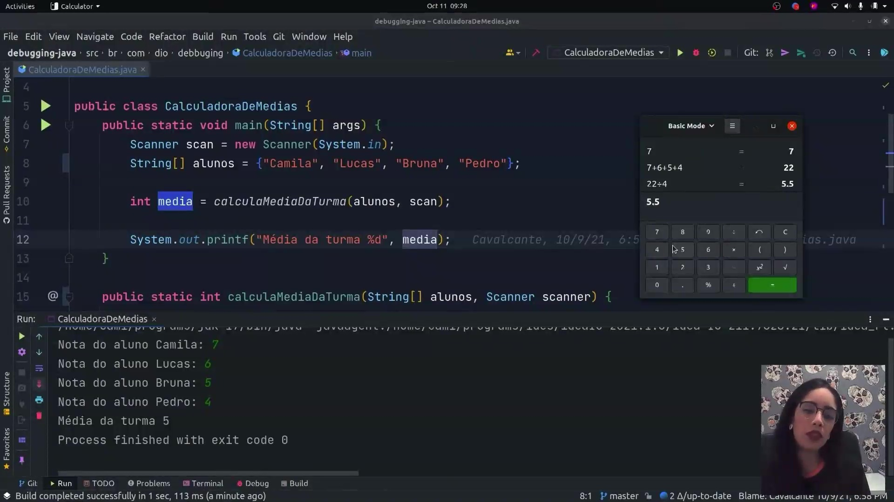
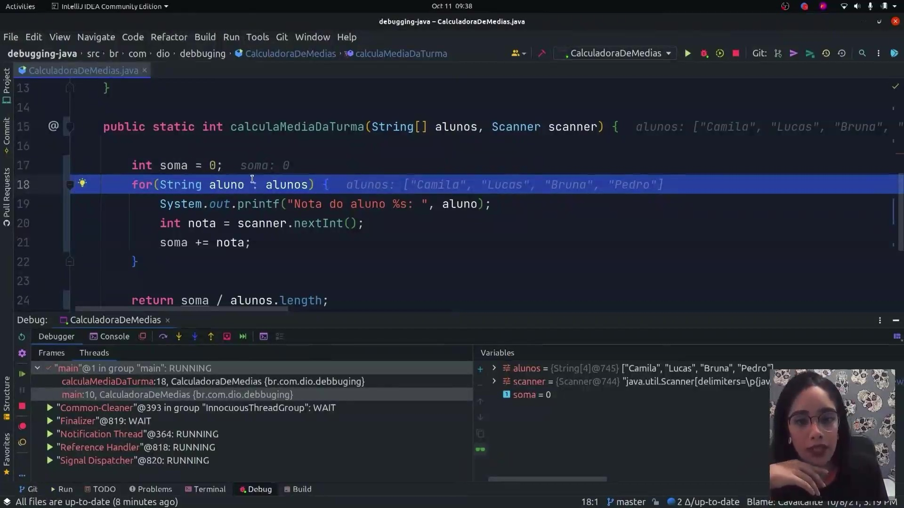
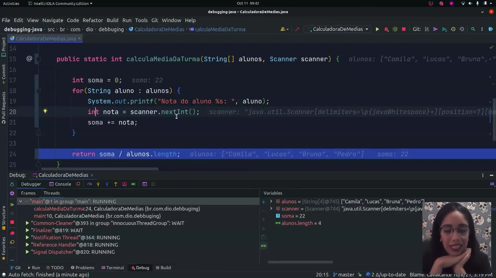
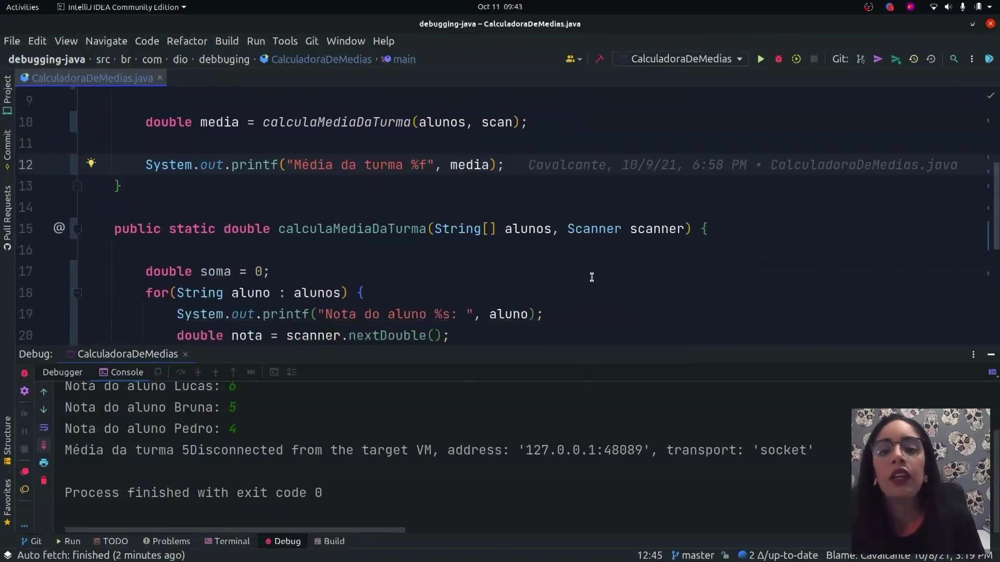
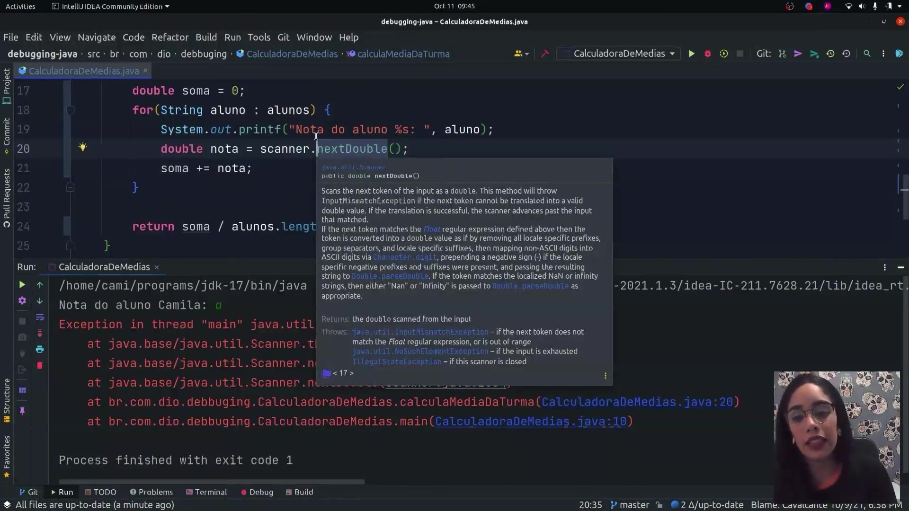

## Instrutor

- Camila Cavalcante (Software Developer @ Reclame AQUI | Full Stack | Java | Kotlin | Go | TypeScript | PHP)
- Contato Linkedin: / [cami-la](https://www.linkedin.com/in/cami-la/)

## Parte 1 - Apresentação e Visão Geral

### 🟩 Vídeo 01 - Apresentação e Visão Geral

<video width="60%" controls>
  <source src="000-Midia_e_Anexos/bootcamp_tqi_fullstack-modulo.06-curso.08-video_01.webm" type="video/webm">
    Seu navegador não suporta vídeo HTML5.
</video>

link do vídeo: https://web.dio.me/track/tqi-fullstack-developer/course/debugging-java/learning/97fc1d8d-4f01-4856-a1a2-85c6117ccc75?autoplay=1

Este guia resume os conceitos fundamentais para identificar, analisar e corrigir erros em programas Java, utilizando ferramentas de depuração integradas às IDEs modernas.

### Anotações

### Introdução ao Debugging em Java

Nesta aula introdutória, exploramos os conceitos fundamentais de **depuração (debugging)** no ecossistema Java. O curso é focado na parte prática (*hands-on*), utilizando a IDE IntelliJ IDEA para demonstrar como identificar e corrigir erros de programação, conhecidos como bugs.

A depuração é o processo de encontrar e solucionar esses problemas, uma tarefa que pode ser complexa dependendo do ambiente e das ferramentas disponíveis. Em linguagens de alto nível como o Java, esse processo é facilitado por recursos como o tratamento de exceções e depuradores integrados, que permitem observar e controlar o tempo de execução do programa.

#### Pré-requisitos

Para acompanhar as atividades práticas, são necessários:

* **Java JDK**: Versão 8 ou superior.
* **IDE**: IntelliJ IDEA ou Eclipse.

### Categorias de Erros de Programação

Os erros encontrados durante o desenvolvimento geralmente se dividem em duas grandes naturezas:

1. **Erros de Sintaxe**: Ocorrem quando as regras da linguagem não são seguidas. São facilmente identificados pela IDE (que costuma sublinhar o trecho com uma linha vermelha) antes mesmo da execução.
* Exemplos: Esquecer de fechar parênteses `()`, chaves `{}` ou colchetes `[]` ; ausência de ponto e vírgula `;` entre instruções ; ou uso de palavras-chave em locais inesperados.
2. **Erros de Semântica**: Ocorrem quando o código está sintaticamente correto, mas a lógica produz um resultado inesperado ou inconsistente durante a execução.
* Exemplos: Tentar dividir um número por zero ou por uma String ; atribuir um valor incoerente a um tipo de dado ; ou tentar fechar um arquivo que nunca foi aberto.

### Estrutura de Execução e Stack Trace

Para depurar com eficiência, é crucial compreender como o Java gerencia a execução dos métodos:

* **Pilha de Execução (Stack)**: Cada invocação de método é "empilhada" em uma estrutura de dados que isola sua área de memória. Quando um método termina, ele é removido da pilha e o controle retorna ao método que o invocou.
* **Stack Trace**: É o rastreamento dessa pilha. Quando ocorre uma exceção, o Java gera um relatório mostrando a sequência de chamadas de métodos até o ponto onde o erro surgiu, facilitando a localização da falha.

#### Links Úteis e Referências

* Documentação IntelliJ IDEA: [https://confluence.jetbrains.com/display/IntelliJ+IDEA/14+Depuradore](https://www.google.com/search?q=https://confluence.jetbrains.com/display/IntelliJ%2BIDEA/14%2BDepuradore).
* Documentação Eclipse: [http://www.eclipse.org/community/eclipse_newsletter/2017/June/article1.php/](https://www.google.com/search?q=http://www.eclipse.org/community/eclipse_newsletter/2017/June/article1.php/).
* Entendendo Stack Traces: [https://www.sentinelone.com/blog/java-stack-trace-understanding](https://www.sentinelone.com/blog/java-stack-trace-understanding).


## Parte 2 - Pilha de Execução de um Programa Java

### 🟩 Vídeo 02 - Pilha de Execução de um Programa Java

<video width="60%" controls>
  <source src="000-Midia_e_Anexos/bootcamp_tqi_fullstack-modulo.06-curso.08-video_02.webm" type="video/webm">
    Seu navegador não suporta vídeo HTML5.
</video>

link do vídeo: https://web.dio.me/track/tqi-fullstack-developer/course/debugging-java/learning/55263056-2fcd-4b2d-a2dc-f51c233d2eb8?autoplay=1

Este guia explora os fundamentos da execução de programas Java, focando na estrutura da Pilha de Execução (Call Stack). Através de um exemplo prático, o tutorial demonstra como os métodos são empilhados e desempilhados, além de fornecer orientações sobre ferramentas de desenvolvimento e leitura de erros.

### Anotações

Nesta aula, é apresentada a estrutura de execução de um programa Java utilizando a IDE IntelliJ IDEA e o JDK 17 (embora versões a partir da 8 sejam suficientes). O foco inicial é compreender a **pilha de execução (stack)** através de um exemplo prático com quatro métodos encadeados: `main`, `a`, `b` e `c`.

O fluxo de execução segue uma lógica de empilhamento onde:

1. **Método main**: É o ponto de entrada e saída do programa. Ele inicia e chama o método `a`.
2. **Método a**: Imprime uma mensagem e chama o método `b`.
3. **Método b**: Executa um laço `for` que imprime valores de 0 a 4 e, em seguida, chama o método `c`.
4. **Método c**: É o último nível da pilha neste exemplo, onde é utilizado o método `Thread.dumpStack()` para exibir a trilha de execução (stack trace) no console.

A conclusão de um método depende da finalização dos métodos que ele chamou. Assim, o programa só finaliza o `main` após o método `a` terminar, que por sua vez aguarda o `b`, e este aguarda o `c`. Ao analisar o **stack trace** (as mensagens em vermelho no console), a leitura deve ser feita de baixo para cima para entender a ordem de chamada dos métodos.

```java
package br.com.dio.debbuging; // Define o pacote do projeto.

public class Main { // Declaração da classe principal.

    public static void main(String[] args) { 
        // Ponto de entrada: O Java sempre procura primeiro o método main para iniciar a execução.
        
        System.out.println("Iniciou do programa no método main."); 
        // Saída: "Iniciou do programa no método main."
        // Porquê: É a primeira instrução executada assim que o programa inicia.

        a(); 
        // O programa "pula" para o método a(), pausando a execução do main até que a() retorne.

        System.out.println("Finalizou do programa no método main.");
        // Saída: "Finalizou do programa no método main."
        // Porquê: Esta linha só é executada após o método a() (e todos os seus sub-métodos) finalizar.
    }

    static void a() { 
        // Método com modificador 'public' omitido (default), o que é permitido no Java.
        
        System.out.println("Entrou no método a.");
        // Saída: "Entrou no método a."
        // Porquê: Confirmar que o fluxo saiu do main e entrou na execução do método a.

        b(); 
        // Chama o método b(), empilhando-o sobre o método a.

        System.out.println("Finalizou o método a.");
        // Saída: "Finalizou o método a."
        // Porquê: Só executa após b() ser totalmente finalizado e removido da pilha.
    }

    static void b() {
        System.out.println("Entrou no método b.");
        // Saída: "Entrou no método b."
        // Porquê: Indica o início da execução do terceiro nível da pilha.

        for(int i=0; i<=4; i++) System.out.println(i);
        // Saída: 0, 1, 2, 3, 4 (um em cada linha).
        // Porquê: O laço imprime o valor de 'i' enquanto ele for menor ou igual a 4.

        c(); 
        // Chama o método c(), o último nível de profundidade desta pilha.

        System.out.println("Finalizou o método b.");
        // Saída: "Finalizou o método b."
        // Porquê: O programa volta para esta linha assim que o método c() termina.
    }

    static void c(){
        System.out.println("Entrou no método c.");
        // Saída: "Entrou no método c."
        // Porquê: Identifica a entrada no último método da cadeia de chamadas.

        Thread.dumpStack(); 
        // Saída: Uma trilha de exceção (Stack Trace) em vermelho no console.
        // Porquê: Imprime o estado atual da pilha. Ao ler de baixo para cima, vemos a ordem: main -> a -> b -> c.

        System.out.println("Finalizou o método c.");
        // Saída: "Finalizou o método c."
        // Porquê: Última instrução do método c antes de começar o processo de "desempilhar" a execução.
    }
}
```

## Parte 3 - Debugging na IDE IntelliJ

### 🟩 Vídeo 03 - Debugging na IDE IntelliJ

<video width="60%" controls>
  <source src="000-Midia_e_Anexos/bootcamp_tqi_fullstack-modulo.06-curso.08-video_03.webm" type="video/webm">
    Seu navegador não suporta vídeo HTML5.
</video>

link do vídeo: https://web.dio.me/track/tqi-fullstack-developer/course/debugging-java/learning/be8d3b90-484b-4f7c-bc6f-91a90c32c7b4?autoplay=1

Este guia resume a aula prática sobre como utilizar ferramentas de depuração (debug) no IntelliJ IDEA para identificar erros lógicos e inconsistências em códigos Java, exemplificado através de um sistema simples de cálculo de médias escolares.

### Anotações

#### Código de Exemplo

```java
package br.com.dio.debbuging;

import java.util.Scanner;

public class CalculadoraDeMedias {
    public static void main(String[] args) {
        Scanner scan = new Scanner(System.in);
        String[] alunos = {"Camila", "Lucas", "Bruna", "Pedro"};

        double media = calculaMediaDaTurma(alunos, scan);

        System.out.printf("Média da turma %.1f", media);
    }

    public static double calculaMediaDaTurma(String[] alunos, Scanner scanner) {

        double soma = 0;
        for(String aluno : alunos) {
            System.out.printf("Nota do aluno %s: ", aluno);
            double nota = scanner.nextDouble();
            soma += nota;
        }

        return soma / alunos.length;
    }

}
```

Nesta aula, exploramos a classe `CalculadoraDeMedias`, desenvolvida para calcular a média das notas de uma turma. O código utiliza um array de strings para os nomes dos alunos e um objeto `Scanner` para capturar as entradas do teclado. O fluxo principal ocorre no método `main`, que invoca o método `calculaMediaDaTurma` para processar a lógica de soma e divisão.

<p align="center">

</p>

Ao executar o programa inicialmente, as notas inseridas (7, 6, 5 e 4) resultaram em uma média de **5**. No entanto, um teste de mesa manual revela que a soma dessas notas é 22, o que deveria resultar em uma média de **5.5** (). Essa discrepância indica uma inconsistência lógica no código, provavelmente relacionada à forma como os tipos numéricos (inteiros vs. decimais) estão sendo manipulados durante a divisão.

```java
// Exemplo da execução com erro lógico
Nota do aluno Camila: 7
Nota do aluno Lucas: 6
Nota do aluno Bruna: 5
Nota do aluno Pedro: 4
Média da turma 5

```

<p align="center">

</p>

Para investigar a causa do erro, iniciamos o modo de **Debug** da IDE colocando um **breakpoint** na linha de retorno do método. A ferramenta de debug permite inspecionar o estado das variáveis em tempo real. Na aba *Variables*, observamos que o array `alunos` contém os quatro nomes e que o programa está parado no ponto exato onde o cálculo final da média será realizado.

<p align="center">

</p>

Ao avançar passo a passo (utilizando o *Step Over*), validamos que a variável `soma` acumulou corretamente o valor **22**. O painel de debug confirma que `soma` é 22 e `alunos.length` é 4. O erro torna-se evidente ao perceber que, embora os valores estejam corretos, a operação está sendo tratada como uma divisão de inteiros, o que descarta as casas decimais e resulta no valor truncado 5 em vez de 5.5.

<p align="center">

</p>

A solução para a inconsistência é a refatoração dos tipos de dados. Alteramos as variáveis `soma`, `nota` e o retorno do método de `int` para `double`. No método `main`, a variável `media` também passa a ser `double` e o formatador do `printf` é ajustado de `%d` (inteiro) para `%f` (ponto flutuante). Com essas mudanças, o Java preserva a precisão decimal durante o cálculo.

```java
double media = calculaMediaDaTurma(alunos, scan);
System.out.printf("Média da turma %.1f", media);

public static double calculaMediaDaTurma(String[] alunos, Scanner scanner) {
    double soma = 0;
    for (String aluno : alunos) {
        System.out.printf("Nota do aluno %s: ", aluno);
        double nota = scanner.nextDouble();
        soma += nota;
    }
    return soma / alunos.length;
}

```

<p align="center">

</p>

Além de erros lógicos, o debug auxilia na identificação de exceções em tempo de execução. Ao inserir um texto (como o nome "Camila") onde o programa espera um valor numérico para a nota, o sistema lança uma `java.util.InputMismatchException`. O console exibe a **stack trace**, indicando que o erro ocorreu no método `nextDouble()` da classe `Scanner` na linha 20, permitindo ao desenvolvedor planejar tratamentos de erro como blocos `try-catch`.

```bash
Exception in thread "main" java.util.InputMismatchException
	at java.base/java.util.Scanner.throwFor(Scanner.java:939)
	at java.base/java.util.Scanner.next(Scanner.java:1594)
	at java.base/java.util.Scanner.nextDouble(Scanner.java:2564)
	at br.com.dio.debbuging.CalculadoraDeMedias.calculaMediaDaTurma(CalculadoraDeMedias.java:20)
	at br.com.dio.debbuging.CalculadoraDeMedias.main(CalculadoraDeMedias.java:10)

```      


## Parte 4 - Debugging na IDE Eclipse

### 🟩 Vídeo 04 - Debugging na IDE Eclipse

<video width="60%" controls>
  <source src="000-Midia_e_Anexos/bootcamp_tqi_fullstack-modulo.06-curso.08-video_04.webm" type="video/webm">
    Seu navegador não suporta vídeo HTML5.
</video>

link do vídeo: https://web.dio.me/track/tqi-fullstack-developer/course/debugging-java/learning/58e50b89-f0ae-4f77-ab52-8517cef5ae2e?autoplay=1


##  Materiais de Apoio

# Certificado: 

- Link na plataforma: 
- Certificado em pdf: