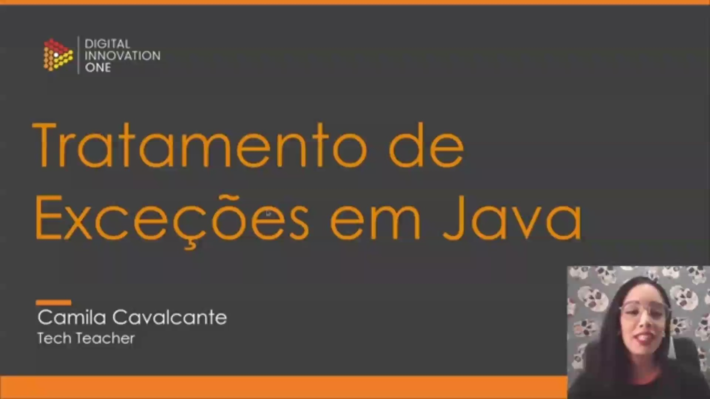
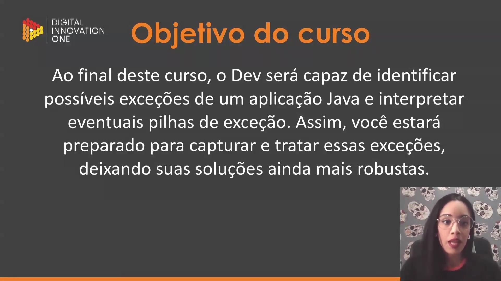
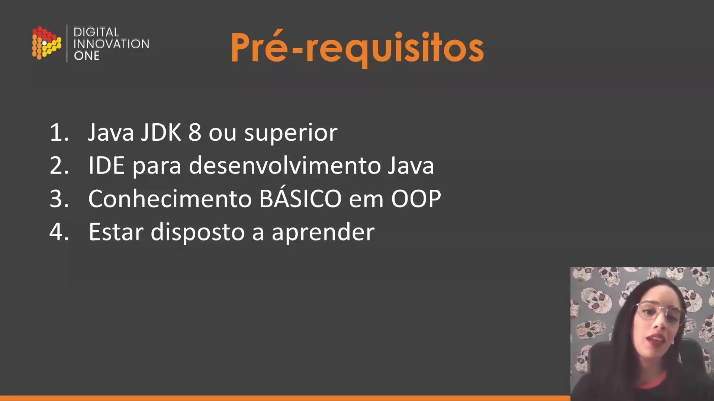
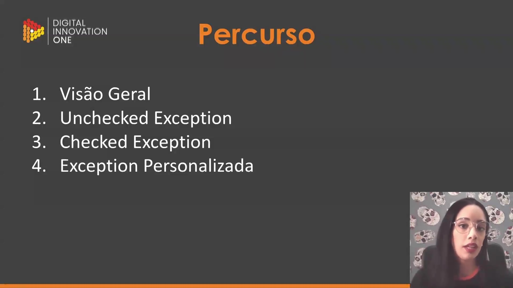
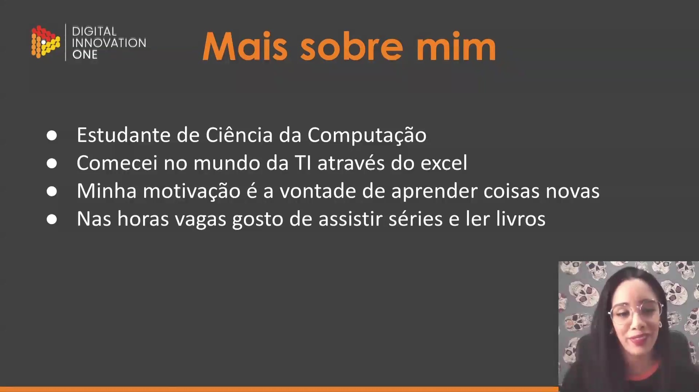
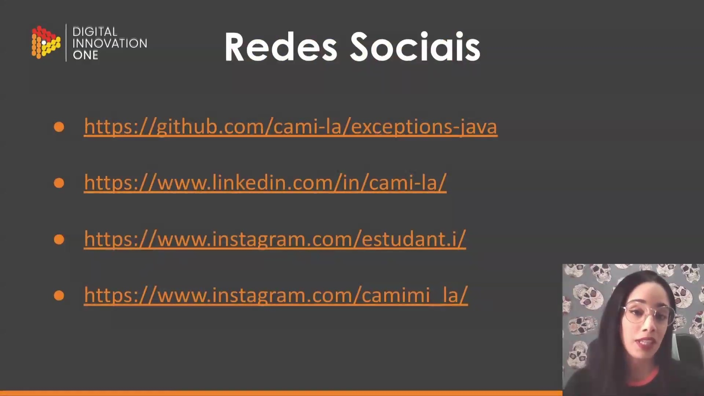

## Instrutor

- Camila Cavalcante (Software Developer @ Reclame AQUI | Full Stack | Java | Kotlin | Go | TypeScript | PHP)
- Contato Linkedin: / [cami-la](https://www.linkedin.com/in/cami-la/)

## Parte 1 - Apresentação e Visão Geral

### 🟩 Vídeo 01 - Apresentação

<video width="60%" controls>
  <source src="000-Midia_e_Anexos/bootcamp_tqi_fullstack-modulo.06-curso.09-video_01.webm" type="video/webm">
    Seu navegador não suporta vídeo HTML5.
</video>

link do vídeo: https://web.dio.me/track/tqi-fullstack-developer/course/tratamento-de-excecoes-em-java/learning/8ab022fe-7c0e-41bc-95de-daedca653d7c?autoplay=1

Este curso foca em capacitar desenvolvedores a identificar, interpretar e tratar erros em aplicações Java, garantindo que o software seja robusto e resiliente a falhas inesperadas.

### Anotações

Esta é a introdução ao curso de **Tratamento de Exceções em Java** , ministrado pela instrutora Camila Cavalcante. O objetivo inicial é apresentar os fundamentos necessários para lidar com erros e imprevistos durante a execução de programas desenvolvidos na linguagem Java, garantindo que o software possa lidar com situações anômalas de maneira controlada.

O curso define metas claras para o desenvolvimento do aluno: 

* **Identificação:** Capacidade de reconhecer onde e por que uma exceção pode ocorrer em uma aplicação Java.
* **Interpretação:** Entendimento de eventuais pilhas de exceção (*stack traces*) para localizar falhas.
* **Robustez:** Preparação para capturar e tratar essas exceções, tornando as soluções de software mais seguras e robustas.

Para um bom aproveitamento das aulas, são listados os seguintes pré-requisitos: 

1. **Java JDK 8 ou superior:** Requisito de ambiente para compilação e execução.
2. **IDE para desenvolvimento Java:** Ferramenta como IntelliJ, Eclipse ou VS Code.
3. **Conhecimento BÁSICO em OOP:** Noções fundamentais de Orientação a Objetos.
4. **Estar disposto a aprender:** Atitude necessária para absorver o conteúdo proposto.

O roteiro de aprendizado será dividido em quatro tópicos principais que compõem o percurso do curso: 

1. **Visão Geral:** Introdução aos conceitos fundamentais.
2. **Unchecked Exception:** Exceções que não são verificadas obrigatoriamente pelo compilador em tempo de compilação.
3. **Checked Exception:** Exceções que exigem tratamento ou declaração obrigatória.
4. **Exception Personalizada:** Desenvolvimento de exceções específicas para o contexto da aplicação.

A instrutora Camila Cavalcante apresenta seu perfil profissional e pessoal. Estudante de Ciência da Computação , ela relata ter iniciado sua trajetória na tecnologia através do Excel. Sua principal motivação é a vontade de aprender coisas novas. Em seu tempo livre, prefere atividades não relacionadas a computadores, como assistir séries e ler livros.

Para acompanhar o material prático e sanar dúvidas durante o curso, são disponibilizados diversos canais de comunicação e repositórios: 

* **GitHub:** Repositório principal onde o código-fonte da aula e um README detalhado estão localizados.
* **Redes Sociais:** Links para conexão no LinkedIn e acompanhamento de rotinas de estudo no Instagram.
* **Suporte:** Fórum da plataforma DIO, comunidade no Discord e abertura de *issues* no GitHub para dúvidas coletivas.

Links extraídos:

* [https://github.com/cami-la/exceptions-java](https://github.com/cami-la/exceptions-java) 
* [https://www.linkedin.com/in/cami-la/](https://www.linkedin.com/in/cami-la/) 
* [https://www.instagram.com/estudant.i/](https://www.instagram.com/estudant.i/) 
* [https://www.instagram.com/camimi](https://www.instagram.com/camimi) la/      

## Parte 2 - Unchecked exception

### 🟩 Vídeo 02 - Unchecked exception

<video width="60%" controls>
  <source src="000-Midia_e_Anexos/bootcamp_tqi_fullstack-modulo.06-curso.09-video_02.webm" type="video/webm">
    Seu navegador não suporta vídeo HTML5.
</video>

link do vídeo:

## Parte 3 - Checked exception

### 🟩 Vídeo 03 - Checked exception parte 1

<video width="60%" controls>
  <source src="000-Midia_e_Anexos/bootcamp_tqi_fullstack-modulo.06-curso.09-video_03.webm" type="video/webm">
    Seu navegador não suporta vídeo HTML5.
</video>

link do vídeo:

## Parte 4 - Exception Personalizada

### 🟩 Vídeo 04 - Exception Personalizada 1

<video width="60%" controls>
  <source src="000-Midia_e_Anexos/bootcamp_tqi_fullstack-modulo.06-curso.09-video_04.webm" type="video/webm">
    Seu navegador não suporta vídeo HTML5.
</video>

link do vídeo:

### 🟩 Vídeo 05 - Exception Personalizada 2

<video width="60%" controls>
  <source src="000-Midia_e_Anexos/bootcamp_tqi_fullstack-modulo.06-curso.09-video_05.webm" type="video/webm">
    Seu navegador não suporta vídeo HTML5.
</video>

link do vídeo:

## Parte 5 - Encerramento do Curso

### 🟩 Vídeo 06 - Final

<video width="60%" controls>
  <source src="000-Midia_e_Anexos/bootcamp_tqi_fullstack-modulo.06-curso.09-video_06.webm" type="video/webm">
    Seu navegador não suporta vídeo HTML5.
</video>

link do vídeo:

# Certificado: Tratamento de Exceções em Java

- Link na plataforma: 
- Certificado em pdf: