## Instrutor

- Camila Cavalcante (Software Developer @ Reclame AQUI | Full Stack | Java | Kotlin | Go | TypeScript | PHP)
- Contato Linkedin: / [cami-la](https://www.linkedin.com/in/cami-la/)

## Parte 1 - Apresentação e Visão Geral

### 🟩 Vídeo 01 - Apresentação

<video width="60%" controls>
  <source src="000-Midia_e_Anexos/bootcamp_tqi_fullstack-modulo.06-curso.09-video_01.webm" type="video/webm">
    Seu navegador não suporta vídeo HTML5.
</video>

link do vídeo: https://web.dio.me/track/tqi-fullstack-developer/course/tratamento-de-excecoes-em-java/learning/8ab022fe-7c0e-41bc-95de-daedca653d7c?autoplay=1

Este curso foca em capacitar desenvolvedores a identificar, interpretar e tratar erros em aplicações Java, garantindo que o software seja robusto e resiliente a falhas inesperadas.

### Anotações

<p align="center">

</p>

Esta é a introdução ao curso de **Tratamento de Exceções em Java** , ministrado pela instrutora Camila Cavalcante. O objetivo inicial é apresentar os fundamentos necessários para lidar com erros e imprevistos durante a execução de programas desenvolvidos na linguagem Java, garantindo que o software possa lidar com situações anômalas de maneira controlada.

<p align="center">

</p>

O curso define metas claras para o desenvolvimento do aluno: 

* **Identificação:** Capacidade de reconhecer onde e por que uma exceção pode ocorrer em uma aplicação Java.
* **Interpretação:** Entendimento de eventuais pilhas de exceção (*stack traces*) para localizar falhas.
* **Robustez:** Preparação para capturar e tratar essas exceções, tornando as soluções de software mais seguras e robustas.

<p align="center">

</p>

Para um bom aproveitamento das aulas, são listados os seguintes pré-requisitos: 

1. **Java JDK 8 ou superior:** Requisito de ambiente para compilação e execução.
2. **IDE para desenvolvimento Java:** Ferramenta como IntelliJ, Eclipse ou VS Code.
3. **Conhecimento BÁSICO em OOP:** Noções fundamentais de Orientação a Objetos.
4. **Estar disposto a aprender:** Atitude necessária para absorver o conteúdo proposto.

<p align="center">

</p>

O roteiro de aprendizado será dividido em quatro tópicos principais que compõem o percurso do curso: 

1. **Visão Geral:** Introdução aos conceitos fundamentais.
2. **Unchecked Exception:** Exceções que não são verificadas obrigatoriamente pelo compilador em tempo de compilação.
3. **Checked Exception:** Exceções que exigem tratamento ou declaração obrigatória.
4. **Exception Personalizada:** Desenvolvimento de exceções específicas para o contexto da aplicação.

<p align="center">

</p>

A instrutora Camila Cavalcante apresenta seu perfil profissional e pessoal. Estudante de Ciência da Computação , ela relata ter iniciado sua trajetória na tecnologia através do Excel. Sua principal motivação é a vontade de aprender coisas novas. Em seu tempo livre, prefere atividades não relacionadas a computadores, como assistir séries e ler livros.

<p align="center">

</p>

Para acompanhar o material prático e sanar dúvidas durante o curso, são disponibilizados diversos canais de comunicação e repositórios: 

* **GitHub:** Repositório principal onde o código-fonte da aula e um README detalhado estão localizados.
* **Redes Sociais:** Links para conexão no LinkedIn e acompanhamento de rotinas de estudo no Instagram.
* **Suporte:** Fórum da plataforma DIO, comunidade no Discord e abertura de *issues* no GitHub para dúvidas coletivas.

Links extraídos:

* [https://github.com/cami-la/exceptions-java](https://github.com/cami-la/exceptions-java) 
* [https://www.linkedin.com/in/cami-la/](https://www.linkedin.com/in/cami-la/) 
* [https://www.instagram.com/estudant.i/](https://www.instagram.com/estudant.i/) 
* [https://www.instagram.com/camimi_la](https://www.instagram.com/camimi_la)/      

### 🟩 Vídeo 02 - Visão geral

<video width="60%" controls>
  <source src="000-Midia_e_Anexos/bootcamp_tqi_fullstack-modulo.06-curso.09-video_02.webm" type="video/webm">
    Seu navegador não suporta vídeo HTML5.
</video>

link do vídeo: https://web.dio.me/track/tqi-fullstack-developer/course/tratamento-de-excecoes-em-java/learning/6fad4964-b716-4a93-910c-8fb6175a3a1d?autoplay=1

Este vídeo oferece uma introdução abrangente ao tratamento de exceções em Java, cobrindo a definição, importância, classificação e os mecanismos básicos para lidar com elas. A ênfase é dada à compreensão conceitual antes de mergulhar na implementação prática.

### Anotações

#### Visão Geral: Tratamento de Exceções em Java

<p align="center">

</p>

Esta aula apresenta uma visão geral sobre o tratamento de exceções na linguagem Java. O objetivo é compreender os conceitos fundamentais e as palavras reservadas que permitem lidar com eventos inesperados durante a execução de um programa, antes de avançar para a implementação prática em código.

#### Definição e Importância das Exceções

<p align="center">
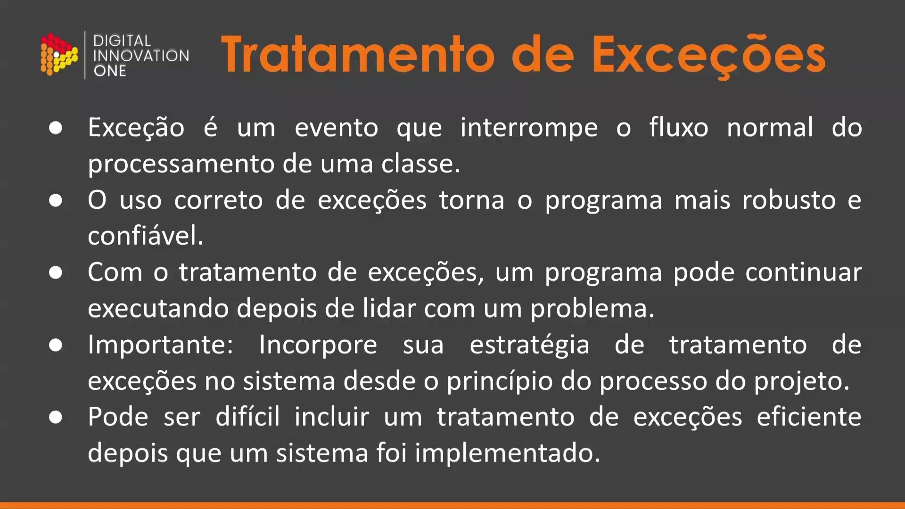
</p>

Uma exceção é definida como um evento que interrompe o fluxo normal de processamento de uma classe. O tratamento adequado desses eventos é crucial para criar programas robustos e confiáveis, permitindo que a aplicação continue operando mesmo após enfrentar um problema. É fundamental que a estratégia de tratamento de exceções seja incorporada ao sistema desde as etapas iniciais do projeto, pois pode ser difícil implementá-la de forma eficiente após o sistema já estar finalizado.

#### Categorias: Error, Unchecked e Checked

<p align="center">
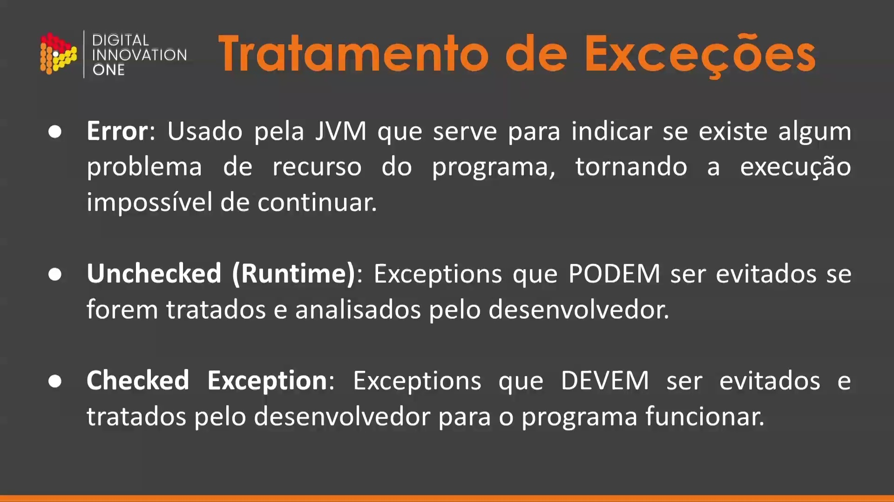
</p>

No ecossistema Java, as falhas de execução são categorizadas em três tipos principais:

* **Error:** Utilizado pela JVM para indicar problemas críticos de recursos do programa, onde a execução torna-se impossível de continuar.
* **Unchecked (Runtime):** Exceções que podem ser evitadas se forem analisadas e tratadas preventivamente pelo desenvolvedor.
* **Checked Exception:** Exceções que devem obrigatoriamente ser tratadas pelo desenvolvedor para que o programa funcione corretamente.

#### A Classe java.lang.Error na Documentação Oracle

<p align="center">
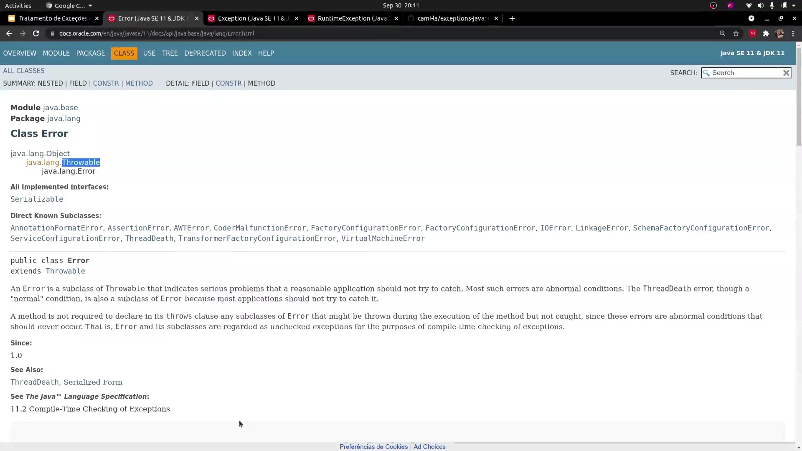
</p>

A documentação oficial define a classe `Error` como uma subclasse de `Throwable` que indica problemas sérios que uma aplicação comum não deve tentar capturar (catch). A maioria desses erros representa condições anormais. Como são condições que tecnicamente nunca deveriam ocorrer em uma execução saudável, os métodos não são obrigados a declarar esses erros em sua cláusula `throws`.

```java
java.lang.Object
   java.lang.Throwable
      java.lang.Error

```

#### A Classe java.lang.Exception na Documentação Oracle

<p align="center">
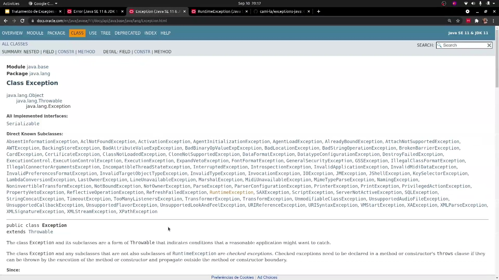
</p>

A classe `Exception` e suas subclasses são formas de `Throwable` que indicam condições que uma aplicação pode querer capturar para tratamento. Subclasses de `Exception` que não herdam de `RuntimeException` são classificadas como **Checked Exceptions** (exceções verificadas). Estas precisam ser obrigatoriamente declaradas na cláusula `throws` de um método ou construtor caso possam ser lançadas e propagadas para fora do escopo do método.

```java
java.lang.Object
   java.lang.Throwable
      java.lang.Exception

```

#### Hierarquia de Exceções no Java

<p align="center">
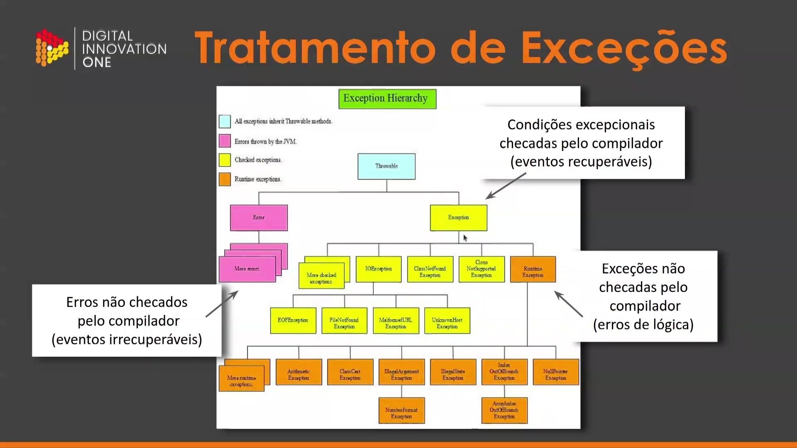
</p>

A hierarquia de exceções é encabeçada pela classe `Throwable`, que se divide em:

1. **Error:** Eventos irrecuperáveis e não checados pelo compilador, geralmente lançados pela JVM.
2. **Exception:** 
* **Checked Exceptions:** Condições excepcionais checadas pelo compilador, consideradas eventos recuperáveis (ex: `IOException`, `FileNotFoundException`).
* **Runtime Exceptions (Unchecked):** Exceções não checadas pelo compilador, frequentemente relacionadas a erros de lógica (ex: `NullPointerException`, `ArithmeticException`).

#### Palavras-Chave para o Tratamento

<p align="center">
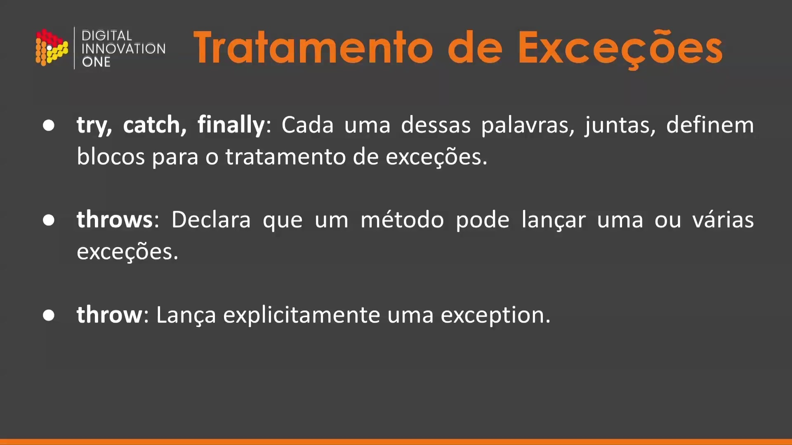
</p>

Para gerenciar o comportamento do programa diante de exceções, utilizamos as seguintes palavras reservadas:

* **try, catch, finally:** Blocos utilizados em conjunto para definir o tratamento de exceções.
* **throws:** Utilizada na assinatura de um método para declarar que ele pode lançar uma ou várias exceções.
* **throw:** Comando utilizado para lançar explicitamente uma exceção durante a execução.

#### Ementa do Curso e Repositório

<p align="center">
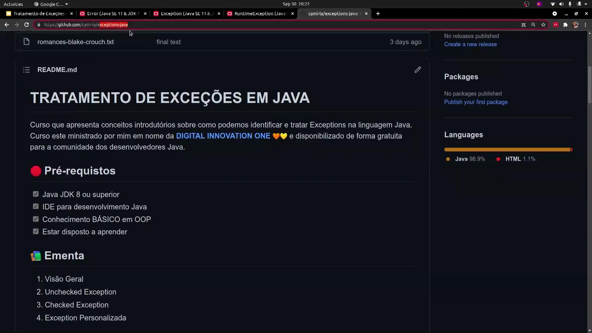
</p>

O curso de Tratamento de Exceções em Java está estruturado em quatro módulos principais: Visão Geral, Unchecked Exception, Checked Exception e Exception Personalizada. Para acompanhar as aulas, são necessários o Java JDK 8 ou superior, uma IDE e conhecimentos básicos em Programação Orientada a Objetos (OOP). O material de apoio e os exemplos de código estão disponíveis no repositório GitHub `cami-la/exceptions-java`.      


## Parte 2 - Unchecked exception

### 🟩 Vídeo 03 - Unchecked exception

<video width="60%" controls>
  <source src="000-Midia_e_Anexos/bootcamp_tqi_fullstack-modulo.06-curso.09-video_03.webm" type="video/webm">
    Seu navegador não suporta vídeo HTML5.
</video>

link do vídeo: https://web.dio.me/track/tqi-fullstack-developer/course/tratamento-de-excecoes-em-java/learning/4eb0f87b-e0e2-4cbe-96c0-ab019e26a7e0?autoplay=1

Este guia resume a aula prática sobre como lidar com erros em tempo de execução, focando em capturar falhas de entrada de dados e operações matemáticas inválidas, garantindo que o programa não "trave" inesperadamente.

### Anotações

Este documento apresenta uma aula prática focada no tratamento de exceções não verificadas (*Unchecked Exceptions*) em Java, demonstrando como lidar com erros de entrada de dados e operações matemáticas inválidas utilizando blocos `try-catch-finally` e lógica de repetição.

<p align="center">
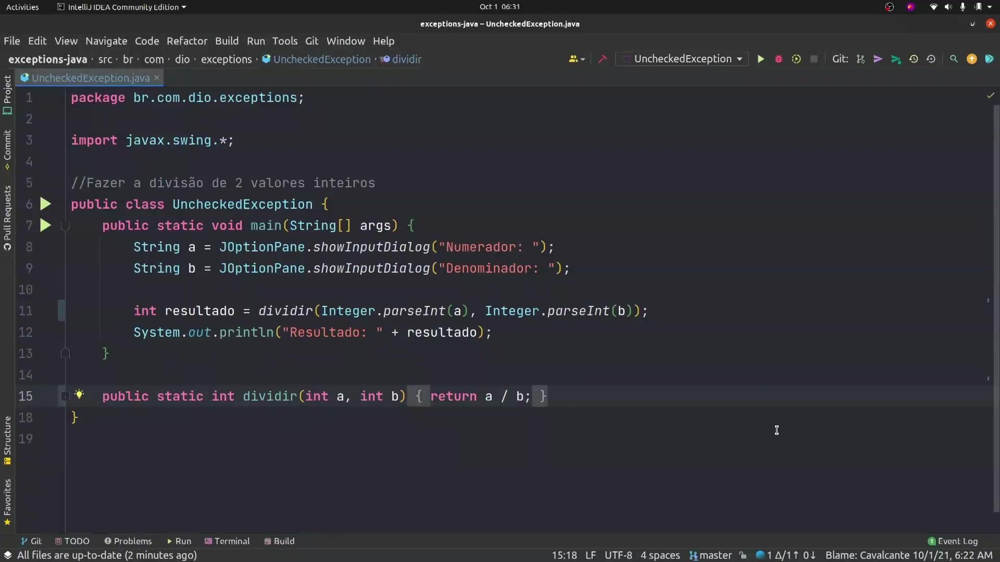
</p>

A aula inicia com a apresentação de um código base para realizar a divisão de dois números inteiros. O programa utiliza a classe `JOptionPane` para capturar as entradas do usuário (`numerador` e `denominador`) como strings, realiza a conversão para inteiros através de `Integer.parseInt` e chama um método dedicado para a operação.

```java
package br.com.dio.exceptions;

import javax.swing.*;

public class UncheckedException {
    public static void main(String[] args) {
        String a = JOptionPane.showInputDialog("Numerador: ");
        String b = JOptionPane.showInputDialog("Denominador: ");

        int resultado = dividir(Integer.parseInt(a), Integer.parseInt(b));
        System.out.println("Resultado: " + resultado);

        System.out.println("O código continua...");
    }

    public static int dividir(int a, int b) {
        return a / b;
    }
}

```

<p align="center">
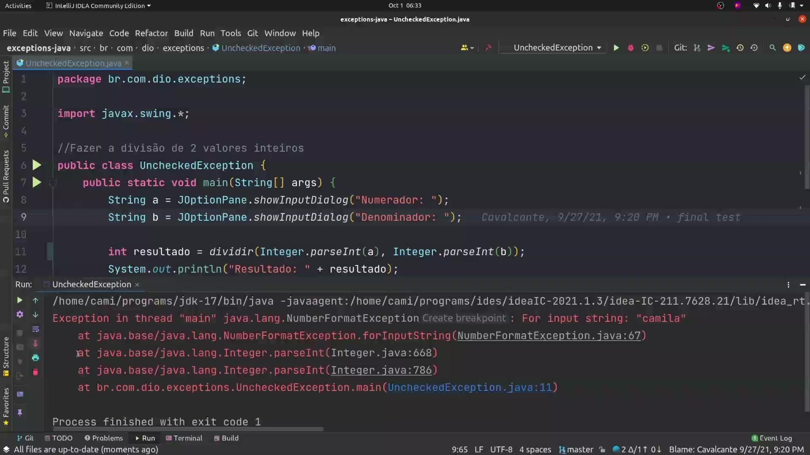
</p>

Ao executar o programa com entradas válidas (numerador 4 e denominador 2), o código funciona conforme o esperado, exibindo o resultado "2" no console. Este cenário representa o fluxo normal de execução sem a ocorrência de exceções.

<p align="center">
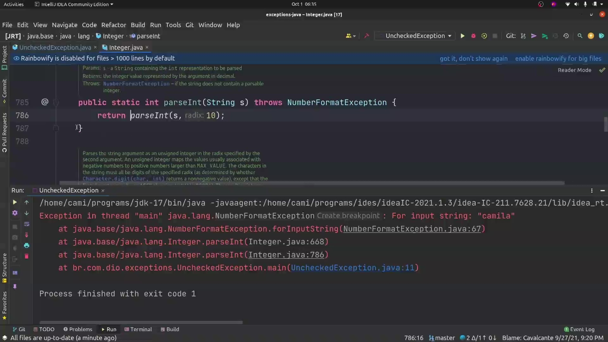
</p>

Quando o usuário fornece uma entrada inválida, como um nome (ex: "Camila") em vez de um número, o programa interrompe a execução e lança uma `NumberFormatException`. O console exibe o *stack trace*, indicando que a causa do erro foi a tentativa de converter a string "Camila" em um valor inteiro.

```bash
Exception in thread "main" java.lang.NumberFormatException: For input string: "Camila"
	at java.base/java.lang.NumberFormatException.forInputString(NumberFormatException.java:65)
	at java.base/java.lang.Integer.parseInt(Integer.java:652)
	at java.base/java.lang.Integer.parseInt(Integer.java:770)
	at br.com.dio.exceptions.UncheckedException.main(UncheckedException.java:11)

```

<p align="center">
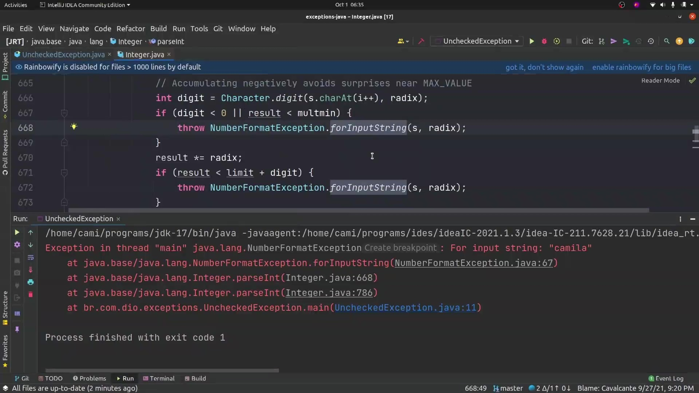
</p>

A análise do erro aponta diretamente para a linha 11 do código. É neste ponto que o método `Integer.parseInt(a)` tenta processar a string recebida do input, falhando ao encontrar caracteres não numéricos.

<p align="center">
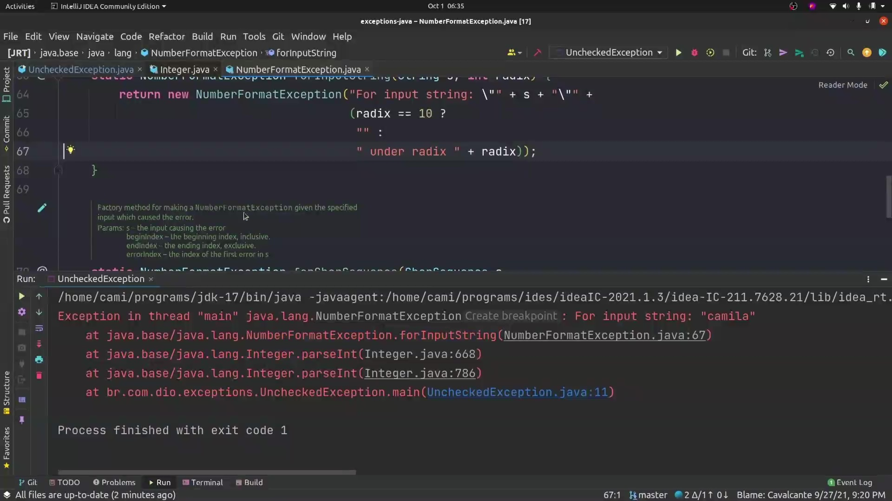
</p>

Para diagnosticar o problema, deve-se ler o *stack trace* de baixo para cima. A base da pilha mostra onde o erro foi originado no contexto do nosso projeto (`UncheckedException.main` na linha 11), subindo pelas classes internas da biblioteca padrão do Java até chegar na exceção específica que foi disparada.

<p align="center">
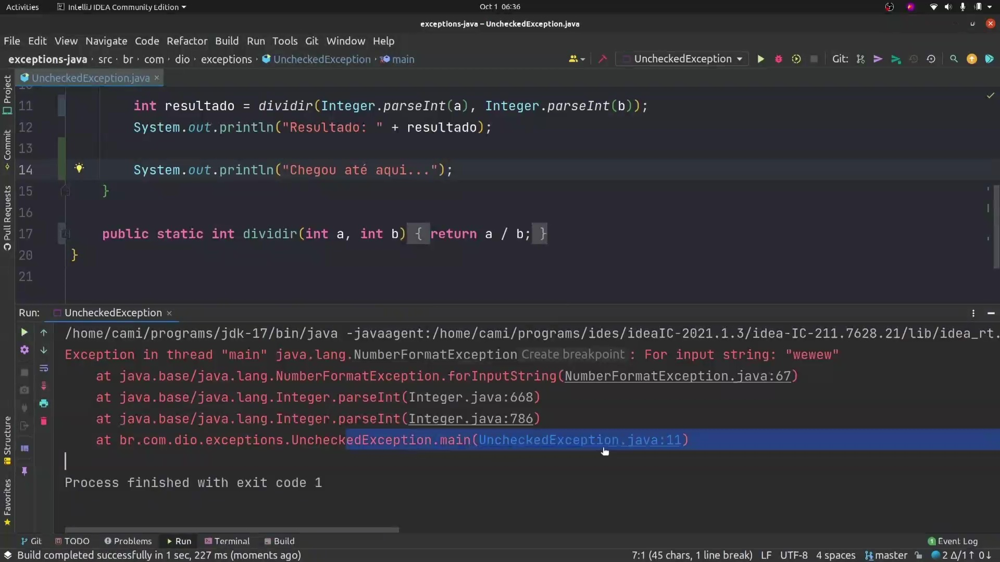
</p>

Para evitar a interrupção abrupta do programa, é implementado o bloco `try-catch`. O código propenso a erro é colocado dentro do `try`, enquanto o `catch` captura a `NumberFormatException`. Adicionalmente, o bloco `finally` é introduzido, garantindo que seu conteúdo seja executado independentemente da ocorrência de uma exceção.

```java
        try {
            int resultado = dividir(Integer.parseInt(a), Integer.parseInt(b));
            System.out.println("Resultado: " + resultado);
        } catch (NumberFormatException e) {
            e.printStackTrace();
        } finally {
            System.out.println("Chegou no finally!");
        }

```

<p align="center">
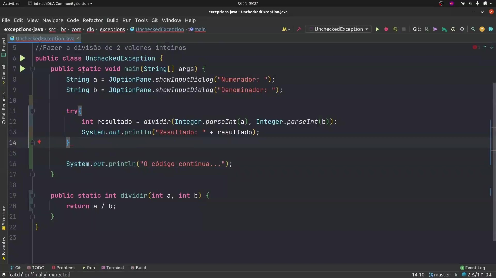
</p>

Em vez de apenas imprimir a pilha de erro no console, o tratamento é aprimorado para exibir uma mensagem didática ao usuário final. Utiliza-se `JOptionPane.showMessageDialog` para informar que a entrada é inválida e solicitar um número inteiro.

```java
        } catch (NumberFormatException e) {
            JOptionPane.showMessageDialog(null, "Entrada inválida, informe um número inteiro! ");
        } finally {

```

<p align="center">
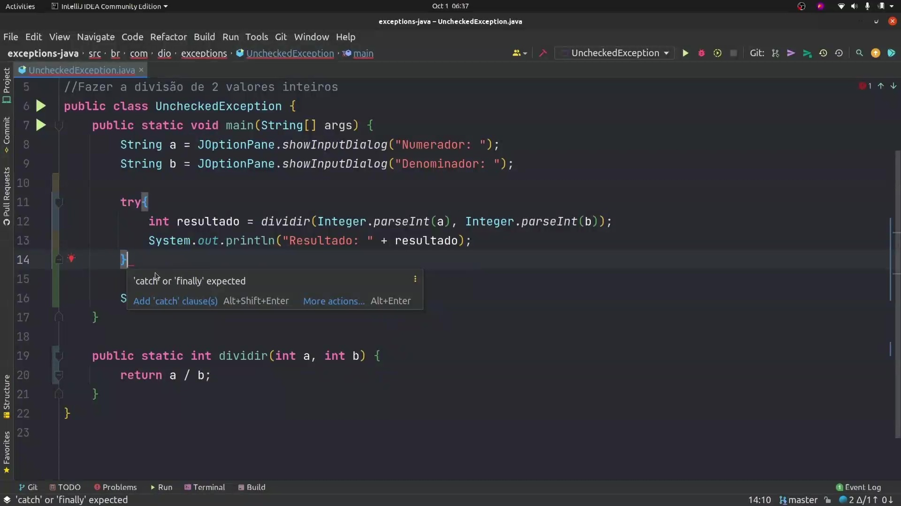
</p>

Ao rodar o programa com o tratamento implementado, o usuário agora vê uma caixa de diálogo amigável em vez de um erro técnico no console. A mensagem "Entrada inválida, informe um número inteiro!" orienta o usuário sobre como corrigir seu input.

<p align="center">
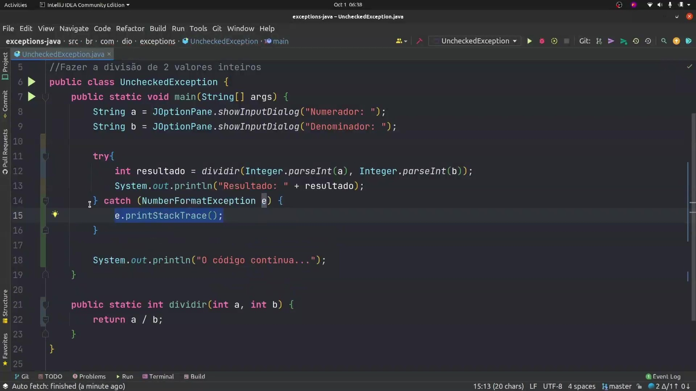
</p>

Mesmo após o erro de entrada e a exibição do alerta, o programa não trava. O console mostra que o bloco `finally` foi executado ("Chegou no finally!") e que o fluxo principal prosseguiu ("O código continua...").

<p align="center">
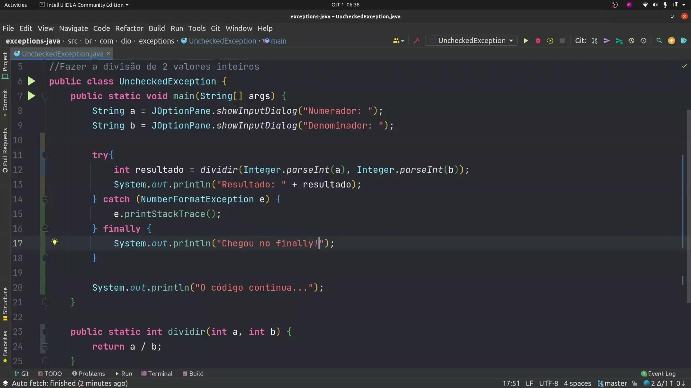
</p>

Um novo problema surge quando as entradas são numéricas, mas matematicamente impossíveis, como dividir por zero. Nesse caso, uma `ArithmeticException` é lançada, revelando outra vulnerabilidade no código que ainda não foi tratada.

```bash
Exception in thread "main" java.lang.ArithmeticException: / by zero
	at br.com.dio.exceptions.UncheckedException.dividir(UncheckedException.java:21)
	at br.com.dio.exceptions.UncheckedException.main(UncheckedException.java:12)

```

<p align="center">
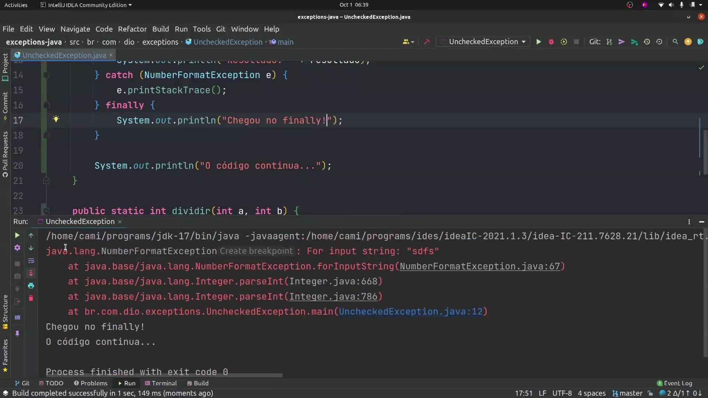
</p>

O erro de aritmética ocorre especificamente dentro do método `dividir`. Quando o valor do denominador (`b`) é zero, a operação de divisão falha, disparando a exceção que se propaga de volta para o método principal.

<p align="center">
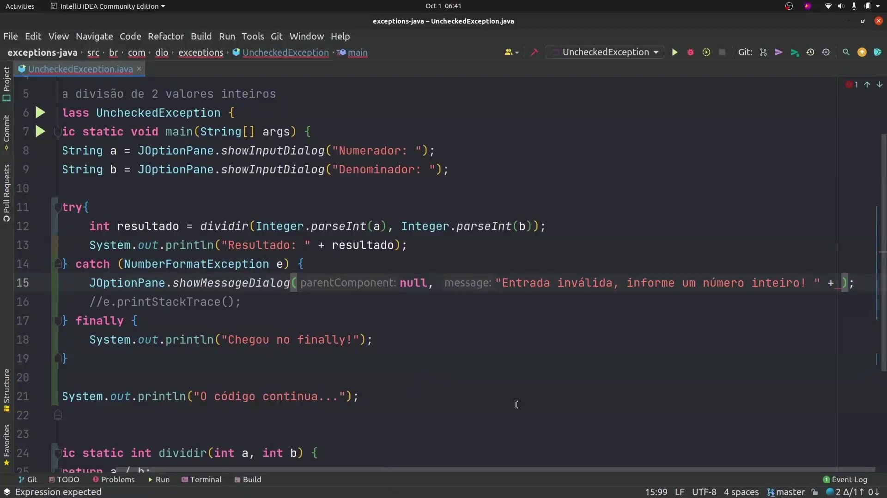
</p>

Para lidar com essa nova situação, adicionamos um segundo bloco `catch` especificamente para `ArithmeticException`. Isso permite que o programa trate diferentes tipos de erros de formas distintas, fornecendo feedback adequado para cada caso.

```java
        } catch (NumberFormatException e) {
            JOptionPane.showMessageDialog(null, "Entrada inválida, informe um número inteiro! ");
        } catch (ArithmeticException e) {
            JOptionPane.showMessageDialog(null, "Impossível dividir um número por 0! ");
        }

```

<p align="center">
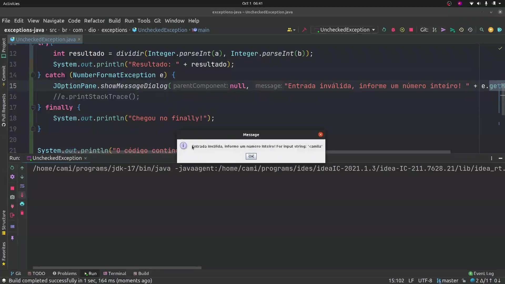
</p>

Com o novo tratamento, ao tentar dividir por zero, o programa exibe uma mensagem específica: "Impossível dividir um número por 0!". Novamente, o programa permanece estável e continua sua execução após o fechamento do diálogo.

<p align="center">
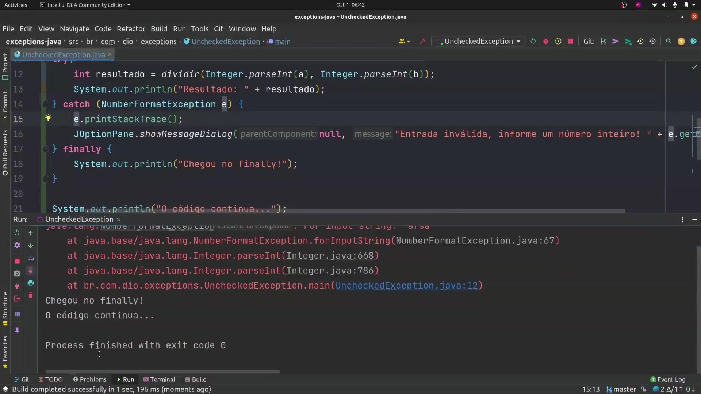
</p>

Para tornar o programa mais robusto, é adicionado um laço `do-while`. Utilizando uma variável de controle `continueLoop`, o programa continuará solicitando entradas ao usuário até que uma operação seja concluída com sucesso (sem exceções). No momento em que a divisão é bem-sucedida, a flag é alterada para `false`, encerrando o loop.

```java
        boolean continueLoop = true;
        do {
            String a = JOptionPane.showInputDialog("Numerador: ");
            String b = JOptionPane.showInputDialog("Denominador: ");

            try {
                int resultado = dividir(Integer.parseInt(a), Integer.parseInt(b));
                System.out.println("Resultado: " + resultado);
                continueLoop = false;
            } catch (NumberFormatException e) {
                JOptionPane.showMessageDialog(null, "Entrada inválida, informe um número inteiro! ");
            } catch (ArithmeticException e) {
                JOptionPane.showMessageDialog(null, "Impossível dividir um número por 0! ");
            } finally {
                System.out.println("Chegou no finally!");
            }
        } while (continueLoop);

```

<p align="center">
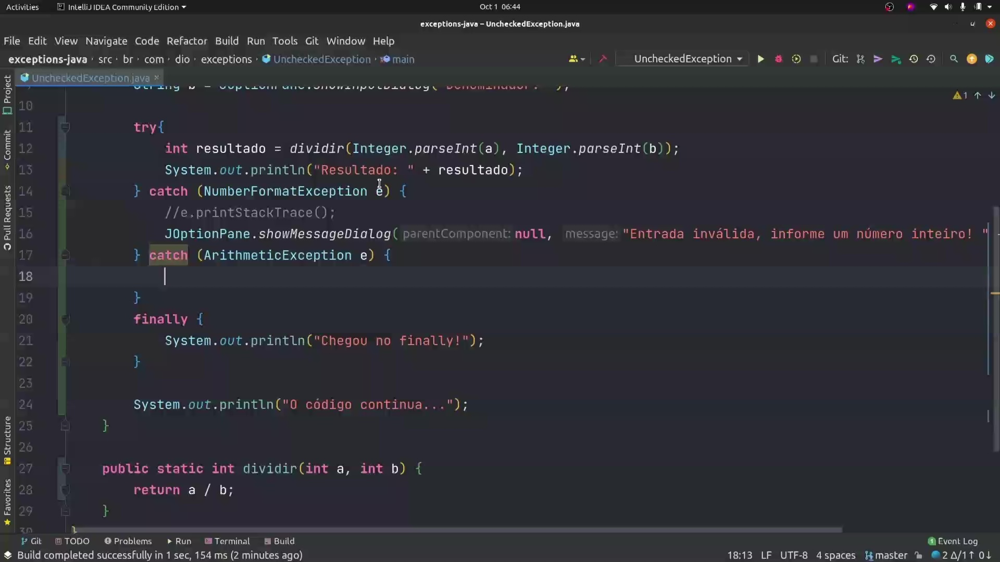
</p>

A execução final demonstra o poder dessa abordagem: o usuário pode errar a entrada (digitando texto) ou tentar uma divisão inválida (por zero) múltiplas vezes. Em todas as tentativas falhas, o programa captura a exceção, mostra o alerta, executa o `finally` e reinicia o loop, só finalizando quando uma divisão válida é finalmente processada.

<p align="center">
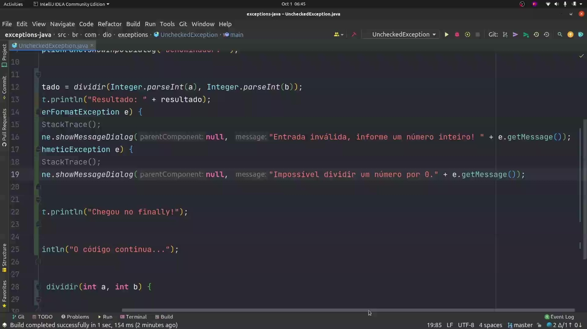
</p>

O estudo das *Unchecked Exceptions* mostra que, embora o compilador não obrigue o tratamento dessas falhas (que geralmente decorrem de erros de lógica ou inputs inadequados), tratá-las é essencial para a experiência do usuário e a estabilidade da aplicação. Na sequência, o curso abordará as *Checked Exceptions*.      


## Parte 3 - Checked exception

### 🟩 Vídeo 04 - Checked exception parte 1

<video width="60%" controls>
  <source src="000-Midia_e_Anexos/bootcamp_tqi_fullstack-modulo.06-curso.09-video_04.webm" type="video/webm">
    Seu navegador não suporta vídeo HTML5.
</video>

link do vídeo: https://web.dio.me/track/tqi-fullstack-developer/course/tratamento-de-excecoes-em-java/learning/b86d1b01-1427-4238-b2c2-f279346cb8f5?autoplay=1

Este guia explora o conceito de exceções verificadas (Checked Exceptions) através de um exemplo prático de leitura e escrita de arquivos. O foco principal é entender como o compilador Java obriga o desenvolvedor a lidar com riscos previsíveis e as diferentes formas de propagar esses erros.

### Anotações

<p align="center">
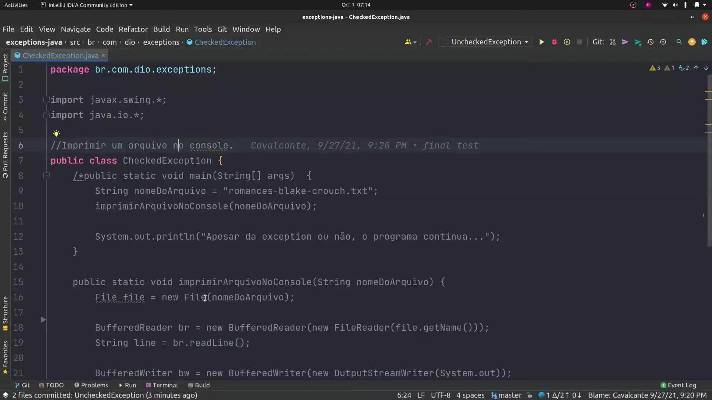
</p>

Nesta introdução às **Checked Exceptions** (exceções verificadas), o código inicial é apresentado totalmente comentado. O objetivo desta classe é realizar a leitura de um arquivo de texto e imprimir seu conteúdo no console. Como o Java exige o tratamento obrigatório de certas exceções ao lidar com entrada e saída de arquivos (I/O), o estado inicial do código serve para preparar a explicação sobre como essas exceções se comportam e como o compilador as identifica.

```java
public class CheckedException {
    public static void main(String[] args) {
        String nomeDoArquivo = "romances-blake-crouch.txt";
        //imprimirArquivoNoConsole(nomeDoArquivo);

        System.out.println("Apesar da exception ou não, o programa continua...");
    }
}

```

<p align="center">
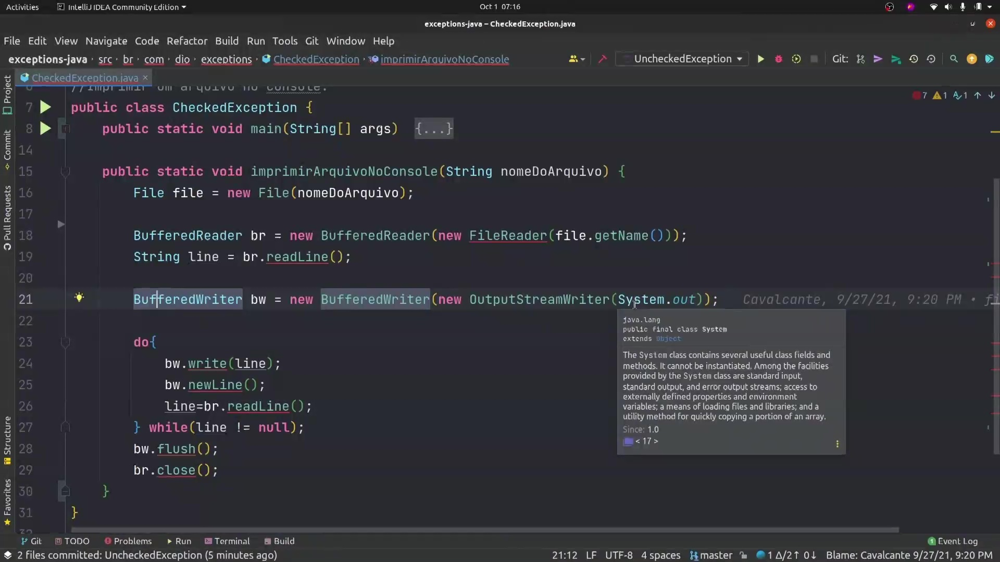
</p>

Ao descomentar o código, a IDE (IntelliJ) imediatamente sinaliza diversos erros de compilação, representados pelas linhas onduladas vermelhas. Isso acontece porque os métodos utilizados para manipulação de arquivos lançam exceções verificadas que o desenvolvedor é obrigado a tratar ou declarar antes mesmo de tentar rodar o programa. O compilador "avisa" que o código não é seguro para execução sem o devido gerenciamento dessas possíveis falhas.

<p align="center">
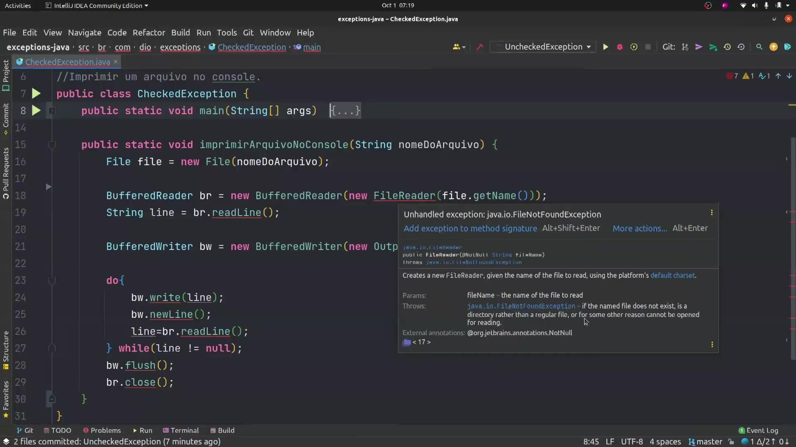
</p>

Para realizar a leitura, é definido o nome do arquivo "Romances de Blake Crouch.txt" e iniciado um objeto do tipo `File`. A implementação utiliza o padrão *Decorator* com a classe `BufferedReader` para criar um buffer que armazenará o conteúdo do documento, facilitando a leitura linha por linha para a posterior impressão no console.

```java
public static void imprimirArquivoNoConsole(String nomeDoArquivo) {
    File file = new File(nomeDoArquivo);

    BufferedReader br = new BufferedReader(new FileReader(file.getName()));
    String line = br.readLine();
}

```

<p align="center">
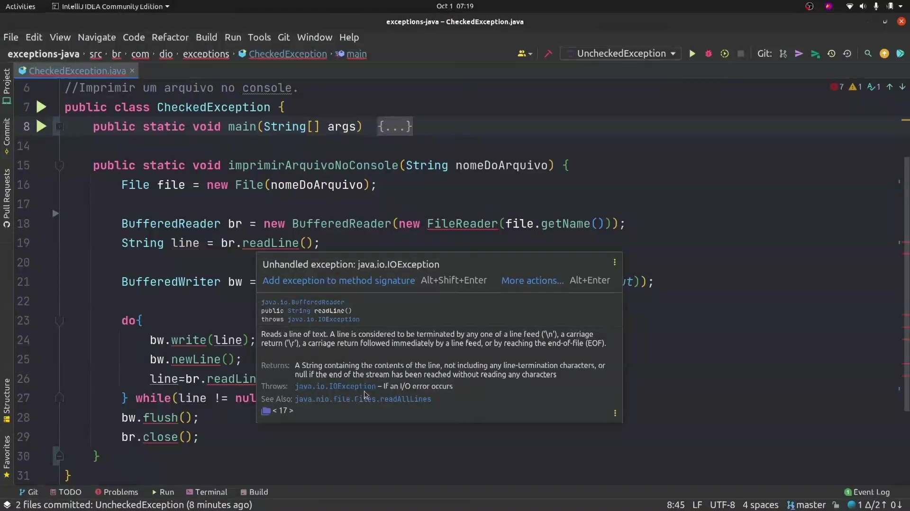
</p>

O processo de impressão utiliza um laço `do-while` para ler cada linha contida no buffer através do método `readLine()`. Enquanto a linha lida não for nula (indicando que ainda há conteúdo), ela é escrita no console. Ao final do processo, o método `flush()` é chamado para garantir o descarregamento total dos dados do buffer e, em seguida, o fluxo de leitura é encerrado com `close()`.

```java
    BufferedWriter bw = new BufferedWriter(new OutputStreamWriter(System.out));

    do {
        bw.write(line);
        bw.newLine();
        line = br.readLine();
    } while (line != null);
    bw.flush();
    br.close();

```

<p align="center">
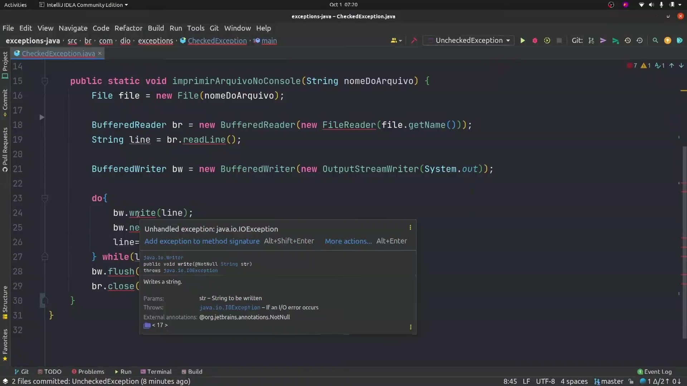
</p>

No método `main`, além da chamada para a execução do método de impressão, existe uma instrução final que deve ser impressa independentemente do sucesso da operação. Contudo, devido às exceções verificadas não tratadas nos métodos internos, o compilador impede a execução, pois não há garantia de que o fluxo chegará a esse ponto sem interrupções críticas.

<p align="center">
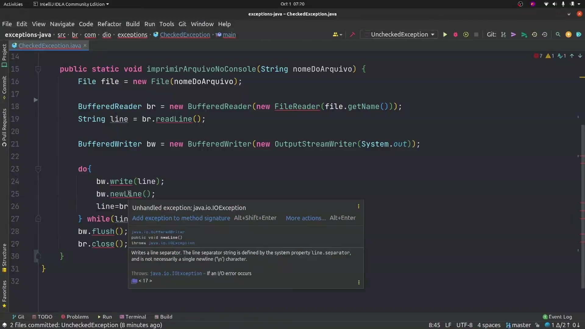
</p>

O motivo técnico da sinalização de erro reside na assinatura da classe `FileReader`. Como mostrado na análise visual, a IDE destaca que o construtor desta classe lança uma exceção específica quando o arquivo indicado não é localizado, exigindo uma ação preventiva do programador.

<p align="center">
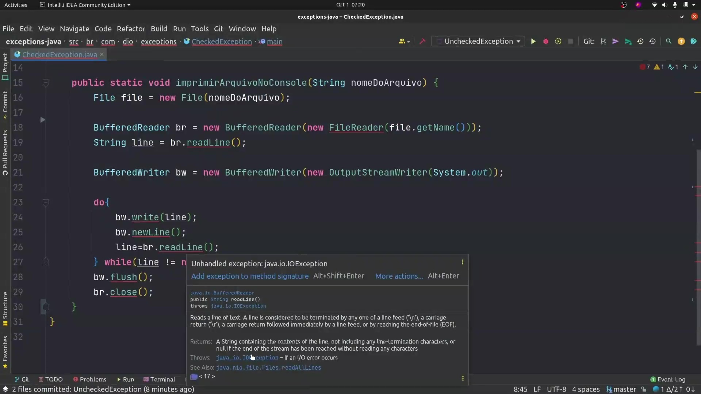
</p>

Ao detalhar a exceção lançada pelo `FileReader`, identifica-se a `FileNotFoundException`. Esta é uma exceção verificada clássica: o sistema operacional pode não encontrar o arquivo (por erro de digitação no nome ou diretório inexistente), e o Java obriga que essa possibilidade seja tratada no código.

<p align="center">
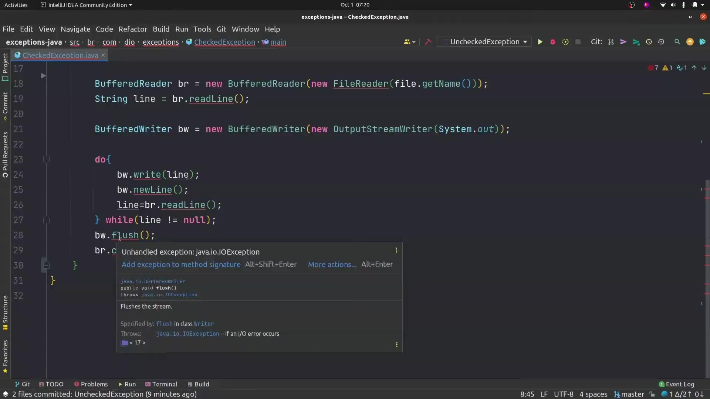
</p>

Além do `FileReader`, outros métodos na mesma rotina também apresentam riscos. O método `readLine()`, responsável por ler o conteúdo do buffer, lança uma `IOException`. Como esta exceção é mais genérica (abrange erros de entrada e saída em geral), ela também é considerada uma *Checked Exception* que impede a compilação.

<p align="center">
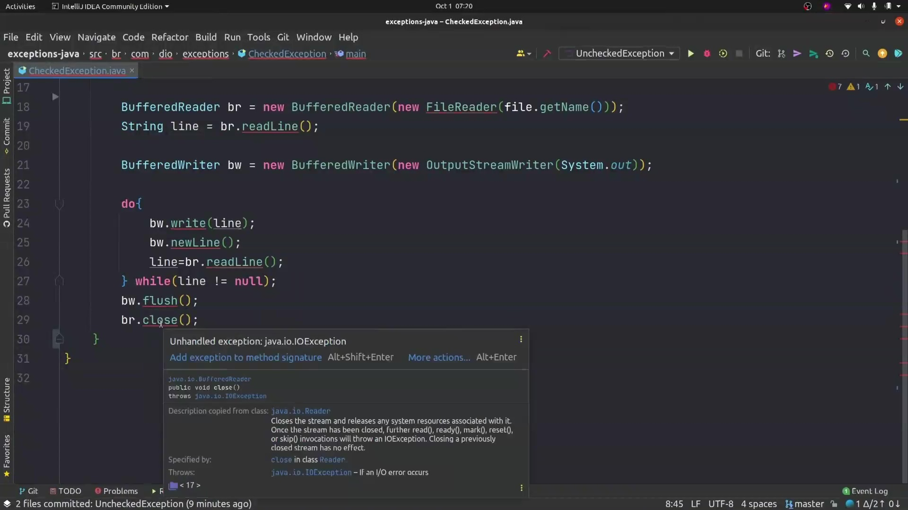
</p>

A operação de escrita no console através do método `write(String s)` também é um ponto de falha potencial. Assim como a leitura, a escrita lança uma `IOException`, reforçando que toda a cadeia de entrada e saída de dados precisa de uma estratégia de tratamento de erros definida.

<p align="center">

</p>

Se tentarmos forçar a execução do programa sem resolver essas pendências, o compilador falha. O painel de saída demonstra que o Java não permite a execução enquanto existirem exceções verificadas não capturadas ou não declaradas na assinatura dos métodos.

<p align="center">
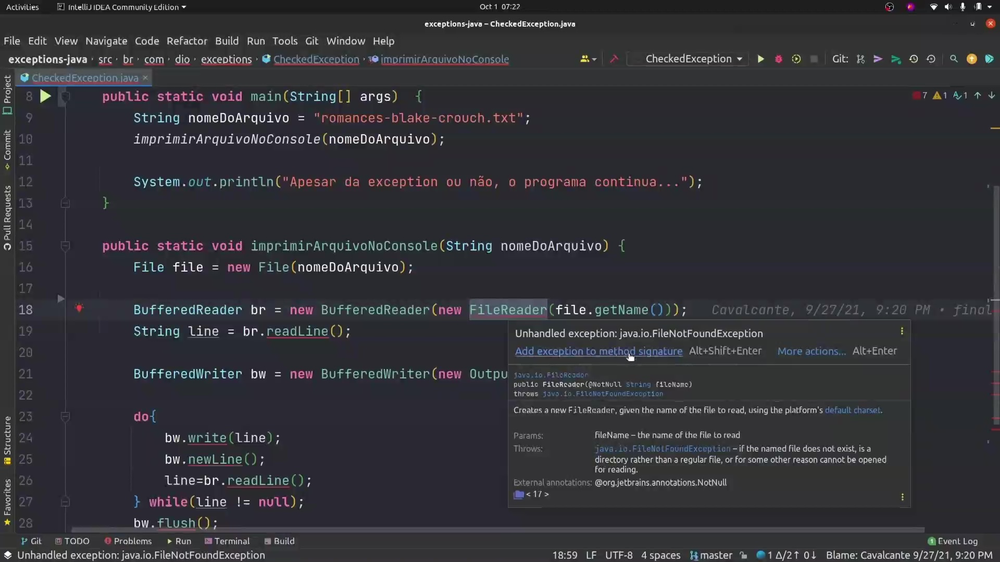
</p>

Uma das formas de resolver o erro de compilação é "relançar" a exceção para quem chamou o método. A IDE oferece a opção "Add exception to method signature", que insere a cláusula `throws` na assinatura do método, delegando a responsabilidade do tratamento para o nível superior da pilha de execução.

<p align="center">

</p>

Ao aplicar a sugestão da IDE, a assinatura do método passa a ser: `public static void imprimirArquivoNoConsole(String nomeDoArquivo) throws FileNotFoundException`. Isso resolve o erro especificamente para o `FileReader`, informando ao compilador que este método pode lançar essa exceção específica.

<p align="center">
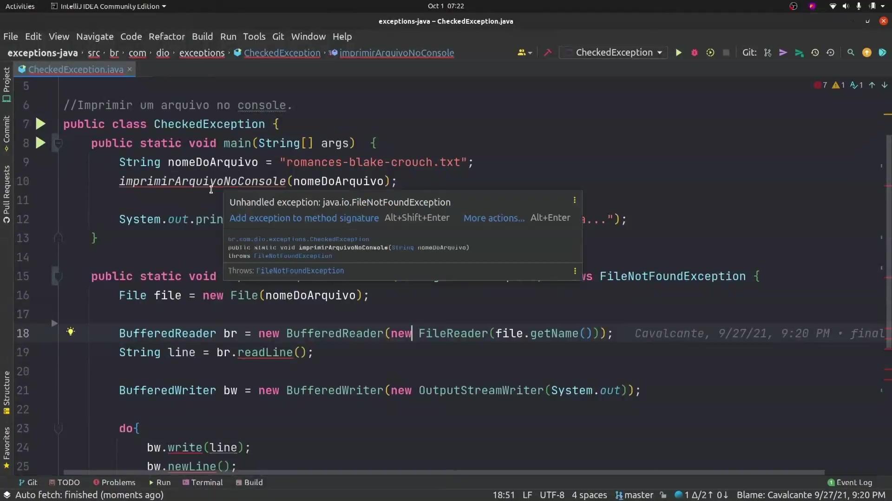
</p>

Entretanto, ao adicionar o `throws` no método `imprimirArquivoNoConsole`, o erro se desloca para o método `main`. Como o `main` é o chamador, ele agora recebe a "bomba" da exceção e também precisa decidir se a trata com um bloco `try-catch` ou se a relança novamente.

<p align="center">
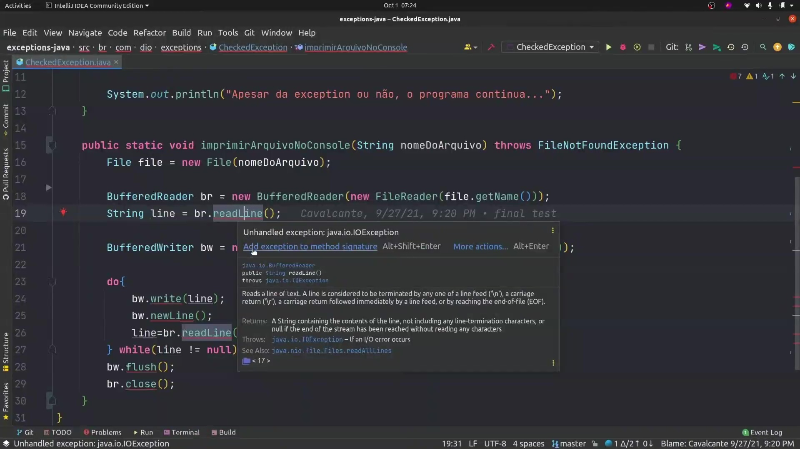
</p>

Como existem várias exceções do tipo `IOException` (para leitura, escrita, nova linha e fechamento de arquivo), é mais eficiente utilizar a classe pai `IOException` na assinatura do método. Isso abrange tanto a `FileNotFoundException` (que é uma subclasse) quanto os demais erros de fluxo de dados em uma única declaração genérica.

<p align="center">
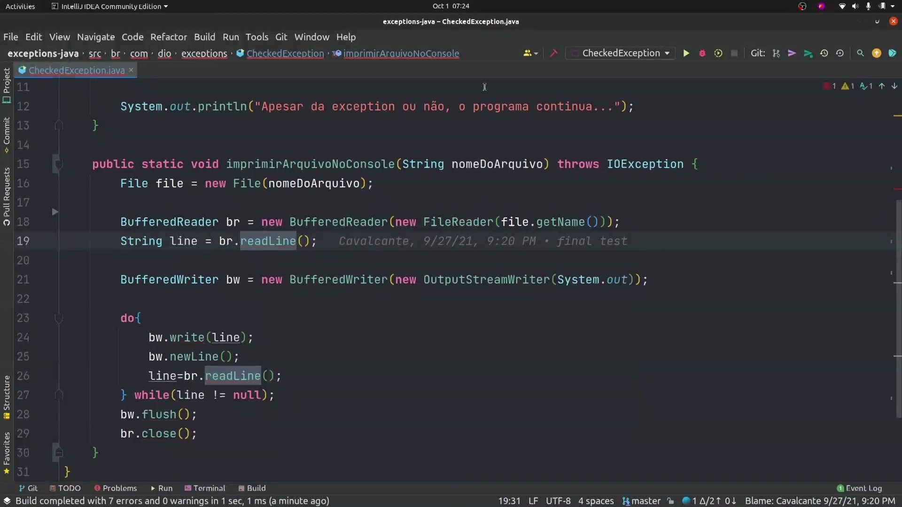
</p>

A assinatura do método agora está consolidada com `throws IOException`. Visualmente, percebe-se que todas as linhas vermelhas de erro dentro do método desapareceram, pois o compilador agora entende que o programador está ciente dos riscos e optou por propagar a exceção.

<p align="center">
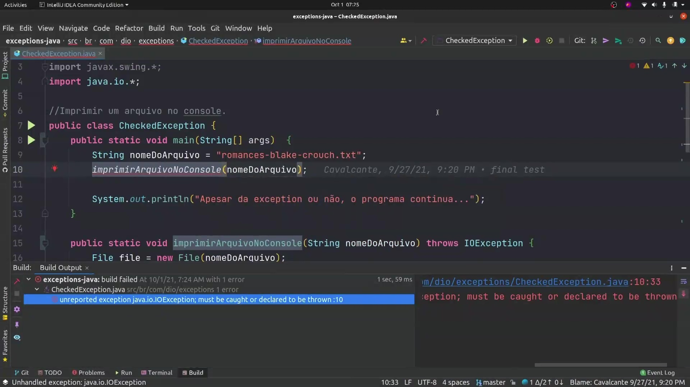
</p>

Para que o programa finalmente compile e rode, o método `main` também recebe a declaração `throws IOException`. Como o `main` é o último método na pilha de execução antes da própria JVM (Java Virtual Machine), relançar a exceção aqui significa que, se houver um erro, a execução será interrompida e o rastro da pilha (*stack trace*) será exibido.

```java
public static void main(String[] args) throws IOException {
    String nomeDoArquivo = "romances-blake-crouch.txt";
    imprimirArquivoNoConsole(nomeDoArquivo);

    System.out.println("Apesar da exception ou não, o programa continua...");
}

```

<p align="center">
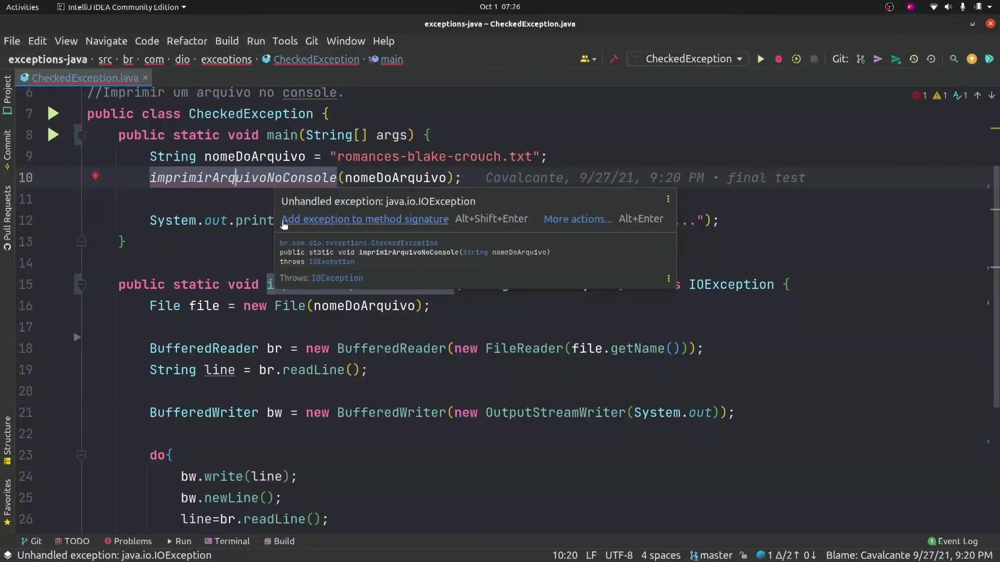
</p>

Com o nome do arquivo correto e as exceções devidamente declaradas, o programa executa com sucesso. O console exibe a lista de romances contidos no arquivo, demonstrando que o fluxo de leitura e escrita funcionou conforme o esperado em uma situação ideal.

<p align="center">
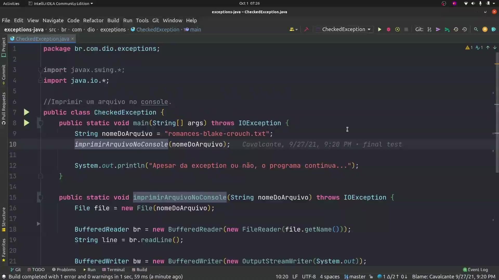
</p>

Para testar o comportamento em caso de erro, o nome do arquivo é alterado propositalmente para "romanes-blake-crouch.txt" (um arquivo inexistente). Como apenas declaramos as exceções com `throws` e não as tratamos com `try-catch`, o comportamento esperado é que o programa interrompa sua execução assim que encontrar a falha.

```java
public static void main(String[] args) throws IOException {
    String nomeDoArquivo = "romanes-blake-crouch.txt";
    imprimirArquivoNoConsole(nomeDoArquivo);

    System.out.println("Apesar da exception ou não, o programa continua...");
}

```

<p align="center">
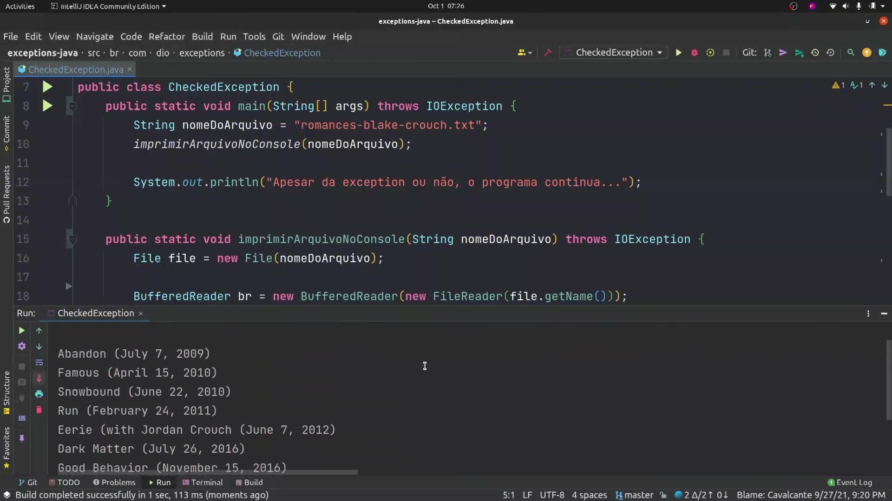
</p>

O resultado da execução com o nome errado é uma `FileNotFoundException`. O console exibe o rastro do erro, apontando exatamente para a linha 18, onde o `FileReader` tentou abrir o arquivo e falhou. Isso confirma que o `throws` apenas repassa o problema adiante até que alguém o trate ou o programa "estoure".

<p align="center">
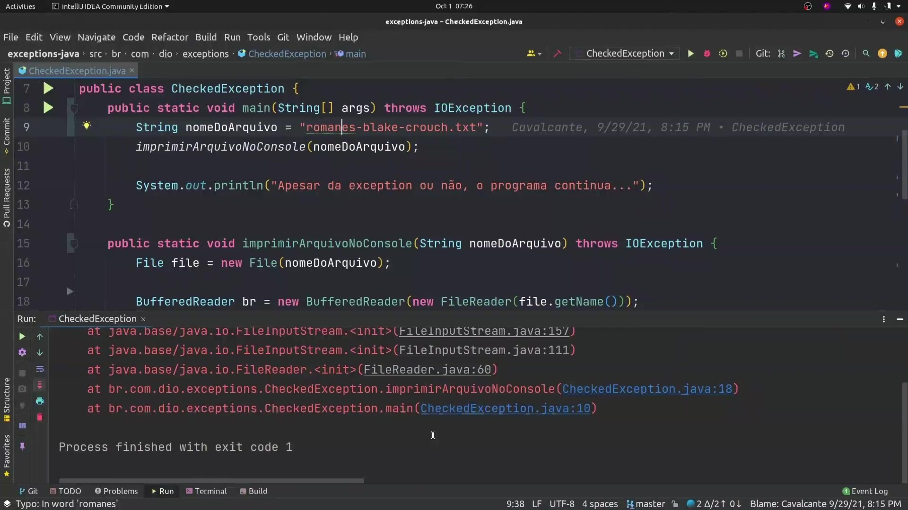
</p>

É importante notar que, como a exceção foi lançada e não tratada, a última linha de código ("Apesar da exception ou não, o programa continua...") nunca chegou a ser executada. O programa encerrou prematuramente devido à exceção verificada. Isso serve de gancho para o aprendizado do tratamento real com blocos `try-catch`.      


### 🟩 Vídeo 05 - Checked exception parte 2

<video width="60%" controls>
  <source src="000-Midia_e_Anexos/bootcamp_tqi_fullstack-modulo.06-curso.09-video_05.webm" type="video/webm">
    Seu navegador não suporta vídeo HTML5.
</video>

link do vídeo: https://web.dio.me/track/tqi-fullstack-developer/course/tratamento-de-excecoes-em-java/learning/40daa1d6-add6-408e-917b-b09c03aa06c9?autoplay=1

## Parte 4 - Exception Personalizada

### 🟩 Vídeo 07 - Exception Personalizada 1

<video width="60%" controls>
  <source src="000-Midia_e_Anexos/bootcamp_tqi_fullstack-modulo.06-curso.09-video_07.webm" type="video/webm">
    Seu navegador não suporta vídeo HTML5.
</video>

link do vídeo:

### 🟩 Vídeo 08 - Exception Personalizada 2

<video width="60%" controls>
  <source src="000-Midia_e_Anexos/bootcamp_tqi_fullstack-modulo.06-curso.09-video_08.webm" type="video/webm">
    Seu navegador não suporta vídeo HTML5.
</video>

link do vídeo:

## Parte 5 - Encerramento do Curso

### 🟩 Vídeo 09 - Final

<video width="60%" controls>
  <source src="000-Midia_e_Anexos/bootcamp_tqi_fullstack-modulo.06-curso.09-video_09.webm" type="video/webm">
    Seu navegador não suporta vídeo HTML5.
</video>

link do vídeo:


# Certificado: Tratamento de Exceções em Java

- Link na plataforma: 
- Certificado em pdf: