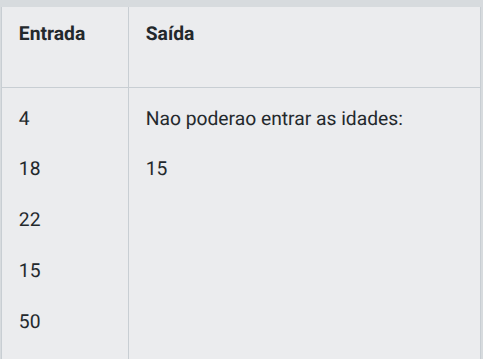
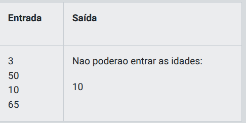
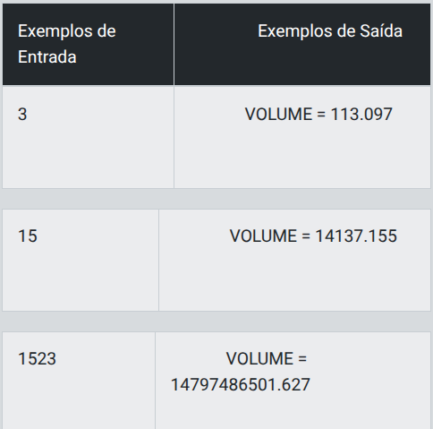
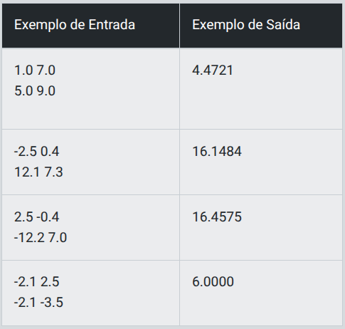
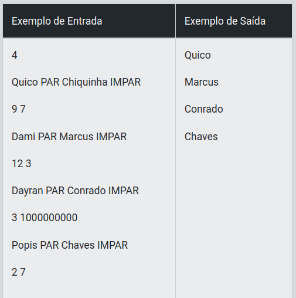

# Desafio 1 - Proibido a entrada de menores!

## Descrição

O objetivo deste desafio é resolvê-lo utilizando o seu conhecimento sobre Arrays, uma estrutura de dados que armazena uma coleção de dados em um bloco de memória.

Você está desenvolvendo um sistema para um local de eventos, neste local, é necessário que a entrada seja permitida apenas para pessoas acima de 18 anos. Faça um programa para ler um número N, a idade de N pessoas. Depois disso, coloque a idade mínima permitida  para se entrar no local, conforme exemplo.

Retorne às idades de quem não puder entrar.

## Entrada

A entrada será composta na primeira linha pelo tamanho da array e nas linhas subsequentes pelas idades que preenchem essa array

## Saída

A saída deverá retornar as idades que não são permitidas a entrada, conforme exemplo abaixo.

<p align="center">
  
</p>

<p align="center">
  
</p>

## Solução

```java
// Abaixo segue um exemplo de código que você pode ou não utilizar
import java.util.*;
 
    public class DIO{
	// TODO: complete os espaços em branco com sua solução para o problema
         public static void main(String[] args) {
           
	    //a classe Scanner auxilia na leitura dos dados de entrada
            Scanner scan = new Scanner(System.in);
             int N= scan.nextInt();
	    
	    //quebra string em várias substrings a partir de um caractere
            double[] idade = new double[N];
 
            for (int i = 0; i < N; i++)
            {
                idade[i] = scan.nextDouble();
            }
 
            System.out.println("Nao poderao entrar as idades: ");
            for (int i = 0; i < N; i++)
            {
                if (idade[i] < 18)
                {
                    System.out.println((int)idade[i]);
                }
            }
        }
    }
```

---

# Desafio 2 - Esfera

## Descrição

Faça um programa que calcule e mostre o volume de uma esfera sendo fornecido o valor de seu raio (R). A fórmula para calcular o volume é: (4/3) * pi * R3. Considere (atribua) para pi o valor 3.14159.

Dica: Ao utilizar a fórmula, procure usar (4/3.0) ou (4.0/3), pois algumas linguagens (dentre elas o C++), assumem que o resultado da divisão entre dois inteiros é outro inteiro.

## Entrada 

O arquivo de entrada contém um valor de ponto flutuante (dupla precisão), correspondente ao raio da esfera.

## Saída

A saída deverá ser uma mensagem "VOLUME" conforme o exemplo fornecido abaixo, com um espaço antes e um espaço depois da igualdade. O valor deverá ser apresentado com 3 casas após o ponto.

<p align="center">
  
</p>

## Solução

```java
// Abaixo segue um exemplo de código que você pode ou não utilizar
import java.util.Scanner;
public class Main {
    public static void main(String[] args) {
  		Scanner sc = new Scanner(System.in);
 //TODO: Complete os espaços em branco com uma possível solução para o desafio 
  		double pi = 3.14159;
  		double R = sc.nextDouble();
  		double volume = (4.0/3.0) * pi * (Math.pow(R, 3.0));
  		System.out.printf("VOLUME = %.3f%n", volume);
    }
	
}
```

---

# Desafio 3 - 

## Descrição

Leia os quatro valores correspondentes aos eixos x e y de dois pontos quaisquer no plano, p1(x1,y1) e p2(x2,y2) e calcule a distância entre eles, mostrando 4 casas decimais após a vírgula, conforme a fórmula:

Distancia = raiz((x2-x1)^2 + (y2-y1)^2)

## Entrada 

O arquivo de entrada contém duas linhas de dados. A primeira linha contém dois valores de ponto flutuante: x1 y1 e a segunda linha contém dois valores de ponto flutuante x2 y2.

## Saída

Calcule e imprima o valor da distância segundo a fórmula fornecida, com 4 casas após o ponto decimal.

<p align="center">
  
</p>

## Solução 

```java
// implemente sua solução aqui
// Desafio 3 - Distância entre dois pontos
import java.util.Scanner;

public class Main {
    public static void main(String[] args) {
        Scanner sc = new Scanner(System.in);
        
        // Lê as coordenadas do primeiro ponto (x1, y1)
        double x1 = sc.nextDouble();
        double y1 = sc.nextDouble();
        
        // Lê as coordenadas do segundo ponto (x2, y2)
        double x2 = sc.nextDouble();
        double y2 = sc.nextDouble();
        
        // Calcula a distância usando a fórmula:
        // Distancia = √((x2-x1)² + (y2-y1)²)
        double distancia = Math.sqrt(Math.pow(x2 - x1, 2) + Math.pow(y2 - y1, 2));
        
        // Exibe o resultado com 4 casas decimais
        System.out.printf("%.4f%n", distancia);
        
        sc.close();
    }
}
```

---

# Desafio 4 - De quem é a vez?

## Descrição

O jogo PAR ou ÍMPAR vem decidindo o destino de pessoas ao longo de décadas. As regras são simples: dois jogadores informam um número e se a soma desses números for par o jogador que escolheu PAR ganha e vice-versa. Em um jogo que as crianças do bairro estão jogando, eles não conseguem decidir quem será o próximo a escolher as regras da brincadeira. Para solucionar esse problema, você foi chamado.

Basicamente a brincadeira só poderá ser jogada de dois em dois jogadores e para escolher o próximo jogador uma das  crianças pediu sua ajuda para desenvolver um programa que, dado o nome dos jogadores, suas respectivas escolhas PAR ou IMPAR e os números, informe quem foi o vencedor

## Entrada 

A primeira linha de entrada contém um número inteiro QT (1 ≤ QT ≤ 100), indicando a quantidade de casos de teste que vem a seguir. Cada caso de teste contém duas linhas. Na primeira linha será informado o nome do jogador 1 seguido de sua escolha, “PAR” ou “IMPAR” e logo após, o nome do jogador 2 seguido de sua escolha, “PAR” ou “IMPAR”. Na segunda linha de entrada, contém 2 números inteiros N (1 ≤ N ≤ 10⁹) e M (1 ≤ M ≤ 10⁹), representando respectivamente os números escolhidos pelo jogador 1 e pelo jogador 2. É garantido que a escolha (PAR ou IMPAR) do jogador 1 será diferente da escolha (PAR ou IMPAR) do jogador 2 e que o nome dos jogares são formados somente por letras e não ultrapassarão 100 caracteres.

## Saída

Para cada caso de teste, imprima uma única linha contendo o nome do jogador vencedor.

<p align="center">
  
</p>

## Solução

```java

```


