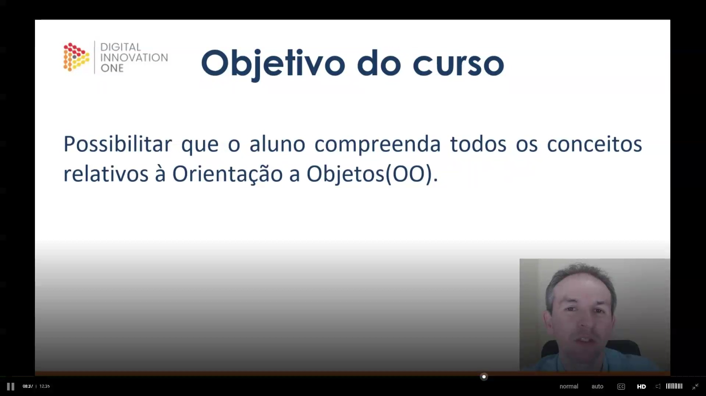
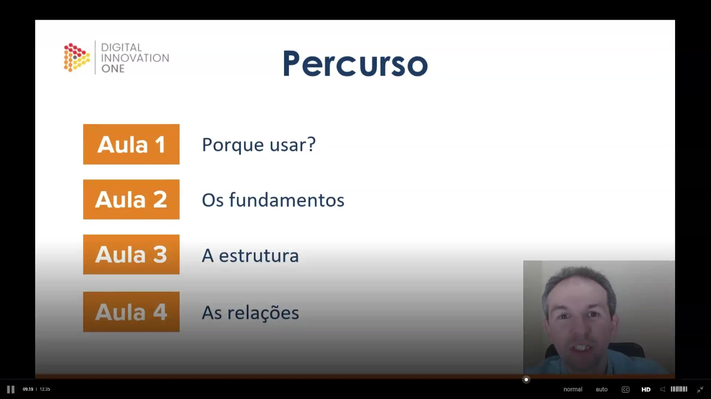
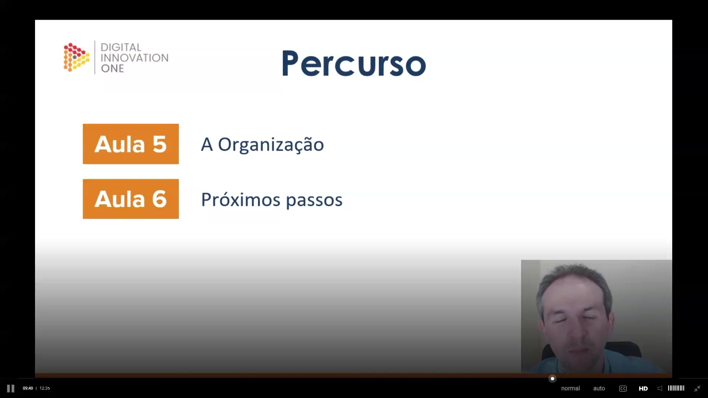
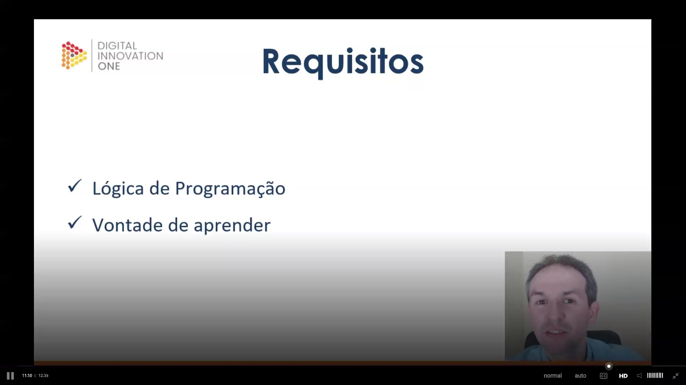

## Instrutor

- Thiago Leite e Carvalho (Senior Java Developer and Software Engineer | Java Tech Lead | University Professor | Writer | Speaker | Instructor)
- Contato Linkedin: / [thiago-leite-e-carvalho-1b337b127](https://www.linkedin.com/in/thiago-leite-e-carvalho-1b337b127/)

## Parte 1 - Introdução

### 🟩 Vídeo 01 - Apresentação inicial

<video width="60%" controls>
  <source src="000-Midia_e_Anexos/bootcamp_tqi_fullstack-modulo.06-curso.11-video_01.webm" type="video/webm">
    Seu navegador não suporta vídeo HTML5.
</video>

link do vídeo: https://web.dio.me/track/tqi-fullstack-developer/course/programacao-orientada-a-objetos/learning/ff0c41a5-8adc-496c-8ff7-7ae1f83ffa49?autoplay=1

Este curso é uma introdução abrangente aos conceitos fundamentais da Orientação a Objetos (OO), ministrado por Thiago Leite, um desenvolvedor com vasta experiência no mercado e na academia. O conteúdo é baseado em anos de ensino universitário e na prática de desenvolvimento de sistemas governamentais de alta complexidade.

### Anotações

#### Introdução à Orientação a Objetos

Este curso é focado nos fundamentos da **Orientação a Objetos (OO)**. O treinamento é ministrado por **Thiago Leite e Carvalho**, que atua como Engenheiro de Software, professor e escritor. Ele traz sua experiência acadêmica e profissional para guiar o aprendizado sobre como modelar sistemas utilizando esse paradigma.

---

#### Sobre o Instrutor

Thiago Leite possui uma trajetória de 18 anos no desenvolvimento de software, com especialidade em **Java** e sistemas **backend**.

* **Experiência Acadêmica:** É mestre em Engenharia de Software e já lecionou diversas disciplinas universitárias, incluindo Orientação a Objetos e Estrutura de Dados.
* **Atuação Profissional:** Atualmente trabalha no **SERPRO**, desenvolvendo soluções tecnológicas para o governo federal brasileiro.
* **Motivação e Hobbies:** É motivado por novos desafios e projetos dinâmicos. Fora do trabalho, dedica-se à culinária (massas e pizzas), aprecia cervejas artesanais e torce pelo Flamengo.

---

#### Canais de Contato e Portfólio

Para acompanhar o trabalho do instrutor e acessar materiais complementares, estão disponíveis os seguintes links:

* **LinkedIn:** Perfil para conexões profissionais, onde compartilha artigos e conteúdos sobre a rotina de desenvolvimento.
* **GitHub Pessoal:** Espaço onde disponibiliza componentes e códigos referentes aos seus artigos publicados.
* **GitHub DIO (tlcdio):** Repositório exclusivo para os exemplos práticos desenvolvidos especificamente para os cursos da Digital Innovation One.

---

#### Objetivo do Curso

O curso visa possibilitar que o aluno compreenda todos os conceitos relativos à **Orientação a Objetos (OO)**. O conteúdo foi estruturado com base no livro publicado pelo instrutor e em seus nove anos de experiência lecionando essa disciplina, focando em resolver as principais dúvidas de alunos iniciantes e profissionais.

---

#### Percurso do Aprendizado (Parte 1)

O cronograma inicial do curso abrange os seguintes tópicos fundamentais:

* **Aula 1 - Porque usar?:** Explicação sobre a importância e os benefícios do paradigma.
* **Aula 2 - Os fundamentos:** Apresentação dos pilares que sustentam a OO.
* **Aula 3 - A estrutura:** Detalhamento dos componentes estruturais básicos.
* **Aula 4 - As relações:** Como os objetos e conceitos interagem entre si.

---

#### Percurso do Aprendizado (Parte 2)

A finalização do conteúdo teórico e prático inclui:

* **Aula 5 - A Organização:** Melhores práticas para organizar o código orientado a objetos.
* **Aula 6 - Próximos passos:** Orientações sobre como continuar os estudos em tópicos avançados após concluir esta base essencial.

---

#### Requisitos Necessários

Para um bom desempenho durante as aulas, o aluno deve atender aos seguintes pontos:

* **Lógica de Programação:** É fundamental ter uma base prévia de lógica, adquirida em cursos anteriores ou livros.
* **Vontade de aprender:** O paradigma OO exige dedicação e prática constante para a fixação dos conceitos.
* **Ambiente Técnico:** Embora o foco seja conceitual, o instrutor utilizará **Java 11** e a IDE **IntelliJ** para demonstrações, sendo útil ter familiaridade básica com alguma linguagem orientada a objetos.

### 🟩 Vídeo 02 - Objetivos do curso

<video width="60%" controls>
  <source src="000-Midia_e_Anexos/bootcamp_tqi_fullstack-modulo.06-curso.11-video_02.webm" type="video/webm">
    Seu navegador não suporta vídeo HTML5.
</video>

link do vídeo: https://web.dio.me/track/tqi-fullstack-developer/course/programacao-orientada-a-objetos/learning/0790beac-ac26-4331-bd7f-a523ee37b6b1?autoplay=1

Este documento resume os objetivos, a estrutura e os requisitos do curso de POO, baseado na experiência de 9 anos de docência do instrutor e em sua obra publicada pela editora Casa do Código.

### Anotações

#### Introdução ao Curso de Orientação a Objetos

O curso tem como objetivo principal capacitar o aluno a compreender todos os conceitos fundamentais da **Orientação a Objetos (OO)**. O conteúdo é fundamentado no livro do instrutor publicado pela editora Casa do Código, que condensa nove anos de experiência no ensino dessa disciplina. O material busca sanar as dúvidas mais comuns de iniciantes e profissionais, oferecendo uma base sólida para quem deseja dominar este paradigma de programação.

#### Percurso do Aprendizado (Parte 1)

A estrutura do curso foi organizada para cobrir os pontos essenciais da Orientação a Objetos de forma didática. O percurso inicial está dividido em quatro aulas fundamentais:

* **Aula 1:** Justificativa sobre a importância e o porquê de utilizar a OO.
* **Aula 2:** Apresentação dos fundamentos e pilares que sustentam o paradigma.
* **Aula 3:** Exploração das estruturas básicas necessárias para o desenvolvimento.
* **Aula 4:** Estudo das relações existentes entre os conceitos de Orientação a Objetos.

#### Percurso do Aprendizado (Parte 2)

Dando continuidade ao cronograma, o curso aborda a organização e o encerramento do conteúdo básico:

* **Aula 5:** Foco na organização e em conceitos organizacionais que otimizam o trabalho com objetos.
* **Aula 6:** Orientações sobre os próximos passos, indicando caminhos e tópicos avançados para quem deseja aprofundar o conhecimento além dos conceitos básicos apresentados.

#### Requisitos e Ferramentas

Para um bom aproveitamento das aulas, são necessários dois requisitos principais:

1. **Lógica de Programação:** É fundamental que o aluno já possua uma base prévia em lógica, obtida através de cursos anteriores ou estudos autodidatas.
2. **Vontade de aprender:** A dedicação é essencial para absorver a teoria e praticar os conceitos.

Embora não seja obrigatório, recomenda-se familiaridade com linguagens como Java, C# ou Python. Durante o curso, os exemplos práticos serão demonstrados utilizando **Java 11** e a IDE **IntelliJ**.

## Parte 2 - Por que usar?

### 🟩 Vídeo 03 - Por que usar?

<video width="60%" controls>
  <source src="000-Midia_e_Anexos/bootcamp_tqi_fullstack-modulo.06-curso.11-video_03.webm" type="video/webm">
    Seu navegador não suporta vídeo HTML5.
</video>

link do vídeo:

## Parte 3 - Fundamentos

### 🟩 Vídeo 04 - Fundamentos

<video width="60%" controls>
  <source src="000-Midia_e_Anexos/bootcamp_tqi_fullstack-modulo.06-curso.11-video_04.webm" type="video/webm">
    Seu navegador não suporta vídeo HTML5.
</video>

link do vídeo:

### 🟩 Vídeo 05 - Exercício

<video width="60%" controls>
  <source src="000-Midia_e_Anexos/bootcamp_tqi_fullstack-modulo.06-curso.11-video_05.webm" type="video/webm">
    Seu navegador não suporta vídeo HTML5.
</video>

link do vídeo:

## Parte 4 - Estrutura básica da OO

### 🟩 Vídeo 06 - Classe - Conceitos

<video width="60%" controls>
  <source src="000-Midia_e_Anexos/bootcamp_tqi_fullstack-modulo.06-curso.11-video_06.webm" type="video/webm">
    Seu navegador não suporta vídeo HTML5.
</video>

link do vídeo:

### 🟩 Vídeo 07 - Classe - Exercício

<video width="60%" controls>
  <source src="000-Midia_e_Anexos/bootcamp_tqi_fullstack-modulo.06-curso.11-video_07.webm" type="video/webm">
    Seu navegador não suporta vídeo HTML5.
</video>

link do vídeo:

### 🟩 Vídeo 08 - Atributo - Conceitos

<video width="60%" controls>
  <source src="000-Midia_e_Anexos/bootcamp_tqi_fullstack-modulo.06-curso.11-video_08.webm" type="video/webm">
    Seu navegador não suporta vídeo HTML5.
</video>

link do vídeo:

### 🟩 Vídeo 09 - Atributo - Exercício

<video width="60%" controls>
  <source src="000-Midia_e_Anexos/bootcamp_tqi_fullstack-modulo.06-curso.11-video_09.webm" type="video/webm">
    Seu navegador não suporta vídeo HTML5.
</video>

link do vídeo:

### 🟩 Vídeo 10 - Método - Conceito

<video width="60%" controls>
  <source src="000-Midia_e_Anexos/bootcamp_tqi_fullstack-modulo.06-curso.11-video_10.webm" type="video/webm">
    Seu navegador não suporta vídeo HTML5.
</video>

link do vídeo:

### 🟩 Vídeo 11 - Método - Exercício

<video width="60%" controls>
  <source src="000-Midia_e_Anexos/bootcamp_tqi_fullstack-modulo.06-curso.11-video_11.webm" type="video/webm">
    Seu navegador não suporta vídeo HTML5.
</video>

link do vídeo:

### 🟩 Vídeo 12 - Objeto e Mensagem - Conceito

<video width="60%" controls>
  <source src="000-Midia_e_Anexos/bootcamp_tqi_fullstack-modulo.06-curso.11-video_12.webm" type="video/webm">
    Seu navegador não suporta vídeo HTML5.
</video>

link do vídeo:

### 🟩 Vídeo 13 - Objeto e Mensagem - Exercício

<video width="60%" controls>
  <source src="000-Midia_e_Anexos/bootcamp_tqi_fullstack-modulo.06-curso.11-video_13.webm" type="video/webm">
    Seu navegador não suporta vídeo HTML5.
</video>

link do vídeo:

## Parte 5 - As relações: Herança, Associação e Interface

### 🟩 Vídeo 14 - Herança - Conceito

<video width="60%" controls>
  <source src="000-Midia_e_Anexos/bootcamp_tqi_fullstack-modulo.06-curso.11-video_14.webm" type="video/webm">
    Seu navegador não suporta vídeo HTML5.
</video>

link do vídeo:

### 🟩 Vídeo 15 - Herança - Exercício 1

<video width="60%" controls>
  <source src="000-Midia_e_Anexos/bootcamp_tqi_fullstack-modulo.06-curso.11-video_15.webm" type="video/webm">
    Seu navegador não suporta vídeo HTML5.
</video>

link do vídeo:

### 🟩 Vídeo 16 - Herança - Tipos

<video width="60%" controls>
  <source src="000-Midia_e_Anexos/bootcamp_tqi_fullstack-modulo.06-curso.11-video_16.webm" type="video/webm">
    Seu navegador não suporta vídeo HTML5.
</video>

link do vídeo:

### 🟩 Vídeo 17 - Herança - Upcast e Downcast

<video width="60%" controls>
  <source src="000-Midia_e_Anexos/bootcamp_tqi_fullstack-modulo.06-curso.11-video_17.webm" type="video/webm">
    Seu navegador não suporta vídeo HTML5.
</video>

link do vídeo:

### 🟩 Vídeo 18 - Herança - Polimorfismo e Sobrescrita

<video width="60%" controls>
  <source src="000-Midia_e_Anexos/bootcamp_tqi_fullstack-modulo.06-curso.11-video_18.webm" type="video/webm">
    Seu navegador não suporta vídeo HTML5.
</video>

link do vídeo:

### 🟩 Vídeo 19 - Herança - Proposta de Exercício 2

<video width="60%" controls>
  <source src="000-Midia_e_Anexos/bootcamp_tqi_fullstack-modulo.06-curso.11-video_19.webm" type="video/webm">
    Seu navegador não suporta vídeo HTML5.
</video>

link do vídeo:

### 🟩 Vídeo 20 - Herança - Resolução do exercício 2 - Parte 1

<video width="60%" controls>
  <source src="000-Midia_e_Anexos/bootcamp_tqi_fullstack-modulo.06-curso.11-video_20.webm" type="video/webm">
    Seu navegador não suporta vídeo HTML5.
</video>

link do vídeo:

### 🟩 Vídeo 21 - Herança - Resolução do exercício 2 - Parte 2

<video width="60%" controls>
  <source src="000-Midia_e_Anexos/bootcamp_tqi_fullstack-modulo.06-curso.11-video_21.webm" type="video/webm">
    Seu navegador não suporta vídeo HTML5.
</video>

link do vídeo:

### 🟩 Vídeo 22 - Associação - Conceito

<video width="60%" controls>
  <source src="000-Midia_e_Anexos/bootcamp_tqi_fullstack-modulo.06-curso.11-video_22.webm" type="video/webm">
    Seu navegador não suporta vídeo HTML5.
</video>

link do vídeo:

### 🟩 Vídeo 23 - Associação - Tipos

<video width="60%" controls>
  <source src="000-Midia_e_Anexos/bootcamp_tqi_fullstack-modulo.06-curso.11-video_23.webm" type="video/webm">
    Seu navegador não suporta vídeo HTML5.
</video>

link do vídeo:

### 🟩 Vídeo 24 - Associação - Exercício

<video width="60%" controls>
  <source src="000-Midia_e_Anexos/bootcamp_tqi_fullstack-modulo.06-curso.11-video_24.webm" type="video/webm">
    Seu navegador não suporta vídeo HTML5.
</video>

link do vídeo:

### 🟩 Vídeo 25 - Interface - Conceito

<video width="60%" controls>
  <source src="000-Midia_e_Anexos/bootcamp_tqi_fullstack-modulo.06-curso.11-video_25.webm" type="video/webm">
    Seu navegador não suporta vídeo HTML5.
</video>

link do vídeo:

### 🟩 Vídeo 26 - Interface - Exercício

<video width="60%" controls>
  <source src="000-Midia_e_Anexos/bootcamp_tqi_fullstack-modulo.06-curso.11-video_26.webm" type="video/webm">
    Seu navegador não suporta vídeo HTML5.
</video>

link do vídeo:

## Parte 6 - A Organização de Pacotes e Visibilidades

### 🟩 Vídeo 27 - Pacotes - Conceitos

<video width="60%" controls>
  <source src="000-Midia_e_Anexos/bootcamp_tqi_fullstack-modulo.06-curso.11-video_27.webm" type="video/webm">
    Seu navegador não suporta vídeo HTML5.
</video>

link do vídeo:

### 🟩 Vídeo 28 - Pacotes - Exercício

<video width="60%" controls>
  <source src="000-Midia_e_Anexos/bootcamp_tqi_fullstack-modulo.06-curso.11-video_28.webm" type="video/webm">
    Seu navegador não suporta vídeo HTML5.
</video>

link do vídeo:

### 🟩 Vídeo 29 - Visibilidades - Conceitos

<video width="60%" controls>
  <source src="000-Midia_e_Anexos/bootcamp_tqi_fullstack-modulo.06-curso.11-video_29.webm" type="video/webm">
    Seu navegador não suporta vídeo HTML5.
</video>

link do vídeo:

### 🟩 Vídeo 30 - Visibilidades - Exercício

<video width="60%" controls>
  <source src="000-Midia_e_Anexos/bootcamp_tqi_fullstack-modulo.06-curso.11-video_30.webm" type="video/webm">
    Seu navegador não suporta vídeo HTML5.
</video>

link do vídeo:

### 🟩 Vídeo 31 - Conclusão

<video width="60%" controls>
  <source src="000-Midia_e_Anexos/bootcamp_tqi_fullstack-modulo.06-curso.11-video_31.webm" type="video/webm">
    Seu navegador não suporta vídeo HTML5.
</video>

link do vídeo:

##  Materiais de Apoio

# Certificado: 

- Link na plataforma: 
- Certificado em pdf: