# Instrutor

- Thiago Leite e Carvalho (Senior Java Developer and Software Engineer | Java Tech Lead | University Professor | Writer | Speaker | Instructor)
- Contato Linkedin: / [thiago-leite-e-carvalho-1b337b127](https://www.linkedin.com/in/thiago-leite-e-carvalho-1b337b127/)

# Parte 1 - Introdução

## 🟩 Vídeo 01 - Apresentação inicial

<video width="60%" controls>
  <source src="000-Midia_e_Anexos/bootcamp_tqi_fullstack-modulo.06-curso.11-video_01.webm" type="video/webm">
    Seu navegador não suporta vídeo HTML5.
</video>

link do vídeo: https://web.dio.me/track/tqi-fullstack-developer/course/programacao-orientada-a-objetos/learning/ff0c41a5-8adc-496c-8ff7-7ae1f83ffa49?autoplay=1

Este curso é uma introdução abrangente aos conceitos fundamentais da Orientação a Objetos (OO), ministrado por Thiago Leite, um desenvolvedor com vasta experiência no mercado e na academia. O conteúdo é baseado em anos de ensino universitário e na prática de desenvolvimento de sistemas governamentais de alta complexidade.

### Anotações

<p align="center">

</p>

#### Introdução à Orientação a Objetos

Este curso é focado nos fundamentos da **Orientação a Objetos (OO)**. O treinamento é ministrado por **Thiago Leite e Carvalho**, que atua como Engenheiro de Software, professor e escritor. Ele traz sua experiência acadêmica e profissional para guiar o aprendizado sobre como modelar sistemas utilizando esse paradigma.

---

<p align="center">

</p>

#### Sobre o Instrutor

Thiago Leite possui uma trajetória de 18 anos no desenvolvimento de software, com especialidade em **Java** e sistemas **backend**.

* **Experiência Acadêmica:** É mestre em Engenharia de Software e já lecionou diversas disciplinas universitárias, incluindo Orientação a Objetos e Estrutura de Dados.
* **Atuação Profissional:** Atualmente trabalha no **SERPRO**, desenvolvendo soluções tecnológicas para o governo federal brasileiro.
* **Motivação e Hobbies:** É motivado por novos desafios e projetos dinâmicos. Fora do trabalho, dedica-se à culinária (massas e pizzas), aprecia cervejas artesanais e torce pelo Flamengo.

---

<p align="center">

</p>

#### Canais de Contato e Portfólio

Para acompanhar o trabalho do instrutor e acessar materiais complementares, estão disponíveis os seguintes links:

* **LinkedIn:** Perfil para conexões profissionais, onde compartilha artigos e conteúdos sobre a rotina de desenvolvimento.
* **GitHub Pessoal:** Espaço onde disponibiliza componentes e códigos referentes aos seus artigos publicados.
* **GitHub DIO (tlcdio):** Repositório exclusivo para os exemplos práticos desenvolvidos especificamente para os cursos da Digital Innovation One.

## 🟩 Vídeo 02 - Objetivos do curso

<video width="60%" controls>
  <source src="000-Midia_e_Anexos/bootcamp_tqi_fullstack-modulo.06-curso.11-video_02.webm" type="video/webm">
    Seu navegador não suporta vídeo HTML5.
</video>

link do vídeo: https://web.dio.me/track/tqi-fullstack-developer/course/programacao-orientada-a-objetos/learning/0790beac-ac26-4331-bd7f-a523ee37b6b1?autoplay=1

Este documento resume os objetivos, a estrutura e os requisitos do curso de POO, baseado na experiência de 9 anos de docência do instrutor e em sua obra publicada pela editora Casa do Código.

### Anotações

#### Introdução ao Curso de Orientação a Objetos

<p align="center">

</p>

O curso tem como objetivo principal capacitar o aluno a compreender todos os conceitos fundamentais da **Orientação a Objetos (OO)**. O conteúdo é fundamentado no livro do instrutor publicado pela editora Casa do Código, que condensa nove anos de experiência no ensino dessa disciplina. O material busca sanar as dúvidas mais comuns de iniciantes e profissionais, oferecendo uma base sólida para quem deseja dominar este paradigma de programação.

#### Percurso do Aprendizado (Parte 1)

<p align="center">

</p>

A estrutura do curso foi organizada para cobrir os pontos essenciais da Orientação a Objetos de forma didática. O percurso inicial está dividido em quatro aulas fundamentais:

* **Aula 1:** Justificativa sobre a importância e o porquê de utilizar a OO.
* **Aula 2:** Apresentação dos fundamentos e pilares que sustentam o paradigma.
* **Aula 3:** Exploração das estruturas básicas necessárias para o desenvolvimento.
* **Aula 4:** Estudo das relações existentes entre os conceitos de Orientação a Objetos.

#### Percurso do Aprendizado (Parte 2)

<p align="center">

</p>

Dando continuidade ao cronograma, o curso aborda a organização e o encerramento do conteúdo básico:

* **Aula 5:** Foco na organização e em conceitos organizacionais que otimizam o trabalho com objetos.
* **Aula 6:** Orientações sobre os próximos passos, indicando caminhos e tópicos avançados para quem deseja aprofundar o conhecimento além dos conceitos básicos apresentados.

#### Requisitos e Ferramentas

<p align="center">

</p>

Para um bom aproveitamento das aulas, são necessários dois requisitos principais:

1. **Lógica de Programação:** É fundamental que o aluno já possua uma base prévia em lógica, obtida através de cursos anteriores ou estudos autodidatas.
2. **Vontade de aprender:** A dedicação é essencial para absorver a teoria e praticar os conceitos.

Embora não seja obrigatório, recomenda-se familiaridade com linguagens como Java, C# ou Python. Durante o curso, os exemplos práticos serão demonstrados utilizando **Java 11** e a IDE **IntelliJ**.


# Parte 2 - Por que usar?

## 🟩 Vídeo 03 - Por que usar?

<video width="60%" controls>
  <source src="000-Midia_e_Anexos/bootcamp_tqi_fullstack-modulo.06-curso.11-video_03.webm" type="video/webm">
    Seu navegador não suporta vídeo HTML5.
</video>

link do vídeo: https://web.dio.me/track/tqi-fullstack-developer/course/programacao-orientada-a-objetos/learning/266d45df-69ea-4692-b460-925fa49cb7bb?autoplay=1


Este guia explora os fundamentos da POO, comparando-a com o paradigma estruturado e destacando por que ela se tornou o padrão da indústria para o desenvolvimento de softwares complexos.

### Anotações

<p align="center">

</p>

Esta aula inicial aborda os fundamentos da **Orientação a Objetos (OO)**, focando em compreender as razões pelas quais este paradigma é amplamente utilizado no desenvolvimento de software moderno. O objetivo é estabelecer uma base conceitual sólida antes de aprofundar na prática da programação.

<p align="center">

</p>

O foco central desta etapa é explicar a importância de programar utilizando a orientação a objetos. Para isso, será estabelecido um comparativo direto com o **Paradigma Estruturado (PE)**, que era o modelo predominante antes da ascensão da OO e que possui representantes de peso na história da computação, como a linguagem C (utilizada na construção de sistemas como Linux e Windows).

<p align="center">

</p>

#### PE vs POO: Realismo e Abstração

Uma das distinções fundamentais entre os paradigmas reside na forma como representam o mundo:

* **Paradigma Estruturado (PE):** Possui uma representação mais **simplista**, muitas vezes limitada pelos mecanismos técnicos da linguagem.
* **Paradigma Orientado a Objetos (POO):** Oferece uma representação mais **realista**. Graças a mecanismos mais avançados, a POO consegue transpor conceitos do mundo real para o código de forma fiel.

<p align="center">

</p>

#### Foco em Entidades vs. Operações

A diferença de foco entre as abordagens altera como o desenvolvedor estrutura a solução:

* **Paradigma Estruturado:** O foco está nas **operações (funções) e nos dados**. Por trabalhar em um nível mais baixo, a atenção é voltada para a manipulação de dados brutos.
* **Paradigma Orientado a Objetos:** O foco recai na **modelagem de entidades** e nas **interações** entre elas. Isso proporciona um nível de abstração superior, aproximando o código da lógica de negócio.

<p align="center">

</p>

##### Abordagem: "Como" vs. "O Que"

* **Programação Estruturada:** Concentra-se no **"como fazer"**. O programador precisa se preocupar detalhadamente com os passos técnicos para resolver um problema.
* **Programação Orientada a Objetos:** Concentra-se no **"o que fazer"**. Com abstrações mais potentes, o desenvolvedor foca no problema que deseja resolver, tornando a atividade de programação mais intuitiva e eficiente.

<p align="center">

</p>

#### Vantagens da POO

A Orientação a Objetos traz benefícios técnicos que melhoram a qualidade do software:

* **Melhor Coesão:** Facilita a criação de unidades de código com responsabilidades bem definidas, evitando a mistura de funções desconexas.
* **Melhor Acoplamento:** Permite criar conexões mais flexíveis entre as partes do sistema, ao contrário do acoplamento rígido comum no paradigma estruturado.
* **Diminuição do Gap Semântico:** Reduz a distância entre o mundo real e o mundo computacional, tornando a representação sistêmica mais clara.
* **Coletor de Lixo (Garbage Collector):** Automatiza a gestão de memória, liberando o programador da tarefa manual de gerenciar recursos brutos do computador.

<p align="center">

</p>

#### Resumo Comparativo

A imagem ilustra a diferença estrutural entre os dois modelos:

* No lado da **Programação Estruturada**, observa-se a separação entre **Funções/Procedimentos** e os **Dados**, caracterizando uma abordagem de baixo nível focada no processo de manipulação.
* No lado da **Programação Orientada a Objetos**, o sistema é composto por **Objetos** que encapsulam estado e comportamento. Estes objetos interagem entre si, representando um nível de abstração mais alto e uma facilidade maior na solução de problemas complexos.      


# Parte 3 - Fundamentos

## 🟩 Vídeo 04 - Fundamentos

<video width="60%" controls>
  <source src="000-Midia_e_Anexos/bootcamp_tqi_fullstack-modulo.06-curso.11-video_04.webm" type="video/webm">
    Seu navegador não suporta vídeo HTML5.
</video>

link do vídeo: https://web.dio.me/track/tqi-fullstack-developer/course/programacao-orientada-a-objetos/learning/186a82bb-3a19-49f9-b7bd-b05ea071f644?autoplay=1

Nesta aula, exploramos a definição de Orientação a Objetos e os três pilares fundamentais que sustentam esse paradigma: Abstração, Reuso e Encapsulamento. O objetivo é entender como a OO aproxima o mundo real do mundo computacional, facilitando o desenvolvimento de sistemas complexos.

### Anotações

<p align="center">

</p>

Nesta segunda aula sobre fundamentos, o foco central é a **Orientação a Objetos (OO)**. O objetivo é estabelecer uma base sólida sobre os conceitos que regem este paradigma, preparando o terreno para entender como as unidades de software interagem entre si.

<p align="center">

</p>

Os objetivos principais desta etapa consistem em:

1. **Definir o que é a OO**: Estabelecer uma compreensão teórica clara do paradigma.
2. **Entender os pilares**: Identificar as bases fundamentais que sustentam a Orientação a Objetos e permitem sua aplicação prática no desenvolvimento de sistemas.

<p align="center">

</p>

A definição de Orientação a Objetos destaca que se trata de um paradigma que abrange a **análise, o projeto e a programação** de sistemas. A estrutura é fundamentada na composição e na interação entre unidades de software denominadas **objetos**. Esta abordagem visa diminuir a distância entre o mundo real (o problema de negócio) e o mundo computacional (a solução técnica).

<p align="center">

</p>

Dentre os fundamentos apresentados, a **Abstração** é o processo de isolar as características essenciais de um objeto. Ao focar no que é comum a certos grupos de objetos e ignorar detalhes acidentais ou específicos, o desenvolvedor consegue criar modelos base que podem ser aplicados em diferentes contextos do sistema.

<p align="center">

</p>

O **Reuso** é a capacidade de construir novas unidades de código aproveitando estruturas já existentes. Diferente de paradigmas estruturados, a Orientação a Objetos oferece mecanismos de alto nível que facilitam essa prática, tornando o desenvolvimento mais eficiente e permitindo que conceitos base (como uma abstração de "cadeira") sejam estendidos para necessidades específicas.

<p align="center">

</p>

O **Encapsulamento** refere-se à habilidade de ocultar complexidades internas e garantir a proteção dos dados. Através de mecanismos específicos, o paradigma permite criar camadas que evitam acessos indevidos às informações, expondo apenas o que é estritamente necessário para a interação entre os objetos.

<p align="center">

</p>

Para colocar os conceitos em prática, propõe-se um exercício de modelagem: considerando o cenário de uma **loja on-line de livros**, o desafio é modelar uma **entidade livro**. Este exercício incentiva a aplicação imediata dos pilares de abstração, encapsulamento e reuso para representar um objeto do mundo real no contexto computacional.      


## 🟩 Vídeo 05 - Exercício

<video width="60%" controls>
  <source src="000-Midia_e_Anexos/bootcamp_tqi_fullstack-modulo.06-curso.11-video_05.webm" type="video/webm">
    Seu navegador não suporta vídeo HTML5.
</video>

link do vídeo: https://web.dio.me/track/tqi-fullstack-developer/course/programacao-orientada-a-objetos/learning/186a82bb-3a19-49f9-b7bd-b05ea071f644?autoplay=1

Este guia explora o processo de abstração e modelagem de dados, utilizando o exemplo de um "Livro". O foco principal é entender como o contexto de um sistema determina quais características de um objeto do mundo real devem ser transformadas em atributos de código.

### Anotações

<p align="center">

</p>

Nesta etapa inicial do exercício, o objetivo é realizar a modelagem de uma entidade chamada **Livro**, simulando o cenário de uma loja on-line. O processo de modelagem começa com a identificação das características e propriedades que definem o objeto no mundo real para que ele possa ser representado adequadamente dentro de um sistema de software.

<p align="center">

</p>

Ao realizar o levantamento inicial de atributos para a entidade **Livro**, é possível identificar uma vasta gama de características técnicas e descritivas. Nesta fase de "brainstorming", foram listados os seguintes atributos:

* Quantidade de páginas
* Tema
* Edição
* Ano de publicação
* Tipo de Capa
* Peso
* Editora
* Tipo de Papel
* ISBN
* Autor
* Idioma
* Assunto
* Gramatura
* Dimensões
* Acabamento
* Quantidade de capítulos
* Coloração

Embora essa lista seja abrangente, o excesso de informações pode não ser eficiente dependendo do problema que se deseja resolver.

<p align="center">

</p>

Considerando especificamente o contexto de uma **loja on-line**, a modelagem deve focar no que é relevante para o consumidor final. Atributos técnicos de fabricação são descartados em favor de informações que auxiliam na decisão de compra. Os atributos selecionados para este nicho são:

* Autor
* Tema
* Editora
* Sub-Título
* Edição
* ISBN
* Ano de publicação
* Assunto
* Título
* Quantidade de páginas

<p align="center">

</p>

A modelagem de uma entidade muda drasticamente conforme a necessidade do sistema. Se o objetivo fosse atender a uma **editora** (responsável pela impressão e logística), atributos que foram descartados para a loja tornam-se essenciais, pois influenciam no custo de produção e frete:

* Quantidade de páginas
* Acabamento
* Tipo de Papel
* ISBN
* Tipo de Capa
* Peso
* Coloração
* Gramatura
* Sub-Título
* Dimensões

Isso demonstra que a modelagem não é estática; ela depende diretamente de quem irá manipular a entidade e qual a finalidade do software.

<p align="center">

</p>

Para finalizar o exercício de modelagem focada no presente e na simplicidade, propõe-se uma estrutura enxuta para a entidade **Livro**. A boa prática de programação sugere que não se deve tentar prever todas as necessidades futuras, evitando o desperdício de tempo e recursos em características que podem nunca ser utilizadas. O modelo final simplificado contém:

* Título
* Autor
* Editora
* ISBN
* Assunto
* Quantidade de páginas

Caso novas necessidades surjam com a evolução do software, o modelo pode receber manutenções evolutivas para a adição de novos atributos.      


# Parte 4 - Estrutura básica da OO

## 🟩 Vídeo 06 - Classe - Conceitos

<video width="60%" controls>
  <source src="000-Midia_e_Anexos/bootcamp_tqi_fullstack-modulo.06-curso.11-video_06.webm" type="video/webm">
    Seu navegador não suporta vídeo HTML5.
</video>

link do vídeo: https://web.dio.me/track/tqi-fullstack-developer/course/programacao-orientada-a-objetos/learning/091c2441-1f88-432b-9319-4f3b777a9e1d?autoplay=1

Este guia resume os conceitos fundamentais apresentados na Aula 3, focando na Classe como o pilar central da Programação Orientada a Objetos. O objetivo é entender como transformar conceitos do mundo real em estruturas de código sólidas e reutilizáveis.

### Anotações

 <p align="center">

</p>

#### Aula 3: A Estrutura da Orientação a Objetos

Esta aula introduz os conceitos que compõem as estruturas básicas do paradigma orientado a objetos. Essas estruturas são fundamentais, pois servem como o "pontapé inicial" e o alicerce necessário para o desenvolvimento de sistemas e para a compreensão de conceitos mais avançados que serão explorados posteriormente.

<p align="center">

</p>

#### Objetivos de Aprendizagem

O foco central é apresentar as cinco estruturas básicas que permitem a criação de sistemas orientados a objetos:

1. **Classe**
2. **Atributo**
3. **Método**
4. **Objeto**
5. **Mensagem**

Esses elementos são considerados essenciais porque tudo na orientação a objetos começa a partir da definição e interação entre esses conceitos.

<p align="center">

</p>

#### O Conceito de Classe

A **Classe** é a unidade mínima e básica de implementação no paradigma orientado a objetos. Ela funciona como uma estrutura que abstrai um conjunto de objetos com características similares, definindo:

* **Comportamento:** Estabelecido através dos **métodos** (serviços providos pelos objetos).
* **Estado:** Definido através dos **atributos** (informações que os objetos podem armazenar).

Em termos práticos, a classe atua como um "molde" para a criação de entidades, permitindo modelar conceitos do mundo real focando em suas características essenciais.

<p align="center">

</p>

#### Exemplos de Classes

As classes podem representar tanto entidades concretas quanto abstratas do mundo real. Alguns exemplos comuns incluem:

* **Concretas:** Bola, Carro, Computador.
* **Abstratas:** Viagem, Venda, Comprador.

Independentemente da natureza da entidade, a classe serve para representar esses conceitos dentro de um sistema de software, permitindo a futura criação de objetos baseados nessas definições.

<p align="center">

</p>

#### Dicas para Identificação de Classes

Para identificar corretamente quais classes devem ser criadas em um sistema, deve-se considerar:

* **Substantivos:** Classes são quase sempre representadas por substantivos presentes no domínio do problema.
* **Nomes Significativos:** O nome deve refletir claramente o papel da classe.
* **Contexto:** O ambiente do software influencia o nome. Por exemplo, em vez de uma classe genérica "Pessoa", pode ser mais adequado usar "Cliente" em um sistema de vendas ou "Aluno" em um sistema acadêmico, garantindo maior clareza semântica.

<p align="center">

</p>

#### Implementação em Código

A forma de declarar uma classe varia conforme a linguagem de programação utilizada. Abaixo, exemplos da estrutura mínima (classe vazia) em Java, C# e Python:

**Java**

```java
class Carro {

}

```

**C#**

```csharp
class Carro {

}

```

**Python**

```python
class Carro:
    pass

```

Enquanto Java e C# utilizam chaves para delimitar o escopo, o Python utiliza a indentação e a palavra reservada `pass` para indicar que a classe, embora definida, não possui conteúdo interno no momento.

<p align="center">

</p>

#### Exercitando 1

Para fixar o conteúdo inicial, o desafio proposto é:

* **Tarefa:** Crie a classe "Carro".
* **Observação:** Utilize a linguagem de sua preferência (Java, C# ou Python), aplicando as dicas de nomenclatura e as estruturas sintáticas apresentadas.     


## 🟩 Vídeo 07 - Classe - Exercício

<video width="60%" controls>
  <source src="000-Midia_e_Anexos/bootcamp_tqi_fullstack-modulo.06-curso.11-video_07.webm" type="video/webm">
    Seu navegador não suporta vídeo HTML5.
</video>

link do vídeo: https://web.dio.me/track/tqi-fullstack-developer/course/programacao-orientada-a-objetos/learning/ba57cf6e-400d-4341-a4f8-10ebc1fdaf45?autoplay=1

Este resumo aborda a transição do pensamento teórico para a prática de programação orientada a objetos (POO), focando na criação de uma classe "Carro" utilizando a IDE IntelliJ IDEA.

### Anotações

<p align="center">

</p>

Nesta etapa prática, o foco é a implementação da classe **Carro** utilizando a linguagem Java no ambiente de desenvolvimento IntelliJ IDEA. A estrutura do projeto já se encontra organizada, exibindo a classe dentro do pacote de desenvolvimento.

Para quem está iniciando o projeto do zero, o processo consiste em acessar `File > New > Project` e atribuir um nome ao trabalho. Uma vez que o projeto esteja estruturado, a criação da classe propriamente dita é feita clicando com o botão direito sobre o diretório **src** (source), selecionando a opção de nova classe Java e nomeando-a como "Carro".

A classe inicial apresenta a estrutura básica com a palavra reservada `class` seguida do nome do identificador. No topo do arquivo, observa-se a declaração do pacote (`package`), que organiza a localização do arquivo no sistema de arquivos do projeto.

```java
package one.digitalinnovation.oo;

/**
 * Classe de exemplo para o exercício da Aula 3 de Orientação a Objetos.
 */
class Carro {

}

```

Este código representa a resolução do primeiro exercício: a definição da entidade básica que será "recheada" com atributos e métodos nas aulas subsequentes.


## 🟩 Vídeo 08 - Atributo - Conceitos

<video width="60%" controls>
  <source src="000-Midia_e_Anexos/bootcamp_tqi_fullstack-modulo.06-curso.11-video_08.webm" type="video/webm">
    Seu navegador não suporta vídeo HTML5.
</video>

link do vídeo: https://web.dio.me/track/tqi-fullstack-developer/course/programacao-orientada-a-objetos/learning/eb733290-d5bb-467b-af86-7c47a8959a0e?autoplay=1

Este guia explora o conceito fundamental de atributos, os elementos responsáveis por definir a estrutura de dados e as características de uma classe e seus objetos. Entender atributos é o primeiro passo para transformar conceitos do mundo real em código funcional e organizado.

### Anotações

<p align="center">

</p>

O **Atributo** é definido como o elemento de uma classe responsável por definir sua **estrutura de dados**. Ele representa as características de uma classe, e o conjunto desses atributos comporá os objetos criados a partir dela. Na modelagem de software, o atributo é a ferramenta utilizada para caracterizar conceitos do mundo real de forma fiel dentro do código.

<p align="center">

</p>

Para ilustrar a aplicação prática dos atributos, podem-se observar exemplos de entidades e suas respectivas características:

* **Bola**: possui o atributo **diâmetro**.
* **Carro**: possui o atributo **cor**.
* **Venda**: possui o atributo **valor**.
* **Viagem**: possui o atributo **distância**.
* **Comprador**: possui o atributo **nome**.
* **Computador**: possui o atributo **memória**.

<p align="center">

</p>

Embora tratados de forma semelhante pelo computador, existe uma diferença conceitual importante entre **Atributo** e **Variável**:

* **Atributo (A)**: É o que é próprio e peculiar a algo; serve para caracterizar entidades e é definido dentro da classe.
* **Variável (V)**: Sujeito a variações, mudanças ou instabilidades; possui um ciclo de vida mais curto, geralmente definida dentro de métodos para auxiliar em operações.

<p align="center">

</p>

Dicas essenciais para a definição de atributos:

* **Substantivos e adjetivos**: Utilize substantivos para nomear o atributo e pense em como adjetivos irão caracterizá-lo (ex: Carro -> cor).
* **Nomes significativos e Contexto**: O nome deve ser claro e condizente com o nicho de negócio.
* **Abstração**: Não defina todos os atributos possíveis, apenas os necessários para o contexto atual do sistema.
* **Tipos adequados**: Escolha o tipo de dado (inteiro, string, float) que melhor represente a finalidade do atributo.

<p align="center">

</p>

Abaixo, a comparação da sintaxe para definição de atributos em diferentes linguagens:

**Java** 

```java
class Carro {
    int portas;
}

```

**C#** 

```csharp
class Carro {
    int portas;
}

```

**Python** 

```python
class Carro:
    portas = 0

```

Nota: Em Java e C#, o tipo de dado (int) deve ser declarado explicitamente. Em Python, o tipo é inferido a partir do valor atribuído.

<p align="center">

</p>

**Exercitando 2**:
O objetivo é evoluir a classe "Carro" criada anteriormente, adicionando três atributos específicos: **cor**, **modelo** e **capacidade do tanque**. Deve-se aplicar as boas práticas de nomenclatura e tipos de dados adequados na linguagem de sua preferência.


## 🟩 Vídeo 09 - Atributo - Exercício

<video width="60%" controls>
  <source src="000-Midia_e_Anexos/bootcamp_tqi_fullstack-modulo.06-curso.11-video_09.webm" type="video/webm">
    Seu navegador não suporta vídeo HTML5.
</video>

link do vídeo: https://web.dio.me/track/tqi-fullstack-developer/course/programacao-orientada-a-objetos/learning/9bc3a147-ff37-4427-b3da-37be729b2008?autoplay=1

Este guia resume a aula prática focada na definição de estados (atributos) para uma classe em Java, utilizando o exemplo de um carro. O objetivo é entender como traduzir características do mundo real em código, escolhendo os tipos de dados adequados.

### Anotações

<p align="center">

</p>

Nesta etapa, o foco é a resolução do exercício prático para a criação de atributos dentro da classe `Carro`. Os atributos representam as características que definem o estado dos objetos que serão instanciados a partir desta classe. Para este exemplo, são definidos três atributos fundamentais: a cor, o modelo e a capacidade do tanque de combustível.

A definição dos atributos deve seguir uma escolha criteriosa dos tipos de dados para representar fielmente a informação:

* **Cor e Modelo:** Como ambos são representados por palavras ou conjuntos de caracteres, utiliza-se o tipo de dado `String`.
* **Capacidade do Tanque:** Por representar um valor numérico inteiro, utiliza-se o tipo de dado `int`.

Os atributos são declarados dentro do corpo da classe, delimitados pelo abrir e fechar de chaves `{ }`, conforme demonstrado na estrutura do código abaixo:

```java
package one.digitalinnovation.oo;

/**
 * Classe de exemplo para o exercício da Aula 3 de Orientação a Objetos.
 */
class Carro {

    String cor;
    String modelo;
    int capacidadeTanque;

}

```

Essa organização conclui a estruturação básica dos dados da classe, permitindo que o desenvolvimento avance para a inclusão de novos conceitos de Orientação a Objetos nas próximas etapas.    


## 🟩 Vídeo 10 - Método - Conceito

<video width="60%" controls>
  <source src="000-Midia_e_Anexos/bootcamp_tqi_fullstack-modulo.06-curso.11-video_10.webm" type="video/webm">
    Seu navegador não suporta vídeo HTML5.
</video>

link do vídeo: https://web.dio.me/track/tqi-fullstack-developer/course/programacao-orientada-a-objetos/learning/a102d2d3-feee-40b1-9375-c94d295d76fb?autoplay=1

Este guia explora a definição, aplicação e as nuances técnicas dos métodos, os componentes responsáveis por dar "vida" e comportamento aos objetos no paradigma orientado a objetos.

### Anotações

<p align="center">

</p>

Na orientação a objetos, os **métodos** representam as ações ou serviços que uma entidade pode realizar. Através de exemplos práticos, observamos comportamentos associados a diferentes classes: um **Carro** possui a ação de *ligar*, uma **Venda** pode *calcular o total*, um **Comprador** é capaz de *realizar uma troca* e um **Computador** pode ser *desligado*. Esses comportamentos são modelados apenas quando há uma necessidade lógica e essencial dentro do contexto do sistema.

<p align="center">

</p>

Um método é definido tecnicamente como uma porção de código, ou sub-rotina, disponibilizada por uma classe e executada mediante uma requisição. Ele é o mecanismo responsável por definir e realizar o comportamento de um objeto, identificando quais serviços e ações a classe oferece aos seus usuários.

<p align="center">

</p>

Diferente dos atributos, que são feitos para caracterizar um conceito, os métodos são usados para prover as ações que podem ser realizadas com essa entidade. Na prática, os métodos manipulam os atributos da classe e variáveis para executar as funcionalidades esperadas, como o acionamento de um motor ou o processamento de um cálculo financeiro.

<p align="center">

</p>

A estrutura de criação de um método varia conforme a linguagem de programação:

* **Java e C#**: Exigem obrigatoriamente a definição da visibilidade, o tipo de retorno, o nome do método e os parâmetros.
* **Python**: Utiliza a palavra-chave `def`, seguida pelo nome e os parâmetros.

<p align="center">

</p>

Para a criação de métodos eficazes, devem-se seguir algumas diretrizes fundamentais:

* **Use verbos**: Como os métodos representam ações, a nomenclatura deve refletir isso (ex: ligar, calcular).
* **Nomes significativos**: O nome deve deixar claro o que o método faz.
* **Contexto**: A necessidade de um método (como "frear") depende do tipo de sistema que está sendo desenvolvido.

<p align="center">

</p>

A implementação prática do método `frear` na classe `Carro` demonstra as distinções sintáticas entre as linguagens:

**Java**

```java
class Carro {
    void frear(){
    }
}

```

**C#**

```csharp
class Carro {
    void frear(){
    }
}

```

**Python**

```python
class Carro:
    def frear(self):
        pass

```

<p align="center">

</p>

Existem dois métodos com propósitos especiais no ciclo de vida de um objeto: o **Construtor**, acionado no momento da criação da instância, e o **Destrutor**, que auxilia na finalização do objeto e liberação de recursos.

<p align="center">

</p>

O método **Construtor** é executado sempre que um objeto é instanciado (através do comando `new`).

* **Java e C#**: O construtor possui obrigatoriamente o mesmo nome da classe.
* **Python**: Utiliza-se o método especial `__init__` para a inicialização.

```python
class Carro:
    def __init__(self):
        pass

```

<p align="center">

</p>

O método **Destrutor** é utilizado para auxiliar na destruição do objeto. O gerenciamento de memória (como o *Garbage Collector*) varia entre linguagens, refletindo-se na sintaxe:

**Java**

```java
void finalize(){ }

```

**C#**

```csharp
~Carro(){ }

```

**Python**

```python
def __del__(self):
    pass

```

<p align="center">

</p>

A **Sobrecarga** permite alterar a assinatura de um método (seu nome + parâmetros) para atender diferentes necessidades. Isso possibilita ter múltiplos métodos com o mesmo nome, desde que recebam tipos ou quantidades de parâmetros diferentes para realizar ações similares. O Python não suporta sobrecarga de métodos da mesma forma que Java ou C#.

<p align="center">

</p>

O exercício proposto consiste em evoluir a classe `Carro` criando um método para calcular o valor total necessário para encher o tanque, utilizando o atributo de capacidade e recebendo o preço da gasolina como parâmetro. Também é sugerida a implementação de métodos `get` e `set` para manipulação dos atributos, respeitando as boas práticas de cada linguagem.


## 🟩 Vídeo 11 - Método - Exercício

<video width="60%" controls>
  <source src="000-Midia_e_Anexos/bootcamp_tqi_fullstack-modulo.06-curso.11-video_11.webm" type="video/webm">
    Seu navegador não suporta vídeo HTML5.
</video>

link do vídeo: https://web.dio.me/track/tqi-fullstack-developer/course/programacao-orientada-a-objetos/learning/53559ee4-ac3c-48ab-a756-ff60b23a8dc7?autoplay=1

Este guia resume a resolução de um exercício prático focado na criação de métodos e na estruturação de uma classe `Carro` em Java. O conteúdo abrange desde a manipulação básica de atributos até conceitos mais avançados como sobrecarga de construtores e a palavra-chave `this`.

### Anotações

O vídeo apresenta a implementação da classe **Carro** em Java, estruturada para demonstrar conceitos fundamentais de Orientação a Objetos. A explicação a seguir detalha os componentes da classe conforme as observações didáticas do professor:

#### Atributos e Encapsulamento

A classe define os atributos `cor`, `modelo` e `capacidadeTanque`, que representam o estado do objeto. Para manipulá-los, utilizam-se métodos de acesso:

* **Setters (`set`)**: Servem para colocar (setar) um valor em um atributo. São definidos como `void` pois sua única finalidade é o armazenamento, não exigindo retorno.
* **Getters (`get`)**: Servem para recuperar (pegar) um valor. O tipo de retorno deve ser obrigatoriamente compatível com o tipo do atributo (ex: se o atributo é `int`, o get retorna `int`).

#### Método de Negócio

Diferente dos métodos de acesso simples, o método `totalValorTanque` é considerado um "método de negócio" por executar uma operação lógica real do sistema.

* Ele utiliza o tipo `double` para garantir precisão em valores monetários e decimais.
* A lógica consiste em multiplicar a capacidade do tanque pelo valor do combustível passado como parâmetro.

#### Construtores e a Palavra-chave `this`

A classe demonstra a **sobrecarga** de construtores, que consiste em manter o mesmo nome de método com assinaturas (parâmetros) diferentes:

* **Construtor sem parâmetros**: Cria um objeto "vazio", sem informações iniciais.
* **Construtor com parâmetros**: Define o estado inicial do objeto no momento da criação.
* **Uso do `this**`: É uma forma de diferenciar o que pertence ao objeto (atributo) do que é apenas um parâmetro do método, eliminando ambiguidades.

#### Código Comentado (Observações do Professor)

```java
package one.digitalinnovation.oo;

class Carro { // Definição da classe para criar objetos

    // Atributos: definem o estado inicial e as características
    String cor;
    String modelo;
    int capacidadeTanque;

    // Construtor padrão: cria o objeto vazio, sem nenhuma informação
    Carro() {
    }

    // Sobrecarga: construtor que já solicita os dados iniciais do carro
    Carro(String cor, String modelo, int capacidadeTanque) {
        this.cor = cor; // 'this' diferencia o atributo da classe do parâmetro recebido
        this.modelo = modelo; 
        this.capacidadeTanque = capacidadeTanque;
    }

    // Métodos Set: usados para 'setar' ou guardar um valor no atributo
    void setCor(String cor) { // 'void' pois a finalidade é apenas guardar o valor
        this.cor = cor;
    }

    // Métodos Get: usados para 'pegar' ou retornar o valor do atributo
    String getCor() { // O tipo de retorno (String) deve ser compatível com o atributo
        return cor;
    }

    void setModelo(String modelo) {
        this.modelo = modelo;
    }

    String getModelo() {
        return modelo;
    }

    void setCapacidadeTanque(int capacidadeTanque) {
        // Atribui o parâmetro inteiro ao atributo capacidadeTanque do objeto
        this.capacidadeTanque = capacidadeTanque;
    }

    int getCapacidadeTanque() {
        return capacidadeTanque;
    }

    // Método de negócio: executa uma operação lógica (cálculo financeiro)
    double totalValorTanque(double valorCombustivel) { 
        // Multiplica a capacidade total pelo preço informado do combustível
        return capacidadeTanque * valorCombustivel;
    }
}

```


## 🟩 Vídeo 12 - Objeto e Mensagem - Conceito

<video width="60%" controls>
  <source src="000-Midia_e_Anexos/bootcamp_tqi_fullstack-modulo.06-curso.11-video_12.webm" type="video/webm">
    Seu navegador não suporta vídeo HTML5.
</video>

link do vídeo: https://web.dio.me/track/tqi-fullstack-developer/course/programacao-orientada-a-objetos/learning/54653771-9a8a-4ce7-b12c-b2426f747172?autoplay=1

Este módulo foca na transição da teoria (classes e atributos) para a prática (objetos e interação). O objeto é a unidade central do paradigma POO, representando entidades do mundo real que ganham vida na memória do computador. Além disso, exploramos como esses objetos se comunicam através de "mensagens", que nada mais são do que a ativação de métodos.

### Anotações

<p align="center">

</p>

O conceito de **Objeto** é o pilar central do paradigma de Programação Orientada a Objetos (POO). Um objeto funciona como a representação de uma entidade do mundo real dentro do software, podendo ser algo físico, como um carro ou uma árvore, ou algo conceitual, como uma compra ou um estoque. Enquanto a classe atua como um molde estático, o objeto é a instância viva que armazena valores e executa os métodos na memória do computador.

<p align="center">

</p>

A criação (instanciação) de objetos varia sutilmente entre as linguagens, mas mantém a mesma lógica de alocação de memória. Em Java e C#, utiliza-se a palavra-chave `new` seguida do construtor da classe. No Python, a sintaxe é mais direta, dispensando o `new` e a declaração explícita de tipos.

**Java**

```java
Carro carro = new Carro();

```

**C#**

```csharp
Carro carro = new Carro();

```

**Python**

```python
carro = Carro()

```

<p align="center">

</p>

O conceito de **Mensagem** na POO refere-se ao processo de ativação de um método. Quando o software solicita que um objeto execute um comportamento, ocorre uma "troca de mensagens". Essa requisição dispara a execução da lógica descrita na classe, podendo ser direcionada a uma instância específica ou diretamente à classe, no caso de métodos estáticos.

<p align="center">

</p>

A prática de envio de mensagens é demonstrada através da chamada de métodos via notação de ponto. É possível interagir com o objeto (instância) ou com a classe (membros estáticos).

**Java / C#**

```java
// Via objeto
carro.<método>;

// Via classe (Estático)
Carro.<método>;

```

**Python**

```python
# Via objeto
carro.<método>

# Via classe (Estático)
Carro.<método>

```

<p align="center">

</p>

Para aprofundar o domínio da estrutura de objetos, é fundamental explorar conceitos avançados que definem o comportamento e a gestão de dados:

* **Instância x Estático:** Diferenciação entre atributos/métodos que pertencem ao objeto individual e aqueles que pertencem à classe como um todo.
* **Estado de um Objeto:** Refere-se ao conjunto de valores dos seus atributos em um determinado momento.
* **Identidade de um Objeto:** A necessidade de identificar cada instância de forma única no sistema.
* **Representação Numérica e Padrão:** Formas de representar o objeto de maneira simplificada ou compreensível para o sistema e o desenvolvedor.

<p align="center">

</p>

O **Exercitando 4** propõe a evolução dos conceitos anteriores através da criação prática de objetos da classe "Carro". O objetivo é aplicar métodos `set` e `get` para manipular atributos e realizar a chamada de métodos (passagem de mensagem) para funcionalidades como o cálculo do valor necessário para encher o tanque, utilizando os comandos de saída específicos de cada linguagem (`System.out.println`, `Console.WriteLine` ou `print`).      


## 🟩 Vídeo 13 - Objeto e Mensagem - Exercício

<video width="60%" controls>
  <source src="000-Midia_e_Anexos/bootcamp_tqi_fullstack-modulo.06-curso.11-video_13.webm" type="video/webm">
    Seu navegador não suporta vídeo HTML5.
</video>

link do vídeo: https://web.dio.me/track/tqi-fullstack-developer/course/programacao-orientada-a-objetos/learning/50e688cf-cbf9-46bf-824c-f8409058acec?autoplay=1

Este guia resume a resolução de um exercício prático focado na criação de objetos a partir de uma classe pré-definida (Carro), explorando conceitos fundamentais como instanciacão, métodos e sobrecarga.

### Anotações

Esta etapa final do exercício demonstra a instanciação e manipulação de objetos na prática, utilizando a classe `Carro` como base para a criação de instâncias reais dentro do paradigma de Orientação a Objetos. O código é executado através da classe `RodarAplicacao`, que contém o método `public static void main`, ponto de entrada essencial para a execução de aplicações Java.

A implementação apresenta duas abordagens distintas para a criação de objetos:

* **Instanciação via Construtor Padrão (Default)**: O objeto `carro1` é criado sem parâmetros iniciais. Seus atributos são definidos individualmente através dos métodos **set** (`setCor`, `setModelo`, `setCapacidadeTanque`).
* **Instanciação via Sobrecarga de Construtor**: O objeto `carro2` é criado já recebendo valores diretamente no construtor (cor, modelo e capacidade), eliminando a necessidade de chamadas sucessivas aos métodos set para a inicialização.

Após a criação, o código utiliza os métodos **get** para recuperar e exibir as informações no console, além de invocar o método de negócio `totalValorTanque`, que calcula o custo para encher o tanque com base no preço do combustível fornecido. Ao final da execução, o console exibe os dados processados para uma BMW Série 3 e uma Mercedes-Benz Classe C.

```java
package one.digitalinnovation.oo; // Define o pacote da classe 

class RodarAplicacao { // Declaração da classe principal para execução 
    public static void main(String[] args) { // Método principal, ponto de entrada do Java 
        
        // Exemplo 1: Usando o construtor padrão (sem parâmetros)
        Carro carro1 = new Carro(); // Cria uma instância vazia de Carro
        
        carro1.setCor("Azul"); // Define a cor do objeto carro1
        carro1.setModelo("BMW Série 3"); // Define o modelo do objeto carro1
        carro1.setCapacidadeTanque(59); // Define a capacidade do tanque
        
        // Exibição dos dados do primeiro objeto usando métodos Get
        System.out.println(carro1.getModelo()); // Imprime o modelo definido 
        System.out.println(carro1.getCor()); // Imprime a cor definida 
        System.out.println(carro1.getCapacidadeTanque()); // Imprime a capacidade 
        System.out.println(carro1.totalValorTanque(6.39)); // Calcula e imprime o valor para encher o tanque
        
        // Exemplo 2: Usando sobrecarga de construtor (com parâmetros)
        // O objeto é criado e inicializado em uma única linha 
        Carro carro2 = new Carro("Cinza", "Mercedes-Benz Classe C", 66); 
        
        // Exibição dos dados do segundo objeto
        System.out.println(carro2.getModelo()); // Imprime o modelo inicializado no construtor 
        System.out.println(carro2.getCor()); // Imprime a cor inicializada no construtor 
        System.out.println(carro2.getCapacidadeTanque()); // Imprime a capacidade inicializada 
        System.out.println(carro2.totalValorTanque(6.46)); // Calcula o valor do tanque com outro preço de combustível 
        
    } // Fundo do método main 
} // Fundo da classe RodarAplicacao
```

# Parte 5 - As relações: Herança, Associação e Interface

## 🟩 Vídeo 14 - Herança - Conceito

<video width="60%" controls>
  <source src="000-Midia_e_Anexos/bootcamp_tqi_fullstack-modulo.06-curso.11-video_14.webm" type="video/webm">
    Seu navegador não suporta vídeo HTML5.
</video>

link do vídeo: https://web.dio.me/track/tqi-fullstack-developer/course/programacao-orientada-a-objetos/learning/9f51eaff-a764-4003-a174-f268bc3dcdfc?autoplay=1

Este resumo aborda os conceitos fundamentais de como entidades podem ser construídas a partir de outras, elevando o nível da programação orientada a objetos para além das estruturas básicas.

### Anotações

<p align="center">
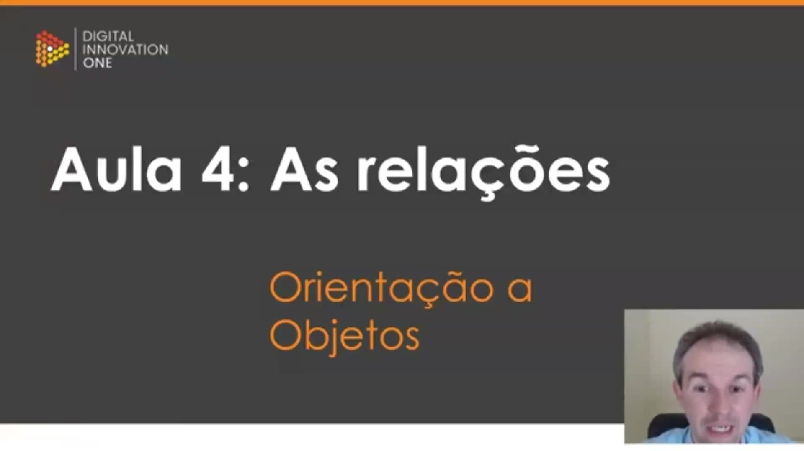
</p>

Nesta introdução da Aula 4, o foco recai sobre as **relações** na Orientação a Objetos. O objetivo central é explorar como a computação permite a criação de novas entidades a partir de estruturas já existentes, elevando o nível de desenvolvimento para além das estruturas básicas discutidas anteriormente.

<p align="center">
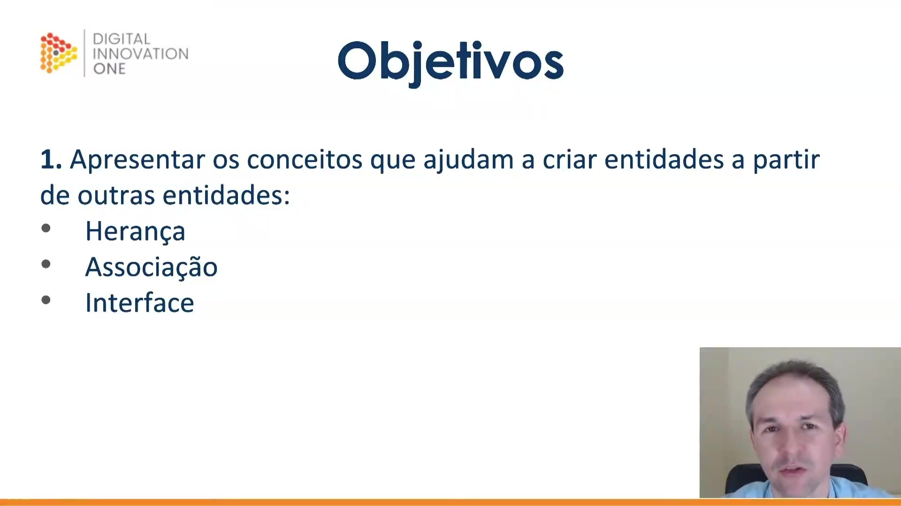
</p>

Para atingir o objetivo de criar entidades a partir de outras, são apresentados três conceitos fundamentais de relacionamento:

* **Herança**
* **Associação**
* **Interface**

<p align="center">
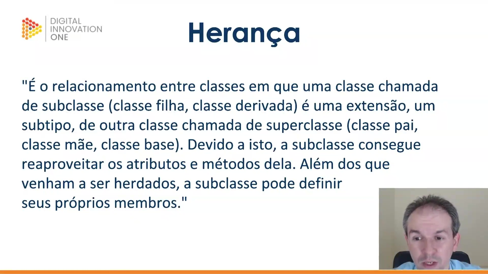
</p>

A **Herança** é definida como o relacionamento onde uma classe (subclasse, filha ou derivada) estende uma superclasse (classe pai, mãe ou base). A principal finalidade deste conceito é a criação de **subtipos** ou tipos especializados. Como consequência direta dessa relação, a subclasse herda e reaproveita atributos e métodos da superclasse, podendo também definir seus próprios membros (o conjunto de atributos e métodos).

<p align="center">
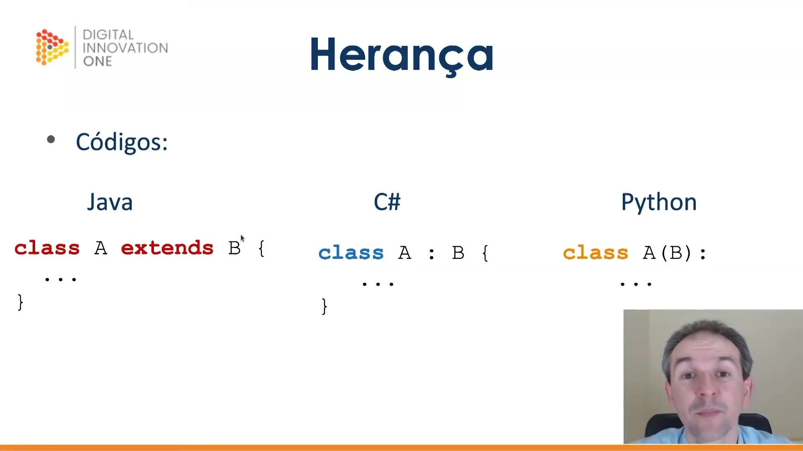
</p>

A implementação da herança varia conforme a sintaxe de cada linguagem de programação, embora o comportamento conceitual de criar um subtipo permaneça o mesmo:

**Java**

```java
class A extends B {
...
}

```

**C#**

```csharp
class A : B {
...
}

```

**Python**

```python
class A (B):
...
}

```

<p align="center">
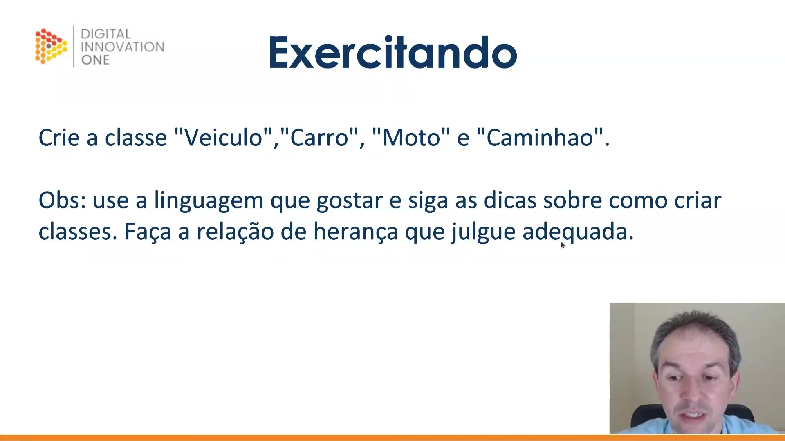
</p>

Para fixar o conhecimento, propõe-se um exercício prático de modelagem:

* Crie as classes: **Veiculo**, **Carro**, **Moto** e **Caminhao**.
* Estabeleça a relação de herança que considerar mais adequada entre elas, aplicando as boas práticas de criação de classes na linguagem de sua preferência.


## 🟩 Vídeo 15 - Herança - Exercício 1

<video width="60%" controls>
  <source src="000-Midia_e_Anexos/bootcamp_tqi_fullstack-modulo.06-curso.11-video_15.webm" type="video/webm">
    Seu navegador não suporta vídeo HTML5.
</video>

link do vídeo: https://web.dio.me/track/tqi-fullstack-developer/course/programacao-orientada-a-objetos/learning/14cfe0b9-ca1c-4e19-a348-6070583b35dd?autoplay=1

Este guia resume a explicação de um exercício prático sobre Herança em Programação Orientada a Objetos (POO). O foco é demonstrar como estruturar classes de forma hierárquica, utilizando o exemplo de veículos para ilustrar a relação entre uma "classe mãe" e suas "subclasses".

### Anotações

<p align="center">
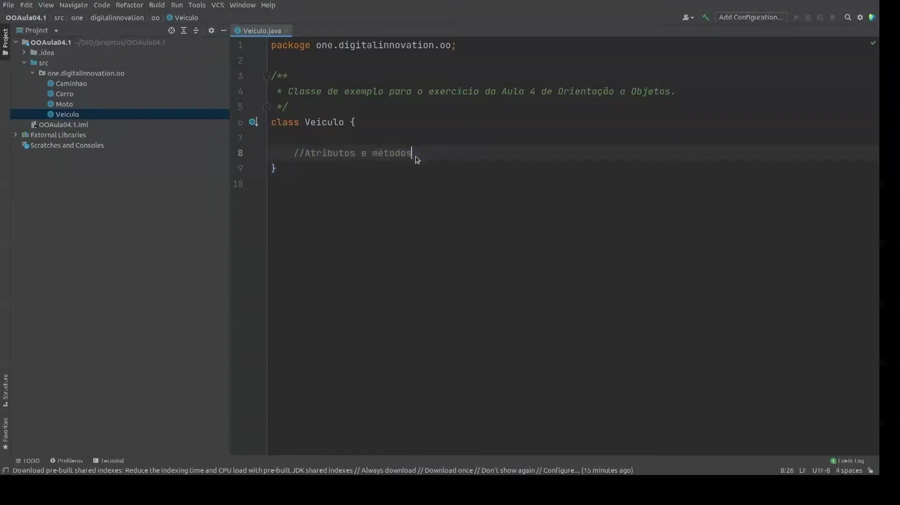
</p>

Nesta etapa inicial, estabelecemos a estrutura base para o exercício de herança em Orientação a Objetos. O foco é a criação da classe mãe, denominada `Veiculo`, que servirá como o progenitor para as demais especializações. Para fins didáticos, a classe é definida de forma simplificada, focando na estrutura de declaração antes de avançarmos para a implementação de atributos e métodos específicos.

```java
package one.digitalinnovation.oo;

/**
 * Classe de exemplo para o exercício da Aula 4 de Orientação a Objetos.
 */
class Veiculo {

    //Atributos e métodos

}
```

<p align="center">
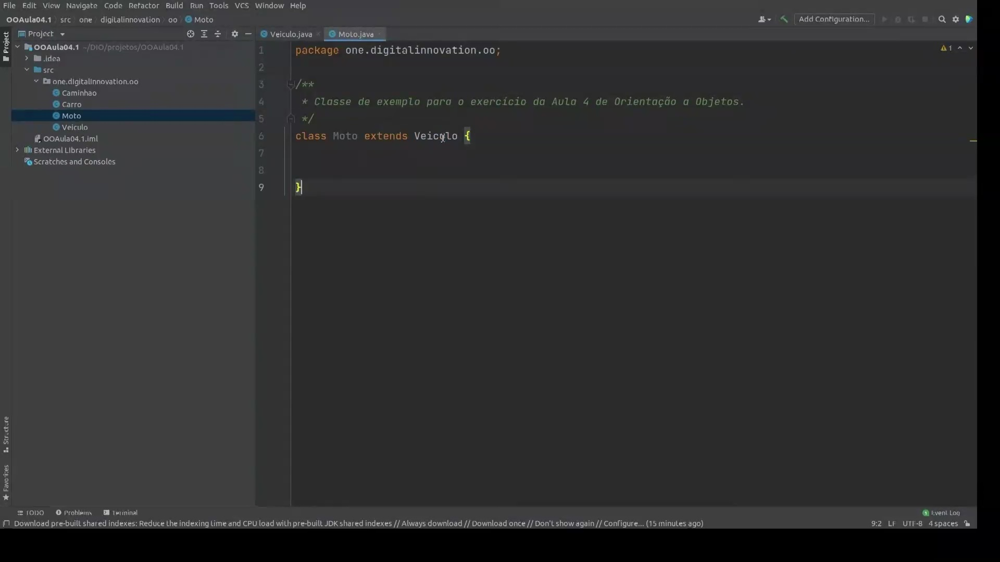
</p>

Dando continuidade à aplicação do conceito de herança, definimos a classe `Moto`. No raciocínio de Orientação a Objetos, a moto é identificada como um tipo ou subtipo de veículo. Para expressar essa relação de herança em Java, utilizamos a palavra-chave `extends`, indicando que `Moto` herda as características da classe pai `Veiculo`.

```java
package one.digitalinnovation.oo;

/**
 * Classe de exemplo para o exercício da Aula 4 de Orientação a Objetos.
 */
class Moto extends Veiculo {

}
```

<p align="center">
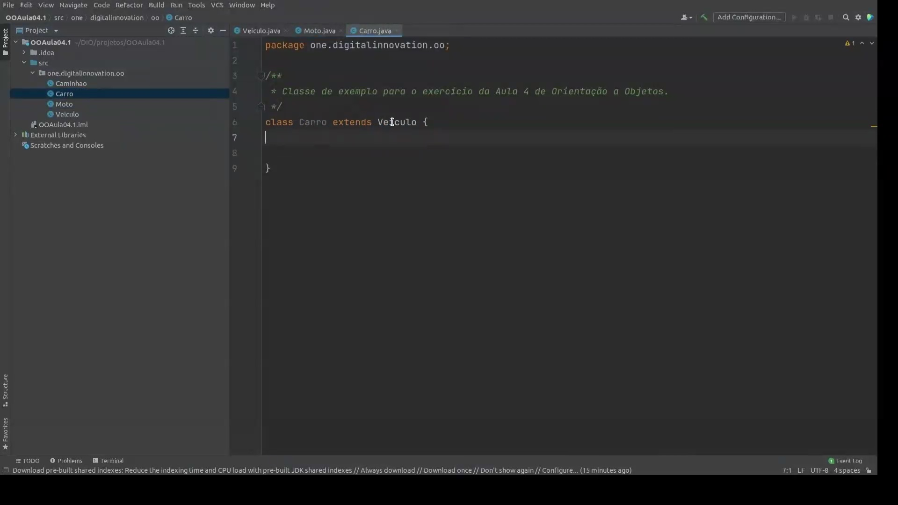
</p>

Seguindo a mesma lógica de especialização, a classe `Carro` também é configurada como um subtipo de `Veiculo`. Ao utilizar a herança, garantimos que o carro compartilhe a mesma base estrutural definida na classe mãe, reforçando o conceito de que "Carro é um Veículo".

```java
package one.digitalinnovation.oo;

/**
 * Classe de exemplo para o exercício da Aula 4 de Orientação a Objetos.
 */
class Carro extends Veiculo {

}
```

<p align="center">
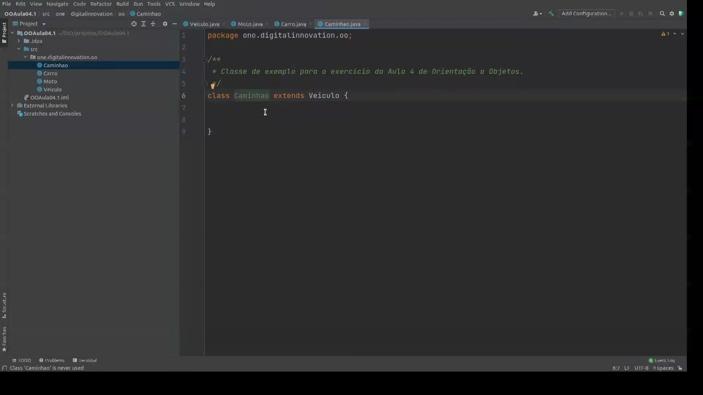
</p>

Por fim, implementamos a classe `Caminhao`, consolidando o exercício. Assim como a moto e o carro, o caminhão estende a classe `Veiculo`. Esta estrutura permite que as três subclasses tenham acesso aos atributos e métodos da classe mãe, embora existam restrições de visibilidade que dependem da organização e dos modificadores de acesso, conceitos que aprofundam a relação entre superclasses e subclasses.

```java
package one.digitalinnovation.oo;

/**
 * Classe de exemplo para o exercício da Aula 4 de Orientação a Objetos.
 */
class Caminhao extends Veiculo {

}
```      

## 🟩 Vídeo 16 - Herança - Tipos

<video width="60%" controls>
  <source src="000-Midia_e_Anexos/bootcamp_tqi_fullstack-modulo.06-curso.11-video_16.webm" type="video/webm">
    Seu navegador não suporta vídeo HTML5.
</video>

link do vídeo: https://web.dio.me/track/tqi-fullstack-developer/course/programacao-orientada-a-objetos/learning/53eff84b-b134-4855-bb8b-f997de9b3e92?autoplay=1

Este guia explora as nuances entre herança simples e múltipla, as diferenças de implementação entre as principais linguagens de programação (Python, C++, Java e C#) e os desafios técnicos, como o "Problema do Diamante", que influenciam o design de softwares modernos.

### Anotações

<p align="center">
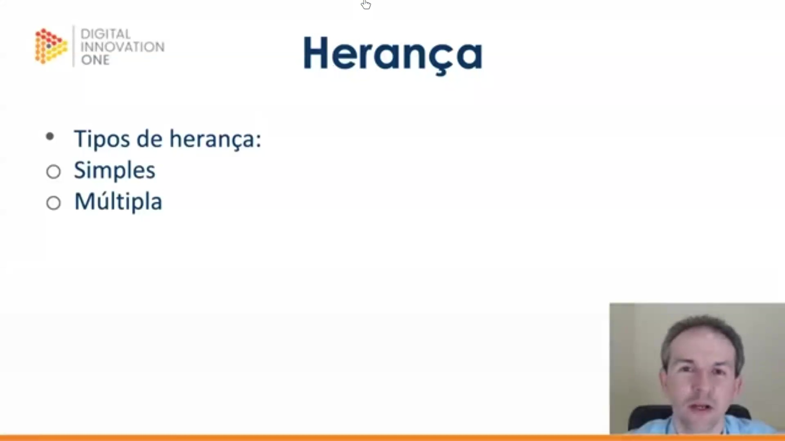
</p>

Nesta introdução aos conceitos intrínsecos da herança, o foco recai sobre os **tipos de herança**, especificamente a distinção entre **herança simples** e **herança múltipla**. A herança é um pilar fundamental da programação orientada a objetos que permite a criação de subconceitos e especializações a partir de classes base.

<p align="center">
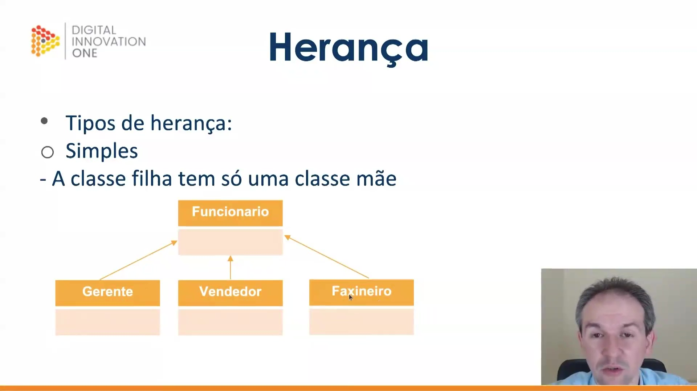
</p>

A **herança simples** ocorre quando uma classe filha (subclasse) possui apenas uma classe mãe (superclasse). No exemplo apresentado no diagrama:

* **Funcionario** é a classe mãe.
* **Gerente**, **Vendedor** e **Faxineiro** são as classes filhas.

Embora existam três especializações diferentes, cada uma delas herda individualmente de apenas uma fonte. Portanto, temos três instâncias de herança simples, onde cada subclasse estende as propriedades e comportamentos exclusivamente da classe `Funcionario`.

<p align="center">
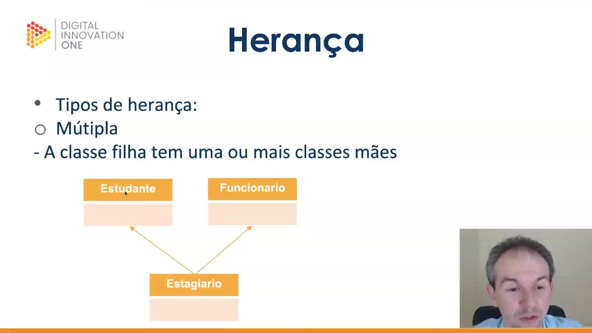
</p>

A **herança múltipla** é caracterizada por uma classe filha que deriva de uma ou mais classes mães. O diagrama ilustra essa relação através do exemplo do **Estagiário**:

* O **Estagiario** é definido como um subtipo de **Estudante**.
* Simultaneamente, o **Estagiario** é um subtipo de **Funcionario**.

Neste cenário, a classe filha consolida características de duas classes independentes, permitindo que o objeto comporte-se e possua atributos de ambas as origens.

<p align="center">
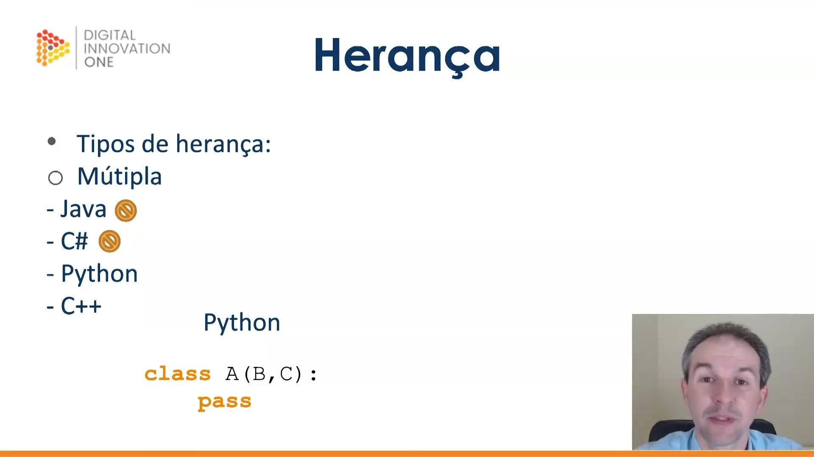
</p>

A implementação da herança múltipla varia conforme a linguagem de programação. Enquanto linguagens como **Java** e **C#** não permitem herança múltipla de classes (devido a riscos como o conflito de nomes ou "problema do diamante"), linguagens como **Python** e **C++** oferecem suporte nativo.

Em Python, a herança múltipla é declarada listando as classes mães entre parênteses, separadas por vírgulas:

```python
class A (B, C):
    pass

```

Neste exemplo de código, a classe `A` herda simultaneamente das classes `B` e `C`.      


## 🟩 Vídeo 17 - Herança - Upcast e Downcast

<video width="60%" controls>
  <source src="000-Midia_e_Anexos/bootcamp_tqi_fullstack-modulo.06-curso.11-video_17.webm" type="video/webm">
    Seu navegador não suporta vídeo HTML5.
</video>

link do vídeo: https://web.dio.me/track/tqi-fullstack-developer/course/programacao-orientada-a-objetos/learning/8d92b14b-79be-4816-9f10-c4a9841f57d2?autoplay=1

Este guia explora os conceitos de conversão de tipos em hierarquias de herança, focando em como as linguagens Java, C# e Python lidam com a subida e descida de níveis entre superclasses e subclasses.

### Anotações

<p align="center">
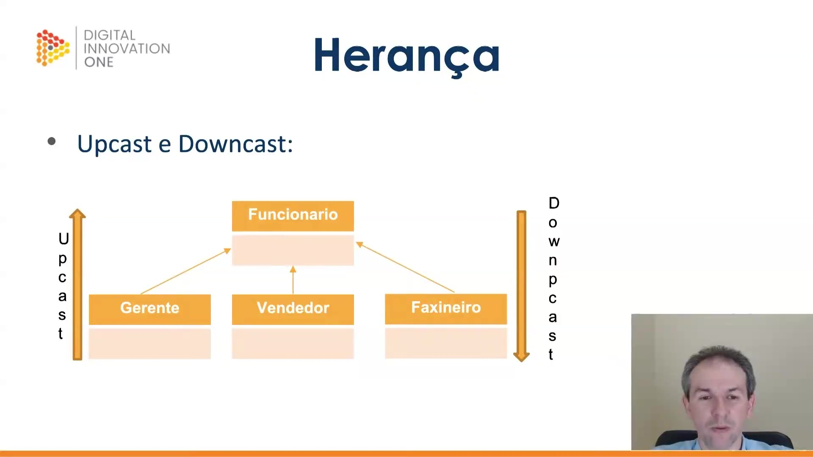
</p>

Nesta etapa, exploramos os conceitos de **Upcast** e **Downcast** dentro da hierarquia de classes da orientação a objetos. Para ilustrar, utilizamos uma estrutura onde a superclasse é **Funcionario** e as subclasses (especializações) são **Gerente**, **Vendedor** e **Faxineiro**.

* **Upcast:** Consiste em "subir" na hierarquia. É o processo de transformar uma subclasse em uma superclasse (ex: tratar um Gerente como um Funcionario). Como um Gerente *é um* Funcionario, essa operação é segura e comum.
* **Downcast:** É o movimento oposto, ou seja, "descer" na hierarquia. Ocorre quando tentamos transformar uma superclasse em uma de suas especializações (ex: transformar Funcionario em Faxineiro). Por se aprofundar em tipos específicos, é uma operação que exige cautela.

<p align="center">
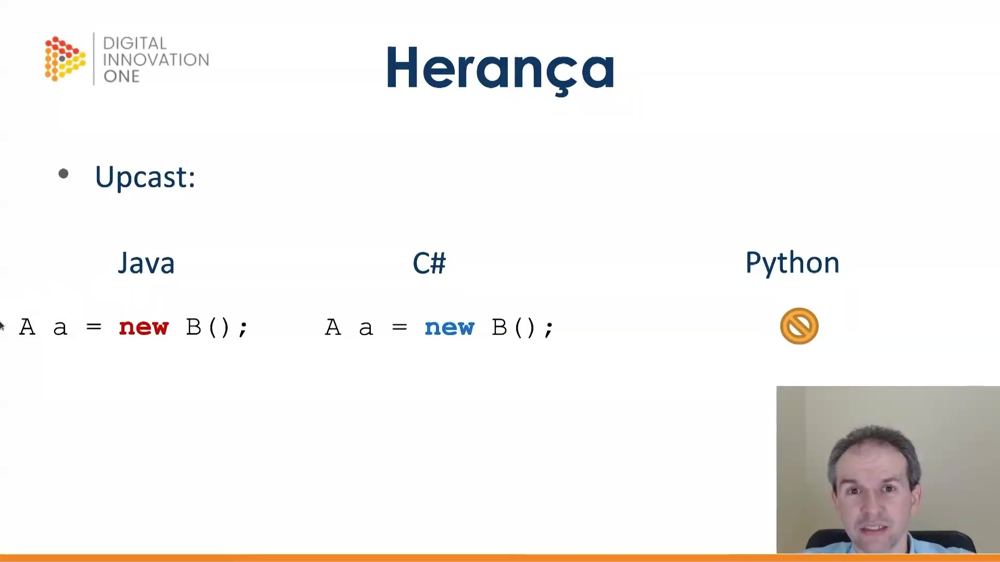
</p>

A implementação do **Upcast** em linguagens como Java e C# ocorre de forma **implícita**. Isso significa que o compilador aceita a atribuição diretamente, sem necessidade de comandos especiais, pois a relação de herança garante que a subclasse possua os requisitos da superclasse.

```java
// Exemplo de Upcast (implícito)
A a = new B();

```

Em contrapartida, a linguagem Python utiliza o **Duck Typing** (tipagem de pato). Por ser uma linguagem dinâmica e flexível, Python não aplica formalmente os conceitos de upcast e downcast da mesma maneira que as linguagens estáticas, tratando as interações de forma mais simplificada.

<p align="center">
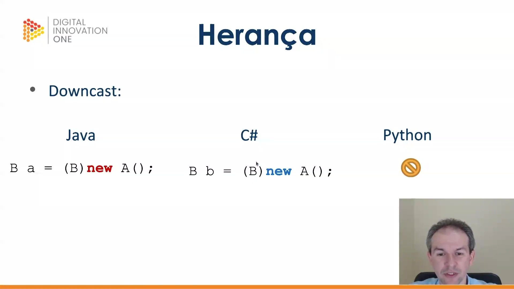
</p>

Diferente do upcast, o **Downcast** deve ser realizado de forma **explícita** em Java e C#. O desenvolvedor precisa declarar manualmente para qual subtipo deseja converter o objeto.

```java
// Exemplo de Downcast em Java (explícito)
B b = (B) new A();

```

```csharp
// Exemplo de Downcast em C# (explícito)
B b = (B) new A();

```

É importante ressaltar que o downcast é considerado uma **operação perigosa**. Na maioria dos casos, ele pode resultar em erros de compilação ou falhas durante a execução (runtime), sendo recomendado apenas em situações muito específicas, como no uso da classe *Object*. Assim como no caso anterior, o conceito de downcast não se aplica ao Python devido à sua natureza dinâmica.      


## 🟩 Vídeo 18 - Herança - Polimorfismo e Sobrescrita

<video width="60%" controls>
  <source src="000-Midia_e_Anexos/bootcamp_tqi_fullstack-modulo.06-curso.11-video_18.webm" type="video/webm">
    Seu navegador não suporta vídeo HTML5.
</video>

link do vídeo: https://web.dio.me/track/tqi-fullstack-developer/course/programacao-orientada-a-objetos/learning/8b707a92-14d5-4d77-a439-286ee25cb5fe?autoplay=1

Este resumo explora os conceitos de Polimorfismo e Sobrescrita (Overriding), dois pilares fundamentais da Programação Orientada a Objetos (POO), destacando suas definições, exemplos práticos e as diferenças conceituais que os distinguem.

### Anotações

<p align="center">
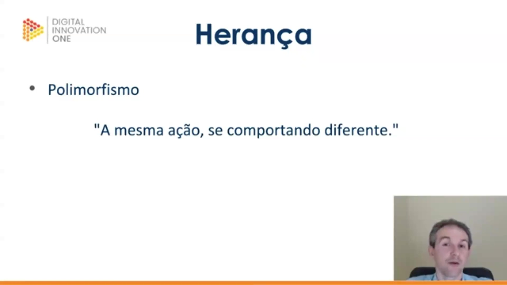
</p>

O **polimorfismo** é apresentado como um dos conceitos mais fundamentais e, simultaneamente, complexos da Orientação a Objetos. Sua definição central reside na ideia de **"a mesma ação se comportando diferente"**.

Em termos técnicos, isso significa que um mesmo método (ação) pode ter implementações e comportamentos distintos. Embora seja comumente utilizado em conjunto com a **herança** para proporcionar flexibilidade ao sistema, o uso da herança não obriga o programador a implementar o polimorfismo, mas é através dele que se extrai o potencial máximo da estrutura de objetos.

<p align="center">
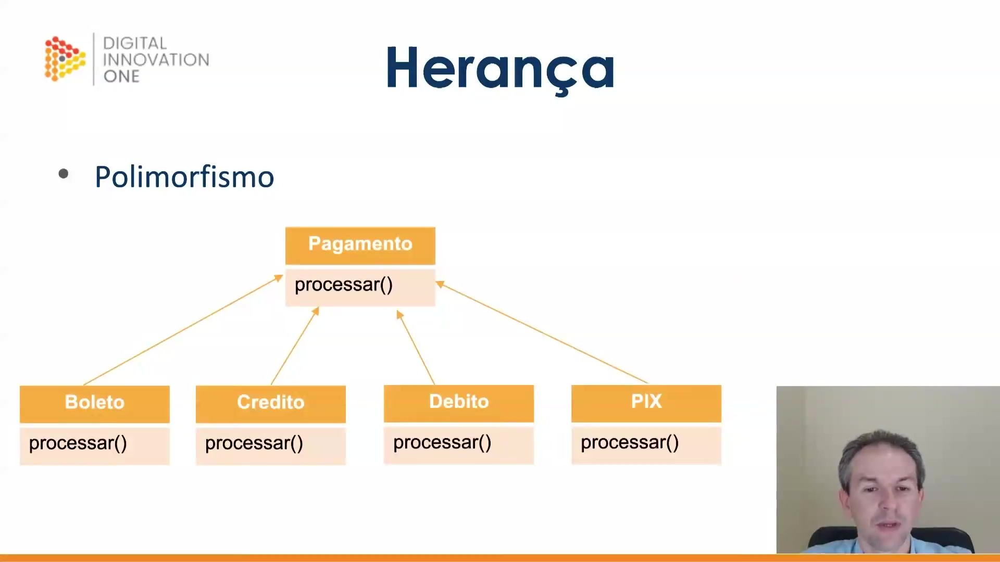
</p>

Para ilustrar o polimorfismo, utiliza-se o exemplo de uma entidade de **Pagamento**. O diagrama demonstra uma estrutura de herança onde diferentes subtipos especializam a ação de processar o pagamento:

* **Classe Pai:** `Pagamento` com o método `processar()`.
* **Subtipos (Especializações):** `Boleto`, `Credito`, `Debito` e `PIX`.

Neste cenário, a ação `processar()` é a mesma para todos, porém, o comportamento interno de cada uma é drasticamente diferente. O polimorfismo permite que o sistema execute o método baseado na instância real do objeto (se é um PIX ou um Boleto), garantindo que a ação correta seja disparada de acordo com o contexto do subtipo.

<p align="center">
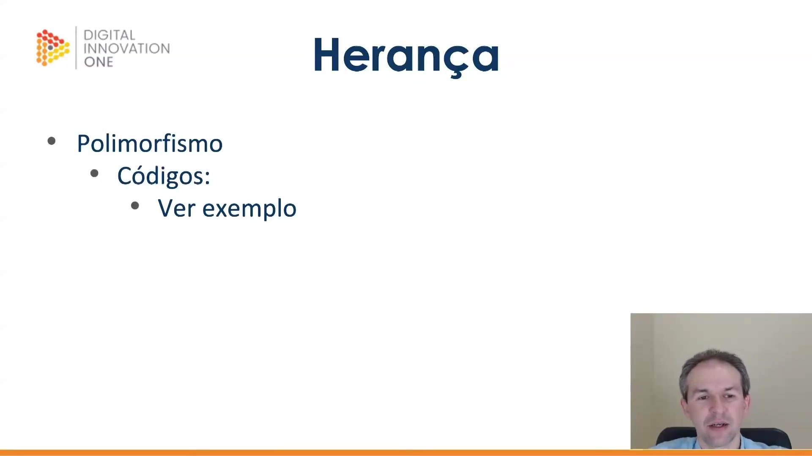
</p>

O conceito de polimorfismo será explorado de forma prática em momentos posteriores. Devido à sua complexidade técnica, a aplicação direta no código e a demonstração de como essa flexibilidade se manifesta na programação serão detalhadas em exercícios específicos para facilitar a compreensão plena do aluno.

<p align="center">
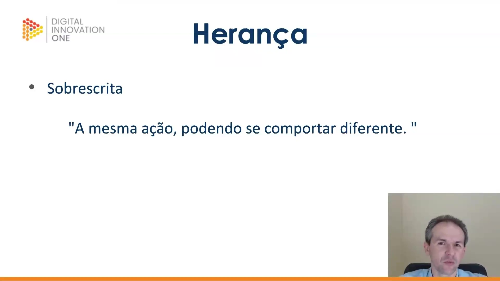
</p>

A **Sobrescrita** é outro conceito vital relacionado à herança e aos métodos. Ela é definida como **"a mesma ação, podendo se comportar diferente"**.

A sutil diferença em relação ao polimorfismo reside na palavra "podendo": enquanto no polimorfismo a natureza da ação frequentemente exige comportamentos distintos para cada tipo, na sobrescrita existe a opção de manter um comportamento padrão ou alterá-lo conforme a necessidade da subclasse.

<p align="center">
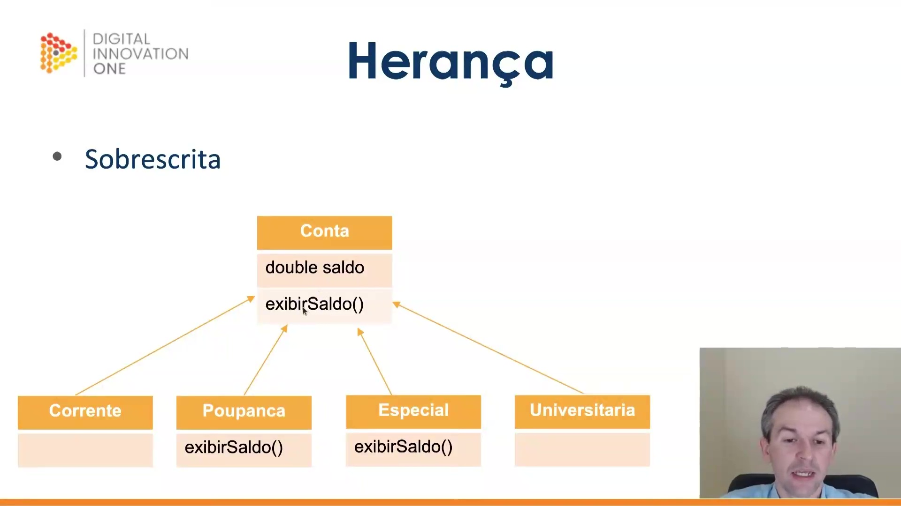
</p>

O exemplo de uma **Conta Bancária** ajuda a diferenciar onde a sobrescrita ocorre e onde ela é desnecessária:

* **Classe Mãe (`Conta`):** Possui o atributo `double saldo` e o método `exibirSaldo()`. O comportamento padrão é simplesmente mostrar o valor do saldo.
* **Classes `Corrente` e `Universitaria`:** Não sobrescrevem o método. Elas herdam e utilizam o comportamento padrão da classe mãe, pois apenas exibem o valor nominal.
* **Classes `Poupanca` e `Especial`:** Realizam a **sobrescrita** do método `exibirSaldo()`.
* A **Poupança** precisa calcular o rendimento (juros) sobre o valor.
* A **Conta Especial** precisa exibir o saldo somado ao limite do cheque especial.


Nesses casos, a sobrescrita permite que a subclasse use a base da classe mãe, mas acrescente ou modifique o comportamento para atender sua especificidade.

<p align="center">
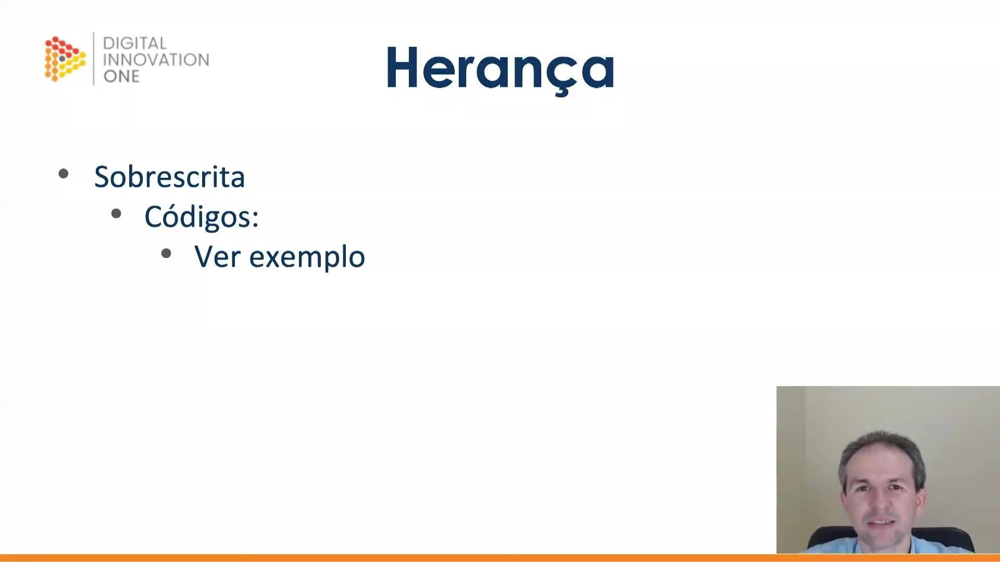
</p>

Assim como no polimorfismo, a implementação técnica da sobrescrita será demonstrada através de exemplos de código. Isso é fundamental porque, visualmente, a escrita do código para ambos os conceitos pode parecer idêntica, embora suas finalidades filosóficas no design do software sejam distintas.

<p align="center">
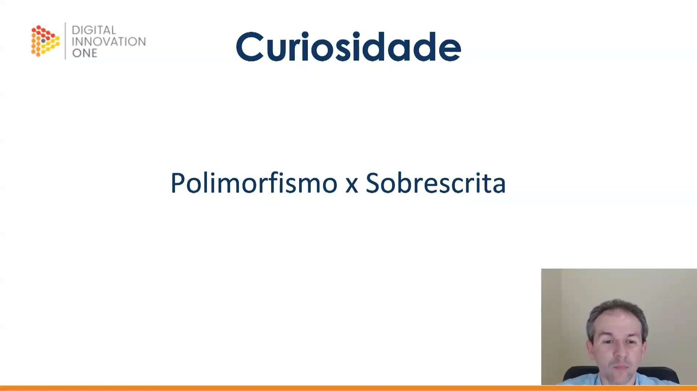
</p>

A distinção conceitual entre **Polimorfismo** e **Sobrescrita** pode ser resumida pela natureza da abstração:

1. **Polimorfismo:** A ação é geralmente tão abstrata (como "processar pagamento") que não há um comportamento padrão viável. Ela **sempre** se comporta de forma diferente em cada subtipo.
2. **Sobrescrita:** Existe um comportamento padrão funcional (como "exibir saldo"), mas as subclasses **podem** escolher especializar ou alterar esse comportamento se necessário.

Não há uma regra de "qual é melhor"; a escolha depende do contexto e da necessidade do sistema. A maestria em identificar quando usar cada um vem com o estudo contínuo e a prática da programação orientada a objetos.      


## 🟩 Vídeo 19 - Herança - Proposta de Exercício 2

<video width="60%" controls>
  <source src="000-Midia_e_Anexos/bootcamp_tqi_fullstack-modulo.06-curso.11-video_19.webm" type="video/webm">
    Seu navegador não suporta vídeo HTML5.
</video>

link do vídeo: https://web.dio.me/track/tqi-fullstack-developer/course/programacao-orientada-a-objetos/learning/7acf2370-4448-43eb-92bd-74b5f2519c3d?autoplay=1

O vídeo introduz a resolução de dois exercícios práticos focados em conceitos fundamentais de Programação Orientada a Objetos (POO), visando aprofundar o entendimento de hierarquias de classes, manipulação de tipos e comportamento de métodos.

### Anotações

<p align="center">
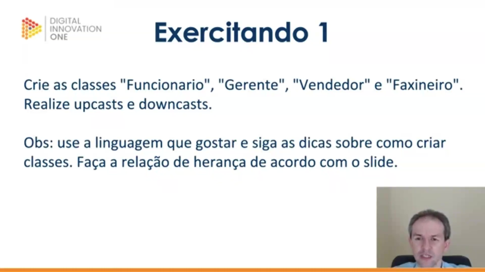
</p>

Nesta etapa prática, o foco é a implementação de uma estrutura de herança para exercitar a manipulação de tipos em Programação Orientada a Objetos. O exercício propõe a criação de uma hierarquia organizacional onde a classe **Funcionario** atua como a superclasse, servindo de base para as especializações **Gerente**, **Vendedor** e **Faxineiro**.

A atividade consiste em realizar as seguintes operações:

* **Upcast**: Tratar um objeto de uma subclasse (como Gerente) como se fosse do tipo genérico Funcionario.
* **Downcast**: Retornar uma referência que já passou por um upcast para o seu tipo específico original.

<p align="center">
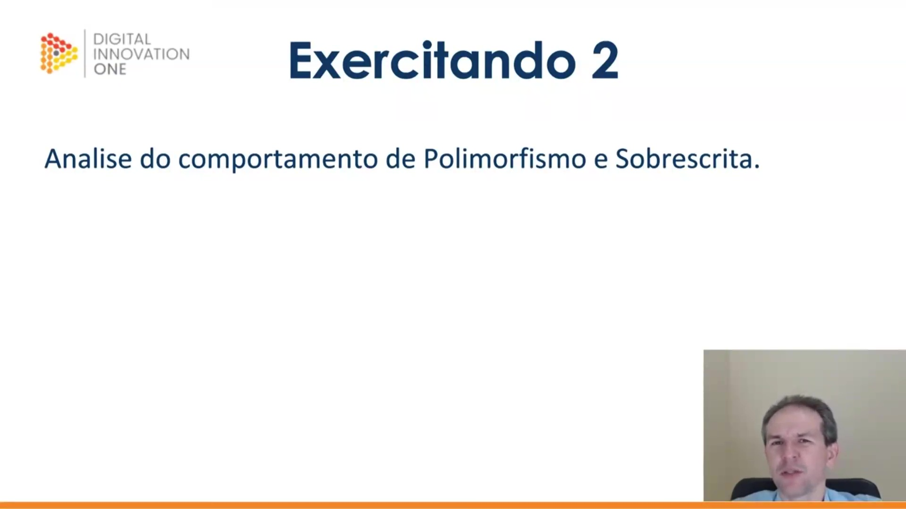
</p>

Este segundo exercício visa aprofundar a compreensão técnica sobre o **Polimorfismo** e a **Sobrescrita** através da análise de comportamento no código. Enquanto a teoria define esses conceitos, a prática demonstrará como o sistema identifica qual método executar quando diferentes objetos respondem a uma mesma mensagem.

A resolução foca em fornecer exemplos palpáveis para tornar clara a aplicação da sobrescrita (quando uma subclasse redefine um método da superclasse) e do polimorfismo (a capacidade de um objeto ser referenciado de várias formas), preenchendo lacunas conceituais com demonstrações de execução.


## 🟩 Vídeo 20 - Herança - Resolução do exercício 2 - Parte 1

<video width="60%" controls>
  <source src="000-Midia_e_Anexos/bootcamp_tqi_fullstack-modulo.06-curso.11-video_20.webm" type="video/webm">
    Seu navegador não suporta vídeo HTML5.
</video>

link do vídeo:  https://web.dio.me/track/tqi-fullstack-developer/course/programacao-orientada-a-objetos/learning/4b2af323-517b-4418-9989-c28b7629d04c?autoplay=1

Este vídeo explora os conceitos de Upcasting e Downcasting em Java, utilizando um exemplo prático de hierarquia de classes para ilustrar seu funcionamento e as melhores práticas.

### Anotações

<p align="center">
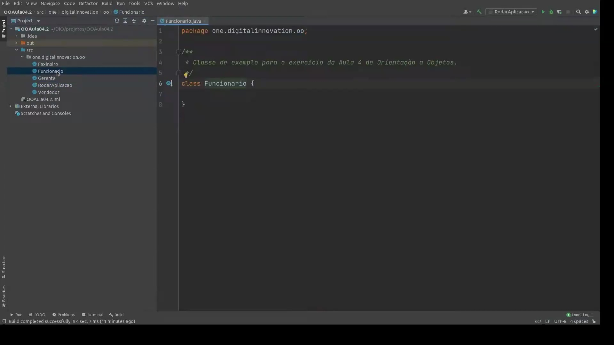
</p>

Nesta etapa inicial do exercício, estabelecemos a estrutura de classes necessária para explorar os conceitos de herança e polimorfismo. A classe base é denominada `Funcionario`, servindo como a superclasse do sistema. A partir dela, são criadas três subclasses específicas: `Faxineiro`, `Gerente` e `Vendedor`.

Essa organização reflete a hierarquia de tipos onde as classes filhas herdam as características da classe mãe, permitindo que objetos dessas subclasses sejam tratados como instâncias de `Funcionario`.

```java
class Funcionario {
}

```

<p align="center">
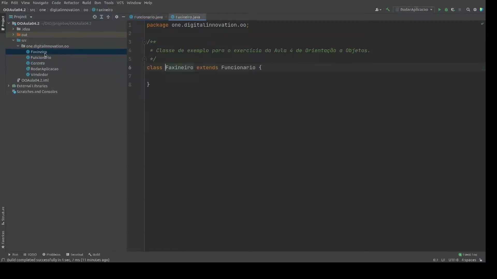
</p>

A implementação da classe `Faxineiro` demonstra a aplicação prática da herança através da palavra-chave `extends`. Ao definir `class Faxineiro extends Funcionario`, estabelecemos que `Faxineiro` é um subtipo de `Funcionario`. Esta relação é fundamental para permitir operações de Upcast, pois a linguagem reconhece que todo faxineiro é, inerentemente, um funcionário.

```java
class Faxineiro extends Funcionario {
}

```

<p align="center">

</p>

Seguindo a mesma lógica de especialização, a classe `Gerente` também é definida como uma extensão de `Funcionario`. No contexto da orientação a objetos, isso significa que a classe `Gerente` herda o comportamento da superclasse, sendo classificada como uma subclasse ou tipo derivado.

```java
class Gerente extends Funcionario {
}

```

<p align="center">
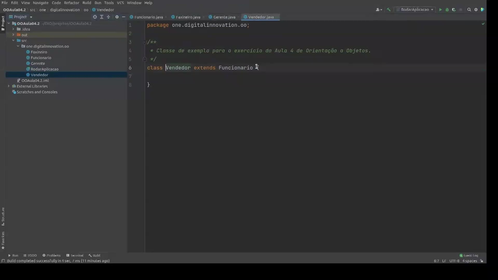
</p>

A classe `Vendedor` completa o conjunto de subtipos do exercício. Assim como as anteriores, ela estende `Funcionario`. Esta estrutura prepara o ambiente para testar como o Java lida com a conversão entre esses tipos, especialmente quando tentamos mover um objeto para cima (Upcast) ou para baixo (Downcast) na hierarquia de classes.

```java
class Vendedor extends Funcionario {
}

```

<p align="center">
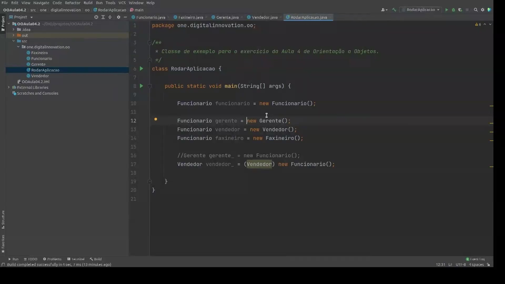
</p>

A classe `RodarAplicacao` contém o método `main`, onde as instanciacões e conversões de tipo são executadas. O código exemplifica três situações distintas:

1. **Instanciação Simples:** Criação de um objeto `Funcionario` atribuído a uma variável do mesmo tipo.
2. **Upcast:** Objetos das subclasses (`Gerente`, `Vendedor`, `Faxineiro`) são atribuídos a variáveis do tipo `Funcionario`. O Upcast é implícito, o que significa que o Java realiza a conversão automaticamente sem necessidade de sintaxe adicional, pois não há risco de perda de dados ao tratar um subtipo como seu supertipo.
3. **Downcast:** Tentativa de converter uma referência de superclasse para uma subclasse, como em `Vendedor vendedor = (Vendedor) new Funcionario();`. Diferente do Upcast, o Downcast exige uma declaração explícita do tipo alvo entre parênteses.

```java
class RodarAplicacao {
    public static void main(String[] args) {
        Funcionario funcionario = new Funcionario();

        // Upcasts implícitos
        Funcionario gerente = new Gerente();
        Funcionario vendedor = new Vendedor();
        Funcionario faxineiro = new Faxineiro();

        // Downcast explícito
        Vendedor vendedor_down = (Vendedor) new Funcionario();
    }
}

```

<p align="center">
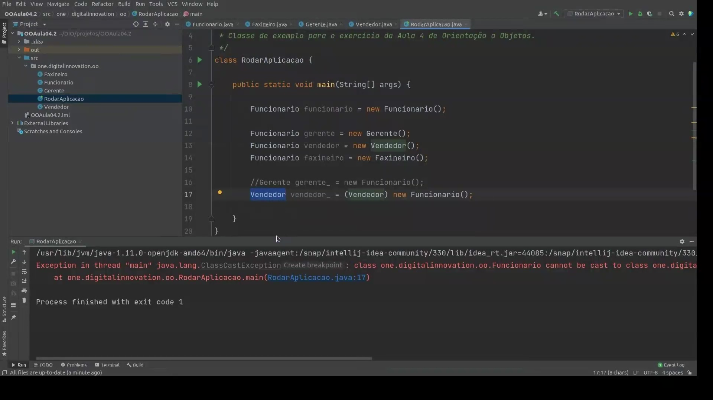
</p>

Ao executar a aplicação, o console do sistema exibe um erro de execução: `java.lang.ClassCastException`. Este erro ocorre especificamente na linha onde o Downcast foi tentado.

O problema reside no fato de que, embora a sintaxe do Downcast esteja correta (explícita), a operação é semanticamente perigosa. O objeto criado é um `Funcionario` genérico, que não possui as informações específicas que um `Vendedor` teria. Como a linguagem não sabe como preencher os dados ausentes na subclasse, ela interrompe a execução para evitar inconsistências. Por esse motivo, o Downcast deve ser evitado na orientação a objetos, enquanto o Upcast é encorajado por facilitar o polimorfismo.

```bash
Exception in thread "main" java.lang.ClassCastException: class one.digitalinnovation.oo.Funcionario cannot be cast to class one.digitalinnovation.oo.Vendedor
    at one.digitalinnovation.oo.RodarAplicacao.main(RodarAplicacao.java:17)

Process finished with exit code 1

```      

## 🟩 Vídeo 21 - Herança - Resolução do exercício 2 - Parte 2

<video width="60%" controls>
  <source src="000-Midia_e_Anexos/bootcamp_tqi_fullstack-modulo.06-curso.11-video_21.webm" type="video/webm">
    Seu navegador não suporta vídeo HTML5.
</video>

link do vídeo: https://web.dio.me/track/tqi-fullstack-developer/course/programacao-orientada-a-objetos/learning/0d734e0a-3464-4869-b0e6-8d8d67f7979c?autoplay=1

Este guia explora a implementação prática de Polimorfismo e Sobrescrita (Override). Através de um exemplo com classes "Mãe" e "Filha", o vídeo demonstra como o Java decide qual método executar em tempo de execução, dependendo da instância do objeto, mesmo quando referenciado por um tipo comum.

### Anotações

<p align="center">
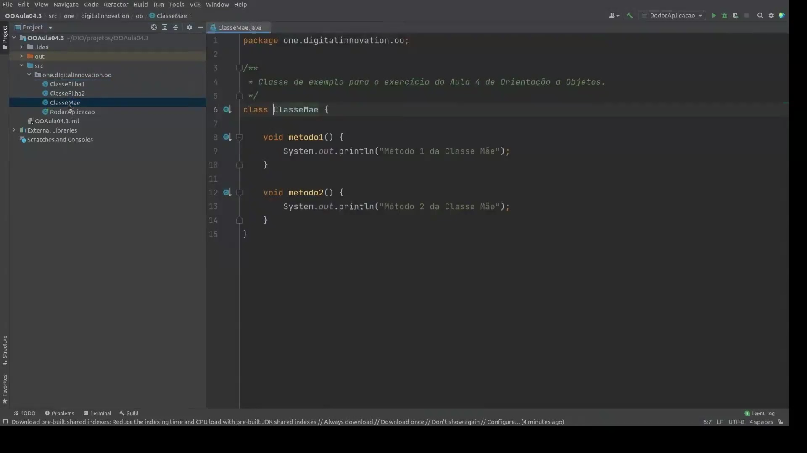
</p>

Nesta etapa, iniciamos com a criação da **ClasseMae**, que serve como a base para o exercício de Orientação a Objetos. Ela define a estrutura inicial e o comportamento padrão que será compartilhado com outras classes no sistema. A classe contém dois métodos simples, `metodo1()` e `metodo2()`, que apenas imprimem mensagens no console para identificar sua execução.

```java
package one.digitalinnovation.oo; // Define o pacote onde a classe está localizada

class ClasseMae { // Declaração da classe base chamada ClasseMae

    void metodo1() { // Início da definição do primeiro método sem retorno
        System.out.println("Metodo 1 da Classe Mãe"); // Imprime o texto identificando o método da mãe
    } // Fim do metodo1

    void metodo2() { // Início da definição do segundo método sem retorno
        System.out.println("Metodo 2 da Classe Mãe"); // Imprime o texto identificando o método da mãe
    } // Fim do metodo2
} // Fim da classe ClasseMae
```

<p align="center">

</p>

Aqui, vemos a implementação da **ClasseFilha1**, que utiliza o conceito de **herança** através da palavra-chave `extends` para herdar as características da `ClasseMae`. Nesta classe, ocorre a **sobrescrita** (override) do `metodo1()`, onde o comportamento original é alterado para exibir uma mensagem específica da "Filha 1". O `metodo2()`, por não ser mencionado aqui, continua com o comportamento padrão definido na mãe.

```java
package one.digitalinnovation.oo; // Define o pacote de organização

class ClasseFilha1 extends ClasseMae { // Declara que esta classe herda de ClasseMae

    @Override // Anotação que indica que estamos sobrescrevendo um método da superclasse
    void metodo1() { // Redefinição do metodo1 para esta classe filha
        System.out.println("Metodo 1 da Classe Filha 1"); // Nova mensagem personalizada
    } // Fim da sobrescrita do metodo1
} // Fim da classe ClasseFilha1
```

<p align="center">
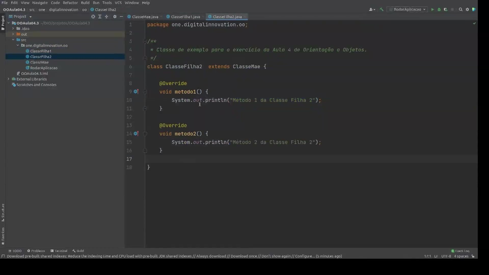
</p>

A **ClasseFilha2** também herda da `ClasseMae`, mas demonstra uma personalização mais profunda. Diferente da primeira filha, esta classe sobrescreve **ambos** os métodos herdados: `metodo1()` e `metodo2()`. Isso exemplifica como uma subclasse pode redefinir totalmente os comportamentos da classe pai para se adequar a novas regras de negócio.

```java
package one.digitalinnovation.oo; // Define o pacote de organização

class ClasseFilha2 extends ClasseMae { // Estabelece herança com a ClasseMae

    @Override // Indica a sobrescrita do método da superclasse
    void metodo1() { // Redefine o metodo1
        System.out.println("Método 1 da Classe Filha 2"); // Mensagem própria da Filha 2
    } // Fim da sobrescrita do metodo1

    @Override // Indica a sobrescrita de outro método da superclasse
    void metodo2() { // Redefine o metodo2
        System.out.println("Método 2 da Classe Filha 2"); // Mensagem própria da Filha 2
    } // Fim da sobrescrita do metodo2
} // Fim da classe ClasseFilha2
```

<p align="center">
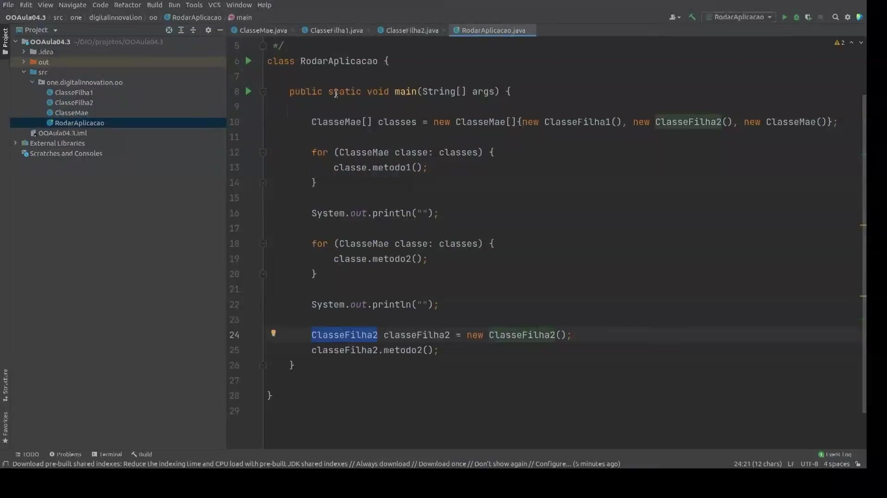
</p>

Na classe **RodarAplicacao**, colocamos os conceitos em prática através de um vetor do tipo `ClasseMae[]`. O código instancia objetos das classes filhas e da classe mãe dentro deste mesmo vetor. Ao percorrer o vetor com um laço `for`, o Java utiliza o **polimorfismo** para decidir, no momento da execução, qual versão do método deve ser chamada (se a da mãe ou de uma das filhas), baseando-se no tipo real do objeto instanciado.

```java
class RodarAplicacao { // Classe criada para executar o exemplo

    public static void main(String[] args) { // Método principal de entrada do programa

        // Cria um array capaz de guardar objetos do tipo ClasseMae e suas subclasses
        ClasseMae[] classes = new ClasseMae[] {new ClasseFilha1(), new ClasseFilha2(), new ClasseMae()};

        for (ClasseMae classe: classes) { // Loop 'for-each' que percorre cada item do array
            classe.metodo1(); // Chama o metodo1 polimorficamente
        } // Fim do primeiro loop

        System.out.println(""); // Pula uma linha no console para organização

        for (ClasseMae classe: classes) { // Segundo loop para testar o metodo2
            classe.metodo2(); // Chama o metodo2 polimorficamente
        } // Fim do segundo loop

        System.out.println(""); // Pula uma linha no console

        ClasseFilha2 classeFilha2 = new ClasseFilha2(); // Instanciação direta da ClasseFilha2
        classeFilha2.metodo2(); // Chamada comum de método sobre um objeto específico
    } // Fim do método main
} // Fim da classe RodarAplicacao
```

<p align="center">
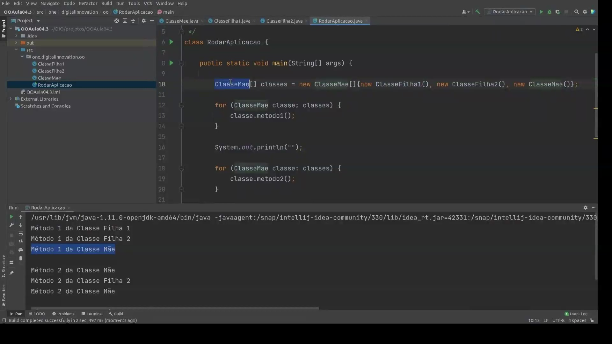
</p>

A última imagem mostra o console com o resultado final da execução. Note que no primeiro bloco de mensagens, o `metodo1` variou para as três chamadas, pois todas as classes tinham sua própria versão. No segundo bloco, a "Filha 1" executou a mensagem da "Classe Mãe", provando que, como ela não sobrescreveu o `metodo2`, herdou o comportamento original integralmente.


## 🟩 Vídeo 22 - Associação - Conceito

<video width="60%" controls>
  <source src="000-Midia_e_Anexos/bootcamp_tqi_fullstack-modulo.06-curso.11-video_22.webm" type="video/webm">
    Seu navegador não suporta vídeo HTML5.
</video>

link do vídeo: https://web.dio.me/track/tqi-fullstack-developer/course/programacao-orientada-a-objetos/learning/c949cc7d-caba-46fb-81d4-390588cd142f?autoplay=1

Este guia explora o conceito de Associação, um pilar fundamental da Programação Orientada a Objetos que permite a colaboração entre diferentes classes e objetos. Diferente da Herança, que foca em hierarquia e subtipos, a Associação foca na interação e cooperação para atingir objetivos comuns e representar conceitos complexos de forma completa.

### Anotações

<p align="center">
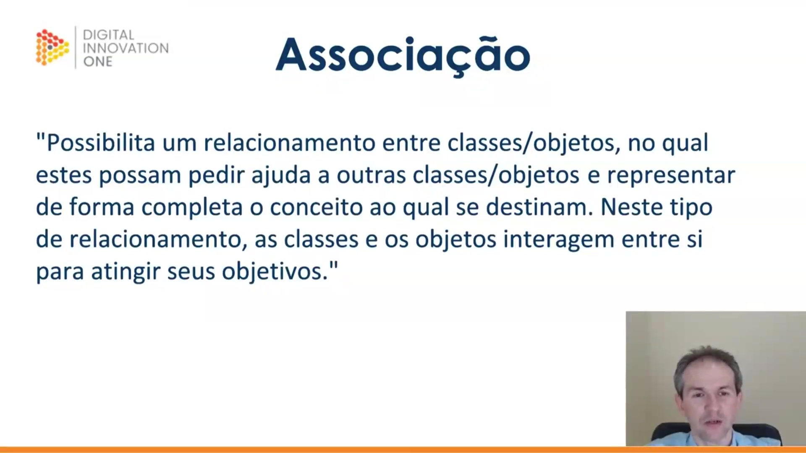
</p>

A **Associação** é um tipo de relacionamento entre classes e objetos que permite que eles interajam entre si para atingir seus objetivos. Diferente da herança, que trata de subtipos, a associação foca no uso mútuo: ela possibilita que os objetos peçam ajuda a outras classes para representar de forma completa o conceito ao qual se destinam.

<p align="center">

</p>

Existem basicamente dois tipos principais de associação, classificados de acordo com a forma como se manifestam no sistema:

* **Estrutural**: Esta associação manifesta-se na estrutura das classes e objetos, especificamente nos seus atributos. Ela pode ser do tipo **Composição** ou **Agregação**.
* **Comportamental**: Este tipo está relacionado aos comportamentos ou métodos das classes. Essa forma de associação é chamada de **Dependência**.      


## 🟩 Vídeo 23 - Associação - Tipos

<video width="60%" controls>
  <source src="000-Midia_e_Anexos/bootcamp_tqi_fullstack-modulo.06-curso.11-video_23.webm" type="video/webm">
    Seu navegador não suporta vídeo HTML5.
</video>

link do vídeo: https://web.dio.me/track/tqi-fullstack-developer/course/programacao-orientada-a-objetos/learning/d79f9295-3df7-470e-8c98-fd2458eb8bc1?autoplay=1

Este guia explora as nuances das relações entre objetos, diferenciando como eles se estruturam, se comportam e quando escolher entre a rigidez da herança ou a flexibilidade da associação.

### Anotações

<p align="center">
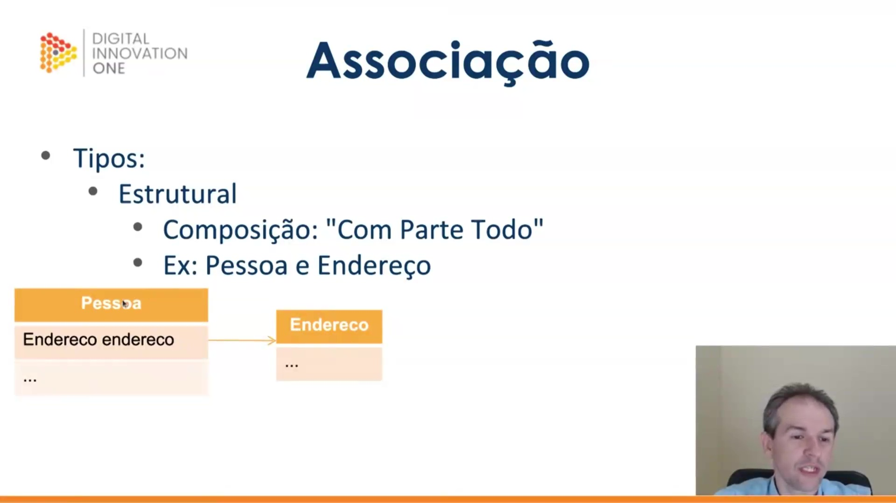
</p>

A **Composição** é um tipo de associação estrutural caracterizada pela relação de "**Parte-Todo**". Nesse cenário, existe uma dependência de existência muito forte entre os objetos: a "parte" só faz sentido e só pode existir enquanto o "todo" existir.

No exemplo apresentado de **Pessoa** e **Endereço**, o endereço é tratado como uma parte integrante e exclusiva daquela pessoa dentro do sistema. Se o objeto Pessoa for removido ou deixar de existir, o endereço associado a ela perde sua razão de ser e também deve ser excluído, evidenciando que um é composto especificamente pelo outro.

<p align="center">
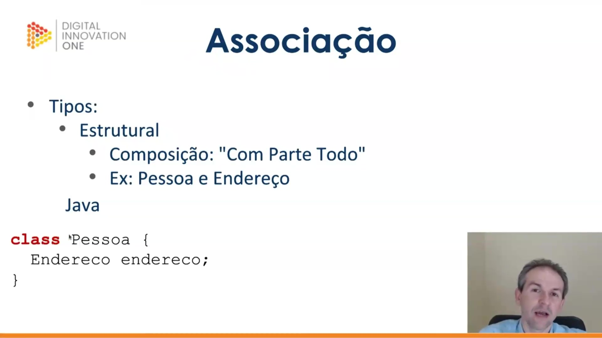
</p>

A implementação da composição no código é feita através da criação de um atributo na classe principal que referencia a classe que representa a "parte". No exemplo em Java, a classe `Pessoa` possui um atributo do tipo `Endereco`.

```java
class Pessoa {
    Endereco endereco;
}
```

<p align="center">
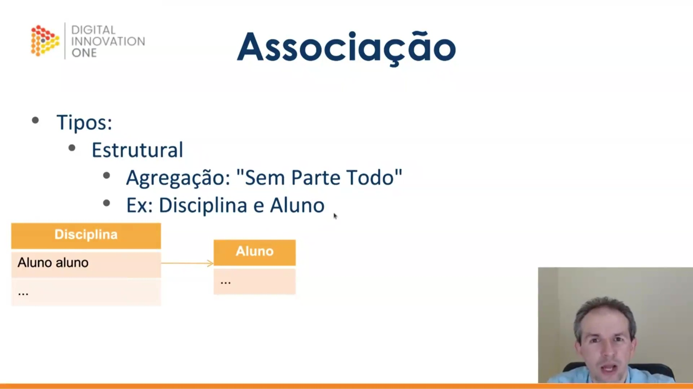
</p>

A **Agregação** funciona como o oposto da composição, sendo definida como uma relação "**Sem Parte-Todo**". Nela, a relação de dependência é fraca, o que significa que as partes podem existir de forma independente do todo.

Utilizando o exemplo de **Disciplina** e **Aluno**, percebe-se que, embora um aluno esteja vinculado a uma disciplina, a existência do aluno não depende dela. Se a disciplina de "Orientação a Objetos" for excluída do sistema, o objeto Aluno permanece ativo, pois ele pode estar vinculado a outras disciplinas ou simplesmente existir de forma autônoma na base de dados.

<p align="center">

</p>

Embora a **Agregação** e a **Composição** possuam conceitos distintos sobre o ciclo de vida dos objetos, a implementação técnica em linguagens como Java, C# ou Python é idêntica: ambas utilizam atributos de classe para estabelecer o vínculo.

A grande diferença não reside na sintaxe do código-fonte, mas sim na semântica e no comportamento do software durante a execução. Definir corretamente entre uma ou outra é crucial para modelar entidades do mundo real de forma fidedigna, garantindo que a gestão da memória e a persistência dos dados respeitem as regras de negócio.

<p align="center">
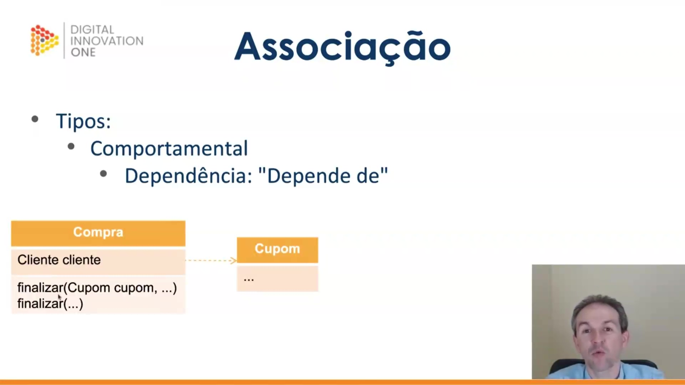
</p>

A **Dependência** é um tipo de associação **comportamental**, definida pela relação "**Depende de**". Diferente da estrutural, onde um objeto contém outro como atributo, na dependência o vínculo ocorre através dos métodos (comportamentos).

No exemplo da classe **Compra**, o método `finalizar` depende da existência de um objeto **Cupom** para realizar sua lógica, como calcular descontos ou validar a expiração. Aqui, a classe Compra não "possui" o Cupom de forma permanente, ela apenas o utiliza pontualmente para completar uma ação.

<p align="center">

</p>

Em termos de codificação, a dependência se manifesta quando uma classe recebe outra como parâmetro em um de seus métodos. No exemplo abaixo, a classe `Compra` utiliza a classe `Cupom` dentro da assinatura do método `finalizar`.

```java
class Compra {
    finalizar(Cupom cupom, ...) {
    }
}
```

<p align="center">
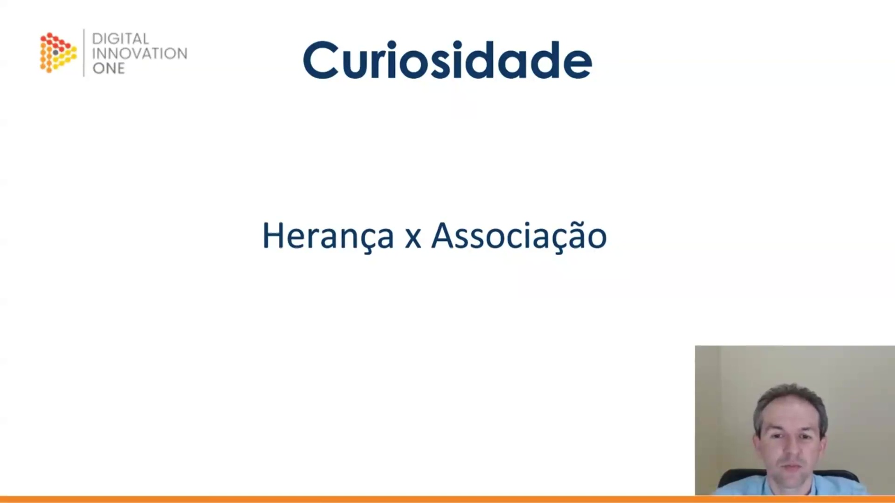
</p>

Ao comparar **Herança** e **Associação**, a principal diferença reside na rigidez versus flexibilidade. A herança define uma relação "é um" (subtipo) estabelecida em tempo de desenvolvimento, sendo muito mais rígida. Já a associação define uma relação "usa um", permitindo que os valores e vínculos sejam alterados dinamicamente durante a execução do software através de atributos ou métodos.

Para decidir qual utilizar, deve-se aplicar a "pergunta mágica":

* **Uma coisa É a outra?** Se for um subtipo, utiliza-se herança.
* **Uma coisa USA a outra?** Se não for um subtipo, mas precisar interagir com ela, utiliza-se associação.

<p align="center">
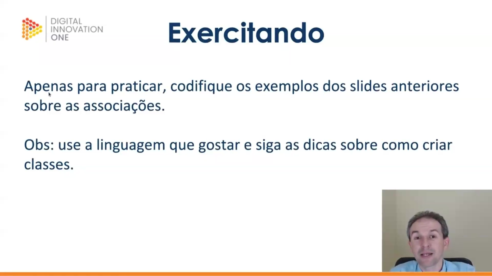
</p>

Para consolidar o conhecimento sobre associações (composição, agregação e dependência), é proposto um exercício prático de codificação. O objetivo é replicar os exemplos conceituais apresentados nos slides utilizando a linguagem de programação de sua preferência, seguindo as boas práticas de criação de classes e estruturação de atributos e métodos.      


## 🟩 Vídeo 24 - Associação - Exercício

<video width="60%" controls>
  <source src="000-Midia_e_Anexos/bootcamp_tqi_fullstack-modulo.06-curso.11-video_24.webm" type="video/webm">
    Seu navegador não suporta vídeo HTML5.
</video>

link do vídeo: https://web.dio.me/track/tqi-fullstack-developer/course/programacao-orientada-a-objetos/learning/2f60d3e7-07b4-4366-b159-532178bbfa24?autoplay=1

Este resumo explora as diferentes formas de conectar classes em um sistema, detalhando como objetos interagem e dependem uns dos outros, seja por uma relação de "posse" ou de "uso".

### Anotações

#### Associação Estrutural: Composição

<p align="center">
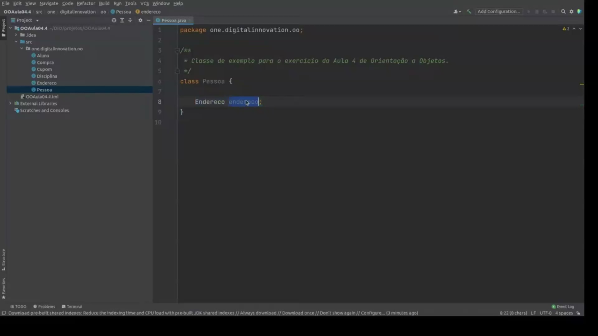
</p>

Nesta etapa, é apresentada a implementação de uma associação estrutural do tipo **composição**. O exemplo utiliza as classes `Pessoa` e `Endereco`, onde a existência do endereço está estritamente vinculada à existência da pessoa. No código, isso se materializa definindo a classe `Endereco` como um atributo dentro da classe `Pessoa`.

```java
package one.digitalinnovation.oo;

class Pessoa {
    Endereco endereco;
}
```

#### Definição da Classe Endereço

<p align="center">
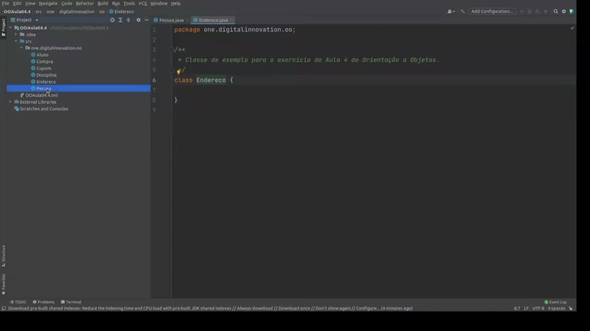
</p>

Para viabilizar a composição demonstrada anteriormente, define-se a classe `Endereco`. Embora o código dessa classe seja simples, sua relação com a classe `Pessoa` é o que define o conceito de negócio: se a pessoa deixar de existir, o endereço associado a ela nesta estrutura também deixa de existir.

```java
package one.digitalinnovation.oo;

class Endereco {
}
```

#### Associação Estrutural: Agregação

<p align="center">
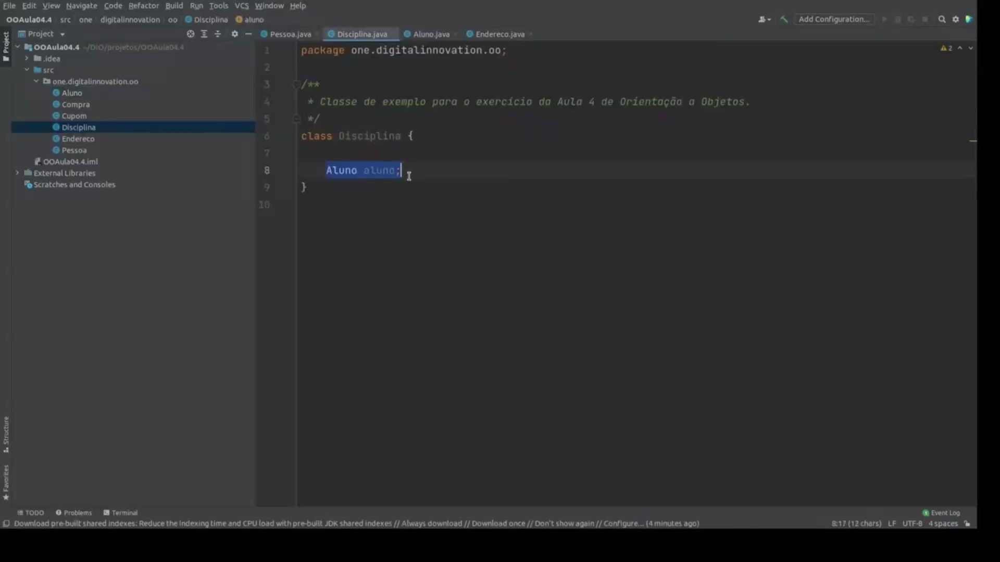
</p>

Aqui é demonstrada a **agregação** utilizando as classes `Disciplina` e `Aluno`. Diferente da composição, na agregação o objeto associado pode existir independentemente do objeto principal. No exemplo, um `Aluno` pode estar vinculado a uma `Disciplina`, mas se a disciplina for excluída, o aluno permanece existindo no sistema, podendo estar vinculado a outras disciplinas.

Note que, embora o conceito semântico seja diferente da composição, a implementação técnica no Java permanece idêntica, utilizando um atributo para referenciar a outra classe.

```java
package one.digitalinnovation.oo;

class Disciplina {
    Aluno aluno;
}
```

#### Associação Comportamental: Dependência

<p align="center">
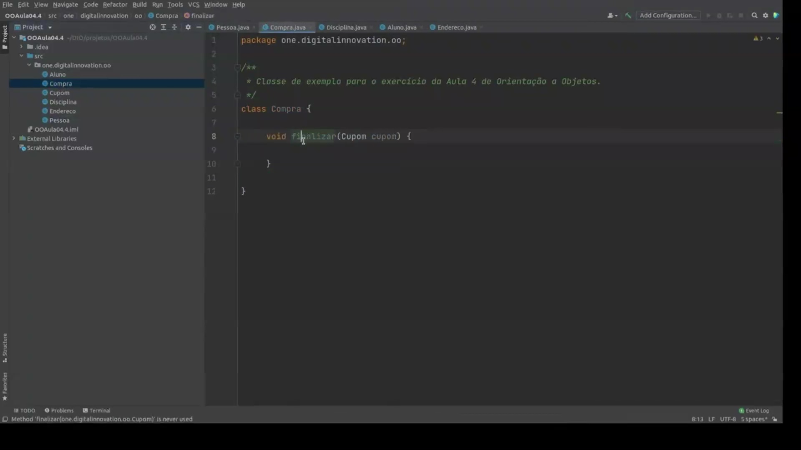
</p>

A associação **comportamental**, ou **dependência**, é exemplificada através da classe `Compra`. Diferente das associações estruturais onde uma classe é atributo da outra, aqui a relação ocorre dentro de um método. O método `finalizar` depende da classe `Cupom` para executar sua lógica, recebendo-a como um parâmetro.

```java
package one.digitalinnovation.oo;

class Compra {
    void finalizar(Cupom cupom) {
    }
}
```

#### Entidade de Dependência: Cupom

<p align="center">
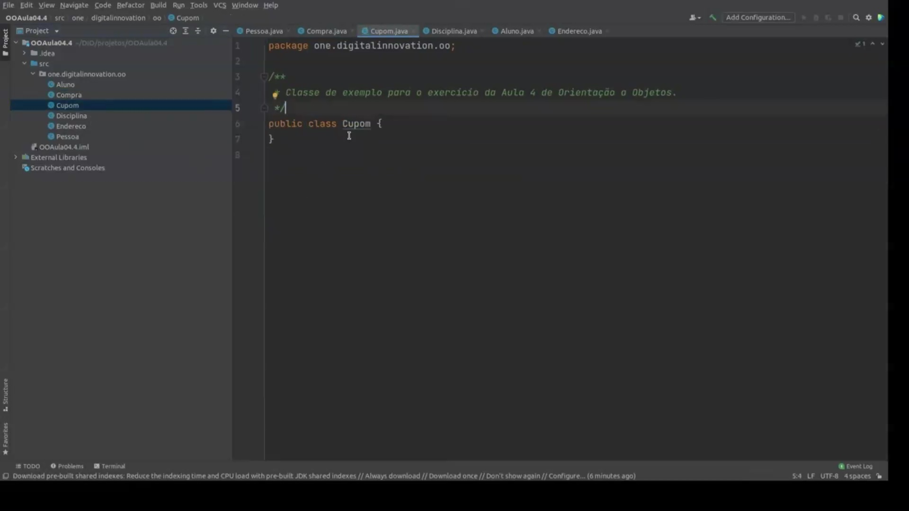
</p>

A classe `Cupom` é apresentada como a entidade que serve de suporte para a dependência demonstrada na classe `Compra`. Ela representa o objeto que é passado por parâmetro, evidenciando que a classe de negócio (Compra) necessita desta classe específica apenas para o momento da execução de um comportamento específico (finalizar).

```java
package one.digitalinnovation.oo;

public class Cupom {
}
```

## 🟩 Vídeo 25 - Interface - Conceito

<video width="60%" controls>
  <source src="000-Midia_e_Anexos/bootcamp_tqi_fullstack-modulo.06-curso.11-video_25.webm" type="video/webm">
    Seu navegador não suporta vídeo HTML5.
</video>

link do vídeo: https://web.dio.me/track/tqi-fullstack-developer/course/programacao-orientada-a-objetos/learning/41b7ac6d-1b37-4a46-88d6-f2623326dea6?autoplay=1

Este guia explora o conceito de Interfaces, o último pilar relacional da POO discutido na série, após Herança e Associação. A interface é apresentada como um "contrato" fundamental que garante a consistência entre diferentes partes de um software.

### Anotações

<p align="center">
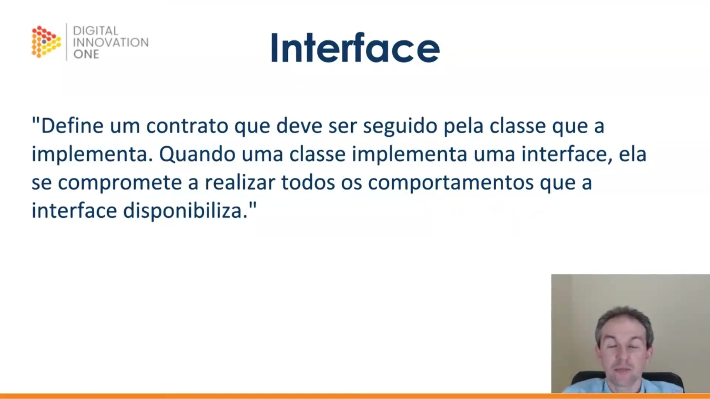
</p>

Uma **interface** funciona como um **contrato** formal no desenvolvimento de software. Ela define um conjunto de comportamentos que uma classe deve obrigatoriamente seguir ao implementá-la. Ao assumir esse contrato, a classe se compromete a realizar todos os comportamentos que a interface disponibiliza, garantindo uma padronização na comunicação entre diferentes componentes do sistema.

<p align="center">

</p>

A implementação de interfaces varia conforme a sintaxe de cada linguagem de programação. Em **Java**, utiliza-se a palavra-chave `interface` para a definição e `implements` para que uma classe a utilize. No **C#**, a definição também usa `interface`, mas a implementação na classe é feita através do símbolo de dois pontos (`:`). Já em **Python**, o conceito de interface nativa não existe da mesma forma.

```java
[cite_start]// Exemplo em Java [cite: 7, 8, 15]
interface A {
}

class B implements A {
}
```

```csharp
[cite_start]// Exemplo em C# [cite: 11, 12, 15]
interface A {
}

class B : A {
}
```

<p align="center">
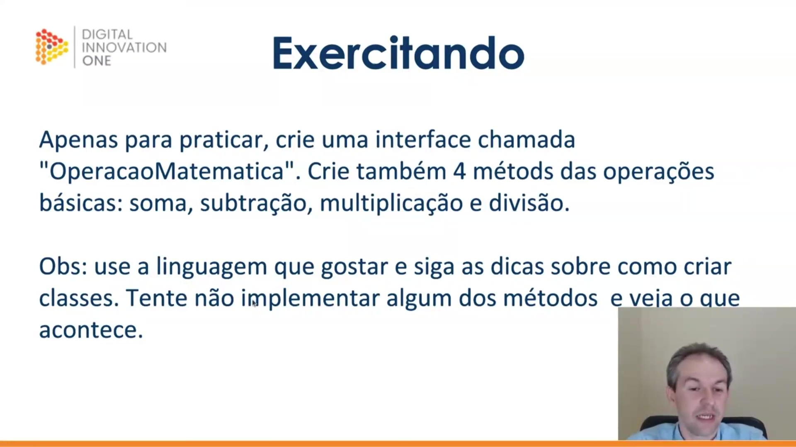
</p>

Para praticar a fixação do conceito, propõe-se o exercício de criar uma interface denominada `OperacaoMatematica`. Esta interface deve conter as assinaturas para as quatro operações básicas: soma, subtração, multiplicação e divisão. O objetivo é utilizar a linguagem de preferência seguindo as dicas de criação de classes e observar o que acontece ao tentar não implementar algum dos métodos exigidos pelo contrato.

<p align="center">
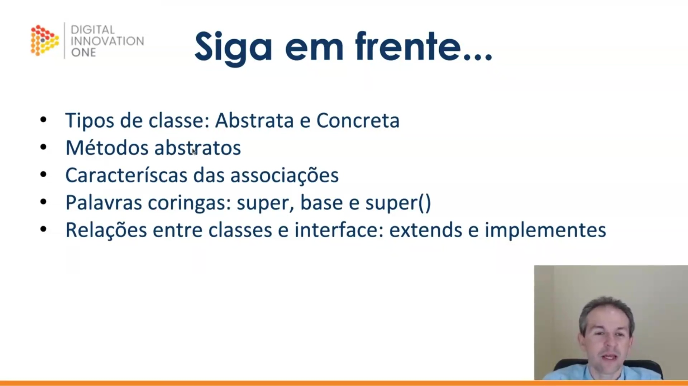
</p>

Para dar continuidade aos estudos em Orientação a Objetos, é fundamental explorar tópicos avançados que complementam o uso de interfaces e herança:

* **Tipos de classe:** Entender as diferenças entre classes Abstratas e Concretas.
* **Métodos abstratos:** Estudar a aplicação de métodos sem implementação prévia.
* **Características das associações:** Aprofundar-se nas peculiaridades das relações entre objetos.
* **Palavras coringas:** Aprender o uso de `super`, `base` e `super()` para manipulação de hierarquias.
* **Relações entre classes e interface:** Compreender as distinções práticas entre o uso de `extends` e `implements`.      


## 🟩 Vídeo 26 - Interface - Exercício

<video width="60%" controls>
  <source src="000-Midia_e_Anexos/bootcamp_tqi_fullstack-modulo.06-curso.11-video_26.webm" type="video/webm">
    Seu navegador não suporta vídeo HTML5.
</video>

link do vídeo: https://web.dio.me/track/tqi-fullstack-developer/course/programacao-orientada-a-objetos/learning/4a64f758-df6a-4ec6-bfe0-d69430f9eb0c?autoplay=1

Este guia resume a aula prática sobre a criação e implementação de interfaces em Java. O foco é entender como as interfaces funcionam como um "contrato" que obriga as classes a seguirem uma estrutura pré-definida, garantindo consistência e abstração no desenvolvimento de software.

### Anotações

<p align="center">
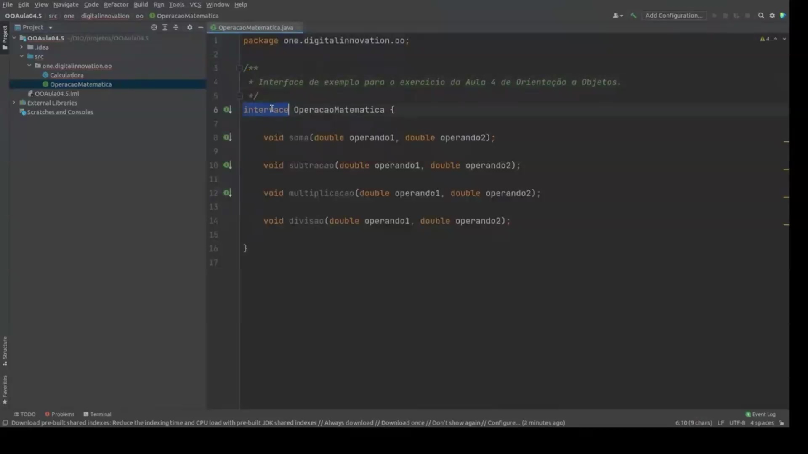
</p>

Nesta etapa, é apresentada a criação de uma **interface** em Java. Diferente das classes convencionais, uma interface funciona como um contrato que define apenas as assinaturas dos métodos, sem possuir um corpo de implementação (abertura e fechamento de chaves). A interface `OperacaoMatematica` estabelece quatro operações básicas: soma, subtração, multiplicação e divisão.

Os métodos são declarados de forma simplificada, contendo o tipo de retorno (`void`), o nome e os parâmetros necessários, terminando obrigatoriamente com ponto e vírgula. Essa estrutura define o que uma classe deve fazer, deixando o "como fazer" para a classe que decidir implementá-la.

```java
package one.digitalinnovation.oo;

/**
 * Interface de exemplo para o exercício da Aula 4 de Orientação a Objetos.
 */
interface OperacaoMatematica {

    void soma(double operando1, double operando2);

    void subtracao(double operando1, double operando2);

    void multiplicacao(double operando1, double operando2);

    void divisao(double operando1, double operando2);

}

```

<p align="center">
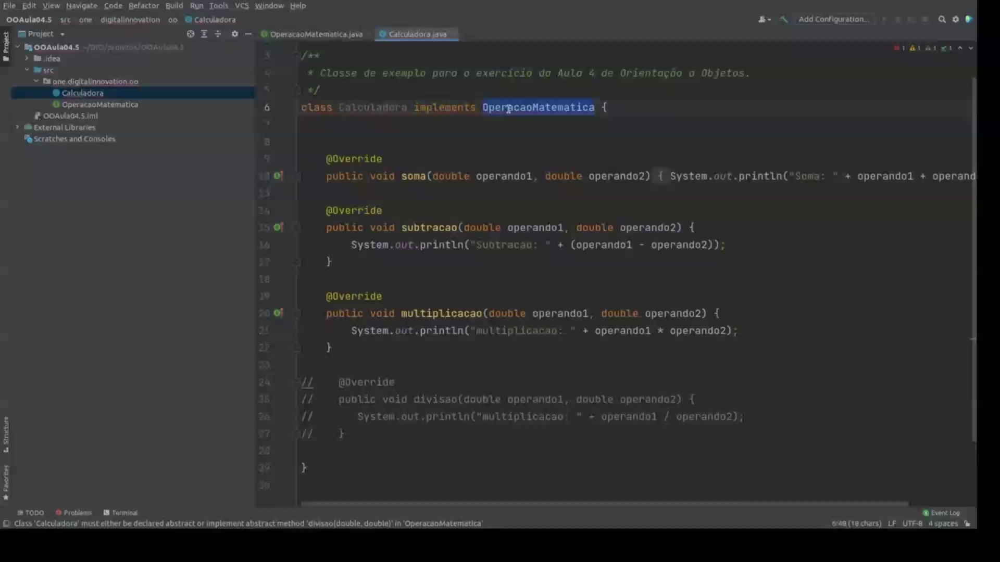
</p>

Aqui, observa-se a aplicação prática da interface através da classe `Calculadora`, que utiliza a palavra reservada `implements`. Ao implementar `OperacaoMatematica`, a classe assume a responsabilidade de fornecer o código funcional para todos os métodos declarados na interface, utilizando a anotação `@Override` para garantir a sobrescrita correta.

O exemplo destaca o comportamento do compilador quando um método obrigatório é omitido. Ao comentar o método `divisao`, a IDE exibe um erro informando que a classe deve implementar todos os métodos abstratos da interface ou ser declarada como abstrata. Isso reforça a segurança do código, garantindo que qualquer objeto do tipo `OperacaoMatematica` possua todas as funcionalidades previstas no contrato.

```java
class Calculadora implements OperacaoMatematica {

    @Override
    public void soma(double operando1, double operando2) {
        System.out.println("Soma: " + (operando1 + operando2));
    }

    @Override
    public void subtracao(double operando1, double operando2) {
        System.out.println("subtracao: " + (operando1 - operando2));
    }

    @Override
    public void multiplicacao(double operando1, double operando2) {
        System.out.println("multiplicacao: " + (operando1 * operando2));
    }

    // O erro ocorre se o método abaixo não for implementado:
    // @Override
    // public void divisao(double operando1, double operando2) {
    //     System.out.println("divisao: " + (operando1 / operando2));
    // }

}

```


# Parte 6 - A Organização de Pacotes e Visibilidades

## 🟩 Vídeo 27 - Pacotes - Conceitos

<video width="60%" controls>
  <source src="000-Midia_e_Anexos/bootcamp_tqi_fullstack-modulo.06-curso.11-video_27.webm" type="video/webm">
    Seu navegador não suporta vídeo HTML5.
</video>

link do vídeo: https://web.dio.me/track/tqi-fullstack-developer/course/programacao-orientada-a-objetos/learning/635817c5-c96f-450d-976e-1235f37f5821?autoplay=1

Este guia resume os conceitos fundamentais para "colocar ordem na casa" em projetos de software, explorando como os pacotes ajudam a separar responsabilidades e como diferentes linguagens (Java, C# e Python) lidam com essa estrutura.

### Anotações

<p align="center">

</p>

Esta aula marca o início do módulo sobre a organização dentro da orientação a objetos. O foco principal é compreender como estruturar o desenvolvimento de software para manter a ordem e o controle sobre as classes criadas.

<p align="center">
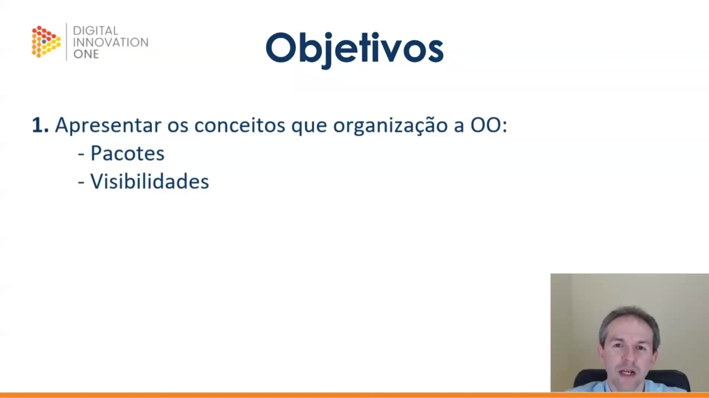
</p>

Os objetivos centrais desta etapa consistem em apresentar os mecanismos que permitem "colocar ordem na casa". Para isso, serão explorados dois conceitos fundamentais:

* **Pacotes:** Ferramentas de organização para agrupar elementos relacionados.
* **Visibilidades:** Definições de quem pode acessar ou enxergar determinados componentes dentro do sistema.

<p align="center">
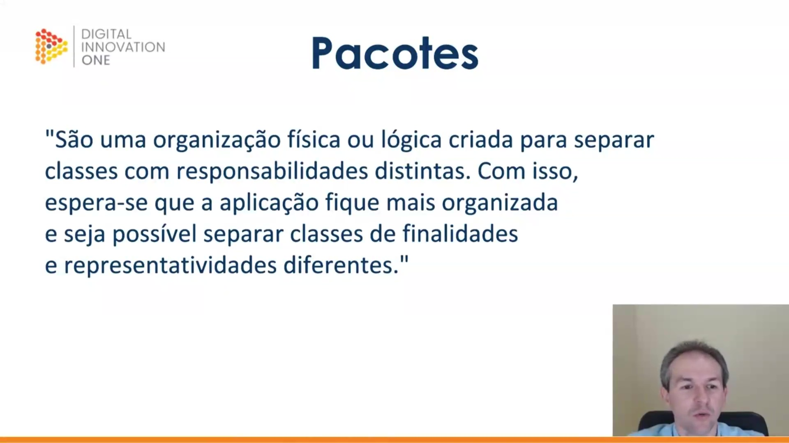
</p>

Os pacotes são definidos como uma organização física ou lógica estabelecida para separar classes que possuem responsabilidades distintas. O intuito é tornar a aplicação mais organizada, permitindo a separação de classes com finalidades e representatividades diferentes, como entidades de negócio, classes utilitárias e componentes de integração.

Fisicamente, os pacotes costumam se traduzir em pastas e subpastas no sistema operacional. Logicamente, eles funcionam como divisões virtuais que ajudam a gerenciar o software mesmo quando muitas classes compartilham o mesmo espaço físico.

<p align="center">
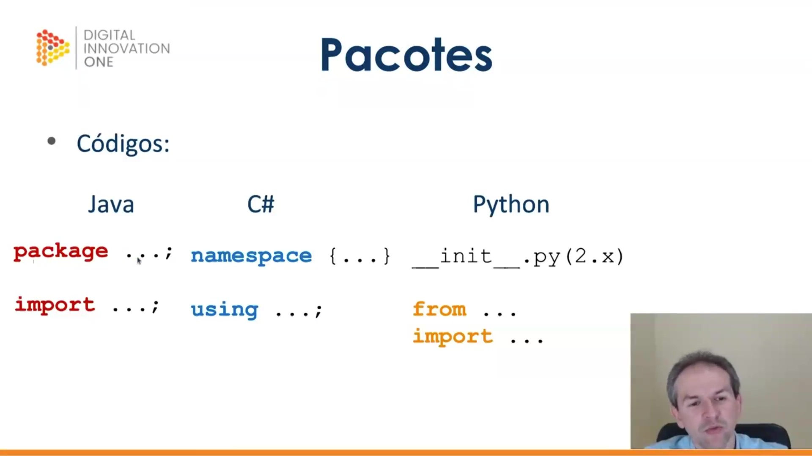
</p>

A implementação de pacotes varia conforme a linguagem de programação, embora o conceito permaneça constante. Abaixo estão as palavras-chave e estruturas utilizadas em Java, C# e Python:

```java
// Em Java
package ...;
import ...;

```

```csharp
// Em C#
namespace {...}
using ...;

```

```python
# Em Python
# Versão 2.x exigia o arquivo __init__.py nas pastas
from ... import ...
import ...

```

Em Java e C#, a separação por pacotes (ou namespaces) exige a importação explícita para que uma classe consiga "enxergar" outra em uma localização diferente. No Python, a partir da versão 3.0, a necessidade do arquivo `__init__.py` tornou-se opcional, mas as instruções `from` e `import` continuam sendo as ferramentas para gerenciar essa visibilidade.

<p align="center">
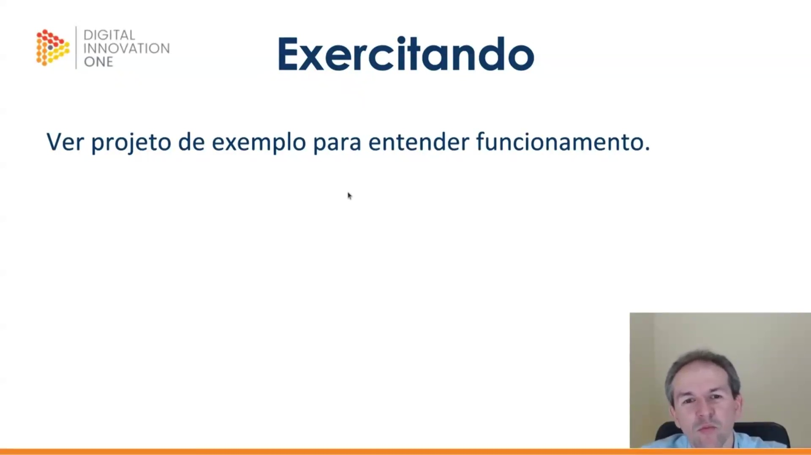
</p>

Para consolidar o conhecimento, a etapa final consiste na análise de um projeto prático de exemplo. O objetivo é observar como a criação de pacotes impacta diretamente na visibilidade das classes e na estrutura geral da aplicação, utilizando o Java como base para a demonstração.


## 🟩 Vídeo 28 - Pacotes - Exercício

<video width="60%" controls>
  <source src="000-Midia_e_Anexos/bootcamp_tqi_fullstack-modulo.06-curso.11-video_28.webm" type="video/webm">
    Seu navegador não suporta vídeo HTML5.
</video>

link do vídeo: https://web.dio.me/track/tqi-fullstack-developer/course/programacao-orientada-a-objetos/learning/e5ec1fb5-26a6-42ff-a688-368f7aeba156?autoplay=1

Este guia explora a relação prática entre a declaração de pacotes no código Java e a organização física de pastas no sistema operacional, demonstrando como o gerenciamento de dependências internas funciona através de importações.

### Anotações

<p align="center">
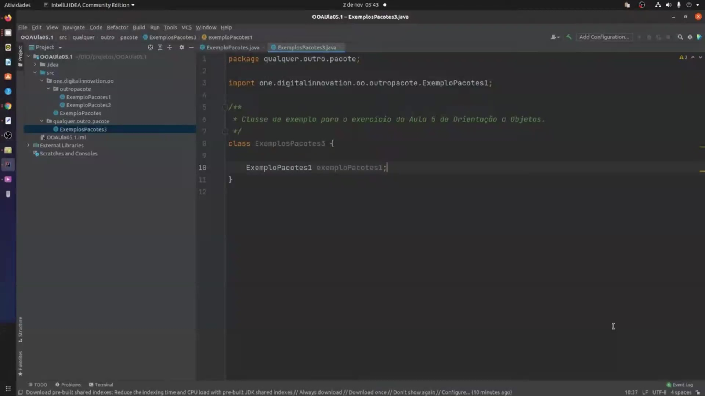
</p>

Nesta etapa, exploramos a organização de um projeto Java utilizando a IDE IntelliJ IDEA para compreender o funcionamento prático dos **pacotes** (packages). Em Java, a declaração de um pacote no topo do arquivo não é apenas uma classificação lógica, mas reflete diretamente a estrutura de diretórios no sistema operacional.

Como observado na interface do projeto, as classes são organizadas em uma hierarquia de pastas. Por exemplo, a classe `ExemploPacotes` está situada em um nível específico, enquanto a classe `ExemploPacotes1` reside em um subpacote (um nível mais profundo na árvore de diretórios). Para que uma classe consiga utilizar outra que está em um pacote diferente ou em um nível abaixo, é obrigatório o uso do comando `import`.

O exemplo prático demonstra a classe `ExemplosPacotes3` pertencente ao pacote `qualquer.outro.pacote`, que precisa importar explicitamente a classe `ExemploPacotes1` para utilizá-la como atributo, já que elas não compartilham o mesmo nível hierárquico.

```java
package qualquer.outro.pacote;

import one.digitalinnovation.oo.outropacote.ExemploPacotes1;

class ExemplosPacotes {
    
    ExemploPacotes1 exemploPacotes1;
    
}
```

Essa estrutura de pastas física é uma característica marcante do Java (diferente de linguagens como C#, onde a separação pode ser puramente lógica), facilitando a organização e o encapsulamento dos componentes do sistema.


## 🟩 Vídeo 29 - Visibilidades - Conceitos

<video width="60%" controls>
  <source src="000-Midia_e_Anexos/bootcamp_tqi_fullstack-modulo.06-curso.11-video_29.webm" type="video/webm">
    Seu navegador não suporta vídeo HTML5.
</video>

link do vídeo: https://web.dio.me/track/tqi-fullstack-developer/course/programacao-orientada-a-objetos/learning/03eb0391-d627-4166-8604-79db356daeef?autoplay=1

Este resumo aborda o papel fundamental dos modificadores de acesso na estruturação de softwares, detalhando como eles controlam a exposição de classes, atributos e métodos, e por que são essenciais para o encapsulamento.

### Anotações

<p align="center">
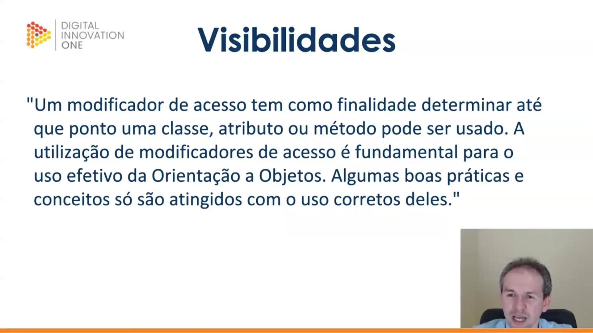
</p>

Os **modificadores de acesso**, também conhecidos como visibilidades, têm como objetivo principal determinar o nível de exposição de uma classe, atributo ou método dentro de um sistema. O uso correto desses modificadores é um pilar fundamental para a aplicação efetiva da Orientação a Objetos, permitindo que boas práticas de design e segurança de dados sejam implementadas.

Embora a visibilidade possa ser aplicada a classes, atributos e métodos, seu uso é mais frequente em atributos e métodos. No caso das classes, a vasta maioria é definida como pública, exceto em cenários específicos envolvendo classes internas (inner classes).

<p align="center">
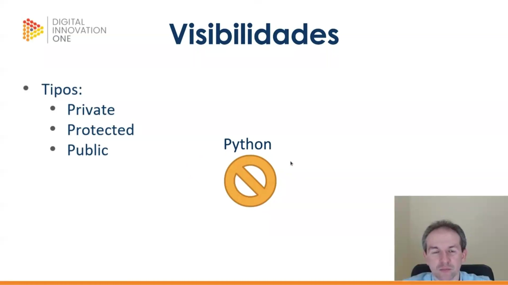
</p>

Existem três tipos principais de visibilidades providas pela teoria da Orientação a Objetos: **Private**, **Protected** e **Public**.

Vale ressaltar que linguagens específicas podem implementar modificadores adicionais para atender necessidades próprias de arquitetura, como o modificador *default* no Java ou o *internal* no C#. Já o Python adota uma filosofia diferente, onde, por padrão, todos os elementos são públicos. Embora existam convenções em Python para sinalizar que um membro deve ser tratado como privado, a linguagem apenas sugere essa restrição sem impô-la rigidamente como ocorre em outras linguagens.

<p align="center">
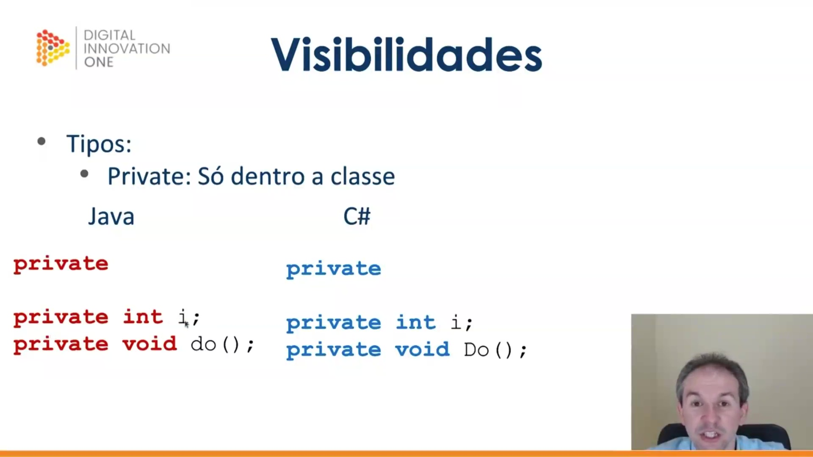
</p>

A visibilidade **Private** é a mais restritiva de todas. Quando um atributo ou método é definido como privado, ele só pode ser acessado ou utilizado de dentro da própria classe onde foi criado, permanecendo invisível para qualquer outra parte do sistema.

Abaixo, a comparação da sintaxe para declaração de membros privados:

**Java**

```java
private int i;
private void do();
```

**C#**

```csharp
private int i;
private void Do();
```

<p align="center">
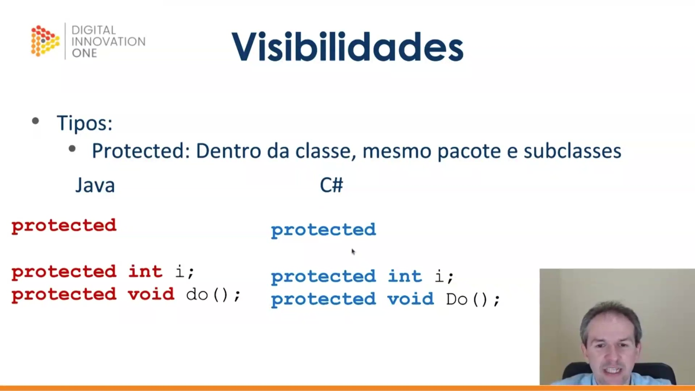
</p>

A visibilidade **Protected** (protegido) oferece um nível intermediário de acesso. Os membros marcados como protegidos são visíveis dentro da própria classe, por outras classes que pertençam ao mesmo pacote e também por suas subclasses (através do mecanismo de herança), mesmo que estas estejam em pacotes diferentes.

Abaixo, a comparação da sintaxe para declaração de membros protegidos:

**Java**

```java
protected int i;
protected void do();
```

**C#**

```csharp
protected int i;
protected void Do();
```

<p align="center">
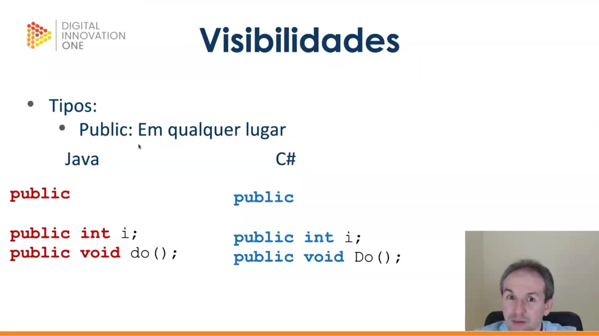
</p>

A visibilidade **Public** é a mais aberta de todas. Um atributo ou método definido como público pode ser acessado de qualquer lugar da aplicação, sem restrições de pacote ou hierarquia de classes.

Abaixo, a comparação da sintaxe para declaração de membros públicos:

**Java**

```java
public int i;
public void do();
```

**C#**

```csharp
public int i;
public void Do();
```

<p align="center">
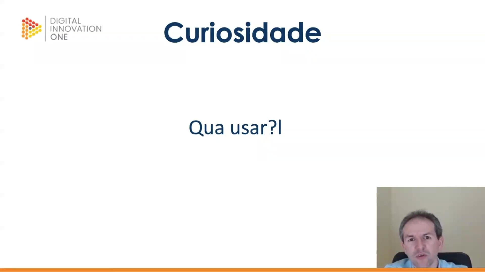
</p>

A escolha de qual modificador utilizar depende da finalidade de cada componente. Não se deve pensar que a visibilidade pública é "melhor" por permitir acesso total, ou que a privada é "ruim" por ser restritiva.

O segredo reside no **Encapsulamento**:

* **Atributos** geralmente devem ser **privados** para garantir a proteção dos dados.
* **Métodos** que permitem a comunicação entre diferentes partes do software costumam ser **públicos** ou **protegidos**.

O desenvolvimento de um software robusto exige o uso conjunto dessas visibilidades para equilibrar proteção e funcionalidade.

<p align="center">

</p>

Para consolidar esses conceitos, recomenda-se a análise prática através de projetos de exemplo. Observar como as classes interagem quando os modificadores são alterados ajuda a tornar os impactos de cada nível de visibilidade mais palpáveis e compreensíveis no fluxo de desenvolvimento.      


## 🟩 Vídeo 30 - Visibilidades - Exercício

<video width="60%" controls>
  <source src="000-Midia_e_Anexos/bootcamp_tqi_fullstack-modulo.06-curso.11-video_30.webm" type="video/webm">
    Seu navegador não suporta vídeo HTML5.
</video>

link do vídeo: https://web.dio.me/track/tqi-fullstack-developer/course/programacao-orientada-a-objetos/learning/4d6fc777-c3e8-4f18-b728-0c0e0927b242?autoplay=1

## 🟩 Vídeo 31 - Conclusão

<video width="60%" controls>
  <source src="000-Midia_e_Anexos/bootcamp_tqi_fullstack-modulo.06-curso.11-video_31.webm" type="video/webm">
    Seu navegador não suporta vídeo HTML5.
</video>

link do vídeo:


##  Materiais de Apoio

# Certificado: 

- Link na plataforma: 
- Certificado em pdf: