# Instrutor

- Thiago Leite e Carvalho (Senior Java Developer and Software Engineer | Java Tech Lead | University Professor | Writer | Speaker | Instructor)
- Contato Linkedin: / [thiago-leite-e-carvalho-1b337b127](https://www.linkedin.com/in/thiago-leite-e-carvalho-1b337b127/)

# Parte 1 - Introdução

## 🟩 Vídeo 01 - Apresentação inicial

<video width="60%" controls>
  <source src="000-Midia_e_Anexos/bootcamp_tqi_fullstack-modulo.06-curso.11-video_01.webm" type="video/webm">
    Seu navegador não suporta vídeo HTML5.
</video>

link do vídeo: https://web.dio.me/track/tqi-fullstack-developer/course/programacao-orientada-a-objetos/learning/ff0c41a5-8adc-496c-8ff7-7ae1f83ffa49?autoplay=1

Este curso é uma introdução abrangente aos conceitos fundamentais da Orientação a Objetos (OO), ministrado por Thiago Leite, um desenvolvedor com vasta experiência no mercado e na academia. O conteúdo é baseado em anos de ensino universitário e na prática de desenvolvimento de sistemas governamentais de alta complexidade.

### Anotações

<p align="center">
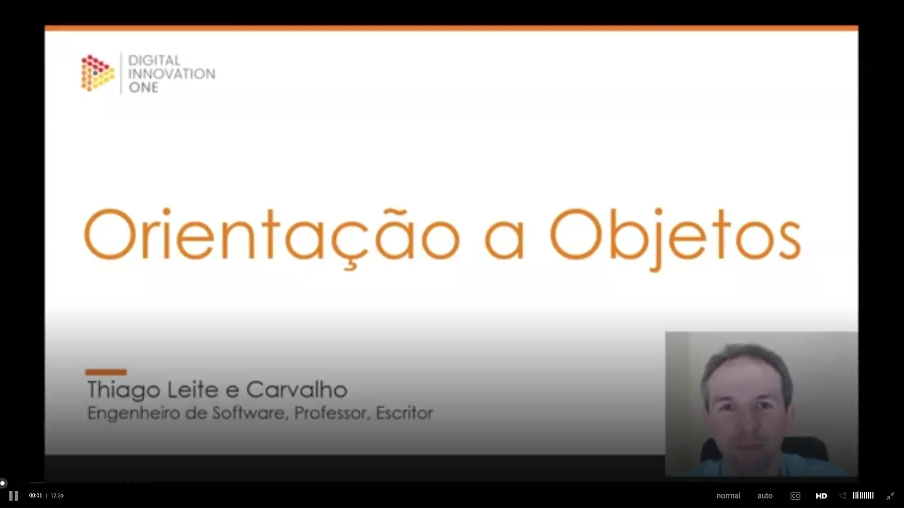
</p>

#### Introdução à Orientação a Objetos

Este curso é focado nos fundamentos da **Orientação a Objetos (OO)**. O treinamento é ministrado por **Thiago Leite e Carvalho**, que atua como Engenheiro de Software, professor e escritor. Ele traz sua experiência acadêmica e profissional para guiar o aprendizado sobre como modelar sistemas utilizando esse paradigma.

---

<p align="center">
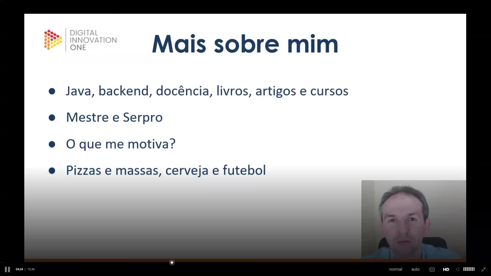
</p>

#### Sobre o Instrutor

Thiago Leite possui uma trajetória de 18 anos no desenvolvimento de software, com especialidade em **Java** e sistemas **backend**.

* **Experiência Acadêmica:** É mestre em Engenharia de Software e já lecionou diversas disciplinas universitárias, incluindo Orientação a Objetos e Estrutura de Dados.
* **Atuação Profissional:** Atualmente trabalha no **SERPRO**, desenvolvendo soluções tecnológicas para o governo federal brasileiro.
* **Motivação e Hobbies:** É motivado por novos desafios e projetos dinâmicos. Fora do trabalho, dedica-se à culinária (massas e pizzas), aprecia cervejas artesanais e torce pelo Flamengo.

---

<p align="center">
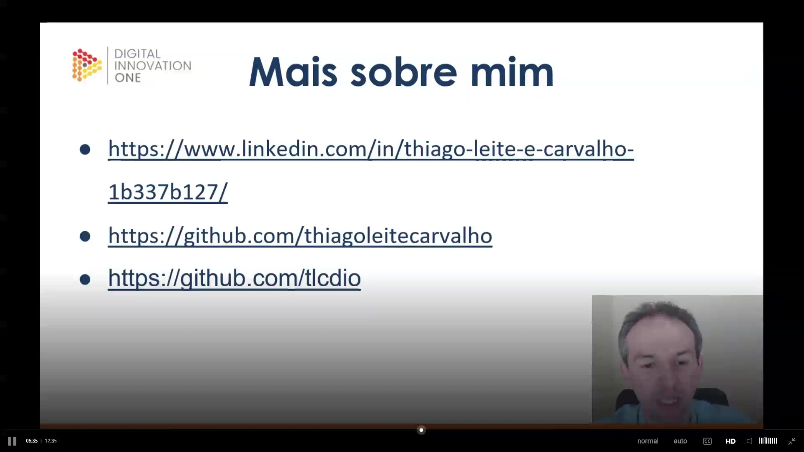
</p>

#### Canais de Contato e Portfólio

Para acompanhar o trabalho do instrutor e acessar materiais complementares, estão disponíveis os seguintes links:

* **LinkedIn:** Perfil para conexões profissionais, onde compartilha artigos e conteúdos sobre a rotina de desenvolvimento.
* **GitHub Pessoal:** Espaço onde disponibiliza componentes e códigos referentes aos seus artigos publicados.
* **GitHub DIO (tlcdio):** Repositório exclusivo para os exemplos práticos desenvolvidos especificamente para os cursos da Digital Innovation One.

## 🟩 Vídeo 02 - Objetivos do curso

<video width="60%" controls>
  <source src="000-Midia_e_Anexos/bootcamp_tqi_fullstack-modulo.06-curso.11-video_02.webm" type="video/webm">
    Seu navegador não suporta vídeo HTML5.
</video>

link do vídeo: https://web.dio.me/track/tqi-fullstack-developer/course/programacao-orientada-a-objetos/learning/0790beac-ac26-4331-bd7f-a523ee37b6b1?autoplay=1

Este documento resume os objetivos, a estrutura e os requisitos do curso de POO, baseado na experiência de 9 anos de docência do instrutor e em sua obra publicada pela editora Casa do Código.

### Anotações

#### Introdução ao Curso de Orientação a Objetos

<p align="center">
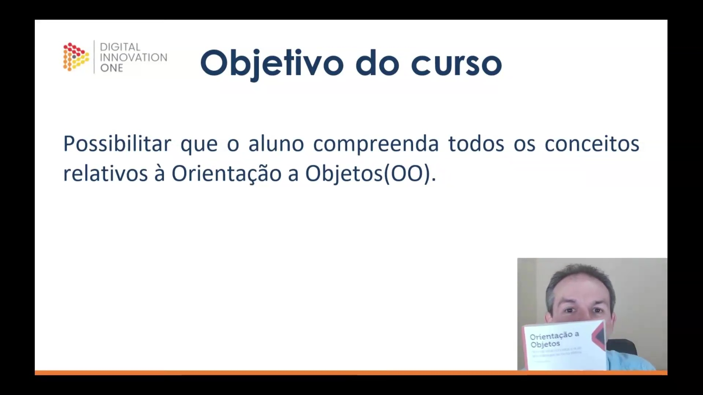
</p>

O curso tem como objetivo principal capacitar o aluno a compreender todos os conceitos fundamentais da **Orientação a Objetos (OO)**. O conteúdo é fundamentado no livro do instrutor publicado pela editora Casa do Código, que condensa nove anos de experiência no ensino dessa disciplina. O material busca sanar as dúvidas mais comuns de iniciantes e profissionais, oferecendo uma base sólida para quem deseja dominar este paradigma de programação.

#### Percurso do Aprendizado (Parte 1)

<p align="center">
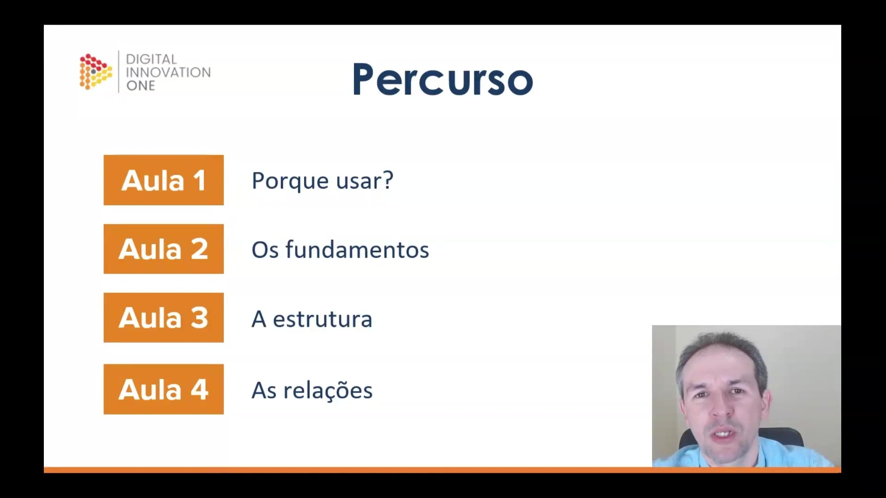
</p>

A estrutura do curso foi organizada para cobrir os pontos essenciais da Orientação a Objetos de forma didática. O percurso inicial está dividido em quatro aulas fundamentais:

* **Aula 1:** Justificativa sobre a importância e o porquê de utilizar a OO.
* **Aula 2:** Apresentação dos fundamentos e pilares que sustentam o paradigma.
* **Aula 3:** Exploração das estruturas básicas necessárias para o desenvolvimento.
* **Aula 4:** Estudo das relações existentes entre os conceitos de Orientação a Objetos.

#### Percurso do Aprendizado (Parte 2)

<p align="center">
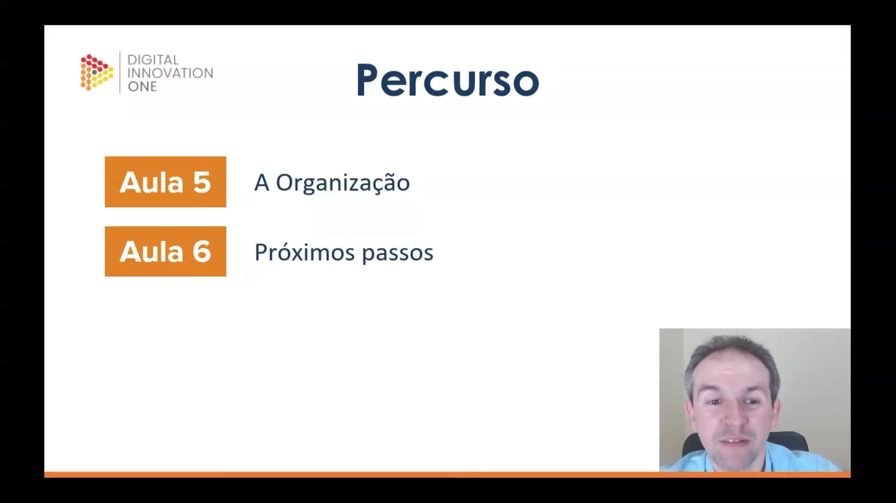
</p>

Dando continuidade ao cronograma, o curso aborda a organização e o encerramento do conteúdo básico:

* **Aula 5:** Foco na organização e em conceitos organizacionais que otimizam o trabalho com objetos.
* **Aula 6:** Orientações sobre os próximos passos, indicando caminhos e tópicos avançados para quem deseja aprofundar o conhecimento além dos conceitos básicos apresentados.

#### Requisitos e Ferramentas

<p align="center">
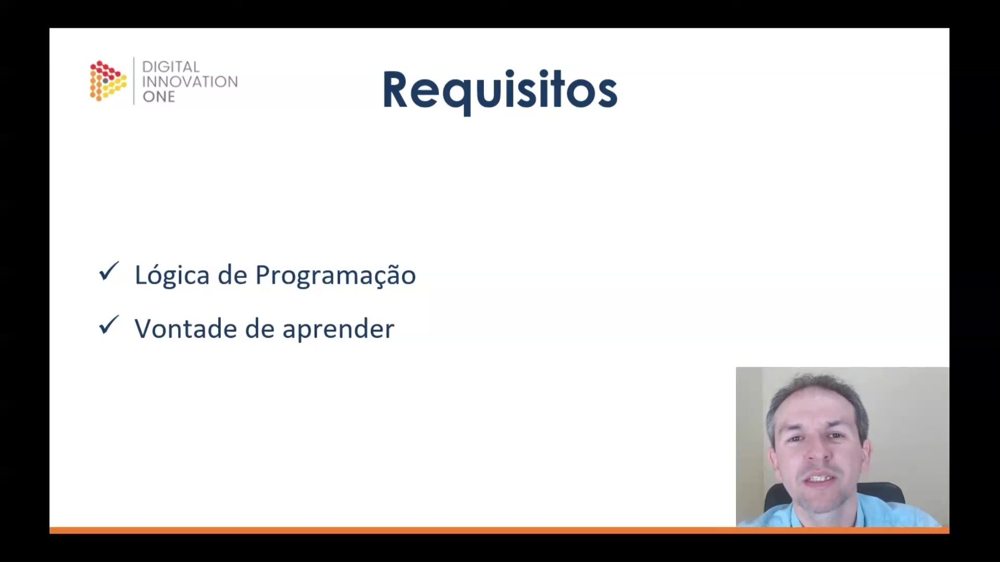
</p>

Para um bom aproveitamento das aulas, são necessários dois requisitos principais:

1. **Lógica de Programação:** É fundamental que o aluno já possua uma base prévia em lógica, obtida através de cursos anteriores ou estudos autodidatas.
2. **Vontade de aprender:** A dedicação é essencial para absorver a teoria e praticar os conceitos.

Embora não seja obrigatório, recomenda-se familiaridade com linguagens como Java, C# ou Python. Durante o curso, os exemplos práticos serão demonstrados utilizando **Java 11** e a IDE **IntelliJ**.


# Parte 2 - Por que usar?

## 🟩 Vídeo 03 - Por que usar?

<video width="60%" controls>
  <source src="000-Midia_e_Anexos/bootcamp_tqi_fullstack-modulo.06-curso.11-video_03.webm" type="video/webm">
    Seu navegador não suporta vídeo HTML5.
</video>

link do vídeo: https://web.dio.me/track/tqi-fullstack-developer/course/programacao-orientada-a-objetos/learning/266d45df-69ea-4692-b460-925fa49cb7bb?autoplay=1


Este guia explora os fundamentos da POO, comparando-a com o paradigma estruturado e destacando por que ela se tornou o padrão da indústria para o desenvolvimento de softwares complexos.

### Anotações

<p align="center">
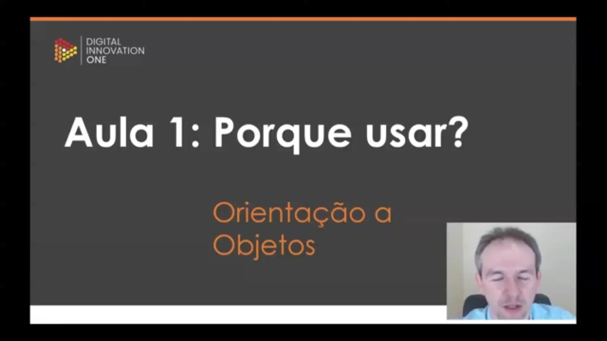
</p>

Esta aula inicial aborda os fundamentos da **Orientação a Objetos (OO)**, focando em compreender as razões pelas quais este paradigma é amplamente utilizado no desenvolvimento de software moderno. O objetivo é estabelecer uma base conceitual sólida antes de aprofundar na prática da programação.

<p align="center">
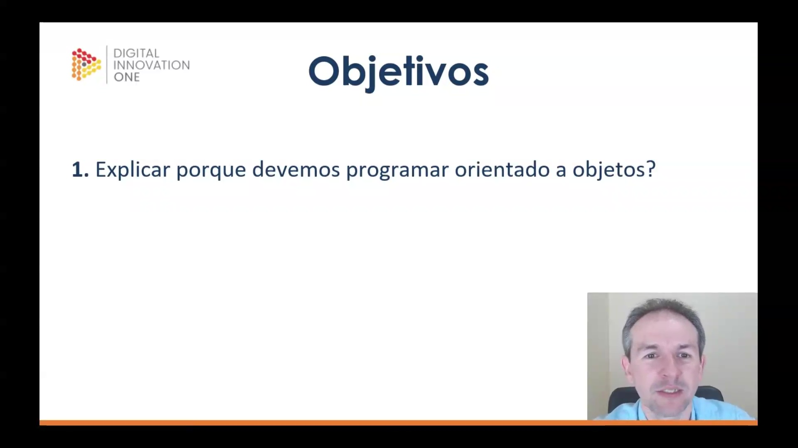
</p>

O foco central desta etapa é explicar a importância de programar utilizando a orientação a objetos. Para isso, será estabelecido um comparativo direto com o **Paradigma Estruturado (PE)**, que era o modelo predominante antes da ascensão da OO e que possui representantes de peso na história da computação, como a linguagem C (utilizada na construção de sistemas como Linux e Windows).

<p align="center">
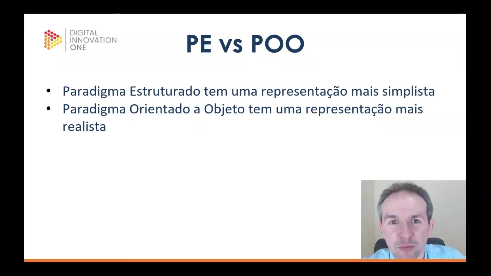
</p>

#### PE vs POO: Realismo e Abstração

Uma das distinções fundamentais entre os paradigmas reside na forma como representam o mundo:

* **Paradigma Estruturado (PE):** Possui uma representação mais **simplista**, muitas vezes limitada pelos mecanismos técnicos da linguagem.
* **Paradigma Orientado a Objetos (POO):** Oferece uma representação mais **realista**. Graças a mecanismos mais avançados, a POO consegue transpor conceitos do mundo real para o código de forma fiel.

<p align="center">
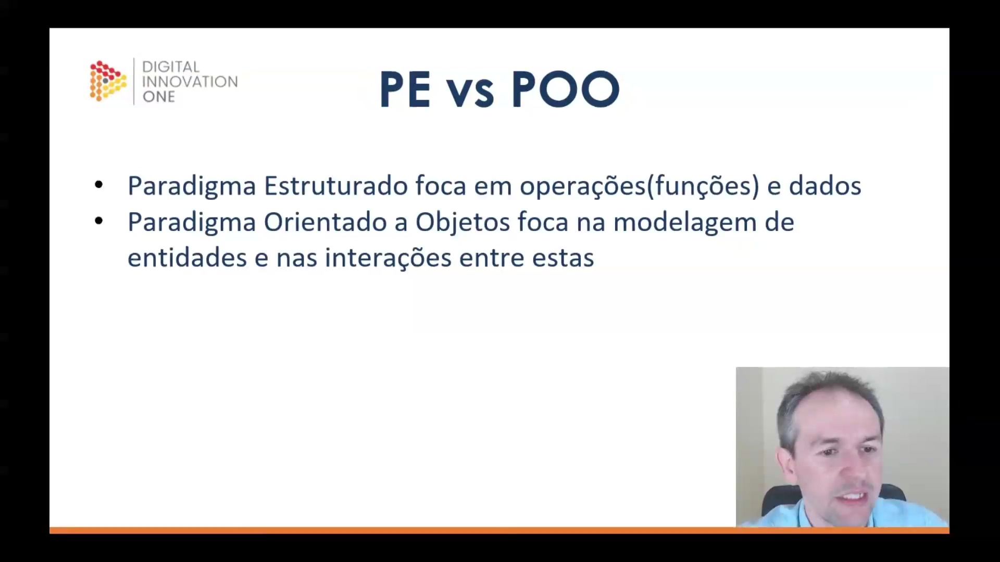
</p>

#### Foco em Entidades vs. Operações

A diferença de foco entre as abordagens altera como o desenvolvedor estrutura a solução:

* **Paradigma Estruturado:** O foco está nas **operações (funções) e nos dados**. Por trabalhar em um nível mais baixo, a atenção é voltada para a manipulação de dados brutos.
* **Paradigma Orientado a Objetos:** O foco recai na **modelagem de entidades** e nas **interações** entre elas. Isso proporciona um nível de abstração superior, aproximando o código da lógica de negócio.

<p align="center">
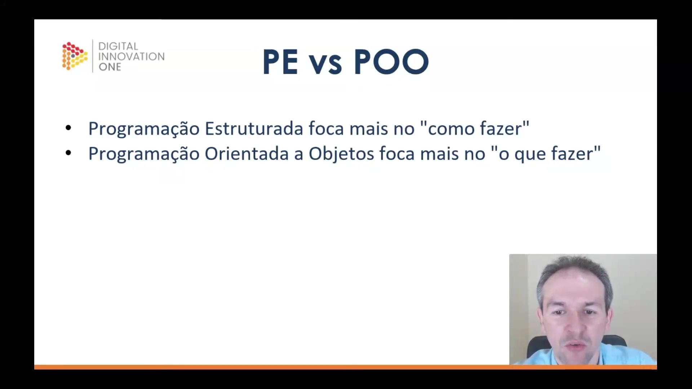
</p>

##### Abordagem: "Como" vs. "O Que"

* **Programação Estruturada:** Concentra-se no **"como fazer"**. O programador precisa se preocupar detalhadamente com os passos técnicos para resolver um problema.
* **Programação Orientada a Objetos:** Concentra-se no **"o que fazer"**. Com abstrações mais potentes, o desenvolvedor foca no problema que deseja resolver, tornando a atividade de programação mais intuitiva e eficiente.

<p align="center">
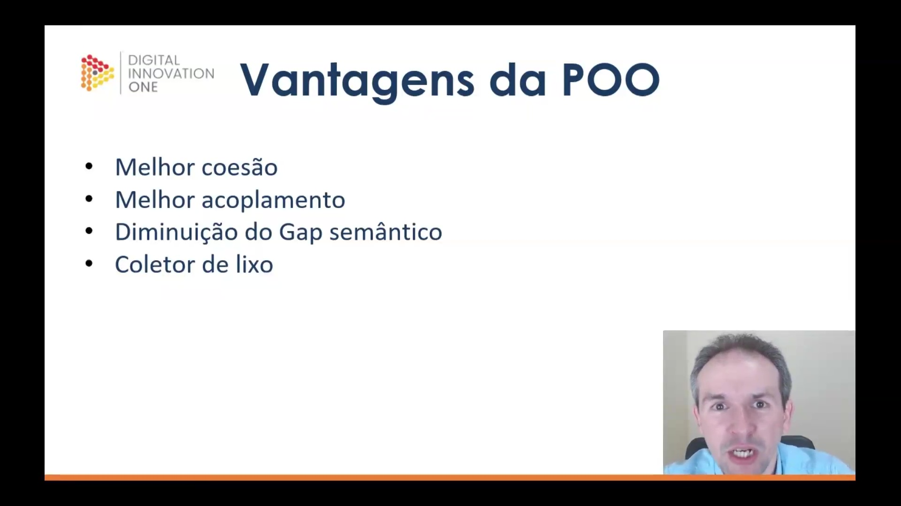
</p>

#### Vantagens da POO

A Orientação a Objetos traz benefícios técnicos que melhoram a qualidade do software:

* **Melhor Coesão:** Facilita a criação de unidades de código com responsabilidades bem definidas, evitando a mistura de funções desconexas.
* **Melhor Acoplamento:** Permite criar conexões mais flexíveis entre as partes do sistema, ao contrário do acoplamento rígido comum no paradigma estruturado.
* **Diminuição do Gap Semântico:** Reduz a distância entre o mundo real e o mundo computacional, tornando a representação sistêmica mais clara.
* **Coletor de Lixo (Garbage Collector):** Automatiza a gestão de memória, liberando o programador da tarefa manual de gerenciar recursos brutos do computador.

<p align="center">
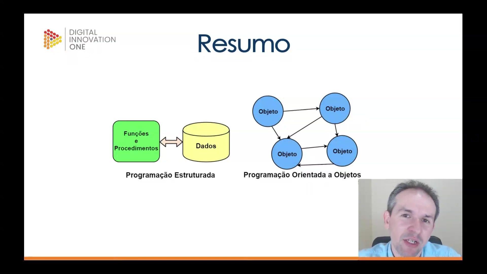
</p>

#### Resumo Comparativo

A imagem ilustra a diferença estrutural entre os dois modelos:

* No lado da **Programação Estruturada**, observa-se a separação entre **Funções/Procedimentos** e os **Dados**, caracterizando uma abordagem de baixo nível focada no processo de manipulação.
* No lado da **Programação Orientada a Objetos**, o sistema é composto por **Objetos** que encapsulam estado e comportamento. Estes objetos interagem entre si, representando um nível de abstração mais alto e uma facilidade maior na solução de problemas complexos.      


# Parte 3 - Fundamentos

## 🟩 Vídeo 04 - Fundamentos

<video width="60%" controls>
  <source src="000-Midia_e_Anexos/bootcamp_tqi_fullstack-modulo.06-curso.11-video_04.webm" type="video/webm">
    Seu navegador não suporta vídeo HTML5.
</video>

link do vídeo: https://web.dio.me/track/tqi-fullstack-developer/course/programacao-orientada-a-objetos/learning/186a82bb-3a19-49f9-b7bd-b05ea071f644?autoplay=1

Nesta aula, exploramos a definição de Orientação a Objetos e os três pilares fundamentais que sustentam esse paradigma: Abstração, Reuso e Encapsulamento. O objetivo é entender como a OO aproxima o mundo real do mundo computacional, facilitando o desenvolvimento de sistemas complexos.

### Anotações

<p align="center">
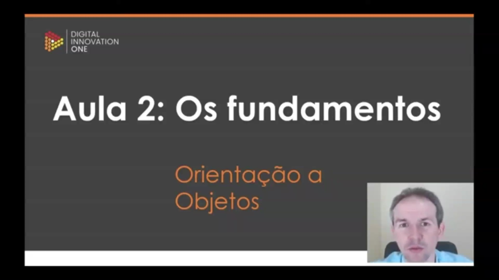
</p>

Nesta segunda aula sobre fundamentos, o foco central é a **Orientação a Objetos (OO)**. O objetivo é estabelecer uma base sólida sobre os conceitos que regem este paradigma, preparando o terreno para entender como as unidades de software interagem entre si.

<p align="center">
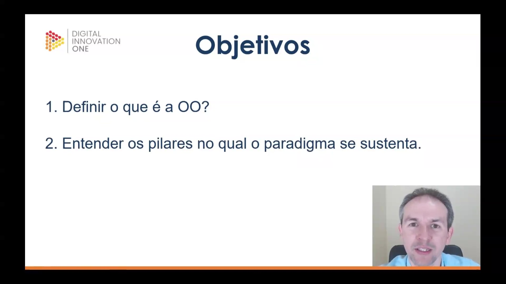
</p>

Os objetivos principais desta etapa consistem em:

1. **Definir o que é a OO**: Estabelecer uma compreensão teórica clara do paradigma.
2. **Entender os pilares**: Identificar as bases fundamentais que sustentam a Orientação a Objetos e permitem sua aplicação prática no desenvolvimento de sistemas.

<p align="center">
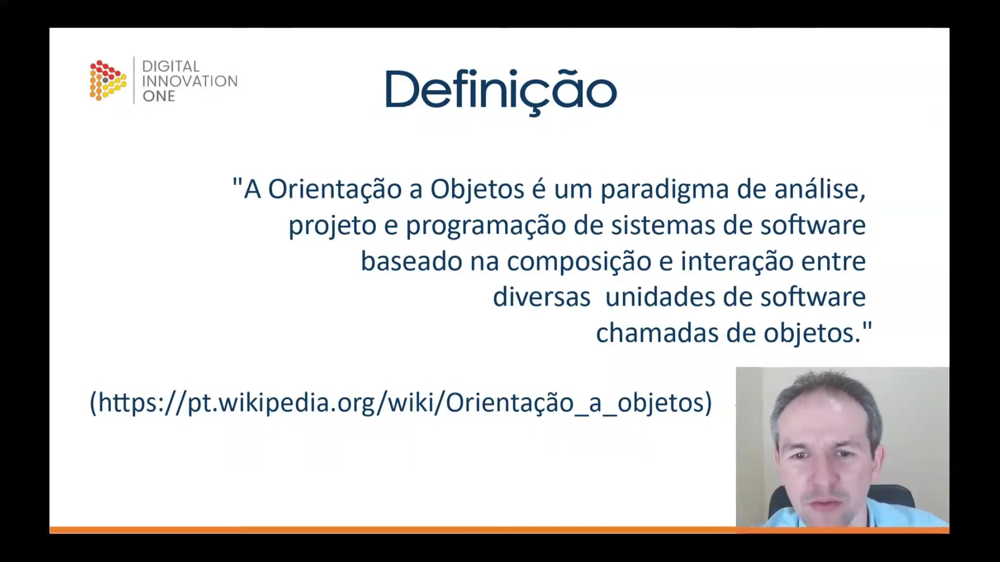
</p>

A definição de Orientação a Objetos destaca que se trata de um paradigma que abrange a **análise, o projeto e a programação** de sistemas. A estrutura é fundamentada na composição e na interação entre unidades de software denominadas **objetos**. Esta abordagem visa diminuir a distância entre o mundo real (o problema de negócio) e o mundo computacional (a solução técnica).

<p align="center">
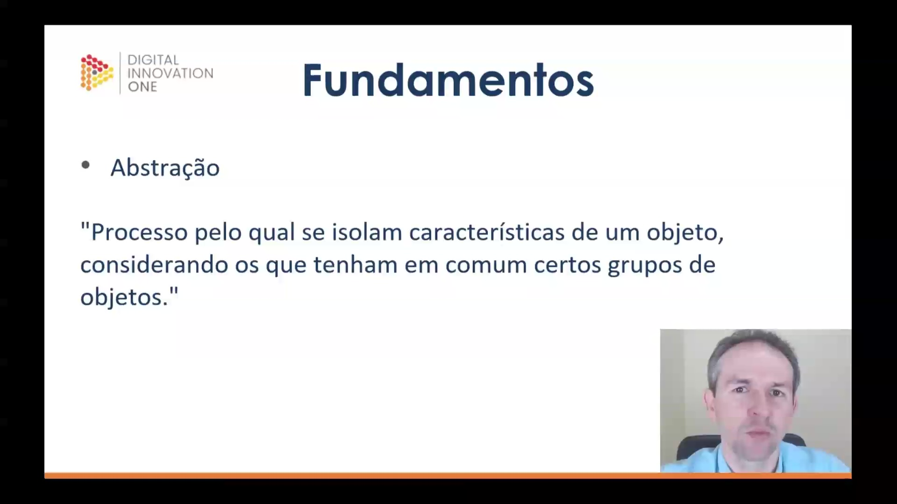
</p>

Dentre os fundamentos apresentados, a **Abstração** é o processo de isolar as características essenciais de um objeto. Ao focar no que é comum a certos grupos de objetos e ignorar detalhes acidentais ou específicos, o desenvolvedor consegue criar modelos base que podem ser aplicados em diferentes contextos do sistema.

<p align="center">

</p>

O **Reuso** é a capacidade de construir novas unidades de código aproveitando estruturas já existentes. Diferente de paradigmas estruturados, a Orientação a Objetos oferece mecanismos de alto nível que facilitam essa prática, tornando o desenvolvimento mais eficiente e permitindo que conceitos base (como uma abstração de "cadeira") sejam estendidos para necessidades específicas.

<p align="center">
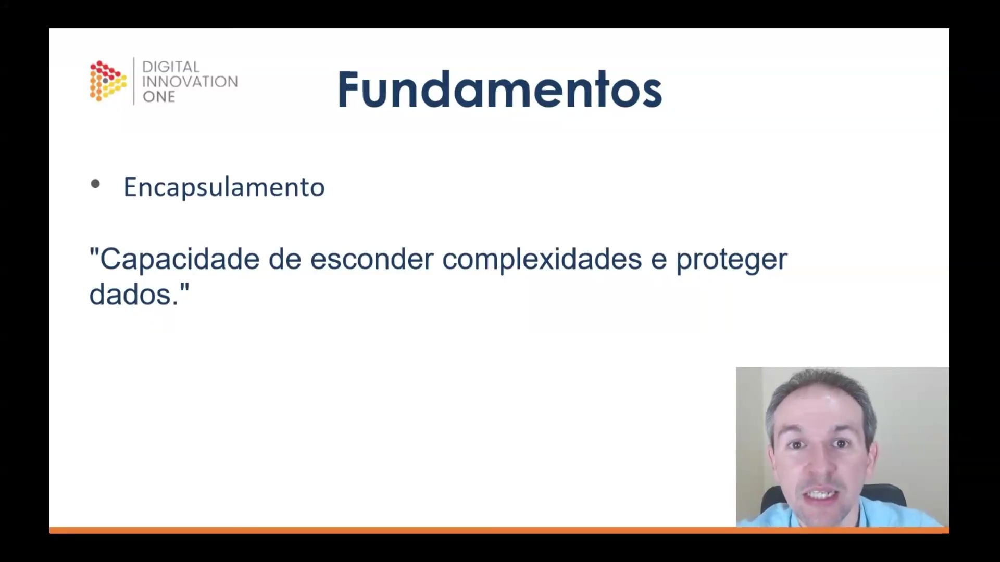
</p>

O **Encapsulamento** refere-se à habilidade de ocultar complexidades internas e garantir a proteção dos dados. Através de mecanismos específicos, o paradigma permite criar camadas que evitam acessos indevidos às informações, expondo apenas o que é estritamente necessário para a interação entre os objetos.

<p align="center">
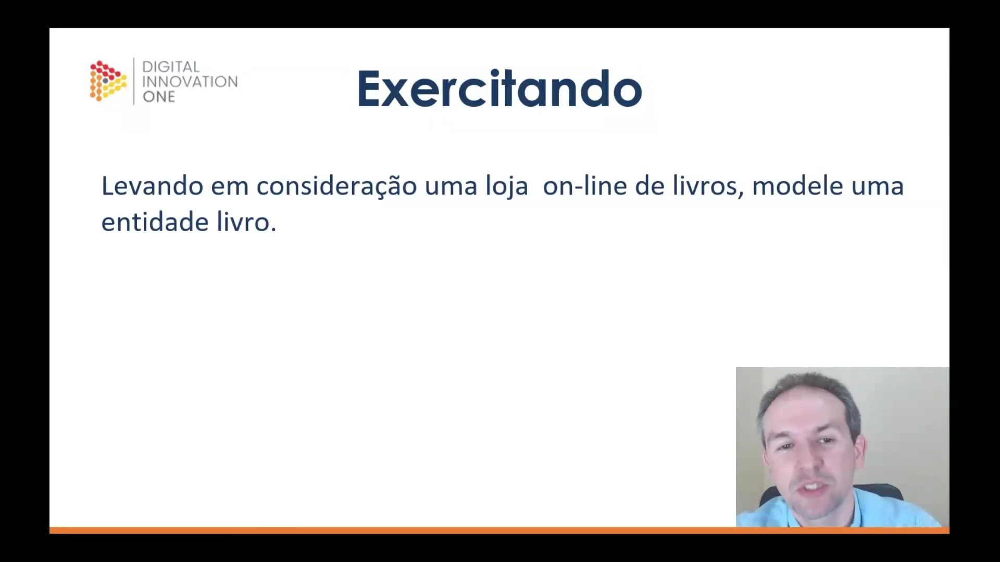
</p>

Para colocar os conceitos em prática, propõe-se um exercício de modelagem: considerando o cenário de uma **loja on-line de livros**, o desafio é modelar uma **entidade livro**. Este exercício incentiva a aplicação imediata dos pilares de abstração, encapsulamento e reuso para representar um objeto do mundo real no contexto computacional.      


## 🟩 Vídeo 05 - Exercício

<video width="60%" controls>
  <source src="000-Midia_e_Anexos/bootcamp_tqi_fullstack-modulo.06-curso.11-video_05.webm" type="video/webm">
    Seu navegador não suporta vídeo HTML5.
</video>

link do vídeo: https://web.dio.me/track/tqi-fullstack-developer/course/programacao-orientada-a-objetos/learning/186a82bb-3a19-49f9-b7bd-b05ea071f644?autoplay=1

Este guia explora o processo de abstração e modelagem de dados, utilizando o exemplo de um "Livro". O foco principal é entender como o contexto de um sistema determina quais características de um objeto do mundo real devem ser transformadas em atributos de código.

### Anotações

<p align="center">
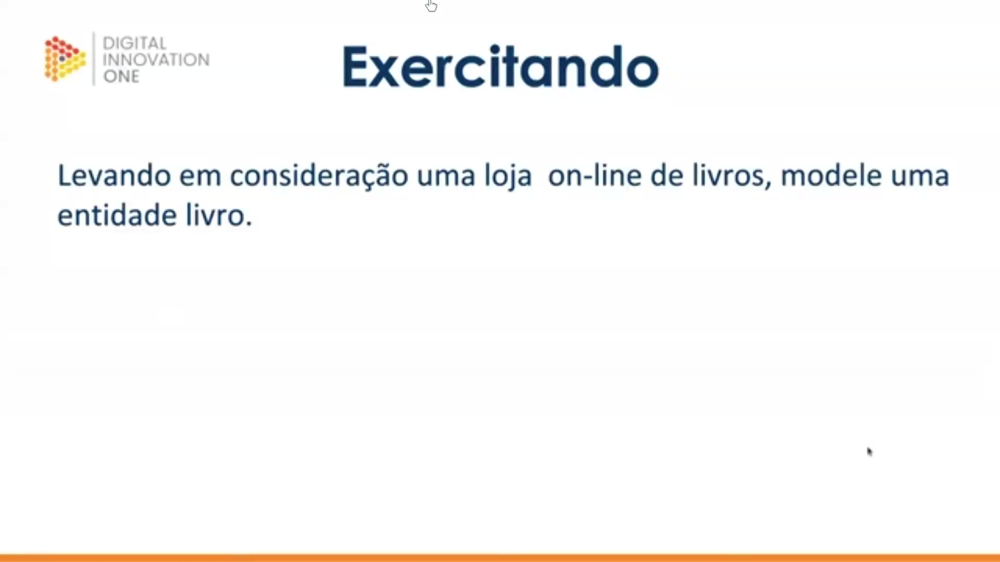
</p>

Nesta etapa inicial do exercício, o objetivo é realizar a modelagem de uma entidade chamada **Livro**, simulando o cenário de uma loja on-line. O processo de modelagem começa com a identificação das características e propriedades que definem o objeto no mundo real para que ele possa ser representado adequadamente dentro de um sistema de software.

<p align="center">
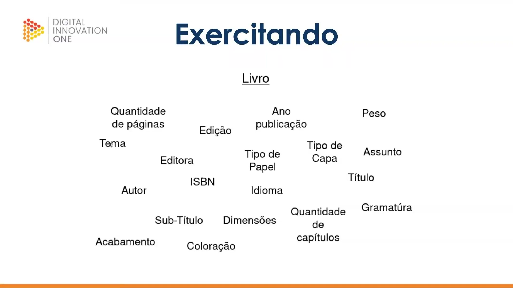
</p>

Ao realizar o levantamento inicial de atributos para a entidade **Livro**, é possível identificar uma vasta gama de características técnicas e descritivas. Nesta fase de "brainstorming", foram listados os seguintes atributos:

* Quantidade de páginas
* Tema
* Edição
* Ano de publicação
* Tipo de Capa
* Peso
* Editora
* Tipo de Papel
* ISBN
* Autor
* Idioma
* Assunto
* Gramatura
* Dimensões
* Acabamento
* Quantidade de capítulos
* Coloração

Embora essa lista seja abrangente, o excesso de informações pode não ser eficiente dependendo do problema que se deseja resolver.

<p align="center">
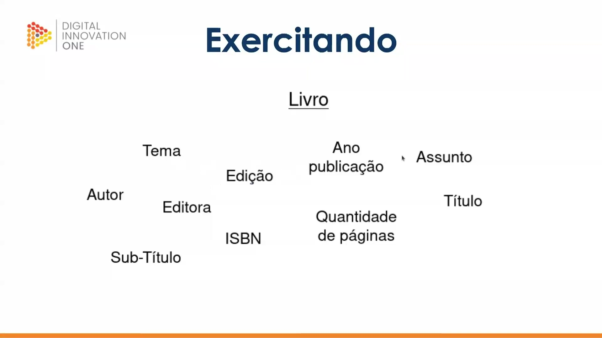
</p>

Considerando especificamente o contexto de uma **loja on-line**, a modelagem deve focar no que é relevante para o consumidor final. Atributos técnicos de fabricação são descartados em favor de informações que auxiliam na decisão de compra. Os atributos selecionados para este nicho são:

* Autor
* Tema
* Editora
* Sub-Título
* Edição
* ISBN
* Ano de publicação
* Assunto
* Título
* Quantidade de páginas

<p align="center">
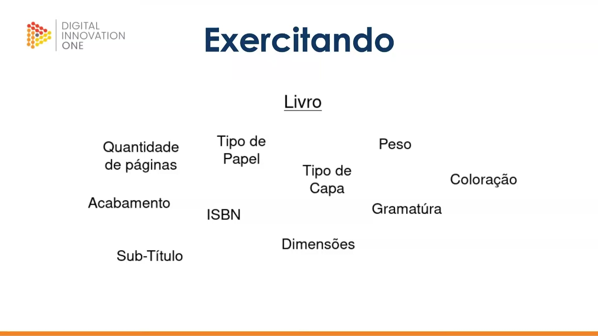
</p>

A modelagem de uma entidade muda drasticamente conforme a necessidade do sistema. Se o objetivo fosse atender a uma **editora** (responsável pela impressão e logística), atributos que foram descartados para a loja tornam-se essenciais, pois influenciam no custo de produção e frete:

* Quantidade de páginas
* Acabamento
* Tipo de Papel
* ISBN
* Tipo de Capa
* Peso
* Coloração
* Gramatura
* Sub-Título
* Dimensões

Isso demonstra que a modelagem não é estática; ela depende diretamente de quem irá manipular a entidade e qual a finalidade do software.

<p align="center">
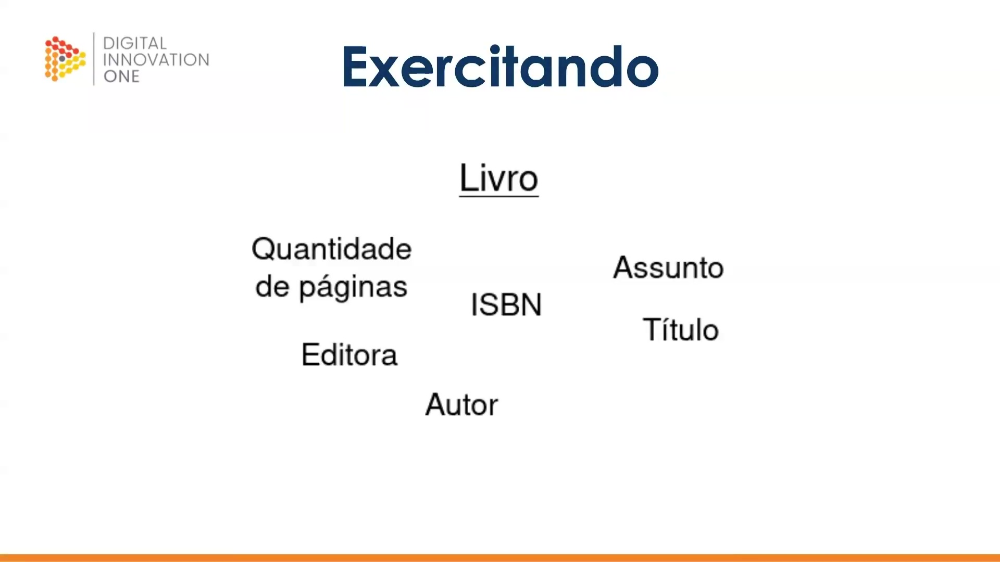
</p>

Para finalizar o exercício de modelagem focada no presente e na simplicidade, propõe-se uma estrutura enxuta para a entidade **Livro**. A boa prática de programação sugere que não se deve tentar prever todas as necessidades futuras, evitando o desperdício de tempo e recursos em características que podem nunca ser utilizadas. O modelo final simplificado contém:

* Título
* Autor
* Editora
* ISBN
* Assunto
* Quantidade de páginas

Caso novas necessidades surjam com a evolução do software, o modelo pode receber manutenções evolutivas para a adição de novos atributos.      


# Parte 4 - Estrutura básica da OO

## 🟩 Vídeo 06 - Classe - Conceitos

<video width="60%" controls>
  <source src="000-Midia_e_Anexos/bootcamp_tqi_fullstack-modulo.06-curso.11-video_06.webm" type="video/webm">
    Seu navegador não suporta vídeo HTML5.
</video>

link do vídeo: https://web.dio.me/track/tqi-fullstack-developer/course/programacao-orientada-a-objetos/learning/091c2441-1f88-432b-9319-4f3b777a9e1d?autoplay=1

Este guia resume os conceitos fundamentais apresentados na Aula 3, focando na Classe como o pilar central da Programação Orientada a Objetos. O objetivo é entender como transformar conceitos do mundo real em estruturas de código sólidas e reutilizáveis.

### Anotações

 <p align="center">
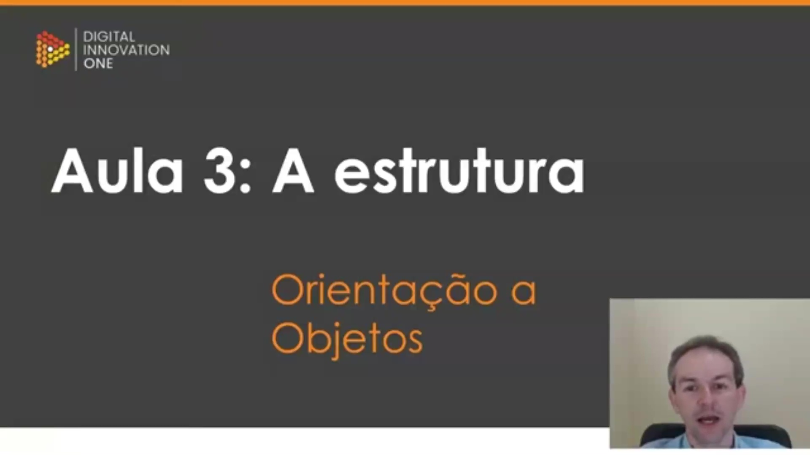
</p>

#### Aula 3: A Estrutura da Orientação a Objetos

Esta aula introduz os conceitos que compõem as estruturas básicas do paradigma orientado a objetos. Essas estruturas são fundamentais, pois servem como o "pontapé inicial" e o alicerce necessário para o desenvolvimento de sistemas e para a compreensão de conceitos mais avançados que serão explorados posteriormente.

<p align="center">
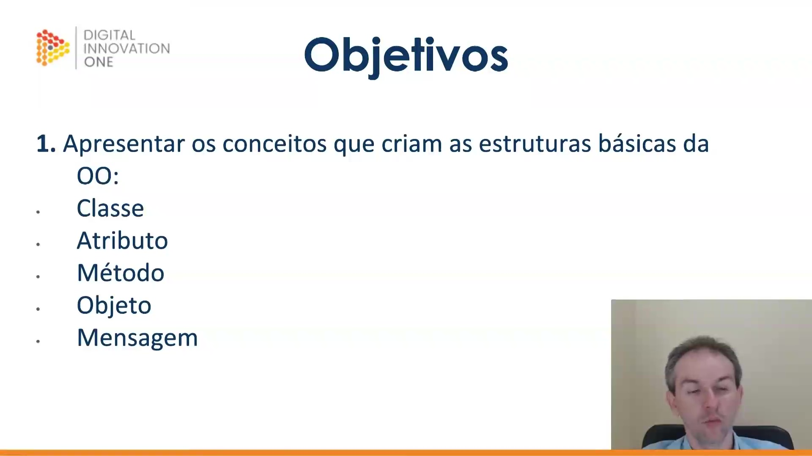
</p>

#### Objetivos de Aprendizagem

O foco central é apresentar as cinco estruturas básicas que permitem a criação de sistemas orientados a objetos:

1. **Classe**
2. **Atributo**
3. **Método**
4. **Objeto**
5. **Mensagem**

Esses elementos são considerados essenciais porque tudo na orientação a objetos começa a partir da definição e interação entre esses conceitos.

<p align="center">
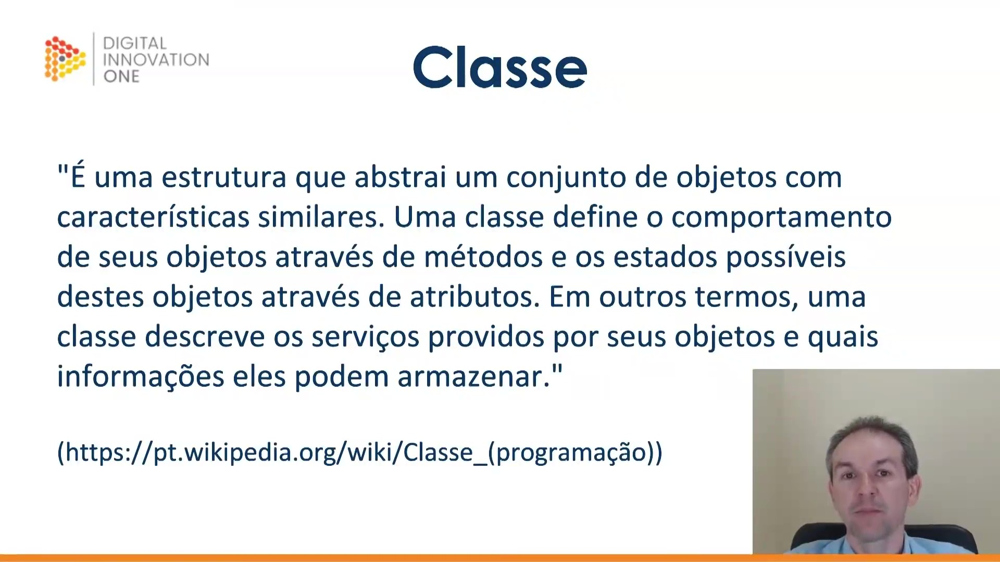
</p>

#### O Conceito de Classe

A **Classe** é a unidade mínima e básica de implementação no paradigma orientado a objetos. Ela funciona como uma estrutura que abstrai um conjunto de objetos com características similares, definindo:

* **Comportamento:** Estabelecido através dos **métodos** (serviços providos pelos objetos).
* **Estado:** Definido através dos **atributos** (informações que os objetos podem armazenar).

Em termos práticos, a classe atua como um "molde" para a criação de entidades, permitindo modelar conceitos do mundo real focando em suas características essenciais.

<p align="center">

</p>

#### Exemplos de Classes

As classes podem representar tanto entidades concretas quanto abstratas do mundo real. Alguns exemplos comuns incluem:

* **Concretas:** Bola, Carro, Computador.
* **Abstratas:** Viagem, Venda, Comprador.

Independentemente da natureza da entidade, a classe serve para representar esses conceitos dentro de um sistema de software, permitindo a futura criação de objetos baseados nessas definições.

<p align="center">
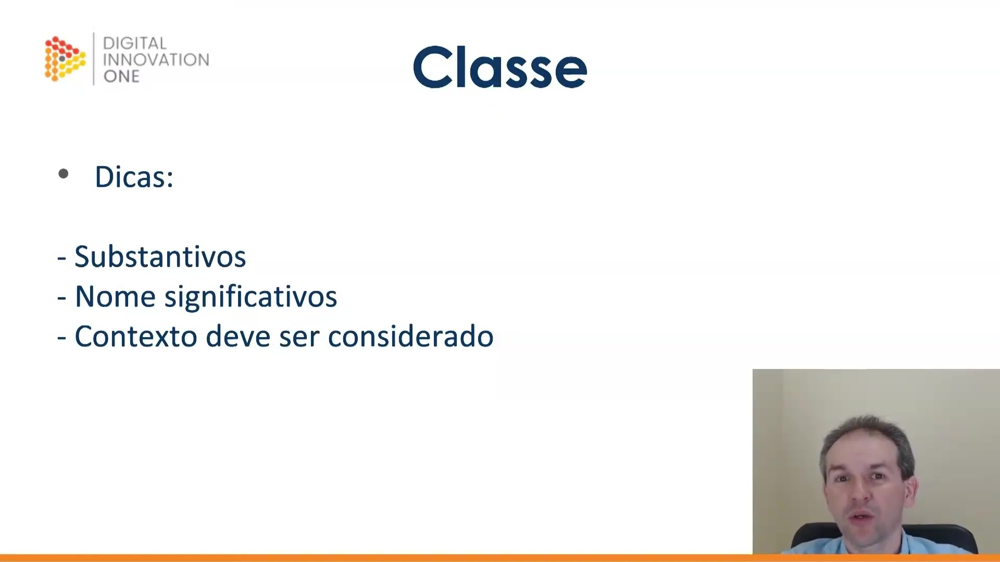
</p>

#### Dicas para Identificação de Classes

Para identificar corretamente quais classes devem ser criadas em um sistema, deve-se considerar:

* **Substantivos:** Classes são quase sempre representadas por substantivos presentes no domínio do problema.
* **Nomes Significativos:** O nome deve refletir claramente o papel da classe.
* **Contexto:** O ambiente do software influencia o nome. Por exemplo, em vez de uma classe genérica "Pessoa", pode ser mais adequado usar "Cliente" em um sistema de vendas ou "Aluno" em um sistema acadêmico, garantindo maior clareza semântica.

<p align="center">
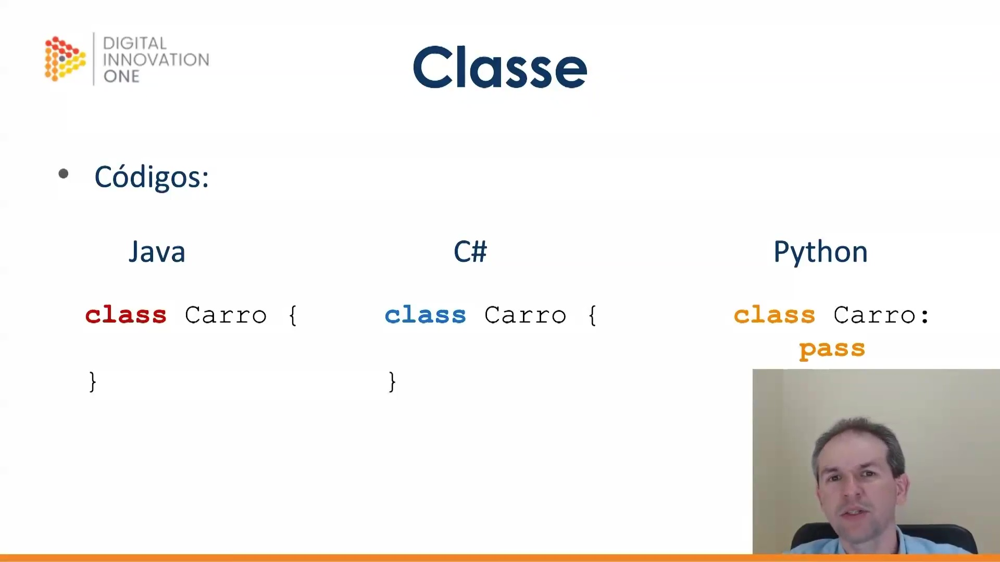
</p>

#### Implementação em Código

A forma de declarar uma classe varia conforme a linguagem de programação utilizada. Abaixo, exemplos da estrutura mínima (classe vazia) em Java, C# e Python:

**Java**

```java
class Carro {

}

```

**C#**

```csharp
class Carro {

}

```

**Python**

```python
class Carro:
    pass

```

Enquanto Java e C# utilizam chaves para delimitar o escopo, o Python utiliza a indentação e a palavra reservada `pass` para indicar que a classe, embora definida, não possui conteúdo interno no momento.

<p align="center">
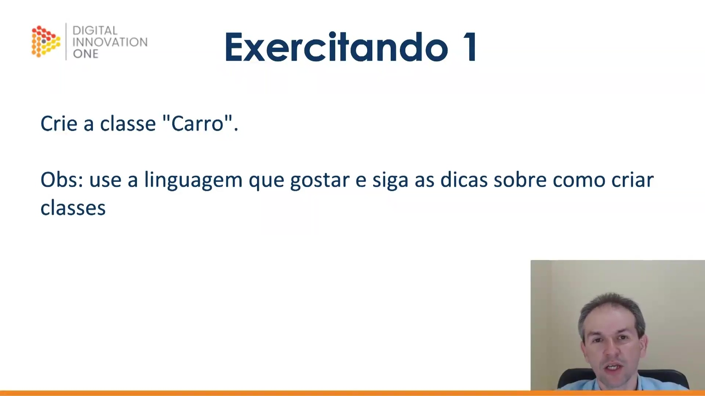
</p>

#### Exercitando 1

Para fixar o conteúdo inicial, o desafio proposto é:

* **Tarefa:** Crie a classe "Carro".
* **Observação:** Utilize a linguagem de sua preferência (Java, C# ou Python), aplicando as dicas de nomenclatura e as estruturas sintáticas apresentadas.     


## 🟩 Vídeo 07 - Classe - Exercício

<video width="60%" controls>
  <source src="000-Midia_e_Anexos/bootcamp_tqi_fullstack-modulo.06-curso.11-video_07.webm" type="video/webm">
    Seu navegador não suporta vídeo HTML5.
</video>

link do vídeo: https://web.dio.me/track/tqi-fullstack-developer/course/programacao-orientada-a-objetos/learning/ba57cf6e-400d-4341-a4f8-10ebc1fdaf45?autoplay=1

Este resumo aborda a transição do pensamento teórico para a prática de programação orientada a objetos (POO), focando na criação de uma classe "Carro" utilizando a IDE IntelliJ IDEA.

### Anotações

<p align="center">
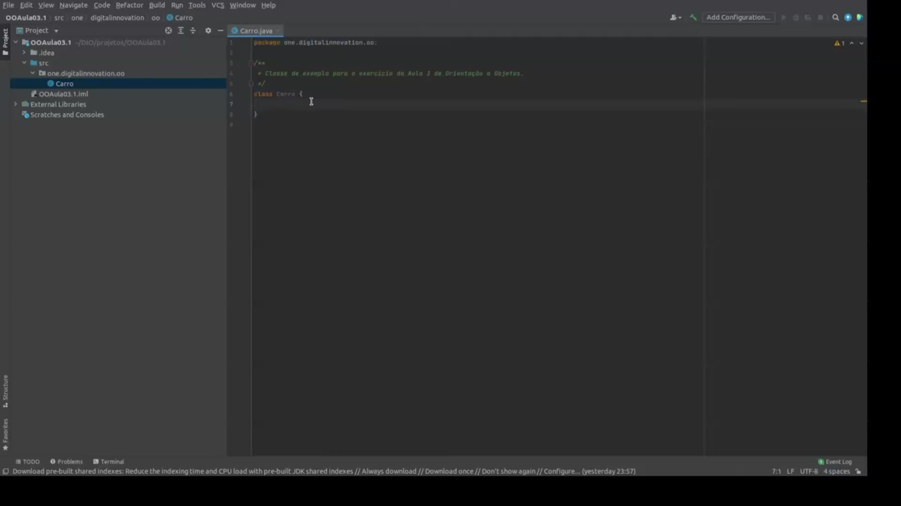
</p>

Nesta etapa prática, o foco é a implementação da classe **Carro** utilizando a linguagem Java no ambiente de desenvolvimento IntelliJ IDEA. A estrutura do projeto já se encontra organizada, exibindo a classe dentro do pacote de desenvolvimento.

Para quem está iniciando o projeto do zero, o processo consiste em acessar `File > New > Project` e atribuir um nome ao trabalho. Uma vez que o projeto esteja estruturado, a criação da classe propriamente dita é feita clicando com o botão direito sobre o diretório **src** (source), selecionando a opção de nova classe Java e nomeando-a como "Carro".

A classe inicial apresenta a estrutura básica com a palavra reservada `class` seguida do nome do identificador. No topo do arquivo, observa-se a declaração do pacote (`package`), que organiza a localização do arquivo no sistema de arquivos do projeto.

```java
package one.digitalinnovation.oo;

/**
 * Classe de exemplo para o exercício da Aula 3 de Orientação a Objetos.
 */
class Carro {

}

```

Este código representa a resolução do primeiro exercício: a definição da entidade básica que será "recheada" com atributos e métodos nas aulas subsequentes.


## 🟩 Vídeo 08 - Atributo - Conceitos

<video width="60%" controls>
  <source src="000-Midia_e_Anexos/bootcamp_tqi_fullstack-modulo.06-curso.11-video_08.webm" type="video/webm">
    Seu navegador não suporta vídeo HTML5.
</video>

link do vídeo: https://web.dio.me/track/tqi-fullstack-developer/course/programacao-orientada-a-objetos/learning/eb733290-d5bb-467b-af86-7c47a8959a0e?autoplay=1

Este guia explora o conceito fundamental de atributos, os elementos responsáveis por definir a estrutura de dados e as características de uma classe e seus objetos. Entender atributos é o primeiro passo para transformar conceitos do mundo real em código funcional e organizado.

### Anotações

<p align="center">
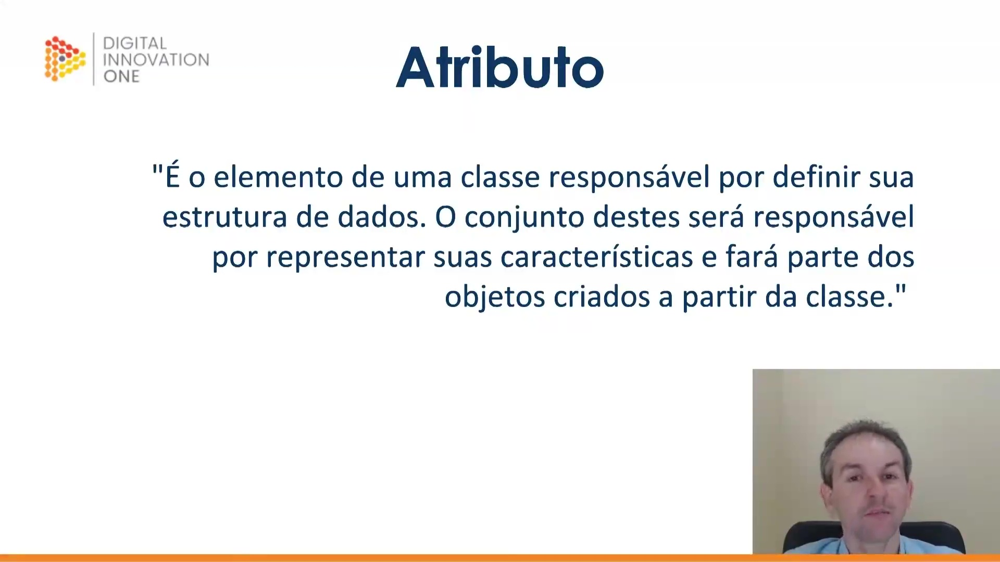
</p>

O **Atributo** é definido como o elemento de uma classe responsável por definir sua **estrutura de dados**. Ele representa as características de uma classe, e o conjunto desses atributos comporá os objetos criados a partir dela. Na modelagem de software, o atributo é a ferramenta utilizada para caracterizar conceitos do mundo real de forma fiel dentro do código.

<p align="center">
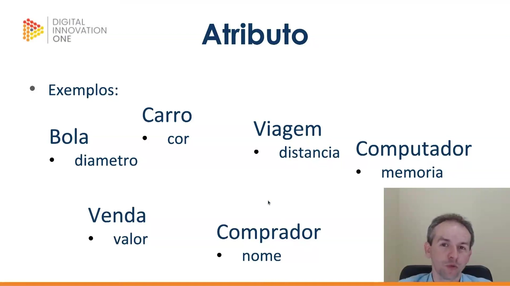
</p>

Para ilustrar a aplicação prática dos atributos, podem-se observar exemplos de entidades e suas respectivas características:

* **Bola**: possui o atributo **diâmetro**.
* **Carro**: possui o atributo **cor**.
* **Venda**: possui o atributo **valor**.
* **Viagem**: possui o atributo **distância**.
* **Comprador**: possui o atributo **nome**.
* **Computador**: possui o atributo **memória**.

<p align="center">
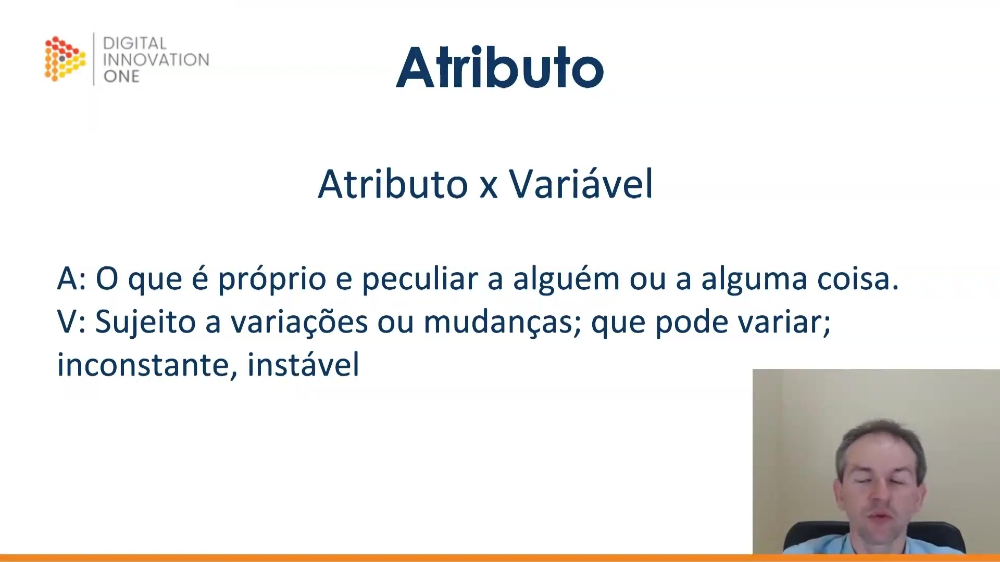
</p>

Embora tratados de forma semelhante pelo computador, existe uma diferença conceitual importante entre **Atributo** e **Variável**:

* **Atributo (A)**: É o que é próprio e peculiar a algo; serve para caracterizar entidades e é definido dentro da classe.
* **Variável (V)**: Sujeito a variações, mudanças ou instabilidades; possui um ciclo de vida mais curto, geralmente definida dentro de métodos para auxiliar em operações.

<p align="center">
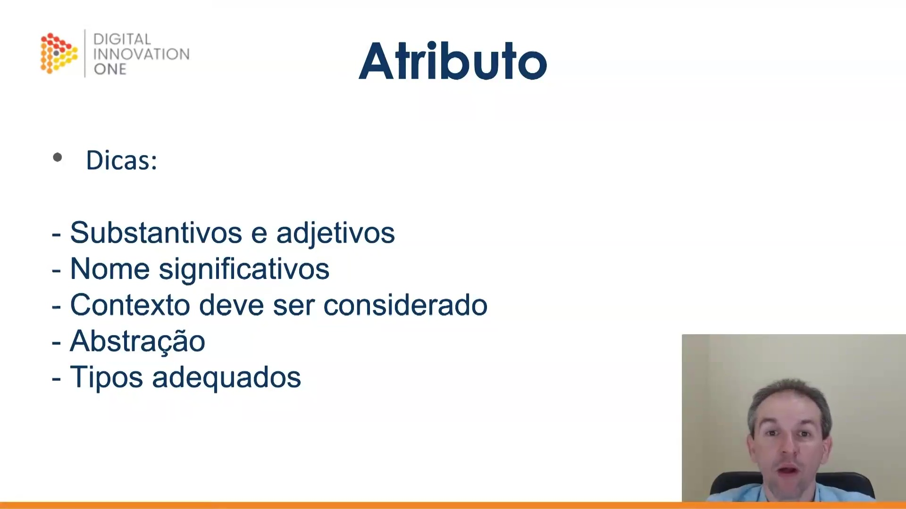
</p>

Dicas essenciais para a definição de atributos:

* **Substantivos e adjetivos**: Utilize substantivos para nomear o atributo e pense em como adjetivos irão caracterizá-lo (ex: Carro -> cor).
* **Nomes significativos e Contexto**: O nome deve ser claro e condizente com o nicho de negócio.
* **Abstração**: Não defina todos os atributos possíveis, apenas os necessários para o contexto atual do sistema.
* **Tipos adequados**: Escolha o tipo de dado (inteiro, string, float) que melhor represente a finalidade do atributo.

<p align="center">
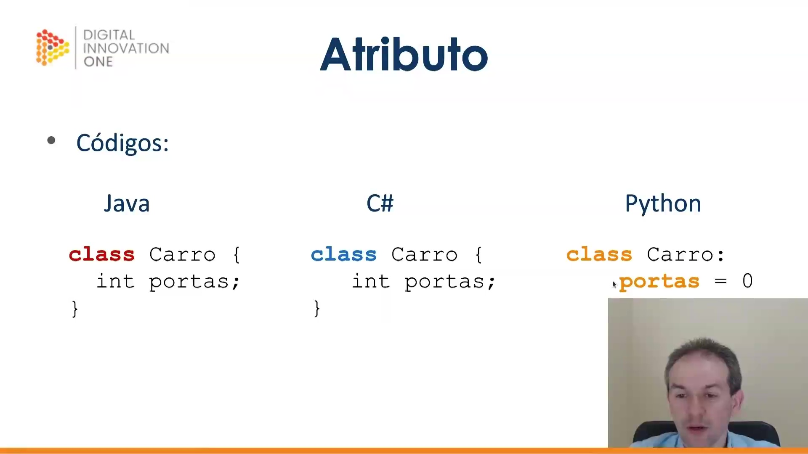
</p>

Abaixo, a comparação da sintaxe para definição de atributos em diferentes linguagens:

**Java** 

```java
class Carro {
    int portas;
}

```

**C#** 

```csharp
class Carro {
    int portas;
}

```

**Python** 

```python
class Carro:
    portas = 0

```

Nota: Em Java e C#, o tipo de dado (int) deve ser declarado explicitamente. Em Python, o tipo é inferido a partir do valor atribuído.

<p align="center">
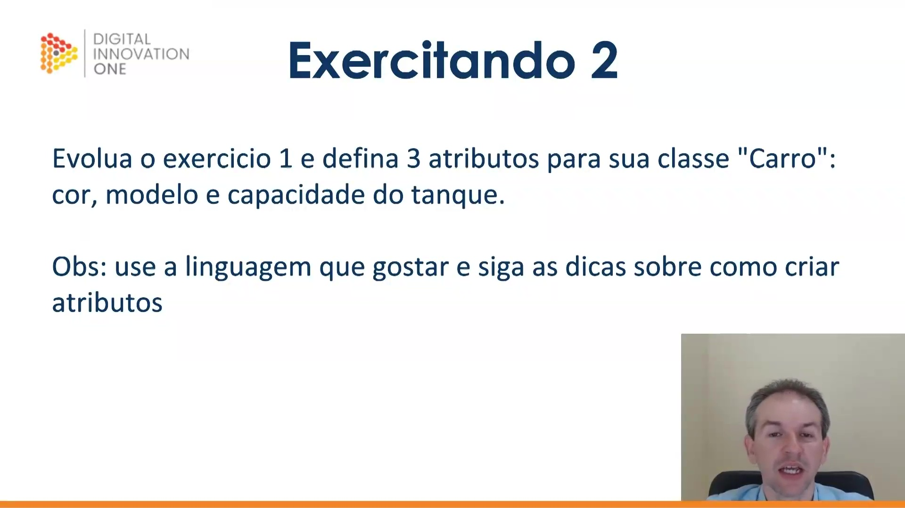
</p>

**Exercitando 2**:
O objetivo é evoluir a classe "Carro" criada anteriormente, adicionando três atributos específicos: **cor**, **modelo** e **capacidade do tanque**. Deve-se aplicar as boas práticas de nomenclatura e tipos de dados adequados na linguagem de sua preferência.


## 🟩 Vídeo 09 - Atributo - Exercício

<video width="60%" controls>
  <source src="000-Midia_e_Anexos/bootcamp_tqi_fullstack-modulo.06-curso.11-video_09.webm" type="video/webm">
    Seu navegador não suporta vídeo HTML5.
</video>

link do vídeo: https://web.dio.me/track/tqi-fullstack-developer/course/programacao-orientada-a-objetos/learning/9bc3a147-ff37-4427-b3da-37be729b2008?autoplay=1

Este guia resume a aula prática focada na definição de estados (atributos) para uma classe em Java, utilizando o exemplo de um carro. O objetivo é entender como traduzir características do mundo real em código, escolhendo os tipos de dados adequados.

### Anotações

<p align="center">
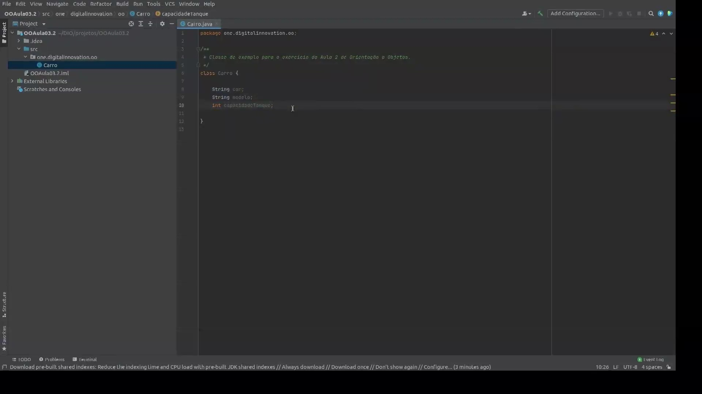
</p>

Nesta etapa, o foco é a resolução do exercício prático para a criação de atributos dentro da classe `Carro`. Os atributos representam as características que definem o estado dos objetos que serão instanciados a partir desta classe. Para este exemplo, são definidos três atributos fundamentais: a cor, o modelo e a capacidade do tanque de combustível.

A definição dos atributos deve seguir uma escolha criteriosa dos tipos de dados para representar fielmente a informação:

* **Cor e Modelo:** Como ambos são representados por palavras ou conjuntos de caracteres, utiliza-se o tipo de dado `String`.
* **Capacidade do Tanque:** Por representar um valor numérico inteiro, utiliza-se o tipo de dado `int`.

Os atributos são declarados dentro do corpo da classe, delimitados pelo abrir e fechar de chaves `{ }`, conforme demonstrado na estrutura do código abaixo:

```java
package one.digitalinnovation.oo;

/**
 * Classe de exemplo para o exercício da Aula 3 de Orientação a Objetos.
 */
class Carro {

    String cor;
    String modelo;
    int capacidadeTanque;

}

```

Essa organização conclui a estruturação básica dos dados da classe, permitindo que o desenvolvimento avance para a inclusão de novos conceitos de Orientação a Objetos nas próximas etapas.    


## 🟩 Vídeo 10 - Método - Conceito

<video width="60%" controls>
  <source src="000-Midia_e_Anexos/bootcamp_tqi_fullstack-modulo.06-curso.11-video_10.webm" type="video/webm">
    Seu navegador não suporta vídeo HTML5.
</video>

link do vídeo: https://web.dio.me/track/tqi-fullstack-developer/course/programacao-orientada-a-objetos/learning/a102d2d3-feee-40b1-9375-c94d295d76fb?autoplay=1

Este guia explora a definição, aplicação e as nuances técnicas dos métodos, os componentes responsáveis por dar "vida" e comportamento aos objetos no paradigma orientado a objetos.

### Anotações

<p align="center">
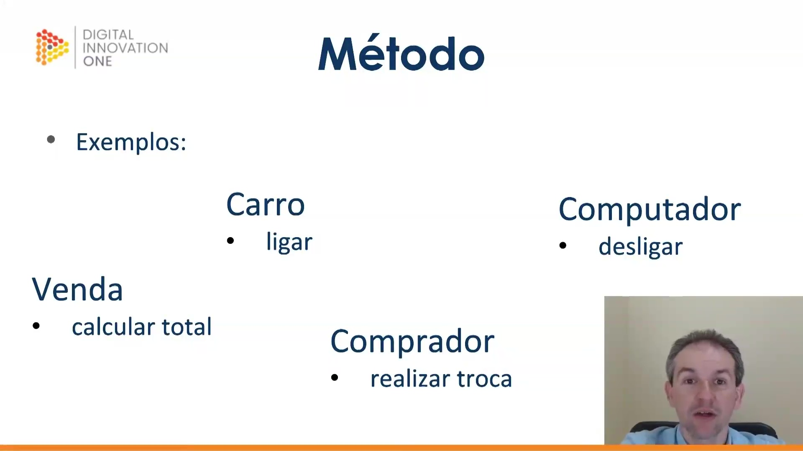
</p>

Na orientação a objetos, os **métodos** representam as ações ou serviços que uma entidade pode realizar. Através de exemplos práticos, observamos comportamentos associados a diferentes classes: um **Carro** possui a ação de *ligar*, uma **Venda** pode *calcular o total*, um **Comprador** é capaz de *realizar uma troca* e um **Computador** pode ser *desligado*. Esses comportamentos são modelados apenas quando há uma necessidade lógica e essencial dentro do contexto do sistema.

<p align="center">
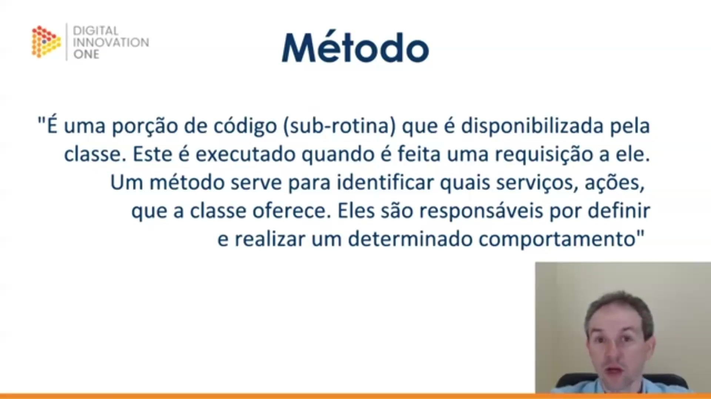
</p>

Um método é definido tecnicamente como uma porção de código, ou sub-rotina, disponibilizada por uma classe e executada mediante uma requisição. Ele é o mecanismo responsável por definir e realizar o comportamento de um objeto, identificando quais serviços e ações a classe oferece aos seus usuários.

<p align="center">
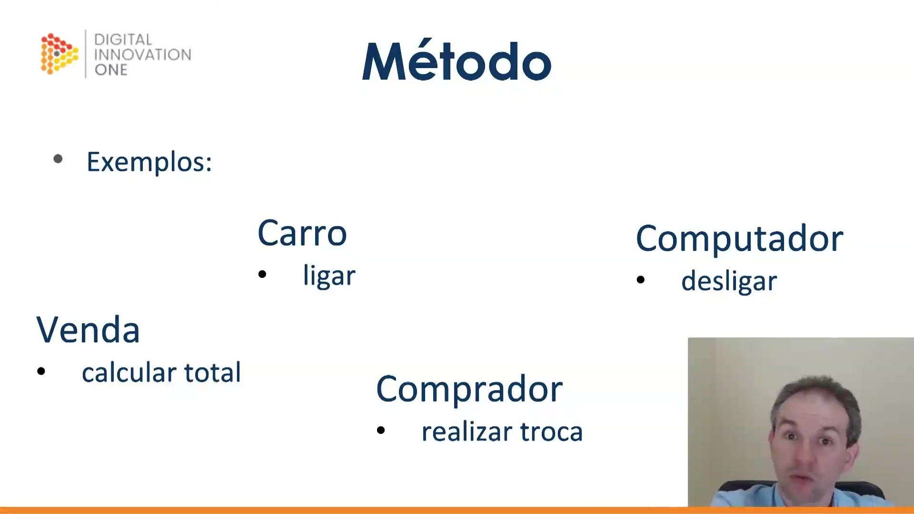
</p>

Diferente dos atributos, que são feitos para caracterizar um conceito, os métodos são usados para prover as ações que podem ser realizadas com essa entidade. Na prática, os métodos manipulam os atributos da classe e variáveis para executar as funcionalidades esperadas, como o acionamento de um motor ou o processamento de um cálculo financeiro.

<p align="center">
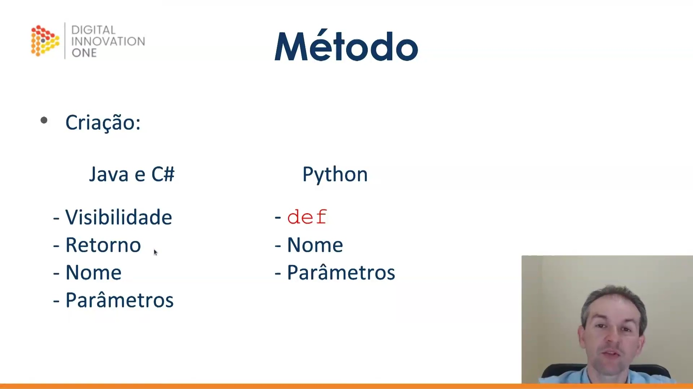
</p>

A estrutura de criação de um método varia conforme a linguagem de programação:

* **Java e C#**: Exigem obrigatoriamente a definição da visibilidade, o tipo de retorno, o nome do método e os parâmetros.
* **Python**: Utiliza a palavra-chave `def`, seguida pelo nome e os parâmetros.

<p align="center">
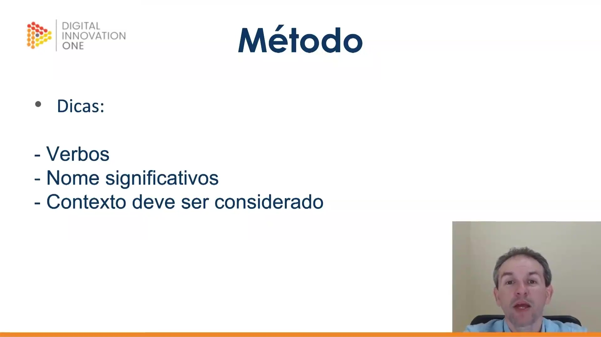
</p>

Para a criação de métodos eficazes, devem-se seguir algumas diretrizes fundamentais:

* **Use verbos**: Como os métodos representam ações, a nomenclatura deve refletir isso (ex: ligar, calcular).
* **Nomes significativos**: O nome deve deixar claro o que o método faz.
* **Contexto**: A necessidade de um método (como "frear") depende do tipo de sistema que está sendo desenvolvido.

<p align="center">
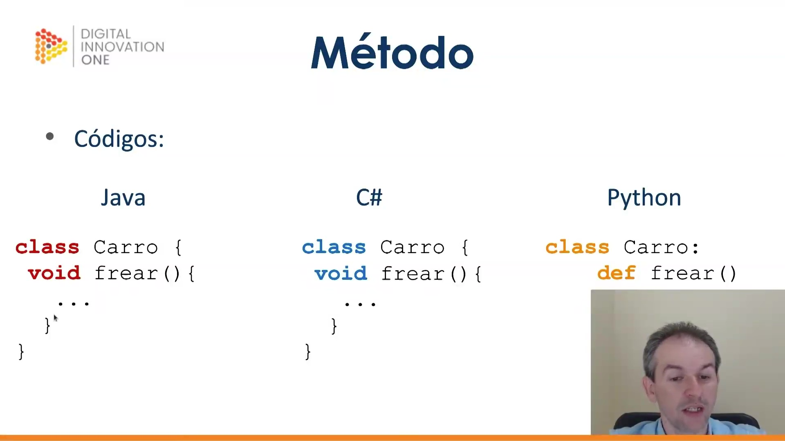
</p>

A implementação prática do método `frear` na classe `Carro` demonstra as distinções sintáticas entre as linguagens:

**Java**

```java
class Carro {
    void frear(){
    }
}

```

**C#**

```csharp
class Carro {
    void frear(){
    }
}

```

**Python**

```python
class Carro:
    def frear(self):
        pass

```

<p align="center">
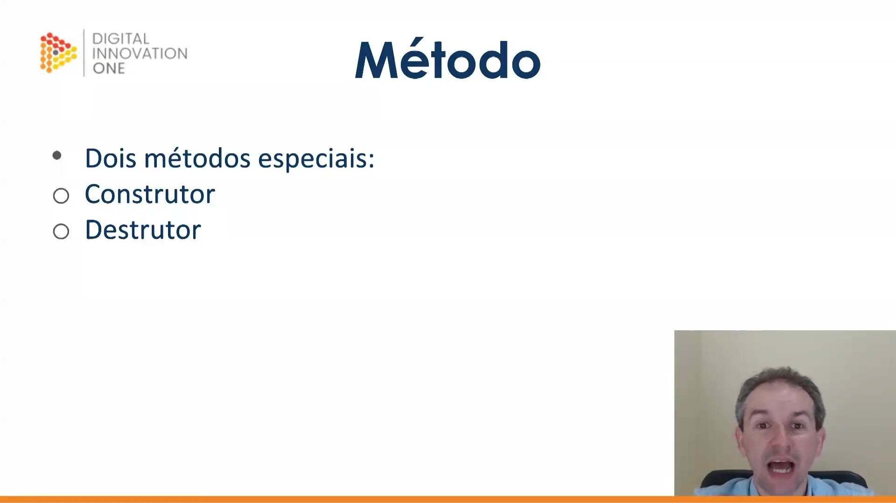
</p>

Existem dois métodos com propósitos especiais no ciclo de vida de um objeto: o **Construtor**, acionado no momento da criação da instância, e o **Destrutor**, que auxilia na finalização do objeto e liberação de recursos.

<p align="center">
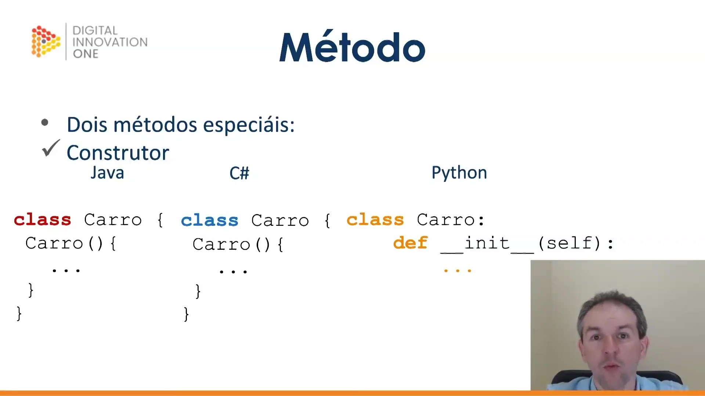
</p>

O método **Construtor** é executado sempre que um objeto é instanciado (através do comando `new`).

* **Java e C#**: O construtor possui obrigatoriamente o mesmo nome da classe.
* **Python**: Utiliza-se o método especial `__init__` para a inicialização.

```python
class Carro:
    def __init__(self):
        pass

```

<p align="center">
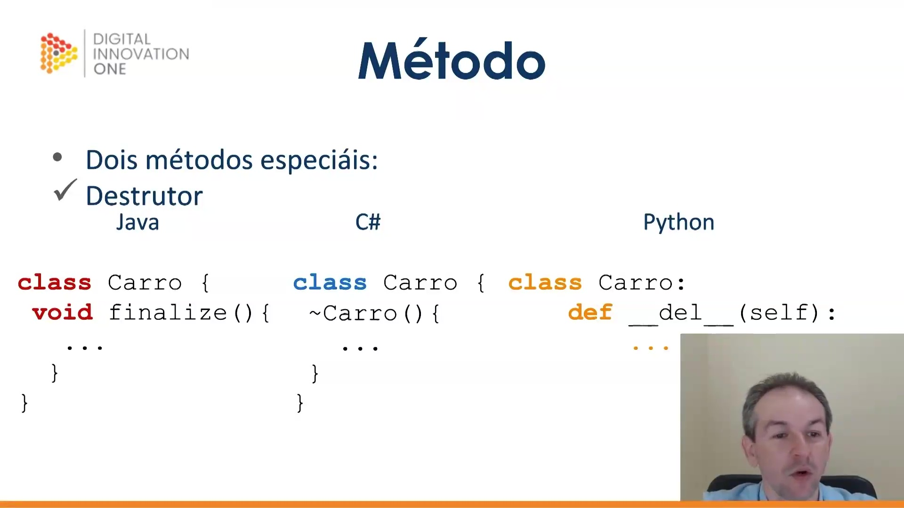
</p>

O método **Destrutor** é utilizado para auxiliar na destruição do objeto. O gerenciamento de memória (como o *Garbage Collector*) varia entre linguagens, refletindo-se na sintaxe:

**Java**

```java
void finalize(){ }

```

**C#**

```csharp
~Carro(){ }

```

**Python**

```python
def __del__(self):
    pass

```

<p align="center">
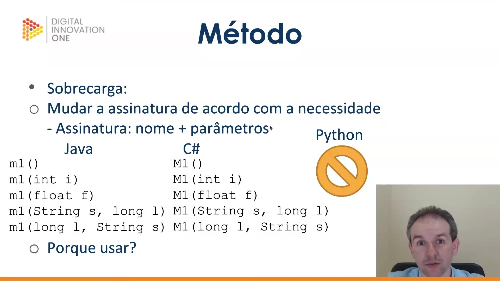
</p>

A **Sobrecarga** permite alterar a assinatura de um método (seu nome + parâmetros) para atender diferentes necessidades. Isso possibilita ter múltiplos métodos com o mesmo nome, desde que recebam tipos ou quantidades de parâmetros diferentes para realizar ações similares. O Python não suporta sobrecarga de métodos da mesma forma que Java ou C#.

<p align="center">
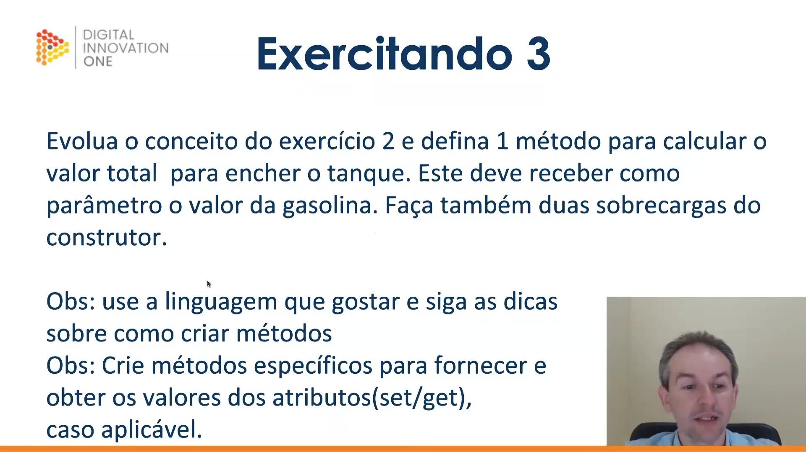
</p>

O exercício proposto consiste em evoluir a classe `Carro` criando um método para calcular o valor total necessário para encher o tanque, utilizando o atributo de capacidade e recebendo o preço da gasolina como parâmetro. Também é sugerida a implementação de métodos `get` e `set` para manipulação dos atributos, respeitando as boas práticas de cada linguagem.


## 🟩 Vídeo 11 - Método - Exercício

<video width="60%" controls>
  <source src="000-Midia_e_Anexos/bootcamp_tqi_fullstack-modulo.06-curso.11-video_11.webm" type="video/webm">
    Seu navegador não suporta vídeo HTML5.
</video>

link do vídeo: https://web.dio.me/track/tqi-fullstack-developer/course/programacao-orientada-a-objetos/learning/53559ee4-ac3c-48ab-a756-ff60b23a8dc7?autoplay=1

Este guia resume a resolução de um exercício prático focado na criação de métodos e na estruturação de uma classe `Carro` em Java. O conteúdo abrange desde a manipulação básica de atributos até conceitos mais avançados como sobrecarga de construtores e a palavra-chave `this`.

### Anotações

O vídeo apresenta a implementação da classe **Carro** em Java, estruturada para demonstrar conceitos fundamentais de Orientação a Objetos. A explicação a seguir detalha os componentes da classe conforme as observações didáticas do professor:

#### Atributos e Encapsulamento

A classe define os atributos `cor`, `modelo` e `capacidadeTanque`, que representam o estado do objeto. Para manipulá-los, utilizam-se métodos de acesso:

* **Setters (`set`)**: Servem para colocar (setar) um valor em um atributo. São definidos como `void` pois sua única finalidade é o armazenamento, não exigindo retorno.
* **Getters (`get`)**: Servem para recuperar (pegar) um valor. O tipo de retorno deve ser obrigatoriamente compatível com o tipo do atributo (ex: se o atributo é `int`, o get retorna `int`).

#### Método de Negócio

Diferente dos métodos de acesso simples, o método `totalValorTanque` é considerado um "método de negócio" por executar uma operação lógica real do sistema.

* Ele utiliza o tipo `double` para garantir precisão em valores monetários e decimais.
* A lógica consiste em multiplicar a capacidade do tanque pelo valor do combustível passado como parâmetro.

#### Construtores e a Palavra-chave `this`

A classe demonstra a **sobrecarga** de construtores, que consiste em manter o mesmo nome de método com assinaturas (parâmetros) diferentes:

* **Construtor sem parâmetros**: Cria um objeto "vazio", sem informações iniciais.
* **Construtor com parâmetros**: Define o estado inicial do objeto no momento da criação.
* **Uso do `this**`: É uma forma de diferenciar o que pertence ao objeto (atributo) do que é apenas um parâmetro do método, eliminando ambiguidades.

#### Código Comentado (Observações do Professor)

```java
package one.digitalinnovation.oo;

class Carro { // Definição da classe para criar objetos

    // Atributos: definem o estado inicial e as características
    String cor;
    String modelo;
    int capacidadeTanque;

    // Construtor padrão: cria o objeto vazio, sem nenhuma informação
    Carro() {
    }

    // Sobrecarga: construtor que já solicita os dados iniciais do carro
    Carro(String cor, String modelo, int capacidadeTanque) {
        this.cor = cor; // 'this' diferencia o atributo da classe do parâmetro recebido
        this.modelo = modelo; 
        this.capacidadeTanque = capacidadeTanque;
    }

    // Métodos Set: usados para 'setar' ou guardar um valor no atributo
    void setCor(String cor) { // 'void' pois a finalidade é apenas guardar o valor
        this.cor = cor;
    }

    // Métodos Get: usados para 'pegar' ou retornar o valor do atributo
    String getCor() { // O tipo de retorno (String) deve ser compatível com o atributo
        return cor;
    }

    void setModelo(String modelo) {
        this.modelo = modelo;
    }

    String getModelo() {
        return modelo;
    }

    void setCapacidadeTanque(int capacidadeTanque) {
        // Atribui o parâmetro inteiro ao atributo capacidadeTanque do objeto
        this.capacidadeTanque = capacidadeTanque;
    }

    int getCapacidadeTanque() {
        return capacidadeTanque;
    }

    // Método de negócio: executa uma operação lógica (cálculo financeiro)
    double totalValorTanque(double valorCombustivel) { 
        // Multiplica a capacidade total pelo preço informado do combustível
        return capacidadeTanque * valorCombustivel;
    }
}

```


## 🟩 Vídeo 12 - Objeto e Mensagem - Conceito

<video width="60%" controls>
  <source src="000-Midia_e_Anexos/bootcamp_tqi_fullstack-modulo.06-curso.11-video_12.webm" type="video/webm">
    Seu navegador não suporta vídeo HTML5.
</video>

link do vídeo: https://web.dio.me/track/tqi-fullstack-developer/course/programacao-orientada-a-objetos/learning/54653771-9a8a-4ce7-b12c-b2426f747172?autoplay=1

Este módulo foca na transição da teoria (classes e atributos) para a prática (objetos e interação). O objeto é a unidade central do paradigma POO, representando entidades do mundo real que ganham vida na memória do computador. Além disso, exploramos como esses objetos se comunicam através de "mensagens", que nada mais são do que a ativação de métodos.

### Anotações

<p align="center">
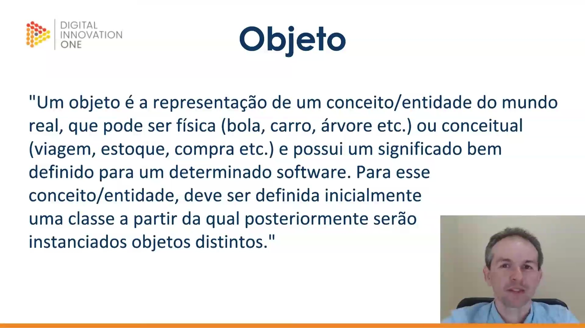
</p>

O conceito de **Objeto** é o pilar central do paradigma de Programação Orientada a Objetos (POO). Um objeto funciona como a representação de uma entidade do mundo real dentro do software, podendo ser algo físico, como um carro ou uma árvore, ou algo conceitual, como uma compra ou um estoque. Enquanto a classe atua como um molde estático, o objeto é a instância viva que armazena valores e executa os métodos na memória do computador.

<p align="center">
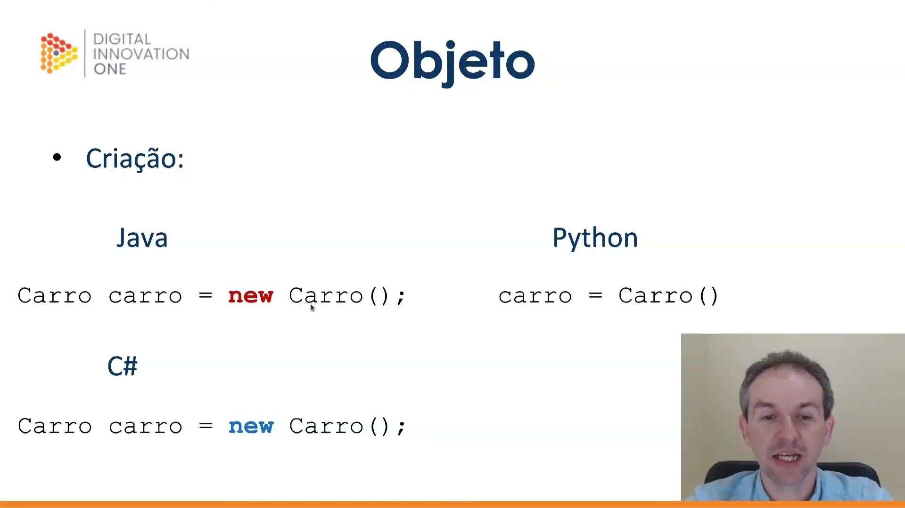
</p>

A criação (instanciação) de objetos varia sutilmente entre as linguagens, mas mantém a mesma lógica de alocação de memória. Em Java e C#, utiliza-se a palavra-chave `new` seguida do construtor da classe. No Python, a sintaxe é mais direta, dispensando o `new` e a declaração explícita de tipos.

**Java**

```java
Carro carro = new Carro();

```

**C#**

```csharp
Carro carro = new Carro();

```

**Python**

```python
carro = Carro()

```

<p align="center">
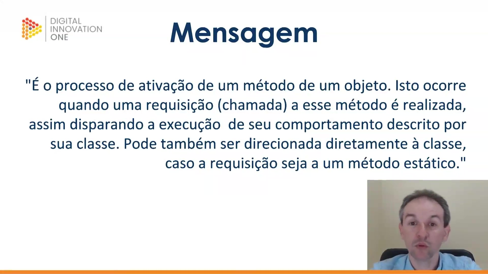
</p>

O conceito de **Mensagem** na POO refere-se ao processo de ativação de um método. Quando o software solicita que um objeto execute um comportamento, ocorre uma "troca de mensagens". Essa requisição dispara a execução da lógica descrita na classe, podendo ser direcionada a uma instância específica ou diretamente à classe, no caso de métodos estáticos.

<p align="center">
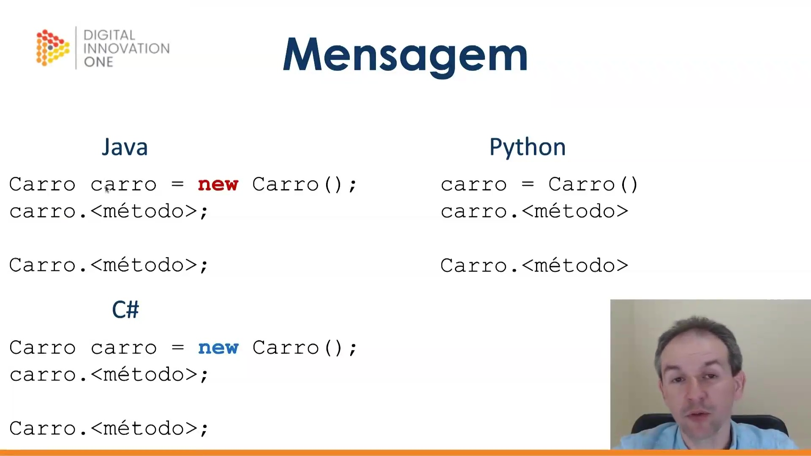
</p>

A prática de envio de mensagens é demonstrada através da chamada de métodos via notação de ponto. É possível interagir com o objeto (instância) ou com a classe (membros estáticos).

**Java / C#**

```java
// Via objeto
carro.<método>;

// Via classe (Estático)
Carro.<método>;

```

**Python**

```python
# Via objeto
carro.<método>

# Via classe (Estático)
Carro.<método>

```

<p align="center">
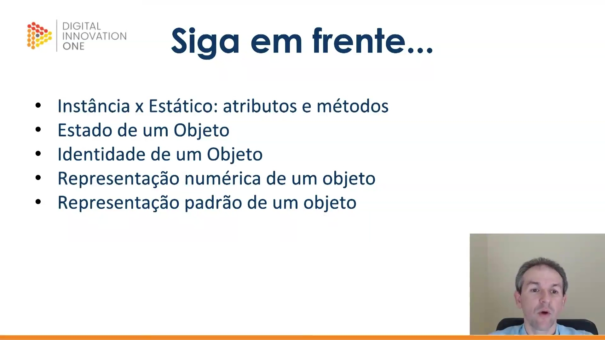
</p>

Para aprofundar o domínio da estrutura de objetos, é fundamental explorar conceitos avançados que definem o comportamento e a gestão de dados:

* **Instância x Estático:** Diferenciação entre atributos/métodos que pertencem ao objeto individual e aqueles que pertencem à classe como um todo.
* **Estado de um Objeto:** Refere-se ao conjunto de valores dos seus atributos em um determinado momento.
* **Identidade de um Objeto:** A necessidade de identificar cada instância de forma única no sistema.
* **Representação Numérica e Padrão:** Formas de representar o objeto de maneira simplificada ou compreensível para o sistema e o desenvolvedor.

<p align="center">
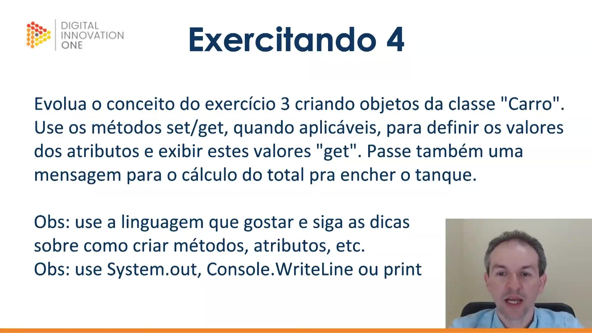
</p>

O **Exercitando 4** propõe a evolução dos conceitos anteriores através da criação prática de objetos da classe "Carro". O objetivo é aplicar métodos `set` e `get` para manipular atributos e realizar a chamada de métodos (passagem de mensagem) para funcionalidades como o cálculo do valor necessário para encher o tanque, utilizando os comandos de saída específicos de cada linguagem (`System.out.println`, `Console.WriteLine` ou `print`).      


## 🟩 Vídeo 13 - Objeto e Mensagem - Exercício

<video width="60%" controls>
  <source src="000-Midia_e_Anexos/bootcamp_tqi_fullstack-modulo.06-curso.11-video_13.webm" type="video/webm">
    Seu navegador não suporta vídeo HTML5.
</video>

link do vídeo: https://web.dio.me/track/tqi-fullstack-developer/course/programacao-orientada-a-objetos/learning/50e688cf-cbf9-46bf-824c-f8409058acec?autoplay=1

Este guia resume a resolução de um exercício prático focado na criação de objetos a partir de uma classe pré-definida (Carro), explorando conceitos fundamentais como instanciacão, métodos e sobrecarga.

### Anotações

Esta etapa final do exercício demonstra a instanciação e manipulação de objetos na prática, utilizando a classe `Carro` como base para a criação de instâncias reais dentro do paradigma de Orientação a Objetos. O código é executado através da classe `RodarAplicacao`, que contém o método `public static void main`, ponto de entrada essencial para a execução de aplicações Java.

A implementação apresenta duas abordagens distintas para a criação de objetos:

* **Instanciação via Construtor Padrão (Default)**: O objeto `carro1` é criado sem parâmetros iniciais. Seus atributos são definidos individualmente através dos métodos **set** (`setCor`, `setModelo`, `setCapacidadeTanque`).
* **Instanciação via Sobrecarga de Construtor**: O objeto `carro2` é criado já recebendo valores diretamente no construtor (cor, modelo e capacidade), eliminando a necessidade de chamadas sucessivas aos métodos set para a inicialização.

Após a criação, o código utiliza os métodos **get** para recuperar e exibir as informações no console, além de invocar o método de negócio `totalValorTanque`, que calcula o custo para encher o tanque com base no preço do combustível fornecido. Ao final da execução, o console exibe os dados processados para uma BMW Série 3 e uma Mercedes-Benz Classe C.

```java
package one.digitalinnovation.oo; // Define o pacote da classe 

class RodarAplicacao { // Declaração da classe principal para execução 
    public static void main(String[] args) { // Método principal, ponto de entrada do Java 
        
        // Exemplo 1: Usando o construtor padrão (sem parâmetros)
        Carro carro1 = new Carro(); // Cria uma instância vazia de Carro
        
        carro1.setCor("Azul"); // Define a cor do objeto carro1
        carro1.setModelo("BMW Série 3"); // Define o modelo do objeto carro1
        carro1.setCapacidadeTanque(59); // Define a capacidade do tanque
        
        // Exibição dos dados do primeiro objeto usando métodos Get
        System.out.println(carro1.getModelo()); // Imprime o modelo definido 
        System.out.println(carro1.getCor()); // Imprime a cor definida 
        System.out.println(carro1.getCapacidadeTanque()); // Imprime a capacidade 
        System.out.println(carro1.totalValorTanque(6.39)); // Calcula e imprime o valor para encher o tanque
        
        // Exemplo 2: Usando sobrecarga de construtor (com parâmetros)
        // O objeto é criado e inicializado em uma única linha 
        Carro carro2 = new Carro("Cinza", "Mercedes-Benz Classe C", 66); 
        
        // Exibição dos dados do segundo objeto
        System.out.println(carro2.getModelo()); // Imprime o modelo inicializado no construtor 
        System.out.println(carro2.getCor()); // Imprime a cor inicializada no construtor 
        System.out.println(carro2.getCapacidadeTanque()); // Imprime a capacidade inicializada 
        System.out.println(carro2.totalValorTanque(6.46)); // Calcula o valor do tanque com outro preço de combustível 
        
    } // Fundo do método main 
} // Fundo da classe RodarAplicacao
```

# Parte 5 - As relações: Herança, Associação e Interface

## 🟩 Vídeo 14 - Herança - Conceito

<video width="60%" controls>
  <source src="000-Midia_e_Anexos/bootcamp_tqi_fullstack-modulo.06-curso.11-video_14.webm" type="video/webm">
    Seu navegador não suporta vídeo HTML5.
</video>

link do vídeo: https://web.dio.me/track/tqi-fullstack-developer/course/programacao-orientada-a-objetos/learning/9f51eaff-a764-4003-a174-f268bc3dcdfc?autoplay=1


## 🟩 Vídeo 15 - Herança - Exercício 1

<video width="60%" controls>
  <source src="000-Midia_e_Anexos/bootcamp_tqi_fullstack-modulo.06-curso.11-video_15.webm" type="video/webm">
    Seu navegador não suporta vídeo HTML5.
</video>

link do vídeo:

## 🟩 Vídeo 16 - Herança - Tipos

<video width="60%" controls>
  <source src="000-Midia_e_Anexos/bootcamp_tqi_fullstack-modulo.06-curso.11-video_16.webm" type="video/webm">
    Seu navegador não suporta vídeo HTML5.
</video>

link do vídeo:

## 🟩 Vídeo 17 - Herança - Upcast e Downcast

<video width="60%" controls>
  <source src="000-Midia_e_Anexos/bootcamp_tqi_fullstack-modulo.06-curso.11-video_17.webm" type="video/webm">
    Seu navegador não suporta vídeo HTML5.
</video>

link do vídeo:

## 🟩 Vídeo 18 - Herança - Polimorfismo e Sobrescrita

<video width="60%" controls>
  <source src="000-Midia_e_Anexos/bootcamp_tqi_fullstack-modulo.06-curso.11-video_18.webm" type="video/webm">
    Seu navegador não suporta vídeo HTML5.
</video>

link do vídeo:

## 🟩 Vídeo 19 - Herança - Proposta de Exercício 2

<video width="60%" controls>
  <source src="000-Midia_e_Anexos/bootcamp_tqi_fullstack-modulo.06-curso.11-video_19.webm" type="video/webm">
    Seu navegador não suporta vídeo HTML5.
</video>

link do vídeo:

## 🟩 Vídeo 20 - Herança - Resolução do exercício 2 - Parte 1

<video width="60%" controls>
  <source src="000-Midia_e_Anexos/bootcamp_tqi_fullstack-modulo.06-curso.11-video_20.webm" type="video/webm">
    Seu navegador não suporta vídeo HTML5.
</video>

link do vídeo:

## 🟩 Vídeo 21 - Herança - Resolução do exercício 2 - Parte 2

<video width="60%" controls>
  <source src="000-Midia_e_Anexos/bootcamp_tqi_fullstack-modulo.06-curso.11-video_21.webm" type="video/webm">
    Seu navegador não suporta vídeo HTML5.
</video>

link do vídeo:

## 🟩 Vídeo 22 - Associação - Conceito

<video width="60%" controls>
  <source src="000-Midia_e_Anexos/bootcamp_tqi_fullstack-modulo.06-curso.11-video_22.webm" type="video/webm">
    Seu navegador não suporta vídeo HTML5.
</video>

link do vídeo:

## 🟩 Vídeo 23 - Associação - Tipos

<video width="60%" controls>
  <source src="000-Midia_e_Anexos/bootcamp_tqi_fullstack-modulo.06-curso.11-video_23.webm" type="video/webm">
    Seu navegador não suporta vídeo HTML5.
</video>

link do vídeo:

## 🟩 Vídeo 24 - Associação - Exercício

<video width="60%" controls>
  <source src="000-Midia_e_Anexos/bootcamp_tqi_fullstack-modulo.06-curso.11-video_24.webm" type="video/webm">
    Seu navegador não suporta vídeo HTML5.
</video>

link do vídeo:

## 🟩 Vídeo 25 - Interface - Conceito

<video width="60%" controls>
  <source src="000-Midia_e_Anexos/bootcamp_tqi_fullstack-modulo.06-curso.11-video_25.webm" type="video/webm">
    Seu navegador não suporta vídeo HTML5.
</video>

link do vídeo:

## 🟩 Vídeo 26 - Interface - Exercício

<video width="60%" controls>
  <source src="000-Midia_e_Anexos/bootcamp_tqi_fullstack-modulo.06-curso.11-video_26.webm" type="video/webm">
    Seu navegador não suporta vídeo HTML5.
</video>

link do vídeo:

# Parte 6 - A Organização de Pacotes e Visibilidades

## 🟩 Vídeo 27 - Pacotes - Conceitos

<video width="60%" controls>
  <source src="000-Midia_e_Anexos/bootcamp_tqi_fullstack-modulo.06-curso.11-video_27.webm" type="video/webm">
    Seu navegador não suporta vídeo HTML5.
</video>

link do vídeo:

## 🟩 Vídeo 28 - Pacotes - Exercício

<video width="60%" controls>
  <source src="000-Midia_e_Anexos/bootcamp_tqi_fullstack-modulo.06-curso.11-video_28.webm" type="video/webm">
    Seu navegador não suporta vídeo HTML5.
</video>

link do vídeo:

## 🟩 Vídeo 29 - Visibilidades - Conceitos

<video width="60%" controls>
  <source src="000-Midia_e_Anexos/bootcamp_tqi_fullstack-modulo.06-curso.11-video_29.webm" type="video/webm">
    Seu navegador não suporta vídeo HTML5.
</video>

link do vídeo:

## 🟩 Vídeo 30 - Visibilidades - Exercício

<video width="60%" controls>
  <source src="000-Midia_e_Anexos/bootcamp_tqi_fullstack-modulo.06-curso.11-video_30.webm" type="video/webm">
    Seu navegador não suporta vídeo HTML5.
</video>

link do vídeo:

## 🟩 Vídeo 31 - Conclusão

<video width="60%" controls>
  <source src="000-Midia_e_Anexos/bootcamp_tqi_fullstack-modulo.06-curso.11-video_31.webm" type="video/webm">
    Seu navegador não suporta vídeo HTML5.
</video>

link do vídeo:


##  Materiais de Apoio

# Certificado: 

- Link na plataforma: 
- Certificado em pdf: