## Instrutor

- Daniel Karam Venceslau (Software Engineer | Elixir)
- Contato Linkedin: / [daniel-kv](https://www.linkedin.com/in/daniel-kv/)

## Parte 1 - Introdução ao JDBC

### 🟩 Vídeo 01 - Introdução ao Banco de Dados

<video width="60%" controls>
  <source src="000-Midia_e_Anexos/bootcamp_tqi_fullstack-modulo.06-curso.12-video_01.webm" type="video/webm">
    Seu navegador não suporta vídeo HTML5.
</video>

link do vídeo: https://web.dio.me/track/tqi-fullstack-developer/course/trabalhando-com-banco-de-dados-utilizando-jdbc-e-jpa/learning/36caf662-304d-444b-978d-958d79bb5a9a?autoplay=1

Este vídeo resume a introdução ao curso de integração entre Java e sistemas de gerenciamento de banco de dados (SGBD), cobrindo desde os objetivos principais até os requisitos técnicos necessários para o acompanhamento das aulas.

### Anotações

#### Introdução ao Curso

<p align="center">
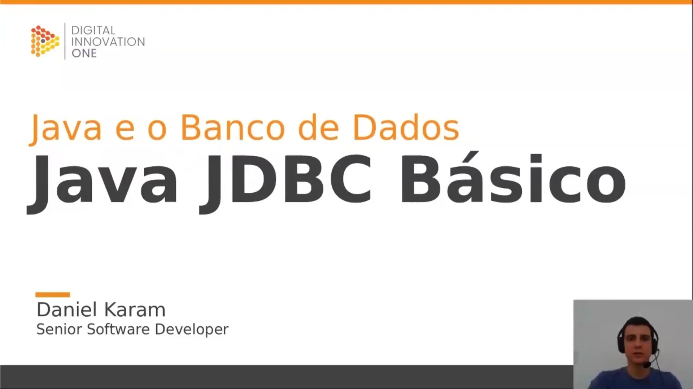
</p>

Esta aula inicia o curso de Java e o Banco de Dados , focando especificamente no JDBC Básico. O conteúdo é apresentado por Daniel Karam , que atua como Senior Software Developer.

#### Objetivos da Aula

<p align="center">
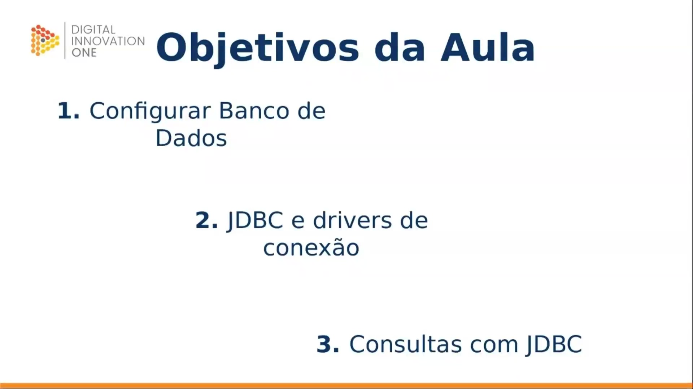
</p>

Os tópicos principais definidos para a aula são:

* **Configurar Banco de Dados**: Preparação do ambiente de armazenamento.
* **JDBC e drivers de conexão**: Entendimento da interface de conectividade do Java.
* **Consultas com JDBC**: Realização de operações de busca de dados.

#### Requisitos Básicos

<p align="center">
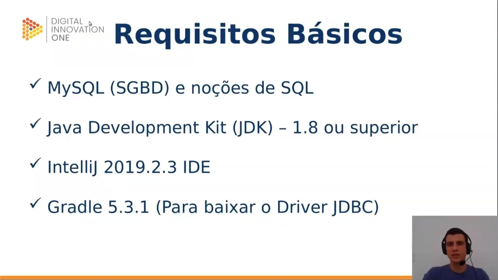
</p>

Para o acompanhamento do curso, são necessários os seguintes componentes técnicos:

* **MySQL (SGBD)**: Incluindo noções fundamentais de SQL para manipulação de dados.
* **Java Development Kit (JDK)**: Versão 1.8 ou superior.
* **Intellij 2019.2.3 IDE**: Ambiente de desenvolvimento integrado utilizado.
* **Gradle 5.3.1**: Ferramenta de automação utilizada especificamente para baixar o Driver JDBC.

#### Materiais

<p align="center">
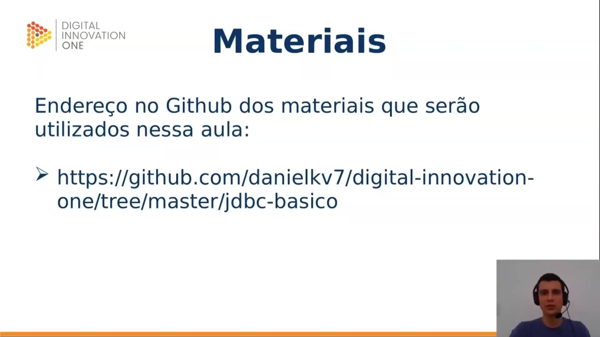
</p>

Os materiais didáticos e códigos utilizados durante a aula estão hospedados no GitHub. O endereço direto para o repositório é:
`https://github.com/danielkv7/digital-innovation-one/tree/master/jdbc-basico`.

#### Estrutura do Repositório

<p align="center">
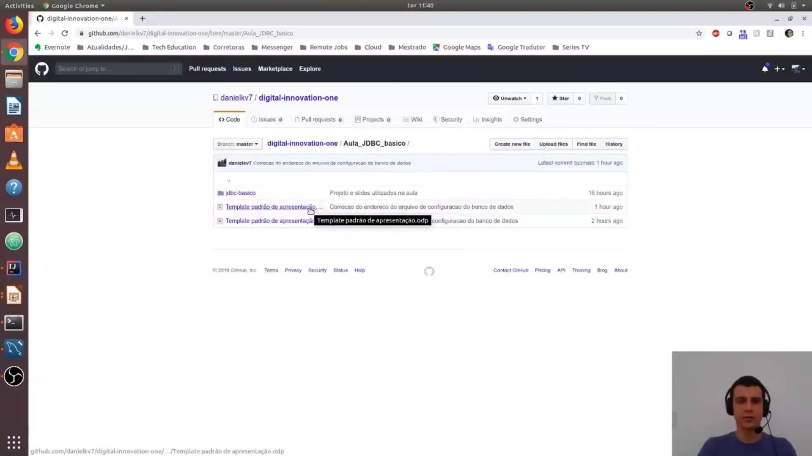
</p>

A interface do GitHub exibe a organização dos arquivos na pasta `Aula_JDBC_basico`. Entre os arquivos disponíveis estão:

* **Projeto e slides**: Localizados na pasta `jdbc-basico`.
* **Template de apresentação**: Arquivos no formato `.odp` contendo o conteúdo visual da aula.


### 🟩 Vídeo 02 - Configurar Banco de Dados

<video width="60%" controls>
  <source src="000-Midia_e_Anexos/bootcamp_tqi_fullstack-modulo.06-curso.12-video_02.webm" type="video/webm">
    Seu navegador não suporta vídeo HTML5.
</video>

link do vídeo: https://web.dio.me/track/tqi-fullstack-developer/course/trabalhando-com-banco-de-dados-utilizando-jdbc-e-jpa/learning/a069a2bd-5368-46df-8af1-7a65fd602296?autoplay=1

Este guia prático detalha o processo de instalação, configuração e manipulação inicial de um banco de dados MySQL, preparando o ambiente para integração com sistemas Java.

### Anotações

<p align="center">
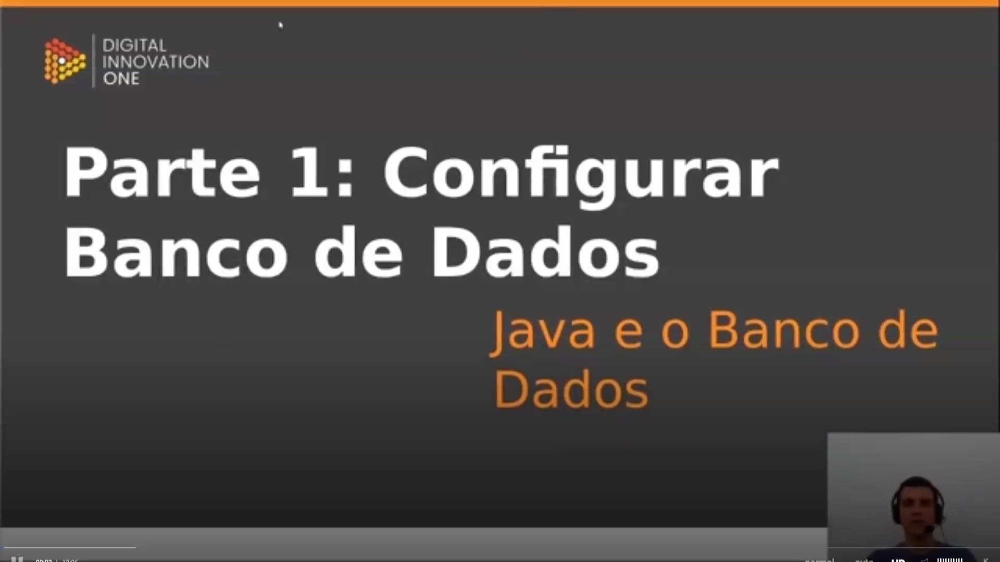
</p>

Esta etapa inicial foca na configuração do ambiente de banco de dados. O objetivo é preparar o ecossistema para que uma aplicação Java consiga se comunicar e persistir informações de forma eficiente.

<p align="center">

</p>

Um Banco de Dados (BD) é um software especializado em armazenar dados de forma estruturada. Essa organização aumenta a eficiência computacional, reduzindo o consumo de memória e o tempo de processamento durante operações de busca e atualização. Para este aprendizado, utilizaremos o MySQL, um sistema de gerenciamento de banco de dados (SGBD) relacional amplamente adotado no mercado.

<p align="center">
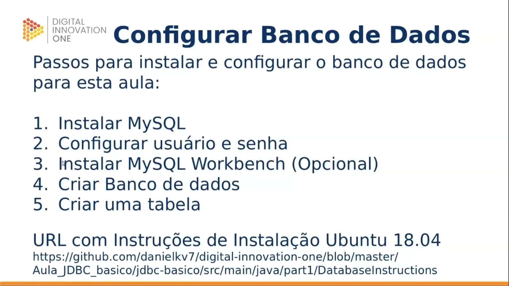
</p>

O processo de configuração está dividido em cinco passos fundamentais:

1. **Instalação do MySQL**: Preparação do SGBD na máquina local.
2. **Configuração de Credenciais**: Definição de usuário e senha para acesso seguro.
3. **Instalação do MySQL Workbench**: Adição de uma interface gráfica (GUI) para facilitar a visualização dos dados.
4. **Criação do Banco de Dados**: Instanciação do ambiente onde as tabelas residirão.
5. **Criação de Tabela**: Definição da estrutura de dados que será manipulada pela aplicação Java.

<p align="center">
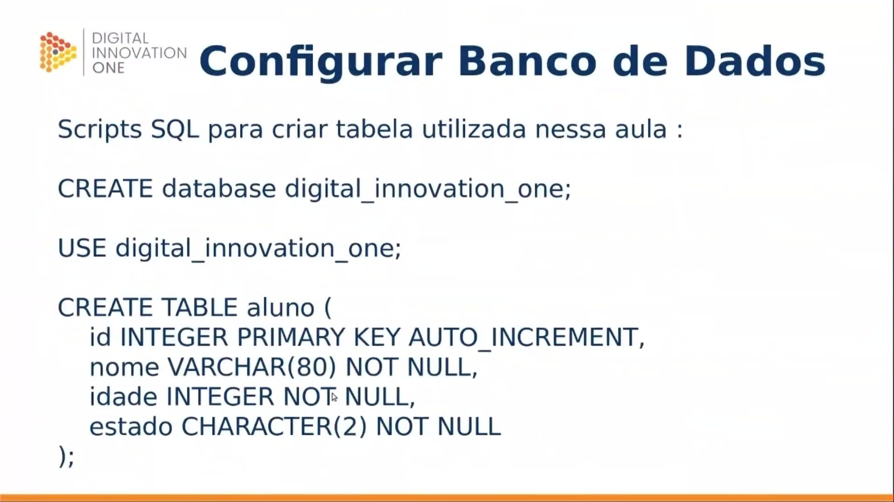
</p>

Para criar a estrutura necessária para a aula, utilizamos scripts SQL que definem o banco de dados e a tabela de alunos, especificando tipos de dados como inteiros e caracteres, além de restrições como chaves primárias e campos obrigatórios.

```sql
CREATE database digital_innovation_one;

USE digital_innovation_one;

CREATE TABLE aluno (
    id INTEGER PRIMARY KEY AUTO_INCREMENT,
    nome VARCHAR(80) NOT NULL,
    idade INTEGER NOT NULL,
    estado CHARACTER(2) NOT NULL
);
```

<p align="center">
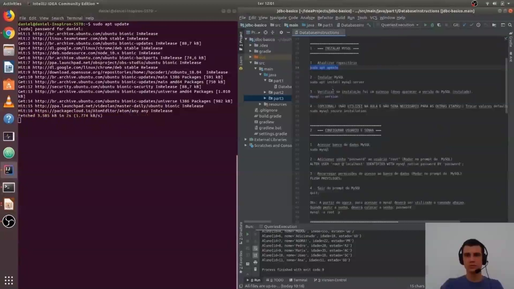
</p>

A instalação no ambiente Ubuntu 18.04 é realizada via terminal, começando pela atualização dos repositórios e seguindo para a instalação do servidor MySQL. Após a instalação, é necessário configurar a senha do usuário `root` para permitir acessos futuros via aplicação ou interface gráfica.

```bash
# Atualizar repositórios do sistema
sudo apt update

# Instalar o servidor MySQL
sudo apt install mysql-server

# Verificar a versão instalada para confirmar o sucesso
mysql --version

# Acessar o MySQL e configurar a senha (dentro do prompt MySQL)
ALTER USER 'root'@'localhost' IDENTIFIED WITH mysql_native_password BY 'password';
FLUSH PRIVILEGES;
```

O tutorial segue os passos disponíveis no arquivo "DatabaseInstructions" (https://github.com/ahaerdy/fork-DIO-java-jdbc-basico-daniel-kv/blob/master/src/main/java/part1/DatabaseInstructions) para instanciar os bancos de dados, tabelas e alguns registros para teste.

<p align="center">
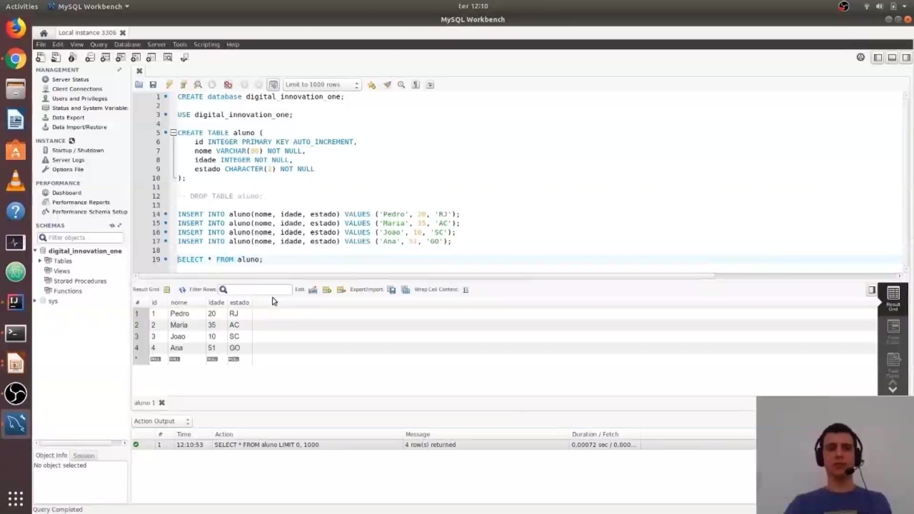
</p>

O MySQL Workbench oferece uma visão clara da estrutura criada e dos dados inseridos. Através da interface, é possível executar comandos SQL e visualizar o resultado em formato de grade, o que é especialmente útil para validar se as inserções de dados (como os registros de Pedro, Maria, João e Ana) foram realizadas corretamente antes de iniciar a integração com o código Java.

```sql
-- Selecionar todos os registros da tabela para validação
SELECT * FROM aluno;
```      

### 🟩 Vídeo 03 - JDBC e drivers de conexão

<video width="60%" controls>
  <source src="000-Midia_e_Anexos/bootcamp_tqi_fullstack-modulo.06-curso.12-video_03.webm" type="video/webm">
    Seu navegador não suporta vídeo HTML5.
</video>

link do vídeo: https://web.dio.me/track/tqi-fullstack-developer/course/trabalhando-com-banco-de-dados-utilizando-jdbc-e-jpa/learning/efa48762-3c2f-44a4-befc-3ac7fb124e99?autoplay=1

Esta aula foca na Parte 2 do aprendizado de Java com Banco de Dados, detalhando o que é o JDBC (Java Database Connectivity) e como estabelecer uma conexão real com o MySQL. O objetivo principal é entender a abstração que o Java oferece para lidar com diferentes bancos de dados de forma padronizada.

### Anotações

<p align="center">

</p>

Esta imagem introduz a segunda parte do curso, focada em **JDBC e drivers de conexão** no contexto de Java e Banco de Dados. O JDBC (Java Database Connectivity) é apresentado como a ferramenta fundamental para permitir que aplicações escritas em Java se comuniquem com diferentes sistemas de gerenciamento de banco de dados.

<p align="center">
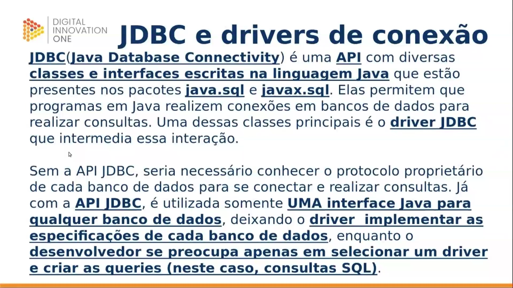
</p>

O JDBC é uma API composta por classes e interfaces nos pacotes `java.sql` e `javax.sql` que padronizam a conexão com bancos de dados. Sem essa API, o desenvolvedor precisaria conhecer o protocolo proprietário de cada banco. Com o JDBC, utiliza-se uma interface única, delegando ao **driver** a implementação das especificidades de cada banco, o que permite ao desenvolvedor focar apenas na seleção do driver correto e na criação das queries SQL.

<p align="center">

</p>

As principais ferramentas para estabelecer essa conexão são a classe **DriverManager** e a interface **Connection**. A `DriverManager` gerencia os drivers disponíveis e utiliza uma URL específica (contendo o driver, a localização e o nome do banco) para criar uma instância de `Connection`. Esta interface, por sua vez, representa a conexão ativa e permite a criação de "Statements" para a execução de comandos SQL.

<p align="center">
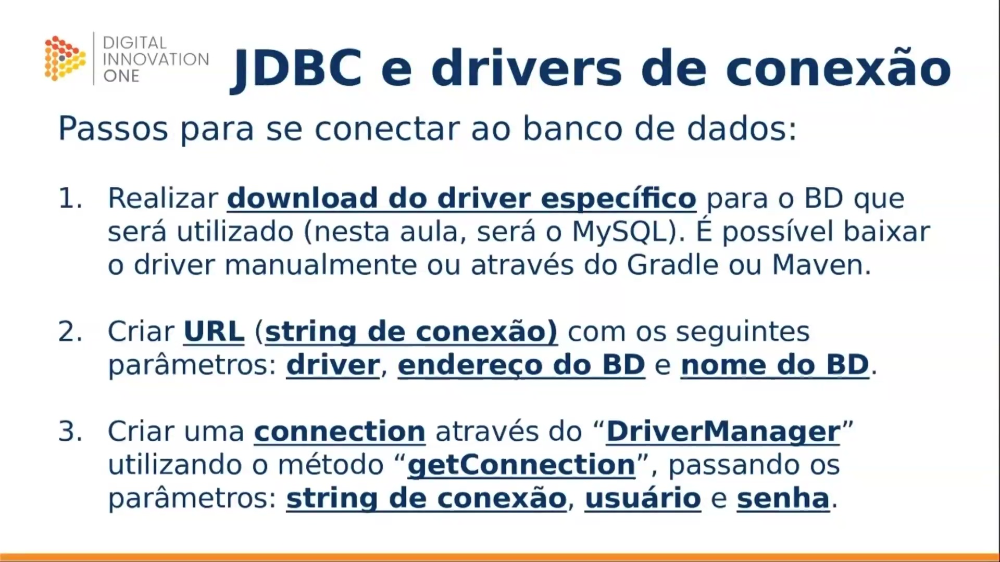
</p>

O processo de conexão segue três passos fundamentais:

1. **Download do driver**: Obter o driver específico do banco (neste caso, MySQL) via Gradle, Maven ou manualmente.
2. **Criação da URL**: Definir a string de conexão com os parâmetros do driver, endereço e nome do banco de dados.
3. **Estabelecimento da conexão**: Utilizar o método `getConnection` da `DriverManager`, fornecendo a URL, o usuário e a senha.

A implementação prática em Java utiliza o bloco *try-with-resources* para garantir que a conexão seja fechada automaticamente. O código abaixo demonstra a definição dos parâmetros, a construção da URL via `StringBuilder` (incluindo parâmetros de timezone para evitar erros no Linux) e a tentativa de conexão.

```java
package part2; // Define que este arquivo pertence ao pacote 'part2', organizando a estrutura do projeto.

// Importa a interface Connection, que gerencia a sessão de comunicação com o banco de dados.
import java.sql.Connection;
// Importa a classe DriverManager, responsável por selecionar o driver correto e estabelecer a conexão.
import java.sql.DriverManager;
// Importa a classe SQLException, que serve para tratar erros que possam ocorrer no banco (ex: senha errada).
import java.sql.SQLException;

public class ConnectionJDBC {

    // Método principal (main) onde a execução do programa Java começa.
    public static void main(String[] args) {

        // 1 - DEFINIÇÃO DOS PARAMETROS DE CONEXÃO

        // Define qual tecnologia de banco de dados estamos usando (neste caso, MySQL).
        String driver = "mysql";

        // Define o endereço do servidor. 'localhost' indica que o banco está na sua própria máquina (Kubuntu).
        String dataBaseAddress = "localhost";

        // Define o nome exato do banco de dados que foi criado anteriormente via terminal.
        String dataBaseName = "digital_innovation_one";

        // Define o usuário administrador do banco de dados.
        String user = "root";

        // Define a senha de acesso. Aqui usamos "123456" conforme você configurou no seu sistema.
        String password = "123456";

        // 2 - CONSTRUÇÃO DA URL DE CONEXÃO

        // Instancia um StringBuilder para montar a String de conexão de forma eficiente e legível.
        StringBuilder sb = new StringBuilder("jdbc:")
                .append(driver).append("://")            // Adiciona o protocolo e driver: "jdbc:mysql://"
                .append(dataBaseAddress).append("/")     // Adiciona o endereço: "localhost/"
                .append(dataBaseName)                    // Adiciona o nome do banco: "digital_innovation_one"
                // Adiciona parâmetros vitais para o Linux/Kubuntu para evitar erros de fuso horário.
                .append("?useTimezone=true&serverTimezone=UTC");

        // Converte o objeto construtor (StringBuilder) para uma String final que o JDBC entende.
        String connectionUrl = sb.toString();

        // 3 - TENTATIVA DE CONEXÃO (TRY-WITH-RESOURCES)

        /* O comando 'try (Connection conn = ...)' é especial.
           Ele tenta abrir a conexão. Se conseguir, executa o bloco.
           Ao final (dando certo ou erro), ele FECHA a conexão automaticamente, liberando memória.
        */
        try (Connection conn = DriverManager.getConnection(connectionUrl, user, password)) {

            // Se a linha acima funcionar, o código entra aqui e imprime a mensagem de sucesso.
            System.out.println("SUCESSO ao se conectar ao banco MySQL no Kubuntu!");

        } catch (SQLException e) {
            // Se algo der errado (senha inválida, banco desligado, etc), o código pula para cá.

            // Imprime uma mensagem simples avisando que falhou.
            System.out.println("FALHA ao se conectar ao banco MySQL!");

            // Imprime o motivo técnico do erro (ex: "Access denied for user 'root'").
            System.out.println("Motivo: " + e.getMessage());

            // Imprime o rastro completo do erro no console (linhas vermelhas) para ajudar a corrigir.
            e.printStackTrace();
        }
    }
}
```

O uso do bloco `try-catch` (especificamente o **try-with-resources**) no código de conexão JDBC não é apenas uma boa prática, mas uma medida de segurança e estabilidade para a aplicação.

Análise detalhada da sua necessidade e finalidade:

#### 1. A Natureza da Operação (Por que o Try?)

Conectar-se a um banco de dados é uma operação considerada "instável" por natureza. Diferente de somar dois números, uma conexão depende de fatores externos ao código Java:

* O banco de dados pode estar desligado.
* A rede pode oscilar.
* As credenciais (usuário/senha) podem estar incorretas.

🔴 O Java **obriga** o uso de tratamento de exceções. Se você tentar usar o `DriverManager.getConnection` sem um bloco `try-catch`, o código **NEM SEQUER COMPILARÁ**. O bloco `try` sinaliza ao programa: *"Tente executar este conjunto de instruções que podem falhar a qualquer momento"*.

#### 2. O Recurso "With-Resources" (A finalidade do parêntese)

Note que no código o `Connection` é declarado dentro de parênteses: `try (Connection conn = ...)`. Esta é uma funcionalidade do Java 7 chamada **Try-with-resources**.

Sua finalidade é a **gestão de memória e recursos**. Uma conexão com o banco de dados consome memória tanto na sua aplicação quanto no servidor do banco. Se você abrir milhares de conexões e não as fechar, o banco de dados travará por falta de recursos (o famoso "leak").

* **Antigamente:** Era necessário um bloco `finally` e um comando `conn.close()` manual.
* **Atualmente:** Ao usar essa estrutura, o Java garante que, assim que o bloco terminar (seja com sucesso ou com erro), a conexão será **fechada automaticamente**.

#### 3. O Bloco Catch (A Narrativa do Erro)

O bloco `catch (SQLException e)` é o seu "plano de contingência". Sem ele, se houvesse um erro de senha, a aplicação simplesmente "quebraria" (pararia de funcionar) e mostraria uma mensagem técnica indecifrável para o usuário final.

Sua finalidade técnica é:

* **Interceptar a Exceção:** Capturar o objeto `SQLException`, que contém os detalhes do que deu errado.
* **Tratamento Amigável:** No código, ele imprime uma mensagem clara: *"FALHA ao se conectar ao banco MySQL!"*.
* **Diagnóstico:** O uso de `e.getMessage()` e `e.printStackTrace()` permite que o desenvolvedor saiba exatamente se o problema foi uma senha errada, um banco inexistente ou um erro de rede, sem interromper abruptamente o fluxo de outros processos que o sistema possa estar executando.

#### Resumo Técnico

| Componente | Função Técnica | Finalidade Prática |
| --- | --- | --- |
| **Try block** | Delimita a zona de risco. | Isolar o código que depende do banco de dados externo. |
| **Resources ( )** | Implementa `AutoCloseable`. | Garante o fechamento da conexão e evita vazamento de memória. |
| **Catch block** | Captura `SQLException`. | Evita que o programa encerre e fornece logs para correção do erro. |


<p align="center">

</p>

Para encontrar a dependência correta do driver, uma prática comum é realizar uma busca em repositórios como o **MVN Repository**. A imagem mostra uma pesquisa por "mysql jdbc driver", que lista diversas versões do `mysql-connector-java` disponíveis para integração em projetos que utilizam gerenciadores de dependências.

<p align="center">
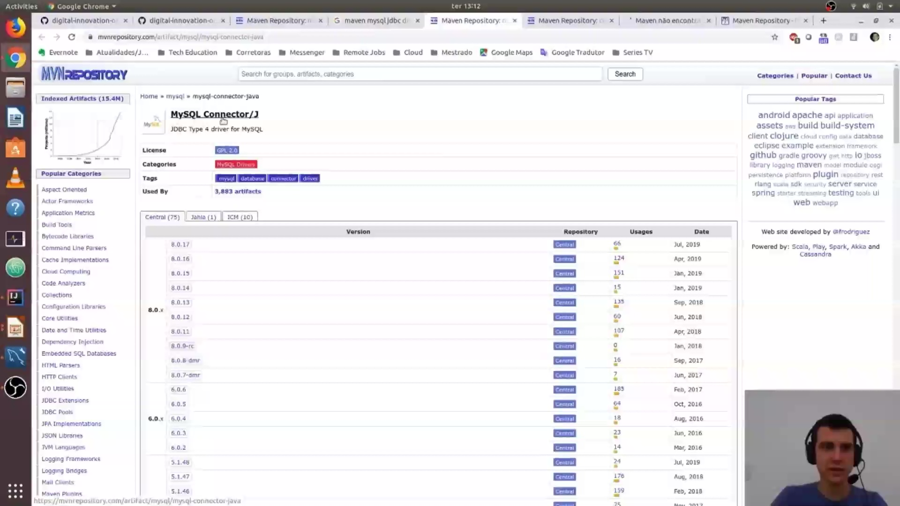
</p>

Ao acessar o repositório Maven, é possível visualizar as diferentes versões do artefato (como a 8.0.17 ou a 5.1.48) e escolher a mais adequada para o projeto. O site fornece informações sobre a data de lançamento e a popularidade de cada versão.

<p align="center">
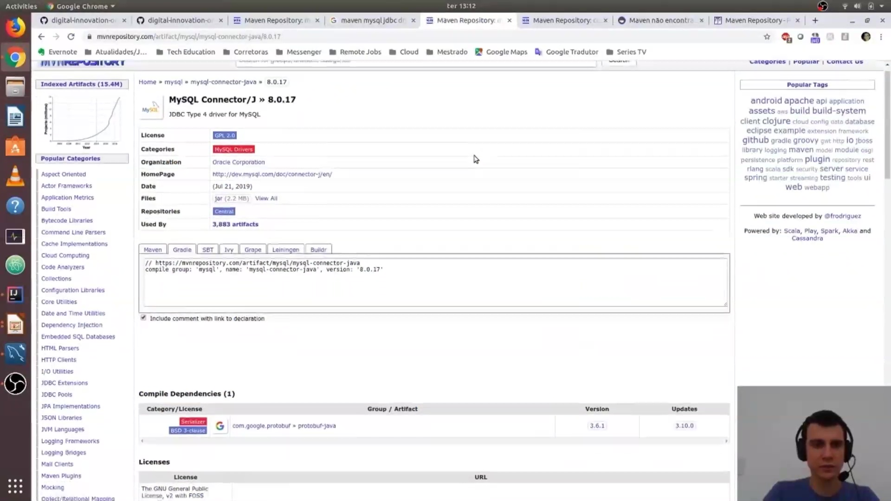
</p>

Após selecionar a versão desejada, o repositório disponibiliza os trechos de configuração prontos para serem copiados. Na imagem, observa-se a aba do **Gradle**, onde a linha de dependência para a versão 8.0.17 do `mysql-connector-java` é fornecida para ser colada no arquivo de configuração do projeto.

<p align="center">
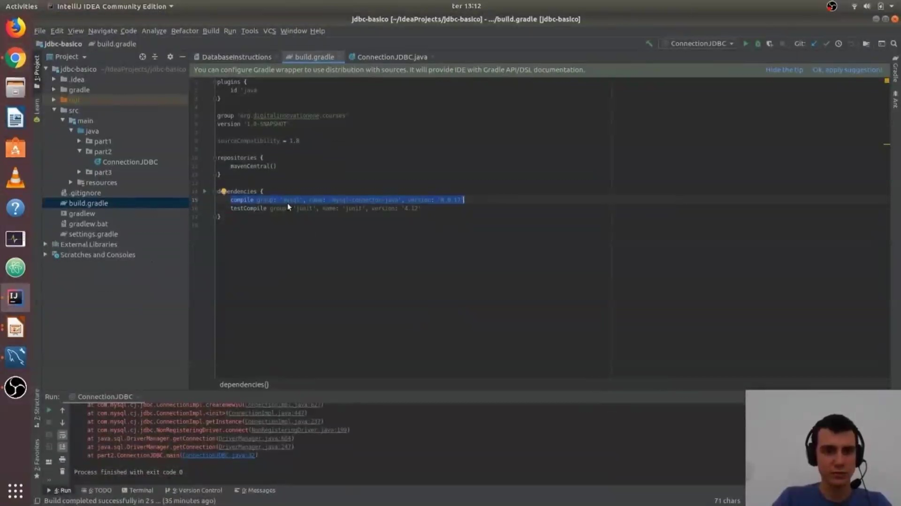
</p>

No IntelliJ IDEA, a dependência é adicionada dentro do bloco `dependencies` no arquivo `build.gradle`. Após a sincronização, o driver é baixado automaticamente, permitindo que a execução da classe `ConnectionJDBC` resulte em sucesso, conforme indicado no console da IDE com o código de saída 0.

<p align="center">
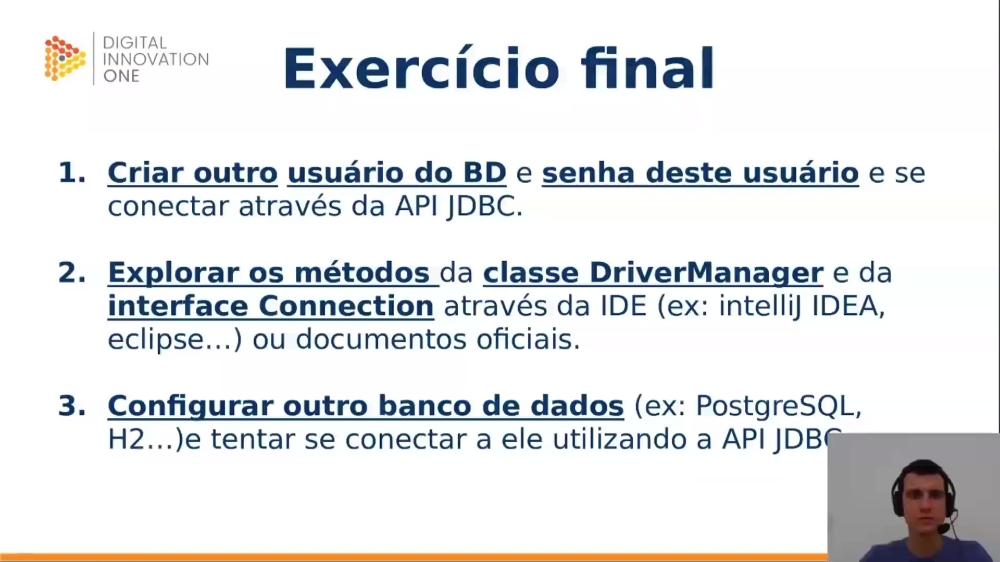
</p>

Para consolidar o aprendizado, os exercícios finais propõem:

1. Criar um novo usuário no banco de dados e conectar-se com ele via JDBC.
2. Explorar os métodos das classes `DriverManager` e `Connection` através da IDE ou documentação oficial.
3. Configurar um banco de dados diferente (PostgreSQL ou H2) e realizar a conexão utilizando o driver apropriado.      

### 🟩 Vídeo 04 - Consultas com JDBC

<video width="60%" controls>
  <source src="000-Midia_e_Anexos/bootcamp_tqi_fullstack-modulo.06-curso.12-video_04.webm" type="video/webm">
    Seu navegador não suporta vídeo HTML5.
</video>

link do vídeo: https://web.dio.me/track/tqi-fullstack-developer/course/trabalhando-com-banco-de-dados-utilizando-jdbc-e-jpa/learning/f0c8a11c-cb6c-474b-bb44-fac4b5d575ef?autoplay=1

Este guia resume a parte 3 do curso de Java e Banco de Dados, focando na execução de consultas SQL através da aplicação Java, utilizando a biblioteca JDBC. O conteúdo aborda desde a teoria das interfaces de consulta até a implementação prática de um CRUD completo.

### Anotações

<p align="center">
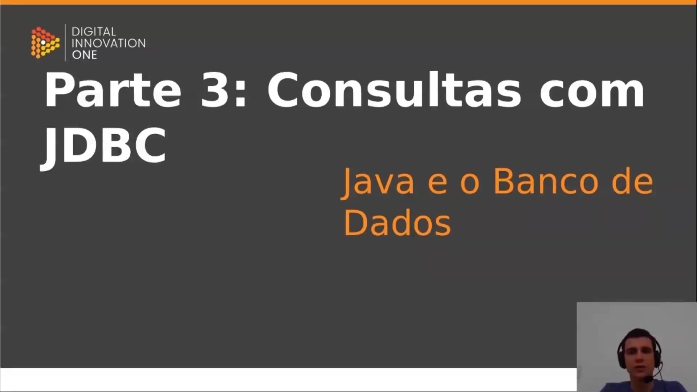
</p>

Esta imagem marca o início da terceira parte do treinamento, focada especificamente em **Consultas com JDBC**. O objetivo central é capacitar o desenvolvedor a interagir com bancos de dados relacionais utilizando a linguagem Java, permitindo que a aplicação envie comandos SQL e receba os dados processados de forma eficiente e segura.

<p align="center">
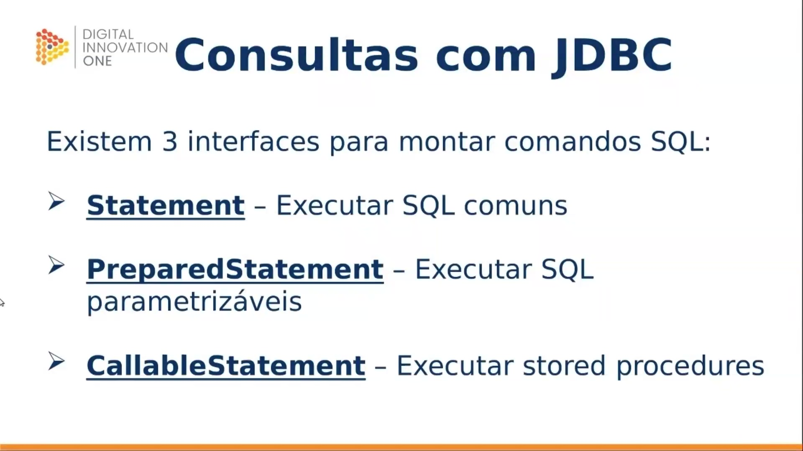
</p>

O JDBC disponibiliza três interfaces fundamentais para a execução de comandos SQL. A escolha de cada uma depende da necessidade técnica da consulta:

* **Statement**: Utilizada para executar instruções SQL simples e estáticas, onde não há necessidade de passar parâmetros dinâmicos.
* **PreparedStatement**: Uma extensão do Statement que permite a execução de consultas parametrizáveis (com o uso do caractere `?`), sendo a opção mais segura e performática.
* **CallableStatement**: Interface específica para a execução de *Stored Procedures* (procedimentos armazenados) no banco de dados.

<p align="center">
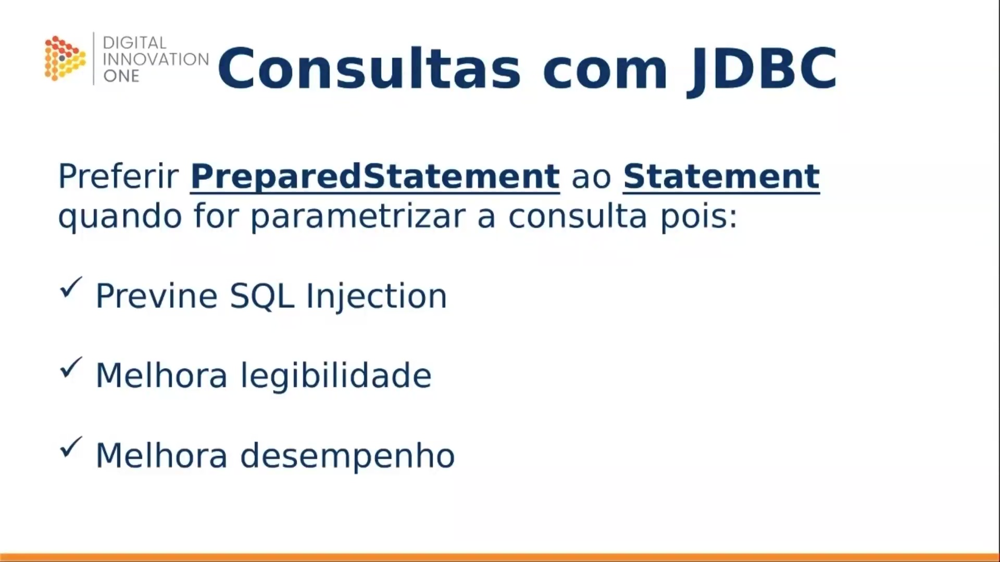
</p>

O uso de **PreparedStatement** é fortemente recomendado em relação ao Statement comum por três pilares críticos:

1. **Previne SQL Injection**: Ao tratar os parâmetros separadamente do comando SQL, evita-se que códigos maliciosos inseridos por usuários sejam executados como comandos.
2. **Melhora a legibilidade**: O código fica mais limpo, sem a necessidade de concatenações complexas de strings para formar o comando SQL.
3. **Melhora o desempenho**: O banco de dados pode pré-compilar a estrutura da consulta, reaproveitando-a para diferentes valores de parâmetros.

<p align="center">
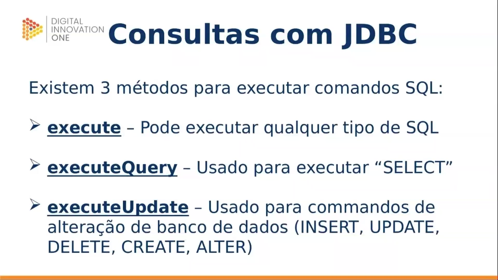
</p>

Existem três métodos principais para disparar as execuções no banco:

* **execute**: Método genérico que pode executar qualquer tipo de instrução SQL.
* **executeQuery**: Utilizado exclusivamente para instruções `SELECT`. Ele retorna um objeto `ResultSet` contendo os dados encontrados.
* **executeUpdate**: Utilizado para comandos que modificam dados ou a estrutura do banco (`INSERT`, `UPDATE`, `DELETE`, `CREATE`, `ALTER`). Ele retorna um inteiro representando o número de linhas afetadas.

<p align="center">
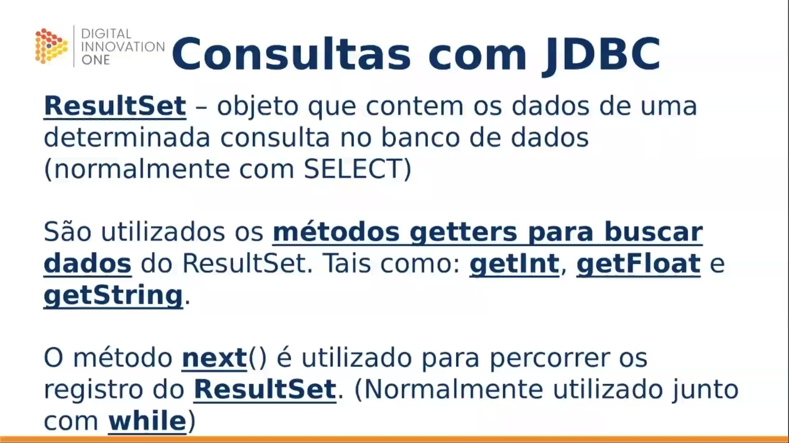
</p>

O **ResultSet** funciona como um cursor que aponta para as linhas retornadas pelo banco de dados.

* O método `.next()` move o cursor para a próxima linha e retorna `true` enquanto houver dados.
* Para obter o conteúdo das colunas, utilizamos os métodos "get" tipados (ex: `.getInt()`, `.getString()`), passando o nome da coluna ou seu índice como parâmetro.

Captura da interface (IntelliJ) mostrando a organização das pastas:

<p align="center">
  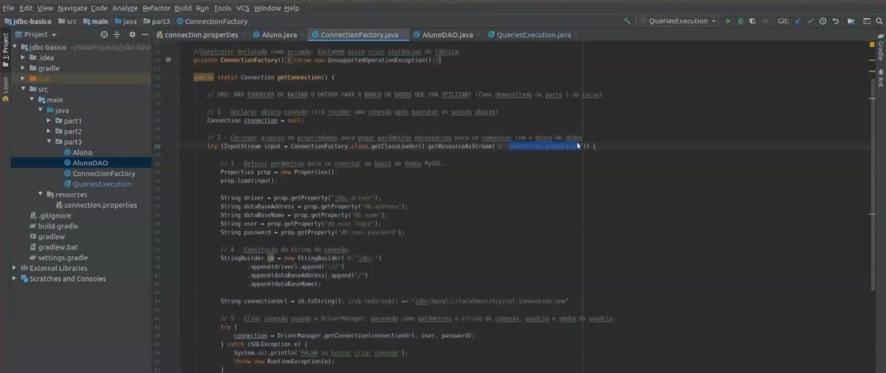
</p>

Abaixo, a classe de modelo `Aluno`, que representa a entidade do banco de dados no mundo Java:

```java
package part3; // Define o pacote da classe

public class Aluno {
    // Atributos privados que correspondem às colunas da tabela 'aluno'
    private int id;
    private String nome;
    private int idade;
    private String estado;

    // Construtor completo para quando já temos o ID (ex: ao buscar do banco)
    public Aluno(int id, String nome, int idade, String estado) {
        this.id = id;
        this.nome = nome;
        this.idade = idade;
        this.estado = estado;
    }

    // Construtor sem ID (ex: para novas inserções onde o banco gera o ID)
    public Aluno(String nome, int idade, String estado) {
        this.nome = nome;
        this.idade = idade;
        this.estado = estado;
    }

    // Construtor vazio (padrão JavaBean)
    public Aluno(){}

    // Métodos Getter e Setter para acesso e modificação controlada dos dados
    public int getId() { return id; }
    public void setId(int id) { this.id = id; }

    public String getNome() { return nome; }
    public void setNome(String nome) { this.nome = nome; }

    public int getIdade() { return idade; }
    public void setIdade(int idade) { this.idade = idade; }

    public String getEstado() { return estado; }
    public void setEstado(String estado) { this.estado = estado; }

    // Sobrescrita do método toString para facilitar a impressão do objeto no console
    @Override
    public String toString() {
        final StringBuilder sb = new StringBuilder("Aluno{");
        sb.append("id=").append(id);
        sb.append(", nome='").append(nome).append('\'');
        sb.append(", idade=").append(idade);
        sb.append(", estado= ").append(estado).append('\'');
        sb.append('}');
        return sb.toString();
    }
}
```

O arquivo `connection.properties` armazena as configurações de acesso ao banco de forma externa ao código compilado:

```properties
jdbc.driver=mysql            # Define que o banco utilizado é MySQL
db.address=localhost         # Endereço do servidor onde o banco está hospedado
db.name=digital_innovation_one # Nome do esquema/banco de dados
db.user.login=root           # Usuário para autenticação
db.user.password=password    # Senha para autenticação
```

A classe `ConnectionFactory` centraliza a lógica de criação de conexões:

```java
package part3;

import java.io.FileInputStream;
import java.io.IOException;
import java.io.InputStream;
import java.sql.Connection;
import java.sql.DriverManager;
import java.sql.SQLException;
import java.util.Properties;

public class ConnectionFactory {
    // Construtor privado para evitar que a classe seja instanciada (utilitária)
    private ConnectionFactory() {
        throw new UnsupportedOperationException();
    }

    // Método estático que fornece a conexão ativa
    public static Connection getConnection() {
        Connection connection = null;
        // Try-with-resources para carregar o arquivo de propriedades da pasta resources
        try (InputStream input = ConnectionFactory.class.getClassLoader().getResourceAsStream("connection.properties")) {
            Properties prop = new Properties();
            prop.load(input); // Carrega as chaves e valores do arquivo

            // Recupera cada propriedade individualmente
            String driver = prop.getProperty("jdbc.driver");
            String dataBaseAddress = prop.getProperty("db.address");
            String dataBaseName = prop.getProperty("db.name");
            String user = prop.getProperty("db.user.login");
            String password = prop.getProperty("db.user.password");

            // Monta a String de conexão JDBC (Ex: jdbc:mysql://localhost/digital_innovation_one)
            StringBuilder sb = new StringBuilder("jdbc:")
                    .append(driver).append("://")
                    .append(dataBaseAddress).append("/")
                    .append(dataBaseName);
            
            String connectionUrl = sb.toString();
            // Solicita a conexão ao Driver Manager usando a URL, usuário e senha
            connection = DriverManager.getConnection(connectionUrl, user, password);

        } catch (SQLException e) {
            System.out.println("FALHA ao tentar criar conexão");
            throw new RuntimeException(e);
        } catch (IOException e) {
            System.out.println("FALHA ao tentar carregar arquivos de propriedades");
            e.printStackTrace();
        }
        return connection; // Retorna o objeto Connection pronto para uso
    }
}
```

O padrão DAO isola a lógica de persistência. Abaixo, o detalhamento do método de listagem:

```java
// Dentro da classe AlunoDAO
public List<Aluno> list() {
    // Cria uma lista vazia para armazenar os resultados
    List<Aluno> alunos = new ArrayList<>();
    
    // Abre a conexão automaticamente usando try-with-resources
    try (Connection conn = ConnectionFactory.getConnection()) {
        String sql = "SELECT * FROM aluno"; // SQL de consulta
        
        // Prepara a execução do comando SQL
        PreparedStatement stmt = conn.prepareStatement(sql);
        
        // Executa a consulta e recebe o ResultSet
        ResultSet rs = stmt.executeQuery();

        // Enquanto houver linhas no ResultSet...
        while (rs.next()) {
            // Extrai os valores das colunas pelo nome
            int id = rs.getInt("id");
            String nome = rs.getString("nome");
            int idade = rs.getInt("idade");
            String estado = rs.getString("estado");
            
            // Cria o objeto Aluno e o adiciona na lista
            alunos.add(new Aluno(id, nome, idade, estado));
        }
    } catch (SQLException e) {
        System.out.println("Listagem de alunos FALHOU");
        e.printStackTrace();
    }
    return alunos; // Retorna a lista populada ou vazia
}
```

A classe `QueriesExecution` demonstra o uso prático de todas as camadas construídas:

```java
package part3;

import java.sql.*;
import java.util.ArrayList;
import java.util.List;

public class QueriesExecution {
    public static void main(String[] args) {
        // Instancia o objeto de acesso a dados
        AlunoDAO alunoDAO = new AlunoDAO();

        // 1 - Operação de Consulta (Read)
        List<Aluno> alunos = alunoDAO.list(); // Chama o método list() do DAO
        // Imprime cada aluno da lista usando Stream API do Java 8+
        alunos.stream().forEach(System.out::println);

        // 1.1 - Consulta com filtro (Read by ID)
        // Busca o aluno com ID 1 no banco
        Aluno alunoParaConsulta = alunoDAO.getById(1);

        // 2 - Operação de Inserção (Create)
        // Cria um novo objeto Aluno (ID será gerado pelo banco)
        Aluno alunoParaInsercao = new Aluno("Matheus", 43, "SP");
        // alunoDAO.create(alunoParaInsercao); // Comentado para evitar inserções repetidas em testes

        // 3 - Operação de Exclusão (Delete)
        // Remove o aluno de ID 1 (exemplo comentado)
        // alunoDAO.delete(1);

        // 4 - Operação de Atualização (Update)
        // Primeiro recupera o objeto existente, altera os valores em memória e depois salva
        Aluno alunoParaAtualizar = alunoDAO.getById(3);
        alunoParaAtualizar.setNome("Joaquim");
        alunoParaAtualizar.setIdade(18);
        alunoParaAtualizar.setEstado("RS");
        // alunoDAO.update(alunoParaAtualizar); // Envia as alterações para o banco
    }
}
```

Abaixo, o detalhamento do método `update` dentro da classe `AlunoDAO`, demonstrando a atribuição de parâmetros:

```java
// Método dentro de AlunoDAO para atualizar registros
public void update(Aluno aluno) {
    try (Connection conn = ConnectionFactory.getConnection()) {
        // SQL com placeholders '?' para os parâmetros
        String sql = "UPDATE aluno SET nome = ?, idade = ?, estado = ? WHERE id = ?";
        
        PreparedStatement stmt = conn.prepareStatement(sql);
        
        // Define os valores de cada '?' seguindo a ordem numérica (iniciando em 1)
        stmt.setString(1, aluno.getNome());   // Primeiro ? (nome)
        stmt.setInt(2, aluno.getIdade());    // Segundo ? (idade)
        stmt.setString(3, aluno.getEstado()); // Terceiro ? (estado)
        stmt.setInt(4, aluno.getId());       // Quarto ? (id no WHERE)

        // Executa a atualização e retorna o número de linhas modificadas
        int rowsAffected = stmt.executeUpdate();

        System.out.println("Atualização BEM SUCEDIDA! Foi atualizada: " + rowsAffected + " linha(s)");

    } catch (SQLException e) {
        System.out.println("Atualização FALHOU!");
        e.printStackTrace();
    }
}
```

### 🟩 Vídeo 05 - Java JDBC Básico

<video width="60%" controls>
  <source src="000-Midia_e_Anexos/bootcamp_tqi_fullstack-modulo.06-curso.12-video_05.webm" type="video/webm">
    Seu navegador não suporta vídeo HTML5.
</video>

link do vídeo:

## Parte 2 - Trabalhando com JPA

### 🟩 Vídeo 06 - Introdução da aula

<video width="60%" controls>
  <source src="000-Midia_e_Anexos/bootcamp_tqi_fullstack-modulo.06-curso.12-video_06.webm" type="video/webm">
    Seu navegador não suporta vídeo HTML5.
</video>

link do vídeo: https://web.dio.me/track/tqi-fullstack-developer/course/trabalhando-com-banco-de-dados-utilizando-jdbc-e-jpa/learning/ebd9f64e-cce8-4993-a283-3e7f5476b386?autoplay=1

Este vídeo serve como uma introdução à aula de JPA (Java Persistence API) dentro do curso de Java e Banco de Dados, apresentando o instrutor, a agenda da aula e os pré-requisitos para o ambiente de desenvolvimento.

### Anotações

#### Introdução ao Curso

<p align="center">
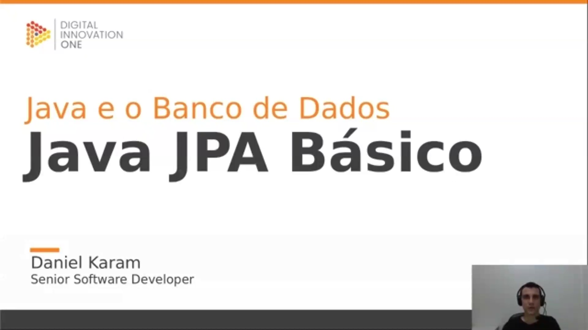
</p>

Esta aula apresenta os conceitos fundamentais de **Java e o Banco de Dados**, focando especificamente no **Java JPA Básico**. O instrutor Daniel Karam, Desenvolvedor de Software Sênior, inicia a jornada de aprendizado sobre como a linguagem Java se integra às camadas de persistência de dados.

#### Objetivos da Aula

<p align="center">

</p>

O conteúdo está estruturado para cobrir três pilares essenciais para o domínio da persistência de dados em Java:

1. **Entendendo o JPA**: Uma visão conceitual sobre a Java Persistence API.
2. **Implementações do JPA**: O uso de frameworks de mercado como **Hibernate** e **EclipseLink**.
3. **Linguagens de consulta**: Foco em consultas orientadas a objetos para manipulação eficiente do banco de dados.

#### Requisitos Básicos

<p align="center">
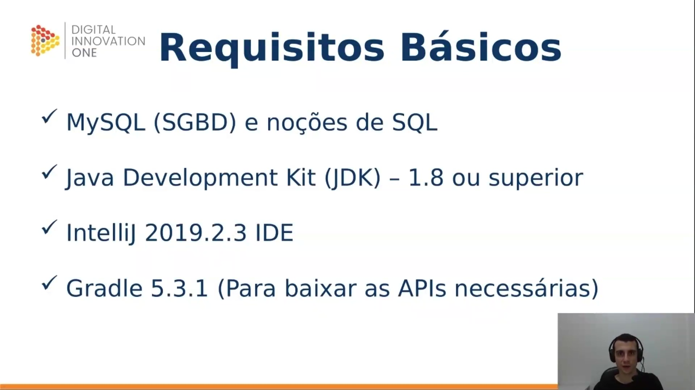
</p>

Para acompanhar as atividades práticas, é necessário configurar o ambiente de desenvolvimento com as seguintes ferramentas:

* **MySQL (SGBD)**: Sistema de gerenciamento de banco de dados e noções básicas de SQL.
* **Java Development Kit (JDK)**: Versão 1.8 ou superior.
* **IntelliJ 2019.2.3 IDE**: Ambiente de desenvolvimento sugerido (podendo ser substituído por Eclipse ou NetBeans).
* **Gradle 5.3.1**: Ferramenta de automação de compilação para gerenciar e baixar as APIs necessárias do projeto.

#### Materiais de Apoio

<p align="center">
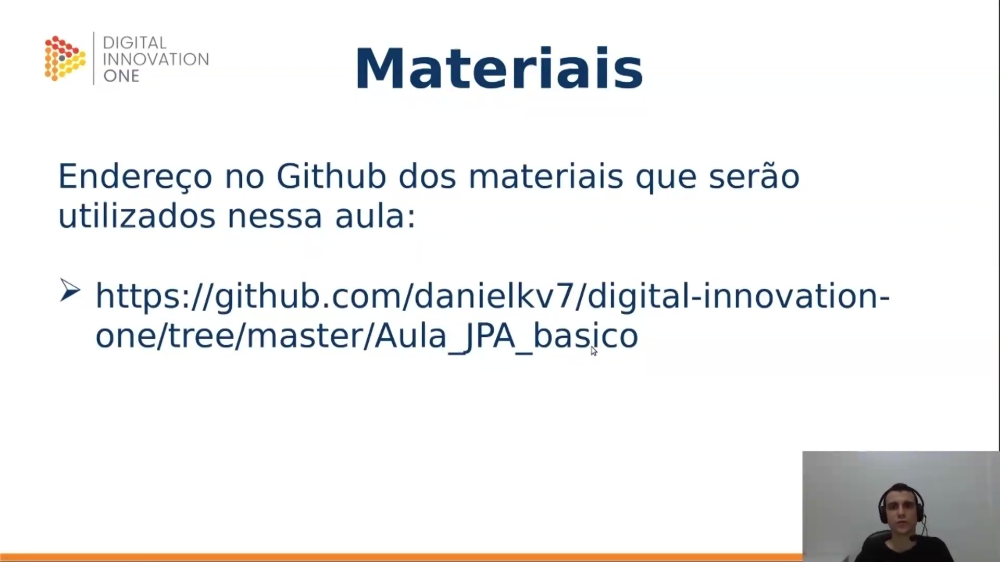
</p>

Todo o material utilizado, incluindo códigos-fonte das aulas práticas e slides para diferentes sistemas operacionais (Windows e Linux), está disponível publicamente no GitHub:

* **Link do Repositório**: [https://github.com/danielkv7/digital-innovation-one/tree/master/Aula_JPA_basico](https://www.google.com/search?q=https://github.com/danielkv7/digital-innovation-one/tree/master/Aula_JPA_basico)      


### 🟩 Vídeo 07 - Entendendo o JPA e começando o mapeamento do banco

<video width="60%" controls>
  <source src="000-Midia_e_Anexos/bootcamp_tqi_fullstack-modulo.06-curso.12-video_07.webm" type="video/webm">
    Seu navegador não suporta vídeo HTML5.
</video>

link do vídeo: https://web.dio.me/track/tqi-fullstack-developer/course/trabalhando-com-banco-de-dados-utilizando-jdbc-e-jpa/learning/a6896637-d037-4534-82a8-3f651535fbe4?autoplay=1

### 🟩 Vídeo 08 - Implementações do JPA

<video width="60%" controls>
  <source src="000-Midia_e_Anexos/bootcamp_tqi_fullstack-modulo.06-curso.12-video_08.webm" type="video/webm">
    Seu navegador não suporta vídeo HTML5.
</video>

link do vídeo:

### 🟩 Vídeo 09 - Linguagens de consulta orientada a objetos

<video width="60%" controls>
  <source src="000-Midia_e_Anexos/bootcamp_tqi_fullstack-modulo.06-curso.12-video_09.webm" type="video/webm">
    Seu navegador não suporta vídeo HTML5.
</video>

link do vídeo:


##  Materiais de Apoio

# Certificado: 

- Link na plataforma: 
- Certificado em pdf: