## Instrutor

- Joao Paulo Oliveira Santos (Senior Fullstack Engineer | Payment Systems (5B txns) + DeFi ($250M TVL) | Python•Java•Node.js•Go•React•React Native | Blockchain & Stablecoins | Remote)
- Contato Linkedin: / [desenvolvedorjoaopaul](https://www.linkedin.com/in/desenvolvedorjoaopaul/)

# Parte 1 - Entendendo a estrutura do projeto

## 🟩 Vídeo 01 - Introdução e objetivos do curso

<video width="60%" controls>
  <source src="000-Midia_e_Anexos/bootcamp_tqi_fullstack-modulo.06-curso.13-video_01.webm" type="video/webm">
    Seu navegador não suporta vídeo HTML5.
</video>

link do vídeo: https://web.dio.me/track/tqi-fullstack-developer/course/jpa-com-hibernate/learning/6cb58f70-30ac-4de8-aaa8-f440efa3bc97?autoplay=1

Este guia resume a trajetória profissional do palestrante, sua filosofia de aprendizado contínuo e os objetivos técnicos da sessão sobre tecnologias de persistência em Java.

### Anotações

<p align="center">

</p>

Esta apresentação introduz o tema de **persistência de dados utilizando JPA (Java Persistence API) com Hibernate**. O conteúdo é ministrado por **João Paulo Oliveira Santos**, especialista de TI no Banco Inter, com o objetivo de demonstrar como essas tecnologias facilitam a comunicação entre aplicações Java e bancos de dados relacionais.

<p align="center">

</p>

Neste momento, o palestrante compartilha sua trajetória profissional de aproximadamente seis anos na área de TI, destacando seu início com tecnologias legadas (JSP com Java) e passagens por instituições como o Sicoob. É reforçada a importância da **curiosidade técnica** e do aprendizado contínuo ao se deparar com novos termos e tecnologias. Para acompanhar o material prático e manter contato, são disponibilizados os seguintes links:

* **Instagram:** joaoolisantos
* **LinkedIn:** [desenvolvedorjoaopaulo](https://www.linkedin.com/in/desenvolvedorjoaopaulo)
* **GitHub:** [jpbaterabsb](https://github.com/jpbaterabsb) (onde os códigos e slides da live estão disponíveis)

<p align="center">

</p>

O roteiro principal da aula está estruturado para cobrir desde conceitos fundamentais até a aplicação prática. Os **objetivos centrais** incluem:

* **JDBC:** Compreender a base da conectividade Java com bancos de dados.
* **ORM (Object-Relational Mapping):** Entender o conceito de mapeamento objeto-relacional, que é o pilar para frameworks de persistência.
* **JPA:** Definir o papel da especificação Java Persistence API.
* **Prática:** Aplicar os conceitos de JPA e Hibernate no desenvolvimento de uma solução de persistência.

## 🟩 Vídeo 02 - O que é JDBC

<video width="60%" controls>
  <source src="000-Midia_e_Anexos/bootcamp_tqi_fullstack-modulo.06-curso.13-video_02.webm" type="video/webm">
    Seu navegador não suporta vídeo HTML5.
</video>

link do vídeo: https://web.dio.me/track/tqi-fullstack-developer/course/jpa-com-hibernate/learning/6ee17344-4f78-42e2-b2ff-d9fd0415ed4b?autoplay=1

O JDBC é a tecnologia fundamental que permite a aplicações Java interagirem com bancos de dados relacionais (SQL). Ele atua como uma camada de abstração ou "contrato", garantindo que o código Java seja padronizado, independentemente de o banco de dados ser MySQL, PostgreSQL, Oracle ou qualquer outro que suporte SQL.

### Anotações

<p align="center">

</p>

O JDBC (Java Database Connectivity) foi criado como uma estratégia para permitir que a linguagem Java se conectasse a bancos de dados SQL. Antes de sua existência, não havia uma padronização, o que obrigaria cada desenvolvedor a criar métodos próprios de conexão para cada tipo de banco (MySQL, PostgreSQL, Oracle, etc.). O JDBC estabelece um contrato de padronização para que todos os bancos SQL conversem com o Java de uma única forma.

<p align="center">
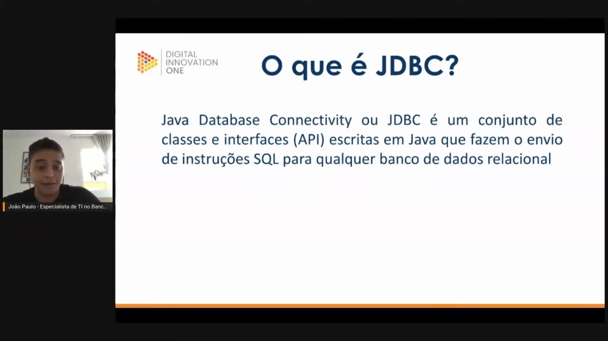
</p>

O JDBC consiste em um conjunto de classes e interfaces (APIs) escritas em Java que permitem o envio de instruções SQL para qualquer banco de dados relacional. Ele funciona como uma biblioteca que facilita o desenvolvimento ao fornecer as ferramentas necessárias para a comunicação entre a aplicação e o banco.

<p align="center">
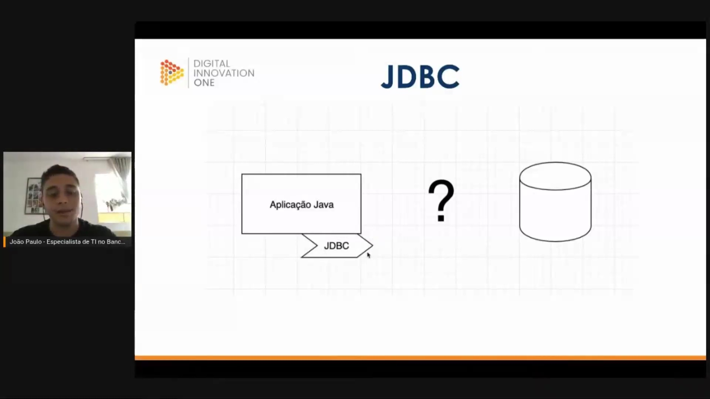
</p>

Embora o JDBC forneça as interfaces necessárias dentro da JDK, ele funciona apenas como um contrato. Por serem interfaces, elas não possuem uma implementação própria direta para cada banco de dados. Surge então a necessidade de uma "ponte" ou implementação que conecte a aplicação Java ao banco de dados real, permitindo que as chamadas de métodos funcionem corretamente sem retornar erros de nulidade.

<p align="center">
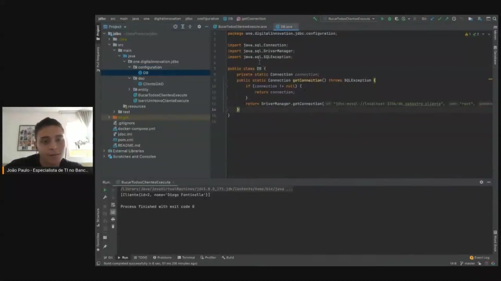
</p>

Para gerenciar a conexão, é criada uma classe utilitária (como a classe `DB`), que utiliza a interface `Connection` para obter instâncias de conexão com o banco de dados.

```java
package one.digitalinnovation.jdbc.configuration;

import java.sql.Connection;
import java.sql.DriverManager;
import java.sql.SQLException;

public class DB {
    private static Connection connection;

    public static Connection getConnection() throws SQLException {
        if (connection == null) {
            connection = DriverManager.getConnection("jdbc:mysql://localhost:3306/db_cadastro_cliente", "root", "root");
        }
        return connection;
    }
}
```

<p align="center">
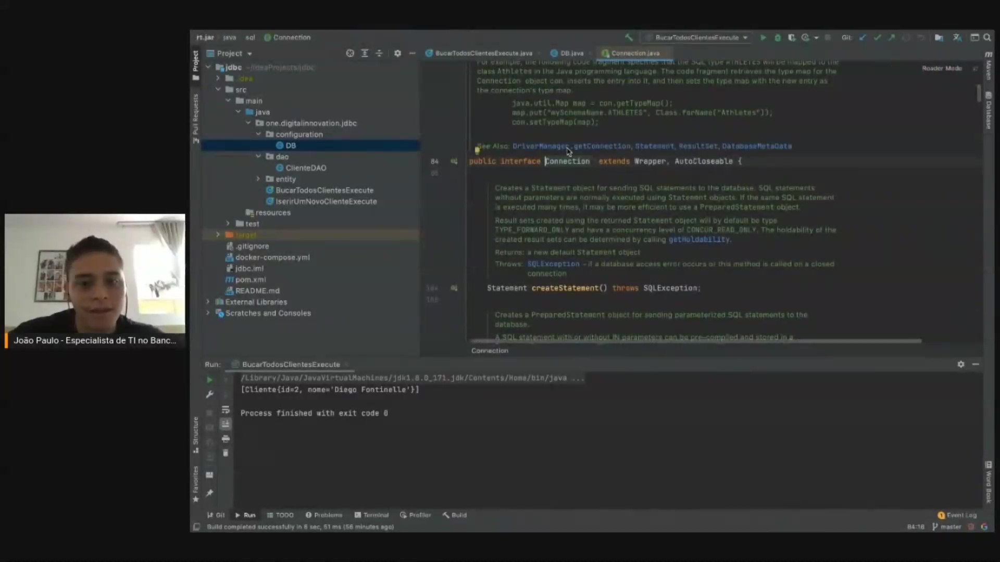
</p>

Ao verificar a estrutura interna da JDK (como a versão 1.8), confirma-se que classes fundamentais do pacote `java.sql`, como a `Connection`, são na verdade interfaces. Outros componentes como `ResultSet`, `PreparedStatement` e `Statement` também seguem este modelo de interface, enquanto o `DriverManager` é uma classe concreta.

```java
public interface Connection extends Wrapper, AutoCloseable {
    Statement createStatement() throws SQLException;
    PreparedStatement prepareStatement(String sql) throws SQLException;
    // ...
}
```

<p align="center">
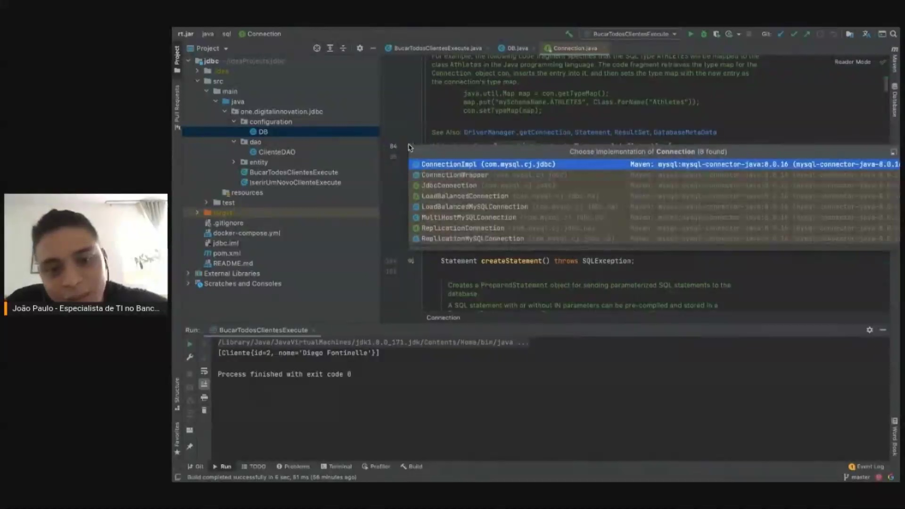
</p>

Como o JDBC define apenas os contratos, os fabricantes de sistemas de gerenciamento de banco de dados (SGBDs) devem fornecer os drivers que implementam essas interfaces. Na IDE, é possível visualizar que a implementação da interface `Connection` é fornecida por classes específicas do driver, como a `ConnectionImpl` vinda do pacote do MySQL.

<p align="center">
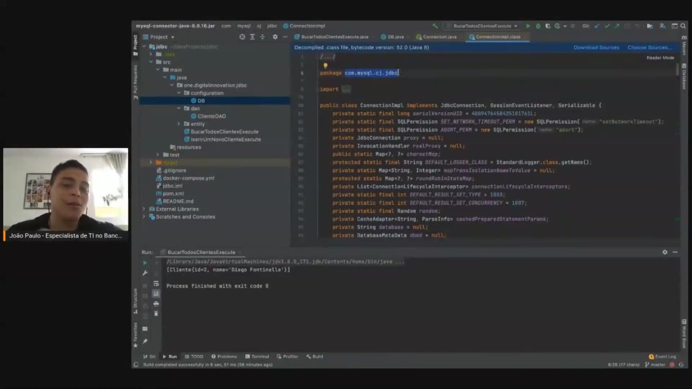
</p>

A classe `ConnectionImpl` é a implementação real do driver (neste caso, do MySQL) para a interface `Connection` do Java. É dentro dessas classes do driver que ocorrem os detalhes técnicos "por debaixo dos panos", como a comunicação via protocolos, segurança SSL e criptografia de dados entre a aplicação e o banco.

```java
package com.mysql.cj.jdbc;

public class ConnectionImpl implements JdbcConnection, SessionEventListener, Serializable {
    // Implementação dos métodos do driver
}
```

<p align="center">
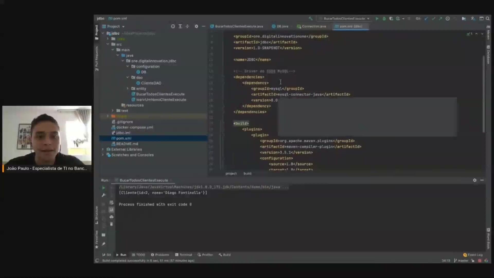
</p>

Em projetos Maven, o driver necessário para a implementação das interfaces JDBC é adicionado como uma dependência no arquivo `pom.xml`. Ao importar o driver (ex: `mysql-connector-java`), a aplicação passa a ter as implementações concretas que o Java SQL utilizará automaticamente para realizar as operações no banco.

```xml
<dependency>
    <groupId>mysql</groupId>
    <artifactId>mysql-connector-java</artifactId>
    <version>8.0.16</version>
</dependency>
```

<p align="center">
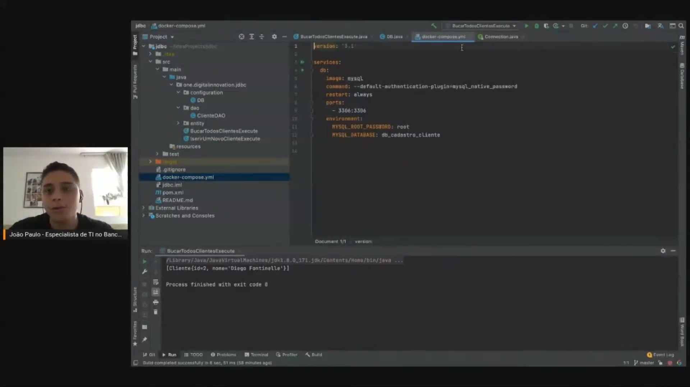
</p>

Para facilitar o ambiente de desenvolvimento, pode-se utilizar um arquivo `docker-compose.yml` para subir uma instância do banco de dados MySQL sem a necessidade de instalação manual. O arquivo define configurações como imagem, portas, senhas e o nome do banco de dados que será utilizado pela aplicação.

```yaml
services:
  db:
    image: mysql
    command: --default-authentication-plugin=mysql_native_password
    restart: always
    ports:
      - 3306:3306
    environment:
      MYSQL_ROOT_PASSWORD: root
      MYSQL_DATABASE: db_cadastro_cliente
```

<p align="center">
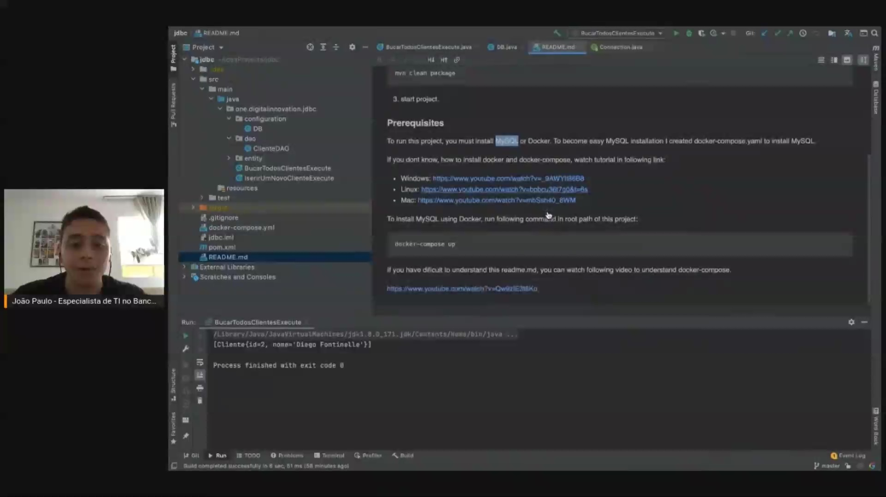
</p>

O arquivo `README.md` do projeto detalha os pré-requisitos e instruções para execução, incluindo links para instalação do Docker e comandos para subir o banco de dados via terminal com `docker-compose up`. É essencial que o banco de dados esteja rodando e devidamente configurado com usuário e senha para que os testes do JDBC funcionem corretamente.      


## 🟩 Vídeo 03 - Estrutura do código - Parte 1

<video width="60%" controls>
  <source src="000-Midia_e_Anexos/bootcamp_tqi_fullstack-modulo.06-curso.13-video_03.webm" type="video/webm">
    Seu navegador não suporta vídeo HTML5.
</video>

link do vídeo: https://web.dio.me/track/tqi-fullstack-developer/course/jpa-com-hibernate/learning/ad5fc6b4-496d-4d3f-829b-fe6f8d81d15d?autoplay=1

Este guia explora a implementação prática de conexões com bancos de dados relacionais usando Java. O foco está na criação de uma arquitetura robusta, gerenciamento de conexões e manipulação de dados através do padrão DAO.

### Anotações

<p align="center">
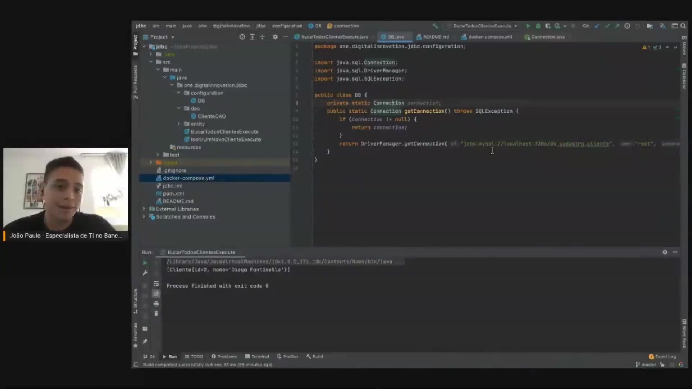
</p>

O desenvolvimento de aplicações que utilizam JDBC exige a criação de uma estrutura organizada para gerenciar a comunicação com o banco de dados. Um ponto crítico abordado é o controle do número de conexões abertas. Abrir múltiplas conexões sem o devido fechamento pode sobrecarregar o banco de dados, levando à queda do serviço. Por isso, a arquitetura apresentada foca em manter e validar a conexão antes de realizar novas operações. O projeto está estruturado com pacotes específicos para configuração, objetos de acesso a dados (DAO) e entidades, garantindo uma separação clara de responsabilidades.

<p align="center">
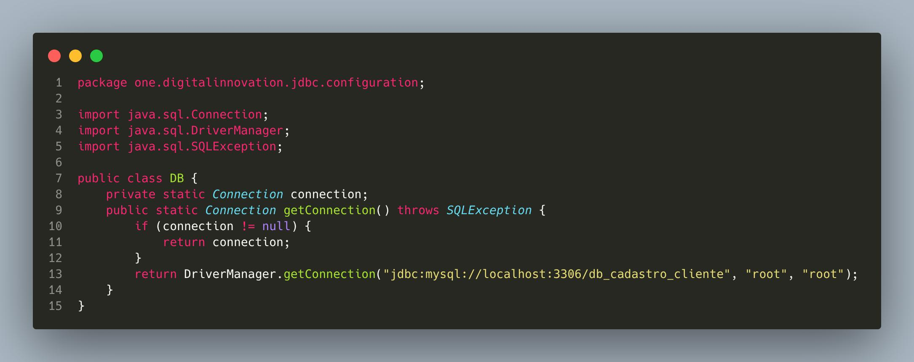
</p>

A classe `DB` é responsável por centralizar a lógica de obtenção da conexão com o banco de dados. Ela utiliza o padrão de verificar se uma conexão já existe (não nula) para retorná-la, evitando aberturas desnecessárias. Caso não exista, ela utiliza o `DriverManager` para estabelecer o vínculo com o MySQL através de uma URL que define o protocolo, o host, a porta e o nome do banco de dados (`db_cadastro_cliente`), além das credenciais de acesso.

```java
package one.digitalinnovation.jdbc.configuration;

import java.sql.Connection;
import java.sql.DriverManager;
import java.sql.SQLException;

public class DB {

    private static Connection connection;

    public static Connection getConnection() throws SQLException {
        if (connection != null) {
            return connection;
        }

        return DriverManager.getConnection("jdbc:mysql://localhost:3306/db_cadastro_cliente", "root", "root");
    }
}

```


<p align="center">
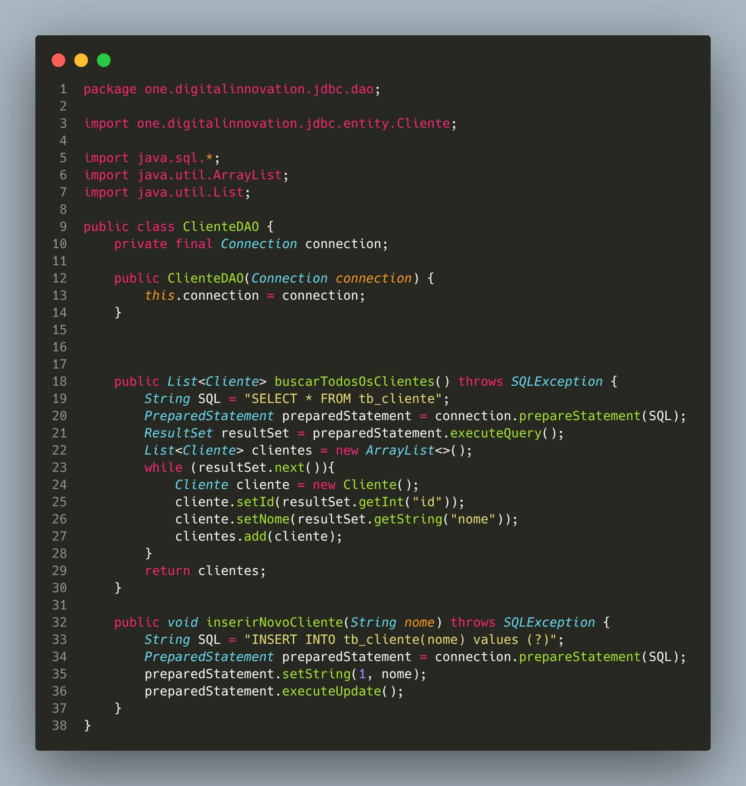
</p>

A classe `ClienteDAO` implementa o padrão Data Access Object, separando a lógica de negócio do acesso aos dados. O método `buscarTodosOsClientes` executa uma consulta SQL `SELECT *`, percorrendo o `ResultSet` para transformar cada linha da tabela em um objeto `Cliente` adicionado a uma lista. Já o método `inserirNovoCliente` utiliza um `PreparedStatement` com um parâmetro variável (`?`), o que garante segurança e flexibilidade na inserção de novos nomes no banco.

```java
package one.digitalinnovation.jdbc.dao;

import one.digitalinnovation.jdbc.entity.Cliente;
import java.sql.*;
import java.util.ArrayList;
import java.util.List;

public class ClienteDAO {
    private final Connection connection;

    public ClienteDAO (Connection connection) {
        this.connection = connection;
    }

    public List<Cliente> buscarTodosOsClientes() throws SQLException {
        String SQL = "SELECT * FROM tb_cliente";
        PreparedStatement preparedStatement = connection.prepareStatement(SQL);
        ResultSet resultSet = preparedStatement.executeQuery();
        List<Cliente> clientes = new ArrayList<>();

        while (resultSet.next()){
            Cliente cliente = new Cliente();
            cliente.setId(resultSet.getInt("id"));
            cliente.setNome(resultSet.getString("nome"));
            clientes.add(cliente);
        }
        return clientes;
    }

    public void inserirNovoCliente (String nome) throws SQLException {
        String SQL = "INSERT INTO tb_cliente (nome) values (?)";
        PreparedStatement preparedStatement = connection.prepareStatement(SQL);
        preparedStatement.setString(1, nome);
        preparedStatement.executeUpdate();
    }
}

```


<p align="center">
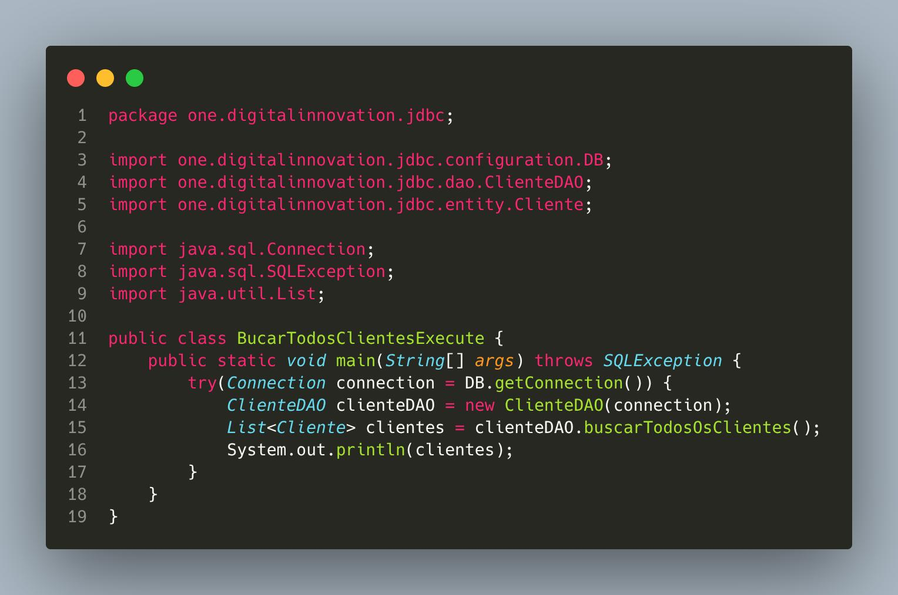
</p>

Esta classe de execução demonstra como recuperar dados do banco. Através de um bloco `try-with-resources`, a conexão é obtida da classe `DB` e passada para o `ClienteDAO`. O método de busca é chamado e o resultado, que neste caso retorna o cliente "Diego Fontinelle" com ID 2, é impresso no console.

```java
package one.digitalinnovation.jdbc;

import one.digitalinnovation.jdbc.configuration.DB;
import one.digitalinnovation.jdbc.dao.ClienteDAO;
import one.digitalinnovation.jdbc.entity.Cliente;
import java.sql.Connection;
import java.sql.SQLException;
import java.util.List;

public class BucarTodosClientesExecute {
    public static void main(String[] args) throws SQLException {
        try(Connection connection = DB.getConnection()) {
            ClienteDAO clienteDAO = new ClienteDAO (connection);
            List<Cliente> clientes = clienteDAO.buscarTodosOsClientes();
            System.out.println(clientes);
        }
    }
}

```


<p align="center">
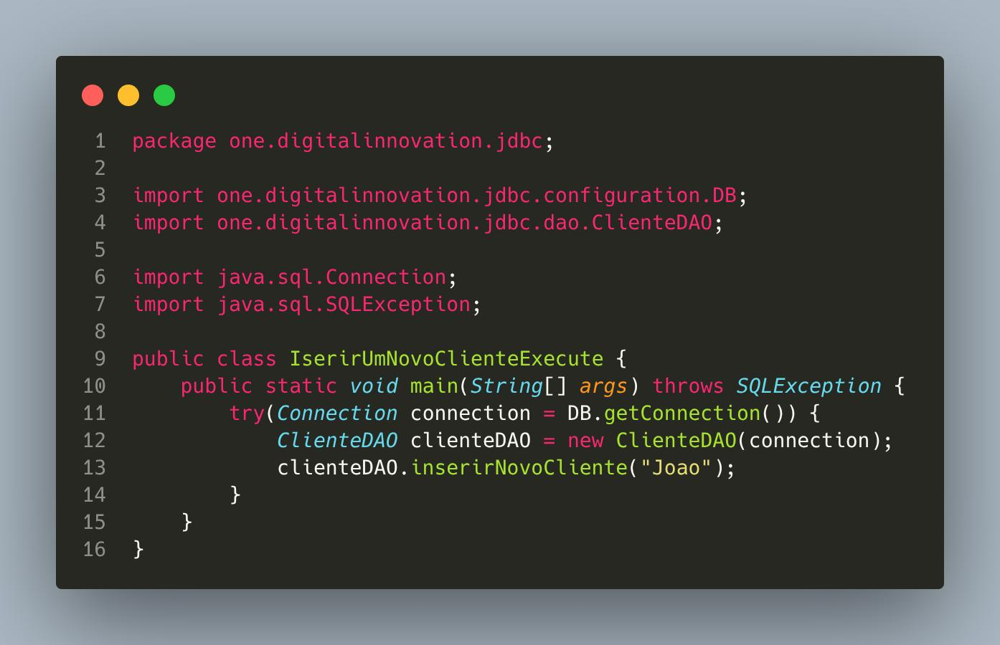
</p>

A classe `IserirUmNovoClienteExecute` foca na persistência de novos dados. Seguindo o mesmo fluxo de obtenção de conexão e instância do DAO, ela chama o método `inserirNovoCliente` passando o nome "Joao". Essa operação atualiza a tabela no banco de dados, permitindo que consultas subsequentes já retornem o novo registro inserido.

```java
package one.digitalinnovation.jdbc;

import one.digitalinnovation.jdbc.configuration.DB;
import one.digitalinnovation.jdbc.dao.ClienteDAO;
import java.sql.Connection;
import java.sql.SQLException;

public class IserirUmNovoClienteExecute {
    public static void main(String[] args) throws SQLException {
        try(Connection connection = DB.getConnection()) {
            ClienteDAO clienteDAO = new ClienteDAO (connection);
            clienteDAO.inserirNovoCliente("Joao");
        }
    }
}

```

## 🟩 Vídeo 04 - O que são ORM, JPA e Hibernate

<video width="60%" controls>
  <source src="000-Midia_e_Anexos/bootcamp_tqi_fullstack-modulo.06-curso.13-video_04.webm" type="video/webm">
    Seu navegador não suporta vídeo HTML5.
</video>

link do vídeo: https://web.dio.me/track/tqi-fullstack-developer/course/jpa-com-hibernate/learning/3174d9aa-2160-4f76-9b88-2825d38278c1?autoplay=1


Este guia explora a evolução da persistência de dados em Java, saindo do modelo manual e repetitivo do JDBC para as abstrações modernas que facilitam a vida do desenvolvedor.

### Anotações

<p align="center">
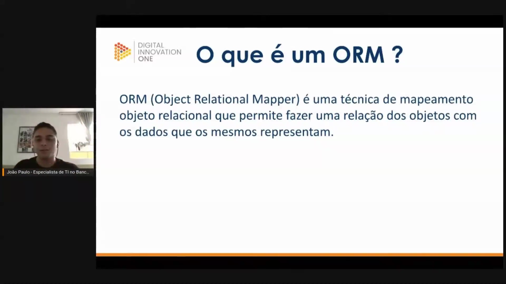
</p>

**ORM (Object Relational Mapper)** é uma técnica de mapeamento objeto-relacional que estabelece uma relação direta entre os objetos da aplicação e os dados armazenados em um banco de dados. O objetivo central dessa técnica é reduzir a necessidade de códigos verbosos e repetitivos, como o uso manual de iterações em um `ResultSet` para preencher atributos de uma classe toda vez que dados são buscados. Com o ORM, busca-se tratar as classes do sistema como espelhos exatos das tabelas do banco de dados.

<p align="center">
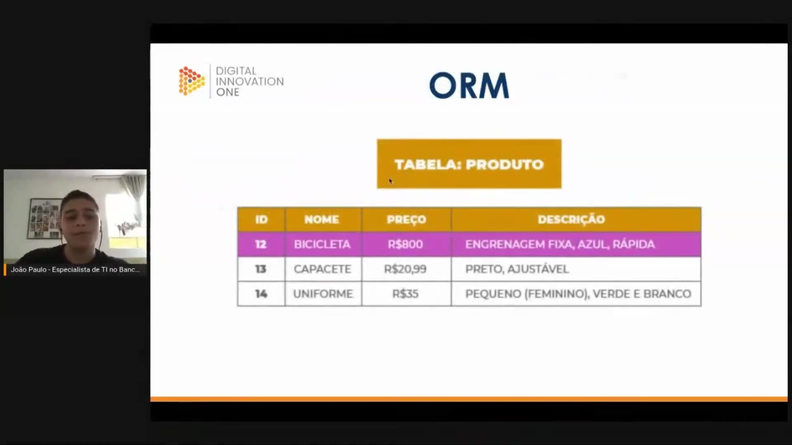
</p>

Em um ambiente de banco de dados relacional tradicional, as informações são organizadas em tabelas com colunas e linhas. Abaixo está a representação da tabela **PRODUTO** apresentada no exemplo:

| ID | NOME | DESCRIÇÃO | PREÇO |
| --- | --- | --- | --- |
| 12 | BICICLETA | ENGRENAGEM FIXA, AZUL, RÁPIDA | R$800 |
| 13 | CAPACETE | PRETO, AJUSTÁVEL | R$20,99 |
| 14 | UNIFORME | PEQUENO (FEMININO), VERDE E BRANCO | R$35 |

<p align="center">
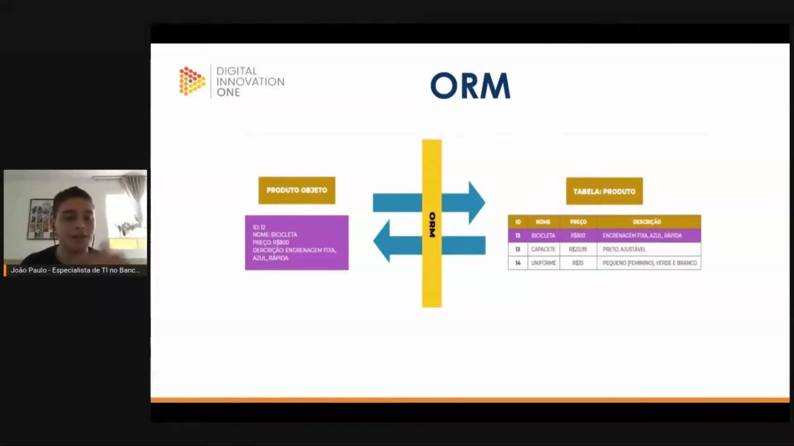
</p>

O conceito de ORM permite transformar uma linha específica de uma tabela em um **objeto programático** correspondente. No exemplo visualizado, a linha de ID 12 da tabela é mapeada para um objeto Java onde os atributos (nome, preço, descrição) coincidem exatamente com os dados da coluna. Essa sincronia elimina a necessidade de transformações manuais de dados entre o banco e o código da aplicação, permitindo que o desenvolvedor manipule o objeto como se estivesse interagindo diretamente com a tabela.

<p align="center">
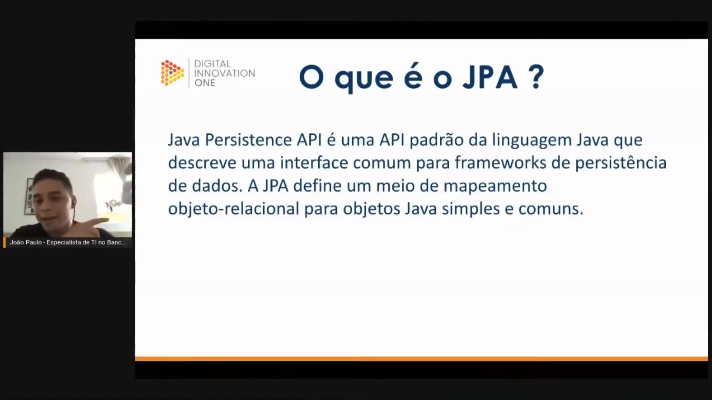
</p>

A **Java Persistence API (JPA)** é a API padrão da linguagem Java que define uma interface comum para frameworks que realizam a persistência de dados. A JPA especifica os meios para realizar o mapeamento objeto-relacional de forma padronizada, transformando dados de tabelas em objetos Java simples (POJOs). Essencialmente, a JPA funciona como um contrato que define como os frameworks de ORM devem se comportar dentro do ecossistema Java.

<p align="center">
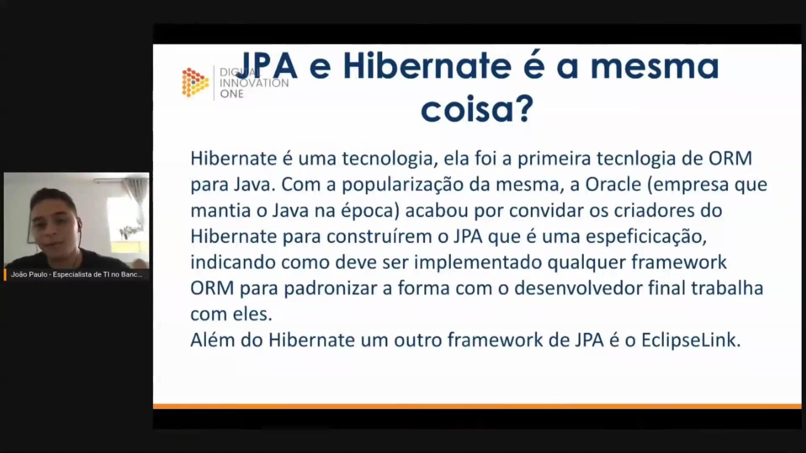
</p>

É comum haver confusão entre JPA e Hibernate. O **Hibernate** foi a tecnologia pioneira de ORM para Java. Com seu sucesso, a Oracle convidou seus criadores para desenvolverem a **JPA**, que atua como a **especificação** (o padrão) para garantir que qualquer framework ORM trabalhe de forma uniforme para o desenvolvedor final. Assim, enquanto a JPA fornece as interfaces, frameworks como o Hibernate e o **EclipseLink** fornecem as implementações reais desses padrões.

<p align="center">
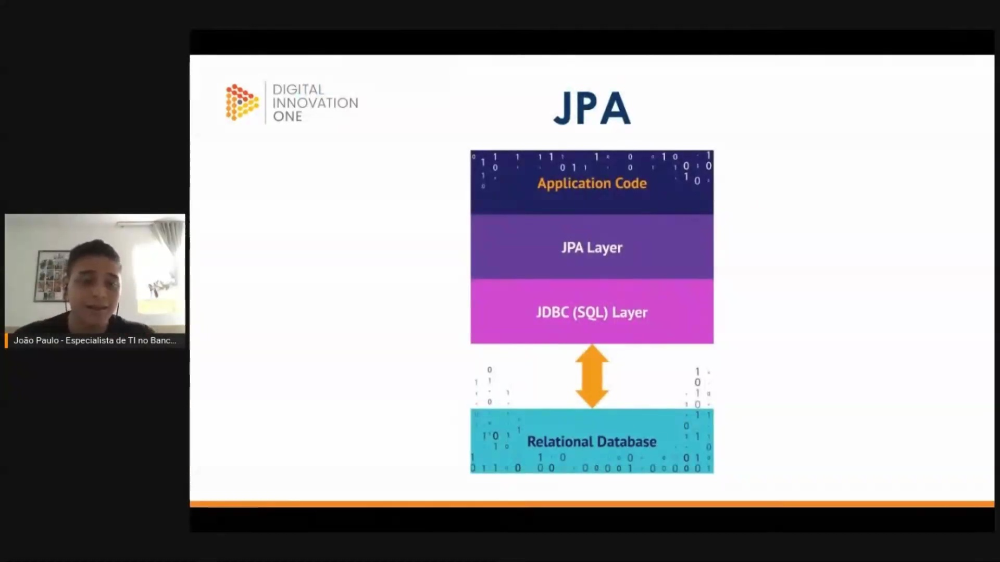
</p>

A arquitetura moderna de persistência organiza a comunicação com o banco de dados em camadas para facilitar o desenvolvimento:

* **Application Code**: Onde reside a lógica de negócio que utiliza os objetos.
* **JPA Layer**: Atua como a camada de abstração orientada a objetos que facilita a interação com o banco.
* **JDBC (SQL) Layer**: Camada inferior para onde o JPA traduz as operações antes de enviá-las ao driver do banco.
* **Relational Database**: O destino final onde os dados são efetivamente armazenados e gerenciados.

Essa estrutura permite que o desenvolvedor foque na orientação a objetos enquanto o framework lida com a tradução para a linguagem SQL.


## 🟩 Vídeo 05 - Estrutura do código - Parte 2

<video width="60%" controls>
  <source src="000-Midia_e_Anexos/bootcamp_tqi_fullstack-modulo.06-curso.13-video_05.webm" type="video/webm">
    Seu navegador não suporta vídeo HTML5.
</video>

link do vídeo: https://web.dio.me/track/tqi-fullstack-developer/course/jpa-com-hibernate/learning/ad80dea5-85ad-4924-920e-36299d882298?autoplay=1

Este guia aborda a transição do JDBC para o JPA/Hibernate, detalhando as dependências necessárias, a estrutura de pastas e a configuração do arquivo persistence.xml para automação de banco de dados.

### Anotações

<p align="center">
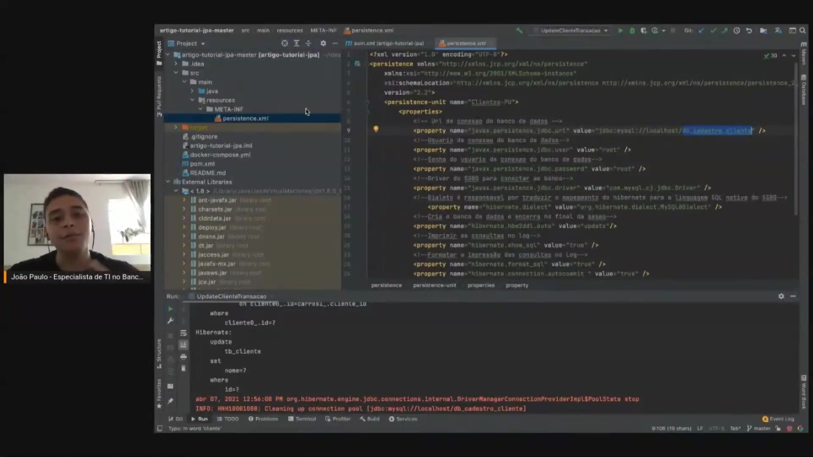
</p>

Para iniciar o desenvolvimento com **JPA (Java Persistence API)** ou **Hibernate**, o ponto de partida é a estruturação de um projeto **Maven**. A organização de pastas segue um padrão rigoroso para que o framework localize os metadados necessários. Dentro da estrutura do projeto, no diretório `src/main/resources`, deve-se criar obrigatoriamente uma pasta chamada **META-INF**. É dentro desta pasta que reside o arquivo **persistence.xml**, responsável por toda a configuração da camada de persistência.

Além da estrutura de pastas, o projeto depende de duas bibliotecas principais declaradas no `pom.xml`:

* **hibernate-core**: A implementação do JPA que gerencia o mapeamento objeto-relacional.
* **Driver de Conexão**: O driver específico para o Sistema Gerenciador de Banco de Dados (SGBD) utilizado, como o MySQL ou Postgres.

O arquivo **persistence.xml** utiliza o formato XML para definir a **unidade de persistência** (`persistence-unit`). Cada unidade de persistência pode representar uma conexão distinta, permitindo que a aplicação se comunique com múltiplos bancos de dados simultaneamente.

Abaixo, o conteúdo técnico detalhado das propriedades de configuração:

```xml
<?xml version="1.0" encoding="UTF-8"?>
<persistence xmlns="http://xmlns.jcp.org/xml/ns/persistence"
             xmlns:xsi="http://www.w3.org/2001/XMLSchema-instance"
             xsi:schemaLocation="http://xmlns.jcp.org/xml/ns/persistence http://xmlns.jcp.org/xml/ns/persistence/persistence_2_2.xsd"
             version="2.2">
    <persistence-unit name="Clientes-PU">
        <properties>
            <!-- Url de conexao do banco de dados -->
            <property name="javax.persistence.jdbc.url" value="jdbc:mysql://localhost/db_cadastro_cliente" />
            <!-- Usuario de conexao do banco de dados -->
            <property name="javax.persistence.jdbc.user" value="root" />
            <!-- Senha do usuario de conexao do banco de dados -->
            <property name="javax.persistence.jdbc.password" value="root" />
            <!-- Driver do SGBD para conectar ao banco -->
            <property name="javax.persistence.jdbc.driver" value="com.mysql.cj.jdbc.Driver" />
            <!-- Dialeto é responsavel por traduzir o mapeamento do hibernate para a linguagem SQL nativa do SGBD -->
            <property name="hibernate.dialect" value="org.hibernate.dialect.MySQL8Dialect" />
            <!-- Cria o banco de dados e encerra no final da sessao -->
            <property name="hibernate.hbm2ddl.auto" value="update" />
            <!-- Imprimir as consultas no log -->
            <property name="hibernate.show_sql" value="true" />
            <!-- Formatar a impressão das consultas no Log -->
            <property name="hibernate.format_sql" value="true" />
            <property name="hibernate.connection.autocommit" value="true" />
        </properties>
    </persistence-unit>
</persistence>

```

As principais propriedades configuradas incluem:

* **Conexão JDBC**: Define o endpoint (`url`), credenciais (`user`, `password`) e a classe do `driver`.
* **Dialect**: Informa ao Hibernate qual linguagem SQL nativa utilizar para traduzir as entidades Java em comandos específicos do MySQL.
* **HBM2DDL**: A opção `update` automatiza a gestão do banco, criando tabelas inexistentes ou atualizando a estrutura conforme as alterações nas classes da aplicação.
* **Logging**: Ativa a exibição (`show_sql`) e a formatação amigável (`format_sql`) das consultas SQL no console para fins de depuração.


## Parte 2 - Desenvolvimento da comunicação com banco de dados

## 🟩 Vídeo 06 - Estrutura básica do banco de dados

<video width="60%" controls>
  <source src="000-Midia_e_Anexos/bootcamp_tqi_fullstack-modulo.06-curso.13-video_06.webm" type="video/webm">
    Seu navegador não suporta vídeo HTML5.
</video>

link do vídeo: https://web.dio.me/track/tqi-fullstack-developer/course/jpa-com-hibernate/learning/bc541851-02a5-4794-9099-cd241c76a485?autoplay=1

Este guia prático explora como traduzir diagramas de relacionamento de banco de dados para o código Java utilizando o framework Hibernate. O exemplo central utiliza um sistema de gestão de trânsito envolvendo Clientes, Carros e Multas, demonstrando como configurar anotações para garantir a integridade e a persistência dos dados.

### Anotações

#### Modelagem de Relacionamentos no Hibernate

<p align="center">
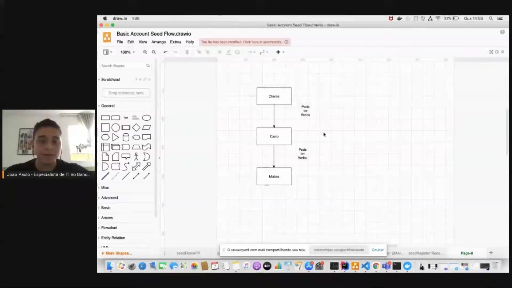
</p>

A modelagem inicial do sistema é apresentada através de um diagrama que define as regras de negócio e os relacionamentos entre as entidades. O modelo estabelece que um **Cliente** pode possuir um ou vários **Carros**, e cada **Carro** pode estar vinculado a várias **Multas**. Essa estrutura caracteriza relacionamentos do tipo **One-to-Many** (um para muitos). No sentido inverso, o sistema garante a integridade ao definir que uma multa pertence obrigatoriamente a apenas um carro e um carro pertence a apenas um cliente.

#### Estrutura do Projeto e Entidades JPA

<p align="center">
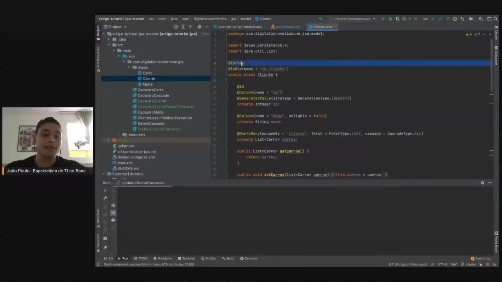
</p>

A organização das classes no ambiente de desenvolvimento reflete o mapeamento das entidades para o banco de dados relacional. Dentro do pacote `com.digitalinnovationone.jpa.model`, as entidades principais — **Carro**, **Cliente** e **Multa** — são implementadas como classes Java. Além das entidades, o projeto inclui classes para testes de persistência, como `CadastroCarro` e `CadastroCascade`, além do tratamento de exceções específicas, como `ClienteLazyInitializerException`, fundamentais para validar o comportamento do Hibernate.

#### Implementação da Classe Cliente com Anotações

A implementação da entidade **Cliente** utiliza as anotações do JPA para converter a classe em uma tabela do banco de dados. A anotação `@Entity` identifica a classe como uma entidade gerenciada, enquanto `@Table` define o nome da tabela como `tb_cliente`. O relacionamento **One-to-Many** é configurado com `mappedBy = "cliente"`, indicando o lado inverso da associação, e utiliza `FetchType.LAZY` para carregamento sob demanda, além de `CascadeType.ALL` para propagar as operações de persistência para a lista de carros.

```java
package com.digitalinnovationone.jpa.model;

import javax.persistence.*;
import java.util.List;

@Entity
@Table(name = "tb_cliente")
public class Cliente {

    @Id
    @Column(name = "id")
    @GeneratedValue(strategy = GenerationType.IDENTITY)
    private Integer id;

    @Column(name = "nome", nullable = false)
    private String nome;

    @OneToMany(mappedBy = "cliente", fetch = FetchType.LAZY, cascade = CascadeType.ALL)
    private List<Carro> carros;

    public List<Carro> getCarros() {
        return carros;
    }

    public void setCarros(List<Carro> carros) {
        this.carros = carros;
    }

    public Integer getId() {
        return id;
    }

    public void setId(Integer id) {
        this.id = id;
    }

    public String getNome() {
        return nome;
    }

    public void setNome(String nome) {
        this.nome = nome;
    }

    @Override
    public int hashCode() {
        final int prime = 31;
        int result = 1;
        result = prime * result + ((id == null) ? 0 : id.hashCode());
        return result;
    }

    @Override
    public boolean equals(Object obj) {
        if (this == obj) return true;
        if (obj == null) return false;
        if (getClass() != obj.getClass()) return false;
        Cliente other = (Cliente) obj;
        if (id == null) {
            if (other.id != null) return false;
        } else if (!id.equals(other.id)) return false;
        return true;
    }
}
```      


## 🟩 Vídeo 07 - Desenvolvendo o código de persistência de dados

<video width="60%" controls>
  <source src="000-Midia_e_Anexos/bootcamp_tqi_fullstack-modulo.06-curso.13-video_07.webm" type="video/webm">
    Seu navegador não suporta vídeo HTML5.
</video>

link do vídeo: https://web.dio.me/track/tqi-fullstack-developer/course/jpa-com-hibernate/learning/353d3dfc-0929-4864-869f-6519b8687627?autoplay=1

Este guia explora as capacidades do Hibernate para automação de banco de dados, gerenciamento de entidades, tipos de carregamento (Fetch Types) e estratégias de consulta avançadas.

### Anotações

#### 1. Automação de Esquema (DDL)
O Hibernate demonstra sua força ao gerar automaticamente o banco de dados a partir das classes Java.
*   **Geração Automática:** Ao subir a aplicação, o Hibernate executa o DDL (*Data Definition Language*), criando tabelas como `TB_CLIENTE`, `TB_CARRO` e `TB_MULTA`.
*   **Mapeamento Fiel:** Atributos Java (como `String`, `Double`, `LocalDateTime`) são convertidos para tipos SQL correspondentes (`VARCHAR`, `DOUBLE`, `DATETIME`), respeitando restrições como `NOT NULL` e chaves primárias.

#### 2. O Ciclo de Vida do EntityManager
O `EntityManager` é o "coração" do Hibernate, responsável por mediar a comunicação entre os objetos Java e o banco de dados.
*   **EntityManagerFactory:** Utiliza o arquivo `persistence.xml` para configurar a conexão.
*   **Transações:** Operações de escrita (inserir, atualizar, deletar) exigem o uso de `transaction.begin()` e `transaction.commit()` para garantir a atomicidade e integridade dos dados.

#### 3. Relacionamentos e Persistência em Cascata
O vídeo detalha como lidar com chaves estrangeiras de forma orientada a objetos.
*   **Associações:** Em vez de lidar com IDs manuais, associa-se o objeto `Cliente` diretamente ao objeto `Carro`.
*   **CascadeType.ALL:** Permite que, ao salvar um "Pai" (Cliente), todos os seus "Filhos" (Carros e Multas) sejam salvos automaticamente em uma única operação.
*   **Referência Bilateral:** Para que o Cascade funcione corretamente, é necessário preencher ambos os lados do relacionamento no código Java.

#### 4. Estratégias de Carregamento: Lazy vs. Eager
Uma das partes mais críticas para a performance da aplicação.
*   **Lazy (Preguiçoso):** Os dados relacionados (ex: as multas de um carro) só são buscados no banco quando você explicitamente os acessa. Evita sobrecarga de memória.
*   **Eager (Ansioso):** Traz todos os dados relacionados de uma vez usando *Joins*. Útil quando você sabe que precisará de tudo, mas perigoso para a performance em tabelas grandes.
*   **LazyInitializationException:** Ocorre quando tentamos acessar um dado "Lazy" após o fechamento da sessão do banco de dados.

#### 5. Consultas Avançadas e HQL
Além do básico, o Hibernate oferece formas poderosas de buscar dados:
*   **HQL (Hibernate Query Language):** Consultas escritas focando nas **classes e atributos** Java, não nas tabelas do banco.
*   **Entity Graphs:** Uma forma elegante de "forçar" o carregamento de dados específicos em uma consulta, resolvendo problemas de performance sem mudar o mapeamento global para Eager.

#### 💡 Insights e Melhores Práticas

✨ **O Perigo do Eager Loading:** Configurar relacionamentos como `EAGER` por padrão pode parecer facilitador, mas em sistemas reais com milhões de registros, isso pode derrubar a aplicação ao tentar carregar gigabytes de dados desnecessários na memória.

✨ **List vs. Set:** O uso de `List` em múltiplos relacionamentos pode causar a `MultipleBagFetchException`. A solução técnica recomendada é utilizar `Set` (conjuntos), que não permitem duplicatas e resolvem o problema de produto cartesiano gerado pelo Hibernate.

✨ **Transparência SQL:** O Hibernate permite logar o SQL gerado. Isso é vital para o desenvolvedor entender se o framework está sendo eficiente ou se está executando consultas redundantes (o famoso problema do N+1).

✨ **Integridade via Transações:** Nunca realize operações de persistência fora de um bloco transacional. O `commit` garante que, se algo falhar no meio do processo (ex: salvou o cliente mas falhou o carro), nada seja gravado, mantendo o banco limpo.

**Conclusão:** O Hibernate transforma a complexidade do SQL em manipulação de objetos, mas exige que o desenvolvedor compreenda conceitos de performance (Fetch Types) e integridade (Transactions) para criar aplicações robustas.      

🟡 Detalhes da implementação no vídeo.

## 🟩 Vídeo 08 - Como funciona uma transação

<video width="60%" controls>
  <source src="000-Midia_e_Anexos/bootcamp_tqi_fullstack-modulo.06-curso.13-video_08.webm" type="video/webm">
    Seu navegador não suporta vídeo HTML5.
</video>

link do vídeo: https://web.dio.me/track/tqi-fullstack-developer/course/jpa-com-hibernate/learning/b61582fc-931c-49ef-b220-2e2117885708?autoplay=1

Este resumo aborda os conceitos fundamentais de transações em sistemas de gerenciamento de banco de dados, utilizando um exemplo prático em Java com JPA (Java Persistence API). O foco principal é entender como garantir a integridade dos dados através do conceito de "Tudo ou Nada".

### Anotações

#### 1. O Conceito de Transação
Uma transação é uma unidade lógica de trabalho que agrupa múltiplas operações no banco de dados. No vídeo, o instrutor demonstra a criação de um **Cliente** e de um **Carro** como parte de um processo único.
*   **Objetivo:** Garantir que operações dependentes sejam executadas de forma coesa.

#### 2. O Princípio "Tudo ou Nada" (ACID)
O instrutor menciona o acrônimo **ACID** (Atomicidade, Consistência, Isolamento e Durabilidade), focando especialmente na **Atomicidade**:
*   **Funcionamento:** Ou todas as operações dentro da transação são confirmadas (*commit*), ou nenhuma delas é aplicada ao banco (*rollback*).
*   **Exemplo prático:** Se o sistema salvar o cliente, mas ocorrer um erro ao salvar o carro, a transação reverte a criação do cliente para evitar dados incompletos.

#### 3. Demonstração de Erro e Consistência
Para provar o conceito, o instrutor força uma exceção (`throw new Exception`) entre a persistência do cliente e do carro:
*   **Cenário A (Transação Única):** O cliente é "salvo" no código, mas como o erro ocorre antes do fim da transação, nada aparece no banco de dados.
*   **Cenário B (Transações Separadas):** Ao abrir e fechar uma transação especificamente para o cliente e outra para o carro, o cliente permanece salvo mesmo que a operação do carro falhe.

#### 4. Analogia com o Mundo Real: O Setor Bancário
O instrutor utiliza o exemplo de um banco (como o Banco Inter) para ilustrar a importância das transações:
*   Imagine cadastrar os dados de um cliente, mas o sistema falhar na hora de criar a conta bancária.
*   Sem transações, você teria um "cliente fantasma" no sistema sem uma conta associada, o que gera inconsistência nos relatórios e na regra de negócio.      

🟡 Detalhes da implementação no vídeo.

## 🟩 Vídeo 09 - Por que utilizar o Hibernate?

<video width="60%" controls>
  <source src="000-Midia_e_Anexos/bootcamp_tqi_fullstack-modulo.06-curso.13-video_09.webm" type="video/webm">
    Seu navegador não suporta vídeo HTML5.
</video>

link do vídeo: https://web.dio.me/track/tqi-fullstack-developer/course/jpa-com-hibernate/learning/5482c8ea-b758-4444-82d0-d53171f06863?autoplay=1

Este guia resume os conceitos fundamentais sobre o uso do Hibernate e do framework Spring Boot para a interação com bancos de dados em Java. O conteúdo abrange desde a teoria do mapeamento objeto-relacional (ORM) até soluções práticas para problemas comuns de desenvolvimento.

 ### Anotações

<p align="center">
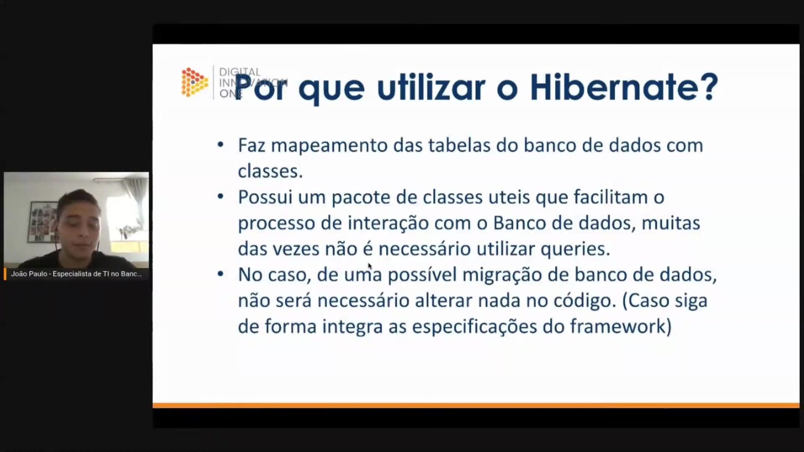
</p>

O Hibernate é destacado como a implementação mais utilizada do JPA (Java Persistence API) para realizar o mapeamento objeto-relacional (ORM). Ele facilita a interação com o banco de dados ao mapear tabelas diretamente para classes Java, permitindo que o desenvolvedor realize operações de busca e persistência sem a necessidade de escrever queries SQL complexas manualmente. 

As principais vantagens de sua utilização incluem:

* **Mapeamento Automático**: Sincronização entre tabelas do banco e classes do projeto. 
* **Produtividade**: Uso de pacotes utilitários e métodos prontos, como o `find()` para seleções e `persist()` para salvar dados. 
* **Abstração do Banco**: Facilita migrações de banco de dados, pois, seguindo as especificações, não é necessário alterar o código-fonte da aplicação para trocar o fornecedor do banco (Dialeto SQL). 

<p align="center">
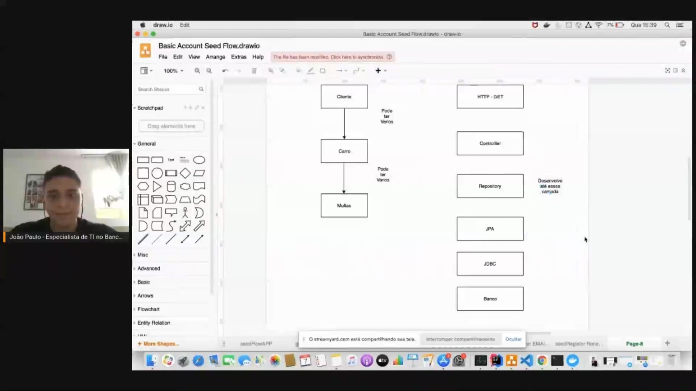
</p>

O fluxo de funcionamento de uma aplicação Java moderna, utilizando o ecossistema Spring, segue uma arquitetura em camadas que isola a lógica de negócio do acesso aos dados. O processo inicia-se com uma requisição externa e percorre os seguintes componentes: 

1. **Client**: Envia uma requisição HTTP (como um GET) para o servidor. 
2. **Controller**: Recebe a requisição e gerencia os endereços (endpoints) da aplicação. 
3. **Repository**: Camada que contém a lógica de acesso aos dados, utilizando abstrações de alto nível. 
4. **JPA / Hibernate**: Realiza a ponte entre os objetos Java e o banco de dados. 
5. **JDBC**: A camada de baixo nível que executa a comunicação direta. 
6. **Banco de Dados**: Onde as informações são efetivamente armazenadas. 

O desenvolvedor atua principalmente até a camada do Repository, sendo as camadas inferiores processadas automaticamente pelo framework. 

<p align="center">
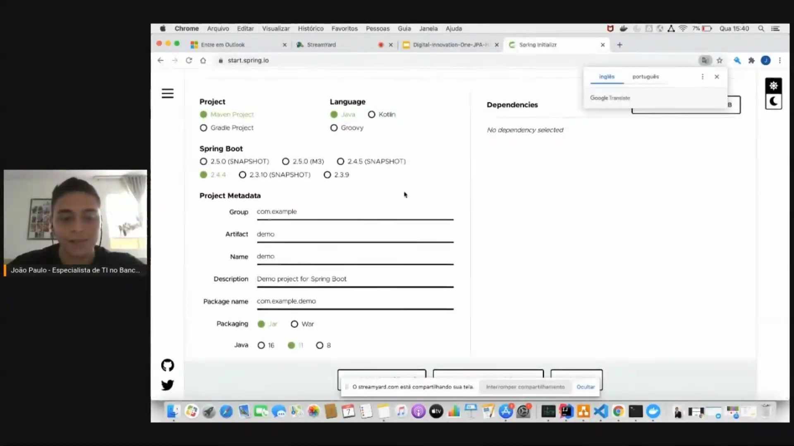
</p>

Para configurar e iniciar um projeto Spring Boot, utiliza-se a ferramenta **Spring Initializr**. Ela permite definir os metadados do projeto, como o gerenciador de dependências (Maven ou Gradle), a linguagem (Java, Kotlin ou Groovy) e a versão do Spring Boot. 

No exemplo visual, os metadados configurados são:

* **Group**: `com.example` 
* **Artifact / Name**: `demo` 
* **Packaging**: `War` 
* **Java Version**: `16` 

Esta interface simplifica a criação da estrutura base da aplicação, gerando os arquivos necessários como o `application.properties`, onde são definidas as credenciais de acesso ao banco de dados e URLs de conexão. 

<p align="center">
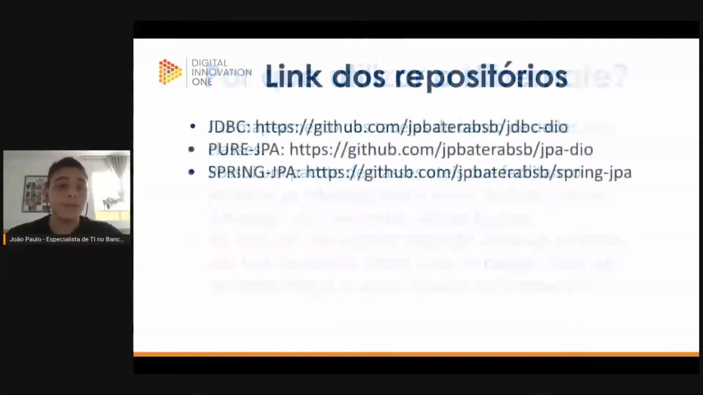
</p>

Os exemplos práticos apresentados na aula e as implementações de referência podem ser consultados nos repositórios oficiais. Eles cobrem desde o uso básico de JDBC até a abstração avançada com Spring Data JPA. 

* **JDBC**: Focado na conexão direta e execução de comandos SQL. `https://github.com/jpbaterabsb/jdbc-dio` 
* **PURE-JPA**: Demonstra o uso do JPA puro, com configurações manuais de `EntityManager`. `https://github.com/jpbaterabsb/jpa-dio` 
* **SPRING-JPA**: Exemplifica a integração moderna, utilizando interfaces de repositório e injeção de dependência. `https://github.com/jpbaterabsb/spring-jpa`      

🟡 Detalhes da implementação no vídeo.

## 🟩 Vídeo 10 - Dúvidas e comentários finais

<video width="60%" controls>
  <source src="000-Midia_e_Anexos/bootcamp_tqi_fullstack-modulo.06-curso.13-video_10.webm" type="video/webm">
    Seu navegador não suporta vídeo HTML5.
</video>

link do vídeo: https://web.dio.me/track/tqi-fullstack-developer/course/jpa-com-hibernate/learning/7d60c0e9-a747-495f-9402-8cadddfea215?autoplay=1

Este resumo aborda uma sessão de perguntas e respostas focada em tecnologias de backend, especificamente sobre a performance de bancos de dados, mapeamento objeto-relacional (ORM) com JPA/Hibernate e a evolução das versões do Java em ambientes corporativos (como o Banco Inter).

### Anotações

#### 1. Comparativo de Performance: PostgreSQL vs. MySQL
* **O papel do Hibernate:** O Hibernate atua como uma camada de abstração genérica. Embora facilite o desenvolvimento, ele pode introduzir um pequeno *overhead* de performance em comparação ao SQL nativo.
* **Veredito do Banco de Dados:** Entre MySQL e PostgreSQL, o **PostgreSQL** é destacado como superior em termos de robustez, funcionalidades e performance em aplicações recentes.
* **Custo-benefício:** O PostgreSQL é citado como uma opção "mais barata" (em termos de eficiência de recursos) e tecnicamente mais avançada que o MySQL.

#### 2. Herança com JPA (Java Persistence API)
* **Modelagem:** É perfeitamente possível implementar herança no banco de dados usando JPA. O exemplo clássico é uma classe `Pessoa` que se ramifica em `PessoaFisica` e `PessoaJuridica`.
* **Estratégias de Tabela:** Existem diferentes formas de gerar essas tabelas (como Tabela Única, Tabelas Unidas ou Tabela por Classe Concreta), dependendo da necessidade do projeto.
* **Dica de Estudo:** O palestrante recomenda o portal *DevMedia* para exemplos práticos e detalhados sobre as anotações específicas de herança.

#### 3. Evolução do Java no Mercado (Caso Banco Inter)
* **Convivência de Versões:** O uso do Java 8 ainda é comum em sistemas legados ou frameworks mais antigos baseados em Spring.
* **Modernização:** Projetos mais novos utilizam o framework **Micronaut** com **Java 11** ou versões superiores (como Java 16).
* **Cultura de Atualização:** Empresas de tecnologia de ponta buscam não ficar presas ao Java 8, tentando acompanhar as evoluções da linguagem para ganhar performance e novos recursos.

#### 4. Automação de Banco de Dados com Hibernate
* **Criação Automática (DDL):** O Hibernate tem a capacidade de criar a estrutura do banco de dados (tabelas, índices) automaticamente a partir do código Java.
* **Independência de Dialeto:** A grande vantagem é escrever o código uma vez e poder alternar entre bancos (ex: de Oracle para MySQL) apenas mudando o "dialeto" nas configurações, sem alterar a lógica de negócio.

#### 💡 Insights e Análises (Estilo NotebookLM)

##### 🚀 O Dilema da Abstração vs. Performance
Um insight crucial é que o Hibernate prioriza a **produtividade e a portabilidade** do código. No entanto, para sistemas que exigem performance extrema, o uso de banco de dados nativo (SQL puro) pode ser preferível. A escolha da ferramenta deve ser ditada pelo equilíbrio entre a velocidade de desenvolvimento e a carga de processamento esperada.

#### ⚠️ O Perigo da Automação em Produção
Embora o Hibernate possa criar e deletar tabelas automaticamente (`create-drop`), isso é estritamente recomendado apenas para **ambientes de desenvolvimento, TCCs ou Hackathons**. Em produção, o controle do banco de dados deve ser manual ou via ferramentas de migração (como Flyway ou Liquibase), para evitar a perda acidental de dados críticos.

#### 🛠️ Diversificação de Frameworks
O resumo revela que o ecossistema Java moderno não gira apenas em torno do Spring. O surgimento e a adoção do **Micronaut** no Banco Inter mostram uma tendência de busca por frameworks mais leves e modulares, que facilitam a atualização para versões mais recentes do Java (11, 16+).

#### 📈 PostgreSQL como Padrão de Indústria
A preferência clara pelo PostgreSQL sobre o MySQL reflete uma tendência atual no desenvolvimento backend. O PostgreSQL é visto não apenas como um banco relacional, mas como uma plataforma robusta capaz de lidar com tipos de dados complexos e alta concorrência de forma mais eficiente que seus concorrentes diretos.

**Conclusão:** O diálogo reforça que ser um desenvolvedor backend moderno exige entender não apenas a linguagem (Java), mas como as camadas de abstração (Hibernate) interagem com a infraestrutura (Bancos de Dados) e a importância de se manter atualizado com as versões mais recentes das ferramentas.


# Certificado: 

- Link na plataforma: 
- Certificado em pdf: