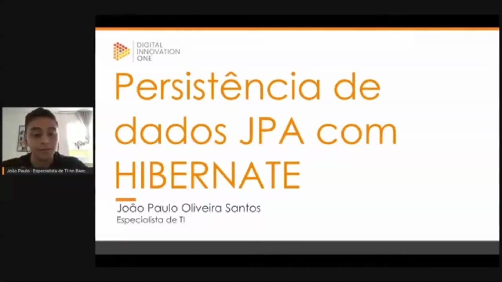
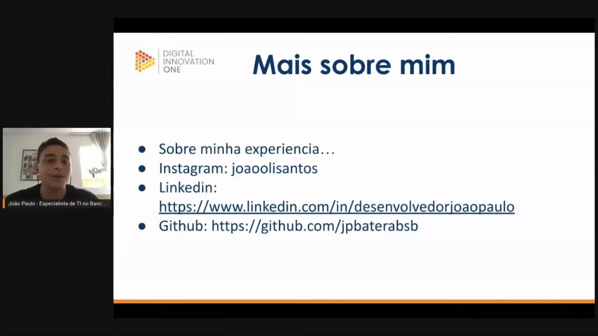
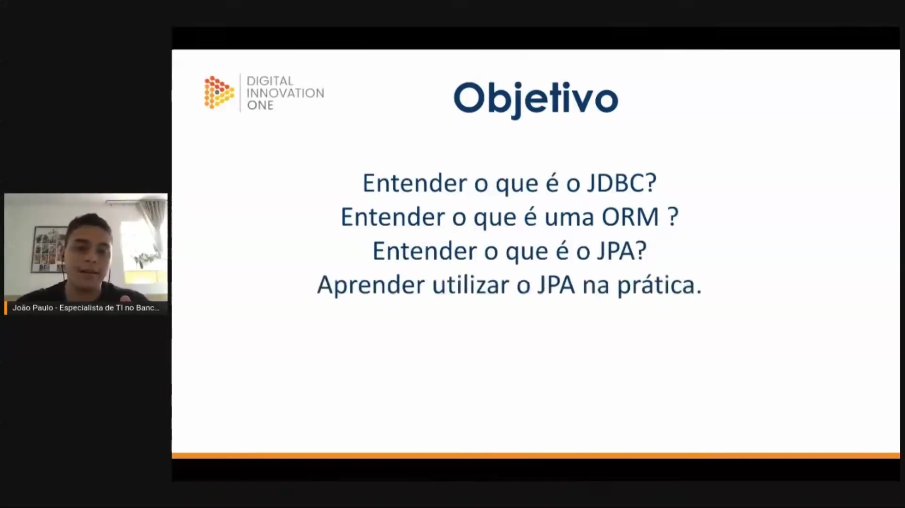

## Instrutor

- Joao Paulo Oliveira Santos (Senior Fullstack Engineer | Payment Systems (5B txns) + DeFi ($250M TVL) | Python•Java•Node.js•Go•React•React Native | Blockchain & Stablecoins | Remote)
- Contato Linkedin: / [desenvolvedorjoaopaul](https://www.linkedin.com/in/desenvolvedorjoaopaul/)

# Parte 1 - Entendendo a estrutura do projeto

## 🟩 Vídeo 01 - Introdução e objetivos do curso

<video width="60%" controls>
  <source src="000-Midia_e_Anexos/bootcamp_tqi_fullstack-modulo.06-curso.13-video_01.webm" type="video/webm">
    Seu navegador não suporta vídeo HTML5.
</video>

link do vídeo: https://web.dio.me/track/tqi-fullstack-developer/course/jpa-com-hibernate/learning/6cb58f70-30ac-4de8-aaa8-f440efa3bc97?autoplay=1

Este guia resume a trajetória profissional do palestrante, sua filosofia de aprendizado contínuo e os objetivos técnicos da sessão sobre tecnologias de persistência em Java.

### Anotações

Esta apresentação introduz o tema de **persistência de dados utilizando JPA (Java Persistence API) com Hibernate**. O conteúdo é ministrado por **João Paulo Oliveira Santos**, especialista de TI no Banco Inter, com o objetivo de demonstrar como essas tecnologias facilitam a comunicação entre aplicações Java e bancos de dados relacionais.

Neste momento, o palestrante compartilha sua trajetória profissional de aproximadamente seis anos na área de TI, destacando seu início com tecnologias legadas (JSP com Java) e passagens por instituições como o Sicoob. É reforçada a importância da **curiosidade técnica** e do aprendizado contínuo ao se deparar com novos termos e tecnologias. Para acompanhar o material prático e manter contato, são disponibilizados os seguintes links:

* **Instagram:** joaoolisantos
* **LinkedIn:** [desenvolvedorjoaopaulo](https://www.linkedin.com/in/desenvolvedorjoaopaulo)
* **GitHub:** [jpbaterabsb](https://github.com/jpbaterabsb) (onde os códigos e slides da live estão disponíveis)

O roteiro principal da aula está estruturado para cobrir desde conceitos fundamentais até a aplicação prática. Os **objetivos centrais** incluem:

* **JDBC:** Compreender a base da conectividade Java com bancos de dados.
* **ORM (Object-Relational Mapping):** Entender o conceito de mapeamento objeto-relacional, que é o pilar para frameworks de persistência.
* **JPA:** Definir o papel da especificação Java Persistence API.
* **Prática:** Aplicar os conceitos de JPA e Hibernate no desenvolvimento de uma solução de persistência.

## 🟩 Vídeo 02 - O que é JDBC

<video width="60%" controls>
  <source src="000-Midia_e_Anexos/bootcamp_tqi_fullstack-modulo.06-curso.13-video_02.webm" type="video/webm">
    Seu navegador não suporta vídeo HTML5.
</video>

link do vídeo:

## 🟩 Vídeo 03 - Estrutura do código - Parte 1

<video width="60%" controls>
  <source src="000-Midia_e_Anexos/bootcamp_tqi_fullstack-modulo.06-curso.13-video_03.webm" type="video/webm">
    Seu navegador não suporta vídeo HTML5.
</video>

link do vídeo:

## 🟩 Vídeo 04 - O que são ORM, JPA e Hibernate

<video width="60%" controls>
  <source src="000-Midia_e_Anexos/bootcamp_tqi_fullstack-modulo.06-curso.13-video_04.webm" type="video/webm">
    Seu navegador não suporta vídeo HTML5.
</video>

link do vídeo:

## 🟩 Vídeo 05 - Estrutura do código - Parte 2

<video width="60%" controls>
  <source src="000-Midia_e_Anexos/bootcamp_tqi_fullstack-modulo.06-curso.13-video_05.webm" type="video/webm">
    Seu navegador não suporta vídeo HTML5.
</video>

link do vídeo:

## Parte 2 - Desenvolvimento da comunicação com banco de dados

## 🟩 Vídeo 06 - Estrutura básica do banco de dados

<video width="60%" controls>
  <source src="000-Midia_e_Anexos/bootcamp_tqi_fullstack-modulo.06-curso.13-video_06.webm" type="video/webm">
    Seu navegador não suporta vídeo HTML5.
</video>

link do vídeo:

## 🟩 Vídeo 07 - Desenvolvendo o código de persistência de dados

<video width="60%" controls>
  <source src="000-Midia_e_Anexos/bootcamp_tqi_fullstack-modulo.06-curso.13-video_07.webm" type="video/webm">
    Seu navegador não suporta vídeo HTML5.
</video>

link do vídeo:

## 🟩 Vídeo 08 - Como funciona uma transação

<video width="60%" controls>
  <source src="000-Midia_e_Anexos/bootcamp_tqi_fullstack-modulo.06-curso.13-video_08.webm" type="video/webm">
    Seu navegador não suporta vídeo HTML5.
</video>

link do vídeo:

## 🟩 Vídeo 09 - Por que utilizar o Hibernate?

<video width="60%" controls>
  <source src="000-Midia_e_Anexos/bootcamp_tqi_fullstack-modulo.06-curso.13-video_09.webm" type="video/webm">
    Seu navegador não suporta vídeo HTML5.
</video>

link do vídeo:

## 🟩 Vídeo 10 - Dúvidas e comentários finais

<video width="60%" controls>
  <source src="000-Midia_e_Anexos/bootcamp_tqi_fullstack-modulo.06-curso.13-video_10.webm" type="video/webm">
    Seu navegador não suporta vídeo HTML5.
</video>

link do vídeo:

##  Materiais de Apoio

# Certificado: 

- Link na plataforma: 
- Certificado em pdf: