## Instrutor

- Venilton Falvo Jr (Doutor em Engenharia de Software, Education Tech Lead na DIO)
- Contato Linkedin: / [falvojr](https://www.linkedin.com/in/falvojr/)

## Parte 1 - Programação Orientada a Objetos

### 🟩 Vídeo 01 - Apresentação e conceitos sobre Domínio/Problema

<video width="60%" controls>
  <source src="000-Midia_e_Anexos/bootcamp_tqi_fullstack-modulo.06-curso.14-video_01.webm" type="video/webm">
    Seu navegador não suporta vídeo HTML5.
</video>

link do vídeo: https://web.dio.me/project/criando-um-banco-digital-com-java-e-orientacao-objetos/learning/133f3c7e-4474-4582-8e78-987f038ab283?back=/track/tqi-fullstack-developer&tab=undefined&moduleId=undefined

Este guia resume a Expert Talk sobre Programação Orientada a Objetos (POO), focando em como desmistificar conceitos complexos através de uma abordagem prática e baseada em domínios do mundo real. O objetivo principal é capacitar desenvolvedores a criarem sistemas modulares, sustentáveis e de fácil compreensão.

### Anotações

<p align="center">
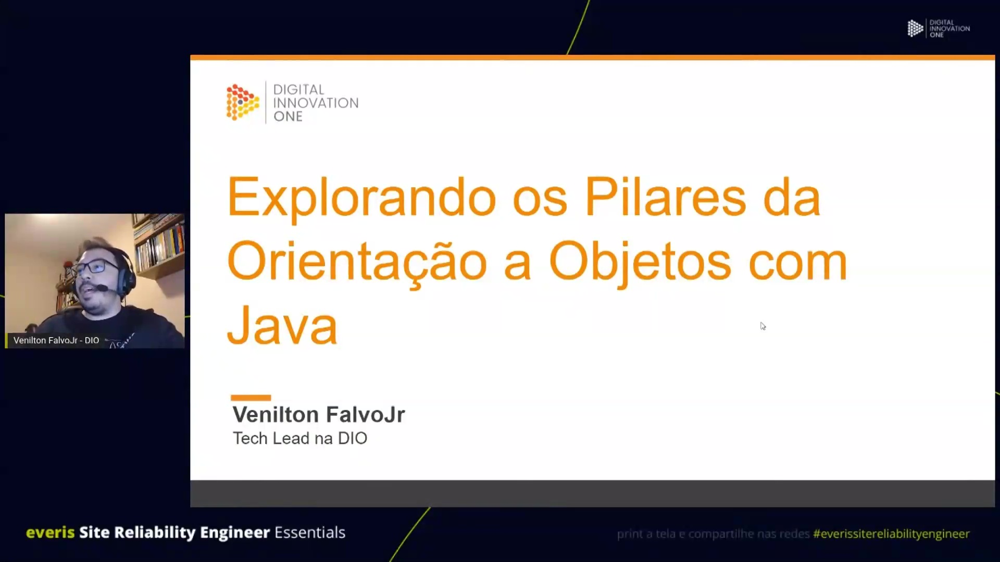
</p>

Nesta introdução, o instrutor Venilton FalvoJr, Tech Lead na DIO, apresenta a proposta da Expert Talk: explorar os **pilares da Orientação a Objetos (OO) utilizando a linguagem Java**. O foco inicial é desmistificar o tema para iniciantes, mostrando que, através de uma abordagem prática e um domínio de problema simples, é possível compreender conceitos fundamentais que garantem a organização, modularidade e manutenibilidade de projetos de software a longo prazo.

<p align="center">
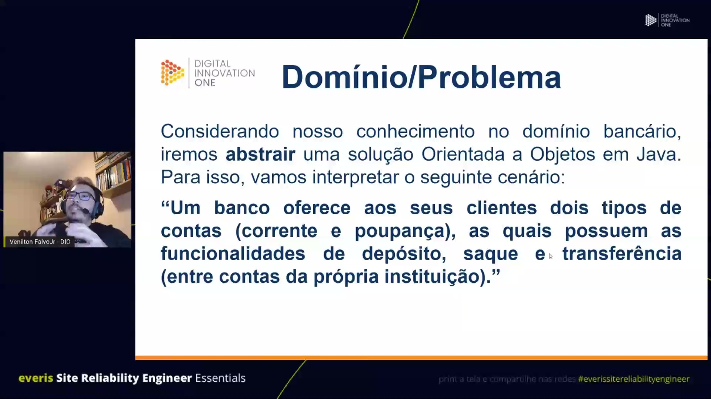
</p>

Para exercitar a abstração orientada a objetos, é definido o **Domínio do Problema** baseado em um cenário bancário. A escolha desse domínio deve-se à familiaridade geral com o tema, o que facilita a tradução de regras de negócio para o código. O desafio consiste em interpretar o seguinte cenário:

* **Entidades**: O banco oferece dois tipos de contas: **Corrente** e **Poupança**.
* **Funcionalidades**: As contas devem permitir operações de **depósito**, **saque** e **transferência** (restrita a contas da própria instituição).

<p align="center">
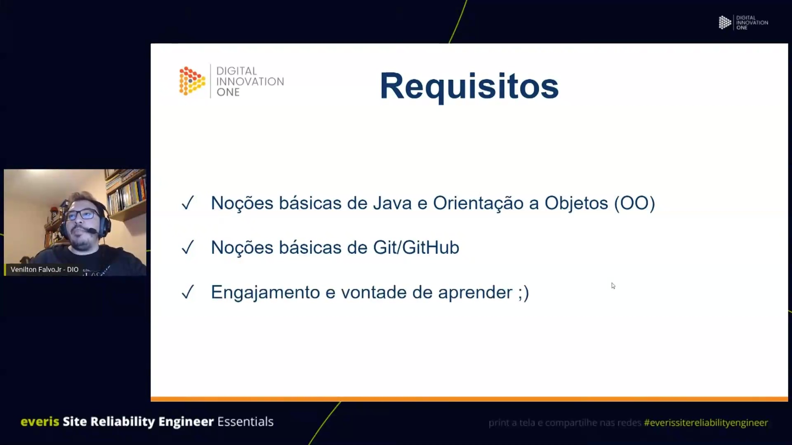
</p>

Para acompanhar o desenvolvimento da solução e progredir de forma fluida, são estabelecidos os seguintes requisitos:

* **Conhecimento Técnico**: Noções básicas de **Java**, **Orientação a Objetos** e uso de ferramentas de versionamento como **Git e GitHub**.
* **Postura**: Engajamento e vontade de aprender para transformar o cenário hipotético em uma solução de software real.      


### 🟩 Vídeo 02 - Pilares da orientação a objetos - Abstração

<video width="60%" controls>
  <source src="000-Midia_e_Anexos/bootcamp_tqi_fullstack-modulo.06-curso.14-video_02.webm" type="video/webm">
    Seu navegador não suporta vídeo HTML5.
</video>

link do vídeo: https://web.dio.me/lab/criando-um-banco-digital-com-java-e-orientacao-objetos/learning/722fe69c-dd71-4441-ac2a-e01e888f342d

Este resumo explora o conceito de Abstração, um dos pilares fundamentais da POO, demonstrando como transformar problemas do mundo real em estruturas de código eficientes e concisas.

### Anotações

<p align="center">
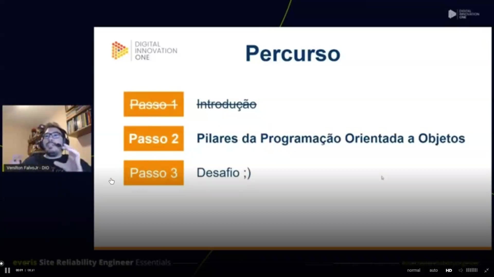
</p>

O instrutor inicia a aula introduzindo os pilares da Programação Orientada a Objetos (POO), destacando que o percurso incluirá uma introdução teórica seguida pela exploração prática desses conceitos. O foco inicial da trilha é preparar o ambiente para a resolução de um desafio prático de desenvolvimento.

<p align="center">
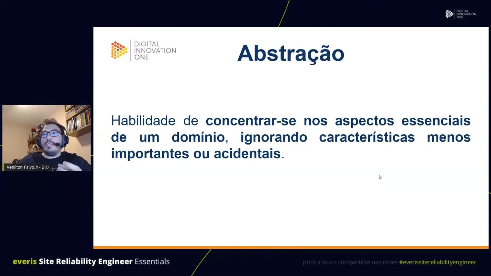
</p>

A **Abstração** é apresentada como um dos pilares fundamentais da POO. Ela consiste na capacidade de focar exclusivamente nos aspectos essenciais de um domínio de negócio, descartando características acidentais ou irrelevantes para o sistema. O objetivo é reduzir a complexidade, garantindo que o software seja conciso e implemente apenas o necessário para sua efetividade.

<p align="center">
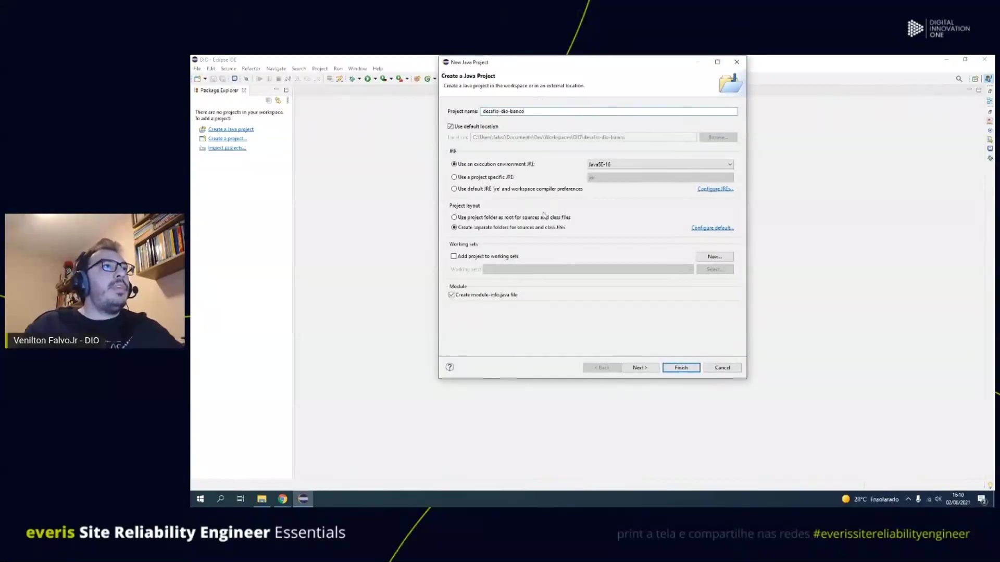
</p>

Para aplicar a abstração na prática, o instrutor inicia a criação de um novo projeto Java no Eclipse IDE. O projeto é nomeado como `desafio-dio-banco`, servindo de base para modelar o domínio bancário proposto no exercício.

<p align="center">
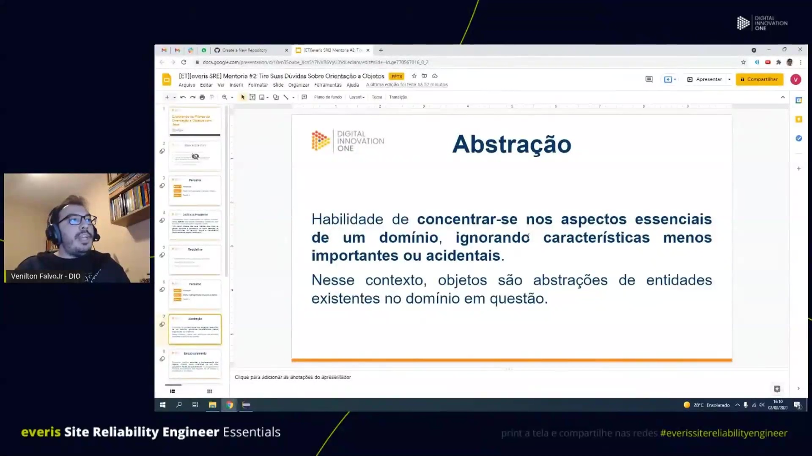
</p>

Neste contexto de modelagem, os objetos do sistema são definidos como abstrações de entidades reais do domínio. A tarefa do desenvolvedor é interpretar o problema e identificar quais entidades (como bancos ou contas) possuem relevância para serem transformadas em classes dentro do código.

<p align="center">
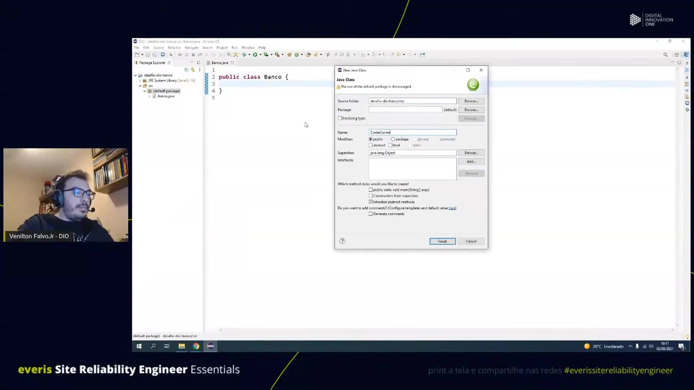
</p>

Início da implementação das classes no Eclipse. A primeira entidade criada é a classe `Banco`, que representa um dos elementos centrais do domínio de aplicação.

```java
public class Banco {

}

```

<p align="center">
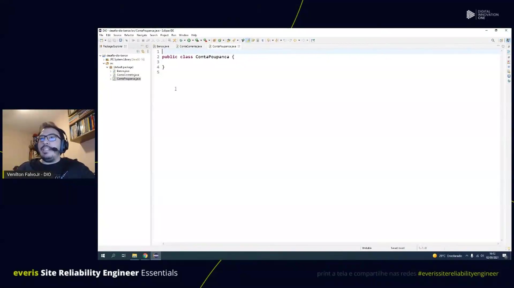
</p>

O processo de criação de novas classes continua, focando em especializar os tipos de contas identificados na abstração do domínio bancário. O assistente de criação do Eclipse é utilizado para gerar a estrutura básica de cada entidade.

<p align="center">
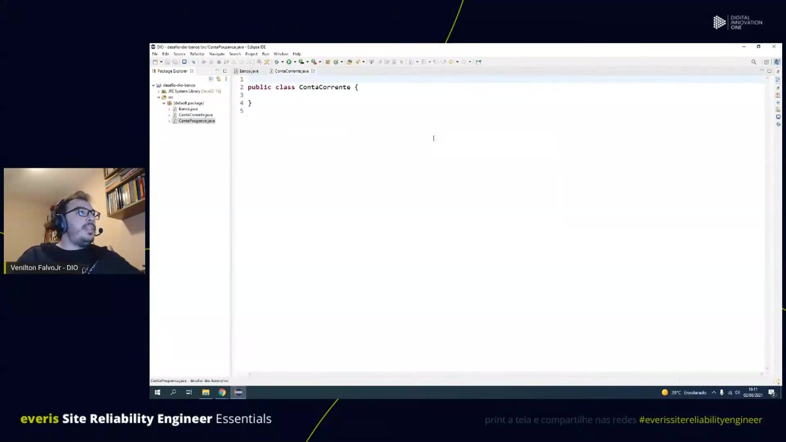
</p>

As classes `ContaCorrente` e `ContaPoupanca` são adicionadas ao projeto. A organização inicial foca em separar as responsabilidades de cada tipo de conta que o banco oferecerá aos seus clientes.

```java
public class ContaCorrente {

}

```

```java
public class ContaPoupanca {

}

```

<p align="center">
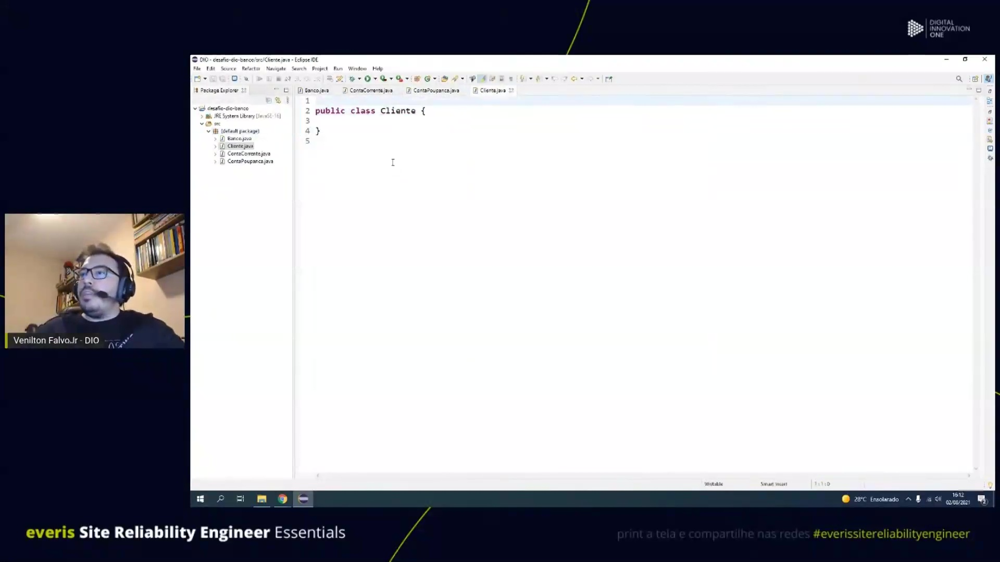
</p>

A abstração segue para a identificação da entidade `Cliente`. O instrutor reforça que "entidade" é o termo utilizado para classes que representam conceitos vitais dentro do domínio de aplicação, como o proprietário das contas.

<p align="center">
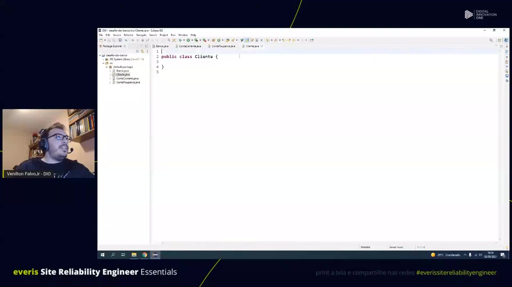
</p>

Criação da classe `Cliente` no ambiente de desenvolvimento. Com isso, o projeto já possui o conjunto mínimo de classes (Banco, Cliente, ContaCorrente e ContaPoupanca) para começar a definir atributos e comportamentos.

```java
public class Cliente {

}

```

<p align="center">
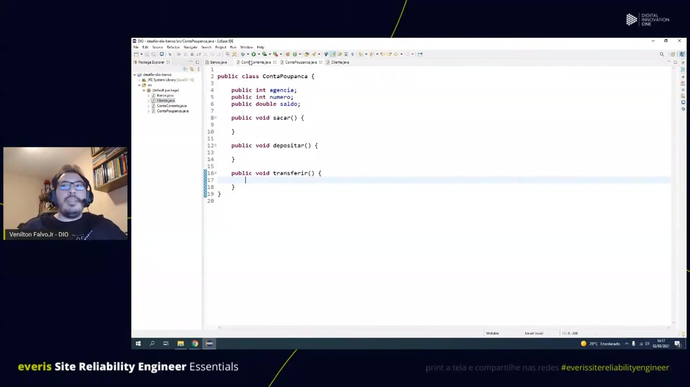
</p>

Nesta etapa, a classe `ContaPoupanca` é populada com atributos essenciais (agência, número e saldo) e métodos que representam as operações básicas exigidas pelo domínio: sacar, depositar e transferir. O código ainda não se preocupa com encapsulamento ou repetição, focando apenas na representação funcional da abstração.

```java
public class ContaPoupanca {

	public int agencia;
	public int numero;
	public double saldo;

	public void sacar() {
		
	}

	public void depositar() {
		
	}

	public void transferir() {
		
	}
}

```      


### 🟩 Vídeo 03 - Pilares da orientação a objetos - Encapsulamento

<video width="60%" controls>
  <source src="000-Midia_e_Anexos/bootcamp_tqi_fullstack-modulo.06-curso.14-video_03.webm" type="video/webm">
    Seu navegador não suporta vídeo HTML5.
</video>

link do vídeo: https://web.dio.me/lab/criando-um-banco-digital-com-java-e-orientacao-objetos/learning/b6aaafb2-9b38-440f-a14a-a99779980623

Este resumo explora o pilar do Encapsulamento, detalhando sua definição, a importância de uma interface de uso coesa e exemplos práticos de implementação em Java.

### Anotações

<p align="center">
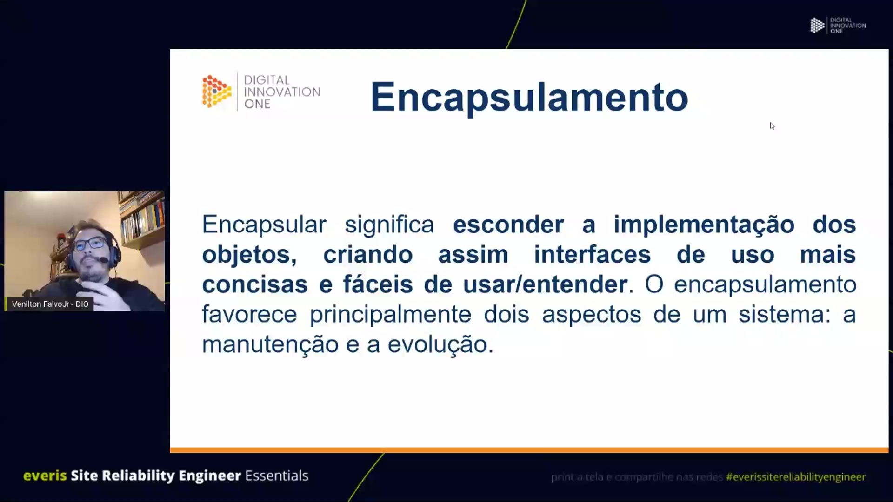
</p>

Neste ponto da aula, o foco é o pilar do **Encapsulamento** na Programação Orientada a Objetos (POO). Diferente da crença comum de que o encapsulamento se resume apenas a métodos de acesso (getters e setters), o conceito central é o **esconderijo da implementação**.

Encapsular significa proteger a lógica interna dos objetos, expondo apenas o que é estritamente necessário através de interfaces concisas. Isso garante que o usuário do objeto interaja com ele de forma simples e segura, sem precisar conhecer a complexidade interna. Os principais benefícios dessa prática são:

* **Manutenção:** Facilita correções internas sem impactar quem utiliza a classe.
* **Evolução:** Permite que o sistema cresça e mude suas regras internas mantendo a compatibilidade da interface de uso.

<p align="center">
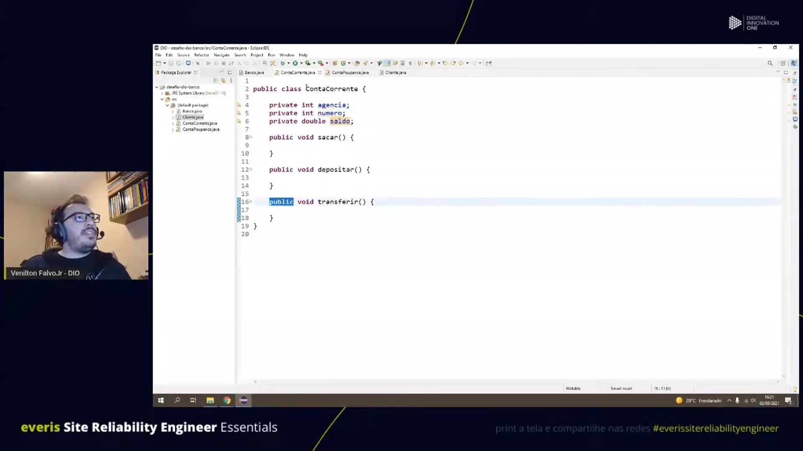
</p>

Ao aplicar o encapsulamento na prática dentro do Java, a primeira regra fundamental é restringir a visibilidade dos atributos. No código abaixo, as propriedades da classe `ContaCorrente` são definidas como `private`, garantindo que não sejam acessadas ou modificadas diretamente de fora da classe.

```java
public class ContaCorrente {

    private int agencia;
    private int numero;
    private double saldo;

    public void sacar() {
        
    }

    public void depositar() {
        
    }

    public void transferir(){
        
    }
}

```

A ideia é que os métodos `sacar()`, `depositar()` e `transferir()` funcionem como a "interface de uso" da conta. No Java, o padrão é manter os atributos privados até que surja uma necessidade real de expô-los, priorizando a segurança da integridade dos dados.

<p align="center">
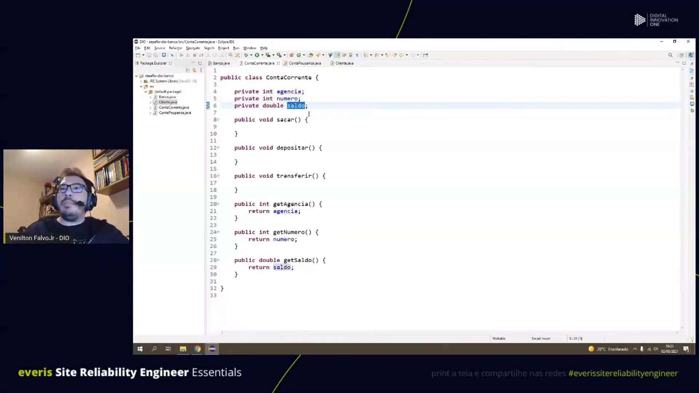
</p>

Após definir os atributos como privados, utilizamos métodos assessores (**getters**) para permitir a leitura controlada dessas informações. Neste exemplo, optou-se por criar apenas os métodos `get`, sem os métodos de atribuição (`set`), para proteger a consistência da conta. Isso evita que sistemas externos alterem arbitrariamente o número da agência ou o saldo sem passar pelas regras de negócio da classe.

```java
public class ContaCorrente {

    private int agencia;
    private int numero;
    private double saldo;

    public void sacar() {

    }

    public void depositar() {

    }

    public void transferir() {

    }

    public int getAgencia() {
        return agencia;
    }

    public int getNumero() {
        return numero;
    }

    public double getSaldo() {
        return saldo;
    }
}

```

Essa abordagem reforça que o encapsulamento define a forma como o objeto é utilizado: agência e número podem ser definidos no momento da criação, enquanto o saldo deve ser manipulado apenas através das operações de saque, depósito e transferência.      


### 🟩 Vídeo 04 - Pilares da orientação a objetos - Herança

<video width="60%" controls>
  <source src="000-Midia_e_Anexos/bootcamp_tqi_fullstack-modulo.06-curso.14-video_04.webm" type="video/webm">
    Seu navegador não suporta vídeo HTML5.
</video>

link do vídeo: https://web.dio.me/lab/criando-um-banco-digital-com-java-e-orientacao-objetos/learning/7fce6cb4-f125-4fec-8927-435eec7c89eb

Este resumo explora a transição de um código redundante para uma arquitetura robusta utilizando os pilares da Programação Orientada a Objetos (POO). O foco principal é a aplicação prática desses conceitos em um sistema bancário (Contas Correntes e Poupança).

### Anotações

<p align="center">
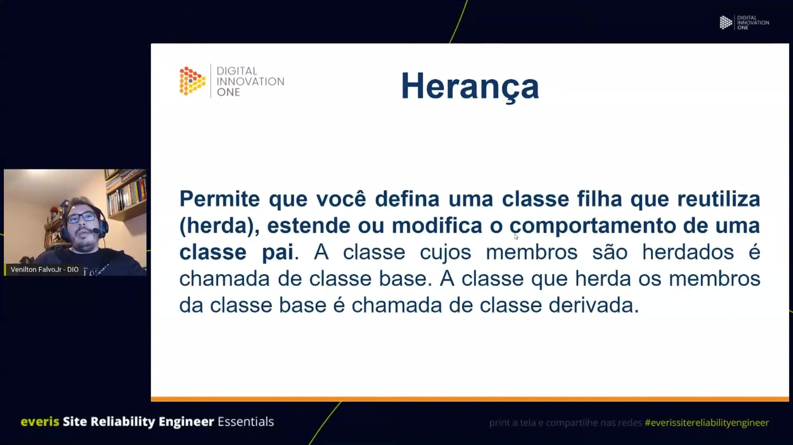
</p>

Nesta introdução ao pilar de **Herança**, o foco é a reutilização de código e a eficiência na modelagem de sistemas. O conceito permite a definição de uma **classe filha** que reutiliza (herda), estende ou modifica o comportamento de uma **classe pai**, também chamada de classe base.

Essa abordagem é fundamental para aplicar o princípio **DRY (Don't Repeat Yourself)**. Em vez de replicar atributos e métodos idênticos em classes como "Conta Corrente" e "Conta Poupança", cria-se uma superclasse genérica que centraliza essas características, tornando o código mais elegante e fácil de manter.

<p align="center">
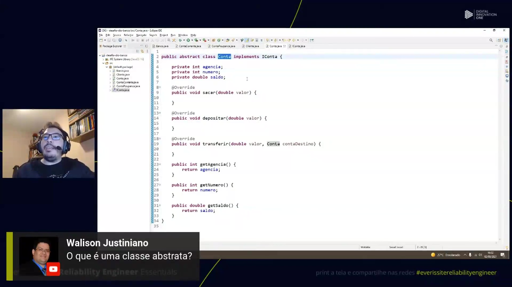
</p>

A implementação prática no ambiente de desenvolvimento demonstra a criação de uma **classe abstrata** chamada `Conta`, que implementa a interface `IConta`. Uma classe abstrata é utilizada de forma estratégica: ela serve como um molde que não pode ser instanciado diretamente, pois faz sentido apenas que as classes filhas específicas, como Corrente ou Poupança, existam como objetos reais.

O uso da interface `IConta` estabelece um **contrato**, obrigando a classe a implementar métodos essenciais como saque, depósito e transferência. Abaixo, observa-se a estrutura base com os atributos privados e os métodos de acesso (getters):

```java
public abstract class Conta implements IConta {
    private int agencia;
    private int numero;
    private double saldo;

    @Override
    public void sacar(double valor) {
    }

    @Override
    public void depositar(double valor) {
    }

    @Override
    public void transferir(double valor, Conta contaDestino) {
    }

    public int getAgencia() {
        return agencia;
    }

    public int getNumero() {
        return numero;
    }

    public double getSaldo() {
        return saldo;
    }
}

```      

### 🟩 Vídeo 05 - Pilares da orientação a objetos - Polimorfismo

<video width="60%" controls>
  <source src="000-Midia_e_Anexos/bootcamp_tqi_fullstack-modulo.06-curso.14-video_05.webm" type="video/webm">
    Seu navegador não suporta vídeo HTML5.
</video>

link do vídeo: https://web.dio.me/lab/criando-um-banco-digital-com-java-e-orientacao-objetos/learning/7d6eeed8-9dfa-4710-bb0c-eb82a0f55bee

Este vídeo explora o conceito de polimorfismo, demonstrando como objetos podem ser referenciados de diferentes formas dentro de uma hierarquia de classes. Além disso, aborda a implementação prática de construtores, o uso de variáveis estáticas para contadores sequenciais e a importância dos modificadores de acesso.

### Anotações

<p align="center">
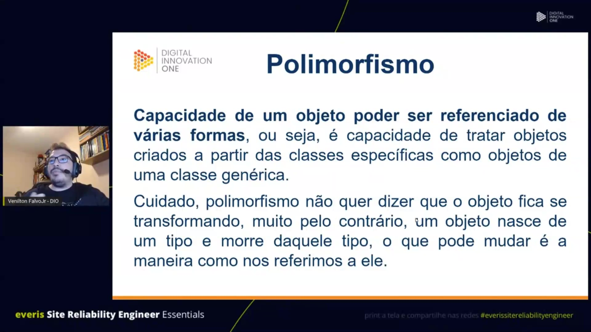
</p>

O polimorfismo é definido como a capacidade de um objeto ser referenciado de múltiplas formas. Na prática da Programação Orientada a Objetos, isso significa que podemos tratar objetos criados a partir de classes específicas (como uma conta corrente) como se fossem objetos de uma classe genérica (como uma conta comum), dependendo da necessidade do contexto.

É fundamental destacar que o polimorfismo não implica na transformação do objeto em si. Um objeto mantém o tipo com o qual foi instanciado durante todo o seu ciclo de vida; o que se altera é a forma como nos referimos a ele através das variáveis de referência. Essa técnica é poderosa para evitar códigos repetitivos, permitindo que utilizemos métodos genéricos da hierarquia de classes sempre que possível, recorrendo à tipagem específica apenas quando comportamentos exclusivos são necessários.

<p align="center">
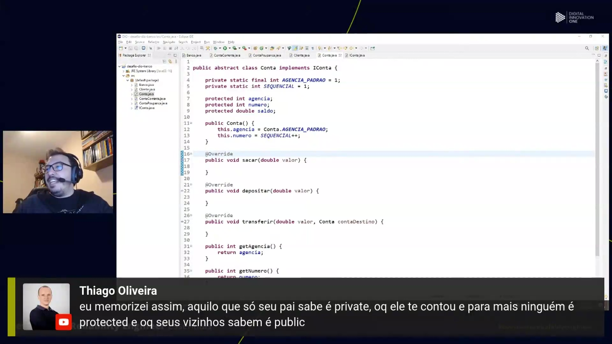
</p>

A implementação técnica demonstra a transição do uso de modificadores de acesso para otimizar a herança. Ao alterar os atributos de `private` para `protected`, permitimos que as classes filhas visualizem e manipulem as propriedades da classe pai, como `agencia` e `numero`, sem expô-las publicamente.

O código também introduz uma lógica de automação para a criação de contas, utilizando uma constante para a agência padrão e um campo estático `SEQUENCIAL` para garantir que cada nova conta receba um número único e incremental, funcionando de forma análoga a uma chave primária.

```java
public abstract class Conta implements IConta {

    private static final int AGENCIA_PADRAO = 1;
    private static int SEQUENCIAL = 1;

    protected int agencia;
    protected int numero;
    protected double saldo;

    public Conta() {
        this.agencia = Conta.AGENCIA_PADRAO;
        this.numero = SEQUENCIAL++;
    }

    @Override
    public void sacar(double valor) {

    }

    @Override
    public void depositar(double valor) {

    }

    @Override
    public void transferir(double valor, Conta contaDestino) {

    }

    public int getAgencia() {
        return agencia;
    }

    public int getNumero() {
        return numero;
    }
}

```

Para facilitar a memorização da visibilidade dos modificadores, podemos analisar os padrões de acesso da seguinte forma:

* **Private:** Informação restrita apenas à própria classe (o que só o "pai" sabe).
* **Protected:** Informação compartilhada dentro da hierarquia de herança (o que o "pai" conta para os filhos).
* **Public:** Informação acessível a qualquer outra classe do sistema (o que os "vizinhos" sabem).      


### 🟩 Vídeo 06 - Desenvolvendo saque, depósito, transferência e extrato

<video width="60%" controls>
  <source src="000-Midia_e_Anexos/bootcamp_tqi_fullstack-modulo.06-curso.14-video_06.webm" type="video/webm">
    Seu navegador não suporta vídeo HTML5.
</video>

link do vídeo: https://web.dio.me/lab/criando-um-banco-digital-com-java-e-orientacao-objetos/learning/5394cef5-5bd3-4a54-8c6e-64a33e4b1ea0


### 🟩 Vídeo 07 - Proposta de desafio de projeto

<video width="60%" controls>
  <source src="000-Midia_e_Anexos/bootcamp_tqi_fullstack-modulo.06-curso.14-video_07.webm" type="video/webm">
    Seu navegador não suporta vídeo HTML5.
</video>

link do vídeo:

### 🟩 Vídeo 08 - Subindo o código no Github e comentários finais

<video width="60%" controls>
  <source src="000-Midia_e_Anexos/bootcamp_tqi_fullstack-modulo.06-curso.14-video_08.webm" type="video/webm">
    Seu navegador não suporta vídeo HTML5.
</video>

link do vídeo:

### 🟩 Vídeo 09 - Entendendo o Desafio

<video width="60%" controls>
  <source src="000-Midia_e_Anexos/bootcamp_tqi_fullstack-modulo.06-curso.14-video_09.webm" type="video/webm">
    Seu navegador não suporta vídeo HTML5.
</video>

link do vídeo:


##  Materiais de Apoio

# Certificado: 

- Link na plataforma: 
- Certificado em pdf: