## Instrutor

- Willyan Guimarães Caetano (Senior Software Engineer | Tech Lead | Java | Backend)
- Contato Linkedin: / [willyancaetanodev](https://www.linkedin.com/in/willyancaetanodev/)

## Parte 1 - Apresentação do curso

### 🟩 Vídeo 01 - Apresentação do curso

<video width="60%" controls>
  <source src="000-Midia_e_Anexos/bootcamp_tqi_fullstack-modulo.06-curso.15-video_01.webm" type="video/webm">
    Seu navegador não suporta vídeo HTML5.
</video>

link do vídeo: https://web.dio.me/track/tqi-fullstack-developer/course/testes-unitarios-com-junit/learning/66d6b610-ab3e-4475-b71b-675462c1ab49?autoplay=1

Este documento resume a introdução ao curso de Testes Unitários com JUnit, apresentado por William, um desenvolvedor Java experiente. O curso visa não apenas ensinar a ferramenta, mas também a fundamentação técnica e as motivações por trás da escrita de testes de qualidade.

### Anotações

<p align="center">
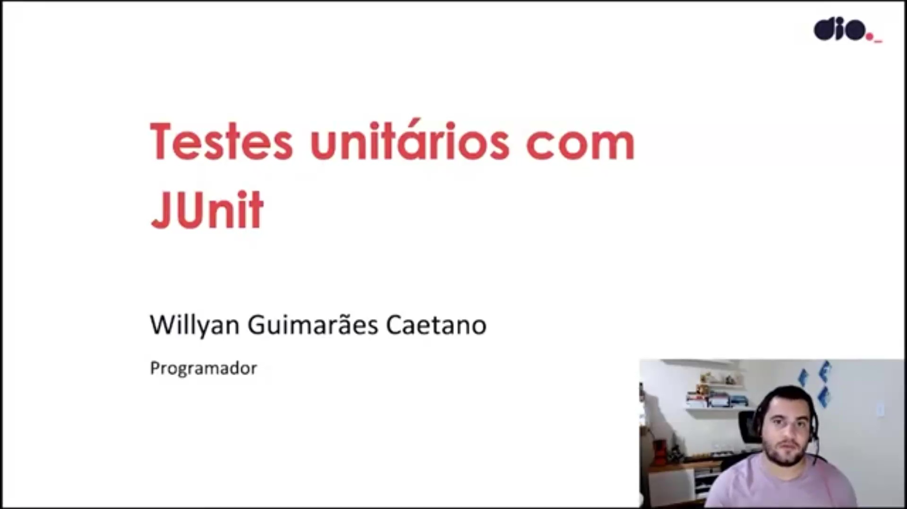
</p>

Nesta introdução, o instrutor Willyan Guimarães Caetano apresenta o curso focado em **Testes Unitários com JUnit**. O objetivo central desta jornada é capacitar o desenvolvedor a utilizar esta ferramenta essencial do ecossistema Java para garantir a qualidade e o funcionamento isolado de componentes de software.

<p align="center">
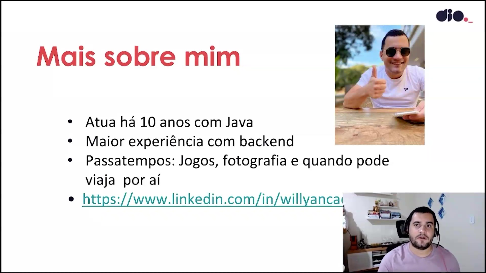
</p>

O instrutor compartilha seu perfil profissional e pessoal para estabelecer o contexto de sua experiência:

* **Experiência Profissional**: Atua há 10 anos com a tecnologia Java, possuindo especialidade e paixão pelo desenvolvimento **Backend**, além de interesse em arquitetura e design de código.
* **Vida Pessoal**: Seus passatempos incluem jogos, fotografia e viagens.
* **Contato**: Disponibiliza seu perfil no LinkedIn para conexões e troca de conhecimentos técnicos.

<p align="center">
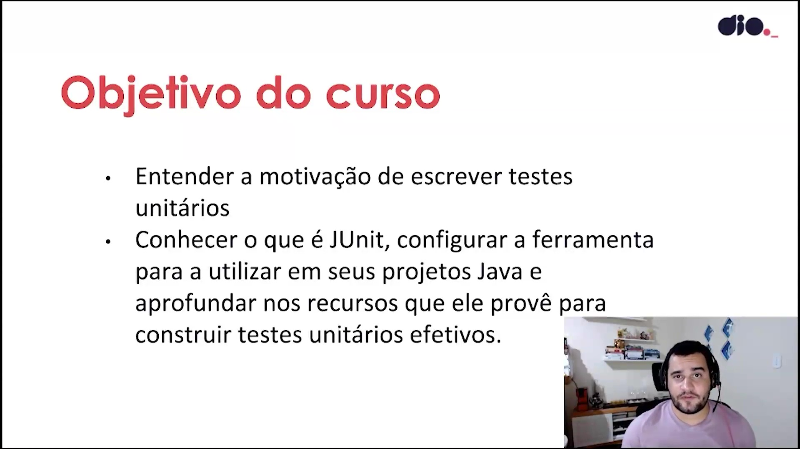
</p>

Os objetivos principais do curso estão estruturados em três pilares fundamentais:

1. **Motivação**: Compreender a fundamentação técnica e as circunstâncias que levam à necessidade de se escrever testes unitários.
2. **Configuração**: Conhecer o JUnit e aprender como configurar a ferramenta adequadamente em projetos Java.
3. **Aprofundamento**: Explorar os recursos avançados que a biblioteca provê para a construção de testes efetivos.

<p align="center">
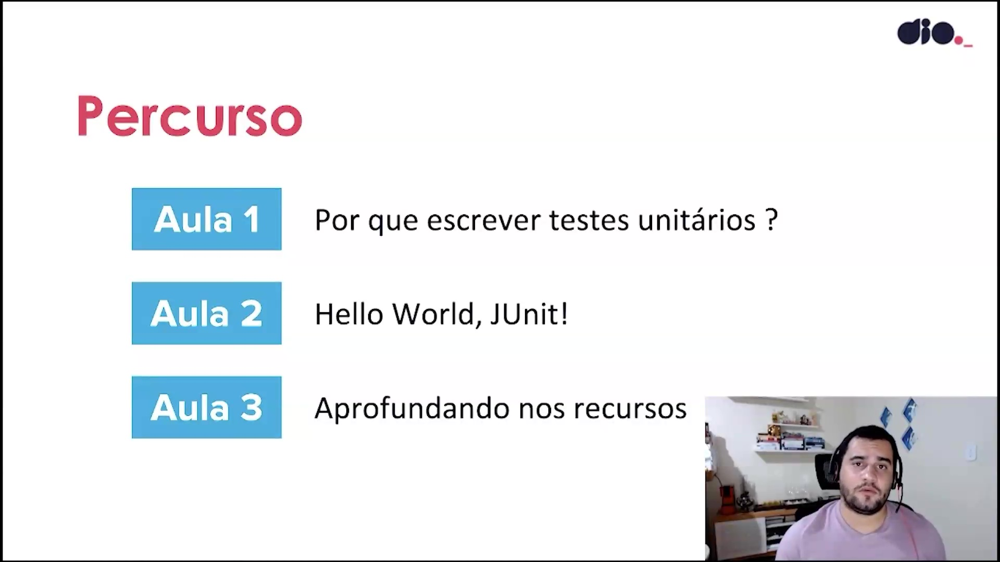
</p>

O percurso do aprendizado está dividido em etapas incrementais:

* **Aula 1**: Focada na teoria e nos motivos para a adoção de testes unitários.
* **Aula 2**: Parte prática inicial com a criação de um "Hello World" utilizando JUnit.
* **Aula 3**: Detalhamento técnico dos recursos, incluindo as principais anotações e funcionalidades da ferramenta para aprimorar os testes.

<p align="center">
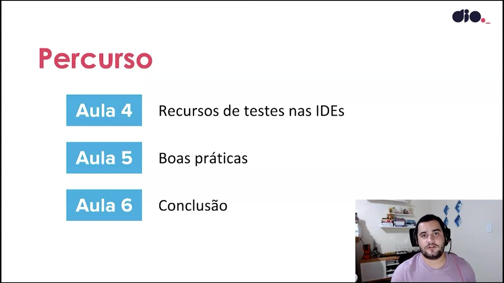
</p>

A fase final do curso aborda a integração e a evolução da prática de testes:

* **Aula 4**: Explora como as principais IDEs do mercado oferecem suporte e recursos para facilitar a execução e gerenciamento dos testes.
* **Aula 5**: Apresentação de boas práticas e premissas para a escrita de testes de alta qualidade.
* **Aula 6**: Conclusão com insights para o desenvolvimento contínuo da habilidade de testagem.      


## Parte 2 - Por que escrever testes unitários?

### 🟩 Vídeo 02 - Por que escrever testes unitários?

<video width="60%" controls>
  <source src="000-Midia_e_Anexos/bootcamp_tqi_fullstack-modulo.06-curso.15-video_02.webm" type="video/webm">
    Seu navegador não suporta vídeo HTML5.
</video>

link do vídeo: https://web.dio.me/track/tqi-fullstack-developer/course/testes-unitarios-com-junit/learning/f1526efd-2e98-4c3d-931e-3e9e889867e8?autoplay=1

Este guia resume a primeira aula do curso de testes unitários, abordando desde a definição fundamental até a importância estratégica de implementar testes no ciclo de vida de desenvolvimento de software.

### Anotações

<p align="center">

</p>

Esta é a aula inaugural do curso voltado para o aprendizado de testes unitários utilizando o framework JUnit. O foco inicial desta sessão é explorar as motivações e a importância de se escrever esses testes dentro do fluxo de desenvolvimento.

<p align="center">
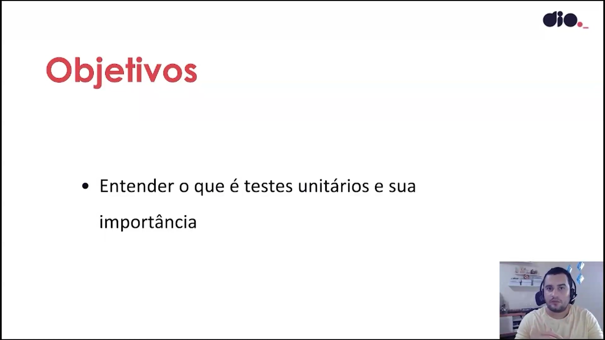
</p>

Os objetivos centrais desta etapa consistem em fornecer uma compreensão clara sobre a definição de testes unitários e demonstrar a relevância fundamental dessa prática para a qualidade e estabilidade do software.

<p align="center">
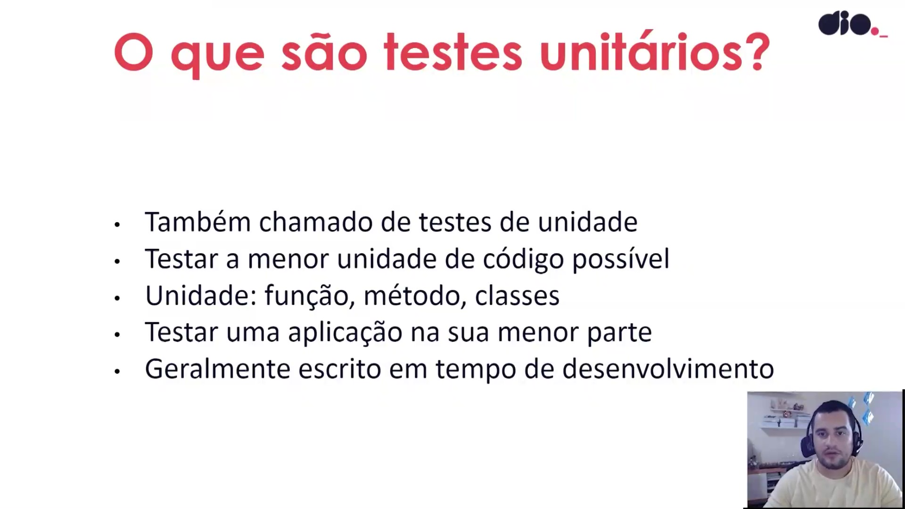
</p>

Testes unitários, também conhecidos como testes de unidade, focam em validar a menor parte funcional de uma aplicação. Isso implica testar isoladamente componentes como funções, métodos ou classes. Tradicionalmente, esses testes são elaborados simultaneamente ao desenvolvimento do código-fonte.

<p align="center">
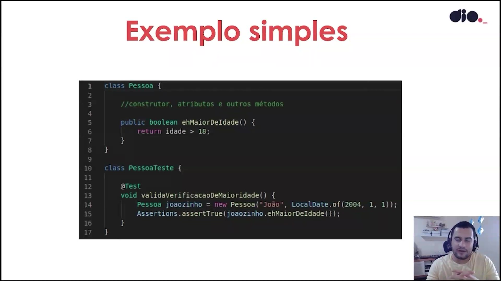
</p>

Abaixo, apresenta-se um exemplo prático de uma regra de negócio simples e seu respectivo teste unitário utilizando JUnit:

```java
class Pessoa {
    //construtor, atributos e outros métodos
    public boolean ehMaiorDeIdade() {
        return idade > 18;
    }
}

class PessoaTeste {
    @Test
    void validaVerificacaoDeMaioridade() {
        Pessoa joaozinho = new Pessoa ("João", LocalDate.of (2004, 1, 1));
        Assertions.assertTrue(joaozinho.ehMaiorDeIdade());
    }
}

```

Neste exemplo, a classe de teste verifica se a lógica do método `ehMaiorDeIdade` retorna o valor esperado ao instanciar um objeto com uma data de nascimento específica.

<p align="center">
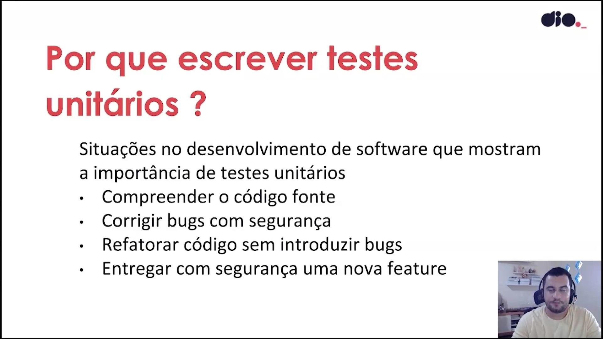
</p>

A importância dos testes unitários se manifesta em diversas situações críticas do cotidiano de um desenvolvedor:

* **Compreensão do código:** Facilitam o entendimento da lógica interna por novos membros da equipe.
* **Correção de bugs:** Permitem ajustar falhas com a segurança de que o comportamento esperado será mantido.
* **Refatoração segura:** Oferecem suporte para melhorar a estrutura do código sem introduzir novos defeitos.
* **Entrega de funcionalidades:** Garantem que novas features cheguem ao usuário final com maior confiabilidade.

<p align="center">
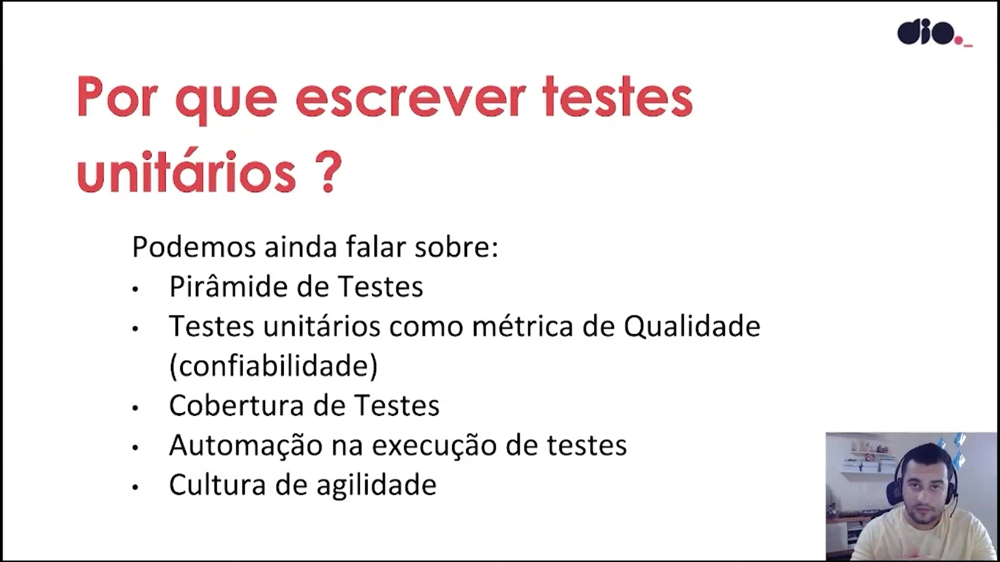
</p>

Além dos benefícios diretos no código, os testes unitários fundamentam conceitos avançados de engenharia de software:

* **Pirâmide de Testes:** Representam a base sólida e volumosa de uma estratégia de testes eficiente.
* **Métricas de Qualidade:** Servem como indicadores de confiabilidade e cobertura do sistema.
* **Automação e Agilidade:** São essenciais para processos de execução automatizada e para a manutenção de uma cultura ágil de desenvolvimento.

<p align="center">
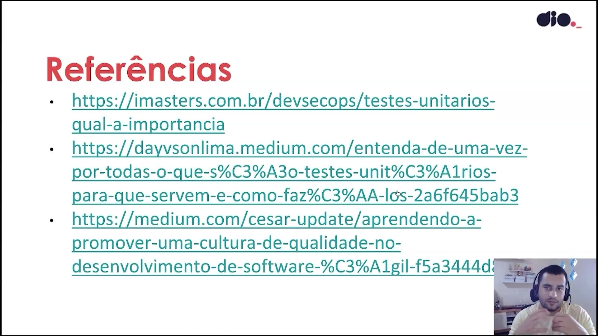
</p>

Para aprofundamento nos temas de cultura de qualidade e práticas de DevSecOps, são sugeridas as seguintes referências externas:

* Artigos sobre a importância dos testes unitários no iMasters.
* Guias práticos sobre definição e implementação de testes no Medium.
* Estudos sobre a promoção de qualidade no desenvolvimento de software ágil.      

#### Referências

- https://imasters.com.br/devsecops/testes-unitarios-qual-a-importancia  
- https://dayvsonlima.medium.com/entenda-de-uma-vez-por-todas-o-que-s%C3%A3o-testes-unit%C3%A1rios-para-que-servem-e-como-faz%C3%AA-los-2a6f645bab3  
- https://medium.com/cesar-update/aprendendo-a-promover-uma-cultura-de-qualidade-no-desenvolvimento-de-software-%C3%A1gil-f5a3444dd


## Parte 3 - Hello world, JUnit!

### 🟩 Vídeo 03 - Hello World no JUNIT

<video width="60%" controls>
  <source src="000-Midia_e_Anexos/bootcamp_tqi_fullstack-modulo.06-curso.15-video_03.webm" type="video/webm">
    Seu navegador não suporta vídeo HTML5.
</video>

link do vídeo: https://web.dio.me/track/tqi-fullstack-developer/course/testes-unitarios-com-junit/learning/311d5f09-9441-4802-8bca-c48e767a74b1?autoplay=1

Esta aula marca o início prático no mundo dos testes unitários com Java, cobrindo desde a base histórica e arquitetural do JUnit até a configuração de projetos reais utilizando Maven e Gradle.

### Anotações

<p align="center">
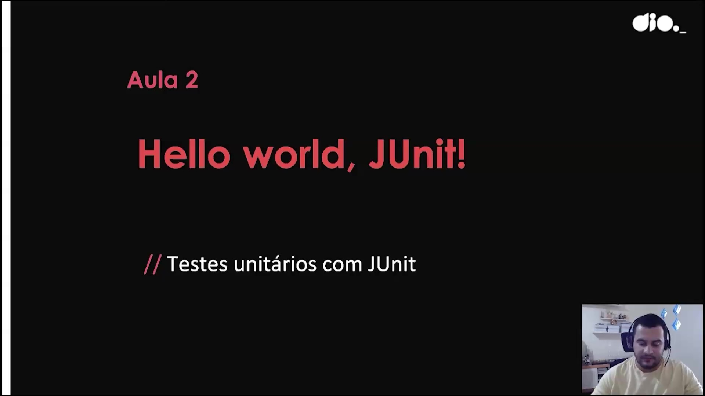
</p>

Nesta aula introdutória de prática, o foco é a criação do primeiro teste unitário utilizando o **JUnit**. O framework é uma ferramenta *open source* fundamental para o ecossistema Java, tendo sido criado por figuras icônicas da engenharia de software: **Erich Gamma** (coautor do livro *Design Patterns* e membro do *Gang of Four*) e **Kent Beck** (pioneiro do *Extreme Programming* e do TDD). A proposta é integrar a prática de testes massivos ao ciclo de desenvolvimento ágil.

<p align="center">
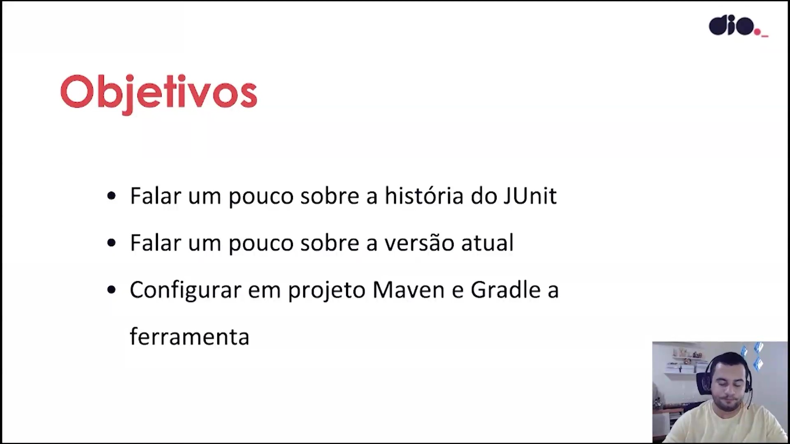
</p>

Embora o JUnit 4 ainda seja encontrado em muitos projetos legados, o mercado converge para o **JUnit 5**, que é o foco deste estudo. A arquitetura da versão 5 é modular e se divide em três pilares principais:

* **JUnit Platform**: O motor responsável por lançar e executar os testes na JVM.
* **JUnit Jupiter**: Contém o novo modelo de programação e extensão para a escrita de testes no JUnit 5 (inclui as anotações e classes principais).
* **JUnit Vintage**: Um motor de teste que permite a execução de testes escritos nas versões 3 e 4, garantindo a retrocompatibilidade.

<p align="center">
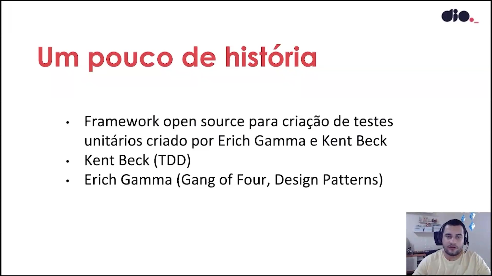
</p>

Para configurar o JUnit em um projeto, o primeiro passo é localizar a dependência correta em repositórios públicos, como o **Maven Repository**. A dependência recomendada para iniciar projetos modernos é o `junit-jupiter-engine`, que traz as implementações necessárias do motor Jupiter para rodar os testes.

<p align="center">
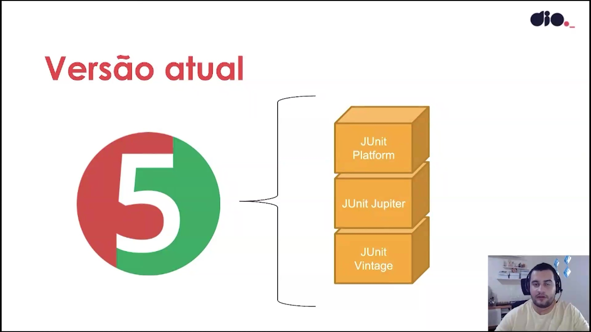
</p>

A imagem reforça a distinção entre os módulos. Enquanto o **Jupiter** é onde escrevemos nosso código de teste moderno, o **Platform** atua como a infraestrutura de execução e o **Vintage** serve como uma "ponte" para que códigos antigos não quebrem ao serem migrados para o ambiente do JUnit 5.

<p align="center">

</p>

No gerenciador de dependências **Gradle**, a configuração é feita no arquivo `build.gradle`. Deve-se adicionar a biblioteca do motor Jupiter dentro do bloco de dependências para que o projeto reconheça as classes do JUnit.

```groovy
dependencies {
    testImplementation 'org.junit.jupiter:junit-jupiter-engine:5.8.2'
}

```

<p align="center">
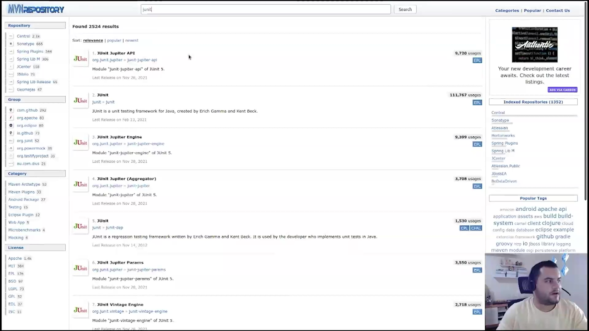
</p>

Um detalhe crucial na configuração do Gradle é informar explicitamente que o projeto deve utilizar a plataforma JUnit para a execução das tarefas de teste. Sem a instrução `useJUnitPlatform()`, o Gradle pode não identificar ou executar os testes corretamente.

```groovy
test {
    useJUnitPlatform()
}

```

<p align="center">
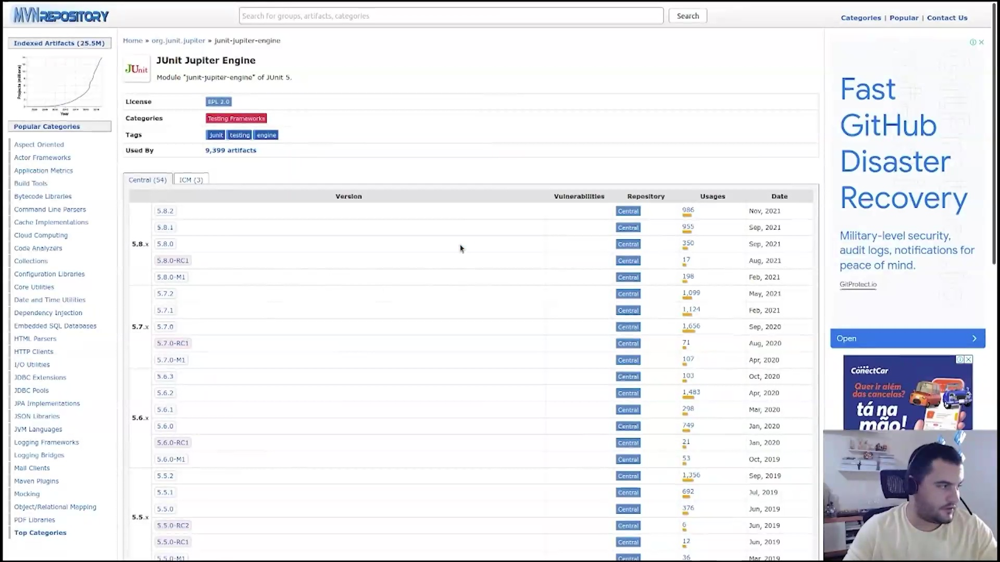
</p>

Para exemplificar o uso, temos uma classe simples chamada `Pessoa`. Ela possui atributos básicos como nome e data de nascimento, além de um método que calcula a idade baseando-se na data atual.

```java
public class Pessoa {
    private String nome;
    private LocalDateTime nascimento;

    public Pessoa(String nome, LocalDateTime nascimento) {
        this.nome = nome;
        this.nascimento = nascimento;
    }

    public int getIdade() {
        return (int) ChronoUnit.YEARS.between(nascimento, LocalDateTime.now());
    }
}

```

<p align="center">

</p>

Ao criar a classe de teste `PessoaTest`, utilizamos a anotação `@Test` para marcar o método que validará o comportamento. Neste cenário, instanciamos uma pessoa chamada "Júlia" com data de nascimento em 01/01/2020.

```java
class PessoaTest {

    @Test
    void validarCalculoDeIdade() {
        Pessoa pessoa = new Pessoa("Júlia", LocalDateTime.of(2020, 1, 1, 15, 0, 0));
    }
}

```

<p align="center">
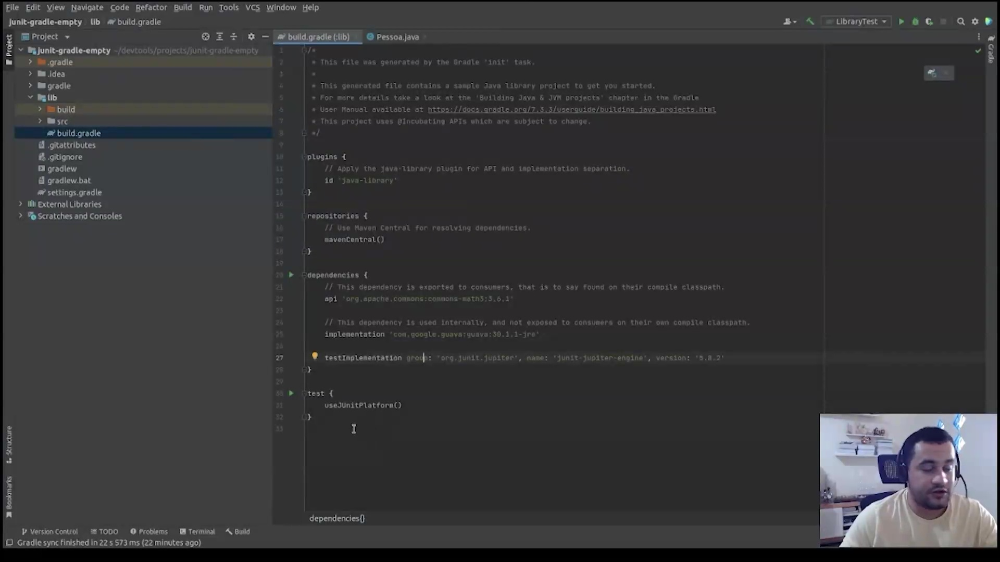
</p>

O coração do teste é a asserção. Utilizamos a classe `Assertions.assertEquals` para comparar o valor esperado (neste caso, 2 anos) com o resultado retornado pelo método `getIdade()`.

```java
@Test
void validarCalculoDeIdade() {
    Pessoa pessoa = new Pessoa("Júlia", LocalDateTime.of(2020, 1, 1, 15, 0, 0));
    Assertions.assertEquals(2, pessoa.getIdade());
}

```

<p align="center">
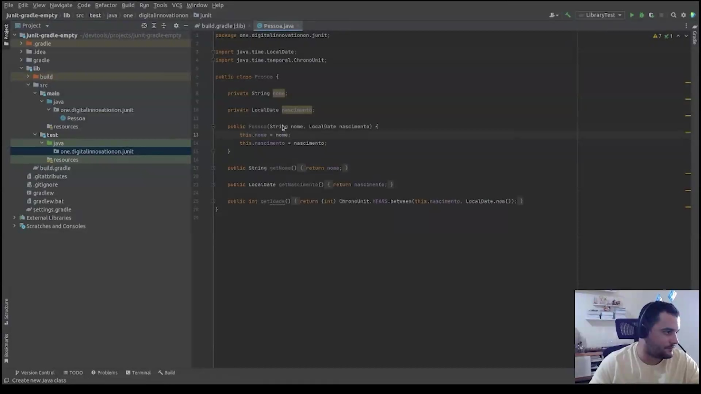
</p>

Após a execução no ambiente IntelliJ utilizando Gradle, o painel de testes indica sucesso. O ícone verde ao lado do nome do método `validarCalculoDeIdade` confirma que o valor calculado pelo sistema condiz com o valor esperado pela asserção.

<p align="center">
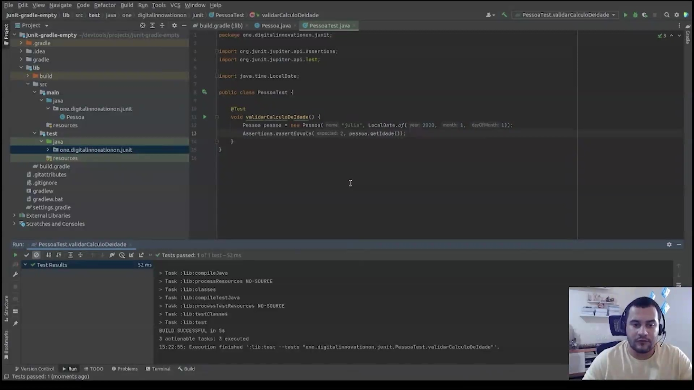
</p>

Para projetos que utilizam o **Maven**, a configuração ocorre no arquivo `pom.xml`. Adicionamos o artefato `junit-jupiter-engine` dentro da seção `<dependencies>`. O Maven gerencia o download automático das bibliotecas necessárias.

```xml
<dependency>
    <groupId>org.junit.jupiter</groupId>
    <artifactId>junit-jupiter-engine</artifactId>
    <version>5.8.2</version>
    <scope>test</scope>
</dependency>

```

<p align="center">

</p>

Mesmo em um projeto Maven, a estrutura do teste permanece idêntica. A IDE integra-se ao gerenciador de dependências para compilar e rodar os testes da mesma forma, garantindo que a lógica de negócio (como a classe `Conta` ou `Pessoa`) esteja protegida por verificações automatizadas.

<p align="center">

</p>

Durante o processo de execução no Maven, é possível observar no console o download das dependências transitivas e a inicialização do motor de testes. O Maven coordena o ciclo de vida do projeto, garantindo que os testes sejam executados antes de qualquer empacotamento.

<p align="center">
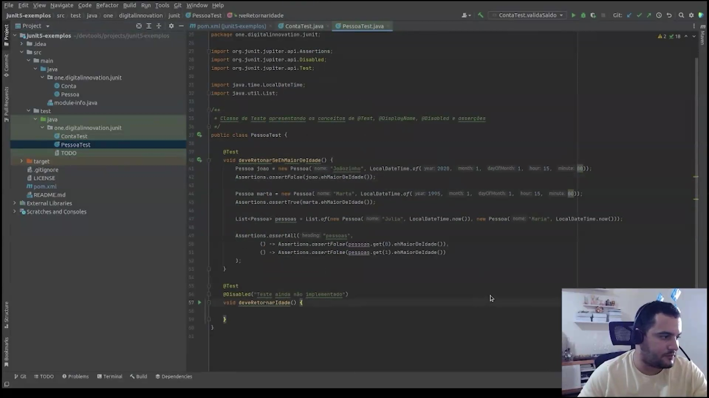
</p>

A imagem demonstra o resultado final de uma bateria de testes sendo concluída. A interface da IDE agrupa os testes por classe e método, facilitando a identificação visual de qualquer falha.

<p align="center">
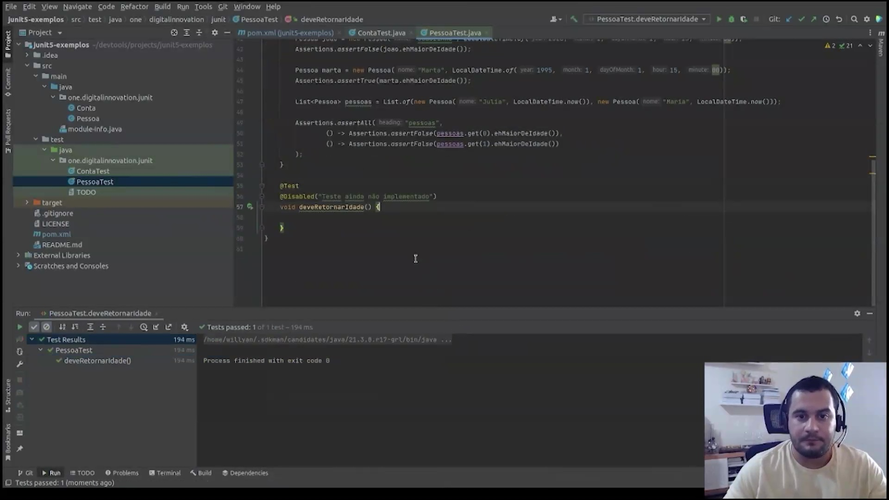
</p>

A estrutura de diretórios segue o padrão convencional da indústria: classes de produção ficam em `src/main/java`, enquanto as classes de teste, como `PessoaTest`, residem obrigatoriamente em `src/test/java`. Isso separa o código que vai para o cliente final do código utilizado apenas durante o desenvolvimento e garantia de qualidade.

<p align="center">
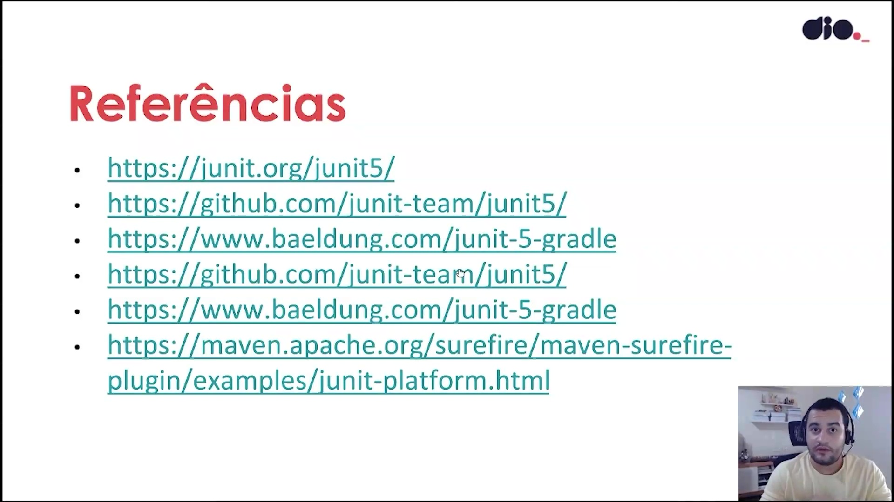
</p>

Para aprofundamento, os recursos oficiais são fundamentais. O repositório oficial no GitHub e o guia do usuário do JUnit 5 oferecem detalhes técnicos avançados, exemplos de extensões e melhores práticas para a escrita de testes robustos.

#### Referências

- https://junit.org/junit5/
- https://github.com/junit-team/junit5/
- https://www.baeldung.com/junit-5-gradle
- https://github.com/junit-team/junit5/
- https://www.baeldung.com/junit-5-gradle
- https://maven.apache.org/surefire/maven-surefire-plugin/examples/junit-platform.html


## Parte 4 - Aprofundando nos recursos

### 🟩 Vídeo 04 - O básico para testar

<video width="60%" controls>
  <source src="000-Midia_e_Anexos/bootcamp_tqi_fullstack-modulo.06-curso.15-video_04.webm" type="video/webm">
    Seu navegador não suporta vídeo HTML5.
</video>

link do vídeo: https://web.dio.me/track/tqi-fullstack-developer/course/testes-unitarios-com-junit/learning/38ef08ba-4873-48a8-8ed6-16db79698496?autoplay=1

Esta aula foca no aprofundamento dos recursos do JUnit, demonstrando na prática como estruturar testes para uma aplicação Java Maven e como utilizar as principais asserções para validar o comportamento do código.

### Anotações

<p align="center">

</p>

Nesta etapa inicial da aula, o foco é estabelecer os objetivos principais, que consistem em explorar detalhadamente os recursos fornecidos pelo framework JUnit. A proposta é capacitar o desenvolvedor a utilizar essas ferramentas de forma eficiente no cotidiano profissional para garantir a qualidade do código.

<p align="center">
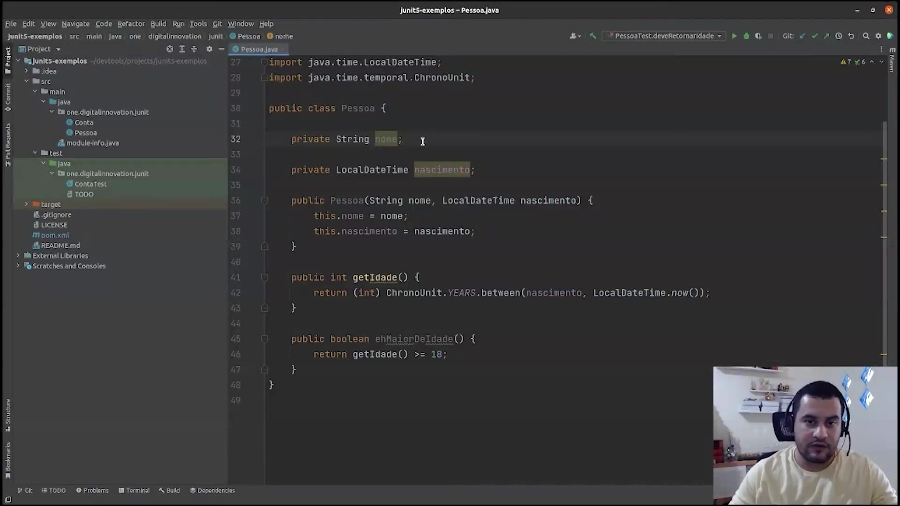
</p>

Para ilustrar os testes na prática, utiliza-se um projeto Java estruturado com Maven, contendo a classe de domínio `Pessoa`. Esta classe possui atributos para nome e data de nascimento, além de métodos que calculam a idade baseada na data atual e verificam a maioridade do indivíduo.

```java
public class Pessoa {
    private String nome;
    private LocalDateTime nascimento;

    public Pessoa(String nome, LocalDateTime nascimento) {
        this.nome = nome;
        this.nascimento = nascimento;
    }

    public int getIdade() {
        return (int) ChronoUnit.YEARS.between(nascimento, LocalDateTime.now());
    }

    public boolean ehMaiorDeIdade() {
        return getIdade() >= 18;
    }
}
```

<p align="center">
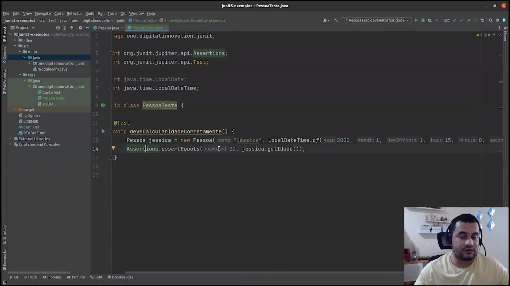
</p>

A estrutura de testes exige uma separação rigorosa de pastas: o código de produção fica em `src/main/java`, enquanto os testes devem residir em `src/test/java`. O exemplo abaixo demonstra o uso da anotação `@Test` e do método `Assertions.assertEquals` para validar se o cálculo da idade da classe `Pessoa` está retornando o valor esperado.

```java
import org.junit.jupiter.api.Assertions;
import org.junit.jupiter.api.Test;
import java.time.LocalDateTime;

public class PessoaTeste {

    @Test
    void deveCalcularIdadeCorretamente() {
        Pessoa jessica = new Pessoa("Jéssica", LocalDateTime.of(2000, 1, 1, 15, 0));
        Assertions.assertEquals(22, jessica.getIdade());
    }
}
```

<p align="center">
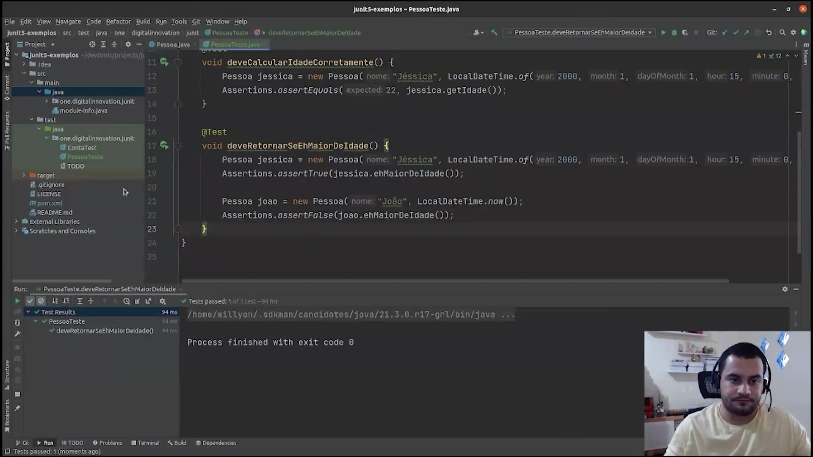
</p>

Além de validar igualdades, o JUnit permite testar condições booleanas através de métodos como `assertTrue` e `assertFalse`. É possível incluir múltiplas validações dentro de um mesmo método de teste para cobrir diferentes cenários de um comportamento, como testar tanto um caso positivo quanto um negativo de maioridade.

```java
@Test
void deveRetornarSeEhMaiorDeIdade() {
    Pessoa jessica = new Pessoa("Jéssica", LocalDateTime.of(2000, 1, 1, 15, 0));
    Assertions.assertTrue(jessica.ehMaiorDeIdade());

    Pessoa joao = new Pessoa("João", LocalDateTime.now());
    Assertions.assertFalse(joao.ehMaiorDeIdade());
}
```

<p align="center">
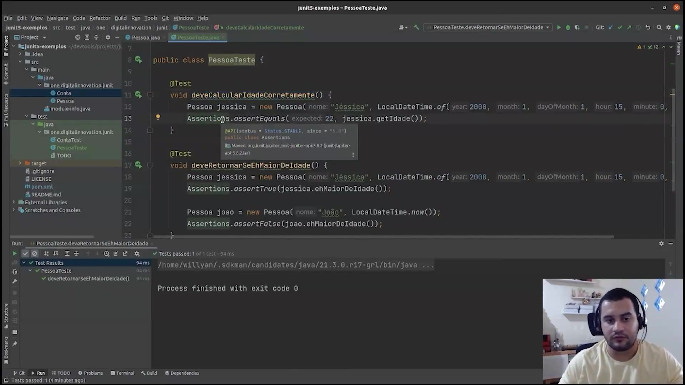
</p>

A execução dos testes é monitorada diretamente pela IDE, que fornece um feedback visual sobre o sucesso ou falha das operações. Neste caso, o JUnit 5 gerenciou a execução do teste `deveRetornarSeEhMaiorDeIdade`, confirmando que as condições de maioridade foram validadas corretamente conforme o planejado.

<p align="center">

</p>

A estrutura básica de um teste unitário bem definido compreende o uso da anotação `@Test`, a construção de um cenário (preparação dos dados) e a execução das asserções. Por padrão, os métodos de teste não devem retornar valores, utilizando sempre o tipo `void`.

```java
class PessoaTeste {
    @Test //--> Anotação é primordial para testar
    void validaVerificacaoDeMaioridade() {
        // cria um cenário
        Pessoa joaozinho = new Pessoa("João", LocalDate.of(2004, 1, 1)); 
        // Executa as validações
        Assertions.assertTrue(joaozinho.ehMaiorDeIdade()); 
    }
}
```

<p align="center">
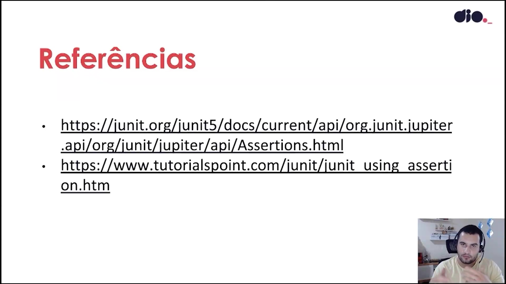
</p>

Para aprofundar os conhecimentos em testes unitários, recomenda-se a consulta à documentação oficial da classe `Assertions` no site do JUnit. Recursos adicionais, como tutoriais práticos sobre o uso de asserções, são fundamentais para entender as diversas possibilidades de validação de dados.      

#### Referências

- https://junit.org/junit5/docs/current/api/org.junit.jupiter.api/org/junit/jupiter/api/Assertions.html  
- https://www.tutorialspoint.com/junit/junit_using_assertion.htm


### 🟩 Vídeo 05 - Mais algumas asserções

<video width="60%" controls>
  <source src="000-Midia_e_Anexos/bootcamp_tqi_fullstack-modulo.06-curso.15-video_05.webm" type="video/webm">
    Seu navegador não suporta vídeo HTML5.
</video>

link do vídeo: https://web.dio.me/track/tqi-fullstack-developer/course/testes-unitarios-com-junit/learning/67185e7a-6484-4e73-9caf-2cb6690b1b3b?autoplay=1

Este guia explora o uso da classe Assertions do JUnit, demonstrando como validar diferentes cenários de dados, desde arrays complexos até a nulidade de objetos, além de dicas para manter o código de teste limpo e eficiente.

### Anotações

<p align="center">
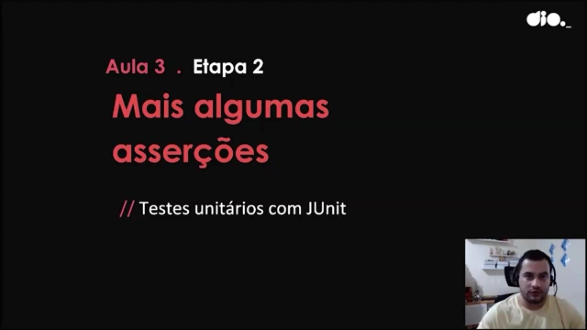
</p>

Nesta etapa, daremos continuidade ao estudo de testes unitários com JUnit, focando na exploração prática da classe **Assertions**. O objetivo é analisar cenários reais, como a comparação de arrays e a validação de referências nulas, para compreender como a API nos ajuda a assegurar o comportamento esperado do código.

<p align="center">
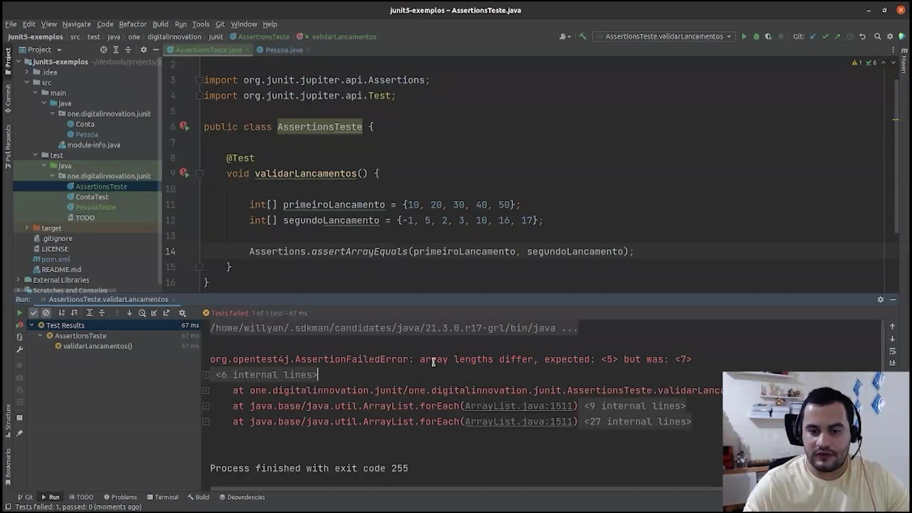
</p>

Um dos recursos da classe `Assertions` é o método `assertArrayEquals`, utilizado para comparar se dois arrays são idênticos. É importante notar que a ordem dos parâmetros importa: primeiro passamos o valor esperado e depois o valor atual. No exemplo abaixo, o teste resultará em erro caso os arrays possuam tamanhos diferentes ou conteúdos distintos em seus respectivos índices.

```java
@Test
void validarLancamentos() {
    int[] primeiroLancamento = {10, 20, 30, 40, 50};
    int[] segundoLancamento = {-1, 5, 2, 3, 10, 16, 17};

    Assertions.assertArrayEquals(primeiroLancamento, segundoLancamento);
}
```

<p align="center">
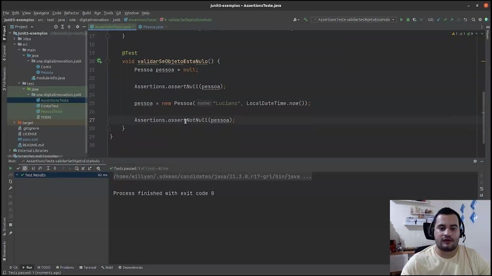
</p>

Para lidar com referências de objetos, o JUnit oferece os métodos `assertNull` e `assertNotNull`. Eles são essenciais para garantir que um objeto foi (ou não) instanciado corretamente após a execução de uma lógica de negócio. No exemplo, validamos inicialmente que a variável `pessoa` é nula e, após a instanciação, garantimos que ela contém uma referência válida.

```java
@Test
void validarSeObjetoEstaNulo() {
    Pessoa pessoa = null;
    Assertions.assertNull(pessoa);

    pessoa = new Pessoa("Luciano", LocalDateTime.now());
    Assertions.assertNotNull(pessoa);
}
```

<p align="center">
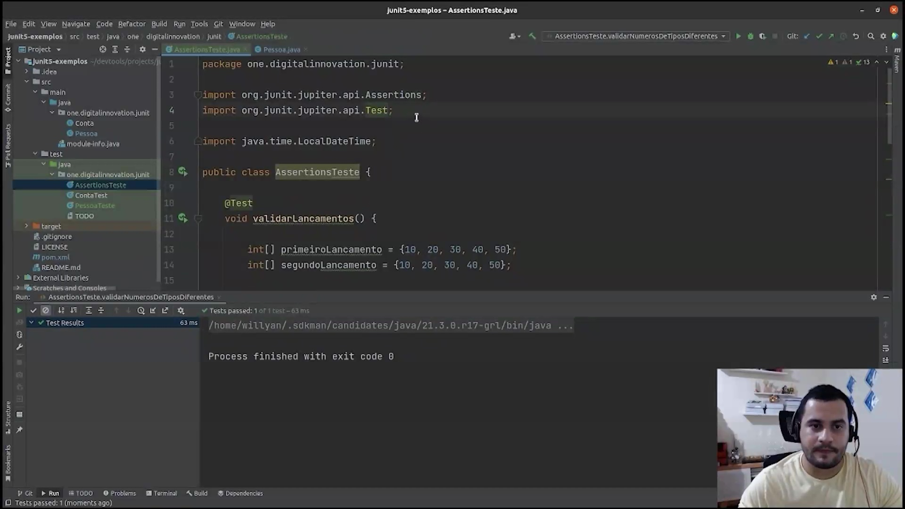
</p>

Abaixo, vemos o ajuste dos arrays para que o teste de lançamentos seja bem-sucedido, igualando seus conteúdos. Além disso, a API do JUnit é versátil ao lidar com diferentes tipos numéricos através de sobrecargas do método `assertEquals`. Isso permite comparar valores de tipos como `int`, `double`, `float` e outros, garantindo que a precisão e a igualdade sejam mantidas conforme a documentação da IDE sugere.

```java
@Test
void validarLancamentos() {
    int[] primeiroLancamento = {10, 20, 30, 40, 50};
    int[] segundoLancamento = {10, 20, 30, 40, 50};

    Assertions.assertArrayEquals(primeiroLancamento, segundoLancamento);
}
```

<p align="center">
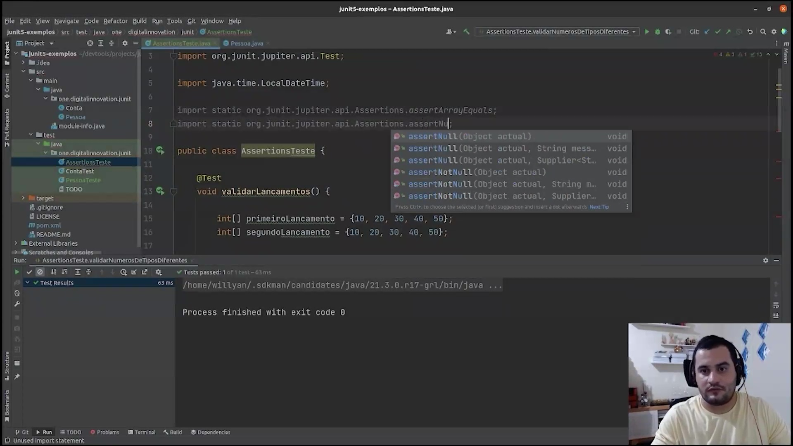
</p>

Uma prática comum no desenvolvimento de testes para tornar o código mais limpo e legível é a utilização de **importações estáticas**. Ao importar os métodos da classe `Assertions` de forma estática, eliminamos a necessidade de repetir o prefixo `Assertions.` antes de cada chamada, deixando as asserções mais diretas.

```java
import static org.junit.jupiter.api.Assertions.assertArrayEquals;
import static org.junit.jupiter.api.Assertions.assertNull;
import static org.junit.jupiter.api.Assertions.assertNotNull;
// Ou utilizando o curinga para todos os métodos
import static org.junit.jupiter.api.Assertions.*;
```

<p align="center">
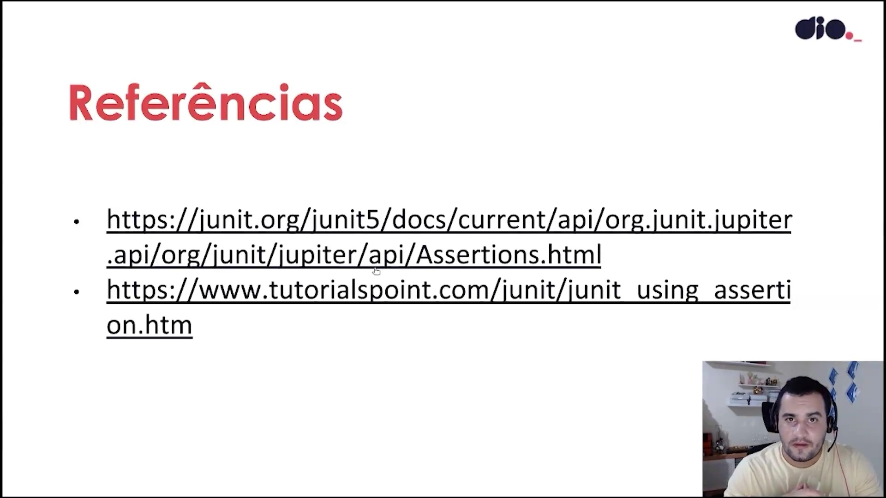
</p>

Para aprofundar os conhecimentos sobre as asserções disponíveis no JUnit 5, recomenda-se a consulta à documentação oficial da API e a guias de referência rápida. Compreender a variedade de métodos disponíveis na classe `Assertions` é fundamental para realizar validações precisas e garantir a integridade dos testes unitários.      

#### Referências

- https://junit.org/junit5/docs/current/api/org.junit.jupiter.api/org/junit/jupiter/api/Assertions.html  
- https://www.tutorialspoint.com/junit/junit_using_assertion.htm


### 🟩 Vídeo 06 - After e Before

<video width="60%" controls>
  <source src="000-Midia_e_Anexos/bootcamp_tqi_fullstack-modulo.06-curso.15-video_06.webm" type="video/webm">
    Seu navegador não suporta vídeo HTML5.
</video>

link do vídeo: https://web.dio.me/track/tqi-fullstack-developer/course/testes-unitarios-com-junit/learning/dc153cc9-20a0-4907-8cc4-10b6c8f4c4b9?autoplay=1

Este guia resume a terceira etapa da aula sobre testes unitários com JUnit, focando em como gerenciar o estado dos testes e recursos do sistema (como conexões de banco de dados) utilizando as anotações de configuração e limpeza.

### Anotações

<p align="center">
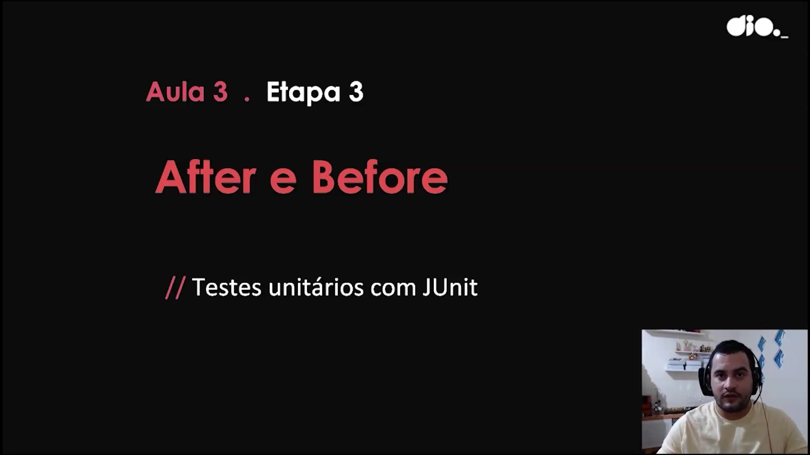
</p>

Nesta terceira etapa da aula de testes unitários com JUnit, o foco é o aprofundamento nos recursos de **After e Before**. Estas anotações são fundamentais para gerenciar o ciclo de vida dos testes, permitindo a configuração e a limpeza de ambientes de forma automatizada e organizada.

<p align="center">
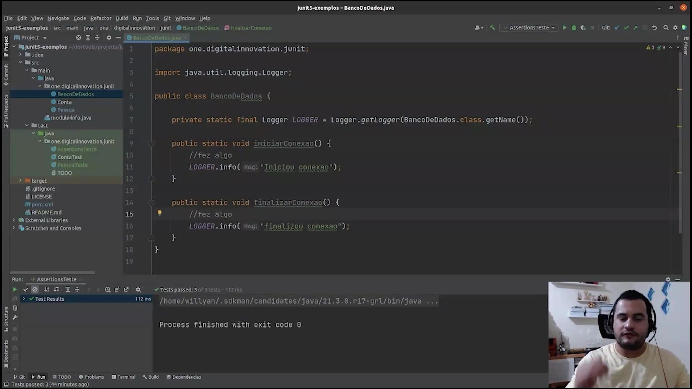
</p>

Para exemplificar o uso dessas ferramentas, é criada uma classe hipotética chamada `BancoDeDados`. Esta classe simula um gerenciador de conexões, contendo métodos estáticos para iniciar e finalizar a comunicação com o banco de dados. Para rastrear essas operações, utiliza-se a classe `Logger`, que registra no console o momento em que a conexão é estabelecida ou encerrada.

```java
package one.digitalinnovation.junit;

import java.util.logging.Logger;

public class BancoDeDados {

    private static final Logger LOGGER = Logger.getLogger(BancoDeDados.class.getName());

    public static void iniciarConexao() {
        //fez algo
        LOGGER.info("Iniciou conexao");
    }

    public static void finalizarConexao() {
        //fez algo
        LOGGER.info("finalizou conexao");
    }
}
```

<p align="center">
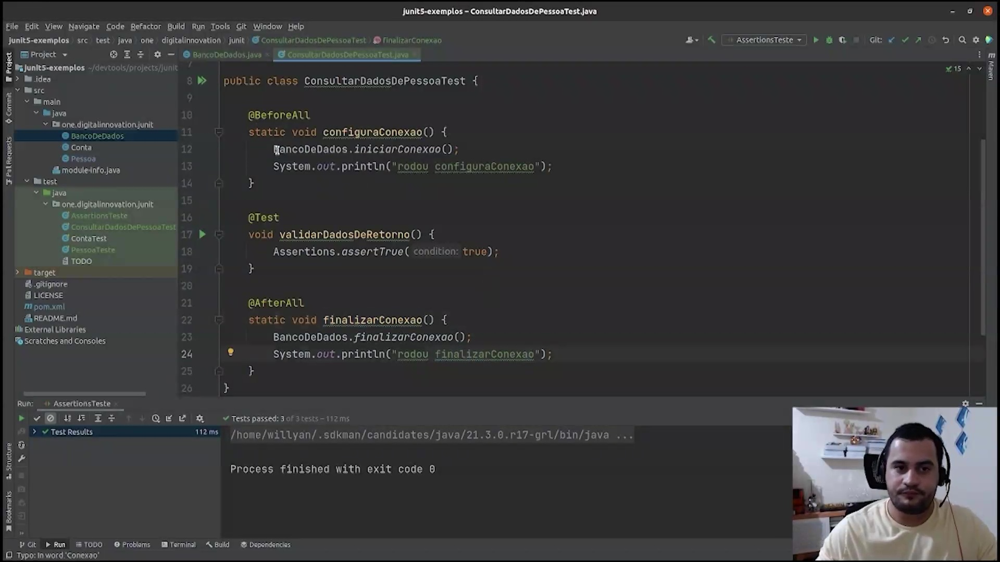
</p>

```java
package one.digitalinnovation.junit;

import org.junit.jupiter.api.*;

public class ConsultarDadosDePessoaTest {

    @BeforeAll
    static void configuraConexao() {
        BancoDeDados.iniciarConexao();
        System.out.println("rodou configuraConexao");
    }

    @Test
    void validarDadosDeRetorno() {
        Assertions.assertTrue(true);
    }

    @AfterAll
    static void finalizarConexao() {
        BancoDeDados.finalizarConexao();
        System.out.println("rodou finalizarConexao");
    }
}
```

### 🟩 Vídeo 07 - Assumptions e Testes condicionais

<video width="60%" controls>
  <source src="000-Midia_e_Anexos/bootcamp_tqi_fullstack-modulo.06-curso.15-video_07.webm" type="video/webm">
    Seu navegador não suporta vídeo HTML5.
</video>

link do vídeo: https://web.dio.me/track/tqi-fullstack-developer/course/testes-unitarios-com-junit/learning/212ae840-ea88-4ab8-a6ee-ca1ed26c1342?autoplay=1

Este guia aborda como controlar a execução de testes unitários baseando-se em condições específicas do ambiente, como variáveis de sistema, sistema operacional e versão do Java, utilizando os recursos de Assumptions (Suposições) e Testes Condicionais do JUnit 5.

### Anotações

<p align="center">
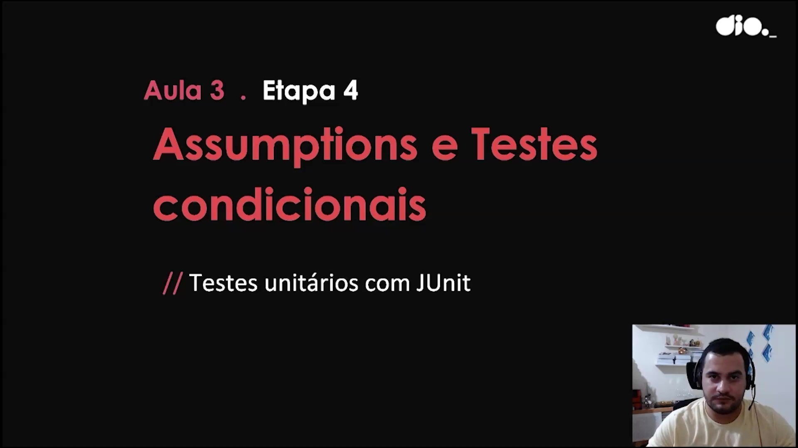
</p>

Nesta etapa da aula, introduzimos os conceitos de **Assumptions** (suposições) e **testes condicionais** no JUnit. O termo *assumption* refere-se a uma hipótese ou presunção que deve ser satisfeita para que um teste seja executado. Diferente das asserções comuns, se uma condição presumida não for atendida, o teste não falha, mas é interrompido ou ignorado, permitindo que o código valide se o ambiente ou contexto é adequado para aquela execução específica.

<p align="center">
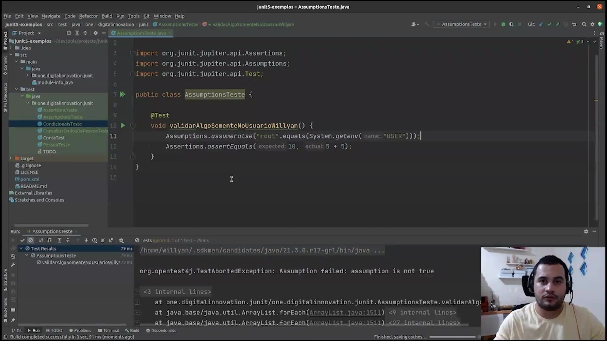
</p>

Para implementar essas validações programaticamente, utilizamos a classe `Assumptions`. No exemplo prático, o método `assumeFalse` é utilizado para verificar se o usuário logado no sistema operacional não é o "root". Caso a condição seja verdadeira (ou seja, o usuário logado seja "root"), o restante do teste, incluindo a `Assertions.assertEquals`, não será processado.

```java
@Test
void validarAlgoSomenteNoUsuarioWillyan() {
    Assumptions.assumeFalse("root".equals(System.getenv("USER")));
    Assertions.assertEquals(10, 5 + 5);
}
```

<p align="center">
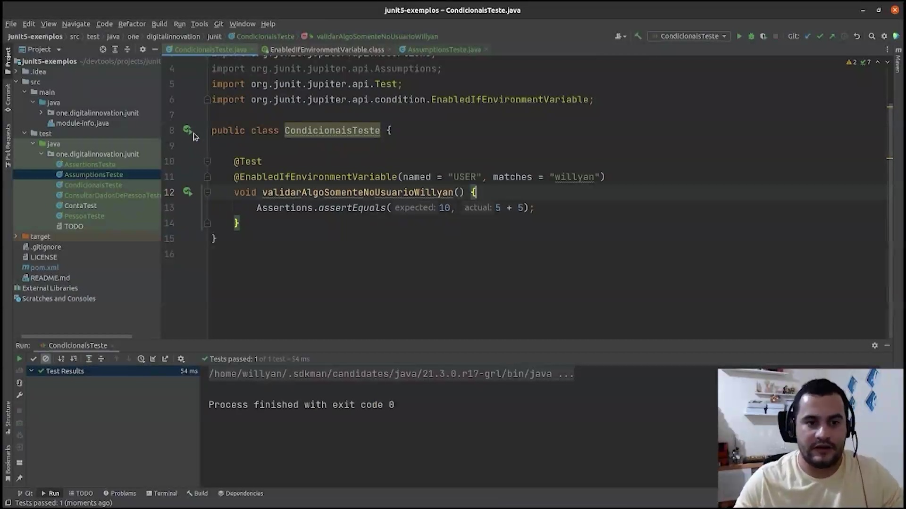
</p>

O JUnit 5 oferece uma forma mais declarativa de lidar com condições através de anotações. A anotação `@EnabledIfEnvironmentVariable` permite especificar que um teste só deve ser habilitado se uma variável de ambiente específica (neste caso, `USER`) corresponder a um valor determinado (`willyan`). Isso elimina a necessidade de lógica condicional manual dentro do corpo do método do teste.

```java
@Test
@EnabledIfEnvironmentVariable(named = "USER", matches = "willyan")
void validarAlgoSomenteNoUsuarioWillyan() {
    Assertions.assertEquals(10, 5 + 5);
}
```

<p align="center">
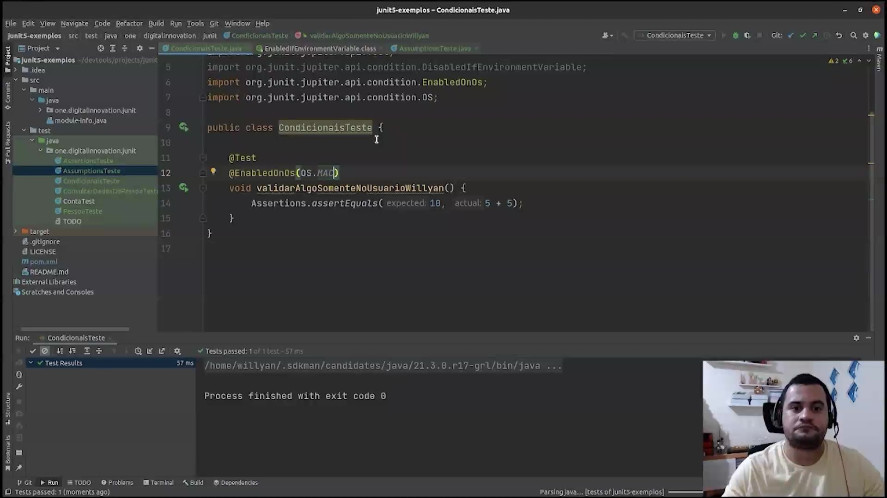
</p>

Além de variáveis de ambiente, é possível condicionar a execução baseando-se no **Sistema Operacional (OS)**. Através da anotação `@EnabledOnOs`, podemos restringir o teste para rodar apenas em plataformas específicas, como o MacOS. Se o teste for executado em um ambiente Linux, como demonstrado no console da imagem, o JUnit identifica a incompatibilidade e pula a execução do teste.

```java
@Test
@EnabledOnOs(OS.MAC)
void validarAlgoSomenteNoUsuarioWillyan() {
    Assertions.assertEquals(10, 5 + 5);
}
```

<p align="center">
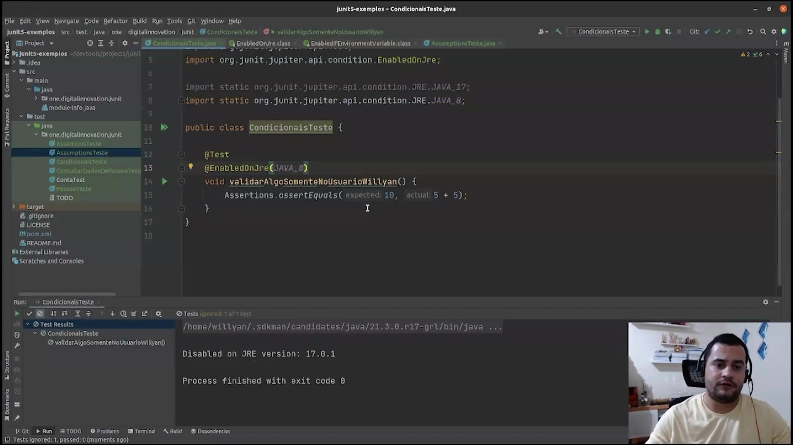
</p>

Outra funcionalidade poderosa é o filtro por versão do **JRE (Java Runtime Environment)**. Utilizando `@EnabledOnJre`, o desenvolvedor pode garantir que o teste execute apenas em versões específicas do Java (como o Java 8 ou Java 17). No exemplo visual, o teste foi ignorado porque o ambiente de execução atual estava utilizando o JRE 17.0.1, enquanto o teste estava configurado para habilitar-se apenas no `JAVA_8`.

```java
@Test
@EnabledOnJre(JAVA_8)
void validarAlgoSomenteNoUsuarioWillyan() {
    Assertions.assertEquals(10, 5 + 5);
}
```

<p align="center">
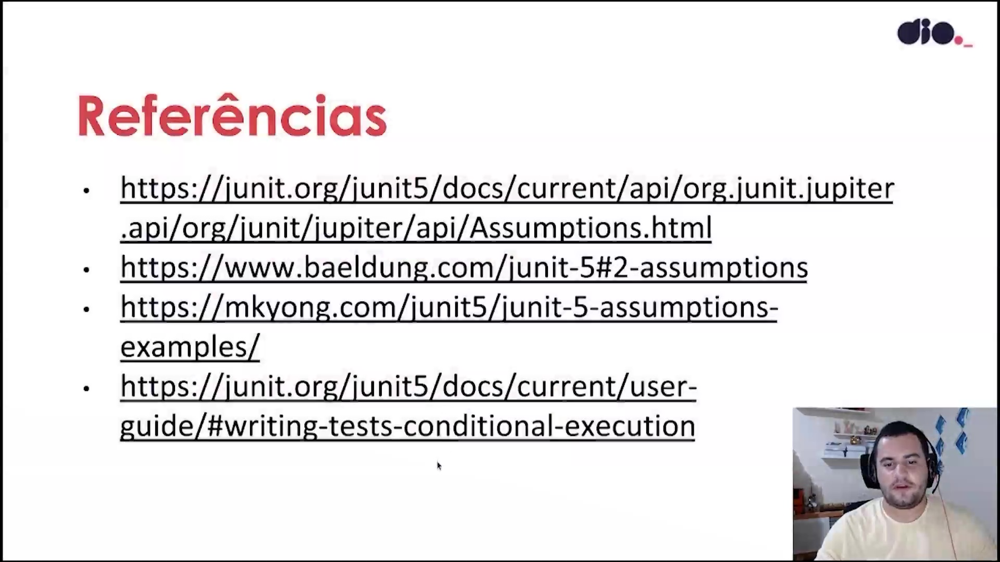
</p>

Para aprofundamento nos temas de assumptions e execuções condicionais, as referências oficiais do JUnit 5 e guias da comunidade como Baeldung e Mkyong são recursos fundamentais. Estes materiais detalham casos mais complexos, como o uso de intervalos de versões de JRE e combinações de múltiplas condições de execução.

#### Referências

- https://junit.org/junit5/docs/current/api/org.junit.jupiter.api/org/junit/jupiter/api/Assumptions.html  
- https://www.baeldung.com/junit-5#2-assumptions  
- https://mkyong.com/junit5/junit-5-assumptions-examples/  
- https://junit.org/junit5/docs/current/user-guide/#writing-tests-conditional-execution

### 🟩 Vídeo 08 - Testando exceptions

<video width="60%" controls>
  <source src="000-Midia_e_Anexos/bootcamp_tqi_fullstack-modulo.06-curso.15-video_08.webm" type="video/webm">
    Seu navegador não suporta vídeo HTML5.
</video>

link do vídeo: https://web.dio.me/track/tqi-fullstack-developer/course/testes-unitarios-com-junit/learning/da5e03c2-caef-446e-a73c-ed274e47e6fd?autoplay=1

Este documento resume a quinta etapa da terceira aula do curso de Testes Unitários, focada em como validar comportamentos inesperados ou erros de lógica de negócio através do tratamento de exceções.

### Anotações

#### Testando Exceções com JUnit 5

<p align="center">
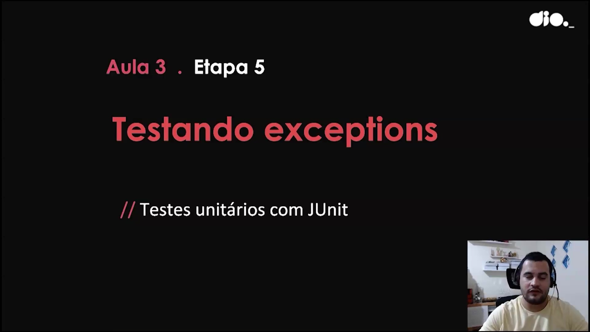
</p>

Nesta etapa, o foco é o aprofundamento nos testes de cenários excepcionais. O objetivo é validar o comportamento do sistema quando uma operação não segue o fluxo feliz e resulta no lançamento de uma exceção. Para exemplificar essa necessidade, considera-se uma operação de transferência bancária onde certas condições — como o valor da transferência — devem ser validadas obrigatoriamente antes da execução da lógica de negócio.

#### Validação de Cenários de Erro com `assertThrows`

<p align="center">
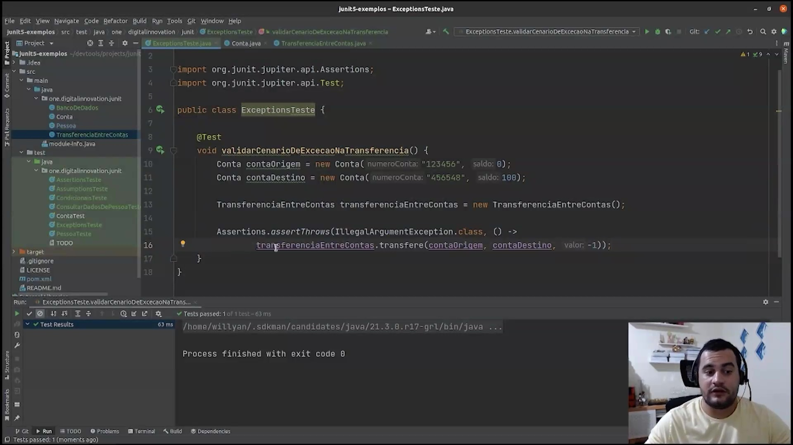
</p>

Para testar se uma exceção é lançada corretamente, utiliza-se o método `Assertions.assertThrows`. No exemplo prático, é criada uma classe de teste `ExceptionsTeste` para validar a lógica da classe `TransferenciaEntreContas`. O teste verifica se, ao tentar transferir um valor inválido (menor ou igual a zero), o sistema lança uma `IllegalArgumentException`.

```java
@Test
void validarCenarioDeExcecaoNaTransferencia() {
    Conta contaOrigem = new Conta("123456", 0);
    Conta contaDestino = new Conta("456548", 100);

    TransferenciaEntreContas transferenciaEntreContas = new TransferenciaEntreContas();

    Assertions.assertThrows(IllegalArgumentException.class, () ->
            transferenciaEntreContas.transfere(contaOrigem, contaDestino, -1));
}
```

#### Garantindo a Ausência de Exceções com `assertDoesNotThrow`

<p align="center">
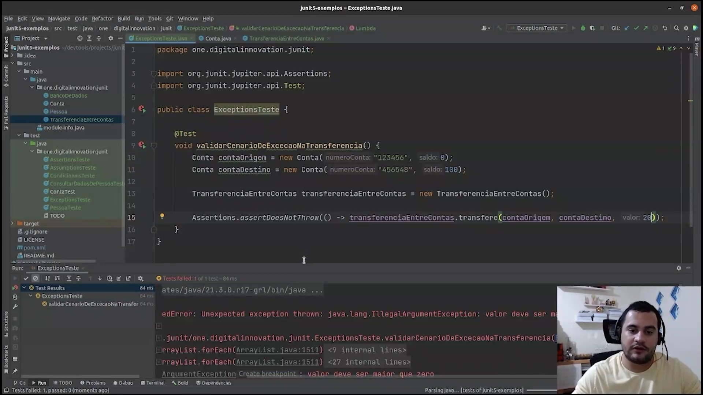
</p>

Uma variação importante é o método `Assertions.assertDoesNotThrow`, utilizado para garantir que um bloco de código seja executado sem lançar nenhuma exceção. No exemplo visualizado, ao alterar o valor da transferência para um número positivo (como 20), o teste espera que a execução ocorra com sucesso. Caso uma exceção seja lançada inesperadamente nesse cenário, o JUnit falhará o teste, indicando que o comportamento observado divergiu do esperado.

```java
@Test
void validarCenarioDeExcecaoNaTransferencia() {
    Conta contaOrigem = new Conta("123456", 0);
    Conta contaDestino = new Conta("456548", 100);

    TransferenciaEntreContas transferenciaEntreContas = new TransferenciaEntreContas();

    Assertions.assertDoesNotThrow(() -> 
            transferenciaEntreContas.transfere(contaOrigem, contaDestino, 20));
}
```      

### 🟩 Vídeo 09 - Ordenando testes

<video width="60%" controls>
  <source src="000-Midia_e_Anexos/bootcamp_tqi_fullstack-modulo.06-curso.15-video_09.webm" type="video/webm">
    Seu navegador não suporta vídeo HTML5.
</video>

link do vídeo: https://web.dio.me/track/tqi-fullstack-developer/course/testes-unitarios-com-junit/learning/d42c3721-ace3-4561-931f-5af4ee59be31?autoplay=1

Este guia resume as principais técnicas e anotações para controlar a ordem de execução dos testes unitários no JUnit, conforme apresentado na aula. Embora o ideal seja que testes unitários sejam independentes, existem cenários específicos onde a ordenação é necessária ou útil para a organização do fluxo de desenvolvimento.

### Anotações

#### Ordenação de Testes no JUnit 5

<p align="center">
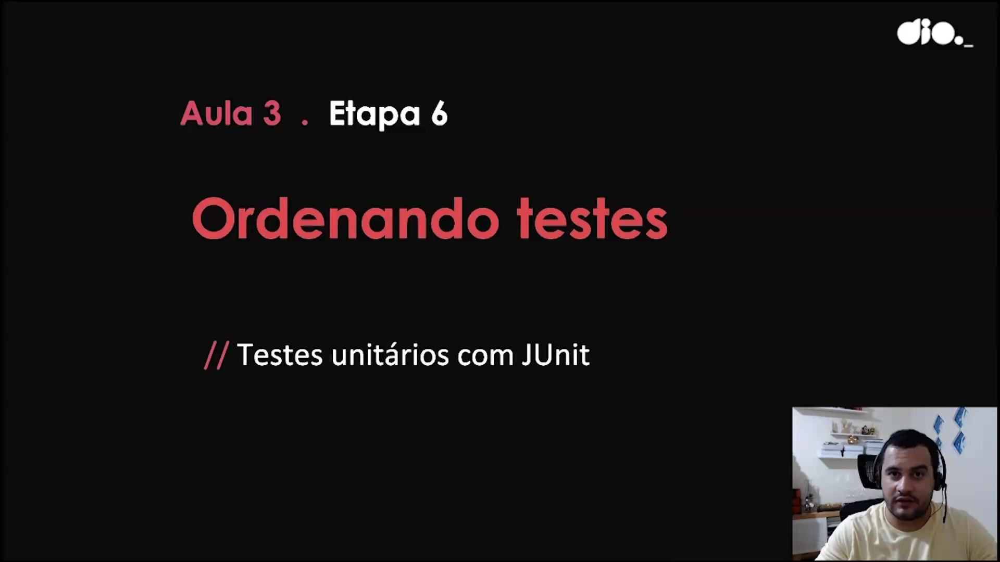
</p>

Nesta etapa, o foco é o controle sobre a ordem de execução dos testes unitários. Por padrão, o JUnit não garante uma ordem específica, o que pode ser problemático em cenários onde a visualização lógica ou a organização dos testes facilitam a depuração. Para demonstrar essas funcionalidades, foi estruturada uma classe de teste básica com quatro métodos representativos: `validaFluxoA`, `validaFluxoB`, `validaFluxoC` e `validaFluxoD`.

---

#### Execução Aleatória com MethodOrderer.Random

<p align="center">
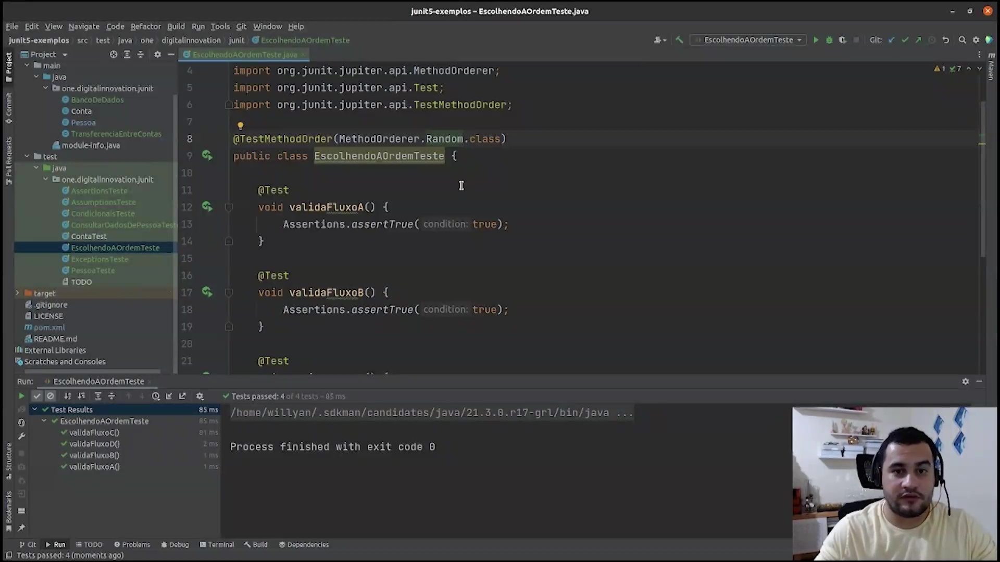
</p>

Uma das formas de configurar a ordenação é através da anotação `@TestMethodOrder`. No exemplo visualizado, utiliza-se o `MethodOrderer.Random.class`, que instrui o JUnit a executar os métodos de teste em uma ordem pseudo-aleatória a cada nova execução. Esta abordagem é útil para garantir que os testes sejam independentes entre si, evitando que o sucesso de um teste dependa do estado deixado por um teste anterior.

```java
import org.junit.jupiter.api.MethodOrderer;
import org.junit.jupiter.api.Test;
import org.junit.jupiter.api.TestMethodOrder;
import org.junit.jupiter.api.Assertions;

@TestMethodOrder(MethodOrderer.Random.class)
public class EscolhendoAOrdemTeste {

    @Test
    void validaFluxoA() {
        Assertions.assertTrue(true);
    }

    @Test
    void validaFluxoB() {
        Assertions.assertTrue(true);
    }
}
```

---

#### Ordenação por DisplayName

<p align="center">
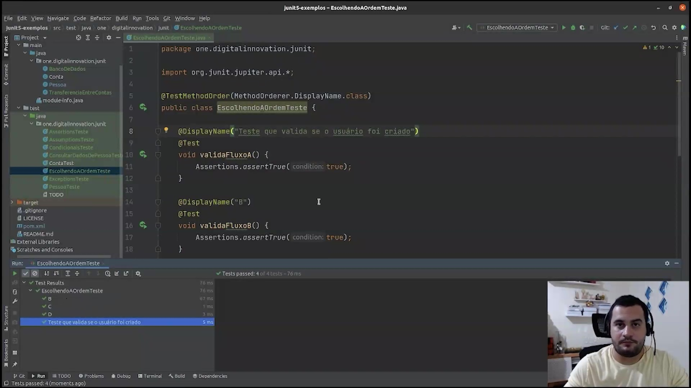
</p>

Outra possibilidade é ordenar os testes com base no nome de exibição definido pela anotação `@DisplayName`. Ao configurar a classe com `@TestMethodOrder(MethodOrderer.DisplayName.class)`, o JUnit seguirá a ordem alfabética dos textos fornecidos dentro das anotações `@DisplayName`. Este recurso é amplamente utilizado para melhorar a legibilidade dos relatórios de teste, permitindo descrições em linguagem natural (como "Teste que valida se o usuário foi criado") enquanto mantém a organização desejada no painel de resultados.

```java
package one.digitalinnovation.junit;

import org.junit.jupiter.api.*;

@TestMethodOrder(MethodOrderer.DisplayName.class)
public class EscolhendoAOrdemTeste {

    @DisplayName("Teste que valida se o usuário foi criado")
    @Test
    void validaFluxoA() {
        Assertions.assertTrue(true);
    }

    @DisplayName("B")
    @Test
    void validaFluxoB() {
        Assertions.assertTrue(true);
    }
}
```      


## Parte 5 - Recursos de testes nas IDEs

### 🟩 Vídeo 10 - Visual Studio Code

<video width="60%" controls>
  <source src="000-Midia_e_Anexos/bootcamp_tqi_fullstack-modulo.06-curso.15-video_10.webm" type="video/webm">
    Seu navegador não suporta vídeo HTML5.
</video>

link do vídeo: https://web.dio.me/track/tqi-fullstack-developer/course/testes-unitarios-com-junit/learning/c3f5e0e8-f3eb-4277-bea0-eb1d7fceff3e?autoplay=1

### 🟩 Vídeo 11 - Eclipse

<video width="60%" controls>
  <source src="000-Midia_e_Anexos/bootcamp_tqi_fullstack-modulo.06-curso.15-video_11.webm" type="video/webm">
    Seu navegador não suporta vídeo HTML5.
</video>

link do vídeo:

### 🟩 Vídeo 12 - IntelliJ IDEA

<video width="60%" controls>
  <source src="000-Midia_e_Anexos/bootcamp_tqi_fullstack-modulo.06-curso.15-video_12.webm" type="video/webm">
    Seu navegador não suporta vídeo HTML5.
</video>

link do vídeo:

## Parte 6 - Boas práticas

### 🟩 Vídeo 13 - Boas práticas

<video width="60%" controls>
  <source src="000-Midia_e_Anexos/bootcamp_tqi_fullstack-modulo.06-curso.15-video_13.webm" type="video/webm">
    Seu navegador não suporta vídeo HTML5.
</video>

link do vídeo:

## Parte 7 - Conclusão do curso

### 🟩 Vídeo 14 - Conclusão do curso

<video width="60%" controls>
  <source src="000-Midia_e_Anexos/bootcamp_tqi_fullstack-modulo.06-curso.15-video_14.webm" type="video/webm">
    Seu navegador não suporta vídeo HTML5.
</video>

link do vídeo:

##  Materiais de Apoio

# Certificado: 

- Link na plataforma: 
- Certificado em pdf: