## Instrutor:

- Juliana Mascarenhas (Tech Education Specialist / Sócia (Content Creator) @SimplificandoRedes / Me Modelagem Computacional / Cientista de dados)
- Contato Linkedin: / [juliana-mascarenhas-ds](https://www.linkedin.com/in/juliana-mascarenhas-ds/)

## Parte 1 - Introdução

### 🟩 Vídeo 01 - Introdução

<video width="60%" controls>
  <source src="000-Midia_e_Anexos/bootcamp_tqi_fullstack-modulo.07-curso.01-video_01.webm" type="video/webm">
    Seu navegador não suporta vídeo HTML5.
</video>

link do vídeo: https://web.dio.me/track/tqi-fullstack-developer/course/principais-protocolos-de-comunicacao-da-internet/learning/c28da5ea-14a1-4fe9-87c1-f219c357b485?autoplay=1

Este curso introdutório foca nos pilares da comunicação web: os protocolos HTTP e WebSocket. A instrutora Juliana Mascarenhas guia os alunos através da estrutura, funcionamento e segurança dessas tecnologias, essenciais para qualquer desenvolvedor que trabalhe com APIs, comunicação cliente-servidor e sistemas em tempo real.

### Anotações

<p align="center">

</p>

Nesta aula introdutória do curso "Conhecendo os principais protocolos de comunicação na internet", a instrutora Juliana Mascarenhas apresenta os fundamentos da comunicação em rede. O foco principal do treinamento será explorar o funcionamento e as estruturas relacionadas aos protocolos HTTP e WebSocket, essenciais para entender como as trocas de informações ocorrem no ambiente digital.

<p align="center">
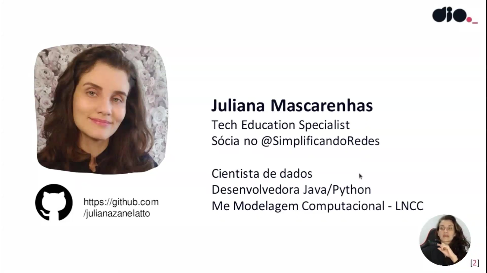
</p>

A instrutora detalha seu perfil profissional e acadêmico, destacando sua atuação como Tech Education Specialist na DIO e sua experiência como cientista de dados e desenvolvedora Java e Python. Além da atuação técnica, Juliana possui mestrado acadêmico em modelagem computacional pelo LNCC, uma modalidade voltada para a formação de pesquisadores e professores com foco em senso crítico e resolução de problemas.

<p align="center">
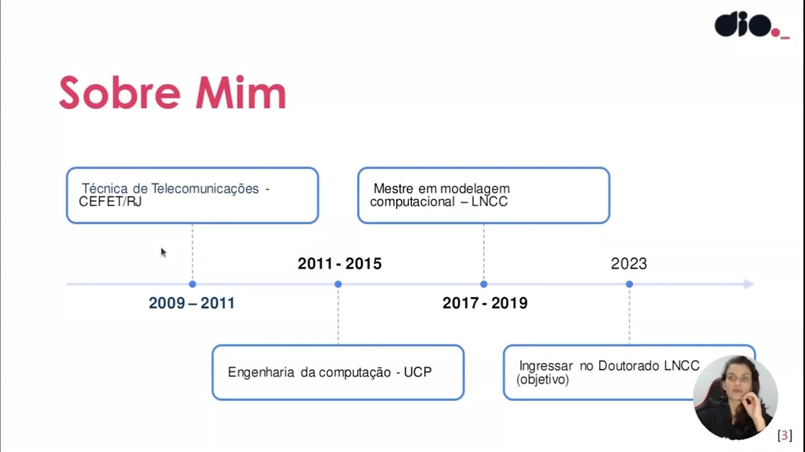
</p>

A trajetória acadêmica da professora é apresentada em ordem cronológica, ressaltando o impacto de sua formação técnica inicial:

* **2009-2011**: Técnico de Telecomunicações pelo CEFET/RJ.
* **2011-2015**: Engenharia da Computação pela UCP.
* **2017-2019**: Mestrado em Modelagem Computacional no LNCC.
* **2023**: Objetivo de ingressar no doutorado pelo LNCC.

<p align="center">
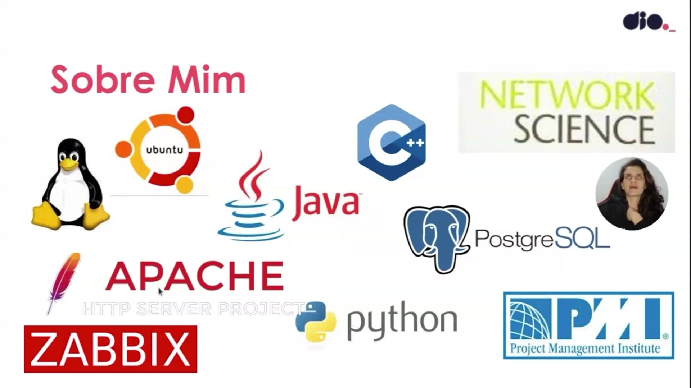
</p>

Ao longo de sua carreira, Juliana acumulou experiência em diversas ferramentas e áreas da computação, trabalhando com segurança de redes (Apache, Zabbix, Snort, Firewall), linguagens de programação (C, Java, Python) e gerenciamento de projetos baseado no PMBOK. Ela destaca a importância da intersecção entre essas áreas, como a utilização de Network Data Science para analisar dados de plataformas como a Ethereum através de grafos.

<p align="center">
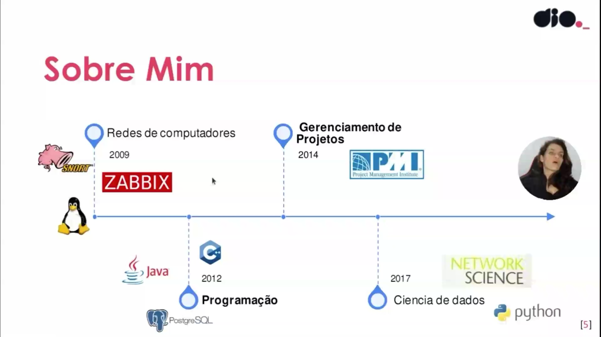
</p>

A evolução profissional da instrutora demonstra uma transição gradual e integrada entre disciplinas: começando na área de redes (2009), expandindo para programação (2012), gerenciamento de projetos (2014) e consolidando-se em ciência de dados a partir de 2017. Essa visão multidisciplinar permitiu a atuação em projetos complexos, como a implementação de segurança em plataformas offshore.

<p align="center">
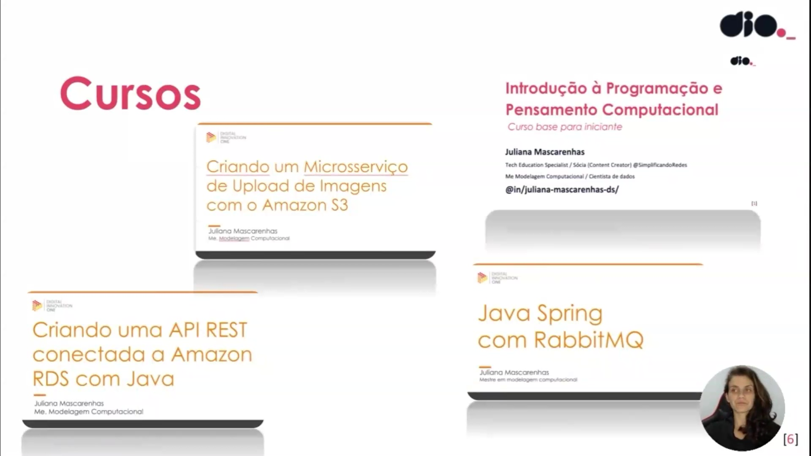
</p>

A instrutora apresenta outros cursos que cocriou com a DIO, que servem de base para o desenvolvimento de aplicações modernas:

* **RabbitMQ com Java Spring**.
* **Microsserviços de upload de imagens com Amazon S3**.
* **Criando uma API REST conectada a Amazon RDS com Java**.
* **Introdução à Programação e Pensamento Computacional**.

<p align="center">
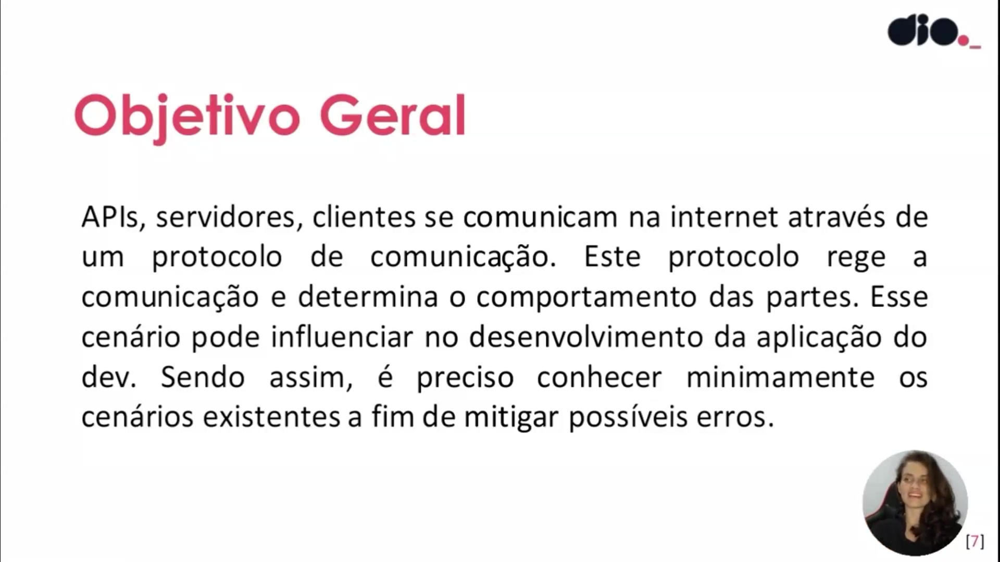
</p>

O objetivo central do curso é capacitar o desenvolvedor a entender as diretrizes e regras que regem a comunicação na internet através de protocolos. Compreender como servidores, clientes e APIs se comunicam permite o desenvolvimento de aplicações mais eficientes e ajuda a mitigar possíveis erros originados por falhas de entendimento do cenário de rede.

<p align="center">
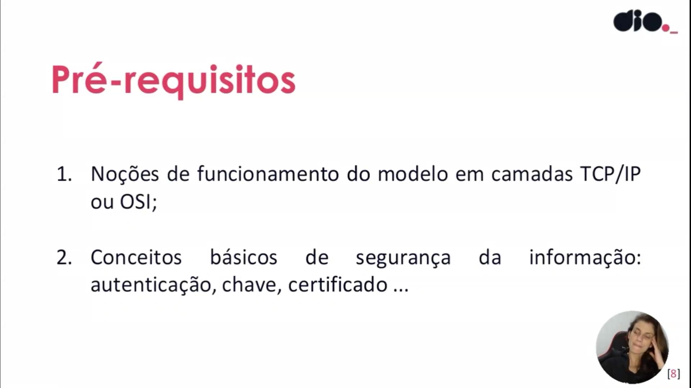
</p>

Para o melhor aproveitamento do conteúdo, recomenda-se que o aluno tenha noções prévias de dois pilares fundamentais:

1. **Redes de Computadores**: Funcionamento do modelo em camadas TCP/IP ou OSI.
2. **Segurança da Informação**: Conceitos básicos como autenticação, chaves e certificados.

<p align="center">
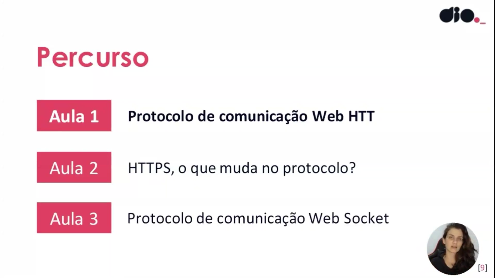
</p>

O percurso do curso está estruturado em três aulas principais:

* **Aula 1**: Protocolo de comunicação HTTP.
* **Aula 2**: HTTPS e as mudanças trazidas pelo uso do protocolo SSL.
* **Aula 3**: Comunicação em tempo real utilizando WebSocket.      

## Parte 2 - Protocolo de comunicação Web HTTP

### 🟩 Vídeo 02 - Como funciona o protocolo HTTP?

<video width="60%" controls>
  <source src="000-Midia_e_Anexos/bootcamp_tqi_fullstack-modulo.07-curso.01-video_02.webm" type="video/webm">
    Seu navegador não suporta vídeo HTML5.
</video>

link do vídeo: https://web.dio.me/track/tqi-fullstack-developer/course/principais-protocolos-de-comunicacao-da-internet/learning/6fde8176-b068-4d69-bb12-8aa7280ae155?autoplay=1

O vídeo em uma aula detalhada sobre o **protocolo HTTP**, abordando seu funcionamento essencial na comunicação entre **cliente e servidor**. O conteúdo explica a estrutura das mensagens de **requisição e resposta**, além de diferenciar as versões **1.1 e 2.0** do protocolo. São discutidos conceitos fundamentais como a natureza **stateless** da comunicação, o uso do protocolo **TCP** na camada de transporte e os métodos **GET e POST**. O material também compara os formatos de serialização de dados **XML e JSON**, destacando suas vantagens técnicas e aplicações práticas. Por fim, o texto analisa limitações da versão 1.1, como o **bloqueio de linha de frente** e o overhead nos cabeçalhos.

### Anotações

<p align="center">
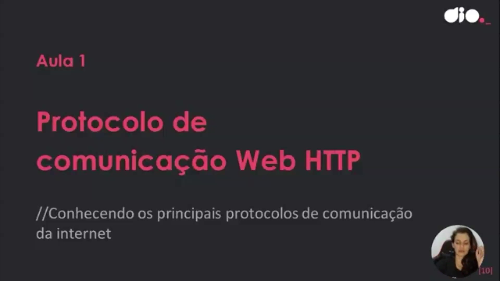
</p>

Introdução à aula, focada exclusivamente no protocolo de comunicação Web HTTP , que é fundamental para o intercâmbio de dados na internet.

<p align="center">
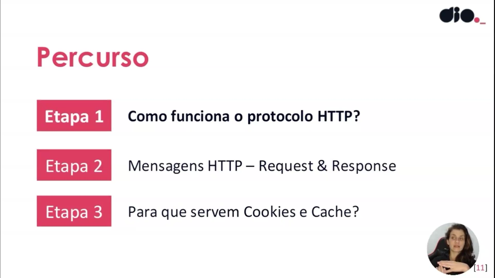
</p>

Apresentação do percurso inicial da aula. A estrutura de ensino abrange o funcionamento básico do protocolo HTTP na primeira etapa. Em seguida, a etapa 2 foca em destrinchar as mensagens trafegadas, especificamente as de requisição (Request) e resposta (Response). A terceira etapa abordará o propósito de ferramentas que auxiliam na eficiência da comunicação, como Cookies e Cache.

<p align="center">
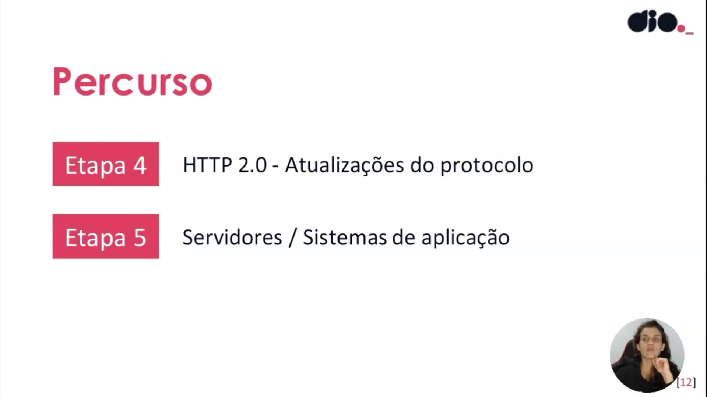
</p>

Continuação do percurso de aprendizado da aula. A quarta etapa tratará das atualizações introduzidas na versão HTTP 2.0. Por fim, a etapa 5 focará nos servidores e nos sistemas de aplicação.

<p align="center">
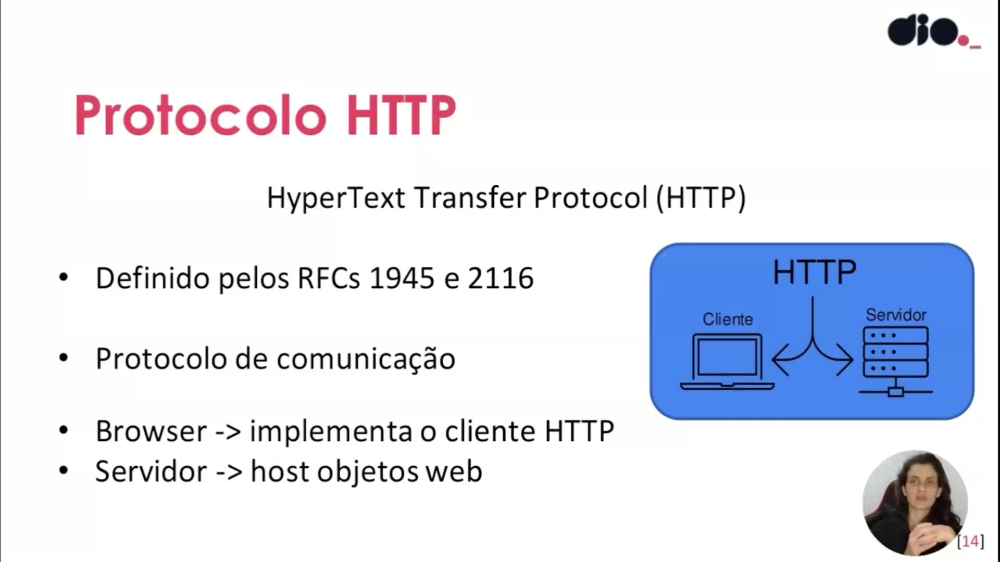
</p>

O HTTP significa HyperText Transfer Protocol. Ele atua como o protocolo de comunicação  responsável por intermediar a troca de informações entre duas pontas. O navegador implementa o lado do Cliente HTTP , que solicita recursos a um Servidor , este sendo responsável por hospedar os objetos web. Historicamente, as diretrizes desse protocolo foram estabelecidas pelas RFCs 1945 e 2116.

<p align="center">
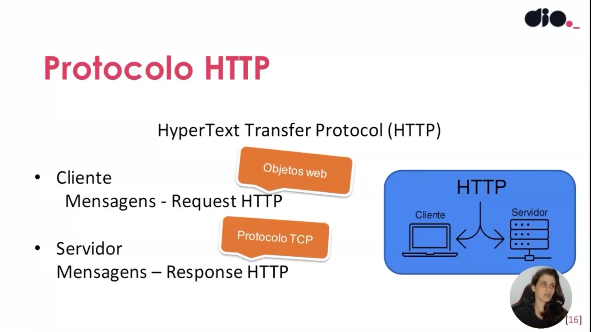
</p>

Dinâmica inicial da comunicação. O Cliente envia ativamente mensagens de requisição (Request HTTP)  pedindo os recursos desejados ao Servidor. Para que essas mensagens trafeguem com segurança e com controle de fluxo, o HTTP apoia-se no Protocolo TCP  da camada de transporte subjacente.

<p align="center">
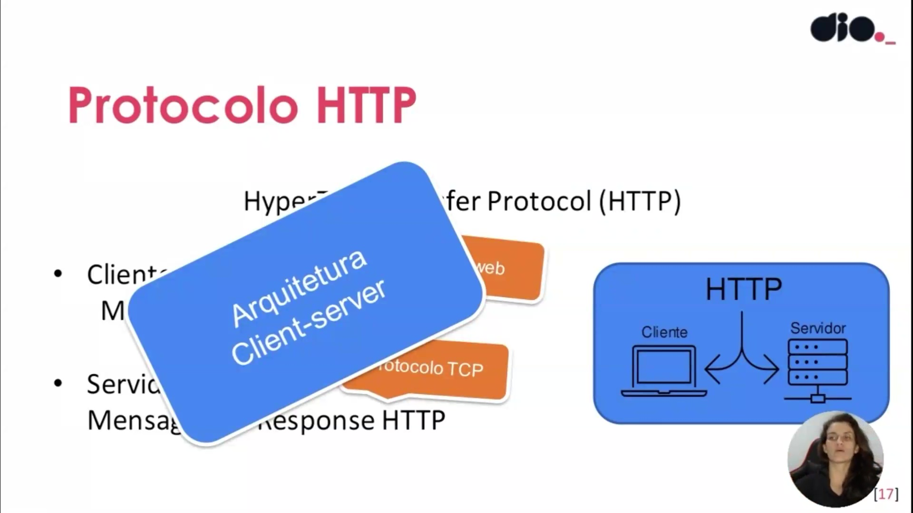
</p>

Após processar a requisição (Request), o Servidor retorna os objetos web pertinentes por meio de mensagens de resposta (Response HTTP). Esse fluxo interdependente de papéis caracteriza uma Arquitetura Client-server clássica.

<p align="center">
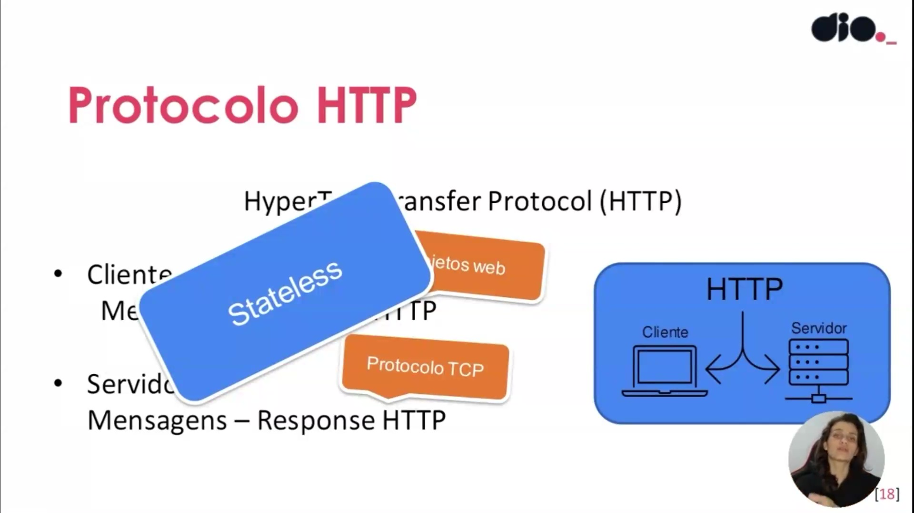
</p>

Uma característica estrutural crítica do Servidor no protocolo HTTP é ser "Stateless" (sem estado). Isso denota que o servidor atende às requisições de forma independente e isolada, não guardando o estado do cliente ou rastreando repetições entre diferentes chamadas.

<p align="center">
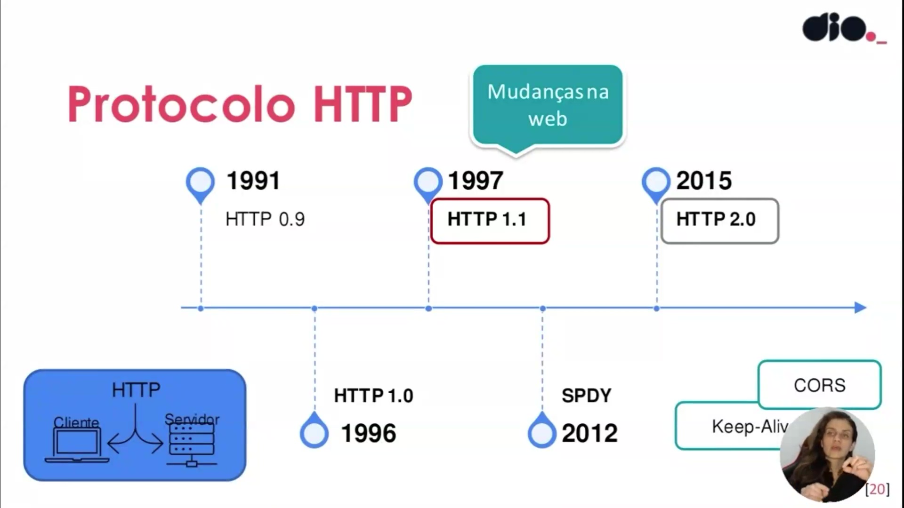
</p>

Linha do tempo resumida demonstrando a evolução do protocolo HTTP em resposta às mudanças na web ao longo das décadas. A tecnologia iniciou com o HTTP 0.9 em 1991 , seguido pelo HTTP 1.0 em 1996. O HTTP 1.1, lançado em 1997 , inseriu funcionalidades críticas ainda muito utilizadas, como o CORS e o Keep-Alive. Mais tarde, inovações com o SPDY em 2012 prepararam o terreno para a homologação do HTTP 2.0 em 2015.

<p align="center">
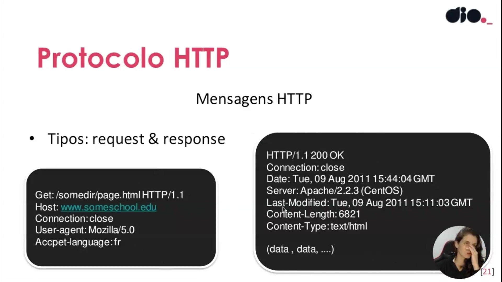
</p>

Exemplo prático da estrutura textual que compõe os dois tipos fundamentais de mensagens HTTP: Request (requisição) e Response (resposta). É possível identificar o uso do método `Get`, diretrizes de host e linguagens na requisição, bem como o cabeçalho de resposta emitido por um servidor do tipo Apache, atestando sucesso (`200 OK`).

```http
Get: /somedir/page.html HTTP/1.1
Host: www.someschool.edu
Connection:close
User-agent: Mozilla/5.0
Accpet-language:fr

HTTP/1.1 200 OK
Connection: close
Date: Tue, 09 Aug 2011 15:44:04 GMT
Server: Apache/2.2.3 (CentOS)
Last-Modified: Tue, 09 Aug 2011 15:11:03 GMT
Content-Length: 6821
Content-Type: text/html
(data, data, ....)
```

<p align="center">
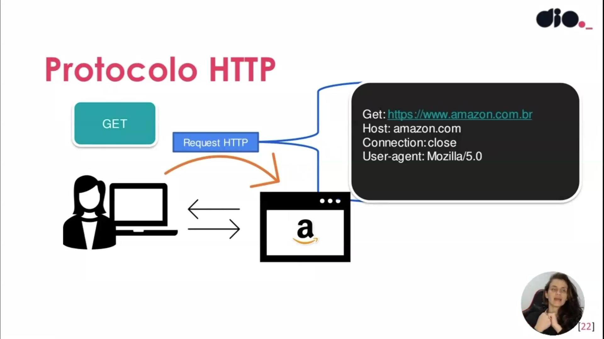
</p>

Detalhamento visual do envio de uma requisição utilizando o método GET. Este método é construído pelo cliente com a intenção estrita de capturar um recurso do lado do servidor. O navegador (User-agent) formata uma solicitação Request HTTP apontando, por exemplo, para a página inicial da Amazon.

```http
Get: https://www.amazon.com.br
Host: amazon.com
Connection:close
User-agent: Mozilla/5.0
```

<p align="center">
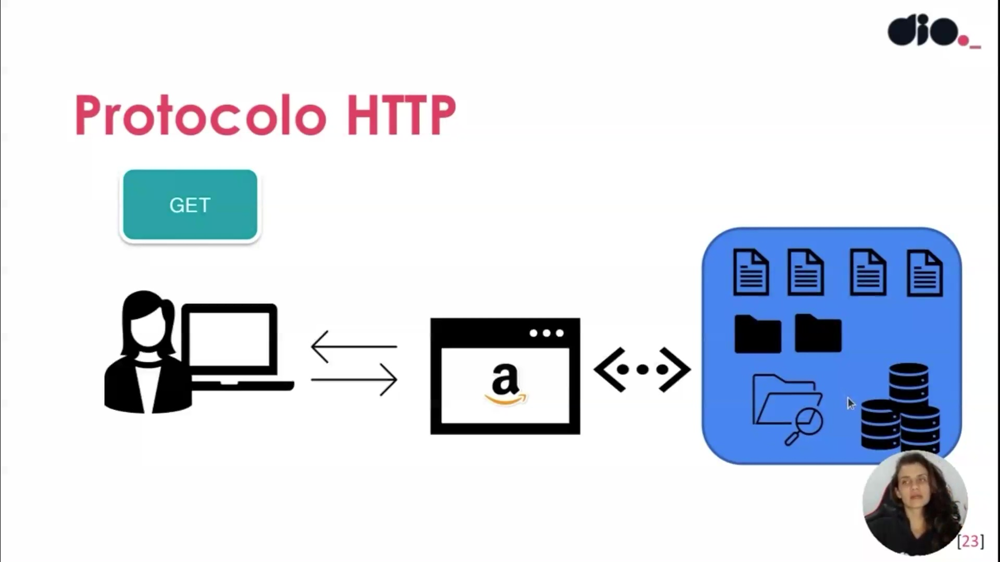
</p>

Ação de busca do lado do servidor após o recebimento da solicitação GET. O servidor da aplicação irá consultar sua estrutura interna de arquivos, diretórios e bancos de dados lógicos para encontrar o recurso ou as informações requisitadas pelo cliente.

<p align="center">
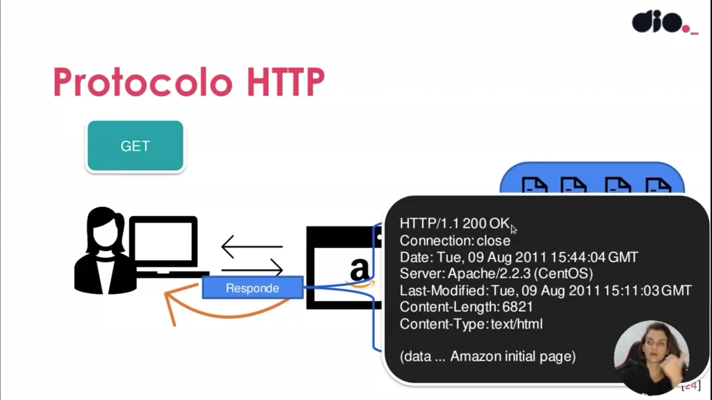
</p>

Conclusão do ciclo de uma requisição GET. Ao resgatar e preparar os dados internamente, o servidor gera uma mensagem do tipo HTTP Response e a entrega de volta ao cliente informando sucesso (`HTTP/1.1 200 OK`), contendo também a representação do conteúdo demandado (como a estrutura HTML da página solicitada).

```http
HTTP/1.1 200 OK
Connection: close
Date: Tue, 09 Aug 2011 15:44:04 GMT
Server: Apache/2.2.3 (CentOS)
Last-Modified: Tue, 09 Aug 2011 15:11:03 GMT
Content-Length: 6821
Content-Type: text/html

(data ... Amazon initial page)
```

<p align="center">
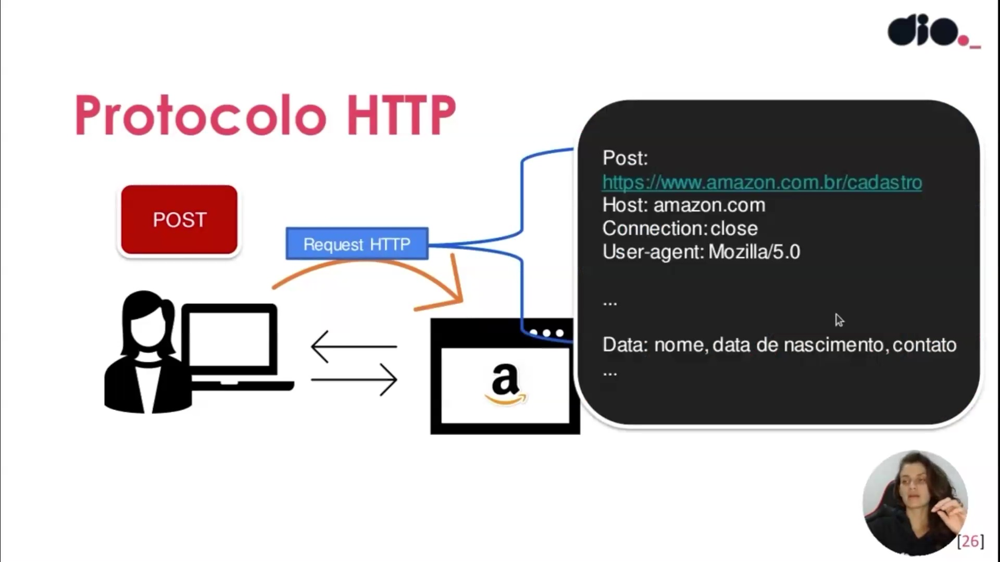
</p>

Apresentação da dinâmica do método POST, cujo papel principal é enviar dados elaborados do cliente ao servidor. Este fluxo é classicamente empregado ao submeter formulários de cadastro, repassando no corpo da mensagem um conjunto robusto de dados como nome e contato.

```http
Post: https://www.amazon.com.br/cadastro
Host: amazon.com
Connection:close
User-agent: Mozilla/5.0

...
Data: nome, data de nascimento, contato
...
```

<p align="center">
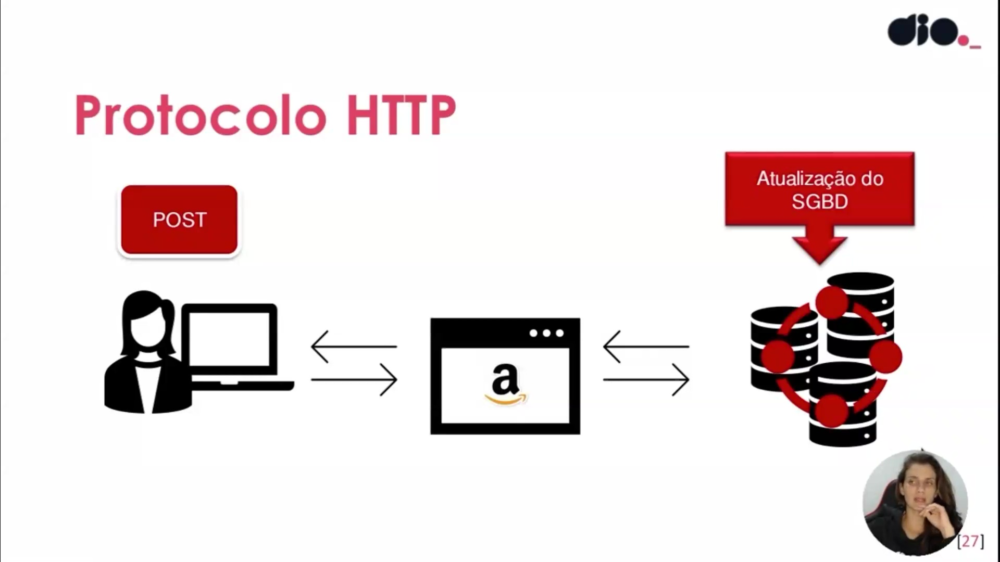
</p>

Ação do servidor após recepção de uma submissão POST. O servidor processa as informações e executa as ações devidas de gravação e atualização de registro no Sistema Gerenciador de Banco de Dados (SGBD).

<p align="center">
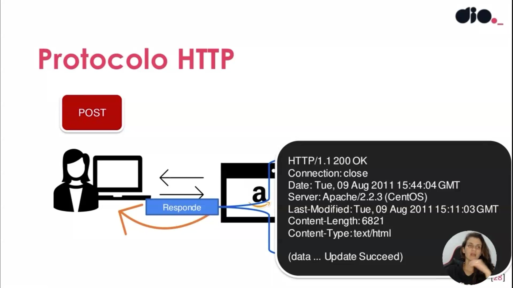
</p>

Conclusão da operação via POST. Tendo sido as informações corretamente manipuladas no banco de dados, o servidor responde com um sinalizador de sucesso (`200 OK`), confirmando ao cliente que a ação de atualizar/inserir dados foi efetivada.

```http
HTTP/1.1 200 OK
Connection: close
Date: Tue, 09 Aug 2011 15:44:04 GMT
Server: Apache/2.2.3 (CentOS)
Last-Modified: Tue, 09 Aug 2011 15:11:03 GMT
Content-Length: 6821
Content-Type: text/html

(data ... Update Succeed)
```

<p align="center">
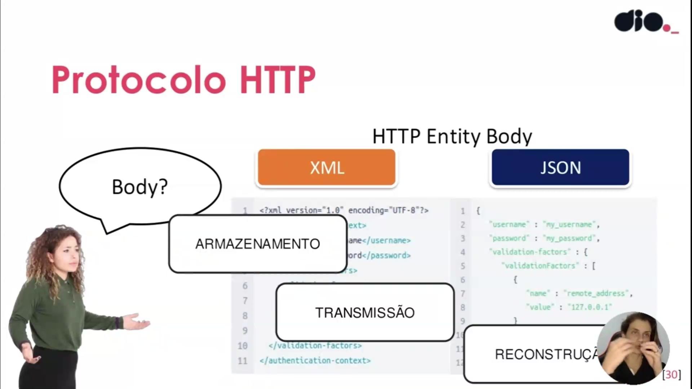
</p>

Visão panorâmica de como os dados são organizados no corpo (Entity Body) da mensagem HTTP, sejam eles despachados ou requisitados. A finalidade dessa organização envolve três etapas centrais: o Armazenamento, a Transmissão segura entre os nós, e a Reconstrução dos dados recebidos do outro lado. Os formatos dominantes da indústria para realizar esse trabalho de padronização estrutural são o XML e o JSON.

<p align="center">
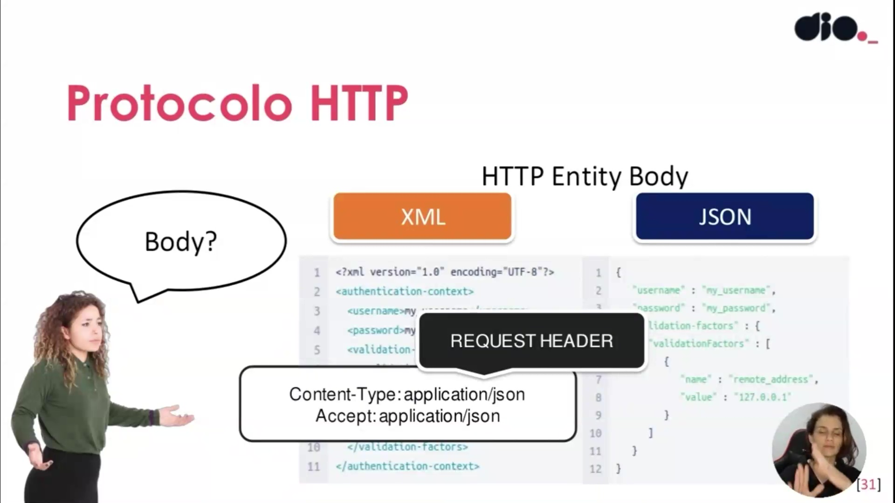
</p>

Como declarar o tipo estrutural utilizado no HTTP Entity Body. O cliente e o servidor chegam a um consenso técnico através dos atributos declarados no cabeçalho da requisição (Request Header). Define-se o parâmetro `Content-Type` para sinalizar como a mensagem atual está formatada, bem como o atributo `Accept` indicando quais formatos a aplicação aceita receber de volta.

```http
Content-Type: application/json
Accept: application/json

```

<p align="center">
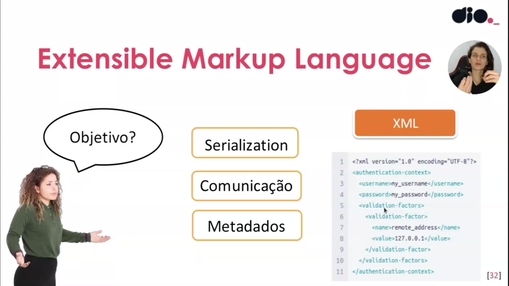
</p>

Apresentação conceitual e visual do formato Extensible Markup Language (XML). Seu objetivo primário é realizar a "Serialization" (transformação de dados para intercâmbio) para viabilizar a Comunicação e embutir de forma robusta um conjunto denso de Metadados. Sintaticamente, assemelha-se ao HTML, estruturando os dados por meio de encapsulamento por tags.

```xml
<?xml version="1.0" encoding="UTF-8"?>
<authentication-context>
    <username>my_username</username>
    <password>my_password</password>
    <validation-factors>
        <validation-factor>
            <name>remote_address</name>
            <value>127.0.0.1</value>
        </validation-factor>
    </validation-factors>
</authentication-context>
```

<p align="center">
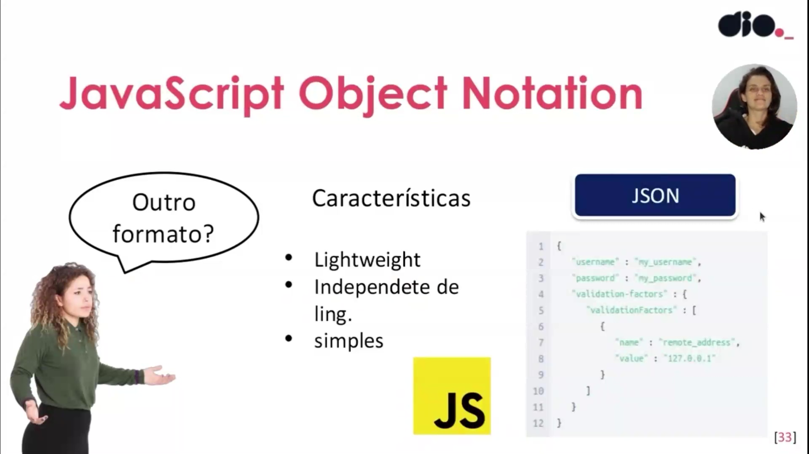
</p>

Apresentação do formato JavaScript Object Notation (JSON). Ele foi desenhado herdando a sintaxe da linguagem JavaScript (JS) com a premissa de ser altamente simples e um padrão "Lightweight" (leve). Apesar das raízes sintáticas, mantém-se totalmente independente de linguagem.

```json
{
    "username": "my_username",
    "password": "my_password",
    "validation-factors": {
        "validation-factor": [
            {
                "name": "remote_address",
                "value": "127.0.0.1"
            }
        ]
    }
}
```

<p align="center">
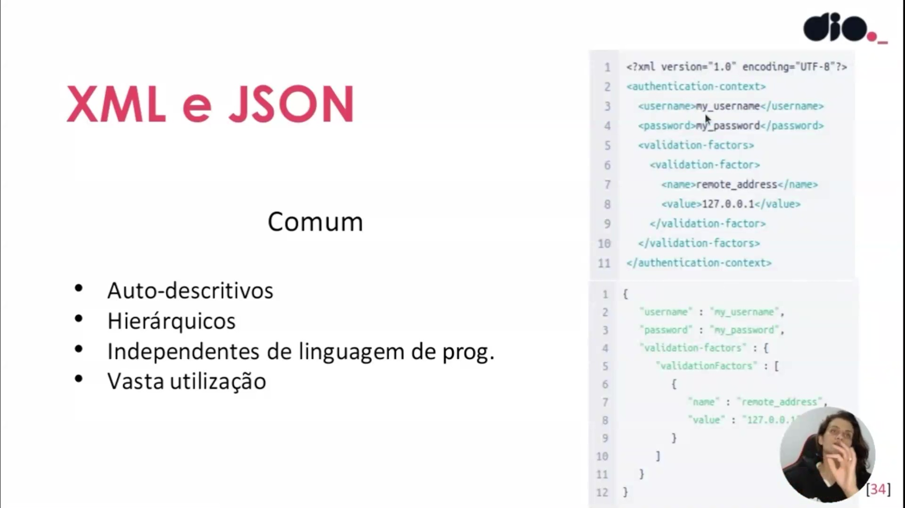
</p>

Pontos em comum entre o XML e o JSON. A despeito de suas diferenças, ambos provaram vasta utilização no mercado, pois possuem propriedades auto-descritivas e organizam a informação baseada em níveis hierárquicos rígidos. Ambos são formatos completamente independentes de linguagens de programação.

<p align="center">
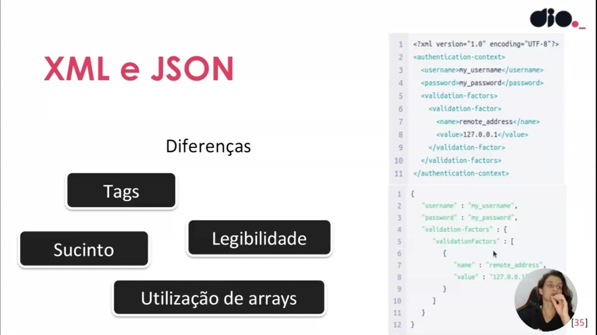
</p>

Análise das diferenças estruturais entre XML e JSON. A natureza do XML baseia-se maciçamente no uso de Tags para a delimitação verbal da informação. Por contrapartida, o JSON distingue-se por ser incrivelmente mais sucinto, priorizar extrema legibilidade via modelo dicionário chave-valor e harmonizar perfeitamente com a estruturação da informação através da utilização de arrays.

<p align="center">
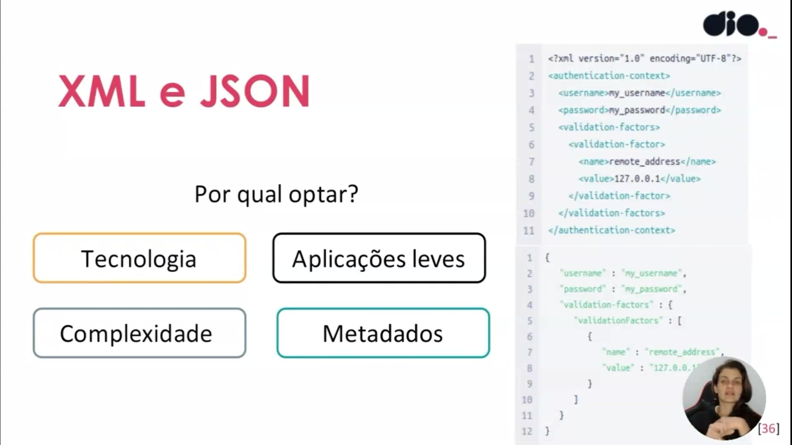
</p>

Critérios para optarmos entre XML ou JSON no design de uma aplicação. A escolha dita-se pelas variáveis do projeto: aplicações modernas que exigem tráfego veloz costumam pedir formatos para "Aplicações leves" (JSON). Em cenário oposto, arquiteturas de "Complexidade" maior que demandam extensa utilização de "Metadados", bem como dependências presas à "Tecnologia" legada, justificam e requerem o uso do XML.

<p align="center">
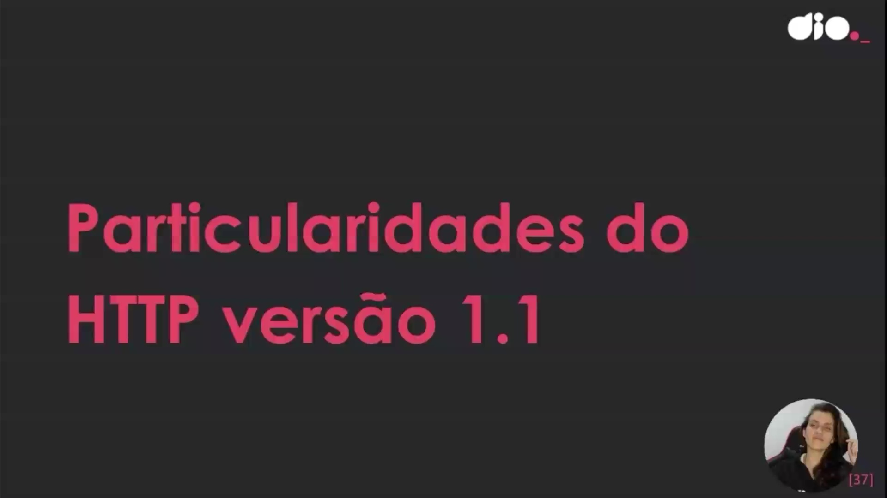
</p>

Abertura de nova seção na aula destinada a investigar peculiaridades e deficiências técnicas inerentes especificamente ao Protocolo HTTP em sua versão 1.1.

<p align="center">
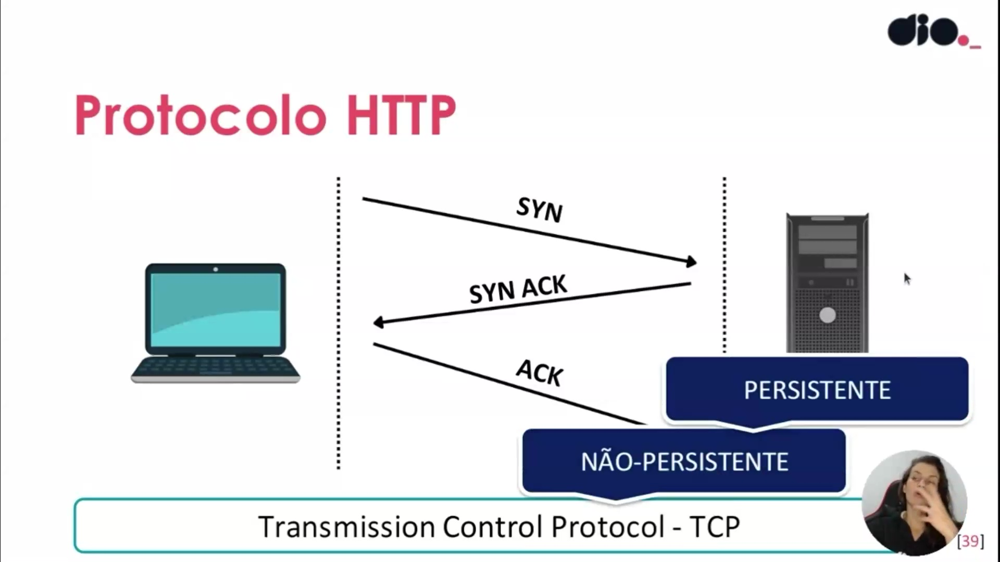
</p>

Como o TCP (Transmission Control Protocol) atua abaixo do HTTP na camada de transporte. A base da conectividade é forjada a partir de um processo de aperto de mãos em três etapas de sincronização (`SYN`, `SYN ACK`, `ACK`). Essa conectividade fundamental estabelecida pode comportar-se tanto em caráter Persistente (conexão deixada aberta), quanto Não-persistente (conexão encerrada tão logo responda à solicitação).

<p align="center">
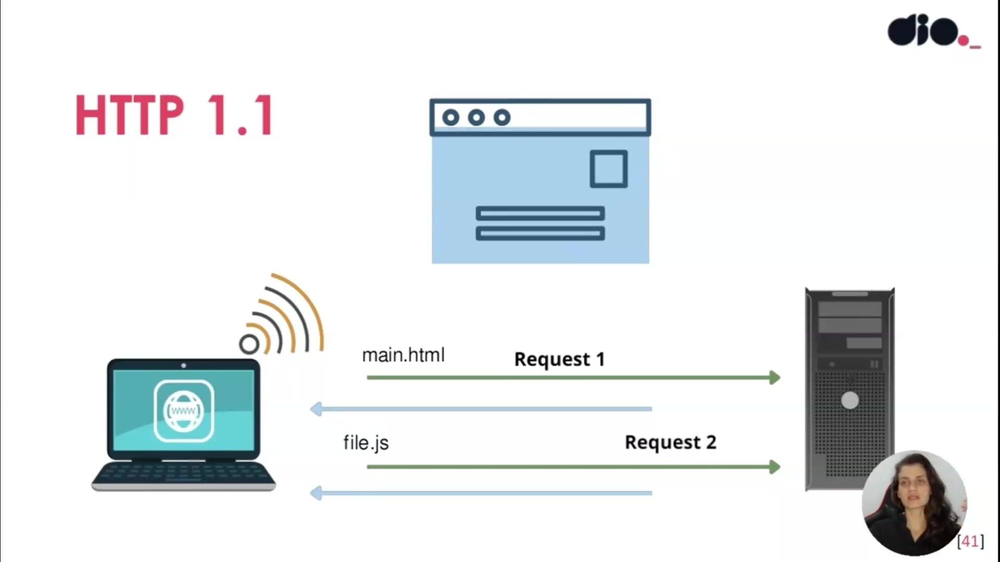
</p>

Dinâmica sequencial padrão do protocolo HTTP 1.1. O método base executa as requisições ordenadamente: exige-se que o cliente encaminhe primeiro uma requisição (ex: o código base em `main.html`), congele o estado até que a resposta total chegue e, apenas na sequência, engatilhe com sucesso uma segunda requisição necessária (ex: os complementos de estilo e lógica contidos em um `file.js`).

<p align="center">
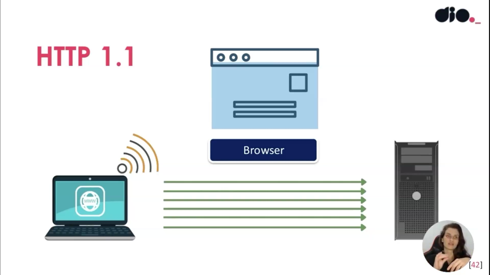
</p>

Artifício implementado pela tecnologia de navegadores modernos (Browsers) no protocolo HTTP 1.1. Com o fito de contornar os graves problemas de lentidão oriundos do carregamento unicamente sequencial estrito, os desenvolvedores de browsers passaram a permitir canais paralelos para executar de forma simultânea e assíncrona até seis conexões de solicitações HTTP ativas com o mesmo servidor.

<p align="center">
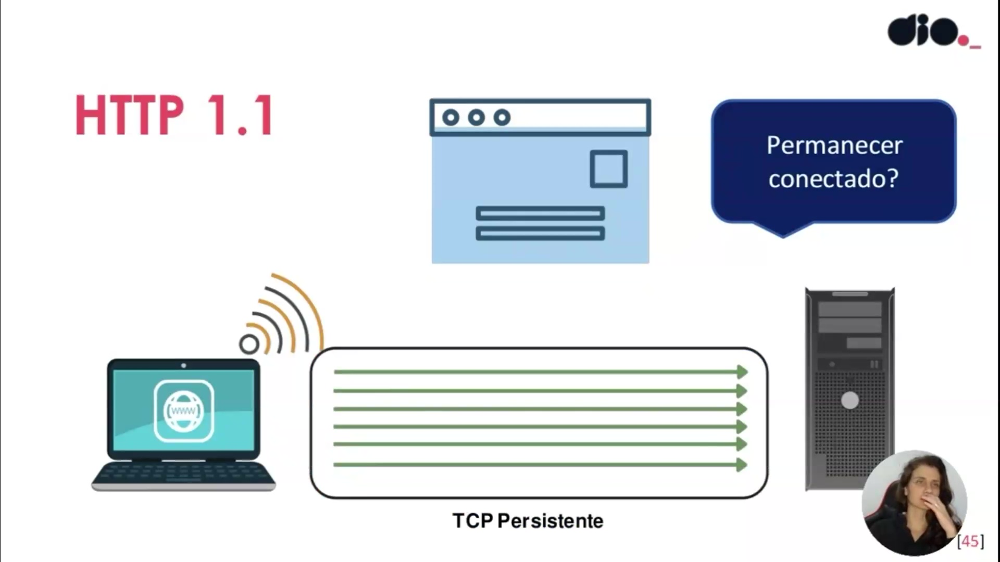
</p>

Permissão de conexão constante no HTTP 1.1. Se o tráfego exige permanecer conectado repetidamente sem a penalidade constante de reconstruir as saudações via rede para pacotes subsequentes, recorre-se a uma conexão de túnel TCP Persistente (Keep-Alive). Uma vez fixado um túnel principal, múltiplos sinais HTTP trafegam através desta avenida mantida operante.

<p align="center">
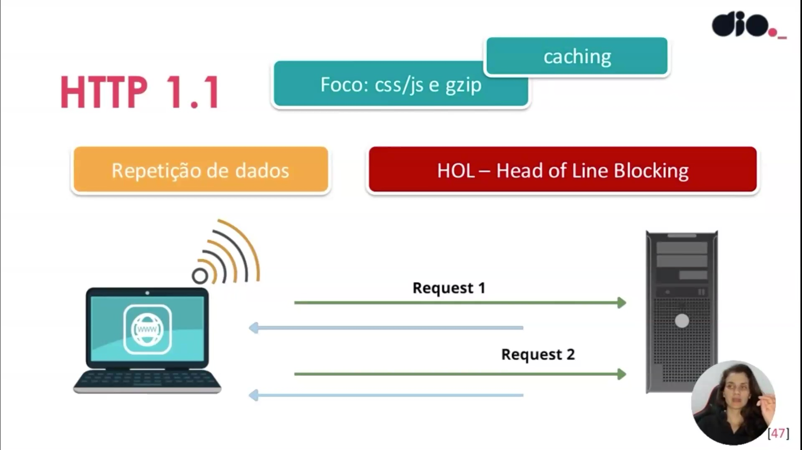
</p>

Sintese dos gargalos primários que maculam a arquitetura original do HTTP 1.1. Primeiramente, o encavalamento da fila se uma requisição anterior atrasa e entope o processamento subsequente, caracterizando o evento de bloqueio "HOL - Head of Line Blocking". Ademais, o formato sofre do inchaço estrutural e do peso da repetição ineficaz nos blocos de pacotes, pois toda vez um volume constante de dados textuais e cabeçalhos devem ser reenviados ao remetente, inundando e sufocando os conduítes da internet desnecessariamente.


### 🟩 Vídeo 03 - Mensagens HTTP - Request & Response

<video width="60%" controls>
  <source src="000-Midia_e_Anexos/bootcamp_tqi_fullstack-modulo.07-curso.01-video_03.webm" type="video/webm">
    Seu navegador não suporta vídeo HTML5.
</video>

link do vídeo: https://web.dio.me/track/tqi-fullstack-developer/course/principais-protocolos-de-comunicacao-da-internet/learning/a9046513-4103-428b-a010-57c3a35926fe?autoplay=1

Este guia explora as nuances das mensagens HTTP, detalhando como as requisições (requests) e respostas (responses) são estruturadas, os diversos métodos disponíveis, a lógica por trás dos códigos de status e a extensão WebDAV para colaboração.

### Anotações

<p align="center">
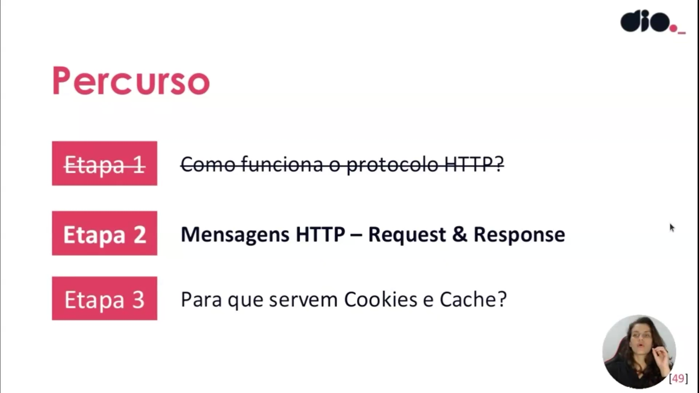
</p>

Apresentação do percurso de aprendizado. O foco atual (Etapa 2) é entender como estão estruturadas as mensagens HTTP, especificamente *Request* e *Response*, dando continuidade ao estudo de como o protocolo funciona e antecedendo o tópico de Cookies e Cache.

<p align="center">
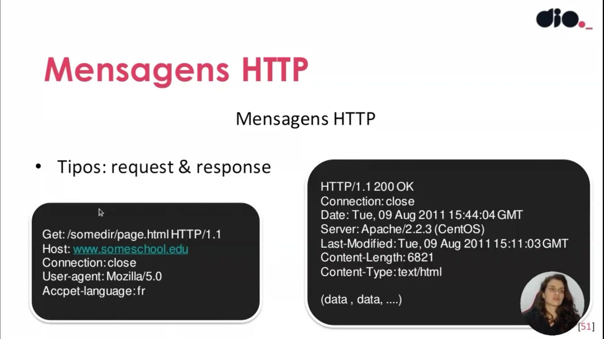
</p>

Visão geral dos dois tipos principais de mensagens HTTP: *Request* (requisição) e *Response* (resposta). A imagem exibe exemplos práticos de como essas mensagens são estruturadas em texto puro para a comunicação entre o cliente e o servidor.

```http
Get: /somedir/page.html HTTP/1.1
Host: www.someschool.edu
Connection: close
User-agent: Mozilla/5.0
Accept-language: fr

```

```http
HTTP/1.1 200 OK
Connection: close
Date: Tue, 09 Aug 2011 15:44:04 GMT
Server: Apache/2.2.3 (CentOS)
Last-Modified: Tue, 09 Aug 2011 15:11:03 GMT
Content-Length: 6821
Content-Type: text/html

(data, data, ....)

```

<p align="center">
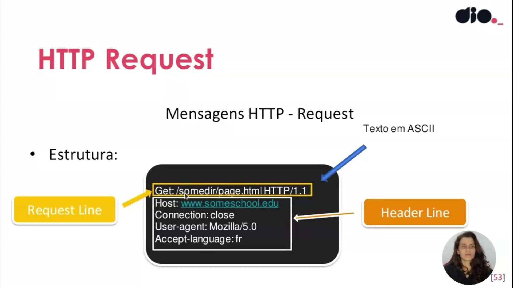
</p>

Detalhamento da estrutura de uma mensagem de requisição HTTP (*Request*). O conteúdo é redigido em texto ASCII e é dividido primariamente em duas partes: a **Request Line** (linha de requisição inicial com as informações base do pedido) e as **Header Lines** (linhas de cabeçalho contendo informações adicionais e propriedades da requisição).

<p align="center">
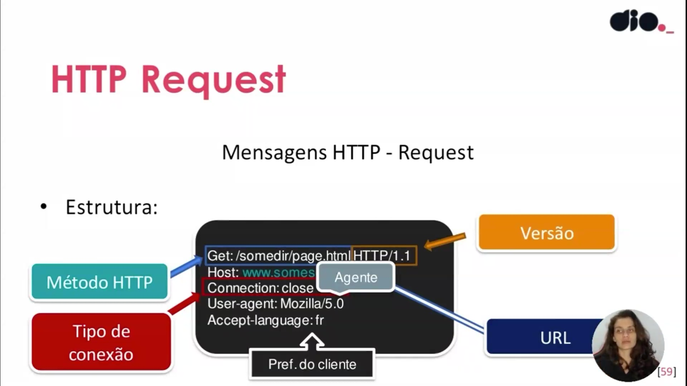
</p>

Mapeamento detalhado dos campos de uma requisição. Na linha principal, identificamos o **Método HTTP** (`GET`), a **URL** do recurso solicitado e a **Versão** do protocolo (`HTTP/1.1`). No cabeçalho subsequente, observamos o **Tipo de conexão** (encerrada após a resposta), o **Agente** (identificação do navegador ou ferramenta, como Mozilla) e a **Preferência do cliente** (como o idioma francês aceito).

<p align="center">
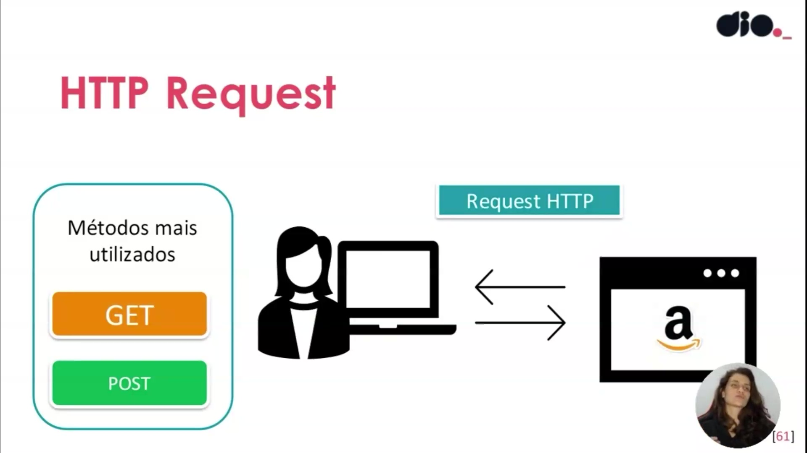
</p>

Apresentação dos métodos HTTP mais utilizados: **GET** e **POST**. O método GET recebe um destaque visual intencional por ser majoritário na web (cerca de 90% das requisições), servindo primordialmente para buscar e consumir informações, enquanto o POST é focado no envio de entidades.

<p align="center">
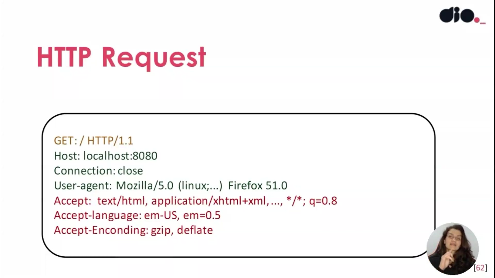
</p>

Exemplo mais elaborado de uma requisição `GET`. A solicitação é feita para o destino raiz (`/`), indicando a página inicial do servidor local (`localhost:8080`). O cabeçalho inclui campos extras de negociação, como `Accept` (tipos de mídia que o cliente suporta), `Accept-Language` (idiomas aceitos) e `Accept-Encoding` (formatos de compressão desejados).

```http
GET / HTTP/1.1
Host: localhost:8080
Connection: close
User-agent: Mozilla/5.0 (linux;...) Firefox 51.0
Accept: text/html, application/xhtml+xml, ..., */*; q=0.8
Accept-language: en-US, en;q=0.5
Accept-Encoding: gzip, deflate

```

<p align="center">
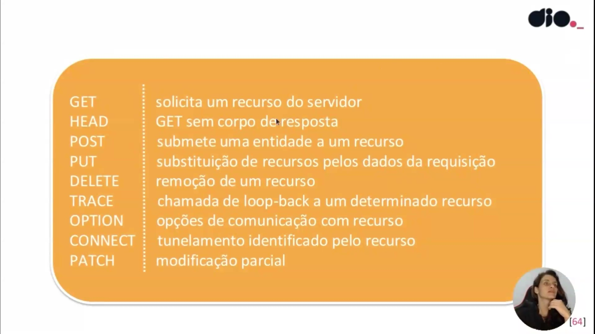
</p>

Visão ampliada dos diversos métodos HTTP disponíveis além de GET e POST. Cada método possui uma finalidade semântica específica, indo desde a solicitação de apenas cabeçalhos (`HEAD`), envio de dados para processamento (`POST`), substituição de recursos (`PUT`), remoção (`DELETE`), até testes de rede e tunelamento (`TRACE`, `OPTION`, `CONNECT`).

<p align="center">
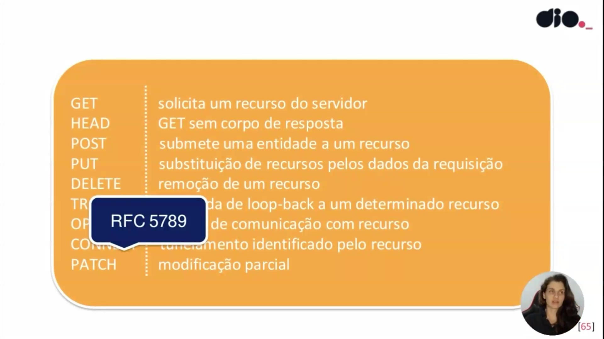
</p>

Destaque para o método `PATCH`, utilizado para aplicar modificações parciais a um recurso no servidor. Uma particularidade notável do PATCH é que ele foi formalizado e definido em um documento separado (RFC 5789), ao contrário da maioria dos outros métodos clássicos que integram as especificações principais do protocolo HTTP.

<p align="center">
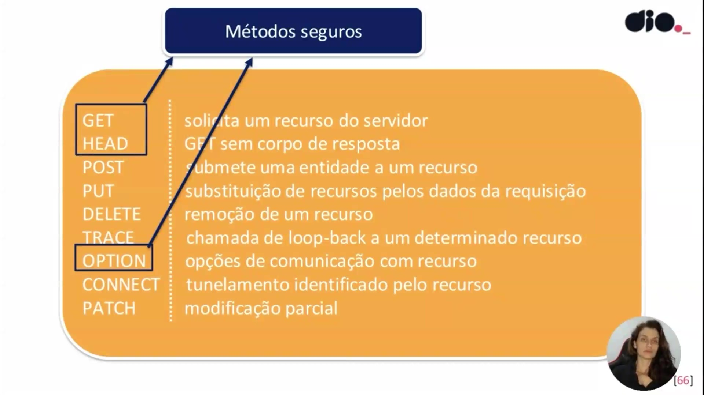
</p>

Introdução ao conceito de "Métodos Seguros" (Safe Methods). São categorizados como seguros os métodos HTTP que não têm o objetivo de alterar o estado do servidor. Ao serem executados, a intenção é estritamente consultar e buscar dados sem causar modificações no recurso alvo.

<p align="center">
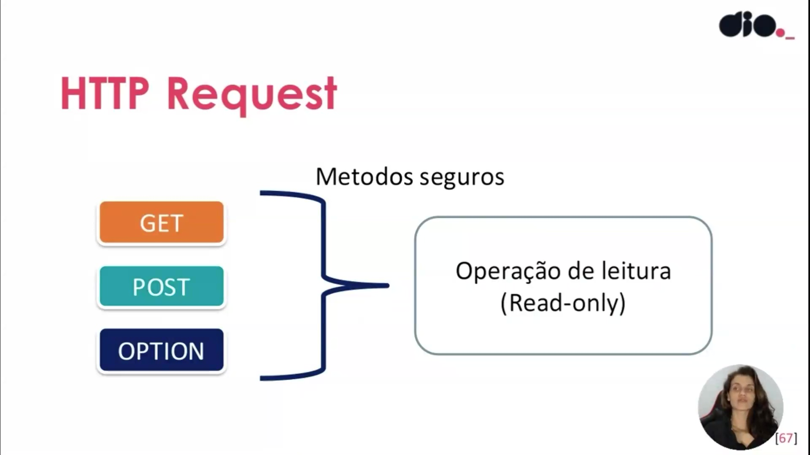
</p>

Os métodos seguros caracterizam-se por realizarem primariamente uma operação de leitura (*Read-only*). O slide evidencia a natureza inofensiva desses métodos, garantindo que o cliente pode realizar a requisição sem o receio de sobrescrever, deletar ou modificar informações vitais no lado do servidor. *(Nota: Embora POST apareça na lista de métodos ilustrativos, tradicionalmente não é um método seguro)*.

<p align="center">
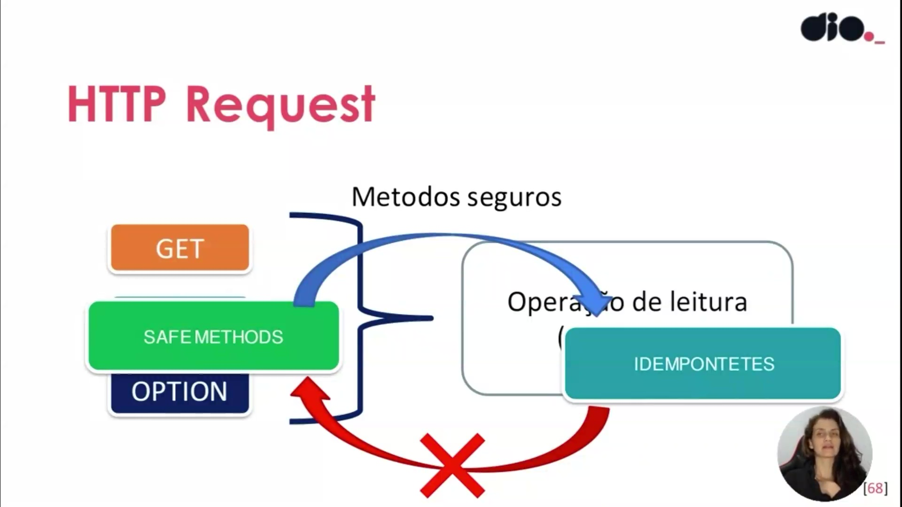
</p>

Apresentação do conceito de idempotência. Todo método seguro é, por definição, idempotente: realizar a mesma requisição várias vezes produzirá o mesmo estado final no servidor. O diagrama ressalta a assimetria dessa relação: nem todo método idempotente é necessariamente um método seguro.

<p align="center">
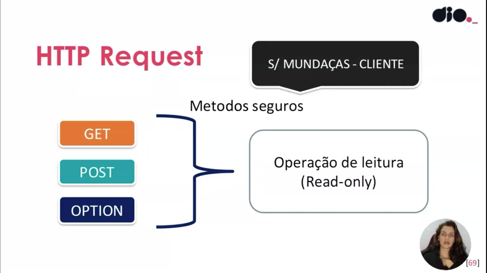
</p>

Esclarecimento final sobre a classificação dos métodos seguros: eles sinalizam intenções sem mudanças pelo cliente ("S/ MUDANÇAS - CLIENTE"). Ainda que o servidor possa, em seu *backend*, gerar 1ogs de acesso ou realizar métricas (que tecnicamente mudam seu estado interno), não há uma solicitação explícita de modificação pelo usuário na execução desses métodos de leitura.

<p align="center">
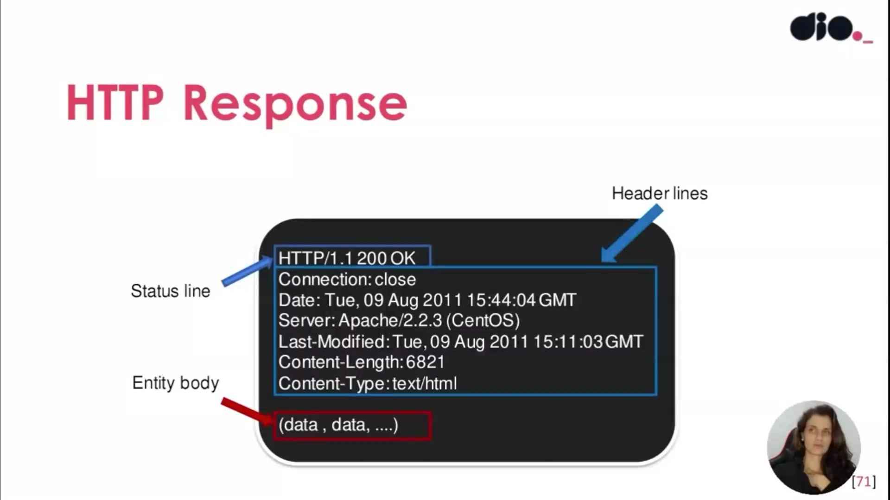
</p>

Estrutura geral de uma mensagem de resposta HTTP (*Response*). O bloco é dissecado em três áreas cruciais: a linha de status inicial (**Status line**), os metadados de cabeçalho descritivos (**Header lines**) e, caso aplicável, o corpo de dados transmitido (**Entity body**).

```http
HTTP/1.1 200 OK
Connection: close
Date: Tue, 09 Aug 2011 15:44:04 GMT
Server: Apache/2.2.3 (CentOS)
Last-Modified: Tue, 09 Aug 2011 15:11:03 GMT
Content-Length: 6821
Content-Type: text/html

(data, data, ....)

```

<p align="center">
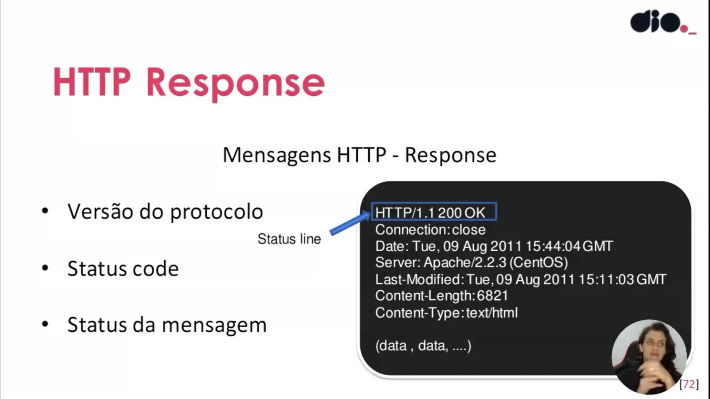
</p>

Foco na avaliação detalhada da **Status Line** da resposta. Esta linha isolada fornece rapidamente três frentes de verificação essenciais para o cliente: a **Versão do protocolo** em uso, o **Status code** (código numérico, como 200) e a descrição literal atrelada, o **Status da mensagem** (como OK).

<p align="center">
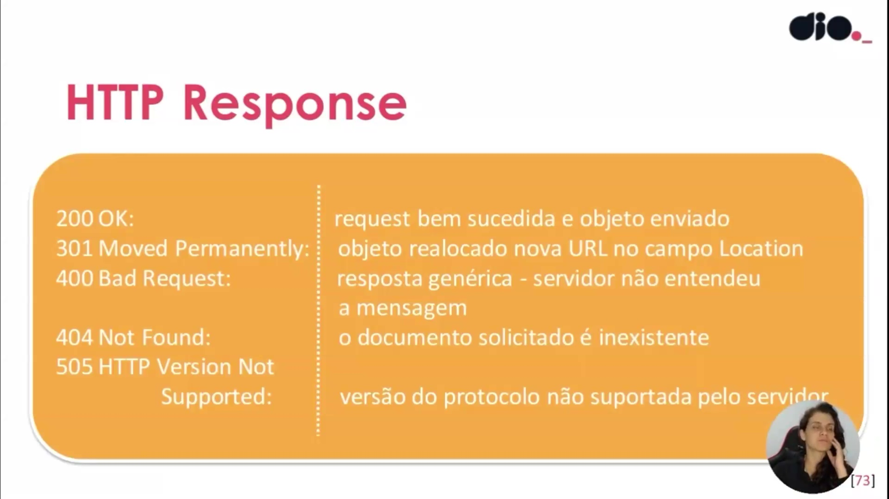
</p>

Exemplos usuais dos códigos de status e seus significados reais. Os códigos padronizados cobrem situações de êxito pleno (`200 OK`), avisos de que o recurso mudou de lugar (`301 Moved Permanently`), anomalias nas requisições do lado do cliente (`400 Bad Request` e `404 Not Found`) e problemas ou incompatibilidades nos servidores (`505 HTTP Version Not Supported`).

<p align="center">
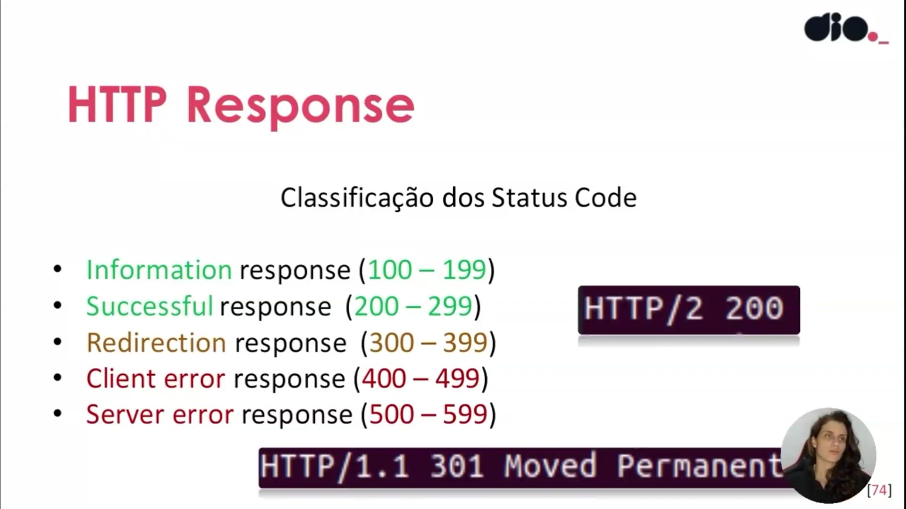
</p>

Agrupamento e classificação dos códigos de status por famílias baseadas no dígito inicial. Códigos de 100-199 são apenas informativos; 200-299 refletem sucesso; 300-399 sinalizam redirecionamento; 400-499 representam erros atrelados a pedidos mal formulados pelo cliente; 500-599 indicam falhas críticas de processamento pelo servidor.

<p align="center">
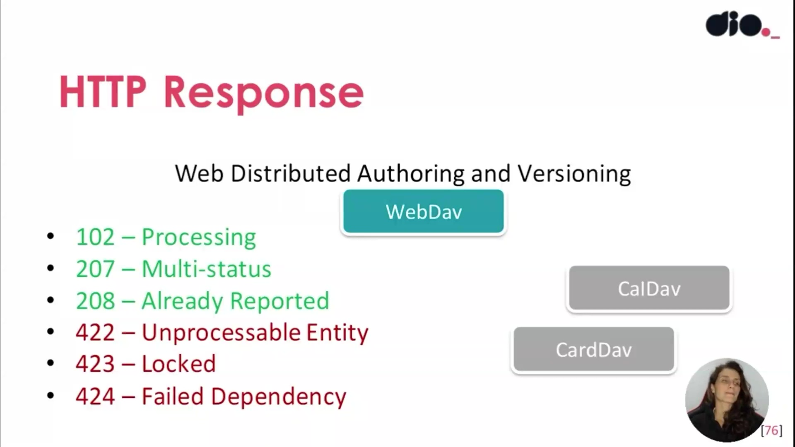
</p>

Introdução à extensão WebDAV (*Web Distributed Authoring and Versioning*), desenhada sobre o HTTP. Para acomodar necessidades complexas de gerenciamento de arquivos remotos, o WebDAV utiliza códigos de status estendidos, como *102 Processing* para tempo de espera e *423 Locked* ou *424 Failed Dependency* para gestão de falhas em edições colaborativas simultâneas.

<p align="center">
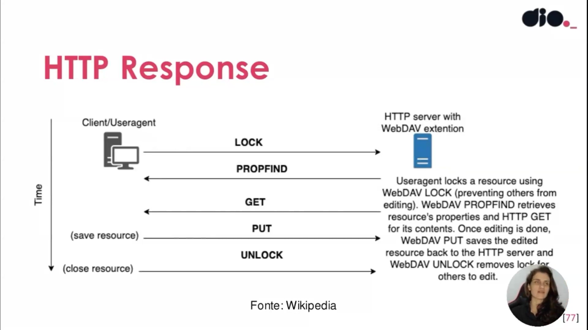
</p>

Diagrama de interação ilustrando o fluxo seguro de autoria em redes através do WebDAV. Um cliente trava um documento (LOCK) para evitar sobreposições de edição, consulta metadados adicionais (PROPFIND), baixa o conteúdo original (GET), aplica atualizações (PUT) e, finalmente, destrava o arquivo (UNLOCK) para torná-lo disponível aos demais usuários do servidor.

<p align="center">
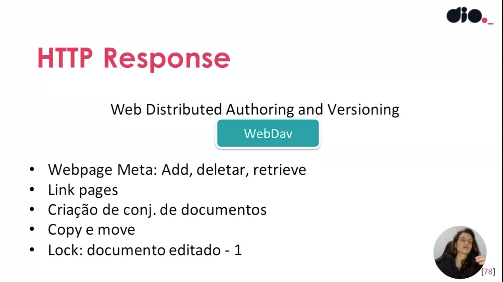
</p>

Resumo das principais capacidades (features) agregadas pelo WebDAV. Ele permite que as páginas web sirvam mais ativamente como repositórios read/write centralizados, viabilizando operações diretas de adicionar, deletar, copiar e mover conjuntos inteiros de documentos, sempre acompanhado de um sistema de trancas (lock) robusto para controle de edições concorrentes.

<p align="center">
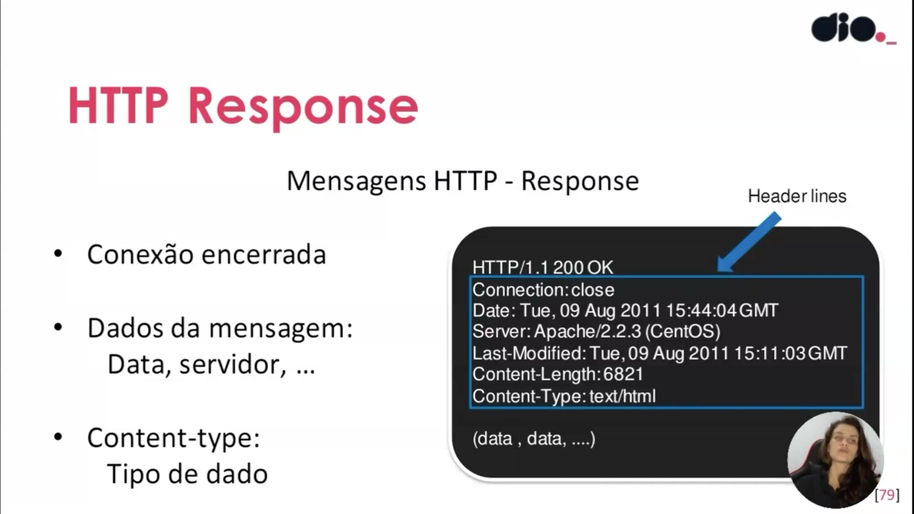
</p>

Inspeção detalhada de metadados transportados dentro das **Header lines** da resposta HTTP. Observam-se campos responsáveis pelo gerenciamento da continuidade do fluxo (a decisão da **Conexão encerrada** após o recebimento), atributos de tempo vitais para armazenamento e cache (a **Data** de requisição e última modificação) e o controle específico sobre a formatação do conteúdo da mensagem (como o **Tipo de dado** HTML).

<p align="center">
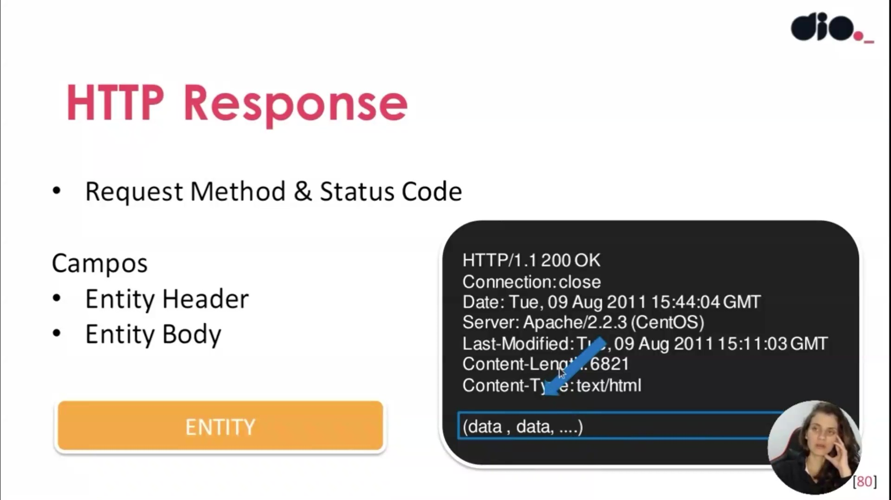
</p>

Separação semântica entre cabeçalhos de controle e cabeçalhos voltados para a "Entidade" (*Entity*). Os campos localizados na parte inferior dos headers em conjunto com o conteúdo final enviado (o payload) constituem essa entidade, separando-se estruturalmente da linha de status primária ou cabeçalhos de rede puramente sistêmicos.

<p align="center">
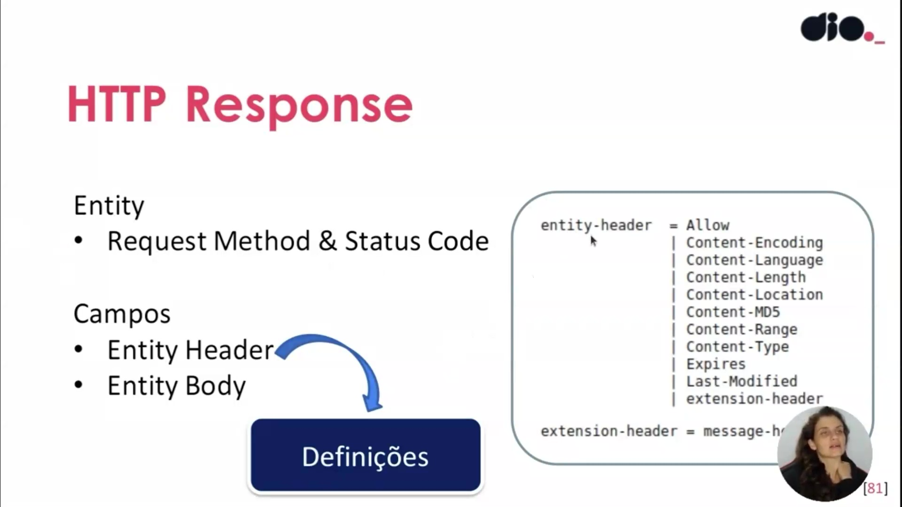
</p>

Levantamento técnico das definições atreladas exclusivamente ao **Entity Header**. Elementos como `Content-Encoding`, `Content-Length`, limites expiatórios (`Expires`) ou assinaturas numéricas para validação de dados limpos (`Content-MD5`) figuram como instâncias projetadas especialmente para detalhar as características restritas do recurso encapsulado.

<p align="center">
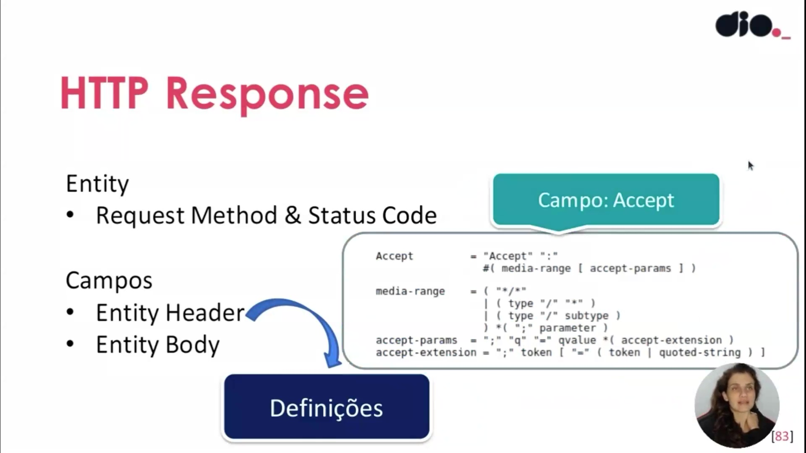
</p>

Aprofundamento na sintaxe e nas formalizações do parâmetro de cabeçalho especial **Accept**. A especificação permite ditar os níveis estruturados de exigência e suporte dos tipos MIME entre as partes (ex: `type/subtype`), facilitando um controle rígido do que exatamente uma aplicação remota é programada para ler com tolerância.

```http
Accept           = "Accept" ":"
                   #( media-range [ accept-params ] )
media-range      = ( "*/*"
                   | ( type "/" "*" )
                   | ( type "/" subtype )
                   ) *( ";" parameter )
accept-params    = ";" "q" "=" qvalue *( accept-extension )
accept-extension = ";" token [ "=" ( token | quoted-string ) ]

```

<p align="center">
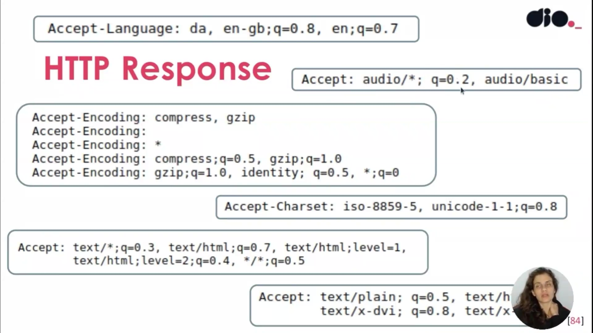
</p>

Múltiplas aplicações do campo *Accept*, explorando a flexibilidade de preferências numéricas qualitativas (*q-values*). Diferentes instâncias expõem desde requisições de idiomas combinados (`Accept-Language`), preferência por métodos restritivos de compressão gzip (`Accept-Encoding`), mapeamento de codificação para caracteres Unicode (`Accept-Charset`) e pesos priorizados por formatações específicas em multimídia e texto.

<p align="center">
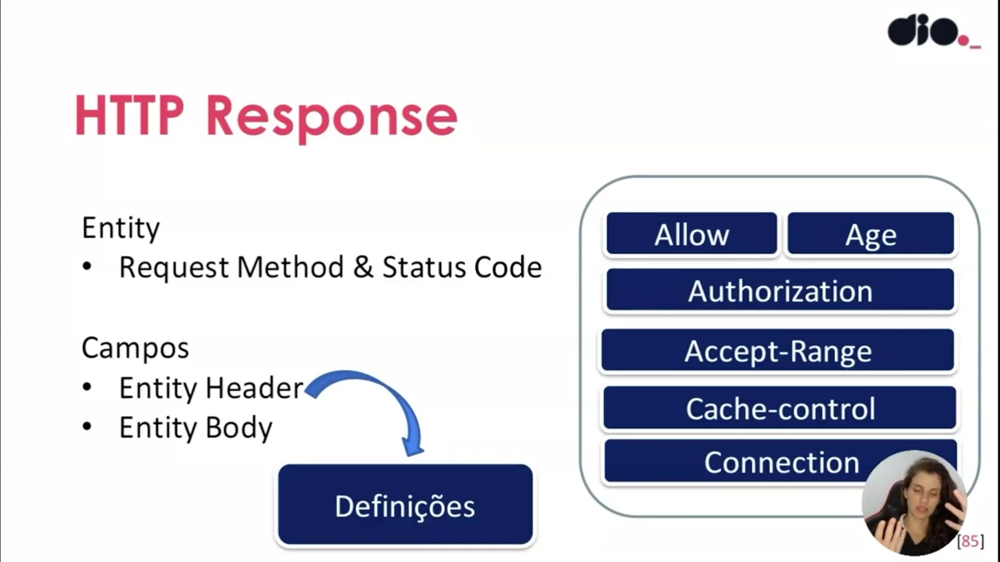
</p>

Ampliação do leque de definições de cabeçalhos de controle logísticos além do conteúdo. Parâmetros como `Authorization` definem chaves credenciais operacionais, enquanto conjuntos envolvendo a restrição de armazenamento `Cache-Control`, tolerâncias etárias dinâmicas `Age` e delimitações restritas `Allow` regulam efetivamente o tratamento sistêmico periférico à entrega do arquivo web em si.

<p align="center">
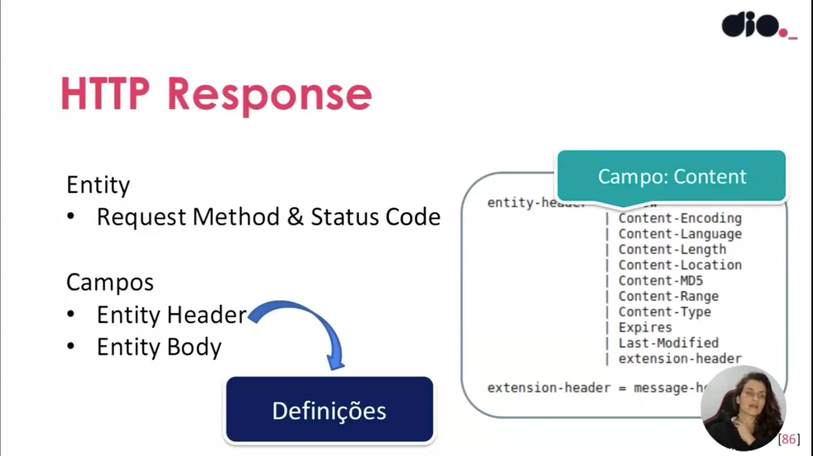
</p>

Evidência agrupada dos atributos restritos da família **Content** para validação estrita do *Entity*. Destaca-se como todo o agrupamento que se inicia com o prefixo "Content-" — como `Content-Type`, `Content-Language` e `Content-Length` — age de maneira interligada para informar, formatar, validar integridade e processar localmente o pacote massivo contendo a essência da comunicação.      

### 🟩 Vídeo 04 - Para que servem os Cookies e Cache?

<video width="60%" controls>
  <source src="000-Midia_e_Anexos/bootcamp_tqi_fullstack-modulo.07-curso.01-video_04.webm" type="video/webm">
    Seu navegador não suporta vídeo HTML5.
</video>

link do vídeo: https://web.dio.me/track/tqi-fullstack-developer/course/principais-protocolos-de-comunicacao-da-internet/learning/23702386-8fc9-42cb-8f11-8268d18117c2?autoplay=1

Este resumo explora como o protocolo HTTP gerencia a identificação de usuários e a eficiência na transferência de dados através de cookies e mecanismos de cache.

### Anotações

<p align="center">
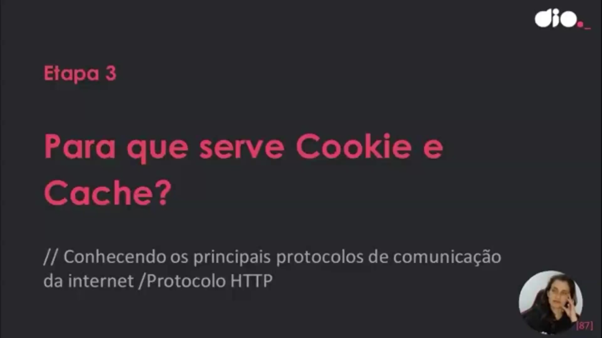
</p>

O estudo foca no papel dos cookies e do cache no contexto das redes, iniciando pela compreensão do Protocolo HTTP, que é a base da comunicação na internet.

<p align="center">
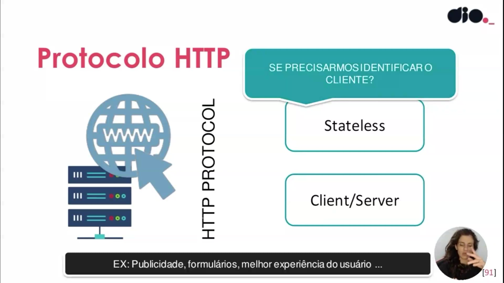
</p>

O protocolo HTTP opera no modelo cliente-servidor e possui a característica de ser *stateless*, ou seja, não guarda o estado ou as informações do cliente. Embora isso traga vantagens de performance e economia de recursos para o servidor, existem diversos cenários onde identificar o cliente é essencial, como para exibição de publicidade direcionada, preenchimento de formulários ou para proporcionar uma melhor experiência de usuário.

<p align="center">
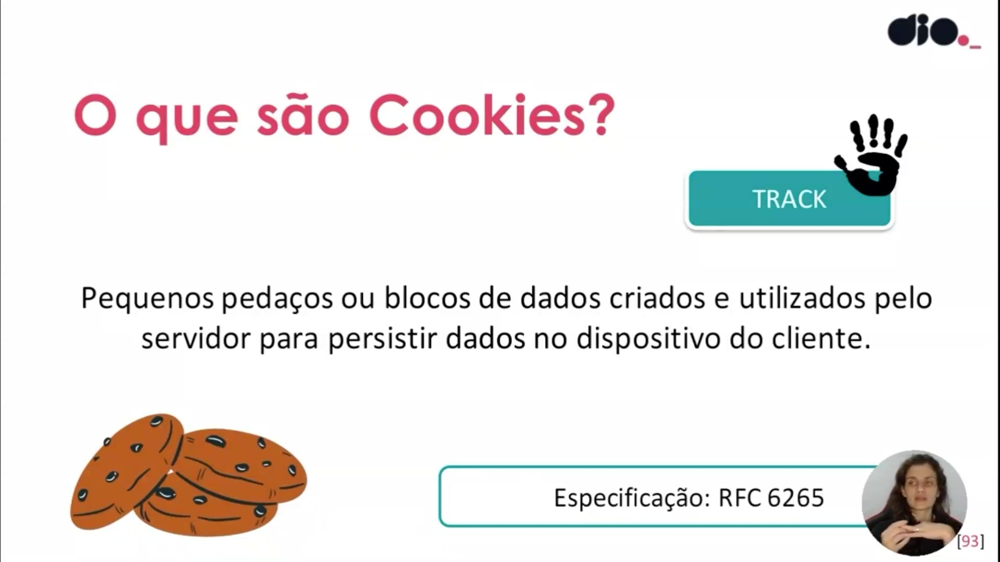
</p>

Para resolver a necessidade de identificação em um protocolo *stateless*, utilizam-se os cookies. O objetivo de um cookie é rastrear (*track*) as informações do cliente. Eles consistem em pequenos blocos de dados criados e utilizados pelo servidor para persistir essas informações no dispositivo do usuário. O padrão técnico oficial que normatiza e especifica o funcionamento dos cookies é a RFC 6265.

<p align="center">
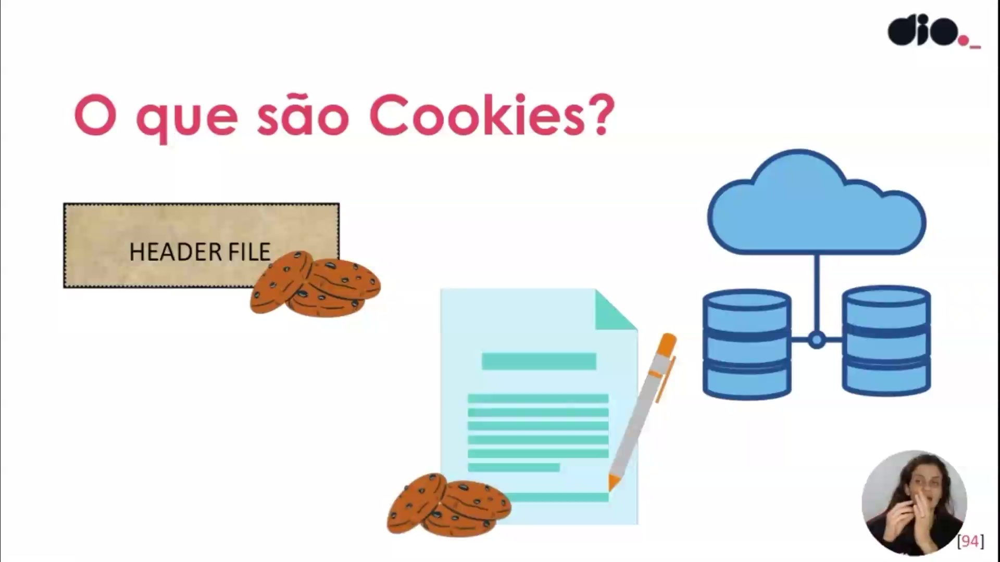
</p>

Esses cookies não trafegam de forma isolada; eles estão presentes dentro do cabeçalho das mensagens HTTP (*Header File*). Dessa forma, tanto as requisições quanto as respostas podem carregar informações de cookies para atualizar o arquivo local no cliente ou o banco de dados no servidor.

<p align="center">
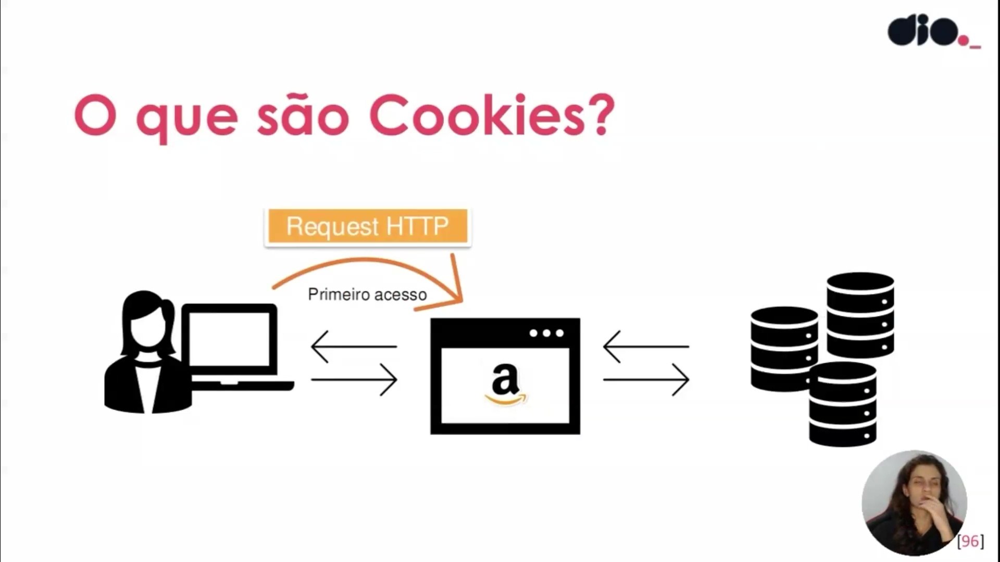
</p>

Na prática, a comunicação baseada em cookies inicia-se com uma requisição HTTP padrão. Quando ocorre o primeiro acesso de um cliente a um site (como uma loja virtual, por exemplo), a solicitação chega até o servidor web correspondente.

<p align="center">
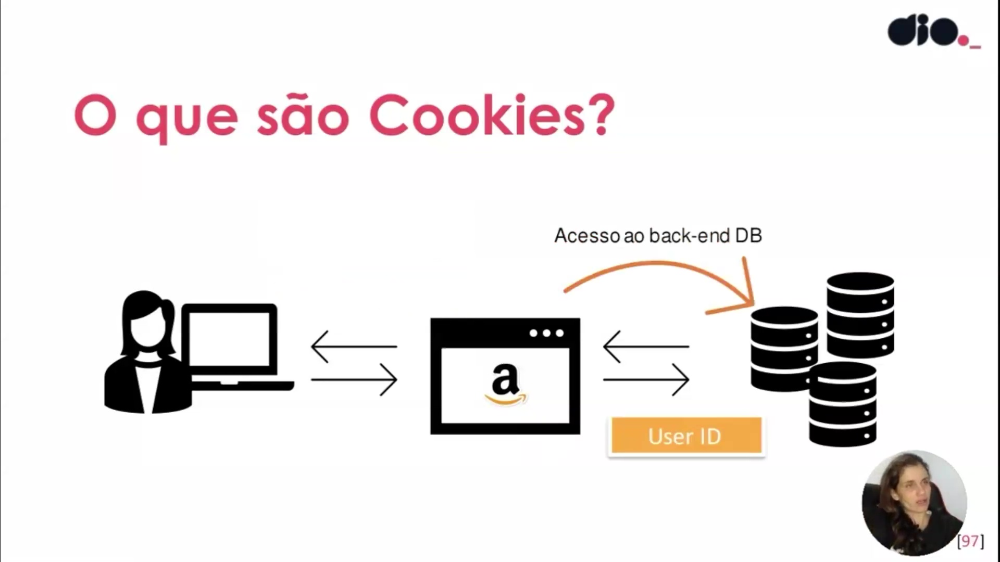
</p>

Ao receber essa requisição, o servidor consulta o seu banco de dados (*back-end DB*) para verificar se já existe um identificador (*User ID*) associado àquele usuário na base de registros.

<p align="center">
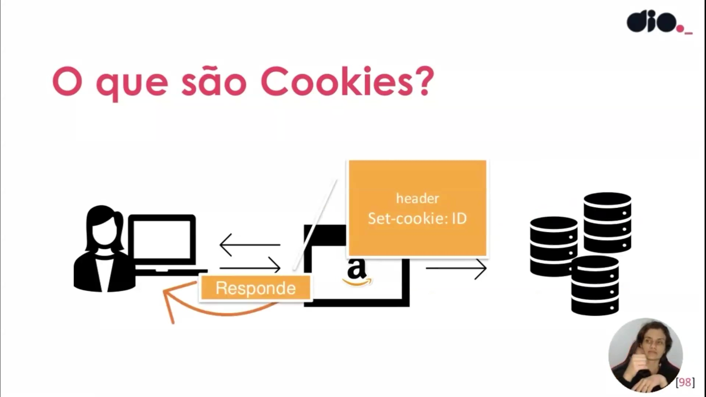
</p>

Como se trata de um primeiro acesso e o identificador ainda não existe na máquina do cliente, o servidor responde enviando uma instrução no cabeçalho HTTP de resposta (`Set-cookie: ID`). Essa instrução comanda o navegador do usuário a salvar esse identificador gerado.

<p align="center">
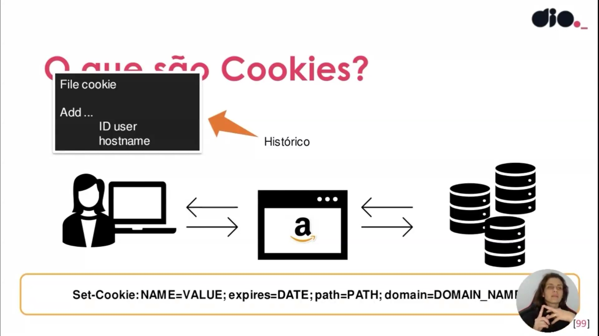
</p>

O navegador do cliente recebe essa instrução e armazena os dados em um arquivo local (*File cookie*), associado ao histórico de navegação. A estrutura técnica enviada pelo servidor para configurar o cookie segue um formato específico que define nome, data de expiração, caminho e domínio:

```http
Set-Cookie: NAME=VALUE; expires=DATE; path=PATH; domain=DOMAIN_NAME

```

<p align="center">
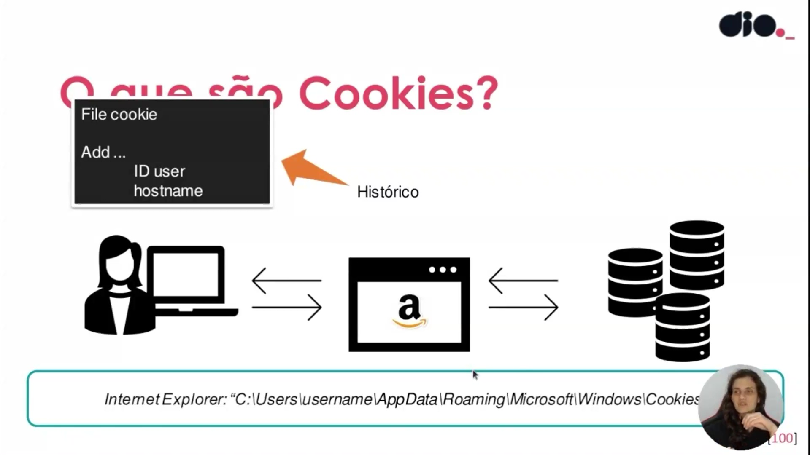
</p>

Esses arquivos de cookies são gravados fisicamente na estrutura de diretórios do sistema operacional do cliente. Um exemplo de caminho clássico de armazenamento no Windows (utilizando o Internet Explorer) seria:

```text
C:\Users\username\AppData\Roaming\Microsoft\Windows\Cookies

```

<p align="center">
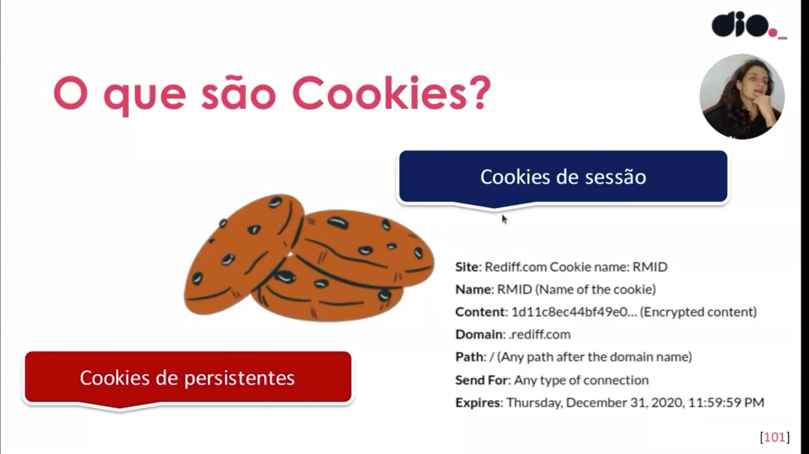
</p>

Existem dois tipos principais de cookies: os **cookies de sessão**, que são mantidos apenas na memória e deletados assim que o navegador é fechado; e os **cookies persistentes**, que permanecem salvos no computador por longos períodos (meses ou anos) até expirarem. Abaixo está um exemplo do conteúdo de um cookie persistente, contendo metadados detalhados da persistência:

```text
Site: Rediff.com Cookie name: RMID
Name: RMID (Name of the cookie)
Content: 1d11c8ec44bf49e0... (Encrypted content)
Domain: .rediff.com
Path: / (Any path after the domain name)
Send For: Any type of connection
Expires: Thursday, December 31, 2020, 11:59:59 PM

```

<p align="center">
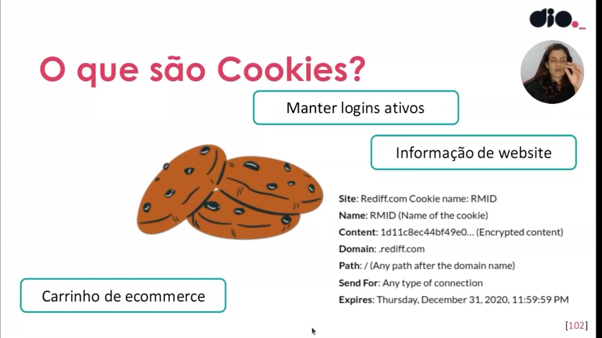
</p>

A utilização de cookies persistentes viabiliza recursos vitais para a navegação cotidiana, proporcionando comodidade ao usuário. Três aplicações clássicas incluem: a capacidade de manter logins ativos após fechar a página, o armazenamento de informações e configurações do website e a persistência dos itens em um carrinho de e-commerce.

<p align="center">
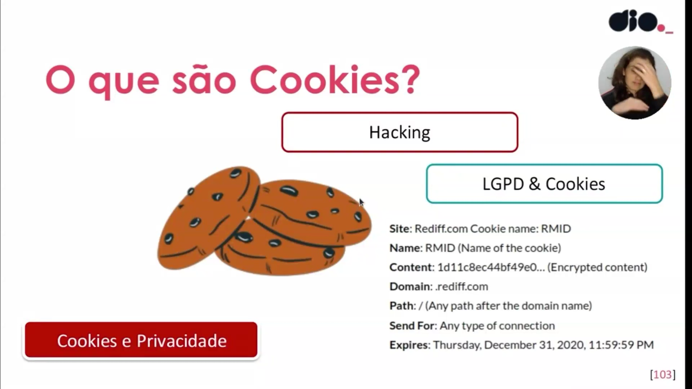
</p>

Contudo, os cookies levantam questões críticas em relação à privacidade e à segurança. Devido à natureza invasiva do rastreamento do perfil de navegação, legislações como a **LGPD** passaram a exigir o consentimento explícito dos usuários. Adicionalmente, há riscos de **Hacking**: invasores que comprometem a máquina do cliente podem utilizar cookies válidos para roubar acessos autenticados e executar ataques maliciosos.

<p align="center">
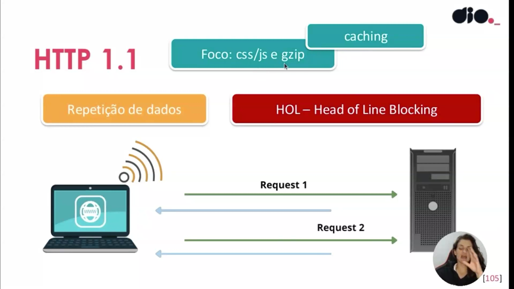
</p>

Partindo para as estratégias de otimização no protocolo HTTP 1.1, observa-se o esforço para contornar problemas como a repetição constante de dados transferidos e gargalos como o bloqueio sequencial de pacotes (*HOL - Head of Line Blocking*). Soluções de eficiência envolvem minimizar o tamanho de arquivos estruturais (focando em CSS, JS e compressão gzip) e aplicar técnicas de **caching**.

<p align="center">
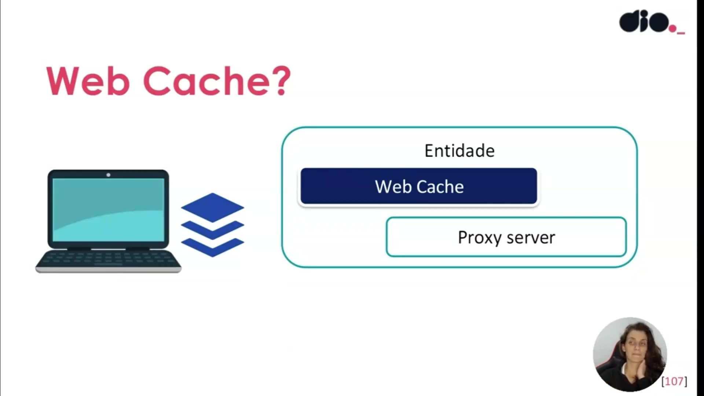
</p>

A implementação técnica do cache ocorre muitas vezes por meio de um **Web Cache**, estruturado sobre um servidor intermediário chamado **Proxy server**. Essa entidade posiciona-se entre o cliente e o servidor de destino, gerenciando a guarda temporária e a entrega de recursos recorrentes.

<p align="center">
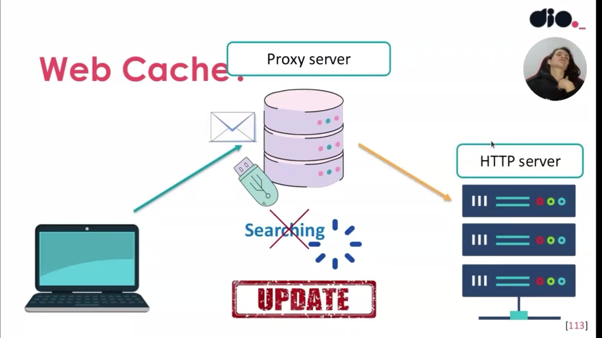
</p>

Quando o cliente realiza uma requisição, ela é interceptada primeiramente pelo Proxy Server. Ele executa uma busca local (*Searching*) em seu armazenamento para verificar se possui a informação solicitada. Se não a possuir (ou se o dado estiver obsoleto), o proxy abre uma nova conexão e aciona o Servidor HTTP para buscar o recurso, realizando em seguida a atualização (*UPDATE*) no seu próprio armazenamento antes de entregá-lo ao cliente.

<p align="center">
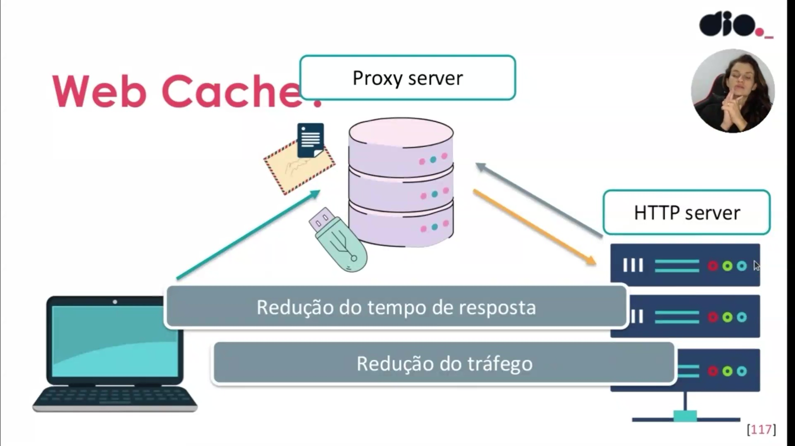
</p>

O uso do Proxy Server para Web Cache resulta em dois grandes ganhos de infraestrutura: a **redução do tempo de resposta** (uma vez que o proxy geralmente encontra-se numa rota física e lógica mais curta até o cliente) e a **redução do tráfego** (já que as requisições recorrentes não precisam mais atravessar todos os nós da rede até o servidor primário, economizando largura de banda).

<p align="center">
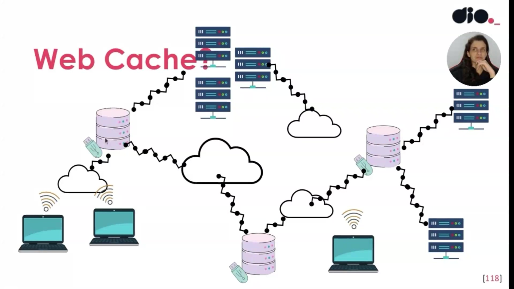
</p>

Em sistemas robustos, a internet emprega topologias de **caches distribuídos**. Nessa arquitetura, múltiplos Web Caches operam de forma interligada e são alocados de maneira estratégica por regiões ou provedores. Isso garante que o conteúdo esteja sempre o mais próximo possível das bordas da rede, minimizando drasticamente a latência e aprofundando os benefícios de economia de tráfego.      


### 🟩 Vídeo 05 - HTTP 2.0 - Atualizações do protocolo

<video width="60%" controls>
  <source src="000-Midia_e_Anexos/bootcamp_tqi_fullstack-modulo.07-curso.01-video_05.webm" type="video/webm">
    Seu navegador não suporta vídeo HTML5.
</video>

link do vídeo: https://web.dio.me/track/tqi-fullstack-developer/course/principais-protocolos-de-comunicacao-da-internet/learning/a6040244-48ba-4539-bc00-02b93f7ec71f?autoplay=1

Este guia explora as principais mudanças e melhorias introduzidas pelo HTTP 2.0 em relação à versão 1.1, focando em como essas atualizações otimizam a comunicação entre cliente e servidor, reduzem a latência e melhoram a experiência do usuário.

### Anotações

<p align="center">
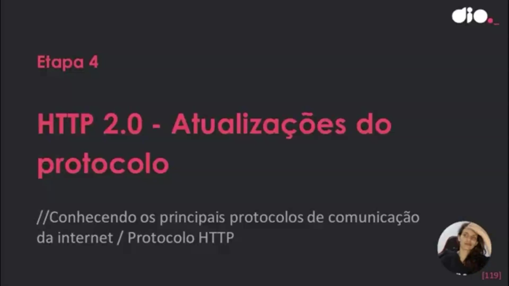
</p>

O ponto de partida para entender o HTTP/2.0 é revisitar as limitações críticas da versão 1.1. O principal vilão aqui é o **Head-of-line (HOL) blocking**, um fenômeno onde uma única requisição lenta ou pesada "tranca" a fila, impedindo que o cliente realize novas solicitações até receber a resposta anterior. Além disso, o HTTP/1.1 sofre com o overhead de abrir múltiplas conexões TCP paralelas para tentar mitigar essa lentidão, o que consome recursos desnecessários.

<p align="center">
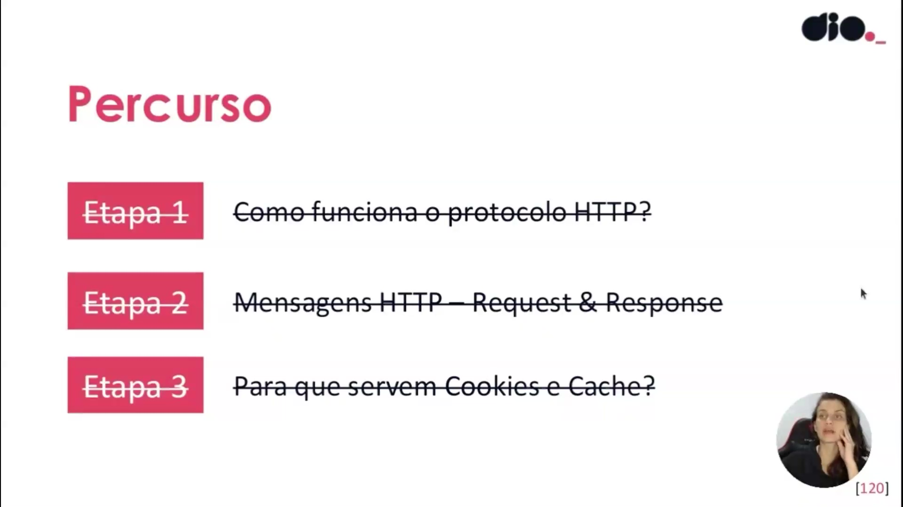
</p>

A grande virada do HTTP/2.0 é o estabelecimento de uma **única conexão persistente** entre o cliente e o servidor. Diferente do `keep-alive` do 1.1, que apenas mantinha o canal aberto para requisições sequenciais, o 2.0 introduz o conceito de **streams**. Dentro dessa conexão única, as requisições são enviadas de forma independente, permitindo que as respostas cheguem em ordens diferentes, sem que uma trave a outra.

<p align="center">
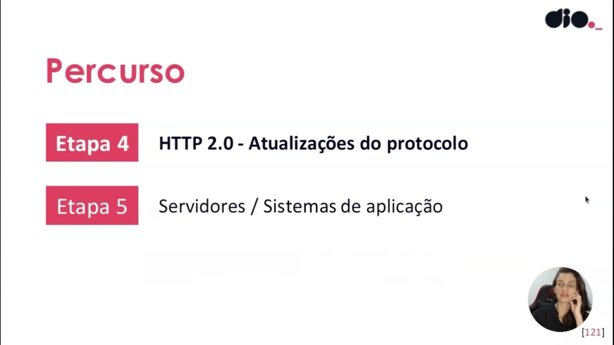
</p>

Este modelo de comunicação baseia-se na **multiplexação de canais**. As requisições são segmentadas em frames e tratadas como streams distintos dentro do mesmo túnel TCP. Isso significa que o servidor pode intercalar pedaços de um arquivo de imagem com pedaços de um arquivo CSS, otimizando o uso da largura de banda e garantindo que recursos menores não fiquem presos atrás de objetos gigantescos.

<p align="center">

</p>

Um recurso extremamente elegante para o desenvolvedor é a **priorização de recursos via pesos**. Ao carregar uma página, o cliente pode informar ao servidor quais objetos são mais relevantes. Por exemplo, você pode configurar para que o menu de navegação (barra fixa) receba um peso maior e seja carregado antes do conteúdo do rodapé. Isso permite criar uma experiência de usuário (UX) muito mais fluida, entregando o que é visualmente crítico primeiro.

<p align="center">
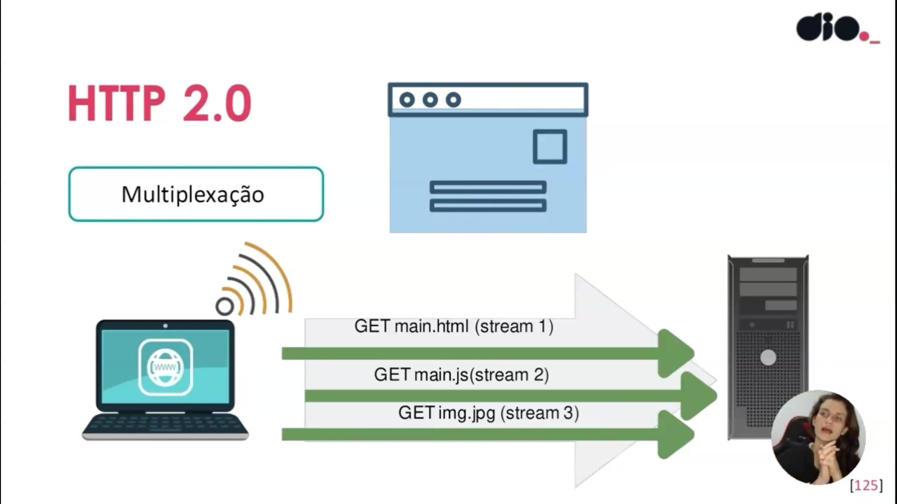
</p>

Para entender a mudança técnica, observe o formato padrão de uma requisição no HTTP/1.1. Ele é baseado em texto (ASCII) e estruturado em três blocos principais:

```http
GET /index.html HTTP/1.1          <-- Request Line
Host: www.exemplo.com.br          <-- Header Lines
User-Agent: Mozilla/5.0
...
(Linha em branco)
[Corpo da mensagem opcional]      <-- Entity Body
```

No 1.1, os cabeçalhos (Headers) são enviados integralmente em toda requisição, o que gera um overhead considerável, especialmente em aplicações modernas com muitos cookies e metadados.

<p align="center">
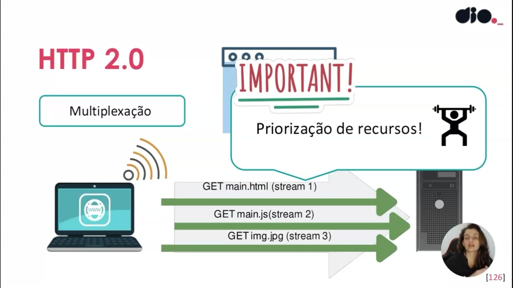
</p>

No HTTP/2.0, essa estrutura muda para uma **Camada de Frame Binário**. Em vez de texto puro, a mensagem é dividida em frames de **Header** e frames de **Data**. Cada frame recebe um ID de stream. Essa segmentação binária é o que permite a multiplexação e a compressão eficiente, tornando o protocolo muito mais "compreensível" e rápido para as máquinas processarem.

<p align="center">
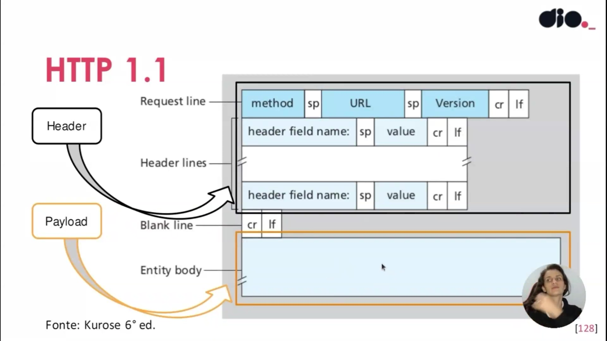
</p>

Além da segmentação, o 2.0 introduz a **compressão de cabeçalho (HPACK)**. Frequentemente, várias requisições para o mesmo servidor possuem cabeçalhos idênticos. O protocolo agora permite reutilizar esses dados: o servidor armazena o cabeçalho enviado anteriormente e o cliente só precisa referenciar o ID daquele Header para os próximos pacotes. É uma lógica similar à reutilização de código por funções; você não precisa reescrever (ou reenviar) tudo novamente.

<p align="center">
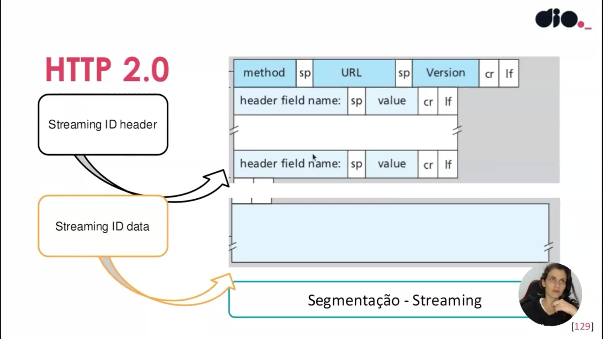
</p>

Outra funcionalidade poderosa é o **Server Push**. Imagine que o cliente pede o `index.html`. O servidor, sabendo que para renderizar essa página o cliente precisará inevitavelmente de um `style.css` e de um `script.js`, antecipa-se e "empurra" esses arquivos para o cache do cliente antes mesmo de serem solicitados. Isso economiza o tempo de ida e volta (RTT) das requisições subsequentes.

<p align="center">
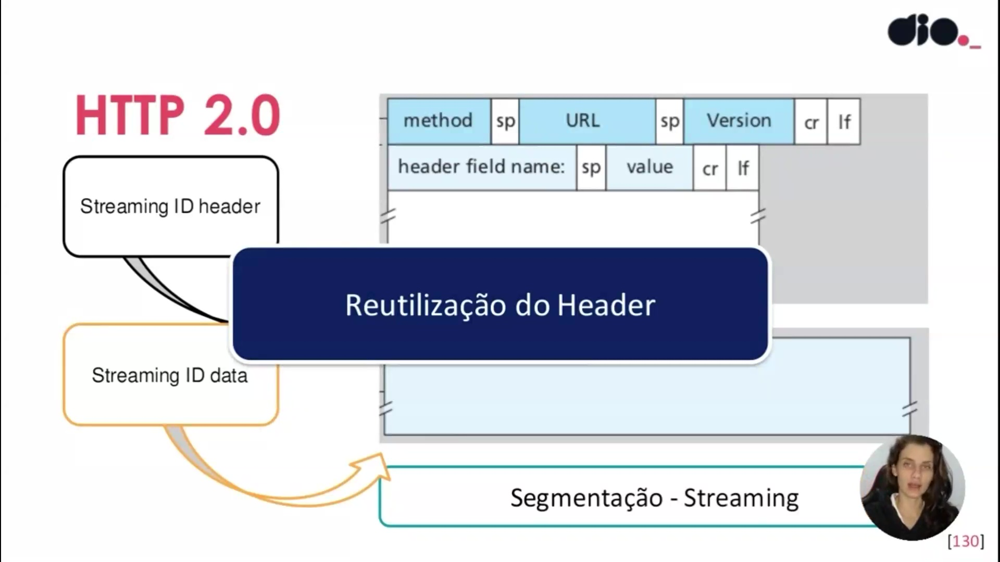
</p>

Apesar de ser uma vantagem incrível para a performance, o **Server Push** exige cautela. Ele não vem habilitado por padrão e requer configuração tanto no servidor quanto no suporte do cliente. Se o cliente não estiver preparado para receber esse "empurrão" de dados não solicitados, a comunicação pode falhar. O ganho aqui é a economia de processamento no cliente e de largura de banda que seria gasta com novos headers de requisição.

<p align="center">
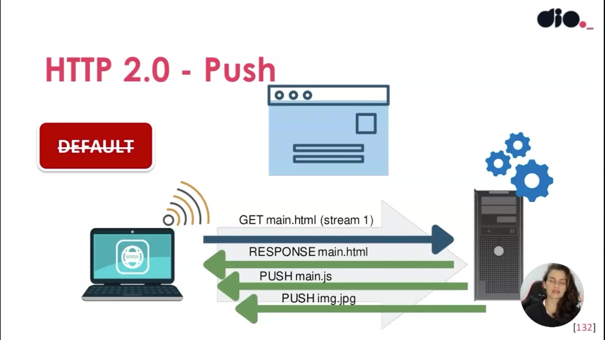
</p>

| Característica | HTTP/1.1 | HTTP/2.0 |
| --- | --- | --- |
| **Conexões** | Múltiplas conexões paralelas | Única conexão persistente (Streams) |
| **Cabeçalhos** | Texto plano, sem compressão (Overhead) | Compressão e Reutilização (HPACK) |
| **Envio de Dados** | Sequencial (sujeito a HOL Blocking) | Multiplexado (Independente) |
| **Iniciativa** | Sempre do Cliente | Suporte a Server Push |
| **Segurança** | TLS Opcional | HTTPS (TLS) como padrão de mercado |

<p align="center">
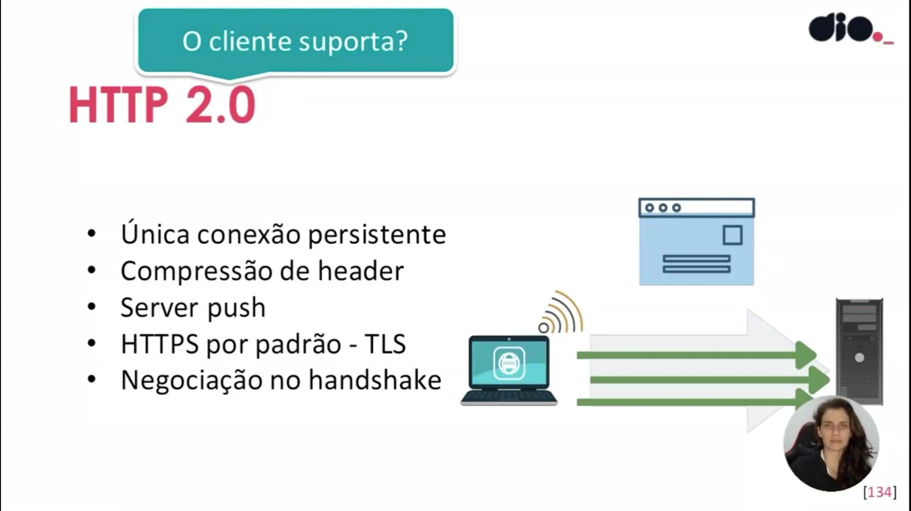
</p>

Como o cliente sabe se deve usar o 2.0? A **negociação da versão** ocorre durante o *handshake* inicial. Ao estabelecer a conexão, o servidor informa as versões que suporta. Se o cliente também suportar o 2.0, eles fecham o acordo e passam a utilizar as novas funcionalidades. Caso contrário, ocorre o *fallback* para a versão 1.1, garantindo que a comunicação não seja interrompida, mesmo em navegadores antigos.

<p align="center">
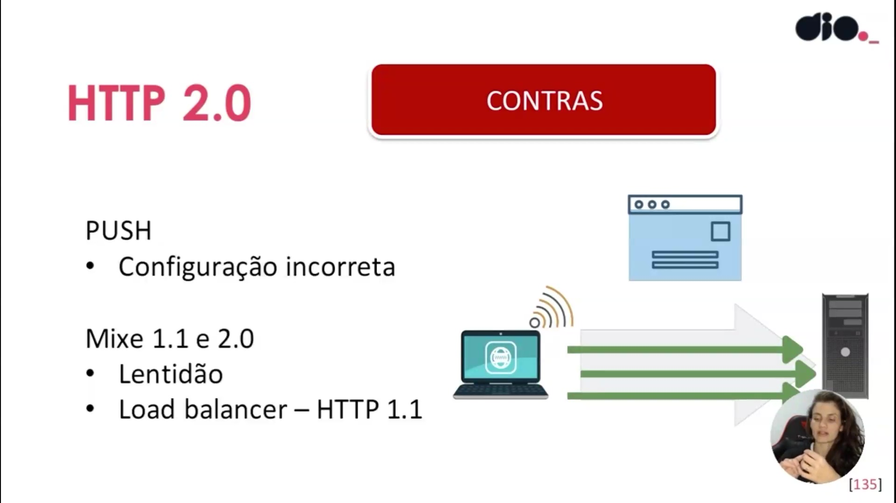
</p>

Nem tudo são flores: o HTTP/2.0 também possui seus pontos de atenção. Se o **Server Push** for configurado de maneira equivocada, ele pode desperdiçar banda enviando recursos que o cliente já possui em cache. Ambientes com um mix de versões (1.1 e 2.0) podem sofrer latências inesperadas. Além disso, muitos **Load Balancers** legados ainda operam apenas com o 1.1, o que pode anular as vantagens do protocolo se houver um gargalo nesse intermediário.


### 🟩 Vídeo 06 - Servidores/Sistemas de aplicação

<video width="60%" controls>
  <source src="000-Midia_e_Anexos/bootcamp_tqi_fullstack-modulo.07-curso.01-video_06.webm" type="video/webm">
    Seu navegador não suporta vídeo HTML5.
</video>

link do vídeo: https://web.dio.me/track/tqi-fullstack-developer/course/principais-protocolos-de-comunicacao-da-internet/learning/a4c70668-7b15-43a9-a7cd-6e5825fe278c?autoplay=1

Este guia explora os principais servidores HTTP do mercado (Apache, Nginx e XAMPP), suas características técnicas e como visualizar a comunicação entre cliente e servidor na prática utilizando a ferramenta Wireshark.

### Anotações

<p align="center">
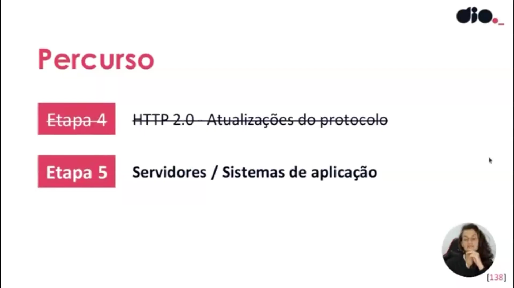
</p>

Introdução aos servidores e sistemas de aplicação no contexto da comunicação HTTP, destacando as atualizações do protocolo.

<p align="center">
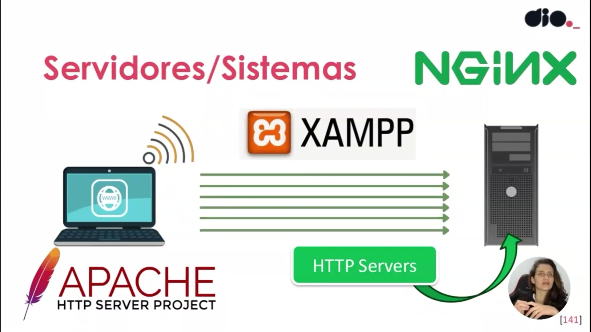
</p>

Visão geral da comunicação entre cliente e servidor, apresentando os principais servidores HTTP e pacotes de mercado abordados nesta etapa: o Apache, o NGINX e o ambiente XAMPP.
+3

<p align="center">
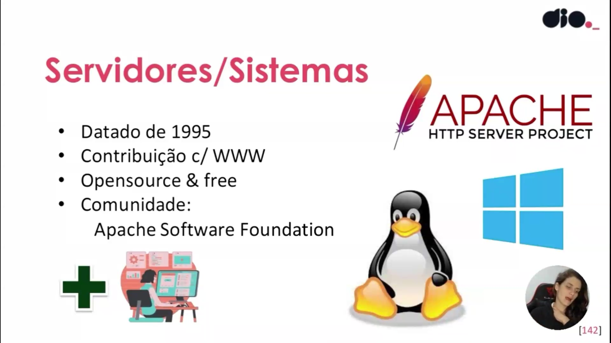
</p>

Características históricas e fundamentais do servidor Apache. O projeto foi criado em 1995 e contribuiu ativamente para o surgimento da World Wide Web (WWW). Trata-se de uma solução de código aberto (Open Source) e gratuita , mantida globalmente pela comunidade através da fundação Apache Software Foundation.
+2

<p align="center">
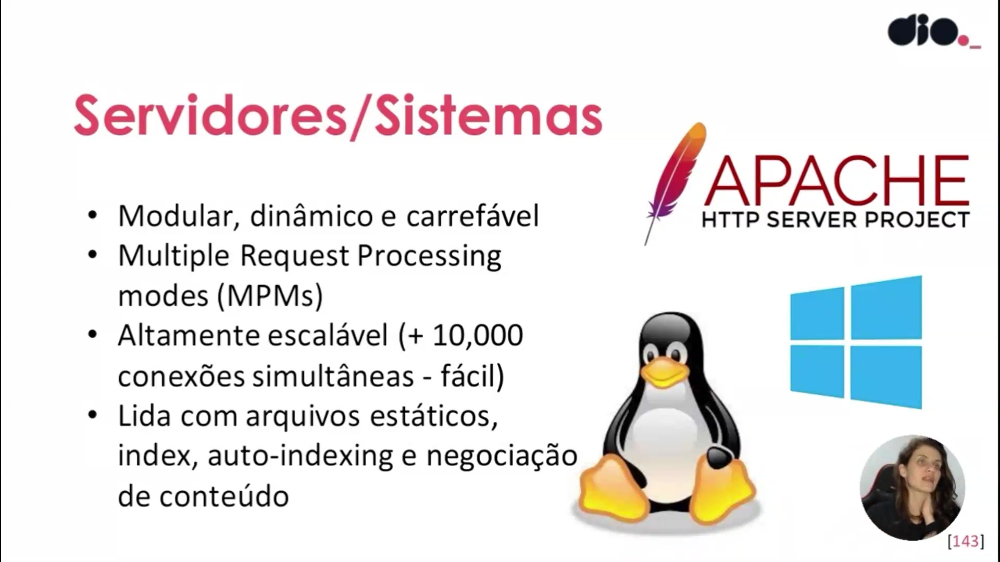
</p>

Detalhamento das capacidades técnicas do Apache. O servidor possui arquitetura modular, dinâmica e carregável, permitindo o uso exclusivo dos recursos necessários. Ele suporta múltiplos modos de processamento de requisições (MPMs) e é altamente escalável, lidando facilmente com mais de 10.000 conexões simultâneas. Além disso, processa nativamente arquivos estáticos, indexação automática e negociação de conteúdo.
+1

<p align="center">
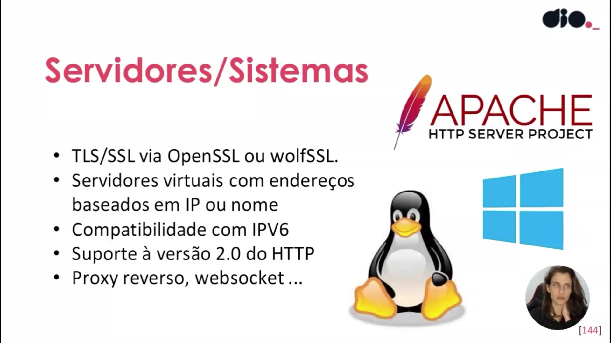
</p>

Recursos avançados de conectividade e segurança do Apache. O servidor suporta criptografia TLS/SSL através de bibliotecas como OpenSSL ou wolfSSL. É possível configurar servidores virtuais baseados em nome ou endereço IP. O sistema garante total compatibilidade com o protocolo IPv6 , suporta a versão 2.0 do HTTP e pode atuar operando proxy reverso e conexões WebSocket.
+4

<p align="center">
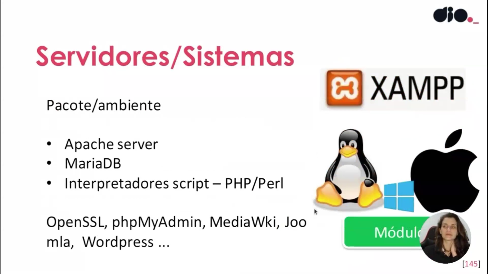
</p>

Apresentação do XAMPP, um pacote de desenvolvimento cruzado compatível com Linux, Windows e macOS. Ele agrupa diversas ferramentas e vem pré-configurado com o Apache Server , o banco de dados MariaDB e interpretadores de script para as linguagens PHP e Perl. O ambiente também disponibiliza diversos módulos prontos, como OpenSSL, phpMyAdmin, MediaWiki, Joomla e WordPress.
+4

<p align="center">
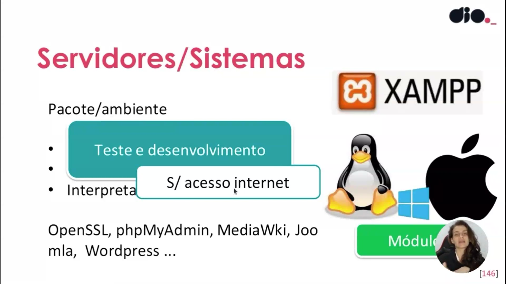
</p>

O foco de utilização do ambiente XAMPP. Por vir com uma série de parâmetros de segurança desabilitados para facilitar o uso, ele é indicado exclusivamente para cenários de teste e desenvolvimento. O ambiente deve rodar preferencialmente em redes isoladas, sem acesso direto à internet, garantindo a segurança das aplicações.
+2

<p align="center">
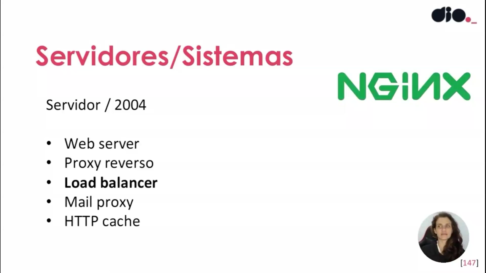
</p>

Introdução ao servidor NGINX , solução consolidada lançada em 2004. Ele possui múltiplas atuações, funcionando como um servidor web tradicional , proxy reverso , balanceador de carga (load balancer) , proxy de e-mail e oferecendo recursos robustos de cache HTTP.
+4

<p align="center">
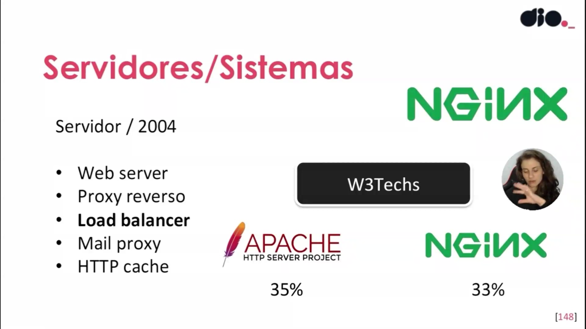
</p>

Comparativo da fatia de mercado entre os principais servidores, baseando-se em dados da W3Techs. Apesar da idade e consolidação, o Apache domina uma margem ligeiramente maior, com 35% de adoção. O NGINX, com adoção crescente, segue muito próximo, figurando em 33% dos ambientes pesquisados.
+4

<p align="center">
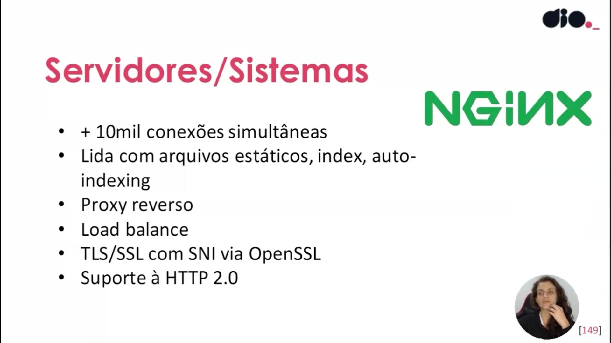
</p>

Principais especificações técnicas do servidor NGINX. Ele também é altamente escalável, suportando mais de 10.000 conexões simultâneas. A ferramenta lida nativamente com arquivos estáticos e auto-indexing , suporta configurações nativas de proxy reverso e load balance , além de integrar TLS/SSL com SNI via OpenSSL e ter suporte completo ao HTTP 2.0.
+4

<p align="center">
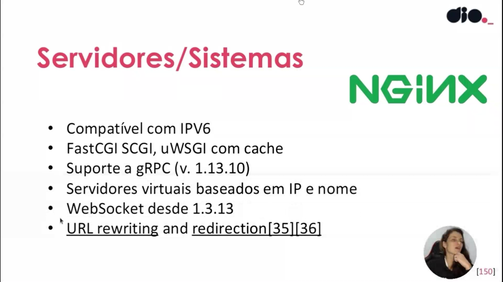
</p>

Continuação das características do NGINX. A solução traz compatibilidade integrada ao IPv6 e suporta protocolos focados em performance, como FastCGI, SCGI e uWSGI com mecanismos de cache. A ferramenta fornece compatibilidade ao gRPC, a criação de servidores virtuais baseados tanto em IP quanto em nome, além de disponibilizar suporte nativo a WebSocket e recursos avançados para reescrita (rewriting) e redirecionamento de URLs.

<p align="center">
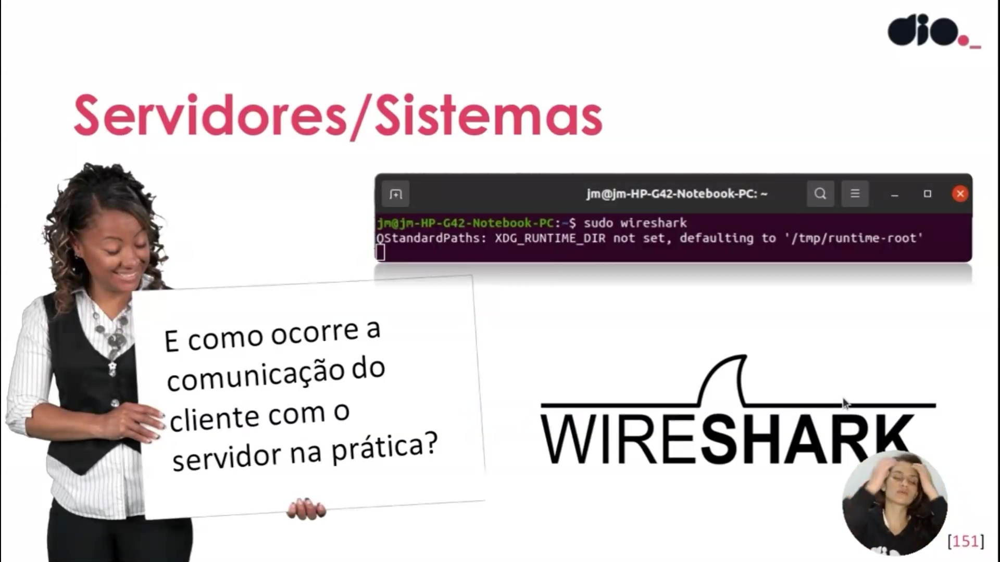
</p>

Transição para a análise prática da comunicação de rede. A captura do tráfego entre cliente e servidor será realizada através do analisador de protocolos Wireshark, que é iniciado via linha de comando no sistema Linux utilizando privilégios de administrador:

Bash
sudo wireshark
<p align="center">
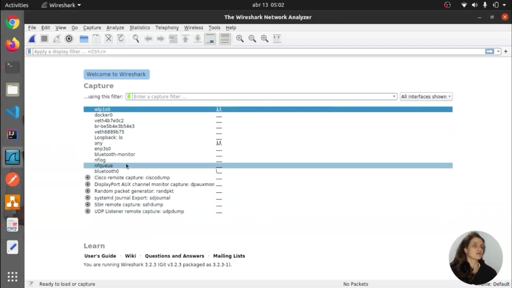
</p>

Tela inicial do Wireshark, exibindo a listagem de interfaces de rede ativas. É a partir desta listagem que se seleciona a interface desejada (no caso, a conexão sem fio wlp1s0) para dar início à escuta e captura dos pacotes em tempo real.

<p align="center">
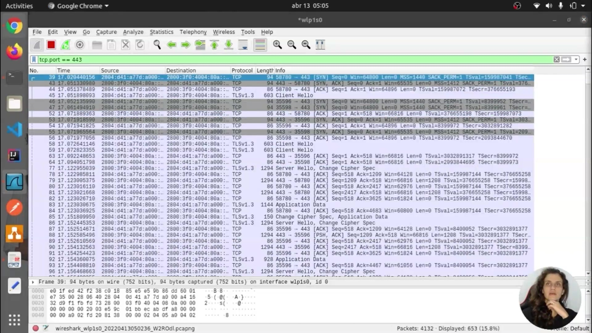
</p>

Visualização do tráfego de rede sendo analisado no Wireshark. Um filtro rápido de exibição foi aplicado utilizando a sintaxe tcp.port == 443, que permite visualizar exclusivamente a comunicação na porta padrão para tráfego seguro HTTP. Nota-se o estabelecimento das conexões via TCP e o envio dos pacotes TLS para o "handshake" criptográfico (como Client Hello e Server Hello).

<p align="center">
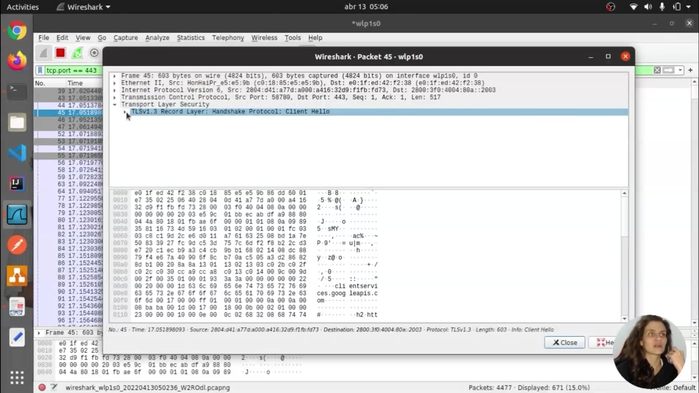
</p>

Inspeção direta da carga útil (payload) dentro do Wireshark. Ao analisar a camada de aplicação, constata-se que o encapsulamento dos dados pela camada de transporte segura (TLS) esconde as informações transacionadas. Devido à comunicação estar criptografada, o tráfego HTTP torna-se ilegível no detalhamento do analisador, exibindo apenas cadeias de dados não decifráveis sem a chave correspondente.      


## Parte 3 - HTTPS - O que muda no protocolo?

### 🟩 Vídeo 07 - Conceitos básicos de segurança da informação

<video width="60%" controls>
  <source src="000-Midia_e_Anexos/bootcamp_tqi_fullstack-modulo.07-curso.01-video_07.webm" type="video/webm">
    Seu navegador não suporta vídeo HTML5.
</video>

link do vídeo: https://web.dio.me/track/tqi-fullstack-developer/course/principais-protocolos-de-comunicacao-da-internet/learning/553ba1e1-67f6-451a-8b0d-c49a82edc8ea?autoplay=1

Este guia explora os fundamentos da segurança da informação, detalhando como a criptografia e os certificados digitais protegem a integridade e a confidencialidade dos dados na web.

### Anotações

<p align="center">
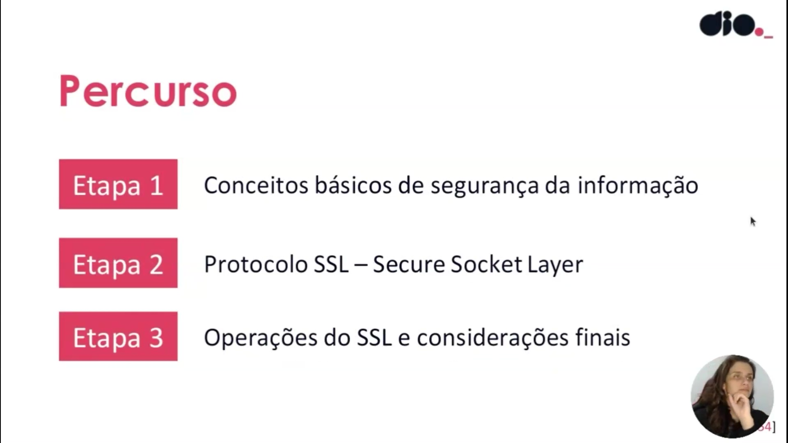
</p>

Nesta introdução, o foco recai sobre as mudanças que a criptografia impõe aos protocolos de comunicação. O objetivo é estabelecer uma base sólida em segurança da informação antes de aprofundar no protocolo SSL. A agenda apresentada define o caminho de aprendizado:

1. **Conceitos Básicos**: Criptografia por chave e certificados digitais.
2. **SSL (Secure Sockets Layer)**: O funcionamento do protocolo.
3. **Operações SSL e Considerações Finais**: Impacto no HTTP (HTTPS) e uma breve introdução à LGPD.

<p align="center">
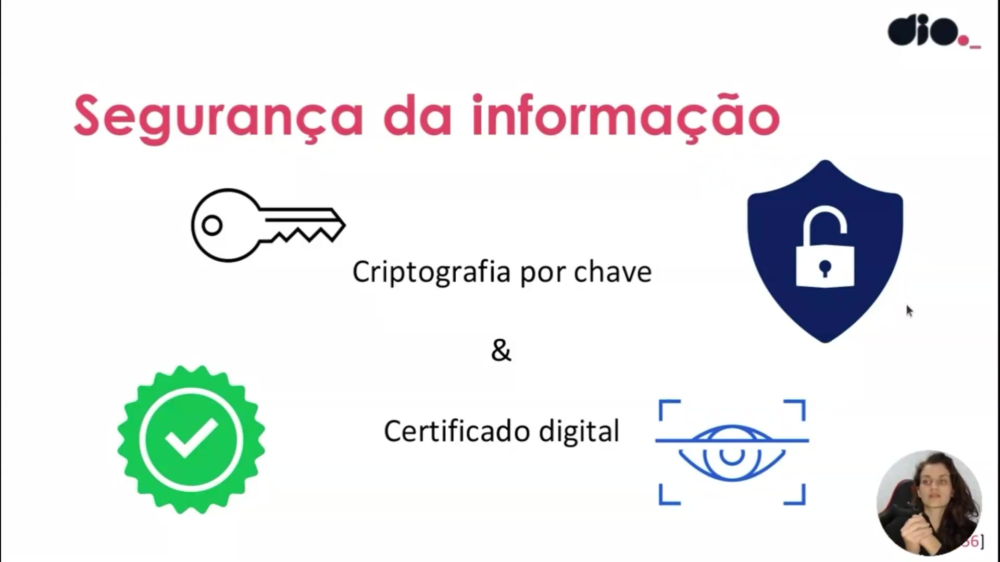
</p>

A criptografia por chave é apresentada como uma ferramenta para garantir a confidencialidade. Partindo de um arquivo de dados legível, utiliza-se uma cifra ou mapeamento para transformá-lo em um texto ilegível para quem não possui a chave. O acesso ao conteúdo original só é possível através da aplicação da chave correspondente para reverter o mapeamento.

<p align="center">
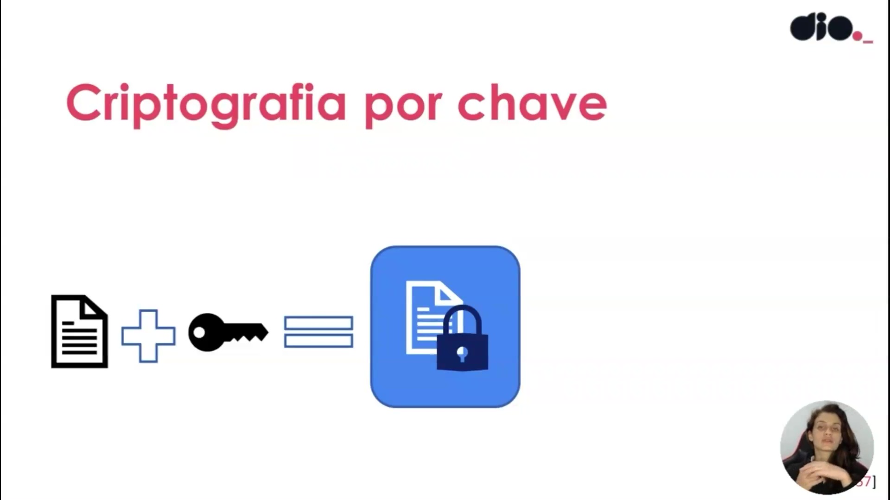
</p>

Existem duas categorias principais de criptografia baseada em chaves:

* **Criptografia Assimétrica**: Utiliza um par de chaves (pública e privada). A chave pública é usada para assinar ou criptografar, e apenas o detentor da chave privada correspondente pode descriptografar os dados.
* **Criptografia Simétrica**: Utiliza a mesma chave tanto para criptografar quanto para descriptografar. Este método exige que ambas as partes envolvidas conheçam a chave previamente.

<p align="center">
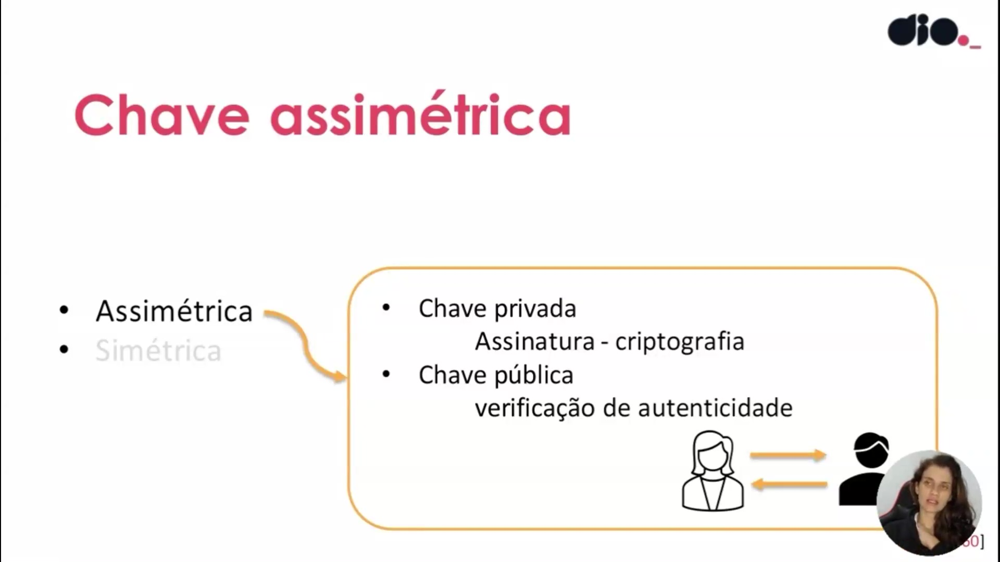
</p>

A **Cifra de César** é um exemplo clássico de criptografia simétrica. Ela opera através da substituição de cada letra por outra que se encontra $k$ posições adiante no alfabeto (rotatividade).

No exemplo visualizado, utiliza-se uma chave $k = 3$:

* **Texto Original**: `Bob, I love you, Alice`
* **Lógica**: A letra 'B' torna-se 'E' (B → C, D, E).
* **Resultado**: O mapeamento altera a frase para uma forma não inteligível à primeira vista.

<p align="center">
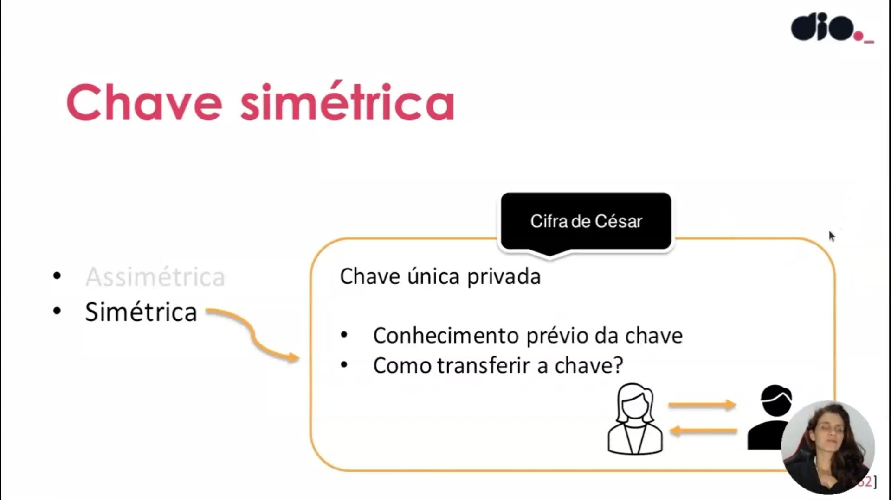
</p>

Dentro do universo da criptografia simétrica, existem duas abordagens principais para o tratamento dos dados:

1. **Cifra de Fluxo (Stream Cipher)**: O mapeamento ocorre bit a bit, gerando uma sequência pseudoaleatória.
2. **Cifra de Bloco (Block Cipher)**: Os dados são divididos em blocos de tamanho fixo para serem processados. Este é o método adotado por protocolos como SSL, PGP e IPsec.

<p align="center">
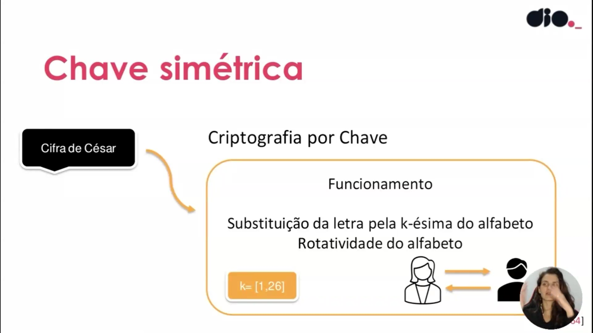
</p>

A cifra de fluxo realiza uma operação bit a bit. Dada uma entrada e uma função geradora de fluxo de bits, os dados são transformados em texto cifrado através de uma permutação simples e direta de cada bit individual (0 ou 1).

<p align="center">
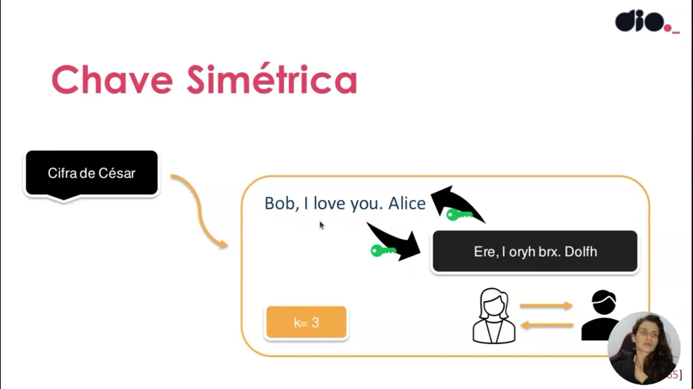
</p>

Na cifra de bloco, a permutação ocorre em grupos de bits (ex: blocos de 64 bits). O mapeamento é feito de bloco para bloco, utilizando uma tabela de permutação que deve ser conhecida apenas pelas partes autorizadas. Isso permite mascarar a informação original através da troca sistemática dos valores do bloco.

<p align="center">
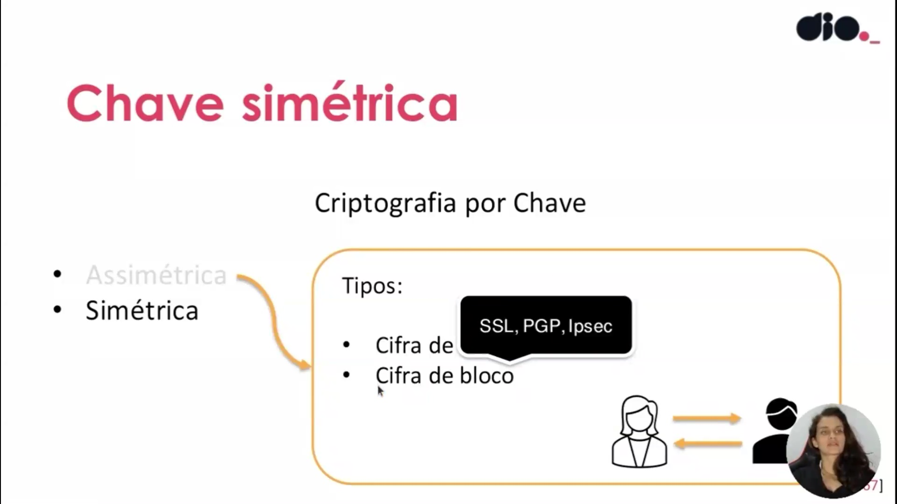
</p>

Este slide demonstra um exemplo prático de uma tabela de permutação para blocos de 3 bits ($k=3$):

* A entrada `000` é mapeada para a saída `110`.
* A entrada `010` é mapeada para `101`.

Existem múltiplas variações possíveis para essas tabelas, e a escolha da tabela adequada depende do cenário de segurança aplicado.

<p align="center">
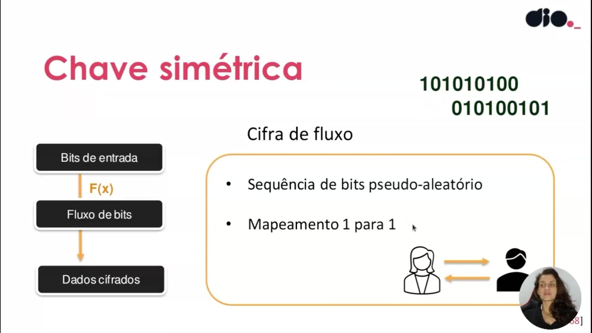
</p>

Ao aplicar a tabela de permutação mencionada anteriormente em uma sequência de dados, os blocos são transformados individualmente. No exemplo visual:

* Uma sequência de três zeros (`000`) resulta em `110`.
* Uma sequência de três uns (`111`) resulta em `001`.
Esta técnica permite fragmentar e mascarar o valor real dos dados originais.

<p align="center">
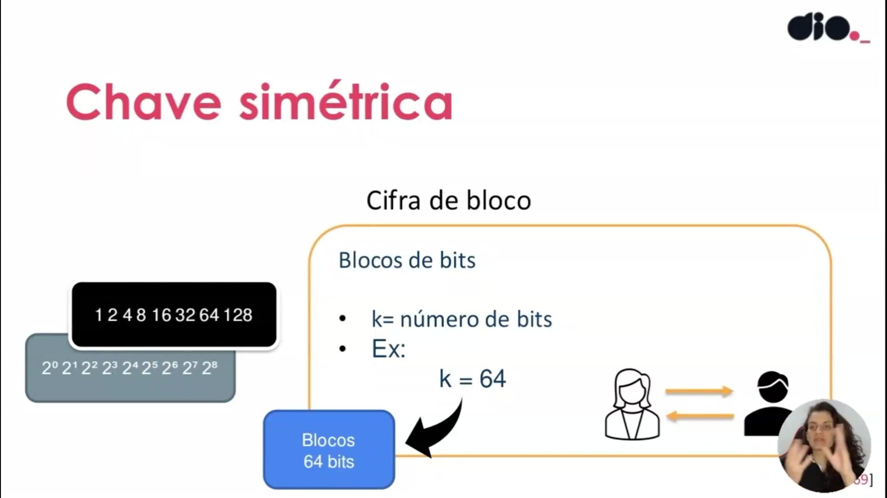
</p>

A segurança de uma cifra de bloco reside na complexidade combinatória. Para um bloco de $k$ bits, existem $2^k$ representações possíveis. O número de tabelas de permutação distintas é o fatorial desse valor ($2^k!$).
No caso de $k=3$, temos $8! = 40.320$ possibilidades. Embora pareça alto, este valor ainda é vulnerável a ataques de força bruta em sistemas computacionais modernos.

<p align="center">
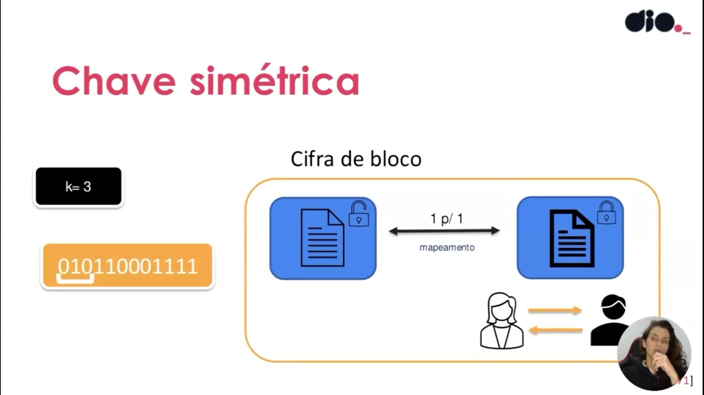
</p>

Na prática, para garantir a segurança, utiliza-se um $k$ superior a 64 bits, o que gera um número astronômico de combinações. Devido à impossibilidade de gerenciar tabelas físicas desse tamanho, a permutação é realizada através de funções matemáticas. Além disso, utiliza-se o **encadeamento de cifras** para aumentar a robustez do processo.

<p align="center">
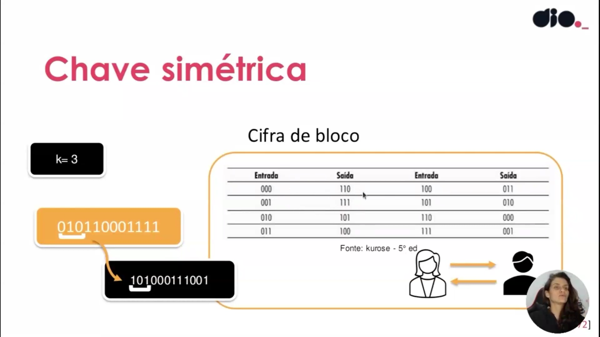
</p>

A certificação de chave pública é essencial para resolver o problema da identidade (autenticidade). Ela garante que, em uma comunicação, a pessoa (ou entidade) é realmente quem diz ser. O SSL/TLS e o IPsec dependem dessa verificação para evitar que atacantes se passem por usuários legítimos (como o "Bob" do exemplo).

<p align="center">
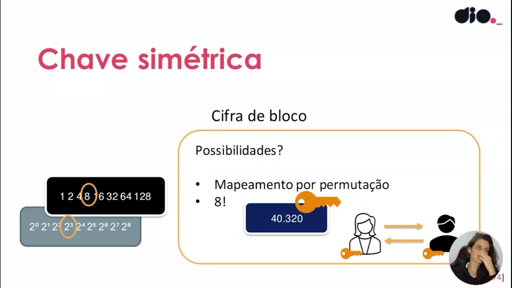
</p>

A **Entidade Certificadora (CA)** é a instituição de confiança que garante a autenticidade das chaves. O processo assemelha-se à obtenção de um CNPJ ou certificado para emissão de notas fiscais: você fornece seus dados à certificadora, que valida sua identidade e emite um certificado digital vinculado a uma chave específica.

<p align="center">
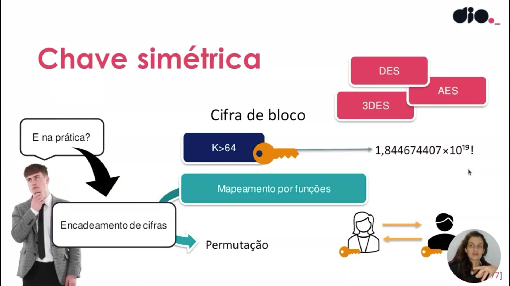
</p>

As responsabilidades da Entidade Certificadora incluem:

* Verificar a identidade da entidade solicitante.
* Garantir que a chave pertence legitimamente àquela pessoa ou empresa.
* Emitir certificados que vinculem a chave à identidade de forma confiável.

<p align="center">
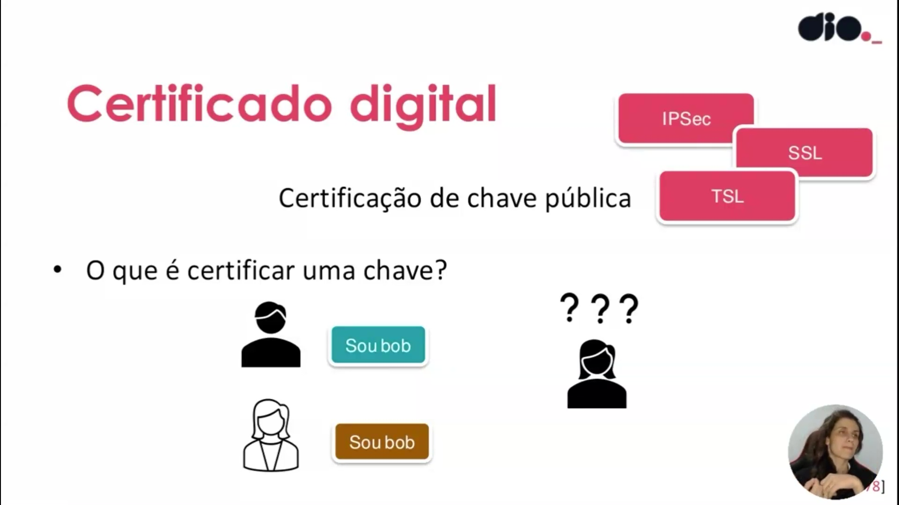
</p>

O funcionamento das CAs é regido por padrões e recomendações técnicas, principalmente do IETF (Internet Engineering Task Force). A RFC 1422, por exemplo, especifica o gerenciamento de chaves baseadas em certificados para e-mails seguros e define a sintaxe e o serviço de autenticação.

<p align="center">
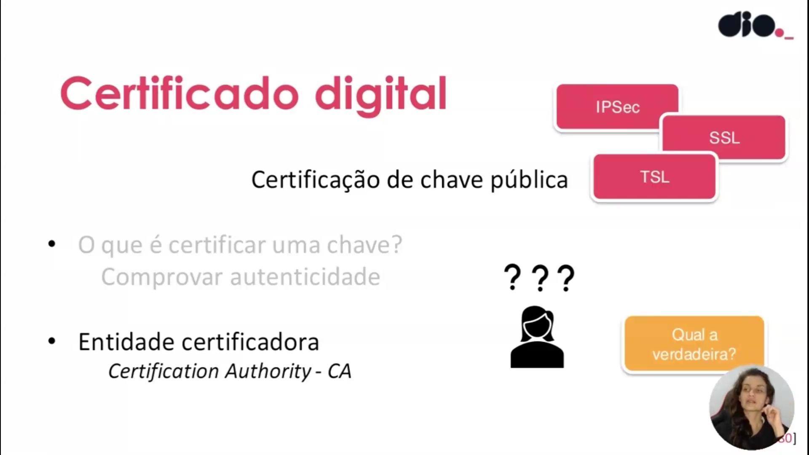
</p>

Este slide resume o papel da CA como o elo de confiança que une a Identidade à Chave Pública, permitindo que terceiros confiem que a chave utilizada em uma conexão realmente pertence à entidade com a qual desejam se comunicar.

<p align="center">

</p>

Na navegação web, a presença de um certificado digital é sinalizada pelo navegador. Se um site tenta utilizar criptografia sem um certificado reconhecido por uma entidade certificadora confiável, o navegador emitirá um alerta de segurança, indicando que a conexão pode não ser autêntica.

<p align="center">
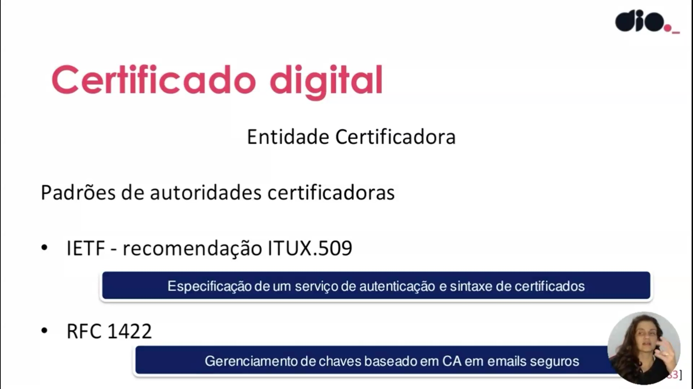
</p>

Além da segurança do certificado, as ferramentas de inspeção dos navegadores permitem visualizar outras informações importantes, como os cookies. É possível verificar quantos cookies estão sendo utilizados por cada recurso ou servidor web durante a navegação.

<p align="center">
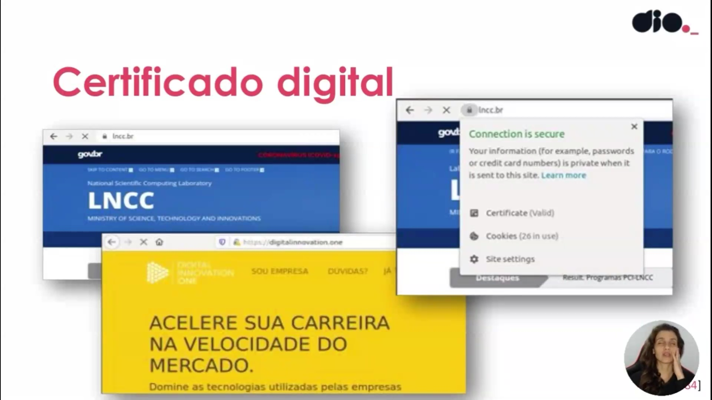
</p>

Esta imagem exemplifica a visualização técnica de um certificado digital e dos cookies em um navegador (como o Chrome). Através do ícone de cadeado e das ferramentas do desenvolvedor, o usuário pode confirmar a validade do certificado emitido para o domínio e gerenciar as informações de rastreamento (cookies) armazenadas pelo site.

Com estes conceitos básicos de criptografia simétrica/assimétrica e certificação digital, conclui-se a base necessária para entender o funcionamento do SSL.      


### 🟩 Vídeo 08 - Protocolo SSL - Secure Socket Layer

<video width="60%" controls>
  <source src="000-Midia_e_Anexos/bootcamp_tqi_fullstack-modulo.07-curso.01-video_08.webm" type="video/webm">
    Seu navegador não suporta vídeo HTML5.
</video>

link do vídeo: https://web.dio.me/track/tqi-fullstack-developer/course/principais-protocolos-de-comunicacao-da-internet/learning/ff236da7-4de8-46f2-b7f2-fc7a88914bf5?autoplay=1

Este vídeo resume os conceitos fundamentais do protocolo SSL (Secure Sockets Layer) e sua evolução, o TLS (Transport Layer Security), abordando seu funcionamento, importância e como ele protege as comunicações na rede contra ataques maliciosos.

### Anotações

#### Introdução ao Protocolo SSL

<p align="center">
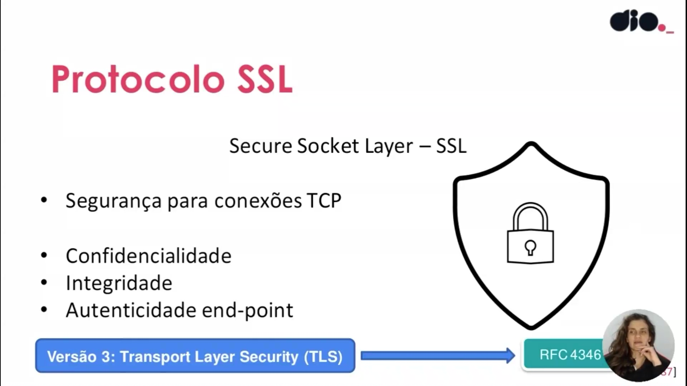
</p>

O **SSL (Secure Socket Layer)** é um protocolo fundamental para a segurança em redes, operando como uma camada de proteção para conexões **TCP**. Ele é projetado para garantir três pilares essenciais na comunicação entre *end-points*:

* **Confidencialidade:** Proteção dos dados contra acesso não autorizado.
* **Integridade:** Garantia de que as informações não foram alteradas durante o trajeto.
* **Autenticidade:** Verificação da identidade das partes envolvidas na conexão.

Atualmente, a evolução deste protocolo em sua terceira versão é conhecida como **TLS (Transport Layer Security)**, sendo documentada e padronizada pela **RFC 4346**.

#### Aplicações Práticas e Ubiquidade

<p align="center">
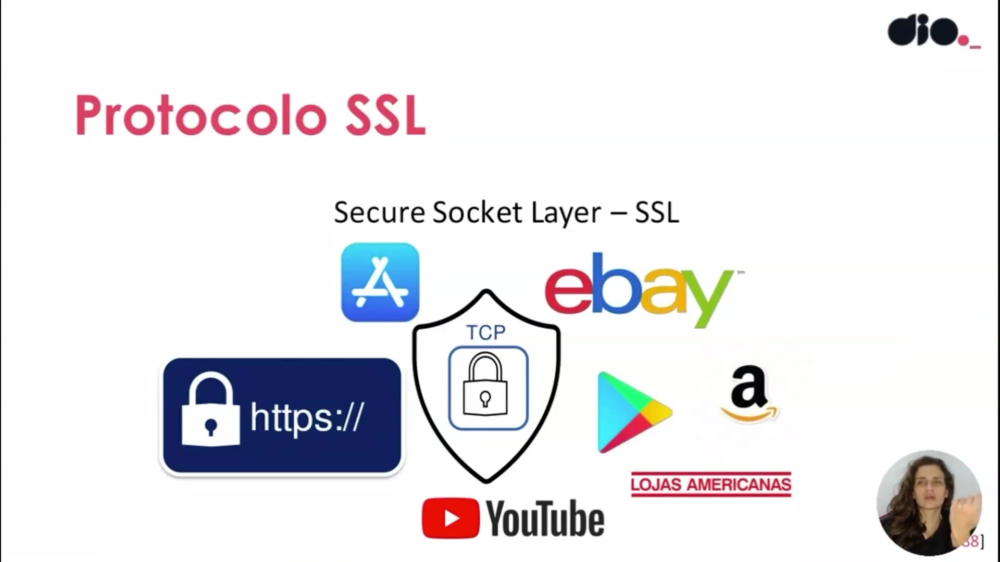
</p>

A utilização da criptografia baseada em SSL/TLS é ampla e indispensável para a navegação segura na internet. Diversas plataformas e serviços de renome utilizam esse protocolo para proteger as transações e dados de seus usuários, manifestando-se visualmente através do prefixo **https://** no navegador. Entre os exemplos de aplicações que dependem dessa tecnologia estão:

* Plataformas de e-commerce como **eBay** e **Lojas Americanas**.
* Serviços de conteúdo e redes sociais como o **YouTube**.

#### Vulnerabilidades em Redes Desprotegidas

<p align="center">
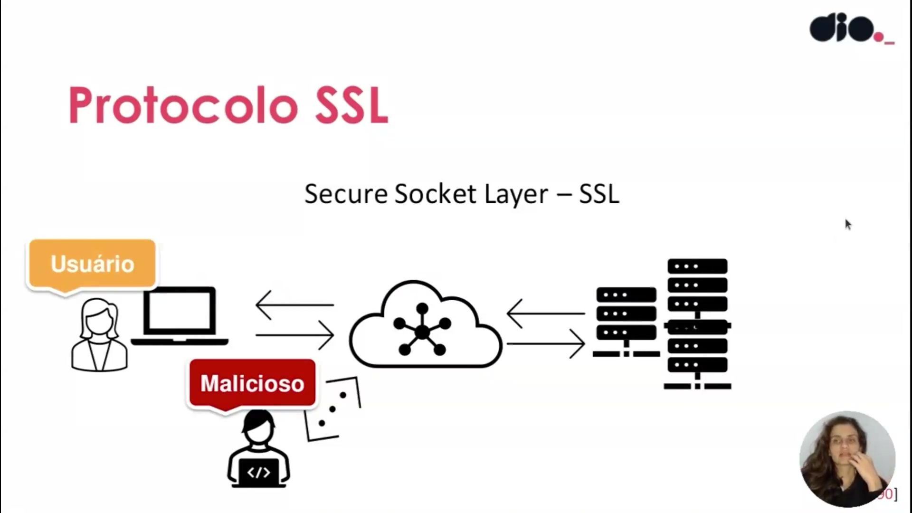
</p>

Em um ambiente de rede comum, coexistem usuários legítimos e agentes **maliciosos**. Sem a proteção de protocolos de segurança, a comunicação entre o dispositivo do usuário e o servidor fica exposta. Um atacante posicionado na rede pode interceptar o tráfego de dados, explorando o fato de que as requisições transitam por infraestruturas compartilhadas (nuvem/internet) antes de atingirem o destino final.

#### Cenários de Ataque: Listening e Ataque Ativo

<p align="center">
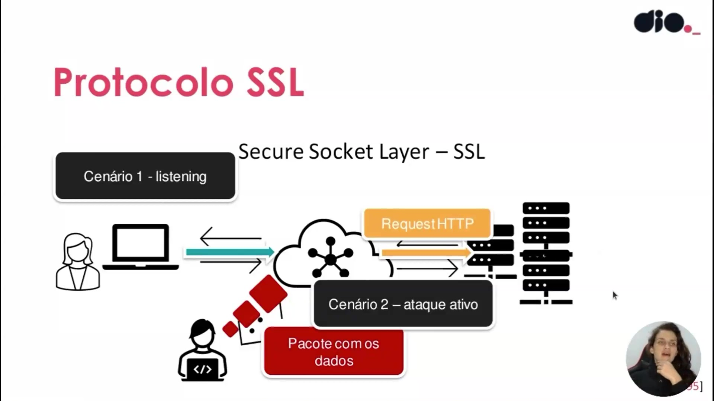
</p>

A ausência de criptografia possibilita dois cenários principais de comprometimento:

1. **Cenário 1 - Listening (Ataque Passivo):** O invasor configura sua interface de rede em modo promíscuo para capturar pacotes que não lhe são destinados. O objetivo aqui é apenas "ouvir" e extrair informações sensíveis, como dados de cartão de crédito ou credenciais, para uso posterior em fraudes ou *phishing*.
2. **Cenário 2 - Ataque Ativo:** Diferente da escuta passiva, neste cenário o atacante intercepta a **Request HTTP** e promove a alteração direta dos dados. O **Pacote com os dados** é modificado em trânsito para beneficiar o criminoso, podendo alterar destinatários de pagamentos ou valores de transações.

#### A Proteção via HTTPS

<p align="center">
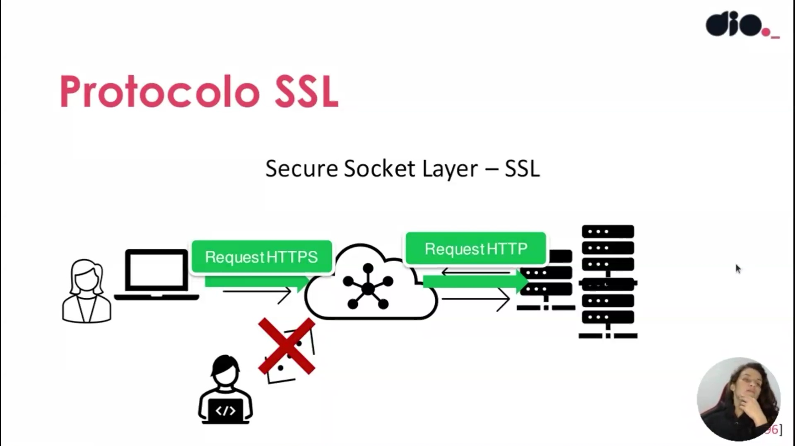
</p>

A implementação do SSL transforma a comunicação de uma simples **Request HTTP** para uma **Request HTTPS**. Esta camada adicional de segurança neutraliza as tentativas de ataques ativos e passivos descritas anteriormente. Ao criptografar o canal, o protocolo impede que o usuário malicioso consiga realizar modificações nos dados ou aplicar técnicas de *phishing* de forma eficaz durante o tráfego da conexão.

#### Garantias de Segurança do SSL

<p align="center">
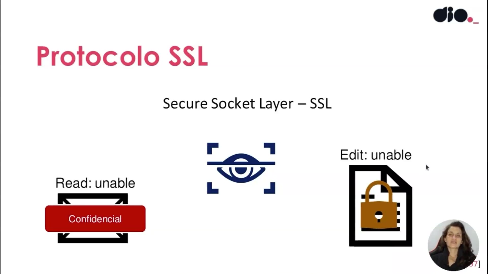
</p>

O funcionamento do SSL garante que a operação de autenticação e segurança seja mantida através de restrições técnicas rigorosas:

* **Read (Leitura):** Torna-se impossível (*unable*) para terceiros lerem o conteúdo, garantindo que o dado seja estritamente **Confidencial**. Apenas quem possui a chave relacionada pode decifrar a informação.
* **Edit (Edição):** A modificação dos dados por agentes externos é bloqueada (*unable*), assegurando a integridade do pacote desde a origem até o destino. 


### 🟩 Vídeo 09 - Operação do SSL e considerações finais

<video width="60%" controls>
  <source src="000-Midia_e_Anexos/bootcamp_tqi_fullstack-modulo.07-curso.01-video_09.webm" type="video/webm">
    Seu navegador não suporta vídeo HTML5.
</video>

link do vídeo: https://web.dio.me/track/tqi-fullstack-developer/course/principais-protocolos-de-comunicacao-da-internet/learning/aa271268-ce67-48bb-9eca-6c8269676f28?autoplay=1


Este guia resume os processos fundamentais que garantem a confidencialidade e integridade das comunicações na web, além de abordar a estrutura legal brasileira para proteção de dados.

### Anotações

Aqui está o documento final preenchido, respeitando rigorosamente a estrutura original, a ordem das imagens e o escopo semântico de cada trecho.

<p align="center">
  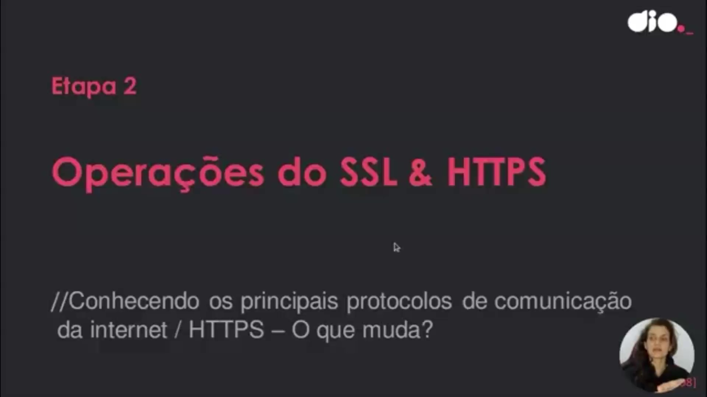
</p>

Inicia a introdução sobre as operações do protocolo SSL e HTTPS. O processo abrange desde o estabelecimento da conexão, passando pelo *handshake*, até a fase de transferência efetiva das informações.

<p align="center">
  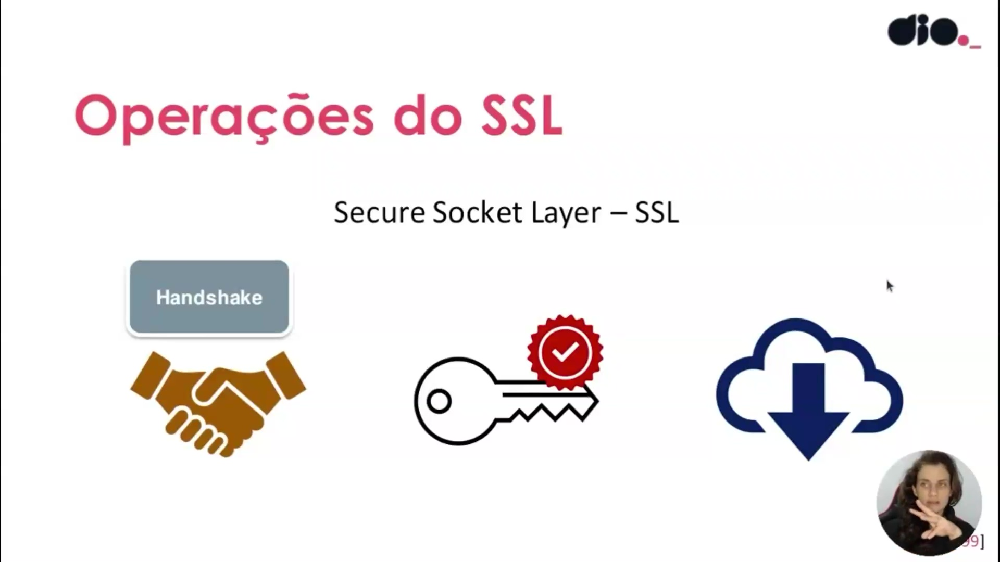
</p>

As operações estruturais do SSL são divididas em três fases principais: o *handshake* (aperto de mãos), a derivação de chaves (*key derivation*) e a transferência de dados (*data transfer*).

<p align="center">
  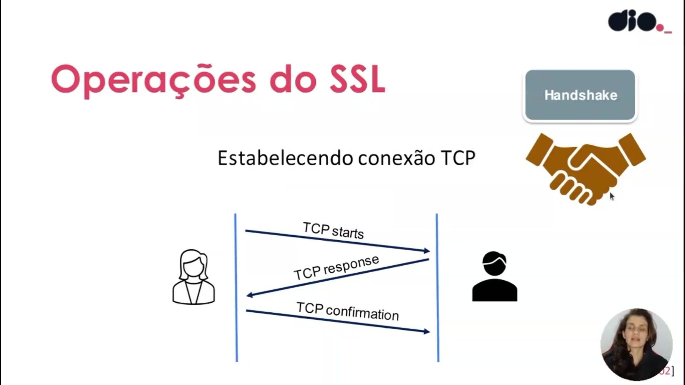
</p>

A etapa inicial do *handshake* é baseada na conexão TCP de três vias (assim como no HTTP convencional). O cliente inicia o processo enviando um sinal ("TCP starts"), o servidor retorna uma resposta ("TCP response") e o cliente finaliza enviando uma confirmação para estabelecer de fato a comunicação ("TCP confirmation").

<p align="center">
  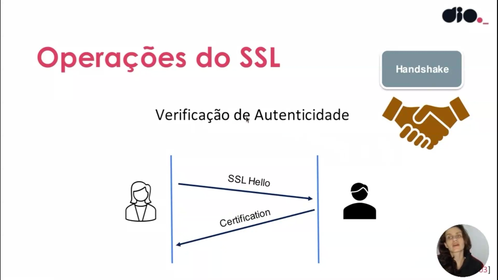
</p>

Com a conexão estabelecida, ocorre a verificação de autenticidade. O cliente envia uma mensagem de identificação chamada "SSL Hello". Em resposta, o servidor envia a sua certificação digital. Essa certificação contém a chave pública que será essencial para a criação da chave criptográfica mestre nos passos seguintes.

<p align="center">
  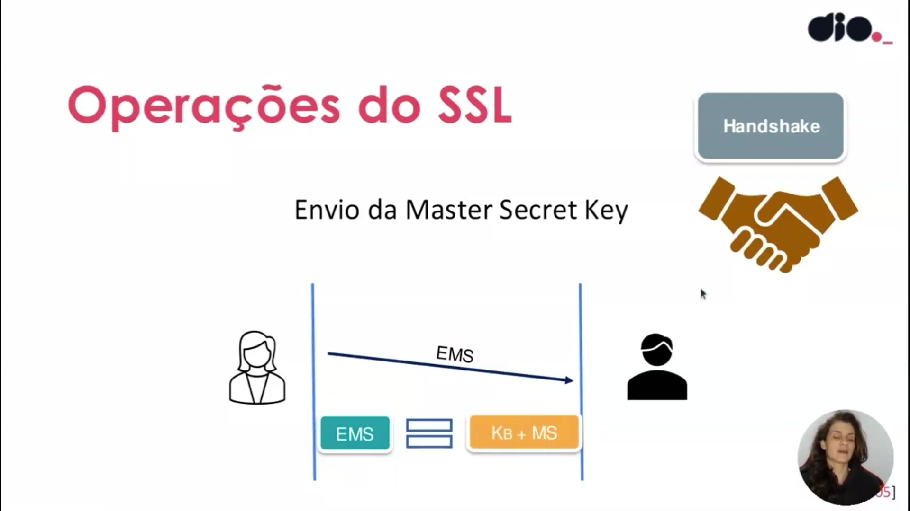
</p>

Nesta etapa, o cliente gera a *Encrypt Master Secret Key* (EMS) e a envia para o servidor. Conforme demonstrado pela fórmula $EMS = K_{B} + MS$, a EMS é o resultado da combinação da chave pública do servidor com a *Master Secret Key* gerada pelo lado do cliente.

<p align="center">
  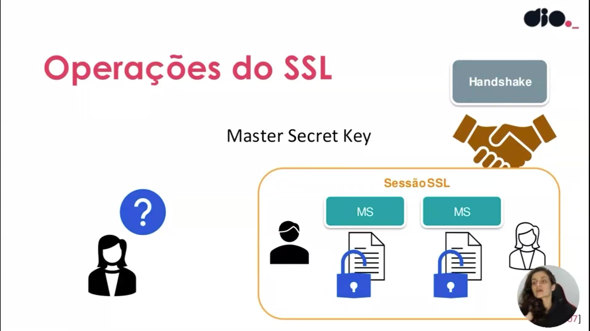
</p>

A *Master Secret Key* (MS) atua como uma chave simétrica presente tanto no cliente quanto no servidor. Ela é utilizada para descriptografar os dados trafegados. Vale ressaltar que a MS só tem validade e funciona para a sessão SSL corrente em que foi especificamente criada.

<p align="center">
  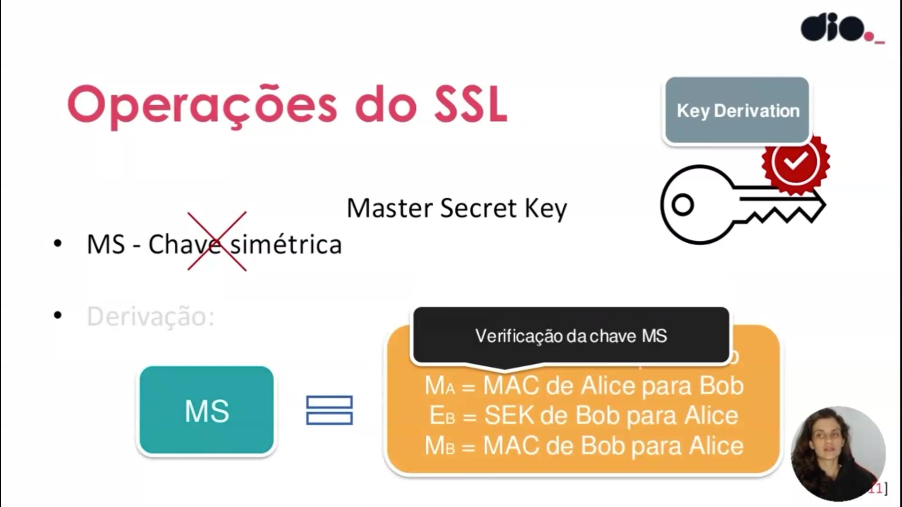
</p>

A etapa de derivação de chaves (*Key Derivation*) ocorre após a criação da chave mestre. Durante esta fase, é criada uma *Section Encryption Key* (SEK) gerada exclusivamente para criptografar a sessão atual. Em seguida, as chaves são verificadas através da troca de mensagens com código de autenticação (MAC) entre as partes.

```text
M_A = MAC de Alice para Bob
E_B = SEK de Bob para Alice
M_B = MAC de Bob para Alice
```

<p align="center">
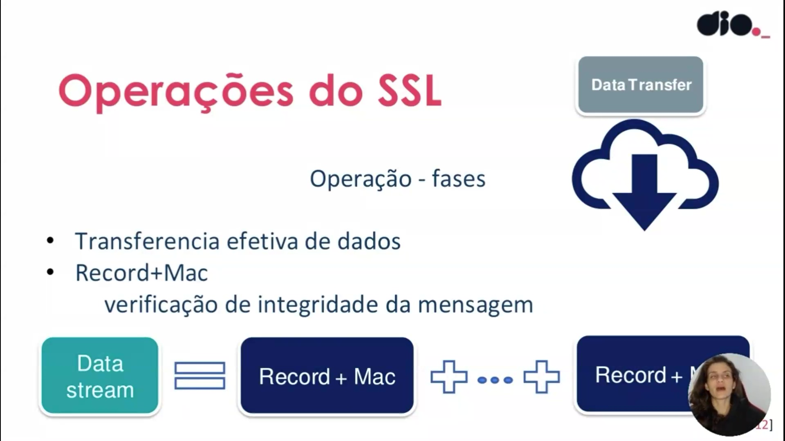
</p>

Na fase final das operações do SSL, ocorre a transferência efetiva de dados (*Data Transfer*). O *data stream* (fluxo contínuo de dados) é segmentado em blocos que unem a informação real (*Record*) com o código de verificação (*MAC*), formando a estrutura $Record + Mac + \dots + Record$, o que garante a integridade da mensagem.

<p align="center">
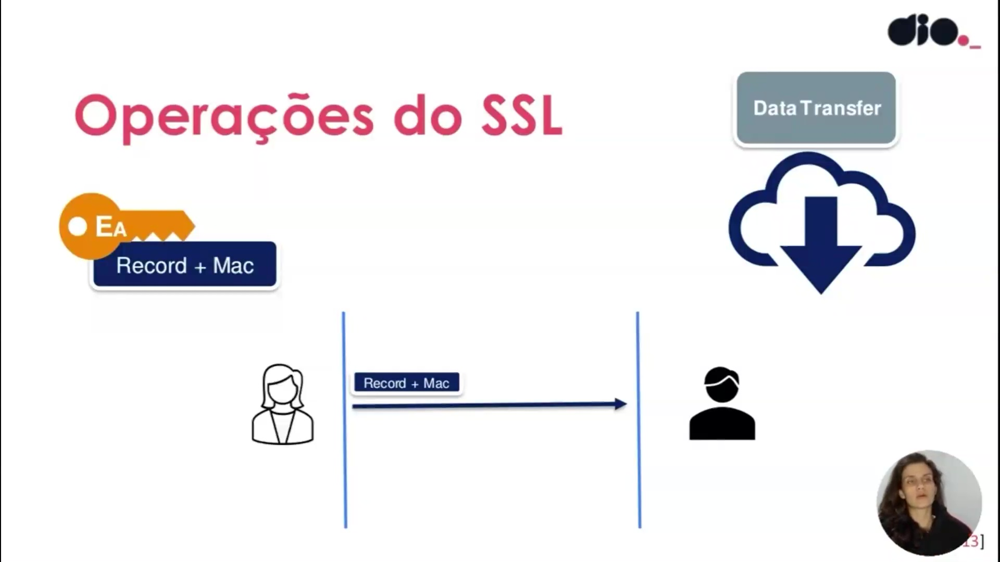
</p>

Os dados chegam ao usuário no formato exato de $Record + Mac$. Isso assegura que cada fragmento de informação transferido no decorrer da comunicação esteja protegido, integro e devidamente assinado pela chave simétrica exclusiva daquela sessão SSL.

<p align="center">
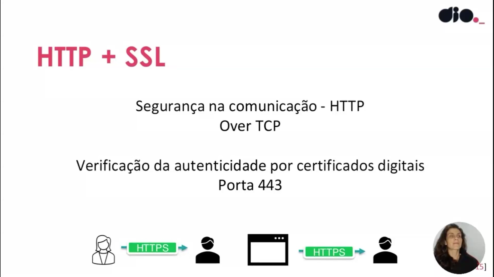
</p>

O protocolo HTTPS é essencialmente a junção do protocolo HTTP com a camada SSL. Ele provê segurança na comunicação sobre o protocolo de rede TCP. Essa verificação de autenticidade é garantida pelos certificados digitais, operando de maneira padronizada pela porta de rede 443.

<p align="center">

</p>

Introdução à Lei Geral de Proteção de Dados (LGPD) no Brasil. Promulgada como a Lei nº 13.709/2018, trata-se da principal lei de segurança e proteção da informação do país. Ela foi concebida no ano de 2018 e entrou em vigor de forma efetiva em agosto de 2020.

<p align="center">
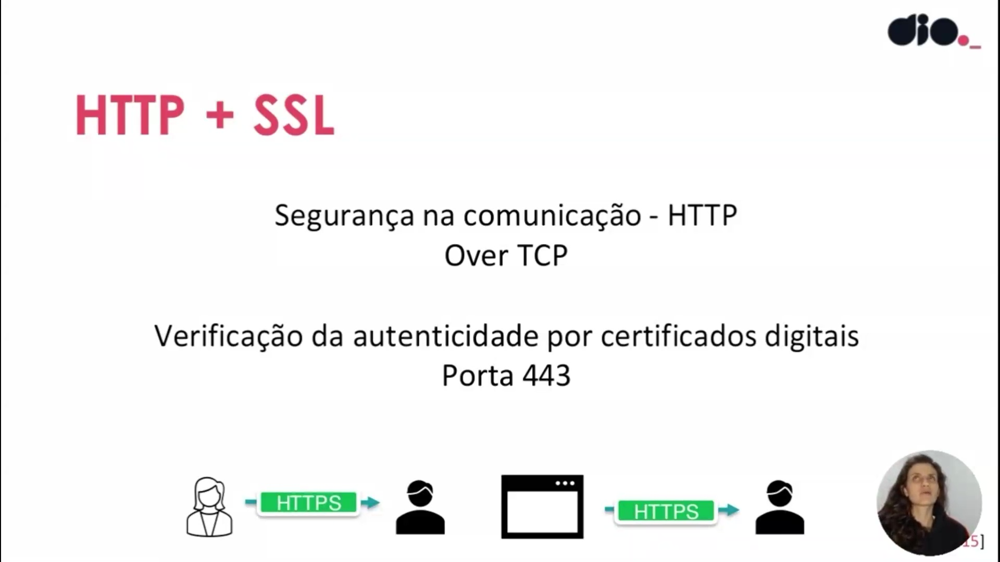
</p>

O esquema ilustra visualmente o tráfego do HTTPS de ponta a ponta. Através da porta 443 e dos certificados digitais, a troca de informações entre os clientes e as interfaces web no servidor acontece de maneira encapsulada e totalmente segura pelo SSL.

<p align="center">
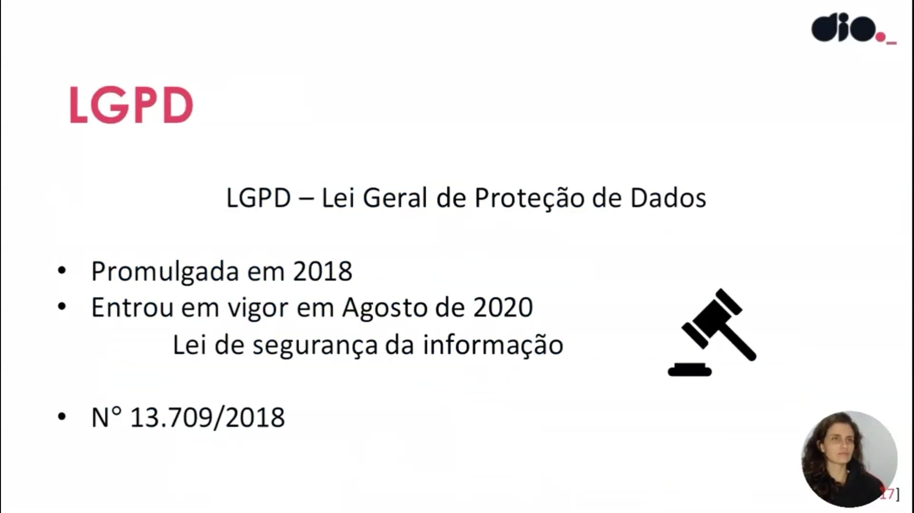
</p>

Retomando as definições primárias, a LGPD atua como o alicerce regulatório para o tratamento de dados pessoais no Brasil, reforçando as diretrizes aprovadas e vigentes desde o ano de 2020.

<p align="center">
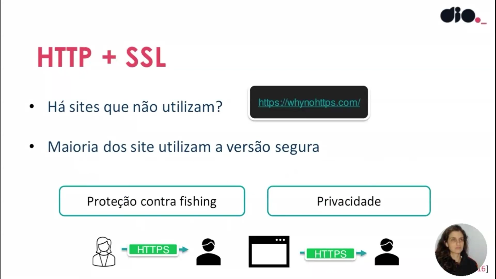
</p>

Embora alguns sites na internet ainda não utilizem o HTTPS, a grande maioria já adota a versão segura do protocolo. O seu uso é essencial para assegurar a proteção contra armadilhas virtuais, como o *phishing*, e para resguardar as informações sensíveis e a privacidade dos usuários.

<p align="center">
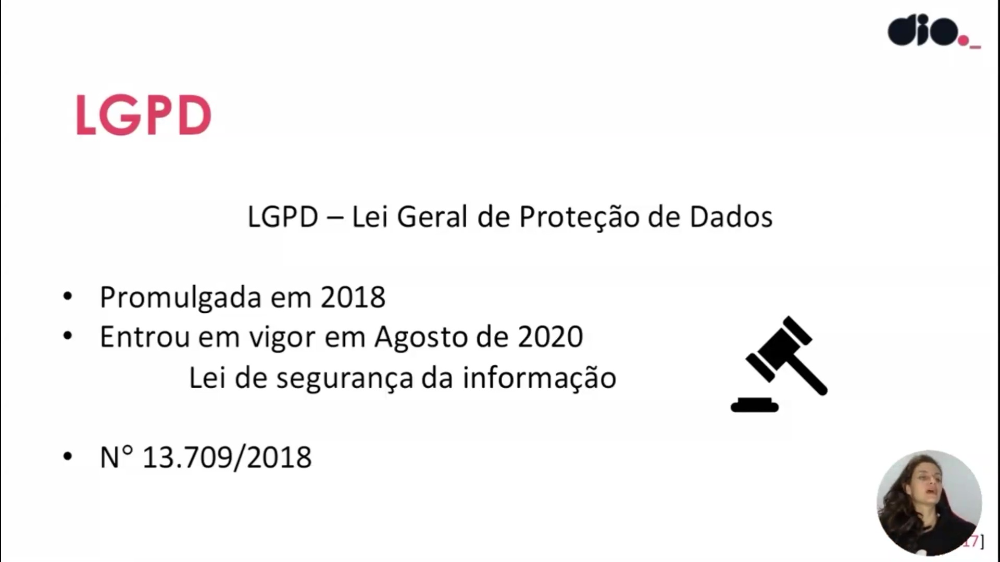
</p>

Reforço visual do tema da LGPD, preparando a contextualização sobre os motivos e inspirações legislativas de fora do país que culminaram na formatação da lei brasileira.

<p align="center">
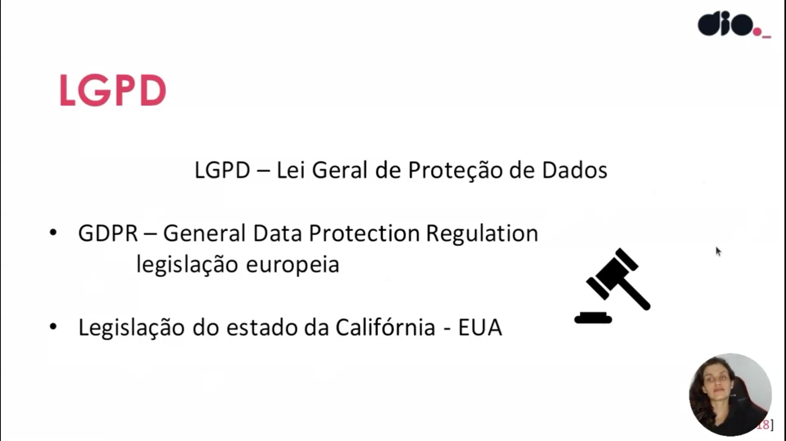
</p>

A construção da LGPD utilizou modelos jurídicos internacionais avançados como referência. Suas diretrizes são fundamentadas principalmente na legislação europeia (a GDPR – *General Data Protection Regulation*) e em premissas originadas na legislação do estado da Califórnia, nos Estados Unidos.

<p align="center">
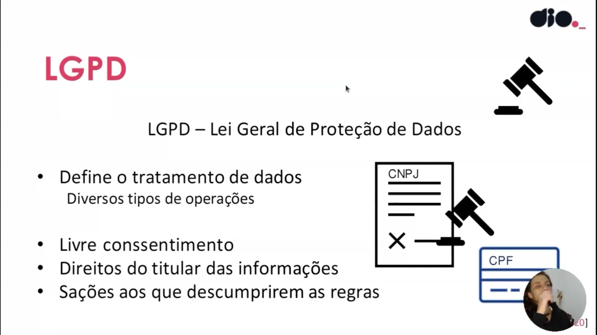
</p>

A lei é responsável por proteger dados de identificação comuns (como CPF e CNPJ) e dados sensíveis dos indivíduos. A LGPD define rigorosamente como o tratamento desses dados deve acontecer nas diversas operações. Ela torna obrigatório o livre consentimento, reforça os direitos primários do titular e estabelece sanções para as organizações e empresas que descumprirem a regulamentação.

<p align="center">
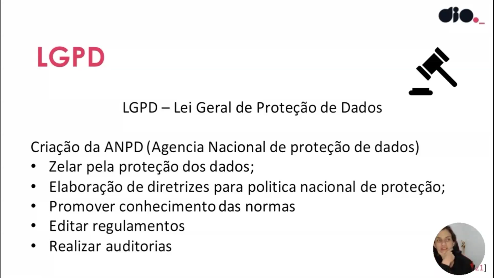
</p>

Para fiscalizar e balizar a lei, foi criada a ANPD (Agência Nacional de Proteção de Dados). O órgão tem como responsabilidades zelar pelas informações, elaborar diretrizes para a política nacional, promover a disseminação das normas, editar os regulamentos necessários e realizar auditorias ativas no mercado.


## Parte 4 - Protocolo de comunicação WebSocket

### 🟩 Vídeo 10 - Contextualização

<video width="60%" controls>
  <source src="000-Midia_e_Anexos/bootcamp_tqi_fullstack-modulo.07-curso.01-video_10.webm" type="video/webm">
    Seu navegador não suporta vídeo HTML5.
</video>

link do vídeo: https://web.dio.me/track/tqi-fullstack-developer/course/principais-protocolos-de-comunicacao-da-internet/learning/e9f322ac-2039-423d-9c77-8f33512c5e16?autoplay=1

### 🟩 Vídeo 11 - Como funciona o WebSocket?

<video width="60%" controls>
  <source src="000-Midia_e_Anexos/bootcamp_tqi_fullstack-modulo.07-curso.01-video_11.webm" type="video/webm">
    Seu navegador não suporta vídeo HTML5.
</video>

link do vídeo:

### 🟩 Vídeo 12 - Como ocorre a comunicação dentro da internet?

<video width="60%" controls>
  <source src="000-Midia_e_Anexos/bootcamp_tqi_fullstack-modulo.07-curso.01-video_12.webm" type="video/webm">
    Seu navegador não suporta vídeo HTML5.
</video>

link do vídeo:

## Parte 5 - Conclusão e considerações finais

### 🟩 Vídeo 13 - Conclusão e próximos passos

<video width="60%" controls>
  <source src="000-Midia_e_Anexos/bootcamp_tqi_fullstack-modulo.07-curso.01-video_13.webm" type="video/webm">
    Seu navegador não suporta vídeo HTML5.
</video>

link do vídeo:


##  Materiais de Apoio

# Certificado: 

- Link na plataforma: 
- Certificado em pdf: