## Instrutor

- Gleyson Sampaio (Analista Desenvolvedor Java)
- Contato Linkedin: / [glysns](https://www.linkedin.com/in/glysns/)

## Parte 1 - Apresentação inicial

### 🟩 Vídeo 01 - Abertura

<video width="60%" controls>
  <source src="000-Midia_e_Anexos/bootcamp_tqi_fullstack-modulo.07-curso.02-video_01.webm" type="video/webm">
    Seu navegador não suporta vídeo HTML5.
</video>

link do vídeo: https://web.dio.me/track/tqi-fullstack-developer/course/imersao-no-spring-framework-com-spring-boot/learning/76dae2f8-07b8-4801-b66a-cdc38209ab87?autoplay=1

Este vídeo marca o início de uma jornada educacional na plataforma Digital Innovation One (DIO), focada no ecossistema Spring. O objetivo central é explorar as características que tornam o Spring uma escolha dominante no desenvolvimento Java moderno, com ênfase especial no Spring Boot como ferramenta de aceleração de produtividade e simplificação de processos para desenvolvedores.

### 🟩 Vídeo 02 - Visão geral do curso

<video width="60%" controls>
  <source src="000-Midia_e_Anexos/bootcamp_tqi_fullstack-modulo.07-curso.02-video_02.webm" type="video/webm">
    Seu navegador não suporta vídeo HTML5.
</video>

link do vídeo: https://web.dio.me/track/tqi-fullstack-developer/course/imersao-no-spring-framework-com-spring-boot/learning/4ab3939a-431c-4a21-b58d-3d5cc83ace5a?autoplay=1

Este curso, ministrado por Gleyson Sampaio em parceria com a Digital Innovation One (DIO), oferece uma imersão profunda no ecossistema Spring Framework. O foco central é capacitar desenvolvedores a utilizarem o poder do Spring Boot para criar aplicações modernas, eficientes e escaláveis, abordando desde conceitos arquiteturais fundamentais até a integração com bancos de dados.

### Anotações

<p align="center">
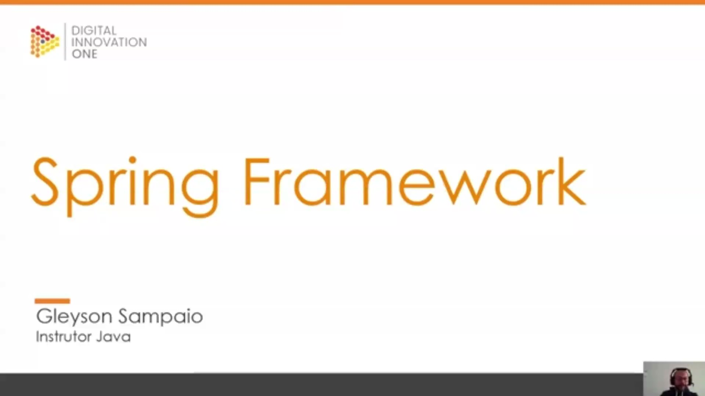
</p>

Esta é a abertura do curso de **Spring Framework**, uma iniciativa realizada pela **Digital Innovation One**. A instrução é conduzida por **Gleyson Sampaio**, Instrutor Java, e o conteúdo propõe uma imersão focada nos recursos e na capacidade de utilização do ecossistema **Spring Boot**.

<p align="center">
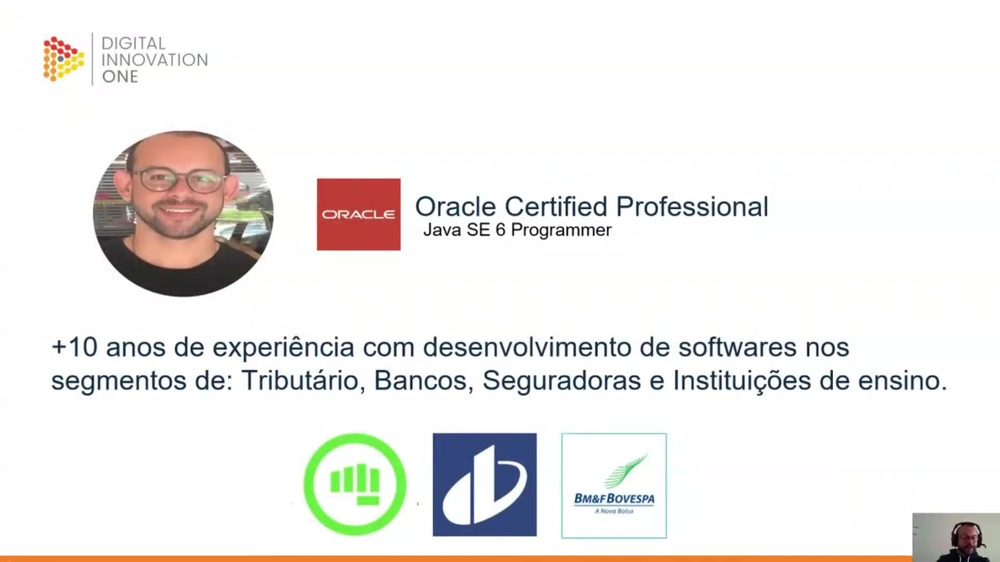
</p>

O instrutor apresenta sua trajetória profissional, destacando mais de **10 anos de experiência** no desenvolvimento de software. Sua atuação engloba setores como o tributário, bancário (com experiência na BM&FBOVESPA), seguradoras e instituições de ensino. Além da experiência de mercado, o instrutor possui a certificação **Oracle Certified Professional Java SE 6 Programmer**.

<p align="center">
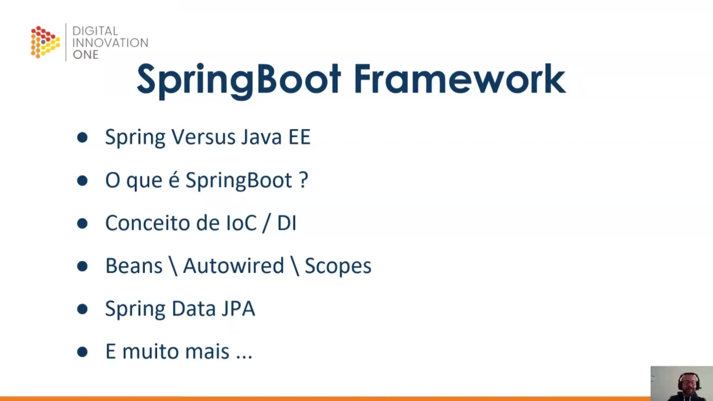
</p>

O cronograma de aprendizado para o curso de **SpringBoot Framework** abrange os seguintes tópicos fundamentais:

* **Spring Versus Java EE**: Entendimento das diferenças e posicionamento de cada tecnologia.
* **Conceitos de Spring Boot**: Definição e objetivos da ferramenta.
* **IoC / DI**: Exploração dos conceitos de Inversão de Controle e Injeção de Dependência.
* **Beans, Autowired e Scopes**: Componentes essenciais do gerenciamento de objetos no Spring.
* **Spring Data JPA**: Noções para interação e persistência de dados em bancos de dados.

### 🟩 Vídeo 03 - Spring Framework

<video width="60%" controls>
  <source src="000-Midia_e_Anexos/bootcamp_tqi_fullstack-modulo.07-curso.02-video_03.webm" type="video/webm">
    Seu navegador não suporta vídeo HTML5.
</video>

link do vídeo: https://web.dio.me/track/tqi-fullstack-developer/course/imersao-no-spring-framework-com-spring-boot/learning/4deb3bc2-cc61-43f1-9efa-ce1c1dbec135?autoplay=1

O Spring Framework é uma estrutura open-source para a plataforma Java, projetada para reduzir a complexidade e a verbosidade no desenvolvimento de aplicações. Ele se baseia fortemente nos princípios de Inversão de Controle (IoC) e Injeção de Dependência (DI), permitindo que os desenvolvedores criem sistemas modulares, testáveis e com baixo acoplamento.

### Anotações

<p align="center">
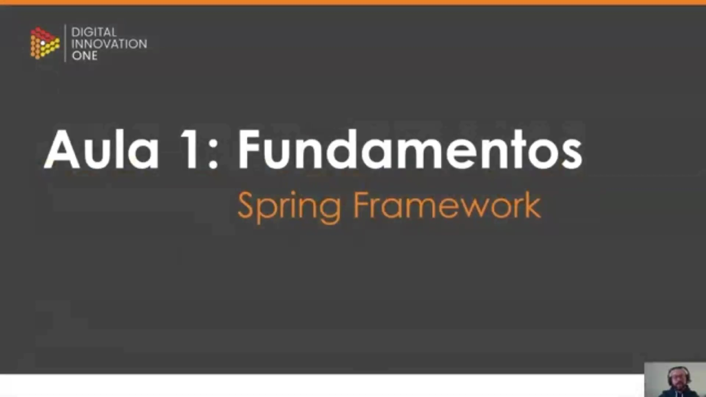
</p>

Esta imagem marca o início da aula sobre os **Fundamentos do Spring Framework**. Trata-se de uma introdução ao ecossistema Spring, apresentada no contexto da jornada de aprendizado da Digital Innovation One. O foco inicial da disciplina será estabelecer as bases conceituais e as boas práticas que sustentam o framework.

<p align="center">
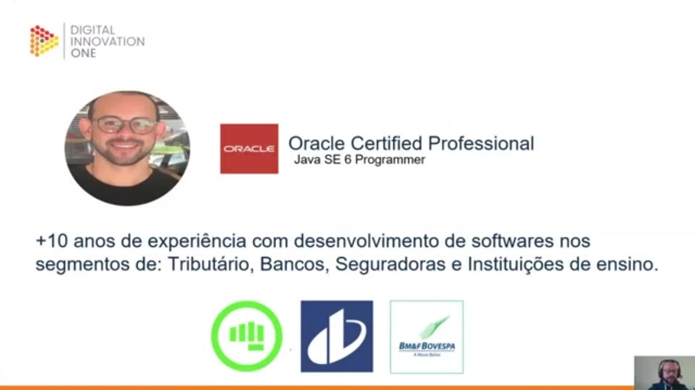
</p>

Apresentação do instrutor Gleyson Sampaio, que possui mais de 10 anos de experiência em desenvolvimento de software em setores como Tributário, Bancos (incluindo a BM&F BOVESPA) e Seguradoras. O instrutor é certificado como **Oracle Certified Professional Java SE 6 Programmer** desde 2015. Atualmente, seu foco profissional é voltado para a área educacional, atuando como instrutor Java.

<p align="center">
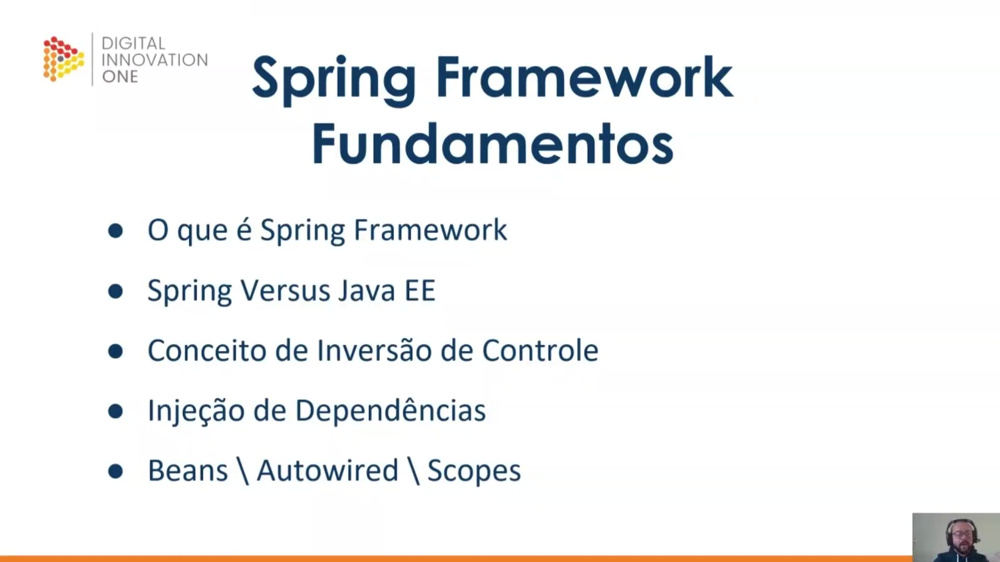
</p>

Este slide detalha os tópicos que compõem a jornada de fundamentos do Spring Framework. Os pontos principais incluem:

* Definição e origens do Spring Framework;
* Comparativo entre Spring e Java EE;
* Conceito de Inversão de Controle (IoC);
* Injeção de Dependências e o uso de componentes como Beans, Autowired e Scopes.

<p align="center">
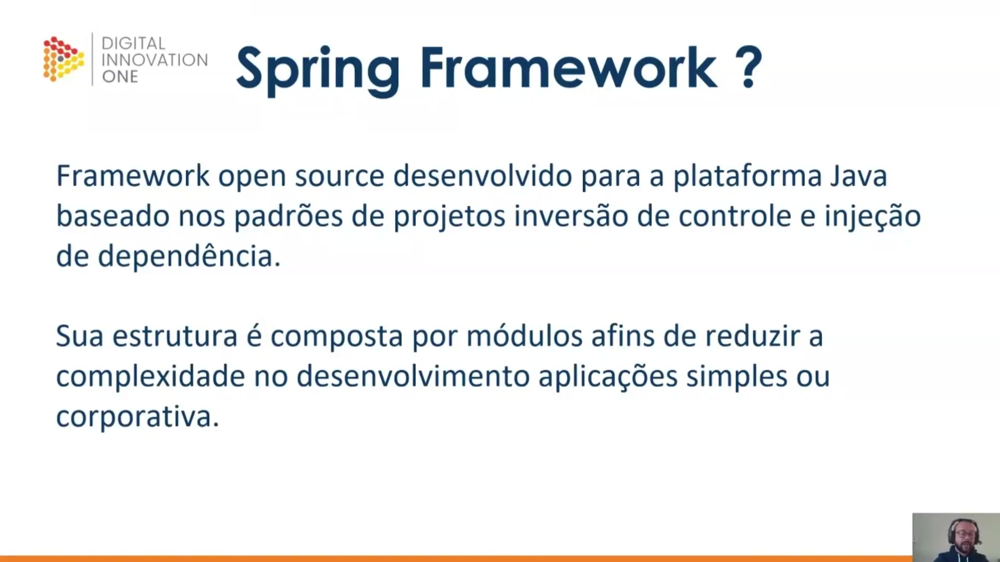
</p>

O **Spring Framework** é definido como um framework *open source* para a plataforma Java, estruturado com base nos padrões de Inversão de Controle (IoC) e Injeção de Dependência. Ele é composto por diversos módulos projetados para reduzir a complexidade no desenvolvimento de aplicações, atendendo desde projetos simples até sistemas corporativos robustos.

<p align="center">
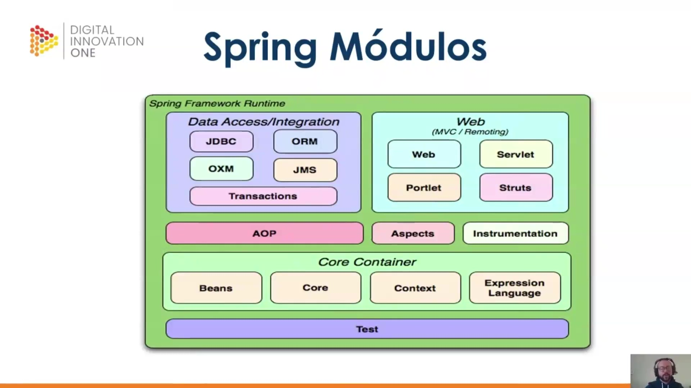
</p>

A imagem ilustra a arquitetura modular do **Spring Framework Runtime**, dividida em camadas principais:

* **Core Container**: Contendo os módulos Beans, Core, Context e Expression Language, que formam a base do framework.
* **Data Access/Integration**: Módulos para lidar com persistência e transações, como JDBC, ORM, OXM, JMS e Transactions.
* **Web**: Suporte para aplicações web através de Servlet, Portlet e integração com Struts.
* **AOP, Aspects e Instrumentation**: Camadas para Programação Orientada a Aspectos e instrumentação.
* **Test**: Módulo dedicado para testes unitários e de integração.

<p align="center">
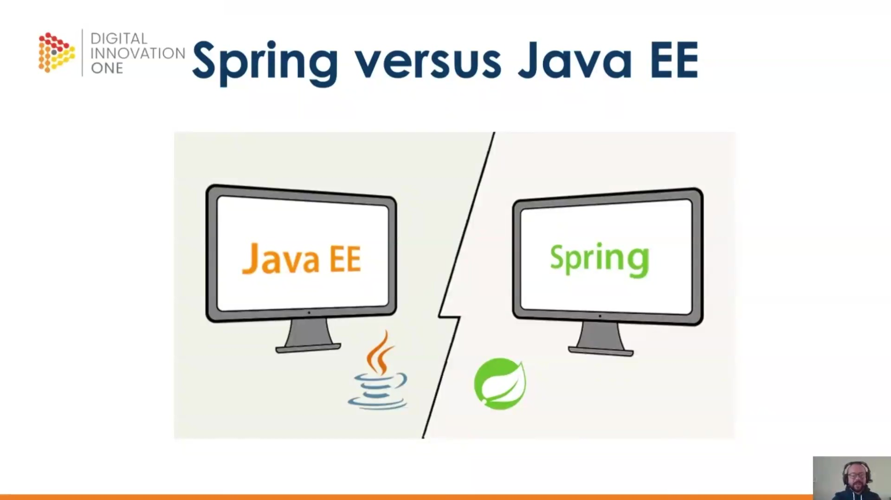
</p>

O slide introduz o comparativo histórico entre o **Java EE** e o **Spring**. Essa análise é fundamental para entender o que motivou a criação do Spring e como ele se posicionou como uma alternativa à especificação oficial do Java para o desenvolvimento corporativo.

<p align="center">
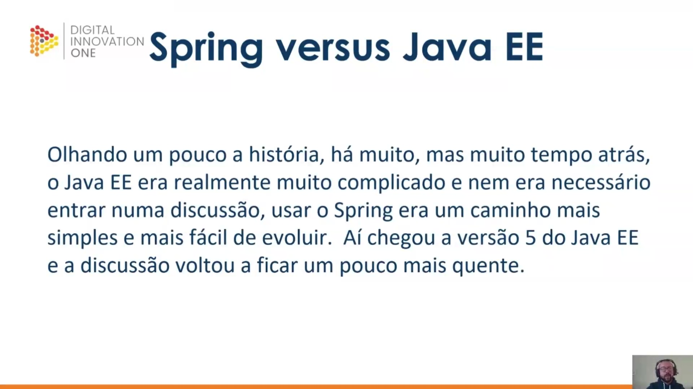
</p>

Historicamente, o Java EE era considerado complexo em suas versões iniciais, o que tornava o uso do Spring um caminho mais simples para a evolução de softwares. No entanto, a discussão entre as duas abordagens tornou-se mais equilibrada com o lançamento da versão 5 do Java EE, que buscou simplificar seus processos.

<p align="center">
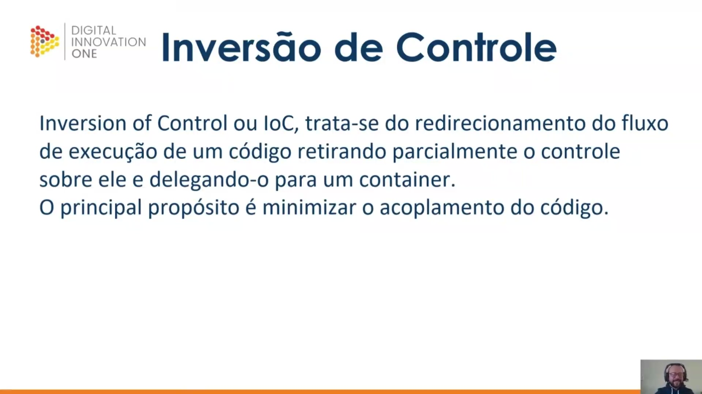
</p>

A **Inversão de Controle (IoC)** é o conceito central (*core*) do ecossistema Spring. Trata-se do redirecionamento do fluxo de execução do código, onde o controle sobre a criação e gerenciamento de objetos é retirado do programador e delegado a um container. O principal propósito desta técnica é minimizar o acoplamento do código.

<p align="center">
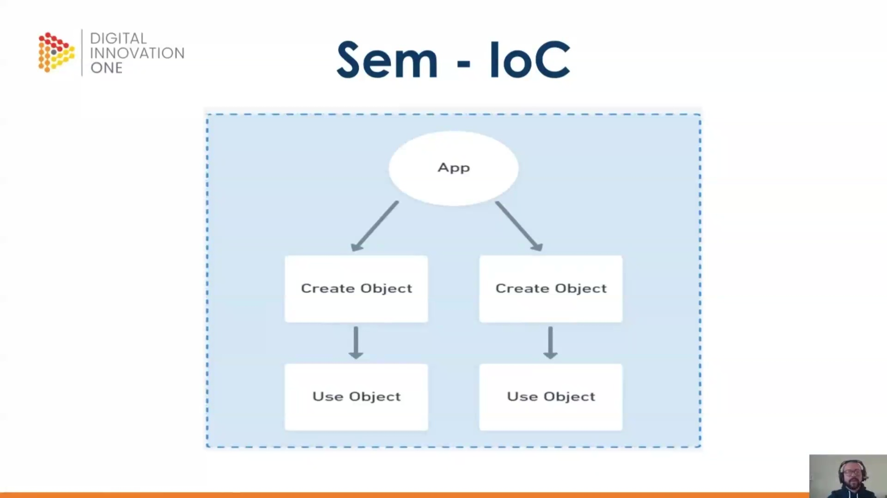
</p>

Em um cenário **sem Inversão de Controle (IoC)**, a própria aplicação é responsável por criar e gerenciar a instância de cada objeto que precisa utilizar. Nesse modelo, a aplicação executa manualmente as ações de "Criar Objeto" antes de poder realizar a ação de "Usar Objeto".

<p align="center">
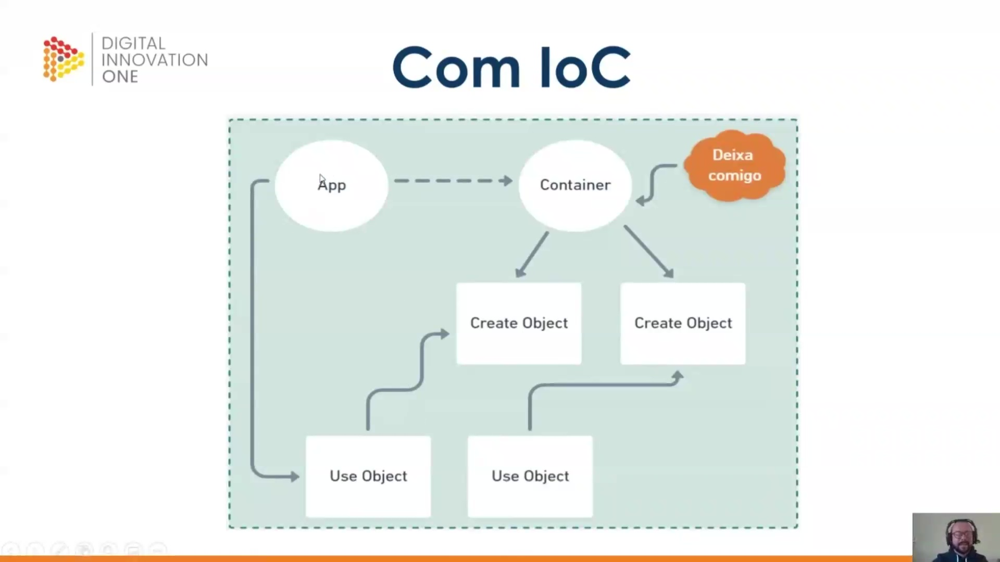
</p>

No cenário **com Inversão de Controle (IoC)**, a aplicação delega a responsabilidade de criação para um **Container**. O container assume a tarefa de criar as instâncias necessárias ("Deixa comigo"), permitindo que a aplicação apenas utilize os objetos, o que resulta em um código mais coeso e menos acoplado.

<p align="center">
  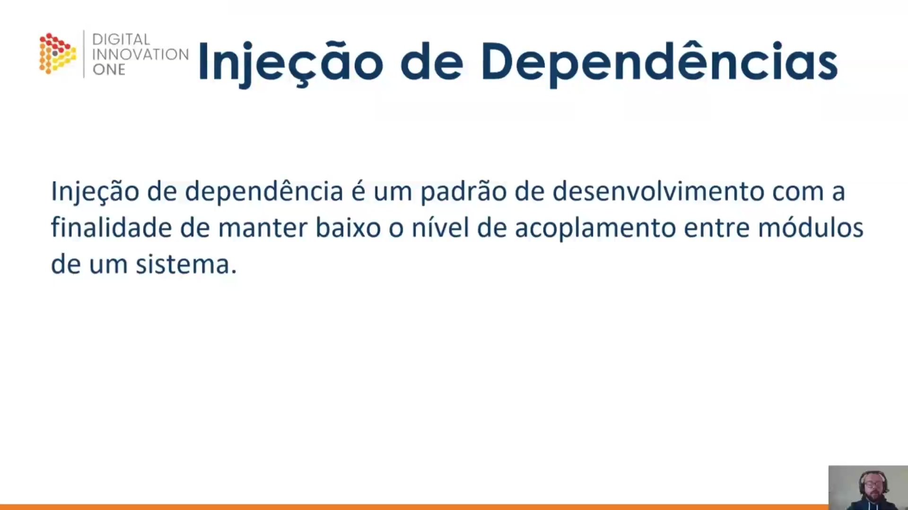
</p>

A imagem introduz formalmente o padrão de **Injeção de Dependências**. Este é o mecanismo prático que viabiliza a Inversão de Controle. O slide define a injeção de dependências como um padrão de desenvolvimento cuja finalidade é manter baixo o nível de acoplamento entre os módulos de um sistema. Em vez de um objeto criar suas dependências internamente, as dependências são "injetadas" nele por um agente externo (o container Spring), promovendo maior coesão e reuso.

<p align="center">
  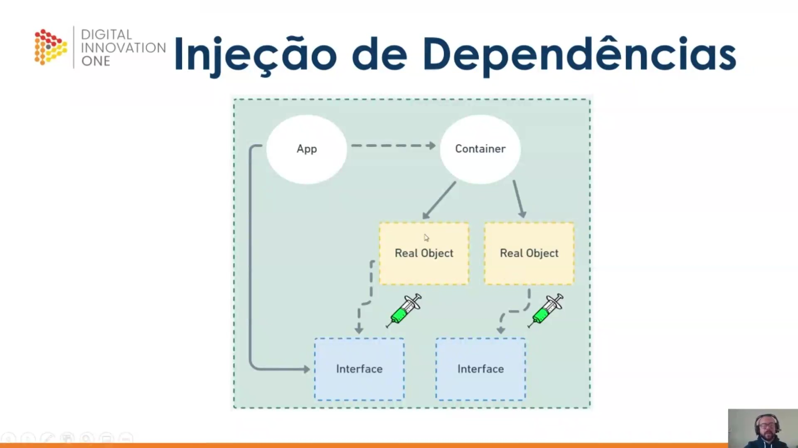
</p>

A imagem ilustra o conceito de **Injeção de Dependências (DI)**, um padrão fundamental no ecossistema Spring Boot para promover o baixo acoplamento.

Aqui está o resumo do fluxo apresentado:

#### 1. O Problema: Acoplamento

Em um sistema tradicional, a classe `App` criaria manualmente suas próprias dependências (usando `new Objeto()`). Isso gera um acoplamento forte: se o objeto mudar, a `App` precisa ser alterada.

#### 2. A Solução: Inversão de Controle (IoC)

Na imagem, a `App` não cria mais nada. Ela apenas define que precisa de uma funcionalidade através de uma **Interface** (as caixas azuis na base).

* **O Container (Spring IoC Container):** É o "cérebro" representado pelo círculo branco. Ele é responsável por instanciar, configurar e gerenciar o ciclo de vida dos objetos (chamados de **Beans**).
* **Real Object (Componentes):** São as implementações concretas (anotadas com `@Service`, `@Repository`, etc.).

#### 3. A "Injeção" (Seringas)

As seringas simbolizam o ato de injetar. O Spring olha para a sua classe, vê que ela precisa de uma interface (geralmente via `@Autowired` no construtor) e, em tempo de execução, fornece o `Real Object` correto para preencher aquela lacuna.

**Resumo da lógica no Java/Spring:**

* **App:** Solicita a dependência.
* **Interface:** Define o contrato (o que deve ser feito).
* **Container (Spring):** Fabrica o objeto real e o entrega pronto para uso.
* **Resultado:** Código fácil de testar (você pode injetar um objeto "falso" ou *mock* nos testes) e de manter.

<p align="center">
  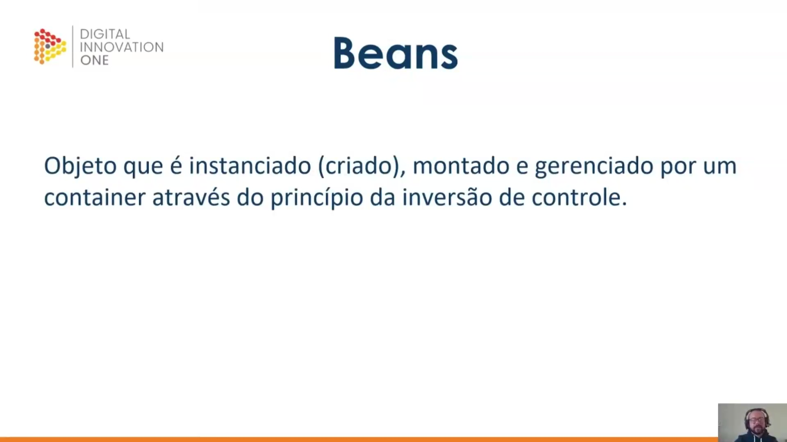
</p>

A imagem define o conceito fundamental de **Beans** dentro do ecossistema Java, especificamente no framework **Spring**.

Em termos simples, um **Spring Bean** é qualquer objeto que o Spring gerencia para você. Em vez de você criar o objeto manualmente usando `new Objeto()`, você deixa essa tarefa para o Spring.

Aqui estão os três pilares mencionados na imagem explicados no contexto do Spring Boot:

* **Instanciado (Criado):** O Spring Container (IoC Container) decide quando criar o objeto.
* **Montado:** O Spring resolve as dependências desse objeto. Se o seu Bean "A" precisa do Bean "B" para funcionar, o Spring injeta o "B" dentro do "A" automaticamente.
* **Gerenciado:** O Spring cuida do ciclo de vida do objeto (desde a sua criação até o momento em que ele é destruído).

#### A Inversão de Controle (IoC)

A imagem menciona que isso ocorre através do princípio da **Inversão de Controle**. No desenvolvimento tradicional, você controla o fluxo e a criação dos objetos. No Spring, você "inverte" esse controle: você apenas anota sua classe (com `@Component`, `@Service`, ou `@Bean`) e o framework assume a responsabilidade de gerenciar essas instâncias.

<p align="center">
  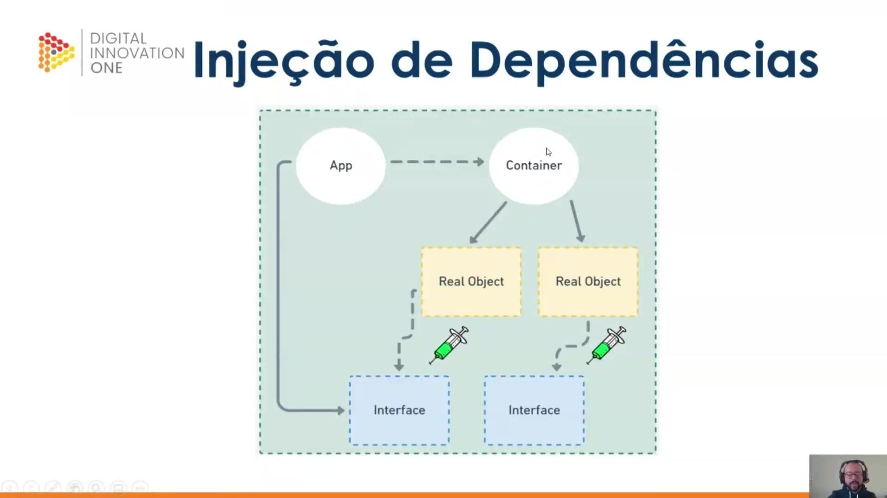
</p>

A imagem ilustra o conceito de **Injeção de Dependências (DI)**, um padrão fundamental no ecossistema Java e Spring Boot.

Segue um resumo do que cada componente representa nesse fluxo:

#### 1. O App e a Interface

No desenvolvimento moderno, o seu código (**App**) não deve depender de classes concretas, mas sim de **Interfaces**. Isso permite que o sistema seja flexível. O "App" sabe *o que* precisa ser feito, mas não *como* ou *quem* fará.

#### 2. O Container (Spring IoC)

O círculo rotulado como **Container** representa o **Spring IoC Container** (Inversion of Control). Ele é o "cérebro" do framework. Em vez de você criar os objetos manualmente usando `new Objeto()`, o Spring assume essa responsabilidade.

* Ele gerencia o ciclo de vida dos objetos (chamados de **Beans**).

#### 3. Real Object (A Implementação)

O **Real Object** é a classe concreta que implementa a interface. É aqui que está a lógica de negócio real (ex: uma classe que acessa o banco de dados).

#### 4. O Ato da Injeção (A Seringa)

O ícone da seringa simboliza a **Injeção**.

* O Spring identifica que seu "App" precisa de uma "Interface".
* Ele vai até o seu catálogo de objetos, instancia o "Real Object" e o **injeta** automaticamente onde ele é solicitado (geralmente através da anotação `@Autowired`).

<p align="center">
  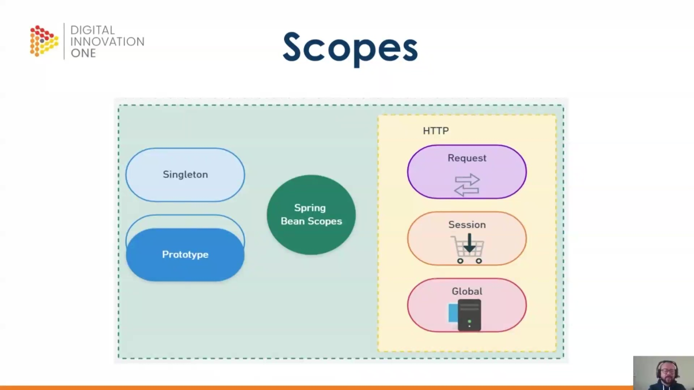
</p>

A imagem apresenta os **Bean Scopes** (escopos de beans) no ecossistema **Spring Framework**. No Spring, um "bean" é um objeto que é instanciado, montado e gerenciado pelo container do Spring IoC (Inversão de Controle).

O escopo define o **tempo de vida** e a **visibilidade** de uma instância de bean. A imagem divide os escopos em duas categorias principais:

#### 1. Escopos Padrão (Core)

Estão disponíveis em qualquer aplicação Spring (console, desktop ou web):

* **Singleton (Padrão):** O Spring cria apenas **uma única instância** do bean para todo o container. Sempre que o bean for solicitado, a mesma instância será retornada. É o ideal para serviços sem estado (*stateless*).
* **Prototype:** Uma **nova instância** é criada toda vez que o bean é solicitado ao container. Útil para objetos que mantêm estado específico de uma operação.

#### 2. Escopos Web (HTTP)

Estão disponíveis apenas em aplicações que utilizam o contexto Web (como Spring MVC ou Spring Boot Web):

* **Request:** Uma nova instância é criada para cada **requisição HTTP**. O bean "morre" assim que a resposta é enviada ao cliente.
* **Session:** Uma instância é criada para cada **sessão de usuário** (Session ID). O objeto persiste enquanto a sessão do navegador estiver ativa (ex: um carrinho de compras).
* **Global (Application):** O bean é compartilhado por todas as requisições e sessões dentro do ciclo de vida do `ServletContext`. É similar ao Singleton, mas focado no contexto da aplicação web.

#### Resumo Comparativo

| Escopo | Ciclo de Vida | Uso Comum |
| --- | --- | --- |
| **Singleton** | Um por container | Services, Repositories |
| **Prototype** | Novo a cada chamada | Objetos com estado (stateful) |
| **Request** | Um por requisição HTTP | Dados de formulário, logs de request |
| **Session** | Um por usuário logado | Carrinho de compras, perfil de usuário |

<p align="center">
  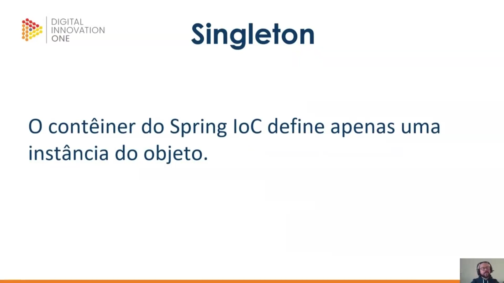
</p>

A imagem refere-se ao escopo **Singleton**, que é o comportamento padrão (*default*) para os objetos (Beans) gerenciados pelo Spring Framework.

Aqui está uma explicação resumida do conceito:


#### O que é o Singleton no Spring?

No Spring Boot, quando você define uma classe como um Componente (usando `@Component`, `@Service`, `@Repository`, etc.), o **Contêiner IoC** (Inversão de Controle) cria e mantém **apenas uma única instância** desse objeto para toda a aplicação.

#### Como funciona na prática:

* **Instância Única:** Independentemente de quantas vezes você injete esse Bean (via `@Autowired`) em diferentes partes do código, o Spring fornecerá sempre a mesma referência de memória.
* **Eficiência:** Isso economiza recursos (memória e CPU), pois evita a criação repetitiva de objetos que não mantêm estado específico de um usuário (como serviços de lógica de negócio ou repositórios de banco de dados).
* **Compartilhamento:** Por ser uma instância única, é importante que esses objetos sejam *stateless* (sem estado), para evitar problemas de concorrência quando múltiplos usuários acessarem o sistema simultaneamente.

#### Diferença Importante

Vale lembrar que o Singleton do Spring é ligeiramente diferente do **Design Pattern Singleton** clássico (do GoF). Enquanto o padrão clássico garante uma instância por *Classloader*, o Singleton do Spring garante uma instância **por contêiner (ApplicationContext)**.

<p align="center">
  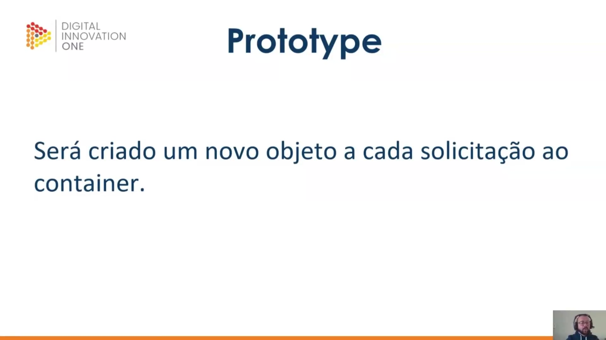
</p>

A imagem refere-se ao **Escopo Prototype** (um dos "Bean Scopes") no ecossistema Spring Framework.

Em termos simples, o Spring Boot utiliza o conceito de Injeção de Dependência, onde o "Container" gerencia o ciclo de vida dos objetos (Beans). Existem dois escopos principais:

#### 1. O que é o Escopo Prototype?

Diferente do escopo padrão (**Singleton**), onde apenas uma única instância do objeto é criada para toda a aplicação, no escopo **Prototype**:

* **Nova Instância:** O Spring cria uma **nova instância** do Bean toda vez que ele é solicitado pelo código (via `getBean()` ou injeção em outro componente).
* **Estado Único:** É ideal para objetos que mantêm estado (variáveis que mudam) e que não devem ser compartilhados entre diferentes partes da aplicação ou usuários.

#### 2. Comparação Rápida

| Característica | Singleton (Padrão) | Prototype |
| --- | --- | --- |
| **Instâncias** | Uma única por container. | Uma nova a cada requisição. |
| **Uso comum** | Services, Repositories, Controllers. | Objetos com estado, processamento de dados únicos. |
| **Ciclo de Vida** | Gerenciado totalmente pelo Spring. | O Spring cria, mas não gerencia a destruição. |

#### Como definir no código?

No Java, você utiliza a anotação `@Scope`:

```java
@Component
@Scope("prototype")
public class MeuComponente {
    // Cada vez que injetado, será um objeto novo na memória
}
```

<p align="center">
  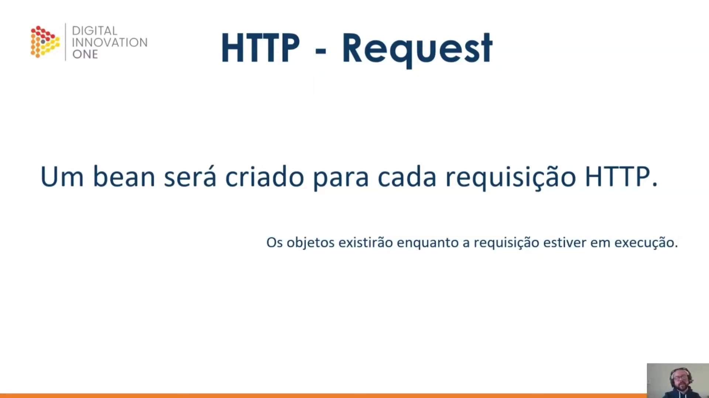
</p>

A imagem refere-se ao **Request Scope** (Escopo de Requisição), um dos tipos de ciclos de vida de um bean dentro do ecossistema Spring Framework.

Aqui está o resumo técnico do que isso significa no dia a dia do desenvolvimento:

#### O que é o Escopo de Request?

No Spring, por padrão, os beans são `Singletons` (uma única instância para toda a aplicação). No entanto, ao definir um bean como `@RequestScope`, o comportamento muda para o que está descrito na imagem:

* **Instanciação por Demanda:** Para cada nova requisição HTTP que chega ao servidor, o Spring Container cria uma instância específica desse objeto.
* **Isolamento:** Duas requisições simultâneas terão objetos diferentes, garantindo que os dados de uma não "vazem" para a outra.
* **Ciclo de Vida Curto:** Assim que a resposta HTTP é enviada de volta ao cliente e o processamento termina, o bean é descartado e se torna elegível para o *Garbage Collector*.

#### Exemplo de Uso

Geralmente é utilizado para armazenar informações específicas daquela interação atual, como:

1. **Dados de autenticação** do usuário logado naquela requisição.
2. **Logs de auditoria** que precisam rastrear o caminho de uma chamada específica.
3. **Carrinhos de compra** em fluxos onde o estado não deve persistir além daquela ação.

#### Comparação Rápida

| Escopo | Duração |
| --- | --- |
| **Singleton** | Durante toda a execução da aplicação (padrão). |
| **Request** | Apenas enquanto a requisição HTTP durar. |
| **Session** | Enquanto durar a sessão do usuário (múltiplas requisições). |


<p align="center">
  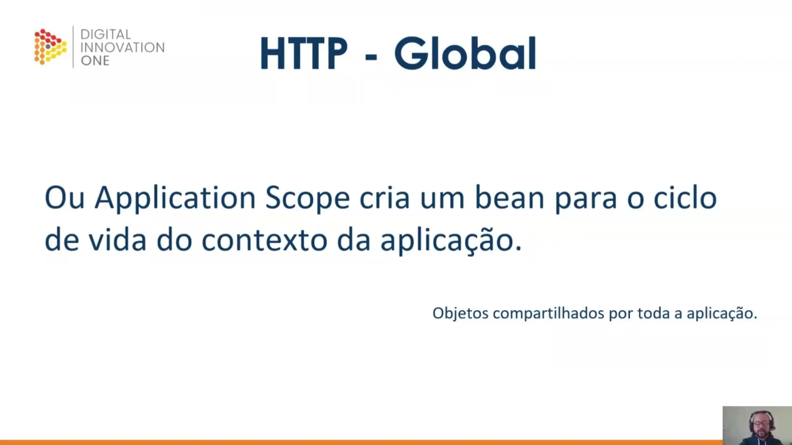
</p>

A imagem aborda o conceito de **Application Scope** (Escopo de Aplicação) dentro do ecossistema Java, especificamente no framework Spring Boot.

Aqui está um resumo do que isso significa na prática:

#### O que é o Application Scope?

No Spring, o escopo de um *bean* (um objeto gerenciado pelo framework) define quanto tempo ele vive e quem pode acessá-lo. O **Application Scope** é um dos escopos web e funciona da seguinte forma:

* **Ciclo de Vida Único:** O bean é criado uma única vez quando a aplicação inicia e é destruído apenas quando ela é desligada.
* **Compartilhamento Global:** Como diz o texto na imagem ("Objetos compartilhados por toda a aplicação"), qualquer usuário ou requisição HTTP que acesse o sistema verá a **mesma instância** desse objeto.
* **Contexto:** Ele é armazenado no `ServletContext`.

#### Diferença Prática (Singleton vs. Application)

Embora pareça com o escopo padrão do Spring (*Singleton*), há uma sutil diferença técnica:

1. **Singleton:** É um por "Contexto do Spring" (ApplicationContext).
2. **Application Scope:** É um por "Contexto de Servlet" (ServletContext). Em uma aplicação web padrão, eles costumam ser equivalentes.

#### Exemplo de Uso

Geralmente é usado para armazenar informações que precisam estar disponíveis para todos os usuários em qualquer parte do sistema, como:

* Configurações globais carregadas do banco de dados.
* Contadores de visitas globais.
* Metadados da aplicação que não mudam entre sessões de usuários diferentes.

-->

<p align="center">
  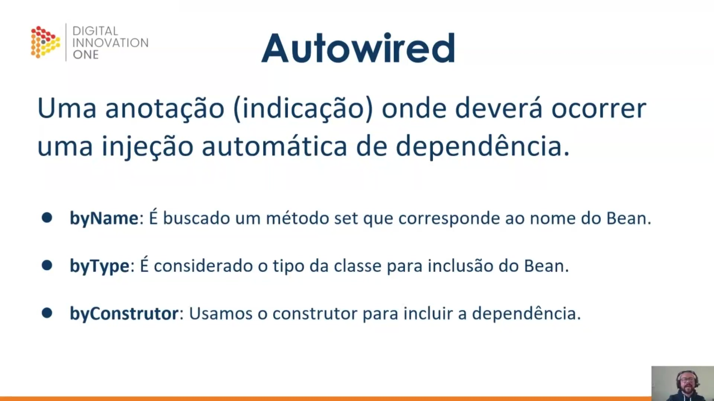
</p>


<p align="center">
  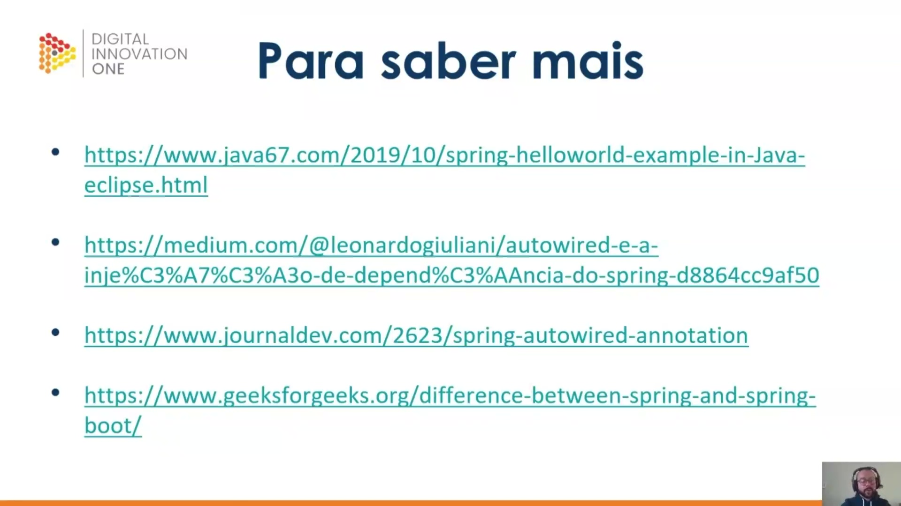
</p>

O slide detalha o escopo **Prototype**. Diferentemente do singleton, o escopo prototype faz com que o container Spring crie uma **nova instância** do bean toda vez que ele for solicitado pela aplicação. Esse escopo é apropriado para beans que mantêm estado e não podem ser compartilhados entre diferentes requisições ou operações.

<p align="center">
  
</p>

Este slide explica o escopo **Request**. Válido apenas em aplicações web, este escopo faz com que uma nova instância de bean seja criada para cada requisição HTTP. O objeto existe e é único durante o processamento de uma única requisição, sendo descartado ao final dela. É útil para armazenar dados que são específicos de uma interação do usuário.

<p align="center">
  
</p>


O slide aborda os escopos de nível de aplicação web, especificamente o **Session** e o **Application**. O escopo **Session** (embora não explicitamente nomeado, é inferido pelo contexto HTTP) vincula o ciclo de vida do bean ao de uma sessão HTTP do usuário. Já o escopo **Application** (ou Global) cria um bean que vive durante todo o ciclo de vida do contexto da aplicação, sendo compartilhado por todos os usuários e sessões, similar ao singleton, mas ligado ao `ServletContext`.

<p align="center">
  
</p>


A imagem apresenta a anotação `@Autowired`. Esta é uma das principais anotações do Spring e serve como uma marcação para indicar ao container onde uma injeção automática de dependência deve ocorrer. O slide lista as três principais estratégias que o Spring pode usar para resolver qual bean injetar:
- **byName**: Busca um bean cujo nome corresponda ao nome da propriedade (geralmente o nome do método setter).
- **byType**: Considera o tipo da classe da propriedade para encontrar um bean compatível.
- **byConstructor**: Usa o construtor da classe para injetar as dependências necessárias.


## Parte 2 - Projeto Springboot

### 🟩 Vídeo 04 - Conhecendo o Springboot

<video width="60%" controls>
  <source src="000-Midia_e_Anexos/bootcamp_tqi_fullstack-modulo.07-curso.02-video_04.webm" type="video/webm">
    Seu navegador não suporta vídeo HTML5.
</video>

link do vídeo:

### 🟩 Vídeo 05 - Primeiros passos

<video width="60%" controls>
  <source src="000-Midia_e_Anexos/bootcamp_tqi_fullstack-modulo.07-curso.02-video_05.webm" type="video/webm">
    Seu navegador não suporta vídeo HTML5.
</video>

link do vídeo:

### 🟩 Vídeo 06 - Beans versus Components

<video width="60%" controls>
  <source src="000-Midia_e_Anexos/bootcamp_tqi_fullstack-modulo.07-curso.02-video_06.webm" type="video/webm">
    Seu navegador não suporta vídeo HTML5.
</video>

link do vídeo:

### 🟩 Vídeo 07 - Scopes - Singleton ou Prototype

<video width="60%" controls>
  <source src="000-Midia_e_Anexos/bootcamp_tqi_fullstack-modulo.07-curso.02-video_07.webm" type="video/webm">
    Seu navegador não suporta vídeo HTML5.
</video>

link do vídeo:

### 🟩 Vídeo 08 - Properties Value

<video width="60%" controls>
  <source src="000-Midia_e_Anexos/bootcamp_tqi_fullstack-modulo.07-curso.02-video_08.webm" type="video/webm">
    Seu navegador não suporta vídeo HTML5.
</video>

link do vídeo:

### 🟩 Vídeo 09 - Configuration Properties

<video width="60%" controls>
  <source src="000-Midia_e_Anexos/bootcamp_tqi_fullstack-modulo.07-curso.02-video_09.webm" type="video/webm">
    Seu navegador não suporta vídeo HTML5.
</video>

link do vídeo:

### 🟩 Vídeo 10 - Conceito de ORM e JPA

<video width="60%" controls>
  <source src="000-Midia_e_Anexos/bootcamp_tqi_fullstack-modulo.07-curso.02-video_10.webm" type="video/webm">
    Seu navegador não suporta vídeo HTML5.
</video>

link do vídeo:

### 🟩 Vídeo 11 - Spring Data JPA

<video width="60%" controls>
  <source src="000-Midia_e_Anexos/bootcamp_tqi_fullstack-modulo.07-curso.02-video_11.webm" type="video/webm">
    Seu navegador não suporta vídeo HTML5.
</video>

link do vídeo:

### 🟩 Vídeo 12 - Conexão com Postgres

<video width="60%" controls>
  <source src="000-Midia_e_Anexos/bootcamp_tqi_fullstack-modulo.07-curso.02-video_12.webm" type="video/webm">
    Seu navegador não suporta vídeo HTML5.
</video>

link do vídeo:

### 🟩 Vídeo 13 - JPA Repository

<video width="60%" controls>
  <source src="000-Midia_e_Anexos/bootcamp_tqi_fullstack-modulo.07-curso.02-video_13.webm" type="video/webm">
    Seu navegador não suporta vídeo HTML5.
</video>

link do vídeo:

## Parte 3 - Conclusão

### 🟩 Vídeo 14 - Conclusão e Para saber mais

<video width="60%" controls>
  <source src="000-Midia_e_Anexos/bootcamp_tqi_fullstack-modulo.07-curso.02-video_14.webm" type="video/webm">
    Seu navegador não suporta vídeo HTML5.
</video>

link do vídeo:

## Materiais de Apoio

# Certificado: 

- Link na plataforma: 
- Certificado em pdf: