## Instrutor

- Gleyson Sampaio (Analista Desenvolvedor Java)
- Contato Linkedin: / [glysns](https://www.linkedin.com/in/glysns/)

## Parte 1 - Apresentação inicial

### 🟩 Vídeo 01 - Abertura

<video width="60%" controls>
  <source src="000-Midia_e_Anexos/bootcamp_tqi_fullstack-modulo.07-curso.02-video_01.webm" type="video/webm">
    Seu navegador não suporta vídeo HTML5.
</video>

link do vídeo: https://web.dio.me/track/tqi-fullstack-developer/course/imersao-no-spring-framework-com-spring-boot/learning/76dae2f8-07b8-4801-b66a-cdc38209ab87?autoplay=1

Este vídeo marca o início de uma jornada educacional na plataforma Digital Innovation One (DIO), focada no ecossistema Spring. O objetivo central é explorar as características que tornam o Spring uma escolha dominante no desenvolvimento Java moderno, com ênfase especial no Spring Boot como ferramenta de aceleração de produtividade e simplificação de processos para desenvolvedores.

### 🟩 Vídeo 02 - Visão geral do curso

<video width="60%" controls>
  <source src="000-Midia_e_Anexos/bootcamp_tqi_fullstack-modulo.07-curso.02-video_02.webm" type="video/webm">
    Seu navegador não suporta vídeo HTML5.
</video>

link do vídeo: https://web.dio.me/track/tqi-fullstack-developer/course/imersao-no-spring-framework-com-spring-boot/learning/4ab3939a-431c-4a21-b58d-3d5cc83ace5a?autoplay=1

Este curso, ministrado por Gleyson Sampaio em parceria com a Digital Innovation One (DIO), oferece uma imersão profunda no ecossistema Spring Framework. O foco central é capacitar desenvolvedores a utilizarem o poder do Spring Boot para criar aplicações modernas, eficientes e escaláveis, abordando desde conceitos arquiteturais fundamentais até a integração com bancos de dados.

### Anotações

<p align="center">

</p>

Esta é a abertura do curso de **Spring Framework**, uma iniciativa realizada pela **Digital Innovation One**. A instrução é conduzida por **Gleyson Sampaio**, Instrutor Java, e o conteúdo propõe uma imersão focada nos recursos e na capacidade de utilização do ecossistema **Spring Boot**.

<p align="center">

</p>

O instrutor apresenta sua trajetória profissional, destacando mais de **10 anos de experiência** no desenvolvimento de software. Sua atuação engloba setores como o tributário, bancário (com experiência na BM&FBOVESPA), seguradoras e instituições de ensino. Além da experiência de mercado, o instrutor possui a certificação **Oracle Certified Professional Java SE 6 Programmer**.

<p align="center">

</p>

O cronograma de aprendizado para o curso de **SpringBoot Framework** abrange os seguintes tópicos fundamentais:

* **Spring Versus Java EE**: Entendimento das diferenças e posicionamento de cada tecnologia.
* **Conceitos de Spring Boot**: Definição e objetivos da ferramenta.
* **IoC / DI**: Exploração dos conceitos de Inversão de Controle e Injeção de Dependência.
* **Beans, Autowired e Scopes**: Componentes essenciais do gerenciamento de objetos no Spring.
* **Spring Data JPA**: Noções para interação e persistência de dados em bancos de dados.

### 🟩 Vídeo 03 - Spring Framework

<video width="60%" controls>
  <source src="000-Midia_e_Anexos/bootcamp_tqi_fullstack-modulo.07-curso.02-video_03.webm" type="video/webm">
    Seu navegador não suporta vídeo HTML5.
</video>

link do vídeo: https://web.dio.me/track/tqi-fullstack-developer/course/imersao-no-spring-framework-com-spring-boot/learning/4deb3bc2-cc61-43f1-9efa-ce1c1dbec135?autoplay=1

O Spring Framework é uma estrutura open-source para a plataforma Java, projetada para reduzir a complexidade e a verbosidade no desenvolvimento de aplicações. Ele se baseia fortemente nos princípios de Inversão de Controle (IoC) e Injeção de Dependência (DI), permitindo que os desenvolvedores criem sistemas modulares, testáveis e com baixo acoplamento.

### Anotações

<p align="center">

</p>

Esta imagem marca o início da aula sobre os **Fundamentos do Spring Framework**. Trata-se de uma introdução ao ecossistema Spring, apresentada no contexto da jornada de aprendizado da Digital Innovation One. O foco inicial da disciplina será estabelecer as bases conceituais e as boas práticas que sustentam o framework.

<p align="center">

</p>

Apresentação do instrutor Gleyson Sampaio, que possui mais de 10 anos de experiência em desenvolvimento de software em setores como Tributário, Bancos (incluindo a BM&F BOVESPA) e Seguradoras. O instrutor é certificado como **Oracle Certified Professional Java SE 6 Programmer** desde 2015. Atualmente, seu foco profissional é voltado para a área educacional, atuando como instrutor Java.

<p align="center">

</p>

Este slide detalha os tópicos que compõem a jornada de fundamentos do Spring Framework. Os pontos principais incluem:

* Definição e origens do Spring Framework;
* Comparativo entre Spring e Java EE;
* Conceito de Inversão de Controle (IoC);
* Injeção de Dependências e o uso de componentes como Beans, Autowired e Scopes.

<p align="center">

</p>

O **Spring Framework** é definido como um framework *open source* para a plataforma Java, estruturado com base nos padrões de Inversão de Controle (IoC) e Injeção de Dependência. Ele é composto por diversos módulos projetados para reduzir a complexidade no desenvolvimento de aplicações, atendendo desde projetos simples até sistemas corporativos robustos.

<p align="center">

</p>

A imagem ilustra a arquitetura modular do **Spring Framework Runtime**, dividida em camadas principais:

* **Core Container**: Contendo os módulos Beans, Core, Context e Expression Language, que formam a base do framework.
* **Data Access/Integration**: Módulos para lidar com persistência e transações, como JDBC, ORM, OXM, JMS e Transactions.
* **Web**: Suporte para aplicações web através de Servlet, Portlet e integração com Struts.
* **AOP, Aspects e Instrumentation**: Camadas para Programação Orientada a Aspectos e instrumentação.
* **Test**: Módulo dedicado para testes unitários e de integração.

<p align="center">

</p>

O slide introduz o comparativo histórico entre o **Java EE** e o **Spring**. Essa análise é fundamental para entender o que motivou a criação do Spring e como ele se posicionou como uma alternativa à especificação oficial do Java para o desenvolvimento corporativo.

<p align="center">

</p>

Historicamente, o Java EE era considerado complexo em suas versões iniciais, o que tornava o uso do Spring um caminho mais simples para a evolução de softwares. No entanto, a discussão entre as duas abordagens tornou-se mais equilibrada com o lançamento da versão 5 do Java EE, que buscou simplificar seus processos.

<p align="center">

</p>

A **Inversão de Controle (IoC)** é o conceito central (*core*) do ecossistema Spring. Trata-se do redirecionamento do fluxo de execução do código, onde o controle sobre a criação e gerenciamento de objetos é retirado do programador e delegado a um container. O principal propósito desta técnica é minimizar o acoplamento do código.

<p align="center">

</p>

Em um cenário **sem Inversão de Controle (IoC)**, a própria aplicação é responsável por criar e gerenciar a instância de cada objeto que precisa utilizar. Nesse modelo, a aplicação executa manualmente as ações de "Criar Objeto" antes de poder realizar a ação de "Usar Objeto".

<p align="center">

</p>

No cenário **com Inversão de Controle (IoC)**, a aplicação delega a responsabilidade de criação para um **Container**. O container assume a tarefa de criar as instâncias necessárias ("Deixa comigo"), permitindo que a aplicação apenas utilize os objetos, o que resulta em um código mais coeso e menos acoplado.

<p align="center">
  
</p>

A imagem introduz formalmente o padrão de **Injeção de Dependências**. Este é o mecanismo prático que viabiliza a Inversão de Controle. O slide define a injeção de dependências como um padrão de desenvolvimento cuja finalidade é manter baixo o nível de acoplamento entre os módulos de um sistema. Em vez de um objeto criar suas dependências internamente, as dependências são "injetadas" nele por um agente externo (o container Spring), promovendo maior coesão e reuso.

<p align="center">
  
</p>

A imagem ilustra o conceito de **Injeção de Dependências (DI)**, um padrão fundamental no ecossistema Spring Boot para promover o baixo acoplamento.

Segue o resumo do fluxo apresentado:

#### 1. O Problema: Acoplamento

Em um sistema tradicional, a classe `App` criaria manualmente suas próprias dependências (usando `new Objeto()`). Isso gera um acoplamento forte: se o objeto mudar, a `App` precisa ser alterada.

#### 2. A Solução: Inversão de Controle (IoC)

Na imagem, a `App` não cria mais nada. Ela apenas define que precisa de uma funcionalidade através de uma **Interface** (as caixas azuis na base).

* **O Container (Spring IoC Container):** É o "cérebro" representado pelo círculo branco. Ele é responsável por instanciar, configurar e gerenciar o ciclo de vida dos objetos (chamados de **Beans**).
* **Real Object (Componentes):** São as implementações concretas (anotadas com `@Service`, `@Repository`, etc.).

#### 3. A "Injeção" (Seringas)

As seringas simbolizam o ato de injetar. O Spring olha para a sua classe, vê que ela precisa de uma interface (geralmente via `@Autowired` no construtor) e, em tempo de execução, fornece o `Real Object` correto para preencher aquela lacuna.

**Resumo da lógica no Java/Spring:**

* **App:** Solicita a dependência.
* **Interface:** Define o contrato (o que deve ser feito).
* **Container (Spring):** Fabrica o objeto real e o entrega pronto para uso.
* **Resultado:** Código fácil de testar (você pode injetar um objeto "falso" ou *mock* nos testes) e de manter.

<p align="center">
  
</p>

A imagem define o conceito fundamental de **Beans** dentro do ecossistema Java, especificamente no framework **Spring**.

Em termos simples, um **Spring Bean** é qualquer objeto que o Spring gerencia para você. Em vez de você criar o objeto manualmente usando `new Objeto()`, você deixa essa tarefa para o Spring.

Aqui estão os três pilares mencionados na imagem explicados no contexto do Spring Boot:

* **Instanciado (Criado):** O Spring Container (IoC Container) decide quando criar o objeto.
* **Montado:** O Spring resolve as dependências desse objeto. Se o seu Bean "A" precisa do Bean "B" para funcionar, o Spring injeta o "B" dentro do "A" automaticamente.
* **Gerenciado:** O Spring cuida do ciclo de vida do objeto (desde a sua criação até o momento em que ele é destruído).

#### A Inversão de Controle (IoC)

A imagem menciona que isso ocorre através do princípio da **Inversão de Controle**. No desenvolvimento tradicional, você controla o fluxo e a criação dos objetos. No Spring, você "inverte" esse controle: você apenas anota sua classe (com `@Component`, `@Service`, ou `@Bean`) e o framework assume a responsabilidade de gerenciar essas instâncias.

<p align="center">
  
</p>

A imagem ilustra o conceito de **Injeção de Dependências (DI)**, um padrão fundamental no ecossistema Java e Spring Boot.

Segue um resumo do que cada componente representa nesse fluxo:

#### 1. O App e a Interface

No desenvolvimento moderno, o seu código (**App**) não deve depender de classes concretas, mas sim de **Interfaces**. Isso permite que o sistema seja flexível. O "App" sabe *o que* precisa ser feito, mas não *como* ou *quem* fará.

#### 2. O Container (Spring IoC)

O círculo rotulado como **Container** representa o **Spring IoC Container** (Inversion of Control). Ele é o "cérebro" do framework. Em vez de você criar os objetos manualmente usando `new Objeto()`, o Spring assume essa responsabilidade.

* Ele gerencia o ciclo de vida dos objetos (chamados de **Beans**).

#### 3. Real Object (A Implementação)

O **Real Object** é a classe concreta que implementa a interface. É aqui que está a lógica de negócio real (ex: uma classe que acessa o banco de dados).

#### 4. O Ato da Injeção (A Seringa)

O ícone da seringa simboliza a **Injeção**.

* O Spring identifica que seu "App" precisa de uma "Interface".
* Ele vai até o seu catálogo de objetos, instancia o "Real Object" e o **injeta** automaticamente onde ele é solicitado (geralmente através da anotação `@Autowired`).

<p align="center">
  
</p>

A imagem apresenta os **Bean Scopes** (escopos de beans) no ecossistema **Spring Framework**. No Spring, um "bean" é um objeto que é instanciado, montado e gerenciado pelo container do Spring IoC (Inversão de Controle).

O escopo define o **tempo de vida** e a **visibilidade** de uma instância de bean. A imagem divide os escopos em duas categorias principais:

#### 1. Escopos Padrão (Core)

Estão disponíveis em qualquer aplicação Spring (console, desktop ou web):

* **Singleton (Padrão):** O Spring cria apenas **uma única instância** do bean para todo o container. Sempre que o bean for solicitado, a mesma instância será retornada. É o ideal para serviços sem estado (*stateless*).
* **Prototype:** Uma **nova instância** é criada toda vez que o bean é solicitado ao container. Útil para objetos que mantêm estado específico de uma operação.

#### 2. Escopos Web (HTTP)

Estão disponíveis apenas em aplicações que utilizam o contexto Web (como Spring MVC ou Spring Boot Web):

* **Request:** Uma nova instância é criada para cada **requisição HTTP**. O bean "morre" assim que a resposta é enviada ao cliente.
* **Session:** Uma instância é criada para cada **sessão de usuário** (Session ID). O objeto persiste enquanto a sessão do navegador estiver ativa (ex: um carrinho de compras).
* **Global (Application):** O bean é compartilhado por todas as requisições e sessões dentro do ciclo de vida do `ServletContext`. É similar ao Singleton, mas focado no contexto da aplicação web.

#### Resumo Comparativo

| Escopo | Ciclo de Vida | Uso Comum |
| --- | --- | --- |
| **Singleton** | Um por container | Services, Repositories |
| **Prototype** | Novo a cada chamada | Objetos com estado (stateful) |
| **Request** | Um por requisição HTTP | Dados de formulário, logs de request |
| **Session** | Um por usuário logado | Carrinho de compras, perfil de usuário |

<p align="center">
  
</p>

A imagem refere-se ao escopo **Singleton**, que é o comportamento padrão (*default*) para os objetos (Beans) gerenciados pelo Spring Framework.

Segue uma explicação resumida do conceito:

#### O que é o Singleton no Spring?

No Spring Boot, quando você define uma classe como um Componente (usando `@Component`, `@Service`, `@Repository`, etc.), o **Contêiner IoC** (Inversão de Controle) cria e mantém **apenas uma única instância** desse objeto para toda a aplicação.

#### Como funciona na prática:

* **Instância Única:** Independentemente de quantas vezes você injete esse Bean (via `@Autowired`) em diferentes partes do código, o Spring fornecerá sempre a mesma referência de memória.
* **Eficiência:** Isso economiza recursos (memória e CPU), pois evita a criação repetitiva de objetos que não mantêm estado específico de um usuário (como serviços de lógica de negócio ou repositórios de banco de dados).
* **Compartilhamento:** Por ser uma instância única, é importante que esses objetos sejam *stateless* (sem estado), para evitar problemas de concorrência quando múltiplos usuários acessarem o sistema simultaneamente.

#### Diferença Importante

Vale lembrar que o Singleton do Spring é ligeiramente diferente do **Design Pattern Singleton** clássico (do GoF). Enquanto o padrão clássico garante uma instância por *Classloader*, o Singleton do Spring garante uma instância **por contêiner (ApplicationContext)**.

<p align="center">
  
</p>

A imagem refere-se ao **Escopo Prototype** (um dos "Bean Scopes") no ecossistema Spring Framework.

Em termos simples, o Spring Boot utiliza o conceito de Injeção de Dependência, onde o "Container" gerencia o ciclo de vida dos objetos (Beans). Existem dois escopos principais:

#### 1. O que é o Escopo Prototype?

Diferente do escopo padrão (**Singleton**), onde apenas uma única instância do objeto é criada para toda a aplicação, no escopo **Prototype**:

* **Nova Instância:** O Spring cria uma **nova instância** do Bean toda vez que ele é solicitado pelo código (via `getBean()` ou injeção em outro componente).
* **Estado Único:** É ideal para objetos que mantêm estado (variáveis que mudam) e que não devem ser compartilhados entre diferentes partes da aplicação ou usuários.

#### 2. Comparação Rápida

| Característica | Singleton (Padrão) | Prototype |
| --- | --- | --- |
| **Instâncias** | Uma única por container. | Uma nova a cada requisição. |
| **Uso comum** | Services, Repositories, Controllers. | Objetos com estado, processamento de dados únicos. |
| **Ciclo de Vida** | Gerenciado totalmente pelo Spring. | O Spring cria, mas não gerencia a destruição. |

#### Como definir no código?

No Java, você utiliza a anotação `@Scope`:

```java
@Component
@Scope("prototype")
public class MeuComponente {
    // Cada vez que injetado, será um objeto novo na memória
}
```
<p align="center">
  
</p>

A imagem refere-se ao **Request Scope** (Escopo de Requisição), um dos tipos de ciclos de vida de um bean dentro do ecossistema Spring Framework.

Segue o resumo técnico do que isso significa no dia a dia do desenvolvimento:

#### O que é o Escopo de Request?

No Spring, por padrão, os beans são `Singletons` (uma única instância para toda a aplicação). No entanto, ao definir um bean como `@RequestScope`, o comportamento muda para o que está descrito na imagem:

* **Instanciação por Demanda:** Para cada nova requisição HTTP que chega ao servidor, o Spring Container cria uma instância específica desse objeto.
* **Isolamento:** Duas requisições simultâneas terão objetos diferentes, garantindo que os dados de uma não "vazem" para a outra.
* **Ciclo de Vida Curto:** Assim que a resposta HTTP é enviada de volta ao cliente e o processamento termina, o bean é descartado e se torna elegível para o *Garbage Collector*.

#### Exemplo de Uso

Geralmente é utilizado para armazenar informações específicas daquela interação atual, como:

1. **Dados de autenticação** do usuário logado naquela requisição.
2. **Logs de auditoria** que precisam rastrear o caminho de uma chamada específica.
3. **Carrinhos de compra** em fluxos onde o estado não deve persistir além daquela ação.

#### Comparação Rápida

| Escopo | Duração |
| --- | --- |
| **Singleton** | Durante toda a execução da aplicação (padrão). |
| **Request** | Apenas enquanto a requisição HTTP durar. |
| **Session** | Enquanto durar a sessão do usuário (múltiplas requisições). |

<p align="center">
  
</p>

A imagem aborda o conceito de **Application Scope** (Escopo de Aplicação) dentro do ecossistema Java, especificamente no framework Spring Boot.

Segue um resumo do que isso significa na prática:

#### O que é o Application Scope?

No Spring, o escopo de um *bean* (um objeto gerenciado pelo framework) define quanto tempo ele vive e quem pode acessá-lo. O **Application Scope** é um dos escopos web e funciona da seguinte forma:

* **Ciclo de Vida Único:** O bean é criado uma única vez quando a aplicação inicia e é destruído apenas quando ela é desligada.
* **Compartilhamento Global:** Como diz o texto na imagem ("Objetos compartilhados por toda a aplicação"), qualquer usuário ou requisição HTTP que acesse o sistema verá a **mesma instância** desse objeto.
* **Contexto:** Ele é armazenado no `ServletContext`.

#### Diferença Prática (Singleton vs. Application)

Embora pareça com o escopo padrão do Spring (*Singleton*), há uma sutil diferença técnica:

1. **Singleton:** É um por "Contexto do Spring" (ApplicationContext).
2. **Application Scope:** É um por "Contexto de Servlet" (ServletContext). Em uma aplicação web padrão, eles costumam ser equivalentes.

#### Exemplo de Uso

Geralmente é usado para armazenar informações que precisam estar disponíveis para todos os usuários em qualquer parte do sistema, como:

* Configurações globais carregadas do banco de dados.
* Contadores de visitas globais.
* Metadados da aplicação que não mudam entre sessões de usuários diferentes.

<p align="center">
  
</p>

A imagem apresenta o conceito da anotação **`@Autowired`**, que é o mecanismo central do Spring Framework para realizar a **Injeção de Dependência (DI)** de forma automática.

Em vez de você instanciar manualmente as classes (usando `new`), o Spring gerencia o ciclo de vida dos objetos (Beans) e "entrega" as dependências necessárias para cada componente.

A imagem detalha os três modos principais como essa resolução pode ocorrer:

#### Modos de Injeção de Dependência

| Modo | Descrição |
| --- | --- |
| **byName** | O Spring procura um Bean cujo **ID/Nome** coincida exatamente com o nome da variável ou do método *setter*. |
| **byType** | É o comportamento padrão mais comum. O Spring procura um Bean que seja do **mesmo tipo (classe ou interface)** da variável declarada. |
| **byConstructor** | A dependência é injetada diretamente através do **construtor** da classe. É a prática mais recomendada atualmente, pois garante que o objeto seja criado com todas as dependências obrigatórias. |

#### Por que isso é importante?

O uso do `@Autowired` promove o **desacoplamento** do código. Seguindo a sua própria filosofia de "Engenharia de Mim Mesmo" (basear-se em padrões factuais), o uso dessa anotação automatiza a conexão entre componentes baseando-se em padrões de estrutura e tipo, eliminando a necessidade de configurações manuais extensas e reduzindo erros de montagem do sistema.

<p align="center">
  
</p>

## Parte 2 - Projeto Springboot

### 🟩 Vídeo 04 - Conhecendo o Springboot

<video width="60%" controls>
  <source src="000-Midia_e_Anexos/bootcamp_tqi_fullstack-modulo.07-curso.02-video_04.webm" type="video/webm">
    Seu navegador não suporta vídeo HTML5.
</video>

link do vídeo: https://web.dio.me/track/tqi-fullstack-developer/course/imersao-no-spring-framework-com-spring-boot/learning/18d9fa8b-ea50-4922-a848-182dbbede06f?autoplay=1

Este documento explora o ecossistema do Spring Boot, um framework revolucionário para o desenvolvimento Java. O foco principal é entender como ele automatiza configurações complexas, permitindo que o desenvolvedor se concentre na lógica de negócio em vez de perder tempo com "boilerplate" (código repetitivo) e gerenciamento manual de dependências.

### Anotações

<p align="center">
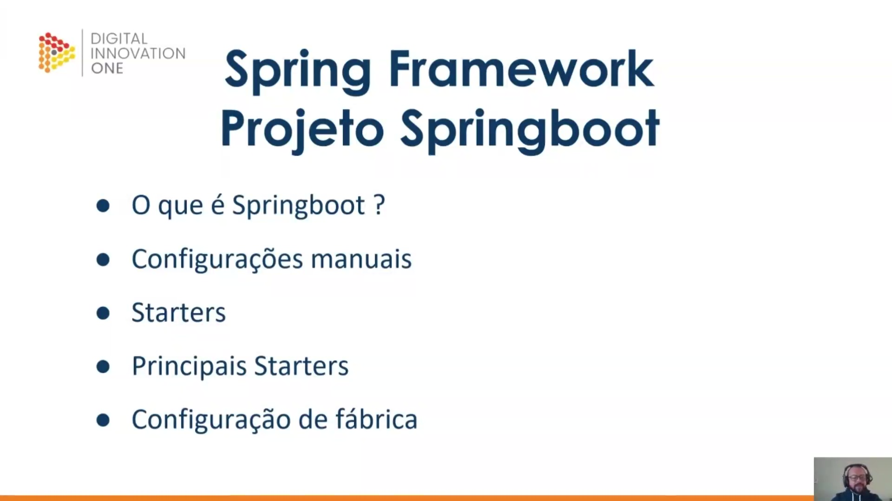
</p>

Nesta aula introdutória, exploramos o ecossistema e as vantagens do **Spring Boot Framework**. O roteiro de aprendizado abrange desde a definição fundamental do que é o Spring Boot até detalhes técnicos sobre configurações manuais, o conceito de *Starters* e as configurações de fábrica. O objetivo principal é compreender como essa ferramenta otimiza a jornada do desenvolvedor Java.

<p align="center">
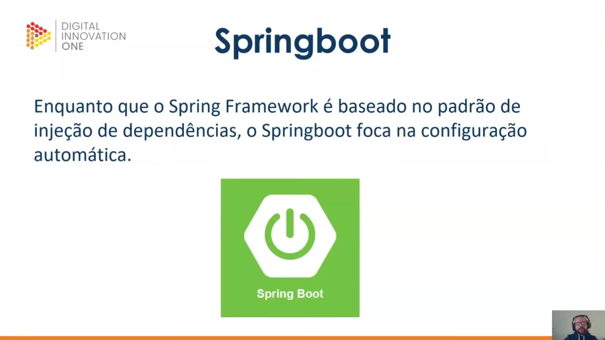
</p>

É fundamental distinguir os papéis do Spring Framework e do Spring Boot. Enquanto o **Spring Framework** é centrado no padrão de injeção de dependências e inversão de controle, o **Spring Boot** foca na **configuração automática**. Ele atua como uma camada que promove produtividade ao adotar convenções de estruturação de projetos, evitando que o desenvolvedor precise lidar com configurações exaustivas para iniciar uma aplicação.

<p align="center">
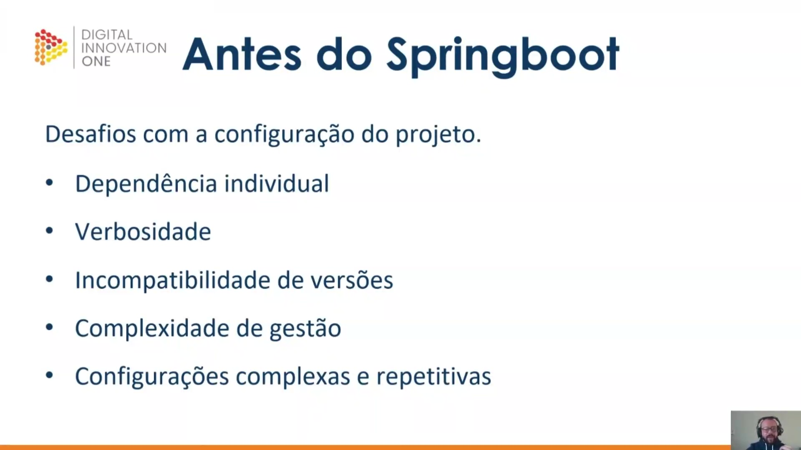
</p>

Antes do surgimento do Spring Boot, o desenvolvimento enfrentava desafios significativos na configuração de projetos:

* **Dependência individual e manual**: Cada biblioteca precisava ser adicionada uma a uma.
* **Verbosidade**: Arquivos de configuração (como o `pom.xml`) tornavam-se extensos e difíceis de ler.
* **Incompatibilidade de versões**: Havia um risco constante de conflitos entre versões de bibliotecas dependentes.
* **Complexidade de gestão**: Manter e replicar configurações homologadas entre diferentes projetos gerava um esforço repetitivo e desgastante.

<p align="center">
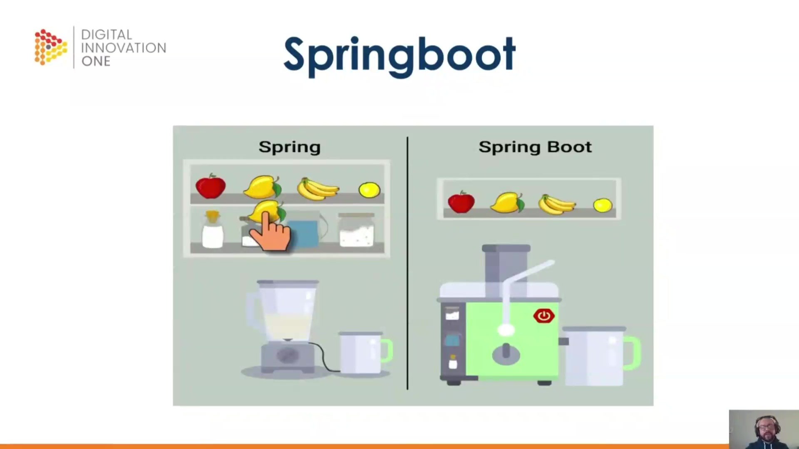
</p>

A diferença de abordagem entre Spring e Spring Boot pode ser ilustrada pela analogia da preparação de um suco. No Spring tradicional, o desenvolvedor precisa reunir todos os componentes e realizar as configurações manuais para obter o resultado final. Já o Spring Boot fornece todas as ferramentas e pré-configurações necessárias de imediato, permitindo que o foco total seja direcionado apenas às regras de negócio da aplicação.

<p align="center">
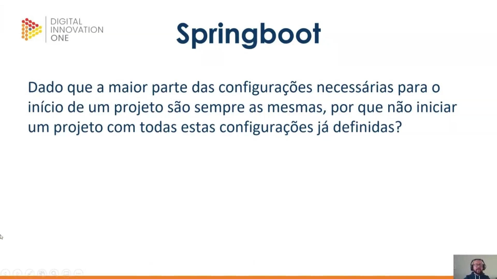
</p>

A filosofia do Spring Boot baseia-se em uma pergunta simples: se a maioria das configurações de início de projeto são idênticas, por que não iniciá-las já definidas?. O Spring Boot não substitui o Spring Framework na injeção de dependência, mas sim o complementa ao oferecer estruturas predefinidas que aumentam drasticamente a produtividade.

<p align="center">
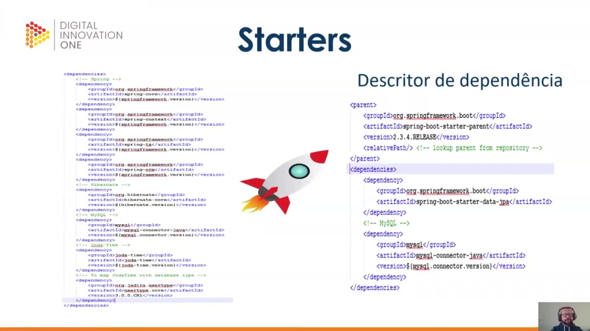
</p>

Os **Starters** são descritores de dependência que encapsulam diversos módulos em uma única instrução. Na forma tradicional, seria necessário listar manualmente o núcleo do Spring, o Hibernate, o driver do banco e bibliotecas auxiliares (como Joda-Time). Com o Spring Boot, basta declarar o starter correspondente ao contexto desejado, reduzindo drasticamente a quantidade de código no descritor do projeto.

```xml
<parent>
    <groupId>org.springframework.boot</groupId>
    <artifactId>spring-boot-starter-parent</artifactId>
    <version>2.3.4.RELEASE</version>
    <relativePath/> </parent>

<dependencies>
    <dependency>
        <groupId>org.springframework.boot</groupId>
        <artifactId>spring-boot-starter-data-jpa</artifactId>
    </dependency>
    <dependency>
        <groupId>mysql</groupId>
        <artifactId>mysql-connector-java</artifactId>
        <version>${mysql.connector.version}</version>
    </dependency>
</dependencies>
```

<p align="center">
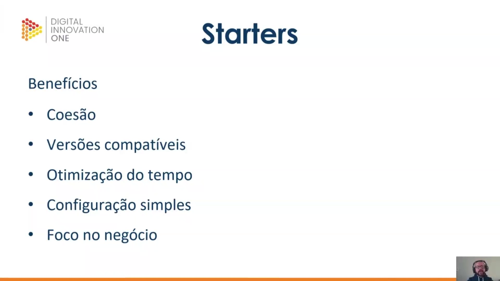
</p>

O uso de Starters traz benefícios diretos para o desenvolvimento:

* **Coesão e Configuração simples**: Uma única dependência gerencia subdependências relacionadas.
* **Versões compatíveis**: O Spring Boot homologa as versões de todas as bibliotecas dependentes para garantir que funcionem juntas sem conflitos.
* **Otimização do tempo e Foco no negócio**: Reduz-se o tempo gasto com infraestrutura, permitindo dedicação total à implementação dos requisitos do usuário.

<p align="center">
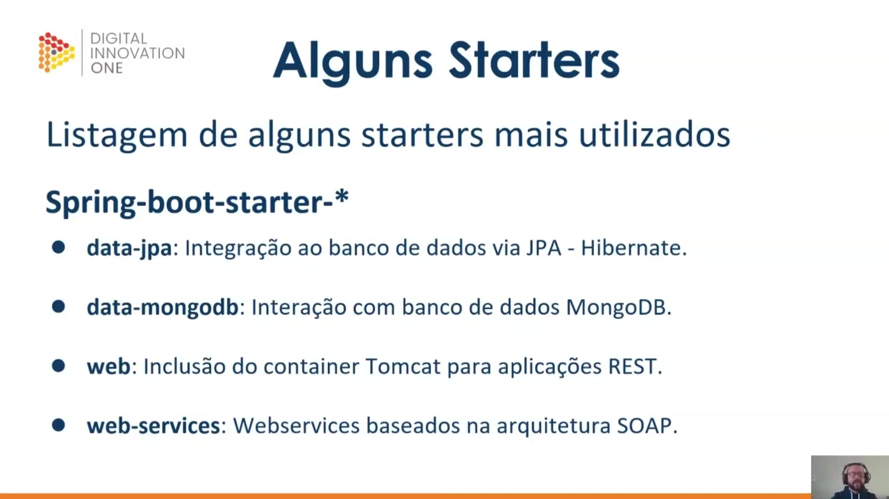
</p>

Existem diversos starters para diferentes propósitos:

* **data-jpa**: Para integração com bancos de dados via JPA e Hibernate.
* **data-mongodb**: Destinado à interação com bancos de dados NoSQL MongoDB.
* **web**: Inclui o container Tomcat para a criação de aplicações RESTful.
* **web-services**: Utilizado para serviços baseados na arquitetura SOAP.

<p align="center">
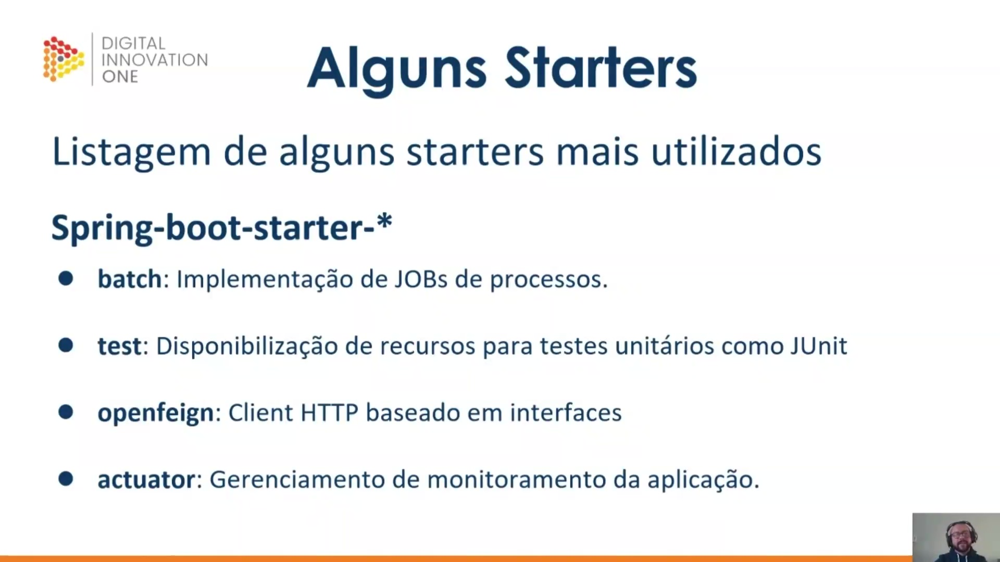
</p>

Outros starters recorrentes na comunidade incluem:

* **batch**: Para implementação de jobs e processamento em lote.
* **test**: Disponibiliza recursos fundamentais para testes unitários, como o JUnit.
* **openfeign**: Um cliente HTTP baseado em interfaces, altamente produtivo para consumo de APIs externas.
* **actuator**: Ferramenta essencial para o gerenciamento e monitoramento da saúde da aplicação.

<p align="center">
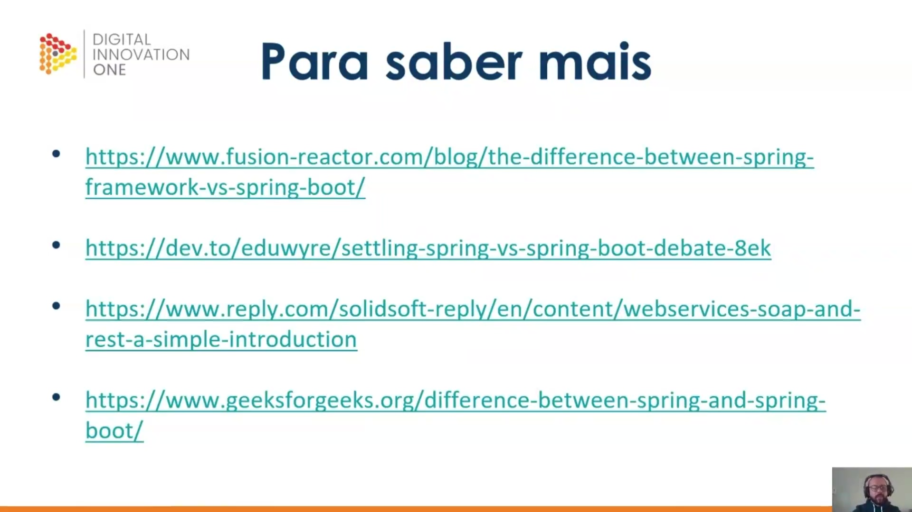
</p>

Para aprofundar os conhecimentos sobre a diferença entre Spring Framework e Spring Boot, bem como as arquiteturas SOAP e REST, recomenda-se a consulta aos materiais complementares e referências da comunidade.      


### 🟩 Vídeo 05 - Primeiros passos

<video width="60%" controls>
  <source src="000-Midia_e_Anexos/bootcamp_tqi_fullstack-modulo.07-curso.02-video_05.webm" type="video/webm">
    Seu navegador não suporta vídeo HTML5.
</video>

link do vídeo: https://web.dio.me/track/tqi-fullstack-developer/course/imersao-no-spring-framework-com-spring-boot/learning/7f7f12d6-7eb4-4e06-b0a4-316b2e44c6c4?autoplay=1

Este guia aborda a configuração inicial, a estrutura de arquivos e os conceitos fundamentais de Inversão de Controle (IoC) e Injeção de Dependências (DI) no ecossistema Spring Boot.

### Anotações

<p align="center">

</p>

Introdução à aula abordando os primeiros passos práticos com Spring Boot. O instrutor Gleyson Sampaio introduzirá como configurar e estruturar um projeto do zero.

<p align="center">
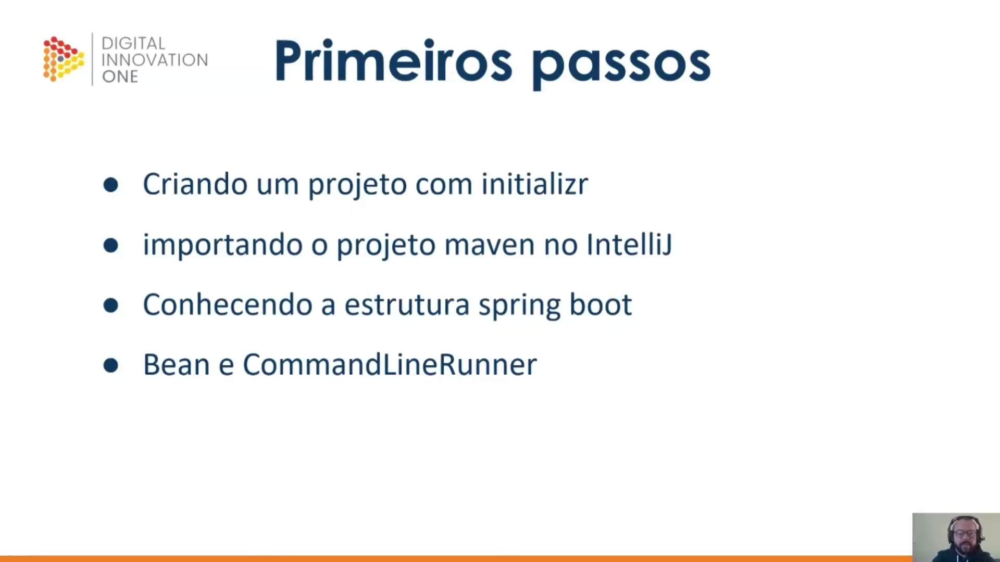
</p>

O roteiro da aula consiste em quatro etapas fundamentais: criar o projeto na web através do Spring Initializr, importá-lo em uma IDE como o IntelliJ utilizando o Maven, conhecer a estrutura de diretórios do Spring Boot e aplicar o conceito prático de Beans e CommandLineRunner.

<p align="center">
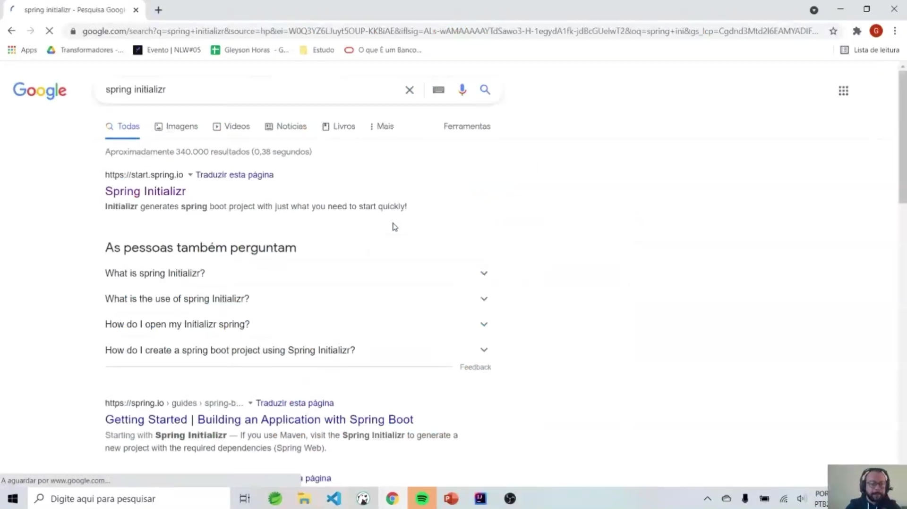
</p>

O primeiro passo para criar o projeto é pesquisar e acessar o site do "spring initializr" pelo buscador do navegador. Esta ferramenta gera o pacote inicial contendo as bibliotecas essenciais para rodar a aplicação.

<p align="center">
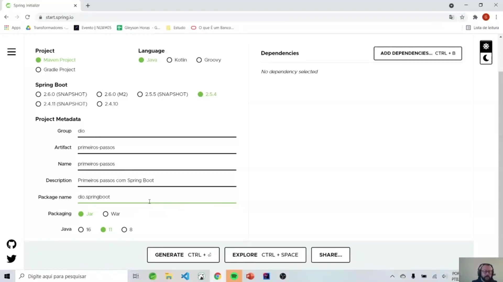
</p>

Na tela principal do Spring Initializr, definimos as configurações centrais do sistema. Selecionamos o gerenciador "Maven Project" e a linguagem de codificação "Java". Em seguida, preenchemos os metadados do projeto como Group (`dio`) e Artifact (`primeiros-passos`). O empacotamento definido é o "Jar".

<p align="center">
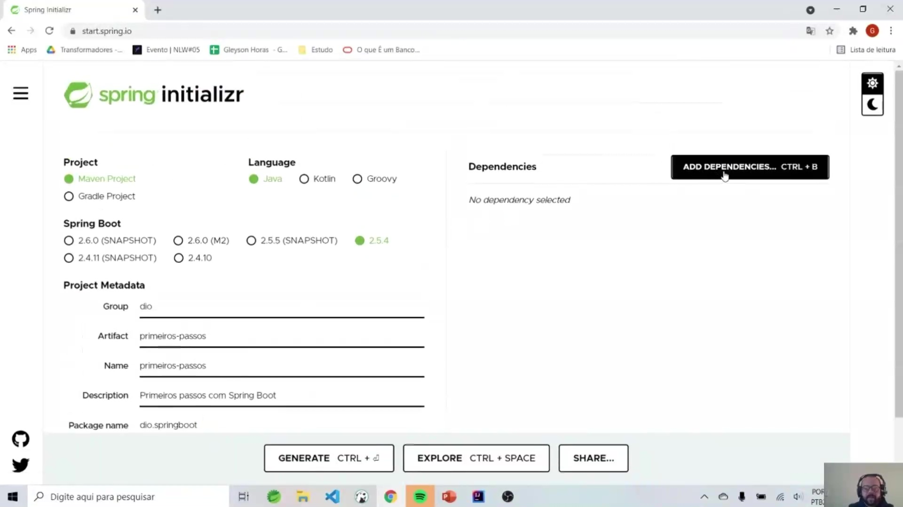
</p>

Nos metadados finais de construção do pacote, garantimos que a convenção do nome raiz seja preenchida corretamente como `dio.springboot` e inserimos uma breve descrição sobre a finalidade educacional da aplicação.

<p align="center">
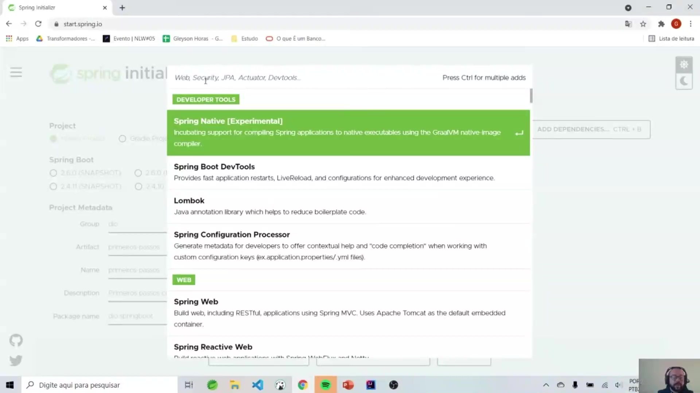
</p>

Através do painel lateral, é possível incluir módulos extras (os chamados *starters*) à arquitetura, como o Spring Web ou o DevTools. No entanto, para fins de demonstração básica, a criação será conduzida sem adicionar dependências neste passo.

<p align="center">
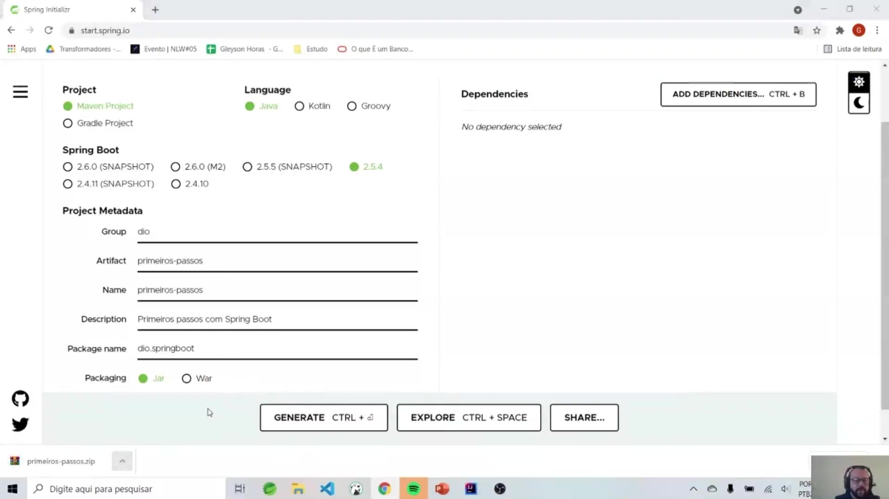
</p>

Com todas as opções finalizadas, clicamos em "GENERATE" para compilar as instruções, o que inicia o download automático do arquivo condensado chamado `primeiros-passos.zip`.

<p align="center">
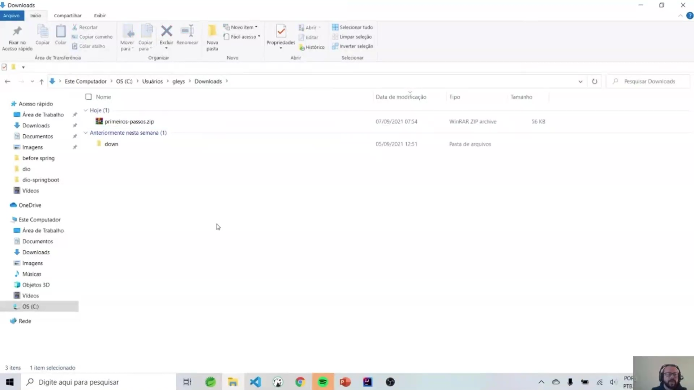
</p>

O arquivo compactado `.zip` contendo o projeto recém-gerado é armazenado temporariamente na pasta de Downloads do seu sistema operacional local.

<p align="center">
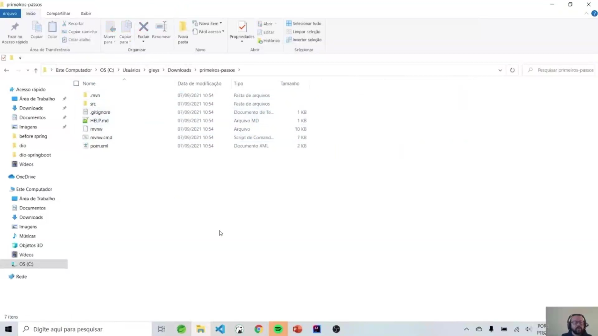
</p>

Após efetuar a extração do arquivo compactado, percebemos que o sistema já exibe a organização tradicional de um projeto Maven, destacando pastas centrais como `src` e arquivos elementares como `mvnw` e `pom.xml`.

<p align="center">
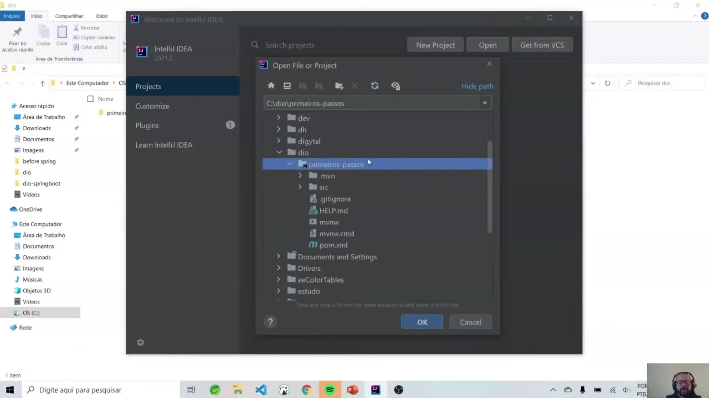
</p>

Com o ambiente da IDE (IntelliJ IDEA) aberto, utilizamos a janela de diálogo "Open File or Project" para navegar na hierarquia do computador e selecionar o diretório exato do projeto extraído. Por boas práticas de organização, o arquivo zip foi extraído no caminho raiz simplificado `C:\dio\primeiros-passos`.

<p align="center">
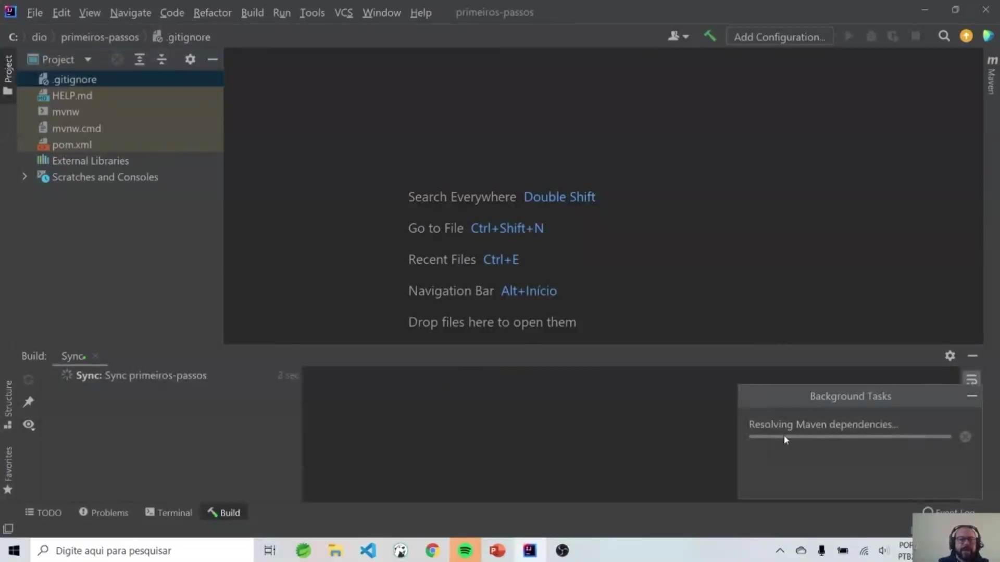
</p>

A IDE começa a importar as configurações do projeto para seu próprio formato. Neste instante, processos rodando em segundo plano acionam o Maven para realizar o download inteligente de quaisquer dependências externas necessárias antes de habilitar as opções de codificação.

<p align="center">
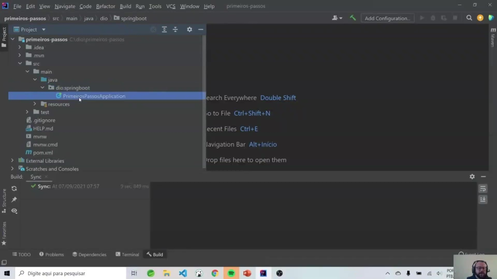
</p>

Com a indexação concluída, utilizamos o menu lateral da ferramenta para analisar as subpastas. Seguindo a rota em `src/main/java/dio/springboot`, encontramos a classe fundamental gerada automaticamente pelo Initializr: `PrimeirosPassosApplication`.

<p align="center">
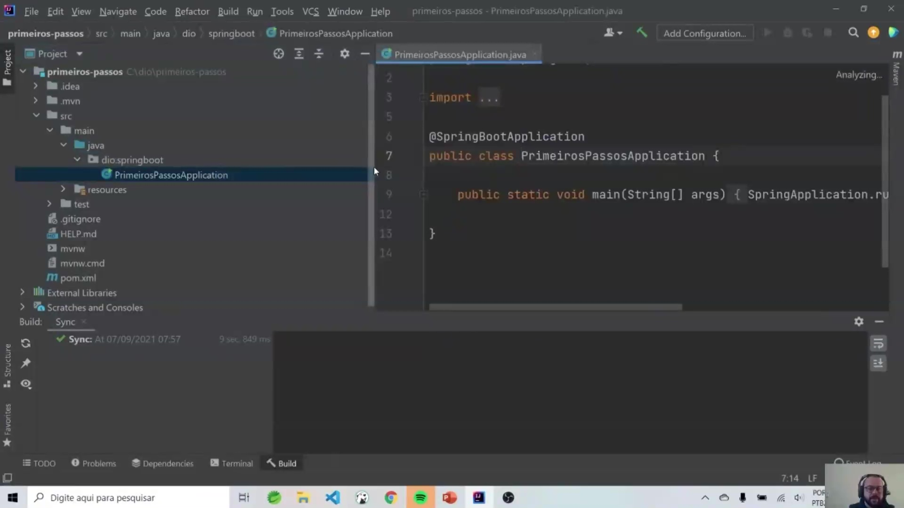
</p>

A classe central do sistema possui duas características muito importantes: está decorada com a anotação `@SpringBootApplication` e abriga um método do tipo `main`, engatilhando o run do framework.

```java
@SpringBootApplication
public class PrimeirosPassosApplication {
    public static void main(String[] args) {
        SpringApplication.run(PrimeirosPassosApplication.class, args);
    }
}
```

<p align="center">
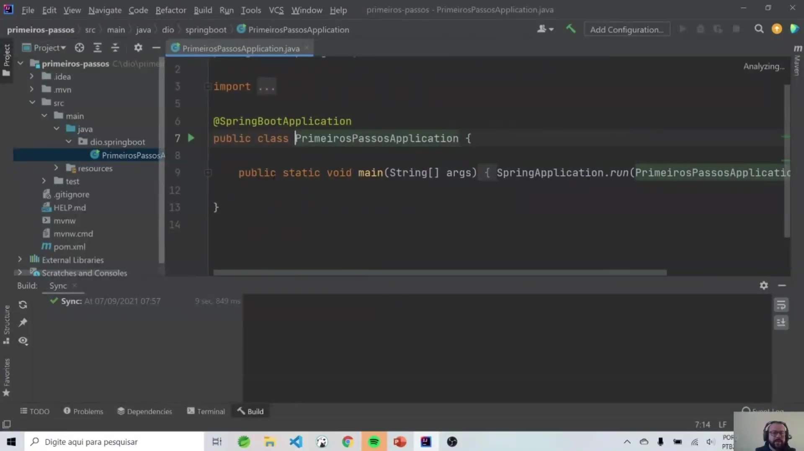
</p>

Em destaque no editor, a única e vital instrução estática existente `SpringApplication.run()` é responsável por capturar a própria classe e levantar todo o núcleo do ecossistema do contêiner para a gestão posterior.

<p align="center">
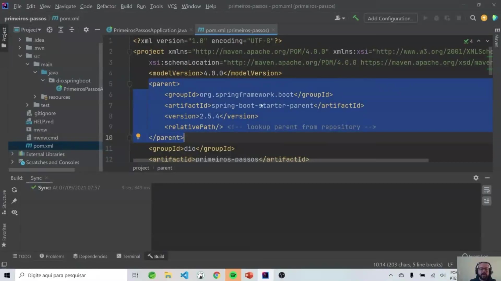
</p>

Passando a investigar o arquivo `pom.xml`, notamos a presença obrigatória da tag `<parent>`. Ela garante ao programa que os pacotes e parâmetros técnicos herdarão nativamente a estrutura contida no `spring-boot-starter-parent`.

```xml
<parent>
    <groupId>org.springframework.boot</groupId>
    <artifactId>spring-boot-starter-parent</artifactId>
    <version>2.5.4</version>
    <relativePath/> </parent>
```

<p align="center">
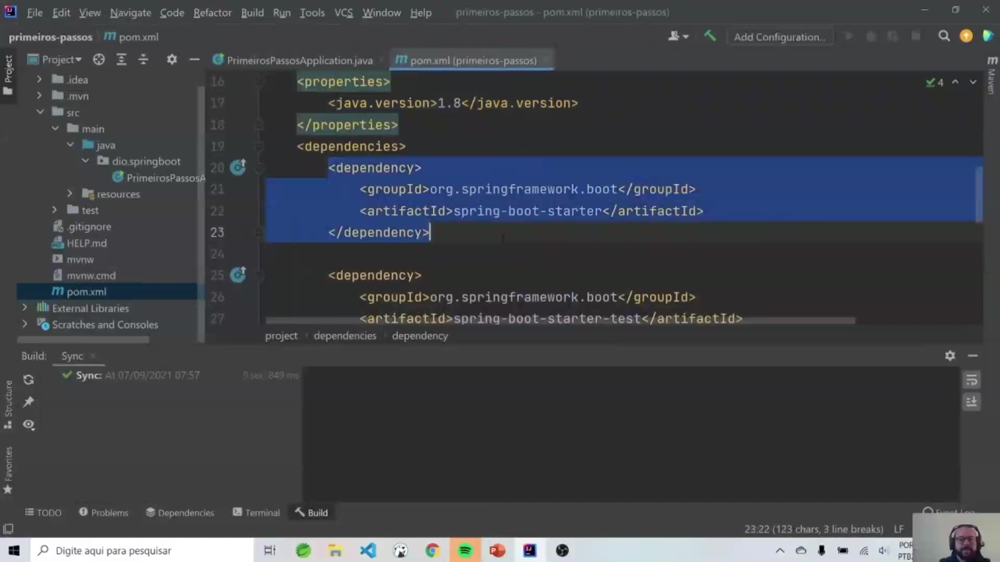
</p>

O documento de dependências (`pom.xml`) reflete a presença do bloco básico `spring-boot-starter`, que embutirá de modo invisível no projeto componentes primordiais como Spring Core e o módulo de Contexto sem que precisemos declará-los manualmente.

```xml
<dependency>
    <groupId>org.springframework.boot</groupId>
    <artifactId>spring-boot-starter</artifactId>
</dependency>
```

<p align="center">
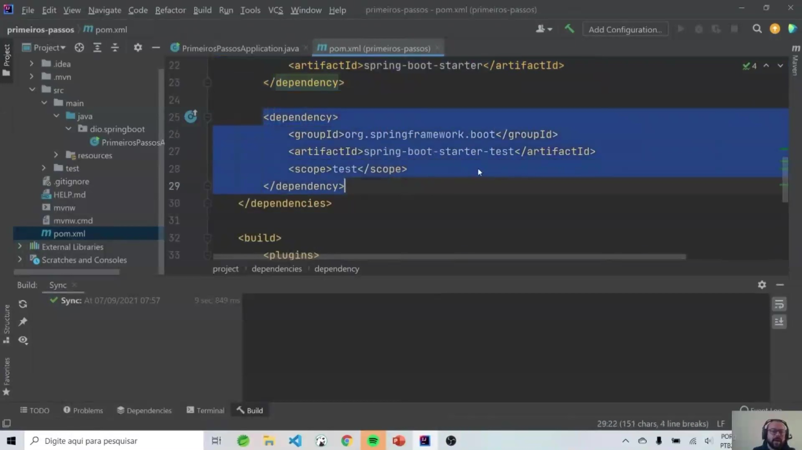
</p>

Logo abaixo na listagem, confirmamos que a arquitetura gerada insere proativamente o `spring-boot-starter-test`, um utilitário focado inteiramente na validação lógica e testes de código por TDD sem a necessidade de baixar recursos separados.

<p align="center">
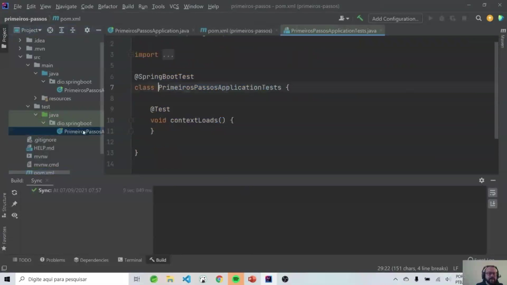
</p>

Visualizando o diretório de arquivos reservados a testes unitários, deparamo-nos com uma classe pré-configurada chamada `PrimeirosPassosApplicationTests`. Nela, o uso da anotação `@SpringBootTest` prova que o sistema inicializará as rotinas de verificação do comportamento dos Beans.

<p align="center">
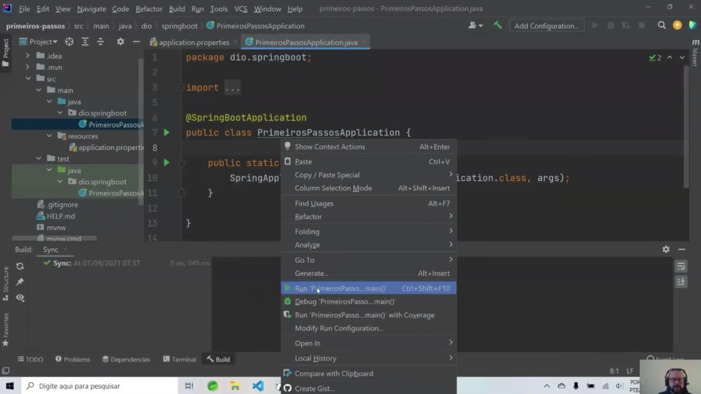
</p>

Chegou a hora de acionar a compilação local: dentro do código fonte base, abrimos o menu rápido e clicamos na funcionalidade de "Run 'PrimeirosPassosApplication'" no IntelliJ IDEA.

<p align="center">
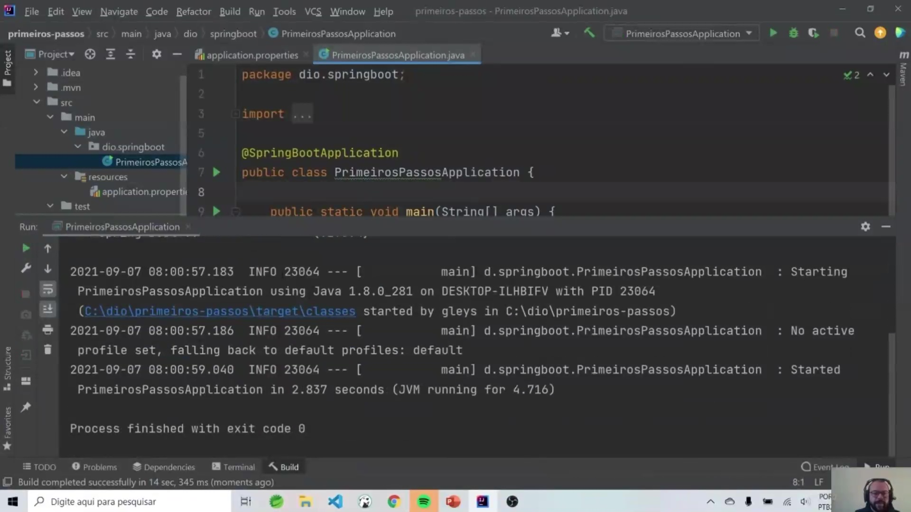
</p>

O terminal executa perfeitamente o processamento, ativando as rotinas estáticas. Contudo, em seguida relata que o projeto foi encerrado subitamente ("Process finished with exit code 0"). Isso acontece de forma normal em apps de linha de comando sem serviço web para segurar os processos na memória.

<p align="center">
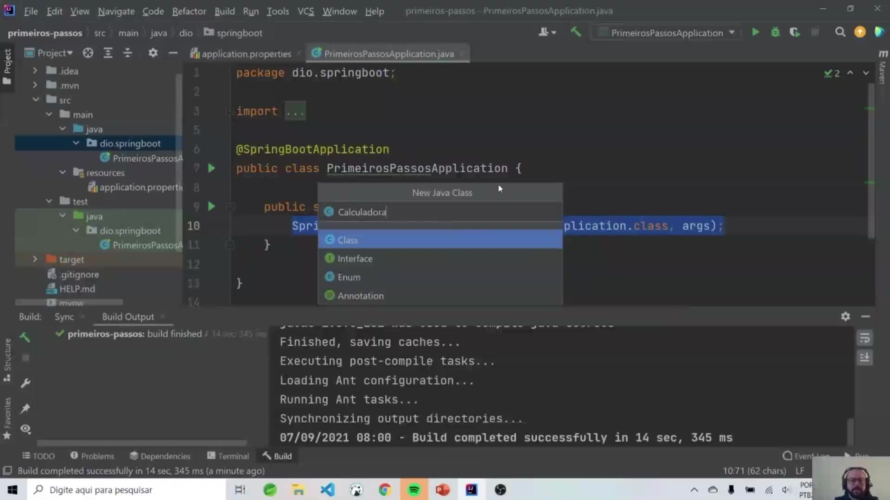
</p>

O instrutor efetua uma pré-compilação e ajusta as configurações ant para preparar o ambiente ("Executing post-compile tasks...") antes de iniciarmos a implementação de scripts adicionais no código principal.

<p align="center">
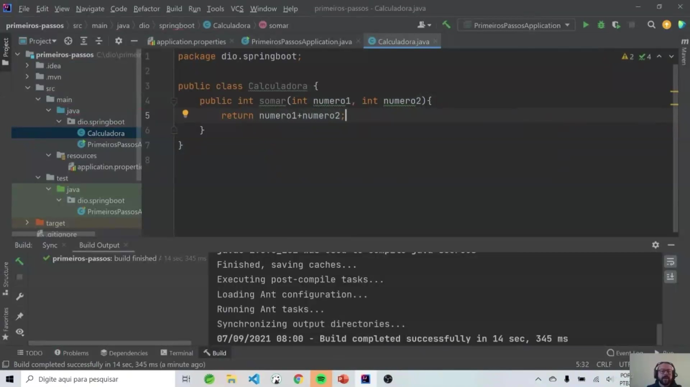
</p>

Para apresentar e corrigir os perigos da alocação isolada na memória, o instrutor constrói um componente lúdico. Uma simples classe chamada `Calculadora` é inserida na raiz recebendo um mecanismo dinâmico que retorna a soma de dois números.

```java
package dio.springboot;

public class Calculadora {
    public int somar(int numero1, int numero2) {
        return numero1 + numero2;
    }
}
```

<p align="center">
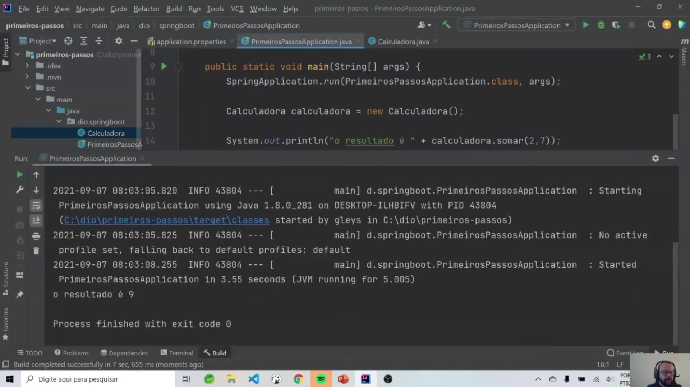
</p>

De volta ao método `main`, após o contêiner receber sua instrução de boot, aplicamos o construtor nativo `new Calculadora()` para capturarmos os valores através do terminal. O serviço de registro relata com êxito que "o resultado é 9".

<p align="center">
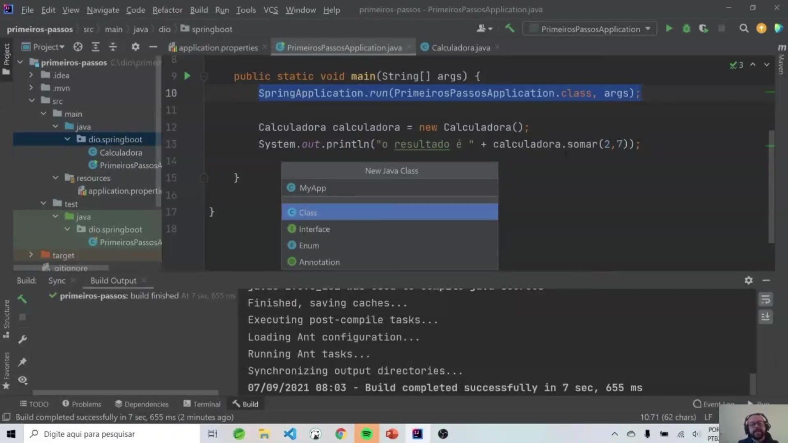
</p>

Apesar da sintaxe compilar corretamente, a marcação sobre o `new` evidencia uma falha arquitetural severa: objetos declarados desta forma não integram a Injeção de Dependências. Para o modelo funcionar dentro dos padrões do ecossistema e obedecer os recursos automáticos, a instância precisa ser removida.

<p align="center">
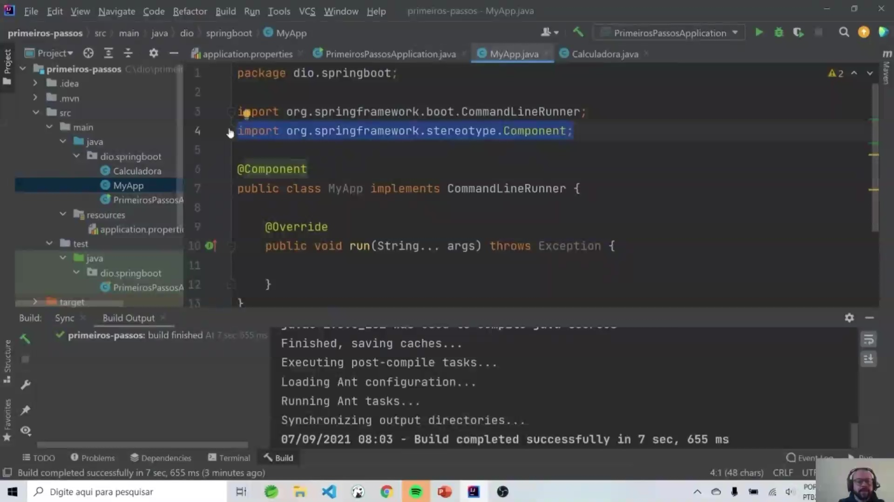
</p>

Como resposta técnica para iterarmos requisições no Boot, elaboramos uma classe autônoma nomeada `MyApp` recebendo a interface fundamental `CommandLineRunner`. Mais importante, usamos a declaração `@Component` para que o Spring assimile o objeto ao invés do usuário instanciá-lo posteriormente.

```java
package dio.springboot;

import org.springframework.boot.CommandLineRunner;
import org.springframework.stereotype.Component;

@Component
public class MyApp implements CommandLineRunner {
    @Override
    public void run(String... args) throws Exception {
        
    }
}
```

<p align="center">
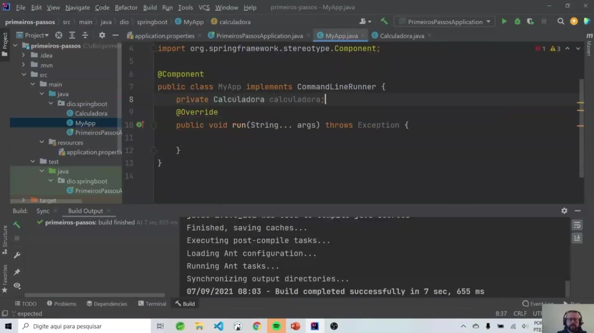
</p>

Na estrutura de `MyApp`, declaramos globalmente uma propriedade de ligação referente ao objeto Calculadora recém implementado. Importante destacar que a própria classe base da `Calculadora` também precisa estar demarcada como componente (Bean) para fechar o elo de conexão na memória.

<p align="center">
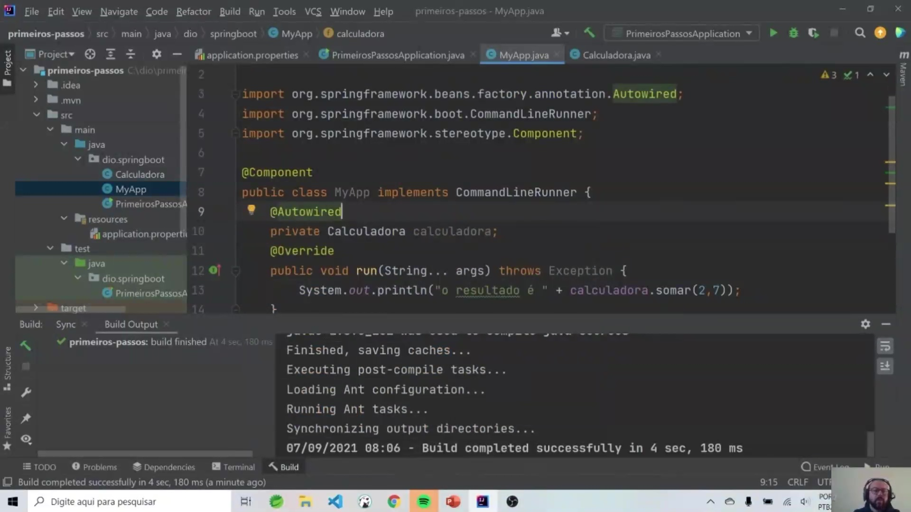
</p>

É na anotação `@Autowired` imposta acima do registro da calculadora que a mágica da gestão invisível acontece: em vez de invocarmos a montagem do código (new), a injeção acopla o utilitário, repassando o cálculo final para a rotina abstrata `run()`.

```java
@Component
public class MyApp implements CommandLineRunner {
    
    @Autowired
    private Calculadora calculadora;
    
    @Override
    public void run(String... args) throws Exception {
        System.out.println("o resultado é " + calculadora.somar(2, 7));
    }
}
```

<p align="center">
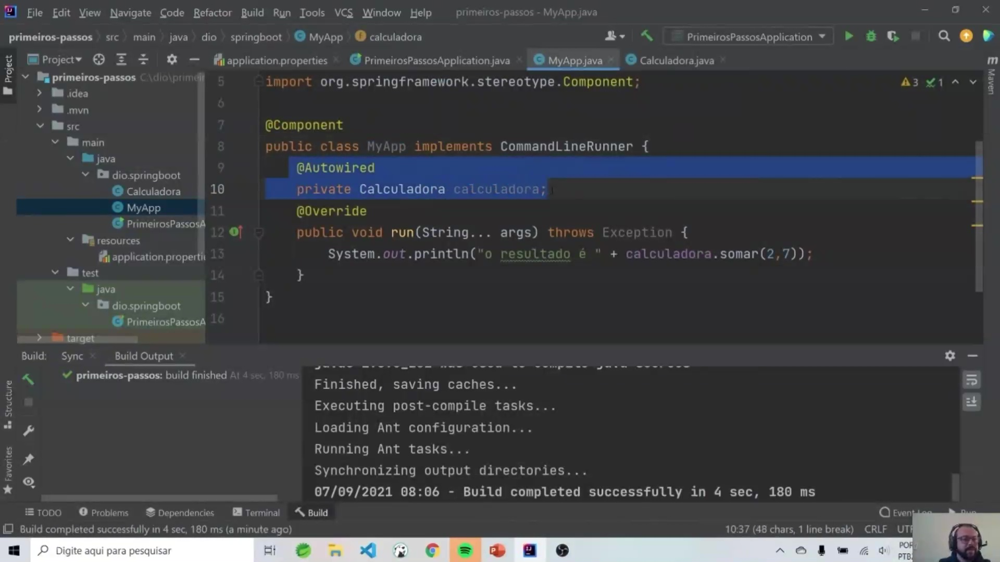
</p>

Com o trecho sublinhado, consolidamos que todos os comandos lógicos atrelados à arquitetura Boot agora fluem unicamente através do acoplamento de componentes, sem uso forçado de instâncias pesadas de compilação livre.

<p align="center">
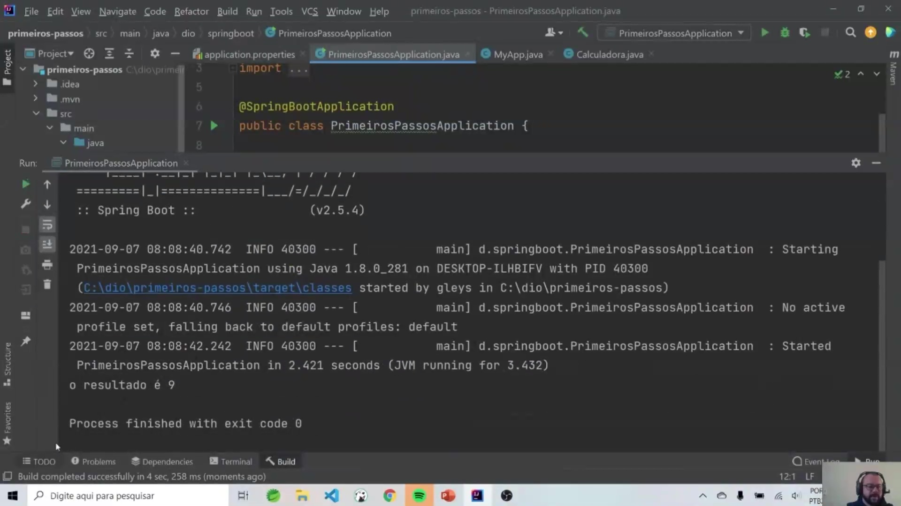
</p>

Aferindo mais uma vez a inicialização, confirmamos nos logs do sistema console a mesma resposta final "o resultado é 9". A diferença agora recai no mérito técnico: o processo baseou-se inteiramente no contêiner autônomo gerenciando seus próprios Beans do Spring Boot.
      
### 🟩 Vídeo 06 - Beans versus Components

<video width="60%" controls>
  <source src="000-Midia_e_Anexos/bootcamp_tqi_fullstack-modulo.07-curso.02-video_06.webm" type="video/webm">
    Seu navegador não suporta vídeo HTML5.
</video>

link do vídeo: https://web.dio.me/track/tqi-fullstack-developer/course/imersao-no-spring-framework-com-spring-boot/learning/581be567-8798-4738-948b-1721ca823ac3?autoplay=1

Este resumo explora as nuances entre as anotações @Bean e @Component no ecossistema Spring Boot, detalhando quando utilizar cada uma para otimizar a Inversão de Controle (IoC) e a Injeção de Dependência (DI).

### Anotações

<p align="center">
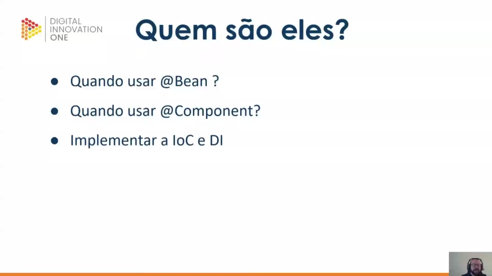
</p>

Introdução ao tema da aula, focando na distinção fundamental entre Beans e Components no contexto do Spring Boot. O objetivo inicial é entender quando utilizar a anotação `@Bean` e quando utilizar `@Component`. Ambas têm a finalidade de gerar objetos que serão gerenciados pelo container do Spring, aplicando os conceitos fundamentais de Inversão de Controle (IoC) e Injeção de Dependências (DI).

<p align="center">
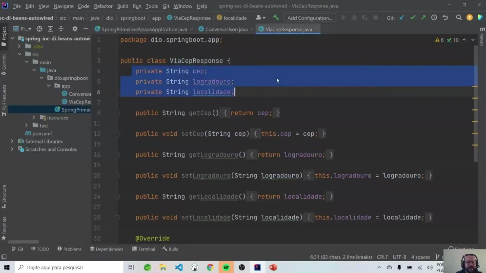
</p>

Apresentação da classe de domínio `ViaCepResponse`, que representa a estrutura de dados esperada como retorno da requisição web para a API do ViaCEP. Esta classe contém os atributos básicos necessários (`cep`, `logradouro` e `localidade`) para armazenar os dados de CEP obtidos.

```java
package dio.springboot.app;

public class ViaCepResponse {
    private String cep;
    private String logradouro;
    private String localidade;

    public String getCep() { return cep; }
    public void setCep(String cep) { this.cep = cep; }
    public String getLogradouro() { return logradouro; }
    public void setLogradouro(String logradouro) { this.logradouro = logradouro; }
    public String getLocalidade() { return localidade; }
    public void setLocalidade(String localidade) { this.localidade = localidade; }
}
```

<p align="center">
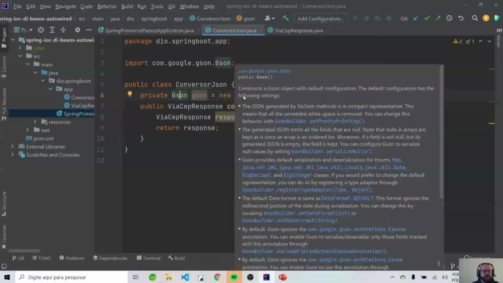
</p>

Criação inicial da classe `ConversorJson`. O propósito desta classe é receber uma string no formato JSON e convertê-la no objeto de domínio `ViaCepResponse`. Para isso, a implementação utiliza o framework externo `Gson`, desenvolvido pela Google.

```java
package dio.springboot.app;

import com.google.gson.Gson;

public class ConversorJson {
    private Gson gson = new Gson();
    
    public ViaCepResponse converter(String json){
        ViaCepResponse response = gson.fromJson(json, ViaCepResponse.class);
        return response;
    }
}
```

<p align="center">
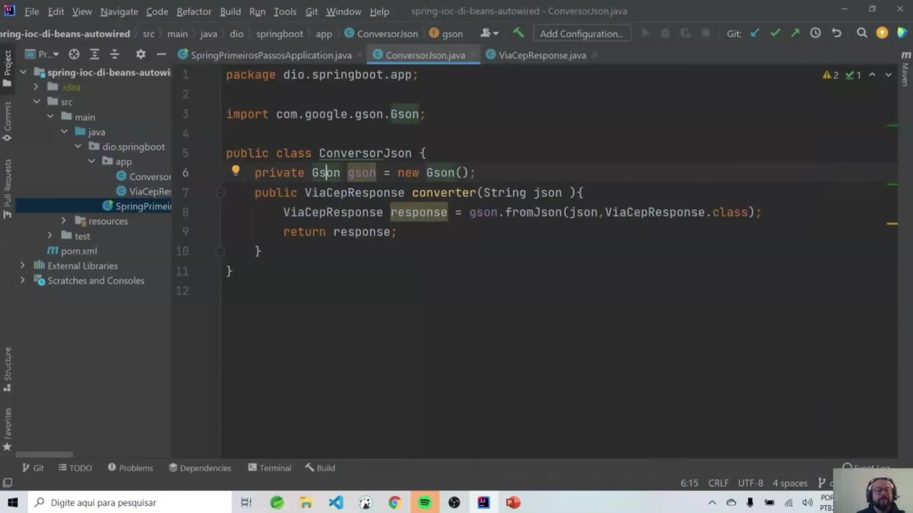
</p>

A classe `ConversorJson` ainda é mostrada em sua forma pura, sem as anotações do framework. O instrutor levanta o questionamento de como gerenciar este conversor dentro do ecossistema do Spring Boot, preparando o terreno para a aplicação da anotação `@Component`.

```java
package dio.springboot.app;

import com.google.gson.Gson;

public class ConversorJson {
    private Gson gson = new Gson();
    
    public ViaCepResponse converter(String json){
        ViaCepResponse response = gson.fromJson(json, ViaCepResponse.class);
        return response;
    }
}
```

<p align="center">
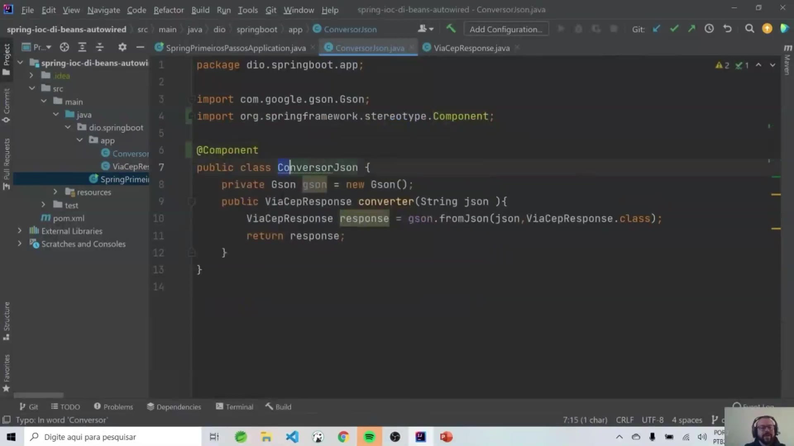
</p>

A anotação `@Component` é adicionada à classe `ConversorJson`. A regra prática apresentada é: utiliza-se `@Component` quando se tem acesso direto ao código-fonte da classe. Ao anotar a classe desta forma, instruímos o Spring a escanear este componente e gerenciá-lo, eliminando a necessidade de usar a palavra reservada `new` para criar instâncias deste conversor.

```java
package dio.springboot.app;

import com.google.gson.Gson;
import org.springframework.stereotype.Component;

@Component
public class ConversorJson {
    private Gson gson = new Gson();
    
    public ViaCepResponse converter(String json){
        ViaCepResponse response = gson.fromJson(json, ViaCepResponse.class);
        return response;
    }
}
```

<p align="center">
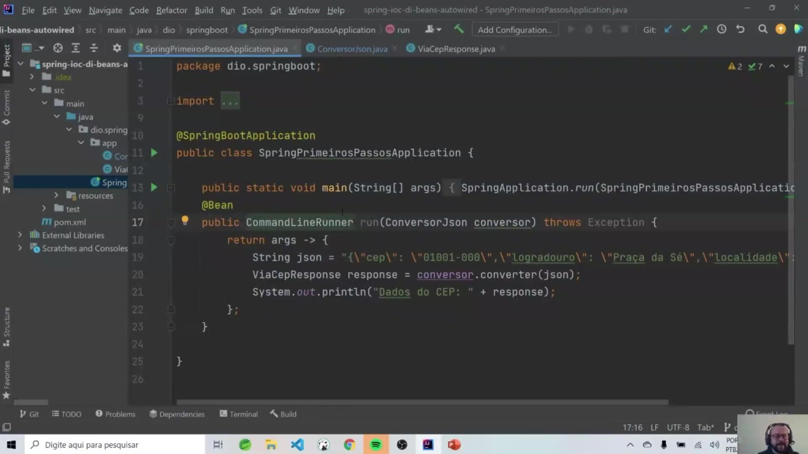
</p>

Na classe principal da aplicação, `SpringPrimeirosPassosApplication`, o instrutor cria um método que retorna um `CommandLineRunner` e o anota com `@Bean`. O objetivo é simular a execução da aplicação injetando o nosso componente `ConversorJson` no método `run`. Através dessa injeção, o conversor recebe uma string JSON estática simulando um CEP e realiza a conversão para testar o funcionamento.

```java
package dio.springboot;

import org.springframework.boot.CommandLineRunner;
import org.springframework.boot.SpringApplication;
import org.springframework.boot.autoconfigure.SpringBootApplication;
import org.springframework.context.annotation.Bean;
import dio.springboot.app.ConversorJson;
import dio.springboot.app.ViaCepResponse;

@SpringBootApplication
public class SpringPrimeirosPassosApplication {

    public static void main(String[] args) {
        SpringApplication.run(SpringPrimeirosPassosApplication.class, args);
    }

    @Bean
    public CommandLineRunner run(ConversorJson conversor) throws Exception {
        return args -> {
            String json = "{\"cep\": \"01001-000\",\"logradouro\": \"Praça da Sé\",\"localidade\": \"São Paulo\"}";
            ViaCepResponse response = conversor.converter(json);
            System.out.println("Dados do CEP: " + response);
        };
    }
}
```

<p align="center">
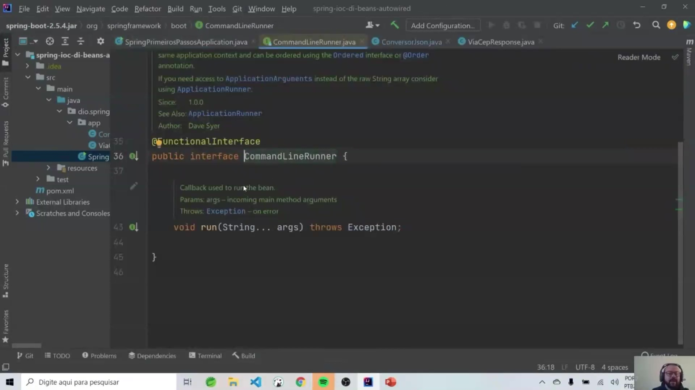
</p>

A visualização do código-fonte da interface `CommandLineRunner` (pertencente ao pacote do Spring Boot) serve para ilustrar um conceito essencial: por ser uma biblioteca externa à qual não temos controle do código-fonte, não podemos simplesmente ir até ela e colocar um `@Component`. Por isso, o recurso deve ser provido ao container através de um método construtor anotado com `@Bean`.

```java
@FunctionalInterface
public interface CommandLineRunner {
    void run(String... args) throws Exception;
}
```

<p align="center">
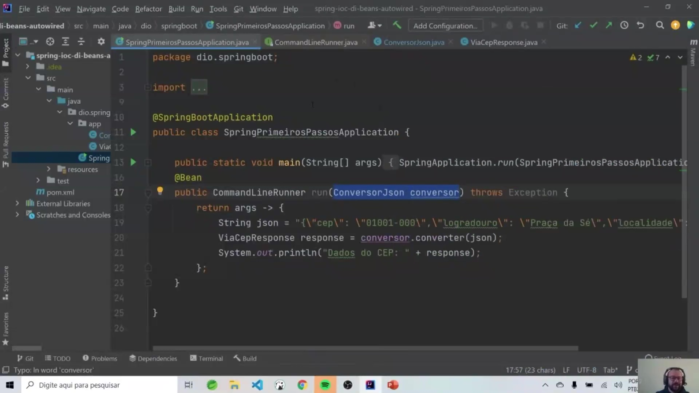
</p>

Retorno ao método `run` na classe principal da aplicação para preparar a execução do projeto. A expectativa é verificar se a conversão funcionará e se os dados estruturados pelo JSON serão impressos corretamente através do comando `System.out.println`.

```java
@Bean
public CommandLineRunner run(ConversorJson conversor) throws Exception {
    return args -> {
        String json = "{\"cep\": \"01001-000\",\"logradouro\": \"Praça da Sé\",\"localidade\": \"São Paulo\"}";
        ViaCepResponse response = conversor.converter(json);
        System.out.println("Dados do CEP: " + response);
    };
}
```

<p align="center">
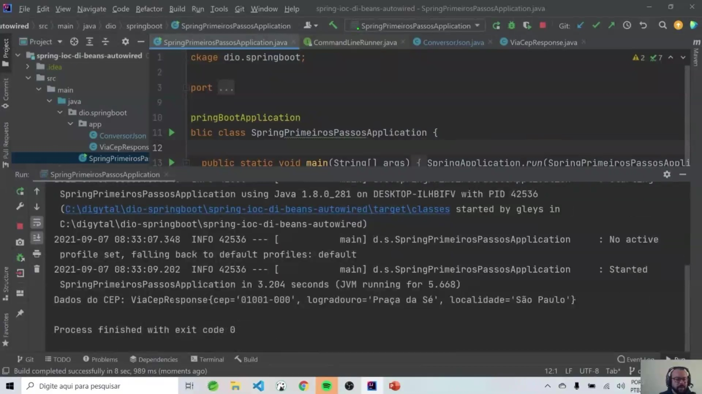
</p>

O console do terminal exibe o resultado da execução bem-sucedida do programa. É possível observar a impressão da mensagem `"Dados do CEP: ViaCepResponse{cep='01001-000', logradouro='Praça da Sé', localidade='São Paulo'}"`, comprovando que o componente conversor foi injetado corretamente pelo Spring e desempenhou o seu papel.

<p align="center">
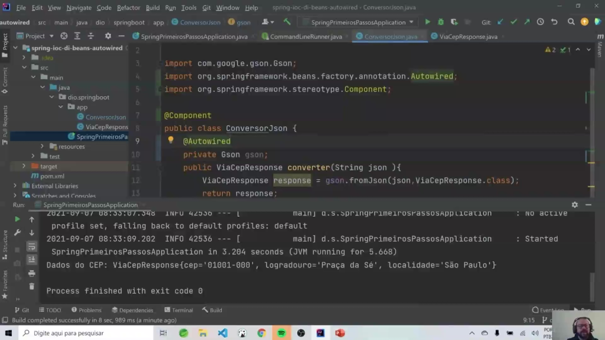
</p>

Uma refatoração crítica é feita na classe `ConversorJson`: a remoção da instanciação explícita do objeto `Gson` (`new Gson()`). No lugar, o instrutor utiliza a anotação `@Autowired` para que o próprio Spring Boot passe a prover essa dependência. Isso resolve a "fuga" do paradigma da Inversão de Controle, delegando totalmente a responsabilidade de criação ao container.

```java
package dio.springboot.app;

import com.google.gson.Gson;
import org.springframework.beans.factory.annotation.Autowired;
import org.springframework.stereotype.Component;

@Component
public class ConversorJson {

    @Autowired
    private Gson gson;

    public ViaCepResponse converter(String json){
        ViaCepResponse response = gson.fromJson(json, ViaCepResponse.class);
        return response;
    }
}
```

<p align="center">
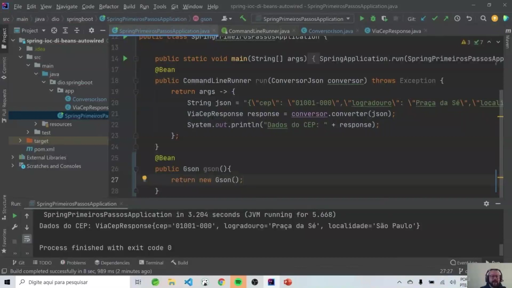
</p>

No entanto, como `Gson` é uma biblioteca externa do Google sem a anotação `@Component` em seu código-fonte, o `@Autowired` anterior falharia se não ensinássemos o Spring a instanciar o objeto. Para contornar isso, o instrutor adiciona um método construtor dentro da classe `SpringPrimeirosPassosApplication` anotado com `@Bean`, que retorna explicitamente a instância `new Gson()`.

```java
@Bean
public Gson gson() {
    return new Gson();
}
```

<p align="center">
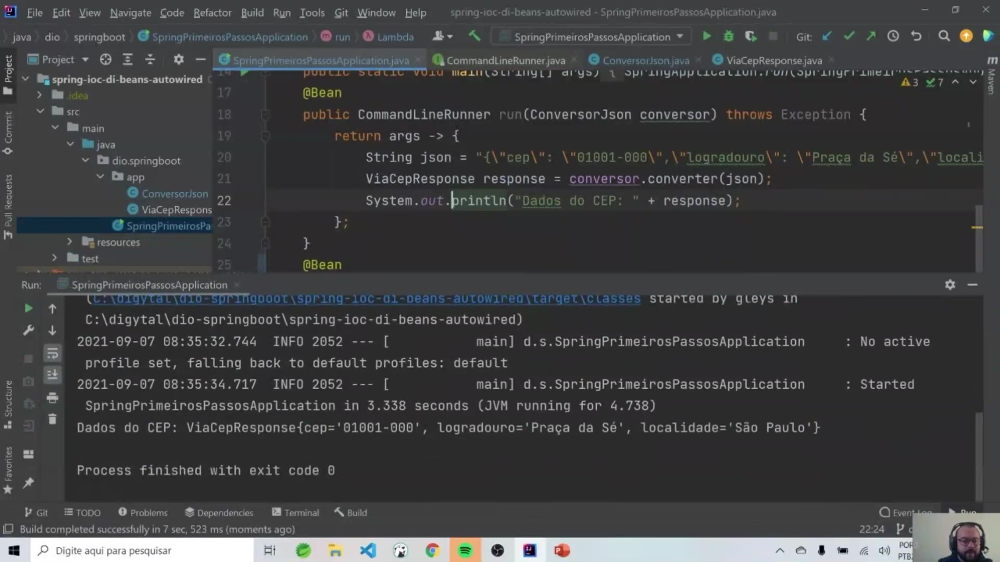
</p>

Uma nova execução da aplicação valida as refatorações. O terminal confirma a inicialização e o log imprime novamente os dados convertidos do CEP, indicando que a resolução da injeção de dependências do Gson utilizando a anotação `@Bean` funcionou conforme esperado.

<p align="center">
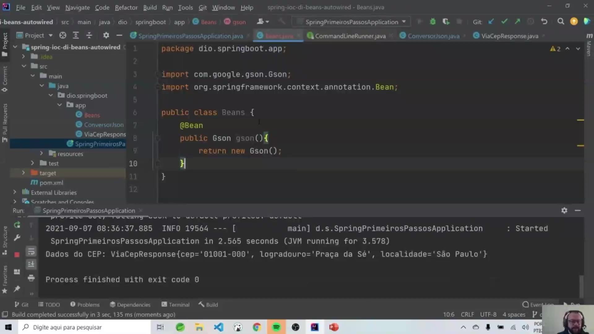
</p>

Visando boas práticas de projeto, o instrutor explica que não é aconselhável poluir a classe principal da aplicação com as definições de Beans. Portanto, o código de criação do `Gson` é movido para uma nova classe dedicada, comumente chamada de `Beans` ou `BeansFactory`, organizando estruturalmente as dependências externas.

```java
package dio.springboot.app;

import com.google.gson.Gson;
import org.springframework.context.annotation.Bean;

public class Beans {
    @Bean
    public Gson gson() {
        return new Gson();
    }
}
```

<p align="center">
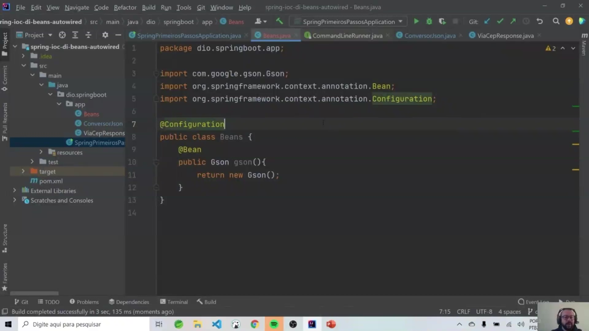
</p>

Para finalizar as configurações e evitar problemas em diferentes versões do framework, a classe `Beans` é anotada com `@Configuration`. Isso indica explicitamente ao Spring Boot que esta é uma classe de configuração cujo propósito é declarar Beans gerenciados pelo contexto da aplicação, solidificando o princípio de IoC/DI de forma limpa e organizada.

```java
package dio.springboot.app;

import com.google.gson.Gson;
import org.springframework.context.annotation.Bean;
import org.springframework.context.annotation.Configuration;

@Configuration
public class Beans {
    @Bean
    public Gson gson() {
        return new Gson();
    }
}
```      

### 🟩 Vídeo 07 - Scopes - Singleton ou Prototype

<video width="60%" controls>
  <source src="000-Midia_e_Anexos/bootcamp_tqi_fullstack-modulo.07-curso.02-video_07.webm" type="video/webm">
    Seu navegador não suporta vídeo HTML5.
</video>

link do vídeo: https://web.dio.me/track/tqi-fullstack-developer/course/imersao-no-spring-framework-com-spring-boot/learning/13a57341-f406-463b-ac6c-037a08d8ee2f?autoplay=1

Este guia explora as diferenças fundamentais entre os escopos Singleton e Prototype no Spring Framework, demonstrando como a escolha do escopo afeta o comportamento da aplicação e a integridade dos dados.

#### Introdução ao Spring Framework

<p align="center">
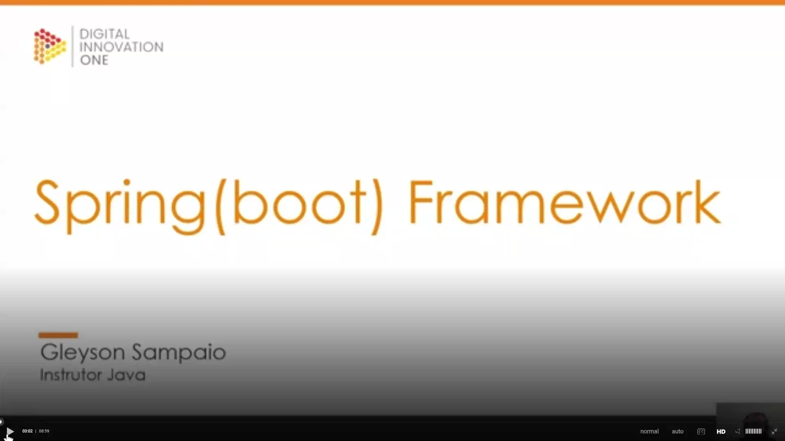
</p>

Nesta aula, o instrutor Gleyson Sampaio apresenta os conceitos fundamentais de escopo de objetos dentro do ecossistema **Spring e Spring Boot Framework**. O foco principal é entender como o container do Spring gerencia a criação e a disponibilidade dos Beans para a aplicação.

#### Singleton ou Prototype?

<p align="center">

</p>

Uma das perguntas mais relevantes ao projetar uma aplicação com Spring é determinar a quantidade de instâncias necessárias para um objeto. A escolha entre **Singleton** e **Prototype** define se a aplicação utilizará uma única instância compartilhada ou se novas instâncias serão criadas conforme a demanda.

#### Conceitos de Escopo

<p align="center">
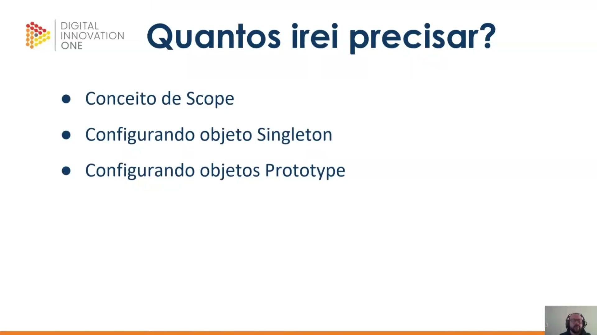
</p>

O planejamento da aula foca em três pilares essenciais para o gerenciamento de objetos:

* **Conceito de Scope:** Definição da estratégia de ciclo de vida do Bean.
* **Configurando objeto Singleton:** Onde um único objeto é utilizado para toda a aplicação.
* **Configurando objetos Prototype:** Onde cada solicitação ou injeção de dependência resulta em uma instância exclusiva.

#### Implementação da Classe Principal

<p align="center">
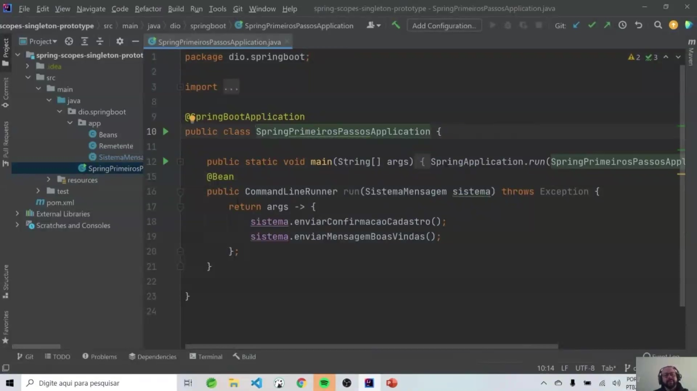
</p>

A classe principal da aplicação utiliza o `CommandLineRunner` para executar a lógica de negócio logo após a inicialização. No exemplo, o `SistemaMensagem` é injetado para realizar operações de cadastro e boas-vindas.

```java
package dio.springboot;

import org.springframework.boot.CommandLineRunner;
import org.springframework.boot.SpringApplication;
import org.springframework.boot.autoconfigure.SpringBootApplication;
import org.springframework.context.annotation.Bean;

@SpringBootApplication
public class SpringPrimeirosPassosApplication {

    public static void main(String[] args) {
        SpringApplication.run(SpringPrimeirosPassosApplication.class, args);
    }

    @Bean
    public CommandLineRunner run(SistemaMensagem sistema) throws Exception {
        return args -> {
            sistema.enviarConfirmacaoCadastro();
            sistema.enviarMensagemBoasVindas();
        };
    }
}
```

#### O Problema do Escopo Singleton

<p align="center">
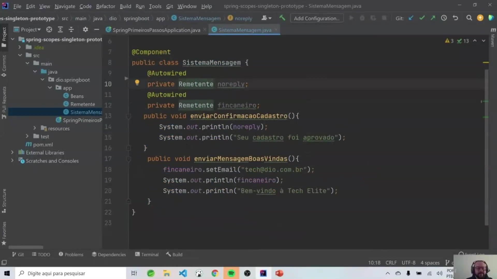
</p>

No componente `SistemaMensagem`, são injetados dois objetos do tipo `Remetente`: `noreply` e `financeiro`. Quando o escopo padrão (Singleton) é utilizado, ambos os atributos podem acabar apontando para a mesma instância física na memória. Isso causa efeitos colaterais: ao alterar o e-mail no método de boas-vindas, a alteração reflete em todas as outras referências do objeto na aplicação.

```java
@Component
public class SistemaMensagem {
    @Autowired
    private Remetente noreply;
    
    @Autowired
    private Remetente financeiro;

    public void enviarConfirmacaoCadastro(){
        System.out.println(noreply);
        System.out.println("Seu cadastro foi aprovado");
    }

    public void enviarMensagemBoasVindas(){
        financeiro.setEmail("tech@dio.com.br");
        System.out.println(financeiro);
        System.out.println("Bem-vindo à Tech Elite");
    }
}
```

#### Configuração de Beans e Escopo

<p align="center">
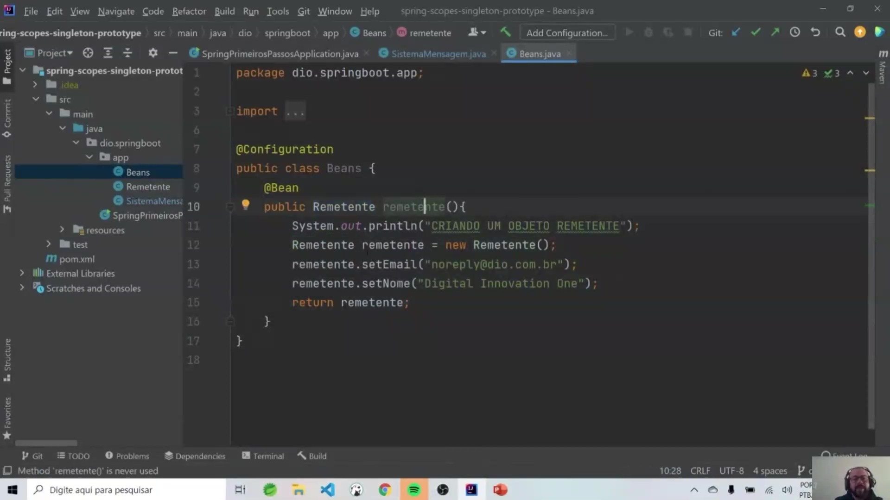
</p>

Para resolver o conflito de instâncias, utiliza-se a classe de configuração onde o Bean é definido. Inicialmente, o objeto é criado de forma global. Para transformar esse comportamento em **Prototype**, deve-se adicionar a anotação `@Scope("prototype")`, garantindo que o Spring crie uma nova instância de `Remetente` para cada ponto de injeção.

```java
package dio.springboot.app;

import org.springframework.context.annotation.Bean;
import org.springframework.context.annotation.Configuration;
import org.springframework.context.annotation.Scope;

@Configuration
public class Beans {

    @Bean
    @Scope("prototype")
    public Remetente remetente() {
        System.out.println("CRIANDO UM OBJETO REMETENTE");
        Remetente remetente = new Remetente();
        remetente.setEmail("noreply@dio.com.br");
        remetente.setNome("Digital Innovation One");
        return remetente;
    }
}
```

#### Resultado da Execução no Console

<p align="center">
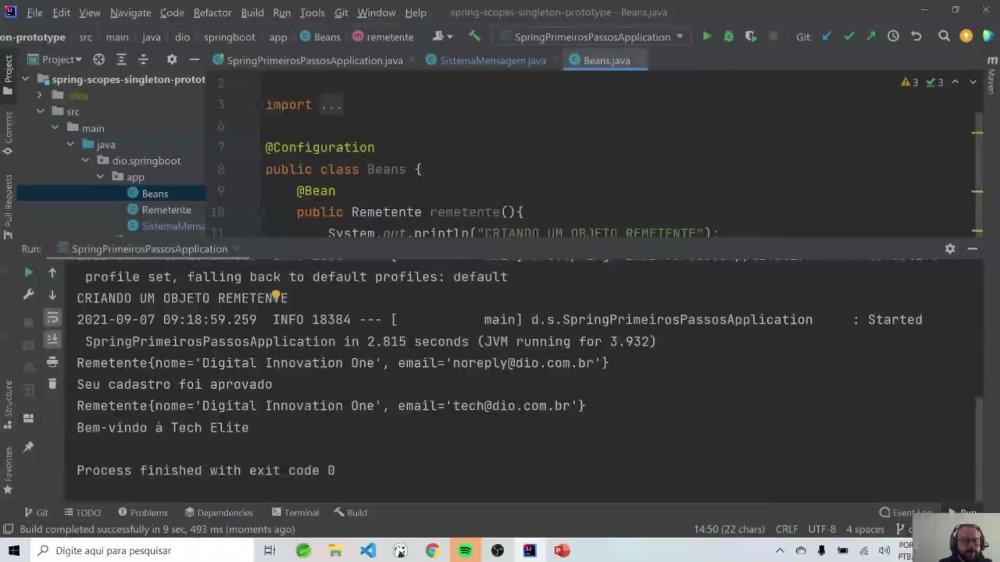
</p>

O log de execução demonstra o comportamento do Spring. Ao definir o escopo como Prototype, observa-se que a mensagem "CRIANDO UM OBJETO REMETENTE" aparece múltiplas vezes. Isso confirma que cada serviço recebeu sua própria instância, permitindo que o e-mail do "financeiro" fosse alterado para `tech@dio.com.br` sem afetar o e-mail do remetente de "confirmação de cadastro".

*Saída do Console:*

```text
CRIANDO UM OBJETO REMETENTE
CRIANDO UM OBJETO REMETENTE
Remetente{nome='Digital Innovation One', email='noreply@dio.com.br'}
Seu cadastro foi aprovado
Remetente{nome='Digital Innovation One', email='tech@dio.com.br'}
Bem-vindo à Tech Elite

```

### 🟩 Vídeo 08 - Properties Value

<video width="60%" controls>
  <source src="000-Midia_e_Anexos/bootcamp_tqi_fullstack-modulo.07-curso.02-video_08.webm" type="video/webm">
    Seu navegador não suporta vídeo HTML5.
</video>

link do vídeo: https://web.dio.me/track/tqi-fullstack-developer/course/imersao-no-spring-framework-com-spring-boot/learning/5aa5f15f-4466-4302-afc0-e7c6f90f12ed?autoplay=1

O vídeo explora como gerenciar configurações de forma dinâmica e centralizada em aplicações Spring Boot, utilizando o arquivo application.properties e a anotação @Value.

### Anotações

<p align="center">
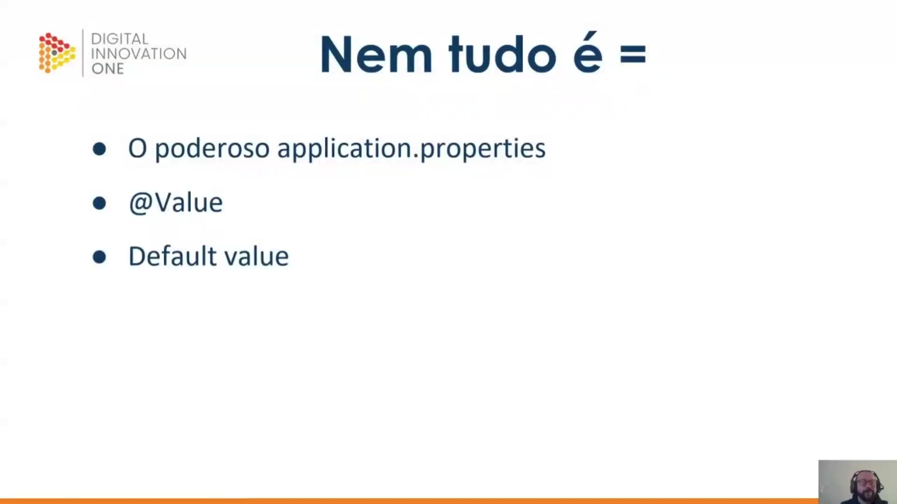
</p>

Nesta introdução ao conceito de **Properties** no Spring Boot, exploramos como o framework permite que as atribuições de valores não precisem ser sempre explícitas ou declarativas diretamente no código-fonte. O foco central é o uso do arquivo `application.properties`, da anotação `@Value` e da definição de **Default values** para garantir flexibilidade e centralização de estados e configurações da aplicação que não sofrem iteração constante durante a execução.

<p align="center">
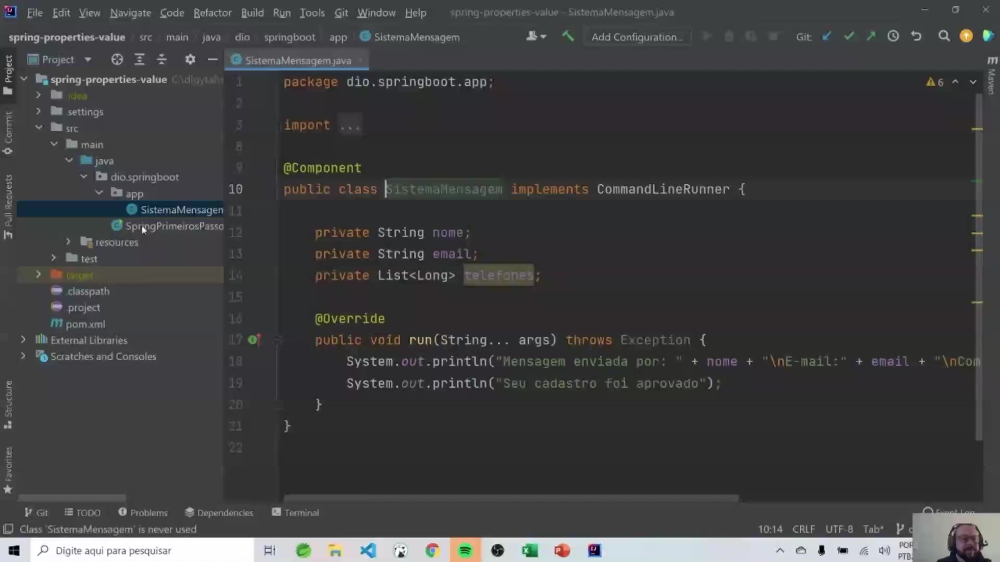
</p>

Apresentação da estrutura inicial da classe `SistemaMensagem`. Ela é anotada com `@Component` e implementa `CommandLineRunner`, preparando o terreno para a execução de lógica assim que a aplicação Spring iniciar. Inicialmente, as variáveis de instância estão apenas declaradas, sem valores atribuídos.

```java
package dio.springboot.app;

import org.springframework.boot.CommandLineRunner;
import org.springframework.stereotype.Component;
import java.util.List;

@Component
public class SistemaMensagem implements CommandLineRunner {
    private String nome;
    private String email;
    private List<Long> telefones;

    @Override
    public void run(String... args) throws Exception {
        // Lógica de impressão será implementada aqui
    }
}
```


<p align="center">
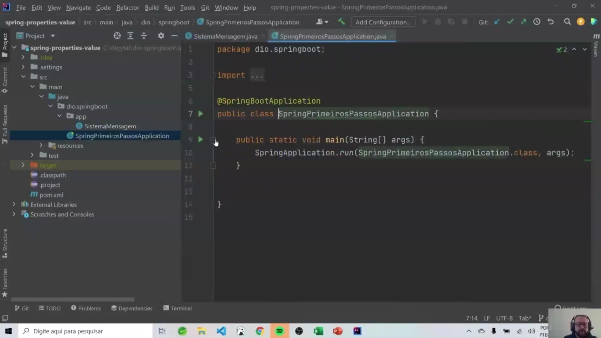
</p>

Exibição da classe principal do projeto, `SpringPrimeirosPassosApplication`. Esta classe possui a anotação `@SpringBootApplication`, que sinaliza o ponto de entrada da aplicação Spring Boot e aciona a varredura de componentes (como o `SistemaMensagem` criado anteriormente) para que sejam gerenciados pelo container do Spring.

```java
package dio.springboot;

import org.springframework.boot.SpringApplication;
import org.springframework.boot.autoconfigure.SpringBootApplication;

@SpringBootApplication
public class SpringPrimeirosPassosApplication {
    public static void main(String[] args) {
        SpringApplication.run(SpringPrimeirosPassosApplication.class, args);
    }
}
```

<p align="center">
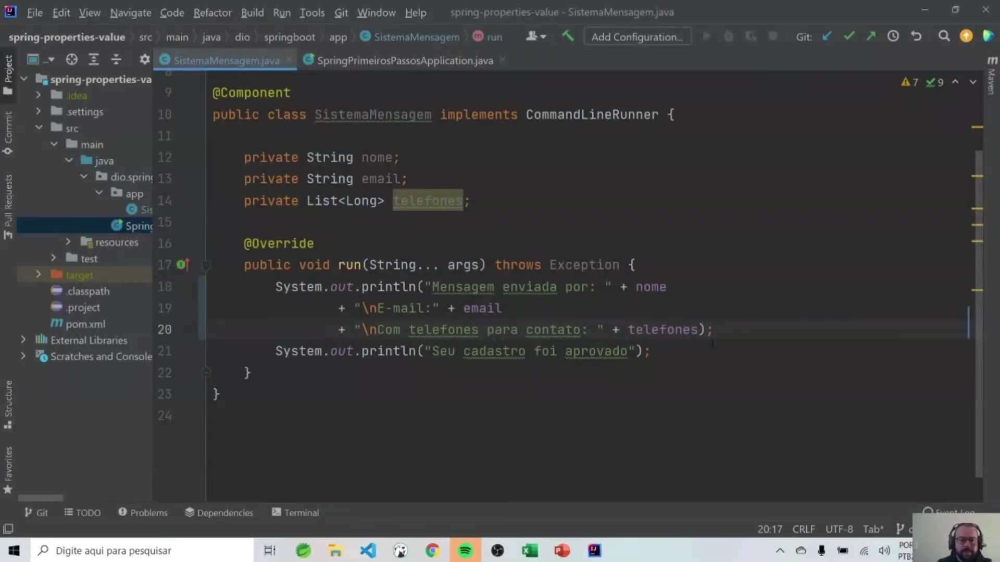
</p>

Implementação do método `run` na classe `SistemaMensagem`. O objetivo aqui é demonstrar a saída no console utilizando as variáveis de instância. Neste ponto, os valores ainda não foram injetados ou definidos, preparando o cenário para a demonstração da atribuição manual (declarativa) antes de evoluir para o uso de propriedades.

```java
@Override
public void run(String... args) throws Exception {
    System.out.println("Mensagem enviada por: " + nome 
        + "\nE-mail:" + email 
        + "\nCom telefones para contato: " + telefones);
    System.out.println("Seu cadastro foi aprovado");
}
```

<p align="center">
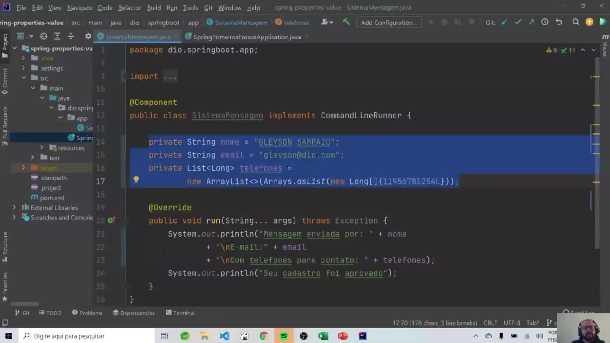
</p>

Demonstração do modelo de atribuição **declarativa e explícita**. Os valores são inseridos diretamente no código-fonte através da inicialização das variáveis. Embora funcional, essa abordagem torna a aplicação rígida, dificultando mudanças de configuração sem a necessidade de recompilar o código.

```java
@Component
public class SistemaMensagem implements CommandLineRunner {
    private String nome = "GLEYSON SAMPAIO";
    private String email = "gleyson@dio.com";
    private List<Long> telefones = new ArrayList<>(Arrays.asList(new Long[]{11956781254L}));
    
    // ... restante do código
}
```


<p align="center">
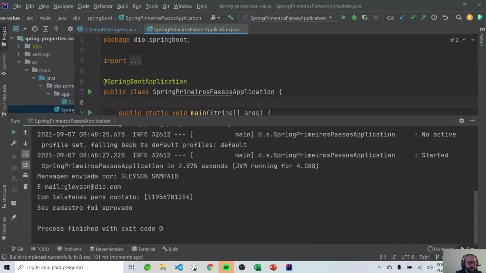
</p>

Resultado da execução da aplicação no console com os valores fixados no código. O Spring Boot inicializa o contexto e o `CommandLineRunner` executa o método `run`, exibindo as informações de "GLEYSON SAMPAIO".

```bash
Mensagem enviada por: GLEYSON SAMPAIO
E-mail:gleyson@dio.com
Com telefones para contato: [11956781254]
Seu cadastro foi aprovado
```

<p align="center">
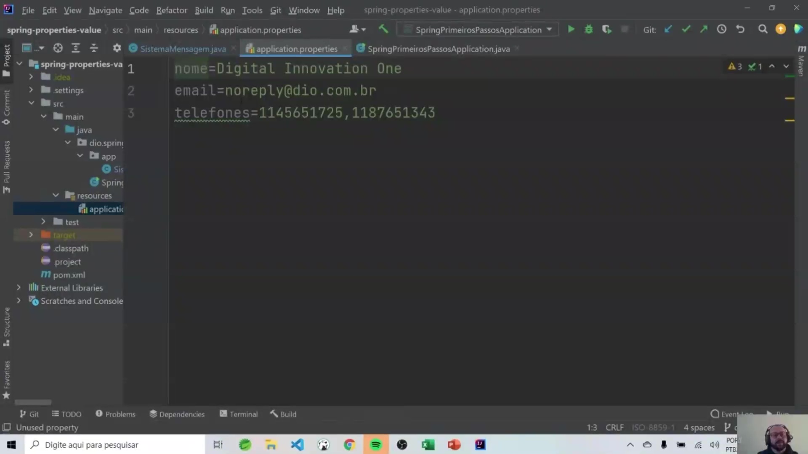
</p>

Introdução do arquivo `application.properties`, localizado na pasta `src/main/resources`. Este arquivo centraliza as configurações da aplicação em pares de chave-valor, permitindo que as informações de negócio (como nome e e-mail do sistema) sejam separadas da lógica de execução Java.

```properties
nome=Digital Innovation One
email=noreply@dio.com.br
telefones=1145651725, 1187651343
```


<p align="center">
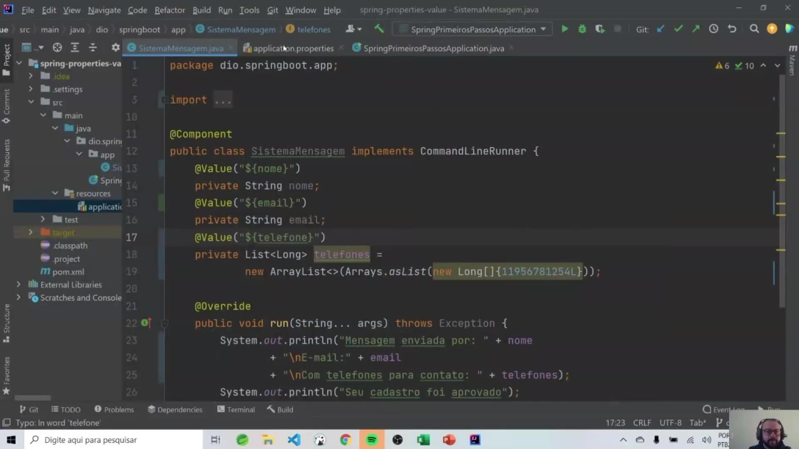
</p>

Refatoração da classe para utilizar a anotação **`@Value`**. Através de expressões SpEL (Spring Expression Language), o Spring busca as chaves definidas no `application.properties` e injeta os valores diretamente nas variáveis. Nota-se um erro proposital na chave `telefone` (no singular), que causaria uma falha na inicialização do Bean caso a propriedade exata não fosse encontrada.

```java
@Value("${nome}")
private String nome;

@Value("${email}")
private String email;

@Value("${telefones}")
private List<Long> telefones;
```


<p align="center">
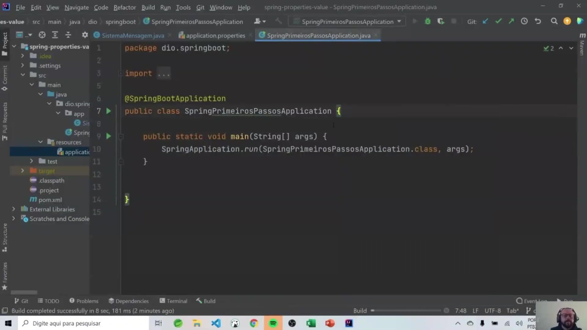
</p>

Retorno à classe de inicialização para reexecutar o projeto após a configuração das propriedades. O Spring agora tentará resolver as dependências de valor externas antes de subir o serviço.


<p align="center">
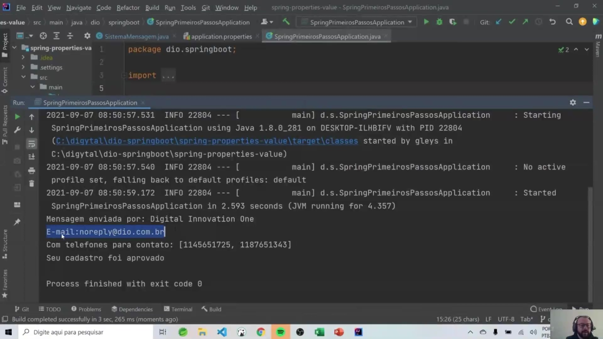
</p>

Logs de execução demonstrando o sucesso da injeção de dependência via propriedades. Observe que o nome exibido agora é "Digital Innovation One", provando que o Spring obteve a informação do arquivo externo e não mais do valor fixo anteriormente definido no código.

```bash
2021-09-07 08:50:59.172 INFO 22804 --- [main] d.s.SpringPrimeirosPassosApplication : Started...
Mensagem enviada por: Digital Innovation One
E-mail:noreply@dio.com.br
Com telefones para contato: [1145651725, 1187651343]
Seu cadastro foi aprovado
```

<p align="center">
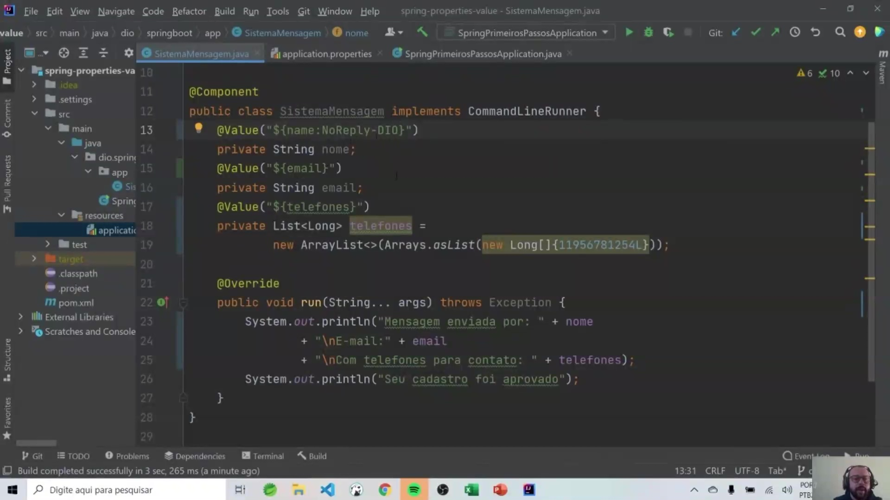
</p>

Demonstração do recurso de **Default Value** na anotação `@Value`. Ao utilizar a sintaxe `${chave:valor_padrao}`, instruímos o Spring a usar um valor alternativo caso a propriedade não seja encontrada no arquivo de configuração. Isso evita erros de inicialização e torna a aplicação mais resiliente.

```java
@Value("${name:no-reply-dio}")
private String nome;
```

<p align="center">
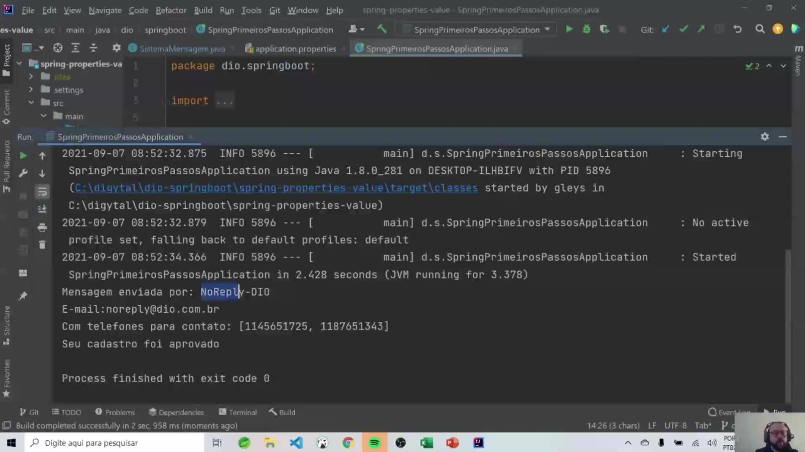
</p>

Validação final do uso de valores padrão. Como a propriedade `name` (em inglês) não existia no arquivo (que continha apenas `nome`), o Spring adotou o valor "no-reply-dio". Isso ilustra como o framework prevê cenários de ausência de configuração para manter a estabilidade do sistema.

```bash
Mensagem enviada por: no-reply-dio
E-mail:noreply@dio.com.br
Com telefones para contato: [1145651725, 1187651343]
Seu cadastro foi aprovado
```      

### 🟩 Vídeo 09 - Configuration Properties

<video width="60%" controls>
  <source src="000-Midia_e_Anexos/bootcamp_tqi_fullstack-modulo.07-curso.02-video_09.webm" type="video/webm">
    Seu navegador não suporta vídeo HTML5.
</video>

link do vídeo: https://web.dio.me/track/tqi-fullstack-developer/course/imersao-no-spring-framework-com-spring-boot/learning/76c0fe87-be0c-40cd-8028-91025f00882b?autoplay=1

Este resumo aborda a transição do uso de configurações simples com @Value para uma abordagem mais robusta e organizada utilizando @ConfigurationProperties. O foco é centralizar informações pertinentes a um contexto específico (como dados de um remetente de e-mail) em um único objeto gerenciado pelo Spring.

### Anotações

Aqui está a versão do documento sem as marcações de citação, mantendo a estrutura original e as explicações técnicas:

<p align="center">
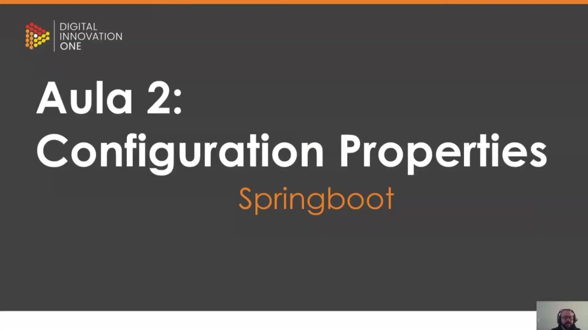
</p>

Esta aula introduz o conceito de **Configuration Properties** no ecossistema Spring Boot. O foco é demonstrar como centralizar informações e configurações de forma estruturada, facilitando a manutenção e a escalabilidade do código ao lidar com parâmetros externos que definem o comportamento da aplicação.

<p align="center">
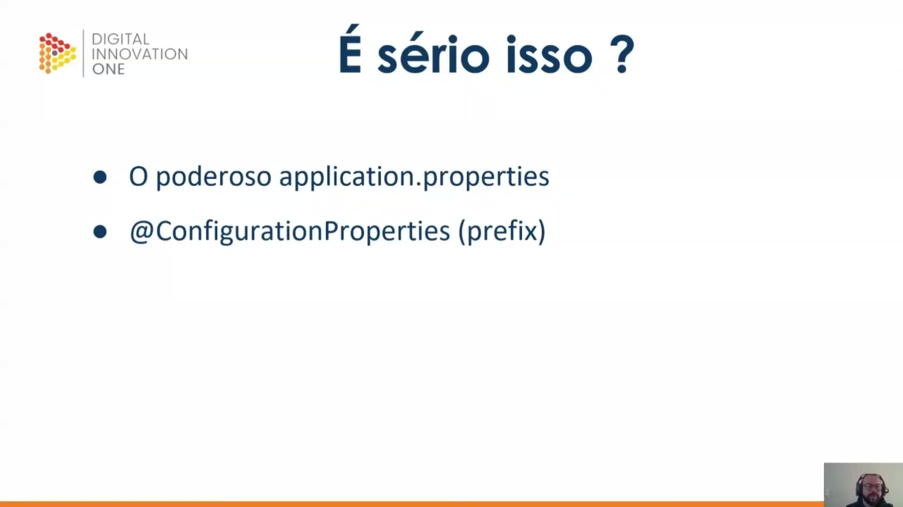
</p>

A base dessa funcionalidade reside no arquivo `application.properties`, que atua como o repositório central de configurações. Para otimizar o acesso a esses dados, utiliza-se a anotação `@ConfigurationProperties`, permitindo o agrupamento de propriedades relacionadas através do uso de um **prefixo** comum, o que evita a dispersão de configurações pelo código.

<p align="center">
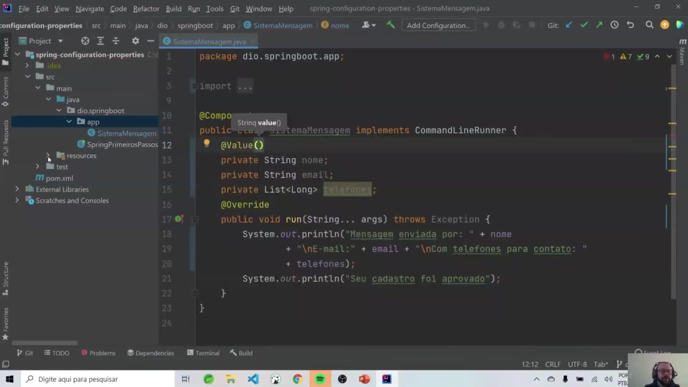
</p>

Abaixo, observa-se a estrutura inicial da classe `SistemaMensagem`, que implementa `CommandLineRunner` para execução de lógica no console. Neste estágio, a classe utiliza a anotação `@Value` para tentar obter dados, mas ainda de forma manual e menos escalável para grandes conjuntos de dados.

```java
package dio.springboot.app;

import org.springframework.boot.CommandLineRunner;
import org.springframework.stereotype.Component;
import org.springframework.beans.factory.annotation.Value;
import java.util.List;

@Component
public class SistemaMensagem implements CommandLineRunner {
    @Value("${nome}")
    private String nome;
    private String email;
    private List<Long> telefones;

    @Override
    public void run(String... args) throws Exception {
        System.out.println("Mensagem enviada por: " + nome
                + "\nE-mail:" + email + "\ncom telefones para contato: " + telefones);
        System.out.println("Seu cadastro foi aprovado");
    }
}
```

<p align="center">
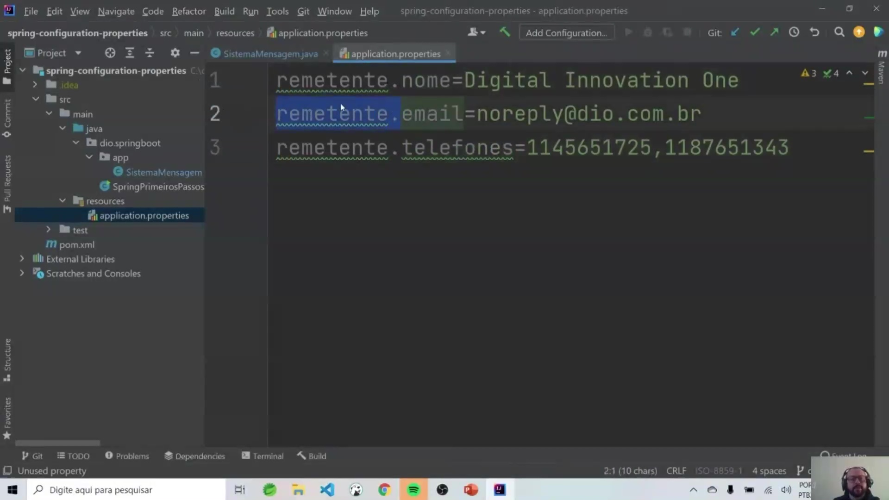
</p>

No arquivo `application.properties`, as chaves de configuração são organizadas utilizando o prefixo `remetente`. Isso cria um "namespace" para as informações de nome, e-mail e telefones, permitindo que o Spring as identifique como um conjunto lógico.

```properties
remetente.nome=Digital Innovation One
remetente.email=noreply@dio.com.br
remetente.telefones=1145651725,1187651343
```

<p align="center">
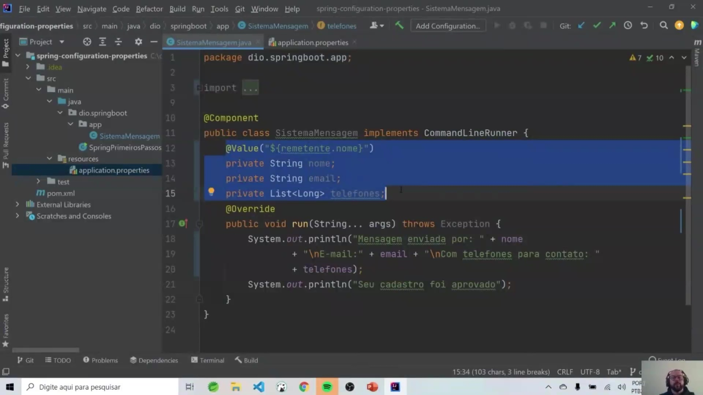
</p>

A classe `SistemaMensagem` é atualizada para mapear as chaves do arquivo de propriedades. Cada atributo agora utiliza a anotação `@Value` apontando para o caminho completo definido anteriormente (`remetente.nome`, por exemplo), garantindo que os valores externos sejam injetados corretamente.

```java
@Component
public class SistemaMensagem implements CommandLineRunner {
    @Value("${remetente.nome}")
    private String nome;
    
    @Value("${remetente.email}")
    private String email;
    
    @Value("${remetente.telefones}")
    private List<Long> telefones;

    @Override
    public void run(String... args) throws Exception {
        System.out.println("Mensagem enviada por: " + nome
                + "\nE-mail:" + email + "\nCom telefones para contato: " + telefones);
        System.out.println("Seu cadastro foi aprovado");
    }
}
```

<p align="center">
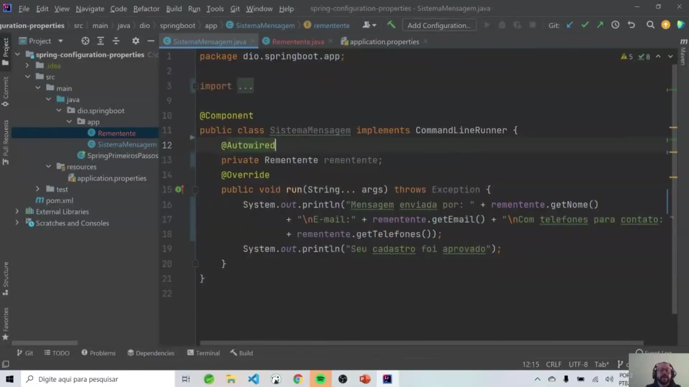
</p>

Para elevar o nível de abstração, é utilizado um objeto de configuração (classe `Rementente`). Em vez de mapear variável por variável, a classe `SistemaMensagem` agora recebe o objeto completo via `@Autowired`. Essa é a abordagem recomendada para centralizar configurações de um mesmo contexto.

```java
@Component
public class SistemaMensagem implements CommandLineRunner {
    @Autowired
    private Rementente rementente;

    @Override
    public void run(String... args) throws Exception {
        System.out.println("Mensagem enviada por: " + rementente.getNome()
                + "\nE-mail:" + rementente.getEmail() 
                + "\nCom telefones para contato: " + rementente.getTelefones());
        System.out.println("Seu cadastro foi aprovado");
    }
}
```

<p align="center">
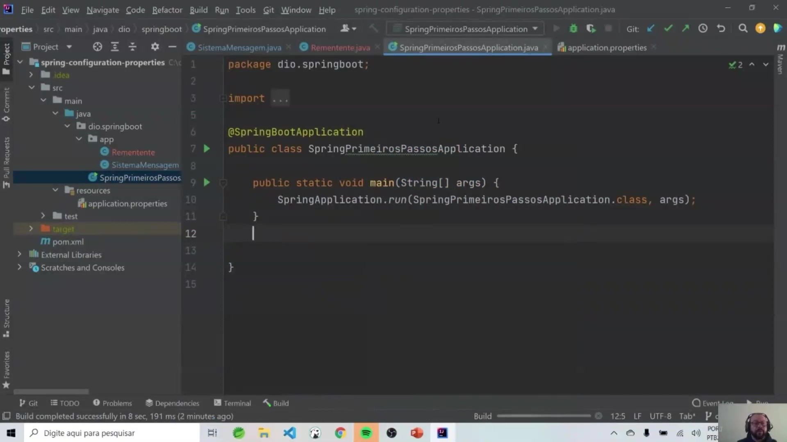
</p>

A classe principal, `SpringPrimeirosPassosApplication`, inicializa o ecossistema Spring. Com o uso de `@SpringBootApplication`, o framework realiza a varredura automática, encontrando os componentes e as propriedades configuradas para montar o sistema em tempo de execução.

```java
package dio.springboot;

import org.springframework.boot.SpringApplication;
import org.springframework.boot.autoconfigure.SpringBootApplication;

@SpringBootApplication
public class SpringPrimeirosPassosApplication {
    public static void main(String[] args) {
        SpringApplication.run(SpringPrimeirosPassosApplication.class, args);
    }
}
```

<p align="center">
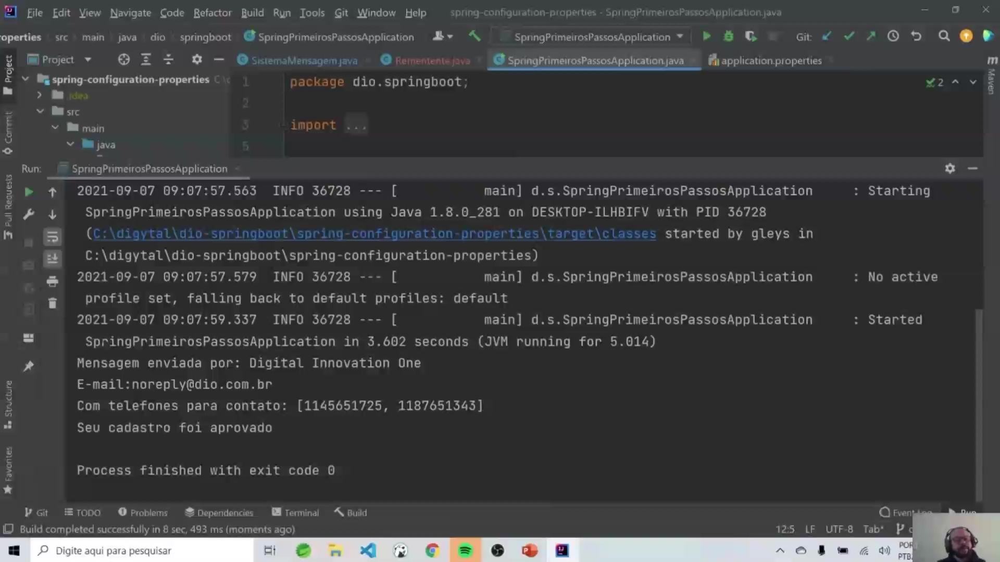
</p>

A execução no console confirma o sucesso da implementação. Os logs mostram que o Spring Boot carregou as propriedades do arquivo, injetou-as no objeto e o método `run` do `SistemaMensagem` exibiu as informações corretamente formatadas.

```text
Mensagem enviada por: Digital Innovation One
E-mail:noreply@dio.com.br
Com telefones para contato: [1145651725, 1187651343]
Seu cadastro foi aprovado
```

### 🟩 Vídeo 10 - Conceito de ORM e JPA

<video width="60%" controls>
  <source src="000-Midia_e_Anexos/bootcamp_tqi_fullstack-modulo.07-curso.02-video_10.webm" type="video/webm">
    Seu navegador não suporta vídeo HTML5.
</video>

link do vídeo: https://web.dio.me/track/tqi-fullstack-developer/course/imersao-no-spring-framework-com-spring-boot/learning/bd2fdc2c-d767-4d3a-962c-a90b1dec0b7a?autoplay=1

Este guia aborda os conceitos fundamentais de persistência de dados em Java, focando na ponte entre o paradigma de Orientação a Objetos e os Bancos de Dados Relacionais, utilizando JPA e o framework Spring Boot.

### Anotações

<p align="center">
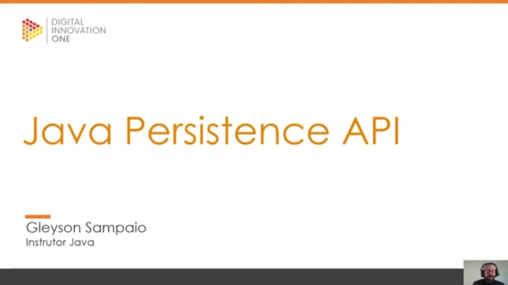
</p>

Nesta introdução, o instrutor Gleyson Sampaio apresenta o curso de Java focado em **Spring Boot** e **Java Persistence API (JPA)**. O objetivo inicial é estabelecer uma base sólida sobre os conceitos de persistência antes de aprofundar no uso do framework Spring.

<p align="center">
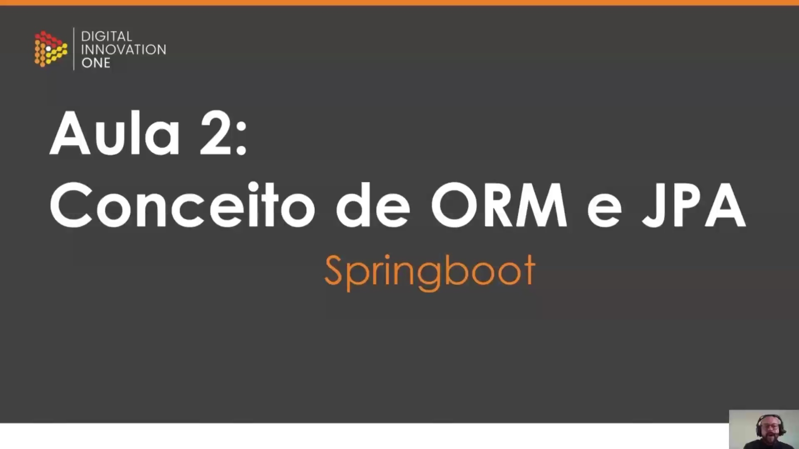
</p>

A segunda aula do módulo foca especificamente nos conceitos fundamentais de **ORM (Object-Relational Mapping)** e na especificação **JPA**. Essa etapa é crucial para entender como o Java lida com a persistência de dados dentro do ecossistema Spring Boot.

<p align="center">
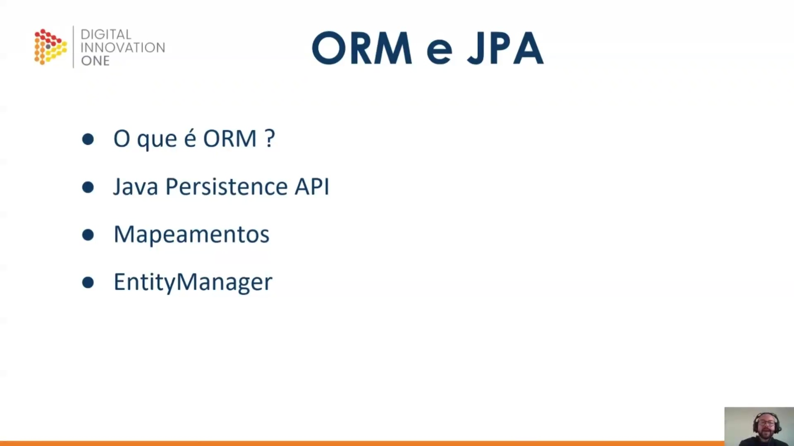
</p>

A programação deste primeiro momento abrange quatro tópicos essenciais para o domínio da interação com bancos de dados:

* Definição de **ORM**;
* O que é a **Java Persistence API**;
* O funcionamento dos **Mapeamentos**;
* O papel do **EntityManager**.

<p align="center">
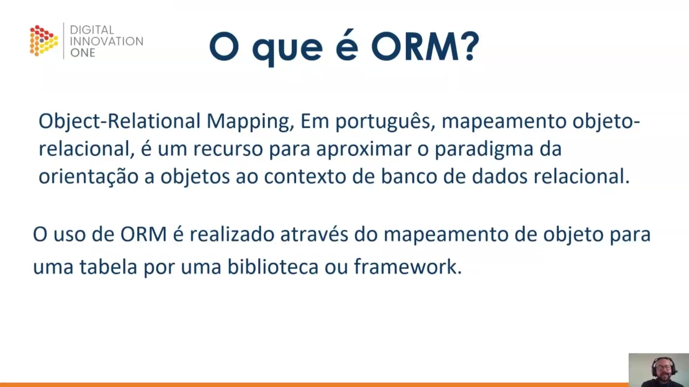
</p>

O **ORM (Object-Relational Mapping)**, ou mapeamento objeto-relacional, é um recurso tecnológico utilizado para aproximar o paradigma da Orientação a Objetos ao contexto de bancos de dados relacionais. Ele resolve a complexidade histórica de transformar classes e objetos em tabelas e registros, tarefa que anteriormente exigia grande esforço de implementação com JDBC. O uso do ORM é viabilizado por bibliotecas ou frameworks que realizam essa ponte de forma automatizada.

<p align="center">
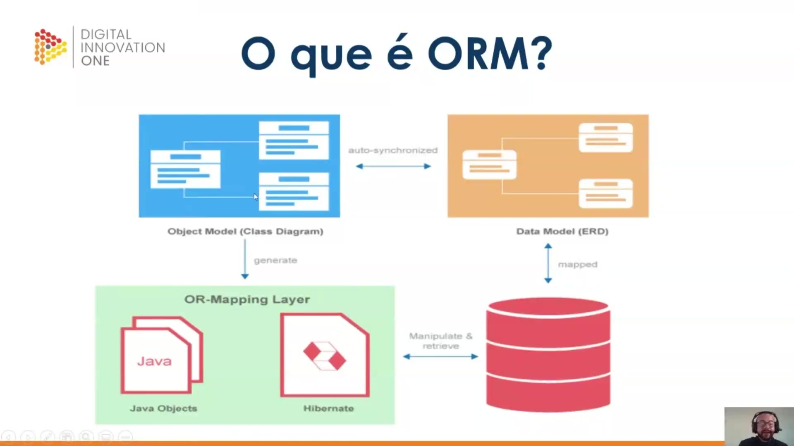
</p>

A estrutura do ORM funciona como um ciclo de sincronização entre o modelo de objetos (Diagrama de Classes) e o modelo de dados (DER). Através de uma camada de mapeamento (**OR-Mapping Layer**), onde o **Hibernate** atua como uma das principais ferramentas, objetos Java são convertidos em dados relacionais. Esse processo permite que a aplicação manipule e recupere informações do banco de dados tratando-as diretamente como objetos na memória da aplicação.

<p align="center">
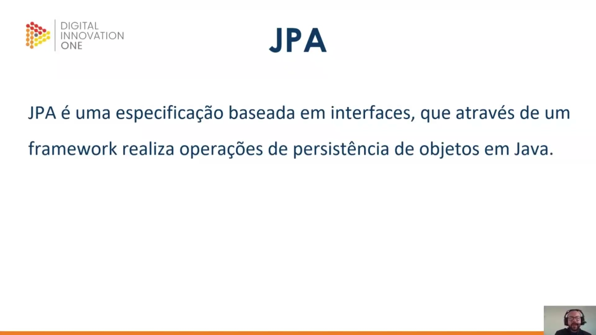
</p>

A **JPA** é definida como uma especificação baseada em interfaces. Ela atua como um descritor que padroniza como as operações de persistência devem ser realizadas em Java. Por ser apenas uma especificação (um conjunto de regras e contratos), ela necessita de um framework real para executar o trabalho pesado de persistência de objetos.

<p align="center">
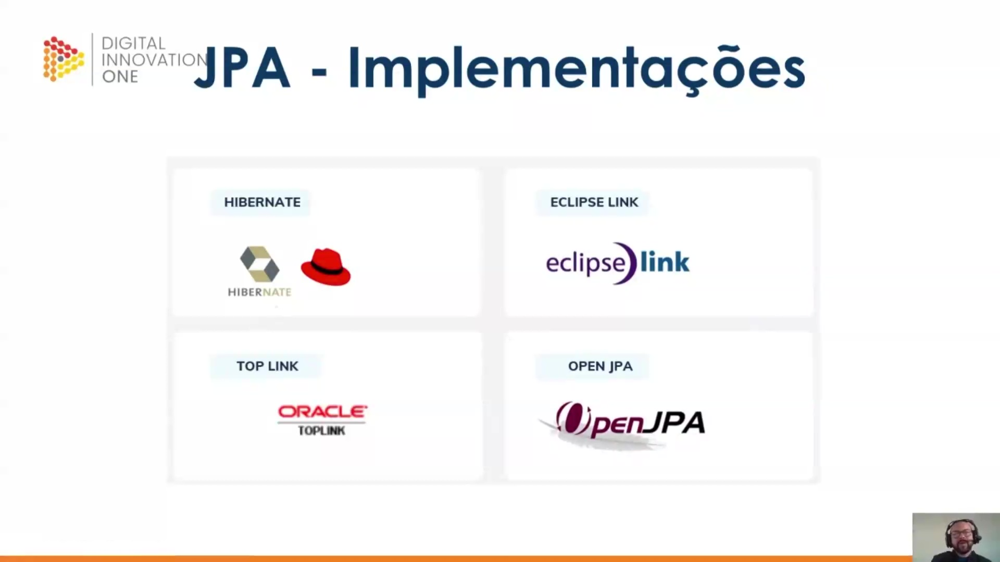
</p>

Existem diversas implementações no mercado que atendem à especificação JPA. Embora o **Hibernate** seja o mais predominante — e a implementação oficial padrão dentro do Spring Boot — existem outras alternativas relevantes:

* **EclipseLink** (da Eclipse Foundation);
* **TopLink** (da Oracle);
* **OpenJPA**.

<p align="center">
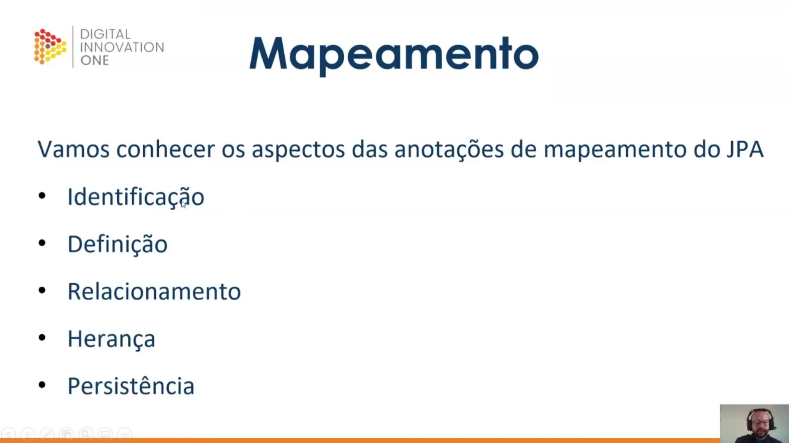
</p>

O mapeamento no JPA é realizado através de anotações que definem o comportamento dos atributos e classes em relação ao banco de dados (DDL). Os principais aspectos incluem:

* **Identificação**: Define chaves primárias;
* **Definição**: Determina restrições como campos obrigatórios, comprimento máximo e precisão;
* **Relacionamento**: Representa ligações entre tabelas;
* **Herança**: Mantém a compatibilidade da estrutura de classes com o banco relacional;
* **Persistência**: Automatiza a atribuição de valores a determinados campos durante a gravação no banco.

<p align="center">
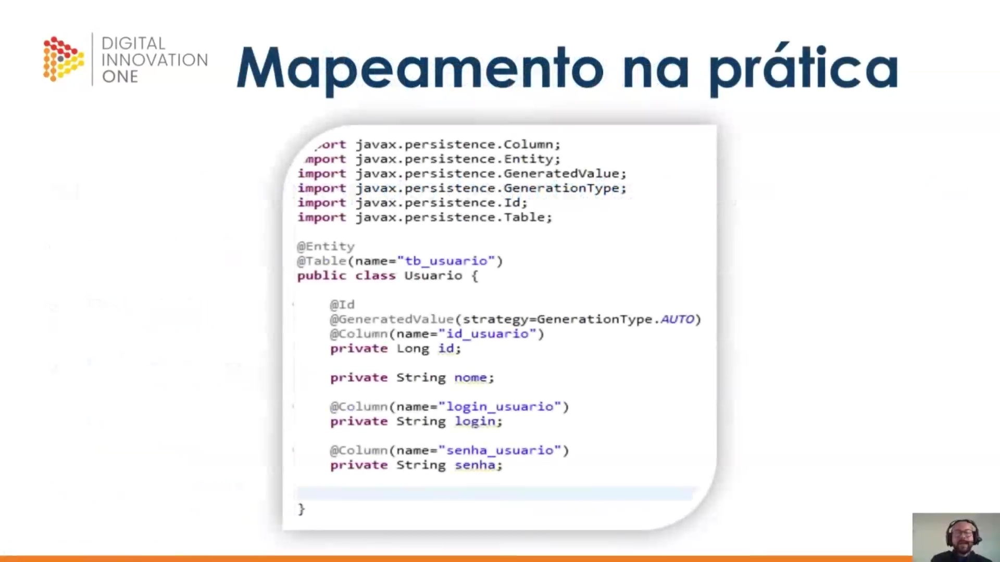
</p>

Na prática, o mapeamento transforma um **POJO** (Plain Old Java Object) em uma entidade persistente. As anotações `@Entity` e `@Table` vinculam a classe à tabela física. A anotação `@Id` combinada com `@GeneratedValue` gerencia a chave primária de forma automática pelo banco. O uso de `@Column(name="...")` permite que o nome do atributo no código Java seja diferente do nome da coluna na tabela do banco de dados.

```java
import javax.persistence.Column;
import javax.persistence.Entity;
import javax.persistence.GeneratedValue;
import javax.persistence.GenerationType;
import javax.persistence.Id;
import javax.persistence.Table;

@Entity
@Table(name="tb_usuario")
public class Usuario {
    
    @Id
    @GeneratedValue(strategy=GenerationType.AUTO)
    @Column(name="id_usuario")
    private Long id;
    
    private String nome;

    @Column(name="login_usuario")
    private String login;

    @Column(name="senha_usuario")
    private String senha;
}
```

<p align="center">
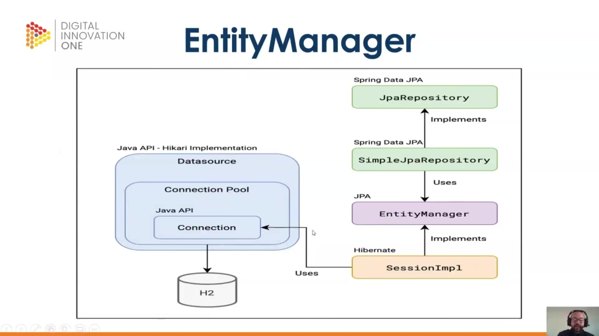
</p>

A arquitetura de persistência envolve múltiplas camadas de abstração. No nível mais baixo, o Java utiliza o **JDBC** (com implementações como o pool de conexões Hikari) para se conectar ao banco de dados (ex: H2). Acima disso, o **EntityManager** do JPA gerencia o ciclo de vida das entidades, sendo implementado por classes como o `SessionImpl` do Hibernate. No topo da cadeia, o **Spring Data JPA** simplifica ainda mais o processo através da interface `JpaRepository`, que automatiza as operações CRUD e consultas.      


### 🟩 Vídeo 11 - Spring Data JPA

<video width="60%" controls>
  <source src="000-Midia_e_Anexos/bootcamp_tqi_fullstack-modulo.07-curso.02-video_11.webm" type="video/webm">
    Seu navegador não suporta vídeo HTML5.
</video>

link do vídeo: https://web.dio.me/track/tqi-fullstack-developer/course/imersao-no-spring-framework-com-spring-boot/learning/d6f975a9-9bcd-4384-b5c6-37c7bdba3a12?autoplay=1

Este guia aborda os conceitos fundamentais, a configuração e a implementação prática do Spring Data JPA, um dos frameworks mais poderosos do ecossistema Spring para persistência de dados.

### Anotações

<p align="center">
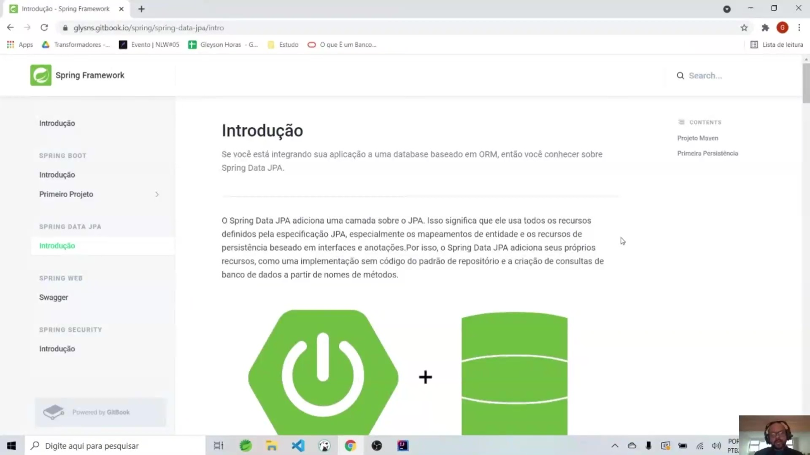
</p>

O Spring Data JPA é um recurso do Spring Framework que adiciona uma camada adicional sobre a especificação JPA (Java Persistence API). Ele herda todos os conceitos de mapeamento de entidades e persistência baseada em interfaces e anotações, mas com o objetivo de reduzir o código repetitivo e complexo frequentemente encontrado em implementações puras de ORM (Object-Relational Mapping). Através de mecanismos como inversão de controle e injeção de dependência, o framework permite a criação de consultas ao banco de dados e a implementação do padrão de repositórios sem a necessidade de escrita manual de código SQL ou iterações complexas com o `EntityManager`.

<p align="center">
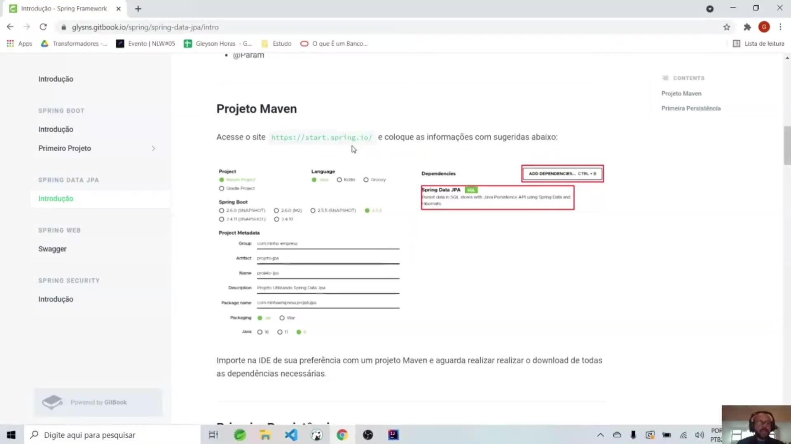
</p>

Para iniciar um projeto Spring Boot com suporte ao Spring Data JPA, utiliza-se o Spring Initializr (start.spring.io). Esta ferramenta facilita a configuração inicial, permitindo definir o gerenciador de dependências (como Maven), a linguagem (Java) e a versão do framework, preparando o terreno para a inclusão dos módulos necessários.

<p align="center">
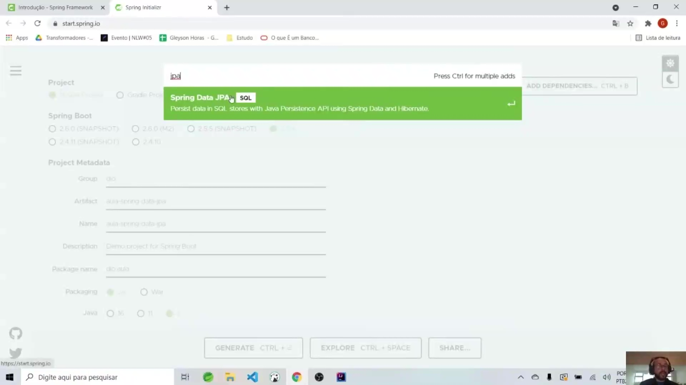
</p>

Dentro do Initializr, seleciona-se a dependência "Spring Data JPA". Ao contrário do desenvolvimento tradicional, onde as dependências eram inseridas manualmente uma a uma, o Spring utiliza "starters" que auxiliam na inicialização rápida do projeto, trazendo consigo todas as bibliotecas necessárias para a persistência de dados.

<p align="center">
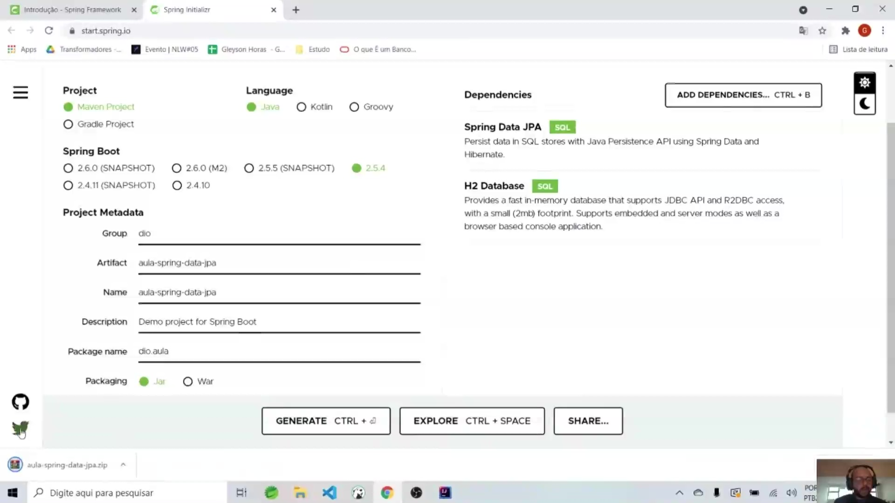
</p>

Além do Spring Data JPA, é fundamental definir o banco de dados que será utilizado. Para fins de desenvolvimento e testes rápidos, o H2 Database é uma escolha comum por ser um banco de dados em memória que dispensa configurações complexas. Nesta etapa, também são definidos os metadados do projeto, como o Group ID (`dio`) e o Artifact ID (`aula-spring-data-jpa`).

<p align="center">
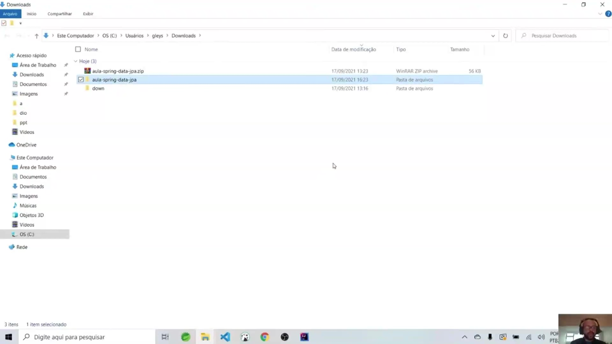
</p>

Após gerar o projeto no Initializr e realizar o download, o arquivo compactado deve ser extraído em um diretório de trabalho. Essa estrutura contém os arquivos fundamentais do Maven, incluindo o arquivo de configuração `pom.xml`, pronta para ser importada em um ambiente de desenvolvimento.

<p align="center">
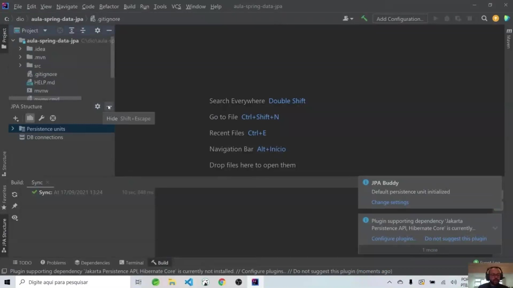
</p>

O projeto extraído é importado para a IDE (como o IntelliJ IDEA). Durante o processo de importação, o ambiente de desenvolvimento reconhece a estrutura Maven e inicia a indexação e o download de dependências adicionais, organizando o projeto para que se possa começar a definir a lógica de negócio e as camadas de persistência.

<p align="center">
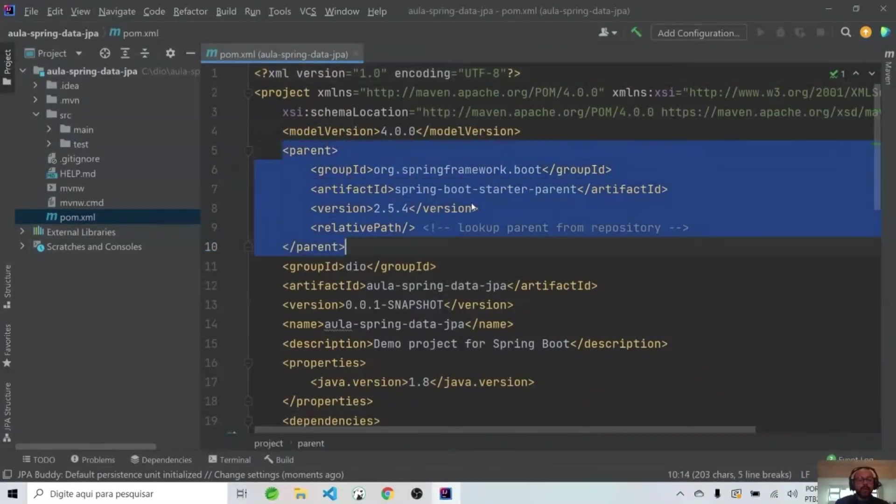
</p>

A análise do arquivo `pom.xml` revela a estrutura de gerenciamento do Spring Boot. Um ponto central é a definição do `<parent>`, que aponta para o `spring-boot-starter-parent`, garantindo que o projeto utilize versões compatíveis e estáveis do framework e suas bibliotecas relacionadas.

```xml
<parent>
    <groupId>org.springframework.boot</groupId>
    <artifactId>spring-boot-starter-parent</artifactId>
    <version>2.5.4</version>
    <relativePath/> </parent>
```

<p align="center">
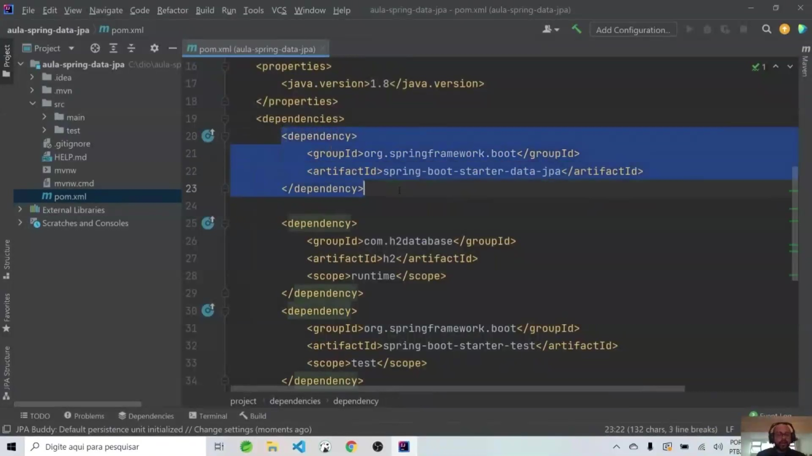
</p>

Ainda no `pom.xml`, verificam-se os starters incluídos. O `spring-boot-starter-data-jpa` habilita os recursos de persistência, enquanto a dependência do `h2` provê o banco de dados em memória para execução da aplicação.

```xml
<dependencies>
    <dependency>
        <groupId>org.springframework.boot</groupId>
        <artifactId>spring-boot-starter-data-jpa</artifactId>
    </dependency>

    <dependency>
        <groupId>com.h2database</groupId>
        <artifactId>h2</artifactId>
        <scope>runtime</scope>
    </dependency>
</dependencies>
```

<p align="center">
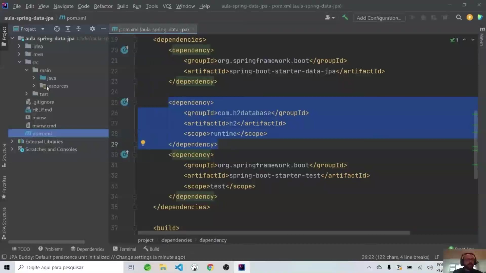
</p>

O desenvolvimento começa pela criação da camada de modelo. Um novo pacote chamado `model` é criado para conter as classes POJO (Plain Old Java Objects), como a classe `User`, que representará os dados dos usuários no sistema antes de ser mapeada para o banco de dados.

<p align="center">
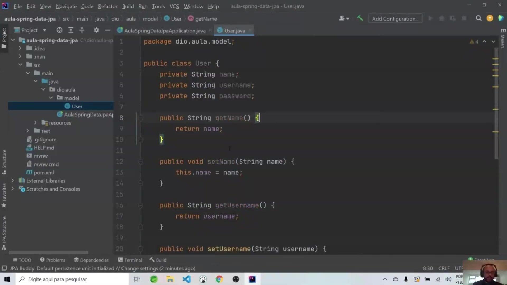
</p>

A classe `User` é definida com atributos privados básicos como `name`, `username` e `password`. Como um POJO padrão, ela inclui métodos acessores (getters e setters) para permitir a manipulação desses dados pela aplicação.

```java
package dio.aula.model;

public class User {
    private String name;
    private String username;
    private String password;

    public String getName() {
        return name;
    }

    public void setName(String name) {
        this.name = name;
    }
    // Outros getters e setters...
}
```

<p align="center">
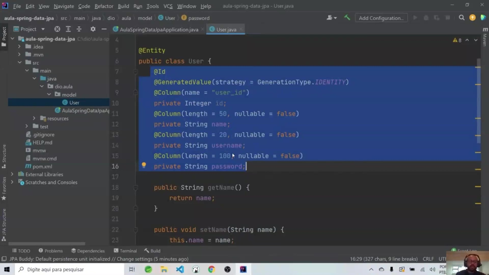
</p>

Para transformar o POJO em uma entidade persistente, utilizam-se anotações do pacote `javax.persistence`. A anotação `@Entity` marca a classe para o JPA, enquanto `@Id` e `@GeneratedValue` definem a chave primária e sua estratégia de geração automática (`IDENTITY`). A anotação `@Column` é aplicada para customizar detalhes físicos das colunas no banco de dados, como nomes específicos, restrições de nulidade e tamanhos máximos de caracteres.

```java
@Entity
public class User {
    @Id
    @GeneratedValue(strategy = GenerationType.IDENTITY)
    @Column(name = "user_id")
    private Integer id;

    @Column(length = 50, nullable = false)
    private String name;

    @Column(length = 20, nullable = false)
    private String username;

    @Column(length = 100, nullable = false)
    private String password;
    
    // Getters e Setters...
}
```

<p align="center">
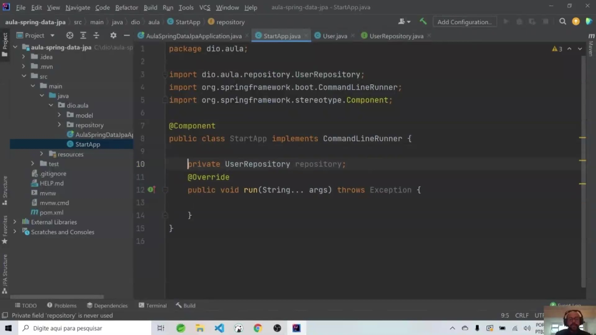
</p>

A criação da interface `UserRepository` demonstra o poder do Spring Data JPA. Ao estender `JpaRepository<User, Integer>`, a aplicação ganha automaticamente acesso a uma vasta gama de métodos de CRUD (como salvar, listar, deletar e buscar por ID) sem a necessidade de escrever qualquer implementação manual. O framework identifica a entidade (`User`) e o tipo de seu identificador (`Integer`) para gerenciar as operações no banco.

```java
package dio.aula.repository;

import dio.aula.model.User;
import org.springframework.data.jpa.repository.JpaRepository;

public interface UserRepository extends JpaRepository<User, Integer> {
}
```

<p align="center">
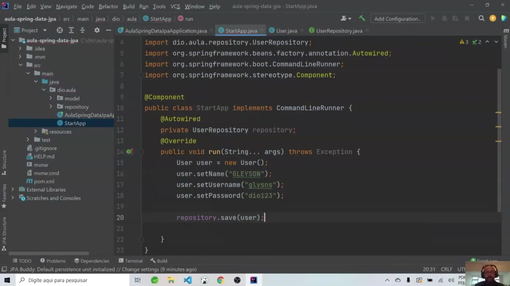
</p>

Para testar a persistência durante a inicialização, cria-se uma classe (ex: `StartApp`) que implementa `CommandLineRunner`. Esta interface obriga a implementação do método `run`, que funciona de forma análoga ao método `main`, sendo disparado automaticamente pelo Spring assim que o container está pronto. Utiliza-se a anotação `@Component` para que a classe seja gerenciada pelo framework e `@Autowired` para realizar a injeção de dependência do repositório.

```java
@Component
public class StartApp implements CommandLineRunner {
    @Autowired
    private UserRepository repository;

    @Override
    public void run(String... args) throws Exception {
        // Lógica de teste
    }
}
```

<p align="center">
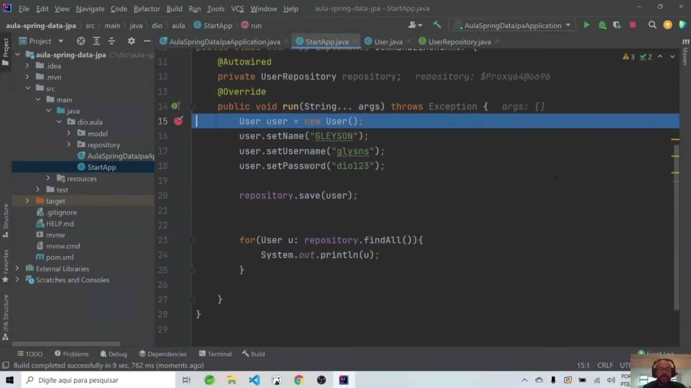
</p>

No método `run`, um objeto `User` é instanciado e seus atributos são preenchidos. Em seguida, chama-se o método `repository.save(user)` para persistir os dados no H2 Database. Para confirmar o sucesso, utiliza-se o método `findAll()` dentro de uma estrutura de repetição para listar e imprimir no console todos os usuários salvos no banco.

```java
User user = new User();
user.setName("Gleyson");
user.setUsername("glysons");
user.setPassword("dio123");

repository.save(user);

for(User u: repository.findAll()){
    System.out.println(u);
}
```

<p align="center">
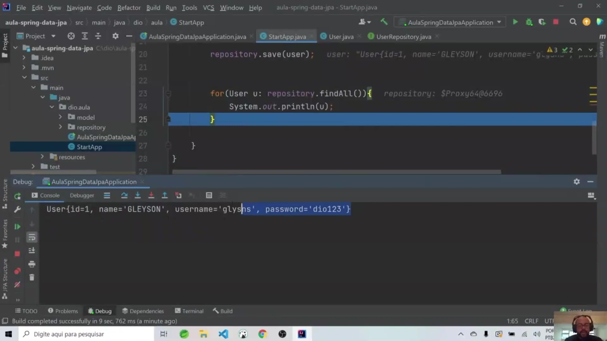
</p>

Ao executar a aplicação, o console exibe o log de inicialização do Spring Boot e a carga do banco de dados em memória. A instrução do método `run` é disparada, realizando a inserção e exibindo o usuário com seu ID devidamente atribuído pelo banco (ex: ID 1), confirmando a integração bem-sucedida entre o mapeamento de entidades e o repositório do Spring Data JPA.      


### 🟩 Vídeo 12 - Conexão com Postgres

<video width="60%" controls>
  <source src="000-Midia_e_Anexos/bootcamp_tqi_fullstack-modulo.07-curso.02-video_12.webm" type="video/webm">
    Seu navegador não suporta vídeo HTML5.
</video>

link do vídeo: https://web.dio.me/track/tqi-fullstack-developer/course/imersao-no-spring-framework-com-spring-boot/learning/862fa7d5-4a3c-4f79-89ed-1a2c7042e365?autoplay=1


### 🟩 Vídeo 13 - JPA Repository

<video width="60%" controls>
  <source src="000-Midia_e_Anexos/bootcamp_tqi_fullstack-modulo.07-curso.02-video_13.webm" type="video/webm">
    Seu navegador não suporta vídeo HTML5.
</video>

link do vídeo:

## Parte 3 - Conclusão

### 🟩 Vídeo 14 - Conclusão e Para saber mais

<video width="60%" controls>
  <source src="000-Midia_e_Anexos/bootcamp_tqi_fullstack-modulo.07-curso.02-video_14.webm" type="video/webm">
    Seu navegador não suporta vídeo HTML5.
</video>

link do vídeo:

## Materiais de Apoio

# Certificado: 

- Link na plataforma: 
- Certificado em pdf: