## Instrutor

- Venilton Falvo Jr (Doutor em Engenharia de Software, Education Tech Lead na DIO)
- Contato Linkedin: / [falvojr](https://www.linkedin.com/in/falvojr/)

### 🟩 Vídeo 01 - Apresentação inicial

<video width="60%" controls>
  <source src="000-Midia_e_Anexos/bootcamp_tqi_fullstack-modulo.07-curso.03-video_01.webm" type="video/webm">
    Seu navegador não suporta vídeo HTML5.
</video>

link do vídeo: https://web.dio.me/project/explorando-padroes-de-projetos-na-pratica-com-java/learning/e86281ce-844c-46d6-970f-6badc1a59f23?back=/track/tqi-fullstack-developer&tab=undefined&moduleId=undefined

O vídeo desceve a introdução ao desafio de projeto focado em Padrões de Projeto Java, apresentado por Venilton. O conteúdo abrange desde a definição técnica de padrões até a trajetória profissional do instrutor e sua filosofia de compartilhamento de conhecimento.

### Anotações

<p align="center">
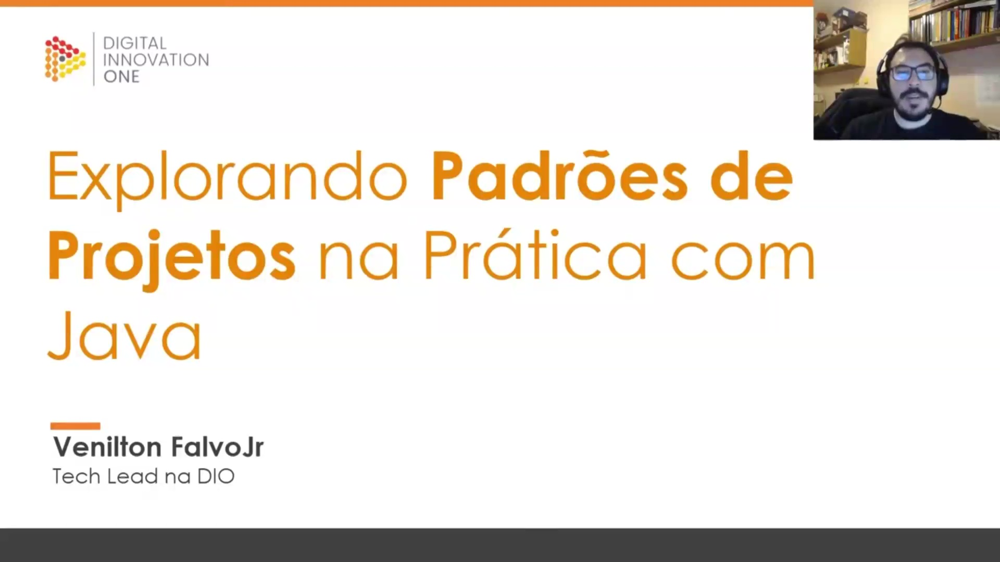
</p>

Este desafio de projeto tem como objetivo explorar os padrões de projeto (Design Patterns) na prática, utilizando a linguagem de programação Java. Sob a condução de Venilton FalvoJr, Tech Lead na DIO , o conteúdo foca em soluções consolidadas na área de desenvolvimento de software. A abordagem didática prevê a implementação desses padrões de forma tradicional ("na unha") e também sua aplicação moderna utilizando o framework Spring.

<p align="center">
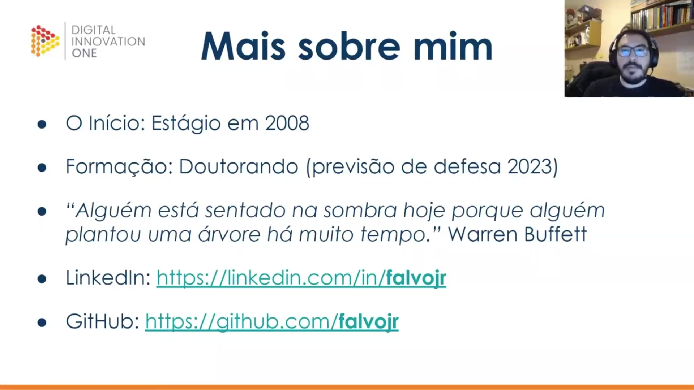
</p>

A apresentação detalha a trajetória e os valores do instrutor:

* **Início de Carreira:** Iniciou no setor de tecnologia em 2008 como estagiário.
* **Formação e Especialização:** É mestre em Engenharia da Computação e doutorando (com previsão de defesa para 2023). Sua experiência técnica abrange o ecossistema Java e o desenvolvimento mobile com transição para Kotlin.
* **Filosofia de Aprendizado:** O instrutor cita Warren Buffett: "Alguém está sentado na sombra hoje porque alguém plantou uma árvore há muito tempo". Essa frase reflete o compromisso com a disseminação de conhecimento para formar novos desenvolvedores.
* **Redes Sociais:** Disponibiliza perfis no LinkedIn e no GitHub para acompanhamento de projetos e networking.

### 🟩 Vídeo 02 - Padrões de Projeto

<video width="60%" controls>
  <source src="000-Midia_e_Anexos/bootcamp_tqi_fullstack-modulo.07-curso.03-video_02.webm" type="video/webm">
    Seu navegador não suporta vídeo HTML5.
</video>

link do vídeo: https://web.dio.me/lab/explorando-padroes-de-projetos-na-pratica-com-java/learning/dbad4e6b-fc8e-4215-b305-435b0ad652c1

OO vídeo explora o universo dos padrões de projeto, desde a sua fundamentação teórica baseada no "Gang of Four" (GoF) até a implementação prática. O foco principal é entender como soluções consolidadas para problemas recorrentes em Programação Orientada a Objetos (POO) podem ser aplicadas tanto em Java puro quanto de forma abstraída através do Spring Framework.

### Anotações

<p align="center">

</p>

Este slide apresenta o **percurso do desafio de projeto**, estabelecendo um roteiro de aprendizado dividido em quatro etapas fundamentais:

* **Passo 1: Padrões de Projeto**: Introdução e formalização dos conceitos teóricos.
* **Passo 2: Praticando com Java "Puro"**: Implementação prática e manual ("na unha") dos padrões selecionados para consolidar o entendimento da lógica por trás de cada solução.
* **Passo 3: Praticando com Spring**: Uma análise comparativa de como o Spring Framework abstrai esses padrões, permitindo que o desenvolvedor utilize soluções robustas, muitas vezes de forma implícita (como no caso da injeção de dependências).
* **Passo 4: Desafio de Projeto**: A etapa final onde o conhecimento é consolidado na construção de um projeto completo e robusto.

A ideia central é permitir que você identifique padrões factuais na estrutura do código antes de confiar em abstrações automáticas de frameworks.

<p align="center">

</p>

Nesta etapa, definimos formalmente o que são **Padrões de Projeto** (Design Patterns). Eles são soluções consolidadas para problemas que ocorrem de forma recorrente no desenvolvimento e na manutenção de software orientado a objetos.

A base teórica de todo o tema reside na obra seminal de 1995, **"Design Patterns: Elements of Reusable Object-Oriented Software"**. Os autores — Erich Gamma, Richard Helm, Ralph Johnson e John Vlissides — tornaram-se mundialmente conhecidos como a **"Gang of Four" (GoF)**. Mesmo sendo uma referência de décadas atrás, os fundamentos estabelecidos por eles continuam sendo o norte principal para qualquer implementação moderna de software orientado a objetos.

<p align="center">

</p>

Os padrões de projeto são categorizados conforme a natureza do problema que resolvem, sendo divididos em três grandes classes:

* **Padrões Criacionais**: Focam no processo de criação/instanciação de objetos. Exemplos incluem o **Singleton** (garantir instância única) e o **Builder** (construção incremental de objetos complexos).
* **Padrões Comportamentais**: Tratam das interações e responsabilidades entre objetos. O foco aqui é como os objetos se comunicam de forma elegante e estruturada. Exemplos notáveis são o **Strategy** (definir uma família de algoritmos intercambiáveis) e o **Observer**.
* **Padrões Estruturais**: Lidam com a composição de classes ou objetos para formar estruturas maiores e mais eficientes, focando muitas vezes na integração com sistemas externos. Exemplos incluem o **Facade** (interface simplificada para sistemas complexos) e o **Adapter**.

Para o nosso desafio prático, focaremos em um representante de cada categoria: **Singleton** (Criacional), **Strategy** (Comportamental) e **Facade** (Estrutural).


### 🟩 Vídeo 03 - Praticando com Java Puro: Singleton

<video width="60%" controls>
  <source src="000-Midia_e_Anexos/bootcamp_tqi_fullstack-modulo.07-curso.03-video_03.webm" type="video/webm">
    Seu navegador não suporta vídeo HTML5.
</video>

link do vídeo: https://web.dio.me/lab/explorando-padroes-de-projetos-na-pratica-com-java/learning/fed94247-3cf7-4b04-a9b2-ead7bfd1c51a


O vídeo aborda a implementação prática do padrão de projeto Singleton utilizando Java puro. O Singleton é um dos padrões "Gang of Four" (GoF) e tem como objetivo principal garantir que uma classe tenha apenas uma instância durante todo o ciclo de vida da aplicação, fornecendo um ponto de acesso global a ela.

### Anotações

#### Percurso do Aprendizado

<p align="center">
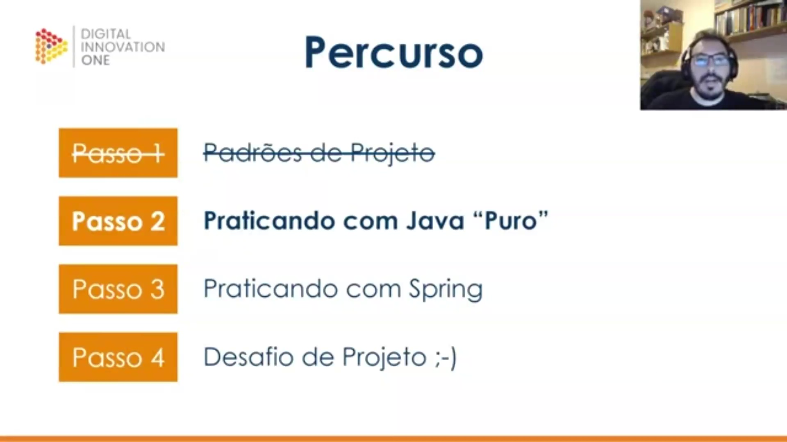
</p>

Apresentação do roteiro de aprendizado focado na prática de padrões de projeto. O objetivo desta etapa é realizar a implementação manual utilizando Java "puro", sem o auxílio de frameworks, para consolidar a compreensão dos mecanismos internos de cada padrão antes de avançar para o Spring.

#### Conceito de Singleton

<p align="center">

</p>

Introdução teórica ao padrão **Singleton**, um padrão criacional que garante a existência de uma única instância de uma determinada classe em toda a aplicação, fornecendo um ponto de acesso global a ela. O diagrama UML destaca que a classe mantém uma referência estática de si mesma e utiliza um método estático para gerenciar o acesso a essa instância única.

#### Criação do Projeto no Eclipse

<p align="center">

</p>

Início da implementação prática no Eclipse IDE. O processo começa com a criação de um novo *Java Project* nomeado `Lab Padrões de Projeto Java`, configurado para utilizar as definições padrão do ambiente de execução (JRE).

#### Organização de Pacotes

<p align="center">

</p>

Estruturação do projeto através da criação do pacote `one.digitalinnovation.gof`. O sufixo "gof" remete ao termo *Gang of Four*, referência aos autores originais que catalogaram os padrões de projeto.

#### Interface de Desenvolvimento

<p align="center">

</p>

Utilização do menu de contexto da IDE para a criação da primeira classe do projeto, preparando o terreno para a codificação das variantes do Singleton.

#### Definição da Classe SingletonLazy

<p align="center">
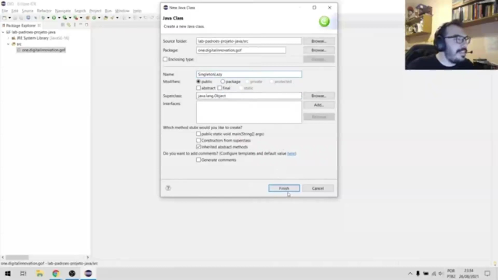
</p>

Configuração da classe `SingletonLazy`. Esta versão é denominada "preguiçosa" porque a instância não é criada imediatamente; ela só será alocada na memória quando for solicitada pela primeira vez.

#### Estrutura Inicial do Código

<p align="center">

</p>

Esqueleto inicial da classe dentro do pacote definido, antes da inclusão da lógica de controle de instância.

```java
package one.digitalinnovation.gof;

public class SingletonLazy {

}
```

#### Atributo de Instância Estática

<p align="center">

</p>

Inclusão do atributo estático `instancia` do tipo `SingletonLazy`. Este campo é privado para garantir que o controle de criação seja restrito à própria classe, seguindo os princípios do padrão.

```java
package one.digitalinnovation.gof;

/**
 * Singleton "preguicoso".
 * * @author falvojr
 */
public class SingletonLazy {

	private static SingletonLazy instancia;

}
```

#### Implementação do Método de Acesso

<p align="center">

</p>

Finalização do Singleton Lazy. O mecanismo consiste em tornar o construtor `private` e implementar o método `getInstancia()`. Este método verifica se a variável `instancia` é nula; se for, cria o objeto. Em chamadas subsequentes, ele apenas retorna o objeto já criado.

```java
package one.digitalinnovation.gof;

/**
 * Singleton "preguicoso".
 * * @author falvojr
 */
public class SingletonLazy {

	private static SingletonLazy instancia;

	private SingletonLazy() {
		super();
	}

	public static SingletonLazy getInstancia() {
		if (instancia == null) {
			instancia = new SingletonLazy();
		}
		return instancia;
	}
}
```

#### Transição para Outras Variantes

<p align="center">
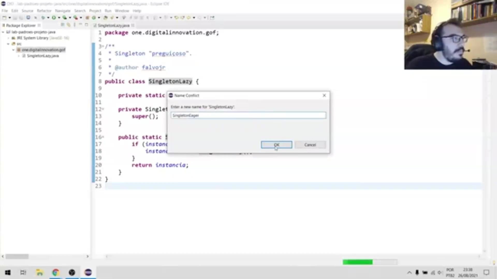
</p>

Demonstração da criação de novas classes para explorar diferentes abordagens do Singleton, como a variante "apressada" (Eager), que lida com a inicialização de forma distinta.

#### Singleton Eager (Apressado)

<p align="center">
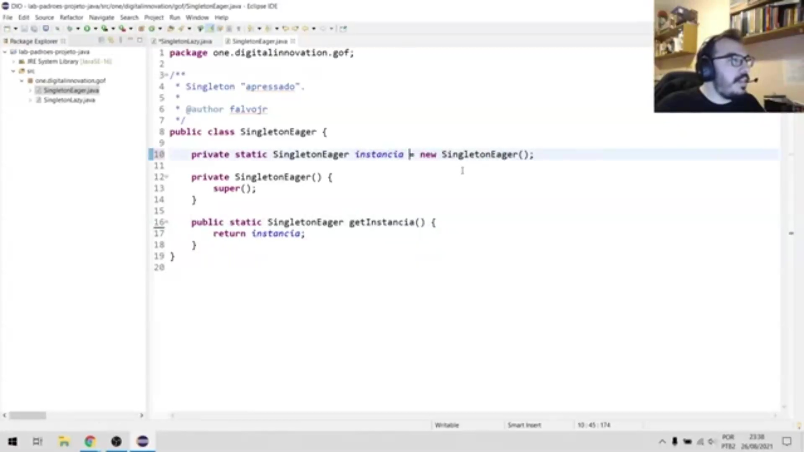
</p>

Implementação do **Singleton Eager**. Diferente do Lazy, esta versão instancia o objeto no momento em que a classe é carregada pela JVM. É uma abordagem simples quando se tem certeza de que a instância será sempre utilizada durante a execução.

```java
package one.digitalinnovation.gof;

/**
 * Singleton "apressado".
 * * @author falvojr
 */
public class SingletonEager {

	private static SingletonEager instancia = new SingletonEager();

	private SingletonEager() {
		super();
	}

	public static SingletonEager getInstancia() {
		return instancia;
	}
}
```

#### Otimização com Lazy Holder

<p align="center">
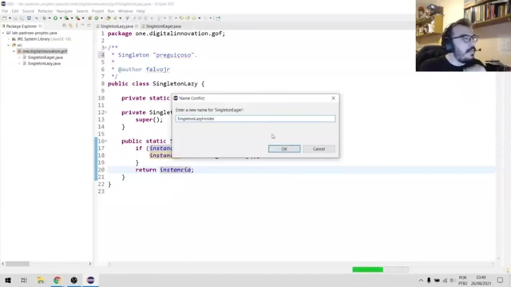
</p>

Preparação para implementar o **Singleton Lazy Holder**, uma técnica que combina a inicialização tardia com segurança em ambientes de múltiplas threads (*thread-safe*).

#### Implementação do Lazy Holder

<p align="center">

</p>

O `SingletonLazyHolder` utiliza uma classe interna estática (`InstanceHolder`) para encapsular a instância. A instância só é criada quando `InstanceHolder` é acessado pela primeira vez, garantindo eficiência.

```java
package one.digitalinnovation.gof;

/**
 * Singleton "Lazy Holder".
 * * @see <a href="https://stackoverflow.com/a/15019331">Referência</a>
 * * @author falvojr
 */
public class SingletonLazyHolder {

	private static class InstanceHolder {
		public static SingletonLazyHolder instancia = new SingletonLazyHolder();
	}

	private SingletonLazyHolder() {
		super();
	}

	public static SingletonLazyHolder getInstancia() {
		return InstanceHolder.instancia;
	}
}
```

#### Testes de Validação

<p align="center">

</p>

Criação da classe `Test` no pacote para verificar se todas as implementações do Singleton estão retornando corretamente a mesma instância de objeto.

#### Execução dos Testes

<p align="center">
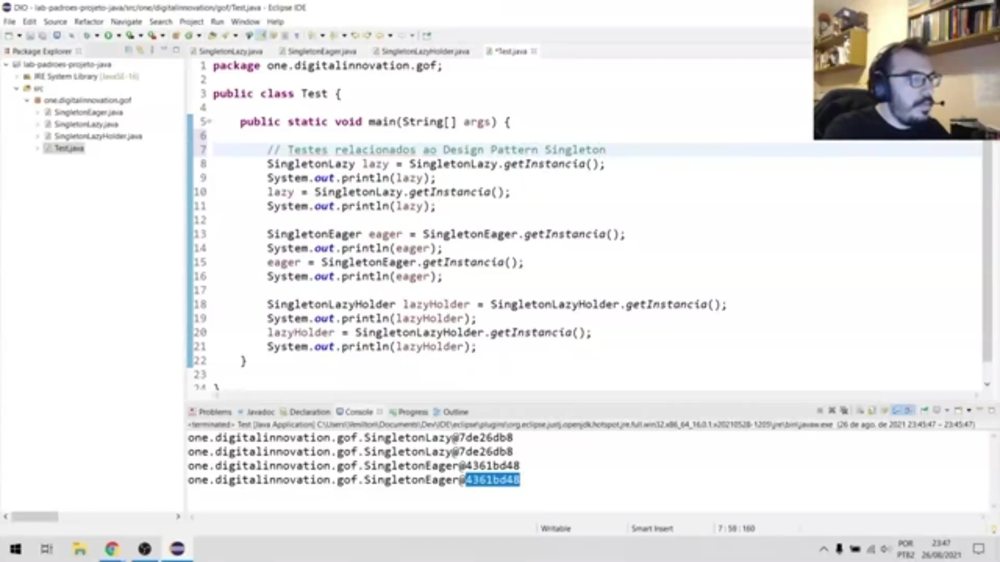
</p>

No método `main`, cada variante do Singleton é chamada duas vezes. Os objetos retornados são impressos no console para que se possa comparar seus endereços de memória.

```java
package one.digitalinnovation.gof;

public class Test {

	public static void main(String[] args) {
		
		// Testes relacionados ao Design Pattern Singleton:
		
		SingletonLazy lazy = SingletonLazy.getInstancia();
		System.out.println(lazy);
		lazy = SingletonLazy.getInstancia();
		System.out.println(lazy);
		
		SingletonEager eager = SingletonEager.getInstancia();
		System.out.println(eager);
		eager = SingletonEager.getInstancia();
		System.out.println(eager);
		
		SingletonLazyHolder lazyHolder = SingletonLazyHolder.getInstancia();
		System.out.println(lazyHolder);
		lazyHolder = SingletonLazyHolder.getInstancia();
		System.out.println(lazyHolder);
	}
}
```

#### Resultados no Console

<p align="center">

</p>

O resultado da execução confirma o sucesso da implementação. Como visto no console, para cada tipo de Singleton, as duas referências impressas possuem o mesmo ID de objeto (ex: `@7d6226db`), provando que a instância retornada é única.      


### 🟩 Vídeo 04 - Praticando com Java Puro: Strategy

<video width="60%" controls>
  <source src="000-Midia_e_Anexos/bootcamp_tqi_fullstack-modulo.07-curso.03-video_04.webm" type="video/webm">
    Seu navegador não suporta vídeo HTML5.
</video>

link do vídeo: https://web.dio.me/lab/explorando-padroes-de-projetos-na-pratica-com-java/learning/9fb47191-db28-4fe2-894b-274f8c5cd24f

Este guia explora o padrão de projeto Strategy, um padrão comportamental que permite definir uma família de algoritmos, encapsulá-los e torná-los intercambiáveis. O vídeo utiliza um exemplo prático de um robô com diferentes comportamentos de movimentação para ilustrar como o padrão facilita a variação de algoritmos através de uma interface comum.

### Anotações

#### Organização de Pacotes no Eclipse

<p align="center">
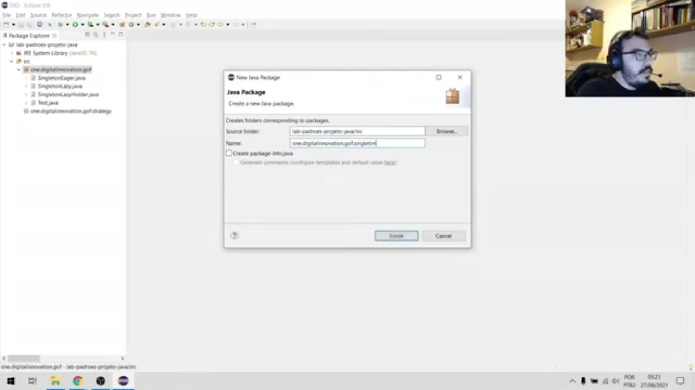
</p>

Para iniciar a implementação do padrão **Strategy**, é necessário organizar o projeto criando novos pacotes. A interface do Eclipse mostra a criação de um pacote específico para separar as implementações de estratégia das demais, como o Singleton, garantindo uma estrutura de diretórios limpa e coerente com as responsabilidades de cada classe.

#### Ajuste de Visualização Hierárquica

<p align="center">
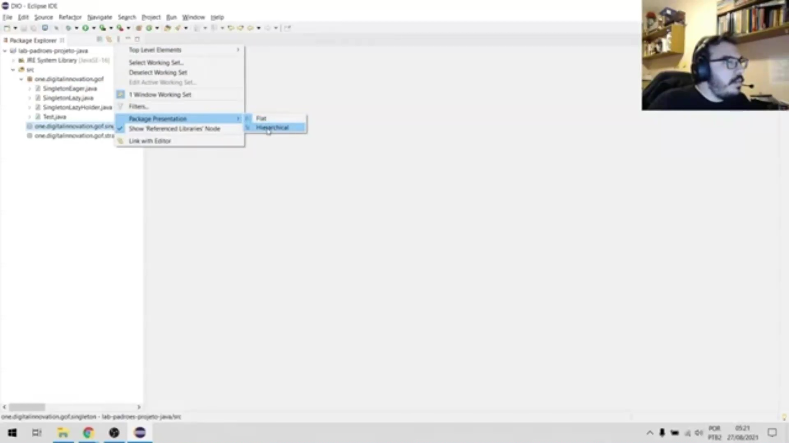
</p>

A visualização do **Package Explorer** é alterada para o modo hierárquico. Essa configuração permite visualizar a árvore de pacotes de forma mais organizada, facilitando a identificação da relação entre o pacote principal e os subpacotes criados para o Strategy e o Singleton.

#### Criação de Novos Componentes

<p align="center">
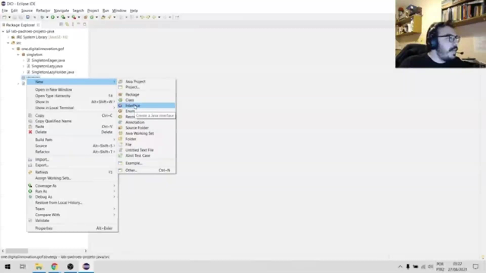
</p>

Dentro do pacote de estratégia, o menu de contexto do Eclipse é utilizado para criar os elementos que comporão o padrão. O objetivo é definir uma interface que servirá como o contrato para as diferentes variações de algoritmos que serão implementadas a seguir.

#### Conceitos do Padrão Strategy

<p align="center">

</p>

O diagrama UML apresenta a estrutura do padrão comportamental **Strategy**. Sua função principal é simplificar a variação de algoritmos para a resolução de um mesmo problema. No diagrama, observamos:

* **Client**: O componente que utiliza o contexto.
* **Context**: A classe que mantém uma referência para uma instância de Strategy.
* **Interface (Strategy)**: Define o contrato comum para todos os algoritmos suportados.
* **Implementações (One/Two)**: As variações concretas do algoritmo.

#### Definição da Interface de Comportamento

<p align="center">

</p>

A interface `Comportamento` é criada para atuar como a nossa **Strategy**. Ela define o contrato que todas as variações de movimentação do robô devem seguir, estabelecendo o método base que será implementado pelas classes concretas.

#### Implementação do Comportamento Agressivo

<p align="center">

</p>

Esta classe representa uma variação específica da estratégia. Ao implementar a interface `Comportamento`, a classe `ComportamentoAgressivo` é obrigada a fornecer sua própria lógica para o método `mover()`.

```java
package one.digitalinnovation.gof.strategy;

public class ComportamentoAgressivo implements Comportamento {

	@Override
	public void mover() {
		System.out.println("Movendo-se agressivamente...");
	}
}
```

#### Implementação do Comportamento Defensivo

<p align="center">

</p>

Seguindo o mesmo padrão de variação de algoritmos, a classe `ComportamentoDefensivo` implementa a interface de estratégia com uma lógica de movimentação distinta.

```java
package one.digitalinnovation.gof.strategy;

public class ComportamentoDefensivo implements Comportamento {

	@Override
	public void mover() {
		System.out.println("Movendo-se defensivamente...");
	}
}
```

#### Implementação do Comportamento Normal

<p align="center">

</p>

A classe `ComportamentoNormal` finaliza as nossas implementações de estratégia iniciais, fornecendo a movimentação padrão do robô.

```java
package one.digitalinnovation.gof.strategy;

public class ComportamentoNormal implements Comportamento {

	@Override
	public void mover() {
		System.out.println("Movendo-se normalmente...");
	}
}
```

#### Criação da Classe de Contexto

<p align="center">

</p>

Após definir as estratégias, cria-se a classe `Robo`, que funcionará como o **Contexto** no padrão Strategy. Esta classe será responsável por utilizar as diferentes implementações de comportamento.

#### Estrutura da Classe Robo

<p align="center">

</p>

A classe `Robo` possui um atributo do tipo da interface `Comportamento`. Isso permite o uso de polimorfismo, onde o robô pode receber qualquer implementação da estratégia. O método `mover()` do robô delega a execução para a estratégia atualmente atribuída.

```java
package one.digitalinnovation.gof.strategy;

public class Robo {
	
	private Comportamento comportamento;

	public void setComportamento(Comportamento comportamento) {
		this.comportamento = comportamento;
	}
	
	public void mover() {
		comportamento.mover();
	}
}
```

#### Configuração do Cenário de Teste

<p align="center">
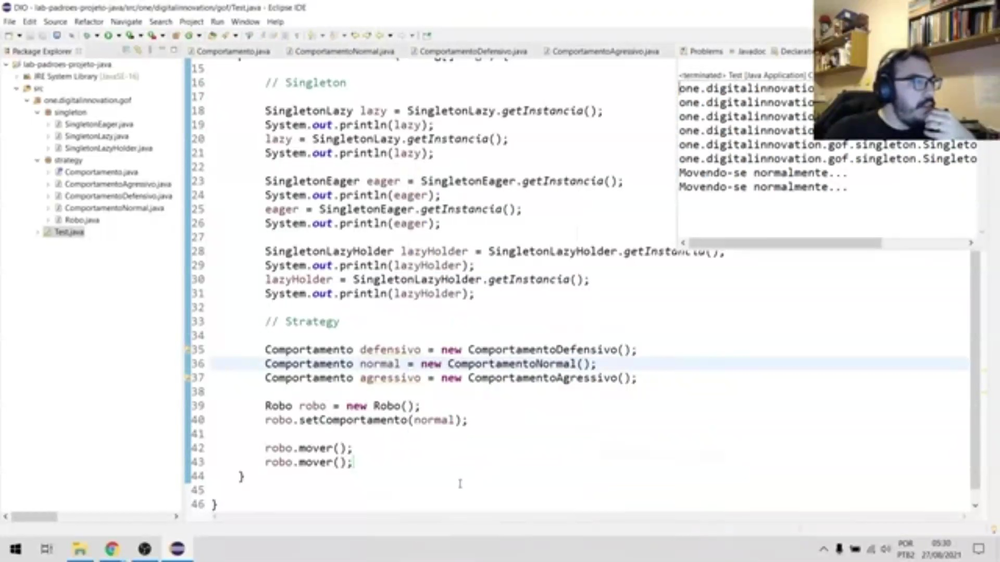
</p>

No código de teste, as instâncias das estratégias são criadas e o robô é inicializado. O exemplo demonstra a atribuição de um comportamento inicial (Normal) e a execução da ação de movimento.

```java
// Strategy
Comportamento defensivo = new ComportamentoDefensivo();
Comportamento normal = new ComportamentoNormal();
Comportamento agressivo = new ComportamentoAgressivo();

Robo robo = new Robo();
robo.setComportamento(normal);

robo.mover();
robo.mover();
```

#### Alternância de Estratégias em Tempo de Execução

<p align="center">

</p>

A flexibilidade do padrão é demonstrada ao alterar o comportamento do robô durante a execução. Ao trocar a estratégia via `setComportamento`, o mesmo método `robo.mover()` passa a produzir resultados diferentes, conforme exibido no console.

```java
robo.setComportamento(defensivo);
robo.mover();

robo.setComportamento(agressivo);
robo.mover();
robo.mover();
robo.mover();
```      

### 🟩 Vídeo 05 - Praticando com Java Puro: Facade

<video width="60%" controls>
  <source src="000-Midia_e_Anexos/bootcamp_tqi_fullstack-modulo.07-curso.03-video_05.webm" type="video/webm">
    Seu navegador não suporta vídeo HTML5.
</video>

link do vídeo: https://web.dio.me/lab/explorando-padroes-de-projetos-na-pratica-com-java/learning/b85aef03-dad2-4e21-bbbf-e40aa02a9519

O vídeo apresenta uma explanação teórica e prática sobre o padrão de projeto Facade (Fachada). O objetivo central é demonstrar como esse padrão pode simplificar a interação com sistemas complexos, provendo uma interface única e amigável para o desenvolvedor.

### Anotações

<p align="center">
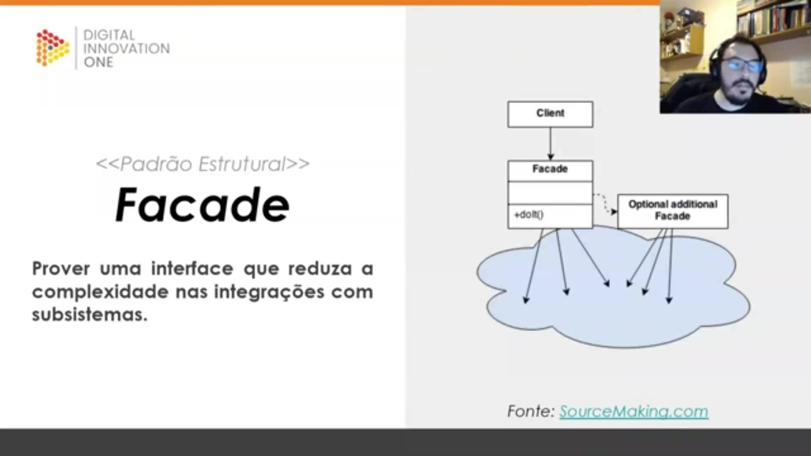
</p>

O padrão de projeto **Facade** é classificado como um **Padrão Estrutural**. Sua principal finalidade é prover uma interface unificada e simplificada que reduza a complexidade nas integrações com diversos subsistemas. No diagrama, observa-se que o **Client** interage apenas com a **Facade**, que por sua vez gerencia a comunicação com múltiplos componentes internos de um sistema complexo, abstraindo as chamadas necessárias para realizar uma operação.

<p align="center">

</p>

Para iniciar a implementação prática, o ambiente de desenvolvimento é preparado para a criação de um novo pacote voltado ao padrão Facade. A imagem demonstra a conclusão de exemplos anteriores baseados no padrão Strategy, onde um objeto do tipo `Robo` teve comportamentos alterados dinamicamente. Agora, o foco volta-se para a criação da classe `Facade` dentro da estrutura do projeto Java.

<p align="center">

</p>

A classe `Facade` é definida no pacote `one.digitalinnovation.gof.facade`. O ponto central desta implementação é o método `migrarCliente`, que recebe parâmetros simples: o nome e o CEP do cliente. O objetivo é que esta interface oculte a complexidade de obter dados adicionais e realizar gravações em diferentes sistemas.

```java
package one.digitalinnovation.gof.facade;

public class Facade {

    public void migrarCliente(String nome, String cep) {
        
    }
}
```

<p align="center">
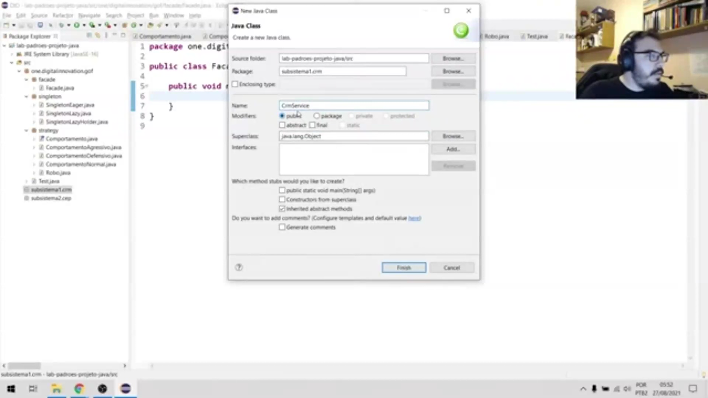
</p>

Para simular a complexidade que a Facade deve gerenciar, são criados subsistemas externos. O primeiro deles é o `CrmService`, localizado no pacote `subsistema1.crm`. Este componente representará um sistema de CRM (Customer Relationship Management) responsável pelo armazenamento definitivo dos dados dos clientes.

<p align="center">

</p>

A implementação do `CrmService` utiliza um método estático chamado `gravarCliente`. Nota-se que a interface deste subsistema é mais exigente que a da Facade, requerendo não apenas o nome e o CEP, mas também cidade e estado. O uso de métodos estáticos permite o consumo sem a necessidade de instanciar a classe, centralizando a lógica de persistência simulada.

```java
package subsistema1.crm;

public class CrmService {

    private CrmService() {
        super();
    }

    public static void gravarCliente(String nome, String cep, String cidade, String estado) {
        System.out.println("Cliente salvo no sistema de CRM.");
    }
}
```

<p align="center">
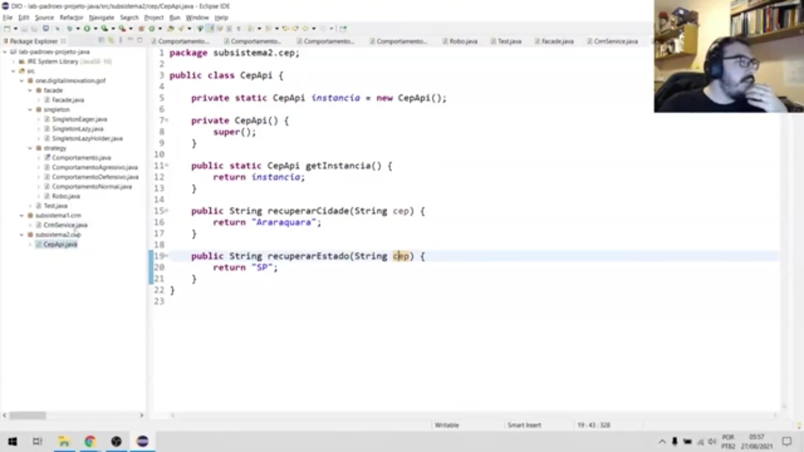
</p>

O segundo subsistema, `CepApi`, é implementado no pacote `subsistema2.cep` seguindo o padrão **Singleton**. Ele simula uma API de busca de CEP, fornecendo os métodos `recuperarCidade` e `recuperarEstado`. Esta implementação distinta — uma usando Singleton e outra métodos estáticos — exemplifica as diferentes formas de integração que uma Facade pode consolidar em uma interface única.

```java
package subsistema2.cep;

public class CepApi {

    private static CepApi instancia = new CepApi();

    private CepApi() {
        super();
    }

    public static CepApi getInstancia() {
        return instancia;
    }

    public String recuperarCidade(String cep) {
        return "Araraquara";
    }

    public String recuperarEstado(String cep) {
        return "SP";
    }
}
```

<p align="center">
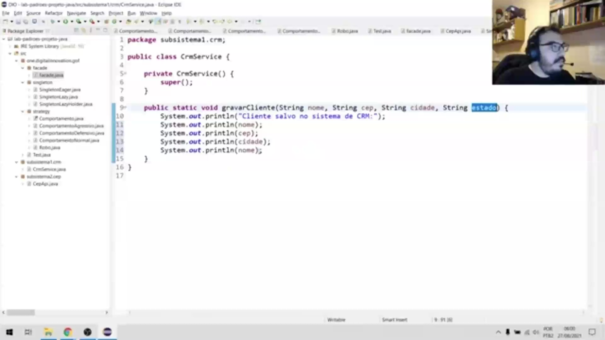
</p>

O `CrmService` é complementado com instruções de saída no console para validar a recepção correta das informações. O método agora imprime o nome, CEP, cidade e estado, permitindo verificar se a integração realizada pela Facade obteve os dados corretamente a partir da API de CEP e os repassou ao sistema de CRM.

```java
public static void gravarCliente(String nome, String cep, String cidade, String estado) {
    System.out.println("Cliente salvo no sistema de CRM:");
    System.out.println(nome);
    System.out.println(cep);
    System.out.println(cidade);
    System.out.println(estado);
}
```

<p align="center">
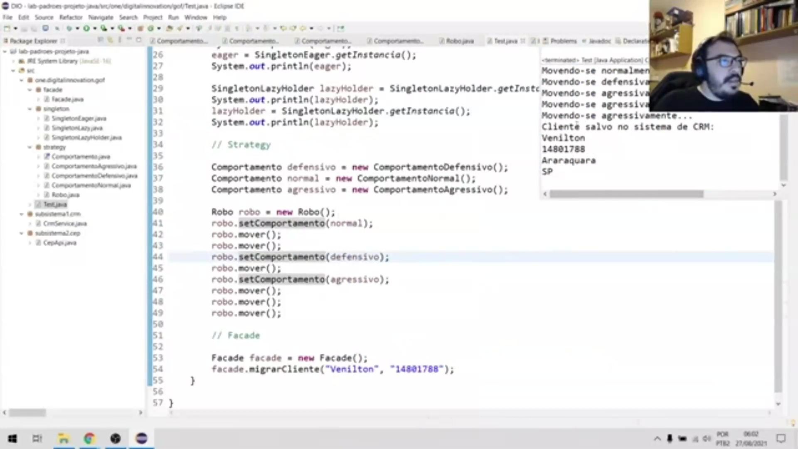
</p>

Na fase de testes, a classe `Test` instancia a `Facade` e executa o método `migrarCliente`. O resultado no console confirma que a Facade abstraiu com sucesso a complexidade: a partir de apenas um nome e um CEP, ela consultou a `CepApi` para obter "Araraquara" e "SP", e então acionou o `CrmService` para salvar o cliente com os dados completos.

```java
// Facade
Facade facade = new Facade();
facade.migrarCliente("Venilton", "14801788");
```

### 🟩 Vídeo 06 - Praticando com Spring: Introdução

<video width="60%" controls>
  <source src="000-Midia_e_Anexos/bootcamp_tqi_fullstack-modulo.07-curso.03-video_06.webm" type="video/webm">
    Seu navegador não suporta vídeo HTML5.
</video>

link do vídeo: https://web.dio.me/lab/explorando-padroes-de-projetos-na-pratica-com-java/learning/5da490c2-92d1-4976-a718-dd49d1b1c061

O vídeo explica como os conceitos teóricos de Design Patterns são aplicados na prática dentro do Spring Framework. O objetivo é correlacionar funcionalidades nativas do framework com padrões clássicos, otimizando o desenvolvimento e a manutenção de software.

### Anotações

#### Percurso de Aprendizado: Padrões de Projeto no Ecossistema Java 

<p align="center">
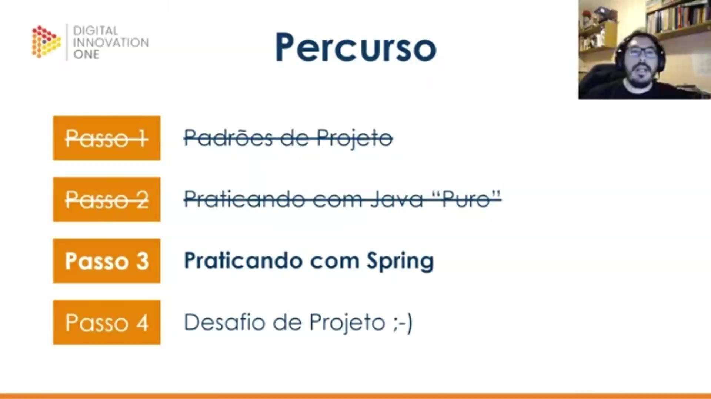
</p>

Este slide apresenta o roteiro estruturado para o domínio de padrões de projeto, dividindo a jornada em quatro etapas fundamentais:

* **Passo 1:** Foco inicial nos conceitos teóricos e padrões de projeto fundamentais.
* **Passo 2:** Prática de implementação utilizando Java "Puro", permitindo consolidar o entendimento estrutural sem abstrações de frameworks.
* **Passo 3:** Transição para o **Spring Framework**, correlacionando os padrões aprendidos com as funcionalidades automáticas do ecossistema.
* **Passo 4:** Consolidação final através de um **Desafio de Projeto** prático.

#### Mapeamento de Padrões GoF no Spring Framework 

<p align="center">
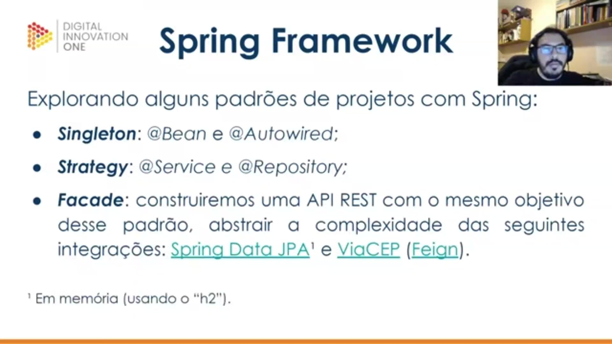
</p>

Nesta etapa, exploramos como o Spring Framework implementa nativamente padrões clássicos de projeto para otimizar o desenvolvimento:

* **Singleton:** Gerenciado pelo container de Inversão de Controle do Spring através das anotações `@Bean` e `@Autowired`. Por padrão, o framework entrega instâncias únicas (beans) para otimizar o consumo de memória,].
* **Strategy:** Aplicado por meio de `@Service` e `@Repository`. O `@Service` atua como a implementação concreta de uma estratégia de negócio], enquanto o `@Repository` abstrai a estratégia de persistência de dados].
* **Facade:** Uma **API REST** é utilizada como uma fachada para expor uma interface simples e coesa]. Ela abstrai a complexidade de integrações como o **Spring Data JPA** e o consumo de serviços externos como o **ViaCEP** via **Feign**].
* 
**Persistência:** Utiliza-se o banco de dados em memória **H2**. Essa escolha simplifica o projeto ao evitar configurações complexas de *connection strings* e drivers manuais durante a fase de aprendizado].


### 🟩 Vídeo 07 - Praticando com Spring: Conhecendo o Projeto Base

<video width="60%" controls>
  <source src="000-Midia_e_Anexos/bootcamp_tqi_fullstack-modulo.07-curso.03-video_07.webm" type="video/webm">
    Seu navegador não suporta vídeo HTML5.
</video>

link do vídeo: https://web.dio.me/lab/explorando-padroes-de-projetos-na-pratica-com-java/learning/975a7cad-08ec-43be-9f34-5c3c65aa6ba7

### 🟩 Vídeo 08 - Praticando com Spring: Padrões de Projeto em uma API REST

<video width="60%" controls>
  <source src="000-Midia_e_Anexos/bootcamp_tqi_fullstack-modulo.07-curso.03-video_08.webm" type="video/webm">
    Seu navegador não suporta vídeo HTML5.
</video>

link do vídeo:

### 🟩 Vídeo 09 - Desafio de Projeto

<video width="60%" controls>
  <source src="000-Midia_e_Anexos/bootcamp_tqi_fullstack-modulo.07-curso.03-video_09.webm" type="video/webm">
    Seu navegador não suporta vídeo HTML5.
</video>

link do vídeo:

### 🟩 Vídeo 10 - Entendendo o Desafio

<video width="60%" controls>
  <source src="000-Midia_e_Anexos/bootcamp_tqi_fullstack-modulo.07-curso.03-video_10.webm" type="video/webm">
    Seu navegador não suporta vídeo HTML5.
</video>

link do vídeo:

##  Materiais de Apoio

# Certificado: 

- Link na plataforma: 
- Certificado em pdf: