## Instrutor

- Gleyson Sampaio (Analista Desenvolvedor Java)
- Contato Linkedin: / [glysns](https://www.linkedin.com/in/glysns/)

## Parte 1 - Apresentação e visão geral do curso

### 🟩 Vídeo 01 - Apresentação e visão geral do curso

<video width="60%" controls>
  <source src="000-Midia_e_Anexos/bootcamp_tqi_fullstack-modulo.07-curso.04-video_01.webm" type="video/webm">
    Seu navegador não suporta vídeo HTML5.
</video>

link do vídeo: https://web.dio.me/track/tqi-fullstack-developer/course/adicionando-seguranca-a-uma-api-rest-com-spring-security/learning/99032de1-b0da-4986-9907-6028acc4202d?autoplay=1

Este curso é uma imersão no ecossistema de segurança do Spring Framework, com foco específico em Spring Boot Security. O objetivo principal é capacitar desenvolvedores a proteger aplicações web modernas, com ênfase em APIs REST, garantindo que o acesso a dados e funcionalidades seja restrito e monitorado.

### Anotações

<p align="center">
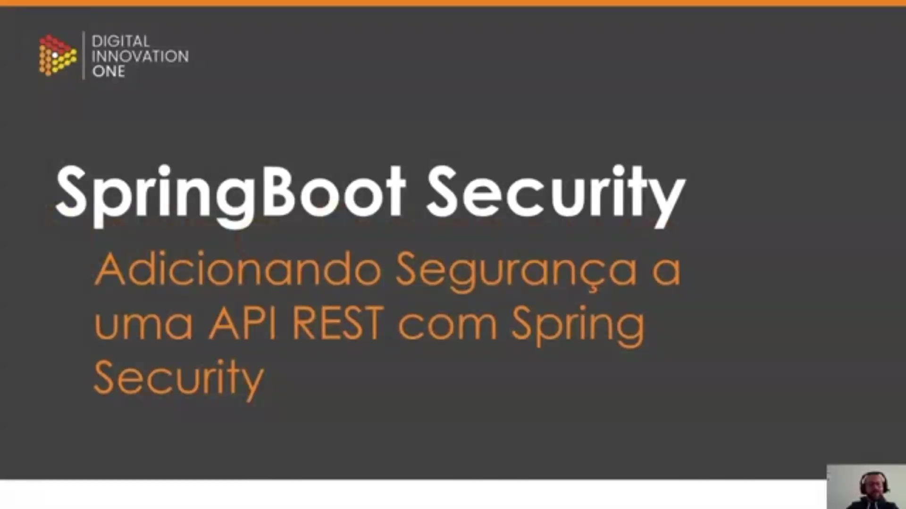
</p>

Esta série de vídeos introduz o ecossistema do **Spring Boot Security**, uma iniciativa da Digital Innovation One focada em prover camadas de proteção robustas para aplicações modernas. O objetivo central é demonstrar como adicionar segurança de forma eficiente a **APIs REST**, utilizando as facilidades e padrões oferecidos pelo ecossistema Spring Framework para garantir a integridade e o controle de acesso dos dados.

<p align="center">
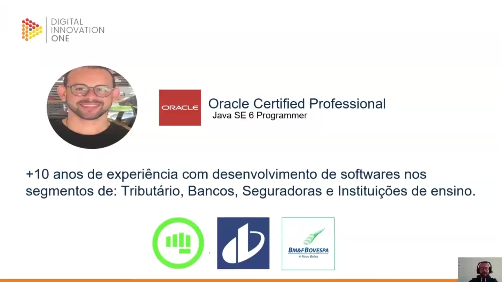
</p>

A instrução é conduzida por **Gleyson Sampaio**, profissional com mais de 10 anos de experiência no desenvolvimento de software. Sua trajetória abrange setores críticos como o tributário, bancário, seguradoras e instituições de ensino. Além da experiência prática em grandes instituições (como indicado pelos logotipos da BM&FBovespa e Oracle), o instrutor possui a certificação **Oracle Certified Professional Java SE 6 Programmer**, consolidando o embasamento técnico que será aplicado durante o curso.

<p align="center">
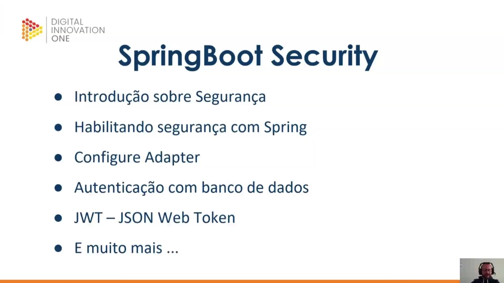
</p>

O roteiro de aprendizado está estruturado para cobrir desde fundamentos até implementações avançadas de segurança. Os tópicos principais incluem:

* **Introdução sobre Segurança**: Conceitos base para entender a proteção de dados.
* **Habilitando segurança com Spring**: Como ativar o framework no projeto.
* **Configure Adapter**: Uso de adapters para ganhar flexibilidade além das configurações padrão.
* **Autenticação com banco de dados**: Gerenciamento de registros de usuários e perfis de acesso diretamente via banco de dados.
* **JWT (JSON Web Token)**: Implementação de tokens para autenticação stateless em APIs.


## Parte 2 - Springboot Security com JWT

### 🟩 Vídeo 02 - Habilitando segurança com Spring

<video width="60%" controls>
  <source src="000-Midia_e_Anexos/bootcamp_tqi_fullstack-modulo.07-curso.04-video_02.webm" type="video/webm">
    Seu navegador não suporta vídeo HTML5.
</video>

link do vídeo: https://web.dio.me/track/tqi-fullstack-developer/course/adicionando-seguranca-a-uma-api-rest-com-spring-security/learning/e7af8139-2278-4bcd-9872-56a2d0288c58?autoplay=1

Este guia explora os conceitos básicos do framework Spring Security, detalhando como ele protege aplicações Java, a diferença entre autenticação e autorização, e como realizar a configuração inicial em um projeto Spring Boot.

### Anotações

<p align="center">
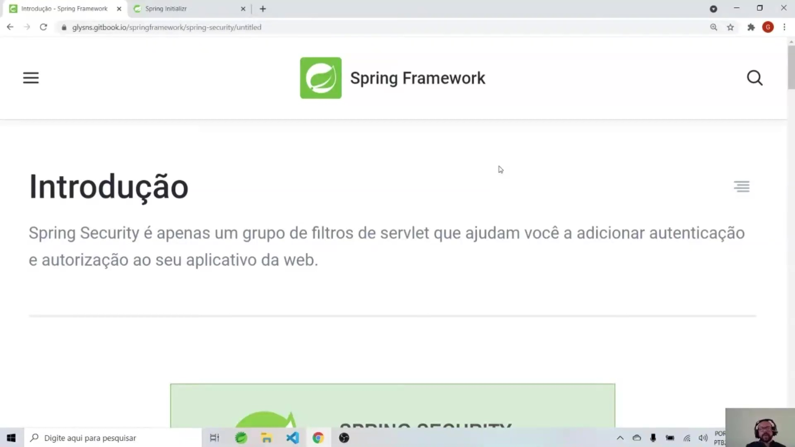
</p>

O Spring Security é apresentado fundamentalmente como um conjunto de filtros de servlet. Sua função principal é facilitar a implementação de camadas de autenticação e autorização em aplicações web desenvolvidas sobre o ecossistema Spring. Ao habilitar as dependências apropriadas, o framework configura automaticamente filtros padrões que interceptam as requisições para garantir a segurança da aplicação.

<p align="center">
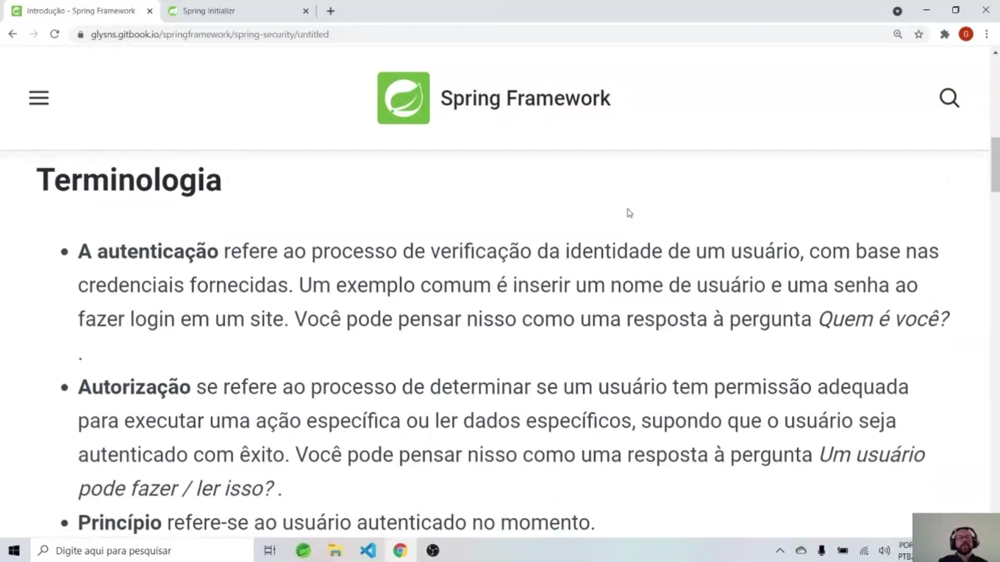
</p>

Para compreender o funcionamento do framework, é necessário distinguir três conceitos fundamentais:

* **Autenticação:** É o processo de verificação da identidade, respondendo à pergunta "Quem é você?". Geralmente utiliza credenciais como usuário e senha.
* **Autorização:** Ocorre após a autenticação e determina se o usuário possui permissões para executar uma ação ou acessar dados específicos ("O usuário pode fazer/ler isso?").
* **Princípio (Principal):** Refere-se ao usuário que está atualmente autenticado no sistema.

<p align="center">
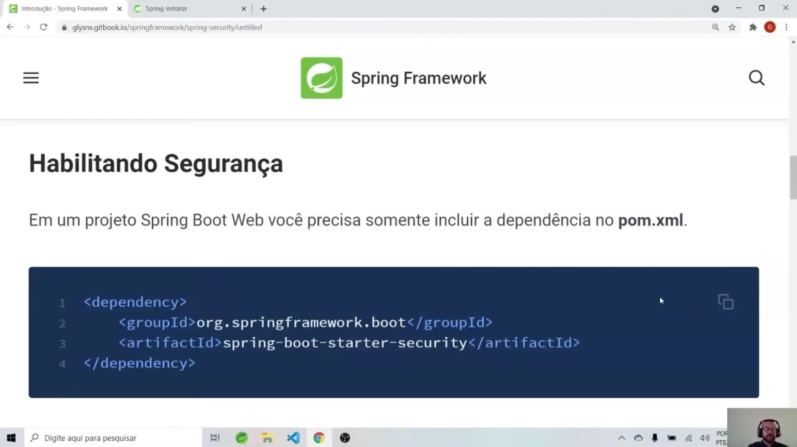
</p>

Em projetos que utilizam Spring Boot Web, a ativação dos recursos de segurança é simplificada, exigindo apenas a inclusão da dependência starter correspondente no arquivo de configuração do Maven (`pom.xml`).

```xml
<dependency>
    <groupId>org.springframework.boot</groupId>
    <artifactId>spring-boot-starter-security</artifactId>
</dependency>
```

<p align="center">

</p>

Ao iniciar um projeto do zero utilizando o Spring Initializr, definimos os metadados do projeto. Neste exemplo, o projeto é configurado como um projeto Maven, utilizando a linguagem Java, com o Group `dio` e o Artifact `dio-spring-security`.

<p align="center">
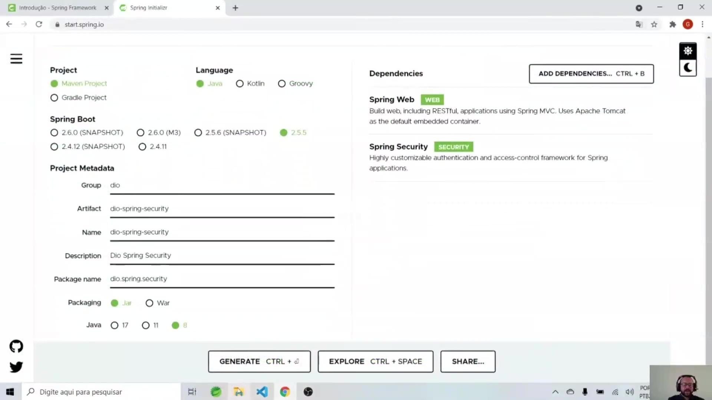
</p>

Para criar uma aplicação web segura, selecionamos as dependências **Spring Web** (para construção de aplicações RESTful e uso do Tomcat) e **Spring Security** (para autenticação e controle de acesso). Nesta configuração, utiliza-se o Java 8 e o empacotamento do tipo Jar.

<p align="center">
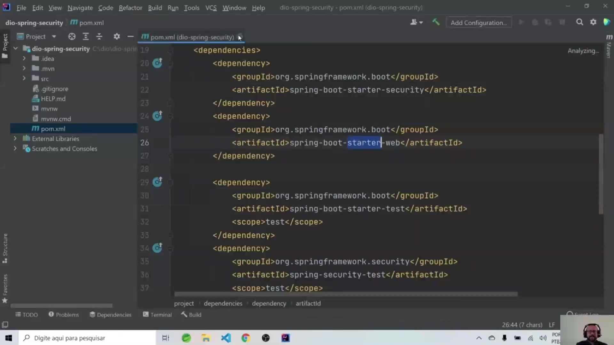
</p>

Após a importação do projeto na IDE, verificamos no arquivo `pom.xml` se as dependências foram carregadas corretamente. O trecho abaixo confirma a presença dos starters necessários para o funcionamento da web e da segurança:

```xml
<dependency>
    <groupId>org.springframework.boot</groupId>
    <artifactId>spring-boot-starter-security</artifactId>
</dependency>
<dependency>
    <groupId>org.springframework.boot</groupId>
    <artifactId>spring-boot-starter-web</artifactId>
</dependency>
```

<p align="center">
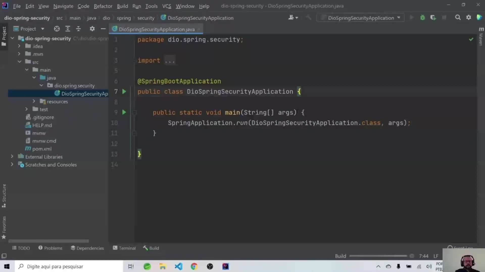
</p>

A classe principal da aplicação, `DioSpringSecurityApplication.java`, é apresentada com a anotação `@SpringBootApplication`. Este é o ponto de entrada que inicializa todo o ecossistema do Spring Boot, incluindo os filtros de segurança recém-adicionados.

```java
package dio.spring.security;

import org.springframework.boot.SpringApplication;
import org.springframework.boot.autoconfigure.SpringBootApplication;

@SpringBootApplication
public class DioSpringSecurityApplication {

    public static void main(String[] args) {
        SpringApplication.run(DioSpringSecurityApplication.class, args);
    }

}
```

<p align="center">
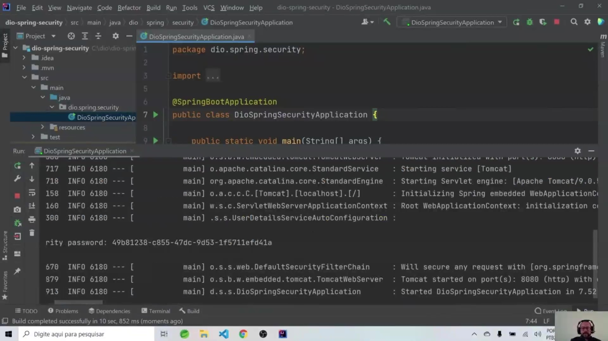
</p>

Ao executar a aplicação, o console do Spring Boot exibe logs importantes. Notavelmente, o Spring Security gera automaticamente uma senha de segurança temporária para o usuário padrão, que deve ser utilizada para o primeiro acesso. O log também indica que o servidor Tomcat foi iniciado na porta 8080.

<p align="center">
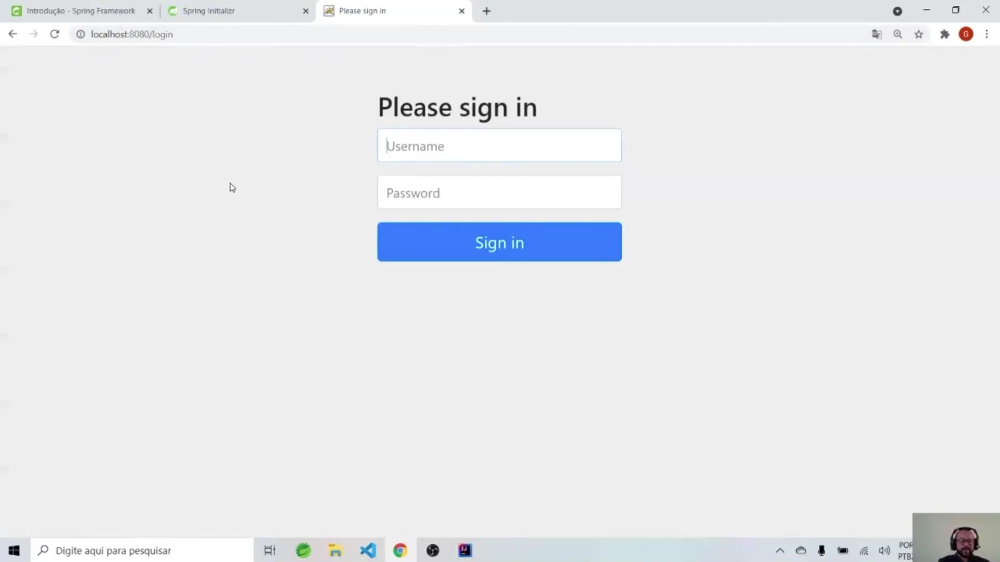
</p>

Ao tentar acessar `localhost:8080`, o Spring Security redireciona automaticamente o usuário para uma página de login padrão (`/login`). Este comportamento confirma que a segurança foi habilitada com sucesso e que qualquer recurso da aplicação agora exige autenticação prévia.

<p align="center">
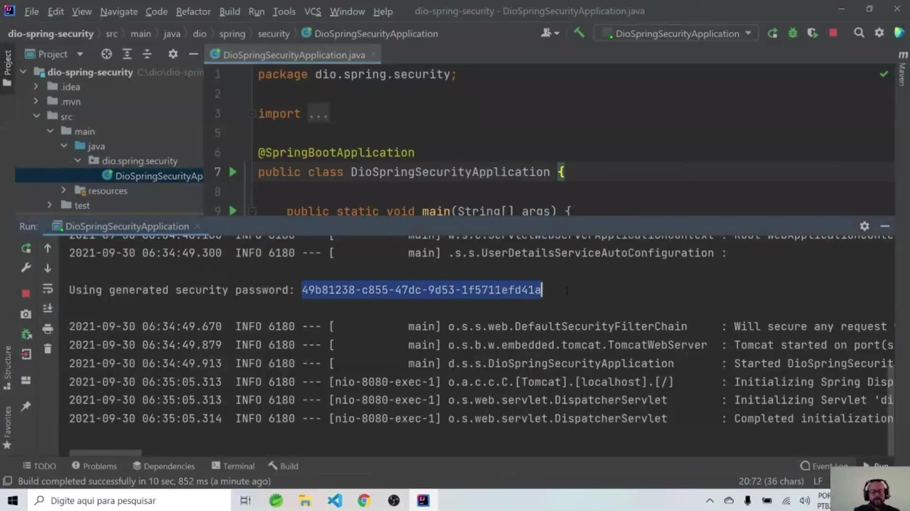
</p>

O detalhe do log de inicialização destaca a senha gerada dinamicamente pelo framework. Sem uma configuração personalizada, o Spring Boot utiliza o componente `UserDetailsServiceAutoConfiguration` para prover esta credencial inicial.

```text
Using generated security password: 49b81238-c855-47dc-9d53-1f5711efd41a
```

<p align="center">
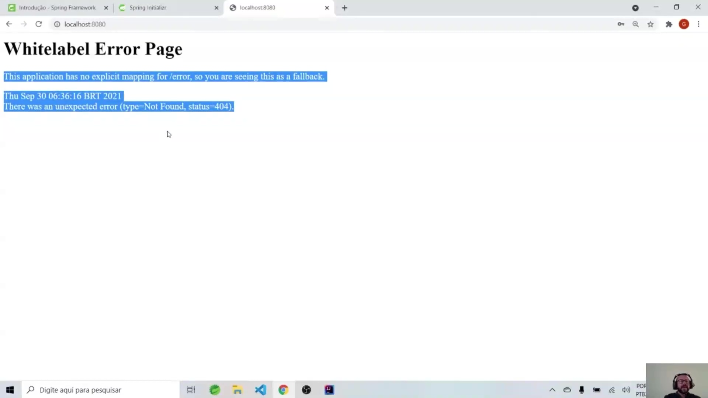
</p>

Após realizar o login com sucesso utilizando as credenciais padrão, o navegador exibe uma "Whitelabel Error Page" com o status 404 (Not Found). Isso ocorre porque, embora a autenticação tenha funcionado, a aplicação ainda não possui rotas ou controladores definidos para a URL acessada.

<p align="center">
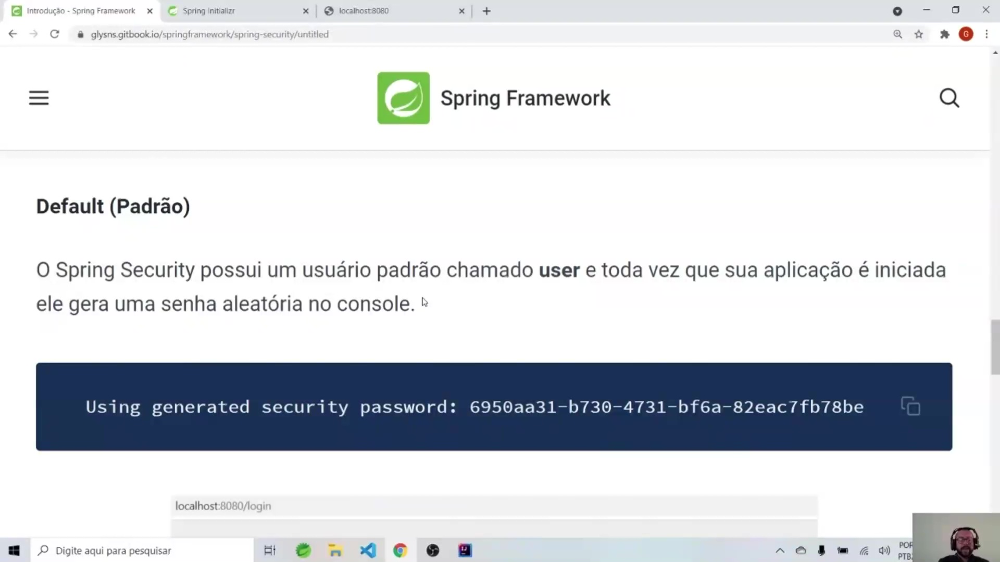
</p>

Em resumo, o comportamento padrão do Spring Security consiste em criar um usuário fixo chamado `user` e gerar uma senha aleatória no console a cada vez que a aplicação é reiniciada. Esta abordagem é útil para testes iniciais, mas demonstra a necessidade de evoluir para configurações de usuários em memória ou bancos de dados em etapas posteriores.


### 🟩 Vídeo 03 - Autenticação simples

<video width="60%" controls>
  <source src="000-Midia_e_Anexos/bootcamp_tqi_fullstack-modulo.07-curso.04-video_03.webm" type="video/webm">
    Seu navegador não suporta vídeo HTML5.
</video>

link do vídeo: https://web.dio.me/track/tqi-fullstack-developer/course/adicionando-seguranca-a-uma-api-rest-com-spring-security/learning/d3b4b5e7-f007-4a09-a5ce-a61923eef4f8?autoplay=1

Este guia resume as etapas para configurar autenticação e autorização em aplicações Spring Boot, desde o comportamento padrão até a customização avançada de perfis de acesso.

### Anotações

<p align="center">
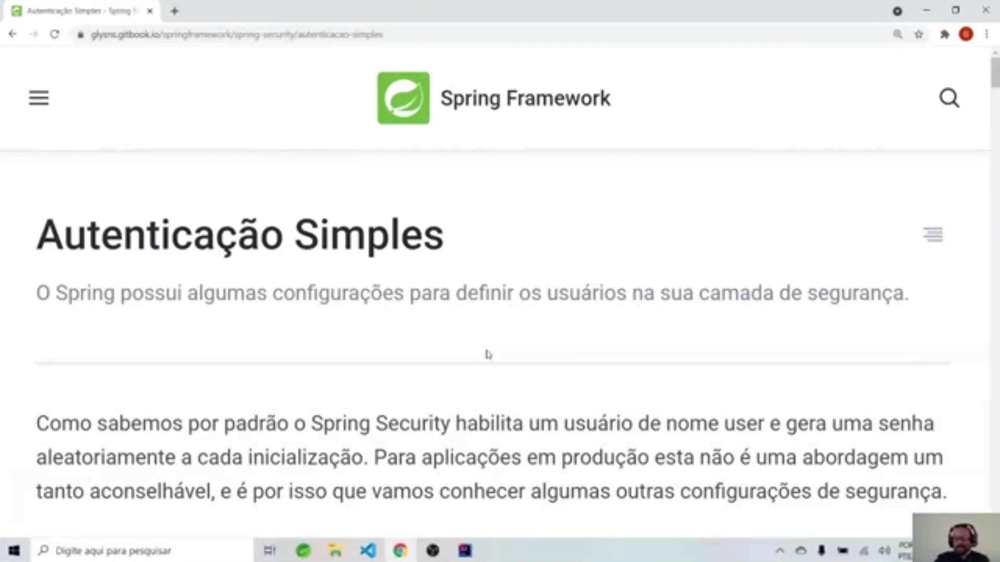
</p>

Ao incluir a dependência do Spring Security em um projeto Spring Boot, a segurança é habilitada automaticamente. Durante a inicialização da aplicação, o framework gera uma senha de segurança temporária e a exibe no console (como visto no log do terminal), que será necessária para o primeiro acesso.

<p align="center">
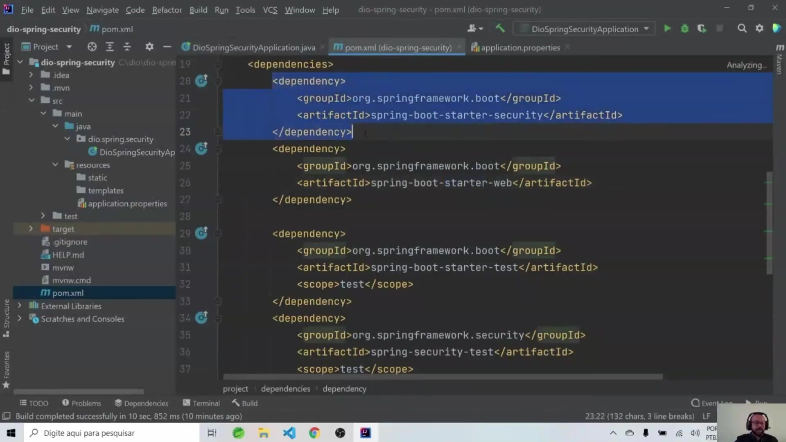
</p>

Com a segurança ativa por padrão, qualquer tentativa de acesso às rotas ou recursos da aplicação resultará na intercepção pelos filtros do Spring Security, que solicitarão um usuário e senha através de uma interface de login básica no navegador.

<p align="center">
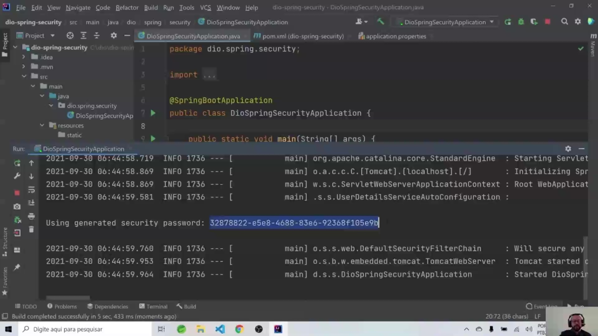
</p>

Mesmo que a aplicação ainda não possua rotas ou páginas desenvolvidas, a exibição da página de erro padrão (Whitelabel Error Page) após a autenticação confirma que o Spring Security já ativou seus filtros de proteção com sucesso.

<p align="center">
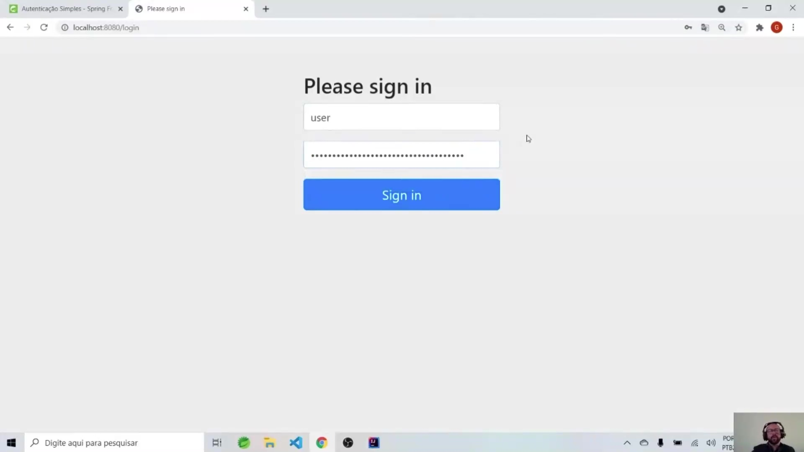
</p>

Para evitar a geração de senhas temporárias a cada execução, é possível configurar um usuário e senha padrão diretamente no arquivo de configuração da aplicação. Essa abordagem é útil para demonstrações simples e testes rápidos sem a necessidade de um banco de dados.

<p align="center">
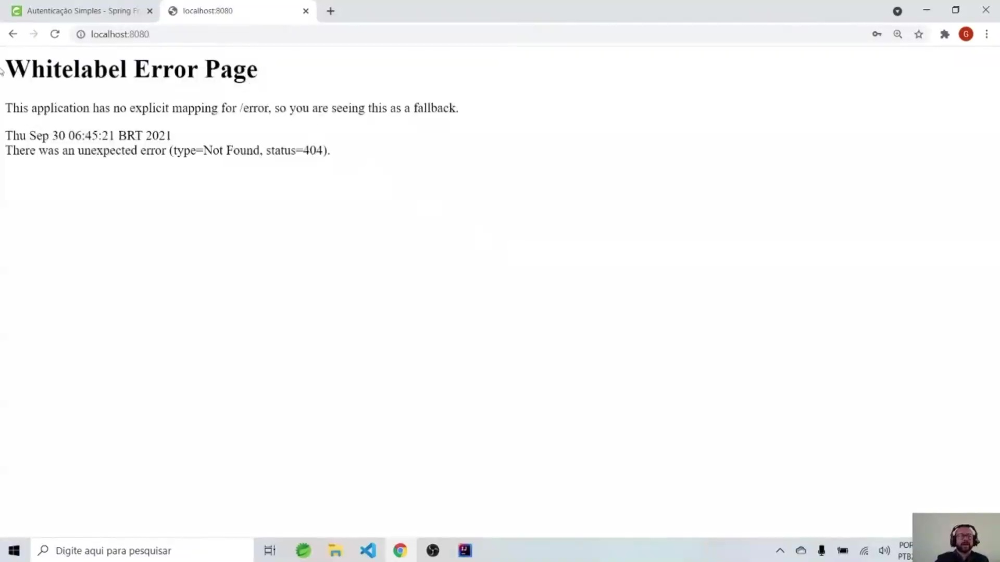
</p>

A configuração de credenciais no arquivo `application.properties` utiliza parâmetros específicos para definir o nome do usuário, a senha e o papel (role) de acesso.

```properties
spring.security.user.name=user
spring.security.user.password=user123
spring.security.user.roles=USERS
```

<p align="center">
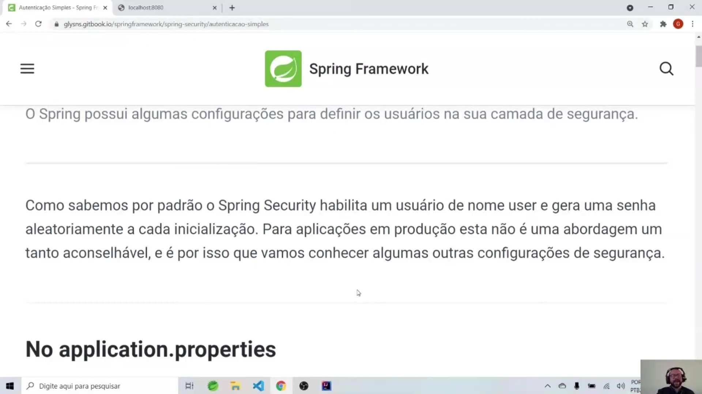
</p>

Neste exemplo, as credenciais são alteradas para personalizar o acesso, permitindo validar se o Spring Security passará a considerar estas novas definições em vez do padrão gerado automaticamente.

```properties
spring.security.user.name=Gleyson
spring.security.user.password=dio123
spring.security.user.roles=USERS
```

<p align="center">
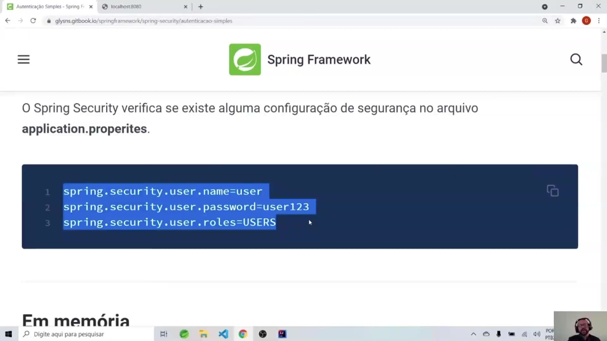
</p>

Ao reiniciar a aplicação com as configurações manuais no `application.properties`, observa-se no log do terminal que a senha aleatória temporária não é mais gerada, indicando que o Spring assumiu a responsabilidade das credenciais configuradas.

<p align="center">
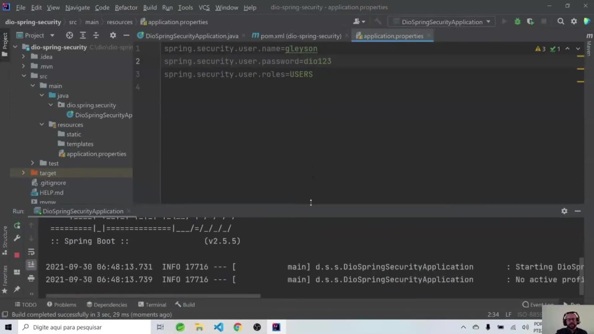
</p>

Ao tentar realizar o login com o usuário padrão anterior ("user"), o sistema nega o acesso, comprovando que as novas configurações de segurança foram aplicadas com sucesso.

<p align="center">
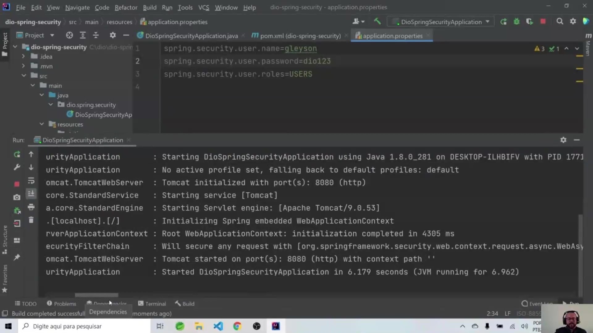
</p>

O acesso é concedido apenas ao informar as credenciais personalizadas ("Gleyson" e "dio123") que foram centralizadas no arquivo de propriedades da aplicação.

<p align="center">

</p>

Para cenários que exigem mais de um usuário ou perfis de acesso distintos (como administradores e usuários comuns), a configuração via `application.properties` torna-se limitada. Nesses casos, utiliza-se a autenticação em memória definida programaticamente em uma classe de configuração.

<p align="center">
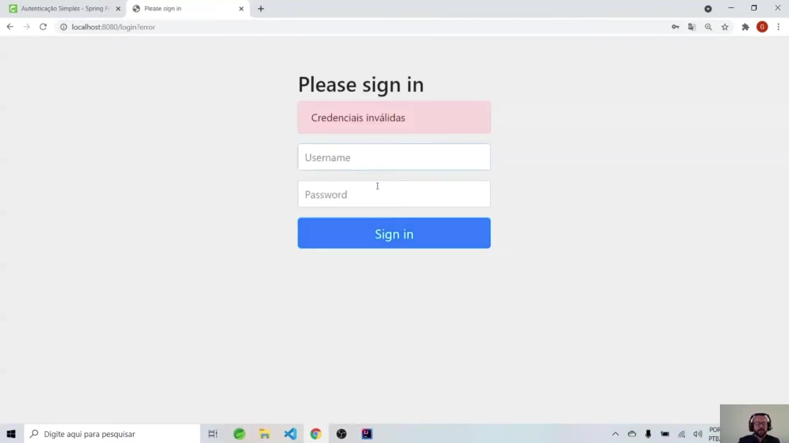
</p>

Inicia-se a criação de uma classe componente chamada `WebSecurityConfig`, que será responsável por centralizar as definições de segurança customizadas da aplicação.

<p align="center">
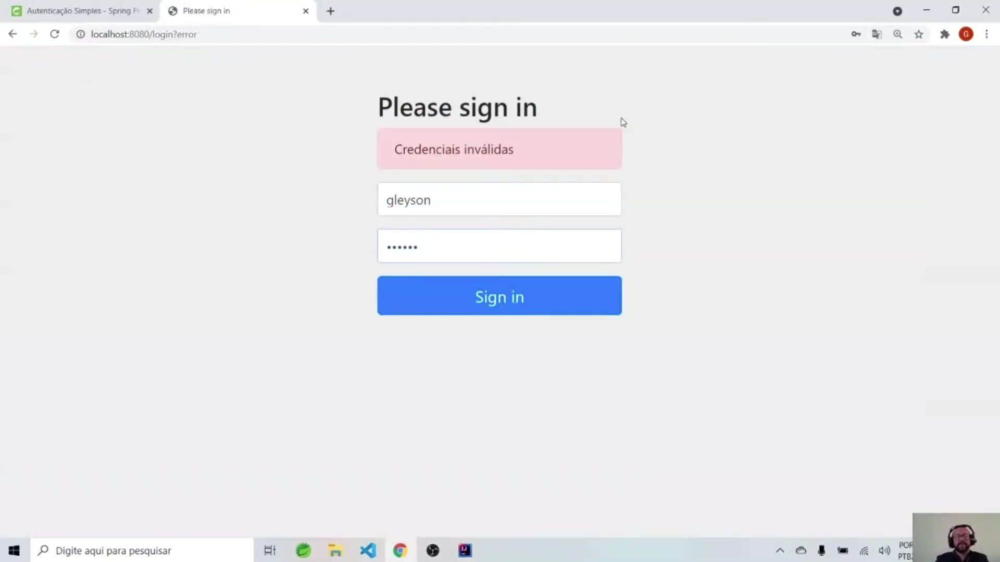
</p>

A classe é marcada com a anotação `@Configuration`, indicando ao Spring que ela contém definições de beans e configurações que devem ser processadas durante a inicialização.

<p align="center">
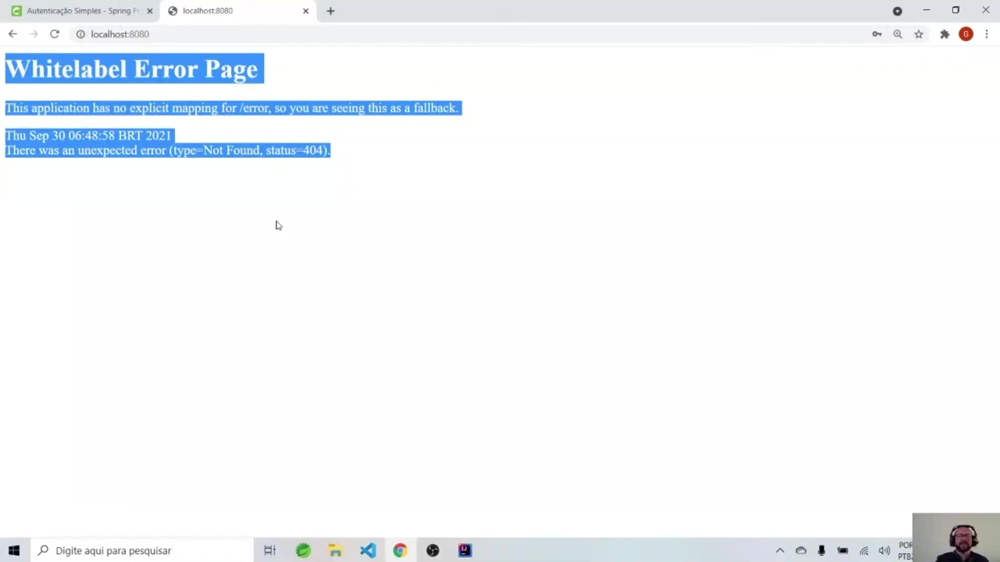
</p>

Para habilitar a segurança web customizada, a classe deve estender `WebSecurityConfigurerAdapter` e ser anotada com `@EnableWebSecurity`, permitindo a sobreposição dos métodos de configuração padrão.

<p align="center">
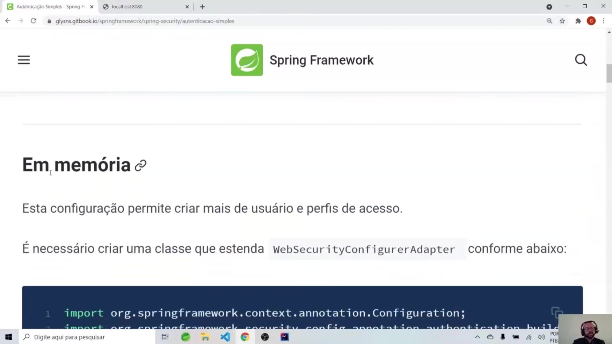
</p>

Sobrescrevendo o método `configure(AuthenticationManagerBuilder auth)`, é criada uma cadeia de usuários em memória. São definidos dois usuários com perfis e credenciais específicas:

```java
@Override
protected void configure(AuthenticationManagerBuilder auth) throws Exception {
    auth.inMemoryAuthentication()
        .withUser("user")
        .password("{noop}user123")
        .roles("USERS")
        .and()
        .withUser("admin")
        .password("{noop}master123")
        .roles("MANAGERS");
}
```

<p align="center">
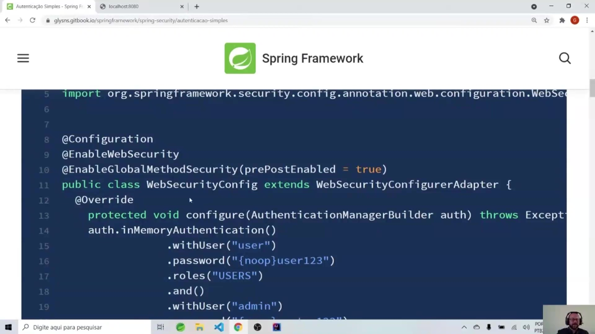
</p>

O prefixo `{noop}` utilizado nas senhas indica ao Spring Security que não deve ser aplicada nenhuma criptografia (No-op Encoder). Isso é utilizado apenas para simplificar exemplos didáticos e demonstrações iniciais.

<p align="center">
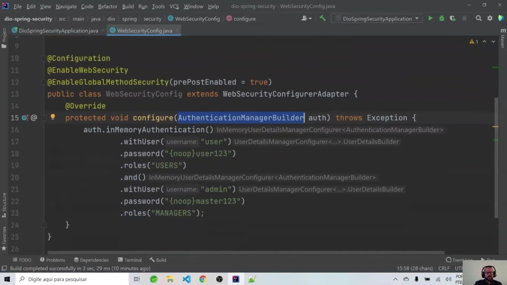
</p>

Realizando o teste com as novas credenciais definidas via código, o usuário "admin" com a senha "master123" agora é validado corretamente pela configuração em memória.

<p align="center">
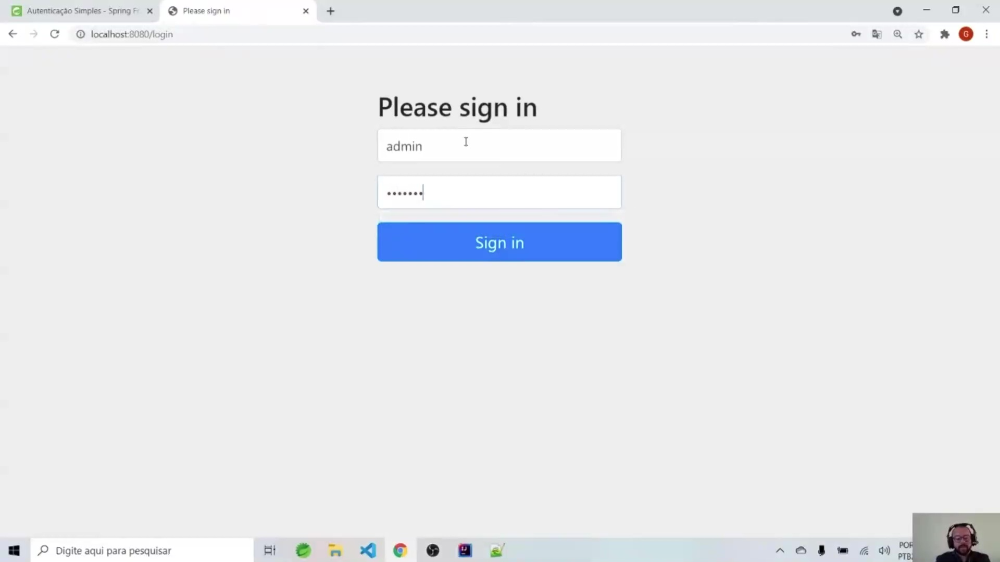
</p>

Para demonstrar os conceitos de autorização por perfil, é criado um controlador REST chamado `WelcomeController`.

<p align="center">
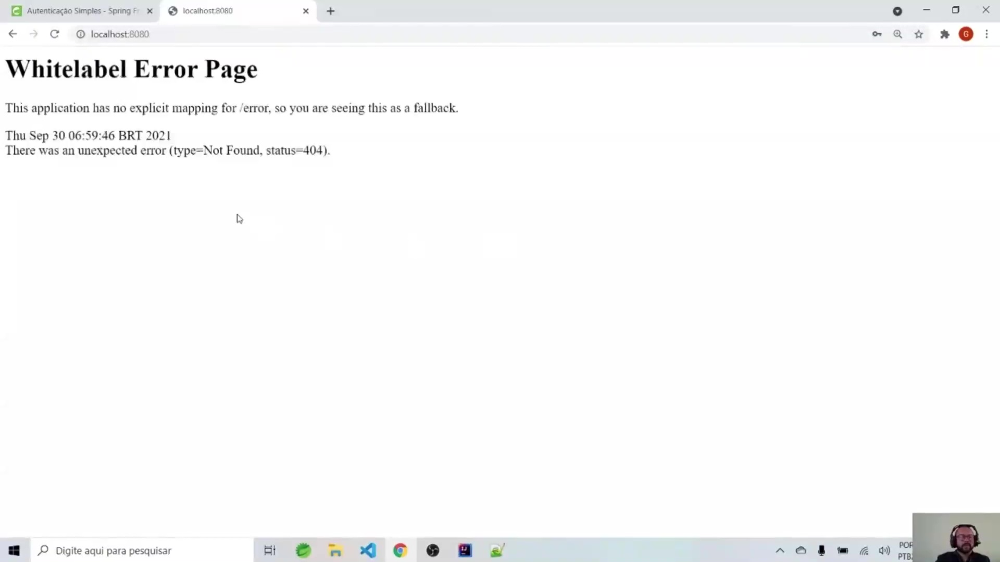
</p>

A classe é anotada com `@RestController`, permitindo a definição de endpoints que retornarão respostas diretas para as requisições HTTP.

<p align="center">
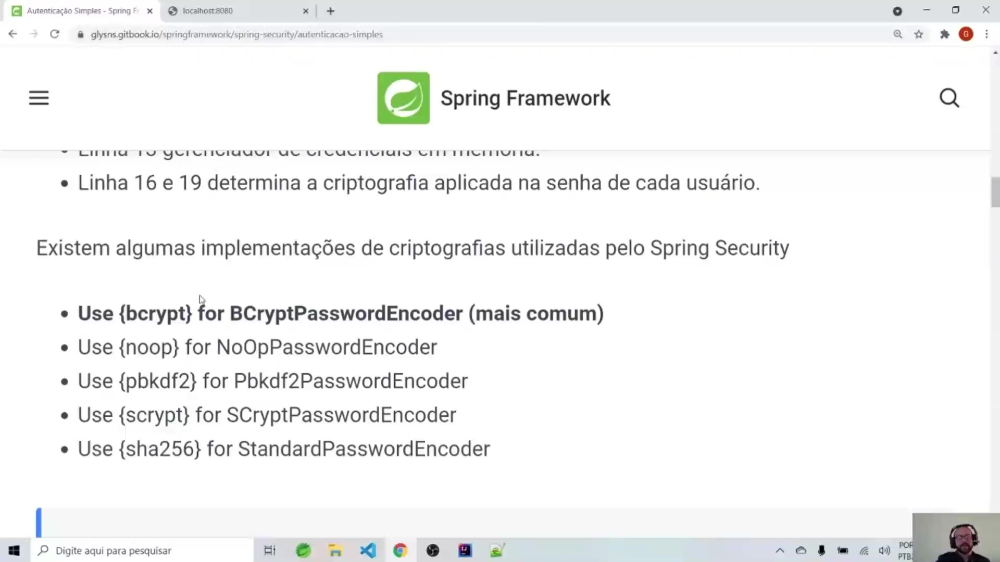
</p>

São mapeadas três rotas principais: a raiz (`/`), uma rota para usuários comuns (`/users`) e uma rota para gerentes (`/managers`), cada uma retornando uma mensagem de autorização correspondente.

```java
@RestController
public class WelcomeController {
    @GetMapping("/")
    public String welcome() {
        return "Welcome to My Web API";
    }
    @GetMapping("/users")
    public String users() {
        return "User Authorized";
    }
    @GetMapping("/managers")
    public String managers() {
        return "Manager Authorized";
    }
}
```

<p align="center">
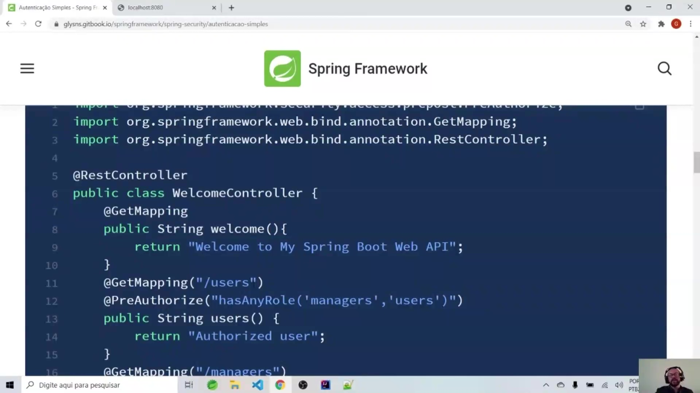
</p>

O objetivo agora é determinar quais perfis de acesso terão permissão para visualizar cada um desses recursos, aplicando os conceitos de autorização do Spring Security.

<p align="center">
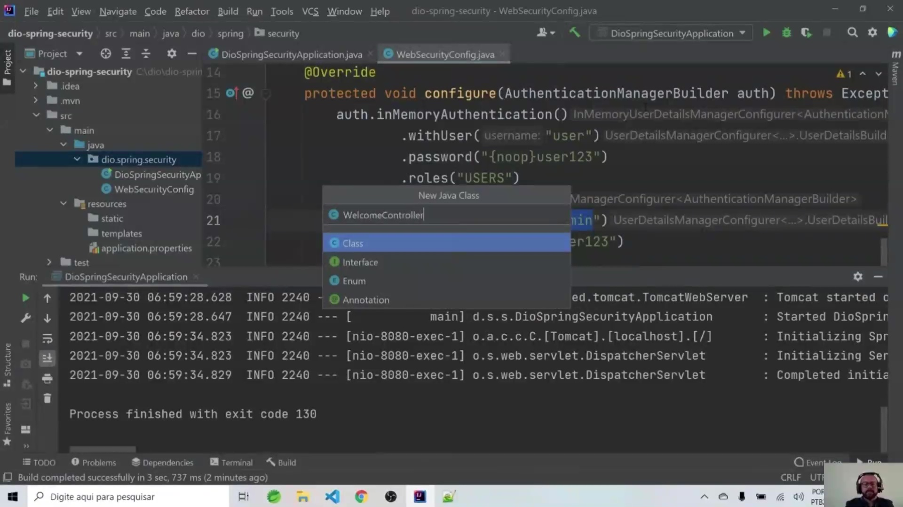
</p>

Sobrescrevendo o método `configure(HttpSecurity http)`, definem-se as regras de acesso: a página inicial e o login são públicos, enquanto as rotas de usuários e gerentes exigem permissões específicas (Roles).

```java
@Override
protected void configure(HttpSecurity http) throws Exception {
    http.authorizeRequests()
        .antMatchers("/").permitAll()
        .antMatchers("/login").permitAll()
        .antMatchers("/users").hasAnyRole("USERS", "MANAGERS")
        .antMatchers("/managers").hasRole("MANAGERS")
        .anyRequest().authenticated().and().formLogin();
}
```

<p align="center">
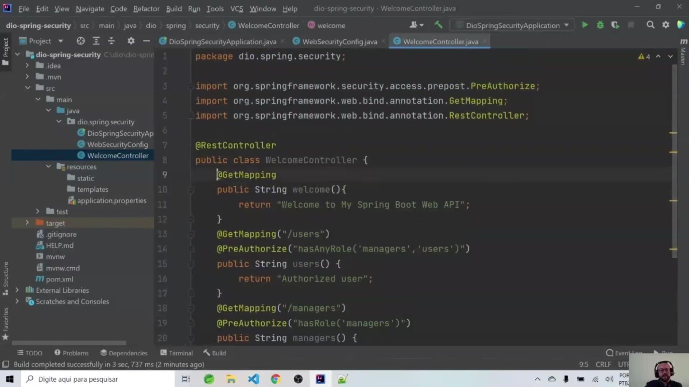
</p>

É fundamental garantir a consistência entre o nome das roles definidas no gerenciamento de usuários em memória e as roles verificadas nas regras de autorização das rotas HTTP, respeitando inclusive a diferenciação entre maiúsculas e minúsculas.

<p align="center">
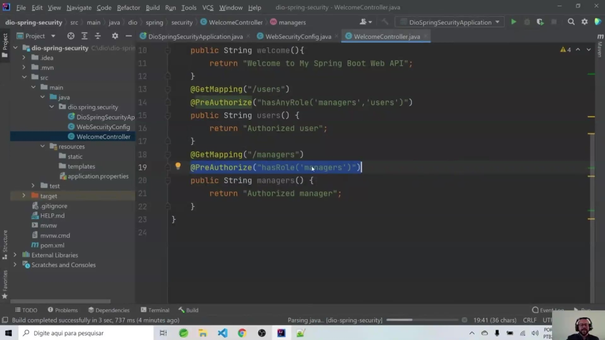
</p>

A aplicação é reiniciada para que as novas regras de autorização por endpoint entrem em vigor, permitindo o teste prático de acesso baseado em perfis.

<p align="center">
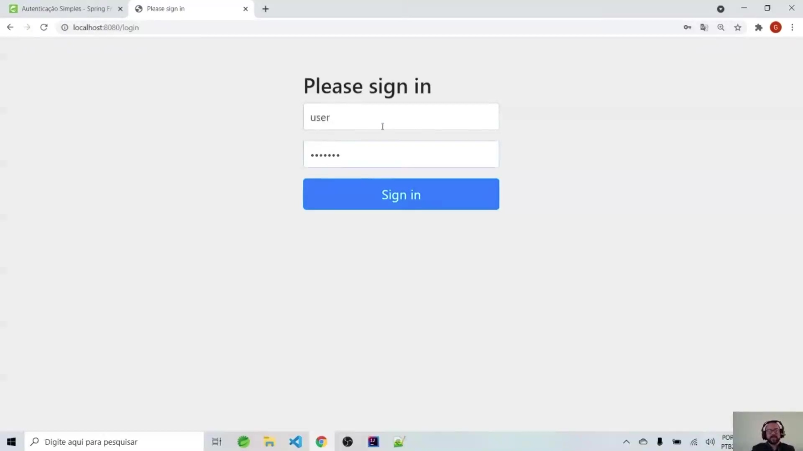
</p>

Ao logar como um usuário comum ("user"), o acesso à rota principal da API é concedido, demonstrando que o login básico continua funcionando corretamente.

<p align="center">
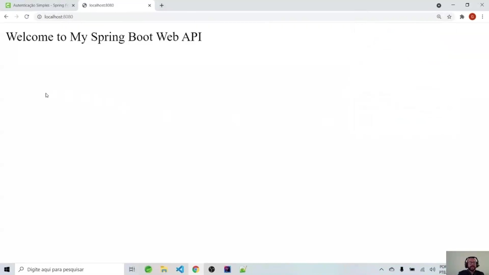
</p>

A lógica de autorização define que o perfil "USERS" pode acessar apenas as rotas de usuário, enquanto o perfil "MANAGERS" possui acesso tanto às suas rotas específicas quanto às rotas de usuário comum.

<p align="center">
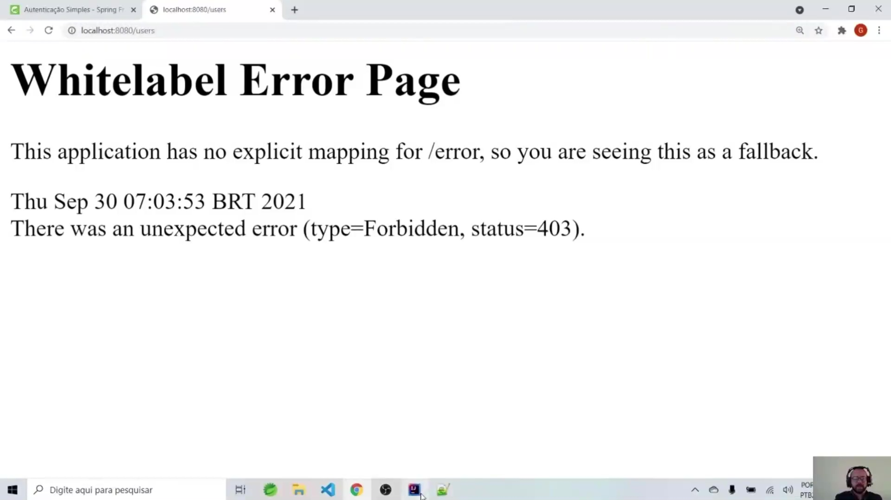
</p>

Quando o usuário logado com o perfil "USERS" tenta acessar a rota `/managers`, o Spring Security retorna um erro "Forbidden" (403), pois ele não possui a role necessária para esse recurso.

<p align="center">
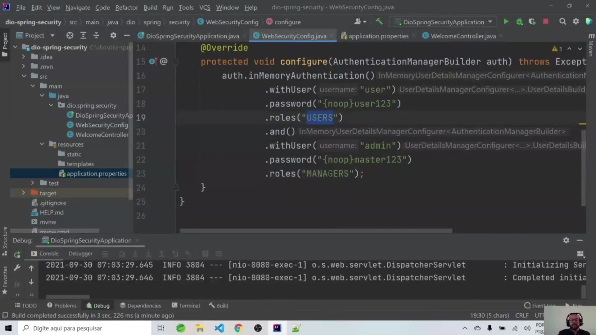
</p>

Para testar o acesso restrito, realiza-se o login com o usuário "admin", que possui o perfil de gerente ("MANAGERS").

<p align="center">
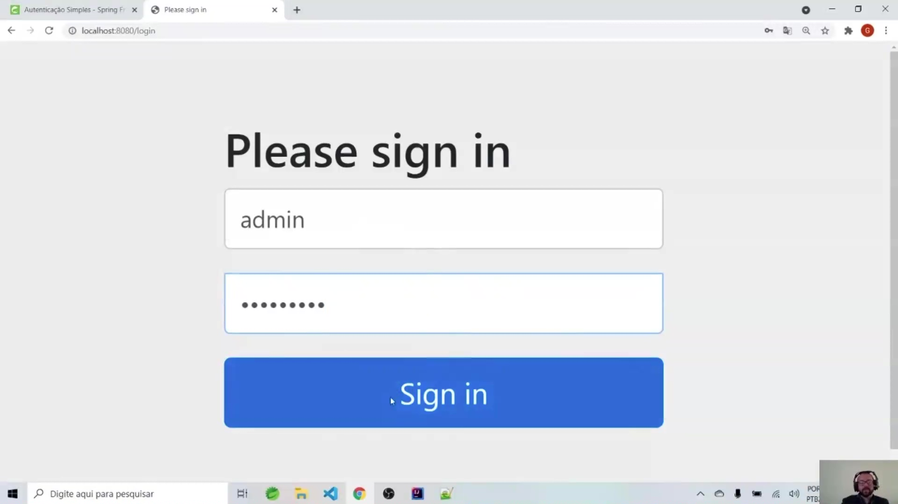
</p>

Identifica-se um possível gap de segurança ou erro de configuração caso as roles no controlador não coincidam exatamente com as roles atribuídas aos usuários no gerenciamento de memória.

<p align="center">
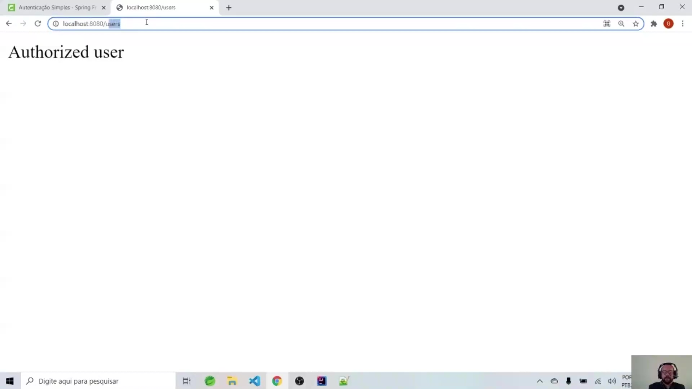
</p>

A correção consiste em tornar as informações de roles coerentes em toda a configuração, garantindo que o gerenciamento de usuários e as regras de autorização de rotas utilizem a mesma convenção.

<p align="center">
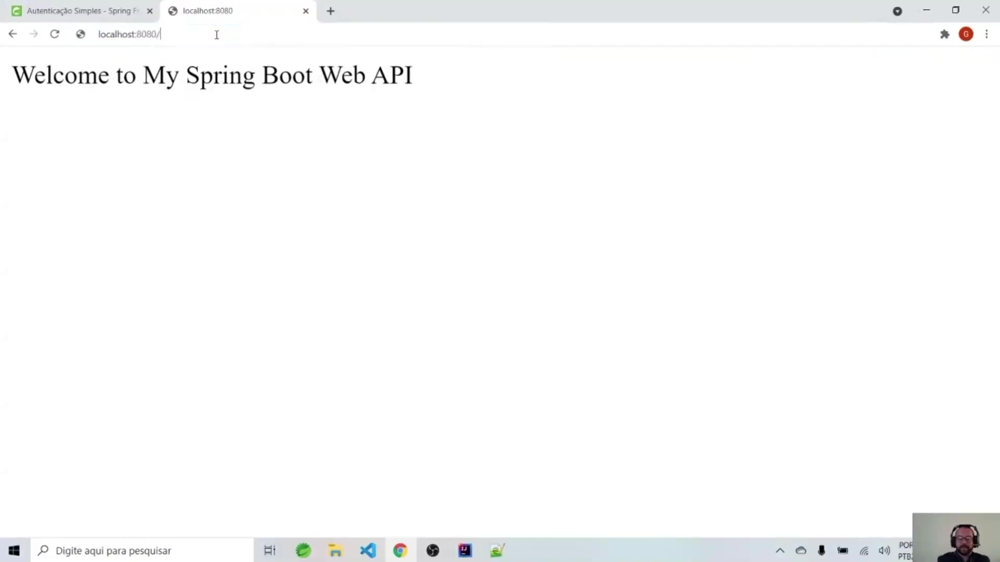
</p>

Com as configurações ajustadas, o usuário administrador consegue acessar com sucesso tanto a rota de usuários quanto a rota de gerentes, confirmando o funcionamento pleno do sistema de autorização por perfil.      


### 🟩 Vídeo 04 - Configure Adapter

<video width="60%" controls>
  <source src="000-Midia_e_Anexos/bootcamp_tqi_fullstack-modulo.07-curso.04-video_04.webm" type="video/webm">
    Seu navegador não suporta vídeo HTML5.
</video>

link do vídeo: https://web.dio.me/track/tqi-fullstack-developer/course/adicionando-seguranca-a-uma-api-rest-com-spring-security/learning/ccb8fdb1-aa70-4145-b18d-736872a4c164?autoplay=1

Este vídeo aborda a transição de configurações de segurança espalhadas pelos *controllers* para uma abordagem centralizada e robusta utilizando o `WebSecurityConfigurerAdapter`. O objetivo é facilitar a manutenção do código e permitir um controle mais granular sobre quem acessa o quê na aplicação.

### Anotações

#### Centralização da Configuração de Segurança

<p align="center">
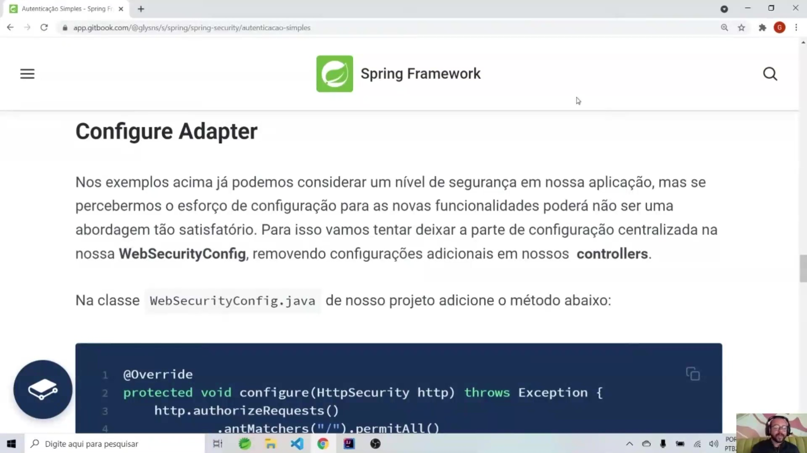
</p>

Nesta etapa, o foco é a centralização da segurança na classe `WebSecurityConfig`. O objetivo é remover a carga de configuração dos controllers, evitando que cada recurso precise gerenciar perfis de acesso de forma dispersa. Para isso, utilizamos a sobrescrita do método `configure(HttpSecurity http)`, que permite definir o comportamento de autorização de requisições de forma global na aplicação.

```java
@Override
protected void configure(HttpSecurity http) throws Exception {
    http.authorizeRequests()
        .antMatchers("/").permitAll(); [cite_start]// Define acesso público à rota raiz [cite: 13, 14]
```

#### Controle de Acesso por Perfis (Roles)

<p align="center">
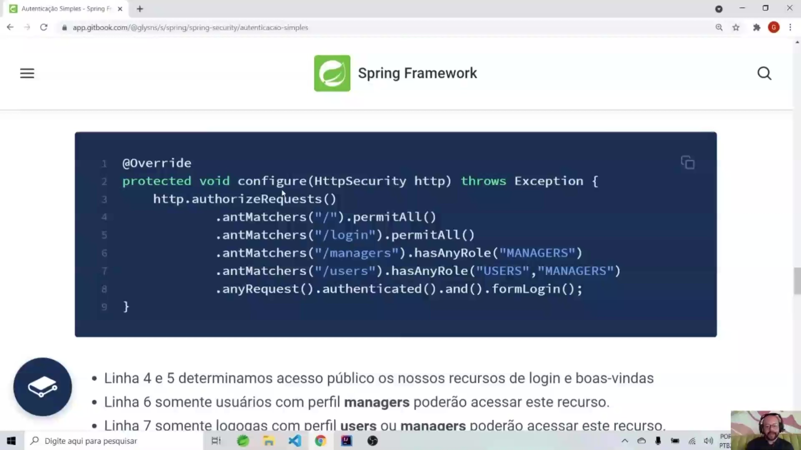
</p>

O Spring Security permite o encadeamento de regras de acesso através de `antMatchers`. Aqui, definimos permissões granulares: rotas de boas-vindas e login são públicas, enquanto rotas específicas como `/managers` e `/users` exigem perfis (roles) determinados. Caso o usuário tente acessar qualquer outra rota não especificada, o sistema exigirá autenticação via formulário padrão (`formLogin`).

```java
http.authorizeRequests()
    [cite_start].antMatchers("/").permitAll() // Público [cite: 39]
    [cite_start].antMatchers("/login").permitAll() // Público [cite: 39]
    [cite_start].antMatchers("/managers").hasAnyRole("MANAGERS") // Restrito a Managers [cite: 40]
    [cite_start].antMatchers("/users").hasAnyRole("USERS", "MANAGERS") // Restrito a Users e Managers [cite: 41]
    .anyRequest().authenticated().and().formLogin(); [cite_start]// Exige autenticação para o restante [cite: 38]
```

#### Autenticação em Memória (In-Memory Authentication)

<p align="center">
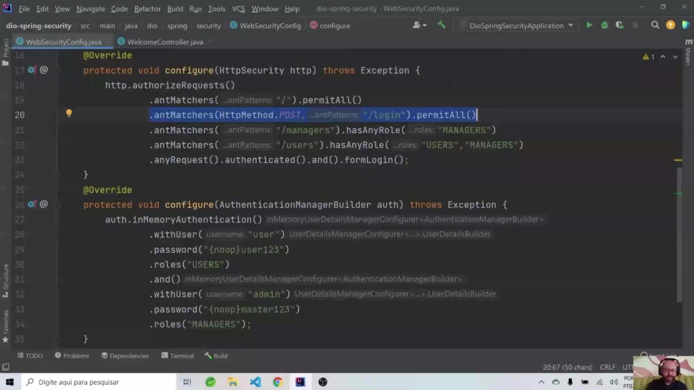
</p>

Para testar as permissões sem um banco de dados, configuramos o `AuthenticationManagerBuilder` para criar usuários em memória. Foram definidos dois usuários: um com perfil "USERS" e outro com perfil "MANAGERS", utilizando a estratégia `noop` para senhas (indicando que não há criptografia, apenas para fins didáticos).

```java
@Override
protected void configure(AuthenticationManagerBuilder auth) throws Exception {
    auth.inMemoryAuthentication()
        [cite_start].withUser("user").password("{noop}user123").roles("USERS") // Usuário comum [cite: 90, 91]
        .and()
        .withUser("admin").password("{noop}master123").roles("MANAGERS"); [cite_start]// Administrador [cite: 93, 94, 95]
}
```

#### Inicialização e Logs do Spring Boot

<p align="center">
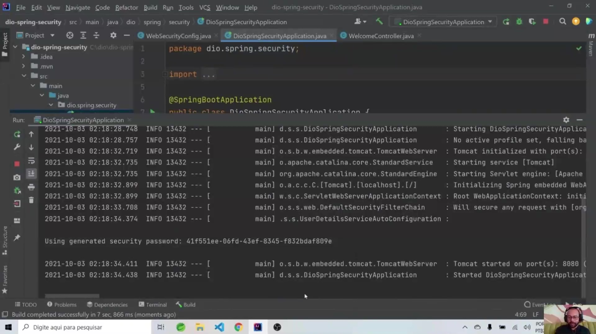
</p>

Ao iniciar a aplicação, o log do console confirma a inicialização do Tomcat na porta 8080. É possível observar que o Spring Security registra o filtro de segurança padrão (`DefaultSecurityFilterChain`) para proteger as requisições. Embora tenhamos configurado usuários específicos, o Spring ainda gera uma senha de segurança temporária caso não detecte uma configuração de autenticação completa.

#### Verificação de Acesso Público

<p align="center">
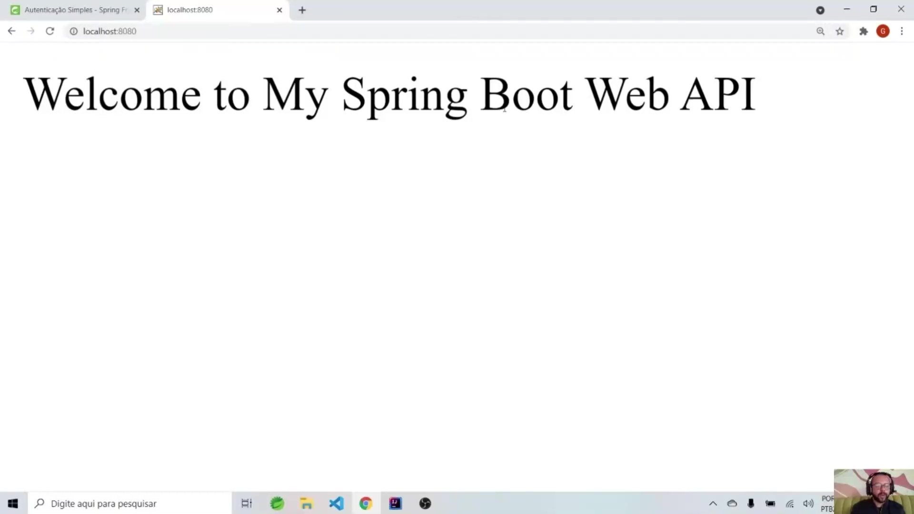
</p>

O primeiro teste consiste em acessar `localhost:8080`. Como configuramos a rota "/" como `permitAll()`, a API retorna a mensagem de boas-vindas sem solicitar credenciais, validando que a regra de acesso público está operacional.

#### Interface de Autenticação Padrão

<p align="center">
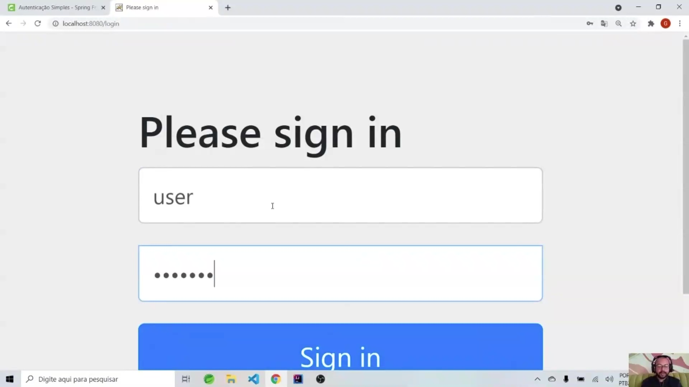
</p>

Ao tentar acessar um recurso protegido ou a rota `/login`, o Spring Security redireciona o usuário para sua interface padrão de "Sign in". Aqui, o usuário deve inserir as credenciais cadastradas no `AuthenticationManagerBuilder` para obter o token de sessão e as roles necessárias para navegar.

#### Validação de Usuário Autorizado

<p align="center">
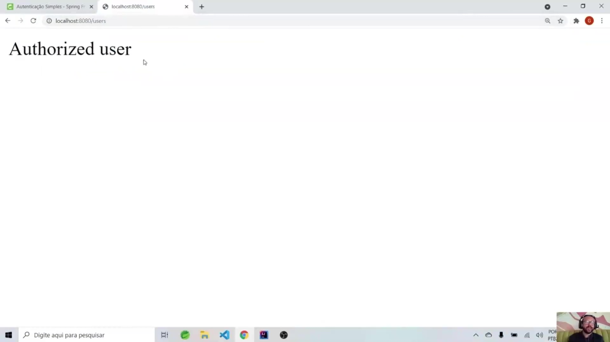
</p>

Após realizar o login com um usuário que possui a role "USERS", o acesso à rota `/users` é liberado. O navegador exibe a mensagem "Authorized user", confirmando que o sistema de autorização reconheceu o perfil do usuário e permitiu a visualização do recurso protegido.

### 🟩 Vídeo 05 - Autenticação com Banco de dados

<video width="60%" controls>
  <source src="000-Midia_e_Anexos/bootcamp_tqi_fullstack-modulo.07-curso.04-video_05.webm" type="video/webm">
    Seu navegador não suporta vídeo HTML5.
</video>

link do vídeo: https://web.dio.me/track/tqi-fullstack-developer/course/adicionando-seguranca-a-uma-api-rest-com-spring-security/learning/4cab2ab5-48a8-48f2-93ab-2e3d61f7d449?autoplay=1

<p align="center">
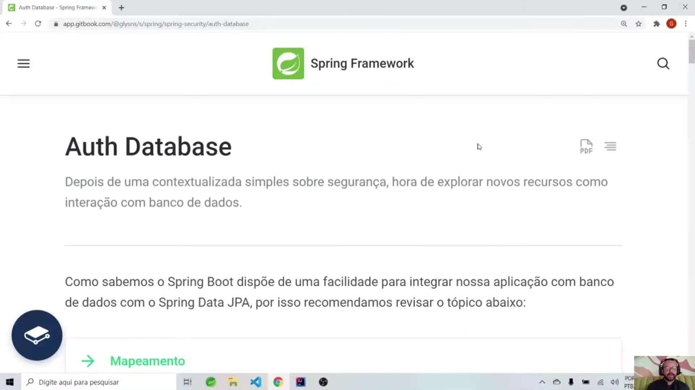
</p>

A partir de agora, a aplicação será configurada para integrar-se a um banco de dados, abandonando o uso exclusivo de usuários armazenados em memória de forma volátil e manual. O Spring Boot oferece grandes facilidades para essa transição a um banco de dados mais consistente, principalmente através do módulo Spring Data JPA.

<p align="center">
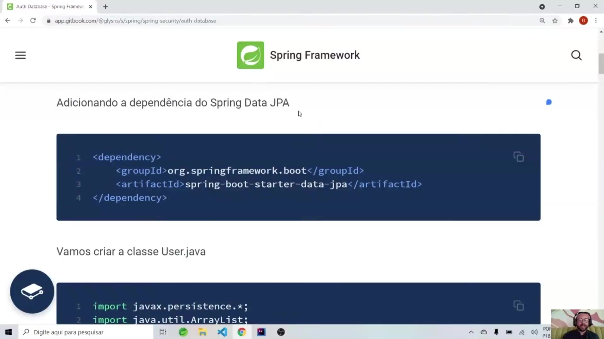
</p>

O primeiro passo para viabilizar a interação com a base de dados é a inclusão da dependência do Spring Data JPA no projeto. Isso fornecerá a biblioteca de mapeamento de objetos e transações para a estruturação de nossa segurança.

```xml
<dependency>
    <groupId>org.springframework.boot</groupId>
    <artifactId>spring-boot-starter-data-jpa</artifactId>
</dependency>
```

<p align="center">
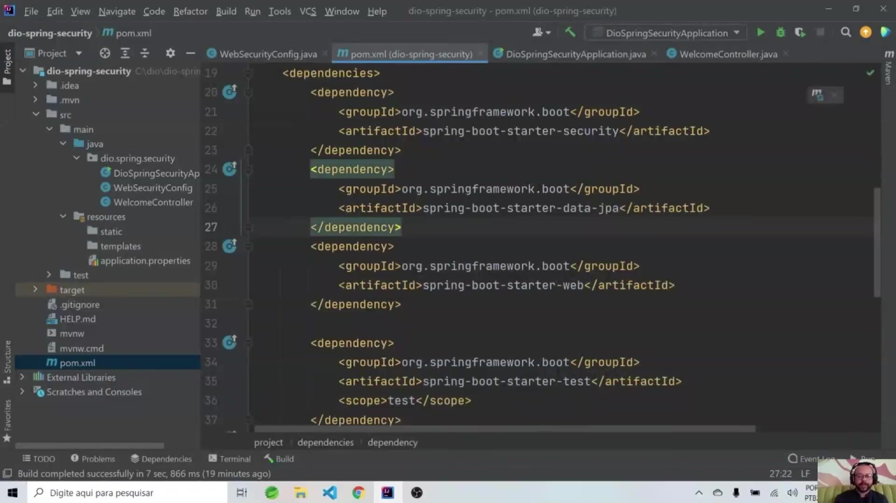
</p>

No ambiente de desenvolvimento (IDE), essa dependência deve ser adicionada diretamente ao arquivo de configuração `pom.xml`. Como o Spring atua com base em *starters*, basta incluir a referência e atualizar as importações do Maven para que todos os recursos persistentes fiquem plenamente disponíveis no ecossistema da aplicação.

<p align="center">
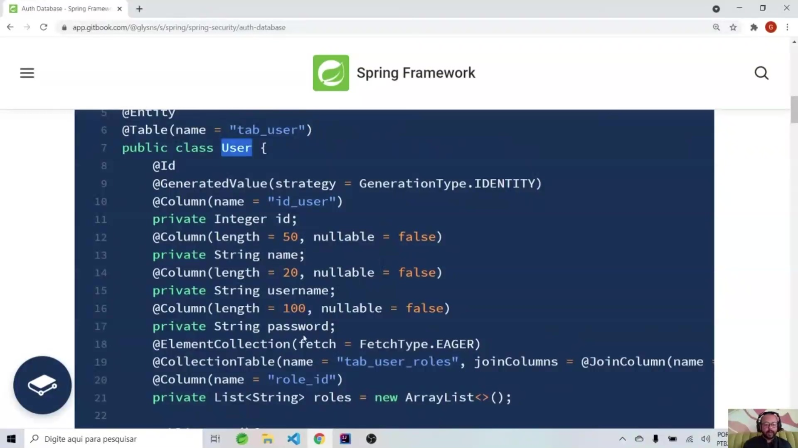
</p>

Após o ambiente estar preparado com a nova dependência, é necessário criar a classe que representará o usuário na tabela do banco de dados. A classe `User` é mapeada como uma entidade usando as diretrizes clássicas (`@Entity`, `@Table`, `@Id`) e abrigará colunas essenciais para o controle da sessão, como o próprio nome de usuário e a senha.

<p align="center">
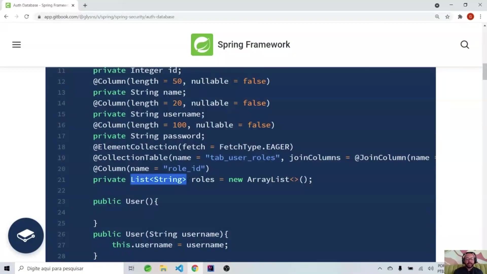
</p>

Além dos atributos de login, a entidade requer a definição de uma lista de restrições ou perfis associados àquela conta. Utiliza-se aqui a estrutura `@ElementCollection` em combinação com a `@CollectionTable`, garantindo a confecção automática de uma tabela paralela (`tab_user_roles`) responsável por manter o controle rigoroso da coleção de perfis base.

<p align="center">
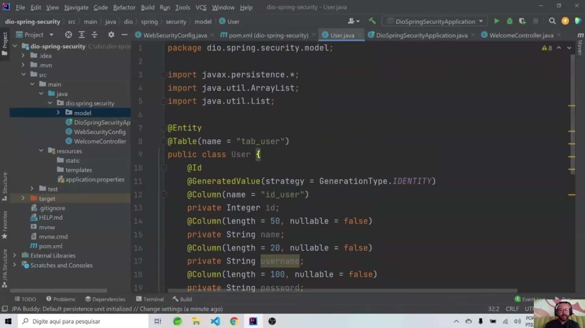
</p>

Na prática, a estruturação dessa classe avança pela criação de um pacote organizado (como `model`). Ao redigir as regras das colunas através do `@Column`, também aproveita-se para estabelecer regras vitais de negócio e performance, como os comprimentos máximos e restrições de nulidade que protegerão fisicamente os registros inseridos.

```java
@Entity
@Table(name = "tab_user")
public class User {
    @Id
    @GeneratedValue(strategy = GenerationType.IDENTITY)
    @Column(name = "id_user")
    private Integer id;

    @Column(length = 50, nullable = false)
    private String name;
```

<p align="center">
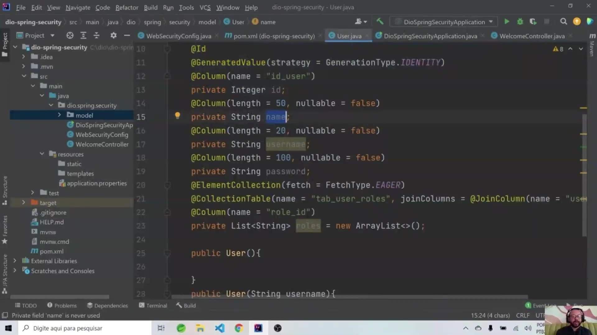
</p>

Durante a escrita do código, destaca-se que o comprimento físico aceito pela coluna `password` foi alocado em uma faixa estendida (100 caracteres). Esta configuração proativa acomoda futuramente a string gerada pelos robustos algoritmos criptográficos sem sofrer cortes indesejados e comprometedores da estrutura JPA.

<p align="center">
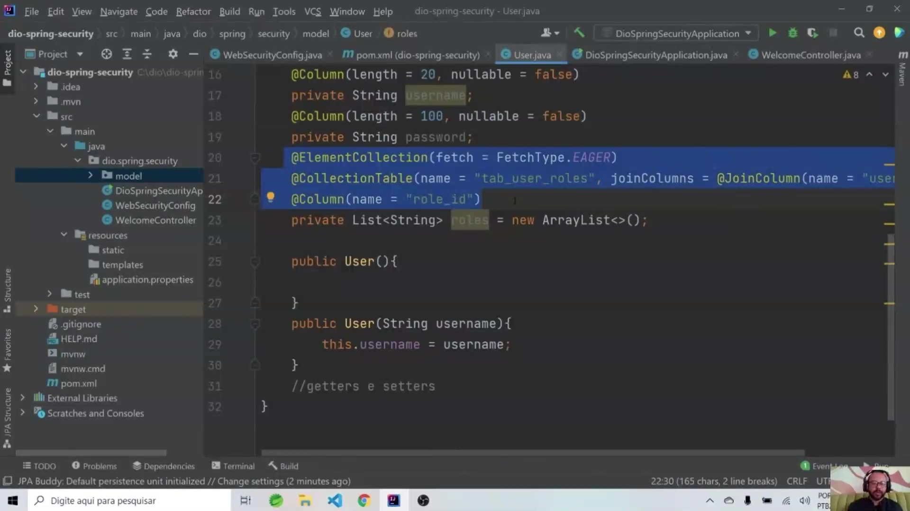
</p>

Para viabilizar as manobras com objetos instanciados nos processos internos do Spring Security, os tradicionais construtores padrão (um vázio e outro requisitando a carga imediata pelo parâmetro `username`) são codificados, oferecendo estabilidade funcional e facilidade sintática ao manipulá-lo no código.

<p align="center">
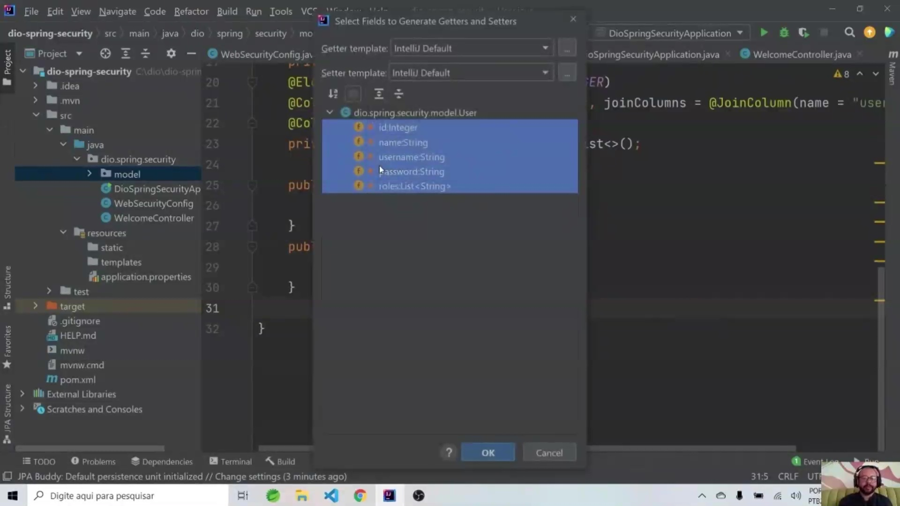
</p>

As propriedades privadas mapeadas exigem métodos de leitura e escrita (Getters e Setters) para estarem totalmente acessíveis às interfaces nativas externas. Aproveitando as capacidades da IDE, utiliza-se a janela de geração automática marcando simultaneamente todos os campos que exigem encapsulamento.

<p align="center">
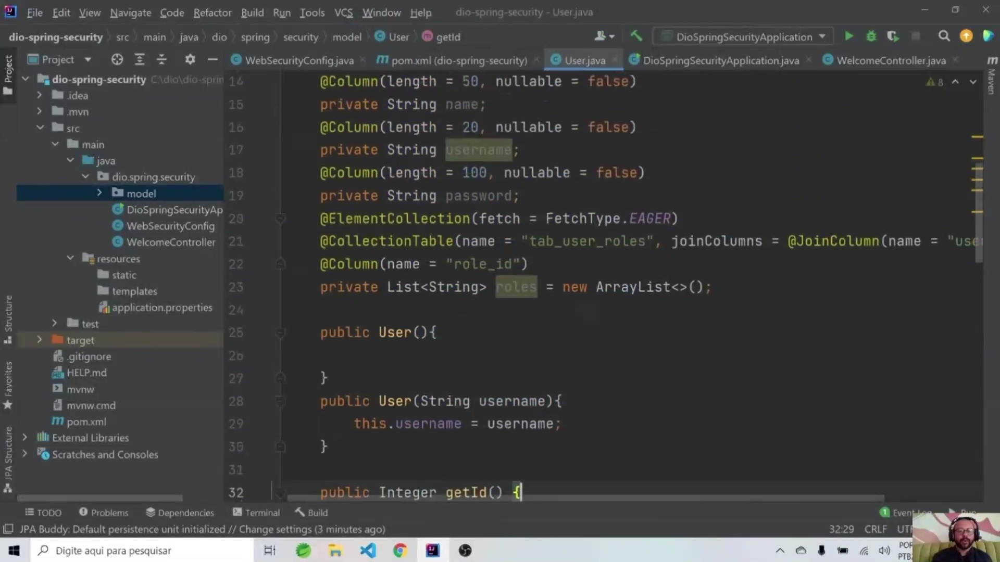
</p>

O código gerado atesta a montagem estruturada exigida pelo Java para gerenciar o estado da entidade, como verificado ao analisar imediatamente a sintaxe e inserção correta do método assessor do identificador `getId()`.

<p align="center">
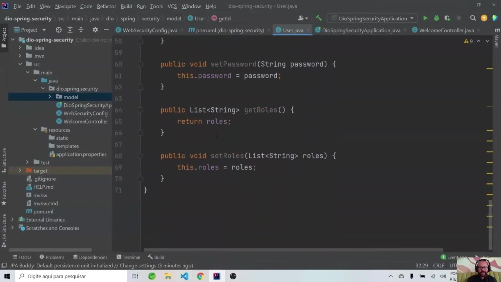
</p>

O complemento e encerramento da classe prossegue definindo toda a esteira do encapsulamento dos demais atributos, garantindo em especial que as chamadas às listas de permissões (`roles`) operem perfeitamente sobre a base de referências.

<p align="center">

</p>

Com a classe base fechada, o próximo passo crucial requer a definição de uma camada de interação padronizada focada nas rotinas CRUD — o repositório em si. A interface correspondente irá herdar extensões de `JpaRepository` com uma anotação `JPQL` personalizada para consultar e associar de uma só vez a lista de permissões à entidade usuário.

<p align="center">
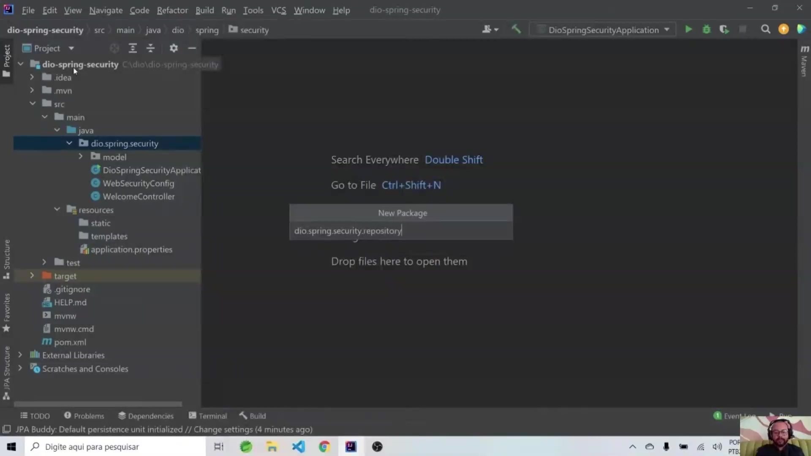
</p>

Buscando obedecer a padrões de separação arquitetural estritos do mercado, é recomendável estruturar logicamente o conteúdo acoplando a nova interface explicitamente a um pacote denominado `repository`.

<p align="center">
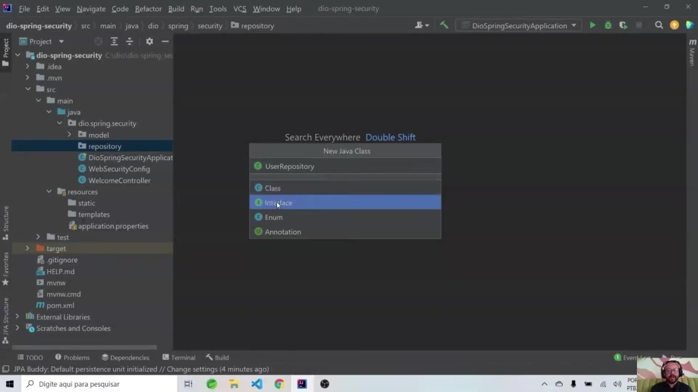
</p>

Após o isolamento das pastas estruturais via IDE, formaliza-se a criação do arquivo de interface destinado unicamente à gestão transacional dos apontamentos base de usuário.

<p align="center">
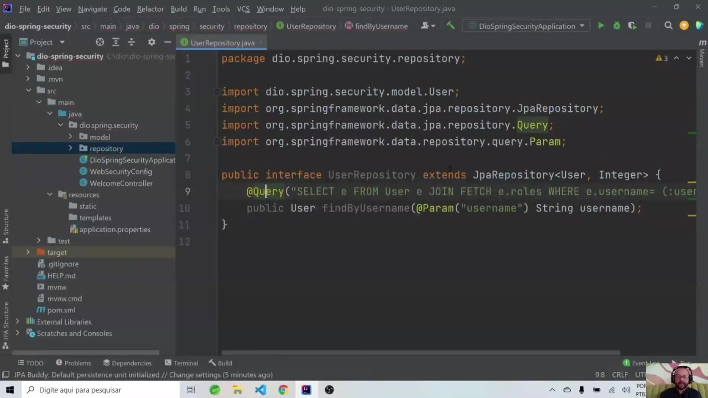
</p>

A construção ganha corpo delegando tipagens genéricas ao injetar a entidade (`User`) e sua respectiva tipagem de chave de ID (`Integer`). A cláusula contendo a anotação explícita de `JOIN FETCH` obriga assertivamente que o Spring capture perfis no mesmo exato passo da busca, provendo alto poder de extração com mínima redundância.

```java
import dio.spring.security.model.User;
import org.springframework.data.jpa.repository.JpaRepository;
import org.springframework.data.jpa.repository.Query;
import org.springframework.data.repository.query.Param;

public interface UserRepository extends JpaRepository<User, Integer> {
    @Query("SELECT e FROM User e JOIN FETCH e.roles WHERE e.username= (:username)")
    public User findByUsername(@Param("username") String username);
}
```

<p align="center">
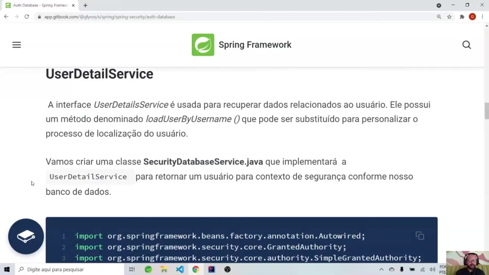
</p>

Tendo a estrutura local garantida e funcional para as rotinas de banco, necessita-se promover a adesão formal destas com o fluxo estrito de segurança global nativo. No Spring, isso acontece invariavelmente customizando o método orgânico implementando uma classe provada sob o selo base `UserDetailsService`.

<p align="center">

</p>

Neste formato estrutural proposto cria-se a `SecurityDatabaseService`, tipada firmemente sob a anotação de injeção gerencial de `@Service`. Ao injetar e usar nossa `UserRepository` nela, garantimos que toda pesquisa de contexto (`findByUsername`) se dê fisicamente na base restritiva autônoma recém instanciada.

<p align="center">
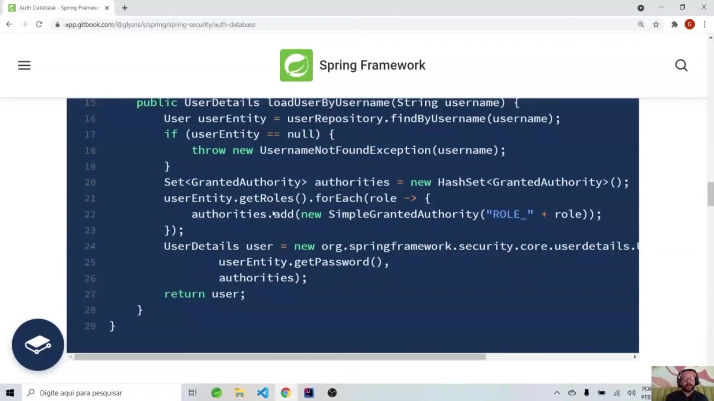
</p>

No corpo dessa implementação central, atesta-se positivamente a existência do acesso perante as restrições convertendo então iterativamente os rótulos comuns localizados para padrões internos de `SimpleGrantedAuthority`. A operação termina devolvendo com sucesso um registro `UserDetails` empacotado para o *core* gerenciador central.

<p align="center">

</p>

Acompanhando na prática pela interface da ferramenta de desenvolvimento, inicia-se então, sob padrões restritivos de organização, o posicionamento para alocar essa camada fundamental de serviço dentro de um pacote nomeado isolado.

<p align="center">
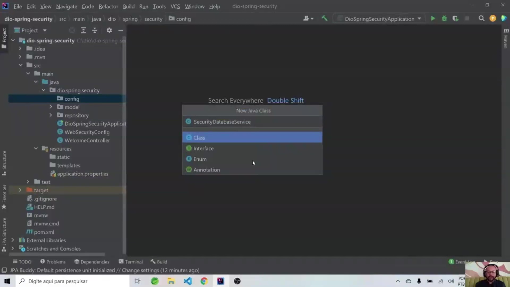
</p>

Instancia-se em definitivo o novo componente `SecurityDatabaseService` que reescreverá a ligação e será consultada pelos interceptadores de cada sessão futura de modo seguro e exclusivo.

<p align="center">
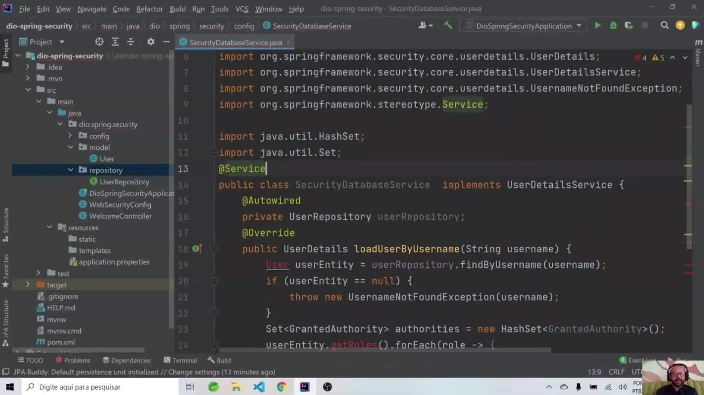
</p>

Iniciando a codificação pesada das diretrizes combinadas, aplica-se a assinatura da interface do tipo imposto forçando então a obrigatória sobrescrita (através de `@Override`) para as pesquisas da ponte de requisições de serviço de credenciais do Spring.

<p align="center">
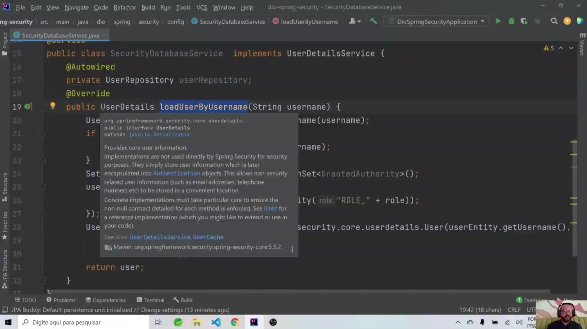
</p>

A verificação contextual e visual em ferramentas de apoio ressalta pontualmente a implementação deste método central restrito, demonstrando exatamente que o contrato arquitetural foi preenchido obedecendo à formatação nativa que injetará as respostas adequadas as chamadas HTTP.

<p align="center">

</p>

A lógica imposta na conversão do perfil de acessos ressalta uma particularidade essencial do código provisório: a obrigatoriedade da prefixação textual constante em `"ROLE_"` aos apontamentos originários do banco caso eles venham limpos. Esta adição estrita permite cruzamento seguro da diretriz gerencial no contexto nativo.

```java
userEntity.getRoles().forEach(role -> {
    authorities.add(new SimpleGrantedAuthority("ROLE_" + role));
});
```

<p align="center">
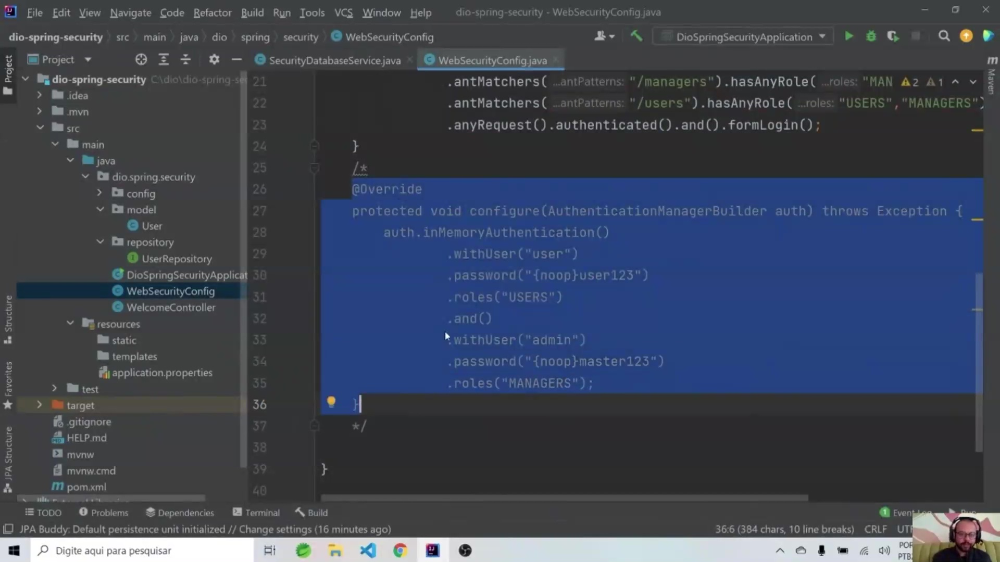
</p>

Após acoplar as bases restritas dinâmicas o apontamento manual e engessado (feito temporariamente por meio de métodos injetores e registros estáticos de memória local, providos em rotinas pregressas no `WebSecurityConfig`) necessita ser expurgado ou anulado via comentários no documento, prevenindo cruzamento ambíguo e conflitos duplos gerenciais de sessão local.

<p align="center">
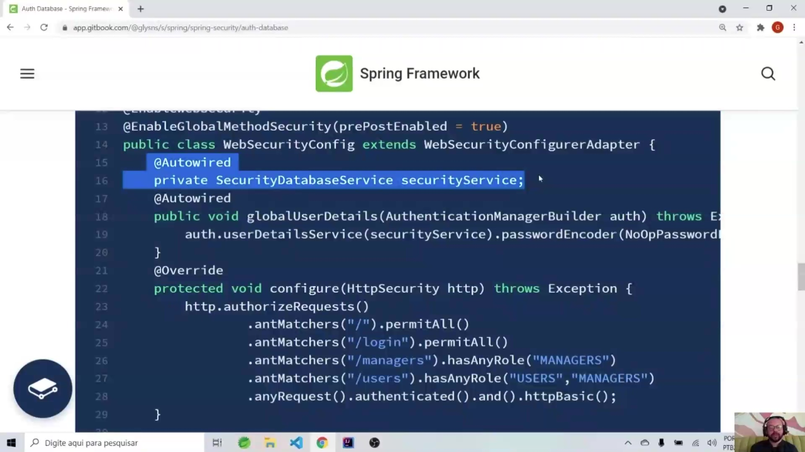
</p>

De posse desta limpa providenciada, as amarras do sistema de checagens global do ambiente transacional devem agora reencaminhar as suas validações para invocar o ecossistema recém criado via base, atrelando formalmente nas diretrizes customizadas as saídas geradas por ele mesmo através de um injetor da central customizada (`securityService`).

<p align="center">
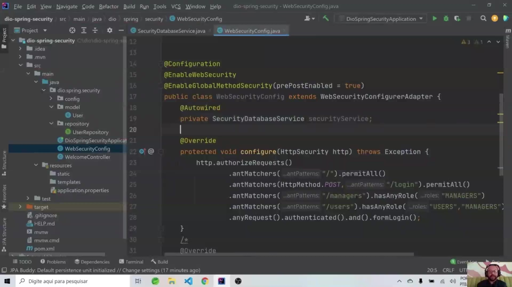
</p>

Na janela de códigos, efetua-se o elo funcional direto aplicando o `@Autowired` atrelado fortemente perante à instância gerada providenciando as checagens primordiais da regra provida no ambiente central restritivo.

<p align="center">
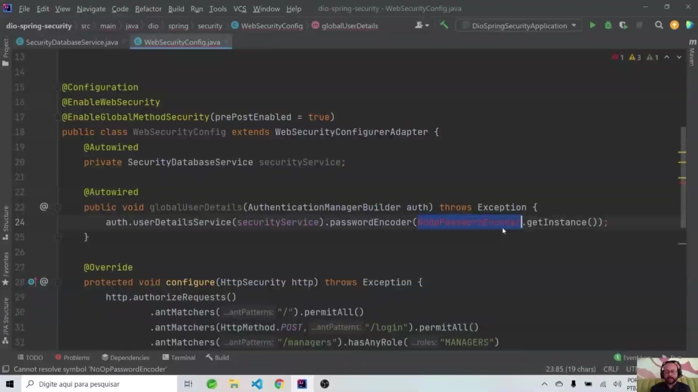
</p>

Uma nova assinatura base provida (`globalUserDetails`) assina perante a entidade mantenedora `AuthenticationManagerBuilder` de onde exatamente a provisão fundamental de sessão irá emanar ao disparar verificações cruzadas baseadas na central em banco.

<p align="center">
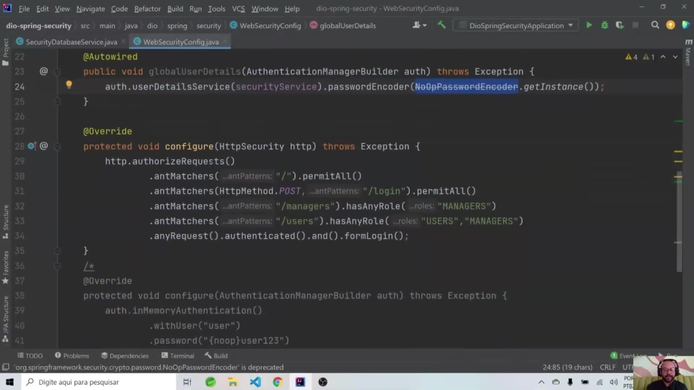
</p>

Ao fechar esta ponte o método solicita ao gerenciador interno de qual tipo prático de verificação originária e tratativas de segurança cifrada as senhas sofrerão. Como recurso imediato provisório usa-se, portanto, instâncias nulas providas via `NoOpPasswordEncoder`, delegando por hora o processamento livre por razões restritas de demonstrações semânticas puras na autenticação recém acoplada local.

<p align="center">
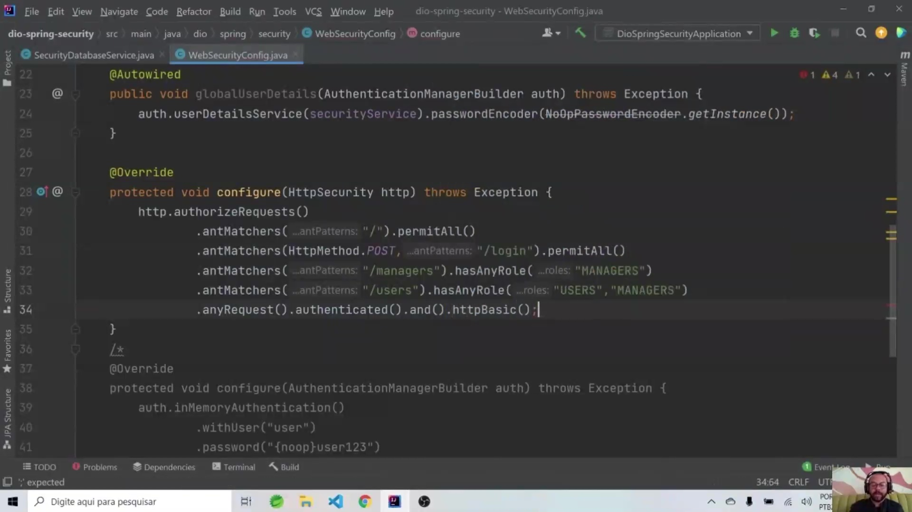
</p>

O roteador do fluxo, agora alterando os controles das portas de requisições sob `HttpSecurity`, sofre adaptação mudando de chamadas puras que esperam rederização via login `.formLogin()` por restrições puramente orientadas via protocolo restrito API através do limitador autêntico de tráfego base HTTP restritivo invocado por meio de `.httpBasic()`.

<p align="center">
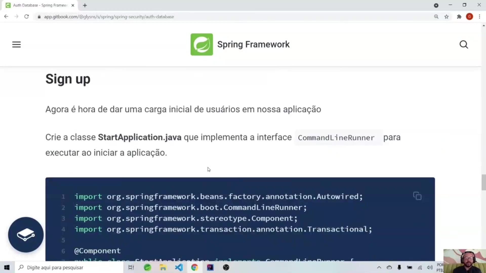
</p>

Diante de um ecossistema com base zerada recém estruturada, faz-se importante e estritamente vital dispor de dados inciais fixos em banco para prosseguir avaliações no roteamento de logins testáveis. Configura-se então sementes iniciais através do recurso assíncrono e nativo de injeção providos via assinaturas do tipo `CommandLineRunner`.

<p align="center">
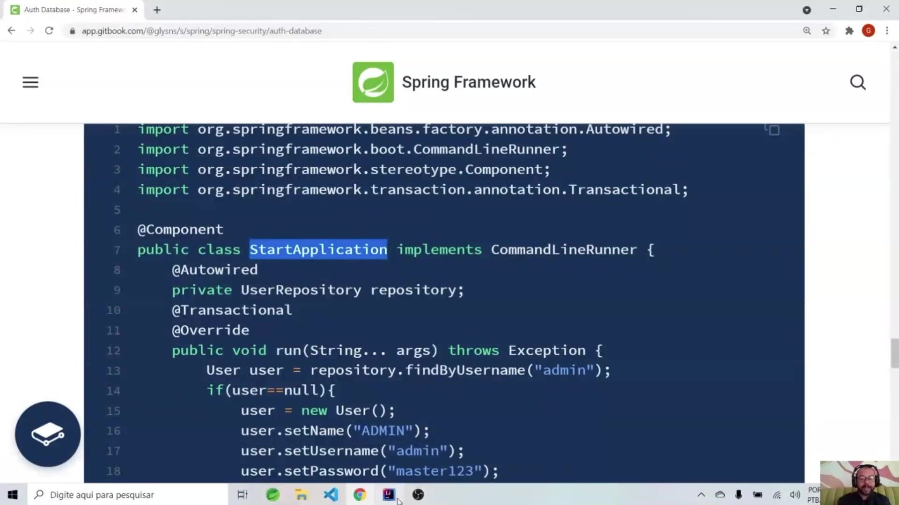
</p>

Esta nova estruturação providencia implementações amarradas no carregador ativando uma pesquisa no banco que, em descobrindo falhas no achado, procede de pronto com injeção estruturada do modelo nativo "admin" garantindo um testador fundamental via anotação de provisão isolada (`@Transactional`).

<p align="center">
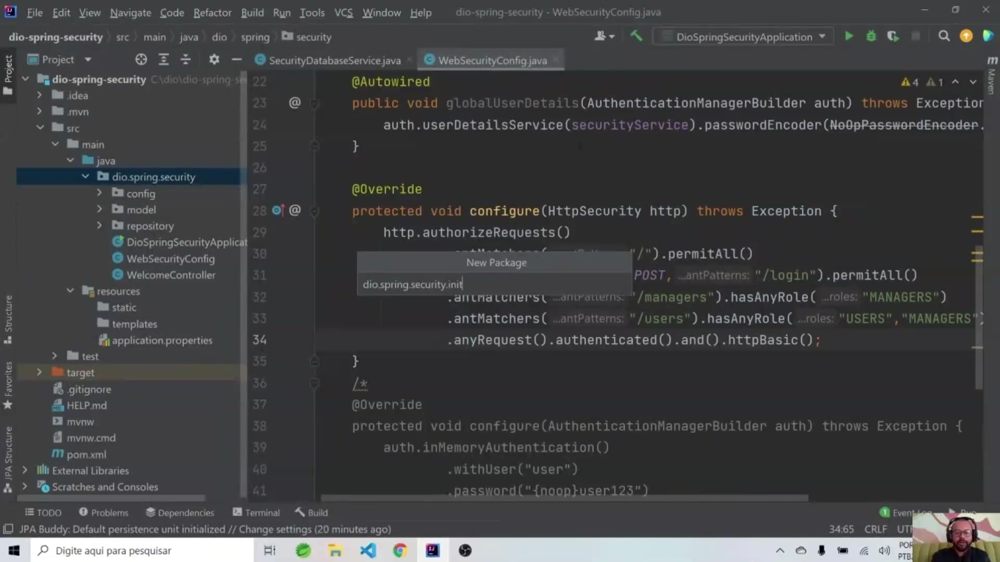
</p>

Na janela de estruturas da IDE, providencia-se que todos estes comportamentos autônomos restritivos aos gatilhos inciais e de inicialização puramente temporária operem alocados coerentemente num agrupamento semântico designado para pastas tipo `init`.

<p align="center">
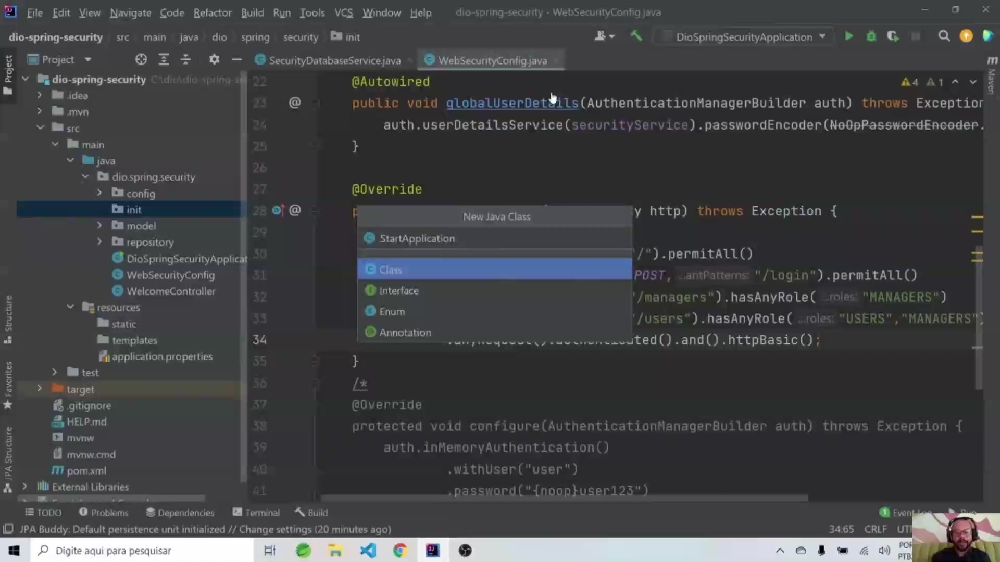
</p>

O preenchimento final destas diretivas na janela provida pelo ecossistema reflete exatamente a intenção modular autônoma em fornecer chaves fixas que acompanharão os disparos a partir da execução rotineira local da aplicação de acesso.

<p align="center">
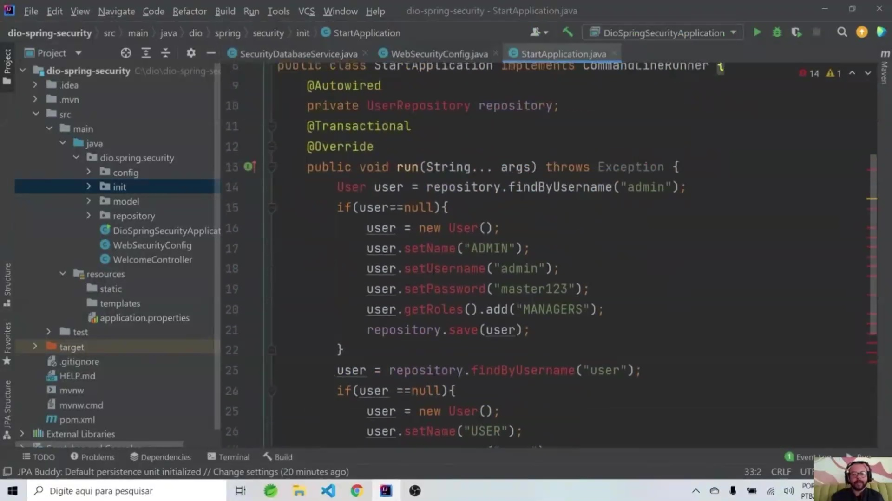
</p>

O código desenvolvido ilustra perfeitamente a lógica estrita validada onde a ausência plena na leitura gerencial para "admin" (sendo nula) deflagra em conformidade absoluta o nascimento dinâmico de chaves plenas para prosseguir na arquitetura instanciada de autorização provida via `user.setUsername`.

<p align="center">
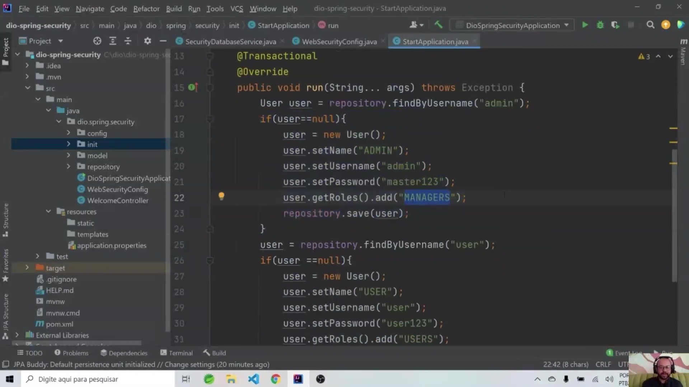
</p>

Imediatamente após a preenchimento do tipo nominal do acessante testador e chaves numéricas simples, engloba-se com igual urgência os fatores autorais limitantes que englobam a instância (`add()`) forçando-a contra a proteção do salvamento transacional final garantido através de `repository.save()`.

<p align="center">
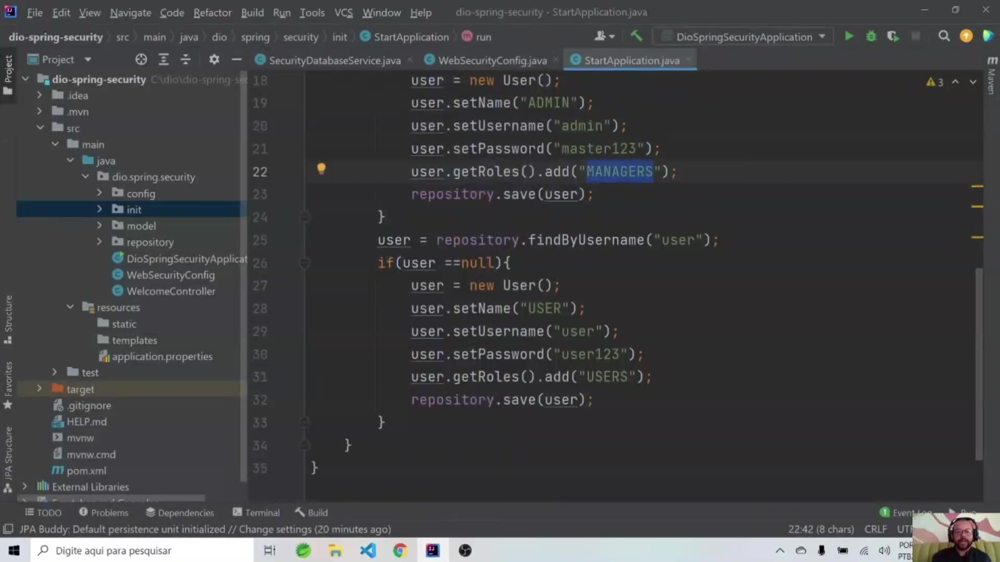
</p>

Comprova-se a coesão restritiva que imputa no usuário primordial a marca referencial direta `"MANAGERS"` atestando de forma indubitável o comportamento cruzado do mapeamento interno que exigirá cruzamento nominal correspondente do acesso as vias restritas no gerenciador raiz das propriedades do provedor local configurado via Spring Security.

<p align="center">
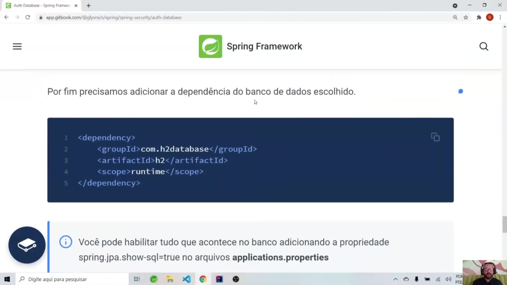
</p>

E para de fato materializar e consolidar toda esta complexa configuração lógica gerada provisoriamente sob bases não físicas reais faz-se a obrigatoriedade da inclusão vital do conector, a própria engrenagem autônoma fornecida perante bibliotecas externas provisórias. O H2 é idealizado e alocado, permitindo armazenamento e recriamentos automáticos da camada inteira simulando tabelas localmente perante alocações voláteis exclusivas baseadas sob a própria memória instalada.

<p align="center">
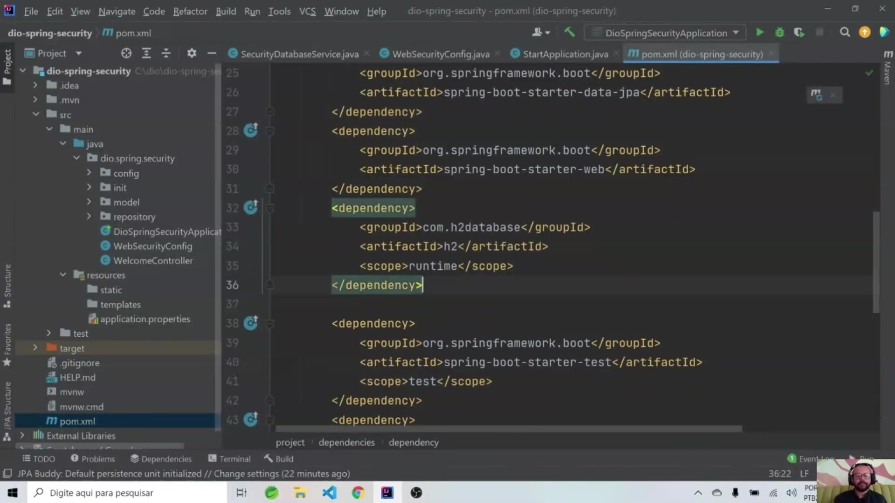
</p>

Finalizando as preparações dos acessos, o apontamento de escopo autônomo e de rodapé do ecossistema ganha o provedor no arquivo `pom.xml`, habilitando todas as chamadas JPA para operarem livremente pelo runtime do contêiner.

<p align="center">
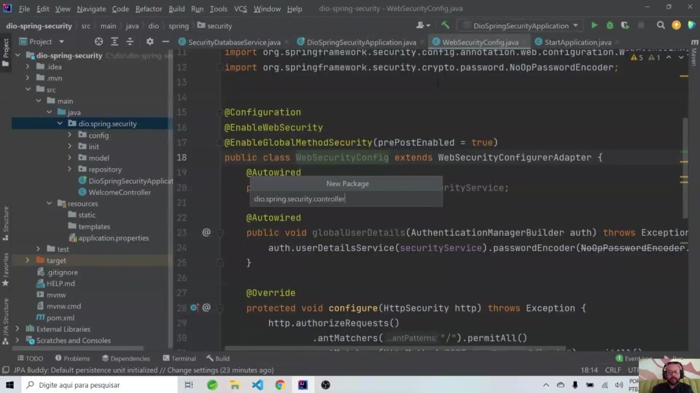
</p>

Para polimento e maturidade na organização funcional dos arquivos isolados providos, move-se o remanescente controlador que orquestra as chegadas para dentro das fronteiras nomeadas como exclusivas para o direcionador de fluxos em pastas padronizadas, atestando conformidade estrutural.

<p align="center">
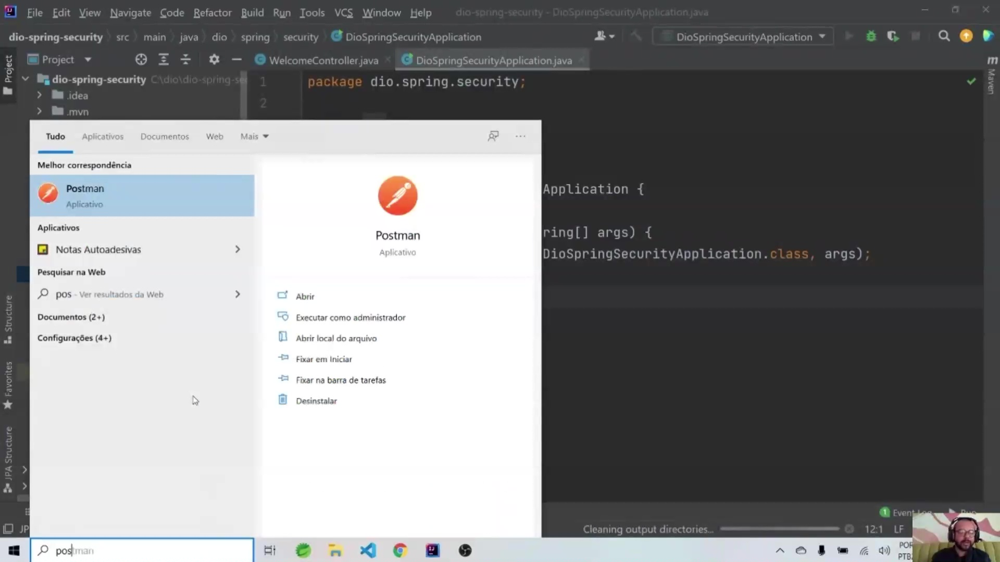
</p>

Tendo os cenários autônomos e restritivos criados sem apoios a rederizadores formados nativamente via web, executa-se, para cruzamentos reais providos sobre API formatada, um client HTTP amplamente testável provido sob ecossistemas de apoio como o app Postman.

<p align="center">
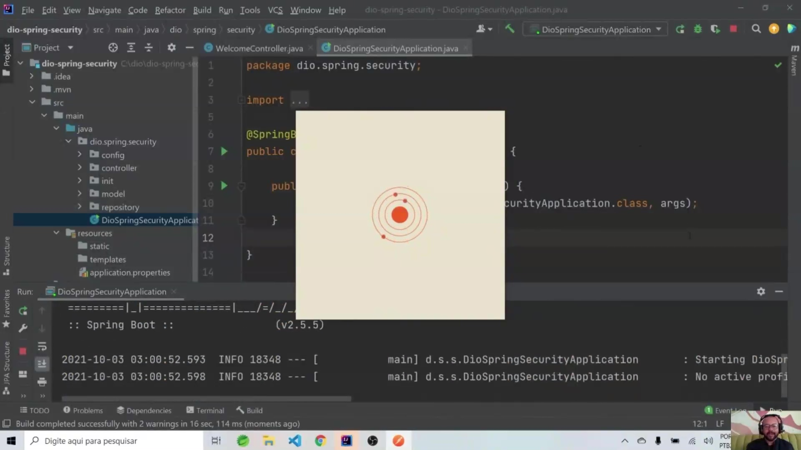
</p>

Enquanto a central recarrega e emite as compilações e executa instâncias locais no log base gerencial, atestamos as aprovações iniciais livres de quebras confirmando que motor de banco (JPA) e restrições conjuntas (Security) sobem ativas para responder na porta comum de verificação cruzada alocada de modo estrito via rede operante no localhost designado.

<p align="center">
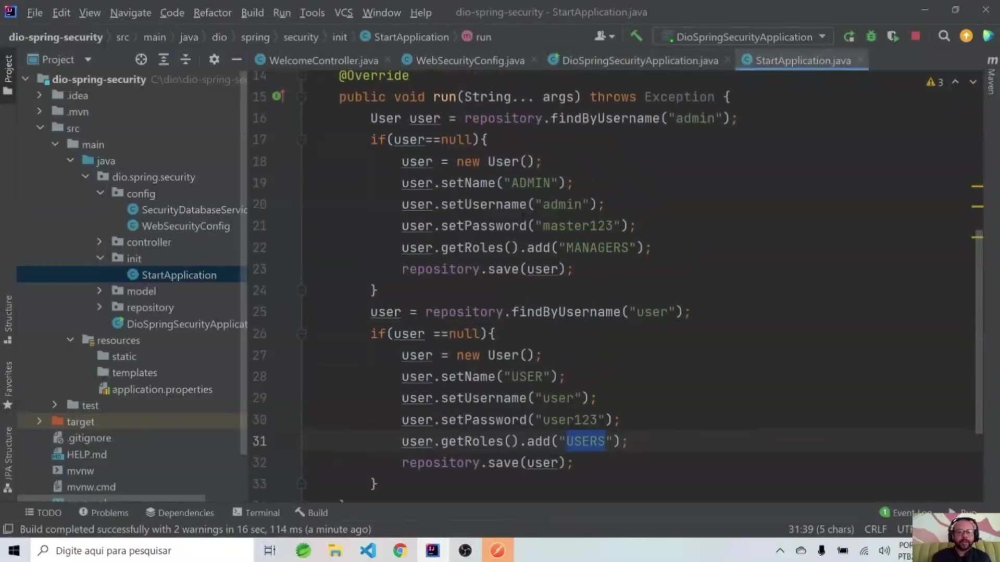
</p>

Refletindo os apontamentos e validando se o motor inseriu o segundo teste basilar configurado sob a mesma mecânica ativadora, ressalta-se explicitamente na classe central a role provida unicamente focada no isolamento ao acesso simples `"USERS"` para simular a prova de checagem.

<p align="center">
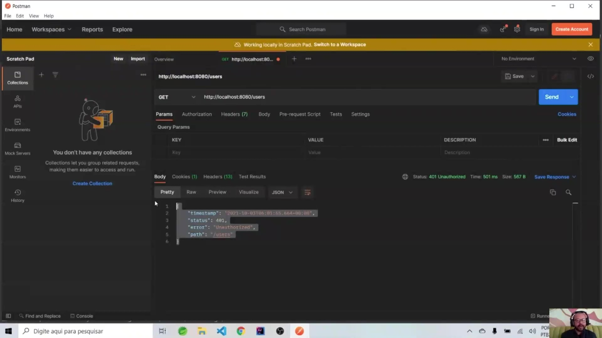
</p>

Realizando a inserção desprotegida para teste direto aos acessos apontados como alvos base de restrição, submete-se uma requisição no método clássico em end-point ativo `/users`. Como esperado, a falha autoritativa atesta que a segurança restringe explicitamente e encerra de pronto a tratativa providenciando negações de status base como a 401.

<p align="center">
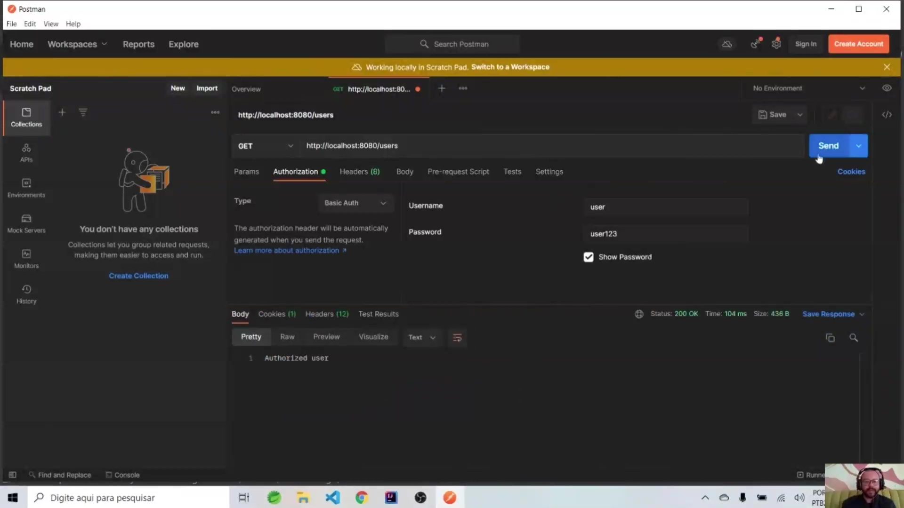
</p>

Mudando na plataforma de apoio a submissão das caixas para aceitação com Basic Auth e fornecendo no cabeçalho exato os mesmos dados apontados no teste pré-gravado inicial (`user` | `user123`), o portão de controle acata perfeitamente fornecendo em retorno o fluxo de rotas livres estipuladas ao nível básico de privilégio.

<p align="center">
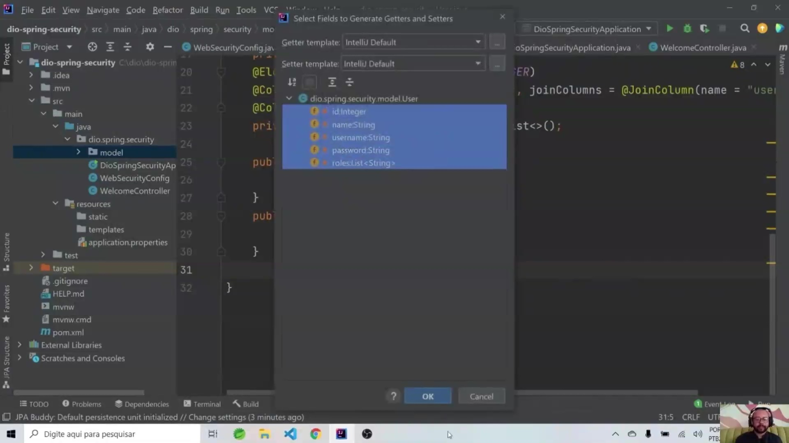
</p>

Ao realizar verificações cruzadas no ecossistema de configuração entre provedor base, modelagem gerada e a configuração restritiva central, evidencia-se como o código reflete fielmente as regras providas e testadas. As respostas são controladas centralmente por rotinas estritamente estabelecidas.

<p align="center">
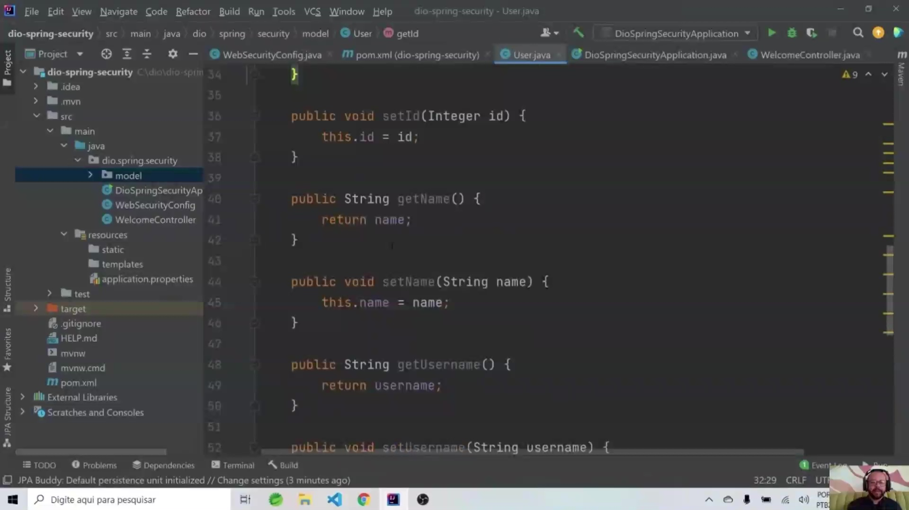
</p>

Ao reanalisar a configuração da classe `User`, fica clara a importância da implementação robusta do encapsulamento dos dados para fornecer todas as informações sensíveis de credenciais (identificadores e strings restritas) requeridas pelas lógicas ocultas do framework que validam o Basic Auth na camada web autônoma recém ativada.

<p align="center">
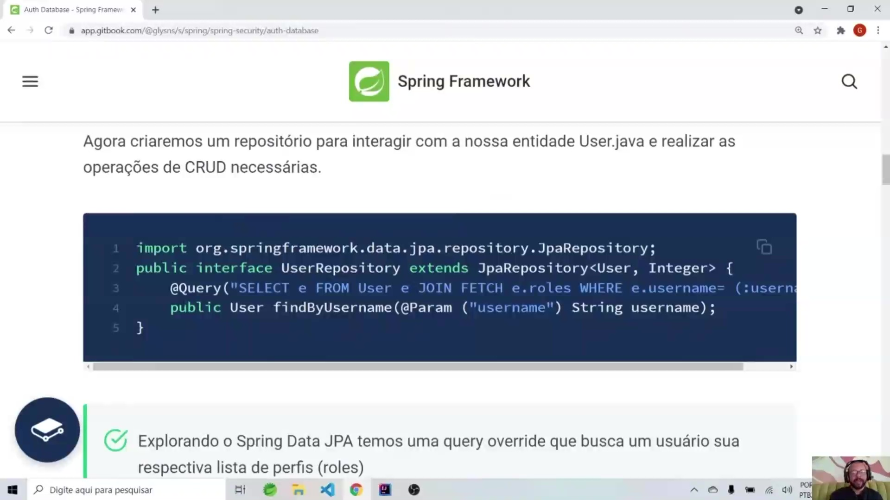
</p>

Recapitulando a base de transação, ressalta-se novamente a importância da customização implementada na interface estendida. Todo o peso da localização e coleta de permissões ocorre simultaneamente via o contrato simples e da consulta anotada na porta provida para checagens de usuários.

<p align="center">

</p>

Isso reitera como a organização em camadas lógicas puras facilita eventuais consultas à infraestrutura no ambiente, separando repositórios das entidades.

<p align="center">
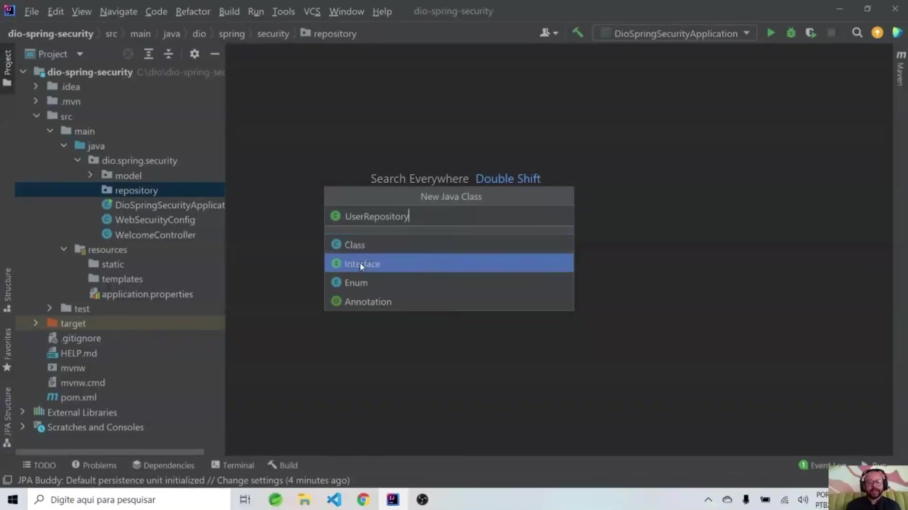
</p>

O isolamento e padronização provêm robustez na arquitetura Spring Data, simplificando as etapas de busca perante as manutenções das assinaturas que orquestram os disparos na API.

<p align="center">
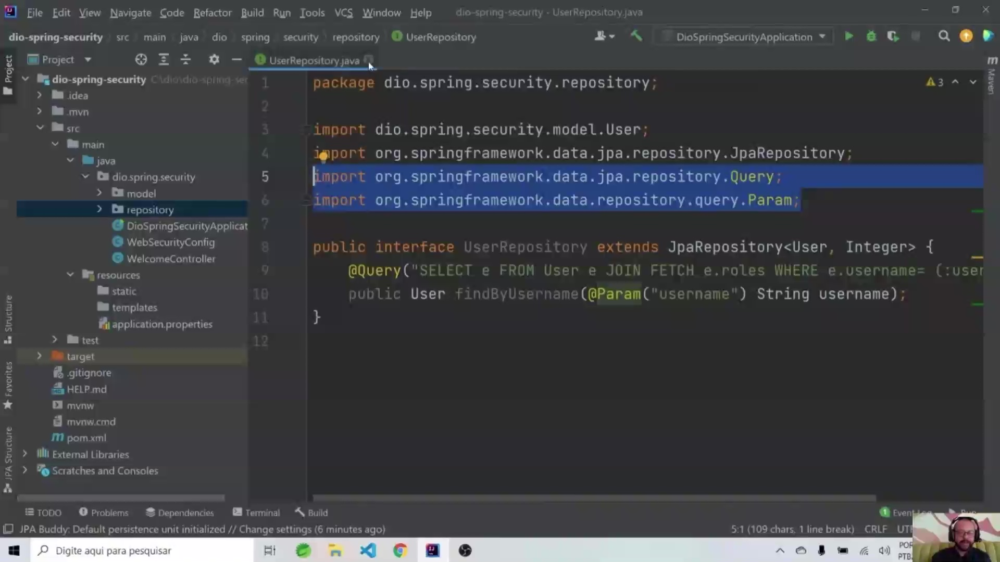
</p>

O uso direto de JPQL nesta interface confirma a força da biblioteca em reduzir código repetitivo (boilterplate) focado em bancos temporários como H2 garantindo cruzamentos nativos entre listas de funções sem código imperativo extra na base instalada.

<p align="center">

</p>

Trazendo à tona mais uma vez a conversão obrigatória, confirma-se o papel do SecurityDatabaseService como sendo o coração ativo de tradução entre a lógica pura e o escopo restritivo alocado internamente nas travas configuradas nas rotas globais.

<p align="center">
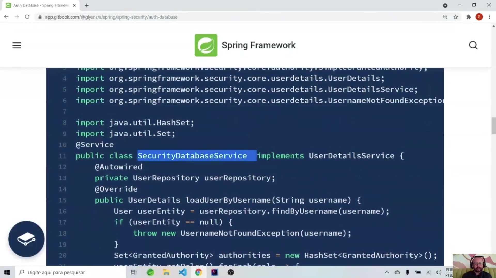
</p>

Ao reobservar o núcleo provido em `@Service`, entende-se melhor como o contrato fixo forçado prevê exceções base tratáveis permitindo estabilidade contínua mesmo em checagens contra logins errados, vazios ou fraudulentos, rebatendo as tentativas puras sem quebrar o laço autônomo.

<p align="center">
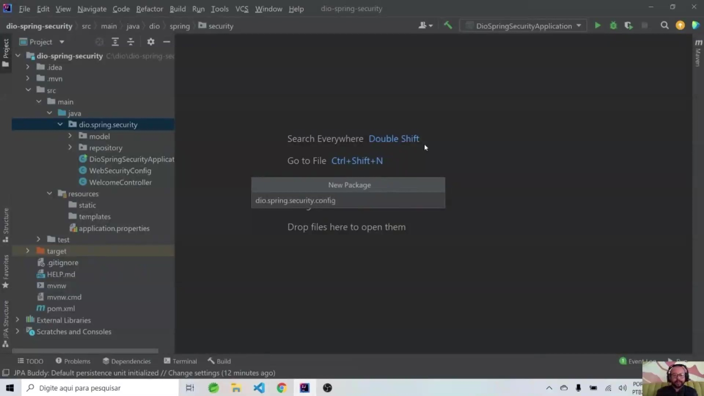
</p>

O isolamento das lógicas customizadas em diretórios próprios (`config`) torna-se vital à medida que as exigências do pacote de restrição evoluem.

<p align="center">

</p>

A estruturação unificada reflete diretamente a adoção contínua dos modelos MVC alinhados na arquitetura Spring no longo prazo de manutenção do sistema acoplado criado de ponta a ponta.

<p align="center">
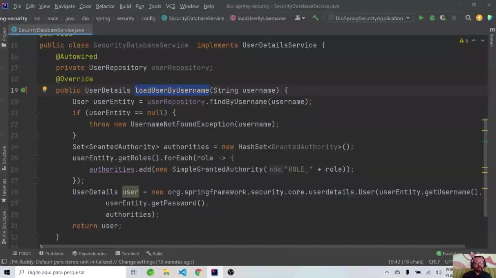
</p>

Demonstra-se com isso o compromisso estrito com a assinatura e modelagem herdada `loadUserByUsername()`, certificando total aderência e submissão aos controles internos sem criar sobreposições confusas.

<p align="center">
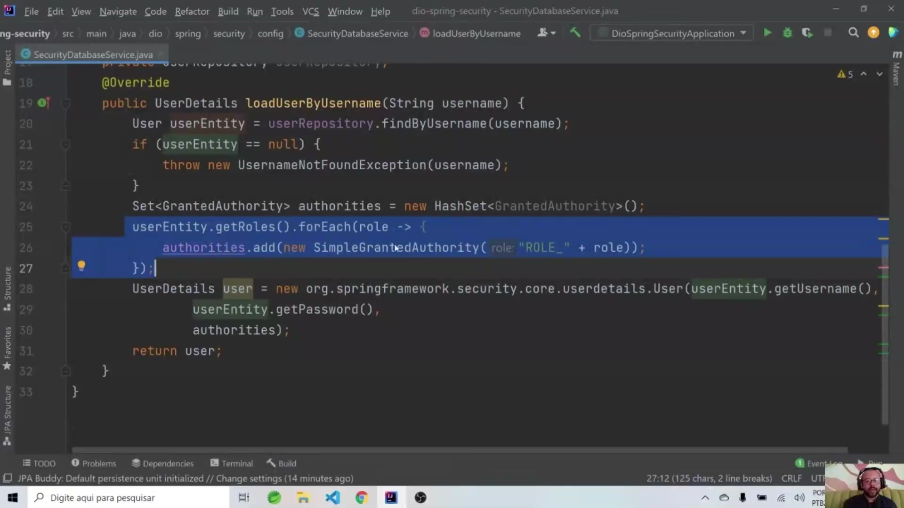
</p>

A rotina de conversão comprova seu papel como filtro e concatenador definitivo da regra binária interna atrelada em "ROLE_". Somente a conversão exata garante que bloqueios ou end-points não acusem erro cego (falsos positivos) durante acessos legítimos cruzados efetuados no client de testes HTTP provido.

<p align="center">

</p>

Consequentemente as ligações principais perdem o lastro físico e estático e delegam os bloqueios das URLs restritas puramente aos cruzamentos entre perfis devolvidos pelo novo componente em tempo real.

<p align="center">
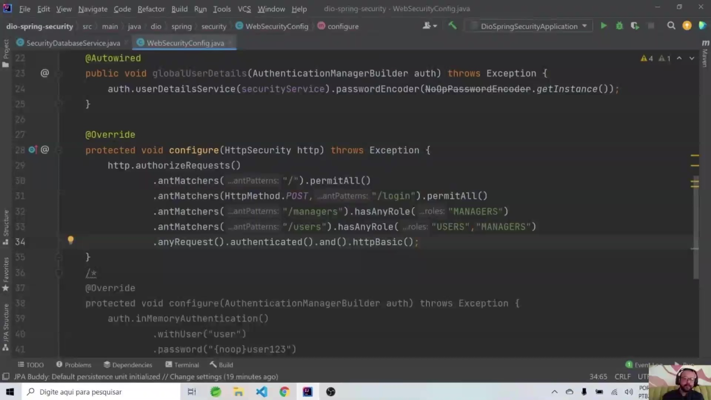
</p>

O painel mostra novamente a formatação estrita implementada no `configure(HttpSecurity http)` impondo a nova diretriz focada perante APIs integradas.

<p align="center">

</p>

A garantia operacional recai unicamente sobre a lógica autônoma que, sem a exigência de painéis extras providos pelo administrador, semeia e consolida acessos iniciais para a sustentação e uso do próprio dev testador isolado no ambiente recém orquestrado e fechado.

<p align="center">
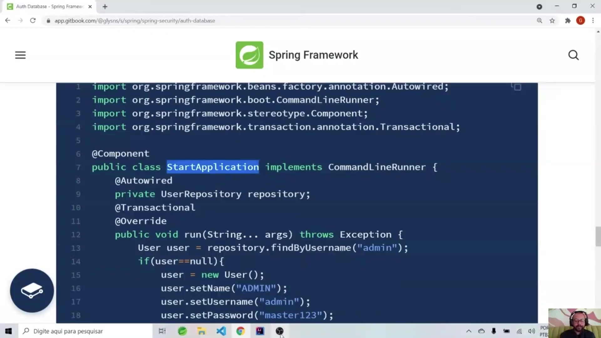
</p>

Garante-se a operação íntegra perante a injeção estrita da biblioteca do repositório em contexto unicamente anotado para operar isolado.

<p align="center">
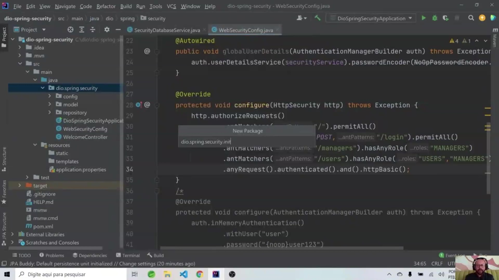
</p>

Alocando com coerência os gatilhos, evita-se problemas com ordens de execução indesejadas na varredura automatizada executada durante as inicializações constantes do servidor Tomcat embarcado no próprio projeto restrito gerado.

<p align="center">
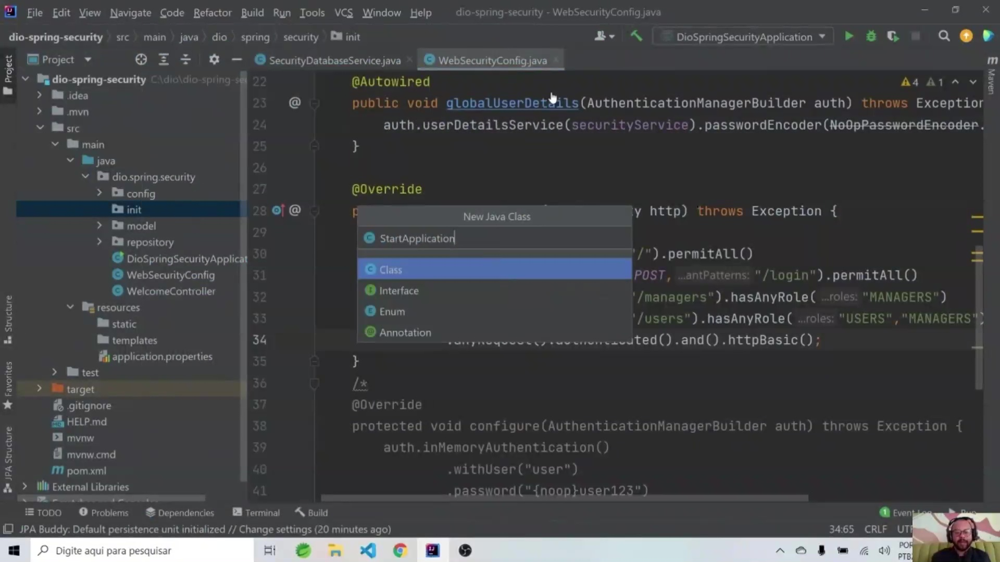
</p>

A injeção do `@Component` prova-se fundamental, alertando o framework a mapear esta classe como prioritária.

<p align="center">
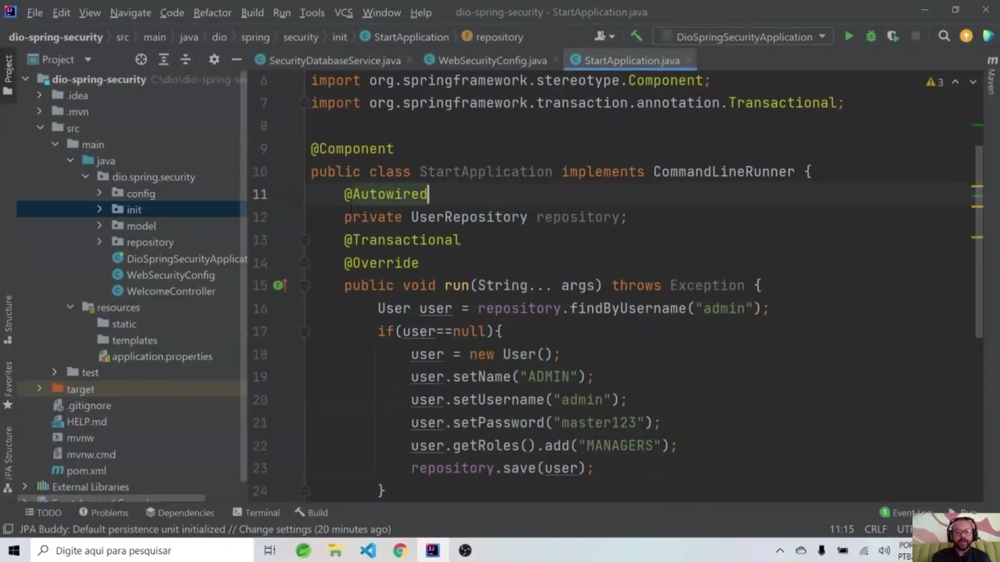
</p>

Repassando as regras contidas neste *Command Line*, reafirma-se o fluxo programático clássico de leitura, confirmação e preenchimento persistente automatizado perante bases limpas voláteis acopladas em arquiteturas simples e orgânicas recém ativadas de demonstrações e desenvolvimentos ágeis do dia a dia.

<p align="center">
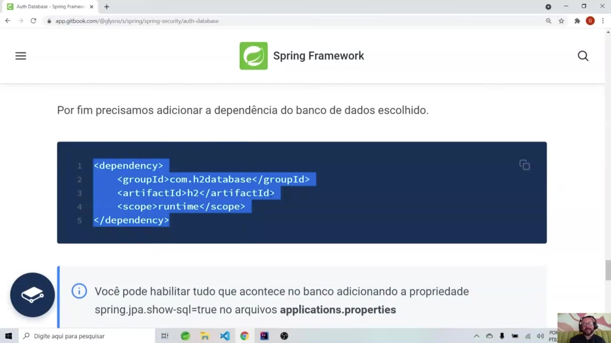
</p>

Toda a teoria converge no conector isolado que consolida as lógicas abstratas persistindo fisicamente nas estruturas invisíveis geradas a quente em execução, finalizando as exigências do Spring Data com sucesso ao vincular a Engine H2 no *classpath* base orquestrado de ponta a ponta perante os passos anteriores.

<p align="center">
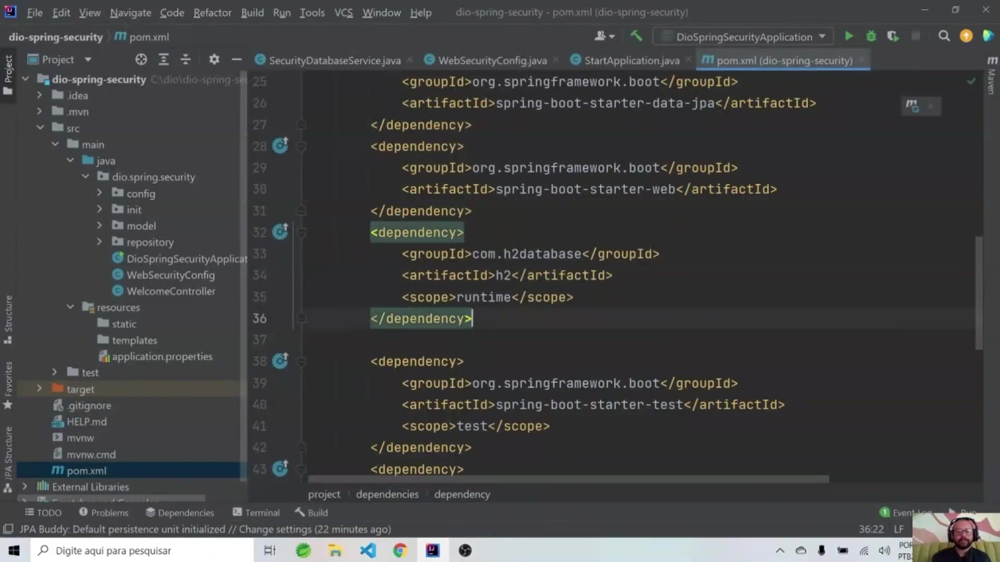
</p>

O encapsulamento restrito desta única biblioteca em tempo isolado provê flexibilidade sem amarras profundas a bancos físicos pesados, permitindo testes lógicos plenos da cadeia sem impacto infraestrutural cruzado.

<p align="center">
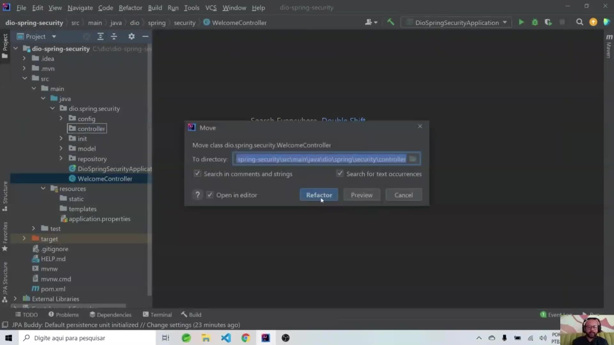
</p>

Refinando a estrutura após tantas adições, o modelo isolado MVC adota os controladores agrupados, mantendo as configurações isoladas e não mais esparsas no escopo orgânico.

<p align="center">
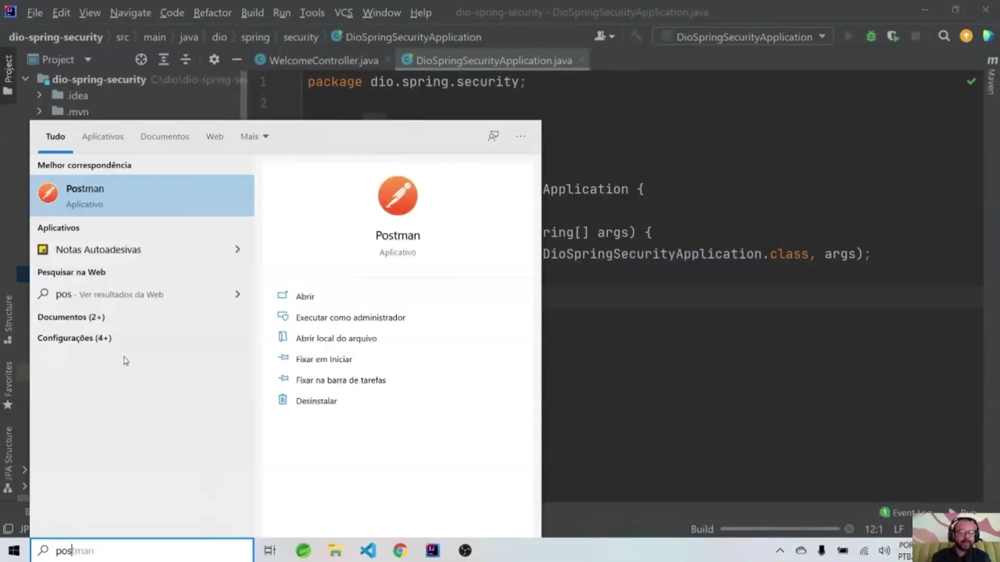
</p>

A confirmação fática de todos os passos teóricos implementados recai por fim na avaliação prática e manual provida pelo client configurado como ponte provisória avaliadora externa provida unicamente na suíte logada.

<p align="center">
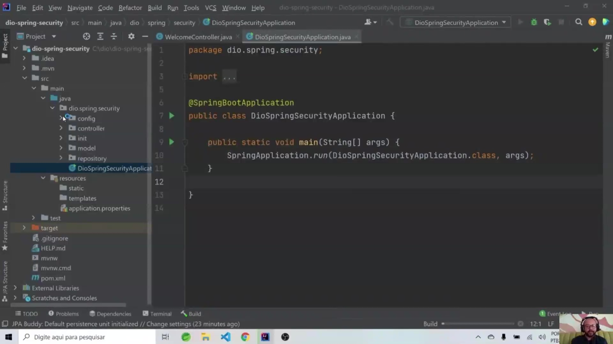
</p>

O código central atua incólume guiando e levantando os beans necessários configurados na esteira, com apenas um leve re-start para garantir os elos orquestrados em uma máquina autônoma operando do zero até as travas consolidadas configuradas isoladamente.

<p align="center">

</p>

Sem travamentos na subida, as logs demonstram saúde na ativação do container de segurança autêntica em H2 em sintonia integral.

<p align="center">
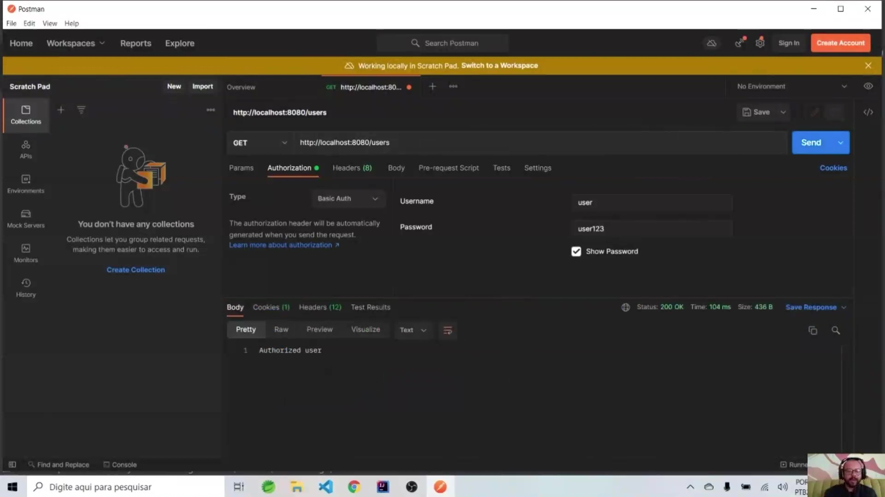
</p>

Comprova-se a coesão geral repetindo no console do Client os acertos restritivos previstos nas diretrizes teóricas estabelecidas. As barreiras da porta `/users` reagem e liberam precisamente mediante credenciais válidas e com as tags certas em banco isolado temporário.

<p align="center">
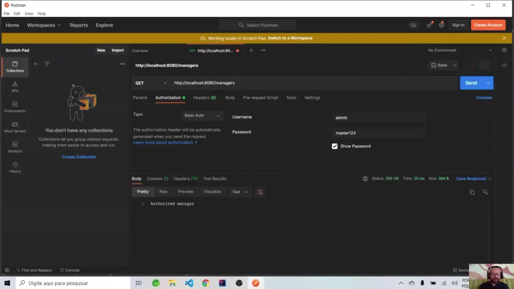
</p>

Para finalizar toda a validação de forma impecável, testa-se a conta que possui perfis compostos cruzando informações para domínios mais blindados da arquitetura (`/managers`), submetendo as chaves de "admin" e aferindo, por fim, que a liberação opera estritamente e com assertividade sob uma lógica limpa, persistente e centralizada, demonstrando perfeitamente a adoção do Spring Security atrelado a bases ativas locais como idealizado no roteiro e demonstrado no encerramento orgânico da aula estipulada de banco acoplado ativo isoladamente na própria infraestrutura desenvolvida inteiramente pelas regras criadas.

### 🟩 Vídeo 06 - JWT - JSON Web Token - Parte 1

<video width="60%" controls>
  <source src="000-Midia_e_Anexos/bootcamp_tqi_fullstack-modulo.07-curso.04-video_06.webm" type="video/webm">
    Seu navegador não suporta vídeo HTML5.
</video>

link do vídeo: https://web.dio.me/track/tqi-fullstack-developer/course/adicionando-seguranca-a-uma-api-rest-com-spring-security/learning/cfc7d590-9a2d-4643-bdaf-171ad5265cc4?autoplay=1

Este guia resume a introdução e a configuração inicial de uma aplicação Java utilizando Spring Boot Security e a tecnologia JWT (JSON Web Token) para gestão de segurança e autenticação.

### Anotações

<p align="center">
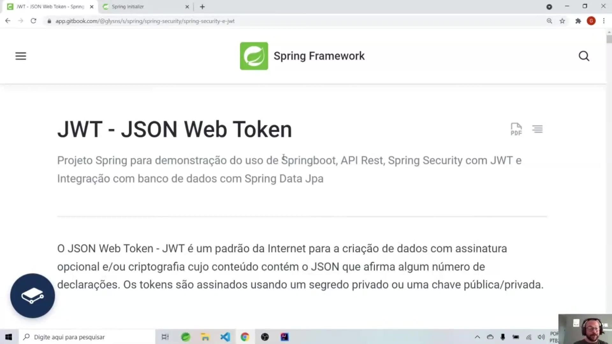
</p>

O JWT (JSON Web Token) é apresentado como um padrão de mercado independente, não limitado ao ecossistema Spring, utilizado para a criação de dados com assinatura opcional e criptografia. Sua estrutura é baseada em JSON para transmitir declarações (*claims*) entre partes de forma segura, sendo assinado por uma chave secreta ou um par de chaves pública/privada.

<p align="center">
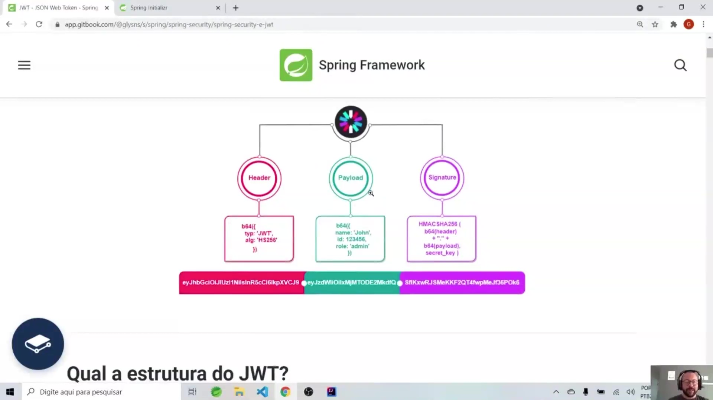
</p>

A estrutura fundamental de um JWT é composta por três partes distintas: **Header**, **Payload** e **Signature**. Cada seção desempenha um papel específico na composição do token, permitindo que as informações trafegadas nas requisições sejam validadas e autenticadas pelo sistema de segurança da aplicação.

<p align="center">
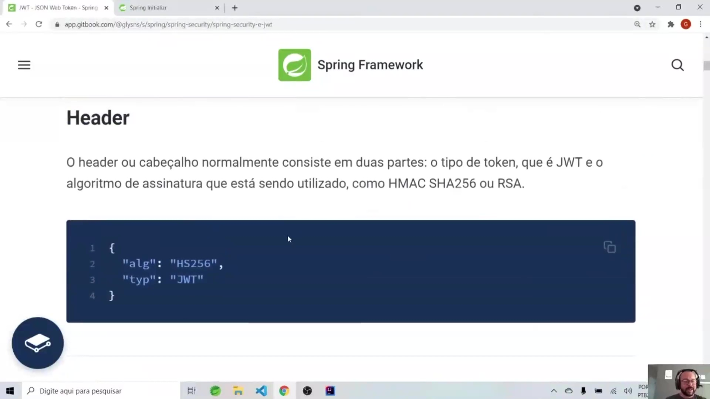
</p>

O cabeçalho (**Header**) do token define os aspectos técnicos da estrutura, especificando o tipo do token e o algoritmo de assinatura utilizado na criptografia, como o HMAC SHA256 ou RSA.

```json
{
  "alg": "HS256",
  "typ": "JWT"
}
```

<p align="center">
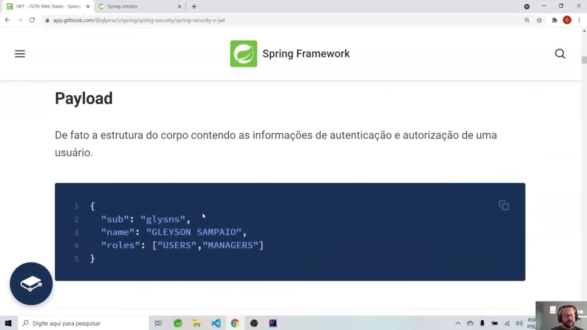
</p>

O **Payload** constitui o corpo do token e carrega as informações de autenticação e autorização do usuário. Nele são definidos dados como a identificação do sujeito (*subject*), o nome do usuário e seus respectivos perfis de acesso (*roles*).

```json
{
  "sub": "glysns",
  "name": "GLEYSON SAMPAIO",
  "roles": ["USERS", "MANAGERS"]
}
```

<p align="center">
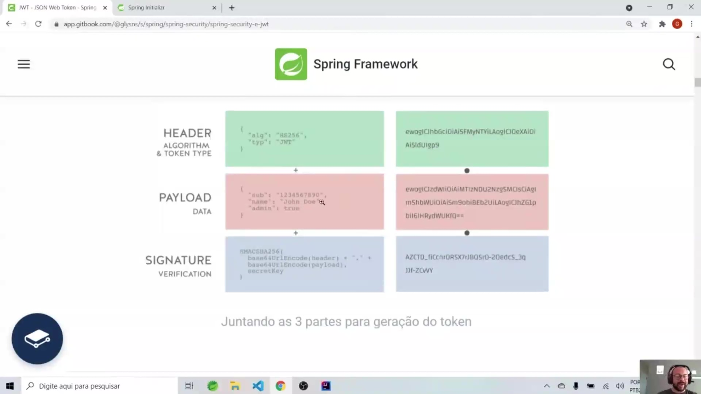
</p>

A geração do token final ocorre com a junção das três partes mencionadas (Header, Payload e Signature), codificadas e separadas por pontos. A camada de assinatura (**Signature**) é crucial para garantir que as credenciais utilizadas na geração sejam as mesmas na verificação de cada requisição.

<p align="center">
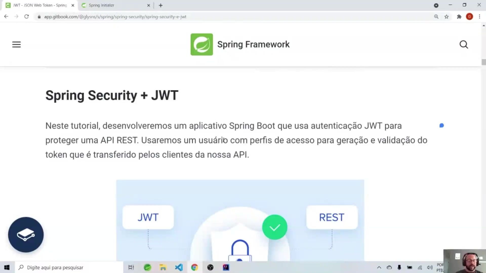
</p>

No contexto do Spring Security, o JWT atua fornecendo o token enquanto o framework habilita filtros para interceptar as requisições. Esses filtros executam algoritmos de validação para verificar a autenticidade do usuário, a validade temporal (expiração) e as permissões de acesso conforme as regras da aplicação.

<p align="center">
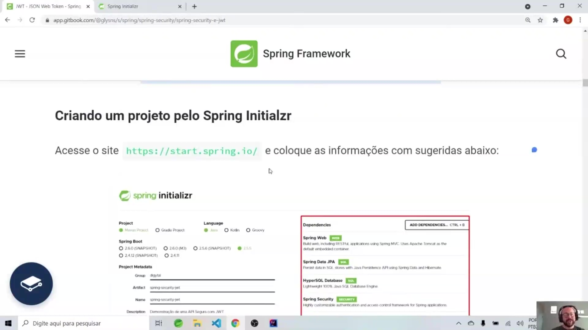
</p>

A criação do projeto prático inicia-se através do **Spring Initializr**, onde são configuradas as propriedades base, incluindo o gerenciador de dependências (Maven), a linguagem (Java) e a descrição do sistema para demonstração de uma API segura com JWT.

<p align="center">
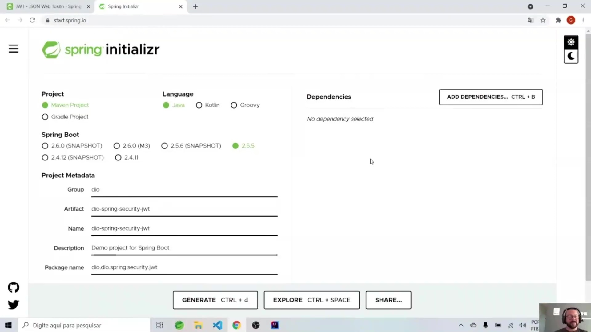
</p>

Nesta etapa do Initializr, definem-se os metadados do projeto, como o **Group** (identificado como `dio`) e o **Artifact** (nomeado como `dio-spring-security-jwt`), estabelecendo a estrutura de pacotes inicial da aplicação.

<p align="center">
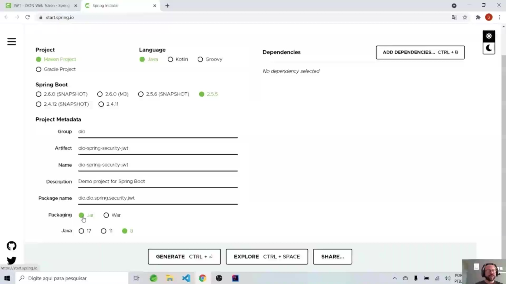
</p>

As definições de empacotamento e ambiente são configuradas selecionando-se o formato **JAR** e a versão do **Java 8**. Embora a aplicação utilize o Tomcat, o empacotamento JAR é preferido devido ao servidor embutido fornecido pelo Spring Web.

<p align="center">
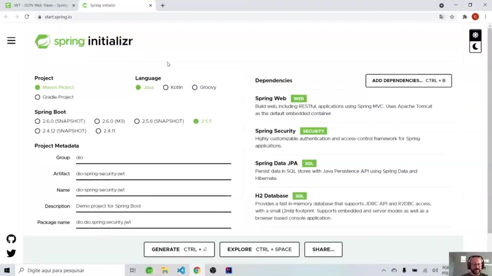
</p>

Para viabilizar as funcionalidades do projeto, são adicionadas as dependências essenciais: **Spring Web** para a criação da API REST, **Spring Security** para o controle de acesso, **Spring Data JPA** para a persistência de dados e o **H2 Database** para consulta de dados em memória.

<p align="center">
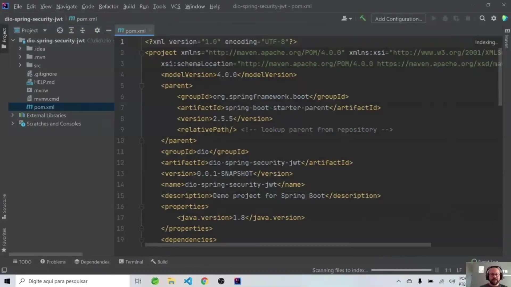
</p>

Após o download e importação na IDE, o projeto é inicializado. É necessário aguardar que o Maven realize a sincronização e o download de todos os *starters* e bibliotecas configurados no passo anterior.

<p align="center">
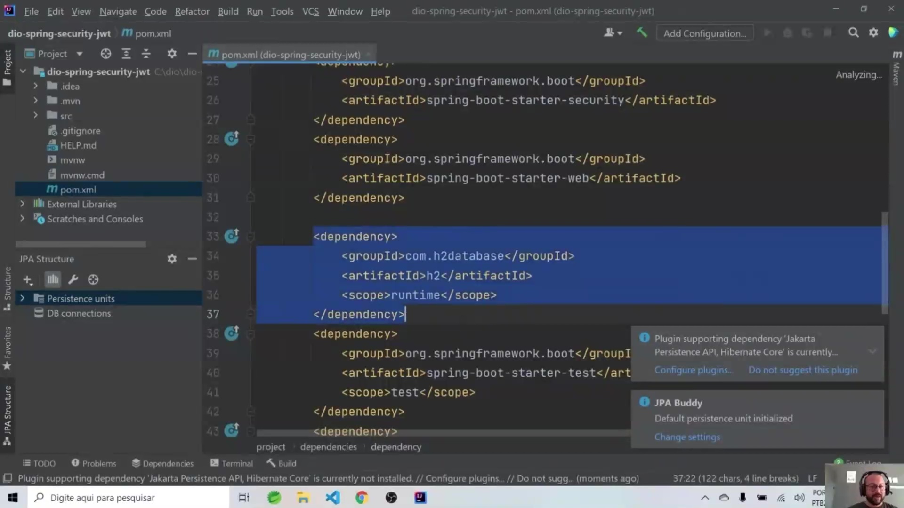
</p>

O arquivo **pom.xml** centraliza todas as configurações de dependências injetadas pelo Initializr. Nele é possível confirmar as versões dos *starters* do Spring Boot e os recursos de segurança que comporão a base do sistema.

<p align="center">
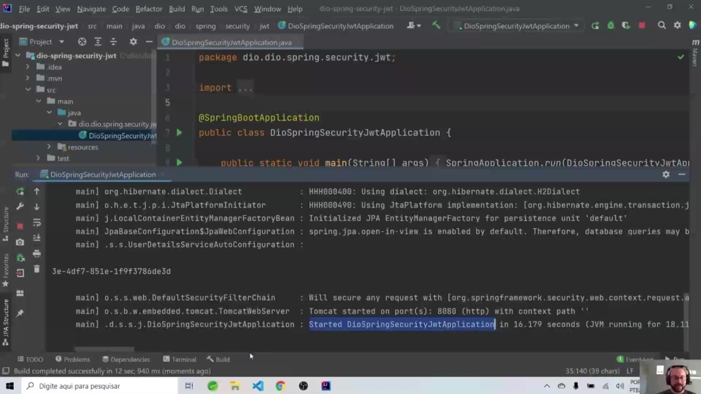
</p>

Na primeira execução da aplicação, seleciona-se a classe principal para iniciar o processo de compilação. O acompanhamento dos logs no console é fundamental para garantir que o projeto suba sem erros e que as configurações de segurança padrão sejam ativadas.

<p align="center">
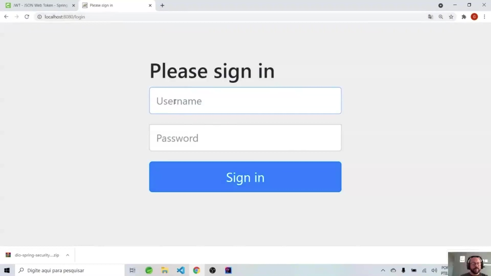
</p>

Ao acessar `localhost:8080` após a inicialização, o Spring Security apresenta automaticamente um formulário de login padrão. Esse comportamento confirma que a camada de segurança já está ativa, exigindo autenticação antes de permitir o acesso aos recursos da aplicação.      


### 🟩 Vídeo 07 - JWT - JSON Web Token - Parte 2

<video width="60%" controls>
  <source src="000-Midia_e_Anexos/bootcamp_tqi_fullstack-modulo.07-curso.04-video_07.webm" type="video/webm">
    Seu navegador não suporta vídeo HTML5.
</video>

link do vídeo: https://web.dio.me/track/tqi-fullstack-developer/course/adicionando-seguranca-a-uma-api-rest-com-spring-security/learning/4e65bb58-8aa2-4e26-868d-d9b37d662638?autoplay=1

Este guia aborda a fase de estruturação de um projeto Spring Boot focado em segurança. O objetivo principal é preparar o ambiente para autenticação via JWT (JSON Web Token), estabelecendo as dependências necessárias, a organização de pacotes por camadas e a implementação da lógica de persistência e criptografia de usuários

### Anotações

<p align="center">
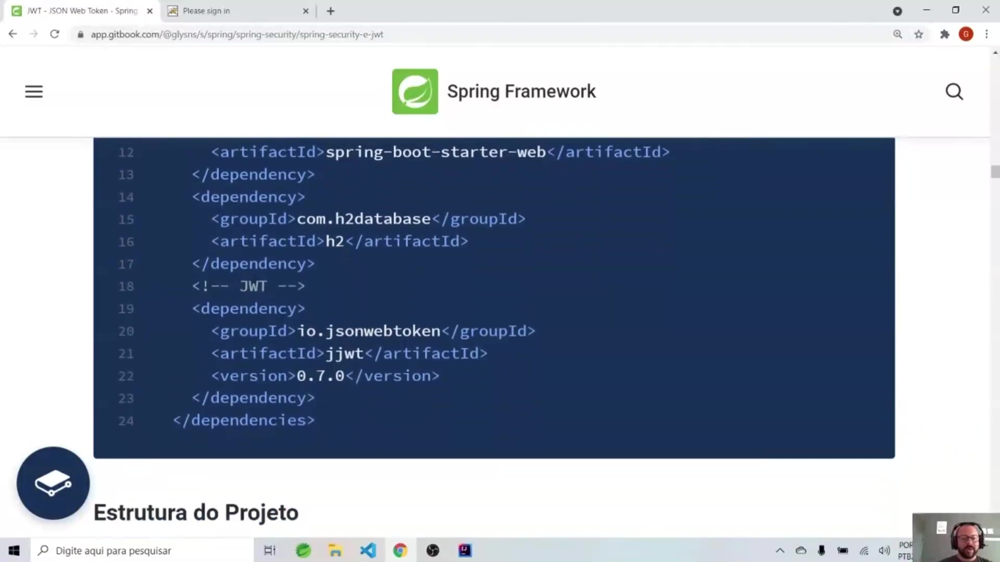
</p>

Nesta etapa inicial, o projeto Spring Security com ênfase em JWT já foi criado e importado para a IDE. A aplicação está devidamente configurada e rodando, apresentando a estrutura base necessária para a implementação da autenticação. Como comportamento padrão do Spring Security, a aplicação já solicita usuário e senha ao ser inicializada.

<p align="center">
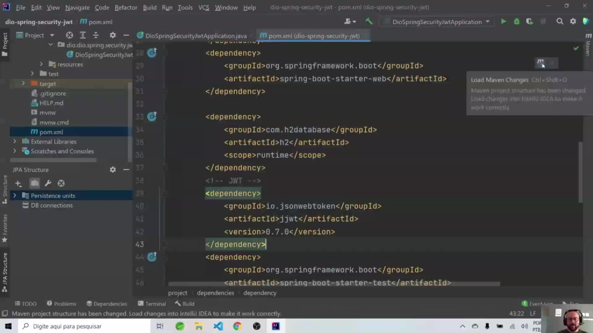
</p>

Para viabilizar a geração de tokens, é necessário incluir as dependências específicas no arquivo `pom.xml`. Além dos starters padrão como Data JPA, Security e Web, adicionamos a biblioteca **jjwt** para manipulação do JSON Web Token e o driver do banco de dados H2.

```xml
<dependency>
    <groupId>org.springframework.boot</groupId>
    <artifactId>spring-boot-starter-web</artifactId>
</dependency>

<dependency>
    <groupId>com.h2database</groupId>
    <artifactId>h2</artifactId>
    <scope>runtime</scope>
</dependency>

<dependency>
    <groupId>io.jsonwebtoken</groupId>
    <artifactId>jjwt</artifactId>
    <version>0.7.0</version>
</dependency>
```

<p align="center">
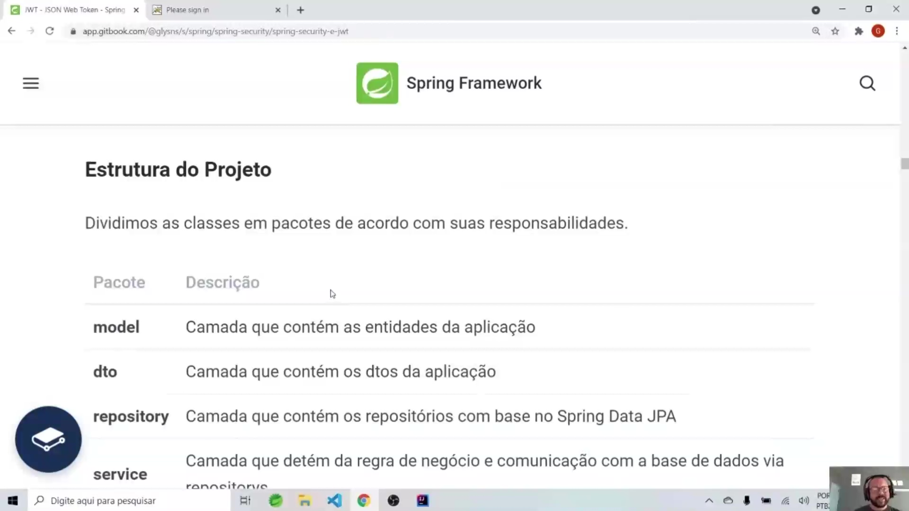
</p>

Seguindo as boas práticas de desenvolvimento, a aplicação é organizada em camadas através de pacotes específicos. Cada pacote possui uma responsabilidade clara dentro da arquitetura do projeto:

| Pacote | Descrição |
| --- | --- |
| **model** | Camada que contém as entidades da aplicação. |
| **dto** | Camada que contém os DTOs (Data Transfer Objects) da aplicação. |
| **repository** | Camada que contém os repositórios com base no Spring Data JPA. |
| **service** | Camada que detém a regra de negócio e comunicação com a base de dados via repository. |

<p align="center">
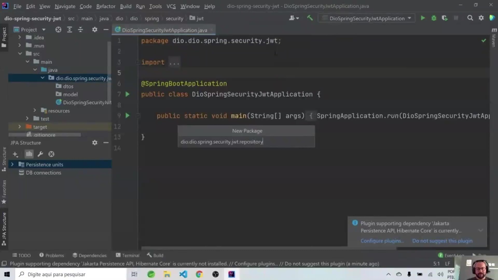
</p>

A criação dos pacotes é realizada dentro da estrutura de pastas do Java (`src/main/java/dio.dio.spring.security.jwt`). Este processo de organização inicial garante que, à medida que novas classes forem inseridas, a aplicação mantenha um padrão aderente aos contextos de desenvolvimento profissional.

```java
package dio.dio.spring.security.jwt;

import org.springframework.boot.SpringApplication;
import org.springframework.boot.autoconfigure.SpringBootApplication;

@SpringBootApplication
public class DioSpringSecurityJwtApplication {

    public static void main(String[] args) {
        SpringApplication.run(DioSpringSecurityJwtApplication.class, args);
    }

}
```

<p align="center">
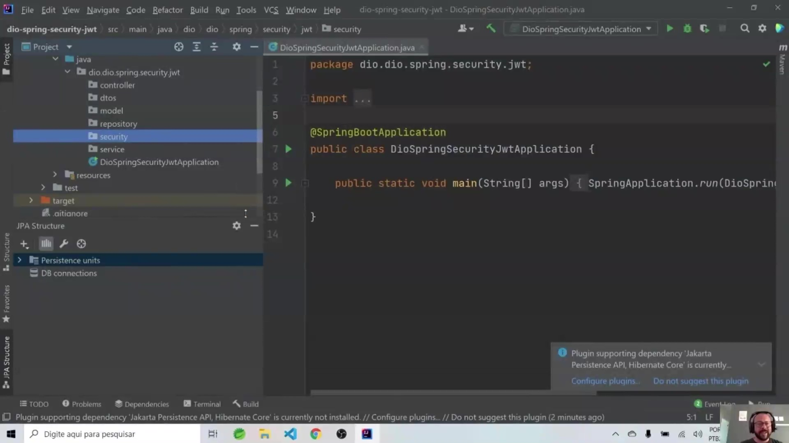
</p>

A estrutura final de pacotes após a criação manual na IDE inclui: `controller`, `dtos`, `model`, `repository`, `security` e `service`. Esta distribuição facilita a manutenção e a escalabilidade da aplicação à medida que novas funcionalidades são implementadas.

<p align="center">
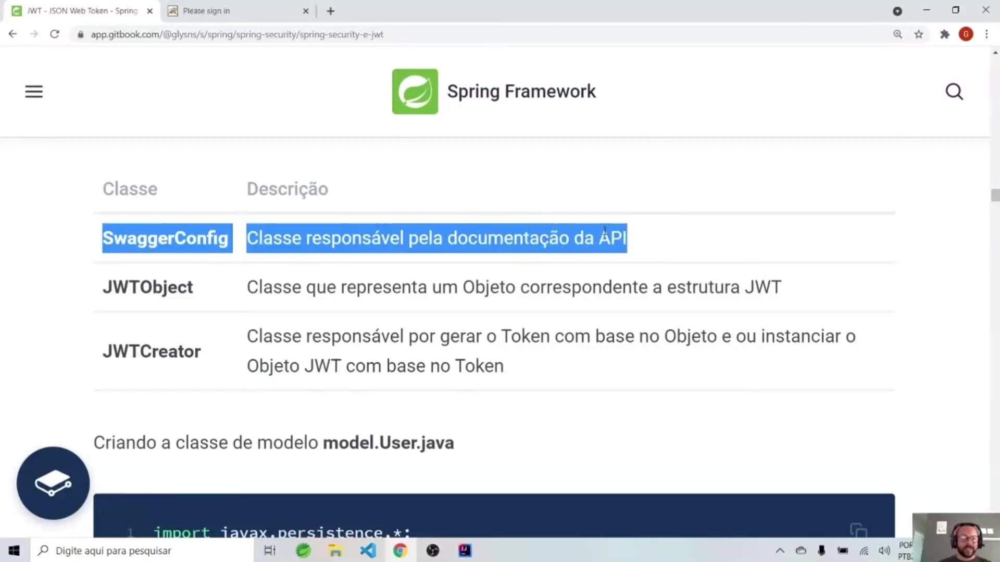
</p>

Para lidar com a segurança baseada em tokens, definimos classes de suporte que auxiliam na documentação e na representação da estrutura do JWT:

| Classe | Descrição |
| --- | --- |
| **SwaggerConfig** | Classe responsável pela documentação da API. |
| **JWTObject** | Classe que representa um Objeto correspondente à estrutura JWT. |
| **JWTCreator** | Classe responsável por gerar o Token com base no Objeto e ou instanciar o Objeto JWT com base no Token. |

<p align="center">
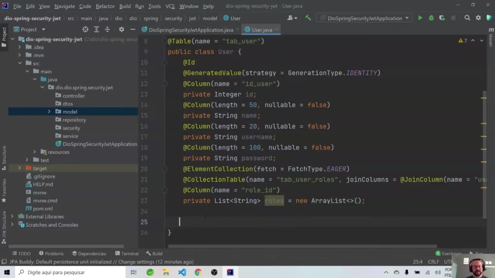
</p>

Iniciamos a implementação da camada de modelo com a classe `User.java`. Esta entidade JPA define a estrutura da tabela `tab_user` no banco de dados, incluindo campos para identificação, nome, credenciais e uma coleção de papéis (roles) para controle de acesso.

```java
@Entity
@Table(name = "tab_user")
public class User {
    @Id
    @GeneratedValue(strategy = GenerationType.IDENTITY)
    @Column(name = "id_user")
    private Integer id;

    @Column(length = 50, nullable = false)
    private String name;

    @Column(length = 20, nullable = false)
    private String username;

    @Column(length = 100, nullable = false)
    private String password;

    @ElementCollection(fetch = FetchType.EAGER)
    @CollectionTable(name = "tab_user_roles", joinColumns = @JoinColumn(name = "user_id"))
    @Column(name = "role_id")
    private List<String> roles = new ArrayList<>();

    // Getters and Setters
}
```

<p align="center">
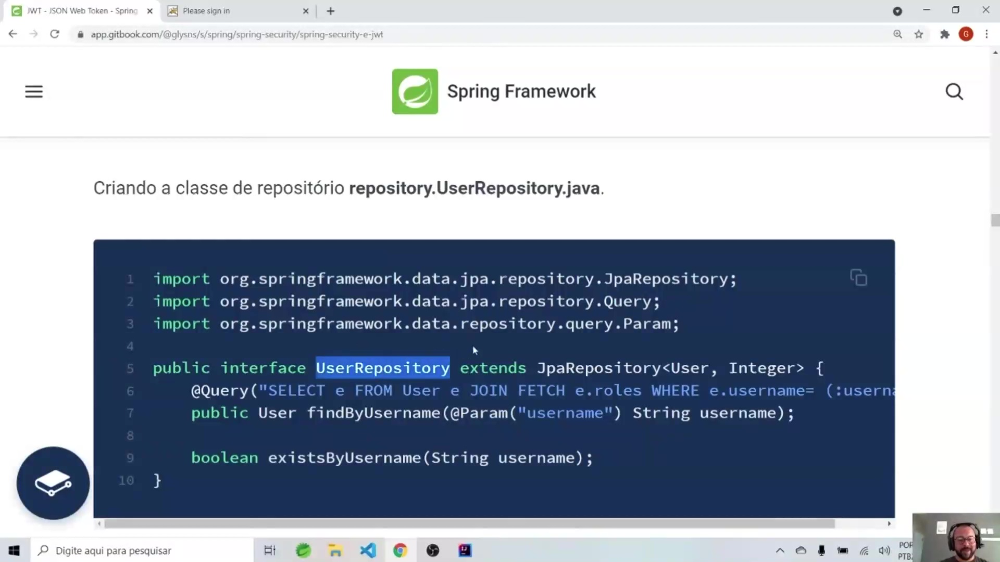
</p>

A interface `UserRepository.java` é criada estendendo `JpaRepository`. Além dos métodos CRUD padrão, adicionamos consultas personalizadas para buscar usuários pelo `username` e verificar a existência de um usuário no sistema, utilizando JPQL para garantir que as roles sejam carregadas via `JOIN FETCH`.

```java
import org.springframework.data.jpa.repository.JpaRepository;
import org.springframework.data.jpa.repository.Query;
import org.springframework.data.repository.query.Param;

public interface UserRepository extends JpaRepository<User, Integer> {
    @Query("SELECT e FROM User e JOIN FETCH e.roles WHERE e.username= (:username)")
    public User findByUsername(@Param("username") String username);

    boolean existsByUsername(String username);
}
```

<p align="center">
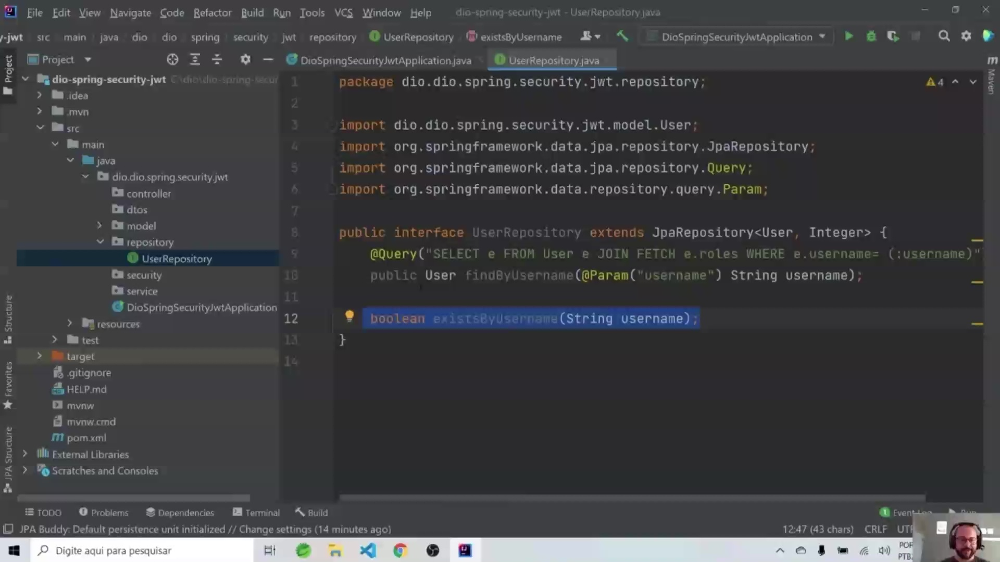
</p>

Visualização da interface `UserRepository` integrada à estrutura do projeto no IntelliJ IDEA. O código destaca a utilização das anotações do Spring Data JPA para definir o contrato de persistência da entidade `User`.

<p align="center">
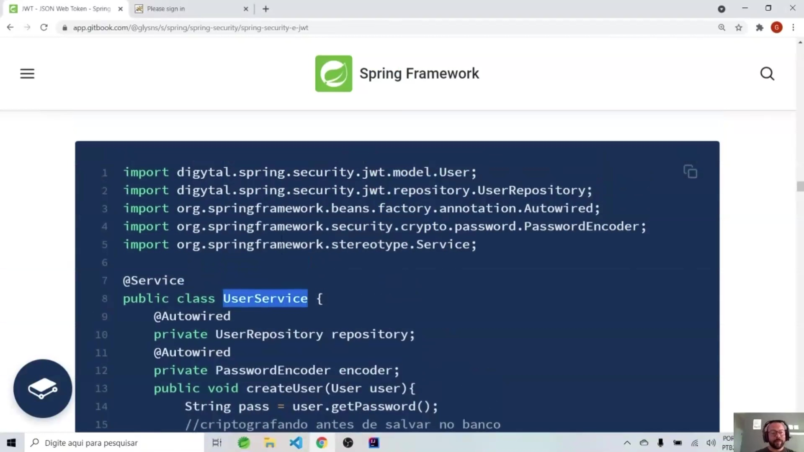
</p>

A classe `UserService.java` é implementada para concentrar as regras de negócio. Ela possui dependências do `UserRepository` para persistência e do `PasswordEncoder` para garantir a segurança das credenciais. O método `createUser` intercepta a senha em texto puro, criptografa-a e então solicita o salvamento do usuário.

```java
@Service
public class UserService {
    @Autowired
    private UserRepository repository;

    @Autowired
    private PasswordEncoder encoder;

    public void createUser(User user) {
        String pass = user.getPassword();
        // Criptografando antes de salvar no banco
        user.setPassword(encoder.encode(pass));
        repository.save(user);
    }
}
```

<p align="center">
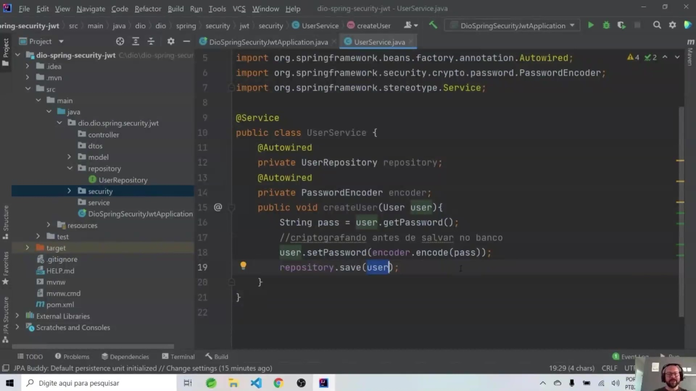
</p>

Demonstração final do método `createUser` dentro da IDE. O foco desta implementação é garantir que as senhas nunca sejam armazenadas de forma explícita no banco de dados, utilizando o mecanismo de codificação do framework para validar a coerência das senhas em requisições futuras.      


### 🟩 Vídeo 08 - JWT - JSON Web Token - Parte 3

<video width="60%" controls>
  <source src="000-Midia_e_Anexos/bootcamp_tqi_fullstack-modulo.07-curso.04-video_08.webm" type="video/webm">
    Seu navegador não suporta vídeo HTML5.
</video>

link do vídeo: https://web.dio.me/track/tqi-fullstack-developer/course/adicionando-seguranca-a-uma-api-rest-com-spring-security/learning/2a204035-6b86-48ad-ab5f-b9c46fb9b244?autoplay=1

Este guia resume o processo de configuração de autenticação e autorização em uma aplicação Java com Spring Boot, focando na criação de tokens JWT, filtros de interceptação e regras de acesso.

### Anotações

<p align="center">
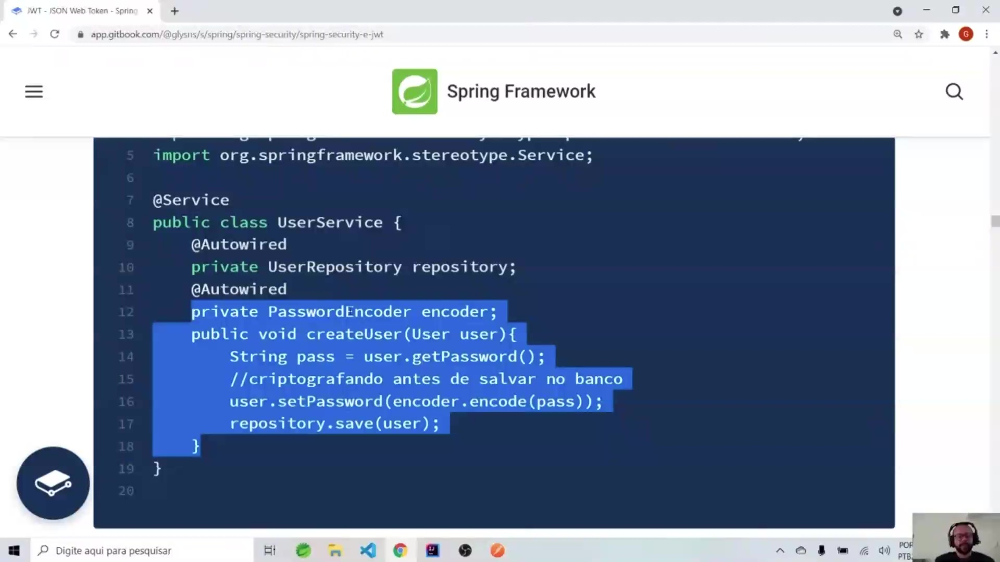
</p>

A classe `UserService` é responsável pela lógica de negócio na criação de novos usuários. Para garantir a segurança das credenciais, utiliza-se a interface `PasswordEncoder`, que realiza a criptografia da senha antes que o objeto seja persistido no banco de dados através do `UserRepository`.

```java
@Service
public class UserService {
    @Autowired
    private UserRepository repository;
    @Autowired
    private PasswordEncoder encoder;

    public void createUser(User user) {
        String pass = user.getPassword();
        //criptografando antes de salvar no banco
        user.setPassword(encoder.encode(pass));
        repository.save(user);
    }
}
```

<p align="center">
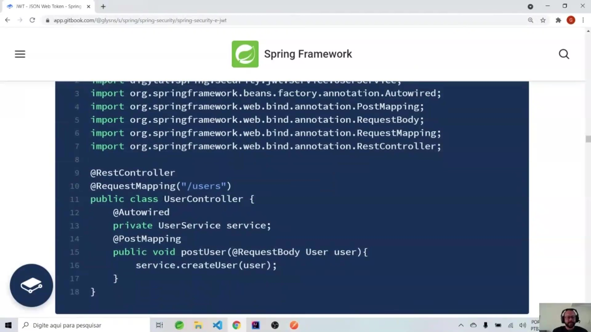
</p>

O `UserController` atua como o ponto de entrada para requisições HTTP relacionadas a usuários. Ele é mapeado com o prefixo `/users` e possui um método `postUser` anotado com `@PostMapping`, que recebe um objeto `User` no corpo da requisição e delega a criação ao `UserService`.

```java
@RestController
@RequestMapping("/users")
public class UserController {
    @Autowired
    private UserService service;

    @PostMapping
    public void postUser(@RequestBody User user) {
        service.createUser(user);
    }
}
```

<p align="center">
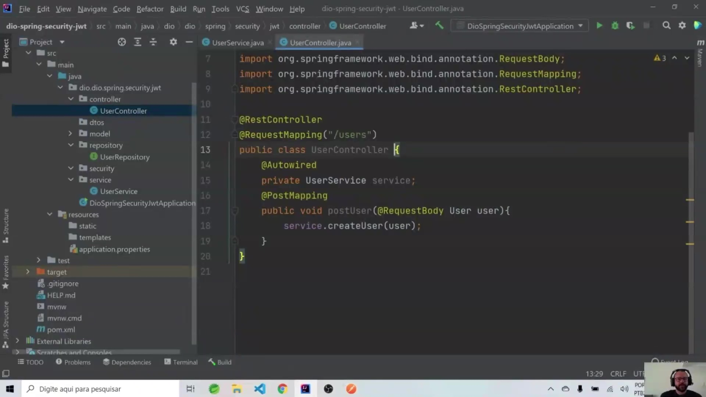
</p>

Visualização da estrutura do projeto no ambiente de desenvolvimento (IDE), evidenciando a organização dos pacotes em camadas: `controller`, `dtos`, `model`, `repository`, `security` e `service`. Esta arquitetura facilita a manutenção e a separação de responsabilidades no ecossistema Spring Boot.

<p align="center">
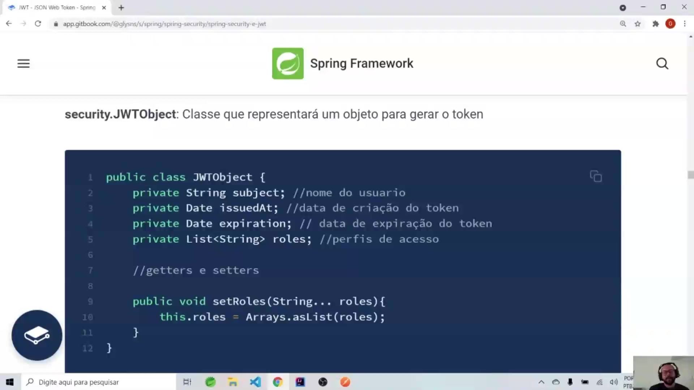
</p>

A classe `JWTObject` define a estrutura de dados que será encapsulada no token JWT. Ela contém campos fundamentais como o `subject` (identificador do usuário), as datas de emissão (`issuedAt`) e expiração (`expiration`), além de uma lista de permissões ou perfis de acesso (`roles`).

```java
public class JWTObject {
    private String subject; //nome do usuario
    private Date issuedAt; //data de criação do token
    private Date expiration; // data de expiração do token
    private List<String> roles; //perfis de acesso

    public void setRoles(String... roles) {
        this.roles = Arrays.asList(roles);
    }
}
```

<p align="center">
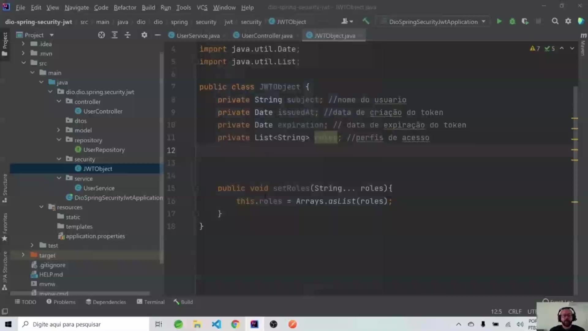
</p>

Implementação técnica do `JWTObject` no pacote `security`. Esta classe servirá de base para que o mecanismo de segurança possa converter objetos Java em tokens criptografados e realizar o processo inverso durante a validação de acesso.

<p align="center">
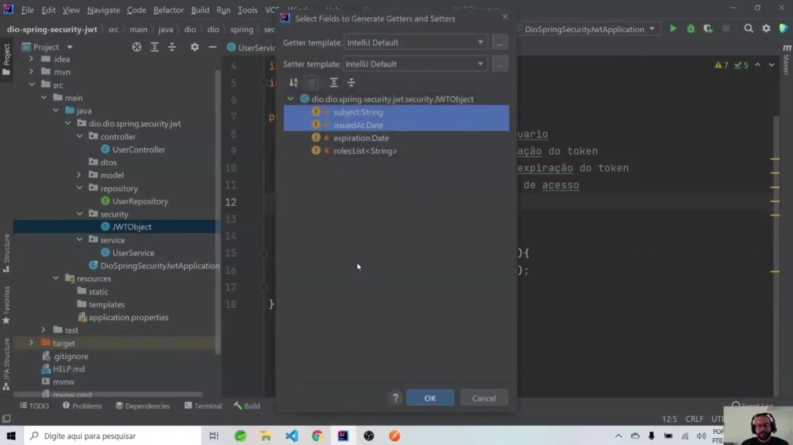
</p>

Utilização de recursos de automação da IDE para a geração de métodos acessores (Getters e Setters) na classe `JWTObject`. Esta etapa é padrão em classes de modelo ou objetos de transferência para permitir o acesso controlado aos atributos privados.

<p align="center">
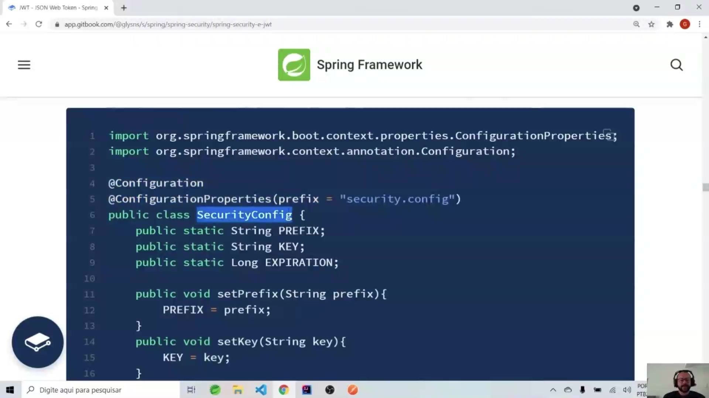
</p>

A classe `SecurityConfig` utiliza a anotação `@ConfigurationProperties` para mapear configurações definidas externamente para variáveis estáticas. Atributos como o prefixo do token (`Bearer`), a chave secreta de criptografia e o tempo de expiração são centralizados aqui para facilitar a gestão da segurança.

```java
@Configuration
@ConfigurationProperties(prefix = "security.config")
public class SecurityConfig {
    public static String PREFIX;
    public static String KEY;
    public static Long EXPIRATION;

    public void setPrefix(String prefix) {
        PREFIX = prefix;
    }
}
```

<p align="center">
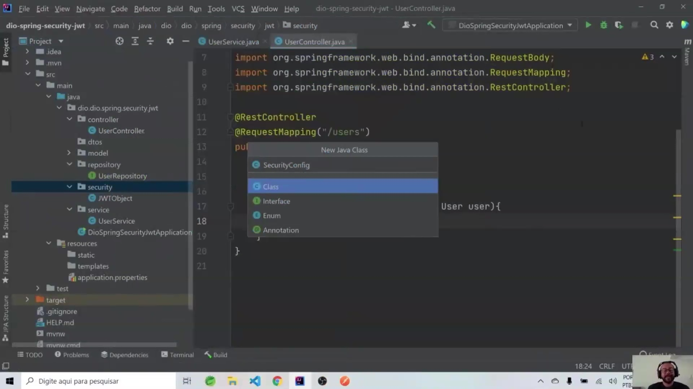
</p>

Criação da classe de configuração no diretório de segurança do projeto. Este componente é essencial para desacoplar as chaves de segurança do código-fonte, permitindo que as credenciais variem conforme o ambiente (desenvolvimento, produção, etc.).

<p align="center">
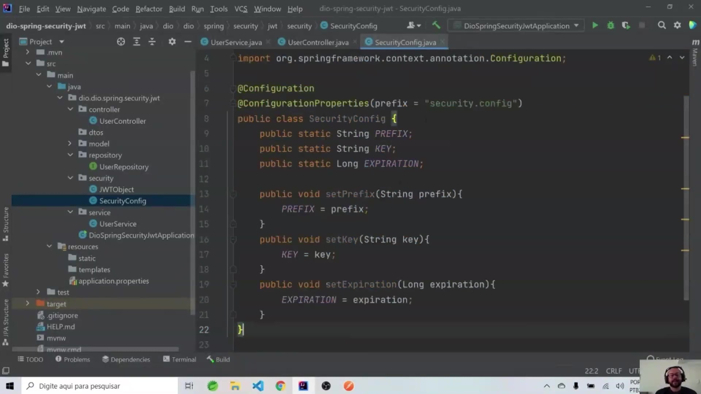
</p>

Implementação completa da `SecurityConfig`, apresentando os métodos `set` necessários para que o Spring injete os valores lidos do arquivo de propriedades. O uso de campos estáticos permite que estas configurações sejam acessadas de forma global por outros componentes do JWT.

<p align="center">
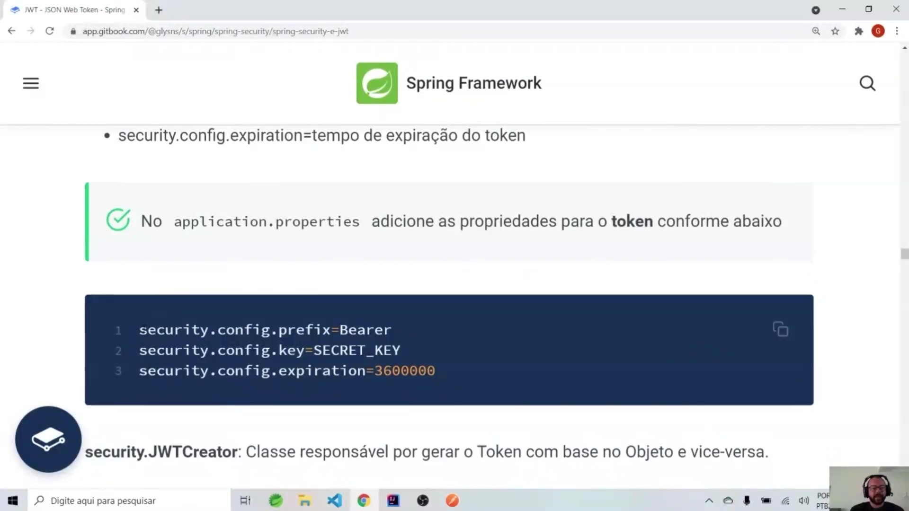
</p>

Documentação de referência para o preenchimento do arquivo `application.properties`. Nele, devem ser definidas as chaves `security.config.prefix`, `security.config.key` e `security.config.expiration`, que alimentam a classe de configuração criada anteriormente.

<p align="center">
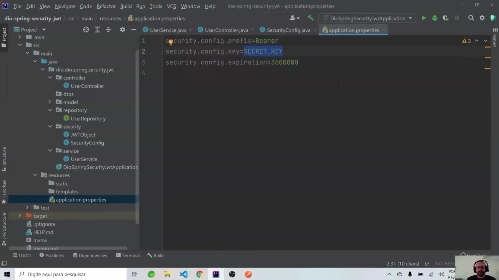
</p>

Introdução da classe `JWTCreator`. Este recurso centraliza a lógica de interação entre o Spring Security e a especificação JWT, sendo encarregado de assinar novos tokens e validar a integridade de tokens recebidos em requisições futuras.

<p align="center">
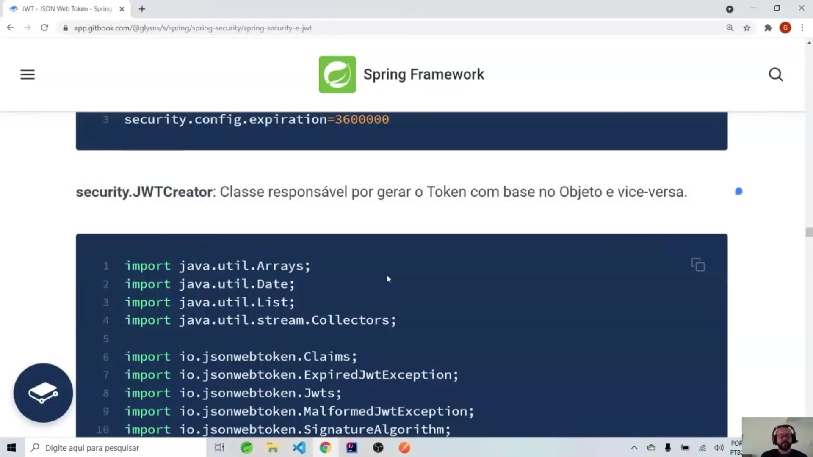
</p>

A implementação do `JWTCreator` demonstra o uso da biblioteca JJWT para construir o token. O método `create` utiliza o padrão *builder* para definir o assunto, datas e roles, assinando o conjunto com um algoritmo de criptografia (como HS512) e a chave privada configurada.

```java
public class JWTCreator {
    public static final String HEADER_AUTHORIZATION = "Authorization";
    public static final String ROLES_AUTHORITIES = "authorities";

    public static String create(String prefix, String key, JWTObject jwtObject) {
        String token = Jwts.builder()
                .setSubject(jwtObject.getSubject())
                .setIssuedAt(jwtObject.getIssuedAt())
                .setExpiration(jwtObject.getExpiration())
                .claim(ROLES_AUTHORITIES, checkRoles(jwtObject.getRoles()))
                .signWith(SignatureAlgorithm.HS512, key)
                .compact();
        return prefix + " " + token;
    }
}
```

<p align="center">
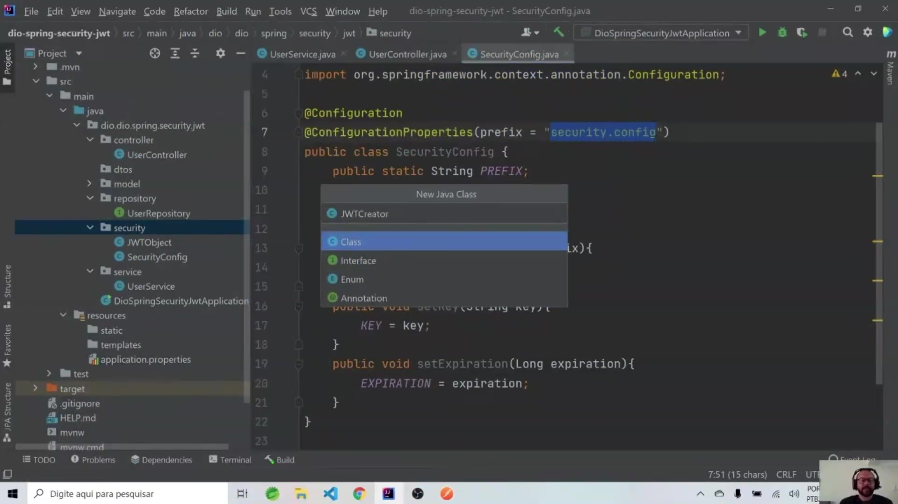
</p>

A classe `JWTFilter` estende `OncePerRequestFilter` para garantir que a lógica de segurança seja aplicada exatamente uma vez por requisição HTTP. Ela atua como um interceptador que verifica a presença do token no cabeçalho antes que a requisição chegue ao controller.

<p align="center">
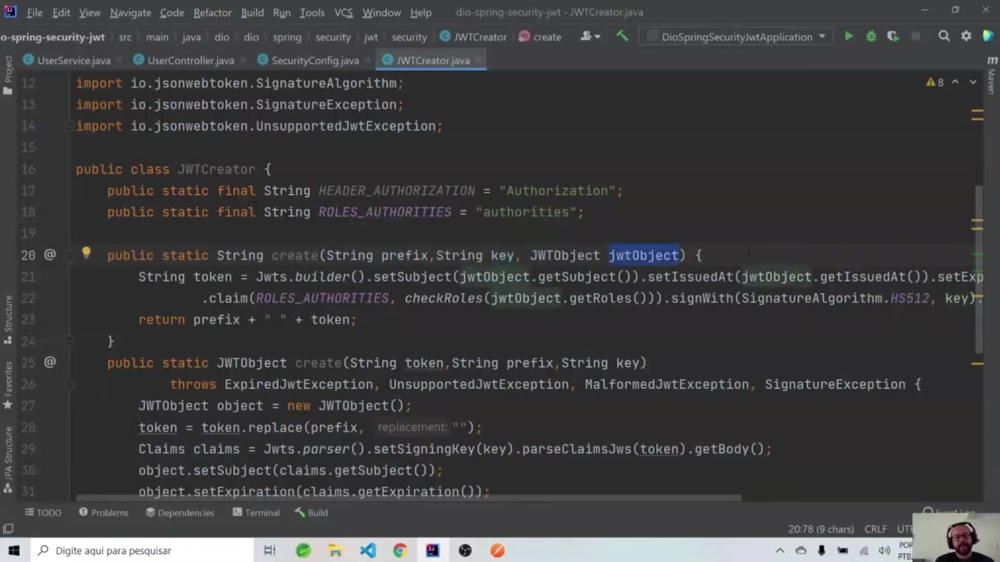
</p>

O método `doFilterInternal` extrai o token do cabeçalho `Authorization`. Se válido, ele reconstrói as permissões do usuário e as insere no contexto de segurança do Spring (`SecurityContextHolder`), permitindo que a aplicação reconheça o usuário autenticado.

```java
public class JWTFilter extends OncePerRequestFilter {
    @Override
    protected void doFilterInternal(HttpServletRequest request, HttpServletResponse response, FilterChain filterChain)
            throws ServletException, IOException {
        String token = request.getHeader(JWTCreator.HEADER_AUTHORIZATION);
        try {
            if (token != null && !token.isEmpty()) {
                JWTObject tokenObject = JWTCreator.parse(token, SecurityConfig.PREFIX, SecurityConfig.KEY);
                List<SimpleGrantedAuthority> authorities = authorities(tokenObject.getRoles());
                UsernamePasswordAuthenticationToken userToken = 
                        new UsernamePasswordAuthenticationToken(tokenObject.getSubject(), null, authorities);
                SecurityContextHolder.getContext().setAuthentication(userToken);
            } else {
                SecurityContextHolder.clearContext();
            }
            filterChain.doFilter(request, response);
        } catch (Exception e) {
            response.setStatus(HttpStatus.FORBIDDEN.value());
            return;
        }
    }
}
```

<p align="center">
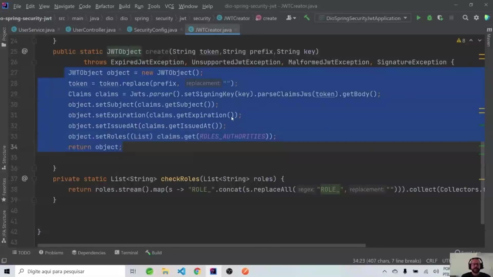
</p>

Criação da classe `WebSecurityConfig`, que substitui a configuração de segurança padrão do Spring Framework. Este é o local onde serão definidas as regras de autorização de rotas e a integração de filtros personalizados como o `JWTFilter`.

<p align="center">
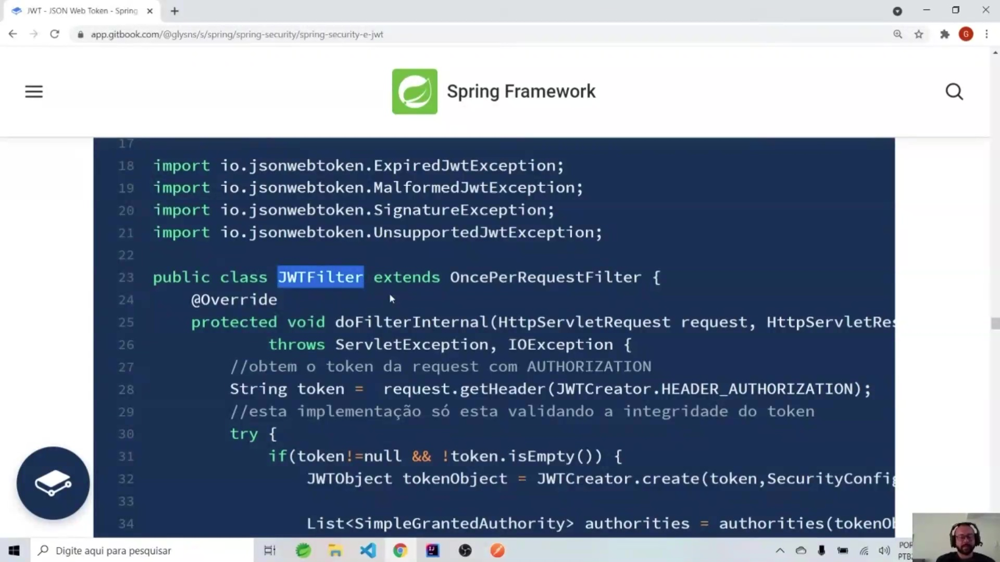
</p>

Configuração inicial da `WebSecurityConfig` utilizando as anotações `@EnableWebSecurity` e `@EnableGlobalMethodSecurity`. Estas habilitam as funcionalidades de segurança da web e permitem o uso de anotações de pré-verificação nos métodos de serviço ou controllers.

<p align="center">
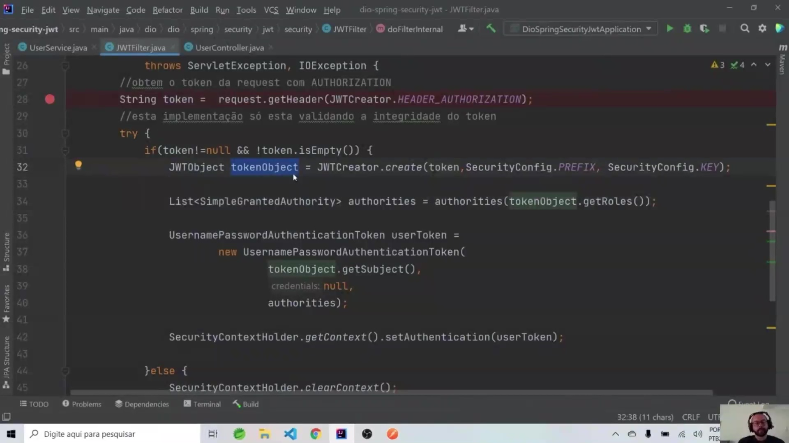
</p>

Definição de um `@Bean` para o `BCryptPasswordEncoder`. Ao expor este componente como um bean do Spring, ele torna-se disponível para injeção de dependência em toda a aplicação, garantindo que o mesmo algoritmo de hash seja usado para criar e validar senhas.

<p align="center">
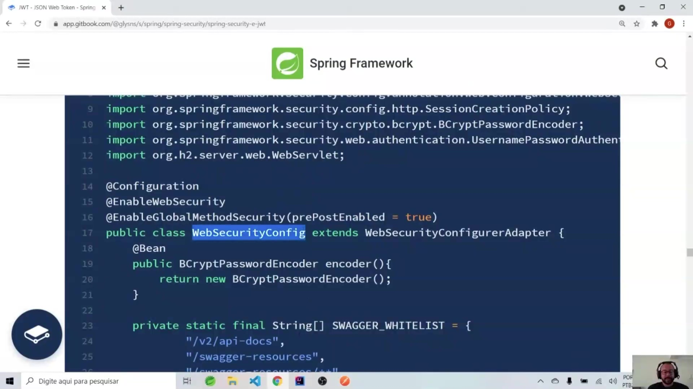
</p>

No método `configure(HttpSecurity http)`, definem-se as rotas públicas (como Swagger, console H2 e endpoints de login/cadastro) que não exigem autenticação. Além disso, configura-se a política de sessão como `STATELESS`, adequada para arquiteturas que utilizam tokens JWT.

```java
@Override
protected void configure(HttpSecurity http) throws Exception {
    http.headers().frameOptions().disable();
    http.cors().and().csrf().disable()
        .addFilterAfter(new JWTFilter(), UsernamePasswordAuthenticationFilter.class)
        .authorizeRequests()
        .antMatchers("/swagger-ui/**", "/v3/api-docs/**").permitAll()
        .antMatchers("/h2-console/**").permitAll()
        .antMatchers(HttpMethod.POST, "/login").permitAll()
        .antMatchers(HttpMethod.POST, "/users").permitAll()
        .anyRequest().authenticated()
        .and()
        .sessionManagement().sessionCreationPolicy(SessionCreationPolicy.STATELESS);
}
```

<p align="center">
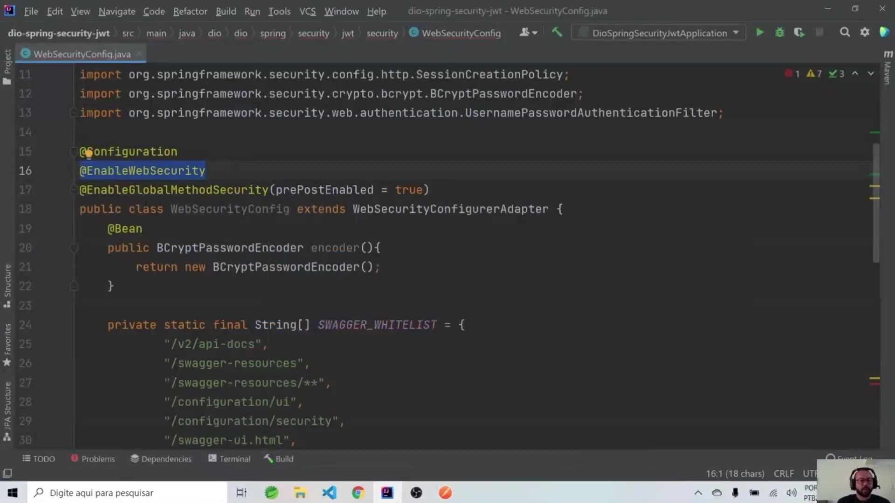
</p>

Configuração adicional para o console do banco de dados H2. Através do `ServletRegistrationBean`, habilita-se o acesso ao console via navegador, permitindo a inspeção de dados durante o desenvolvimento sem a necessidade de credenciais de segurança complexas para esta interface específica.

<p align="center">
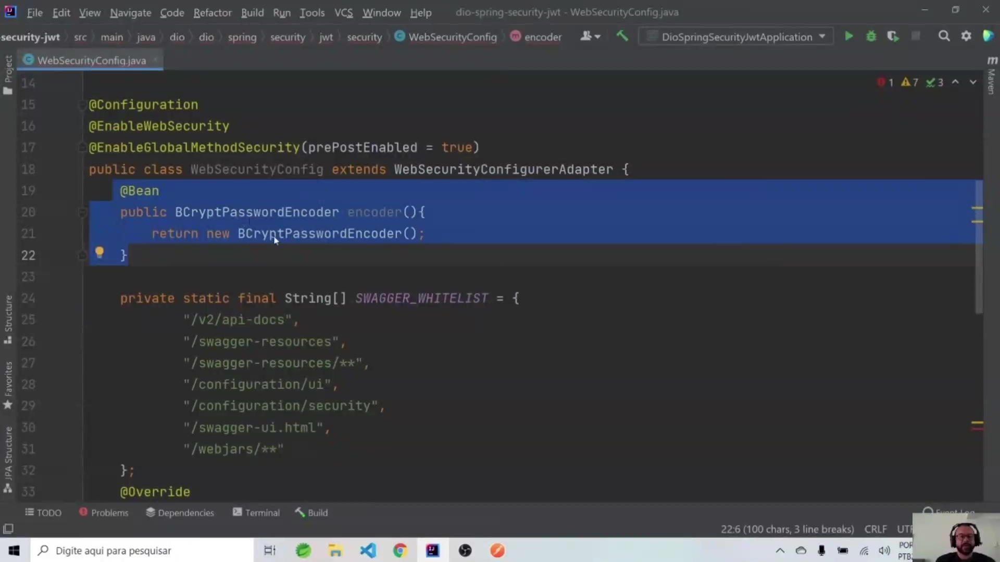
</p>

Exemplo de um erro comum de compilação ao tentar importar a classe `WebServlet` do H2. Isso ocorre frequentemente quando a dependência está configurada com escopo apenas de execução, impedindo que a IDE a localize durante a fase de desenvolvimento.

<p align="center">
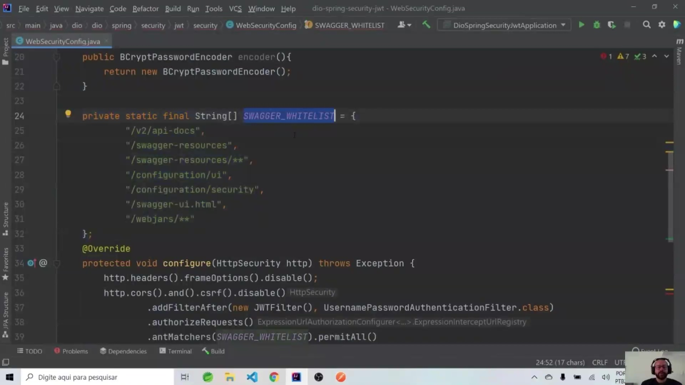
</p>

Identificação da causa do erro no arquivo `pom.xml`. A dependência do banco de dados H2 está marcada com `<scope>runtime</scope>`, o que restringe sua disponibilidade apenas para o momento em que a aplicação está rodando.

<p align="center">
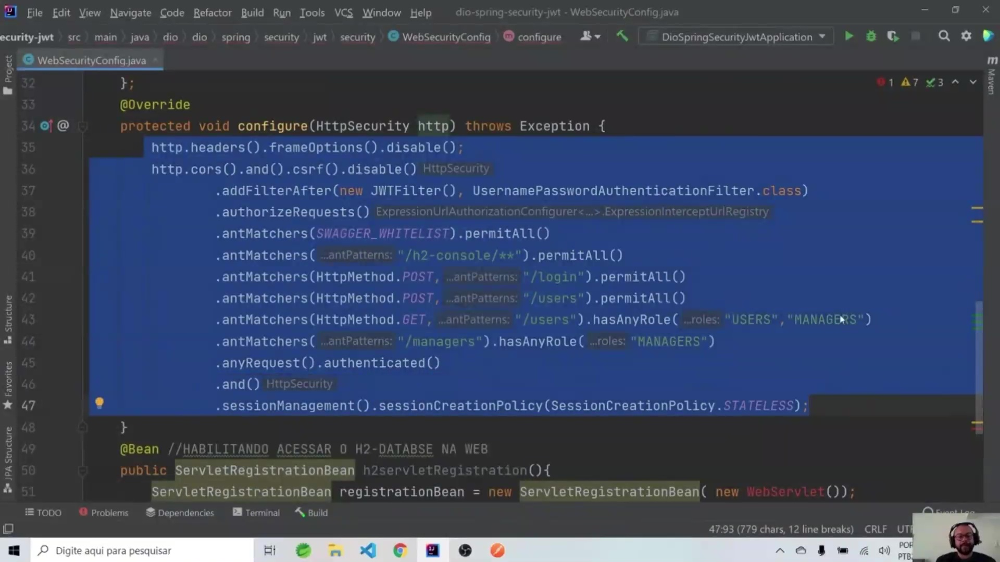
</p>

Solução do problema de importação através da remoção da tag `<scope>runtime</scope>` na dependência do H2. Com essa alteração, a biblioteca torna-se disponível para compilação, permitindo que as classes de configuração do console sejam reconhecidas.

<p align="center">
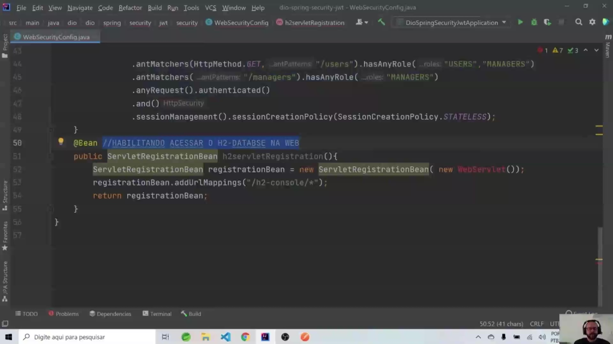
</p>

Confirmação do sucesso na importação após a atualização das dependências do Maven. O erro desaparece, validando a integração correta do console H2 nas configurações de segurança da aplicação.

<p align="center">
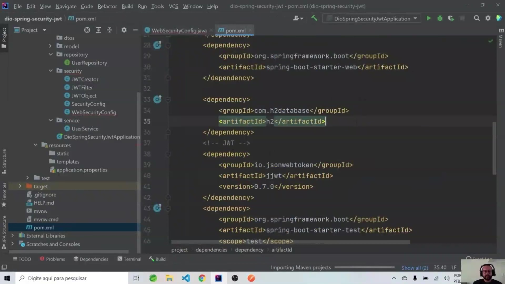
</p>

Estado final da estrutura de arquivos após a implementação de todos os componentes de segurança e JWT. O projeto está devidamente configurado e pronto para os testes de cadastro e autenticação de usuários via API.     


### 🟩 Vídeo 09 - JWT - JSON Web Token - Parte 4

<video width="60%" controls>
  <source src="000-Midia_e_Anexos/bootcamp_tqi_fullstack-modulo.07-curso.04-video_09.webm" type="video/webm">
    Seu navegador não suporta vídeo HTML5.
</video>

link do vídeo: https://web.dio.me/track/tqi-fullstack-developer/course/adicionando-seguranca-a-uma-api-rest-com-spring-security/learning/ba854725-76d4-4ffc-8890-a31acca94a8e?autoplay=1


## Parte 3 - Conclusão e para saber mais

### 🟩 Vídeo 10 - Conclusão e para saber mais

<video width="60%" controls>
  <source src="000-Midia_e_Anexos/bootcamp_tqi_fullstack-modulo.07-curso.04-video_10.webm" type="video/webm">
    Seu navegador não suporta vídeo HTML5.
</video>

link do vídeo:

##  Materiais de Apoio

# Certificado: 

- Link na plataforma: 
- Certificado em pdf: