## Instrutor

- Rodrigo D'Agostini Peleias (Tech Lead | Staff Software Engineer | Senior Software Engineer | Backend | Java | Spring Boot | 3x AWS Certified)
- Contato Linkedin: / [rodrigopeleias](https://www.linkedin.com/in/rodrigopeleias/)

## Parte 1 - Testes Unitários e Qualidade de Software

### 🟩 Vídeo 01 - Como usar os desafios de projetos para criar seu portfólio

<video width="60%" controls>
  <source src="000-Midia_e_Anexos/bootcamp_tqi_fullstack-modulo.07-curso.05-video_01.webm" type="video/webm">
    Seu navegador não suporta vídeo HTML5.
</video>

link do vídeo: https://web.dio.me/lab/desenvolvimento-de-testes-unitarios-para-validar-uma-api-rest-de-gerenciamento-estoques-de-cerveja/learning/d00f891f-65bb-4149-85f0-57d771116214?back=/track/tqi-fullstack-developer

O vídeo detalha a importância, a execução e a entrega de projetos práticos dentro da plataforma DIO, destacando como essas atividades aceleram a carreira de um desenvolvedor através da criação de um portfólio sólido e da participação em um ecossistema gamificado.
 

### 🟩 Vídeo 02 - Objetivos do curso e apresentação do repositório no GitHub

<video width="60%" controls>
  <source src="000-Midia_e_Anexos/bootcamp_tqi_fullstack-modulo.07-curso.05-video_02.webm" type="video/webm">
    Seu navegador não suporta vídeo HTML5.
</video>

link do vídeo: https://web.dio.me/lab/desenvolvimento-de-testes-unitarios-para-validar-uma-api-rest-de-gerenciamento-estoques-de-cerveja/learning/a28d07c7-0d18-4986-bd96-d448d7ec05ba

Este guia resume a aula sobre a pirâmide de testes de software, com foco especial em testes unitários, frameworks essenciais do ecossistema Java e a configuração de um ambiente de desenvolvimento moderno para a criação de uma API de Cervejas (Beer API).

### Anotações

#### Objetivos da Aula

<p align="center">

</p>

Nesta etapa inicial, são estabelecidos os fundamentos da aula, focando na estruturação e na qualidade do desenvolvimento de software através de testes. O conteúdo programático está dividido em quatro pilares principais:

* **Pirâmide de Testes:** Apresentação e detalhamento dos níveis de teste, abrangendo testes unitários, integrados e ponta a ponta.
* **Testes Unitários:** Discussão sobre a relevância desses testes durante o ciclo de desenvolvimento, destacando como eles garantem a qualidade do código e auxiliam na documentação do projeto.
* **Frameworks de Referência:** Introdução às ferramentas que serão utilizadas no ecossistema Java, especificamente JUnit, Mockito e Hamcrest.
* **Prática:** Sessão de codificação colaborativa para aplicar os conceitos aprendidos e compartilhar o conhecimento.

#### Stack Tecnológica

<p align="center">

</p>

Para a execução do projeto e das atividades de live coding, será utilizada uma stack tecnológica moderna e padronizada para o desenvolvimento Java. As ferramentas e versões definidas são:

* **Linguagem:** Java 14.
* **Gerenciador de Dependências:** Maven 3.6.3.
* **Framework Base:** Spring Boot, utilizando a última versão estável lançada.
* **Versionamento:** GIT e GitHub para o controle de versão do código.
* **Testes:** Frameworks JUnit, Mockito e Hamcrest.

#### Repositório e Ferramentas

<p align="center">
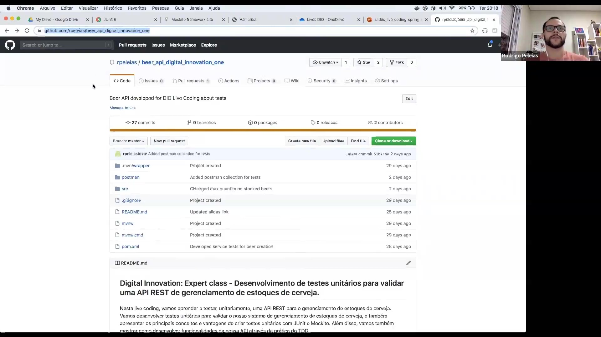
</p>

O projeto prático consiste em uma **Beer API**, desenvolvida para o gerenciamento de estoques de cerveja e hospedada no GitHub. O repositório centraliza não apenas o código-fonte, mas também guias de execução e referências importantes para o desenvolvedor.

A estrutura do projeto inclui:

* **Desenvolvimento de Testes:** Foco em testes unitários para validar a API REST e a prática de TDD (Test Driven Development).
* **Arquivos do Projeto:** Presença de arquivos essenciais como o `pom.xml` para gestão do Maven, pastas de código `src` e configurações de ignore do Git.
* **Suporte a Testes:** Inclusão de uma coleção do Postman para facilitar a validação das rotas da API.
* **Histórico:** O repositório conta com diversos commits detalhando desde a criação do projeto até o desenvolvimento de serviços específicos para a criação de cervejas.

Link do repositório: https://github.com/rpeleias-v1/beer_api_digital_innovation_one

### 🟩 Vídeo 03 - Apresentação do Projeto no IntelliJ

<video width="60%" controls>
  <source src="000-Midia_e_Anexos/bootcamp_tqi_fullstack-modulo.07-curso.05-video_03.webm" type="video/webm">
    Seu navegador não suporta vídeo HTML5.
</video>

link do vídeo: https://web.dio.me/lab/desenvolvimento-de-testes-unitarios-para-validar-uma-api-rest-de-gerenciamento-estoques-de-cerveja/learning/f1ea7b4a-ddb4-406c-8951-b391763b8a01

O projeto BeerStock é uma aplicação Java desenvolvida com o framework Spring Boot, focada no gerenciamento de estoque de cervejas. A aplicação segue os padrões modernos de desenvolvimento web, utilizando uma arquitetura em camadas e diversas bibliotecas para aumentar a produtividade e garantir a qualidade do código.

### Anotações

<p align="center">
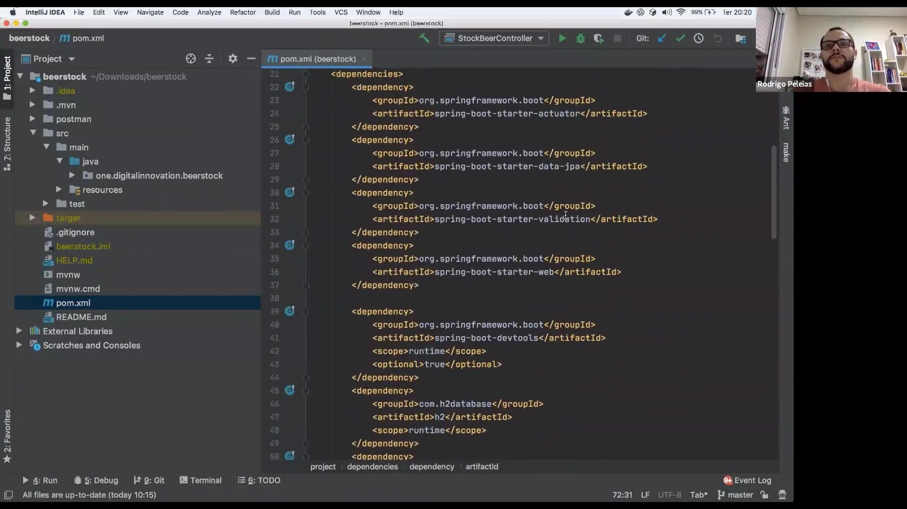
</p>

O ponto de partida do projeto **Beer Stock** é o arquivo `pom.xml`, onde são definidas as dependências necessárias para o funcionamento da aplicação Spring Boot. Entre as principais tecnologias integradas estão o **Spring Data JPA** para persistência, o **Bean Validation** para validação de regras de entrada, o banco de dados em memória **H2** e ferramentas de produtividade como o **Lombok** e o **MapStruct**. Além disso, o projeto inclui o **Swagger** para a geração automática da documentação da API.

```xml
<dependencies>
    <dependency>
        <groupId>org.springframework.boot</groupId>
        <artifactId>spring-boot-starter-actuator</artifactId>
    </dependency>

    <dependency>
        <groupId>org.springframework.boot</groupId>
        <artifactId>spring-boot-starter-data-jpa</artifactId>
    </dependency>

    <dependency>
        <groupId>org.springframework.boot</groupId>
        <artifactId>spring-boot-starter-validation</artifactId>
    </dependency>

    <dependency>
        <groupId>org.springframework.boot</groupId>
        <artifactId>spring-boot-starter-web</artifactId>
    </dependency>

    <dependency>
        <groupId>org.springframework.boot</groupId>
        <artifactId>spring-boot-devtools</artifactId>
        <scope>runtime</scope>
        <optional>true</optional>
    </dependency>

    <dependency>
        <groupId>com.h2database</groupId>
        <artifactId>h2</artifactId>
        <scope>runtime</scope>
    </dependency>
</dependencies>
```

<p align="center">
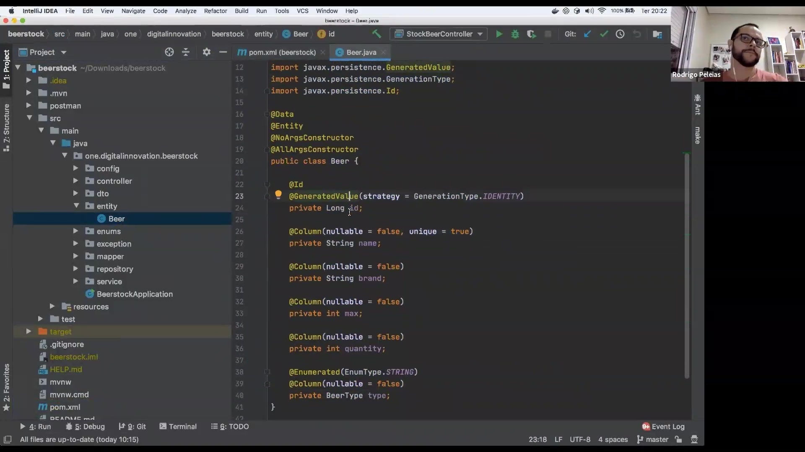
</p>

A entidade principal do sistema é a classe `Beer`. Ela utiliza anotações do **Lombok**, como `@Data`, para gerar automaticamente métodos essenciais como getters, setters, `equals` e `hashCode`, reduzindo o código repetitivo. A anotação `@Entity` marca a classe para o mapeamento objeto-relacional (ORM) via JPA, definindo o campo `id` como uma chave primária de autoincremento.

```java
@Data
@Entity
@NoArgsConstructor
@AllArgsConstructor
public class Beer {

    @Id
    @GeneratedValue(strategy = GenerationType.IDENTITY)
    private Long id;
```

<p align="center">
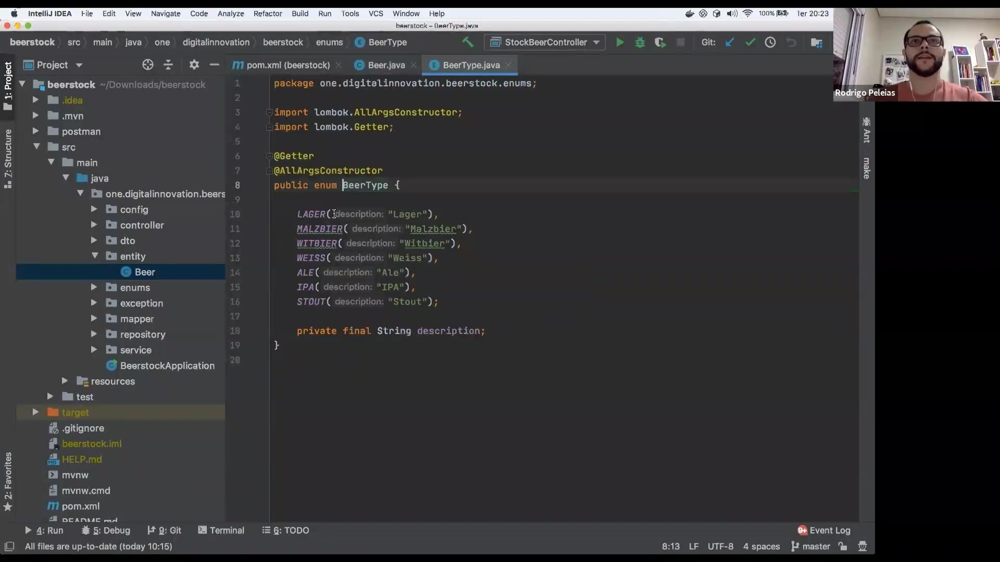
</p>

Para categorizar os produtos, foi criado o enum `BeerType`. Ele define os tipos de cerveja suportados pelo sistema (como Lager, IPA e Stout) e armazena uma descrição textual para cada um. O uso das anotações `@Getter` e `@AllArgsConstructor` do Lombok garante o acesso simplificado a essas descrições.

```java
package one.digitalinnovation.beerstock.enums;

import lombok.AllArgsConstructor;
import lombok.Getter;

@Getter
@AllArgsConstructor
public enum BeerType {

    LAGER("Lager"),
    MALZBIER("Malzbier"),
    WITBIER("Witbier"),
    WEISS("Weiss"),
    ALE("Ale"),
    IPA("IPA"),
    STOUT("Stout");

    private final String description;
}
```

<p align="center">
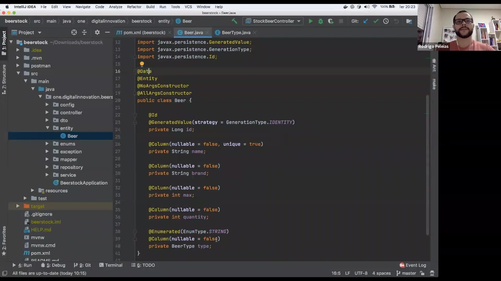
</p>

Os atributos da entidade `Beer` incluem regras de negócio específicas refletidas no banco de dados através da anotação `@Column`. O nome da cerveja deve ser único no sistema, impedindo cadastros duplicados. Outros campos como marca, quantidade atual e limite máximo de estoque são definidos como obrigatórios (`nullable = false`). O tipo da cerveja é persistido como uma string no banco de dados para facilitar a leitura.

```java
    @Column(nullable = false, unique = true)
    private String name;

    @Column(nullable = false)
    private String brand;

    @Column(nullable = false)
    private int max;

    @Column(nullable = false)
    private int quantity;

    @Enumerated(EnumType.STRING)
    @Column(nullable = false)
    private BeerType type;
}
```

<p align="center">
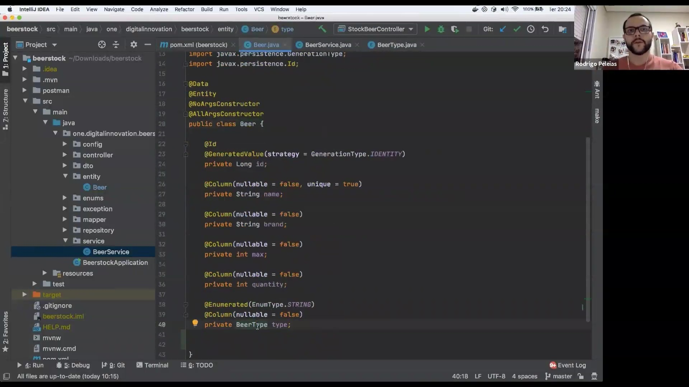
</p>

A estrutura final da entidade `Beer` consolida o mapeamento necessário para gerenciar o estoque. Através da integração entre o JPA e o Lombok, a classe permanece limpa, focando na definição dos dados e restrições enquanto as funcionalidades de infraestrutura são tratadas pelas anotações.

<p align="center">
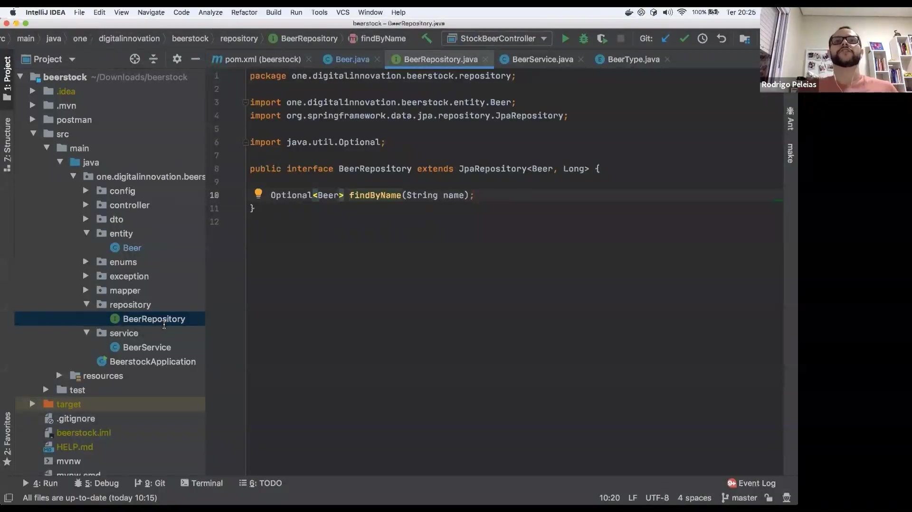
</p>

A camada de acesso a dados é representada pela interface `BeerRepository`, que estende `JpaRepository`. Essa abordagem permite herdar operações padrão de CRUD (Criar, Ler, Atualizar e Deletar) sem a necessidade de implementar manualmente os métodos. Além disso, a definição do método `findByName` demonstra o poder do Spring Data JPA, que gera automaticamente a consulta SQL necessária baseada apenas na nomenclatura do método, retornando um `Optional` para um tratamento seguro de valores nulos.

```java
package one.digitalinnovation.beerstock.repository;

import one.digitalinnovation.beerstock.entity.Beer;
import org.springframework.data.jpa.repository.JpaRepository;
import java.util.Optional;

public interface BeerRepository extends JpaRepository<Beer, Long> {

    Optional<Beer> findByName(String name);
}
```

<p align="center">
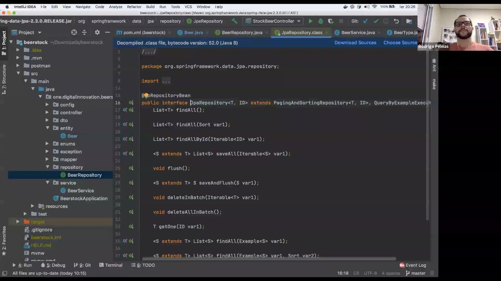
</p>

Ao analisar a interface `JpaRepository` do próprio framework Spring, observa-se que ela define um contrato robusto para manipulação de listas e entidades. Ela estende interfaces como `PagingAndSortingRepository` e `QueryByExampleExecutor`, fornecendo métodos como `findAll()`, `saveAll()` e `flush()`, que abstraem a complexidade das operações em lote e do gerenciamento de transações.

<p align="center">
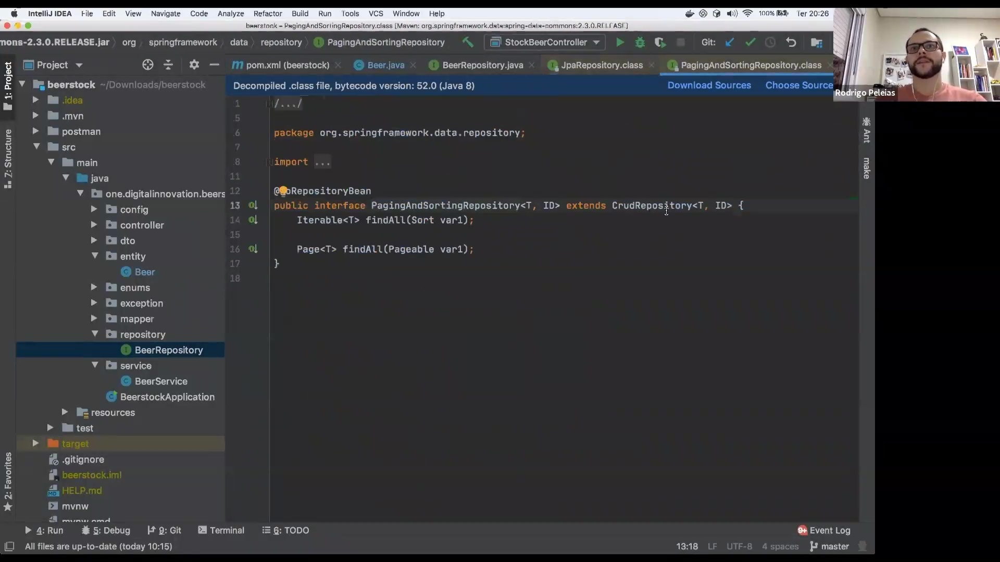
</p>

Subindo na hierarquia do Spring Data, a `PagingAndSortingRepository` introduz funcionalidades essenciais para APIs modernas: a paginação e a ordenação. Ela herda de `CrudRepository` e adiciona sobrecargas ao método `findAll` que aceitam objetos `Sort` ou `Pageable`, permitindo que a aplicação processe grandes volumes de dados de forma eficiente.

<p align="center">
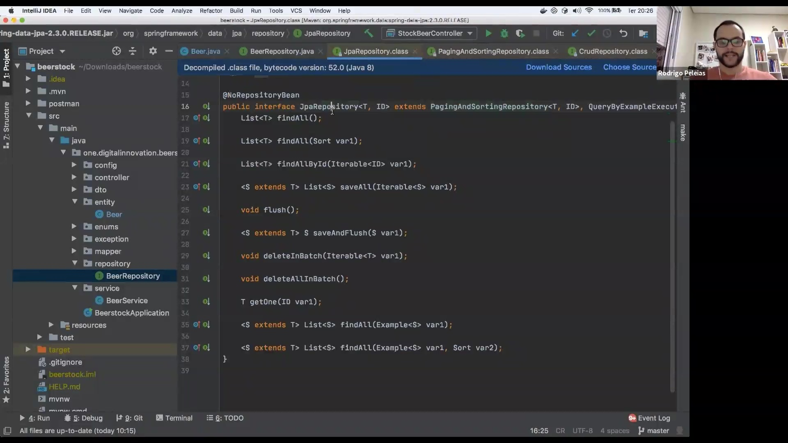
</p>

A interface `JpaRepository` serve como a base para que o desenvolvedor crie repositórios personalizados com pouco esforço. O Spring interpreta essas interfaces em tempo de execução para fornecer a implementação concreta que lidará com o banco de dados.

<p align="center">
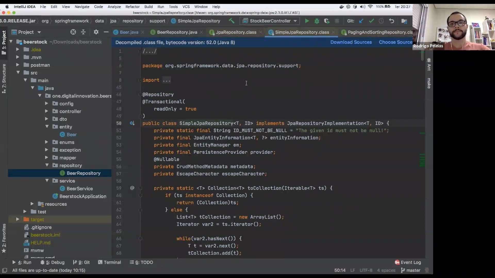
</p>

Internamente, o Spring utiliza a classe `SimpleJpaRepository` para fornecer a implementação padrão das interfaces de repositório. Ela utiliza o `EntityManager` do JPA para realizar as operações, gerenciando automaticamente as conexões e o contexto transacional (marcado com `@Transactional`), o que garante a integridade dos dados sem que o desenvolvedor precise escrever código de infraestrutura.

<p align="center">
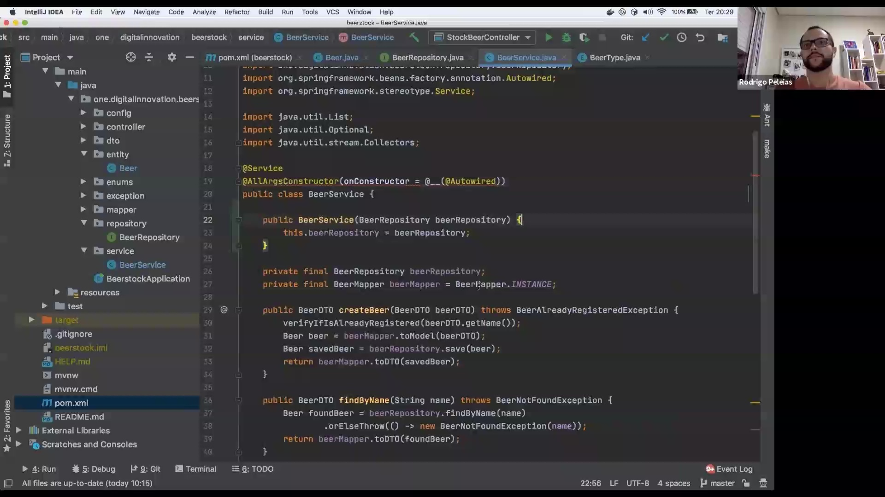
</p>

A camada `BeerService` centraliza as regras de negócio da aplicação. Anotada com `@Service`, ela é gerenciada pelo Spring para injeção de dependências. O uso de `@AllArgsConstructor(onConstructor = @__(@Autowired))` facilita a injeção do repositório e do mapper por meio do construtor. Métodos como `createBeer` e `findByName` realizam a orquestração entre a validação de existência, a conversão de DTOs (Data Transfer Objects) para entidades e a persistência final.

```java
@Service
@AllArgsConstructor(onConstructor = @__(@Autowired))
public class BeerService {

    private final BeerRepository beerRepository;
    private final BeerMapper beerMapper = BeerMapper.INSTANCE;

    public BeerDTO createBeer(BeerDTO beerDTO) throws BeerAlreadyRegisteredException {
        verifyIfAlreadyRegistered(beerDTO.getName());
        Beer beer = beerMapper.toModel(beerDTO);
        Beer savedBeer = beerRepository.save(beer);
        return beerMapper.toDTO(savedBeer);
    }

    public BeerDTO findByName(String name) throws BeerNotFoundException {
        Beer foundBeer = beerRepository.findByName(name)
                .orElseThrow(() -> new BeerNotFoundException(name));
        return beerMapper.toDTO(foundBeer);
    }
```

<p align="center">
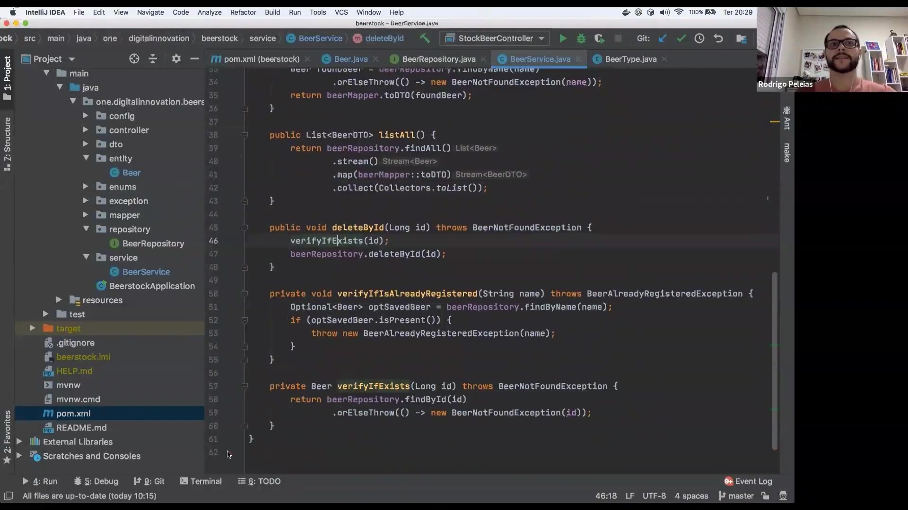
</p>

Complementando a lógica de serviço, métodos auxiliares são implementados para garantir a robustez das operações. O método `verifyIfAlreadyRegistered` impede a criação de nomes duplicados, enquanto `verifyIfExists` é utilizado antes de deleções para assegurar que o ID informado corresponde a um registro real, lançando exceções personalizadas quando as condições não são atendidas.

```java
    public List<BeerDTO> listAll() {
        return beerRepository.findAll()
                .stream()
                .map(beerMapper::toDTO)
                .collect(Collectors.toList());
    }

    public void deleteById(Long id) throws BeerNotFoundException {
        verifyIfExists(id);
        beerRepository.deleteById(id);
    }

    private void verifyIfAlreadyRegistered(String name) throws BeerAlreadyRegisteredException {
        Optional<Beer> optSavedBeer = beerRepository.findByName(name);
        if (optSavedBeer.isPresent()) {
            throw new BeerAlreadyRegisteredException(name);
        }
    }

    private Beer verifyIfExists(Long id) throws BeerNotFoundException {
        return beerRepository.findById(id)
                .orElseThrow(() -> new BeerNotFoundException(id));
    }
```

<p align="center">
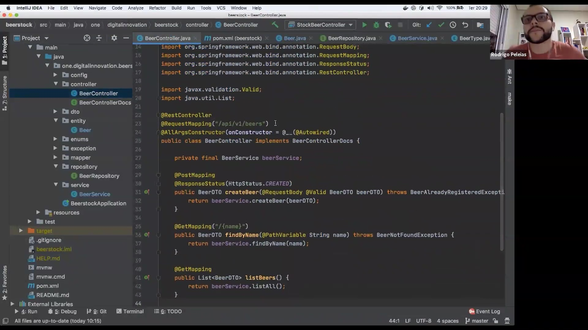
</p>

A última camada é o `BeerController`, que expõe os endpoints da API REST. Utilizando `@RestController` e `@RequestMapping("/api/v1/beers")`, ele define a rota base e o formato de troca de dados (JSON). Os verbos HTTP são mapeados para os métodos do serviço: `@PostMapping` para criação, `@GetMapping` para buscas e listagens, e `@DeleteMapping` para remoção. A validação das entradas é feita através da anotação `@Valid` no corpo das requisições.

```java
@RestController
@RequestMapping("/api/v1/beers")
@AllArgsConstructor(onConstructor = @__(@Autowired))
public class BeerController implements BeerControllerDocs {

    private final BeerService beerService;

    @PostMapping
    @ResponseStatus(HttpStatus.CREATED)
    public BeerDTO createBeer(@RequestBody @Valid BeerDTO beerDTO) throws BeerAlreadyRegisteredException {
        return beerService.createBeer(beerDTO);
    }

    @GetMapping("/{name}")
    public BeerDTO findByName(@PathVariable String name) throws BeerNotFoundException {
        return beerService.findByName(name);
    }

    @GetMapping
    public List<BeerDTO> listBeers() {
        return beerService.listAll();
    }
}
```      

### 🟩 Vídeo 04 - Introdução ao estilo arquitetural REST

<video width="60%" controls>
  <source src="000-Midia_e_Anexos/bootcamp_tqi_fullstack-modulo.07-curso.05-video_04.webm" type="video/webm">
    Seu navegador não suporta vídeo HTML5.
</video>

link do vídeo: https://web.dio.me/lab/desenvolvimento-de-testes-unitarios-para-validar-uma-api-rest-de-gerenciamento-estoques-de-cerveja/learning/8bc8324c-0e6d-4c44-bbc0-ee0444f6b42d

O vídeo descreve a transição dos protocolos de integração, o funcionamento dos verbos HTTP e os níveis de maturidade que definem uma API verdadeiramente RESTful.

### Anotações

<p align="center">
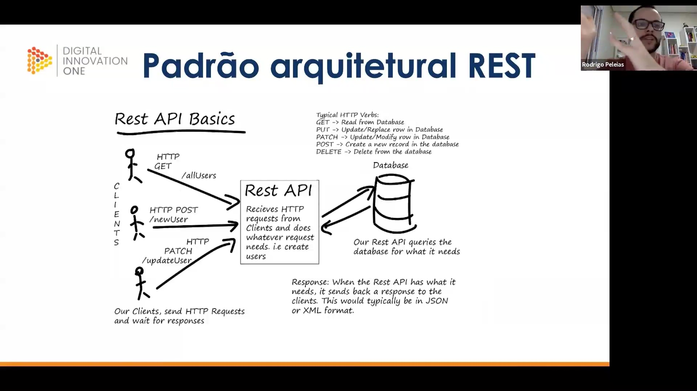
</p>

O padrão arquitetural **REST** (Representational State Transfer) surgiu como uma alternativa mais simples e menos complexa ao protocolo SOAP. Enquanto o SOAP dependia de documentos XML extensos que exigiam traduções complexas de código , o REST utiliza a infraestrutura nativa do protocolo **HTTP** para realizar operações de integração.

Neste ecossistema, o fluxo de comunicação baseia-se em:

* **Clients**: Dispositivos ou usuários que enviam **HTTP Requests** e aguardam por uma resposta.
* **Rest API**: Recebe as requisições, processa a lógica necessária (como a criação de usuários) e interage com o **Database**.
* **Verbos HTTP**: Definem a ação a ser executada, como **GET** para leitura, **POST** para criação, **PUT** para atualização total, **PATCH** para modificação parcial e **DELETE** para exclusão.
* **Endpoints**: Rotas específicas como `/allUsers`, `/newUser` ou `/updateUser` que identificam o recurso alvo.
* **Response**: Após o processamento, a API retorna os dados ao cliente, tipicamente formatados em **JSON** ou **XML**.


<p align="center">
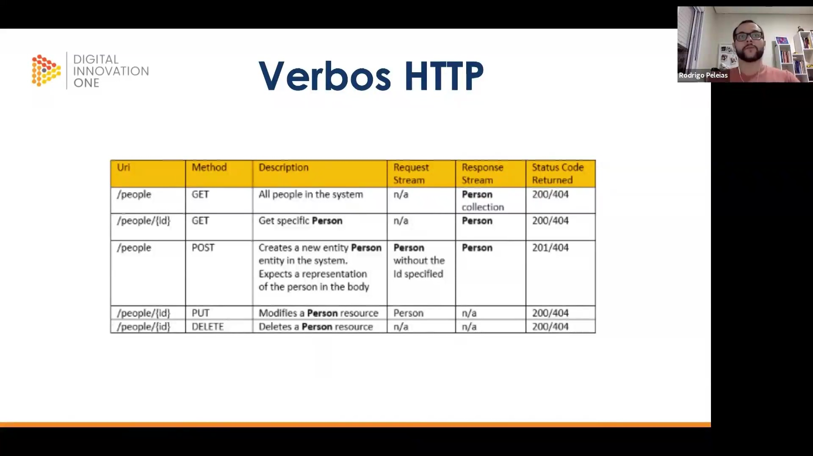
</p>

A padronização dos **Verbos HTTP** é fundamental para garantir a semântica de uma API RESTful. Cada recurso (URI) deve ser manipulado por métodos específicos que determinam o comportamento esperado do sistema e o formato da resposta:
| Uri             | Method  | Descrição                                | Request            | Response          | Status Code |
|-----------------|---------|------------------------------------------|--------------------|-------------------|-------------|
| `/people`       | **GET** | Recupera todas as pessoas do sistema     | n/a                | Person collection | 200/404     |
| `/people/{id}`  | **GET** | Obtém uma pessoa específica pelo ID      | n/a                | Person            | 200/404     |
| `/people`       | **POST**| Cria uma nova entidade no sistema        | Person (sem ID)    | Person            | 201/404     |
| `/people/{id}`  | **PUT** | Modifica ou substitui um recurso existente | Person             | n/a               | 200/404     |
| `/people/{id}`  | **DELETE** | Remove um recurso do sistema          | n/a                | n/a               | 200/404     |

O uso correto dos **Status Codes** (como o **201 Created** para POST ou **200 OK** para sucessos) permite que o cliente compreenda o resultado da operação sem ambiguidades.

<p align="center">
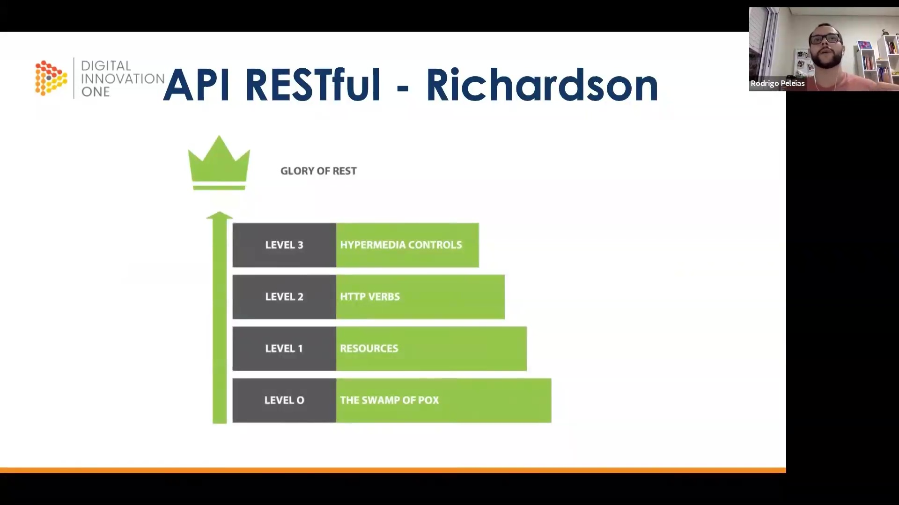
</p>

Para medir o nível de aderência aos princípios REST, utiliza-se o **Modelo de Maturidade de Richardson**. Este modelo organiza a evolução de um serviço em quatro níveis distintos, conhecidos como "A Glória do REST":

* **Nível 0 (The Swamp of POX)**: O uso do HTTP apenas como um meio de transporte para mensagens, sem explorar seus recursos semânticos.
* **Nível 1 (Resources)**: A API passa a utilizar URIs diferentes para identificar recursos individuais em vez de um único endpoint.
* **Nível 2 (HTTP Verbs)**: Implementação correta dos verbos HTTP e códigos de status para representar as operações.
* **Nível 3 (Hypermedia Controls)**: Introdução de **HATEOAS**, onde a resposta da API fornece links que guiam o cliente sobre as próximas interações possíveis.


### 🟩 Vídeo 05 - Pirâmide de testes

<video width="60%" controls>
  <source src="000-Midia_e_Anexos/bootcamp_tqi_fullstack-modulo.07-curso.05-video_05.webm" type="video/webm">
    Seu navegador não suporta vídeo HTML5.
</video>

link do vídeo: https://web.dio.me/lab/desenvolvimento-de-testes-unitarios-para-validar-uma-api-rest-de-gerenciamento-estoques-de-cerveja/learning/cb7cccbc-238e-48bd-844a-6c955bd56979

### 🟩 Vídeo 06 - Frameworks de testes unitários

<video width="60%" controls>
  <source src="000-Midia_e_Anexos/bootcamp_tqi_fullstack-modulo.07-curso.05-video_06.webm" type="video/webm">
    Seu navegador não suporta vídeo HTML5.
</video>

link do vídeo:

### 🟩 Vídeo 07 - Revisando as dependências do arquivo pom.xml

<video width="60%" controls>
  <source src="000-Midia_e_Anexos/bootcamp_tqi_fullstack-modulo.07-curso.05-video_07.webm" type="video/webm">
    Seu navegador não suporta vídeo HTML5.
</video>

link do vídeo:

### 🟩 Vídeo 08 - Testando os métodos das classes BeerService e BeerController - parte 1

<video width="60%" controls>
  <source src="000-Midia_e_Anexos/bootcamp_tqi_fullstack-modulo.07-curso.05-video_08.webm" type="video/webm">
    Seu navegador não suporta vídeo HTML5.
</video>

link do vídeo:

### 🟩 Vídeo 09 - Testando os métodos das classes BeerService e BeerController - parte 2

<video width="60%" controls>
  <source src="000-Midia_e_Anexos/bootcamp_tqi_fullstack-modulo.07-curso.05-video_09.webm" type="video/webm">
    Seu navegador não suporta vídeo HTML5.
</video>

link do vídeo:

### 🟩 Vídeo 10 - Testando os métodos das classes BeerService e BeerController - parte 3

<video width="60%" controls>
  <source src="000-Midia_e_Anexos/bootcamp_tqi_fullstack-modulo.07-curso.05-video_10.webm" type="video/webm">
    Seu navegador não suporta vídeo HTML5.
</video>

link do vídeo:

### 🟩 Vídeo 11 - Testando os métodos das classes BeerService e BeerController - parte 4

<video width="60%" controls>
  <source src="000-Midia_e_Anexos/bootcamp_tqi_fullstack-modulo.07-curso.05-video_11.webm" type="video/webm">
    Seu navegador não suporta vídeo HTML5.
</video>

link do vídeo:

### 🟩 Vídeo 12 - Testando os métodos das classes BeerService e BeerController - parte 5

<video width="60%" controls>
  <source src="000-Midia_e_Anexos/bootcamp_tqi_fullstack-modulo.07-curso.05-video_12.webm" type="video/webm">
    Seu navegador não suporta vídeo HTML5.
</video>

link do vídeo:

### 🟩 Vídeo 13 - Testando os métodos das classes BeerService e BeerController - parte 6

<video width="60%" controls>
  <source src="000-Midia_e_Anexos/bootcamp_tqi_fullstack-modulo.07-curso.05-video_13.webm" type="video/webm">
    Seu navegador não suporta vídeo HTML5.
</video>

link do vídeo:

### 🟩 Vídeo 14 - Testando os métodos das classes BeerService e BeerController - parte 7

<video width="60%" controls>
  <source src="000-Midia_e_Anexos/bootcamp_tqi_fullstack-modulo.07-curso.05-video_14.webm" type="video/webm">
    Seu navegador não suporta vídeo HTML5.
</video>

link do vídeo:

### 🟩 Vídeo 15 - Testando os métodos das classes BeerService e BeerController - parte 8

<video width="60%" controls>
  <source src="000-Midia_e_Anexos/bootcamp_tqi_fullstack-modulo.07-curso.05-video_15.webm" type="video/webm">
    Seu navegador não suporta vídeo HTML5.
</video>

link do vídeo:

### 🟩 Vídeo 16 - Testando os métodos das classes BeerService e BeerController - parte 9

<video width="60%" controls>
  <source src="000-Midia_e_Anexos/bootcamp_tqi_fullstack-modulo.07-curso.05-video_16.webm" type="video/webm">
    Seu navegador não suporta vídeo HTML5.
</video>

link do vídeo:

### 🟩 Vídeo 17 - Testando os métodos das classes BeerService e BeerController - parte 10

<video width="60%" controls>
  <source src="000-Midia_e_Anexos/bootcamp_tqi_fullstack-modulo.07-curso.05-video_17.webm" type="video/webm">
    Seu navegador não suporta vídeo HTML5.
</video>

link do vídeo:

### 🟩 Vídeo 18 - Testando os métodos das classes BeerService e BeerController - parte 11

<video width="60%" controls>
  <source src="000-Midia_e_Anexos/bootcamp_tqi_fullstack-modulo.07-curso.05-video_18.webm" type="video/webm">
    Seu navegador não suporta vídeo HTML5.
</video>

link do vídeo:

### 🟩 Vídeo 19 - Testando os métodos das classes BeerService e BeerController - parte 12

<video width="60%" controls>
  <source src="000-Midia_e_Anexos/bootcamp_tqi_fullstack-modulo.07-curso.05-video_19.webm" type="video/webm">
    Seu navegador não suporta vídeo HTML5.
</video>

link do vídeo:

### 🟩 Vídeo 20 - Testando os métodos das classes BeerService e BeerController - parte 13

<video width="60%" controls>
  <source src="000-Midia_e_Anexos/bootcamp_tqi_fullstack-modulo.07-curso.05-video_20.webm" type="video/webm">
    Seu navegador não suporta vídeo HTML5.
</video>

link do vídeo:

### 🟩 Vídeo 21 - Testando os métodos das classes BeerService e BeerController - parte 14

<video width="60%" controls>
  <source src="000-Midia_e_Anexos/bootcamp_tqi_fullstack-modulo.07-curso.05-video_21.webm" type="video/webm">
    Seu navegador não suporta vídeo HTML5.
</video>

link do vídeo:

### 🟩 Vídeo 22 - Finalizando o curso e explicando os testes comentados no GitHub

<video width="60%" controls>
  <source src="000-Midia_e_Anexos/bootcamp_tqi_fullstack-modulo.07-curso.05-video_22.webm" type="video/webm">
    Seu navegador não suporta vídeo HTML5.
</video>

link do vídeo:

### 🟩 Vídeo 23 - Objetivo do projeto

<video width="60%" controls>
  <source src="000-Midia_e_Anexos/bootcamp_tqi_fullstack-modulo.07-curso.05-video_23.webm" type="video/webm">
    Seu navegador não suporta vídeo HTML5.
</video>

link do vídeo:

# Certificado: 

- Link na plataforma: 
- Certificado em pdf: