## Instrutor

- Rodrigo D'Agostini Peleias (Tech Lead | Staff Software Engineer | Senior Software Engineer | Backend | Java | Spring Boot | 3x AWS Certified)
- Contato Linkedin: / [rodrigopeleias](https://www.linkedin.com/in/rodrigopeleias/)

## Parte 1 - Testes Unitários e Qualidade de Software

### 🟩 Vídeo 01 - Como usar os desafios de projetos para criar seu portfólio

<video width="60%" controls>
  <source src="000-Midia_e_Anexos/bootcamp_tqi_fullstack-modulo.07-curso.05-video_01.webm" type="video/webm">
    Seu navegador não suporta vídeo HTML5.
</video>

link do vídeo: https://web.dio.me/lab/desenvolvimento-de-testes-unitarios-para-validar-uma-api-rest-de-gerenciamento-estoques-de-cerveja/learning/d00f891f-65bb-4149-85f0-57d771116214?back=/track/tqi-fullstack-developer

O vídeo detalha a importância, a execução e a entrega de projetos práticos dentro da plataforma DIO, destacando como essas atividades aceleram a carreira de um desenvolvedor através da criação de um portfólio sólido e da participação em um ecossistema gamificado.
 

### 🟩 Vídeo 02 - Objetivos do curso e apresentação do repositório no GitHub

<video width="60%" controls>
  <source src="000-Midia_e_Anexos/bootcamp_tqi_fullstack-modulo.07-curso.05-video_02.webm" type="video/webm">
    Seu navegador não suporta vídeo HTML5.
</video>

link do vídeo: https://web.dio.me/lab/desenvolvimento-de-testes-unitarios-para-validar-uma-api-rest-de-gerenciamento-estoques-de-cerveja/learning/a28d07c7-0d18-4986-bd96-d448d7ec05ba

Este guia resume a aula sobre a pirâmide de testes de software, com foco especial em testes unitários, frameworks essenciais do ecossistema Java e a configuração de um ambiente de desenvolvimento moderno para a criação de uma API de Cervejas (Beer API).

### Anotações

#### Objetivos da Aula

<p align="center">

</p>

Nesta etapa inicial, são estabelecidos os fundamentos da aula, focando na estruturação e na qualidade do desenvolvimento de software através de testes. O conteúdo programático está dividido em quatro pilares principais:

* **Pirâmide de Testes:** Apresentação e detalhamento dos níveis de teste, abrangendo testes unitários, integrados e ponta a ponta.
* **Testes Unitários:** Discussão sobre a relevância desses testes durante o ciclo de desenvolvimento, destacando como eles garantem a qualidade do código e auxiliam na documentação do projeto.
* **Frameworks de Referência:** Introdução às ferramentas que serão utilizadas no ecossistema Java, especificamente JUnit, Mockito e Hamcrest.
* **Prática:** Sessão de codificação colaborativa para aplicar os conceitos aprendidos e compartilhar o conhecimento.

#### Stack Tecnológica

<p align="center">

</p>

Para a execução do projeto e das atividades de live coding, será utilizada uma stack tecnológica moderna e padronizada para o desenvolvimento Java. As ferramentas e versões definidas são:

* **Linguagem:** Java 14.
* **Gerenciador de Dependências:** Maven 3.6.3.
* **Framework Base:** Spring Boot, utilizando a última versão estável lançada.
* **Versionamento:** GIT e GitHub para o controle de versão do código.
* **Testes:** Frameworks JUnit, Mockito e Hamcrest.

#### Repositório e Ferramentas

<p align="center">

</p>

O projeto prático consiste em uma **Beer API**, desenvolvida para o gerenciamento de estoques de cerveja e hospedada no GitHub. O repositório centraliza não apenas o código-fonte, mas também guias de execução e referências importantes para o desenvolvedor.

A estrutura do projeto inclui:

* **Desenvolvimento de Testes:** Foco em testes unitários para validar a API REST e a prática de TDD (Test Driven Development).
* **Arquivos do Projeto:** Presença de arquivos essenciais como o `pom.xml` para gestão do Maven, pastas de código `src` e configurações de ignore do Git.
* **Suporte a Testes:** Inclusão de uma coleção do Postman para facilitar a validação das rotas da API.
* **Histórico:** O repositório conta com diversos commits detalhando desde a criação do projeto até o desenvolvimento de serviços específicos para a criação de cervejas.

Link do repositório: https://github.com/rpeleias-v1/beer_api_digital_innovation_one

### 🟩 Vídeo 03 - Apresentação do Projeto no IntelliJ

<video width="60%" controls>
  <source src="000-Midia_e_Anexos/bootcamp_tqi_fullstack-modulo.07-curso.05-video_03.webm" type="video/webm">
    Seu navegador não suporta vídeo HTML5.
</video>

link do vídeo: https://web.dio.me/lab/desenvolvimento-de-testes-unitarios-para-validar-uma-api-rest-de-gerenciamento-estoques-de-cerveja/learning/f1ea7b4a-ddb4-406c-8951-b391763b8a01

O projeto BeerStock é uma aplicação Java desenvolvida com o framework Spring Boot, focada no gerenciamento de estoque de cervejas. A aplicação segue os padrões modernos de desenvolvimento web, utilizando uma arquitetura em camadas e diversas bibliotecas para aumentar a produtividade e garantir a qualidade do código.

### Anotações

<p align="center">

</p>

O ponto de partida do projeto **Beer Stock** é o arquivo `pom.xml`, onde são definidas as dependências necessárias para o funcionamento da aplicação Spring Boot. Entre as principais tecnologias integradas estão o **Spring Data JPA** para persistência, o **Bean Validation** para validação de regras de entrada, o banco de dados em memória **H2** e ferramentas de produtividade como o **Lombok** e o **MapStruct**. Além disso, o projeto inclui o **Swagger** para a geração automática da documentação da API.

```xml
<dependencies>
    <dependency>
        <groupId>org.springframework.boot</groupId>
        <artifactId>spring-boot-starter-actuator</artifactId>
    </dependency>

    <dependency>
        <groupId>org.springframework.boot</groupId>
        <artifactId>spring-boot-starter-data-jpa</artifactId>
    </dependency>

    <dependency>
        <groupId>org.springframework.boot</groupId>
        <artifactId>spring-boot-starter-validation</artifactId>
    </dependency>

    <dependency>
        <groupId>org.springframework.boot</groupId>
        <artifactId>spring-boot-starter-web</artifactId>
    </dependency>

    <dependency>
        <groupId>org.springframework.boot</groupId>
        <artifactId>spring-boot-devtools</artifactId>
        <scope>runtime</scope>
        <optional>true</optional>
    </dependency>

    <dependency>
        <groupId>com.h2database</groupId>
        <artifactId>h2</artifactId>
        <scope>runtime</scope>
    </dependency>
</dependencies>
```

<p align="center">

</p>

A entidade principal do sistema é a classe `Beer`. Ela utiliza anotações do **Lombok**, como `@Data`, para gerar automaticamente métodos essenciais como getters, setters, `equals` e `hashCode`, reduzindo o código repetitivo. A anotação `@Entity` marca a classe para o mapeamento objeto-relacional (ORM) via JPA, definindo o campo `id` como uma chave primária de autoincremento.

```java
@Data
@Entity
@NoArgsConstructor
@AllArgsConstructor
public class Beer {

    @Id
    @GeneratedValue(strategy = GenerationType.IDENTITY)
    private Long id;
```

<p align="center">

</p>

Para categorizar os produtos, foi criado o enum `BeerType`. Ele define os tipos de cerveja suportados pelo sistema (como Lager, IPA e Stout) e armazena uma descrição textual para cada um. O uso das anotações `@Getter` e `@AllArgsConstructor` do Lombok garante o acesso simplificado a essas descrições.

```java
package one.digitalinnovation.beerstock.enums;

import lombok.AllArgsConstructor;
import lombok.Getter;

@Getter
@AllArgsConstructor
public enum BeerType {

    LAGER("Lager"),
    MALZBIER("Malzbier"),
    WITBIER("Witbier"),
    WEISS("Weiss"),
    ALE("Ale"),
    IPA("IPA"),
    STOUT("Stout");

    private final String description;
}
```

<p align="center">

</p>

Os atributos da entidade `Beer` incluem regras de negócio específicas refletidas no banco de dados através da anotação `@Column`. O nome da cerveja deve ser único no sistema, impedindo cadastros duplicados. Outros campos como marca, quantidade atual e limite máximo de estoque são definidos como obrigatórios (`nullable = false`). O tipo da cerveja é persistido como uma string no banco de dados para facilitar a leitura.

```java
    @Column(nullable = false, unique = true)
    private String name;

    @Column(nullable = false)
    private String brand;

    @Column(nullable = false)
    private int max;

    @Column(nullable = false)
    private int quantity;

    @Enumerated(EnumType.STRING)
    @Column(nullable = false)
    private BeerType type;
}
```

<p align="center">

</p>

A estrutura final da entidade `Beer` consolida o mapeamento necessário para gerenciar o estoque. Através da integração entre o JPA e o Lombok, a classe permanece limpa, focando na definição dos dados e restrições enquanto as funcionalidades de infraestrutura são tratadas pelas anotações.

<p align="center">

</p>

A camada de acesso a dados é representada pela interface `BeerRepository`, que estende `JpaRepository`. Essa abordagem permite herdar operações padrão de CRUD (Criar, Ler, Atualizar e Deletar) sem a necessidade de implementar manualmente os métodos. Além disso, a definição do método `findByName` demonstra o poder do Spring Data JPA, que gera automaticamente a consulta SQL necessária baseada apenas na nomenclatura do método, retornando um `Optional` para um tratamento seguro de valores nulos.

```java
package one.digitalinnovation.beerstock.repository;

import one.digitalinnovation.beerstock.entity.Beer;
import org.springframework.data.jpa.repository.JpaRepository;
import java.util.Optional;

public interface BeerRepository extends JpaRepository<Beer, Long> {

    Optional<Beer> findByName(String name);
}
```

<p align="center">

</p>

Ao analisar a interface `JpaRepository` do próprio framework Spring, observa-se que ela define um contrato robusto para manipulação de listas e entidades. Ela estende interfaces como `PagingAndSortingRepository` e `QueryByExampleExecutor`, fornecendo métodos como `findAll()`, `saveAll()` e `flush()`, que abstraem a complexidade das operações em lote e do gerenciamento de transações.

<p align="center">

</p>

Subindo na hierarquia do Spring Data, a `PagingAndSortingRepository` introduz funcionalidades essenciais para APIs modernas: a paginação e a ordenação. Ela herda de `CrudRepository` e adiciona sobrecargas ao método `findAll` que aceitam objetos `Sort` ou `Pageable`, permitindo que a aplicação processe grandes volumes de dados de forma eficiente.

<p align="center">

</p>

A interface `JpaRepository` serve como a base para que o desenvolvedor crie repositórios personalizados com pouco esforço. O Spring interpreta essas interfaces em tempo de execução para fornecer a implementação concreta que lidará com o banco de dados.

<p align="center">

</p>

Internamente, o Spring utiliza a classe `SimpleJpaRepository` para fornecer a implementação padrão das interfaces de repositório. Ela utiliza o `EntityManager` do JPA para realizar as operações, gerenciando automaticamente as conexões e o contexto transacional (marcado com `@Transactional`), o que garante a integridade dos dados sem que o desenvolvedor precise escrever código de infraestrutura.

<p align="center">

</p>

A camada `BeerService` centraliza as regras de negócio da aplicação. Anotada com `@Service`, ela é gerenciada pelo Spring para injeção de dependências. O uso de `@AllArgsConstructor(onConstructor = @__(@Autowired))` facilita a injeção do repositório e do mapper por meio do construtor. Métodos como `createBeer` e `findByName` realizam a orquestração entre a validação de existência, a conversão de DTOs (Data Transfer Objects) para entidades e a persistência final.

```java
@Service
@AllArgsConstructor(onConstructor = @__(@Autowired))
public class BeerService {

    private final BeerRepository beerRepository;
    private final BeerMapper beerMapper = BeerMapper.INSTANCE;

    public BeerDTO createBeer(BeerDTO beerDTO) throws BeerAlreadyRegisteredException {
        verifyIfAlreadyRegistered(beerDTO.getName());
        Beer beer = beerMapper.toModel(beerDTO);
        Beer savedBeer = beerRepository.save(beer);
        return beerMapper.toDTO(savedBeer);
    }

    public BeerDTO findByName(String name) throws BeerNotFoundException {
        Beer foundBeer = beerRepository.findByName(name)
                .orElseThrow(() -> new BeerNotFoundException(name));
        return beerMapper.toDTO(foundBeer);
    }
```

<p align="center">

</p>

Complementando a lógica de serviço, métodos auxiliares são implementados para garantir a robustez das operações. O método `verifyIfAlreadyRegistered` impede a criação de nomes duplicados, enquanto `verifyIfExists` é utilizado antes de deleções para assegurar que o ID informado corresponde a um registro real, lançando exceções personalizadas quando as condições não são atendidas.

```java
    public List<BeerDTO> listAll() {
        return beerRepository.findAll()
                .stream()
                .map(beerMapper::toDTO)
                .collect(Collectors.toList());
    }

    public void deleteById(Long id) throws BeerNotFoundException {
        verifyIfExists(id);
        beerRepository.deleteById(id);
    }

    private void verifyIfAlreadyRegistered(String name) throws BeerAlreadyRegisteredException {
        Optional<Beer> optSavedBeer = beerRepository.findByName(name);
        if (optSavedBeer.isPresent()) {
            throw new BeerAlreadyRegisteredException(name);
        }
    }

    private Beer verifyIfExists(Long id) throws BeerNotFoundException {
        return beerRepository.findById(id)
                .orElseThrow(() -> new BeerNotFoundException(id));
    }
```

<p align="center">

</p>

A última camada é o `BeerController`, que expõe os endpoints da API REST. Utilizando `@RestController` e `@RequestMapping("/api/v1/beers")`, ele define a rota base e o formato de troca de dados (JSON). Os verbos HTTP são mapeados para os métodos do serviço: `@PostMapping` para criação, `@GetMapping` para buscas e listagens, e `@DeleteMapping` para remoção. A validação das entradas é feita através da anotação `@Valid` no corpo das requisições.

```java
@RestController
@RequestMapping("/api/v1/beers")
@AllArgsConstructor(onConstructor = @__(@Autowired))
public class BeerController implements BeerControllerDocs {

    private final BeerService beerService;

    @PostMapping
    @ResponseStatus(HttpStatus.CREATED)
    public BeerDTO createBeer(@RequestBody @Valid BeerDTO beerDTO) throws BeerAlreadyRegisteredException {
        return beerService.createBeer(beerDTO);
    }

    @GetMapping("/{name}")
    public BeerDTO findByName(@PathVariable String name) throws BeerNotFoundException {
        return beerService.findByName(name);
    }

    @GetMapping
    public List<BeerDTO> listBeers() {
        return beerService.listAll();
    }
}
```      

### 🟩 Vídeo 04 - Introdução ao estilo arquitetural REST

<video width="60%" controls>
  <source src="000-Midia_e_Anexos/bootcamp_tqi_fullstack-modulo.07-curso.05-video_04.webm" type="video/webm">
    Seu navegador não suporta vídeo HTML5.
</video>

link do vídeo: https://web.dio.me/lab/desenvolvimento-de-testes-unitarios-para-validar-uma-api-rest-de-gerenciamento-estoques-de-cerveja/learning/8bc8324c-0e6d-4c44-bbc0-ee0444f6b42d

O vídeo descreve a transição dos protocolos de integração, o funcionamento dos verbos HTTP e os níveis de maturidade que definem uma API verdadeiramente RESTful.

### Anotações

<p align="center">

</p>

O padrão arquitetural **REST** (Representational State Transfer) surgiu como uma alternativa mais simples e menos complexa ao protocolo SOAP. Enquanto o SOAP dependia de documentos XML extensos que exigiam traduções complexas de código , o REST utiliza a infraestrutura nativa do protocolo **HTTP** para realizar operações de integração.

Neste ecossistema, o fluxo de comunicação baseia-se em:

* **Clients**: Dispositivos ou usuários que enviam **HTTP Requests** e aguardam por uma resposta.
* **Rest API**: Recebe as requisições, processa a lógica necessária (como a criação de usuários) e interage com o **Database**.
* **Verbos HTTP**: Definem a ação a ser executada, como **GET** para leitura, **POST** para criação, **PUT** para atualização total, **PATCH** para modificação parcial e **DELETE** para exclusão.
* **Endpoints**: Rotas específicas como `/allUsers`, `/newUser` ou `/updateUser` que identificam o recurso alvo.
* **Response**: Após o processamento, a API retorna os dados ao cliente, tipicamente formatados em **JSON** ou **XML**.


<p align="center">

</p>

A padronização dos **Verbos HTTP** é fundamental para garantir a semântica de uma API RESTful. Cada recurso (URI) deve ser manipulado por métodos específicos que determinam o comportamento esperado do sistema e o formato da resposta:
| Uri             | Method  | Descrição                                | Request            | Response          | Status Code |
|-----------------|---------|------------------------------------------|--------------------|-------------------|-------------|
| `/people`       | **GET** | Recupera todas as pessoas do sistema     | n/a                | Person collection | 200/404     |
| `/people/{id}`  | **GET** | Obtém uma pessoa específica pelo ID      | n/a                | Person            | 200/404     |
| `/people`       | **POST**| Cria uma nova entidade no sistema        | Person (sem ID)    | Person            | 201/404     |
| `/people/{id}`  | **PUT** | Modifica ou substitui um recurso existente | Person             | n/a               | 200/404     |
| `/people/{id}`  | **DELETE** | Remove um recurso do sistema          | n/a                | n/a               | 200/404     |

O uso correto dos **Status Codes** (como o **201 Created** para POST ou **200 OK** para sucessos) permite que o cliente compreenda o resultado da operação sem ambiguidades.

<p align="center">

</p>

Para medir o nível de aderência aos princípios REST, utiliza-se o **Modelo de Maturidade de Richardson**. Este modelo organiza a evolução de um serviço em quatro níveis distintos, conhecidos como "A Glória do REST":

* **Nível 0 (The Swamp of POX)**: O uso do HTTP apenas como um meio de transporte para mensagens, sem explorar seus recursos semânticos.
* **Nível 1 (Resources)**: A API passa a utilizar URIs diferentes para identificar recursos individuais em vez de um único endpoint.
* **Nível 2 (HTTP Verbs)**: Implementação correta dos verbos HTTP e códigos de status para representar as operações.
* **Nível 3 (Hypermedia Controls)**: Introdução de **HATEOAS**, onde a resposta da API fornece links que guiam o cliente sobre as próximas interações possíveis.


### 🟩 Vídeo 05 - Pirâmide de testes

<video width="60%" controls>
  <source src="000-Midia_e_Anexos/bootcamp_tqi_fullstack-modulo.07-curso.05-video_05.webm" type="video/webm">
    Seu navegador não suporta vídeo HTML5.
</video>

link do vídeo: https://web.dio.me/lab/desenvolvimento-de-testes-unitarios-para-validar-uma-api-rest-de-gerenciamento-estoques-de-cerveja/learning/cb7cccbc-238e-48bd-844a-6c955bd56979

O vídeo discute a importância da **pirâmide de testes** no desenvolvimento de software, destacando como essa estrutura organiza validações desde o nível **unitário** até os testes de **ponta a ponta**. O autor detalha que a base da pirâmide foca em processos rápidos e baratos, enquanto o topo lida com a **usabilidade e regressão**, simulando a experiência real do usuário. A utilização de ferramentas automatizadas e frameworks específicos é apresentada como essencial para garantir a **qualidade do código** e a prevenção de erros em sistemas críticos. Além de validar funcionalidades, os testes servem como uma forma eficiente de **documentação** e facilitam a integração de novos desenvolvedores à equipe. Por fim, a fonte enfatiza que uma suite de testes robusta é o pilar fundamental para implementar fluxos modernos de **integração e entrega contínua (CI/CD)**.

### Anotações

<p align="center">
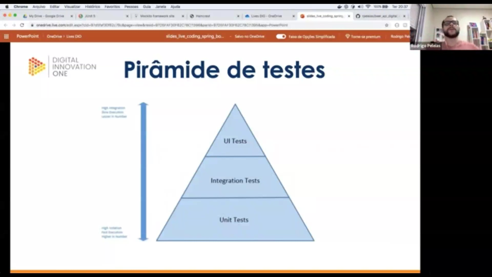
</p>

A **Pirâmide de Testes**, conceito proposto por Mike Cohn, estabelece uma estrutura estratégica para organizar os testes em diferentes níveis de granularidade, equilibrando custo e velocidade de execução.

* **Testes Unitários (Base)**: Representam o maior volume e focam na validação de unidades isoladas do código, como classes e services. São rápidos e utilizam **mocks** para isolar dependências externas.
* **Testes de Integração (Meio)**: Validam a comunicação entre componentes, como queries em bancos de dados ou chamadas a Web Services. Exigem recursos à parte, o que aumenta o custo de tempo e trabalho.
* **UI Tests / End-to-End (Topo)**: Testam o sistema do ponto de vista do usuário final, percorrendo fluxos completos (como o checkout de um e-commerce). São os mais lentos e custosos de automatizar.

<p align="center">
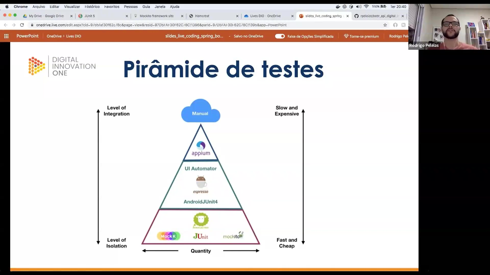
</p>

A aplicação prática dessa pirâmide no desenvolvimento mobile e Java utiliza ferramentas específicas distribuídas por nível de isolamento e integração:

* **Fast and Cheap (Base)**: Prioriza a velocidade com ferramentas como **JUnit**, **Mockito** e **MockK** para testes isolados. O **Hamcrest** também é citado como auxílio na validação.
* **Camada Intermediária**: Envolve o suporte do **Spring Boot** para testes de integração com repositórios e bancos de dados, além do **AndroidJUnit4** para o contexto Android.
* **Slow and Expensive (Topo)**: Utiliza ferramentas de automação de interface como **Appium**, **Espresso**, **UI Automator** ou **Selenium** para simular interações reais na tela.

<p align="center">
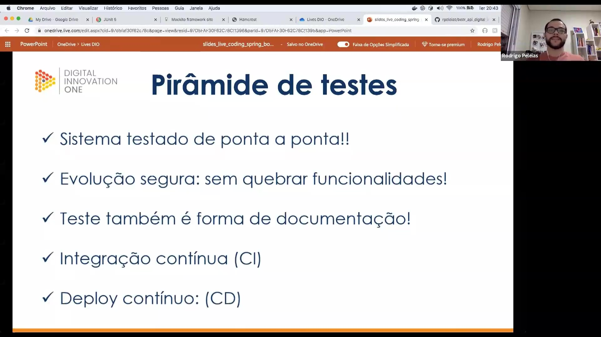
</p>

A adoção desta estratégia de testes oferece benefícios fundamentais para o ciclo de vida do software:

* **Evolução Segura**: Garante que manutenções no código não quebrem funcionalidades existentes (prevenção de bugs).
* **Documentação e Onboarding**: Testes bem projetados e com boas nomenclaturas servem como documentação técnica, auxiliando novos desenvolvedores a entenderem o funcionamento do sistema.
* **Base para CI/CD**: A automação é o alicerce para a **Integração Contínua (CI)** e o **Deploy Contínuo (CD)**. Ferramentas como **Travis CI** e **Circle CI** disparam baterias de testes a cada commit para garantir que apenas código de qualidade chegue à produção.


### 🟩 Vídeo 06 - Frameworks de testes unitários

<video width="60%" controls>
  <source src="000-Midia_e_Anexos/bootcamp_tqi_fullstack-modulo.07-curso.05-video_06.webm" type="video/webm">
    Seu navegador não suporta vídeo HTML5.
</video>

link do vídeo: https://web.dio.me/lab/desenvolvimento-de-testes-unitarios-para-validar-uma-api-rest-de-gerenciamento-estoques-de-cerveja/learning/868d63ee-6953-4151-a272-017dc4ca047a

O vídeo explica os conceitos fundamentais de testes unitários (Nível 1), abordando desde a filosofia de desenvolvimento até as ferramentas práticas como JUnit 5, Mockito e Hamcrest, integradas ao ecossistema Spring Boot.

<p align="center">
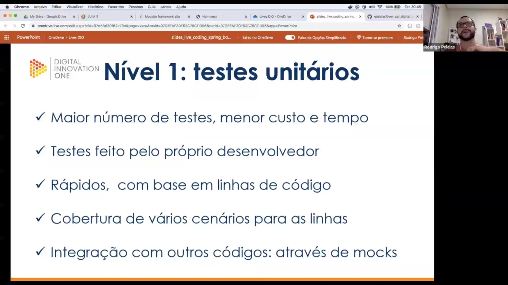
</p>

Os testes unitários representam o primeiro nível da pirâmide de testes, sendo fundamentais para o desenvolvimento de software com qualidade. Suas principais características incluem:

* **Eficiência e Custo:** Possuem o maior volume de execução, apresentando o menor custo e tempo de implementação.
* **Responsabilidade:** São desenvolvidos pelo próprio programador como parte integrante da funcionalidade.
* **Velocidade:** São execuções rápidas focadas diretamente nas linhas de código.
* **Abrangência:** Permitem a cobertura de múltiplos cenários de saída para a lógica implementada.
* **Isolamento:** A integração com outros componentes do sistema é realizada de forma controlada através do uso de **mocks**.

O objetivo central é que o teste não seja uma tarefa separada, mas sim parte do cronograma e do "mindset" de desenvolvimento, garantindo que cada método cubra todos os cenários possíveis de execução.

<p align="center">
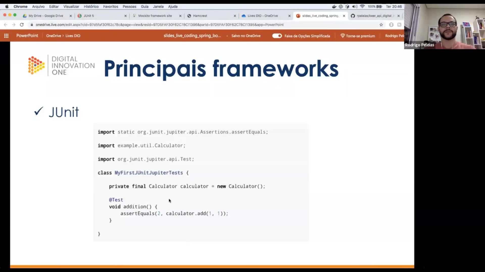
</p>

O **JUnit 5** é um dos principais frameworks utilizados para a criação de testes no ecossistema Java. A estrutura básica consiste em criar classes específicas dentro do pacote de testes, utilizando anotações como `@Test` para identificar os métodos que devem ser executados pelo framework. Para validar se o resultado de uma operação está correto, utiliza-se o método `assertEquals`.

```java
import static org.junit.jupiter.api.Assertions.assertEquals;
import example.util.Calculator;
import org.junit.jupiter.api.Test;

class MyFirstJUnitJupiterTests {
    private final Calculator calculator = new Calculator();

    @Test
    void addition() {
        assertEquals(2, calculator.add(1, 1));
    }
}
```

<p align="center">
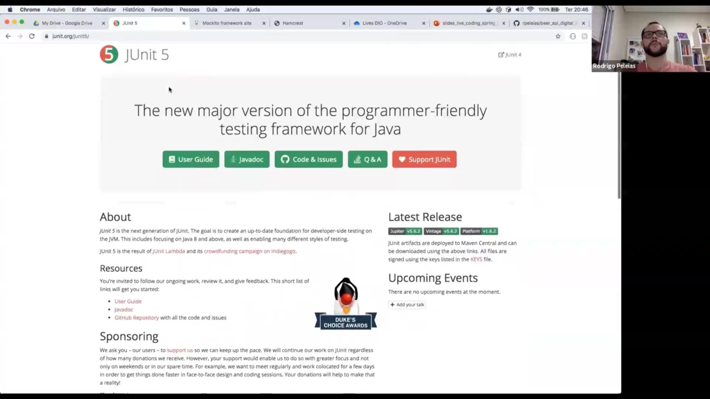
</p>

A página oficial do JUnit 5 detalha a nova geração do framework, que foi redesenhada para suportar funcionalidades do Java 8 (como expressões Lambda) e permitir diferentes estilos de teste na JVM. No portal, o desenvolvedor encontra recursos essenciais como:

* **Guia do Usuário:** Instruções detalhadas de configuração.
* **Javadoc:** Documentação técnica da API.
* **Repositório GitHub:** Acesso ao código-fonte e acompanhamento de problemas (issues).
* **Versões Atuais:** Informações sobre os artefatos disponíveis no Maven Central, incluindo os módulos Jupiter, Vintage e Platform.

<p align="center">
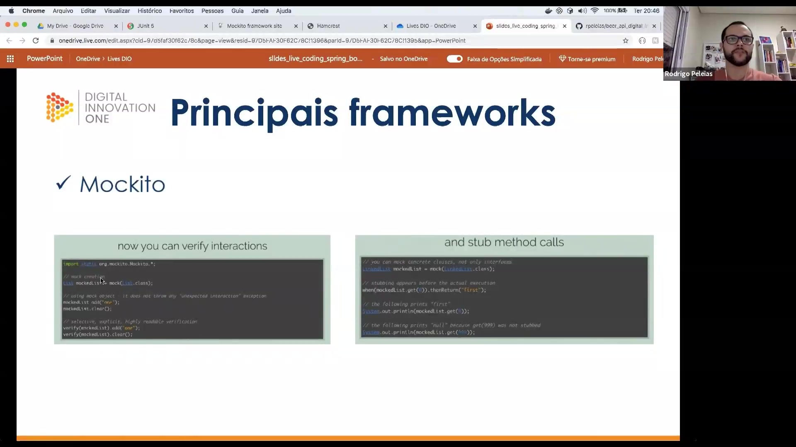
</p>

O **Mockito** é a ferramenta padrão para a criação de objetos dublês (**mocks**). Ele permite simular o comportamento de dependências externas (como um repositório ou serviço) para que o teste unitário foque exclusivamente na lógica da classe atual.

As duas principais funcionalidades demonstradas são:

1. **Verificação de Interações:** Validar se um método específico foi chamado dentro do objeto mocado através do comando `verify`.
2. **Stubbing (Simulação):** Instruir o objeto dublê a retornar um valor específico quando um método for acionado, utilizando a estrutura `when(...).thenReturn(...)`.

```java
// Exemplo de verificação
verify(mockedList).clear();

// Exemplo de stubbing
when(mockedList.get(0)).thenReturn("first");
System.out.println(mockedList.get(0)); // Imprimirá "first"
```

<p align="center">
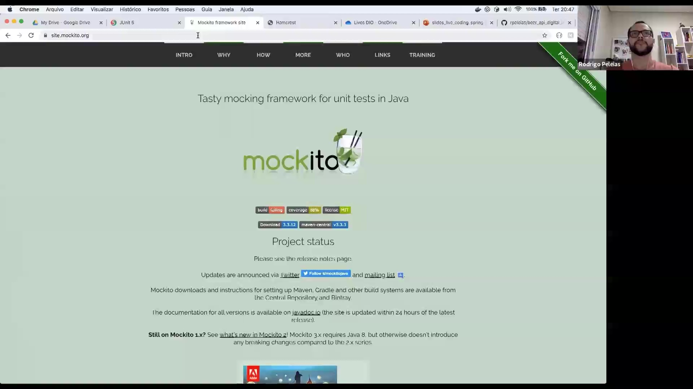
</p>

O site oficial do projeto Mockito apresenta a ferramenta como um framework de "mocking saboroso" para Java. A documentação centralizada no portal auxilia na configuração inicial via Maven ou Gradle e oferece notas de lançamento sobre a compatibilidade das versões (como a necessidade do Java 8 a partir da versão 3.x).

<p align="center">
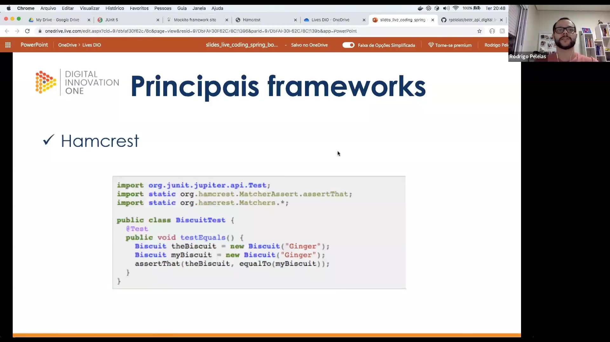
</p>

O **Hamcrest** é uma biblioteca de matchers que complementa os testes, tornando-os mais fluentes e legíveis, aproximando a escrita do código da linguagem natural. Ao utilizar o método `assertThat` em conjunto com matchers como `equalTo`, a intenção do teste torna-se muito mais clara do que nas asserções tradicionais.

```java
import org.junit.jupiter.api.Test;
import static org.hamcrest.MatcherAssert.assertThat;
import static org.hamcrest.Matchers.*;

public class BiscuitTest {
    @Test
    public void testEquals() {
        Biscuit theBiscuit = new Biscuit("Ginger");
        Biscuit myBiscuit = new Biscuit("Ginger");
        assertThat(theBiscuit, equalTo(myBiscuit));
    }
}
```

<p align="center">
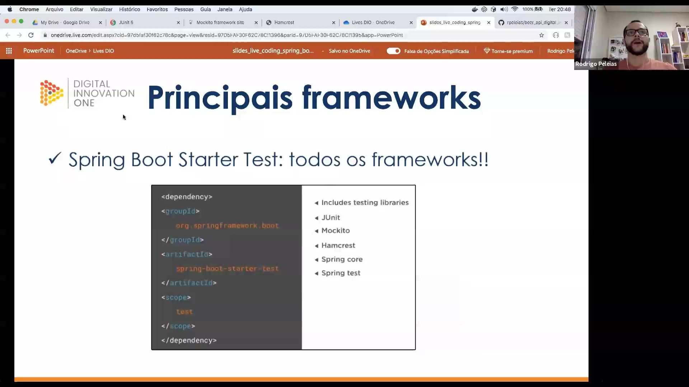
</p>

Para facilitar o gerenciamento de dependências, o ecossistema Spring Boot oferece o **spring-boot-starter-test**. Ao adicionar apenas esta dependência no arquivo de configuração do projeto (pom.xml), o desenvolvedor passa a ter acesso imediato a todas as ferramentas essenciais mencionadas anteriormente.

As bibliotecas incluídas automaticamente são:

* **JUnit:** Motor principal de execução.
* **Mockito:** Para criação de mocks.
* **Hamcrest:** Para asserções fluentes.
* **Spring Test & Spring Core:** Para suporte ao contexto do framework.

```xml
<dependency>
    <groupId>org.springframework.boot</groupId>
    <artifactId>spring-boot-starter-test</artifactId>
    <scope>test</scope>
</dependency>
```

### 🟩 Vídeo 07 - Revisando as dependências do arquivo pom.xml

<video width="60%" controls>
  <source src="000-Midia_e_Anexos/bootcamp_tqi_fullstack-modulo.07-curso.05-video_07.webm" type="video/webm">
    Seu navegador não suporta vídeo HTML5.
</video>

link do vídeo: https://web.dio.me/lab/desenvolvimento-de-testes-unitarios-para-validar-uma-api-rest-de-gerenciamento-estoques-de-cerveja/learning/ce86cba9-edcc-42e7-8707-59c147683b28

O vídeo aborda a configuração de ambientes de teste utilizando JUnit 5 e Mockito, a implementação de regras de negócio na camada de serviço e a otimização do código através do mapeamento automático com MapStruct.

### Anotações

<p align="center">
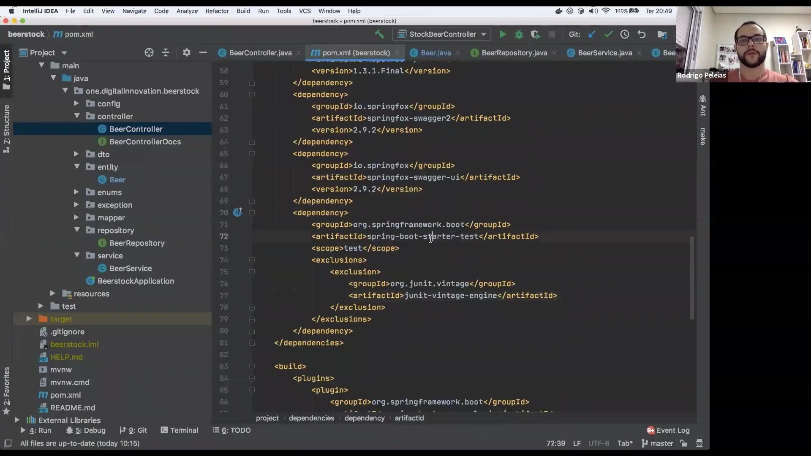
</p>

O projeto utiliza o `spring-boot-starter-test` como dependência base para a implementação de testes. Conforme configurado no `pom.xml`, o escopo é definido como `test` e há uma exclusão explícita do `junit-vintage-engine` para garantir que apenas o JUnit 5 (Jupiter) seja utilizado, removendo o suporte à versão 4.

```xml
<dependency>
    <groupId>org.springframework.boot</groupId>
    <artifactId>spring-boot-starter-test</artifactId>
    <scope>test</scope>
    <exclusions>
        <exclusion>
            <groupId>org.junit.vintage</groupId>
            <artifactId>junit-vintage-engine</artifactId>
        </exclusion>
    </exclusions>
</dependency>
```

<p align="center">
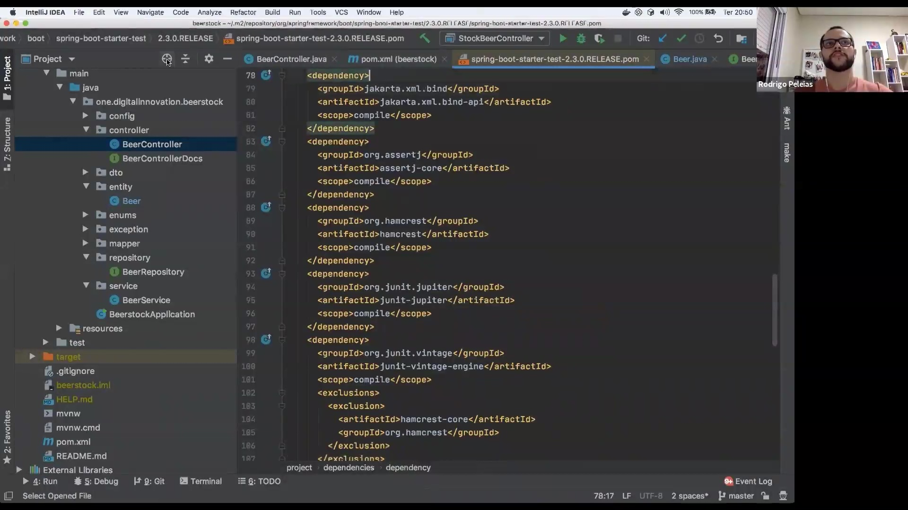
</p>

Ao detalhar as dependências internas do starter de teste do Spring Boot, observa-se a inclusão automática de bibliotecas fundamentais como Hamcrest, AssertJ e o próprio JUnit Jupiter (versão 5). Essas ferramentas fornecem os matchers e o framework necessários para a execução de testes unitários e de integração de forma padronizada.

<p align="center">
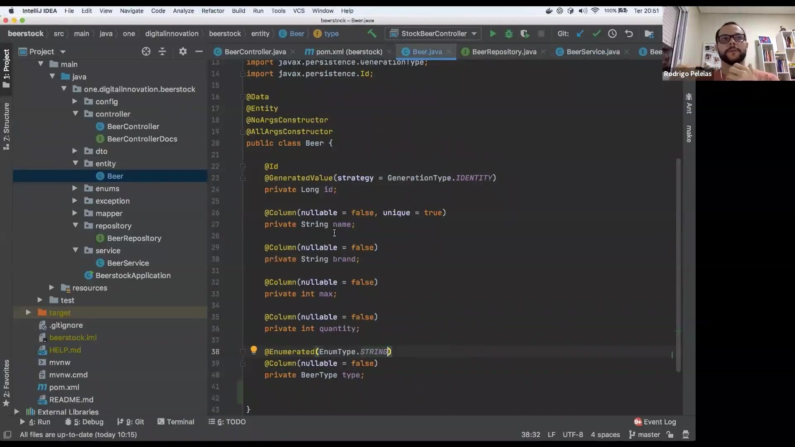
</p>

A entidade `Beer` representa a estrutura de dados no banco de dados. Ela utiliza anotações do Lombok (`@Data`, `@NoArgsConstructor`, `@AllArgsConstructor`) para reduzir a verbosidade e anotações JPA para o mapeamento objeto-relacional. O atributo `name` é marcado como único no banco de dados para evitar duplicidade.

```java
@Data
@Entity
@NoArgsConstructor
@AllArgsConstructor
public class Beer {

    @Id
    @GeneratedValue(strategy = GenerationType.IDENTITY)
    private Long id;

    @Column(nullable = false, unique = true)
    private String name;

    @Column(nullable = false)
    private String brand;

    @Column(nullable = false)
    private int max;

    @Column(nullable = false)
    private int quantity;

    @Enumerated(EnumType.STRING)
    @Column(nullable = false)
    private BeerType type;
}
```

<p align="center">
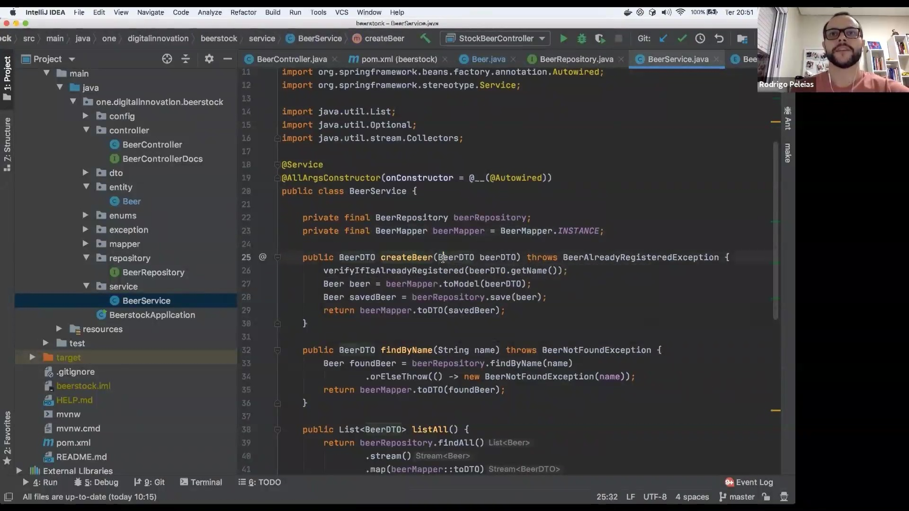
</p>

A classe `BeerService` contém a lógica de negócio do sistema. O método `createBeer` ilustra o fluxo de criação: primeiro valida se a cerveja já existe, depois converte o DTO em entidade usando o `beerMapper`, salva através do repositório e, por fim, retorna o objeto persistido convertido novamente em DTO.

```java
@Service
@AllArgsConstructor(onConstructor = @__(@Autowired))
public class BeerService {

    private final BeerRepository beerRepository;
    private final BeerMapper beerMapper = BeerMapper.INSTANCE;

    public BeerDTO createBeer(BeerDTO beerDTO) throws BeerAlreadyRegisteredException {
        verifyIfIsAlreadyRegistered(beerDTO.getName());
        Beer beer = beerMapper.toModel(beerDTO);
        Beer savedBeer = beerRepository.save(beer);
        return beerMapper.toDTO(savedBeer);
    }
}
```

<p align="center">
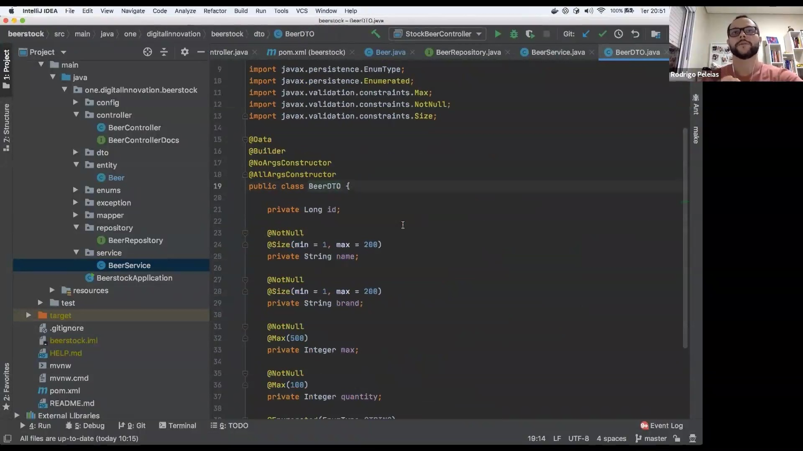
</p>

O `BeerDTO` (Data Transfer Object) é utilizado para validar os inputs de entrada antes que eles cheguem à entidade. Ele utiliza anotações do `javax.validation` como `@NotNull`, `@Size` e `@Max` para garantir que as regras de negócio básicas (como campos obrigatórios e limites de quantidade) sejam respeitadas logo na requisição.

```java
@Data
@Builder
@NoArgsConstructor
@AllArgsConstructor
public class BeerDTO {

    private Long id;

    @NotNull
    @Size(min = 1, max = 200)
    private String name;

    @NotNull
    @Size(min = 1, max = 200)
    private String brand;

    @NotNull
    @Max(500)
    private Integer max;

    @NotNull
    @Max(100)
    private Integer quantity;

    @Enumerated(EnumType.STRING)
    @NotNull
    private BeerType type;
}
```

<p align="center">
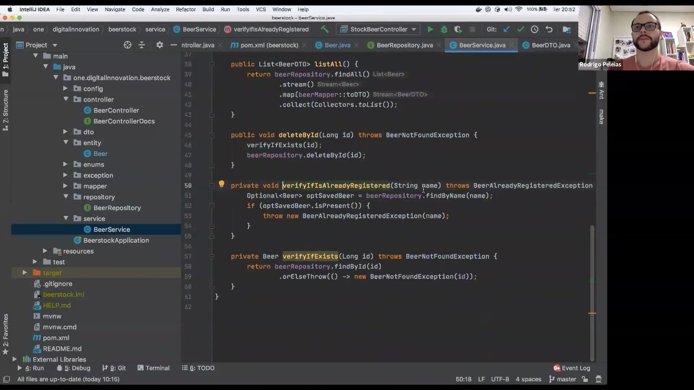
</p>

Além da criação, a `BeerService` implementa funcionalidades de listagem e deleção. O método `listAll` utiliza Streams do Java 8 para mapear todas as entidades encontradas no banco para DTOs, mantendo a separação entre a camada de persistência e a de apresentação.

```java
public List<BeerDTO> listAll() {
    return beerRepository.findAll().stream()
            .map(beerMapper::toDTO)
            .collect(Collectors.toList());
}

public void deleteById(Long id) throws BeerNotFoundException {
    verifyIfExists(id);
    beerRepository.deleteById(id);
}
```

<p align="center">
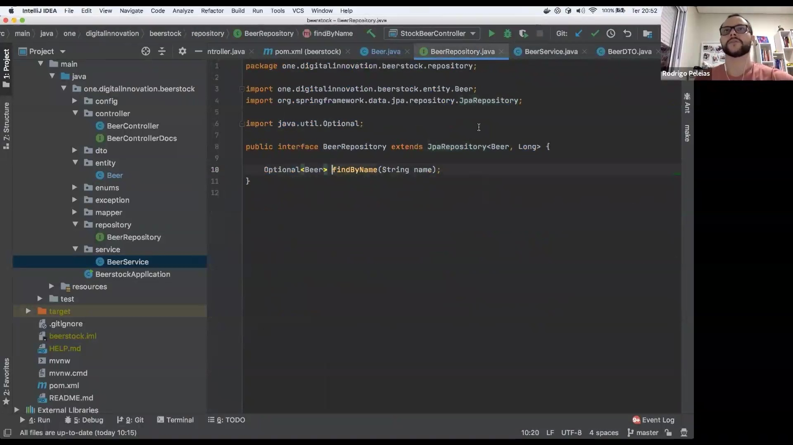
</p>

O `BeerRepository` estende `JpaRepository`, fornecendo operações padrão de CRUD. Foi adicionado o método customizado `findByName`, que retorna um `Optional<Beer>`, utilizado pela service para verificar a existência de registros duplicados pelo nome da cerveja.

```java
public interface BeerRepository extends JpaRepository<Beer, Long> {

    Optional<Beer> findByName(String name);
}
```

<p align="center">
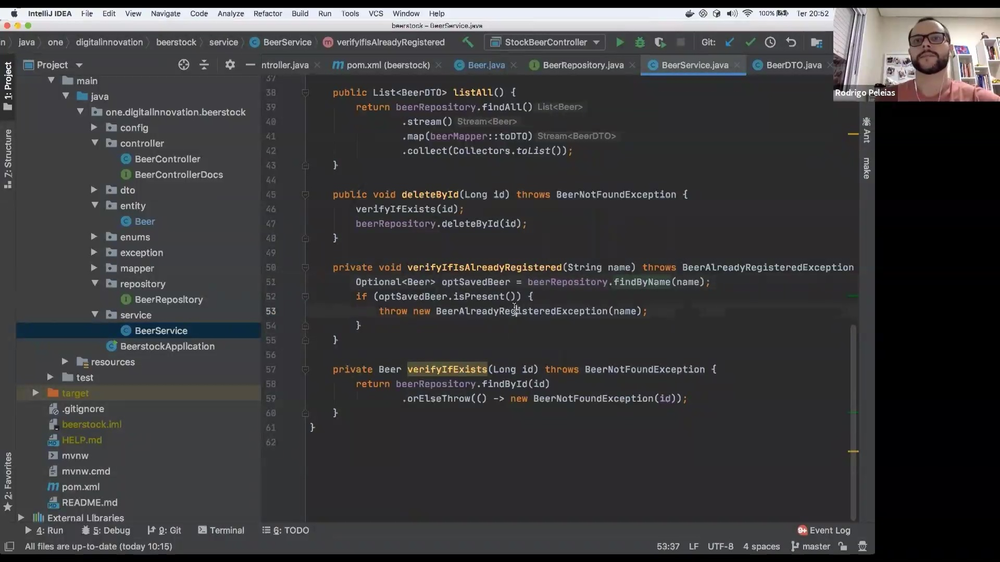
</p>

Dentro da `BeerService`, métodos privados auxiliam na validação de integridade. O `verifyIfIsAlreadyRegistered` consulta o repositório pelo nome e lança uma exceção caso o registro já exista. Já o `verifyIfExists` garante que operações de deleção ou busca por ID só ocorram se o registro for encontrado, disparando um erro caso contrário.

```java
private void verifyIfIsAlreadyRegistered(String name) throws BeerAlreadyRegisteredException {
    Optional<Beer> optSavedBeer = beerRepository.findByName(name);
    if (optSavedBeer.isPresent()) {
        throw new BeerAlreadyRegisteredException(name);
    }
}

private Beer verifyIfExists(Long id) throws BeerNotFoundException {
    return beerRepository.findById(id)
            .orElseThrow(() -> new BeerNotFoundException(id));
}
```

<p align="center">
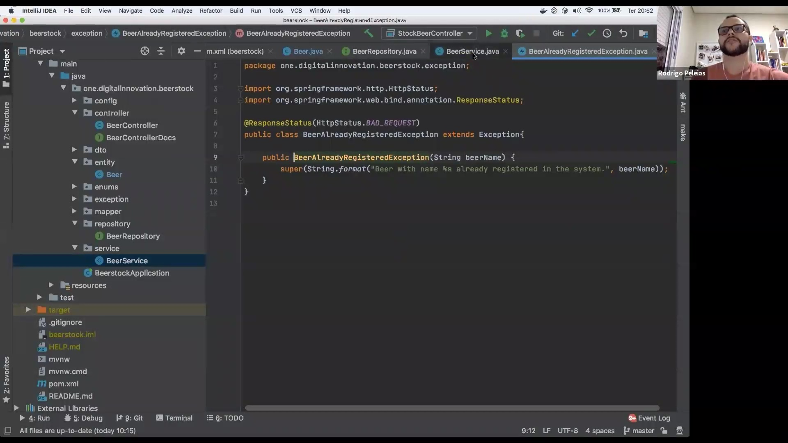
</p>

A exceção customizada `BeerAlreadyRegisteredException` é anotada com `@ResponseStatus(HttpStatus.BAD_REQUEST)`. Isso instrui o Spring Boot a retornar automaticamente o código de status HTTP 400 quando essa exceção for lançada, padronizando a resposta de erro para o cliente da API.

```java
@ResponseStatus(HttpStatus.BAD_REQUEST)
public class BeerAlreadyRegisteredException extends Exception {

    public BeerAlreadyRegisteredException(String beerName) {
        super(String.format("Beer with name %s already registered in the system.", beerName));
    }
}
```

<p align="center">
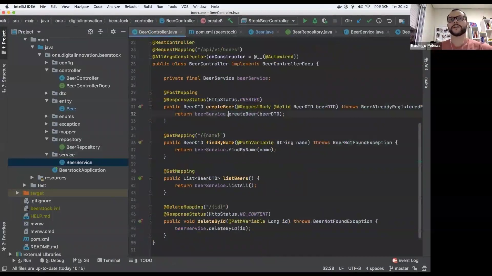
</p>

O `BeerController` expõe os endpoints REST da aplicação. Ele delega as chamadas para a `BeerService` e utiliza anotações como `@PostMapping`, `@GetMapping` e `@DeleteMapping` para mapear os verbos HTTP. A anotação `@Valid` no método de criação garante que as restrições definidas no DTO sejam verificadas.

```java
@RestController
@RequestMapping("/api/v1/beers")
@AllArgsConstructor(onConstructor = @__(@Autowired))
public class BeerController {

    private final BeerService beerService;

    @PostMapping
    @ResponseStatus(HttpStatus.CREATED)
    public BeerDTO createBeer(@RequestBody @Valid BeerDTO beerDTO) throws BeerAlreadyRegisteredException {
        return beerService.createBeer(beerDTO);
    }
    
    // ... outros métodos mapeados
}
```

<p align="center">
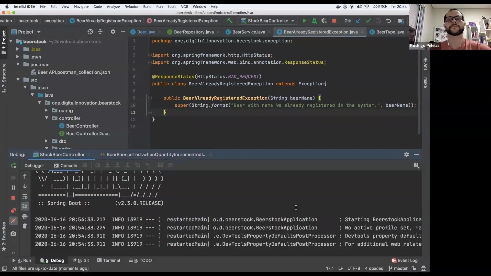
</p>

Para validar manualmente a API antes da automação dos testes, utiliza-se o Postman. Na imagem, observa-se a configuração de uma requisição `POST` com um corpo JSON contendo os dados da cerveja "Colorado", simulando o preenchimento de campos obrigatórios como marca, quantidade máxima e tipo.

<p align="center">
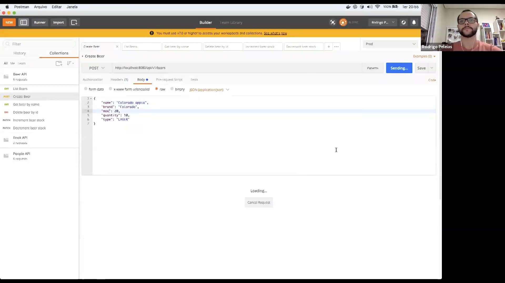
</p>

A execução da requisição no Postman resulta em sucesso, retornando o status `201 Created`. O corpo da resposta exibe a cerveja criada com um `id` gerado pelo sistema (ID 1), confirmando que o fluxo completo, desde a controller até a persistência no banco de dados, está operante.

<p align="center">
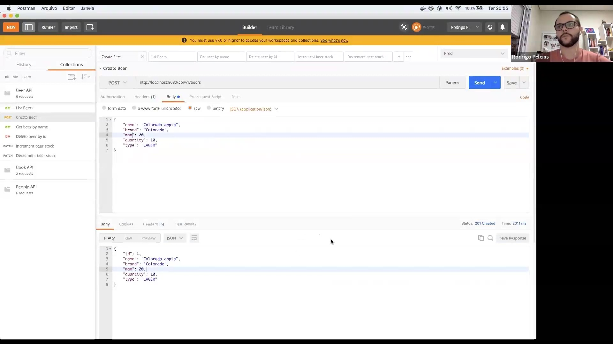
</p>

Ao tentar cadastrar novamente a mesma cerveja ("Colorado"), a API retorna `400 Bad Request`. A mensagem de erro detalha que a cerveja já está registrada, validando na prática o funcionamento da exceção `BeerAlreadyRegisteredException` e da lógica de verificação implementada na service.

<p align="center">
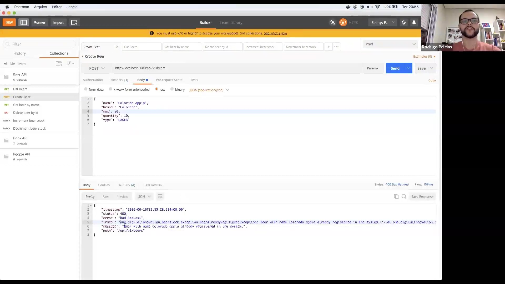
</p>

A estrutura do projeto para testes é organizada dentro da pasta `src/test/java`. Segue-se a mesma estrutura de pacotes da aplicação principal para facilitar a localização e a injeção de dependências durante a execução dos testes unitários com JUnit.

<p align="center">
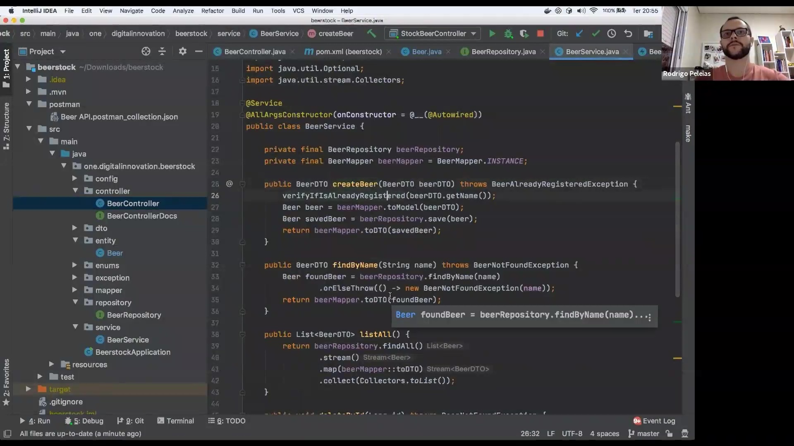
</p>

A classe `BeerServiceTest` é inicializada com a anotação `@ExtendWith(MockitoExtension.class)`. Essa configuração informa ao JUnit que os testes utilizarão a extensão do Mockito para gerenciar a criação de objetos simulados (mocks), permitindo isolar a classe `BeerService` de suas dependências reais.

```java
@ExtendWith(MockitoExtension.class)
public class BeerServiceTest {

    @Mock
    private BeerRepository beerRepository;

    private BeerMapper beerMapper = BeerMapper.INSTANCE;

    @InjectMocks
    private BeerService beerService;
}
```

<p align="center">
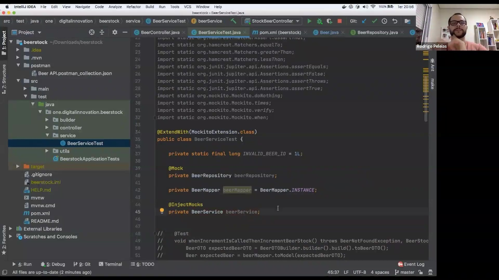
</p>

No contexto do teste, `@Mock` cria uma versão dublê do `BeerRepository`, enquanto `@InjectMocks` garante que esse mock seja injetado automaticamente na instância de `BeerService` que está sendo testada. Isso permite simular o comportamento do banco de dados sem a necessidade de uma conexão real.

<p align="center">
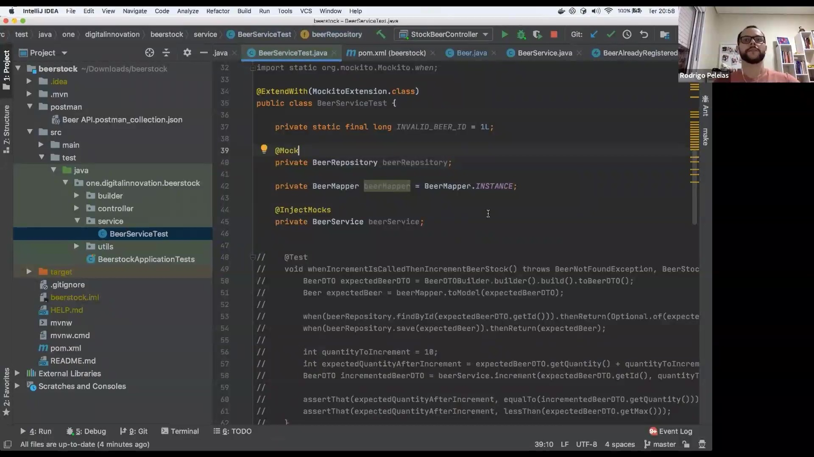
</p>

O `BeerMapper` é uma interface que utiliza a biblioteca MapStruct para automatizar a conversão entre DTOs e entidades. A anotação `@Mapper` sinaliza que o framework deve gerar a implementação dessa interface durante o processo de compilação.

```java
@Mapper
public interface BeerMapper {

    BeerMapper INSTANCE = Mappers.getMapper(BeerMapper.class);

    Beer toModel(BeerDTO beerDTO);

    BeerDTO toDTO(Beer beer);
}
```

<p align="center">
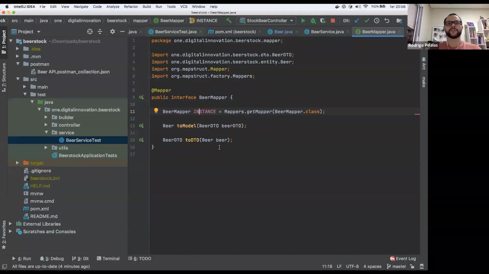
</p>

O uso do mapper resolve o problema de verbosidade no código. Em vez de realizar múltiplos `setID`, `setName`, etc., manualmente para cada conversão, os métodos `toModel` e `toDTO` realizam o mapeamento de todos os atributos correspondentes de forma automática e performática.

<p align="center">
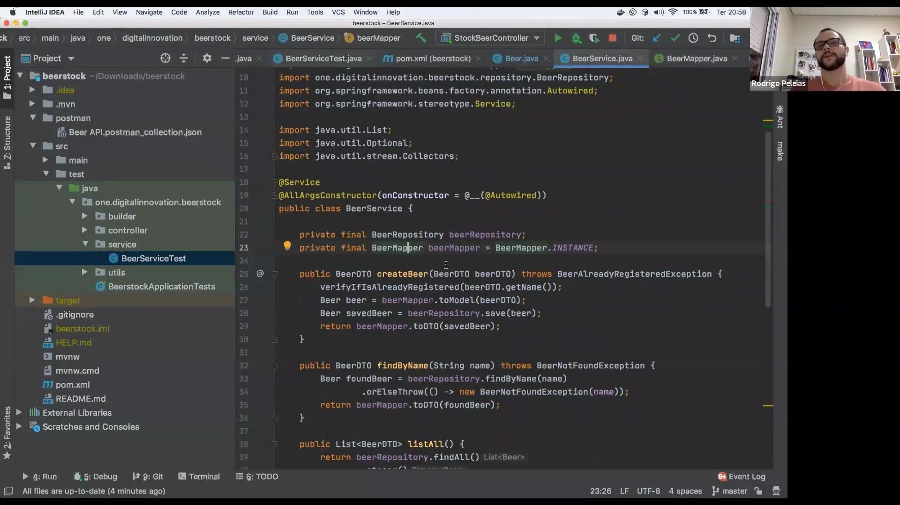
</p>

Para que o MapStruct funcione corretamente com o Lombok, é necessário configurar o `maven-compiler-plugin` no `pom.xml`. Adicionam-se os caminhos dos processadores de anotação (`annotationProcessorPaths`) tanto para o Lombok quanto para o `mapstruct-processor`, permitindo que ambos coexistam e gerem código durante a build.

```xml
<plugin>
    <groupId>org.apache.maven.plugins</groupId>
    <artifactId>maven-compiler-plugin</artifactId>
    <configuration>
        <annotationProcessorPaths>
            <path>
                <groupId>org.projectlombok</groupId>
                <artifactId>lombok</artifactId>
                <version>${lombok.version}</version>
            </path>
            <path>
                <groupId>org.mapstruct</groupId>
                <artifactId>mapstruct-processor</artifactId>
                <version>1.3.1.Final</version>
            </path>
        </annotationProcessorPaths>
    </configuration>
</plugin>
```      

### 🟩 Vídeo 08 - Testando os métodos das classes BeerService e BeerController - parte 1

<video width="60%" controls>
  <source src="000-Midia_e_Anexos/bootcamp_tqi_fullstack-modulo.07-curso.05-video_08.webm" type="video/webm">
    Seu navegador não suporta vídeo HTML5.
</video>

link do vídeo: https://web.dio.me/lab/desenvolvimento-de-testes-unitarios-para-validar-uma-api-rest-de-gerenciamento-estoques-de-cerveja/learning/a8bc625a-5f37-40c2-a310-90221d3bacb7

O vĩdeo descreve o processo de criação de um teste unitário para a camada de serviço (BeerService) em uma aplicação Java, utilizando ferramentas modernas como JUnit, Mockito e Lombok. O foco é garantir que, ao informar os dados de uma nova cerveja, ela seja criada e salva corretamente no sistema.

### Anotações

<p align="center">
  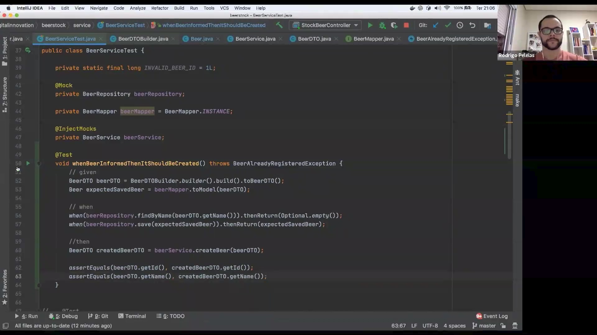
</p>

Nesta etapa, é demonstrada a construção do primeiro teste unitário para o serviço de cervejas, focando no cenário onde uma nova cerveja é cadastrada com sucesso. O método de teste utiliza o padrão de nomenclatura `whenBeerInformedThenItShouldBeCreated`, seguindo a convenção de comportamento (quando algo acontece, então este deve ser o resultado).

Para facilitar a criação dos objetos de teste, é utilizado o padrão **Builder** através da classe `BeerDTOBuilder`, que permite instanciar um `BeerDTO` com dados pré-definidos (como a marca "Brahma" e o tipo "Lager") de forma fluente. A lógica de teste segue a estrutura:

1. **Given (Dado):** Preparação dos dados de entrada (`BeerDTO`) e a conversão para a entidade de modelo (`Beer`) utilizando um Mapper.
2. **When (Quando):** Configuração do comportamento dos Mocks. O `beerRepository.findByName` é instruído a retornar um `Optional` vazio (indicando que a cerveja não existe) e o `beerRepository.save` é configurado para retornar o objeto esperado.
3. **Then (Então):** Execução da chamada ao método `createBeer` da service e a validação dos resultados através de `assertEquals`, garantindo que o ID e o nome da cerveja retornada correspondam aos dados enviados.

```java
@Test
void whenBeerInformedThenItShouldBeCreated() throws BeerAlreadyRegisteredException {
    // given
    BeerDTO beerDTO = BeerDTOBuilder.builder().build().toBeerDTO();
    Beer expectedSavedBeer = beerMapper.toModel(beerDTO);

    // when
    when(beerRepository.findByName(beerDTO.getName())).thenReturn(Optional.empty());
    when(beerRepository.save(expectedSavedBeer)).thenReturn(expectedSavedBeer);

    // then
    BeerDTO createdBeerDTO = beerService.createBeer(beerDTO);

    assertEquals(beerDTO.getId(), createdBeerDTO.getId());
    assertEquals(beerDTO.getName(), createdBeerDTO.getName());
}
```

### 🟩 Vídeo 09 - Testando os métodos das classes BeerService e BeerController - parte 2

<video width="60%" controls>
  <source src="000-Midia_e_Anexos/bootcamp_tqi_fullstack-modulo.07-curso.05-video_09.webm" type="video/webm">
    Seu navegador não suporta vídeo HTML5.
</video>

link do vídeo: https://web.dio.me/lab/desenvolvimento-de-testes-unitarios-para-validar-uma-api-rest-de-gerenciamento-estoques-de-cerveja/learning/9dca85b1-ba31-4dd9-bb88-f3d074e5d50d

O vídeo demonstra como aprimorar a qualidade e a legibilidade de testes unitários em Java. O instrutor guia o espectador através de um processo de depuração (debug), simulação de dependências com Mockito e a transição de asserções tradicionais do JUnit para uma sintaxe mais fluente e expressiva utilizando a biblioteca Hamcrest.

### Anotações

Nesta etapa, o foco recai sobre a garantia de que o método de criação de cerveja está sendo retornado com sucesso. Para observar o comportamento detalhado do fluxo, prepara-se a execução do teste unitário `whenBeerInformedThenItShouldBeCreated` utilizando a ferramenta de *debugger* da IDE, permitindo uma análise linha a linha.

Com o *debugger* ativo e a execução pausada no *breakpoint*, é possível inspecionar a interação dos *mocks*. O objeto `beerDTO` aparece totalmente preenchido com os dados de teste. Este momento é crucial para validar se os dados de entrada estão corretos antes de passarem pela lógica de conversão do MapStruct.

Na inspeção de variáveis, observa-se a "magia" do MapStruct: o objeto `beerDTO` é convertido com sucesso para a entidade `expectedSavedBeer`. O painel do *debugger* mostra que as instâncias do repositório e do mapeador são *proxies* gerenciados pelo Mockito, garantindo que o teste permaneça isolado de dependências externas reais.

```java
// given
BeerDTO beerDTO = BeerDTOBuilder.builder().build().toBeerDTO();
Beer expectedSavedBeer = beerMapper.toModel(beerDTO);
```

Ainda sob depuração, define-se o comportamento das simulações (bloco `// when`). Através do método `when`, o repositório é instruído a retornar um `Optional.empty()` ao buscar pelo nome da cerveja (simulando que ela não existe) e a retornar a própria entidade preenchida quando o método `save` for invocado.

```java
// when
when(beerRepository.findByName(beerDTO.getName())).thenReturn(Optional.empty());
when(beerRepository.save(expectedSavedBeer)).thenReturn(expectedSavedBeer);
```

O fluxo de execução entra na classe `BeerService`. O primeiro passo da lógica de negócio é invocar `verifyIfIsAlreadyRegistered`. O *debugger* mostra o sistema consultando o repositório *mocado*; como nenhum registro é encontrado, o código prossegue normalmente sem lançar a exceção de duplicidade.

Concluída a validação de existência, o serviço mapeia o DTO para a entidade, chama o `save` do repositório e converte o resultado de volta para DTO. Este teste de nível de código valida se todo o encadeamento de chamadas e conversões entre as camadas de serviço e persistência está operando conforme o esperado.

```java
public BeerDTO createBeer(BeerDTO beerDTO) throws BeerAlreadyRegisteredException {
    verifyIfIsAlreadyRegistered(beerDTO.getName());
    Beer beer = beerMapper.toModel(beerDTO);
    Beer savedBeer = beerRepository.save(beer);
    return beerMapper.toDTO(savedBeer);
}
```

Ao retornar para a classe de teste, as asserções finais são executadas. Embora o uso de `assertEquals` do JUnit funcione para validar o ID e o nome, nota-se que a legibilidade pode ser melhorada. Isso introduz a necessidade de utilizar bibliotecas que permitam asserções mais fluentes, como o Hamcrest.

O código é refatorado para utilizar o Hamcrest, tornando as verificações muito mais próximas da linguagem natural. Substitui-se o padrão do JUnit pelo `assertThat` combinado com os matchers `is` e `equalTo`. Além disso, a variável é renomeada para `expectedBeerDTO` para dar maior clareza semântica ao que está sendo comparado.

```java
// then
BeerDTO createdBeerDTO = beerService.createBeer(expectedBeerDTO);

assertThat(createdBeerDTO.getId(), is(equalTo(expectedBeerDTO.getId())));
assertThat(createdBeerDTO.getName(), is(equalTo(expectedBeerDTO.getName())));
assertThat(createdBeerDTO.getQuantity(), is(equalTo(expectedBeerDTO.getQuantity())));
```

A execução dos testes com Hamcrest confirma o sucesso ("Tests passed: 1"). A estrutura agora reflete claramente o padrão BDD (*Behavior Driven Development*), dividindo o teste visualmente em "Dado que" (given), "Quando" (when) e "Então" (then), o que facilita a manutenção e o entendimento do propósito do teste.

Para demonstrar a versatilidade do Hamcrest, adiciona-se uma validação lógica. Além da igualdade, utiliza-se o matcher `greaterThan` para verificar se a quantidade de cervejas criada é maior do que um valor específico (neste caso, 2). Isso exemplifica como criar testes mais robustos e expressivos com pouco esforço.

```java
assertThat(createdBeerDTO.getQuantity(), is(greaterThan(2)));
```      

### 🟩 Vídeo 10 - Testando os métodos das classes BeerService e BeerController - parte 3

<video width="60%" controls>
  <source src="000-Midia_e_Anexos/bootcamp_tqi_fullstack-modulo.07-curso.05-video_10.webm" type="video/webm">
    Seu navegador não suporta vídeo HTML5.
</video>

link do vídeo: https://web.dio.me/lab/desenvolvimento-de-testes-unitarios-para-validar-uma-api-rest-de-gerenciamento-estoques-de-cerveja/learning/3ed42823-3f3f-4b14-9844-b0990256823f


### 🟩 Vídeo 11 - Testando os métodos das classes BeerService e BeerController - parte 4

<video width="60%" controls>
  <source src="000-Midia_e_Anexos/bootcamp_tqi_fullstack-modulo.07-curso.05-video_11.webm" type="video/webm">
    Seu navegador não suporta vídeo HTML5.
</video>

link do vídeo:

### 🟩 Vídeo 12 - Testando os métodos das classes BeerService e BeerController - parte 5

<video width="60%" controls>
  <source src="000-Midia_e_Anexos/bootcamp_tqi_fullstack-modulo.07-curso.05-video_12.webm" type="video/webm">
    Seu navegador não suporta vídeo HTML5.
</video>

link do vídeo:

### 🟩 Vídeo 13 - Testando os métodos das classes BeerService e BeerController - parte 6

<video width="60%" controls>
  <source src="000-Midia_e_Anexos/bootcamp_tqi_fullstack-modulo.07-curso.05-video_13.webm" type="video/webm">
    Seu navegador não suporta vídeo HTML5.
</video>

link do vídeo:

### 🟩 Vídeo 14 - Testando os métodos das classes BeerService e BeerController - parte 7

<video width="60%" controls>
  <source src="000-Midia_e_Anexos/bootcamp_tqi_fullstack-modulo.07-curso.05-video_14.webm" type="video/webm">
    Seu navegador não suporta vídeo HTML5.
</video>

link do vídeo:

### 🟩 Vídeo 15 - Testando os métodos das classes BeerService e BeerController - parte 8

<video width="60%" controls>
  <source src="000-Midia_e_Anexos/bootcamp_tqi_fullstack-modulo.07-curso.05-video_15.webm" type="video/webm">
    Seu navegador não suporta vídeo HTML5.
</video>

link do vídeo:

### 🟩 Vídeo 16 - Testando os métodos das classes BeerService e BeerController - parte 9

<video width="60%" controls>
  <source src="000-Midia_e_Anexos/bootcamp_tqi_fullstack-modulo.07-curso.05-video_16.webm" type="video/webm">
    Seu navegador não suporta vídeo HTML5.
</video>

link do vídeo:

### 🟩 Vídeo 17 - Testando os métodos das classes BeerService e BeerController - parte 10

<video width="60%" controls>
  <source src="000-Midia_e_Anexos/bootcamp_tqi_fullstack-modulo.07-curso.05-video_17.webm" type="video/webm">
    Seu navegador não suporta vídeo HTML5.
</video>

link do vídeo:

### 🟩 Vídeo 18 - Testando os métodos das classes BeerService e BeerController - parte 11

<video width="60%" controls>
  <source src="000-Midia_e_Anexos/bootcamp_tqi_fullstack-modulo.07-curso.05-video_18.webm" type="video/webm">
    Seu navegador não suporta vídeo HTML5.
</video>

link do vídeo:

### 🟩 Vídeo 19 - Testando os métodos das classes BeerService e BeerController - parte 12

<video width="60%" controls>
  <source src="000-Midia_e_Anexos/bootcamp_tqi_fullstack-modulo.07-curso.05-video_19.webm" type="video/webm">
    Seu navegador não suporta vídeo HTML5.
</video>

link do vídeo:

### 🟩 Vídeo 20 - Testando os métodos das classes BeerService e BeerController - parte 13

<video width="60%" controls>
  <source src="000-Midia_e_Anexos/bootcamp_tqi_fullstack-modulo.07-curso.05-video_20.webm" type="video/webm">
    Seu navegador não suporta vídeo HTML5.
</video>

link do vídeo:

### 🟩 Vídeo 21 - Testando os métodos das classes BeerService e BeerController - parte 14

<video width="60%" controls>
  <source src="000-Midia_e_Anexos/bootcamp_tqi_fullstack-modulo.07-curso.05-video_21.webm" type="video/webm">
    Seu navegador não suporta vídeo HTML5.
</video>

link do vídeo:

### 🟩 Vídeo 22 - Finalizando o curso e explicando os testes comentados no GitHub

<video width="60%" controls>
  <source src="000-Midia_e_Anexos/bootcamp_tqi_fullstack-modulo.07-curso.05-video_22.webm" type="video/webm">
    Seu navegador não suporta vídeo HTML5.
</video>

link do vídeo:

### 🟩 Vídeo 23 - Objetivo do projeto

<video width="60%" controls>
  <source src="000-Midia_e_Anexos/bootcamp_tqi_fullstack-modulo.07-curso.05-video_23.webm" type="video/webm">
    Seu navegador não suporta vídeo HTML5.
</video>

link do vídeo:

# Certificado: 

- Link na plataforma: 
- Certificado em pdf: