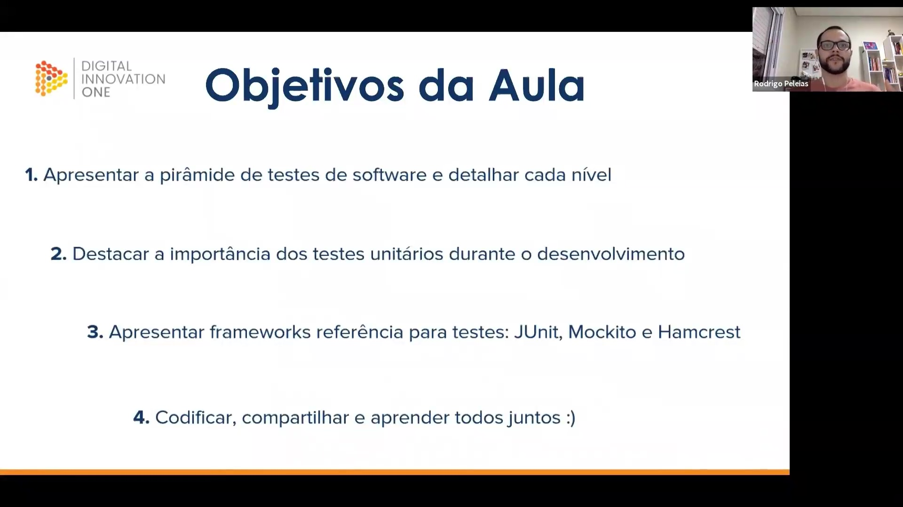
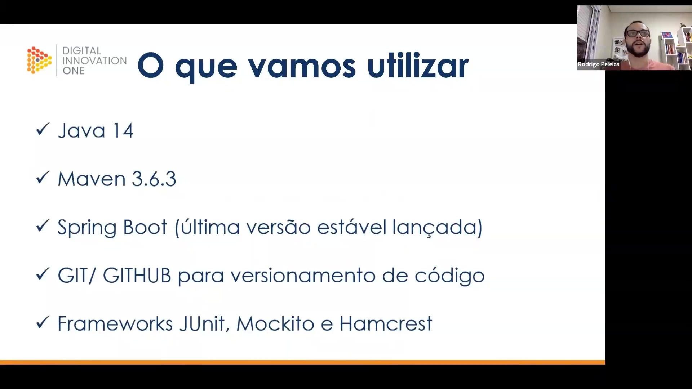
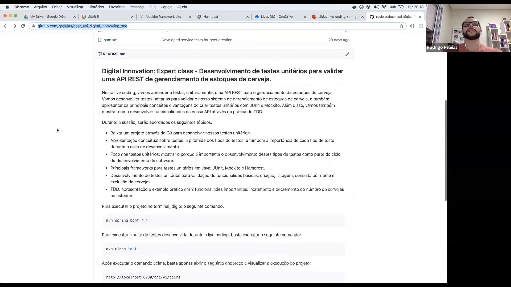

## Instrutor

- Rodrigo D'Agostini Peleias (Tech Lead | Staff Software Engineer | Senior Software Engineer | Backend | Java | Spring Boot | 3x AWS Certified)
- Contato Linkedin: / [rodrigopeleias](https://www.linkedin.com/in/rodrigopeleias/)

## Parte 1 - Testes Unitários e Qualidade de Software

### 🟩 Vídeo 01 - Como usar os desafios de projetos para criar seu portfólio

<video width="60%" controls>
  <source src="000-Midia_e_Anexos/bootcamp_tqi_fullstack-modulo.07-curso.05-video_01.webm" type="video/webm">
    Seu navegador não suporta vídeo HTML5.
</video>

link do vídeo: https://web.dio.me/lab/desenvolvimento-de-testes-unitarios-para-validar-uma-api-rest-de-gerenciamento-estoques-de-cerveja/learning/d00f891f-65bb-4149-85f0-57d771116214?back=/track/tqi-fullstack-developer

O vídeo detalha a importância, a execução e a entrega de projetos práticos dentro da plataforma DIO, destacando como essas atividades aceleram a carreira de um desenvolvedor através da criação de um portfólio sólido e da participação em um ecossistema gamificado.
 

### 🟩 Vídeo 02 - Objetivos do curso e apresentação do repositório no GitHub

<video width="60%" controls>
  <source src="000-Midia_e_Anexos/bootcamp_tqi_fullstack-modulo.07-curso.05-video_02.webm" type="video/webm">
    Seu navegador não suporta vídeo HTML5.
</video>

link do vídeo: https://web.dio.me/lab/desenvolvimento-de-testes-unitarios-para-validar-uma-api-rest-de-gerenciamento-estoques-de-cerveja/learning/a28d07c7-0d18-4986-bd96-d448d7ec05ba

Este guia resume a aula sobre a pirâmide de testes de software, com foco especial em testes unitários, frameworks essenciais do ecossistema Java e a configuração de um ambiente de desenvolvimento moderno para a criação de uma API de Cervejas (Beer API).

### Anotações

Esta sessão inicial define os objetivos principais para o aprendizado de testes em Java:

* **Pirâmide de Testes**: Apresentação detalhada de cada nível da pirâmide de testes de software.
* **Qualidade e Desenvolvimento**: Ênfase na importância dos testes unitários durante o processo de desenvolvimento.
* **Ferramentas**: Introdução aos frameworks JUnit, Mockito e Hamcrest.
* **Colaboração**: Prática de codificação compartilhada para aprendizado conjunto.

A stack tecnológica necessária para acompanhar o desenvolvimento do projeto inclui as seguintes ferramentas:

* **Java**: Versão 14.
* **Maven**: Versão 3.6.3.
* **Spring Boot**: Utilização da última versão estável disponível.
* **Versionamento**: Uso de GIT e GITHUB para controle de código.
* **Frameworks de Teste**: JUnit, Mockito e Hamcrest.

O projeto prático consiste no desenvolvimento de testes unitários para validar uma API REST voltada ao gerenciamento de estoques de cerveja. Durante a sessão, são aplicados conceitos de TDD para funcionalidades de incremento e decremento de itens no sistema.

Após a execução, a listagem de cervejas pode ser acessada através do endpoint local `http://localhost:8080/api/v1/beers`.

### 🟩 Vídeo 03 - Apresentação do Projeto no IntelliJ

<video width="60%" controls>
  <source src="000-Midia_e_Anexos/bootcamp_tqi_fullstack-modulo.07-curso.05-video_03.webm" type="video/webm">
    Seu navegador não suporta vídeo HTML5.
</video>

link do vídeo: https://web.dio.me/lab/desenvolvimento-de-testes-unitarios-para-validar-uma-api-rest-de-gerenciamento-estoques-de-cerveja/learning/f1ea7b4a-ddb4-406c-8951-b391763b8a01

### 🟩 Vídeo 04 - Introdução ao estilo arquitetural REST

<video width="60%" controls>
  <source src="000-Midia_e_Anexos/bootcamp_tqi_fullstack-modulo.07-curso.05-video_04.webm" type="video/webm">
    Seu navegador não suporta vídeo HTML5.
</video>

link do vídeo:

### 🟩 Vídeo 05 - Pirâmide de testes

<video width="60%" controls>
  <source src="000-Midia_e_Anexos/bootcamp_tqi_fullstack-modulo.07-curso.05-video_05.webm" type="video/webm">
    Seu navegador não suporta vídeo HTML5.
</video>

link do vídeo:

### 🟩 Vídeo 06 - Frameworks de testes unitários

<video width="60%" controls>
  <source src="000-Midia_e_Anexos/bootcamp_tqi_fullstack-modulo.07-curso.05-video_06.webm" type="video/webm">
    Seu navegador não suporta vídeo HTML5.
</video>

link do vídeo:

### 🟩 Vídeo 07 - Revisando as dependências do arquivo pom.xml

<video width="60%" controls>
  <source src="000-Midia_e_Anexos/bootcamp_tqi_fullstack-modulo.07-curso.05-video_07.webm" type="video/webm">
    Seu navegador não suporta vídeo HTML5.
</video>

link do vídeo:

### 🟩 Vídeo 08 - Testando os métodos das classes BeerService e BeerController - parte 1

<video width="60%" controls>
  <source src="000-Midia_e_Anexos/bootcamp_tqi_fullstack-modulo.07-curso.05-video_08.webm" type="video/webm">
    Seu navegador não suporta vídeo HTML5.
</video>

link do vídeo:

### 🟩 Vídeo 09 - Testando os métodos das classes BeerService e BeerController - parte 2

<video width="60%" controls>
  <source src="000-Midia_e_Anexos/bootcamp_tqi_fullstack-modulo.07-curso.05-video_09.webm" type="video/webm">
    Seu navegador não suporta vídeo HTML5.
</video>

link do vídeo:

### 🟩 Vídeo 10 - Testando os métodos das classes BeerService e BeerController - parte 3

<video width="60%" controls>
  <source src="000-Midia_e_Anexos/bootcamp_tqi_fullstack-modulo.07-curso.05-video_10.webm" type="video/webm">
    Seu navegador não suporta vídeo HTML5.
</video>

link do vídeo:

### 🟩 Vídeo 11 - Testando os métodos das classes BeerService e BeerController - parte 4

<video width="60%" controls>
  <source src="000-Midia_e_Anexos/bootcamp_tqi_fullstack-modulo.07-curso.05-video_11.webm" type="video/webm">
    Seu navegador não suporta vídeo HTML5.
</video>

link do vídeo:

### 🟩 Vídeo 12 - Testando os métodos das classes BeerService e BeerController - parte 5

<video width="60%" controls>
  <source src="000-Midia_e_Anexos/bootcamp_tqi_fullstack-modulo.07-curso.05-video_12.webm" type="video/webm">
    Seu navegador não suporta vídeo HTML5.
</video>

link do vídeo:

### 🟩 Vídeo 13 - Testando os métodos das classes BeerService e BeerController - parte 6

<video width="60%" controls>
  <source src="000-Midia_e_Anexos/bootcamp_tqi_fullstack-modulo.07-curso.05-video_13.webm" type="video/webm">
    Seu navegador não suporta vídeo HTML5.
</video>

link do vídeo:

### 🟩 Vídeo 14 - Testando os métodos das classes BeerService e BeerController - parte 7

<video width="60%" controls>
  <source src="000-Midia_e_Anexos/bootcamp_tqi_fullstack-modulo.07-curso.05-video_14.webm" type="video/webm">
    Seu navegador não suporta vídeo HTML5.
</video>

link do vídeo:

### 🟩 Vídeo 15 - Testando os métodos das classes BeerService e BeerController - parte 8

<video width="60%" controls>
  <source src="000-Midia_e_Anexos/bootcamp_tqi_fullstack-modulo.07-curso.05-video_15.webm" type="video/webm">
    Seu navegador não suporta vídeo HTML5.
</video>

link do vídeo:

### 🟩 Vídeo 16 - Testando os métodos das classes BeerService e BeerController - parte 9

<video width="60%" controls>
  <source src="000-Midia_e_Anexos/bootcamp_tqi_fullstack-modulo.07-curso.05-video_16.webm" type="video/webm">
    Seu navegador não suporta vídeo HTML5.
</video>

link do vídeo:

### 🟩 Vídeo 17 - Testando os métodos das classes BeerService e BeerController - parte 10

<video width="60%" controls>
  <source src="000-Midia_e_Anexos/bootcamp_tqi_fullstack-modulo.07-curso.05-video_17.webm" type="video/webm">
    Seu navegador não suporta vídeo HTML5.
</video>

link do vídeo:

### 🟩 Vídeo 18 - Testando os métodos das classes BeerService e BeerController - parte 11

<video width="60%" controls>
  <source src="000-Midia_e_Anexos/bootcamp_tqi_fullstack-modulo.07-curso.05-video_18.webm" type="video/webm">
    Seu navegador não suporta vídeo HTML5.
</video>

link do vídeo:

### 🟩 Vídeo 19 - Testando os métodos das classes BeerService e BeerController - parte 12

<video width="60%" controls>
  <source src="000-Midia_e_Anexos/bootcamp_tqi_fullstack-modulo.07-curso.05-video_19.webm" type="video/webm">
    Seu navegador não suporta vídeo HTML5.
</video>

link do vídeo:

### 🟩 Vídeo 20 - Testando os métodos das classes BeerService e BeerController - parte 13

<video width="60%" controls>
  <source src="000-Midia_e_Anexos/bootcamp_tqi_fullstack-modulo.07-curso.05-video_20.webm" type="video/webm">
    Seu navegador não suporta vídeo HTML5.
</video>

link do vídeo:

### 🟩 Vídeo 21 - Testando os métodos das classes BeerService e BeerController - parte 14

<video width="60%" controls>
  <source src="000-Midia_e_Anexos/bootcamp_tqi_fullstack-modulo.07-curso.05-video_21.webm" type="video/webm">
    Seu navegador não suporta vídeo HTML5.
</video>

link do vídeo:

### 🟩 Vídeo 22 - Finalizando o curso e explicando os testes comentados no GitHub

<video width="60%" controls>
  <source src="000-Midia_e_Anexos/bootcamp_tqi_fullstack-modulo.07-curso.05-video_22.webm" type="video/webm">
    Seu navegador não suporta vídeo HTML5.
</video>

link do vídeo:

### 🟩 Vídeo 23 - Objetivo do projeto

<video width="60%" controls>
  <source src="000-Midia_e_Anexos/bootcamp_tqi_fullstack-modulo.07-curso.05-video_23.webm" type="video/webm">
    Seu navegador não suporta vídeo HTML5.
</video>

link do vídeo:

# Certificado: 

- Link na plataforma: 
- Certificado em pdf: